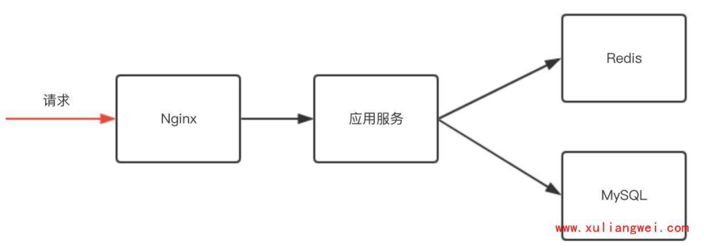
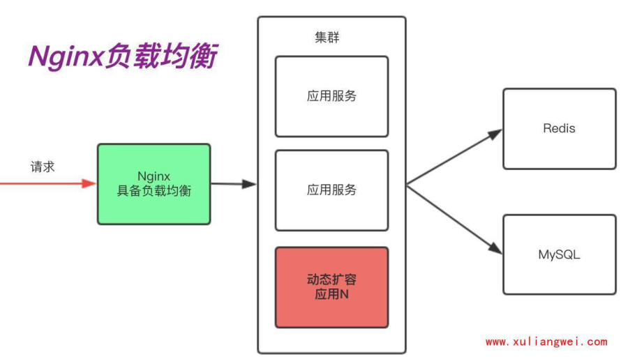
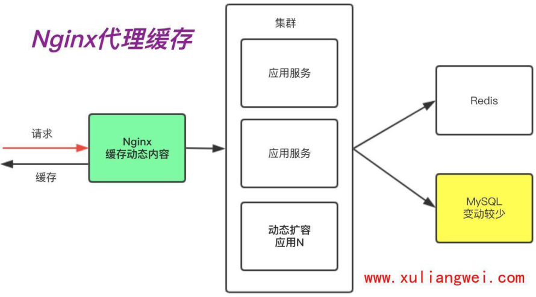
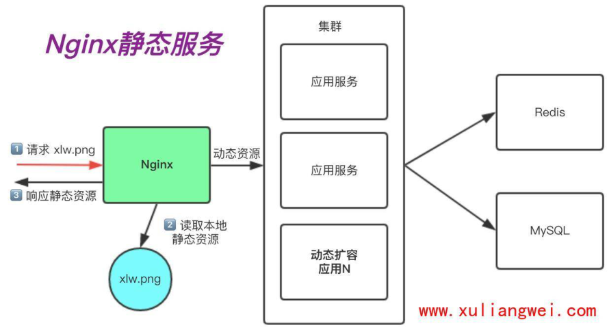
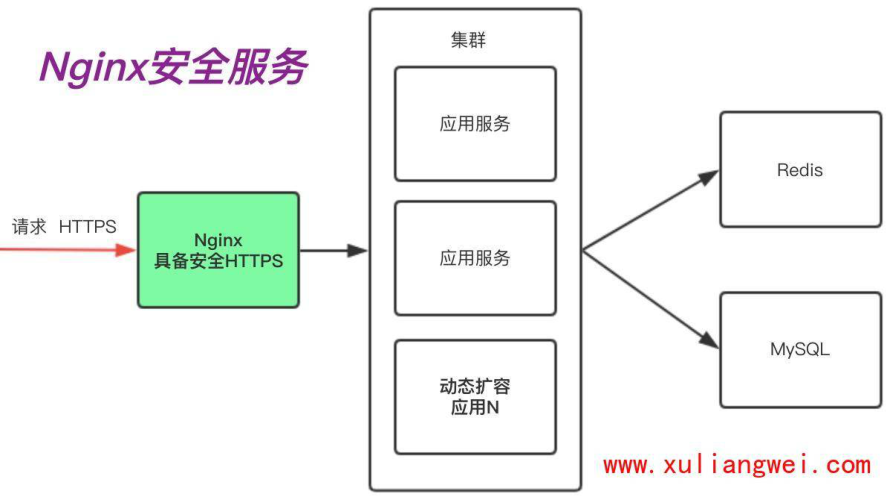
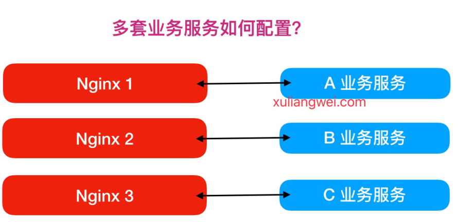
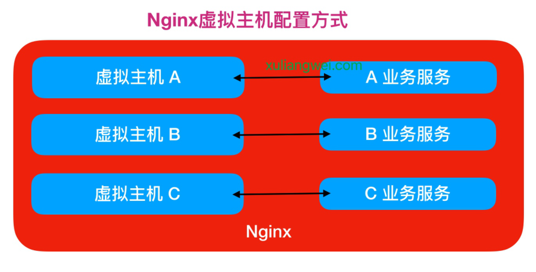

# 07.Nginx Web快速入门

## 目录

- [1.Nginx基本简述](#1.nginx基本简述)
  - [1.1 什么是Nginx](#1.1-什么是nginx)
  - [1.2 为什么选择Nginx](#1.2-为什么选择nginx)
    - [1.2.1 高性能、高并发](#1.2.1-高性能高并发)
    - [1.2.2 高扩展性](#1.2.2-高扩展性)
    - [1.2.3 高可靠性](#1.2.3-高可靠性)
    - [1.2.4 热部署](#1.2.4-热部署)
    - [1.2.5 应用广泛](#1.2.5-应用广泛)
    - [1.2.6 网络模型](#1.2.6-网络模型)
  - [1.3 Nginx应用场景](#1.3-nginx应用场景)
    - [1.3.1 负载均衡场景](#1.3.1-负载均衡场景)
- [1、应用服务器需要动态扩展。(手动扩展|自动扩](#1应用服务器需要动态扩展手动扩展自动扩)
- [2、有些服务出问题需要做容灾。](#2有些服务出问题需要做容灾)
    - [1.3.1 代理缓存场景](#1.3.1-代理缓存场景)
    - [1.3.2 静态资源场景](#1.3.2-静态资源场景)
    - [1.3.3 安全应用场景](#1.3.3-安全应用场景)
  - [1.4 Nginx组成部分](#1.4-nginx组成部分)
- [1.第一个组成部分Nginx二进制可执行文件：它是Nginx](#1.第一个组成部分nginx二进制可执行文件它是nginx)
- [2.第二个组成部分Nginx.conf文件：它相当于驾驶人](#2.第二个组成部分nginx.conf文件它相当于驾驶人)
- [3.第三个组成部分access.log：它相当于这辆汽车经过所](#3.第三个组成部分access.log它相当于这辆汽车经过所)
- [4.第四个组成部分error.log：它相当于黑匣子，当出现](#4.第四个组成部分error.log它相当于黑匣子当出现)
- [2.Nginx安装部署](#2.nginx安装部署)
  - [2.1 安装Nginx方式](#2.1-安装nginx方式)
- [1.源码编译=>Nginx (1.版本随意 2.安装复杂 3.升](#1.源码编译nginx-1.版本随意-2.安装复杂-3.升)
- [2.epel仓库=>Nginx (1.版本较低 2.安装简单 3.配](#2.epel仓库nginx-1.版本较低-2.安装简单-3.配)
- [3.官方仓库=>Nginx (1.版本较新 2.安装简单 3.配](#3.官方仓库nginx-1.版本较新-2.安装简单-3.配)
  - [2.2 安装Nginx依赖](#2.2-安装nginx依赖)
  - [2.3 配置Nginx源](#2.3-配置nginx源)
  - [2.4 安装Nginx服务](#2.4-安装nginx服务)
  - [2.5 访问Nginx服务](#2.5-访问nginx服务)
  - [2.6 检查Nginx版本](#2.6-检查nginx版本)
- [3.Nginx目录结构](#3.nginx目录结构)
  - [3.1 Nginx主配置文件](#3.1-nginx主配置文件)
  - [3.2 Nginx代理配置文件](#3.2-nginx代理配置文件)
  - [3.3 Nginx编码配置文件](#3.3-nginx编码配置文件)
  - [3.4 Nginx管理命令文件](#3.4-nginx管理命令文件)
  - [3.4 Nginx日志相关文件](#3.4-nginx日志相关文件)
- [4.Nginx基本配置](#4.nginx基本配置)
- [2.后端并没有将代码解析成功，所以直](#2.后端并没有将代码解析成功所以直)
  - [4.1 Global全局模块](#4.1-global全局模块)
  - [4.2 Events事件模块](#4.2-events事件模块)
  - [4.3 HTTP核心模块](#4.3-http核心模块)
  - [4.4 核心模块总结](#4.4-核心模块总结)
- [5.Nginx构建游戏网站](#5.nginx构建游戏网站)
  - [5.1 增加Nginx配置](#5.1-增加nginx配置)
  - [5.2 上传游戏代码](#5.2-上传游戏代码)
  - [5.3 检查配置语法](#5.3-检查配置语法)
  - [5.4 重启服务生效](#5.4-重启服务生效)
- [6.Nginx虚拟主机](#6.nginx虚拟主机)
  - [6.1 Nginx虚拟主机概念](#6.1-nginx虚拟主机概念)
  - [6.2 Nginx配置虚拟主机方式](#6.2-nginx配置虚拟主机方式)
- [1、基于主机多IP方式](#1基于主机多ip方式)
- [2、基于端口的配置方式](#2基于端口的配置方式)
- [3、基于多个hosts名称方式(多域名方式)](#3基于多个hosts名称方式多域名方式)
  - [6.3 基于多IP虚拟主机实践](#6.3-基于多ip虚拟主机实践)
  - [6.4 基于多端口虚拟主机实践](#6.4-基于多端口虚拟主机实践)
  - [6.5 基于多域名虚拟主机实践](#6.5-基于多域名虚拟主机实践)

目录

- [1.Nginx基本简述](#1.nginx基本简述)
  - [1.1 什么是Nginx](#1.1-什么是nginx)
  - [1.2 为什么选择Nginx](#1.2-为什么选择nginx)
    - [1.2.1 高性能、高并发](#1.2.1-高性能高并发)
    - [1.2.2 高扩展性](#1.2.2-高扩展性)
    - [1.2.3 高可靠性](#1.2.3-高可靠性)
    - [1.2.4 热部署](#1.2.4-热部署)
    - [1.2.5 应用广泛](#1.2.5-应用广泛)
    - [1.2.6 网络模型](#1.2.6-网络模型)
  - [1.3 Nginx应用场景](#1.3-nginx应用场景)
    - [1.3.1 负载均衡场景](#1.3.1-负载均衡场景)
    - [1.3.1 代理缓存场景](#1.3.1-代理缓存场景)
    - [1.3.2 静态资源场景](#1.3.2-静态资源场景)
    - [1.3.3 安全应用场景](#1.3.3-安全应用场景)
  - [1.4 Nginx组成部分](#1.4-nginx组成部分)
- [2.Nginx安装部署](#2.nginx安装部署)
  - [2.1 安装Nginx方式](#2.1-安装nginx方式)
  - [2.2 安装Nginx依赖](#2.2-安装nginx依赖)
  - [2.3 配置Nginx源](#2.3-配置nginx源)
  - [2.4 安装Nginx服务](#2.4-安装nginx服务)
  - [2.5 访问Nginx服务](#2.5-访问nginx服务)
  - [2.6 检查Nginx版本](#2.6-检查nginx版本)
- [3.Nginx目录结构](#3.nginx目录结构)
  - [3.1 Nginx主配置文件](#3.1-nginx主配置文件)
  - [3.2 Nginx代理配置文件](#3.2-nginx代理配置文件)
  - [3.3 Nginx编码配置文件](#3.3-nginx编码配置文件)
  - [3.4 Nginx管理命令文件](#3.4-nginx管理命令文件)
  - [3.4 Nginx日志相关文件](#3.4-nginx日志相关文件)
- [4.Nginx基本配置](#4.nginx基本配置)
  - [4.1 Global全局模块](#4.1-global全局模块)
  - [4.2 Events事件模块](#4.2-events事件模块)
  - [4.3 HTTP核心模块](#4.3-http核心模块)
  - [4.4 核心模块总结](#4.4-核心模块总结)
- [5.Nginx构建游戏网站](#5.nginx构建游戏网站)
  - [5.1 增加Nginx配置](#5.1-增加nginx配置)
  - [5.2 上传游戏代码](#5.2-上传游戏代码)
  - [5.3 检查配置语法](#5.3-检查配置语法)
  - [5.4 重启服务生效](#5.4-重启服务生效)
- [6.Nginx虚拟主机](#6.nginx虚拟主机)
  - [6.1 Nginx虚拟主机概念](#6.1-nginx虚拟主机概念)
  - [6.2 Nginx配置虚拟主机方式](#6.2-nginx配置虚拟主机方式)
  - [6.3 基于多IP虚拟主机实践](#6.3-基于多ip虚拟主机实践)
  - [6.4 基于多端口虚拟主机实践](#6.4-基于多端口虚拟主机实践)
  - [6.5 基于多域名虚拟主机实践](#6.5-基于多域名虚拟主机实践)

## 1.Nginx基本简述

### 1.1 什么是Nginx

Nginx是一个开源且高性能、可靠的Http Web服

务、代理服务。

开源，体现在直接获取Nginx的源代码（F5公司收

购）；

高性能，体现在支持海量的并发；

高可靠，体现在服务稳定；

### 1.2 为什么选择Nginx

#### 1.2.1 高性能、高并发

通常正常情况下，单次请求会得到更快的响应。另一方

面在高峰期（如有数以万计的并发请求），Nginx可以

比其他Web服务器更快地响应请求。

select：O(n)

epool：O(1)

#### 1.2.2 高扩展性

Nginx官方、第三方，提供了非常多优秀的模块提供使

用，这些模块都可以实现快速增加和减少。

nginx ---> uwsgi ---> python--> py脚本文件

#### 1.2.3 高可靠性

所谓高可靠性，是指Nginx可以在服务器上持续不间断的

运行，而很多web服务器往往运行几周或几个月就需要

进行一次重启。windows的 IIS

对于nginx这样的一个高并发、高性能的反向代理服务器

而言，他往往运行网站架构的最前端，那么此时如果我

们企业如果想提供9999、99999，对于nginx持续运行能

够宕机的时间，一年可能只能以秒来计算，所以在这样

的一个角色中，nginx的高可靠性为我们提供了非常好的

保证。

#### 1.2.4 热部署

热部署是指在不停服务的情况下升级nginx，这个功能非

常的重要。

对于普通的服务，只需要kill掉进程在启动，但对于

Nginx而言，如果Nginx有很多的客户端连接，那么kill掉

Nginx。Nginx会像客户端发送tcp reset复位包，但很多

客户端无法很好的理解reset包，就会造成异常。

由于Nginx的master管理进程与worker工作进程的分离

设计，使得Nginx能够在7×24小时不间断服务的前提

下，升级Nginx的可执行文件。当然，也支持不停止服务

更新配置、更换日志文件等功能。

#### 1.2.5 应用广泛

首先Nginx技术成熟，具备企业最常使用的功能，如代

理、代理缓存、负载均衡、静态资源、动静分离、

Https、lnmp、lnmt等等

其次使用Nginx统一技术栈，降低维护成本，同时降低技

术更新成本。

tengine\OpenResty 都是基于Nginx进行的二次开发；

#### 1.2.6 网络模型

Nginx使用Epool网络模型，而常听到Apache采用的是

Select网络模型。

Select：当用户发起一次请求，select模型就会进行一

次遍历扫描，从而导致性能低下。

Epoll：当用户发起请求，epoll模型会直接进行处理，

效率高效。

### 1.3 Nginx应用场景

Nginx的主要使用场景我归纳为三个，分为是静态资源

服务、代理资源服务、安全服务，场景详细介绍如下

如下图是一个网站的基本架构，首先用户请求先到达

nginx，然后在到 tomcat或php这样的应用服务器，然

后应用服务器在去访问 redis、mysql这样的数据库，

提供基本的数据功能。



#### 1.3.1 负载均衡场景

那么这里有一个问题，我们的程序代码要求开发效率

高，所以他的运行效率是很低的，或者说它并发是受

限，所以我们需要很多应用服务组成一个集群，为更多

用户提供访问。

而应用服务一但构成集群，则需要我们的nginx具有反向

代理功能，这样可以将动态请求传倒给集群服务。

但很多应用构成集群，那么一定会带来两个需求。

## 1、应用服务器需要动态扩展。(手动扩展|自动扩

展)

## 2、有些服务出问题需要做容灾。

那么我们的反向代理必须具备负载均衡功能。



#### 1.3.1 代理缓存场景

其次，随着我们网络链路的增长，用户体验到的时延则

会增加。如果我们能把一段时间内不会发生变化的"动

态"内容，缓存在Nginx，由Nginx直接向用户提供访

问，那么这样用户请求的时延就会减少很多，所以在这

里反向代理会演生出另外一个功能 "缓存"，因为它能加

速我们的访问。



#### 1.3.2 静态资源场景

在很多时候我们访问docs、pdf、mp4、png等这样的静

态资源时，是没有必要将这些请求通过Nginx交给后端

的应用服务，我们只需要通过Nginx直接处理“静态资源”

即可。这是Nginx的静态资源功能。



#### 1.3.3 安全应用场景

当我们使用http网站时，可能会遭遇到篡改，如果使用

https安全通讯协议，那么数据在传输过程中是加密

的，从而能有效的避免黑客窃取或者篡改数据信息，同

时也能避免网站在传输过程中的信息泄露。大大的提升

我们网站安全。



### 1.4 Nginx组成部分

在这里我们将Nginx的组成架构比喻为一辆汽车：

这个汽车提供了基本的驾驶功能，但是还需要一个驾驶

员控制这辆汽车开往哪个方向，同时该汽车行驶过的地

方还会形成GPS轨迹，如果汽车在行驶的过程中出现了

任何问题，我们需要一个黑匣子，分析是汽车本身的问

题，还是驾驶人员的操作出现了问题。


## 1.第一个组成部分Nginx二进制可执行文件：它是Nginx

本身框架以及相关模块等构建的一个二进制文件，这个

文件就相当于汽车本身，所有的功能都由它提供。

## 2.第二个组成部分Nginx.conf文件：它相当于驾驶人

员，虽然二进制可执行文件已经提供了许多的功能，但

是这些功能究竟有没有开启，或者开启后定义怎样的行

为去处理请求，都是由nginx.conf这个文件决定的，所

以他就相当于这个汽车的驾驶员，控制这个汽车的行

为。

## 3.第三个组成部分access.log：它相当于这辆汽车经过所

有地方形成的GPS轨迹，access.log会记录Nginx处理过

的每一条HTTP的请求信息、响应信息。

## 4.第四个组成部分error.log：它相当于黑匣子，当出现

了一些不可预期的问题时，可以通过error.log将问题定

位出来。

Nginx组成部分小结：

Nginx的组成部分是相辅相成，Nginx二进制文件和

Nginx.conf文件，它定义了Nginx处理请求的方式。

而如果我们想对nginx服务做一些web的运营和运维，需

要对access.log做进一步分析。

而如果出现了任何未知的错误，或者预期的行为不一致

时，应该通过error.log去定位根本性的问题。

## 2.Nginx安装部署

### 2.1 安装Nginx方式

安装Nginx软件的方式有很多种，分为如下几种

## 1.源码编译=>Nginx (1.版本随意 2.安装复杂 3.升

级繁琐)

## 2.epel仓库=>Nginx (1.版本较低 2.安装简单 3.配

置不易读)

## 3.官方仓库=>Nginx (1.版本较新 2.安装简单 3.配

置易读，强烈推荐)

### 2.2 安装Nginx依赖

```
[root@oldxu ~]# yum install -y gcc gcc-c++
autoconf pcre pcre-devel make automake
httpd-tools
```

### 2.3 配置Nginx源

```
[root@oldxu ~]# vim
/etc/yum.repos.d/nginx.repo
[nginx-stable]
name=nginx stable repo
baseurl=http://nginx.org/packages/centos/$r
eleasever/$basearch/
gpgcheck=1
enabled=1
gpgkey=https://nginx.org/keys/nginx_signing
.key
```

### 2.4 安装Nginx服务

```
[root@oldxu ~]# yum install nginx -y
[root@oldxu ~]# systemctl enable nginx
[root@oldxu ~]# systemctl start nginx
```

### 2.5 访问Nginx服务


### 2.6 检查Nginx版本

检查版本

```
[root@oldxu ~]# nginx -v
nginx version: nginx/1.20.1
```

检查编译参数

```
[root@oldxu ~]# nginx -V
```

## 3.Nginx目录结构

为了让大家更清晰的了解Nginx软件的全貌，可使用

rpm -ql nginx查看软件整体目录结构

如下表格整理了Nginx比较重要的配置文件

### 3.1 Nginx主配置文件

路径 类型 作用

nginx主配

/etc/nginx/nginx.conf 配置

文件

置文件

/etc/nginx/conf.d/default.conf 配置

默认网站配

文件

置文件

### 3.2 Nginx代理配置文件

路径 类型 作用

Fastcgi代理配

/etc/nginx/fastcgi_params 配置

文件

置文件

scgi代理配置

/etc/nginx/scgi_params 配置

文件

文件

uwsgi代理配

/etc/nginx/uwsgi_params 配置

文件

置文件

### 3.3 Nginx编码配置文件

路径 类型 作用

Nginx编码转换映

/etc/nginx/win-utf 配置

文件

射文件

Nginx编码转换映

/etc/nginx/koi-utf 配置

文件

射文件

Nginx编码转换映

/etc/nginx/koi-win 配置

文件

射文件

Content-Type与

/etc/nginx/mime.types 配置

文件

扩展名

### 3.4 Nginx管理命令文件

路径 类 型 作用

Nginx命令行管理终端工

/usr/sbin/nginx 命

令

具

/usr/sbin/nginx-

Nginx命令行与终端调试

命

debug

令

工具

### 3.4 Nginx日志相关文件

路径 类型 作用 /var/log/nginx 目录 Nginx默认存放日

志目录

Nginx默认的日志

/etc/logrotate.d/nginx 配置

文件

切割

## 4.Nginx基本配置

```
Nginx主配置文件/etc/nginx/nginx.conf是一个
```

纯文本类型的文件；

Nginx整个配置文件是以区块的形式组织的。一般每

个区块以一对大括号{}来表示开始与结束。

```
[root@oldxu ~]# cat /etc/nginx/nginx.conf
```

全局

```
user  nginx;                    # nginx的运
```

行身份为nginx用户；

```
worker_processes  2;            # 启动的
```

worker进程数量；

```
error_log  /var/log/nginx/error.log warn;
```

错误日志的路径；从warning；

```
pid        /var/run/nginx.pid;
```

存储进程的pid Number

```
# 4c * 16GB
events {
```

```
    worker_connections  1024;   # 一个worker
```

最大连接数

```
                                #
worker_connections *  worker_processes = 最
```

大链接数

```
    use epoll;                  # 默认是采用
```

epoll网络IO模型；

```
}
```

主要负责接受与响应http请求

```
http {
    include       /etc/nginx/mime.types;
```

支持的类型；

```
    default_type  application/octet-stream;
```

默认类型（下载的方式）

```
            # 1.提供下载包 zip
```

## 2.后端并没有将代码解析成功，所以直

接成了下载；

定义日志的格式

```
    log_format  main  '$remote_addr -
$remote_user [$time_local] "$request" '
                      '$status
$body_bytes_sent "$http_referer" '
                      '"$http_user_agent"
"$http_x_forwarded_for"';
```

访问日志

```
    access_log  /var/log/nginx/access.log
main;
    sendfile        on;
```

```
    #tcp_nopush     on;
    keepalive_timeout  65;
```

#长连接超时时间；

```
    #gzip  on;
    include /etc/nginx/conf.d/*.conf;
```

包含的子文件；

```
}
```

```
######
```

一个server就是一个站点

```
server {
    listen       80;                    # 监
```

听的端口

```
    server_name  www.oldxu.net;         # 站
```

点的域名

```
    location / {                        #
```

uri路径匹配的

```
        root   /usr/share/nginx/html;   #
```

root：定义网站的路径；

```
        index  index.html index.htm;    #
```

index：定义默认返回的页面；

```
                        # root+index  =
/usr/share/nginx/html/index.html;
    }
}
```

一个server就是一个站点

```
server {
```

```
    listen       80;                    # 监
```

听的端口

```
    server_name  www.oldxu.net;         # 站
```

点的域名

```
    location / {                        #
```

uri路径匹配的

```
        root   /usr/share/nginx/html;   #
```

root：定义网站的路径；

```
        index  index.html index.htm;    #
```

index：定义默认返回的页面；

```
                        # root+index  =
/usr/share/nginx/html/index.html;
    }
}
```

### 4.1 Global全局模块

```
user www;                       #Nginx进程所
```

使用的用户

```
worker_processes 1;             #Nginx运行的
```

work进程数量(建议与CPU数量一致或auto)

```
error_log /log/nginx/error.log  #Nginx错误日
```

志存放路径

```
pid /var/run/nginx.pid          #Nginx服务运
```

行后产生的pid进程号

### 4.2 Events事件模块

```
events {
    worker_connections 25535;  #每个worker进
```

程支持的最大连接数

```
    use epoll;                  #事件驱动模
```

型, epoll默认

```
}
```

### 4.3 HTTP核心模块

```
http {  #http层开始
...
```

#使用Server配置网站, 每个Server{}代表一个网

站(简称虚拟主机)

```
    'server' {
        listen       80;            #监听端
```

口, 默认80

```
        server_name  bgx.com;       #提供的域
```

名

```
        access_log  access.log;     #该网站的
```

访问日志

#控制网站访问的路径

```
        'location' / {
            root   /usr/share/nginx/html;
```

#存放网站源代码的位置

```
            index  index.html index.htm;
```

#默认返回网站的文件

```
        }
```

```
    }
    ...
```

#第二个虚拟主机配置

```
    'server' {
    ...
    }
```

```
    include /etc/nginx/conf.d/*.conf;  #包
```

含/etc/nginx/conf.d/目录下所有以.conf结尾的文件

#include作用是:简化主配置文件写太多造成臃肿，

这样会让整体的配置文件更加的清晰。

```
}   #http层结束
```

### 4.4 核心模块总结

Nginx中的 http、server、location 之间的关系

http标签主要用来解决用户的请求与响应；

server标签主要用来响应具体的某一个网站；

location标签主要用于匹配网站具体URI路径；

http{}下允许有多个Server{}，一个 Server{} 下

又允许有多个location{}

## 5.Nginx构建游戏网站

### 5.1 增加Nginx配置

```
[root@oldxu ~]# cat
/etc/nginx/conf.d/game.oldxu.net.conf
server {
    listen 80;
    server_name game.oldxu.net;
    location / {
        root /code;
        index index.html;
    }
}
```

### 5.2 上传游戏代码

```
[root@oldxu conf.d]# mkdir /code && cd
/code
[root@oldxu code]# wget
http://cdn.xuliangwei.com/html5.zip
[root@oldxu code]# unzip html5.zip
[root@oldxu code]# ls
ceshi  game  html5.zip  img  index.html
readme.txt
```

### 5.3 检查配置语法

```
[root@oldxu code]# nginx -t
nginx: the configuration file
/etc/nginx/nginx.conf syntax is ok
nginx: configuration file
/etc/nginx/nginx.conf test is successful
```

### 5.4 重启服务生效

```
[root@oldxu code]# systemctl reload nginx
```

## 6.Nginx虚拟主机

### 6.1 Nginx虚拟主机概念

通常在企业中可能会有很多业务系统，那么多套业务

服务如何使用Nginx配置?



如果使用如上方式部署，则需要多台服务器配置

Nginx，但如果使用虚拟主机方式，则在同一个Nginx

上运行多套单独服务，这些服务是相互独立的。

简单来说，看似多套业务系统，实则可以运行在一台

Nginx服务上



### 6.2 Nginx配置虚拟主机方式

Nginx配置虚拟主机有如下三种方式

## 1、基于主机多IP方式

## 2、基于端口的配置方式

## 3、基于多个hosts名称方式(多域名方式)

### 6.3 基于多IP虚拟主机实践

Nginx基于多IP虚拟主机具体配置如下

```
[root@oldxu ~]# cat
/etc/nginx/conf.d/address.conf
server {
    ...
    listen 10.0.0.10:80;
    ...
}
server {
    ...
    listen 172.16.1.10:80;
    ...
}
```

### 6.4 基于多端口虚拟主机实践

Nginx基于多端口虚拟主机具体配置如下

#仅修改listen监听端口即可, 但不能和系统端口出现冲突

```
[root@oldxu ~]# cat
/etc/nginx/conf.d/port1.conf
server {
    ...
    listen 80;
    ...
}
[root@oldxu ~]# cat
/etc/nginx/conf.d/port2.conf
server {
```

```
    ...
    listen 81;
    ...
}
[root@oldxu ~]# cat
/etc/nginx/conf.d/port3.conf
server {
    ...
    listen 82;
    ...
}
```

### 6.5 基于多域名虚拟主机实践

Nginx基于多Host虚拟主机具体配置如下

```
# wget
http://cdn.xuliangwei.com/xiaoniaofeifei.zi
p
[root@oldxu ~]# echo "server1" >
/code/server1/index.html
[root@oldxu ~]# echo "server2" >
/code/server2/index.html
[root@web02 ~]# cat
/etc/nginx/conf.d/server1.conf
server {
    listen       80;
```

```
    server_name  server1.oldxu.net;
    root /code/server1;
    index index.html;
    ...
}
[root@oldxu ~]# cat
/etc/nginx/conf.d/server2.conf
server {
    ...
    listen       80;
    server_name  server2.oldxu.net;
    root /code/server2;
    index index.html;
}
```
