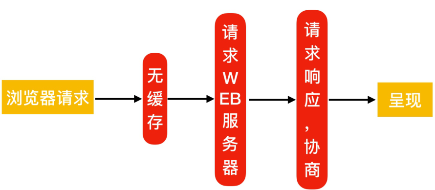
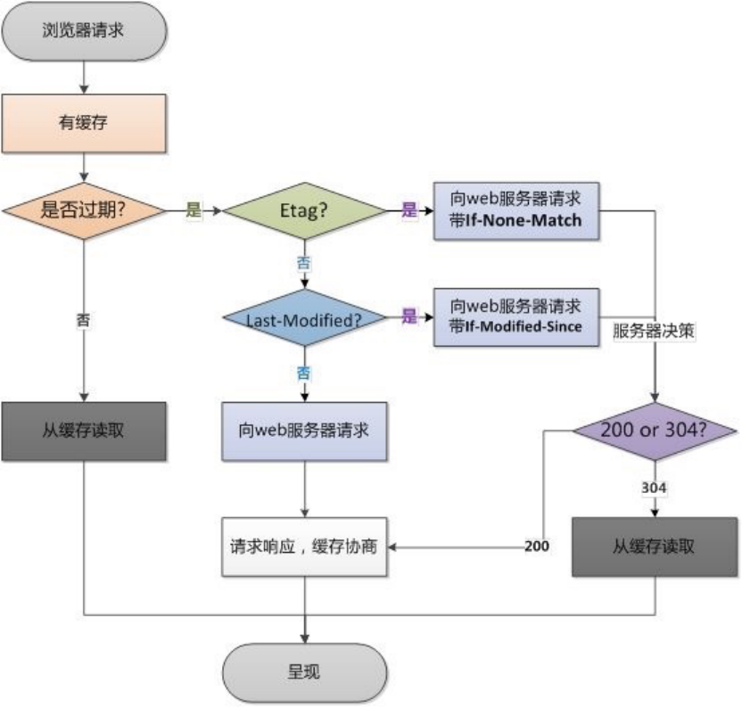

# 07.Nginx Web快速入门

## 目录

- [7.Nginx常用模块](#7.nginx常用模块)
  - [7.1 Nginx目录索引](#7.1-nginx目录索引)
    - [7.1.1 配置语法](#7.1.1-配置语法)
    - [7.1.2 配置示例](#7.1.2-配置示例)
    - [7.1.3 模拟企业内网仓库](#7.1.3-模拟企业内网仓库)
  - [7.2 Nginx访问控制](#7.2-nginx访问控制)
    - [7.2.1 配置语法](#7.2.1-配置语法)
    - [7.2.2 配置示例](#7.2.2-配置示例)
  - [7.3 Nginx基础认证](#7.3-nginx基础认证)
    - [7.3.1 配置语法](#7.3.1-配置语法)
    - [7.3.2 配置示例](#7.3.2-配置示例)
  - [7.4 Nginx限流限速](#7.4-nginx限流限速)
    - [7.4.1 为什么要限速](#7.4.1-为什么要限速)
- [503: 过载保护，](#503-过载保护)
    - [7.4.2 限速应用场景](#7.4.2-限速应用场景)
    - [7.4.3 请求频率限速原理](#7.4.3-请求频率限速原理)
    - [7.4.4 限制请求并发数](#7.4.4-限制请求并发数)
- [1.指令](#1.指令)
- [2.基于来源IP对下载速率限制，限制每秒处理1次请求，](#2.基于来源ip对下载速率限制限制每秒处理1次请求)
- [10M，名为req_one的内存区域，用来存储访问的频次信](#10m名为req_one的内存区域用来存储访问的频次信)
    - [7.4.5 限制并发连接数](#7.4.5-限制并发连接数)
- [2.设置共享内存区域和给定键值的最大允许个连接数。](#2.设置共享内存区域和给定键值的最大允许个连接数)
    - [7.4.6 限制下载速度](#7.4.6-限制下载速度)
    - [7.4.7 综合场景实践](#7.4.7-综合场景实践)
- [1、限制web服务器请求数处理为1秒一个，触发值为](#1限制web服务器请求数处理为1秒一个触发值为)
- [5、限制用户仅可同时下载一个文件。](#5限制用户仅可同时下载一个文件)
- [2、当下载超过100M则限制下载速度为500k](#2当下载超过100m则限制下载速度为500k)
- [3、如果同时下载超过2个视频，则返回提示 "请联系](#3如果同时下载超过2个视频则返回提示-请联系)
- [552408925 进行会员充值';](#552408925-进行会员充值)
  - [7.5 Nginx状态监控](#7.5-nginx状态监控)
    - [7.5.1 配置语法](#7.5.1-配置语法)
    - [7.5.2 配置示例](#7.5.2-配置示例)
    - [7.5.3 页面状态](#7.5.3-页面状态)
- [1、S船收到这个消息时就是reading](#1s船收到这个消息时就是reading)
- [2、S船将物资发送给C船，这个时候就是writing](#2s船将物资发送给c船这个时候就是writing)
- [3、如果C船需要S船很多个物品，那么需要C船和](#3如果c船需要s船很多个物品那么需要c船和)
  - [7.6 Nginx资源缓存](#7.6-nginx资源缓存)
    - [7.6.1 浏览器无缓存](#7.6.1-浏览器无缓存)
    - [7.6.2 浏览器有缓存](#7.6.2-浏览器有缓存)
    - [7.6.3 缓存过期校验](#7.6.3-缓存过期校验)
- [1.浏览器请求服务器会先进行Expires、Cache-](#1.浏览器请求服务器会先进行expirescache-)
- [2.如果缓存过期，首先检查是否存在etag，如果存在](#2.如果缓存过期首先检查是否存在etag如果存在)
- [3.如果etag不存在，则进行last-Modified检查，客](#3.如果etag不存在则进行last-modified检查客)
    - [7.6.4 缓存配置语法](#7.6.4-缓存配置语法)
    - [7.6.5 资源缓存配置场景](#7.6.5-资源缓存配置场景)
  - [7.7 Nginx资源压缩](#7.7-nginx资源压缩)
    - [7.7.1 配置语法](#7.7.1-配置语法)
- [1、启用或关闭gzip压缩](#1启用或关闭gzip压缩)
- [2、gzip支持的压缩类型](#2gzip支持的压缩类型)
- [3、gzip压缩比率，压缩率越高，CPU消耗越大](#3gzip压缩比率压缩率越高cpu消耗越大)
- [4、gzip压缩的最小文件，小于设置的值文件将不会被压](#4gzip压缩的最小文件小于设置的值文件将不会被压)
- [5、gzip压缩支持的协议版本](#5gzip压缩支持的协议版本)
- [6、启用压缩，是否在响应报文首部插入"Vary:](#6启用压缩是否在响应报文首部插入vary)
    - [7.7.2 图片压缩案例](#7.7.2-图片压缩案例)
    - [7.7.3 文件压缩案例](#7.7.3-文件压缩案例)
  - [7.8 Nginx Location](#7.8-nginx-location)
    - [7.8.1 什么是Location](#7.8.1-什么是location)
    - [7.8.2 Location语法示例](#7.8.2-location语法示例)
    - [7.8.3 Location优先级示例](#7.8.3-location优先级示例)
    - [7.8.4 Location 应用场景](#7.8.4-location-应用场景)
    - [7.8.5 Location @重定向](#7.8.5-location-重定向)
  - [7.9 Nginx 日志模块](#7.9-nginx-日志模块)
    - [7.9.1 Nginx日志格式](#7.9.1-nginx日志格式)
- [3.Nginx日志格式中常用的变量](#3.nginx日志格式中常用的变量)
    - [7.9.2 Nginx访问日志](#7.9.2-nginx访问日志)
- [1.web服务器的访问日志是非常重要的，我们可以通过访](#1.web服务器的访问日志是非常重要的我们可以通过访)
- [2.Nginx 访问日志配置示例](#2.nginx-访问日志配置示例)
    - [7.9.3 Nginx错误日志](#7.9.3-nginx错误日志)
- [2.Nginx错误日志示例](#2.nginx错误日志示例)
    - [7.9.4 Nginx日志过滤](#7.9.4-nginx日志过滤)

目录

- [7.Nginx常用模块](#7.nginx常用模块)
  - [7.1 Nginx目录索引](#7.1-nginx目录索引)
    - [7.1.1 配置语法](#7.1.1-配置语法)
    - [7.1.2 配置示例](#7.1.2-配置示例)
    - [7.1.3 模拟企业内网仓库](#7.1.3-模拟企业内网仓库)
  - [7.2 Nginx访问控制](#7.2-nginx访问控制)
    - [7.2.1 配置语法](#7.2.1-配置语法)
    - [7.2.2 配置示例](#7.2.2-配置示例)
  - [7.3 Nginx基础认证](#7.3-nginx基础认证)
    - [7.3.1 配置语法](#7.3.1-配置语法)
    - [7.3.2 配置示例](#7.3.2-配置示例)
  - [7.4 Nginx限流限速](#7.4-nginx限流限速)
    - [7.4.1 为什么要限速](#7.4.1-为什么要限速)
    - [7.4.2 限速应用场景](#7.4.2-限速应用场景)
    - [7.4.3 请求频率限速原理](#7.4.3-请求频率限速原理)
    - [7.4.4 限制请求并发数](#7.4.4-限制请求并发数)
    - [7.4.5 限制并发连接数](#7.4.5-限制并发连接数)
    - [7.4.6 限制下载速度](#7.4.6-限制下载速度)
    - [7.4.7 综合场景实践](#7.4.7-综合场景实践)
  - [7.5 Nginx状态监控](#7.5-nginx状态监控)
    - [7.5.1 配置语法](#7.5.1-配置语法)
    - [7.5.2 配置示例](#7.5.2-配置示例)
    - [7.5.3 页面状态](#7.5.3-页面状态)
  - [7.6 Nginx资源缓存](#7.6-nginx资源缓存)
    - [7.6.1 浏览器无缓存](#7.6.1-浏览器无缓存)
    - [7.6.2 浏览器有缓存](#7.6.2-浏览器有缓存)
    - [7.6.3 缓存过期校验](#7.6.3-缓存过期校验)
    - [7.6.4 缓存配置语法](#7.6.4-缓存配置语法)
    - [7.6.5 资源缓存配置场景](#7.6.5-资源缓存配置场景)
  - [7.7 Nginx资源压缩](#7.7-nginx资源压缩)
    - [7.7.1 配置语法](#7.7.1-配置语法)
    - [7.7.2 图片压缩案例](#7.7.2-图片压缩案例)
    - [7.7.3 文件压缩案例](#7.7.3-文件压缩案例)
  - [7.8 Nginx Location](#7.8-nginx-location)
    - [7.8.1 什么是Location](#7.8.1-什么是location)
    - [7.8.2 Location语法示例](#7.8.2-location语法示例)
    - [7.8.3 Location优先级示例](#7.8.3-location优先级示例)
    - [7.8.4 Location 应用场景](#7.8.4-location-应用场景)
    - [7.8.5 Location @重定向](#7.8.5-location-重定向)
  - [7.9 Nginx 日志模块](#7.9-nginx-日志模块)
    - [7.9.1 Nginx日志格式](#7.9.1-nginx日志格式)
    - [7.9.2 Nginx访问日志](#7.9.2-nginx访问日志)
    - [7.9.3 Nginx错误日志](#7.9.3-nginx错误日志)
    - [7.9.4 Nginx日志过滤](#7.9.4-nginx日志过滤)

## 7.Nginx常用模块

### 7.1 Nginx目录索引

当ngx_http_index_module模块找不到索引文件时，通

```
常会将请求传递给ngx_http_autoindex_module模
```

块。

ngx_http_autoindex_module模块处理以斜杠字符('/')

结尾的请求，并生成目录列表。

#### 7.1.1 配置语法

#启用或禁用目录列表输出，on开启，off关闭。

```
Syntax: autoindex on | off;
Default:    autoindex off;
Context:    http, server, location
```

#指定是否应在目录列表中输出确切的文件大小，on显示字

节，off显示大概单位。

```
Syntax: autoindex_exact_size on | off;
Default: autoindex_exact_size on;
Context:    http, server, location
```

#指定目录列表中的时间是应以本地时区还是UTC输出。on

本地时区，off UTC时间。

```
Syntax: autoindex_localtime on | off;
Default: autoindex_localtime off;
Context: http, server, location
```

#### 7.1.2 配置示例

```
[root@oldxu ~]# cat
/etc/nginx/conf.d/mirror.oldxu.net.conf
server {
    listen 80;
    server_name mirror.oldxu.net;
```

charset utf-8; #设定字符集，防止中文字

符乱码显示。

```
    autoindex on;
    autoindex_exact_size off;
    autoindex_locatime on;
```

```
    location / {
        root /code/;
    }
}
```

#### 7.1.3 模拟企业内网仓库

```
[root@oldxu mirror]# cat
/etc/nginx/conf.d/mirror.oldxu.net.conf
server {
    listen 80;
    server_name mirror.oldxu.net;
    charset utf-8;
    root /mirror;
    location / {
        index index.html;
    }
```

#提供yum仓库目录

```
    location /repo {
        autoindex on;
        autoindex_exact_size off;
        autoindex_localtime on;
    }
}
```

#使用rsync同步

```
[root@oldxu mirror]# rsync -avz
rsync://rsync.mirrors.ustc.edu.cn/repo/cent
os/  /mirror/repo/
```

将该目录创建为仓库目录

```
# createrepo /mirror/repo
```

### 7.2 Nginx访问控制

ngx_http_access_module 模块允许限制对某些客户端

地址的访问。

#### 7.2.1 配置语法

#允许配置语法

```
Syntax: allow address | CIDR | unix: | all;
Default: —
Context: http, server, location,
limit_except
```

#拒绝配置语法

```
Syntax: deny address | CIDR | unix: | all;
Default: —
Context: http, server, location,
limit_except
```

#### 7.2.2 配置示例

只允许指定的来源IP能访问/centos, 其它网段全部拒

绝。

```
[root@oldxu ~]# cat
/etc/nginx/conf.d/mirror.oldxu.net.conf
server {
    listen 80;
    server_name mirror.oldxu.net;
```

charset utf-8; #设定字符集，防止中文字

符乱码显示。

```
    autoindex on;
    autoindex_exact_size off;
    autoindex_locatime on;
```

```
    location / {
        index index.html;
```

```
    }
```

```
    location /centos {
        allow 127.0.0.1;
        allow 10.0.0.1/32;  #允许地址或地址段
        deny all;              #拒绝所有人
    }
}
```

拒绝指定的IP访问该网站的/centos，其他IP全部允

许访问。

```
[root@oldxu ~]# cat
/etc/nginx/conf.d/mirror.oldxu.net.conf
server {
    listen 80;
    server_name mirror.oldxu.net;
```

charset utf-8; #设定字符集，防止中文字

符乱码显示。

```
    autoindex on;
    autoindex_exact_size off;
    autoindex_locatime on;
```

```
    location / {
        index index.html;
    }
    location /centos {
        deny 10.0.0.1/32;   #拒绝指定的地址或
```

地址段

```
        allow all;          #允许所有的地址
    }
}
```

注意:deny和allow的顺序是有影响的

默认情况下，从第一条规则进行匹配

如果匹配成功，则不继续匹配下面的内容。

如果匹配不成功，则继续往下寻找能匹配成功的内容。

### 7.3 Nginx基础认证

```
ngx_http_auth_basic_module模块允许使用HTTP基
```

本身份验证，验证用户名和密码来限制对资源的访问。

#### 7.3.1 配置语法

#使用HTTP基本身份验证协议启用用户名和密码验证。

```
Syntax: auth_basic string| off;
Default: auth_basic off;
Context: http, server, location,
limit_except
```

#指定保存用户名和密码的文件

```
Syntax: auth_basic_user_file file;
Default: -
Context: http, server, location,
limit_except
```

指定保存用户名和密码的文件，格式如下：

#可以使用htpasswd程序或"openssl passwd"命令生成

对应的密码;

```
name1：passwd1
name2：passwd2
```

#使用htpaaswd创建新的密码文件, -c创建新文件 -b允

许命令行输入密码

```
[root@oldxu ~]# yum install httpd-tools
[root@oldxu ~]# htpasswd -b -c
/etc/nginx/auth_conf xuliangwei 123456
```

#### 7.3.2 配置示例

```
[root@oldxu ~]# cat
/etc/nginx/conf.d/mirror.oldxu.net.conf
server {
    listen 80;
    server_name mirror.oldxu.net;
```

charset utf-8; #设定字符集，防止中文字

符乱码显示。

```
    autoindex on;
    autoindex_exact_size off;
    autoindex_locatime on;
```

```
    location / {
        index index.html;
    }
```

```
    location /centos {
        auth_basic "Auth access Blog Input
your Passwd!";
        auth_basic_user_file
/etc/nginx/auth_conf;
    }
}
```

### 7.4 Nginx限流限速

#### 7.4.1 为什么要限速

限制某个用户在一定时间内能够产生的Http请求。或者

说限制某个用户的下载速度。

## 503: 过载保护，

#### 7.4.2 限速应用场景

下载限速：限制用户下载资源的速度；

```
ngx_http_core_module
```

请求限制：限制用户单位时间内所产生的Http请求数；

```
ngx_http_limit_req_module
```

连接限制：限制同一时间的连接数，及并发数限制；

```
ngx_http_limit_conn_module
```

#### 7.4.3 请求频率限速原理


水（请求）从上方倒入水桶，从水桶下方流出（被处

理）；

如果说水（请求）流入的过快，水桶流出（被处理）的

过慢，来不及流出的水存在水桶中（缓存），然后以固

定速率流出，水桶满后则水溢出（丢弃）。

简单来说就是：当处理速度，达不到请求的速度，则会

将请求放置缓存，然后持续处理。当缓存被沾满，如果

还有大量的请求，则会被丢弃。

#### 7.4.4 限制请求并发数

## 1.指令

```
Syntax:  limit_req_zone key zone=name:size
rate=rate;
Default: —
Context: http
Syntax: limit_req zone number
[burst=number] [nodelay];
Default: —
Context: http, server, location
```

## 2.基于来源IP对下载速率限制，限制每秒处理1次请求，

但可以突发超过5个请求放入缓存区

http标签段定义请求限制, rate限制速率，限制一秒钟

最多一个IP请求

```
$remote_addr; $binary_remote_addr
http {
    limit_req_zone $binary_remote_addr
zone=req_one:10m rate=1r/s;
}
server {
    listen 80;
    server_name mirror.oldxu.net;
```

请求超过1r/s,剩下的将被延迟处理,请求数超过

burst定义的数量，则返回503

```
    limit_req zone=req_one burst=3 nodelay;
    location / {
        root /code;
        index index.html;
```

```
    }
}
limit_req_zone $binary_remote_addr
zone=req_one:10m rate=1r/s;
```

#第一个参数：$binary_remote_addr表示通过这个标识

来做限制，限制同一客户端ip地址。

#第二个参数：zone=req_one:10m表示生成一个大小为

## 10M，名为req_one的内存区域，用来存储访问的频次信

息。

#第三个参数：rate=1r/s表示允许相同标识的客户端的访

问频次，这里限制的是每秒1次。

```
limit_req zone=req_one burst=3 nodelay;
```

#第一个参数：zone=req_one 设置使用哪个配置区域来做

限制，与上面limit_req_zone 里的name对应。

#第二个参数：burst=3，设置一个大小为3的缓冲区，当有

大量请求过来时，超过了访问频次限制的请求可以先放到这

个缓冲区内。

#第三个参数：nodelay，超过访问频次并且缓冲区也满了

的时候，则会返回503，如果没有设置，则所有请求会等待

排队。

#### 7.4.5 限制并发连接数

## 1.指令

```
Syntax:  limit_conn_zone key
zone=name:size;
Default: —
Context: http
Syntax: limit_conn zone number;
Default: —
Context: http, server, location
```

## 2.设置共享内存区域和给定键值的最大允许个连接数。

超过此限制时，服务器将返回503错误以回复请求

```
[root@oldxu ~]# cat
/etc/nginx/conf.d/mirror.oldxu.net.conf
limit_conn_zone $binary_remote_addr
zone=conn_od:10m;
server {
    listen 80;
    server_name mirror.oldxu.net;
    root /code;
    charset utf8;
    autoindex on;
    autoindex_exact_size off;
    autoindex_localtime on;
    limit_conn conn_od 2;
    location / {
        index index.html;
```

```
    }
}
```

#### 7.4.6 限制下载速度

```
[root@oldxu ~]# cat
/etc/nginx/conf.d/mirror.oldxu.net.conf
server {
    listen 80;
    server_name mirror.oldxu.net;
    root /code;
    charset utf8;
    autoindex on;
    autoindex_exact_size off;
    autoindex_localtime on;
```

```
       limit_rate_after 100m;  #达到100m开始
```

限速

```
       limit_rate 100k;
    location / {
        index index.html;
    }
}
```

#### 7.4.7 综合场景实践

## 1、限制web服务器请求数处理为1秒一个，触发值为

## 5、限制用户仅可同时下载一个文件。

## 2、当下载超过100M则限制下载速度为500k

## 3、如果同时下载超过2个视频，则返回提示 "请联系

oldxu进行会员充值" | 跳转到其他页面；

```
[root@oldxu conf.d]# cat
mirror.oldxu.net.conf
limit_req_zone  $binary_remote_addr
zone=req_od:10m rate=1r/s;
limit_conn_zone $binary_remote_addr
zone=conn_od:10m;
server {
    listen 80;
    server_name mirror.oldxu.net;
    root /code;
    charset utf8;
    autoindex on;
    autoindex_exact_size off;
    autoindex_localtime on;
```

```
    limit_req zone=req_od burst=5 nodelay;
    limit_conn conn_od 1;
    limit_rate_after 100m;
    limit_rate 500k;
```

```
    error_page 503 @errpage;
    location @errpage {
        default_type text/html;
        return 200 'Oldxu提示-->请联系QQ:
```

## 552408925 进行会员充值';

```
    }
```

```
    location / {
        index index.html;
    }
}
```

### 7.5 Nginx状态监控

```
ngx_http_stub_status_module模块提供对基本状态
```

信息的访问。

默认情况下不集成该模块，需要使用 --with-

```
http_stub_status_module集成。
```

#### 7.5.1 配置语法

```
Syntax: stub_status;
Default: —
Context: server, location
```

#### 7.5.2 配置示例

```
[root@oldxu ~]# cat
/etc/nginx/conf.d/module.conf
server {
    listen 80;
    server_name mirror.oldxu.net;
    access_log off;
```

```
    location /nginx_status {
        stub_status;
    }
}
```

#### 7.5.3 页面状态

此配置创建一个简单的网页，其基本状态数据可能如下

所示：

```
[root@oldxu ~]# curl -
HHost:mirror.oldxu.net
http://10.0.0.7/nginx_status
Active connections: 291
server accepts handled requests
 16630948 16630948 31070465
Reading: 6 Writing: 179 Waiting: 106
```

Active connections：当前活跃连接数，包括

Waiting等待连接数。

accepts： 已接收的总TCP连接数量。

handled： 已处理的TCP连接数量。

requests： 当前总http请求数量。

Reading： 当前读取的请求头数量。

Writing： 当前响应的请求头数量。

Waiting： 当前等待请求的空闲客户端连接数。

```
如何理解Reading、Writing、Waiting
```

假设现在有两条船分别为C 、S。C船需要 S船的1个

物品，那么此时C船就要给S船发送一个消息。

## 1、S船收到这个消息时就是reading

## 2、S船将物资发送给C船，这个时候就是writing

## 3、如果C船需要S船很多个物品，那么需要C船和

S船建立起一个物资传送管道，不断的传送物资。

这个管道建立起来的时候，就是waiting状态了。

### 7.6 Nginx资源缓存

浏览器缓存设置用于提高网站性能，尤其是新闻网

站，图片一旦发布，改动的可能是非常小的。所以我

们希望能否用户访问一次后，图片缓存在用户的浏览

器长时间缓存。

浏览器是有自己的缓存机制，它是基于HTTP协议缓存

机制来实现的，在HTTP协议中有很多头（Headers）

信息，那么实现浏览器的缓存就需要依赖特殊的头信

息来与服务器进行特殊的验证，如: Expires

```
(http/1.0) ；Cache-control (http/1.1) Nginx
```

静态资源缓存参考

#### 7.6.1 浏览器无缓存



#### 7.6.2 浏览器有缓存


#### 7.6.3 缓存过期校验

浏览器缓存过期校验检查机制，说明如下：

## 1.浏览器请求服务器会先进行Expires、Cache-

Control的检查，检查缓存是否过期，如果没有过期

则直接从缓存文件中读取。

## 2.如果缓存过期，首先检查是否存在etag，如果存在

则会客户端会向web服务器请求if-None-Match，与

etag值进行比对，由服务器决策返回200还是304。

## 3.如果etag不存在，则进行last-Modified检查，客

户端会向web服务器请求If-Modified-Since，与

last-Modified进行比对，由服务器决策返回200还

是304。



#### 7.6.4 缓存配置语法

```
#作用: 添加Cache-Control Expires头
Syntax: expires [modified] time;
expires epoch | max | off;
Default: expires off;
Context: http, server, location, if in
location
```

#### 7.6.5 资源缓存配置场景

```
server {
    listen 80;
    server_name static.oldxu.net;
```

```
    location ~ .*\.(jpg|gif|png)$ {
        expires 7d;
    }
```

#如果开发代码没有正式上线时，希望静态文件不被缓

存

```
    location ~ .*\.
(css|js|swf|json|mp4|htm|html)$ {
        add_header Cache-Control no-store;
        add_header Pragma no-cache;
    }
}
```

### 7.7 Nginx资源压缩

Nginx将发送至客户端之前的数据进行压缩，然后传

输，这能够有效地节约带宽，并提高响应速度；

图片：不高；

文本：比较高；


#### 7.7.1 配置语法

## 1、启用或关闭gzip压缩

```
Syntax: gzip on | off;
Default: gzip off;
Context: http, server, location, if in
location
```

## 2、gzip支持的压缩类型

```
Syntax: gzip_types mime-type ...;
Default: gzip_types text/html;
Context: http, server, location
```

## 3、gzip压缩比率，压缩率越高，CPU消耗越大

```
Syntax: gzip_comp_level level;
Default: gzip_comp_level 1;
Context: http, server, location
```

## 4、gzip压缩的最小文件，小于设置的值文件将不会被压

缩（由"Content-Length"响应头字段确定）

```
Syntax: gzip_min_length length;
Default: gzip_min_length 20;
Context: http, server, location
```

## 5、gzip压缩支持的协议版本

```
Syntax: gzip_http_version 1.0 | 1.1;
Default: gzip_http_version 1.1;
Context: http, server, location
```

## 6、启用压缩，是否在响应报文首部插入"Vary:

```
Accept-Encoding"
Syntax: gzip_vary on | off;
Default: gzip_vary off;
Context: http, server, location
```

#### 7.7.2 图片压缩案例

```
[root@oldxu conf.d]# mkdir -p /code/images
[root@oldxu conf.d]# cat
static.oldxu.net.conf
server {
    listen 80;
    server_name static.oldxu.net;
    root /code/images;
```

```
    location ~*  .*\.(jpg|gif|png)$ {
        gzip on;
        gzip_http_version 1.1;
        gzip_comp_level 2;
        gzip_min_length 10k;
        gzip_types image/jpeg image/gif
image/png;
        gzip_vary on;
    }
```

```
}
```

#### 7.7.3 文件压缩案例

```
[root@oldxu conf.d]# mkdir -p /code/doc
[root@oldxu conf.d]# wget xx.log
[root@oldxu conf.d]# cat static_server.conf
server {
    listen 80;
    server_name static.oldxu.net;
    root /code/doc;
```

```
    location ~ .*\.(txt|pdf)$ {
        gzip on;
        gzip_http_version 1.1;
        gzip_comp_level 2;
        gzip_min_length 1k;
        gzip_types text/plain
application/pdf;
        gzip_vary on;
    }
}
```

### 7.8 Nginx Location

#### 7.8.1 什么是Location

Location用来控制访问网站的uri路径；

#### 7.8.2 Location语法示例

```
location [ = | ~ | ~* | ^~ ] uri { ... }
location @name { ... }
/api/xxx/dadas/dsadsa
/apiv1/dsa/dsaxx/sadsa/
```

匹配符 匹配规则 优先级

```
# =     精确匹配                    1
# ^~    以某个字符串开头             2
```

~ 区分大小写的正则匹配

~* 不区分大小写的正则匹配

/ 通用匹配，任何请求都会匹配到

location uri 添加 / 和不添加 / 的区别?

#### 7.8.3 Location优先级示例

```
[root@oldxu conf.d]# cat
location.oldxu.net.conf
server {
    listen 80;
    server_name location.oldxu.net;
    location = / {
        default_type text/html;
        return 200 'location = /';
    }
    location / {
```

```
        default_type text/html;
        return 200 'location /';
    }
    location /documents/ {
        default_type text/html;
        return 200 'location /documents/';
    }
    location ^~ /images/ {
        default_type text/html;
        return 200 'location ^~ /images/';
    }
    location ~* \.(gif|jpg|jpeg)$ {
        default_type text/html;
        return 200 'location ~* \.
(gif|jpg|jpeg)';
    }
}
```

#测试结果如下(建议是curl测试)

```
#1.请求 http://location.oldxu.net/
会被  location =/         匹配
#2.请求 http://location.oldxu.net/index.html
会被  location /          匹配
```

#3.请求

```
http://location.oldxu.net/documents/1.html
   会被  location /documents/    匹配
```

#4.请求

```
http://location.oldxu.net/images/1.gif
   会被  location ^~ /images/    匹配
```

#5.请求

```
http://location.oldxu.net/documents/1.jpg
  会被  location ~* \.(gif|jpg|jpeg)$匹配
```

#### 7.8.4 Location 应用场景

```
[root@oldxu conf.d]# cat
location2.oldxu.net.conf
server {
    listen 80;
    server_name location2.oldxu.net;
```

通用匹配，任何请求都会匹配到

```
    location / {
        root html;
        index index.html;
    }
```

精准匹配,必须请求的uri是/nginx_status

```
    location = /nginx_status {
        stub_status;
    }
```

严格区分大小写，匹配以.php结尾的都走这个

```
location      info.php
    location ~ \.php$ {
        default_type text/html;
```

```
        return 200 'php访问成功';
    }
```

严格区分大小写，匹配以.jsp结尾的都走这个

```
location
    location ~ \.jsp$ {
        default_type text/html;
        return 200 'jsp访问成功';
    }
```

不区分大小写匹配，只要用户访

```
问.jpg,gif,png,js,css 都走这条location
    location ~* \.(jpg|gif|png|js|css)$ {
       # return 403;
        expires 3d;
    }
```

不区分大小写匹配

```
    location ~* \.
(sql|bak|tgz|tar.gz|.git)$ {
        deny all;
    }
}
```

#### 7.8.5 Location @重定向

location @name 这样的location不用于常规请求

处理，而是用于请求重定

```
[root@oldxu conf.d]# cat
location3.oldxu.net.conf
server {
    listen 80;
    server_name location3.oldxu.net;
    root /code;
```

```
    location / {
        index index.html;
    }
```

#如果出现异常,则重新定向到@error_404这个

```
location上
    error_page 404  @error_404;
    location @error_404 {
        default_type text/html;
        return 200 '你可能是不小心走丢了。';
    }
}
```

### 7.9 Nginx 日志模块

Nginx的日志记录非常灵活，可以通过log_format来定

义格式。

#### 7.9.1 Nginx日志格式

log_format定义日志格式语法

```
# 配置语法: 包括: error.log access.log
```

```
Syntax: log_format name
[escape=default|json] string ...;
Default: log_format combined "...";
Context: http
```

默认Nginx定义语法格式如下

```
log_format  main  '$remote_addr -
$remote_user [$time_local] "$request" '
                      '$status
$body_bytes_sent "$http_referer" '
                      '"$http_user_agent"
"$http_x_forwarded_for"';
```

```
log_format  test  '$remote_addr -
$remote_user [$time_local] "$request" '
                      '$status';
```

```
           #access_log
/var/log/nginx/access.log main;
           access_log
/var/log/nginx/access_test.log test;
```

## 3.Nginx日志格式中常用的变量

```
$remote_addr        # 记录客户端IP地址
$remote_user        # 记录客户端用户名
```

$time_local # 记录通用的本地时间

```
$time_iso8601       # 记录ISO8601标准格式下的
```

本地时间

$request # 记录请求的方法以及请求的

http协议

$status # 记录请求状态码(用于定位错

误信息)

$body_bytes_sent # 发送给客户端的资源字节数，

不包括响应头的大小

$bytes_sent # 发送给客户端的总字节数

$msec # 日志写入时间。单位为秒，精

度是毫秒。

$http_referer # 记录从哪个页面链接访问过来

的

$http_user_agent # 记录客户端浏览器相关信息

```
$http_x_forwarded_for #记录客户端IP地址
```

$request_length # 请求的长度（包括请求行，

请求头和请求正文）。

$request_time # 请求花费的时间，单位为秒，

精度毫秒

注:如果Nginx位于负载均衡器，nginx反向代理之后，

web服务器无法直接获取到客 户端真实的IP地址。

$remote_addr获取的是反向代理的IP地址。 反向代理

服务器在转发请求的http头信息中，

增加X-Forwarded-For信息，用来记录客户端IP地址

和客户端请求的服务器地址。

#### 7.9.2 Nginx访问日志

## 1.web服务器的访问日志是非常重要的，我们可以通过访

问日志来分析用户的访问情况，也可以通过访问日志发

现一些异常访问。access_log日志配置语法。

```
Syntax: access_log path [format
[buffer=size] [gzip[=level]] [flush=time]
[if=condition]];
access_log off;
Default: access_log logs/access.log
combined;
Context: http, server, location, if in
location, limit_except
http {
    access_log /var/log/nginx/access.log
main;
```

```
    server {
```

```
    }
```

```
    server {
        access_log
/var/log/nginx/test.oldxu.net.log main;
```

```
        location / {
        }
        location /admin {
        }
    }
```

```
}
```

## 2.Nginx 访问日志配置示例

```
server {
    listen 80;
    server_name log.oldxu.net;
```

将当前的server网站的访问日志记录至对应的目

录，使用main格式

```
    access_log
/var/log/nginx/log.oldxu.net.log main;
    location / {
        root /code;
        index index.html;
    }
}
```

#### 7.9.3 Nginx错误日志

```
Nginx常见的错误日志级别有debug | info | notice
| warn | error | crit | alert | emerg级别越高
```

记录的信息越少，如果不定义，默认级别为warn，它可

以配置在main、http、server、location段里

## 2.Nginx错误日志示例

```
error_log  /var/log/nginx/error.log warn;
```

关闭错误日志

```
error_log /dev/null;
```

#### 7.9.4 Nginx日志过滤

一个网站会包含很多元素，尤其是有大量的images、

js、css等静态资源。这样的请求可以不用记录日志。

#请求favicon.ico时，不记录日志

```
location /favicon.ico {
    access_log off;
    return 200;
}
```

#或，当有人访问gif、png等资源时，将日志丢入空

```
location ~* .*\.(gif|jpg|png|css|js)$
{
    access_log /dev/null;
}
```
