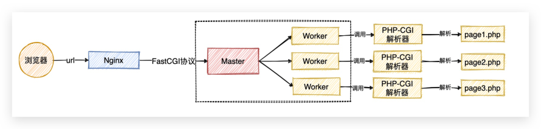
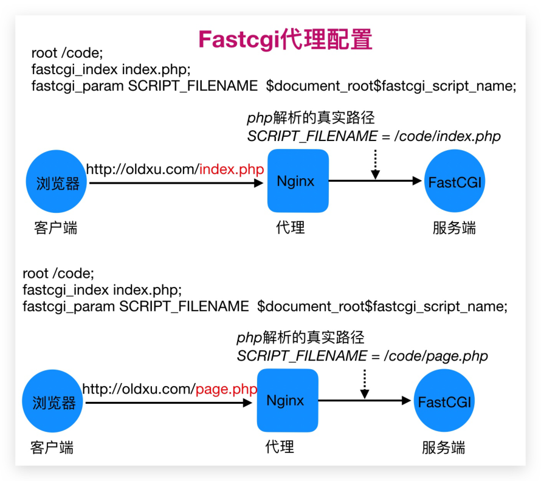
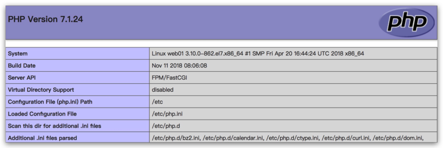
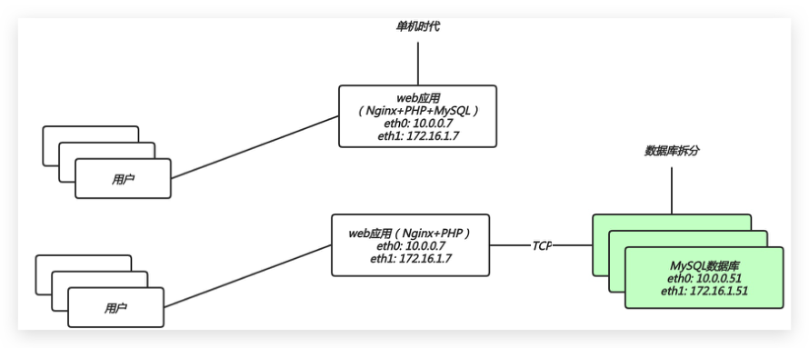
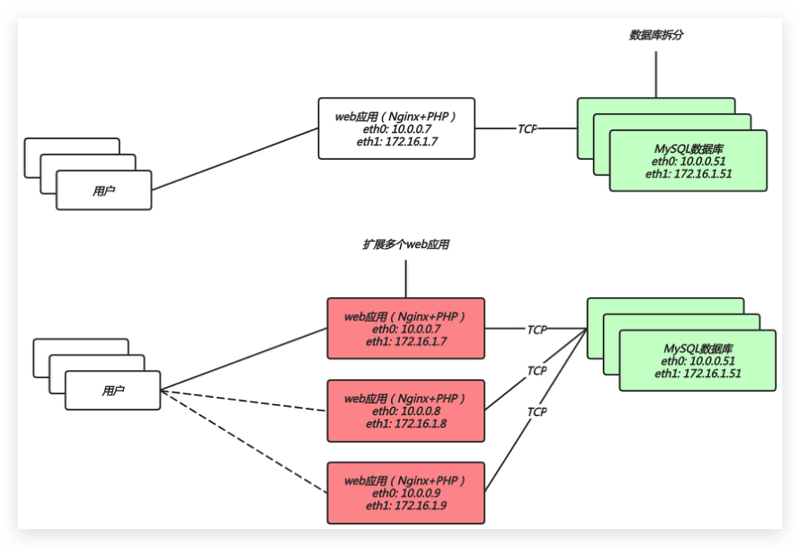
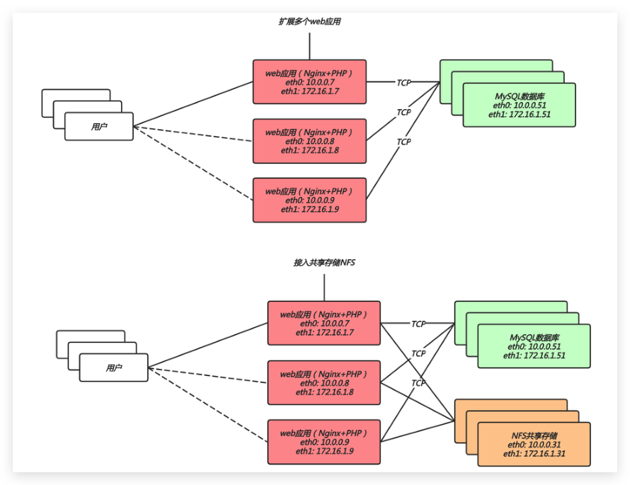
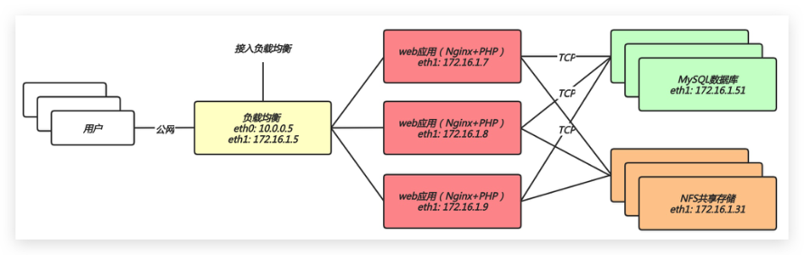

# 04.Nginx搭建流行架构

## 目录

- [1.LNMP架构基本概述](#1.lnmp架构基本概述)
  - [1.1 什么是LNMP](#1.1-什么是lnmp)
  - [1.2 LNMP实现过程](#1.2-lnmp实现过程)
  - [1.3 LNMP实现细节](#1.3-lnmp实现细节)
- [1.用户首先通过 http 协议发起请求，请求会先抵](#1.用户首先通过-http-协议发起请求请求会先抵)
- [2.Nginx 根据用户的请求进行 Location 规则匹](#2.nginx-根据用户的请求进行-location-规则匹)
- [3.Location 如果匹配到请求是静态，则由 Nginx](#3.location-如果匹配到请求是静态则由-nginx)
- [4.Location如果匹配到请求是动态，则由Nginx](#4.location如果匹配到请求是动态则由nginx)
- [5.fastgi收到后会将请求交给php-fpm管理进程；](#5.fastgi收到后会将请求交给php-fpm管理进程)
- [6.php-fpm管理进程接收到后会调用具体的worker](#6.php-fpm管理进程接收到后会调用具体的worker)
- [6.warrap进程会调用php解析器解析代码，php解](#6.warrap进程会调用php解析器解析代码php解)
- [7.如果有查询数据库操作，则由php连接数据库(用](#7.如果有查询数据库操作则由php连接数据库用)
- [8.最终数据由mysql->php->php-fpm->fastcgi-](#8.最终数据由mysql-php-php-fpm-fastcgi-)
- [2.LNMP架构环境安装](#2.lnmp架构环境安装)
  - [2.1 Nginx安装](#2.1-nginx安装)
- [1.使用官方仓库安装Nginx](#1.使用官方仓库安装nginx)
- [2.配置 Nginx 进程运行用户](#2.配置-nginx-进程运行用户)
- [3.启动Nginx，并将 Nginx 加入开机自启](#3.启动nginx并将-nginx-加入开机自启)
  - [2.2 PHP安装](#2.2-php安装)
- [1.安装 rpm 生成 repo 文件，或手动新增 repo 文件](#1.安装-rpm-生成-repo-文件或手动新增-repo-文件)
- [2.卸载低版本的php](#2.卸载低版本的php)
- [3.安装高版本的 php](#3.安装高版本的-php)
- [4.配置php-fpm用户与Nginx的运行用户保持一致](#4.配置php-fpm用户与nginx的运行用户保持一致)
- [5.启动php-fpm 并将其加入开机自启](#5.启动php-fpm-并将其加入开机自启)
  - [2.3 MySQL安装](#2.3-mysql安装)
- [1.安装 Mariadb 数据库](#1.安装-mariadb-数据库)
- [2.启动 Mariadb 数据库, 并加入开机自动](#2.启动-mariadb-数据库-并加入开机自动)
- [3.给 Mariadb 配置登陆密码，并是新密码进行登录数据](#3.给-mariadb-配置登陆密码并是新密码进行登录数据)
- [3.LNMP架构环境配置](#3.lnmp架构环境配置)
  - [3.1 Fastcgi代理语法](#3.1-fastcgi代理语法)
- [1.设置 fastcgi 服务器的地址，该地址可以指定为域名](#1.设置-fastcgi-服务器的地址该地址可以指定为域名)
- [2.设置fastcgi默认的首页文件，需要结合](#2.设置fastcgi默认的首页文件需要结合)
- [3.通过fastcgi_param设置变量，并将设置的变量传递](#3.通过fastcgi_param设置变量并将设置的变量传递)
- [4.通过图形方式展示fastcgi_index与fastcgi_param](#4.通过图形方式展示fastcgi_index与fastcgi_param)
  - [3.2 Nginx与PHP集成](#3.2-nginx与php集成)
- [1.编写Nginx配置文件](#1.编写nginx配置文件)
- [2.在 /code 目录下创建 info.php 文件](#2.在-code-目录下创建-info.php-文件)
- [3.通过浏览器访问 /info.php，返回如下页面表示](#3.通过浏览器访问-info.php返回如下页面表示)
  - [3.3 PHP与MySQL集成](#3.3-php与mysql集成)
- [1.在 /code 目录下创建 mysqli.php 文件，填入对应的](#1.在-code-目录下创建-mysqli.php-文件填入对应的)
- [2.使用 php 命令直接解析文件](#2.使用-php-命令直接解析文件)
- [3.也可以通过浏览器访问 /mysqli.php 文件，获取解析](#3.也可以通过浏览器访问-mysqli.php-文件获取解析)
- [4.部署开源产品](#4.部署开源产品)
  - [4.1 部署博客Wordpress](#4.1-部署博客wordpress)
    - [4.1.1 配置Nginx](#4.1.1-配置nginx)
- [1.配置 Nginx 虚拟主机站点，域名为 blog.oldxu.net](#1.配置-nginx-虚拟主机站点域名为-blog.oldxu.net)
- [2.检测语法，并重启 nginx 服务](#2.检测语法并重启-nginx-服务)
    - [4.1.2 配置MySQL](#4.1.2-配置mysql)
    - [4.1.3 部署Wordpress](#4.1.3-部署wordpress)
- [1.获取wordpress产品，解压并部署 wordress](#1.获取wordpress产品解压并部署-wordress)
- [2.授权目前的权限为进程运行的用户身份；](#2.授权目前的权限为进程运行的用户身份)
- [3.wordpress相关主题](#3.wordpress相关主题)
  - [4.2 部署知乎产品Wecenter](#4.2-部署知乎产品wecenter)
    - [4.2.1 配置Nginx](#4.2.1-配置nginx)
- [1.配置 Nginx 虚拟主机站点，域名为 zh.oldxu.net](#1.配置-nginx-虚拟主机站点域名为-zh.oldxu.net)
- [2.检查语法，并重启 nginx 服务](#2.检查语法并重启-nginx-服务)
    - [4.2.2 配置MySQL](#4.2.2-配置mysql)
    - [4.2.3 部署Wecenter](#4.2.3-部署wecenter)
- [1.获取Wecenter产品，解压并部署 Wecenter](#1.获取wecenter产品解压并部署-wecenter)
  - [4.3 部署相亲站点OElove](#4.3-部署相亲站点oelove)
  - [4.4 部署商城站点ShopXO](#4.4-部署商城站点shopxo)
- [6.拆分数据库至独立服务器](#6.拆分数据库至独立服务器)
  - [6.1 为何要拆分数据库](#6.1-为何要拆分数据库)
- [1.缓解web网站的压力；](#1.缓解web网站的压力)
- [2.增强数据库读写性能；](#2.增强数据库读写性能)
- [3.提高用户访问的速度；](#3.提高用户访问的速度)
  - [6.2 数据库拆分架构演变](#6.2-数据库拆分架构演变)
  - [6.3 数据库拆分环境准备](#6.3-数据库拆分环境准备)
  - [6.4 数据库拆分实现步骤](#6.4-数据库拆分实现步骤)
    - [6.4.1 web服务操作如下](#6.4.1-web服务操作如下)
- [1.备份 web01 上的数据库](#1.备份-web01-上的数据库)
- [2.将 web01 上备份的数据库拷贝至 db01 服务器上](#2.将-web01-上备份的数据库拷贝至-db01-服务器上)
    - [6.4.2 数据库服务操作如下](#6.4.2-数据库服务操作如下)
- [1.将 web01 服务器上推送的数据库备份文件恢复至](#1.将-web01-服务器上推送的数据库备份文件恢复至)
- [2.数据库导入完成后，重启数据库，使用新密码进行登](#2.数据库导入完成后重启数据库使用新密码进行登)
- [3.在新数据库上授权，允许所有网段，通过 all 账户连](#3.在新数据库上授权允许所有网段通过-all-账户连)
    - [6.4.3 修改代码指向新数据库](#6.4.3-修改代码指向新数据库)
- [1.修改 Wordpress 产品代码连接数据库的配置文件](#1.修改-wordpress-产品代码连接数据库的配置文件)
- [2.修改 wecenter 产品代码连接数据库的配置文件](#2.修改-wecenter-产品代码连接数据库的配置文件)
- [7.扩展多台相同的Web服务器](#7.扩展多台相同的web服务器)
  - [7.1 为何要扩展多台web节点](#7.1-为何要扩展多台web节点)
- [4c 16G](#4c-16g)
- [8c 64G](#8c-64g)
- [16c 128G](#16c-128g)
- [1.单台web节点如果故障，会导致业务down机；](#1.单台web节点如果故障会导致业务down机)
- [2.多台web节点能保证业务的持续稳定，扩展性](#2.多台web节点能保证业务的持续稳定扩展性)
- [3.多台web节点能有效的提升用户访问网站的速](#3.多台web节点能有效的提升用户访问网站的速)
  - [7.2 扩展多web节点架构演变](#7.2-扩展多web节点架构演变)
  - [7.3 扩展多web节点环境准备](#7.3-扩展多web节点环境准备)
  - [7.4 扩展多web节点实现步骤](#7.4-扩展多web节点实现步骤)
    - [7.4.1 LNP环境安装](#7.4.1-lnp环境安装)
- [1.创建 www 用户](#1.创建-www-用户)
- [2.安装 LNP](#2.安装-lnp)
    - [7.4.2 LNP配置导入](#7.4.2-lnp配置导入)
- [1.将 web01 的 nginx 配置文件导入到 web02](#1.将-web01-的-nginx-配置文件导入到-web02)
- [2.将 web01 的 php 配置文件导入到 web02](#2.将-web01-的-php-配置文件导入到-web02)
    - [7.4.3 导入代码文件](#7.4.3-导入代码文件)
- [1.将 web01 的代码打包传输到 web02 服务器上，在](#1.将-web01-的代码打包传输到-web02-服务器上在)
- [2.在 web02服务器上进行解压](#2.在-web02服务器上进行解压)
    - [7.4.4 启动服务验证](#7.4.4-启动服务验证)
- [8.拆分静态资源至独立服务器](#8.拆分静态资源至独立服务器)
  - [8.1 为何要拆分静态资源](#8.1-为何要拆分静态资源)
- [1.保证了多台 web 节点静态资源一致。](#1.保证了多台-web-节点静态资源一致)
- [2.有效节省多台 web 节点的存储空间。](#2.有效节省多台-web-节点的存储空间)
- [3.统一管理静态资源，便于后期推送至 CDN 进行](#3.统一管理静态资源便于后期推送至-cdn-进行)
  - [8.2 拆分静态资源架构演变](#8.2-拆分静态资源架构演变)
  - [8.3 增加共享存储环境准备](#8.3-增加共享存储环境准备)
  - [8.4 增加共享存储实现步骤](#8.4-增加共享存储实现步骤)
    - [8.4.1 配置NFS存储](#8.4.1-配置nfs存储)
- [1.安装并配置nfs](#1.安装并配置nfs)
- [2.创建共享目录，并进行授权*](#2.创建共享目录并进行授权)
- [3.启动nfs服务，并加入开机自启*](#3.启动nfs服务并加入开机自启)
    - [8.4.2 导入静态资源至存储](#8.4.2-导入静态资源至存储)
- [1.web01节点安装nfs，然后使用showmount查看服务](#1.web01节点安装nfs然后使用showmount查看服务)
- [2.查找Wordpress静态资源，然后；](#2.查找wordpress静态资源然后)
- [3.拷贝静态资源至nfs共享存储](#3.拷贝静态资源至nfs共享存储)
    - [8.4.3 节点1接入共享存储](#8.4.3-节点1接入共享存储)
- [1.web01客户端执行挂载操作](#1.web01客户端执行挂载操作)
- [2.将挂载信息加入开机自启](#2.将挂载信息加入开机自启)
    - [8.4.4 节点2接入共享存储](#8.4.4-节点2接入共享存储)
- [1.web02客户端直接挂载nfs即可](#1.web02客户端直接挂载nfs即可)
- [9.扩展节点带来的新问题](#9.扩展节点带来的新问题)
- [1.准备LNP环境](#1.准备lnp环境)
- [2.拷贝任意A或B上的配置文件,代码](#2.拷贝任意a或b上的配置文件代码)
- [3.挂载NFS存储](#3.挂载nfs存储)
- [1.DNS轮询](#1.dns轮询)
- [2.负载均衡](#2.负载均衡)
- [1.nginx反向代理；](#1.nginx反向代理)
- [2.nginx负载均衡；](#2.nginx负载均衡)
- [3.nginx负载均衡调度算法；](#3.nginx负载均衡调度算法)
- [4.nginx后端状态监测；keepalive ；](#4.nginx后端状态监测keepalive-)
- [5.nginx基于user-agent调度方式；](#5.nginx基于user-agent调度方式)
- [6.nginx基于url调度到不同的集群；](#6.nginx基于url调度到不同的集群)
- [7.如何透传真实IP；](#7.如何透传真实ip)
- [8.nginx四层负载均衡（tcp占用端口）](#8.nginx四层负载均衡tcp占用端口)
- [9.nginx动静分离场景、uwsgi、 root|alias使用技巧；](#9.nginx动静分离场景uwsgi-rootalias使用技巧)
- [10.nginx rewrite （if set break last redirect](#10.nginx-rewrite-if-set-break-last-redirect)
- [11.nginx https ( 证书；https tls实现原理；)](#11.nginx-https--证书https-tls实现原理)
- [12.nginx平滑升级，nginx+keepalived高可用；](#12.nginx平滑升级nginxkeepalived高可用)
- [13.Tomcat组件；Tomcat+nginx实现基础架构；](#13.tomcat组件tomcatnginx实现基础架构)
- [14.jvm、gc、gc算法、gc算法垃圾回收器，分代管理模](#14.jvmgcgc算法gc算法垃圾回收器分代管理模)
- [15.jvm相关的工具，jps、jvm、jconsole、............](#15.jvm相关的工具jpsjvmjconsole............)
- [16.lvs、iptables、dns](#16.lvsiptablesdns)
- [17.haproxy、jumpserver、openvpn、ansible](#17.haproxyjumpserveropenvpnansible)
- [1.两台web节点；](#1.两台web节点)
- [2.一台nfs存储；](#2.一台nfs存储)
- [3.一台mysql数据库；](#3.一台mysql数据库)
- [1.数据库所有节点都正常访问；](#1.数据库所有节点都正常访问)
- [2.所有的web服务器都使用nfs进行图片的共享；](#2.所有的web服务器都使用nfs进行图片的共享)

目录

- [1.LNMP架构基本概述](#1.lnmp架构基本概述)
  - [1.1 什么是LNMP](#1.1-什么是lnmp)
  - [1.2 LNMP实现过程](#1.2-lnmp实现过程)
  - [1.3 LNMP实现细节](#1.3-lnmp实现细节)
- [2.LNMP架构环境安装](#2.lnmp架构环境安装)
  - [2.1 Nginx安装](#2.1-nginx安装)
  - [2.2 PHP安装](#2.2-php安装)
  - [2.3 MySQL安装](#2.3-mysql安装)
- [3.LNMP架构环境配置](#3.lnmp架构环境配置)
  - [3.1 Fastcgi代理语法](#3.1-fastcgi代理语法)
  - [3.2 Nginx与PHP集成](#3.2-nginx与php集成)
  - [3.3 PHP与MySQL集成](#3.3-php与mysql集成)
- [4.部署开源产品](#4.部署开源产品)
  - [4.1 部署博客Wordpress](#4.1-部署博客wordpress)
    - [4.1.1 配置Nginx](#4.1.1-配置nginx)
    - [4.1.2 配置MySQL](#4.1.2-配置mysql)
    - [4.1.3 部署Wordpress](#4.1.3-部署wordpress)
  - [4.2 部署知乎产品Wecenter](#4.2-部署知乎产品wecenter)
    - [4.2.1 配置Nginx](#4.2.1-配置nginx)
    - [4.2.2 配置MySQL](#4.2.2-配置mysql)
    - [4.2.3 部署Wecenter](#4.2.3-部署wecenter)
  - [4.3 部署相亲站点OElove](#4.3-部署相亲站点oelove)
  - [4.4 部署商城站点ShopXO](#4.4-部署商城站点shopxo)
- [6.拆分数据库至独立服务器](#6.拆分数据库至独立服务器)
  - [6.1 为何要拆分数据库](#6.1-为何要拆分数据库)
  - [6.2 数据库拆分架构演变](#6.2-数据库拆分架构演变)
  - [6.3 数据库拆分环境准备](#6.3-数据库拆分环境准备)
  - [6.4 数据库拆分实现步骤](#6.4-数据库拆分实现步骤)
    - [6.4.1 web服务操作如下](#6.4.1-web服务操作如下)
    - [6.4.2 数据库服务操作如下](#6.4.2-数据库服务操作如下)
    - [6.4.3 修改代码指向新数据库](#6.4.3-修改代码指向新数据库)
- [7.扩展多台相同的Web服务器](#7.扩展多台相同的web服务器)
  - [7.1 为何要扩展多台web节点](#7.1-为何要扩展多台web节点)
  - [7.2 扩展多web节点架构演变](#7.2-扩展多web节点架构演变)
  - [7.3 扩展多web节点环境准备](#7.3-扩展多web节点环境准备)
  - [7.4 扩展多web节点实现步骤](#7.4-扩展多web节点实现步骤)
    - [7.4.1 LNP环境安装](#7.4.1-lnp环境安装)
    - [7.4.2 LNP配置导入](#7.4.2-lnp配置导入)
    - [7.4.3 导入代码文件](#7.4.3-导入代码文件)
    - [7.4.4 启动服务验证](#7.4.4-启动服务验证)
- [8.拆分静态资源至独立服务器](#8.拆分静态资源至独立服务器)
  - [8.1 为何要拆分静态资源](#8.1-为何要拆分静态资源)
  - [8.2 拆分静态资源架构演变](#8.2-拆分静态资源架构演变)
  - [8.3 增加共享存储环境准备](#8.3-增加共享存储环境准备)
  - [8.4 增加共享存储实现步骤](#8.4-增加共享存储实现步骤)
    - [8.4.1 配置NFS存储](#8.4.1-配置nfs存储)
    - [8.4.2 导入静态资源至存储](#8.4.2-导入静态资源至存储)
    - [8.4.3 节点1接入共享存储](#8.4.3-节点1接入共享存储)
    - [8.4.4 节点2接入共享存储](#8.4.4-节点2接入共享存储)
- [9.扩展节点带来的新问题](#9.扩展节点带来的新问题)
- [下周内容](#下周内容)
- [作业](#作业)

## 1.LNMP架构基本概述

### 1.1 什么是LNMP

LNMP 是一套技术的组合，L=Linux、N=Nginx、M=

```
[MySQL8.0|Mariadb5.5]、P=[PHP|Python]
```

nginx仅支持解析html文件；图片传输；视频传输；

不支持 php脚本文件；

### 1.2 LNMP实现过程

```
用户请求http://oldxu.net/index.php，对于
```

Nginx服务而言，是无法处理index.php这样的脚

本，那么 Nginx 该如何配置，才能支持这样的动态

请求呢？

第一步：当用户发起 HTTP 请求，请求首先被

Nginx 接收；

第二步：Nginx 通过预先定义好的 location 规

则进行匹配；

第三步：Nginx 将匹配到的动态内容，通过

fastcgi 协议传到给后端的 php 应用服务处理


### 1.3 LNMP实现细节

Nginx、PHP、MySQL之间是如何工作的

## 1.用户首先通过 http 协议发起请求，请求会先抵

达Nginx；

## 2.Nginx 根据用户的请求进行 Location 规则匹

配；

## 3.Location 如果匹配到请求是静态，则由 Nginx

读取本地直接返回；

## 4.Location如果匹配到请求是动态，则由Nginx

将请求转发给fastcgi协议；

## 5.fastgi收到后会将请求交给php-fpm管理进程；

## 6.php-fpm管理进程接收到后会调用具体的worker

工作进程

## 6.warrap进程会调用php解析器解析代码，php解

析后直接返回

## 7.如果有查询数据库操作，则由php连接数据库(用

户 密码 IP)发起查询的操作

## 8.最终数据由mysql->php->php-fpm->fastcgi-

```
>nginx->http->user
```



## 2.LNMP架构环境安装

### 2.1 Nginx安装

## 1.使用官方仓库安装Nginx

```
[root@oldxu ~]# cat
/etc/yum.repos.d/nginx.repo
[nginx]
name=nginx repo
baseurl=http://nginx.org/packages/centos/7/
$basearch/
gpgcheck=0
enabled=1
#安装Nginx
[root@oldxu ~]# yum install nginx -y
```

## 2.配置 Nginx 进程运行用户

```
[root@oldxu ~]# groupadd -g666 www
[root@oldxu ~]# useradd -u666 -g666 www
[root@oldxu ~]# sed -i '/^user/c user
www;' /etc/nginx/nginx.conf
```

## 3.启动Nginx，并将 Nginx 加入开机自启

```
[root@oldxu ~]# systemctl start nginx
[root@oldxu ~]# systemctl enable nginx
```

### 2.2 PHP安装

## 1.安装 rpm 生成 repo 文件，或手动新增 repo 文件

本地安装方式点击此链接http://cdn.xuliangwei.com/p

hp.zip

手动配置yum源

```
[root@oldxu ~]# cat
/etc/yum.repos.d/php.repo
[webtatic-php]
name = php Repository
baseurl = http://us-
east.repo.webtatic.com/yum/el7/x86_64/
gpgcheck = 0
```

## 2.卸载低版本的php

```
[root@oldxu ~]# yum remove php-mysql-5.4
php php-fpm php-common
```

## 3.安装高版本的 php

```
[root@oldxu ~]# yum -y install php71w
php71w-cli \
php71w-common php71w-devel php71w-embedded
php71w-gd \
php71w-mcrypt php71w-mbstring php71w-pdo
php71w-xml \
php71w-fpm php71w-mysqlnd php71w-opcache \
php71w-pecl-memcached php71w-pecl-redis
php71w-pecl-mongodb
```

## 4.配置php-fpm用户与Nginx的运行用户保持一致

```
[root@oldxu ~]# sed -i '/^user/c user =
www' /etc/php-fpm.d/www.conf
[root@oldxu ~]# sed -i '/^group/c group =
www' /etc/php-fpm.d/www.conf
```

## 5.启动php-fpm 并将其加入开机自启

```
[root@oldxu ~]# systemctl start php-fpm
[root@oldxu ~]# systemctl enable php-fpm
```

### 2.3 MySQL安装

## 1.安装 Mariadb 数据库

```
[root@oldxu ~]# yum install mariadb-server
mariadb -y
```

## 2.启动 Mariadb 数据库, 并加入开机自动

```
[root@oldxu ~]# systemctl start mariadb
[root@oldxu ~]# systemctl enable mariadb
```

## 3.给 Mariadb 配置登陆密码，并是新密码进行登录数据

库

```
[root@oldxu ~]# mysqladmin password
'oldxu123.com'
[root@oldxu ~]# mysql -uroot -poldxu123.com
```

## 3.LNMP架构环境配置

在配置 Nginx 与 PHP 集成之前， 我们需要先了解

Nginx 的 Fastcgi 代理配置语法

### 3.1 Fastcgi代理语法

## 1.设置 fastcgi 服务器的地址，该地址可以指定为域名

或IP地址，以及端口

```
Syntax: fastcgi_pass address;
Default: —
Context: location, if in location
```

#语法示例

```
fastcgi_pass localhost:9000;
```

## 2.设置fastcgi默认的首页文件，需要结合

```
fastcgi_param一起设置
```

```
Syntax: fastcgi_index name;
Default: —
Context: http, server, location
```

## 3.通过fastcgi_param设置变量，并将设置的变量传递

到后端的fastcgi服务

```
Syntax: fastcgi_param parameter value
[if_not_empty];
Default: —
Context: http, server, location
```

#语法示例

```
fastcgi_index index.php;
fastcgi_param SCRIPT_FILENAME
$document_root$fastcgi_script_name;
```

## 4.通过图形方式展示fastcgi_index与fastcgi_param

作用。



### 3.2 Nginx与PHP集成

## 1.编写Nginx配置文件

```
[root@oldxu ~]# cat
/etc/nginx/conf.d/php.conf
*server {
        server_name php.oldxu.net;
        listen 80;
        root /code;
        index index.php index.html;
        location ~ \.php$ {
            root /code;
```

```
            fastcgi_pass   127.0.0.1:9000;
            fastcgi_param  SCRIPT_FILENAME
 $document_root$fastcgi_script_name;
            include        fastcgi_params;
        }
}*
```

## 2.在 /code 目录下创建 info.php 文件

```
[root@oldxu ~]# cat /code/info.php
<?php
        phpinfo();
?>
```

## 3.通过浏览器访问 /info.php，返回如下页面表示

nginx 与 php 配置成功；



### 3.3 PHP与MySQL集成

## 1.在 /code 目录下创建 mysqli.php 文件，填入对应的

数据库IP、用户名、密码*

```
[root@oldxu ~]# cat /code/mysqli.php
<?php
    $servername = "localhost";
```

```
    $username = "root";
    $password = "oldxu123.com";
    // 创建连接
    $conn = mysqli_connect($servername,
$username, $password);
    // 检测连接
    if (!$conn) {
        die("Connection failed: " .
mysqli_connect_error());
    }
    echo "php连接MySQL数据库成功";
?>
```

## 2.使用 php 命令直接解析文件

```
[root@oldxu ~]# php /code/mysqli.php
```

php连接MySQL数据库成功

## 3.也可以通过浏览器访问 /mysqli.php 文件，获取解析

结果

## 4.部署开源产品

### 4.1 部署博客Wordpress

#### 4.1.1 配置Nginx

## 1.配置 Nginx 虚拟主机站点，域名为 blog.oldxu.net

```
[root@oldxu ~]# cat
/etc/nginx/conf.d/wordpress.conf
server {
    listen 80;
    server_name blog.oldxu.net;
    root /code/wordpress;
    index index.php index.html;
    location ~ \.php$ {
        fastcgi_pass   127.0.0.1:9000;
        fastcgi_index  index.php;
        fastcgi_param  SCRIPT_FILENAME
$document_root$fastcgi_script_name;
        include fastcgi_params;
    }
}
```

## 2.检测语法，并重启 nginx 服务

```
[root@oldxu ~]# nginx -t
[root@oldxu ~]# systemctl restart nginx
```

#### 4.1.2 配置MySQL

由于wordpress产品需要依赖数据库， 所以需要手动建

立数据库

```
[root@oldxu ~]# mysql -uroot -poldxu123.com
mysql> create database wordpress;
mysql> exit
```

#### 4.1.3 部署Wordpress

## 1.获取wordpress产品，解压并部署 wordress

```
[root@oldxu ~]# mkdir /code
[root@oldxu ~]# wget
https://cn.wordpress.org/wordpress-4.9.4-
zh_CN.tar.gz
[root@oldxu ~]# tar xf wordpress-4.9.4-
zh_CN.tar.gz -C /code
```

## 2.授权目前的权限为进程运行的用户身份；

```
[root@oldxu ~]# chown -R www.www
/code/wordpress/
```

## 3.wordpress相关主题

```
[root@oldxu ~]# wget
http://cdn.xuliangwei.com/Origami-1.1.0.zip
[root@oldxu ~]# wget
http://cdn.xuliangwei.com/QQ2.8.zip
```

### 4.2 部署知乎产品Wecenter

#### 4.2.1 配置Nginx

## 1.配置 Nginx 虚拟主机站点，域名为 zh.oldxu.net

```
[root@oldxu ~]# cat
/etc/nginx/conf.d/zh.conf
server {
    listen 80;
    server_name zh.oldxu.net;
    root /code/zh;
    index index.php index.html;
    location ~ \.php$ {
        root /code/zh;
        fastcgi_pass   127.0.0.1:9000;
        fastcgi_index  index.php;
        fastcgi_param  SCRIPT_FILENAME
 $document_root$fastcgi_script_name;
        include        fastcgi_params;
    }
}
```

## 2.检查语法，并重启 nginx 服务

```
[root@oldxu ~]# systemctl restart nginx
```

#### 4.2.2 配置MySQL

由于 wecenter 产品需要依赖数据库，所以需要手动建

立数据库

```
[root@oldxu ~]# mysql -uroot -poldxu123.com
MariaDB [(none)]> create database zh;
MariaDB [(none)]> exit
```

#### 4.2.3 部署Wecenter

## 1.获取Wecenter产品，解压并部署 Wecenter

## 2.授权目前的权限为进程运行的用户身份；

```
[root@oldxu ~]# chown -R www.www /code/zh/
```

### 4.3 部署相亲站点OElove

OElove官方站点

OElove下载地址

http://love.oldxu.net/index.php?m=admin&c=login

### 4.4 部署商城站点ShopXO

官方地址

下载地址

## 6.拆分数据库至独立服务器

### 6.1 为何要拆分数据库

由于单台服务器运行 LNMP 架构会导致网站访问缓

慢，当系统内存被吃满时，很容易导致系统出现

oom，从而kill掉MySQL数据库，所以需要将web和

数据库进行独立部署。

拆分数据库能解决什么问题

## 1.缓解web网站的压力；

## 2.增强数据库读写性能；

## 3.提高用户访问的速度；

### 6.2 数据库拆分架构演变



### 6.3 数据库拆分环境准备

主机名称 应用环境 外网地址 内网地址 web01 nginx+php 10.0.0.7 172.16.1.7 db01 mysql 172.16.1.51

### 6.4 数据库拆分实现步骤

#### 6.4.1 web服务操作如下

## 1.备份 web01 上的数据库

```
[root@web01 ~]# mysqldump -uroot -
p'oldxu123.com' --all-databases > mysql-
all.sql
```

## 2.将 web01 上备份的数据库拷贝至 db01 服务器上

```
[root@web01 ~]# scp mysql-all.sql
root@172.16.1.51:/tmp
```

#### 6.4.2 数据库服务操作如下

## 1.将 web01 服务器上推送的数据库备份文件恢复至

db01 服务器新数据库中

```
[root@db01 ~]# yum install mariadb mariadb-
server -y
[root@db01 ~]# systemctl start mariadb
[root@db01 ~]# systemctl enable mariadb
[root@db01 ~]# mysql -uroot < /tmp/mysql-
all.sql
```

## 2.数据库导入完成后，重启数据库，使用新密码进行登

录，并检查数据库已被导入成功

```
[root@db01 ~]# systemctl restart mariadb
[root@db01 ~]# mysql -uroot -poldxu123.com
mysql> show databases;
```

## 3.在新数据库上授权，允许所有网段，通过 all 账户连

接并操作该数据库

```
授权所有权限 grant all privileges
```

授权所有库所有表 *.*

将授权赋予给哪个用户，这个用户只能通过哪个网段过

来，%表示所有； 'all'@'%'

授权该用户登录的密码 identified by；

```
mysql> grant all on  *.* to all@'%'
identified by 'oldxu123.com';
Query OK, 0 rows affected (0.00 sec)
mysql> flush privileges;
Query OK, 0 rows affected (0.00 sec)
```

#### 6.4.3 修改代码指向新数据库

## 1.修改 Wordpress 产品代码连接数据库的配置文件

```
[root@web01 ~]# vim /code/wordpress/wp-
config.php
```

数据库名称

```
define('DB_NAME', 'wordpress');
```

数据库用户

```
define('DB_USER', 'all');
```

数据库密码

```
define('DB_PASSWORD', 'oldxu123.com');
```

数据库地址

```
define('DB_HOST', '172.16.1.51');
```

## 2.修改 wecenter 产品代码连接数据库的配置文件

```
[root@web01 zh]#  grep -iR
"oldxu123.com"|grep -v cache
system/config/database.php:  'password' =>
'oldxu123.com',
[root@web01 zh]# vim
/code/zh/system/config/database.php
'host' => '172.16.1.51',
'username' => 'all',
'password' => 'oldxu123.com',
'dbname' => 'zh',
```

## 7.扩展多台相同的Web服务器

### 7.1 为何要扩展多台web节点

单台web服务器能抗住的访问量是有限的，配置多台

web服务器能提升更高的访问速度。

## 4c 16G

## 8c 64G

## 16c 128G

扩展多台节点解决什么问题

## 1.单台web节点如果故障，会导致业务down机；

## 2.多台web节点能保证业务的持续稳定，扩展性

高；

## 3.多台web节点能有效的提升用户访问网站的速

度；

### 7.2 扩展多web节点架构演变



### 7.3 扩展多web节点环境准备

主机名称 应用环境 外网地址 内网地址 web01 nginx+php 10.0.0.7 172.16.1.7 web02 nginx+php 10.0.0.8 172.16.1.8 db01 mysql 172.16.1.51

### 7.4 扩展多web节点实现步骤

通过 web01 现有环境快速的扩展一台 web02 的服务

器，数据库统一使用 db01

#### 7.4.1 LNP环境安装

## 1.创建 www 用户

```
[root@web02 ~]# groupadd -g666 www
[root@web02 ~]# useradd -u666 -g666 www
```

## 2.安装 LNP

```
[root@web02 ~]# scp -rp
root@172.16.1.7:/etc/yum.repos.d/*
/etc/yum.repos.d/
[root@web02 ~]# scp -rp
root@172.16.1.7:/etc/pki/rpm-gpg/*
/etc/pki/rpm-gpg/
[root@web02 ~]# yum install nginx -y
[root@web02 ~]# yum -y install php71w
php71w-cli \
php71w-common php71w-devel php71w-embedded
php71w-gd \
php71w-mcrypt php71w-mbstring php71w-pdo
php71w-xml \
php71w-fpm php71w-mysqlnd php71w-opcache \
php71w-pecl-memcached php71w-pecl-redis
php71w-pecl-mongodb
```

#### 7.4.2 LNP配置导入

## 1.将 web01 的 nginx 配置文件导入到 web02

```
[root@web02 ~]# scp -rp
root@172.16.1.7:/etc/nginx /etc/
```

## 2.将 web01 的 php 配置文件导入到 web02

```
[root@web02 ~]# scp -rp
root@172.16.1.7:/etc/php-fpm.d /etc/
```

#### 7.4.3 导入代码文件

## 1.将 web01 的代码打包传输到 web02 服务器上，在

web1 上线进行打包操作

```
[root@web01 ~]# tar czf code.tar.gz /code
[root@web01 ~]# scp code.tar.gz
root@172.16.1.8:/tmp
```

## 2.在 web02服务器上进行解压

```
[root@web02 ~]# tar xf /tmp/code.tar.gz -C
/
```

#### 7.4.4 启动服务验证

启动 nginx 与 php-fpm 并加入开机自启

```
[root@web03 ~]# systemctl start nginx php-
fpm
[root@web03 ~]# systemctl enable nginx php-
fpm
```

## 8.拆分静态资源至独立服务器

### 8.1 为何要拆分静态资源

当后端的 web 节点出现多台时，会导致用户上传的图

片、视频附件等内容仅上传至一台 web 服务器，那么

其他的 web 服务器则无法访问到该图片。

如果增加一台共享存储能解决什么问题

## 1.保证了多台 web 节点静态资源一致。

## 2.有效节省多台 web 节点的存储空间。

## 3.统一管理静态资源，便于后期推送至 CDN 进行

静态资源加速

### 8.2 拆分静态资源架构演变



### 8.3 增加共享存储环境准备

主机名称 应用环境 外网地址 内网地址 web01 nginx+php 10.0.0.7 172.16.1.7 web02 nginx+php 10.0.0.8 172.16.1.8 nfs nfs 172.16.1.32 db01 mysql 172.16.1.51

### 8.4 增加共享存储实现步骤

#### 8.4.1 配置NFS存储

## 1.安装并配置nfs

```
[root@nfs ~]# yum install nfs-utils -y
[root@nfs ~]# cat /etc/exports
/data/blog
172.16.1.0/24(rw,sync,all_squash,anonuid=66
6,anongid=666)
/data/zh
172.16.1.0/24(rw,sync,all_squash,anonuid=66
6,anongid=666)
```

## 2.创建共享目录，并进行授权*

```
[root@nfs01 ~]# mkdir /data/{blog,zh} -p
[root@nfs01 ~]# chown -R www.www /data/
```

## 3.启动nfs服务，并加入开机自启*

```
[root@nfs01 ~]# systemctl restart nfs-
server
```

#### 8.4.2 导入静态资源至存储

## 1.web01节点安装nfs，然后使用showmount查看服务

端共享的资源；

```
[root@web01 ~]# yum install nfs-utils -y
[root@web01 ~]# showmount -e 172.16.1.32
Export list for 172.16.1.32:
/data/zh   172.16.1.0/24
/data/blog 172.16.1.0/24
```

## 2.查找Wordpress静态资源，然后；

首先打开浏览器->右键->检查->Network->

然后点击左上角的Select按钮->点击对应的图片

最后提取站点中对应的url地址->

```
#  http://blog.oldxu.net/wp-
content/uploads/2018/11/timg.gif
```

## 3.拷贝静态资源至nfs共享存储

```
[root@web01 ~]# cd /code/wordpress/wp-
content/
[root@web01 wp-content]# scp -rp uploads/*
root@172.16.1.32:/data/blog
```

#### 8.4.3 节点1接入共享存储

## 1.web01客户端执行挂载操作

```
[root@web01 ~]# mount -t nfs
172.16.1.32:/data/blog /code/wordpress/wp-
content/uploads/
```

## 2.将挂载信息加入开机自启

```
[root@web01 ~]# tail -1 /etc/fstab
172.16.1.32:/data/blog  /code/wordpress/wp-
content/uploads nfs defaults 0 0
[root@web01 ~]# mount -a
```

#### 8.4.4 节点2接入共享存储

## 1.web02客户端直接挂载nfs即可

```
[root@web02 ~]# mount -t nfs
172.16.1.32:/data/blog /code/wordpress/wp-
content/uploads/
```

## 2.将挂载信息加入开机自启

```
[root@web02 ~]# tail -1 /etc/fstab
172.16.1.32:/data/blog  /code/wordpress/wp-
content/uploads nfs defaults 0 0
[root@web02 ~]# mount -a
```

## 9.扩展节点带来的新问题

F1：如果我们添加了一台C应用服务器，如何能实现

快速扩展？

## 1.准备LNP环境

## 2.拷贝任意A或B上的配置文件,代码

## 3.挂载NFS存储

F2：现在有多个WEB服务器，该如何进行访问?

## 1.DNS轮询

（1）需要所有的web节点具备公网IP地址

（2）公网独立IP需要费用，而且不便宜。

（3）所有的web节点有公网IP，不安全。

（4）DNS只有轮询机制，没有健康检查功能。

## 2.负载均衡

（1）所有的web节点不需要有公网IP，能节省

成本、并保证安全

（2）能够对后端的web节点进行健康检查机

制；

（3）负载均衡有多种调度算法来满足企业不同

需求；

rr；

wrr；

url_hash；

ip_hash；

一致性hash；



下周内容

## 1.nginx反向代理；

## 2.nginx负载均衡；

## 3.nginx负载均衡调度算法；

## 4.nginx后端状态监测；keepalive ；

## 5.nginx基于user-agent调度方式；

## 6.nginx基于url调度到不同的集群；

## 7.如何透传真实IP；

## 8.nginx四层负载均衡（tcp占用端口）

## 9.nginx动静分离场景、uwsgi、 root|alias使用技巧；

## 10.nginx rewrite （if set break last redirect

permanent;）

## 11.nginx https ( 证书；https tls实现原理；)

## 12.nginx平滑升级，nginx+keepalived高可用；

## 13.Tomcat组件；Tomcat+nginx实现基础架构；

Tomcat如何实现https；

## 14.jvm、gc、gc算法、gc算法垃圾回收器，分代管理模

型（ 新生代、老年代、永久代、）

jvm调优，minorgc、majorGC、FullGC、STW；

（JAVA工程师范畴；）

## 15.jvm相关的工具，jps、jvm、jconsole、............

## 16.lvs、iptables、dns

## 17.haproxy、jumpserver、openvpn、ansible

作业

准备四台机器：

## 1.两台web节点；

## 2.一台nfs存储；

## 3.一台mysql数据库；

实现：

## 1.数据库所有节点都正常访问；

## 2.所有的web服务器都使用nfs进行图片的共享；

作业实现方式：

视频 （40分钟）

guest

guest
