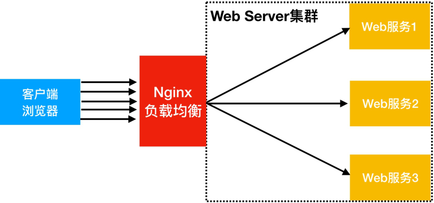
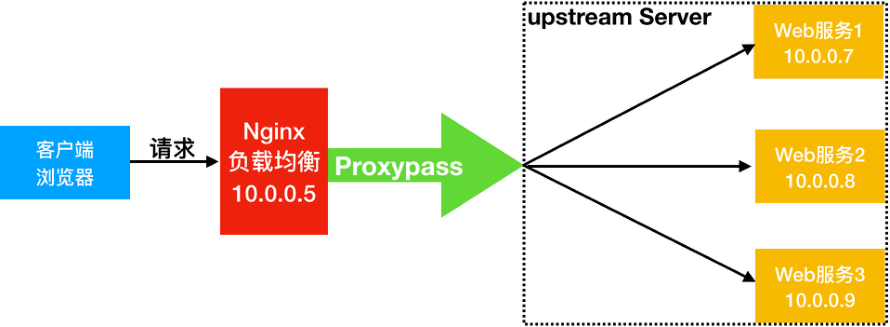
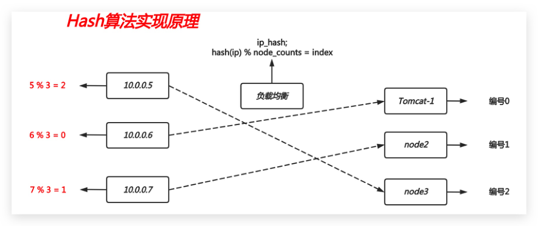
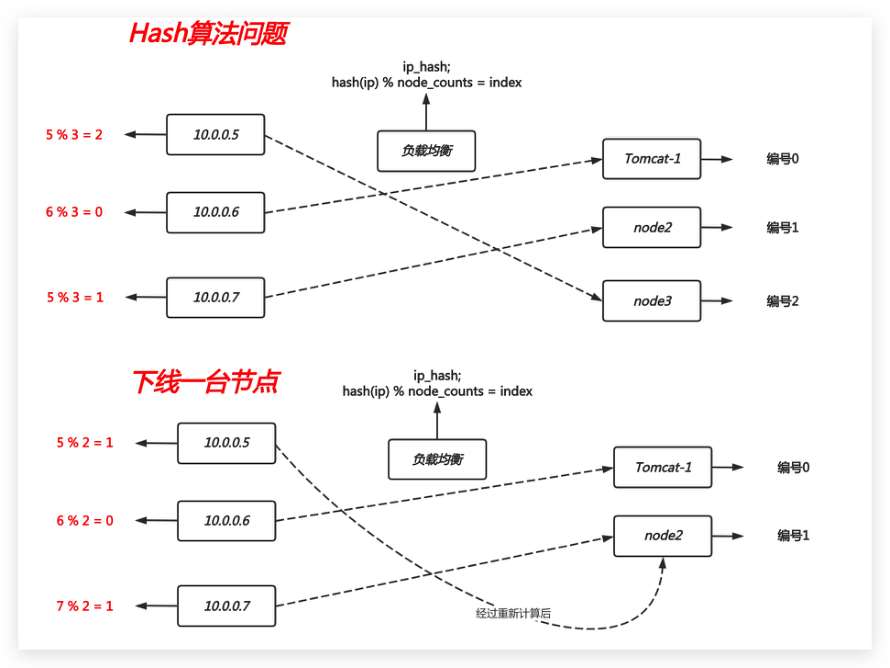
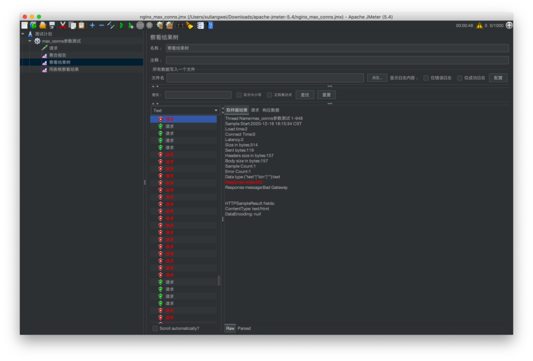
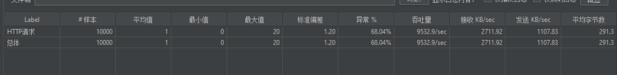
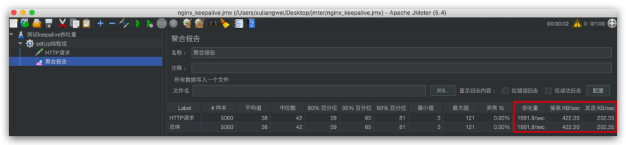
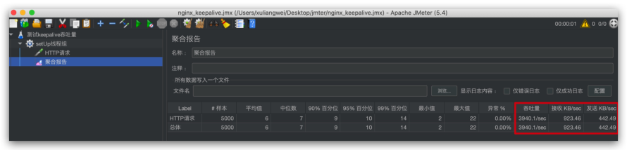

# 06.Nginx七层负载均衡

## 目录

- [1.Nginx负载均衡基本概述](#1.nginx负载均衡基本概述)
  - [1.1 什么是负载均衡](#1.1-什么是负载均衡)
  - [1.2 为什么需要负载均衡](#1.2-为什么需要负载均衡)
  - [1.3 负载均衡与代理区别](#1.3-负载均衡与代理区别)
- [2.Nginx负载均衡应用场景](#2.nginx负载均衡应用场景)
  - [2.1 四层负载均衡](#2.1-四层负载均衡)
  - [2.2 七层负载均衡](#2.2-七层负载均衡)
  - [2.3 四层与七层区别](#2.3-四层与七层区别)
- [3.Nginx负载均衡配置场景](#3.nginx负载均衡配置场景)
  - [3.1 负载均衡场景环境规划](#3.1-负载均衡场景环境规划)
  - [3.2 后端Web节点配置实例](#3.2-后端web节点配置实例)
- [1.Web01 服务器上配置为应用服务节点, 创建对应 html](#1.web01-服务器上配置为应用服务节点-创建对应-html)
- [2.Web02 服务器上配置为应用服务节点, 创建对应 html](#2.web02-服务器上配置为应用服务节点-创建对应-html)
  - [3.3.前端接入Nginx负载均衡](#3.3.前端接入nginx负载均衡)
- [1.将 lb01 配置为负载均衡，将所有请求代理至虚拟资](#1.将-lb01-配置为负载均衡将所有请求代理至虚拟资)
- [2.准备 Nginx 负载均衡需要使用的 proxy_params 文件](#2.准备-nginx-负载均衡需要使用的-proxy_params-文件)
  - [3.4.浏览器访问测试负载效果](#3.4.浏览器访问测试负载效果)
- [4.Nginx负载均衡调度算法](#4.nginx负载均衡调度算法)
  - [4.1 轮询调度算法](#4.1-轮询调度算法)
  - [4.2 加权轮询调度算法](#4.2-加权轮询调度算法)
  - [4.3 ip_hash调度算法](#4.3-ip_hash调度算法)
- [1.如果有大量来自于同一IP的请求会造成某个后端](#1.如果有大量来自于同一ip的请求会造成某个后端)
- [2.如果临时下线一台节点，会出现重新计算 hash](#2.如果临时下线一台节点会出现重新计算-hash)
  - [4.4 一致性hash调度算法](#4.4-一致性hash调度算法)
  - [4.5 url_hash调度算法](#4.5-url_hash调度算法)
- [1.用户请求nginx负载均衡器，通过 url 调度算法，](#1.用户请求nginx负载均衡器通过-url-调度算法)
- [2.由于 Cache1 节点没有对应的缓存数据，则会请求](#2.由于-cache1-节点没有对应的缓存数据则会请求)
- [3.当其他用户再次请求此前相同的 URL 时，此时调度](#3.当其他用户再次请求此前相同的-url-时此时调度)
- [5.由于 Cache1 节点已存在该URL资源缓存，所以直](#5.由于-cache1-节点已存在该url资源缓存所以直)
- [1.配置后端节点](#1.配置后端节点)
- [2.负载均衡配置 url_hash 调度算法](#2.负载均衡配置-url_hash-调度算法)
- [3.Client测试，会发现请求相同的URL，始终会被定向](#3.client测试会发现请求相同的url始终会被定向)
  - [4.6 least_conn调度算法](#4.6-least_conn调度算法)
- [5.Nginx负载均衡后端状态](#5.nginx负载均衡后端状态)
  - [5.1 max_conns限制连接数](#5.1-max_conns限制连接数)
  - [5.2 down标识关闭状态](#5.2-down标识关闭状态)
  - [5.3 backup标识备份状态](#5.3-backup标识备份状态)
  - [5.4 max_fails与fail_timeout](#5.4-max_fails与fail_timeout)
  - [5.5 keepalive提升吞吐量](#5.5-keepalive提升吞吐量)

目录

- [1.Nginx负载均衡基本概述](#1.nginx负载均衡基本概述)
  - [1.1 什么是负载均衡](#1.1-什么是负载均衡)
  - [1.2 为什么需要负载均衡](#1.2-为什么需要负载均衡)
  - [1.3 负载均衡与代理区别](#1.3-负载均衡与代理区别)
- [2.Nginx负载均衡应用场景](#2.nginx负载均衡应用场景)
  - [2.1 四层负载均衡](#2.1-四层负载均衡)
  - [2.2 七层负载均衡](#2.2-七层负载均衡)
  - [2.3 四层与七层区别](#2.3-四层与七层区别)
- [3.Nginx负载均衡配置场景](#3.nginx负载均衡配置场景)
  - [3.1 负载均衡场景环境规划](#3.1-负载均衡场景环境规划)
  - [3.2 后端Web节点配置实例](#3.2-后端web节点配置实例)
  - [3.3.前端接入Nginx负载均衡](#3.3.前端接入nginx负载均衡)
  - [3.4.浏览器访问测试负载效果](#3.4.浏览器访问测试负载效果)
- [4.Nginx负载均衡调度算法](#4.nginx负载均衡调度算法)
  - [4.1 轮询调度算法](#4.1-轮询调度算法)
  - [4.2 加权轮询调度算法](#4.2-加权轮询调度算法)
  - [4.3 ip_hash调度算法](#4.3-ip_hash调度算法)
  - [4.4 一致性hash调度算法](#4.4-一致性hash调度算法)
  - [4.5 url_hash调度算法](#4.5-url_hash调度算法)
  - [4.6 least_conn调度算法](#4.6-least_conn调度算法)
- [5.Nginx负载均衡后端状态](#5.nginx负载均衡后端状态)
  - [5.1 max_conns限制连接数](#5.1-max_conns限制连接数)
  - [5.2 down标识关闭状态](#5.2-down标识关闭状态)
  - [5.3 backup标识备份状态](#5.3-backup标识备份状态)
  - [5.4 max_fails与fail_timeout](#5.4-max_fails与fail_timeout)
  - [5.5 keepalive提升吞吐量](#5.5-keepalive提升吞吐量)

## 1.Nginx负载均衡基本概述

### 1.1 什么是负载均衡

负载均衡 Load Balance，指的是将用户访问请求所产

生的流量，进行平衡，分摊到多个应用节点处理。

负载均衡扩展了应用的服务能力，增强了应用的可用

性。

SLB;

CLB;

ULB;

### 1.2 为什么需要负载均衡

当我们的 Web服务器直接面向用户，往往要承载大量并

发请求，单台服务器难以负荷，我使用多台 WEB 服务器

组成集群，前端使用 Nginx 负载均衡，将请求分散的打

到我们的后端服务器集群中，实现负载的流量分发。从

而提升整体性能、以及系统的容灾能力。



### 1.3 负载均衡与代理区别

Nginx 负载均衡与 Nginx 反向代理不同地方在于：

Nginx 代理仅代理一台服务器基于URI来调度，调

度到不同功能的应用节点处理。

Nginx 负载均衡则是将客户端请求通过

proxy_pass 代理至一组 upstream 资源池。

## 2.Nginx负载均衡应用场景

### 2.1 四层负载均衡

四层负载均衡指的是 OSI 七层模型中的传输层，四层仅

需要对客户端的请求进行TCP/IP协议的包代理就可以实

现负载均衡。IP+Port

四层负载均衡的性能极好、因为只需要底层进行转发处

理，而不需要进行一些复杂的逻辑。


### 2.2 七层负载均衡

七层负载均衡工作在应用层，它可以完成很多应用方面

的协议请求，比如我们说的 http 应用负载均衡，它可

以实现 http 头信息的改写、安全应用规则控制、URI

匹配规则控制、及 rewrite 等功能，所以在应用层里面

可以做的内容就更多了。


### 2.3 四层与七层区别

四层负载均衡：传输层

优点：性能高，数据包在底层就进行了转发

缺点：仅支持ip:prot转发，无法完成复杂的业务

逻辑应用。

MySQL TCP 3306， Redis、SSH、等；

七层负载均衡：应用层

优点：贴近业务，支持 URI路径匹配、Header改

写、Rewrite等

缺点：性能低，数据包需要拆解到顶层才进行调

度，消耗随机端口；

## 3.Nginx负载均衡配置场景

Nginx 实现负载均衡需要两个模块：

proxy_pass 代理模块 proxy_modules

upstream 虚拟资源池模块

proxy_upstream_module

```
Syntax: upstream name { ... }
Default: -
Context: http
#upstream例
upstream backend {
    server backend1.example.com
weight=5;
    server backend2.example.com:8080;
    server unix:/tmp/backend3;
    server backup1.example.com:8080
backup;
```

```
}
server {
    location / {
        proxy_pass http://backend;
    }
}
```

### 3.1 负载均衡场景环境规划

负载均衡场景架构图规划



负载均衡场景地址规划

角色 外网IP(NAT) 内网IP(LAN) 主机名 LB01 eth0:10.0.0.5 eth1:172.16.1.5 lb01 web01 eth0:10.0.0.7 eth1:172.16.1.7 web01 web02 eth0:10.0.0.8 eth1:172.16.1.8 web02

### 3.2 后端Web节点配置实例

## 1.Web01 服务器上配置为应用服务节点, 创建对应 html

文件

```
[root@web01 ~]# cd
/etc/nginx/conf.d/web.oldxu.com.conf
server {
    listen 80;
    server_name web.oldxu.com;
    root /web;
    location / {
        index index.html;
    }
}
[root@web01 conf.d]# mkdir /web
[root@web01 conf.d]# echo "Web01..." >
/node/index.html
[root@web01 conf.d]# systemctl restart
nginx
```

## 2.Web02 服务器上配置为应用服务节点, 创建对应 html

文件

```
[root@web02 ~]# cat
/etc/nginx/conf.d/web.oldxu.com.conf
server {
    listen 80;
    server_name web.oldxu.com;
    root /web;
    location / {
        index index.html;
    }
}
[root@web02 conf.d]# mkdir /web
[root@web02 conf.d]# echo "Web02..." >
/node/index.html
[root@web02 conf.d]# systemctl restart
nginx
```

### 3.3.前端接入Nginx负载均衡

## 1.将 lb01 配置为负载均衡，将所有请求代理至虚拟资

源池

```
[root@lb01 ~]# cat
/etc/nginx/conf.d/proxy_web.oldxu.com.conf
upstream web {
    server 172.16.1.7:80;
    server 172.16.1.8:80;
}
server {
```

```
    listen 80;
    server_name web.oldxu.com;
    location / {
        proxy_pass http://web;
        include proxy_params;
    }
}
[root@lb01 conf.d]# systemctl restart nginx
```

## 2.准备 Nginx 负载均衡需要使用的 proxy_params 文件

```
[root@Nginx ~]# vim /etc/nginx/proxy_params
proxy_set_header Host $http_host;
proxy_set_header X-Real-IP $remote_addr;
proxy_set_header X-Forwarded-For
$proxy_add_x_forwarded_for;
proxy_connect_timeout 30;
proxy_send_timeout 60;
proxy_read_timeout 60;
proxy_buffering on;
proxy_buffer_size 64k;
proxy_buffers 4 64k;
```

### 3.4.浏览器访问测试负载效果

使用浏览器访问 web.oldxu.com，然后进行刷新测试。


## 4.Nginx负载均衡调度算法

调度算法 概述 轮询 按时间顺序逐一分配到不同的后端服务

器(默认)

weight 加权轮询,weight值越大,分配到的访问

几率越高

ip_hash 每个请求按访问IP的hash结果分配,这样

来自同一IP的固定访问一个后端服务器

url_hash 根据请求uri进行调度到指定节点 least_conn 将请求传递到活动连接数最少的服务

器。

### 4.1 轮询调度算法

轮询调度算法的原理是将每一次用户的请求，轮流分配

给内部中的服务器。

轮询算法的优点是其简洁性，它无需记录当前所有连接

的状态，所以它是一种无状态调度。

```
upstream load_pass {
    server 172.16.1.7:80;
    server 172.16.1.8:80;
}
server {
    listen 80;
    server_name web.oldxu.com;
```

```
    location  / {
        proxy_pass http://load_pass;
        include proxy_params;
}
```

### 4.2 加权轮询调度算法

轮询调度算法没有考虑每台服务器的处理能力，在实际

情况中，由于每台服务器的配置、安装的业务应用等不

同，其处理能力会不一样。所以，我们根据服务器的不

同处理能力，给每个服务器分配不同的权值，使其能够

接受相应权值数的服务请求。

```
upstream load_pass {
    server 172.16.1.7:80 weight=5;
    server 172.16.1.8:80 weight=1;
}
server {
    listen 80;
    server_name web.oldxu.com;
```

```
    location  / {
        proxy_pass http://load_pass;
        include proxy_params;
}
```

### 4.3 ip_hash调度算法

ip_hash 是基于用户请求的IP，对该 IP 进行 hash 运

算，根据 hash运算的值，将请求分配到后端特定的一台

节点进行处理。ip_hash 算法实现公式：hash(ip) %

```
node_counts = index
```



如何配置 ip_hash 调度算法

```
upstream load_pass {
    ip_hash;
    server 172.16.1.7:80;
    server 172.16.1.8:80;
}
server {
    listen 80;
    server_name web.oldxu.com;
```

```
    location  / {
        proxy_pass http://load_pass;
        include proxy_params;
}
```

ip_hash 调度算法会带来两个问题

## 1.如果有大量来自于同一IP的请求会造成某个后端

节点流量过大，而其他节点无流量

## 2.如果临时下线一台节点，会出现重新计算 hash

值，官方建议将下线节点标记为 down状态，以保

留客户端IP地址的当前哈希值。（如下图所

示：）



如果有大量的用户调度到某一节点，而该节点刚好故

障，则该算法会重新计算结果，从而造成大量的用户被

转移其他节点处理，而需要重新建立会话。

### 4.4 一致性hash调度算法

为了规避上述hash情况，一致性hash算法就诞生，一

致性Hash算法也是使用取模的方法，但不是对服务器节

点数量进行取模，而是对2的32方取模。即，一致性

Hash算法将整个Hash空间组织成一个虚拟的圆环，

Hash函数值的空间为0 ~ 2^32 - 1，整个哈希环如

下：

一致性Hash文档

一致性Hash参考地址

Hash算法原理

Hash算法增加节点

Hash算法减少节点

Hash算法数据倾斜问题

### 4.5 url_hash调度算法

根据用户请求的 URL 进行 hash 取模，根据 hash运算

的值，将请求分配到后端特定的一台节点进行处理。

URL 算法使用场景如下：client-->nginx-->url_hash--

```
>cache1-->app
```

## 1.用户请求nginx负载均衡器，通过 url 调度算法，

将请求调度至Cache1

## 2.由于 Cache1 节点没有对应的缓存数据，则会请求

后端获取，然后返回数据，并将数据缓存起来；

## 3.当其他用户再次请求此前相同的 URL 时，此时调度

器依然会调度至 Cache1 节点处理；

## 5.由于 Cache1 节点已存在该URL资源缓存，所以直

接将缓存数据进行返回；能大幅提升网站的响应；

## 1.配置后端节点

```
# web1节点
[root@web01 ~]# echo "web1 Url1" >
/code/node/url1.html
[root@web01 ~]# echo "web1 Url2" >
/code/node/url2.html
# web2节点
[root@web02 ~]# echo "web2 Url1" >
/code/node/url1.html
[root@web02 ~]# echo "web2 Url2" >
/code/node/url2.html
```

## 2.负载均衡配置 url_hash 调度算法

```
upstream load_pass {
```

请求同一个url，会始终定向到同一个服务器节点，

consistent表示使用一致性hash算法

```
    hash $request_uri consistent;
    server 172.16.1.7:80;
    server 172.16.1.8:80;
}
server {
    listen 80;
    server_name web.oldxu.com;
```

```
    location  / {
        proxy_pass http://load_pass;
        include proxy_params;
}
```

## 3.Client测试，会发现请求相同的URL，始终会被定向

至某特定后端节点。

```
[root@client ~]# curl -HHost:web.oldxu.com
http://10.0.0.5/url1.html
web2 Url1
[root@client ~]# curl -HHost:web.oldxu.com
http://10.0.0.5/url1.html
web2 Url1
[root@client ~]# curl -HHost:web.oldxu.com
http://10.0.0.5/url1.html
web2 Url1
```

### 4.6 least_conn调度算法

least_conn调度算法实现原理，哪台节点连接数少，则

将请求调度至哪台节点。

假设：A节点有1000个连接 、b节点有500连接，如果此

时新的连接进入会分发给b节点

```
upstream load_pass {
    least_conn;
    server 172.16.1.7:80;
    server 172.16.1.8:80;
}
server {
    listen 80;
    server_name web.oldxu.com;
```

```
    location  / {
        proxy_pass http://load_pass;
        include proxy_params;
}
```

## 5.Nginx负载均衡后端状态

后端 Web 节点在前端 Nginx 负载均衡调度中的状态

状态 概述 down 当前的server暂时不参与负载均衡 backup 预留的备份服务器 max_fails 允许请求失败的次数 fail_timeout 经过max_fails失败后, 服务暂停时间 max_conns 限制最大的接收连接数

### 5.1 max_conns限制连接数

max_conns 用来限制每个后端节点能够接收的最大TCP

连接数，如果超过此连接则会抛出错误。

```
[root@lb01 ~]# cat proxy_web.oldxu.com.conf
upstream load_pass {
    server 172.16.1.7:80 max_conns=2;
    server 172.16.1.8:80 max_conns=2;
}
server {
    listen 80;
    server_name web.oldxu.com;
```

```
    location  / {
        proxy_pass http://load_pass;
        include proxy_params;
}
```

通过 jmter 压力测试发现，当后端节点处理的连接数非

常多的时候，当大于4个连接，其余的连接则会抛出异

常，也就是每次仅能满足4个连接。jmter-max_conns测

试用例



### 5.2 down标识关闭状态

down 将服务器标记为不可用状态。

```
[root@lb01 ~]# cat proxy_web.oldxu.com.conf
upstream load_pass {
    server 172.16.1.7:80 down;  #一般用于停机
```

维护

```
    server 172.16.1.8:80;
}
server {
    listen 80;
    server_name web.oldxu.com;
```

```
    location  / {
        proxy_pass http://load_pass;
        include proxy_params;
```

```
}
```

### 5.3 backup标识备份状态

backup 将服务器标记为备份服务器。当主服务器不可

用时，将请求传递至备份服务器处理。

```
[root@lb01 ~]# cat proxy_web.oldxu.com.conf
upstream load_pass {
    server 172.16.1.7:80 backup;
    server 172.16.1.8:80;
    server 172.16.1.9:80;
}
server {
    listen 80;
    server_name web.oldxu.com;
```

```
    location  / {
        proxy_pass http://load_pass;
        include proxy_params;
}
```

### 5.4 max_fails与fail_timeout

max_fails=2 服务器通信失败尝试2次，任然失败，认

为服务器不可用；

fail_timeout=5s 服务器通信失败后，每5s探测一次节

点是否恢复可用；

在 fail_timeout设定的时间内，与服务器连接失败达

到 max_fails 则认为服务器不可用；

```
[root@lb01 ~]# cat proxy_web.oldxu.com.conf
upstream load_pass {
    server 172.16.1.7:80 max_fails=2
fail_timeout=5s;
    server 172.16.1.8:80 max_fails=2
fail_timeout=5s;
}
server {
    listen 80;
    server_name web.oldxu.com;
```

```
    location  / {
        proxy_pass http://load_pass;
        include proxy_params;
}
```

### 5.5 keepalive提升吞吐量

keepalive 主要是与后端服务器激活缓存，也就是长连

接，主要用来提升网站吞吐量。

默认情况下：没有与后端服务启用长连接功能，当有请

求时，需要建立连接、维护连接、关闭连接，所以会存

在网络消耗，但如果将所有的连接都缓存了，当连接空

闲了又会占用其系统资源，所以可以使用 keepalive 参

数来激活缓存，同时还可以使用 keepalive 参数来限制

最大的空闲连接数；

```
upstream http_backend {
    server 127.0.0.1:8080;
    keepalive 16;
}
server {
    ...
    location /http/ {
        proxy_pass http://http_backend;
        proxy_http_version 1.1;
        proxy_set_header Connection "";
        ...
    }
}
```

没有启用 keepalive 参数前，对集群进行压力测试





配置 Nginx 负载均衡启用 keepalive 参数：

```
[root@lb01 ~]# cat proxy_web.oldxu.com.conf
upstream web {
    server 172.16.1.7:80;
```

```
    server 172.16.1.8:80;
```

```
    keepalive 16;                #最大的空闲
```

连接数

```
    keepalive_timeout 100s;      #空闲连接的
```

超时时间

```
}
server {
    listen 80;
    server_name web.oldxu.com;
    location / {
        proxy_pass http://web;
        proxy_http_version 1.1;
        proxy_set_header Connection "";
    }
}
```

对启用 keepalive 参数后的集群进行压力测试，发现整

体性能提升了一倍。jmter-keepalive测试用例


