# 05.Nginx反向代理服务

## 目录

- [1.Nginx代理概述](#1.nginx代理概述)
  - [1.1 什么是代理](#1.1-什么是代理)
  - [1.2 无代理场景](#1.2-无代理场景)
  - [1.2 有代理场景](#1.2-有代理场景)
- [2.Nginx正向代理（个人）](#2.nginx正向代理个人)
  - [2.1 客户端科学上网](#2.1-客户端科学上网)
  - [2.2 客户端提速](#2.2-客户端提速)
  - [2.3 客户端缓存](#2.3-客户端缓存)
  - [2.4 客户端授权](#2.4-客户端授权)
- [3.Nginx反向代理（企业）](#3.nginx反向代理企业)
  - [3.1 路由功能](#3.1-路由功能)
  - [3.2 负载均衡](#3.2-负载均衡)
  - [3.3 动静分离](#3.3-动静分离)
  - [3.4 数据缓存](#3.4-数据缓存)
- [4.正向与反向代理区别](#4.正向与反向代理区别)
- [5.Nginx可代理的协议](#5.nginx可代理的协议)
  - [5.1 Nginx支持代理的协议](#5.1-nginx支持代理的协议)
  - [5.2 Nginx常用的代理协议](#5.2-nginx常用的代理协议)
- [6.Nginx反向代理实践](#6.nginx反向代理实践)
  - [6.1 配置语法指令](#6.1-配置语法指令)
  - [6.2 代理配置场景](#6.2-代理配置场景)
    - [6.2.1 环境准备](#6.2.1-环境准备)
    - [6.2.2 web节点配置](#6.2.2-web节点配置)
    - [6.2.3 proxy节点配置](#6.2.3-proxy节点配置)
    - [6.2.4 抓包分析访问过程](#6.2.4-抓包分析访问过程)
  - [6.3 代理相关配置参数](#6.3-代理相关配置参数)
    - [6.3.1 proxy_set_header](#6.3.1-proxy_set_header)
    - [6.3.2 proxy_http_version](#6.3.2-proxy_http_version)
    - [6.3.3 proxy_connect_timeout](#6.3.3-proxy_connect_timeout)
    - [6.3.4 proxy_read_timeout](#6.3.4-proxy_read_timeout)
    - [6.3.5 proxy_send_timeout](#6.3.5-proxy_send_timeout)
    - [6.3.6 proxy_buffer(缓冲区)](#6.3.6-proxy_buffer缓冲区)
- [1）启用缓冲时，nginx代理服务器将尽快的接收响应](#1启用缓冲时nginx代理服务器将尽快的接收响应)
- [2）proxy_buffer_size用于控制代理服务读取后端第](#2proxy_buffer_size用于控制代理服务读取后端第)
- [3）proxy_buffers是代理服务器为单个连接设置响应](#3proxy_buffers是代理服务器为单个连接设置响应)
- [256KB，那么大于256KB的部分会缓存到](#256kb那么大于256kb的部分会缓存到)
    - [6.3.7 代理参数总结](#6.3.7-代理参数总结)

目录

- [1.Nginx代理概述](#1.nginx代理概述)
  - [1.1 什么是代理](#1.1-什么是代理)
  - [1.2 无代理场景](#1.2-无代理场景)
  - [1.2 有代理场景](#1.2-有代理场景)
- [2.Nginx正向代理（个人）](#2.nginx正向代理个人)
  - [2.1 客户端科学上网](#2.1-客户端科学上网)
  - [2.2 客户端提速](#2.2-客户端提速)
  - [2.3 客户端缓存](#2.3-客户端缓存)
  - [2.4 客户端授权](#2.4-客户端授权)
- [3.Nginx反向代理（企业）](#3.nginx反向代理企业)
  - [3.1 路由功能](#3.1-路由功能)
  - [3.2 负载均衡](#3.2-负载均衡)
  - [3.3 动静分离](#3.3-动静分离)
  - [3.4 数据缓存](#3.4-数据缓存)
- [4.正向与反向代理区别](#4.正向与反向代理区别)
- [5.Nginx可代理的协议](#5.nginx可代理的协议)
  - [5.1 Nginx支持代理的协议](#5.1-nginx支持代理的协议)
  - [5.2 Nginx常用的代理协议](#5.2-nginx常用的代理协议)
- [6.Nginx反向代理实践](#6.nginx反向代理实践)
  - [6.1 配置语法指令](#6.1-配置语法指令)
  - [6.2 代理配置场景](#6.2-代理配置场景)
    - [6.2.1 环境准备](#6.2.1-环境准备)
    - [6.2.2 web节点配置](#6.2.2-web节点配置)
    - [6.2.3 proxy节点配置](#6.2.3-proxy节点配置)
    - [6.2.4 抓包分析访问过程](#6.2.4-抓包分析访问过程)
  - [6.3 代理相关配置参数](#6.3-代理相关配置参数)
    - [6.3.1 proxy_set_header](#6.3.1-proxy_set_header)
    - [6.3.2 proxy_http_version](#6.3.2-proxy_http_version)
    - [6.3.3 proxy_connect_timeout](#6.3.3-proxy_connect_timeout)
    - [6.3.4 proxy_read_timeout](#6.3.4-proxy_read_timeout)
    - [6.3.5 proxy_send_timeout](#6.3.5-proxy_send_timeout)
    - [6.3.6 proxy_buffer(缓冲区)](#6.3.6-proxy_buffer缓冲区)
    - [6.3.7 代理参数总结](#6.3.7-代理参数总结)

## 1.Nginx代理概述

### 1.1 什么是代理

代理代理，代为办理，对于代理一词而言，我们并不

陌生，在我们日常生活中常常用到。

比如代理理财、代理租房、代理收货等等

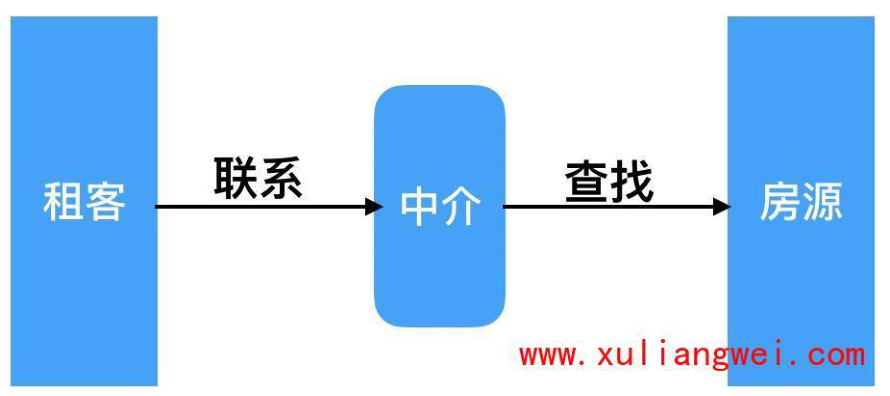

### 1.2 无代理场景

在没有使用代理的场景下，客户端都是直接请求服务

端，服务端直接响应客户端。

比如：抖音在初创阶段时没太多人关注，单台服务器

足以支撑业务运行。但随着事件推移，xx门事件的发

生，引得抖音迅速蹿红，那么此时单台服务器难以支

撑海量的用户请求，甚至一度造成服务瘫痪。

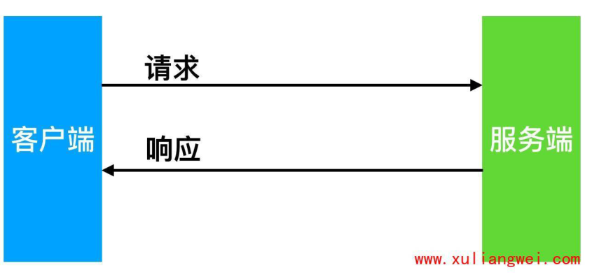

### 1.2 有代理场景

在使用代理的场景下，客户端无法直接向服务端发起

请求，需要先请求代理服务，由代理服务代为请求后

端节点，以实现客户端与后端通信；

使用代理会增加网络延迟，但能提高系统整体的响

应，以此承担海量的并发请求；

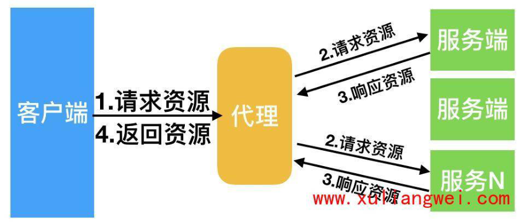

## 2.Nginx正向代理（个人）

正向代理，(内部上网) 客户端<-->代理->服务端

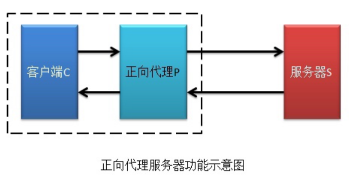

### 2.1 客户端科学上网

比如：科学的方式访问Google

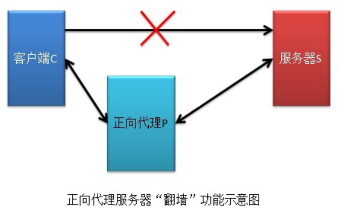

### 2.2 客户端提速

比如：游戏加速器。

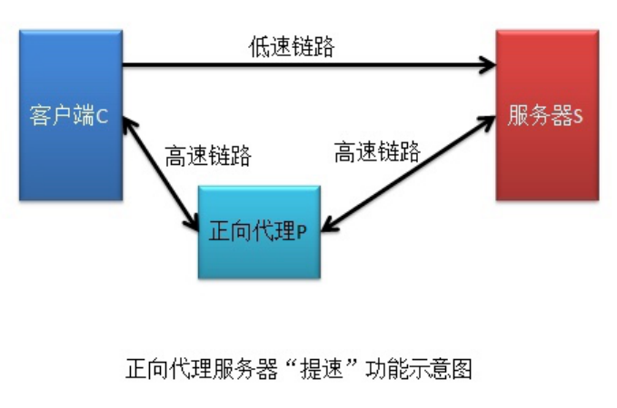

### 2.3 客户端缓存

比如：下载资源，可以先查看代理服务是否有，如果有

直接通过代理获取。

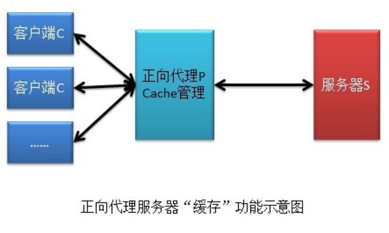

### 2.4 客户端授权

很多公司为了安全，连接外网需要通过防火墙，防火墙

可以配置规则，允许谁可以上外网，谁不可以上外网。

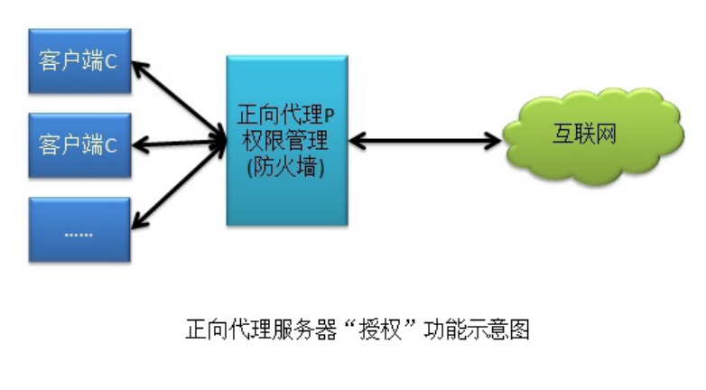

## 3.Nginx反向代理（企业）

反向代理，用于公司集群架构中，客户端->代理<-->

服务端

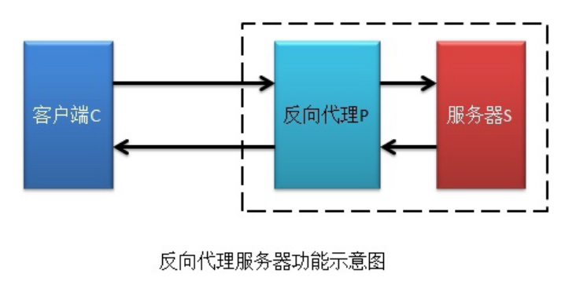

### 3.1 路由功能

根据用户请求的URI调度到【不同的功能的集群服务

器】进行处理。

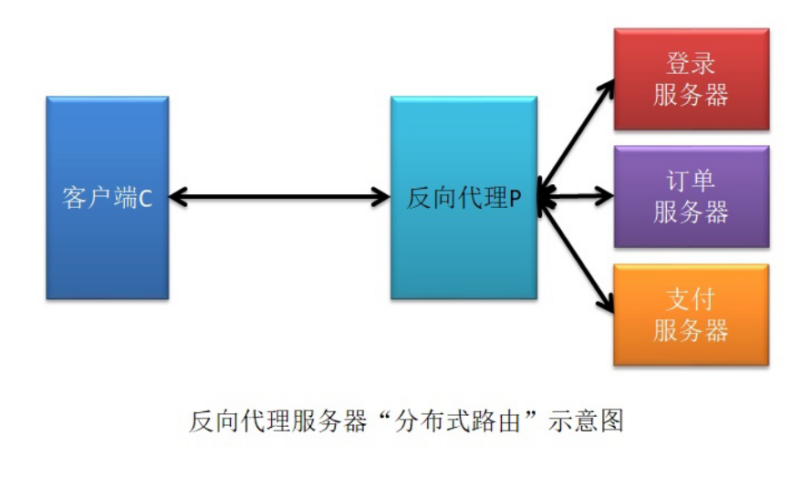

### 3.2 负载均衡

将用户发送的请求，通过负载均衡调度算法挑选一台合

适的节点进行请求处理。

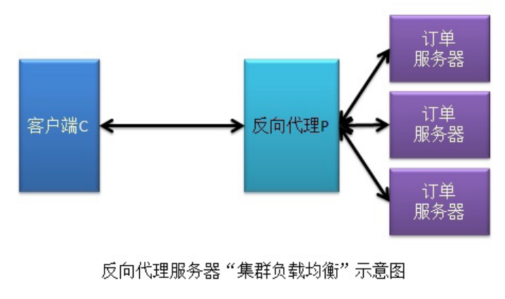

### 3.3 动静分离

根据用户请求的URI进行区分，将动态资源调度至应用

服务器处理，将静态资源调度至静态资源服务器处理。

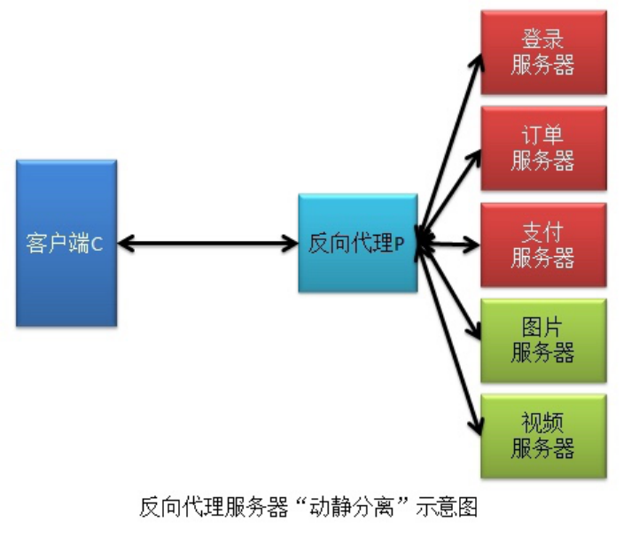

### 3.4 数据缓存

将后端查询的数据存储至反向代理上缓存，可以加速用

户获取资源。

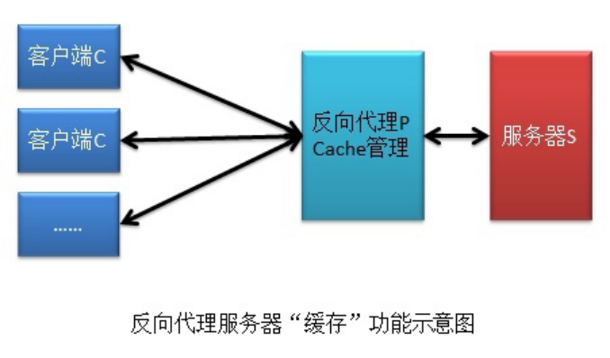

## 4.正向与反向代理区别

区别在于形式上服务的"对象"不一样、其次架设的位

置点不一样

正向代理代理的对象是【客户端】，为客户端服务

pass

反向代理代理的对象是【服务端】，为服务端服务

user-->正向代理（路由器）--> 反向代理（缓存）-

-> 服务器

## 5.Nginx可代理的协议

### 5.1 Nginx支持代理的协议

Nginx作为代理服务，支持的代理协议非常的多，如

下图所示

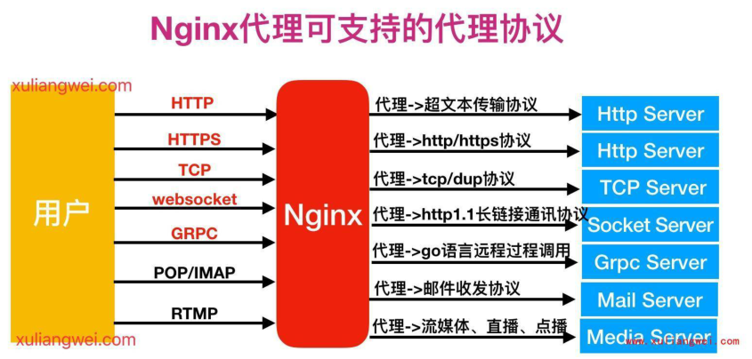

### 5.2 Nginx常用的代理协议

通常情况下，我们将Nginx作为反向代理，常常会用

到如下几种代理协议，如下图所示

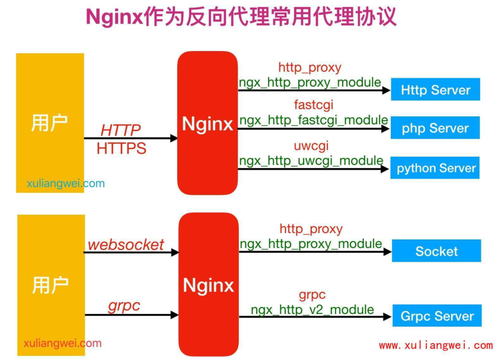

## 6.Nginx反向代理实践

### 6.1 配置语法指令

```
Syntax: proxy_pass URL;
Default:    —
Context:    location, if in location,
limit_except
proxy_pass http://localhost:8000/uri/
http://10.0.0.7:8000/uri/
```

### 6.2 代理配置场景

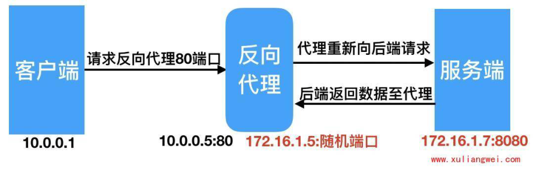

#### 6.2.1 环境准备

角色 外网IP(NAT) 内网IP(LAN) 主机名 Proxy eth0:10.0.0.5 eth1:172.16.1.5 lb01 web01 eth1:172.16.1.7 web01

#### 6.2.2 web节点配置

web01服务配置一个网站，监听在`8080`，此时网站仅

`172`网段的用户能访问

```
[root@web01 ~]# cd
/etc/nginx/conf.d/web.oldxu.net.conf
server {
    listen 8080;
    server_name web.oldxu.net;
```

```
    location / {
        root /code_8080;
        index index.html;
    }
}
[root@web01 conf.d]# mkdir /code_8080
[root@web01 conf.d]# echo "web01-7..."
>/code_8080/index.html
[root@web01 conf.d]# systemctl restart
nginx
```

#### 6.2.3 proxy节点配置

proxy代理服务配置，让外网用户能够通过代理服务访问

到后端的172.16.1.7的8080端口站点内容

```
[root@lb01 conf.d]# cat
/etc/nginx/conf.d/proxy_web.oldxu.net.conf
server {
    listen 80;
    server_name web.oldxu.net;
```

```
    location / {
        proxy_pass http://172.16.1.7:8080;
    }
}
[root@lb01 conf.d]# systemctl enable nginx
[root@lb01 conf.d]# systemctl start nginx
```

#### 6.2.4 抓包分析访问过程

抓包分析Nginx代理处理整个请求的过程

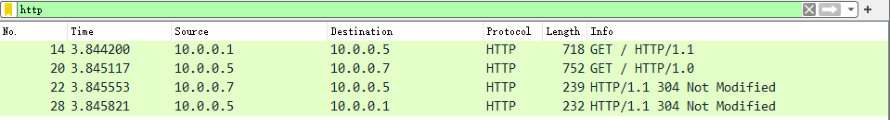

### 6.3 代理相关配置参数

#### 6.3.1 proxy_set_header

添加发往后端服务器的请求头信息,

```
Syntax: proxy_set_header field value;
Default:    proxy_set_header Host
$proxy_host;
            proxy_set_header Connection
close;
Context:    http, server, location
```

客户端请求Host的值是www.oldxu.net, 那么代理服

务会像后端请求时携带Host变量为www.oldxu.net

```
proxy_set_header Host $http_host;
```

将$remote_addr的值放进变量X-Real-IP中，

$remote_addr的值为客户端的ip

```
proxy_set_header X-Real-IP $remote_addr;
```

客户端通过代理服务访问后端服务，后端服务会通过该变

量会记录真实客户端地址

```
proxy_set_header X-Forwarded-For
$proxy_add_x_forwarded_for;
```

#### 6.3.2 proxy_http_version

代理的向后端请求时使用的HTTP协议版本。默认1.0版本

```
Syntax: proxy_http_version 1.0 | 1.1;
Default: proxy_http_version 1.0;
Context: http, server, location
This directive appeared in version 1.1.4
```

#### 6.3.3 proxy_connect_timeout

#nginx代理与后端服务器 "连接超时" 时间(代理连接超

时)

```
Syntax: proxy_connect_timeout time;
Default: proxy_connect_timeout 60s;
Context: http, server, location
```

#### 6.3.4 proxy_read_timeout

#nginx代理等待后端服务器 "响应（Header）超时" 时

间

```
Syntax: proxy_read_timeout time;
Default:    proxy_read_timeout 60s;
Context:    http, server, location
```

#### 6.3.5 proxy_send_timeout

#后端服务器 "数据（Data）回传给nginx代理超时" 时

间

```
Syntax: proxy_send_timeout time;
Default: proxy_send_timeout 60s;
Context: http, server, location
```

#### 6.3.6 proxy_buffer(缓冲区)

## 1）启用缓冲时，nginx代理服务器将尽快的接收响应

Header以及响应报文，并将其保存到

```
proxy_buffer_size(Headers) 和
proxy_buffers(data) 设置的缓冲区中。
# proxy_buffer代理缓冲区
Syntax: proxy_buffering on | off;
Default: proxy_buffering on;
Context: http, server, location
```

如果响应报文过大无法存储至内存，则会将其中部分保

存到磁盘上的临时文件中。写入临时文件由

proxy_temp_path（控制临时存储目录）

proxy_max_temp_file_size（控制临时存储目录大

小） 和 proxy_temp_file_write_size（控制一次写

入临时文件的数据大小），临时文件最大大小由

```
proxy_buffer_size 和 proxy_buffers 限制。但当禁
```

用缓冲时，nginx代理服务器会在接收到响应时立即同

步传递给客户端。nginx代理服务器不会读取整个响

应。

## 2）proxy_buffer_size用于控制代理服务读取后端第

一部分响应Header的缓冲区大小。

```
Syntax: proxy_buffer_size size;
Default: proxy_buffer_size 4k|8k;
Context: http, server, location
# proxy_buffer_size 64k;
```

## 3）proxy_buffers是代理服务器为单个连接设置响应

缓冲区 “数量” 和 “大小” 。

如果一个后端服务所返回的页面大小为256KB，那么会

为其分配4个64KB的缓冲区来缓存，如果页面大小大于

## 256KB，那么大于256KB的部分会缓存到

proxy_temp_path 指定的路径中。但是这并不是好方

法，因为内存中的数据处理速度要快于硬盘。所以这个

值一般建议设置为站点响应所产生的页面大小中间值，

如果站点大部分脚本所产生的页面大小为256KB，那么

可以把这个值设置为 “16 16k”、“4 64k” 等。

```
Syntax: proxy_buffers number size;
Default: proxy_buffers 8 4k|8k;
Context: http, server, location
#proxy_buffers 4 64k;
```

#### 6.3.7 代理参数总结

代理网站常用优化配置如下，将配置写入一个新文件，调

用时使用include即可

```
[root@lb01 ~]# vim /etc/nginx/proxy_params
proxy_http_version 1.1;
proxy_set_header Host $http_host;
proxy_set_header X-Real-IP $remote_addr;
proxy_set_header X-Forwarded-For
$proxy_add_x_forwarded_for;
proxy_connect_timeout 30;
```

```
proxy_send_timeout 60;
proxy_read_timeout 60;
proxy_buffering on;
proxy_buffer_size 64k;
proxy_buffers 4 64k;
```

使用include方式，便于后续Location的重复使用。

```
location / {
    proxy_pass http://127.0.0.1:8080;
    include proxy_params;
}
```

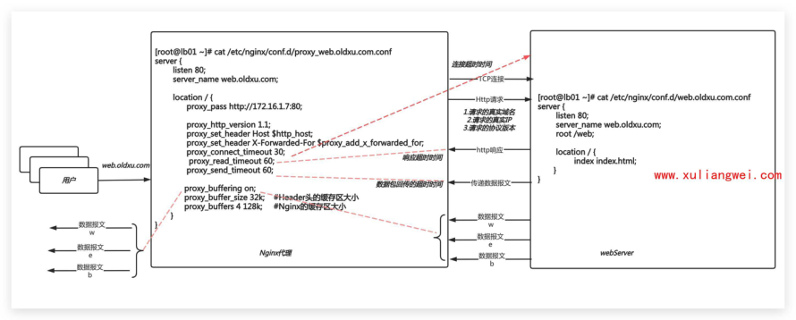
