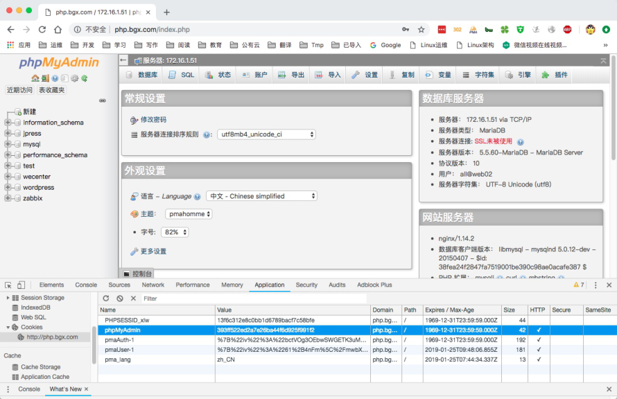
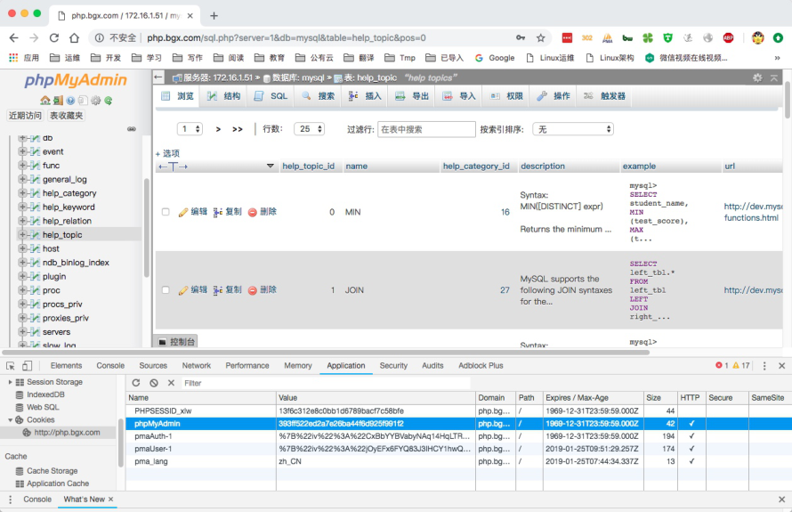
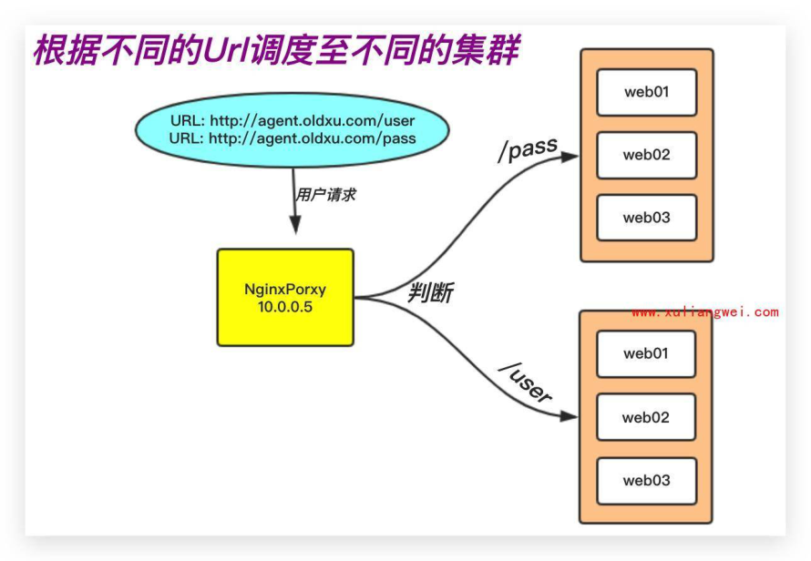
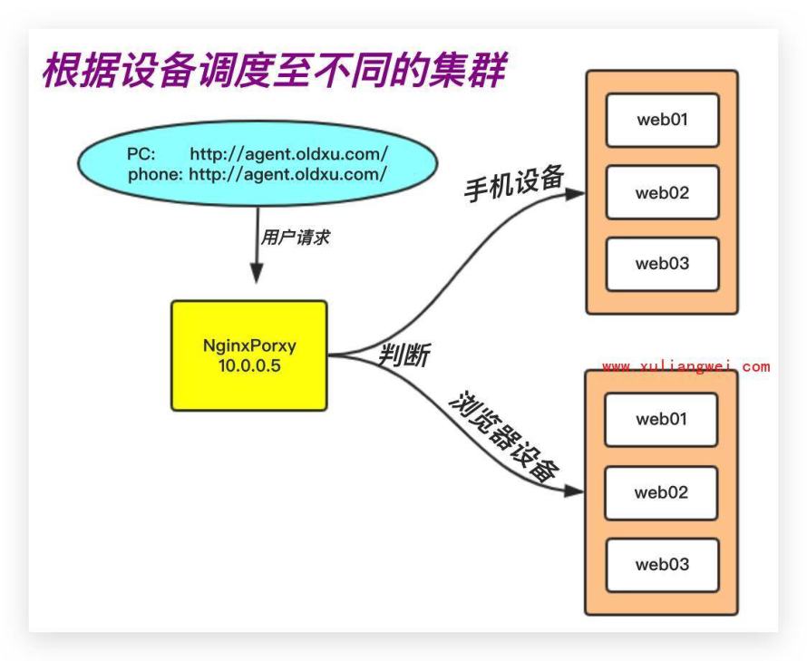
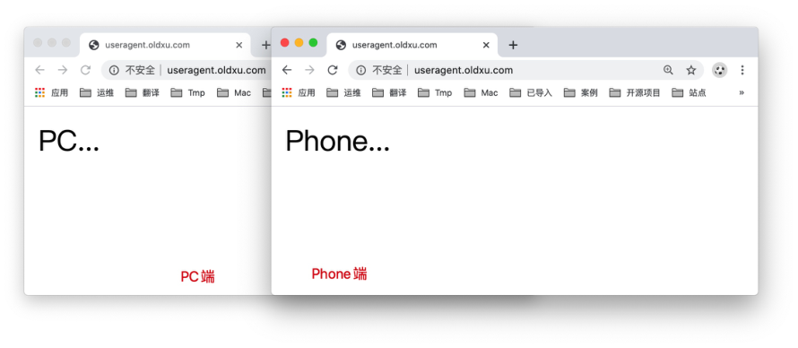
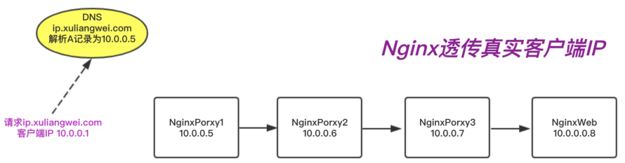

# 06.Nginx七层负载均衡

## 目录

- [6.Nginx负载均衡会话共享](#6.nginx负载均衡会话共享)
  - [6.1 什么是会话保持](#6.1-什么是会话保持)
  - [6.2 为什么需要会话保持](#6.2-为什么需要会话保持)
  - [6.3 如何实现会话保持](#6.3-如何实现会话保持)
- [1.粘性session(演示)：指Ngnix每次都将同一用户的](#1.粘性session演示指ngnix每次都将同一用户的)
- [2.session复制（不用）：每次session发生变化，就](#2.session复制不用每次session发生变化就)
- [3.session共享（√）：缓存session至内存数据库中，](#3.session共享缓存session至内存数据库中)
- [4.session持久化：将session存储至数据库中，像操](#4.session持久化将session存储至数据库中像操)
  - [6.4 会话保持场景演示](#6.4-会话保持场景演示)
    - [6.4.1 配置web节点](#6.4.1-配置web节点)
- [1.首先安装并配置 phpmyadmin](#1.首先安装并配置-phpmyadmin)
- [2.修改 phpmyadmin 连接远程的数据库](#2.修改-phpmyadmin-连接远程的数据库)
- [3.在多台 web 上准备 phpmyadmin 的 nginx 配置文件*](#3.在多台-web-上准备-phpmyadmin-的-nginx-配置文件)
    - [6.4.2 配置负载均衡](#6.4.2-配置负载均衡)
- [1.编写一份 proxy 负载均衡的配置文件，将请求调度到](#1.编写一份-proxy-负载均衡的配置文件将请求调度到)
- [2.检查语法并重载 nginx](#2.检查语法并重载-nginx)
    - [6.4.3 配置Redis服务](#6.4.3-配置redis服务)
- [1.安装 redis 内存数据库](#1.安装-redis-内存数据库)
- [2.配置 redis 监听在本地的内网网卡上](#2.配置-redis-监听在本地的内网网卡上)
- [3.启动 redis](#3.启动-redis)
    - [6.4.4 配置php连接Redis](#6.4.4-配置php连接redis)
- [1.修改 /etc/php.ini 文件。[所有节点都需要操作]](#1.修改-etcphp.ini-文件所有节点都需要操作)
- [2.注释 php-fpm.d/www.conf 里面的两条内容，否则](#2.注释-php-fpm.dwww.conf-里面的两条内容否则)
- [3.重启 php-fpm 服务。[所有节点都需要操作]](#3.重启-php-fpm-服务所有节点都需要操作)
    - [6.4.5 测试集群会话共享](#6.4.5-测试集群会话共享)
- [1.使用浏览器登陆网站，获取对应的 cookie信息](#1.使用浏览器登陆网站获取对应的-cookie信息)
- [2.检查 redis 中是否存在 cookie 对应的 session 信](#2.检查-redis-中是否存在-cookie-对应的-session-信)
- [3.此时用户的 cookie 始终都不会发生任何变化，无论](#3.此时用户的-cookie-始终都不会发生任何变化无论)
- [7.后端节点异常容错机制](#7.后端节点异常容错机制)
  - [7.1 配置语法](#7.1-配置语法)
  - [7.2 场景示例](#7.2-场景示例)
- [8.Nginx负载均衡调度场景](#8.nginx负载均衡调度场景)
  - [8.1 根据uri进行调度(路由)](#8.1-根据uri进行调度路由)
    - [8.1.1 环境准备](#8.1.1-环境准备)
    - [8.1.2 配置应用节点](#8.1.2-配置应用节点)
    - [8.1.3 配置负载均衡](#8.1.3-配置负载均衡)
  - [8.2 Proxy添加/与不添加/](#8.2-proxy添加与不添加)
    - [8.2.1 不添加/示例](#8.2.1-不添加示例)
    - [8.2.2 添加/示例](#8.2.2-添加示例)
    - [8.2.3 结果总结](#8.2.3-结果总结)
- [1.带 / 意味着Nginx代理会修改用户请求的URL，将](#1.带--意味着nginx代理会修改用户请求的url将)
- [2.不带 / 意味着Nginx代理不会修改用户请求的URL，](#2.不带--意味着nginx代理不会修改用户请求的url)
  - [8.3 根据请求设备进行调度](#8.3-根据请求设备进行调度)
    - [8.3.1 环境准备](#8.3.1-环境准备)
    - [8.3.1 配置应用节点](#8.3.1-配置应用节点)
    - [8.3.3 配置负载均衡](#8.3.3-配置负载均衡)
    - [8.3.4 结果测试与验证](#8.3.4-结果测试与验证)
- [9.Nginx多级代理获取真实IP](#9.nginx多级代理获取真实ip)
  - [9.1 多级代理获取地址概述](#9.1-多级代理获取地址概述)
  - [9.2 多级代理获取地址实践](#9.2-多级代理获取地址实践)
    - [9.2.1 环境准备](#9.2.1-环境准备)
- [1.基于代理(七层负载均衡)情况下，](#1.基于代理七层负载均衡情况下)
    - [10.0.0.5 proxy_node1 一级代理](#10.0.0.5-proxy_node1-一级代理)
    - [10.0.0.6 proxy_node2 二级代理](#10.0.0.6-proxy_node2-二级代理)
    - [10.0.0.7 proxy_node3 三级代理](#10.0.0.7-proxy_node3-三级代理)
    - [10.0.0.8 webserver 真实节点](#10.0.0.8-webserver-真实节点)
    - [9.2.2 配置一级代理](#9.2.2-配置一级代理)
    - [9.2.3 配置二级代理](#9.2.3-配置二级代理)
    - [9.2.5 配置应用节点](#9.2.5-配置应用节点)
  - [9.3 多级代理获取地址测试](#9.3-多级代理获取地址测试)
    - [9.3.1 通过php脚本分析](#9.3.1-通过php脚本分析)
    - [9.3.2 通过日志分析](#9.3.2-通过日志分析)
  - [9.4 RealiP模块获取真实IP](#9.4-realip模块获取真实ip)
    - [9.4.1 配置示例](#9.4.1-配置示例)
    - [9.4.2 结果验证](#9.4.2-结果验证)
    - [10.0.0.1没出现，那么他就被认为是用户真实的ip地](#10.0.0.1没出现那么他就被认为是用户真实的ip地)

目录

- [6.Nginx负载均衡会话共享](#6.nginx负载均衡会话共享)
  - [6.1 什么是会话保持](#6.1-什么是会话保持)
  - [6.2 为什么需要会话保持](#6.2-为什么需要会话保持)
  - [6.3 如何实现会话保持](#6.3-如何实现会话保持)
  - [6.4 会话保持场景演示](#6.4-会话保持场景演示)
    - [6.4.1 配置web节点](#6.4.1-配置web节点)
    - [6.4.2 配置负载均衡](#6.4.2-配置负载均衡)
    - [6.4.3 配置Redis服务](#6.4.3-配置redis服务)
    - [6.4.4 配置php连接Redis](#6.4.4-配置php连接redis)
    - [6.4.5 测试集群会话共享](#6.4.5-测试集群会话共享)
- [7.后端节点异常容错机制](#7.后端节点异常容错机制)
  - [7.1 配置语法](#7.1-配置语法)
  - [7.2 场景示例](#7.2-场景示例)
- [8.Nginx负载均衡调度场景](#8.nginx负载均衡调度场景)
  - [8.1 根据uri进行调度(路由)](#8.1-根据uri进行调度路由)
    - [8.1.1 环境准备](#8.1.1-环境准备)
    - [8.1.2 配置应用节点](#8.1.2-配置应用节点)
    - [8.1.3 配置负载均衡](#8.1.3-配置负载均衡)
  - [8.2 Proxy添加/与不添加/](#8.2-proxy添加与不添加)
    - [8.2.1 不添加/示例](#8.2.1-不添加示例)
    - [8.2.2 添加/示例](#8.2.2-添加示例)
    - [8.2.3 结果总结](#8.2.3-结果总结)
  - [8.3 根据请求设备进行调度](#8.3-根据请求设备进行调度)
    - [8.3.1 环境准备](#8.3.1-环境准备)
    - [8.3.1 配置应用节点](#8.3.1-配置应用节点)
    - [8.3.3 配置负载均衡](#8.3.3-配置负载均衡)
    - [8.3.4 结果测试与验证](#8.3.4-结果测试与验证)
- [9.Nginx多级代理获取真实IP](#9.nginx多级代理获取真实ip)
  - [9.1 多级代理获取地址概述](#9.1-多级代理获取地址概述)
  - [9.2 多级代理获取地址实践](#9.2-多级代理获取地址实践)
    - [9.2.1 环境准备](#9.2.1-环境准备)
    - [9.2.2 配置一级代理](#9.2.2-配置一级代理)
    - [9.2.3 配置二级代理](#9.2.3-配置二级代理)
    - [9.2.5 配置应用节点](#9.2.5-配置应用节点)
  - [9.3 多级代理获取地址测试](#9.3-多级代理获取地址测试)
    - [9.3.1 通过php脚本分析](#9.3.1-通过php脚本分析)
    - [9.3.2 通过日志分析](#9.3.2-通过日志分析)
  - [9.4 RealiP模块获取真实IP](#9.4-realip模块获取真实ip)
    - [9.4.1 配置示例](#9.4.1-配置示例)
    - [9.4.2 结果验证](#9.4.2-结果验证)

## 6.Nginx负载均衡会话共享

### 6.1 什么是会话保持

当用户登陆一个网站服务器，网站服务器会将用户的登

陆信息存储下来（存储下来的内容叫 Session ）以保证

我们能够一直处于 ”登陆在线“ 状态。

客户端：cookies

服务端：sessionID

### 6.2 为什么需要会话保持

由于我们使用的是负载均衡轮询机制，会导致用户请求

分散在不同的节点，从而造成会话无法保持。

假设用户A，通过负载均衡登陆了网站，此时会话信息存

储在A节点，那么当它一刷新，负载均衡会将请求分发给

B节点，那么B节点没有用户A的登陆信息，就会提示用

户A登陆，当A用户点击登陆时又会将请求分发给C节

点，从而造成用户A无法实现会话保持。

### 6.3 如何实现会话保持

## 1.粘性session(演示)：指Ngnix每次都将同一用户的

所有请求转发至同一台服务器上，及Nginx的

IP_hash。

## 2.session复制（不用）：每次session发生变化，就

广播给集群中的服务器，使所有的服务器上的

session相同。

## 3.session共享（√）：缓存session至内存数据库中，

使用redis，memcached实现。

## 4.session持久化：将session存储至数据库中，像操

作数据一样操作session。

### 6.4 会话保持场景演示

#### 6.4.1 配置web节点

## 1.首先安装并配置 phpmyadmin

```
[root@web01 conf.d]# cd /code
[root@web01 code]# wget
https://files.phpmyadmin.net/phpMyAdmin/4.8
.4/phpMyAdmin-4.8.4-all-languages.zip
[root@web01 code]# unzip phpMyAdmin-4.8.4-
all-languages.zip
```

## 2.修改 phpmyadmin 连接远程的数据库

```
[root@web01 code]# cd phpMyAdmin-4.8.4-all-
languages/
[root@web01 phpMyAdmin-4.8.4-all-
languages]# cp config.sample.inc.php
config.inc.php
[root@web01 phpMyAdmin-4.8.4-all-
languages]# vim config.inc.php
/* Server parameters */
$cfg['Servers'][$i]['host'] =
'172.16.1.51';
```

## 3.在多台 web 上准备 phpmyadmin 的 nginx 配置文件*

```
[root@web01 ~]# cat
/etc/nginx/conf.d/php.conf
server {
    listen 80;
    server_name php.oldxu.net;
```

```
    root /code/phpMyAdmin-4.8.4-all-
languages;
    location / {
        index index.php index.html;
    }
    location ~ \.php$ {
        fastcgi_pass 127.0.0.1:9000;
        fastcgi_param SCRIPT_FILENAME
$document_root$fastcgi_script_name;
        include fastcgi_params;
    }
}
```

#重启Nginx服务

```
[root@web01 ~]# systemctl restart nginx
```

#### 6.4.2 配置负载均衡

## 1.编写一份 proxy 负载均衡的配置文件，将请求调度到

后端 web 节点

```
[root@proxy01 ~]# cat
/etc/nginx/conf.d/proxy_php.com.conf
upstream php {
        server 172.16.1.7:80;
        server 172.16.1.8:80;
}
server {
        listen 80;
        server_name php.oldxu.net;
        location / {
                proxy_pass http://php;
                include proxy_params;
        }
}
```

## 2.检查语法并重载 nginx

```
[root@proxy01 conf.d]# nginx -t
[root@proxy01 conf.d]# systemctl restart
nginx
```

#### 6.4.3 配置Redis服务

## 1.安装 redis 内存数据库

```
[root@Redis-node1 ~]# yum install redis -y
```

## 2.配置 redis 监听在本地的内网网卡上

```
[root@Redis-node1 ~]# sed  -i '/^bind/c
bind 127.0.0.1 172.16.1.41' /etc/redis.conf
```

## 3.启动 redis

```
[root@Redis-node1 ~]# systemctl start redis
[root@Redis-node1 ~]# systemctl enable
redis
```

#### 6.4.4 配置php连接Redis

## 1.修改 /etc/php.ini 文件。[所有节点都需要操作]

```
[root@web ~]# vim /etc/php.ini
session.save_handler = redis
session.save_path =
"tcp://172.16.1.41:6379"
;session.save_path =
"tcp://172.16.1.41:6379?auth=123" #如果redis
```

存在密码，则使用该方式

## 2.注释 php-fpm.d/www.conf 里面的两条内容，否则

session 内容会一直写入 /var/lib/php/session 目

录中，从而造成会话共享失败。[所有节点都需要操作]

```
[root@web ~]# vim /etc/php-fpm.d/www.conf
;php_value[session.save_handler] = files
;php_value[session.save_path]    =
/var/lib/php/session
```

## 3.重启 php-fpm 服务。[所有节点都需要操作]

```
[root@web ~]# php-fpm -t
[root@web ~]# systemctl restart php-fpm
```

#### 6.4.5 测试集群会话共享

## 1.使用浏览器登陆网站，获取对应的 cookie信息



## 2.检查 redis 中是否存在 cookie 对应的 session 信

息

```
[root@redis-node1 ~]# redis-cli
127.0.0.1:6379> keys *
1)
"PHPREDIS_SESSION:393ff522ed2a7e26ba44f6d92
5f991f2"
127.0.0.1:6379>
```

## 3.此时用户的 cookie 始终都不会发生任何变化，无论

请求被负载调度到那一台后端web 节点服务器都不会出

现没有登陆情况。



## 7.后端节点异常容错机制

使用nginx负载均衡时，如何将后端请求超时的服务器流

量平滑的切换到另一台上。

如果后台服务连接超时，Nginx是本身是有机制的，如果

出现一个节点down掉的时候，Nginx会更据你具体负载

均衡的设置，将请求转移到其他的节点上，但是，如果

后台服务连接没有down掉，而是返回了错误异常码

如:504、502、500，该怎么办

### 7.1 配置语法

当其中一台返回错误码 404,500 等错误时，可以分配

到下一台服务器程序继续处理，提高平台访问成功率。

```
proxy_next_upstream http_500 | http_502 |
http_503 | http_504 |http_404;
```

### 7.2 场景示例

```
server {
    listen 80;
    server_name blog.oldxu.net;
    location / {
        proxy_pass http://node;
        proxy_next_upstream error timeout
http_500 http_502 http_503 http_504;
        proxy_next_upstream_tries 2;
        proxy_next_upstream_timeout 3s;
    }
}
```

## 8.Nginx负载均衡调度场景

### 8.1 根据uri进行调度(路由)



#### 8.1.1 环境准备

提

供

系统版本 主机角色 外网IP 内网IP

端

口

CentOS7 负载均衡 10.0.0.5 172.16.1.5 80 CentOS7 提供/user 集群 172.16.1.7 80 CentOS7 提供/pass 集群 172.16.1.7

#### 8.1.2 配置应用节点

配置后端WEB节点的Nginx （注意提供的页面代码不一

样）

```
[root@web01 conf.d]# cat
agent.oldxu.net.conf
server {
    listen 80;
    server_name agent.oldxu.net;
    root /code;
    location / {
        index index.html;
    }
}
```

#### 8.1.3 配置负载均衡

根据不同的URL请求调度到不同的资源池

```
[root@proxy01 conf.d]# cat
proxy_agent.oldxu.net.conf
upstream user {
    server 172.16.1.8;
}
upstream pass {
    server 172.16.1.7;
}
server {
    listen 80;
```

```
    server_name agent.oldxu.net;
```

```
    location /user {
        proxy_pass http://user;
        include proxy_params;
    }
    location /pass {
        proxy_pass http://pass;
        include proxy_params;
    }
}
```

### 8.2 Proxy添加/与不添加/

在使用proxy_pass反向代理时，最后结尾添加/和不添

加/有什么区别?

```
proxy_pass http://localhost:8080;
proxy_pass http://localhost:8080/;
```

#### 8.2.1 不添加/示例

```
server {
    listen 80;
    server_name agent.oldxu.net;
```

```
    location /user {
        proxy_pass http://172.16.1.7:80;
    }
}
#用户请求URL：       /user/test/index.html
#请求到达Nginx负载均衡： /user/test/index.html
```

#Nginx负载均衡到后端节点：

```
/user/test/index.html
```

#### 8.2.2 添加/示例

```
server {
    listen 80;
    server_name agent.oldxu.net;
```

```
    location /user {
        proxy_pass http://172.16.1.7:80/;
    }
}
#用户请求URL：       /user/test/index.html
#请求到达Nginx负载均衡： /user/test/index.html
#Nginx负载均衡到后端节点：    /test/index.html
```

#### 8.2.3 结果总结

## 1.带 / 意味着Nginx代理会修改用户请求的URL，将

location匹配的URL进行删除。

## 2.不带 / 意味着Nginx代理不会修改用户请求的URL，

而是直接代理到后端应用服务器。

### 8.3 根据请求设备进行调度

www.jd.com --》m.jd.com (Rewrite)



#### 8.3.1 环境准备

提

供

系统版本 主机角色 外网IP 内网IP

端

口

CentOS7 负载均衡 10.0.0.5 172.16.1.5 80 CentOS7 提供pc集群 172.16.1.7 80 CentOS7 提供Phone 集群 172.16.1.7

#### 8.3.1 配置应用节点

配置后端WEB节点的Nginx配置。（注意pc和phone准备

的站点内容不一样）

```
[root@web01 conf.d]# cat
/etc/nginx/conf.d/agent.oldxu.net.conf
server {
    listen 80;
    server_name agent.oldxu.net;
    root /code;
    location / {
        index index.html;
    }
}
```

#### 8.3.3 配置负载均衡

根据不同的浏览器调度到不同的资源池

```
[root@proxy01 conf.d]# cat
proxy_agent.oldxu.net.conf
upstream pc {
    server 172.16.1.7:80;
}
upstream phone {
    server 172.16.1.8:80;
}
server {
    listen 80;
    server_name agent.oldxu.net;
    location / {
          #默认都走pc
        proxy_pass http://pc;
        include proxy_params;
        default_type text/html;
        charset utf-8;
        #如果是安卓或iphone,则走phone
        if ( $http_user_agent ~*
"android|iphone|iPad" ) {
            proxy_pass http://phone;
        }
```

#如果是IE浏览器,要么拒绝,要么返回一个好的

浏览器下载页面

```
        if ( $http_user_agent ~*  "MSIE" )
{
            return 200 '浏览器真棒!';
        }
    }
}
```

#### 8.3.4 结果测试与验证



## 9.Nginx多级代理获取真实IP

### 9.1 多级代理获取地址概述

用户发起请求，沿途可能会经过多级代理，最终抵达应

用节点，那应用节点如何获取客户端真实IP地址

实现方式1：通过X-Forwarded-For透传客户端的真实IP

实现方式2：使用Nginx RealIP模块实现客户端地址透

传



### 9.2 多级代理获取地址实践

#### 9.2.1 环境准备

## 1.基于代理(七层负载均衡)情况下，

环境:

#### 10.0.0.5 proxy_node1 一级代理

#### 10.0.0.6 proxy_node2 二级代理

#### 10.0.0.7 proxy_node3 三级代理

#### 10.0.0.8 webserver 真实节点

#### 9.2.2 配置一级代理

```
[root@proxy01 conf.d]# cat
proxy_ip.oldxu.net.conf
server {
    listen 80;
    server_name ip.oldxu.net;
```

```
    location / {
        proxy_pass http://10.0.0.7;
        proxy_http_version 1.1;
        proxy_set_header Host $http_host;
        proxy_set_header X-Real-IP
$remote_addr;
        proxy_set_header X-Forwarded-For
$proxy_add_x_forwarded_for;
    }
}
```

#### 9.2.3 配置二级代理

```
[root@proxy01 conf.d]# cat
proxy_ip.oldxu.net.conf
server {
    listen 80;
    server_name ip.oldxu.net;
```

```
    location / {
        proxy_pass http://10.0.0.8;
        proxy_http_version 1.1;
        proxy_set_header Host $http_host;
        proxy_set_header X-Real-IP
$remote_addr;
        proxy_set_header X-Forwarded-For
$proxy_add_x_forwarded_for;
    }
}
```

#### 9.2.5 配置应用节点

```
[root@web02 conf.d]# cat ip.oldxu.net.conf
server {
    listen 80;
    server_name ip.oldxu.net;
    root /code;
```

```
    location / {
        index index.php index.html;
    }
    location ~ \.php$ {
        fastcgi_pass 127.0.0.1:9000;
```

```
        fastcgi_param SCRIPT_FILENAME
$document_root$fastcgi_script_name;
        include fastcgi_params;
    }
}
```

### 9.3 多级代理获取地址测试

#### 9.3.1 通过php脚本分析

通过如下页面获取真实IP，或查看 phpinfo() 函数中

```
的 HTTP_X_FORWARDED_FOR
[root@web02 conf.d]# cat /code/index.php
<?php
    phpinfo();
?>
```

#### 9.3.2 通过日志分析

```
#1.proxy_node1代理的日志
10.0.0.1 - - "GET /index.php HTTP/1.1" 200
#2.proxy_node2代理的日志
10.0.0.5 - -  "GET /index.php HTTP/1.1" 200
 "10.0.0.1"
```

#3.真实节点

```
10.0.0.7 - - "GET /index.php HTTP/1.1" 200
"10.0.0.1, 10.0.0.5"
```

### 9.4 RealiP模块获取真实IP

使用nginx Realip_module获取多级代理下的客户端真

实IP地址,在后端Web节点上添加如下配置即可（Realip

需要知道所有沿途经过的代理节点的IP地址或IP段）；

#### 9.4.1 配置示例

```
[root@web02 conf.d]# cat ip.oldxu.net.conf
server {
    listen 80;
    server_name ip.oldxu.net;
    root /code;
    set_real_ip_from  10.0.0.5;
    set_real_ip_from  10.0.0.7;
    real_ip_header    X-Forwarded-For;
    real_ip_recursive on;
```

#set_real_ip_from：真实服务器上一级代理的IP

地址或者IP段,可以写多行

#real_ip_header：从哪个header头检索出需要的

IP地址

```
    #real_ip_recursive：递归排除
```

set_real_ip_from里面出现的IP,其余没有出现的认为

是用户真实IP

```
    location / {
        index index.php index.html;
    }
```

```
    location ~ \.php$ {
        fastcgi_pass 127.0.0.1:9000;
        fastcgi_param SCRIPT_FILENAME
$document_root$fastcgi_script_name;
        include fastcgi_params;
    }
}
```

#### 9.4.2 结果验证

```
最终结果是"10.0.0.1 - - "GET /index.php
HTTP/1.1" 200 "10.0.0.1, 10.0.0.5"
而10.0.0.5出现在set_real_ip_from中，仅仅
```

#### 10.0.0.1没出现，那么他就被认为是用户真实的ip地

址，同时会被赋值到 $remote_addr变量中，这样我们

的程序无需做任何修改，直接使用$remote_addr变量

即可获取真实IP地址
