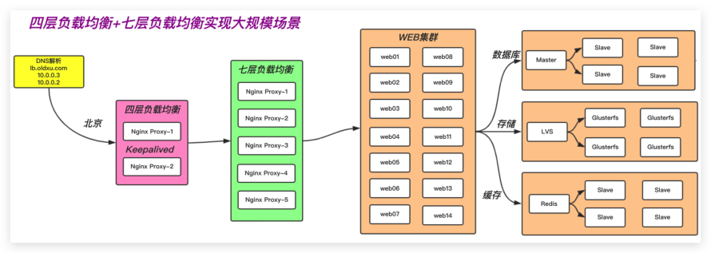

# 07.Nginx TCP负载均衡

## 目录

- [1.四层负载均衡基本概述](#1.四层负载均衡基本概述)
  - [1.1 什么是四层负载均衡](#1.1-什么是四层负载均衡)
  - [1.2 四层负载均衡应用场景](#1.2-四层负载均衡应用场景)
- [1.场景一、端口代理](#1.场景一端口代理)
- [2.场景二、四层负载均衡+七层负载均衡，实现大规模集](#2.场景二四层负载均衡七层负载均衡实现大规模集)
  - [1.3 四层负载均衡优缺点](#1.3-四层负载均衡优缺点)
- [1.四层负载均衡通常用来转发非http应用：如 tcp/80](#1.四层负载均衡通常用来转发非http应用如-tcp80)
- [2.四层负载均衡可以解决七层负载均衡高可用性的问](#2.四层负载均衡可以解决七层负载均衡高可用性的问)
- [3.四层负载均衡可以解决七层负载均衡端口数限制问](#3.四层负载均衡可以解决七层负载均衡端口数限制问)
- [4.四层转发效率远比七层代理的效率高的多，但是他只](#4.四层转发效率远比七层代理的效率高的多但是他只)
- [2.四层负载均衡场景实践](#2.四层负载均衡场景实践)
  - [2.1 配置语法示例](#2.1-配置语法示例)
  - [2.2 实现HTTP协议负载均衡](#2.2-实现http协议负载均衡)
- [1.配置nginx四层负载均衡](#1.配置nginx四层负载均衡)
- [80端口](#80端口)
- [2.重启Nginx](#2.重启nginx)
  - [2.3 实现MySQL负载均衡](#2.3-实现mysql负载均衡)
- [1. Nginx四层负载均衡配置如下](#1.-nginx四层负载均衡配置如下)
  - [2.4 实现非HTTP协议负载均衡](#2.4-实现非http协议负载均衡)

目录

- [1.四层负载均衡基本概述](#1.四层负载均衡基本概述)
  - [1.1 什么是四层负载均衡](#1.1-什么是四层负载均衡)
  - [1.2 四层负载均衡应用场景](#1.2-四层负载均衡应用场景)
  - [1.3 四层负载均衡优缺点](#1.3-四层负载均衡优缺点)
- [2.四层负载均衡场景实践](#2.四层负载均衡场景实践)
  - [2.1 配置语法示例](#2.1-配置语法示例)
  - [2.2 实现HTTP协议负载均衡](#2.2-实现http协议负载均衡)
  - [2.3 实现MySQL负载均衡](#2.3-实现mysql负载均衡)
  - [2.4 实现非HTTP协议负载均衡](#2.4-实现非http协议负载均衡)

## 1.四层负载均衡基本概述

### 1.1 什么是四层负载均衡

所谓四层就是基于IP+端口的负载均衡，它通过用户请求

的端口来决定将请求转发至哪台后端服务器。

就是通过三层的IP地址并加上四层的端口号，来决定哪

些流量需要做负载均衡。对需要负载均衡的流量进行

NAT转换，然后转发至后端服务器节点，并记录这个TCP

或者UDP的流量是由哪台后端服务器处理的，后续这个

连接的所有流量都同样转发到同一台服务器处理。

### 1.2 四层负载均衡应用场景

## 1.场景一、端口代理

首先http当然是最常用的一种协议，但是还是有很多非

http的应用（mysql、redis、ssh），只能用四层代理

## 2.场景二、四层负载均衡+七层负载均衡，实现大规模集

群架构。

其次七层代理需要CPU运算，所以单台机器很难做到很

高的处理能力，因此需要在七层负载均衡前面再加四层

负载均衡。（提高网站的访问效率，并保证了七层负载

均衡的高可用性。）



### 1.3 四层负载均衡优缺点

## 1.四层负载均衡通常用来转发非http应用：如 tcp/80

```
tcp/443  tcp/3306 tcp/22 udp/53
```

## 2.四层负载均衡可以解决七层负载均衡高可用性的问

题。( 多个七层负载均衡同时提供服务 )

## 3.四层负载均衡可以解决七层负载均衡端口数限制问

题。（七层负载均衡最多能使用的端口是5w）

## 4.四层转发效率远比七层代理的效率高的多，但是他只

能支持tcp/ip协议，所以他的功能较弱，虽然七层效率不

高，但他支持http/https这样的应用层协议。

## 2.四层负载均衡场景实践

### 2.1 配置语法示例

```
stream {
    upstream backend {
        hash $remote_addr consistent;
        server backend1.example.com:12345
weight=5;
        server 127.0.0.1:12345 max_fails=3
fail_timeout=30s;
        server unix:/tmp/backend3;
    }
    server {
        listen 12345;
        proxy_connect_timeout 1s;
        proxy_timeout 3s;
        proxy_pass backend;
    }
}
```

### 2.2 实现HTTP协议负载均衡

前端四层负载均衡+后端七层负载均衡+应用节点

## 1.配置nginx四层负载均衡

```
[root@lb02 ~]# vim /etc/nginx/nginx.conf
events {
    ....
}
include /etc/nginx/conf.c/*.conf;
http {
    .....
}
```

#创建存放四层负载均衡配置的目录

```
[root@lb4-01 conf.c]# rm -f
/etc/nginx/conf.d/default.conf   #删除http的
```

## 80端口

```
[root@lb4-01 ~]# mkdir /etc/nginx/conf.c
[root@lb4-01 ~]# cd /etc/nginx/conf.c
[root@lb4-01 conf.c]# cat lb_domain.conf
stream {
    upstream lb {
        server 172.16.1.5:80 weight=5
max_fails=3 fail_timeout=30s;
        server 172.16.1.6:80 weight=5
max_fails=3 fail_timeout=30s;
    }
    server {
        listen 80;
        proxy_connect_timeout 3s;
        proxy_timeout 3s;
```

```
        proxy_pass lb;
    }
}
```

## 2.重启Nginx

```
[root@lb4-01 conf.c]# systemctl restart
nginx
[root@lb4-01 conf.c]# systemctl enable
nginx
```

### 2.3 实现MySQL负载均衡

```
请求负载均衡 5555    --->     172.16.1.7:22
请求负载均衡 6666    --->     172.16.1.51:3306
```

## 1. Nginx四层负载均衡配置如下

```
[root@lb01 ~]# mkdir -p /etc/nginx/conf.c
[root@lb01 ~]# vim /etc/nginx/nginx.conf
```

在events层下面，http层上面配置include

```
include  /etc/nginx/conf.c/*.conf;
```

配置Nginx四层转发

```
[root@lb01 ~]# cd /etc/nginx/conf.c/
[root@lb01 conf.c]# cat stream.conf
stream {
```

#1.定义转发tcp/22端口的虚拟资源池

```
    upstream ssh {
        server 172.16.1.7:22;
```

```
    }
```

#2.定义转发tcp/3306端口的虚拟资源池

```
    upstream mysql {
        server 172.16.1.51:3306;
    }
```

#调用虚拟资源池

```
    server {
        listen 5555;
        proxy_connect_timeout 1s;
        proxy_timeout 300s;
        proxy_pass ssh;
    }
    server {
        listen 6666;
        proxy_connect_timeout 1s;
        proxy_timeout 300s;
        proxy_pass mysql;
    }
}
[root@lb01 conf.c]# systemctl restart nginx
```

### 2.4 实现非HTTP协议负载均衡


