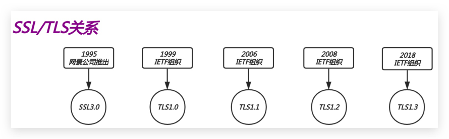
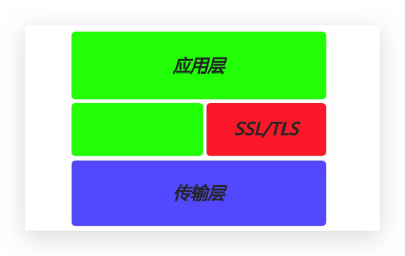
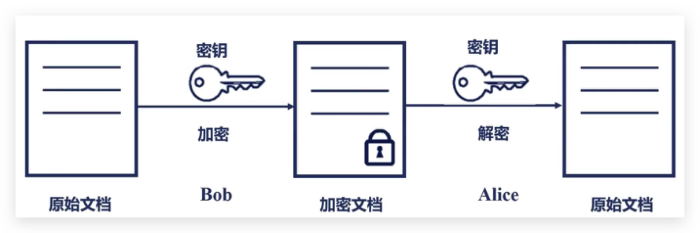
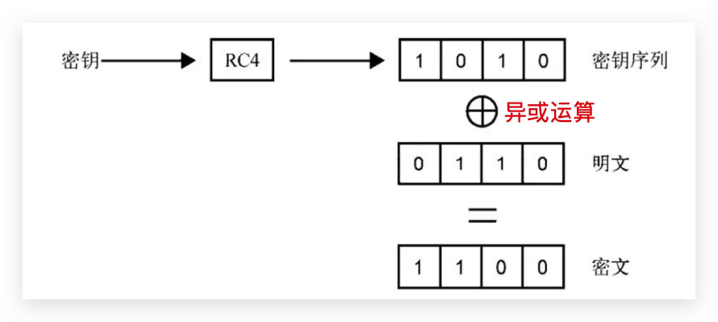
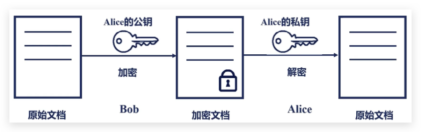
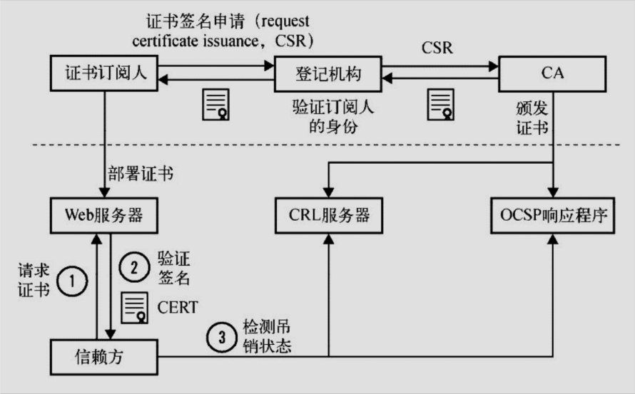
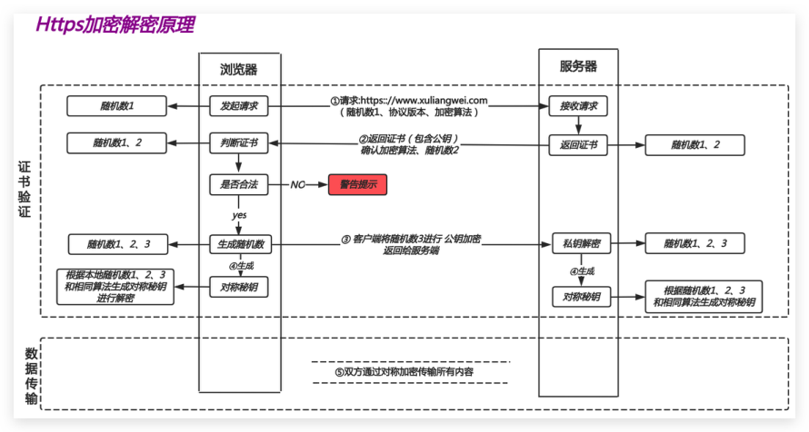
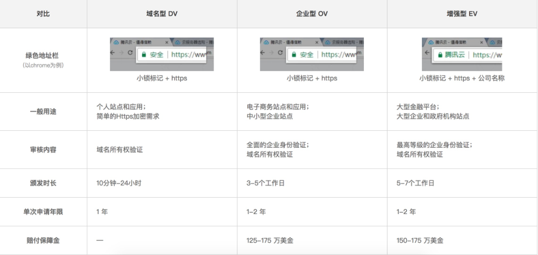
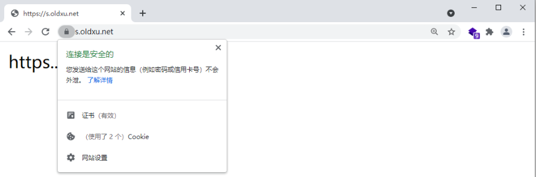
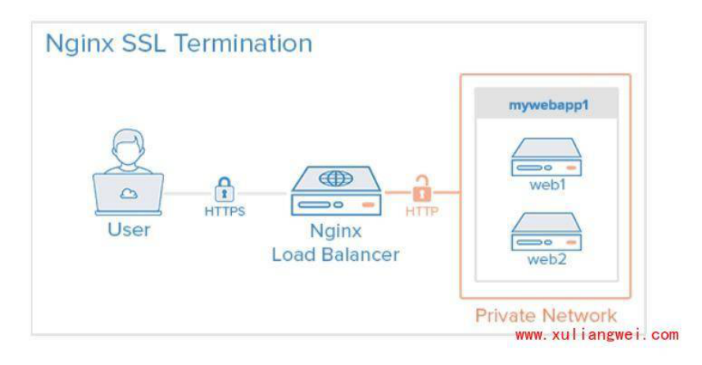

# 10.Nginx HTTPS 实践

## 目录

- [1.HTTPS基本概述](#1.https基本概述)
  - [1.1 为何需要HTTPS](#1.1-为何需要https)
  - [1.2 什么是HTTPS](#1.2-什么是https)
  - [1.3 TLS如何实现加密](#1.3-tls如何实现加密)
- [1.提供数据安全：保证数据不会被泄露。](#1.提供数据安全保证数据不会被泄露)
- [2.提供数据的完整性：保证数据在传输过程中不会](#2.提供数据的完整性保证数据在传输过程中不会)
- [3.对应用层交给传输层的数据进行加密与解密。](#3.对应用层交给传输层的数据进行加密与解密)
- [2.HTTPS实现原理](#2.https实现原理)
  - [2.1 加密模型-对称加密](#2.1-加密模型-对称加密)
  - [2.2 加密模型-非对称加密](#2.2-加密模型-非对称加密)
  - [2.3 身份验证机构-CA](#2.3-身份验证机构-ca)
- [1.当浏览器访问我们的https站点时，它会去请求我们](#1.当浏览器访问我们的https站点时它会去请求我们)
- [2.Nginx会将我们的公钥证书回传给浏览器。](#2.nginx会将我们的公钥证书回传给浏览器)
- [3.浏览器会去验证我们的证书是否是合法的、是否是有](#3.浏览器会去验证我们的证书是否是合法的是否是有)
- [4.CA机构会将过期的证书放置在CRL服务器，那么CRL](#4.ca机构会将过期的证书放置在crl服务器那么crl)
- [5.Nginx会有一个OCSP的开关，当我们开启后，Nginx](#5.nginx会有一个ocsp的开关当我们开启后nginx)
  - [2.4 HTTPS通讯原理](#2.4-https通讯原理)
- [1) 第一步客户端向服务端发送 Client Hello 消息，这](#1-第一步客户端向服务端发送-client-hello-消息这)
- [2) 服务端会向客户端发送 Server Hello 消息。返回自](#2-服务端会向客户端发送-server-hello-消息返回自)
- [3) 客户端收到服务端传来的公钥证书后，先从 CA 验证](#3-客户端收到服务端传来的公钥证书后先从-ca-验证)
- [4) 服务端用自己的私钥解出客户端生成的 Random3。至](#4-服务端用自己的私钥解出客户端生成的-random3至)
- [3.HTTPS扩展知识](#3.https扩展知识)
  - [3.1 Https证书类型](#3.1-https证书类型)
  - [3.2 Https购买建议](#3.2-https购买建议)
  - [3.3 Https颜色标识](#3.3-https颜色标识)
- [4.HTTPS单台配置实践](#4.https单台配置实践)
  - [4.1 配置SSL语法](#4.1-配置ssl语法)
  - [4.1 创建SSL证书](#4.1-创建ssl证书)
- [1.创建证书存储目录](#1.创建证书存储目录)
- [2.使用openssl命令充当CA权威机构创建证书（类似黑](#2.使用openssl命令充当ca权威机构创建证书类似黑)
- [3.生成自签证书，同时去掉私钥的密码](#3.生成自签证书同时去掉私钥的密码)
  - [4.1 配置SSL场景](#4.1-配置ssl场景)
  - [4.3 访问验证SSL](#4.3-访问验证ssl)
  - [4.4 强制跳转Https](#4.4-强制跳转https)
- [5.HTTPS集群配置实践](#5.https集群配置实践)
  - [5.1 环境准备](#5.1-环境准备)
  - [5.2 配置应用节点](#5.2-配置应用节点)
  - [5.3 配置负载均衡](#5.3-配置负载均衡)
- [1.创建ssl证书](#1.创建ssl证书)
- [2.Nginx负载均衡配置文件如下](#2.nginx负载均衡配置文件如下)
- [3.重启 Nginx 负载均衡](#3.重启-nginx-负载均衡)
- [6.HTTPS场景配置实践](#6.https场景配置实践)
  - [6.1 场景实践-1](#6.1-场景实践-1)
- [1.用户访问网站主站，使用 http 协议提供访问，](#1.用户访问网站主站使用-http-协议提供访问)
- [2.当用户点击登陆时，则网站会跳转至一个新的域](#2.当用户点击登陆时则网站会跳转至一个新的域)
  - [6.2 场景实践-2](#6.2-场景实践-2)
  - [6.3 场景实践-3](#6.3-场景实践-3)
- [7.HTTPS优化配置实践](#7.https优化配置实践)
  - [7.2 优化基本概述](#7.2-优化基本概述)
- [1.设置worker进程数设置为等于CPU处理器的核心](#1.设置worker进程数设置为等于cpu处理器的核心)
- [2.启用 keepalive 长连接，一个连接发送更多个请](#2.启用-keepalive-长连接一个连接发送更多个请)
- [3.启用 shared 会话缓存，所有worker工作进程之间](#3.启用-shared-会话缓存所有worker工作进程之间)
- [4.禁用 builtin 内置于的缓存，仅能供一个worker](#4.禁用-builtin-内置于的缓存仅能供一个worker)
  - [7.2 优化配置实例](#7.2-优化配置实例)

目录

- [1.HTTPS基本概述](#1.https基本概述)
  - [1.1 为何需要HTTPS](#1.1-为何需要https)
  - [1.2 什么是HTTPS](#1.2-什么是https)
  - [1.3 TLS如何实现加密](#1.3-tls如何实现加密)
- [2.HTTPS实现原理](#2.https实现原理)
  - [2.1 加密模型-对称加密](#2.1-加密模型-对称加密)
  - [2.2 加密模型-非对称加密](#2.2-加密模型-非对称加密)
  - [2.3 身份验证机构-CA](#2.3-身份验证机构-ca)
  - [2.4 HTTPS通讯原理](#2.4-https通讯原理)
- [3.HTTPS扩展知识](#3.https扩展知识)
  - [3.1 Https证书类型](#3.1-https证书类型)
  - [3.2 Https购买建议](#3.2-https购买建议)
  - [3.3 Https颜色标识](#3.3-https颜色标识)
- [4.HTTPS单台配置实践](#4.https单台配置实践)
  - [4.1 配置SSL语法](#4.1-配置ssl语法)
  - [4.1 创建SSL证书](#4.1-创建ssl证书)
  - [4.1 配置SSL场景](#4.1-配置ssl场景)
  - [4.3 访问验证SSL](#4.3-访问验证ssl)
  - [4.4 强制跳转Https](#4.4-强制跳转https)
- [5.HTTPS集群配置实践](#5.https集群配置实践)
  - [5.1 环境准备](#5.1-环境准备)
  - [5.2 配置应用节点](#5.2-配置应用节点)
  - [5.3 配置负载均衡](#5.3-配置负载均衡)
- [6.HTTPS场景配置实践](#6.https场景配置实践)
  - [6.1 场景实践-1](#6.1-场景实践-1)
  - [6.2 场景实践-2](#6.2-场景实践-2)
  - [6.3 场景实践-3](#6.3-场景实践-3)
- [7.HTTPS优化配置实践](#7.https优化配置实践)
  - [7.2 优化基本概述](#7.2-优化基本概述)
  - [7.2 优化配置实例](#7.2-优化配置实例)

## 1.HTTPS基本概述

### 1.1 为何需要HTTPS

因为HTTP采用的是明文传输数据，那么在传输（账号密

码、交易信息、等敏感数据）时不安全。容易遭到篡

改，如果使用HTTPS协议，数据在传输过程中是加密

的，能够有效避免网站传输时信息泄露。

### 1.2 什么是HTTPS

HTTPS安全的超文本传输协议，我们现在大部分站点

都是通过HTTPS来实现站点数据安全。

早期网景公司设计了SSL（Secure Socket Layer）

安全套接层协议，主要对HTTP协议传输的数据进行加

密。那如何将站点变成安全的HTTPS站点呢？我们需

```
要了解SSL（Secure Socket Layer）协议。
```

而现在很多时候我们使用的是TLS（Transport

Layer Security）传输层安全协议来实现的加密与

解密。



### 1.3 TLS如何实现加密

TLS/SSL是如何实现HTTP明文消息被加密的，

TLS/SSL工作在OSI七层模型中，应用层与传输层之

间。

1.提供数据安全：保证数据不会被泄露。

2.提供数据的完整性：保证数据在传输过程中不会被篡改。

3.对应用层交给传输层的数据进行加密与解密。



## 2.HTTPS实现原理

### 2.1 加密模型-对称加密

对称加密：两个想通讯的人持有相同的秘钥，进行加

密与解密。如下：

bob将原始文档通过秘钥加密生成一个密文文档。

alice拿到这个密文文档以后，它可以用这把秘钥还

原为原始的明文文档。



对称加密究竟是如何实现的，我们可以以RC4这样一

个对称加密序列算法来看一下。

加密：秘钥序列+明文=密文

解密：秘钥序列+密文=明文



### 2.2 加密模型-非对称加密

非对称加密：它根据一个数学原理，创建一对秘钥

（公钥和私钥）公钥加密，私钥解密；

私钥：私钥自己使用，不对外开放。

公钥：公钥给大家使用，对外开放。

比如：alice有一对公钥和私钥，他可以将公钥发布

给任何人。假设Bob是其中一个，当Bob要传递一份

加密文档给alice，那么Bob就可以用alice的公钥

进行加密，alice收到密文文档后通过自己的私钥进

行解密，获取原始文档。



注意：alice必须知道Bob就是Bob，也就是它收到的

信息必须是Bob发来的，那么这个信任问题，在多方通

讯的过程中，必须有一个公信机构来验证双方的身份，

那么这个机构就是CA机构。

### 2.3 身份验证机构-CA

通讯双方是如何验证双方的身份？

CA架构是可信任组织架构，主要用来颁发证书及验证证

书。那CA机构又是如何申请和颁发证书的呢?



我们首先需要申请证书，需要进行登记，登记我是谁，

我是什么组织，我想做什么，到了登记机构在通过CSR

发给CA，CA中心通过后，CA中心会生成一对公钥和私

钥，那么公钥会在CA证书链中保存，公钥和私钥证书订

阅人拿到后，会将其部署在WEB服务器上

1.当浏览器访问我们的https站点时，它会去请求我们的证书

2.Nginx会将我们的公钥证书回传给浏览器。

3.浏览器会去验证我们的证书是否是合法的、是否是有效的。

4.CA机构会将过期的证书放置在CRL服务器，那么CRL

服务的验证效率是非常差的，所以CA又推出了OCSP响

应程序，OCSP响应程序可以查询指定的一个证书是否过

期，所以浏览器可以直接查询OCSP响应程序，但OCSP

响应程序性能还不是很高。

5.Nginx会有一个OCSP的开关，当我们开启后，Nginx会主动上OCSP上查询，这样大量的客户端直接从Nginx获取，证书是否有效。

### 2.4 HTTPS通讯原理



HTTPS加密过程，HTTPS采用混合加密算法，即对称加

密、和非对称加密

通信前准备工作：申请域名对应的证书，并将其部署在

Nginx服务器中。

1) 第一步客户端向服务端发送 Client Hello 消息，这个消息里包含了一个客户端生成的随机数 Random1、客户端支持的加密套件和客户端支持TLS协议版本等信息。

2) 服务端会向客户端发送 Server Hello 消息。返回自己的公钥证书、挑选一个合适的加密套件、另外还会生成一份随机数 Random2推送给客户端。至此客户端和服务端都拥有了两个随机数（Random1+ Random2）

3) 客户端收到服务端传来的公钥证书后，先从 CA 验证该证书的合法性（CA公钥去解密公钥证书），验证通过后取出证书中的服务端公钥，再生成一个随机数Random3，再用服务端公钥非对称加密Random3。

4) 服务端用自己的私钥解出客户端生成的 Random3。至此，客户端和服务端都拥有 Random1 + Random2 +Random3，两边根据同样的算法生成一份秘钥，握手结束后的应用层数据都是使用这个秘钥进行对称加密。

## 3.HTTPS扩展知识

### 3.1 Https证书类型

DV；

OV：花钱；

EV：买不起；



### 3.2 Https购买建议

oldxu.net (www.oldxu.net blog.oldxu.net

images.oldxu.net cdn.oldxu.net m.oldxu.net

qq.oldxu.net)

保护1个域名 www

```
保护5个域名 www images cdn test m
```

通配符域名 *.oldxu.net

### 3.3 Https颜色标识

Https不支持续费,证书到期需重新申请新并进行替

换。

Https不支持三级域名解析，如 test.m.oldxu.net

*.m.oldxu.net

Https显示绿色，说明整个网站的url都是https

的，并且都是安全的。

Https显示黄色，说明网站代码中有部分URL地址是

http不安全协议的。(https (http url) )

Https显示红色，要么证书是假的，要么证书已经过

期。

## 4.HTTPS单台配置实践

### 4.1 配置SSL语法

#官方示例

```
worker_processes auto;
http {
    ...
    server {
        listen              443 ssl;
        keepalive_timeout   70;
        ssl_protocols       TLSv1 TLSv1.1
TLSv1.2;
        ssl_ciphers         AES128-
SHA:AES256-SHA:RC4-SHA:DES-CBC3-SHA:RC4-
MD5;
        ssl_certificate
/usr/local/nginx/conf/cert.pem;
        ssl_certificate_key
/usr/local/nginx/conf/cert.key;
        ssl_session_cache   shared:SSL:10m;
        ssl_session_timeout 10m;
        ...
    }
}
```

### 4.1 创建SSL证书

## 1.创建证书存储目录

```
[root@web01 ~]# mkdir -p /etc/nginx/ssl_key
[root@web01 ~]# cd /etc/nginx/ssl_key
```

## 2.使用openssl命令充当CA权威机构创建证书（类似黑

户）

```
[root@web01 ssh_key]# openssl genrsa -idea
-out server.key 2048
Generating RSA private key, 2048 bit long
modulus
.....+++
```

#记住配置密码, 我这里是1234

```
Enter pass phrase for server.key:
Verifying - Enter pass phrase for
server.key:
```

## 3.生成自签证书，同时去掉私钥的密码

```
[root@web01 ssl_key]# openssl req -days
36500 -x509 \
-sha256 -nodes -newkey rsa:2048 -keyout
server.key -out server.crt
Country Name (2 letter code) [XX]:CN
```

#国家

```
State or Province Name (full name) []:WH
```

#省

```
Locality Name (eg, city) [Default City]:WH
```

#城市

```
Organization Name (eg, company) [Default
Company Ltd]:edu   #公司
Organizational Unit Name (eg, section) []:
oldxu    #单位
Common Name (eg, your name or your servers
hostname) []: s.oldxu.net  #服务器主机名称
Email Address []:oldxu@qq.com
```

req -->用于创建新的证书

new -->表示创建的是新证书

x509 -->表示定义证书的格式为标准格式

key -->表示调用的私钥文件信息

out -->表示输出证书文件信息

days -->表示证书的有效期

### 4.1 配置SSL场景

```
[root@web01 ~]# cat s.oldxu.net.conf
server {
    listen 443 ssl;
    server_name s.oldxu.net;
    ssl on;
    ssl_certificate   ssl_key/server.crt;
    ssl_certificate_key
ssl_key/server.key;
    location / {
        root /code;
        index index.html;
```

```
    }
}
```

#准备对应的站点目录, 并重启Nginx服务

```
[root@web01]# mkdir -p /code
[root@web01]# echo "Https" >
/code/index.html
[root@web01]# systemctl restart nginx
```

### 4.3 访问验证SSL

浏览器输入https://s.oldxu.net访问，由于该证书非

第三方权威机构颁发，而是我们自己签发的，所以浏览

器会警告



### 4.4 强制跳转Https

如果用户忘记在浏览器地址栏输入 https:// 协议那么

将不会跳转至https站点；

所以建议新增如下配置，将用户访问 http 请求强制跳

转 https

```
[root@Nginx ~]# cat
/etc/nginx/conf.d/ssl.conf
```

```
server {
    listen 443;
    server_name s.oldxu.net;
    ssl on;
    ssl_certificate   ssl_key/server.crt;
    ssl_certificate_key
ssl_key/server.key;
    location / {
        root /code;
        index index.html;
    }
}
server {
        listen 80;
        server_name s.oldxu.net;
        return 302
https://$server_name$request_uri;
}
```

## 5.HTTPS集群配置实践



### 5.1 环境准备

主机名 外网IP(NAT) 内网IP(LAN) 角色 lb01 eth0:10.0.0.5 eth1:172.16.1.5 nginx-

proxy

web01 eth0:10.0.0.7 eth1:172.16.1.7 nginx-

web01

web02 eth0:10.0.0.8 eth1:172.16.1.8 nginx-

web02

### 5.2 配置应用节点

配置所有后端节点，监听80端口即可；

```
[root@web01 conf.d]# cat s.oldxu.net.conf
server {
    listen 80;
    server_name s.oldxu.net;
    root /code/wordpress;
```

```
    location / {
        index index.html;
    }
}
```

### 5.3 配置负载均衡

1.创建ssl证书

```
[root@lb01 ~]# mkdir /etc/nginx/ssl_key -p
[root@lb01 ~]# cd /etc/nginx/ssl_key
[root@lb01 ~]# openssl genrsa -idea -out
server.key 2048
[root@lb01 ~]# openssl req -days 36500 -
x509 -sha256 \
-nodes -newkey rsa:2048 -keyout server.key
-out server.crt
```

2.Nginx负载均衡配置文件如下

```
[root@lb01 ~]# cat
/etc/nginx/conf.d/proxy.conf
upstream site {
    server 172.16.1.7:80 max_fails=2
fail_timeout=10s;
    server 172.16.1.8:80 max_fails=2
fail_timeout=10s;
}
```

https站点配置信息

```
server {
    listen 443;
    server_name s.oldxu.net;
    ssl on;
    ssl_certificate  ssl_key/server.crt;
```

```
    ssl_certificate_key
ssl_key/server.key;
    location / {
        proxy_pass http://site;
        include proxy_params;
    }
}
```

用户请求http协议，强制跳转至https协议

```
server {
    listen 80;
    server_name s.oldxu.net;
    return 302
https://$server_name$request_uri;
}
```

3.重启 Nginx 负载均衡

```
[root@lb01 ~]# nginx -t
[root@lb01 ~]# systemctl restart nginx
```

## 6.HTTPS场景配置实践

### 6.1 场景实践-1

模拟银行网站场景，

1.用户访问网站主站，使用 http 协议提供访问，

2.当用户点击登陆时，则网站会跳转至一个新的域名，并使用的是 Https 提供安全访问。

```
#1.主页展示     http://yh.oldxu.net（提供网页浏览）
```

```
#2.模拟登陆     http://yh.oldxu.net/login（相当于点击了登陆按钮）
```

```
#3.登陆页面     https://star.oldxu.net  (提供安全登陆)
```

```
#1.配置  https://star.oldxu.net
[root@web01 ~]# cat
/etc/nginx/conf.d/star.oldxu.net.conf
server {
    listen 443 ssl;
    server_name start.oldxu.net;
    ssl_certificate ssl_key/server.crt;
    ssl_certificate_key ssl_key/server.key;
    root  /code/login;
    location / {
        index index.html;
    }
}
[root@web01 ~]# mkdir /code/login -p
[root@web01 ~]# echo "login...https" >
/code/login/index.html
#2.配置 http://yh.oldxu.net
[root@web01 ~]# cat
/etc/nginx/conf.d/yh.oldxu.net.conf
server {
    listen 80;
```

```
    server_name yh.oldxu.net;
    root /code;
    location / {
        index index.html;
    }
    location /login {
        return 302 https://start.oldxu.net;
    }
}
```

### 6.2 场景实践-2

需求：希望用户访问网站的所有Url走Https协议，但

```
访问s.oldxu.net/abc时走Http协议
[root@lb01 conf.d]# cat
proxy_s.oldxu.net.conf
upstream webs {
    server 172.16.1.7:80;
    server 172.16.1.8:80;
}
server {
    listen 443 ssl;
    ssl_certificate ssl_key/server.crt;
    ssl_certificate_key ssl_key/server.key;
    server_name s.oldxu.net;
```

```
    location / {
        proxy_pass http://webs;
        include proxy_params;
    }
}
server {
    listen 80;
    server_name s.oldxu.net;
```

```
    if ($request_uri !~* "^/abc") {
        return 302
https://$http_host$request_uri;
    }
    location / {
        proxy_pass http://webs;
        include proxy_params;
    }
}
```

### 6.3 场景实践-3

开启OCSP，加速验证证书是否有效；

准备OCSP证书：

```
# wget -O root.pem https://ssl-
tools.net/certificates/dac9024f54d8f6df9493
5fb1732638ca6ad77c13.pem
```

```
# wget -O intermediate.pem
https://letsencrypt.org/certs/lets-encrypt-
x3-cross-signed.pem
# cat intermediate.pem >
/etc/nginx/ssl_key/ocsp.pem
# cat root.pem >>
/etc/nginx/ssl_key/ocsp.pem
# 配置Nginx
server {
        listen 443 ssl;
        server_name s.oldxu.net;
        ssl_certificate
ssl/6152750_s.oldxu.net.pem;
        ssl_certificate_key
ssl/6152750_s.oldxu.net.key;
        #开启OCSP
        ssl_stapling on;
        ssl_stapling_verify on;
        ssl_trusted_certificate
ssl/ocsp.pem;
        root /code;
        location / {
                index index.html;
        }
```

```
}
```

验证是否开启OCSP响应程序

命令验证

```
[root@db01 ~]# echo  QUIT |  openssl
s_client -connect s.oldxu.net:443 -status
2>/dev/null | grep -A  17  "OCSP response"
OCSP response:
======================================
OCSP Response Data:
    OCSP Response Status: successful (0x0)
    Response Type: Basic OCSP Response
    Version: 1 (0x0)
    Responder Id:
55744FB2724FF560BA50D1D7E6515C9A01871AD7
    Produced At: Aug 20 02:33:01 2021 GMT
    Responses:
    Certificate ID:
      Hash Algorithm: sha1
      Issuer Name Hash:
978B4716E5B0F658BAE69DAB1689B8363AE3C3A6
      Issuer Key Hash:
55744FB2724FF560BA50D1D7E6515C9A01871AD7
      Serial Number:
086605F8BF56EA63D3E250FDD617DDF0
    Cert Status: good
    This Update: Aug 20 02:18:01 2021 GMT
```

本次更新

```
    Next Update: Aug 27 01:33:01 2021 GMT
```

下次更新

百度没开启OCSP

```
[root@db01 ~]# echo  QUIT |  openssl
s_client -connect baidu.com:443 -status
2>/dev/null | grep -A  17  "OCSP response"
OCSP response: no response sent
```

## 7.HTTPS优化配置实践

### 7.2 优化基本概述

SSL的运行计算需要消耗额外的 CPU 资源，SSL通讯过程中『握手』阶段的运算最占用 CPU 资源，有如下几个方面可以进行调整与优化。

1.设置worker进程数设置为等于CPU处理器的核心

```
数。worker_processes auto
```

2.启用 keepalive 长连接，一个连接发送更多个请求

3.启用 shared 会话缓存，所有worker工作进程之间共享的缓存，避免进行多次 SSL『握手』

4.禁用 builtin 内置于的缓存，仅能供一个worker工作进程使用，使用shared缓存即禁止builtin

### 7.2 优化配置实例

```
worker_processes auto;
http {
    ...
    server {
        listen  443 ssl;
        server_name www.example.com;
        ssl_certificate
www.example.com.crt;
        ssl_certificate_key
www.example.com.key;
        ssl_protocols       TLSv1.2;
        ssl_prefer_server_ciphers on;
        #Nginx决定使用哪些协议与浏览器进行通讯
        keepalive_timeout   70;
        #设置长连接默认不开启session_cache： a握手后，关闭浏览器，再次访问，需要重新握手；

		#建立握手后如果连接断开，在session_timeout时间内再次连接，无需再次建立握手，可直接复用之间缓存的连接。
 		ssl_session_cache   shared:SSL:10m;
 		#1M缓存空间能存储 4000 个会话数量
 		 ssl_session_timeout 1440m;
 		 #配置会话超时时间 （ 默认5分钟 ）
 		 }
```
