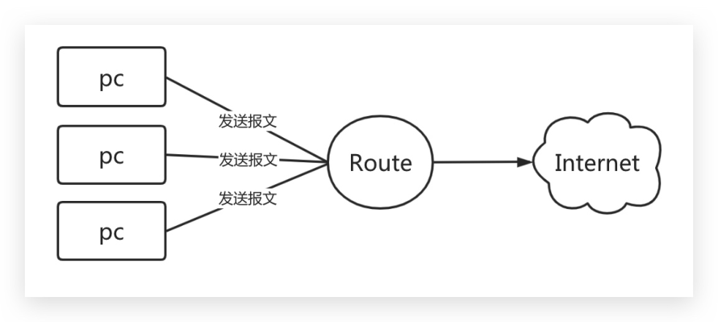
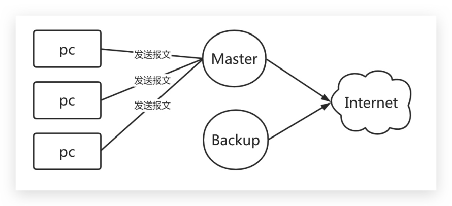
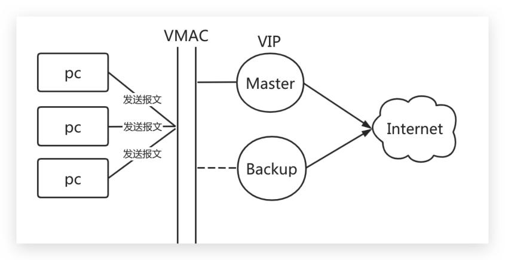
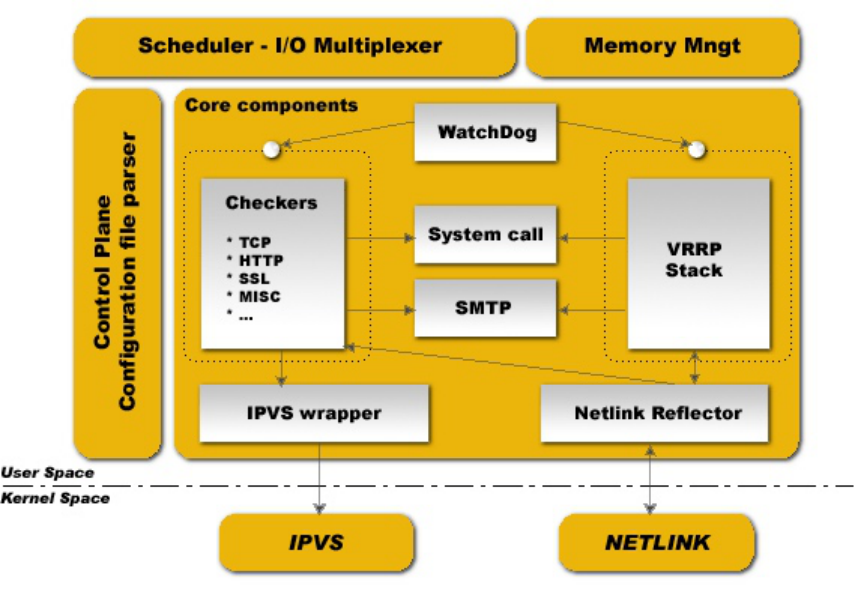
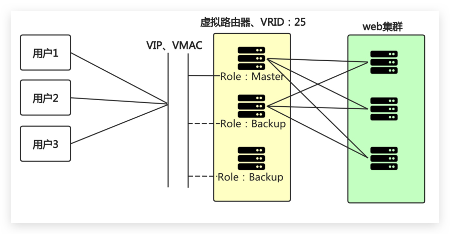
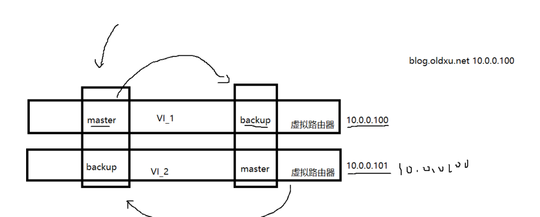
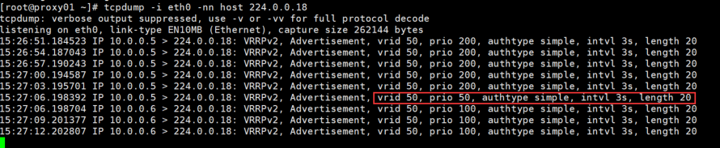
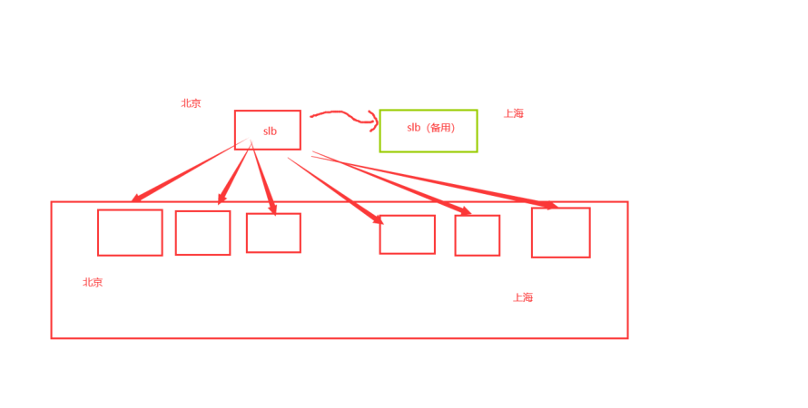
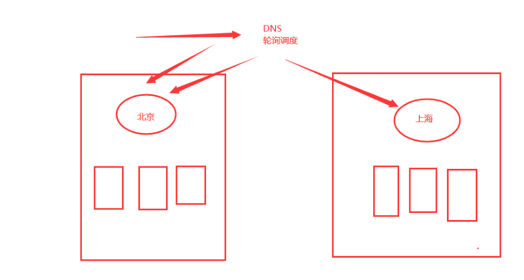
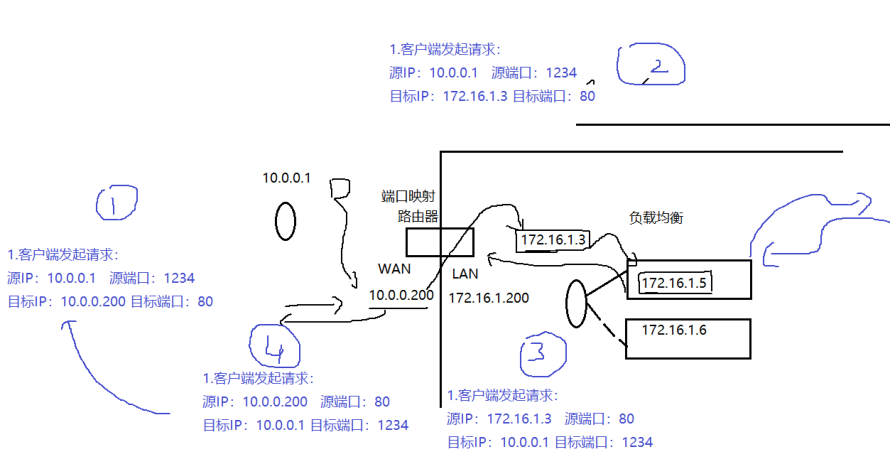

# 13 高可用keepalived

## 目录

- [1.高可用基本概述](#1.高可用基本概述)
  - [1.1 什么是高可用](#1.1-什么是高可用)
- [100%。如果系统每运行100个时间单位，会有1个时](#100如果系统每运行100个时间单位会有1个时)
  - [1.2 高可用使用什么工具](#1.2-高可用使用什么工具)
  - [1.3 高可用是如何实现的](#1.3-高可用是如何实现的)
  - [1.4 VRRP诞生背景及原理](#1.4-vrrp诞生背景及原理)
- [1.如果用户过多修改起来是不是会非常的麻烦；](#1.如果用户过多修改起来是不是会非常的麻烦)
- [2.如果用户将指向都修改为Backup，那Master如](#2.如果用户将指向都修改为backup那master如)
- [2.高可用Keepalived](#2.高可用keepalived)
  - [2.1 Keeplaived基本介绍](#2.1-keeplaived基本介绍)
  - [2.2 Keepalived核心概念](#2.2-keepalived核心概念)
  - [2.3 Keeplaived应用场景](#2.3-keeplaived应用场景)
  - [2.4 Keeplaived安装配置](#2.4-keeplaived安装配置)
    - [2.4.1 环境准备](#2.4.1-环境准备)
- [2.在 Master 以及 Backup 节点分别安装](#2.在-master-以及-backup-节点分别安装)
    - [2.4.1 配置Master](#2.4.1-配置master)
    - [2.4.2 配置Backup](#2.4.2-配置backup)
    - [2.4.3 地址漂移测试](#2.4.3-地址漂移测试)
- [1.在 Master 上进行如下操作](#1.在-master-上进行如下操作)
- [2.在 Backup 上进行如下操作](#2.在-backup-上进行如下操作)
- [3.此时启动 Master 上的 Keepalived，会发现 VIP 被](#3.此时启动-master-上的-keepalived会发现-vip-被)
- [4.通过 windows 查看 arp 缓存表，验证地址漂移后是](#4.通过-windows-查看-arp-缓存表验证地址漂移后是)
    - [2.4.4 抓包分析切换过程](#2.4.4-抓包分析切换过程)
- [5.通过 tcpdump 抓包分析 keepalived 地址切换过程；](#5.通过-tcpdump-抓包分析-keepalived-地址切换过程)
  - [2.5 Keepalived延迟抢占](#2.5-keepalived延迟抢占)
- [1、两台节点的 state都必须配置为 BACKUP；](#1两台节点的-state都必须配置为-backup)
- [2、在节点的 vrrp_instance 中添加 nopreempt](#2在节点的-vrrp_instance-中添加-nopreempt)
  - [2.6 Keepalived非抢占式](#2.6-keepalived非抢占式)
- [2、两台节点都在 vrrp_instance 中添加](#2两台节点都在-vrrp_instance-中添加)
- [3、其中一个节点的优先级必须要高于另外一个节](#3其中一个节点的优先级必须要高于另外一个节)
  - [2.7 Keeplaived邮件通知](#2.7-keeplaived邮件通知)
- [1.配置邮箱（所有节点都需要配置）](#1.配置邮箱所有节点都需要配置)
- [2.通知脚本（所有节点都需要配置）](#2.通知脚本所有节点都需要配置)
- [3.修改配置 （Master）](#3.修改配置-master)
- [4.修改配置 （Backup）](#4.修改配置-backup)
- [5.停止所有节点的 Keepalived，先启动 Backup节点，](#5.停止所有节点的-keepalived先启动-backup节点)
- [6.观察邮件信息](#6.观察邮件信息)
  - [2.8 Keepalived双主模式](#2.8-keepalived双主模式)
- [3.高可用Nginx实践](#3.高可用nginx实践)
  - [3.1 高可用Nginx](#3.1-高可用nginx)
- [1.Nginx与Keepalived之间是什么关系？](#1.nginx与keepalived之间是什么关系)
- [2.如果Nginx无法访问，keepalived的VIP会自动漂](#2.如果nginx无法访问keepalived的vip会自动漂)
- [1.当监控到Nginx处于非活动状态，则动态调整](#1.当监控到nginx处于非活动状态则动态调整)
- [2.当监控到Nginx处于活动状，则重新抢占 VIP](#2.当监控到nginx处于活动状则重新抢占-vip)
  - [3.1 修改配置文件](#3.1-修改配置文件)
- [0(失败)，keepalived以此为依据判断其监控的服务状态](#0失败keepalived以此为依据判断其监控的服务状态)
  - [3.1 抓包验证结果](#3.1-抓包验证结果)
- [1.停止Master节点的Nginx，然后抓包分析](#1.停止master节点的nginx然后抓包分析)
- [2.恢复 Master节点的 Nginx 服务，然后抓包分析](#2.恢复-master节点的-nginx-服务然后抓包分析)
- [4.高可用脑裂](#4.高可用脑裂)
  - [4.1 什么是脑裂](#4.1-什么是脑裂)
  - [4.2 脑裂是如何产生的](#4.2-脑裂是如何产生的)
- [1.服务器网线松动等网络故障](#1.服务器网线松动等网络故障)
- [2.服务器硬件故障发生损坏现象而崩溃](#2.服务器硬件故障发生损坏现象而崩溃)
- [3.主备都开启firewalld防火墙](#3.主备都开启firewalld防火墙)
  - [4.3 脑裂影响的范围](#4.3-脑裂影响的范围)
- [5.如何投递生产使用](#5.如何投递生产使用)
  - [5.1云主机](#5.1云主机)
  - [5.2 物理机器](#5.2-物理机器)

目录

- [1.高可用基本概述](#1.高可用基本概述)
  - [1.1 什么是高可用](#1.1-什么是高可用)
  - [1.2 高可用使用什么工具](#1.2-高可用使用什么工具)
  - [1.3 高可用是如何实现的](#1.3-高可用是如何实现的)
  - [1.4 VRRP诞生背景及原理](#1.4-vrrp诞生背景及原理)
- [2.高可用Keepalived](#2.高可用keepalived)
  - [2.1 Keeplaived基本介绍](#2.1-keeplaived基本介绍)
  - [2.2 Keepalived核心概念](#2.2-keepalived核心概念)
  - [2.3 Keeplaived应用场景](#2.3-keeplaived应用场景)
  - [2.4 Keeplaived安装配置](#2.4-keeplaived安装配置)
    - [2.4.1 环境准备](#2.4.1-环境准备)
    - [2.4.1 配置Master](#2.4.1-配置master)
    - [2.4.2 配置Backup](#2.4.2-配置backup)
    - [2.4.3 地址漂移测试](#2.4.3-地址漂移测试)
    - [2.4.4 抓包分析切换过程](#2.4.4-抓包分析切换过程)
  - [2.5 Keepalived延迟抢占](#2.5-keepalived延迟抢占)
  - [2.6 Keepalived非抢占式](#2.6-keepalived非抢占式)
  - [2.7 Keeplaived邮件通知](#2.7-keeplaived邮件通知)
  - [2.8 Keepalived双主模式](#2.8-keepalived双主模式)
- [3.高可用Nginx实践](#3.高可用nginx实践)
  - [3.1 高可用Nginx](#3.1-高可用nginx)
  - [3.1 修改配置文件](#3.1-修改配置文件)
  - [3.1 抓包验证结果](#3.1-抓包验证结果)
- [4.高可用脑裂](#4.高可用脑裂)
  - [4.1 什么是脑裂](#4.1-什么是脑裂)
  - [4.2 脑裂是如何产生的](#4.2-脑裂是如何产生的)
  - [4.3 脑裂影响的范围](#4.3-脑裂影响的范围)
- [5.如何投递生产使用](#5.如何投递生产使用)
  - [5.1云主机](#5.1云主机)
  - [5.2 物理机器](#5.2-物理机器)

## 1.高可用基本概述

### 1.1 什么是高可用

简单理解：两台机器启动着相同的业务系统,当有一台

机器宕机，另外一台服务器能快速的接管，对于访问

的用户是无感知的。

专业理解：高可用是分布式系统架构设计中必要的一

环，主要目的: 减少系统不能提供服务的时间。假设

系统一直能够提供服务，我们说系统的可用性是

## 100%。如果系统每运行100个时间单位，会有1个时

间单位无法提供服务，我们说系统的可用性是99%。

高可用参考URL

高可用的目的：减少系统down机时间，提高SLA服务

等级；

### 1.2 高可用使用什么工具

通常服务高可用我们选择使用 keepalived 软件实

现；

### 1.3 高可用是如何实现的

keepalived 软件是基于 VRRP 协议实现的。

VRRP 虚拟路由冗余协议，主要用于解决单点故障问

题。

### 1.4 VRRP诞生背景及原理

比如公司的网络是通过网关转换进行上网的，那如果

该路由器故障了，网关无法转发报文了，此时所有人

都将无法上网，这么时候怎么办呢？



通常做法是增加一个 Backup 路由，然后修改用户PC

电脑网关指向为Backup，但这里有几个问题

## 1.如果用户过多修改起来是不是会非常的麻烦；

## 2.如果用户将指向都修改为Backup，那Master如

果恢复了该怎么办？

那我们直接将 Backup 网关 IP 配置为 Master 网关

IP不就可以了吗?（其实也不行，why）

因为PC在第一次通信时，是通过ARP广播获取到

Master网关的Mac地址、IP地址，同时PC还会将

Master网关对应IP与MAC地址存储至ARP缓存表

中；

所以当PC与网关进行通信时，会直接读取ARP缓

存表中的MAC地址与IP地址，进行数据包转发，

也就意味着当Master节点故障，将Backup节点

IP修改为Master的IP，最终PC的数据包还是会

转发给Master，不会转发给 Backup节点。（除

非PC的ARP缓存表过期，在次发起ARP广播的时候

才能正确获取Bakcup的Mac地址与对应的IP地

址。）



那如何才能做到出现故障自动转移，此时VRRP就应运

而生；

VRRP其实是通过软件或硬件的形式在Master和

Backup外层增加一个虚拟MAC地址（简称VMAC）、

以及虚拟IP地址（简称VIP）；

那么在这种情况下，当PC请求VIP的时候，无论是

Master处理还是Backup处理，PC仅会在ARP缓存表

中记录VMAC与VIP的对应关系。



## 2.高可用Keepalived

### 2.1 Keeplaived基本介绍

Keepalived 基于 vrrp 实现，原生设计是为了高可

用lvs服务；

通过 vrrp 协议，可以完成地址漂移技术；

为 vip 地址所在的节点生成 ipvs 规则（需要在

配置文件中预先定义）；

为 ipvs 集群的 RS 节点做健康状态检测；

核心组件：

vrrp stack：用来实现 vrrp 协议重要组件之

一；

Netlink接口：设置和删除网络接口上的虚拟IP

地址；

```
ipvs wrapper：使用getsock和setsock来建立
```

IPVS规则；

checkers：监测RS节点的方式，支持tcp、

http、ssl等；

system call：支持启动额外系统脚本的功能；

SMTP：为 当发生角色状态转换时，发送事件通知

邮件；

WatchDog：监控进程

控制组件：配置文件分析器

内存管理组件



### 2.2 Keepalived核心概念

虚拟路由器：由一个Master路由器和多个Backup路

由器组成；

Master路由器：虚拟路由器中承担报文转发任务的

路由器；

Backup路由器：Master路由器出现故障时，能够代

替Master路由器工作的路由器；

VRID：虚拟路由器的标识，由相同 VRID 的一组路由

器构成一个虚拟路由器；

组播：组播是有特定的成员，是一种可控的广播，组

播成员需要加入“组播组”才能收到该组播的信息。

虚拟IP地址：虚拟路由器的IP地址，一个虚拟路由

器可以拥有一个或多个IP地址；

虚拟MAC地址：一个虚拟路由器拥有一个虚拟MAC地

址；

优先级：VRRP根据优先级来确定虚拟路由器中每台路

由器的地位；

抢占式：如果Master故障，Backup自动接管，当

Master恢复了会将VIP地址抢回来；

非抢占式：如果Master故障，Backup自动接管，当

Master恢复则自动转为Backup，不会抢占VIP；



### 2.3 Keeplaived应用场景

当需要使用 Keepalived 时，通常是因为我们的业务

系统需要保证 7x24 小时不DOWN机；

比如公司内部 OA 系统，每天公司人员都需要使

用，则不允许Down机；

比如公司对外发布的业务系统（单车），每天有大

量的用户使用，是不可以出现故障的；

也就是说作为企业的业务系统，要保证随时随地都可

以使用，不可以中断。

### 2.4 Keeplaived安装配置

#### 2.4.1 环境准备

状态 eth0 eth1 角色 节点1 10.0.0.5 172.16.1.5 Master 节点2 10.0.0.6 172.16.1.6 Backup VIP地址 10.0.0.100

## 2.在 Master 以及 Backup 节点分别安装

```
Keepalived
[root@lb01 ~]# yum install keepalived -y
[root@lb02 ~]# yum install keepalived -y
```

#### 2.4.1 配置Master

```
[root@lb01 ~]# cat
/etc/keepalived/keepalived.conf
global_defs {
    router_id lb01                  # 当前物
```

理设备的标识名称

```
    #vrrp_mcast_group4 224.0.0.18    # 组播
地址，default 224.0.0.18
}
vrrp_instance VI_1 {
    state MASTER                    # 角色状
```

态；

```
    interface eth0                  # 绑定当
```

前虚拟路由使用的物理接口；

```
    virtual_router_id 50            # 当前虚
```

拟路由标识，VRID；

```
    priority 200                    # 当前物
```

理节点在虚拟路由中的优先级；

```
    advert_int 3                    # vrrp通
```

告时间间隔，默认1s；

```
    authentication {
        auth_type PASS              # 密码类
```

型，简单密码；

```
        auth_pass 1111              # 密码不
```

超过8位字符；

```
    }
```

```
    virtual_ipaddress {
        10.0.0.100        # VIP地址
    }
}
[root@lb01 ~]# systemctl enable keepalived
[root@lb01 ~]# systemctl start keepalived
```

#### 2.4.2 配置Backup

```
[root@lb02 ~]# cat
/etc/keepalived/keepalived.conf
global_defs {
    router_id lb02
    vrrp_mcast_group4 224.0.0.18
}
```

```
vrrp_instance VI_1 {
    state BACKUP
    interface eth0
    virtual_router_id 50
    priority 100
    advert_int 1
    authentication {
        auth_type PASS
        auth_pass 1111
    }
    virtual_ipaddress {
        10.0.0.100
    }
}
[root@lb02 ~]# systemctl enable keepalived
[root@lb02 ~]# systemctl start keepalived
```

#### 2.4.3 地址漂移测试

检查 keepalived 的 VIP 地址能否在两个节点间漂

移；

## 1.在 Master 上进行如下操作

```
# Master存在vip地址
[root@lb01 ~]# ip addr |grep 10.0.0.100
    inet 10.0.0.100/32 scope global eth0
[root@lb01 ~]# systemctl stop keepalived
```

## 2.在 Backup 上进行如下操作

发现地址已经漂移至Backup端

```
[root@lb02 ~]# ip addr|grep 10.0.0.100
    inet 10.0.0.100/32 scope global eth0
```

## 3.此时启动 Master 上的 Keepalived，会发现 VIP 被

强行抢占；

```
[root@lb01 ~]# systemctl start keepalived
[root@lb01 ~]# ip addr |grep 10.0.0.100
    inet 10.0.0.100/32 scope global eth0
```

## 4.通过 windows 查看 arp 缓存表，验证地址漂移后是

否会自动更新 MAC 地址。

#### 2.4.4 抓包分析切换过程

## 5.通过 tcpdump 抓包分析 keepalived 地址切换过程；

```
[root@client ~]# tcpdump -i eth0 -nn host
224.0.0.18
21:24:08.380079 IP 10.0.0.3 > 224.0.0.18:
VRRPv2, Advertisement, vrid 50, prio 200,
authtype simple, intvl 1s, length 20
21:24:09.383089 IP 10.0.0.3 > 224.0.0.18:
VRRPv2, Advertisement, vrid 50, prio 200,
authtype simple, intvl 1s, length 20
21:24:10.356416 IP 10.0.0.3 > 224.0.0.18:
VRRPv2, Advertisement, vrid 50, prio 0,
authtype simple, intvl 1s, length 20
21:24:11.970592 IP 10.0.0.4 > 224.0.0.18:
VRRPv2, Advertisement, vrid 50, prio 100,
authtype simple, intvl 1s, length 20
21:24:12.972066 IP 10.0.0.4 > 224.0.0.18:
VRRPv2, Advertisement, vrid 50, prio 100,
authtype simple, intvl 1s, length 20
21:24:14.976608 IP 10.0.0.3 > 224.0.0.18:
VRRPv2, Advertisement, vrid 50, prio 200,
authtype simple, intvl 1s, length 20
21:24:15.977649 IP 10.0.0.3 > 224.0.0.18:
VRRPv2, Advertisement, vrid 50, prio 200,
authtype simple, intvl 1s, length 20
```

### 2.5 Keepalived延迟抢占

延迟抢占指的是，当Master故障后，Backup接管，

当Master恢复后不立即抢占VIP地址，延迟一段时间

在抢占VIP

配置延迟抢占式步骤如下

## 1、两台节点的 state都必须配置为 BACKUP；

## 2、在节点的 vrrp_instance 中添加 nopreempt

```
# Master
    vrrp_instance VI_1 {
        state BACKUP
        priority 200
        preempt_delay 10s     # 延迟10s后抢占
VIP
    }
# Backup
    vrrp_instance VI_1 {
        state BACKUP
        priority 100
        preempt_delay 10s
    }
```

### 2.6 Keepalived非抢占式

通常 master 服务故障后 backup 会变成 master，

但是当 master 服务恢复后，master会抢占VIP，这

样就会发生两次切换；对业务繁忙的网站来说并不是

太友好；

此时我们可以配置keepalived为非抢占式，（前提

两台主机的硬件配置信息一致）；

配置非抢占式步骤如下

## 1、两台节点的 state都必须配置为 BACKUP；

## 2、两台节点都在 vrrp_instance 中添加

nopreempt 参数；

## 3、其中一个节点的优先级必须要高于另外一个节

点的优先级；

```
# Master
    vrrp_instance VI_1 {
        state BACKUP
        priority 200
        nopreempt
    }
# Backup
    vrrp_instance VI_1 {
        state BACKUP
        priority 100
        nopreempt
    }
```

### 2.7 Keeplaived邮件通知

## 1.配置邮箱（所有节点都需要配置）

```
[root@lb01 ~]# # yum install mailx -y
[root@lb01 ~]# cat >> /etc/mail.rc <<EOF
set from=572891887@qq.com
set smtp=smtp.qq.com
set smtp-auth-user=572891887@qq.com
set smtp-auth-password=123
set smtp-auth=login
set ssl-verify=ignore
EOF
```

## 2.通知脚本（所有节点都需要配置）

```
[root@dns-slave ~]# cat
/etc/keepalived/notify.sh
#!/usr/bin/bash
```

定义收件人

```
Email='552408925@qq.com'
```

定义主机名称

```
Host=$(hostname)
```

定义时间变量

```
Date=$(date +'%F %T')
```

#定义发送的消息

```
Message() {
    subject="${Host} 切换为 $1 状态"
    submsg="${Date}: ${Host} 成功切换为 $1 状
```

态"

```
    echo "${submsg}" | mail -s "${subject}"
"${Email}"
```

echo "时间: ${主机名称} 成功切换为 backup

```
状态" | mail -s "${主机} 切换为 backup 状态"
"552408925@qq.com"
}
case $1 in
    master)
        Message master
        ;;
    backup)
        Message backup
        ;;
    fault)
        Message fault
        ;;
    *)
        echo "Usage: $0 { master | backup |
fault }"
        exit
esac
```

## 3.修改配置 （Master）

```
[root@lb01 ~]# cat
/etc/keepalived/keepalived.conf
! Configuration File for keepalived
```

```
global_defs {
    router_id lb01
    vrrp_mcast_group4   224.0.0.18
}
vrrp_instance VI_1 {
    state BACKUP
    interface eth0
    virtual_router_id 50
    priority 200
    advert_int 1
    nopreempt
    authentication {
        auth_type PASS
        auth_pass 1111
    }
    virtual_ipaddress {
        10.0.0.100 dev eth0
    }
     notify_master
"/etc/keepalived/notify.sh master"  # 当前节
```

点成为主节点时触发的脚本

```
     notify_backup
"/etc/keepalived/notify.sh backup"  # 当前节
```

点转为备节点时触发的脚本

```
     notify_fault
"/etc/keepalived/notify.sh fault"    # 当前
```

节点转为“失败”状态时触发的脚本

```
}
```

## 4.修改配置 （Backup）

```
[root@dns-slave ~]# cat
/etc/keepalived/keepalived.conf
! Configuration File for keepalived
global_defs {
    router_id lb02
    vrrp_mcast_group4   224.0.0.18
}
vrrp_instance VI_1 {
    state BACKUP
    interface eth0
    virtual_router_id 50
    priority 100
    advert_int 1
    authentication {
        auth_type PASS
        auth_pass 1111
    }
    virtual_ipaddress {
        10.0.0.100 dev eth0
    }
     notify_master
"/etc/keepalived/notify.sh master"  # 当前节
```

点成为主节点时触发的脚本

```
     notify_backup
"/etc/keepalived/notify.sh backup"  # 当前节
```

点转为备节点时触发的脚本

```
     notify_fault
"/etc/keepalived/notify.sh fault"    # 当前
```

节点转为“失败”状态时触发的脚本

```
}
```

## 5.停止所有节点的 Keepalived，先启动 Backup节点，

然后启动 Master节点；

```
# Backup
[root@lb02 ~]# systemctl start keepalived
```

等待邮件发送成功在启动 Master

```
# Master
[root@lb01 ~]# systemctl start keepalived
```

## 6.观察邮件信息


### 2.8 Keepalived双主模式

两个或以上 VIP 分别运行在不同的 keepalived 服

务器；实现服务器并行访问 web 应用，提高服务器资

源利用率。



```
# proxy01
[root@proxy01 ~]# cat
/etc/keepalived/keepalived.conf
global_defs {
    router_id lb01                  # 当前物
```

理设备的标识名称

```
}
```

主

```
vrrp_instance VI_1 {
    state MASTER                    # 角色状
```

态；

```
    interface eth0                  # 绑定当
```

前虚拟路由使用的物理接口；

```
    virtual_router_id 50            # 当前虚
```

拟路由标识，VRID；

```
    priority 200                    # 当前物
```

理节点在虚拟路由中的优先级；

```
    advert_int 3                    # vrrp通
```

告时间间隔，默认1s；

```
    #nopreempt
    authentication {
        auth_type PASS              # 密码类
```

型，简单密码；

```
        auth_pass 1111              # 密码不
```

超过8位字符；

```
    }
```

```
    virtual_ipaddress {
        10.0.0.100        # VIP地址
    }
```

```
    notify_master
"/etc/keepalived/notify.sh master"  # 当前节
```

点成为主节点时触发的脚本

```
     notify_backup
"/etc/keepalived/notify.sh backup"  # 当前节
```

点转为备节点时触发的脚本

```
     notify_fault
"/etc/keepalived/notify.sh fault"    # 当前
```

节点转为“失败”状态时触发的脚本

```
}
```

备

```
vrrp_instance VI_2 {
    state BACKUP                    # 角色状
```

态；

```
    interface eth0                  # 绑定当
```

前虚拟路由使用的物理接口；

```
    virtual_router_id 55            # 当前虚
```

拟路由标识，VRID；

```
    priority 100                    # 当前物
```

理节点在虚拟路由中的优先级；

```
    advert_int 3                    # vrrp通
```

告时间间隔，默认1s；

```
    #nopreempt
    authentication {
        auth_type PASS              # 密码类
```

型，简单密码；

```
        auth_pass 1111              # 密码不
```

超过8位字符；

```
    }
```

```
    virtual_ipaddress {
        10.0.0.101        # VIP地址
    }
}
# proxy02
[root@proxy02 ~]# cat
/etc/keepalived/keepalived.conf
global_defs {
    router_id lb02                  # 当前物
```

理设备的标识名称

```
}
```

备

```
vrrp_instance VI_1 {
    state BACKUP                    # 角色状
```

态；

```
    interface eth0                  # 绑定当
```

前虚拟路由使用的物理接口；

```
    virtual_router_id 50            # 当前虚
```

拟路由标识，VRID；

```
    priority 100                    # 当前物
```

理节点在虚拟路由中的优先级；

```
    advert_int 3                    # vrrp通
```

告时间间隔，默认1s；

```
    #nopreempt
    authentication {
        auth_type PASS              # 密码类
```

型，简单密码；

```
        auth_pass 1111              # 密码不
```

超过8位字符；

```
    }
```

```
    virtual_ipaddress {
        10.0.0.100        # VIP地址
    }
    notify_master
"/etc/keepalived/notify.sh master"  # 当前节
```

点成为主节点时触发的脚本

```
    notify_backup
"/etc/keepalived/notify.sh backup"  # 当前节
```

点转为备节点时触发的脚本

```
    notify_fault "/etc/keepalived/notify.sh
```

fault" # 当前节点转为“失败”状态时触发的脚本

```
}
```

主

```
vrrp_instance VI_2 {
    state MASTER                   # 角色状
```

态；

```
    interface eth0                  # 绑定当
```

前虚拟路由使用的物理接口；

```
    virtual_router_id 55            # 当前虚
```

拟路由标识，VRID；

```
    priority 200                    # 当前物
```

理节点在虚拟路由中的优先级；

```
    advert_int 3                    # vrrp通
```

告时间间隔，默认1s；

```
    #nopreempt
    authentication {
        auth_type PASS              # 密码类
```

型，简单密码；

```
        auth_pass 1111              # 密码不
```

超过8位字符；

```
    }
    virtual_ipaddress {
        10.0.0.101        # VIP地址
    }
```

```
}
```

## 3.高可用Nginx实践

### 3.1 高可用Nginx

## 1.Nginx与Keepalived之间是什么关系？

没关系。

Nginx仅借助Keepalived的VIP地址漂移技术，

从而实现的高可用；

## 2.如果Nginx无法访问，keepalived的VIP会自动漂

移至Backup节点吗?

不能，因为Keepalived与Nginx之间没有关系；

当Nginx不存活时，会导致用户请求失败，但

Keepalived虚拟地址并不会进行漂移，所以需要

编写一个keepalived辅助脚本，监控nginx；

## 1.当监控到Nginx处于非活动状态，则动态调整

优先级状态，确保备节点能正常接管 VIP；

## 2.当监控到Nginx处于活动状，则重新抢占 VIP

地址

### 3.1 修改配置文件

```
[root@dns-master ~]# cat
/etc/keepalived/keepalived.conf
! Configuration File for keepalived
```

```
global_defs {
    router_id lb01
    vrrp_mcast_group4   224.0.0.18
}
#
vrrp_script check_nginx {
```

一条指令或者一个脚本文件，需返回0(成功)或非

## 0(失败)，keepalived以此为依据判断其监控的服务状态

```
    script "/usr/bin/killall -0 nginx
&>/dev/null && exit 0 || exit 1"
```

interval 3 # 指定脚本执行的间隔

timeout 2 # 指定脚本执行的超时时间

weight -150 # 当监控服务不存活则动态降

权，确保Backup能接管成功

fall 2 # 判定服务异常的检查次数

rise 3 # 判定服务正常的检查次数

```
}
vrrp_instance VI_1 {
    state MASTER
    interface eth0
    virtual_router_id 50
    priority 200
    advert_int 1
    authentication {
        auth_type PASS
        auth_pass 1111
    }
    virtual_ipaddress {
```

```
        10.0.0.100 dev eth0
    }
```

调用脚本

```
    track_script {
        check_nginx
    }
     notify_master
"/etc/keepalived/notify.sh master"
     notify_backup
"/etc/keepalived/notify.sh backup"
     notify_fault
"/etc/keepalived/notify.sh fault"
}
```

### 3.1 抓包验证结果

## 1.停止Master节点的Nginx，然后抓包分析

抓包

```
[root@cleint ~]# tcpdump -i eth0 -nn host
224.0.0.18
22:57:24.061852 IP 10.0.0.3 > 224.0.0.18:
VRRPv2, Advertisement, vrid 50, prio 200,
authtype simple, intvl 1s, length 20
22:57:25.064372 IP 10.0.0.3 > 224.0.0.18:
VRRPv2, Advertisement, vrid 50, prio 200,
authtype simple, intvl 1s, length 20
22:57:26.066353 IP 10.0.0.3 > 224.0.0.18:
VRRPv2, Advertisement, vrid 50, prio 50,
authtype simple, intvl 1s, length 20
22:57:26.066592 IP 10.0.0.4 > 224.0.0.18:
VRRPv2, Advertisement, vrid 50, prio 100,
authtype simple, intvl 1s, length 20
22:57:27.068583 IP 10.0.0.4 > 224.0.0.18:
VRRPv2, Advertisement, vrid 50, prio 100,
authtype simple, intvl 1s, length 20
```

## 2.恢复 Master节点的 Nginx 服务，然后抓包分析

```
23:02:43.769755 IP 10.0.0.4 > 224.0.0.18:
VRRPv2, Advertisement, vrid 50, prio 100,
authtype simple, intvl 1s, length 20
23:02:44.772628 IP 10.0.0.4 > 224.0.0.18:
VRRPv2, Advertisement, vrid 50, prio 100,
authtype simple, intvl 1s, length 20
23:02:45.775108 IP 10.0.0.4 > 224.0.0.18:
VRRPv2, Advertisement, vrid 50, prio 100,
authtype simple, intvl 1s, length 20
23:02:54.797700 IP 10.0.0.3 > 224.0.0.18:
VRRPv2, Advertisement, vrid 50, prio 200,
authtype simple, intvl 1s, length 20
23:02:55.799275 IP 10.0.0.3 > 224.0.0.18:
VRRPv2, Advertisement, vrid 50, prio 200,
authtype simple, intvl 1s, length 20
23:02:56.802427 IP 10.0.0.3 > 224.0.0.18:
VRRPv2, Advertisement, vrid 50, prio 200,
authtype simple, intvl 1s, length 20
```



## 4.高可用脑裂

### 4.1 什么是脑裂

由于某些原因，导致两台keepalived高可用服务器在指

定时间内，无法检测到对方的心跳消息，当两（多）个

节点同时认为自已是唯一处于活动状态的服务节点，从

而出现争抢VIP，这种VIP资源的争抢即为“脑裂”。

### 4.2 脑裂是如何产生的

## 1.服务器网线松动等网络故障

## 2.服务器硬件故障发生损坏现象而崩溃

## 3.主备都开启firewalld防火墙

### 4.3 脑裂影响的范围

对于无状态服务的HA，比如Nginx、无所谓脑裂不脑

裂；

对于有状态服务(比如MySQL)的HA，必须要严格防止

脑裂。

对于MySQL来说，可能出现多种情况，比如无法正常

访问、或者得不到正确的返回结果，但大部分是无法

正常访问，或直接没有响应；

可以使用第三方仲裁 fence 设备来避免脑裂；

（fence通过关掉电源来踢掉坏的服务器）

## 5.如何投递生产使用

### 5.1云主机

云主机不支持组播；

云上面提供负载均衡，且底层实现了高可用机制；

产品（SLB）





### 5.2 物理机器


