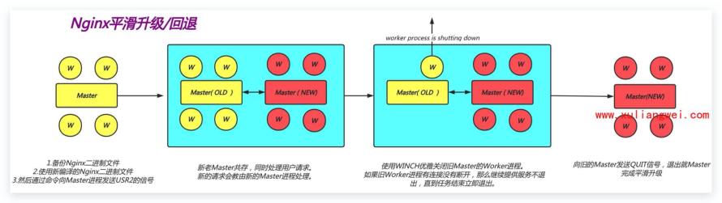

# 13.Nginx平滑升级

## 目录

- [1.Nginx平滑升级概述](#1.nginx平滑升级概述)
  - [1.1 什么是平滑升级](#1.1-什么是平滑升级)
  - [1.2 平滑升级实现原理](#1.2-平滑升级实现原理)
  - [1.3 平滑升级实现思路](#1.3-平滑升级实现思路)
- [1.下载新版本nginx](#1.下载新版本nginx)
- [2.了解原旧版本nginx编译参数](#2.了解原旧版本nginx编译参数)
- [3.将旧nginx二进制文件进行备份，然后替换成为](#3.将旧nginx二进制文件进行备份然后替换成为)
- [4.向旧nginx的Master进程发送USR2信号](#4.向旧nginx的master进程发送usr2信号)
  - [4.1）旧master进程的pid文件添加后](#4.1旧master进程的pid文件添加后)
  - [4.2）master进程会用新nginx二进制文件启动](#4.2master进程会用新nginx二进制文件启动)
- [5.向旧master进程发送WINCH信号，旧的worker](#5.向旧master进程发送winch信号旧的worker)
- [6.向旧master进程发送QUIT信号，旧的master](#6.向旧master进程发送quit信号旧的master)
  - [1.4 平滑升级所需信号](#1.4-平滑升级所需信号)
- [2.Nginx平滑升级实践](#2.nginx平滑升级实践)
  - [2.1 安装Nginx所需依赖](#2.1-安装nginx所需依赖)
  - [2.2 编译并安装Nginx](#2.2-编译并安装nginx)
  - [2.3 备份旧Nginx二进制](#2.3-备份旧nginx二进制)
  - [2.4 向旧Master发送USR2信号](#2.4-向旧master发送usr2信号)
  - [2.5 向旧Master发送WINCH信号](#2.5-向旧master发送winch信号)
  - [2.6 向旧Master发送QUIT信号](#2.6-向旧master发送quit信号)
- [3.Nginx平滑回滚实践](#3.nginx平滑回滚实践)
  - [3.1 平滑回退思路](#3.1-平滑回退思路)
- [1.替换 nginx 二进制文件](#1.替换-nginx-二进制文件)
- [2.向旧的1.21 master 发送USR2信号](#2.向旧的1.21-master-发送usr2信号)
- [3.向旧的1.21 master 发送WINCH](#3.向旧的1.21-master-发送winch)
- [4.向旧的1.21 master 发送QUIT](#4.向旧的1.21-master-发送quit)
  - [3.2 替换nginx二进制文件](#3.2-替换nginx二进制文件)
  - [3.3 向旧的master发送USR2信号](#3.3-向旧的master发送usr2信号)
  - [3.4 向旧的master发送WINCH信号](#3.4-向旧的master发送winch信号)
  - [3.5 向旧的master发送QUIT信号](#3.5-向旧的master发送quit信号)

目录

- [1.Nginx平滑升级概述](#1.nginx平滑升级概述)
  - [1.1 什么是平滑升级](#1.1-什么是平滑升级)
  - [1.2 平滑升级实现原理](#1.2-平滑升级实现原理)
  - [1.3 平滑升级实现思路](#1.3-平滑升级实现思路)
  - [1.4 平滑升级所需信号](#1.4-平滑升级所需信号)
- [2.Nginx平滑升级实践](#2.nginx平滑升级实践)
  - [2.1 安装Nginx所需依赖](#2.1-安装nginx所需依赖)
  - [2.2 编译并安装Nginx](#2.2-编译并安装nginx)
  - [2.3 备份旧Nginx二进制](#2.3-备份旧nginx二进制)
  - [2.4 向旧Master发送USR2信号](#2.4-向旧master发送usr2信号)
  - [2.5 向旧Master发送WINCH信号](#2.5-向旧master发送winch信号)
  - [2.6 向旧Master发送QUIT信号](#2.6-向旧master发送quit信号)
- [3.Nginx平滑回滚实践](#3.nginx平滑回滚实践)
  - [3.1 平滑回退思路](#3.1-平滑回退思路)
  - [3.2 替换nginx二进制文件](#3.2-替换nginx二进制文件)
  - [3.3 向旧的master发送USR2信号](#3.3-向旧的master发送usr2信号)
  - [3.4 向旧的master发送WINCH信号](#3.4-向旧的master发送winch信号)
  - [3.5 向旧的master发送QUIT信号](#3.5-向旧的master发送quit信号)

## 1.Nginx平滑升级概述

### 1.1 什么是平滑升级

在进行服务版本升级的时候，对于用户访问体验无感

知、不会造成服务中断。

### 1.2 平滑升级实现原理



### 1.3 平滑升级实现思路

如何实现Nginx平滑升级思路（建议准备一个大文件

持续下载验证升级是否会影响业务）

## 1.下载新版本nginx

## 2.了解原旧版本nginx编译参数

## 3.将旧nginx二进制文件进行备份，然后替换成为

新的nginx二进制文件

## 4.向旧nginx的Master进程发送USR2信号

### 4.1）旧master进程的pid文件添加后

```
缀.oldbin
```

### 4.2）master进程会用新nginx二进制文件启动

新的master进程

## 5.向旧master进程发送WINCH信号，旧的worker

子进程优雅退出

## 6.向旧master进程发送QUIT信号，旧的master

进程就退出了

### 1.4 平滑升级所需信号

信号 含义 QUIT 优雅关闭、quit HUP 优雅重启、reload USR1 重新打开日志文件、reopen USR2 平滑升级可执行的二进制程序 WINCH 平滑关闭Worker进程

## 2.Nginx平滑升级实践

### 2.1 安装Nginx所需依赖

```
[root@web01 ~]# yum install gcc redhat-rpm-
config \
libxslt-devel gd-devel perl-ExtUtils-Embed
\
geoip-devel gperftools-devel pcre-devel
openssl-devel -y
```

### 2.2 编译并安装Nginx

```
[root@web ~]# wget
http://nginx.org/download/nginx-
1.16.1.tar.gz
[root@web ~]# tar xf nginx-1.16.1.tar.gz
[root@web ~]# cd nginx-1.16.1/
```

#编译

```
[root@web ~]# ./configure --
prefix=/etc/nginx --with-compat --with-
file-aio --with-threads --with-
http_addition_module --with-
http_auth_request_module --with-
http_dav_module --with-http_flv_module --
with-http_gunzip_module --with-
http_gzip_static_module --with-
http_mp4_module --with-
http_random_index_module --with-
http_realip_module --with-
http_secure_link_module --with-
http_slice_module --with-http_ssl_module --
with-http_stub_status_module --with-
http_sub_module --with-http_v2_module --
with-mail --with-mail_ssl_module --with-
stream --with-stream_realip_module --with-
stream_ssl_module --with-
stream_ssl_preread_module
```

#仅make即可，不需要make install。因为make后会生

成新的二进制文件

```
[root@web ~]# make
```

### 2.3 备份旧Nginx二进制

将旧的nginx二进制文件进行备份，然后替换成为新的

nginx二进制文件

```
[root@web nginx-1.16.1]# mv /usr/sbin/nginx
/usr/sbin/nginx.old
[root@web nginx-1.16.1]# cp objs/nginx
/usr/sbin/nginx
```

### 2.4 向旧Master发送USR2信号

向旧的Nginx的Master进程发送USR2信号。（平滑升级

二进制可执行文件）

```
[root@web nginx-1.16.1]# ps -ef |grep nginx
root      20848      1  0 10:21 ?
 00:00:00 nginx: master process
/usr/sbin/nginx -c /etc/nginx/nginx.conf
nginx     20863  20848  0 10:22 ?
 00:00:00 nginx: worker process
nginx     20864  20848  0 10:22 ?
 00:00:00 nginx: worker process
```

#发送信号

```
[root@web nginx-1.16.1]# kill -USR2 20848
```

#pid文件会自动添加.oldbin后缀，该文件中记录的是旧

master的pid进程号

```
[root@web nginx-1.16.1]# cat
/var/run/nginx.pid.oldbin
```

```
20848
```

#新老master共存了

```
[root@web nginx-1.16.1]# ps -ef |grep nginx
root      20848      1  0 10:21 ?
 00:00:00 nginx: master process
/usr/sbin/nginx -c /etc/nginx/nginx.conf
```

（OLD）

```
nginx     20863  20848  0 10:22 ?
 00:00:00 nginx: worker process
nginx     20864  20848  0 10:22 ?
 00:00:00 nginx: worker process
root      24971  20848  0 11:37 ?
 00:00:00 nginx: master process
/usr/sbin/nginx -c /etc/nginx/nginx.conf
```

（NEW）

```
nginx     24972  24971  0 11:37 ?
 00:00:00 nginx: worker process
nginx     24973  24971  0 11:37 ?
 00:00:00 nginx: worker process
```

#验证站点是否正常

### 2.5 向旧Master发送WINCH信号

向旧的master进程发送WINCH信号，旧的worker子进

程优雅退出

```
[root@web nginx-1.16.1]# kill -WINCH 20848
[root@web nginx-1.16.1]# ps -ef |grep nginx
root      20848      1  0 10:21 ?
 00:00:00 nginx: master process
/usr/sbin/nginx -c /etc/nginx/nginx.conf
root      24971  20848  0 11:37 ?
 00:00:00 nginx: master process
/usr/sbin/nginx -c /etc/nginx/nginx.conf
nginx     24972  24971  0 11:37 ?
 00:00:00 nginx: worker process
nginx     24973  24971  0 11:37 ?
 00:00:00 nginx: worker process
```

### 2.6 向旧Master发送QUIT信号

```
[root@web nginx-1.16.1]# kill -QUIT 20848
[root@web nginx-1.16.1]# ps -ef |grep nginx
root      24971      1  0 11:37 ?
 00:00:00 nginx: master process
/usr/sbin/nginx -c /etc/nginx/nginx.conf
nginx     24972  24971  0 11:37 ?
 00:00:00 nginx: worker process
nginx     24973  24971  0 11:37 ?
 00:00:00 nginx: worker process
```

## 3.Nginx平滑回滚实践

### 3.1 平滑回退思路

## 1.替换 nginx 二进制文件

## 2.向旧的1.21 master 发送USR2信号

## 3.向旧的1.21 master 发送WINCH

## 4.向旧的1.21 master 发送QUIT

### 3.2 替换nginx二进制文件

```
[root@web ~]# mv /usr/sbin/nginx
/usr/sbin/nginx-1.16
[root@web ~]# mv /usr/sbin/nginx.old
/usr/sbin/nginx
```

### 3.3 向旧的master发送USR2信号

```
[root@web ~]# ps -ef |grep nginx
root      24971      1  0 11:37 ?
 00:00:00 nginx: master process
/usr/sbin/nginx -c /etc/nginx/nginx.conf
nginx     25124  24971  0 11:48 ?
 00:00:00 nginx: worker process
nginx     25125  24971  0 11:48 ?
 00:00:00 nginx: worker process
[root@web ~]# kill -USR2 24971
[root@web ~]# ps -ef |grep nginx
root      24971      1  0 11:37 ?
 00:00:00 nginx: master process
/usr/sbin/nginx -c /etc/nginx/nginx.conf
(OLD 1.16)
nginx     25124  24971  0 11:48 ?
 00:00:00 nginx: worker process
nginx     25125  24971  0 11:48 ?
 00:00:00 nginx: worker process
root      25163  24971  1 11:50 ?
 00:00:00 nginx: master process
/usr/sbin/nginx -c /etc/nginx/nginx.conf
(NEW 1.14)
nginx     25164  25163  0 11:50 ?
 00:00:00 nginx: worker process
nginx     25165  25163  0 11:50 ?
 00:00:00 nginx: worker process
```

### 3.4 向旧的master发送WINCH信号

向旧的master发送WINCH信号，优雅关闭旧的Worker

工作进程

```
[root@web ~]# kill -WINCH 24971
[root@web ~]# ps -ef |grep nginx
root      24971      1  0 11:37 ?
 00:00:00 nginx: master process
/usr/sbin/nginx -c /etc/nginx/nginx.conf
nginx     25124  24971  0 11:48 ?
 00:00:00 nginx: worker process is shutting
down
root      25163  24971  0 11:50 ?
 00:00:00 nginx: master process
/usr/sbin/nginx -c /etc/nginx/nginx.conf
nginx     25164  25163  0 11:50 ?
 00:00:00 nginx: worker process
nginx     25165  25163  0 11:50 ?
 00:00:00 nginx: worker process
```

### 3.5 向旧的master发送QUIT信号

向旧的master发送QUIT信号，退出master进程

```
[root@web ~]# kill -QUIT 24971
[root@web ~]# ps -ef |grep nginx
root      25163      1  0 11:50 ?
 00:00:00 nginx: master process
/usr/sbin/nginx -c /etc/nginx/nginx.conf
nginx     25164  25163  0 11:50 ?
 00:00:00 nginx: worker process
nginx     25165  25163  0 11:50 ?
 00:00:00 nginx: worker process
```
