# 机器学习(常用科学计算库1)

## 目录

- 1. 机器学习概述
  - 1.1. 人工智能概述
  - 1.2. 人工智能发展历程
  - 1.3. 人工智能主要分支
  - 1.4. 机器学习工作流程
  - 1.5. 机器学习算法分类
  - 1.6. 模型评估
  - 1.7. Aure机器学习实验
  - 1.8. 深度学习简介
- 2. 环境安装与使用
  - 2.1. 库的安装
  - 2.2. jupyter notebook的使用
- 3. Matplotlib
  - 3.1. Matplotlib之HelloWorld
  - 3.2. 基础绘图功能
  - 3.3. 常见图形绘制
- 4. Numpy
  - 4.1. Numpy的优势
  - 4.2. N维数组-ndarray
  - 4.3. 基本操作
  - 4.4. ndarray运算
  - 4.5. 数组间运算
  - 4.6. 数学：矩阵
- 5. Pandas
  - 5.1. Pandas介绍
  - 5.2. Pandas数据类型
  - 5.3. 基本数据操作
  - 5.4. DataFrame运算
  - 5.5. Pandas画图
  - 5.6. 文件读取与存储
  - 5.7. 高级处理-缺失值处理
  - 5.8. 高级处理-数据离散化
  - 5.9. 高级处理-合并
  - 5.10. 高级处理-交叉表与透视表
  - 5.11. 高级处理-分组与聚合
  - 5.12. 案例
- 6. 拓展知识
  - 6.1. 完整机器学习项目的流程
  - 6.2. 独立同分布


---

# 机器学习（常用科学计算库的使用）基础定位、目标

## 定位

作为人工智能领域(数据挖掘/机器学习方向)的基础课程，为长期从事人工智能方向打下坚实的基础。

## 目标

- 了解机器学习定义以及应用场景
- 掌握机器学习基础环境的安装和使用
- 掌握利用常用的科学计算库对数据进行展示、分析

---

## 人工智能概述

### 学习目标

- 了解人工智能发展历程
- 了解人工智能主要分支
- 了解机器学习定义以及应用场景
- 知道机器学习算法监督学习与无监督学习的区别
- 知道监督学习中的分类、回归特点
- 知道机器学习的开发流程
- 了解深度学习概念

---

### 1.1 人工智能概述

#### 学习目标

- 了解人工智能在现实生活中的应用
- 知道人工智能发展必备三要素
- 知道人工智能和机器学习、深度学习三者之间的关系

------------------------------------------------------------------------

#### 1 人工智能应用场景

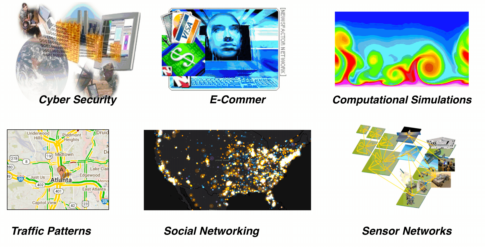

#### 2 人工智能小案例

案例一：


参考链接：<a href="https://quickdraw.withgoogle.com" target="_blank">https://quickdraw.withgoogle.com</a>

案例二：

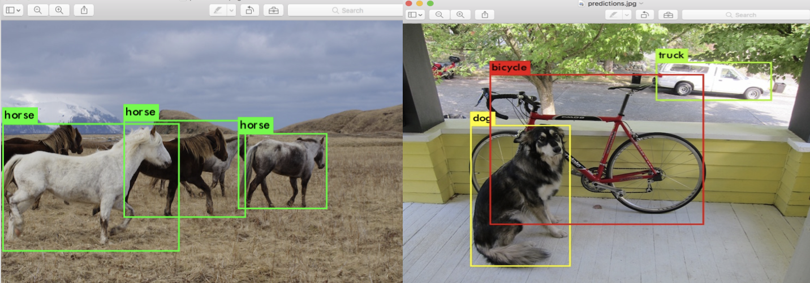

参考链接：<a href="https://pjreddie.com/darknet/yolo/" target="_blank">https://pjreddie.com/darknet/yolo/</a>

案例三：


查看更多：<a href="https://deepdreamgenerator.com/" target="_blank">https://deepdreamgenerator.com/</a>

#### 3 人工智能发展必备三要素：

- **数据**
- **算法**
- **计算力**
  - CPU,GPU,TPU


- 计算力之CPU、GPU对比：

  - CPU主要适合I\O密集型的任务

  - GPU主要适合计算密集型任务

<!-- -->

- **提问：什么类型的程序适合在GPU上运行？**

（1）**计算密集型的程序。**

所谓计算密集型(Compute-intensive)的程序，就是其大部分运行时间花在了寄存器运算上，寄存器的速度和处理器的速度相当，从寄存器读写数据几乎没有延时。可以做一下对比，读内存的延迟大概是几百个时钟周期；读硬盘的速度就不说了，即便是SSD, 也实在是太慢了。

（2）**易于并行的程序。**

GPU其实是一种SIMD(Single Instruction Multiple Data)架构， 他有成百上千个核，每一个核在同一时间最好能做同样的事情。

CPU和GPU的区别：

<a href="http://www.sohu.com/a/201309334_468740" target="_blank">http://www.sohu.com/a/201309334_468740</a>

Google TPU 介绍：

<a href="https://cloud.google.com/tpu/?hl=zh-cn" target="_blank"></a><a href="https://buzzorange.com/techorange/2017/09/27/what-intel-google-nvidia-microsoft-do-for-ai-chips/" target="_blank">https://buzzorange.com/techorange/2017/09/27/what-intel-google-nvidia-microsoft-do-for-ai-chips/</a>

#### 4 人工智能、机器学习和深度学习

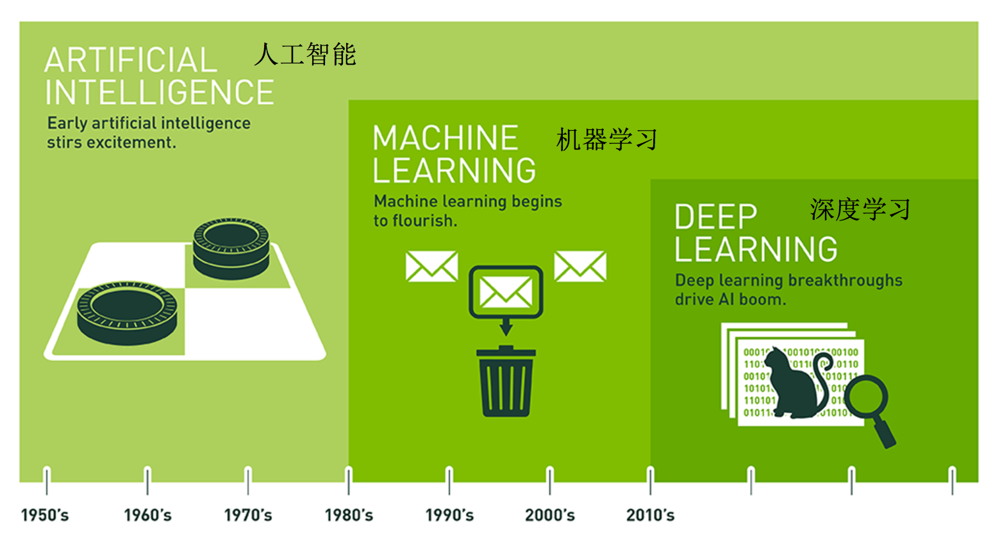

- 人工智能和机器学习，深度学习的关系
  - **机器学习是人工智能的一个实现途径**
  - **深度学习是机器学习的一个方法发展而来**

#### 5 小结

- 人工智能应用场景【了解】
  - 网络安全、电子商务、计算模拟、社交网络 … ...
- 人工智能必备三要素【知道】
  - 数据、算法、计算力
- 人工智能和机器学习，深度学习的关系【知道】
  - 机器学习是人工智能的一个实现途径
  - 深度学习是机器学习的一个方法发展而来

---

### 1.2 人工智能发展历程

#### 学习目标

- 了解人工智能阶段发展历程

------------------------------------------------------------------------

#### 1 人工智能的起源

##### 1.1 图灵测试

测试者与被测试者（一个人和一台机器）隔开的情况下，通过一些装置（如键盘）向被测试者随意提问。

多次测试（一般为**5min**之内），如果有超过**30%**的测试者不能确定被测试者是人还是机器，那么这台机器就通过了测试，并被认为具有**人类智能**。


##### 1.2 达特茅斯会议

1956年8月，在美国汉诺斯小镇宁静的达特茅斯学院中，

- 约翰·麦卡锡（John McCarthy）

- 马文·闵斯基（Marvin Minsky，人工智能与认知学专家）

- 克劳德·香农（Claude Shannon，信息论的创始人）

- 艾伦·纽厄尔（Allen Newell，计算机科学家）

- 赫伯特·西蒙（Herbert Simon，诺贝尔经济学奖得主

等科学家正聚在一起，讨论着一个完全不食人间烟火的主题：

**用机器来模仿人类学习以及其他方面的智能。**

会议足足开了两个月的时间，虽然大家没有达成普遍的共识，但是却为会议讨论的内容起了一个名字：

​**人工智能**

**因此，1956年也就成为了人工智能元年。**

#### 2 发展历程

人工智能充满未知的探索道路曲折起伏。如何描述人工智能自1956年以来60余年的发展历程，学术界可谓仁者见仁、智者见智。我们将人工智能的发展历程划分为以下6个阶段：、

- **第一是起步发展期：1956年—20世纪60年代初。**
  - 人工智能概念提出后，相继取得了一批令人瞩目的研究成果，如机器定理证明、跳棋程序等，掀起人工智能发展的第一个高潮。

<!-- -->

- **第二是反思发展期：20世纪60年代—70年代初。**
  - 人工智能发展初期的突破性进展大大提升了人们对人工智能的期望，人们开始尝试更具挑战性的任务，并提出了一些不切实际的研发目标。然而，接二连三的失败和预期目标的落空（例如，无法用机器证明两个连续函数之和还是连续函数、机器翻译闹出笑话等），使人工智能的发展走入低谷。

<!-- -->

- **第三是应用发展期：20世纪70年代初—80年代中。**
  - 20世纪70年代出现的专家系统模拟人类专家的知识和经验解决特定领域的问题，实现了人工智能从理论研究走向实际应用、从一般推理策略探讨转向运用专门知识的重大突破。专家系统在医疗、化学、地质等领域取得成功，推动人工智能走入应用发展的新高潮。

<!-- -->

- **第四是低迷发展期：20世纪80年代中—90年代中。**
  - 随着人工智能的应用规模不断扩大，专家系统存在的应用领域狭窄、缺乏常识性知识、知识获取困难、推理方法单一、缺乏分布式功能、难以与现有数据库兼容等问题逐渐暴露出来。

<!-- -->

- **第五是稳步发展期：20世纪90年代中—2010年。**
  - 由于网络技术特别是互联网技术的发展，加速了人工智能的创新研究，促使人工智能技术进一步走向实用化。1997年国际商业机器公司（简称IBM）深蓝超级计算机战胜了国际象棋世界冠军卡斯帕罗夫，2008年IBM提出“智慧地球”的概念。以上都是这一时期的标志性事件。

<!-- -->

- **第六是蓬勃发展期：2011年至今。**

  - 随着大数据、云计算、互联网、物联网等信息技术的发展，泛在感知数据和图形处理器等计算平台推动以深度神经网络为代表的人工智能技术飞速发展，大幅跨越了科学与应用之间的“技术鸿沟”，诸如图像分类、语音识别、知识问答、人机对弈、无人驾驶等人工智能技术实现了从“不能用、不好用”到“可以用”的技术突破，迎来爆发式增长的新高潮。

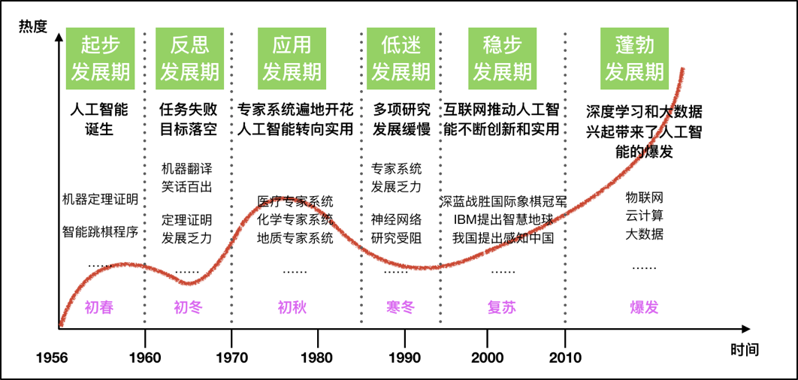

#### 3 小结

- 人工智能的起源【了解】
  - 图灵测试
  - 达特茅斯会议
- 人工智能的发展经历了六个阶段【了解】
  - 起步发展期
  - 反思发展期
  - 应用发展期
  - 低迷发展期
  - 稳步发展期
  - 蓬勃发展期

---

### 1.3 人工智能主要分支

#### 学习目标

- 了解人工智能的主要分支

------------------------------------------------------------------------

#### 1 主要分支介绍

通讯、感知与行动是现代人工智能的三个关键能力，在这里我们将根据这些能力/应用对这三个技术领域进行介绍：

- **计算机视觉(CV)、**
- **自然语言处理(NLP)**
  - 在 NLP 领域中，将覆盖文本挖掘/分类、机器翻译和语音识别。
- **机器人**

##### 1.1 分支一：计算机视觉

**计算机视觉(CV)是指机器感知环境的能力**。这一技术类别中的经典任务有图像形成、图像处理、图像提取和图像的三维推理。**物体检测和人脸识别是其比较成功的研究领域。**

**当前阶段：**

计算机视觉现已有很多应用，这表明了这类技术的成就，也让我们将其归入到应用阶段。随着深度学习的发展，机器甚至能在特定的案例中实现超越人类的表现。但是，**这项技术离社会影响阶段还有一定距离，那要等到机器能在所有场景中都达到人类的同等水平才行(感知其环境的所有相关方面)。**

**发展历史：**

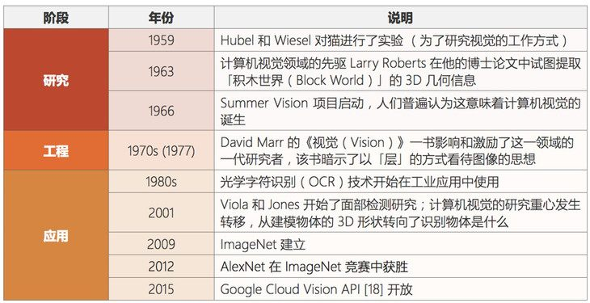


##### 1.2 分支二：语音识别

**语音识别是指识别语音(说出的语言)并将其转换成对应文本的技术**。相反的任务(文本转语音/TTS)也是这一领域内一个类似的研究主题。

**当前阶段：**

语音识别已经处于应用阶段很长时间了。最近几年，随着大数据和深度学习技术的发展，语音识别进展颇丰，现在已经非常接近社会影响阶段了。

语音识别领域仍然面临着**声纹识别**和**「鸡尾酒会效应」**等一些特殊情况的难题。

现代语音识别系统严重依赖于云，**在离线时可能就无法取得理想的工作效果。**

**发展历史：**

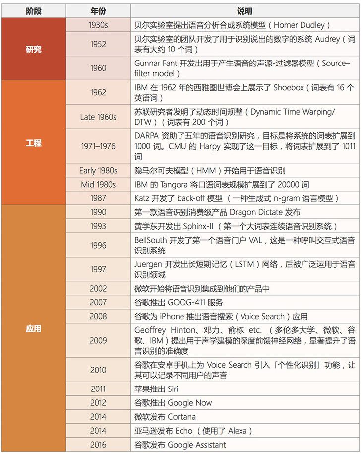

- **百度语音识别：**
  - 距离小于1米，中文字准率97%+
  - 支持耳语、长语音、中英文混合及方言


##### 1.3 分支三：**文本挖掘/分类**

**这里的文本挖掘主要是指文本分类，该技术可用于理解、组织和分类结构化或非结构化文本文档。**其涵盖的主要任务有句法分析、情绪分析和垃圾信息检测。

**当前阶段：**

我们将这项技术归类到应用阶段，因为现在有很多应用都已经集成了基于文本挖掘的情绪分析或垃圾信息检测技术。文本挖掘技术也在智能投顾的开发中有所应用，并且提升了用户体验。

**文本挖掘和分类领域的一个瓶颈出现在歧义和有偏差的数据上。**

**发展历史：**

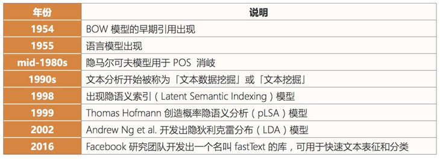

##### 1.4 分支四：机器翻译

**机器翻译(MT)是利用机器的力量自动将一种自然语言(源语言)的文本翻译成另一种语言(目标语言)。**

**当前阶段：**

机器翻译是一个见证了大量发展历程的应用领域。该领域最近由于神经机器翻译而取得了非常显著的进展，但仍然没有全面达到专业译者的水平；但是，我们相信在大数据、云计算和深度学习技术的帮助下，机器翻译很快就将进入社会影响阶段。

在某些情况下，**俚语和行话等内容的翻译会比较困难**(受限词表问题)。

**专业领域的机器翻译(比如医疗领域)表现通常不好**。

发展历史：

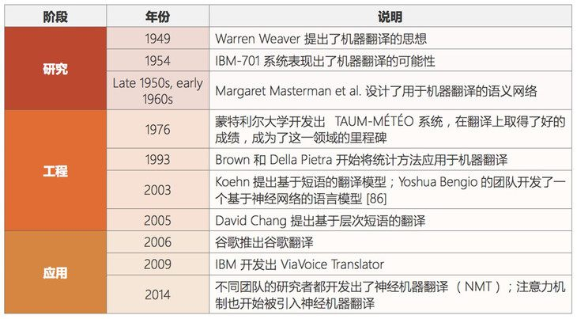

##### 1.5 分支五：机器人

**机器人学(Robotics)研究的是机器人的设计、制造、运作和应用，以及控制它们的计算机系统、传感反馈和信息处理。**

**机器人可以分成两大类:固定机器人和移动机器人。**固定机器人通常被用于工业生产(比如用于装配线)。常见的移动机器人应用有货运机器人、空中机器人和自动载具。机器人需要不同部件和系统的协作才能实现最优的作业。其中在硬件上包含传感器、反应器和控制器；另外还有能够实现感知能力的软件，比如定位、地图测绘和目标识别。

**当前阶段：**

自上世纪「Robot」一词诞生以来，人们已经为工业制造业设计了很多机器人。工业机器人是增长最快的应用领域，它们在 20 世纪 80 年代将这一领域带入了应用阶段。在安川电机、Fanuc、ABB、库卡等公司的努力下，我们认为进入 21 世纪之后，机器人领域就已经进入了社会影响阶段，此时各种工业机器人已经主宰了装配生产线。此外，软体机器人在很多领域也有广泛的应用，比如在医疗行业协助手术或在金融行业自动执行承销过程。

但是，法律法规和「**机器人威胁论**」可能会妨碍机器人领域的发展。还有**设计和制造机器人需要相对较高的投资**。

**发展历史**：


总的来说，人工智能领域的研究前沿正逐渐从搜索、知识和推理领域转向机器学习、深度学习、计算机视觉和机器人领域。

大多数早期技术至少已经处于应用阶段了，而且其中一些已经显现出了社会影响力。一些新开发的技术可能仍处于工程甚至研究阶段，但是我们可以看到不同阶段之间转移的速度变得越来越快。

#### 2 小结

- 人工智能主要分支【了解】
  - 计算机视觉
  - 语音识别
  - 文本挖掘/分类
  - 机器翻译
  - 机器人

---

### 1.4 机器学习工作流程

#### 学习目标

- 了解机器学习的定义
- 知道机器学习的工作流程
- 掌握获取到的数据集的特性

------------------------------------------------------------------------

#### 1 什么是机器学习

机器学习是从**数据**中**自动分析获得模型**，并利用**模型**对未知数据进行预测。

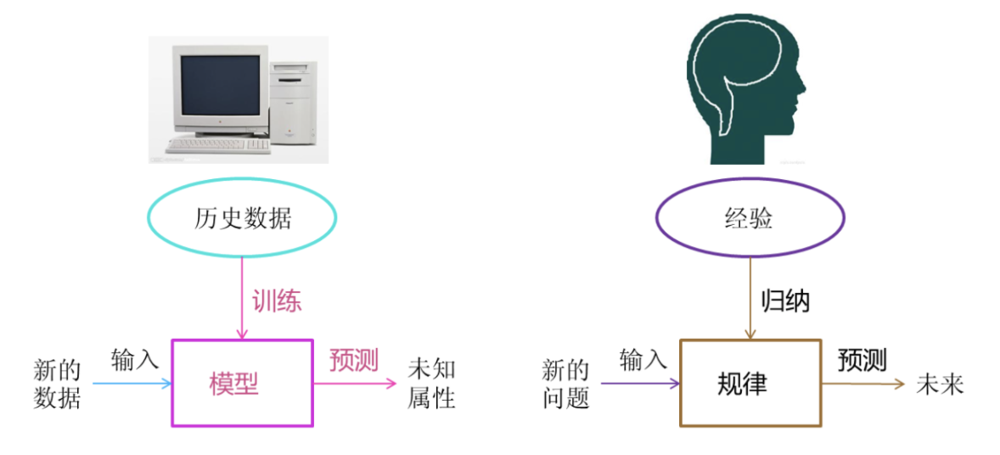

#### 2 机器学习工作流程


- 机器学习工作流程总结
  - **1.获取数据**

  - **2.数据基本处理**

  - **3.特征工程**

  - **4.机器学习(模型训练)**

  - **5.模型评估**

        - 结果达到要求，上线服务
        - 没有达到要求，重新上面步骤

##### 2.1 获取到的数据集介绍


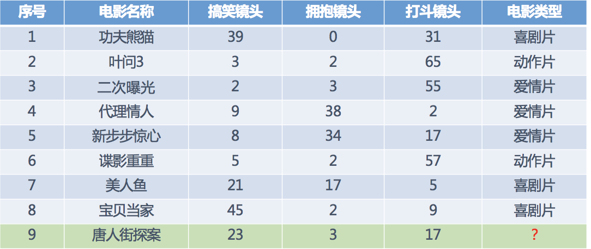


**数据简介**

- 在数据集中一般：

  - 一行数据我们称为一个**样本**
  - 一列数据我们成为一个**特征**
  - 有些数据有**目标值（标签值）**，有些数据没有目标值（如上表中，电影类型就是这个数据集的目标值）

- **数据类型构成：**

  - 数据类型一：特征值+目标值（目标值是连续的和离散的）
  - 数据类型二：只有特征值，没有目标值

- **数据分割：**

  - 机器学习一般的数据集会划分为两个部分：

        - 训练数据：用于训练，**构建模型**
        - 测试数据：在模型检验时使用，用于**评估模型是否有效**

  - 划分比例：

        - 训练集：70% 80% 75%
        - 测试集：30% 20% 25%

##### 2.2 数据基本处理

​即对数据进行缺失值、去除异常值等处理

##### 2.3 特征工程

###### 2.3.1 什么是特征工程

特征工程(Feature Engineering)是使用**专业背景知识和技巧处理数据**，**使得特征能在机器学习算法上发挥更好的作用的过程**。

- 意义：会直接影响机器学习的效果

###### 2.3.2 为什么需要特征工程

> 机器学习领域的大神Andrew Ng(吴恩达)老师说“Coming up with features is difficult, time-consuming, requires expert knowledge. “Applied machine learning” is basically feature engineering. ”
>
> 注：业界广泛流传：数据和特征决定了机器学习的上限，而模型和算法只是逼近这个上限而已。

###### 2.3.3 特征工程包含内容

- 特征提取
- 特征预处理
- 特征降维

###### 2.3.4 特征工程类别介绍

- 特征提取
  - 将任意数据（如文本或图像）转换为可用于机器学习的数字特征

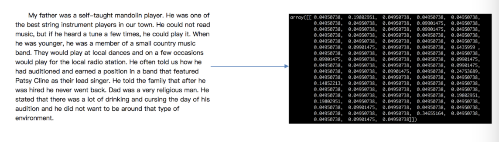

- 特征预处理
  - 通过**一些转换函数**将特征数据**转换成更加适合算法模型**的特征数据过程

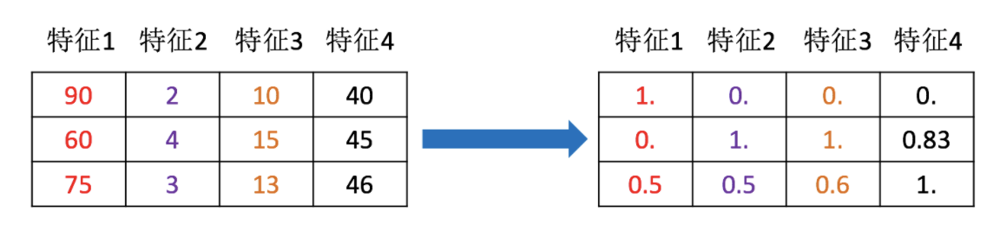

#####

- 特征降维
  - 指在某些限定条件下，**降低随机变量(特征)个数**，得到**一组“不相关”主变量**的过程

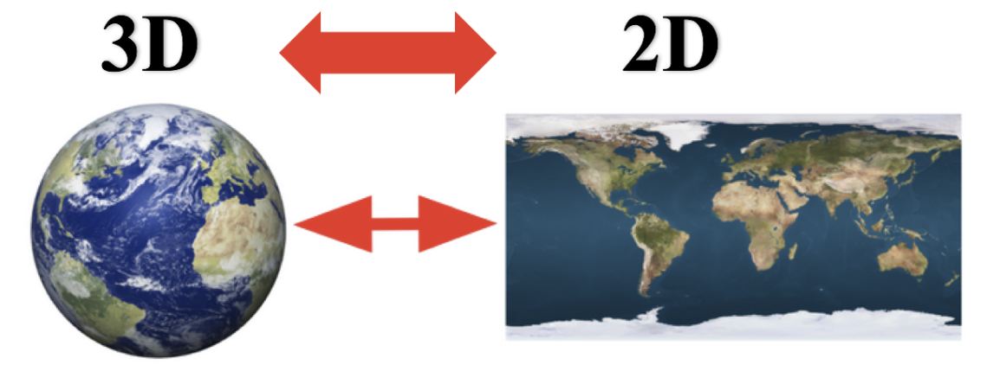

##### 2.4 机器学习

**选择合适的算法对模型进行训练**（具体内容见1.5）

##### 2.5 模型评估

**对训练好的模型进行评估**（具体内容见1.6）

------------------------------------------------------------------------

##### 2.6 拓展阅读

完整机器学习项目的流程

#### 3 小结

- **机器学习定义【掌握】**
  - 机器学习是从**数据**中**自动分析获得模型**，并利用**模型**对未知数据进行预测
- **机器学习工作流程总结【掌握】**
  - **1.获取数据**

  - **2.数据基本处理**

  - **3.特征工程**

  - **4.机器学习(模型训练)**

  - **5.模型评估**

        - 结果达到要求，上线服务
        - 没有达到要求，重新上面步骤
- **获取到的数据集介绍【掌握】**
  - 数据集中一行数据一般称为一个样本，一列数据一般称为一个特征。

  - 数据集的构成：

        - 由特征值+目标值（部分数据集没有）构成

  - 为了模型的训练和测试，把数据集分为：

        - 训练数据（70%-80%）和测试数据（20%-30%）
- 特征工程包含内容【了解】
  - 特征提取
  - 特征预处理
  - 特征降维

---

### 1.5 机器学习算法分类

#### 学习目标

- 了解机器学习常用算法的分类

------------------------------------------------------------------------

根据**数据集组成不同**，可以把机器学习算法分为：

- 监督学习

- 无监督学习

- 半监督学习

- 强化学习

#### 1 监督学习

- 定义：

  - 输入数据是由输入特征值和目标值所组成。

        - 函数的输出可以是一个连续的值(称为回归），
        - 或是输出是有限个离散值（称作分类）。

##### 1.1 回归问题

例如：预测房价，根据样本集拟合出一条连续曲线。

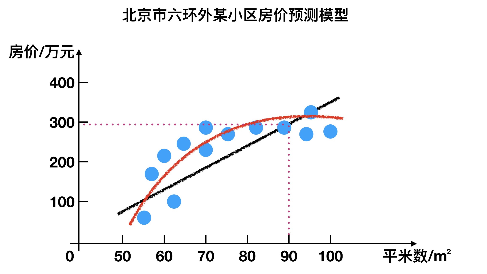

##### 1.2 分类问题

例如：根据肿瘤特征判断良性还是恶性，得到的是结果是“良性”或者“恶性”，是离散的。

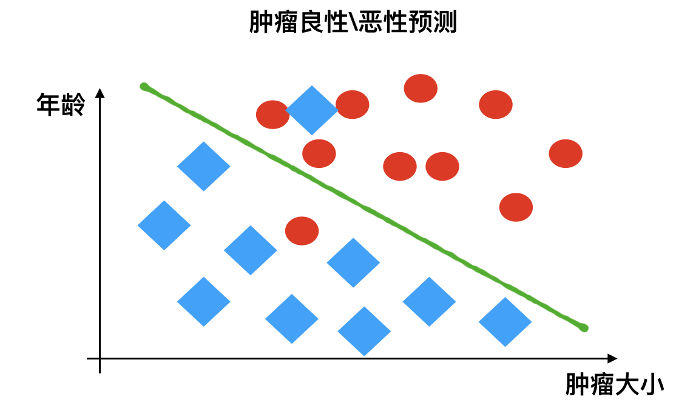

#### 2 无监督学习

- 定义：

  - 输入数据是由输入特征值组成，没有目标值
    - 输入数据没有被标记，也没有确定的结果。样本数据类别未知；
    - 需要根据样本间的相似性对样本集进行类别划分。

  举例：

  ​ 

- **有监督，无监督算法对比：**

  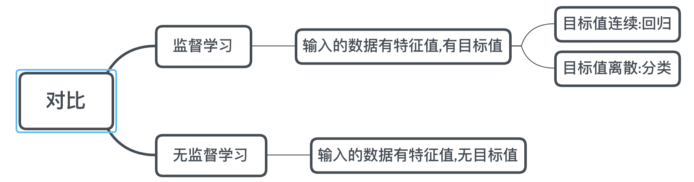

#### 3 半监督学习

- 定义：
  - 训练集同时包含有标记样本数据和未标记样本数据。

举例：

- **监督学习训练方式：**

  

<!-- -->

- **半监督学习训练方式**


#### 4 强化学习

- 定义：
  - 实质是make decisions 问题，即自动进行决策，并且可以做连续决策。

举例：

小孩想要走路，但在这之前，他需要先站起来，站起来之后还要保持平衡，接下来还要先迈出一条腿，是左腿还是右腿，迈出一步后还要迈出下一步。

小孩就是 **agent**，他试图通过采取**行动**（即行走）来操纵**环境**（行走的表面），并且从**一个状态转变到另一个状态**（即他走的每一步），当他完成任务的子任务（即走了几步）时，孩子得到**奖励**（给巧克力吃），并且当他不能走路时，就不会给巧克力。

主要包含五个元素：agent, action, reward, environment, observation；


强化学习的目标就是**获得最多的累计奖励**。

监督学习和强化学习的对比

|  | **监督学习** | **强化学习** |
|----|----|----|
| 反馈映射 | 输出的是之间的关系，可以告诉算法什么样的输入对应着什么样的输出。 | 输出的是给机器的反馈 reward function，即用来判断这个行为是好是坏。 |
| 反馈时间 | 做了比较坏的选择会**立刻反馈给算法**。 | 结果**反馈有延时**，有时候可能需要走了很多步以后才知道以前的某一步的选择是好还是坏。 |
| 输入特征 | 输入是**独立同分布**的。 | 面对的输入总是在变化，每当算法做出一个行为，它影响下一次决策的输入。 |

拓展概念：什么是**独立同分布**：

拓展阅读：Alphago进化史 漫画告诉你Zero为什么这么牛：

<a href="http://sports.sina.com.cn/chess/weiqi/2017-10-21/doc-ifymyyxw4023875.shtml" target="_blank">http://sports.sina.com.cn/chess/weiqi/2017-10-21/doc-ifymyyxw4023875.shtml</a>

#### 5 小结

<table>
<colgroup>
<col style="width: 20%" />
<col style="width: 20%" />
<col style="width: 20%" />
<col style="width: 20%" />
<col style="width: 20%" />
</colgroup>
<thead>
<tr>
<th style="text-align: left;"></th>
<th style="text-align: center;"><strong>In</strong></th>
<th style="text-align: center;"><strong>Out</strong></th>
<th style="text-align: center;"><strong>目的</strong></th>
<th style="text-align: center;"><strong>案例</strong></th>
</tr>
</thead>
<tbody>
<tr>
<td style="text-align: left;"><strong>监督学习</strong><br />
<strong>(supervised learning)</strong></td>
<td style="text-align: center;">有标签</td>
<td style="text-align: center;">有反馈</td>
<td style="text-align: center;">预测结果</td>
<td style="text-align: center;">猫狗分类 房价预测</td>
</tr>
<tr>
<td style="text-align: left;"><strong>无监督学习</strong><br />
<strong>(unsupervised learning)</strong></td>
<td style="text-align: center;">无标签</td>
<td style="text-align: center;">无反馈</td>
<td style="text-align: center;">发现潜在结构</td>
<td style="text-align: center;">“物以类聚，人以群分”</td>
</tr>
<tr>
<td style="text-align: left;"><strong>半监督学习</strong><br />
<strong>(Semi-Supervised Learning)</strong></td>
<td style="text-align: center;">部分有标签，部分无标签</td>
<td style="text-align: center;">有反馈</td>
<td style="text-align: center;">降低数据标记的难度</td>
<td style="text-align: center;"></td>
</tr>
<tr>
<td style="text-align: left;"><strong>强化学习</strong><br />
<strong>(reinforcement learning)</strong></td>
<td style="text-align: center;">决策流程及激励系统</td>
<td style="text-align: center;">一系列行动</td>
<td style="text-align: center;">长期利益最大化</td>
<td style="text-align: center;">学下棋</td>
</tr>
</tbody>
</table>

---

### 1.6 模型评估

#### 学习目标

- 了解机器学习中模型评估的方法
- 知道过拟合、欠拟合发生情况

------------------------------------------------------------------------

模型评估是模型开发过程不可或缺的一部分。它有助于发现表达数据的最佳模型和所选模型将来工作的性能如何。

按照**数据集的目标值不同**，可以把模型评估分为**分类模型评估和回归模型评估。**

#### 1 分类模型评估


- **准确率**
  - 预测正确的数占样本总数的比例。
- 其他评价指标：精确率、召回率、F1-score、AUC指标等

#### 2 回归模型评估


**均方根误差（Root Mean Squared Error，RMSE）**

- RMSE是一个衡量回归模型误差率的常用公式。 不过，它仅能比较误差是相同单位的模型。

  <span class="katex"><span class="katex-mathml">$`RMSE= \sqrt{\frac{\sum_{i=0}^N(p_1-a_1)^2}{n}}`$</span></span>

> a 为真实值；p 为预测值

举例：

    假设上面的房价预测，只有五个样本，对应的
    真实值为：100,120,125,230,400
    预测值为：105,119,120,230,410

那么使用均方根误差求解得： <span class="katex-display"><span class="katex"><span class="katex-mathml">$`
RMSE=\sqrt{\frac{[(100-105)^2+(120-119)^2+5^2+0^2+10^2]}{5}}
=5.495
`$</span></span></span>

------------------------------------------------------------------------

其他评价指标：

- 相对平方误差（Relative Squared Error，RSE）、
- 平均绝对误差（Mean Absolute Error，MAE)、
- 相对绝对误差（Relative Absolute Error，RAE)

#### 3 拟合

模型评估用于评价训练好的的模型的表现效果，其表现效果大致可以分为两类：过拟合、欠拟合。

在训练过程中，你可能会遇到如下问题：

**训练数据训练的很好啊，误差也不大，为什么在测试集上面有问题呢？**

当算法在某个数据集当中出现这种情况，可能就出现了拟合问题。

##### 3.1 欠拟合

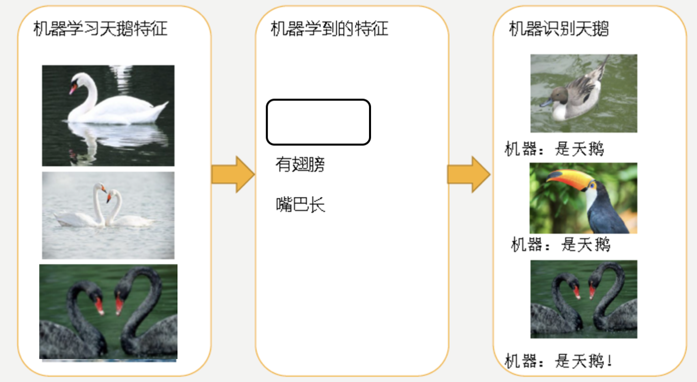

因为机器学习到的天鹅特征太少了，导致区分标准太粗糙，不能准确识别出天鹅。

**欠拟合（under-fitting）**：**模型学习的太过粗糙**，连**训练集中的样本数据特征关系都没有学出来**。

##### 3.2 过拟合


机器已经基本能区别天鹅和其他动物了。然后，很不巧已有的天鹅图片全是白天鹅的，于是机器经过学习后，会认为天鹅的羽毛都是白的，以后看到羽毛是黑的天鹅就会认为那不是天鹅。

**过拟合**（over-fitting）：所建的机器学习模型或者是深度学习模型在训练样本中**表现得过于优越**，导致在**测试数据集中表现不佳**。

- 上问题解答：
  - 训练数据训练的很好啊，误差也不大，为什么在测试集上面有问题呢？

#### 4 小结

- 分类模型评估【了解】
  - 准确率
- 回归模型评估【了解】
  - RMSE -- 均方根误差
- 拟合【知道】
  - 举例 -- 判断是否是人
  - 欠拟合
    - 学习到的东西太少
    - 模型学习的太过粗糙
  - 过拟合
    - 学习到的东西太多
    - 学习到的特征多，不好泛化

---

### 1.7 Azure机器学习模型搭建实验

#### 学习目标

- 了解Azure机器学习平台，知道机器学习流程

------------------------------------------------------------------------

#### Azure平台简介


Azure Machine Learning（简称“AML”）是微软在其公有云Azure上推出的基于Web使用的一项机器学习服务，机器学习属人工智能的一个分支，它技术借助算法让电脑对大量流动数据集进行识别。这种方式能够通过历史数据来预测未来事件和行为，其实现方式明显优于传统的商业智能形式。

微软的目标是简化使用机器学习的过程，以便于开发人员、业务分析师和数据科学家进行广泛、便捷地应用。

这款服务的目的在于“将机器学习动力与云计算的简单性相结合”。

AML目前在微软的Global Azure云服务平台提供服务，用户可以通过站点：**<a href="https://studio.azureml.net/" target="_blank">https://studio.azureml.net/</a>** 申请免费试用。


- Azure机器学习实验

  - 实验目的：了解机器学习从数据到建模并最终评估预测的整个流程。

---

### 1.8 深度学习简介

#### 学习目标

- 了解什么是深度学习

------------------------------------------------------------------------

#### 1 深度学习 —— 神经网络简介

深度学习（Deep Learning）（也称为深度结构学习【Deep Structured Learning】、层次学习【Hierarchical Learning】或者是深度机器学习【Deep Machine Learning】）是一类算法集合，是机器学习的一个分支。


深度学习方法近年来，在会话识别、图像识别和对象侦测等领域表现出了惊人的准确性。

但是，“深度学习”这个词语很古老，它在1986年由Dechter在机器学习领域提出，然后在2000年有Aizenberg等人引入到人工神经网络中。而现在，由于Alex Krizhevsky在2012年使用卷积网络结构赢得了ImageNet比赛之后受到大家的瞩目。

卷积网络之父：Yann LeCun


- 深度学习演示
  - <a href="http://playground.tensorflow.org" target="_blank">链接:http://playground.tensorflow.org</a>

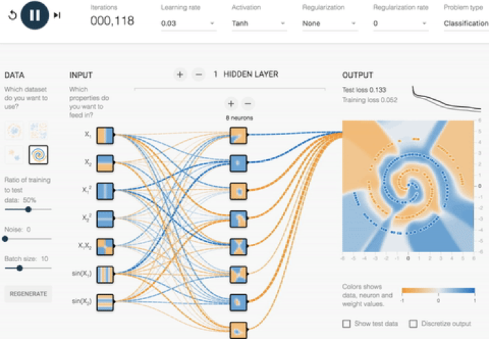

#### 2 深度学习各层负责内容

神经网络各层负责内容：

**1层：负责识别颜色及简单纹理**


**2层：一些神经元可以识别更加细化的纹理，布纹，刻纹，叶纹等**


**3层：一些神经元负责感受黑夜里的黄色烛光，高光，萤火，鸡蛋黄色等。**


**4层：一些神经元识别萌狗的脸，宠物形貌，圆柱体事物，七星瓢虫等的存在。**


**5层：一些神经元负责识别花，黑眼圈动物，鸟，键盘，原型屋顶等。**


#### 3 小结

- 深度学习的发展源头--神经网络【了解】
- 多层神经网络，在最初几层是识别简单内容，后面几层是识别一些复杂内容。【了解】

---

## 科学计算库环境安装与使用

### 学习目标

- 完成机器学习-科学计算库阶段的环境安装

- 学会使用jupyter notebook平台完成代码编写运行

---

### 1.1 库的安装

#### 学习目标

- 搭建好机器学习基础阶段的环境

------------------------------------------------------------------------

#### 1 安装需要的库

##### 1.1通过自己搭建虚拟环境安装机器学习阶段环境

整个机器学习基础阶段会用到Matplotlib、Numpy、Pandas等库，为了统一版本号在环境中使用，将所有的库及其版本放到了文件requirements.txt当中，然后统一安装。

**新建一个用于人工智能环境的虚拟环境**

知识拓展：<a href="http://52.83.69.131:10004/" target="_blank">如何在电脑中安装虚拟环境</a>

    mkvirtualenv ai

把如下内容放到 requirements.txt文件中：

``` lang-python
matplotlib==2.2.2
numpy==1.14.2
pandas==0.20.3
tables==3.4.2
jupyter==1.0.0
```

注意：

- 每个包安装的过程中，尽量指定稳定版本进行安装

使用pip命令安装

    pip3 install -r requirements.txt

> ps: requirements.txt中包含上面虚拟环境中内容.

------------------------------------------------------------------------

##### 1.2 通过anaconda安装机器学习阶段环境

- 其他方法搭建机器学习基础阶段的环境：通过Anaconda进行安装

  > 该方法和1.1中的方法，选择任意一种安装就OK。

#### 2 小结

- 机器学习(科学计算库)阶段环境的搭建和基本库的安装
  - 注意：最好安装指定的稳定版本

---

### 1.2 Jupyter Notebook使用

#### 学习目标

- 学会使用Jupyter Notebook

------------------------------------------------------------------------

#### 1 Jupyter Notebook介绍

Jupyter项目是一个非盈利的开源项目，源于2014年的ipython项目，因为它逐渐发展为支持跨所有编程语言的交互式数据科学和科学计算

- Jupyter Notebook，原名IPython Notbook，是IPython的加强网页版，一个开源Web应用程序
- 名字源自Julia、Python 和 R（数据科学的三种开源语言）
- 是一款程序员和科学工作者的**编程/文档/笔记/展示**软件
- **.ipynb**文件格式是用于计算型叙述的**JSON文档格式**的正式规范


#### 2 为什么使用Jupyter Notebook?

- 传统软件开发：工程／目标明确
  - 需求分析，设计架构，开发模块，测试
- 数据挖掘：艺术／目标不明确
  - 目的是具体的洞察目标，而不是机械的完成任务
  - 通过执行代码来理解问题
  - 迭代式地改进代码来改进解决方法

实时运行的代码、叙事性的文本和可视化被整合在一起，方便使用代码和数据来讲述故事

**对比Jupyter Notebook和Pycharm**

- 画图

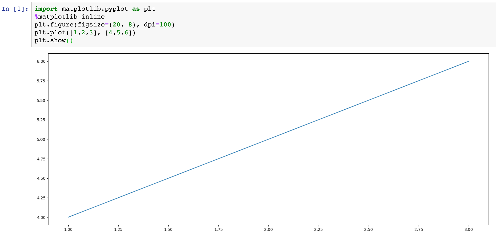

- 数据展示

  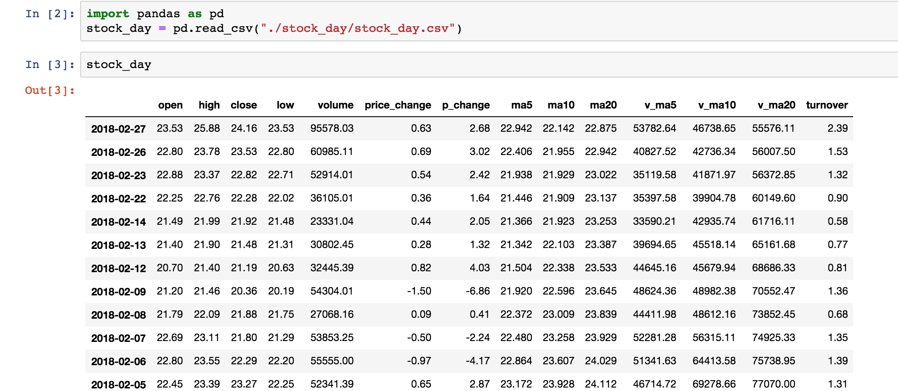

  - 总结：Jupyter Notebook 相比 Pycharm 在画图和数据展示方面更有优势。

#### 3 Jupyter Notebook的使用

##### 3.1 界面启动、创建文件

- #### 3.1.1 界面启动

环境搭建好后，本机输入jupyter notebook命令，会自动弹出浏览器窗口打开Jupyter Notebook

``` lang-python
# 进入虚拟环境
workon ai
# 输入命令
jupyter notebook
```

本地notebook的默认URL为：<a href="http://localhost:8888" target="_blank">http://localhost:8888</a>

想让notebook打开指定目录，只要进入此目录后执行命令即可

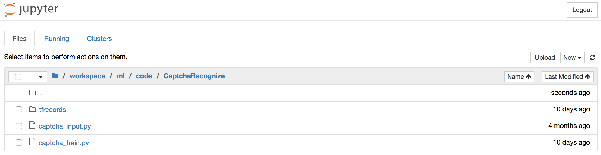

- #### 3.1.2 新建notebook文档

  - notebook的文档格式是`.ipynb`

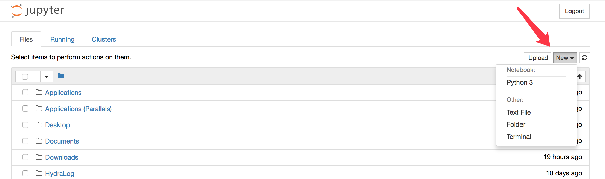

- #### 3.1.3 内容界面操作

  **标题栏：**点击标题（如Untitled）修改文档名

  **编辑栏：**

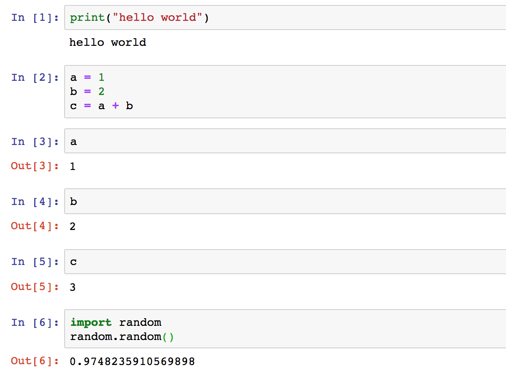

##### 3.2 cell操作

- 什么是cell？
  - **cell**：一对In Out会话被视作一个代码单元，称为cell
  - cell行号前的 \* ，表示代码正在运行

Jupyter支持两种模式：

- 编辑模式（Enter）
  - 命令模式下`回车Enter`或`鼠标双击`cell进入编辑模式
  - 可以**操作cell内文本**或代码，剪切／复制／粘贴移动等操作
- 命令模式（Esc）
  - 按`Esc`退出编辑，进入命令模式
  - 可以**操作cell单元本身**进行剪切／复制／粘贴／移动等操作

###### 3.2.1 鼠标操作

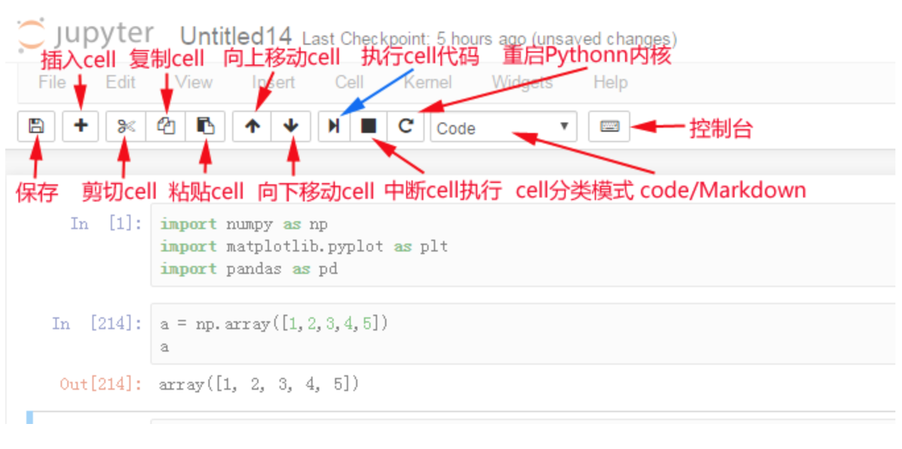

###### 3.2.2 快捷键操作

- 两种模式通用快捷键
  - **`Shift+Enter`，执行本单元代码，并跳转到下一单元**
  - **`Ctrl+Enter`，执行本单元代码，留在本单元**

<!-- -->

- **命令模式**：按ESC进入

  - `Y`，cell切换到Code模式

  - `M`，cell切换到Markdown模式

  - `A`，在当前cell的上面添加cell

  - `B`，在当前cell的下面添加cell

<!-- -->

- 其他(了解)

  - `双击D`：删除当前cell

  - `Z`，回退

  - `L`，为当前cell加上行号 \<!--

  - `Ctrl+Shift+P`，对话框输入命令直接运行

  - 快速跳转到首个cell，`Crtl+Home`

  - 快速跳转到最后一个cell，`Crtl+End` --\>

<!-- -->

- **编辑模式**：按Enter进入

  - 补全代码：变量、方法后跟`Tab键`

  - 为一行或多行代码添加/取消注释：`Ctrl+/`（Mac:CMD+/）

<!-- -->

- 其他(了解)：
  - 多光标操作：`Ctrl键点击鼠标`（Mac:CMD+点击鼠标）
  - 回退：`Ctrl+Z`（Mac:CMD+Z）
  - 重做：`Ctrl+Y`（Mac:CMD+Y)

##### 3.3 markdown演示

掌握标题和缩进即可


#### 4 拓展功能安装【了解】

Jupyter Notebook中自动补全代码等相关功能拓展

效果展示：

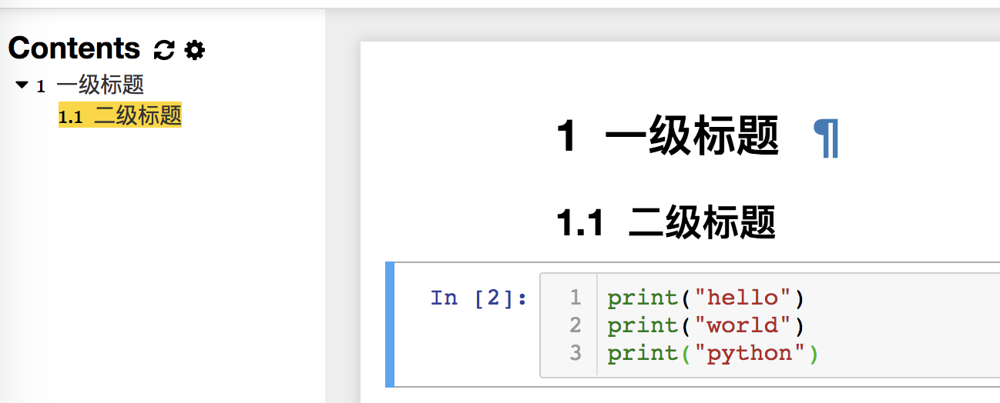

4.1 安装jupyter_contrib_nbextensions库

安装该库的命令如下：

``` lang-shell
python -m pip install jupyter_contrib_nbextensions
```

然后执行：

``` lang-shell
jupyter contrib nbextension install --user --skip-running-check
```

在原来的基础上勾选： “Table of Contents” 以及 “Hinterland”

部分功能：

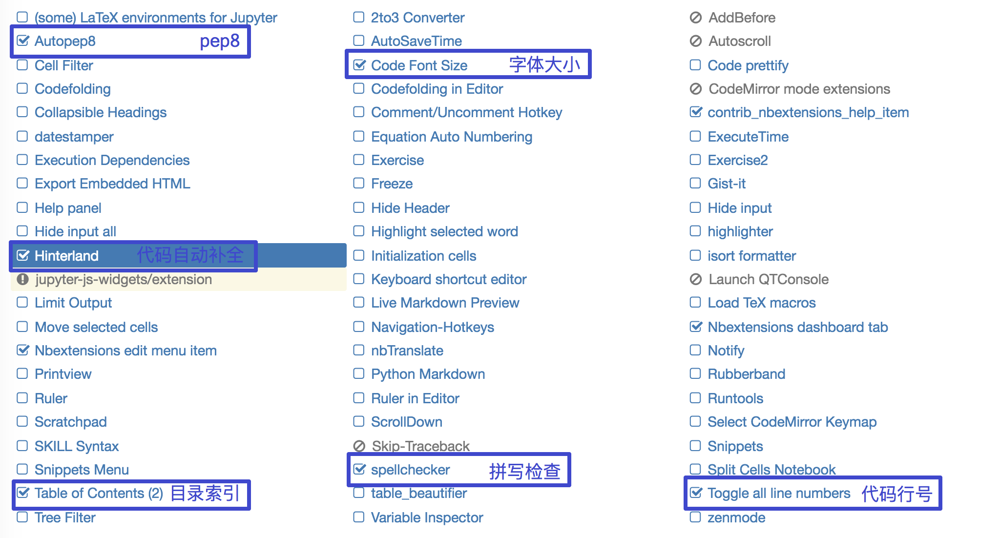

#### 5 小结

- 是什么
  - 是一个ipython的web加强版
- 为什么要使用jupyter
  - 用于数据探索过程
- 怎么用
  - 1.通过jupyter notebook 就可以使用
  - 2.保存文件是.ipynb
  - 3.每个内容,都对应的是一个cell
- 快捷键
  - Shift+Enter，执行本单元代码，并跳转到下一单元
  - Ctrl+Enter，执行本单元代码，留在本单元

---

## Matplotlib

### 学习目标

- 应用Matplotlib的基本功能实现图形显示
- 应用Matplotlib实现多图显示
- 应用Matplotlib实现不同画图种类

---

### 2.1 Matplotlib之HelloWorld

#### 学习目标

- 了解什么是matplotlib
- 为什么要学习matplotlib
- matplotlib简单图形的绘制

------------------------------------------------------------------------

#### 1 什么是Matplotlib


- 是专门用于开发2D图表(包括3D图表)

<!-- -->

- 以渐进、交互式方式实现数据可视化

#### 2 为什么要学习Matplotlib

可视化是在整个数据挖掘的关键辅助工具，可以清晰的理解数据，从而调整我们的分析方法。

- 能将数据进行可视化,更直观的呈现
- 使数据更加客观、更具说服力

例如下面两个图为数字展示和图形展示：

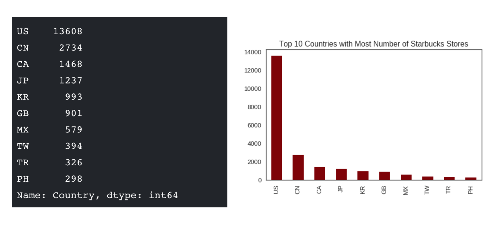

#### 3 实现一个简单的Matplotlib画图 — 以折线图为例

##### 3.1 pyplot模块

matplotlib.pytplot包含了一系列类似于matlab的画图函数。

``` lang-python
import matplotlib.pyplot as plt
```

##### 3.2 图形绘制流程

- 1.创建画布 -- plt.figure()

``` lang-python
plt.figure(figsize=(), dpi=)
figsize:指定图的长宽
      dpi:图像的清晰度
      返回fig对象
```

- 2.绘制图像 -- plt.plot(x, y)

<!-- -->

    以折线图为例

- 3.显示图像 -- plt.show()

##### 3.3 折线图绘制与显示

**举例：展现上海一周的天气,比如从星期一到星期日的天气温度如下**

``` lang-python
import matplotlib.pyplot as plt

# 1.创建画布
plt.figure(figsize=(10, 10), dpi=100)

# 2.绘制折线图
plt.plot([1, 2, 3, 4, 5, 6 ,7], [17,17,18,15,11,11,13])

# 3.显示图像
plt.show()
```

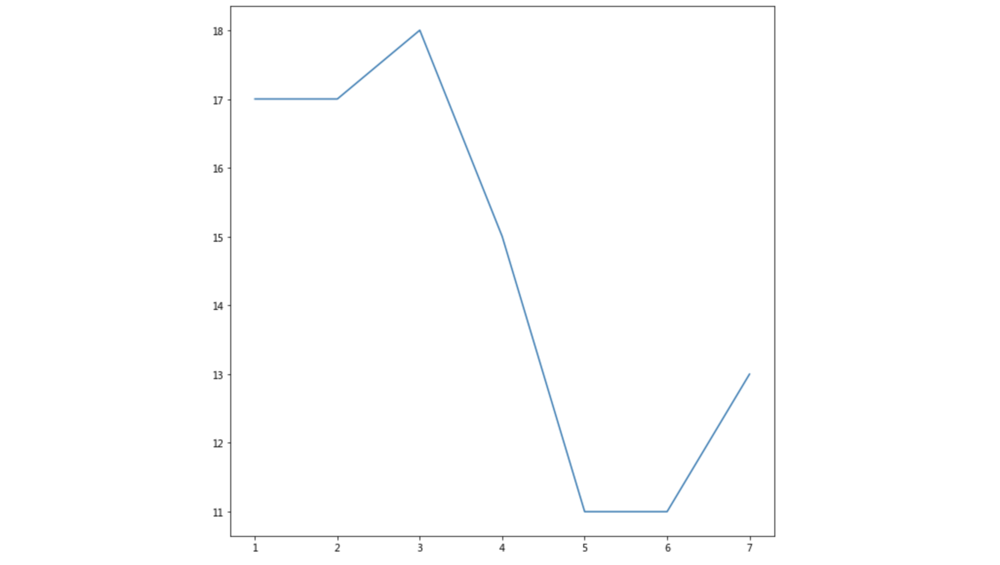

#### 4 认识Matplotlib图像结构

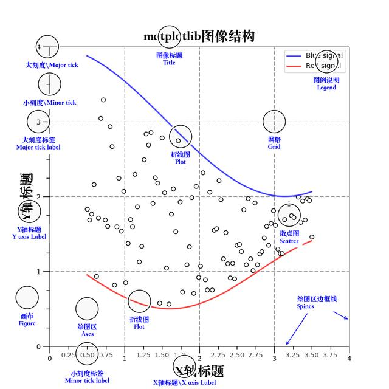

#### 5 小结

- 什么是matplotlib【了解】
  - 是专门用于开发2D(3D)图表的包
- 绘制图像流程【掌握】
  - 1.创建画布 -- plt.figure(figsize=(20,8))
  - 2.绘制图像 -- plt.plot(x, y)
  - 3.显示图像 -- plt.show()

---

### 2.2 基础绘图功能 — 以折线图为例

#### 学习目标

- 掌握给图形添加辅助功能(如：标注、x,y轴名称、标题等)

- 知道图形的保存

- 知道如何多次plot绘制图形

- 知道如何多个坐标系显示图形

- 知道折线图的应用场景

------------------------------------------------------------------------

#### 1 完善原始折线图

为了更好地理解所有基础绘图功能，我们通过天气温度变化的绘图来融合所有的基础API使用

**需求：画出某城市11点到12点1小时内每分钟的温度变化折线图，温度范围在15度~18度**

效果：

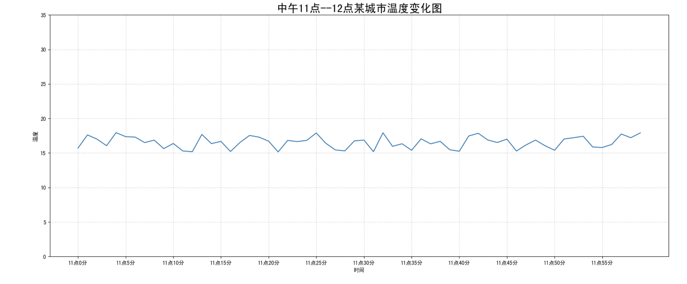

##### 1.1 准备数据并画出初始折线图

``` lang-python
import matplotlib.pyplot as plt
import random

# 画出温度变化图

# 0.准备x, y坐标的数据
x = range(60)
y_shanghai = [random.uniform(15, 18) for i in x]

# 1.创建画布
plt.figure(figsize=(20, 8), dpi=80)

# 2.绘制折线图
plt.plot(x, y_shanghai)

# 3.显示图像
plt.show()
```

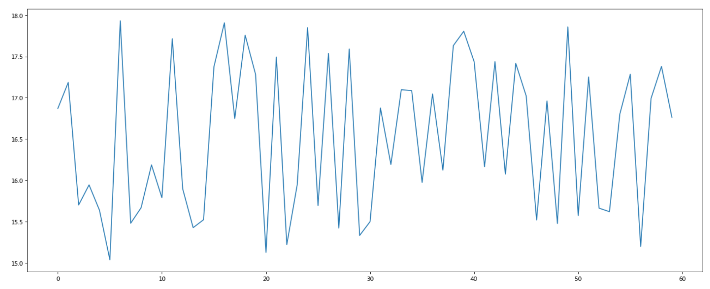

##### 1.2 添加自定义x,y刻度

- plt.xticks(x, \*\*kwargs)
  - x:要显示的刻度值
- plt.yticks(y, \*\*kwargs)
  - y:要显示的刻度值

``` lang-python
# 增加以下两行代码

# 构造x轴刻度标签
x_ticks_label = ["11点{}分".format(i) for i in x]
# 构造y轴刻度
y_ticks = range(40)

# 修改x,y轴坐标的刻度显示
plt.xticks(x[::5], x_ticks_label[::5])
plt.yticks(y_ticks[::5])
```

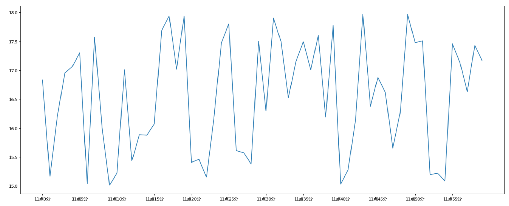

如果没有解决过中文问题的话，会显示这个样子：

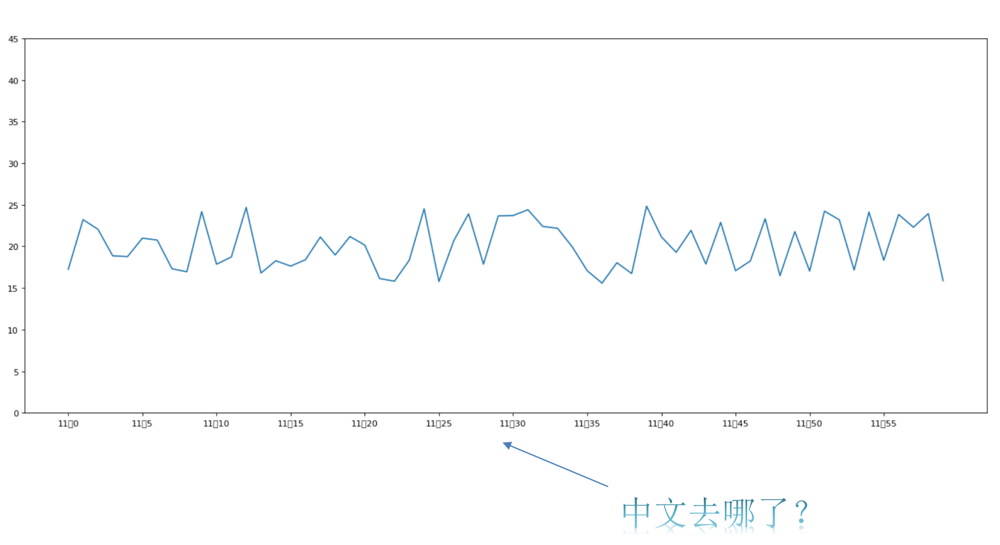

##### 1.3 中文显示问题解决

**解决方案一：**

下载中文字体（黑体，看准系统版本）

- 步骤一：下载 \[SimHei\] 字体（或者其他的支持中文显示的字体也行）

- 步骤二：安装字体

  - linux下：拷贝字体到 usr/share/fonts 下：

        sudo cp ~/SimHei.ttf /usr/share/fonts/SimHei.ttf

  - windows和mac下：双击安装

- 步骤三：删除~/.matplotlib中的缓存文件

<!-- -->

    cd ~/.matplotlib
    rm -r *

- 步骤四：修改配置文件matplotlibrc

<!-- -->

    vi ~/.matplotlib/matplotlibrc

将文件内容修改为：

    font.family         : sans-serif
    font.sans-serif         : SimHei
    axes.unicode_minus  : False

**解决方案二：**

在Python脚本中动态设置matplotlibrc,这样也可以避免由于更改配置文件而造成的麻烦，具体代码如下：

``` lang-python
from pylab import mpl
# 设置显示中文字体
mpl.rcParams["font.sans-serif"] = ["SimHei"]
```

有时候，字体更改后，会导致坐标轴中的部分字符无法正常显示，此时需要更改axes.unicode_minus参数：

``` lang-python
# 设置正常显示符号
mpl.rcParams["axes.unicode_minus"] = False
```

##### 1.4 添加网格显示

为了更加清楚地观察图形对应的值

``` lang-python
plt.grid(True, linestyle='--', alpha=0.5)
```

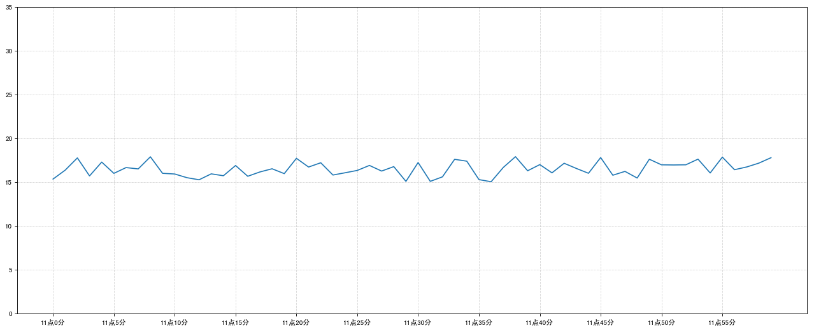

##### 1.5 添加描述信息

添加x轴、y轴描述信息及标题

> 通过fontsize参数可以修改图像中字体的大小

``` lang-python
plt.xlabel("时间")
plt.ylabel("温度")
plt.title("中午11点0分到12点之间的温度变化图示", fontsize=20)
```


##### 1.6 图像保存

    # 保存图片到指定路径
    plt.savefig("test.png")

- 注意：plt.show()会释放figure资源，如果在显示图像之后保存图片将只能保存空图片。

完整代码：

``` lang-python
import matplotlib.pyplot as plt
import random
from pylab import mpl

# 设置显示中文字体
mpl.rcParams["font.sans-serif"] = ["SimHei"]
# 设置正常显示符号
mpl.rcParams["axes.unicode_minus"] = False

# 0.准备数据
x = range(60)
y_shanghai = [random.uniform(15, 18) for i in x]

# 1.创建画布
plt.figure(figsize=(20, 8), dpi=100)

# 2.绘制图像
plt.plot(x, y_shanghai)

# 2.1 添加x,y轴刻度
# 构造x,y轴刻度标签
x_ticks_label = ["11点{}分".format(i) for i in x]
y_ticks = range(40)

# 刻度显示
plt.xticks(x[::5], x_ticks_label[::5])
plt.yticks(y_ticks[::5])

# 2.2 添加网格显示
plt.grid(True, linestyle="--", alpha=0.5)

# 2.3 添加描述信息
plt.xlabel("时间")
plt.ylabel("温度")
plt.title("中午11点--12点某城市温度变化图", fontsize=20)

# 2.4 图像保存
plt.savefig("./test.png")

# 3.图像显示
plt.show()
```

#### 2 在一个坐标系中绘制多个图像

##### 2.1 多次plot

需求：再添加一个城市的温度变化

收集到北京当天温度变化情况，温度在1度到3度。怎么去添加另一个在同一坐标系当中的不同图形，**其实很简单只需要再次plot即可**，但是需要区分线条，如下显示

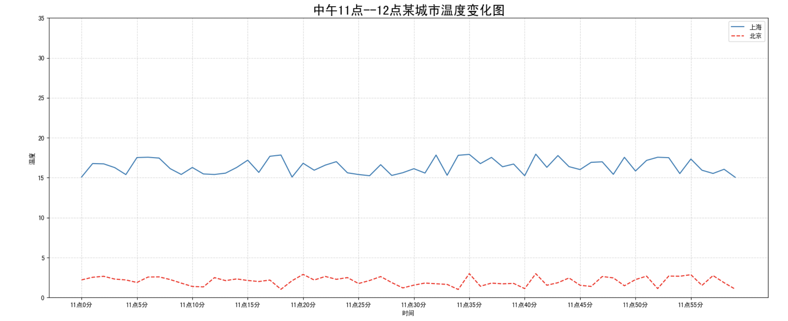

``` lang-python
# 增加北京的温度数据
y_beijing = [random.uniform(1, 3) for i in x]

# 绘制折线图
plt.plot(x, y_shanghai)
# 使用多次plot可以画多个折线
plt.plot(x, y_beijing, color='r', linestyle='--')
```

我们仔细观察，用到了两个新的地方，一个是对于不同的折线展示效果，一个是添加图例。

##### 2.2 设置图形风格

| 颜色字符 |    风格字符    |
|:--------:|:--------------:|
|  r 红色  |    \- 实线     |
|  g 绿色  |   \- - 虚线    |
|  b 蓝色  |   -. 点划线    |
|  w 白色  |    : 点虚线    |
|  c 青色  | ' ' 留空、空格 |
|  m 洋红  |                |
|  y 黄色  |                |
|  k 黑色  |                |

##### **2.3 显示图例**

- 注意：如果只在plt.plot()中设置label还不能最终显示出图例，还需要通过plt.legend()将图例显示出来。

``` lang-python
# 绘制折线图
plt.plot(x, y_shanghai, label="上海")
# 使用多次plot可以画多个折线
plt.plot(x, y_beijing, color='r', linestyle='--', label="北京")

# 显示图例
plt.legend(loc="best")
```

| Location String | Location Code |
|-----------------|---------------|
| 'best'          | 0             |
| 'upper right'   | 1             |
| 'upper left'    | 2             |
| 'lower left'    | 3             |
| 'lower right'   | 4             |
| 'right'         | 5             |
| 'center left'   | 6             |
| 'center right'  | 7             |
| 'lower center'  | 8             |
| 'upper center'  | 9             |
| 'center'        | 10            |

完整代码：

``` lang-python
# 0.准备数据
x = range(60)
y_shanghai = [random.uniform(15, 18) for i in x]
y_beijing = [random.uniform(1,3) for i in x]

# 1.创建画布
plt.figure(figsize=(20, 8), dpi=100)

# 2.绘制图像
plt.plot(x, y_shanghai, label="上海")
plt.plot(x, y_beijing, color="r", linestyle="--", label="北京")

# 2.1 添加x,y轴刻度
# 构造x,y轴刻度标签
x_ticks_label = ["11点{}分".format(i) for i in x]
y_ticks = range(40)

# 刻度显示
plt.xticks(x[::5], x_ticks_label[::5])
plt.yticks(y_ticks[::5])

# 2.2 添加网格显示
plt.grid(True, linestyle="--", alpha=0.5)

# 2.3 添加描述信息
plt.xlabel("时间")
plt.ylabel("温度")
plt.title("中午11点--12点某城市温度变化图", fontsize=20)

# 2.4 图像保存
plt.savefig("./test.png")

# 2.5 添加图例
plt.legend(loc=0)

# 3.图像显示
plt.show()
```

##### 2.4 练一练

练习多次plot流程(从上面复制代码,到自己电脑,确保每人环境可以正常运行),

同时明确每个过程执行实现的具体效果

#### 3 多个坐标系显示

如果我们想要将上海和北京的天气图显示在同一个图的不同坐标系当中，效果如下：

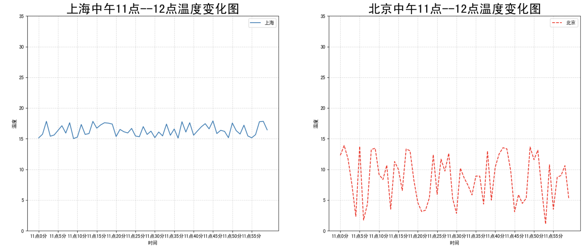

可以通过subplots函数实现(旧的版本中有subplot，使用起来不方便)，推荐subplots函数

- matplotlib.pyplot.subplots(nrows=1, ncols=1, \*\*fig_kw) 创建一个带有多个axes(坐标系/绘图区)的图

<!-- -->

    Parameters:

    nrows, ncols : 设置有几行几列坐标系
        int, optional, default: 1, Number of rows/columns of the subplot grid.

    Returns:
    fig : 图对象
    axes : 返回相应数量的坐标系

    设置标题等方法不同：
        set_xticks
        set_yticks
        set_xlabel
        set_ylabel

关于axes子坐标系的更多方法：参考<a href="https://matplotlib.org/api/axes_api.html#matplotlib.axes.Axes" target="_blank">https://matplotlib.org/api/axes_api.html#matplotlib.axes.Axes</a>

- 注意：**plt.函数名()**相当于面向过程的画图方法，**axes.set_方法名()**相当于面向对象的画图方法。

``` lang-python
# 0.准备数据
x = range(60)
y_shanghai = [random.uniform(15, 18) for i in x]
y_beijing = [random.uniform(1, 5) for i in x]

# 1.创建画布
# plt.figure(figsize=(20, 8), dpi=100)
fig, axes = plt.subplots(nrows=1, ncols=2, figsize=(20, 8), dpi=100)

# 2.绘制图像
# plt.plot(x, y_shanghai, label="上海")
# plt.plot(x, y_beijing, color="r", linestyle="--", label="北京")
axes[0].plot(x, y_shanghai, label="上海")
axes[1].plot(x, y_beijing, color="r", linestyle="--", label="北京")

# 2.1 添加x,y轴刻度
# 构造x,y轴刻度标签
x_ticks_label = ["11点{}分".format(i) for i in x]
y_ticks = range(40)

# 刻度显示
# plt.xticks(x[::5], x_ticks_label[::5])
# plt.yticks(y_ticks[::5])
axes[0].set_xticks(x[::5])
axes[0].set_yticks(y_ticks[::5])
axes[0].set_xticklabels(x_ticks_label[::5])
axes[1].set_xticks(x[::5])
axes[1].set_yticks(y_ticks[::5])
axes[1].set_xticklabels(x_ticks_label[::5])

# 2.2 添加网格显示
# plt.grid(True, linestyle="--", alpha=0.5)
axes[0].grid(True, linestyle="--", alpha=0.5)
axes[1].grid(True, linestyle="--", alpha=0.5)

# 2.3 添加描述信息
# plt.xlabel("时间")
# plt.ylabel("温度")
# plt.title("中午11点--12点某城市温度变化图", fontsize=20)
axes[0].set_xlabel("时间")
axes[0].set_ylabel("温度")
axes[0].set_title("中午11点--12点某城市温度变化图", fontsize=20)
axes[1].set_xlabel("时间")
axes[1].set_ylabel("温度")
axes[1].set_title("中午11点--12点某城市温度变化图", fontsize=20)

# # 2.4 图像保存
plt.savefig("./test.png")

# # 2.5 添加图例
# plt.legend(loc=0)
axes[0].legend(loc=0)
axes[1].legend(loc=0)

# 3.图像显示
plt.show()
```

#### 4 折线图的应用场景

- 呈现公司产品(不同区域)每天活跃用户数

- 呈现app每天下载数量

- 呈现产品新功能上线后,用户点击次数随时间的变化

- 拓展：**画各种数学函数图像**

  - 注意：plt.plot()除了可以画折线图，也可以用于画各种数学函数图像

    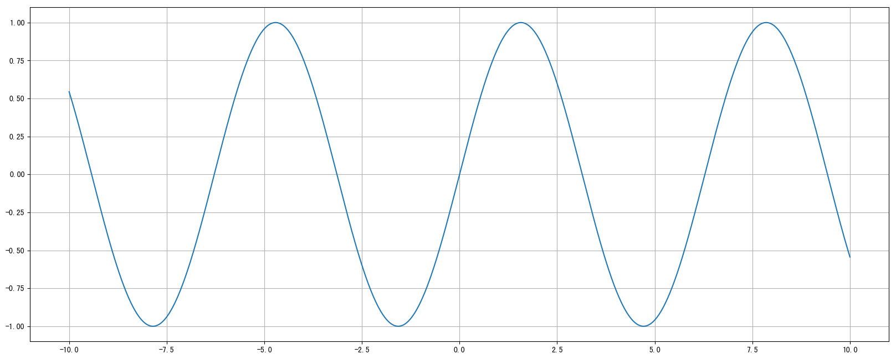

代码：

``` lang-python
import numpy as np
# 0.准备数据
x = np.linspace(-10, 10, 1000)
y = np.sin(x)

# 1.创建画布
plt.figure(figsize=(20, 8), dpi=100)

# 2.绘制函数图像
plt.plot(x, y)
# 2.1 添加网格显示
plt.grid()

# 3.显示图像
plt.show()
```

#### 5 小结

- 添加x,y轴刻度【知道】
  - plt.xticks()
  - plt.yticks()
  - **注意:在传递进去的第一个参数必须是数字,不能是字符串,如果是字符串吗,需要进行替换操作**
- 添加网格显示【知道】
  - plt.grid(linestyle="--", alpha=0.5)
- 添加描述信息【知道】
  - plt.xlabel()
  - plt.ylabel()
  - plt.title()
- 图像保存【知道】
  - plt.savefig("路径")
- 多次plot【了解】
  - 直接进行添加就OK
- 显示图例【知道】
  - plt.legend(loc="best")
  - **注意:一定要在plt.plot()里面设置一个label,如果不设置,没法显示**
- 多个坐标系显示【了解】
  - plt.subplots(nrows=, ncols=)
- 折线图的应用【知道】
  - 1.应用于观察数据的变化
  - 2.可是画出一些数学函数图像

---

### 2.3 常见图形绘制

#### 学习目标

- 掌握常见统计图及其意义

------------------------------------------------------------------------

Matplotlib能够绘制**折线图、散点图、柱状图、直方图、饼图。**

我们需要知道不同的统计图的意义，以此来决定选择哪种统计图来呈现我们的数据。

#### 1 常见图形种类及意义

------------------------------------------------------------------------

- **折线图**：以折线的上升或下降来表示统计数量的增减变化的统计图

**特点：能够显示数据的变化趋势，反映事物的变化情况。(变化)**

api：plt.plot(x, y)

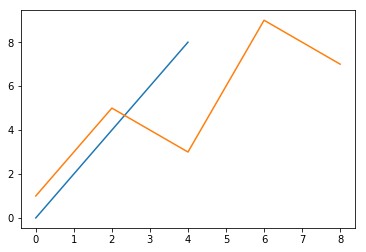

------------------------------------------------------------------------

- **散点图：**用两组数据构成多个坐标点，考察坐标点的分布,判断两变量之间是否存在某种关联或总结坐标点的分布模式。

  **特点：判断变量之间是否存在数量关联趋势,展示离群点(分布规律)**

  api：plt.scatter(x, y)

  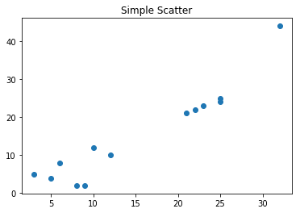

  ------------------------------------------------------------------------

<!-- -->

- **柱状图：**排列在工作表的列或行中的数据可以绘制到柱状图中。

  **特点：绘制连离散的数据,能够一眼看出各个数据的大小,比较数据之间的差别。(统计/对比)**

  api：plt.bar(x, width, align='center', \*\*kwargs)

<!-- -->

    Parameters:
    x : 需要传递的数据

    width : 柱状图的宽度

    align : 每个柱状图的位置对齐方式
        {‘center’, ‘edge’}, optional, default: ‘center’

    **kwargs :
    color:选择柱状图的颜色

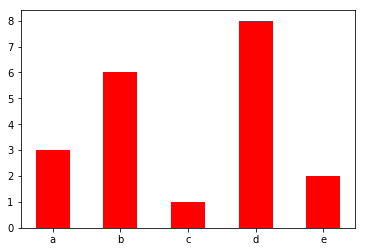

------------------------------------------------------------------------

- **直方图：**由一系列高度不等的纵向条纹或线段表示数据分布的情况。 一般用横轴表示数据范围，纵轴表示分布情况。

  **特点：绘制连续性的数据展示一组或者多组数据的分布状况(统计)**

  api：matplotlib.pyplot.hist(x, bins=None)

<!-- -->

    Parameters:
    x : 需要传递的数据
    bins : 组数

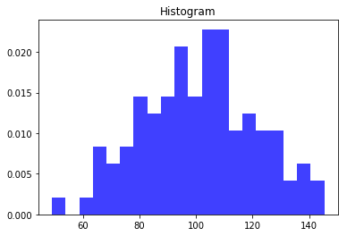

------------------------------------------------------------------------

- **饼图：**用于表示不同分类的占比情况，通过弧度大小来对比各种分类。

  **特点：分类数据的占比情况(占比)**

  api：plt.pie(x, labels=,autopct=,colors)

<!-- -->

    Parameters:
    x:数量，自动算百分比
    labels:每部分名称
    autopct:占比显示指定%1.2f%%
    colors:每部分颜色

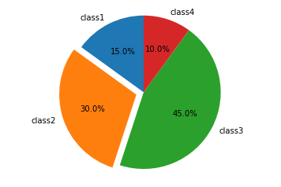

#### 2 散点图绘制

需求：探究房屋面积和房屋价格的关系

房屋面积数据：

``` lang-python
x = [225.98, 247.07, 253.14, 457.85, 241.58, 301.01,  20.67, 288.64,
       163.56, 120.06, 207.83, 342.75, 147.9 ,  53.06, 224.72,  29.51,
        21.61, 483.21, 245.25, 399.25, 343.35]
```

房屋价格数据：

``` lang-python
y = [196.63, 203.88, 210.75, 372.74, 202.41, 247.61,  24.9 , 239.34,
       140.32, 104.15, 176.84, 288.23, 128.79,  49.64, 191.74,  33.1 ,
        30.74, 400.02, 205.35, 330.64, 283.45]
```

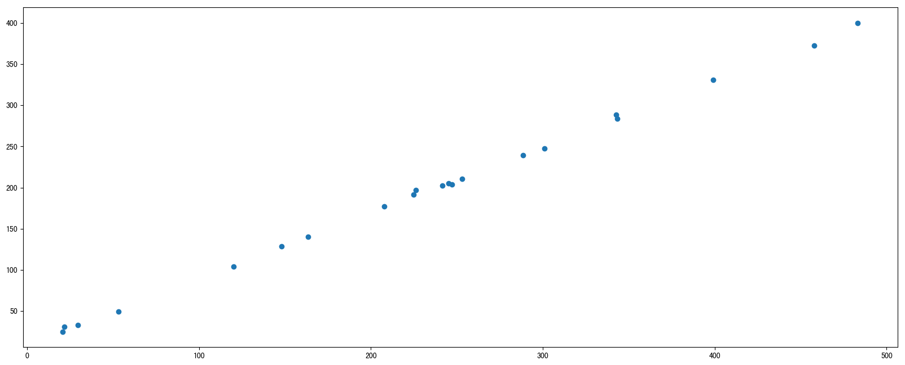

代码：

``` lang-python
# 0.准备数据
x = [225.98, 247.07, 253.14, 457.85, 241.58, 301.01,  20.67, 288.64,
       163.56, 120.06, 207.83, 342.75, 147.9 ,  53.06, 224.72,  29.51,
        21.61, 483.21, 245.25, 399.25, 343.35]
y = [196.63, 203.88, 210.75, 372.74, 202.41, 247.61,  24.9 , 239.34,
       140.32, 104.15, 176.84, 288.23, 128.79,  49.64, 191.74,  33.1 ,
        30.74, 400.02, 205.35, 330.64, 283.45]

# 1.创建画布
plt.figure(figsize=(20, 8), dpi=100)

# 2.绘制散点图
plt.scatter(x, y)

# 3.显示图像
plt.show()
```

#### 3 柱状图绘制

**需求-对比每部电影的票房收入**

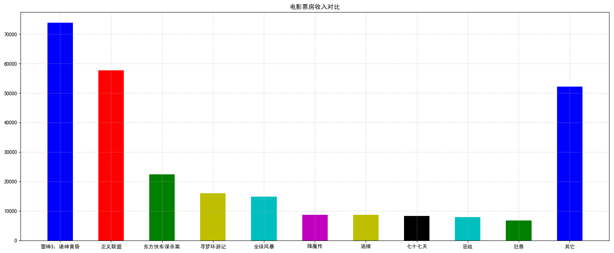

电影数据如下图所示：

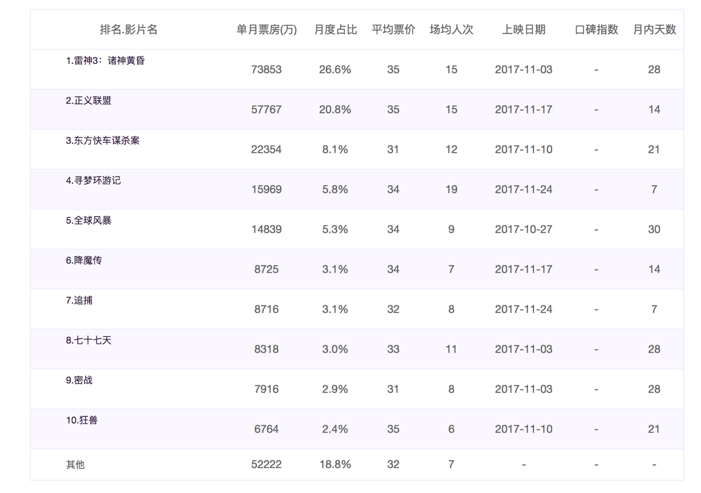

- **准备数据**

<!-- -->

    ['雷神3：诸神黄昏','正义联盟','东方快车谋杀案','寻梦环游记','全球风暴', '降魔传','追捕','七十七天','密战','狂兽','其它']
    [73853,57767,22354,15969,14839,8725,8716,8318,7916,6764,52222]

- **绘制柱状图**

代码：

``` lang-python
# 0.准备数据
# 电影名字
movie_name = ['雷神3：诸神黄昏','正义联盟','东方快车谋杀案','寻梦环游记','全球风暴','降魔传','追捕','七十七天','密战','狂兽','其它']
# 横坐标
x = range(len(movie_name))
# 票房数据
y = [73853,57767,22354,15969,14839,8725,8716,8318,7916,6764,52222]

# 1.创建画布
plt.figure(figsize=(20, 8), dpi=100)

# 2.绘制柱状图
plt.bar(x, y, width=0.5, color=['b','r','g','y','c','m','y','k','c','g','b'])

# 2.1b修改x轴的刻度显示
plt.xticks(x, movie_name)

# 2.2 添加网格显示
plt.grid(linestyle="--", alpha=0.5)

# 2.3 添加标题
plt.title("电影票房收入对比")

# 3.显示图像
plt.show()
```

**参考链接：** <a href="https://matplotlib.org/index.html" target="_blank">https://matplotlib.org/index.html</a>

#### 4 小结

- 折线图【知道】
  - 能够显示数据的变化趋势，反映事物的变化情况。(变化)
  - plt.plot()
- 散点图【知道】
  - 判断变量之间是否存在数量关联趋势,展示离群点(分布规律)
  - plt.scatter()
- 柱状图【知道】
  - 绘制连离散的数据,能够一眼看出各个数据的大小,比较数据之间的差别。(统计/对比)
  - plt.bar(x, width, align="center")
- 直方图【知道】
  - 绘制连续性的数据展示一组或者多组数据的分布状况(统计)
  - plt.hist(x, bins)
- 饼图【知道】
  - 用于表示不同分类的占比情况，通过弧度大小来对比各种分类
  - plt.pie(x, labels, autopct, colors)

---

## Numpy

### 学习目标

- 了解Numpy运算速度上的优势
- 知道数组的属性，形状、类型
- 应用Numpy实现数组的基本操作
- 应用随机数组的创建实现正态分布应用
- 应用Numpy实现数组的逻辑运算
- 应用Numpy实现数组的统计运算
- 应用Numpy实现数组之间的运算

---

### 3.1 Numpy优势

#### 学习目标

- 了解Numpy运算速度上的优势
- 知道Numpy的数组内存块风格
- 知道Numpy的并行化运算

------------------------------------------------------------------------

#### 1 Numpy介绍


Numpy（Numerical Python）是一个开源的Python科学计算库，**用于快速处理任意维度的数组**。

Numpy**支持常见的数组和矩阵操作**。对于同样的数值计算任务，使用Numpy比直接使用Python要简洁的多。

Numpy**使用ndarray对象来处理多维数组**，该对象是一个快速而灵活的大数据容器。

#### 2 ndarray介绍

``` lang-python
NumPy provides an N-dimensional array type, the ndarray,
which describes a collection of “items” of the same type.
```

NumPy提供了一个**N维数组类型ndarray**，它描述了**相同类型**的“items”的集合。

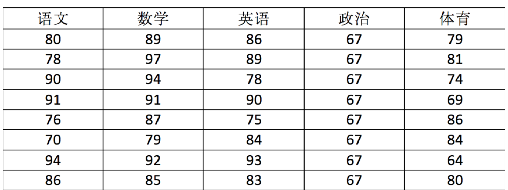

用ndarray进行存储：

``` lang-python
import numpy as np

# 创建ndarray
score = np.array(
[[80, 89, 86, 67, 79],
[78, 97, 89, 67, 81],
[90, 94, 78, 67, 74],
[91, 91, 90, 67, 69],
[76, 87, 75, 67, 86],
[70, 79, 84, 67, 84],
[94, 92, 93, 67, 64],
[86, 85, 83, 67, 80]])

score
```

返回结果：

``` lang-python
array([[80, 89, 86, 67, 79],
       [78, 97, 89, 67, 81],
       [90, 94, 78, 67, 74],
       [91, 91, 90, 67, 69],
       [76, 87, 75, 67, 86],
       [70, 79, 84, 67, 84],
       [94, 92, 93, 67, 64],
       [86, 85, 83, 67, 80]])
```

**提问:**

**使用Python列表可以存储一维数组，通过列表的嵌套可以实现多维数组，那么为什么还需要使用Numpy的ndarray呢？**

#### 3 效率对比

在这里我们通过一段代码运行来体会**ndarray与Python原生list运算效率对比**。

``` lang-python
import random
import time
import numpy as np
a = []
for i in range(100000000):
    a.append(random.random())

# 通过%time魔法方法, 查看当前行的代码运行一次所花费的时间
%time sum1=sum(a)

b=np.array(a)

%time sum2=np.sum(b)
```

其中第一个时间显示的是使用原生Python计算时间,第二个内容是使用numpy计算时间:

    CPU times: user 852 ms, sys: 262 ms, total: 1.11 s
    Wall time: 1.13 s
    CPU times: user 133 ms, sys: 653 µs, total: 133 ms
    Wall time: 134 ms

从中我们看到ndarray的计算速度要快很多，节约了时间。

**机器学习的最大特点就是大量的数据运算**，那么如果没有一个快速的解决方案，那可能现在python也在机器学习领域达不到好的效果。

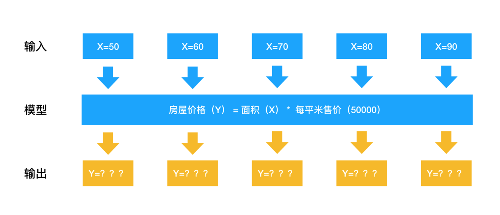

Numpy专门针对ndarray的操作和运算进行了设计，所以数组的存储效率和输入输出性能远优于Python中的嵌套列表，数组越大，Numpy的优势就越明显。

**思考：**

**ndarray为什么可以这么快？**

#### 4 ndarray的优势

###### 4.1 内存块风格

ndarray到底跟原生python列表有什么不同呢，请看一张图：

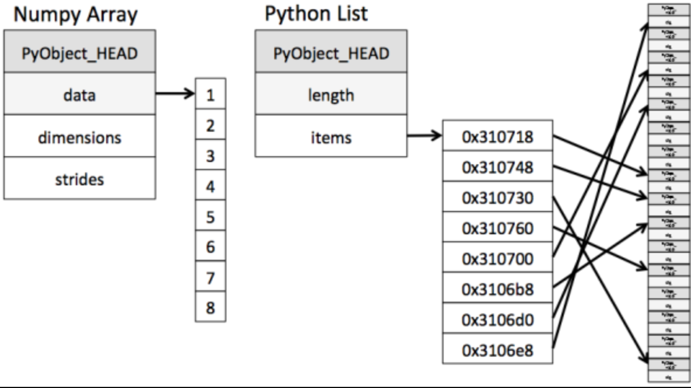

从图中我们可以看出ndarray在存储数据的时候，数据与数据的地址都是连续的，这样就给使得批量操作数组元素时速度更快。

这是因为ndarray中的所有元素的类型都是相同的，而Python列表中的元素类型是任意的，所以ndarray在存储元素时内存可以连续，而python原生list就只能通过寻址方式找到下一个元素，这虽然也导致了在通用性能方面Numpy的ndarray不及Python原生list，但在科学计算中，Numpy的ndarray就可以省掉很多循环语句，代码使用方面比Python原生list简单的多。

###### 4.2 支持并行化运算

numpy内置了并行运算功能，当系统有多个核心时，做某种计算时，numpy会自动做并行计算（向量化运算）。

###### 4.3 效率远高于纯Python代码

Numpy底层使用C语言编写，内部解除了GIL（全局解释器锁），其对数组的操作速度不受Python解释器的限制，所以，其效率远高于纯Python代码。

#### 5 小结

- numpy介绍【了解】
  - 一个开源的Python科学计算库
  - 计算起来要比python简洁高效
  - Numpy使用ndarray对象来处理多维数组
- ndarray介绍【了解】
  - NumPy提供了一个N维数组类型ndarray，它描述了相同类型的“items”的集合。
  - 生成numpy对象:np.array()
- ndarray的优势【掌握】
  - 内存块风格

        - list -- 分离式存储,存储内容多样化
        - ndarray -- 一体式存储,存储类型必须一样

  - ndarray支持并行化运算（向量化运算）

  - ndarray底层是用C语言写的,效率更高,释放了GIL

---

### 3.2 N维数组-ndarray

#### 学习目标

- 说明数组的属性，形状、类型

------------------------------------------------------------------------

#### 1 ndarray的属性

数组属性反映了数组本身固有的信息。

|     属性名字     |          属性解释          |
|:----------------:|:--------------------------:|
|  ndarray.shape   |       数组维度的元组       |
|   ndarray.ndim   |          数组维数          |
|   ndarray.size   |      数组中的元素数量      |
| ndarray.itemsize | 一个数组元素的长度（字节） |
|  ndarray.dtype   |       数组元素的类型       |

#### 2 ndarray的形状

首先创建一些数组。

``` lang-python
# 创建不同形状的数组
>>> a = np.array([[1,2,3],[4,5,6]])
>>> b = np.array([1,2,3,4])
>>> c = np.array([[[1,2,3],[4,5,6]],[[1,2,3],[4,5,6]]])
```

分别打印出形状

``` lang-python
>>> a.shape
>>> b.shape
>>> c.shape

(2, 3)  # 二维数组
(4,)    # 一维数组
(2, 2, 3) # 三维数组
```

如何理解数组的形状？

二维数组：

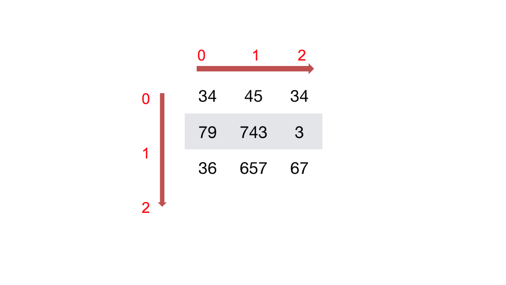

三维数组：

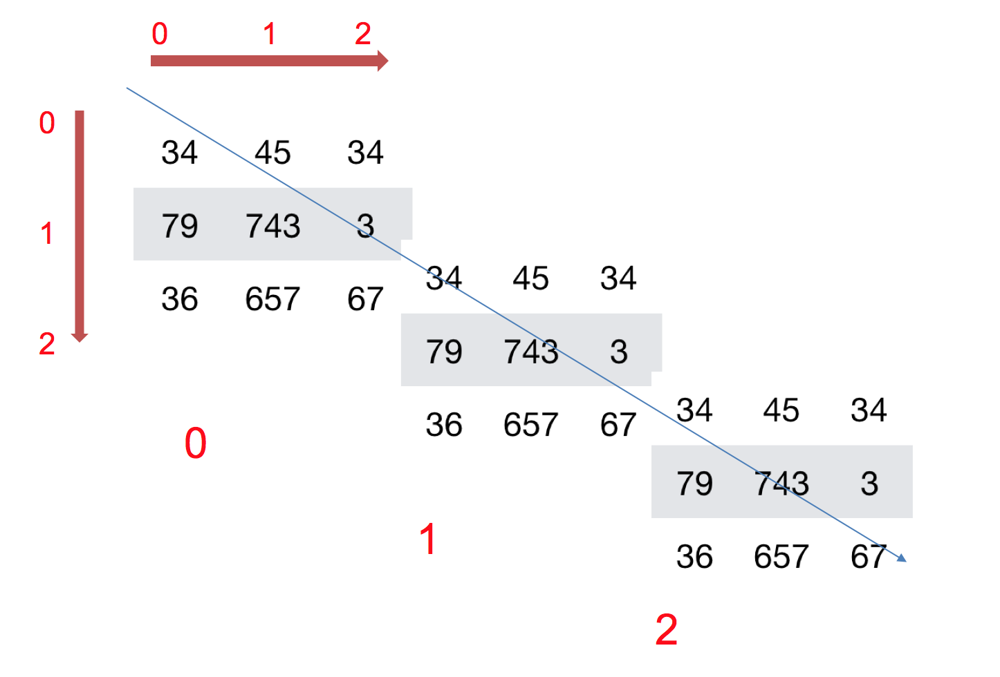

#### 3 ndarray的类型

``` lang-python
>>> type(score.dtype)

<type 'numpy.dtype'>
```

dtype是numpy.dtype类型，先看看对于数组来说都有哪些类型

|     名称      |                       描述                        | 简写  |
|:-------------:|:-------------------------------------------------:|:-----:|
|    np.bool    |      用一个字节存储的布尔类型（True或False）      |  'b'  |
|    np.int8    |             一个字节大小，-128 至 127             |  'i'  |
|   np.int16    |               整数，-32768 至 32767               | 'i2'  |
|   np.int32    |              整数，-2^31​ 至 2^32 -1               | 'i4'  |
|   np.int64    |              整数，-2^63 至 2^63 - 1              | 'i8'  |
|   np.uint8    |               无符号整数，0 至 255                |  'u'  |
|   np.uint16   |              无符号整数，0 至 65535               | 'u2'  |
|   np.uint32   |             无符号整数，0 至 2^32 - 1             | 'u4'  |
|   np.uint64   |             无符号整数，0 至 2^64 - 1             | 'u8'  |
|  np.float16   | 半精度浮点数：16位，正负号1位，指数5位，精度10位  | 'f2'  |
|  np.float32   | 单精度浮点数：32位，正负号1位，指数8位，精度23位  | 'f4'  |
|  np.float64   | 双精度浮点数：64位，正负号1位，指数11位，精度52位 | 'f8'  |
| np.complex64  |     复数，分别用两个32位浮点数表示实部和虚部      | 'c8'  |
| np.complex128 |     复数，分别用两个64位浮点数表示实部和虚部      | 'c16' |
|  np.object\_  |                    python对象                     |  'O'  |
|  np.string\_  |                      字符串                       |  'S'  |
| np.unicode\_  |                    unicode类型                    |  'U'  |

**创建数组的时候指定类型**

``` lang-python
>>> a = np.array([[1, 2, 3],[4, 5, 6]], dtype=np.float32)
>>> a.dtype
dtype('float32')

>>> arr = np.array(['python', 'tensorflow', 'scikit-learn', 'numpy'], dtype = np.string_)
>>> arr
array([b'python', b'tensorflow', b'scikit-learn', b'numpy'], dtype='|S12')
```

- 注意：若不指定，整数默认int64，小数默认float64

#### 4 总结

数组的基本属性【知道】

|     属性名字      |          属性解释          |
|:-----------------:|:--------------------------:|
| **ndarray.shape** |       数组维度的元组       |
|   ndarray.ndim    |          数组维数          |
|   ndarray.size    |      数组中的元素数量      |
| ndarray.itemsize  | 一个数组元素的长度（字节） |
| **ndarray.dtype** |       数组元素的类型       |

---

### 3.3 基本操作

#### 学习目标

- 理解数组的各种生成方法
- 应用数组的索引机制实现数组的切片获取
- 应用维度变换实现数组的形状改变
- 应用类型变换实现数组类型改变
- 应用数组的转换

------------------------------------------------------------------------

#### 1 生成数组的方法

##### 1.1 生成0和1的数组

- **np.ones(shape, dtype)**
- np.ones_like(a, dtype)
- **np.zeros(shape, dtype)**
- np.zeros_like(a, dtype)

``` lang-python
ones = np.ones([4,8])
ones
```

返回结果:

``` lang-python
array([[1., 1., 1., 1., 1., 1., 1., 1.],
       [1., 1., 1., 1., 1., 1., 1., 1.],
       [1., 1., 1., 1., 1., 1., 1., 1.],
       [1., 1., 1., 1., 1., 1., 1., 1.]])
```

``` lang-python
np.zeros_like(ones)
```

返回结果:

``` lang-python
array([[0., 0., 0., 0., 0., 0., 0., 0.],
       [0., 0., 0., 0., 0., 0., 0., 0.],
       [0., 0., 0., 0., 0., 0., 0., 0.],
       [0., 0., 0., 0., 0., 0., 0., 0.]])
```

##### 1.2 从现有数组生成

###### 1.2.1 生成方式

- **np.array(object, dtype)**

- **np.asarray(a, dtype)**

``` lang-python
a = np.array([[1,2,3],[4,5,6]])
# 从现有的数组当中创建
a1 = np.array(a)
# 相当于索引的形式，并没有真正的创建一个新的
a2 = np.asarray(a)
```

###### 1.2.2 array和asarray的对比

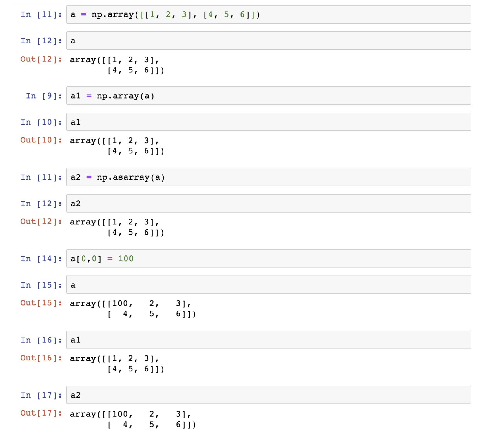

##### 1.3 生成固定范围的数组

###### 1.3.1 np.linspace()

np.linspace (start, stop, num, endpoint)

- 创建等差数组 — 指定数量
- 参数:
  - start:序列的起始值
  - stop:序列的终止值
  - num:要生成的等间隔样例数量，默认为50
  - endpoint:序列中是否包含stop值，默认为ture

``` lang-python
# 生成等间隔的数组
np.linspace(0, 100, 11)
```

返回结果：

``` lang-python
array([  0.,  10.,  20.,  30.,  40.,  50.,  60.,  70.,  80.,  90., 100.])
```

###### 1.3.2 np.arange()

np.arange(start,stop, step, dtype)

- 创建等差数组 — 指定步长
- 参数
  - step:步长,默认值为1

``` lang-python
np.arange(10, 50, 2)
```

返回结果：

``` lang-python
array([10, 12, 14, 16, 18, 20, 22, 24, 26, 28, 30, 32, 34, 36, 38, 40, 42,
       44, 46, 48])
```

###### 1.3.3 np.logspace()

np.logspace(start,stop, num)

- 创建等比数列

- 参数:

  - num:要生成的等比数列数量，默认为50

``` lang-python
# 生成10^x
np.logspace(0, 2, 3)
```

返回结果:

``` lang-shell
array([  1.,  10., 100.])
```

##### 1.4 生成随机数组

###### 1.4.1 使用模块介绍

- np.random模块

###### 1.4.2 正态分布

**一、基础概念复习：正态分布（理解）**

**a. 什么是正态分布**

正态分布是一种概率分布。正态分布是具有两个参数μ和σ的连续型随机变量的分布，第一参数μ是服从正态分布的随机变量的均值，第二个参数σ是此随机变量的标准差，所以正态分布记作**N(μ，σ )**。

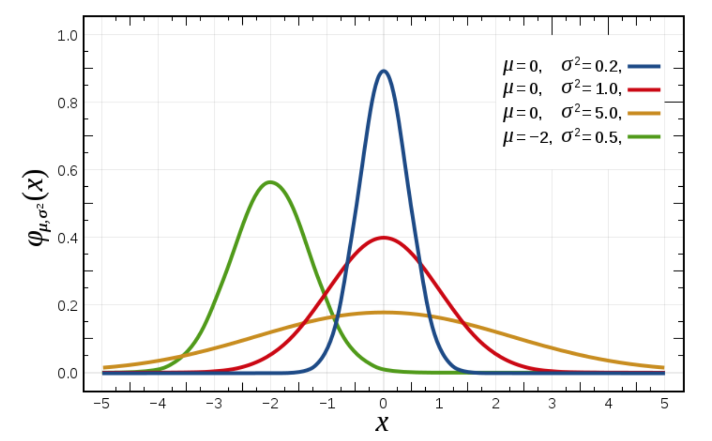

**b. 正态分布的应用**

生活、生产与科学实验中很多随机变量的概率分布都可以近似地用正态分布来描述。

**c. 正态分布特点**

**μ决定了其位置，其标准差σ**决定了分布的幅度。当μ = 0,σ = 1时的正态分布是标准正态分布。

标准差如何来？

- **方差**是在概率论和统计方差衡量一组数据时离散程度的度量,一般用σ ^2来表示：


> 其中M为平均值，n为数据总个数，

σ 为标准差:

<span class="katex"><span class="katex-mathml">$`\sigma=\sqrt {\frac{1}{N}\sum^{N}_{i=1}{(x_i-\mu)^2}}`$</span></span>

- **标准差与方差的意义**

可以理解成数据的一个离散程度的衡量

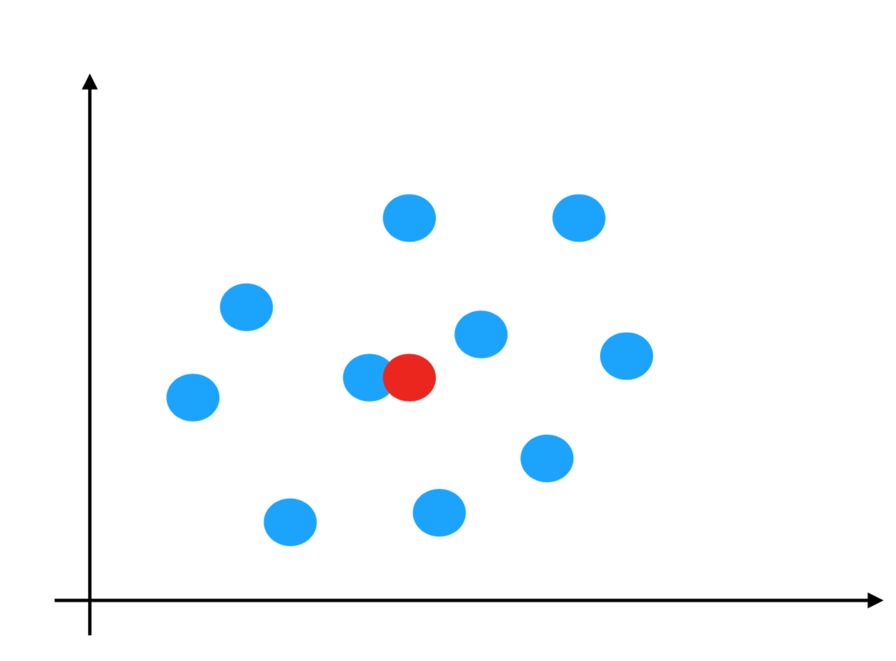

**二、正态分布创建方式**

``` lang-python
np.random.randn(*d0, d1, …, dn*)
  # 功能：从标准正态分布中返回一个或多个样本值
```

``` lang-python
np.random.normal(*loc=0.0*, *scale=1.0*, *size=None*)
  # 功能：返回指定形态的正态分布
  # 参数
    # loc：float - 此概率分布的均值（对应着整个分布的中心centre）
    # scale：float - 此概率分布的标准差（对应于分布的宽度，scale越大越矮胖，scale越小，越瘦高）
    # size：int or tuple of ints - 输出的shape，默认为None，只输出一个值
```

``` lang-python
np.random.standard_normal(*size=None*)
  # 功能：返回指定形状的标准正态分布的数组。
```

**举例1：生成均值为1.75，标准差为1的正态分布数据，100000000个**

``` lang-python
x1 = np.random.normal(1.75, 1, 100000000)
```

返回结果：

``` lang-python
array([2.90646763, 1.46737886, 2.21799024, ..., 1.56047411, 1.87969135,
       0.9028096 ])
```

``` lang-python
# 生成均匀分布的随机数
x1 = np.random.normal(1.75, 1, 100000000)

# 画图看分布状况
# 1）创建画布
plt.figure(figsize=(20, 10), dpi=100)

# 2）绘制直方图
plt.hist(x1, 1000)

# 3）显示图像
plt.show()
```

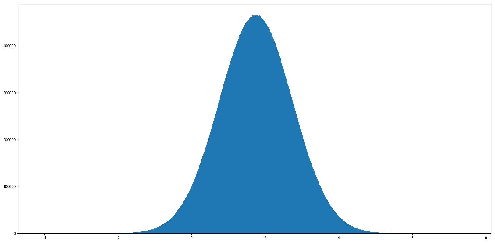

例如：我们可以模拟生成一组股票的涨跌幅的数据

------------------------------------------------------------------------

**举例2：随机生成4支股票1周的交易日涨幅数据**

4支股票，**一周(5天)**的涨跌幅数据，如何获取？

- 随机生成涨跌幅在某个正态分布内，比如均值0，方差1

**股票涨跌幅数据的创建**

``` lang-python
# 创建符合正态分布的4只股票5天的涨跌幅数据
stock_change = np.random.normal(0, 1, (4, 5))
stock_change
```

返回结果：

``` lang-python
array([[ 0.0476585 ,  0.32421568,  1.50062162,  0.48230497, -0.59998822],
       [-1.92160851,  2.20430374, -0.56996263, -1.44236548,  0.0165062 ],
       [-0.55710486, -0.18726488, -0.39972172,  0.08580347, -1.82842225],
       [-1.22384505, -0.33199305,  0.23308845, -1.20473702, -0.31753223]])
```

###### 1.4.2 均匀分布

**一、基础概念复习：均匀分布（理解）**

均匀分布是关于定义在区间\[a,b\], (a\<b)上连续变量的简单概率分布，其概率密度函数如下图所示：


**二、均匀分布创建方式**

``` lang-python
np.random.rand(*d0*, *d1*, *...*, *dn*)

# 功能：返回**[0.0，1.0)**内的一组均匀分布的数。
```

``` lang-python
np.random.uniform(*low=0.0*, *high=1.0*, *size=None*)

# - 功能：从一个均匀分布[low,high)中随机采样，注意定义域是左闭右开，即包含low，不包含high.
# - 参数介绍:
       # - low: 采样下界，float类型，默认值为0；
       # - high: 采样上界，float类型，默认值为1；
       # - size: 输出样本数目，为int或元组(tuple)类型，
          # 例如，size=(m,n,k), 则输出m*n*k个样本，缺省时输出1个值。
# - 返回值：ndarray类型，其形状和参数size中描述一致。
```

``` lang-python
np.random.randint(*low*, *high=None*, *size=None*, *dtype='l'*)

# 功能： 从一个均匀分布中随机采样，生成一个整数或N维整数数组，
    # 取数范围：若high不为None时，取[low,high)之间随机整数，否则取值[0,low)之间随机整数。
```

**举例：**

``` lang-python
# 生成均匀分布的随机数
x2 = np.random.uniform(-1, 1, 100000000)
```

返回结果：

``` lang-python
array([ 0.22411206,  0.31414671,  0.85655613, ..., -0.92972446,
0.95985223,  0.23197723])
```

画图看分布状况：

``` lang-python
import matplotlib.pyplot as plt

# 生成均匀分布的随机数
x2 = np.random.uniform(-1, 1, 100000000)

# 画图看分布状况
# 1）创建画布
plt.figure(figsize=(10, 10), dpi=100)

# 2）绘制直方图
plt.hist(x=x2, bins=1000)  # x代表要使用的数据，bins表示要划分区间数

# 3）显示图像
plt.show()
```

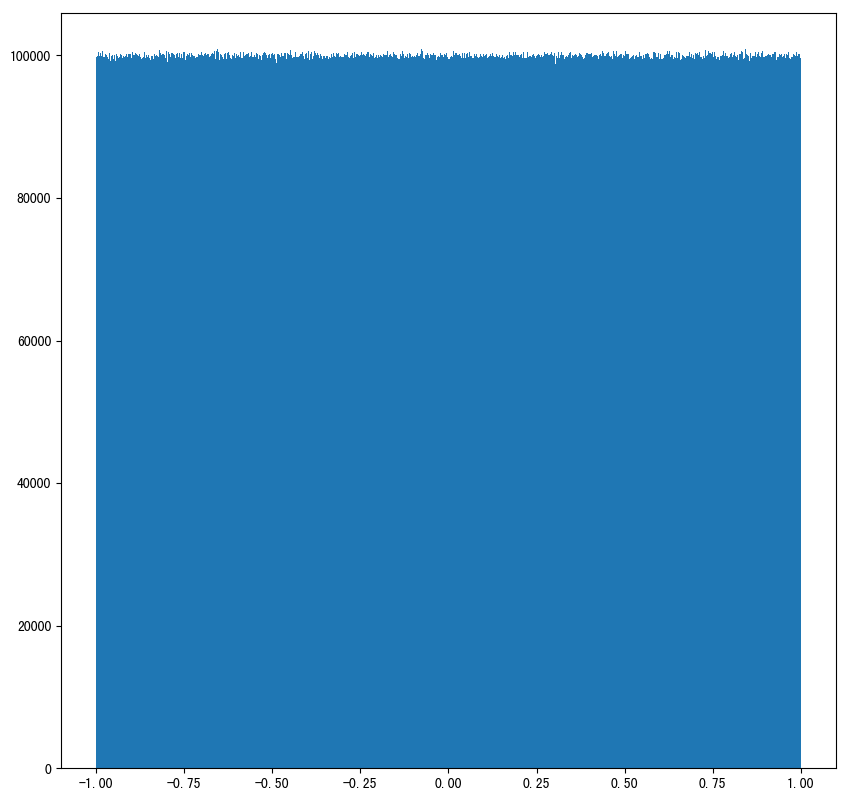

#### 2 数组的索引、切片

一维、二维、三维的数组如何索引？

- 直接进行索引,切片
- 对象\[:, :\] -- 先行后列

二维数组索引方式：

- 举例：获取第一个股票的前3个交易日的涨跌幅数据

``` lang-python
# 二维的数组，两个维度
stock_change[0, 0:3]
```

返回结果：

``` lang-python
array([-0.03862668, -1.46128096, -0.75596237])
```

- 三维数组索引方式：

``` lang-python
# 三维
a1 = np.array([ [[1,2,3],[4,5,6]], [[12,3,34],[5,6,7]]])
# 返回结果
array([[[ 1,  2,  3],
        [ 4,  5,  6]],

       [[12,  3, 34],
        [ 5,  6,  7]]])
# 索引、切片
>>> a1[0, 0, 1]   # 输出: 2
```

#### 3 形状修改

##### 3.1 ndarray.reshape()

ndarray.reshape(shape, order)

- 返回一个具有相同数据域，但shape不一样的**视图**
- 行、列不进行互换

``` lang-python
# 在转换形状的时候，一定要注意数组的元素匹配
stock_change.reshape([5, 4])
stock_change.reshape([-1,10])  # 数组的形状被修改为: (2, 10), -1: 表示通过待计算
```

##### 3.2 ndarray.resize()

ndarray.resize(new_shape)

- 修改数组本身的形状（需要保持元素个数前后相同）
- 行、列不进行互换

``` lang-python
stock_change.resize([5, 4])

# 查看修改后结果
stock_change.shape
(5, 4)
```

##### 3.3 ndarray.T

- 数组的转置
- 将数组的行、列进行互换

``` lang-python
stock_change.T.shape
(4, 5)
```

#### 4 类型修改

##### 4.1 ndarray.astype()

- 返回修改了类型之后的数组

``` lang-python
stock_change.astype(np.int32)
```

##### 4.2 ndarray.tostring()

- 构造包含数组中原始数据字节的Python字节

``` lang-python
arr = np.array([[[1, 2, 3], [4, 5, 6]], [[12, 3, 34], [5, 6, 7]]])
arr.tostring()
```

##### 4.3 jupyter输出太大可能导致崩溃问题【了解】

如果遇到

    IOPub data rate exceeded.
        The notebook server will temporarily stop sending output
        to the client in order to avoid crashing it.
        To change this limit, set the config variable
        `--NotebookApp.iopub_data_rate_limit`.

这个问题是在jupyer当中对输出的字节数有限制，需要去修改配置文件

创建配置文件

``` lang-python
jupyter notebook --generate-config
vi ~/.jupyter/jupyter_notebook_config.py
```

取消注释,多增加

``` lang-python
## (bytes/sec) Maximum rate at which messages can be sent on iopub before they
#  are limited.
c.NotebookApp.iopub_data_rate_limit = 10000000
```

**但是不建议这样去修改，jupyter输出太大会崩溃**

#### 5 数组的去重

通过np.unique()可以实现数组去重的目的

``` lang-python
temp = np.array([[1, 2, 3, 4],[3, 4, 5, 6]])
>>> np.unique(temp)
array([1, 2, 3, 4, 5, 6])
```

#### 6 小结

- 创建数组【掌握】
  - 生成0和1的数组
    - np.ones()
    - np.ones_like()
  - 从现有数组中生成
    - np.array -- 深拷贝
    - np.asarray -- 浅拷贝
  - 生成固定范围数组
    - np.linspace()
    - np.arange()
    - np.logspace()
  - 生层随机数组
    - 正态分布-- 里面需要关注的参数:均值:u, 标准差:σ
      - np.random.randn()
      - np.random.normal(0, 1, 100)
    - 均匀分布
      - np.random.rand()
      - np.random.uniform(0, 1, 100)
      - np.random.randint(0, 10, 10)
- 数组索引【知道】
  - 直接进行索引,切片
  - 对象\[:, :\] -- 先行后列
- 数组形状改变【掌握】
  - 对象.reshape()
    - 没有进行行列互换,新产生一个ndarray
  - 对象.resize()
    - 没有进行行列互换,修改原来的ndarray
  - 对象.T
    - 进行了行列互换
- 数组去重【知道】
  - np.unique(对象)

---

### 3.4 ndarray运算

#### 学习目标

- 应用数组的通用判断函数
- 应用np.where实现数组的三元运算

------------------------------------------------------------------------

问题

**如果想要操作符合某一条件的数据，应该怎么做？**

#### 1 逻辑运算

``` lang-python
# 生成10名同学，5门功课的数据
>>> score = np.random.randint(40, 100, (10, 5))

# 取出最后4名同学的成绩，用于逻辑判断
>>> test_score = score[6:, 0:5]

# 逻辑判断, 如果成绩大于60就标记为True 否则为False
>>> test_score > 60
array([[ True,  True,  True, False,  True],
       [ True,  True,  True, False,  True],
       [ True,  True, False, False,  True],
       [False,  True,  True,  True,  True]])

# BOOL赋值, 将满足条件的设置为指定的值-布尔索引
>>> test_score[test_score > 60] = 1
>>> test_score
array([[ 1,  1,  1, 52,  1],
       [ 1,  1,  1, 59,  1],
       [ 1,  1, 44, 44,  1],
       [59,  1,  1,  1,  1]])
```

#### 2 通用判断函数

- np.all()

``` lang-python
# 判断前两名同学的成绩[0:2, :]是否全及格
>>> np.all(score[0:2, :] > 60)
False
```

- np.any()

``` lang-python
# 判断前两名同学的成绩[0:2, :]是否有大于90分的
>>> np.any(score[0:2, :] > 80)
True
```

#### 3 np.where(三元运算符)

通过使用np.where能够进行更加复杂的运算

- np.where()

``` lang-python
# 判断前四名学生,前四门课程中，成绩中大于60的置为1，否则为0
temp = score[:4, :4]
np.where(temp > 60, 1, 0)
```

- 复合逻辑需要结合np.logical_and和np.logical_or使用

``` lang-python
# 判断前四名学生,前四门课程中，成绩中大于60且小于90的换为1，否则为0
np.where(np.logical_and(temp > 60, temp < 90), 1, 0)

# 判断前四名学生,前四门课程中，成绩中大于90或小于60的换为1，否则为0
np.where(np.logical_or(temp > 90, temp < 60), 1, 0)
```

#### 4 统计运算

**如果想要知道学生成绩最大的分数，或者做小分数应该怎么做？**

##### 4.1 统计指标

在数据挖掘/机器学习领域，统计指标的值也是我们分析问题的一种方式。常用的指标如下：

- min(a, axis)
  - Return the minimum of an array or minimum along an axis.
- max(a, axis\])
  - Return the maximum of an array or maximum along an axis.
- median(a, axis)
  - Compute the median along the specified axis.
- mean(a, axis, dtype)
  - Compute the arithmetic mean along the specified axis.
- std(a, axis, dtype)
  - Compute the standard deviation along the specified axis.
- var(a, axis, dtype)
  - Compute the variance along the specified axis.

##### 4.2 案例：学生成绩统计运算

进行统计的时候，**axis 轴的取值并不一定，Numpy中不同的API轴的值都不一样，在这里，axis 0代表列, axis 1代表行去进行统计**

``` lang-python
# 接下来对于前四名学生,进行一些统计运算
# 指定列 去统计
temp = score[:4, 0:5]
print("前四名学生,各科成绩的最大分：{}".format(np.max(temp, axis=0)))
print("前四名学生,各科成绩的最小分：{}".format(np.min(temp, axis=0)))
print("前四名学生,各科成绩波动情况：{}".format(np.std(temp, axis=0)))
print("前四名学生,各科成绩的平均分：{}".format(np.mean(temp, axis=0)))
```

结果：

    前四名学生,各科成绩的最大分：[96 97 72 98 89]
    前四名学生,各科成绩的最小分：[55 57 45 76 77]
    前四名学生,各科成绩波动情况：[16.25576821 14.92271758 10.40432602  8.0311892   4.32290412]
    前四名学生,各科成绩的平均分：[78.5  75.75 62.5  85.   82.25]

如果需要统计出某科最高分对应的是哪个同学？

- np.argmax(temp, axis=)
- np.argmin(temp, axis=)

``` lang-python
print("前四名学生，各科成绩最高分对应的学生下标：{}".format(np.argmax(temp, axis=0)))
```

结果：

    前四名学生，各科成绩最高分对应的学生下标：[0 2 0 0 1]

#### 5 小结

- 逻辑运算【知道】
  - 直接进行大于,小于的判断
  - 合适之后,可以直接进行赋值
- 通用判断函数【知道】
  - np.all()
  - np.any()
- 统计运算【掌握】
  - np.max()
  - np.min()
  - np.median()
  - np.mean()
  - np.std()
  - np.var()
  - np.argmax(axis=) — 最大元素对应的下标
  - np.argmin(axis=) — 最小元素对应的下标

---

### 3.5 数组间运算

#### 学习目标

- 知道数组与数之间的运算
- 知道数组与数组之间的运算
- 说明数组间运算的广播机制

------------------------------------------------------------------------

#### 1 数组与数的运算

``` lang-python
arr = np.array([[1, 2, 3, 2, 1, 4], [5, 6, 1, 2, 3, 1]])
arr + 1
arr / 2

# 可以对比python列表的运算，看出区别
a = [1, 2, 3, 4, 5]
a * 3
```

#### 2 数组与数组的运算

``` lang-python
arr1 = np.array([[1, 2, 3, 2, 1, 4], [5, 6, 1, 2, 3, 1]])
arr2 = np.array([[1, 2, 3, 4], [3, 4, 5, 6]])
```

上面这个能进行运算吗，结果是不行的！

##### 2.1 广播机制

数组在进行矢量化运算时，**要求数组的形状是相等的**。当形状不相等的数组执行算术运算的时候，就会出现广播机制，该机制会对数组进行扩展，使数组的shape属性值一样，这样，就可以进行矢量化运算了。下面通过一个例子进行说明：

``` lang-python
arr1 = np.array([[0],[1],[2],[3]])
arr1.shape
# (4, 1)

arr2 = np.array([1,2,3])
arr2.shape
# (3,)

arr1+arr2
# 结果是：
array([[1, 2, 3],
       [2, 3, 4],
       [3, 4, 5],
       [4, 5, 6]])
```

上述代码中，数组arr1是4行1列，arr2是1行3列。这两个数组要进行相加，按照广播机制会对数组arr1和arr2都进行扩展，使得数组arr1和arr2都变成4行3列。

下面通过一张图来描述广播机制扩展数组的过程：

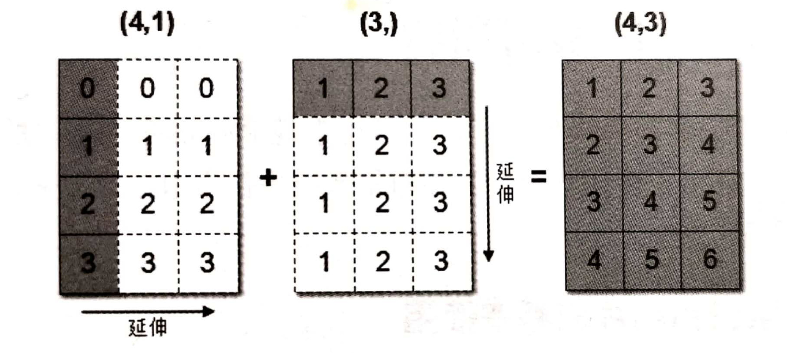

这句话乃是理解广播的核心。广播主要发生在两种情况，一种是两个数组的维数不相等，但是它们的后缘维度的轴长相符，另外一种是有一方的长度为1。

广播机制实现了时两个或两个以上数组的运算，即使这些数组的shape不是完全相同的，只需要满足如下任意一个条件即可。

- 如果**两个数组的后缘维度（trailing dimension，即从末尾开始算起的维度）的轴长度相符**，
- 或**其中的一方的长度为1**。

广播会在缺失和（或）长度为1的维度上进行。

广播机制需要**扩展维度小的数组**，使得它与维度最大的数组的shape值相同，以便使用元素级函数或者运算符进行运算。

如果是下面这样，则不匹配：

``` lang-python
A  (1d array): 10
B  (1d array): 12
A  (2d array):      2 x 1
B  (3d array):  8 x 4 x 3
```

**思考：下面两个ndarray是否能够进行运算？**

``` lang-python
arr1 = np.array([[1, 2, 3, 2, 1, 4], [5, 6, 1, 2, 3, 1]])
arr2 = np.array([[1], [3]])
```

#### 3 小结

- 数组运算,满足广播机制,就OK【知道】
  - 1.维度相等
  - 2.shape(其中对应的地方为1,也是可以的)

---

### 3.6 数学：矩阵

#### 学习目标

- 知道什么是矩阵和向量
- 知道矩阵的加法,乘法
- 知道矩阵的逆和转置
- 应用np.matmul、np.dot实现矩阵运算

------------------------------------------------------------------------

#### 1 矩阵和向量

##### 1.1 矩阵

矩阵，英文matrix，**和array的区别矩阵必须是2维的，但是array可以是多维的。**

如图:这个是 3×2 矩阵，即 3 行 2 列，如 m 为行，n 为列，那么 m×n 即 3×2 <span class="katex-display"><span class="katex"><span class="katex-mathml">$`
\left[
 \begin{matrix}
   1 & 2  \\\\
   3 & 4  \\\\
   5 & 6
  \end{matrix}
  \right]
`$</span></span></span> 矩阵的维数即行数×列数

矩阵元素(矩阵项): <span class="katex-display"><span class="katex"><span class="katex-mathml">$`
A = \left[
 \begin{matrix}
   1 & 2  \\\\
   3 & 4  \\\\
   5 & 6
  \end{matrix}
  \right]
`$</span></span></span> Aij 指第 i 行，第 j 列的元素。

##### 1.2 向量

向量是一种特殊的矩阵，讲义中的向量一般都是列向量，下面展示的就是三维列 向量(3×1)。) <span class="katex-display"><span class="katex"><span class="katex-mathml">$`
A = \left[
 \begin{matrix}
   1  \\\\
   2  \\\\
   3
  \end{matrix}
  \right]
`$</span></span></span>

#### 2 加法和标量乘法

矩阵的加法:行列数相等的可以加。

例: <span class="katex-display"><span class="katex"><span class="katex-mathml">$`
\left[
 \begin{matrix}
   1 & 2  \\\\
   3 & 4  \\\\
   5 & 6
  \end{matrix}
  \right] +
\left[
 \begin{matrix}
   1 & 2  \\\\
   3 & 4  \\\\
   5 & 6
  \end{matrix}
  \right] =
  \left[
 \begin{matrix}
   2 & 4  \\\\
   6 & 8  \\\\
   10 & 12
  \end{matrix}
  \right]
`$</span></span></span> 矩阵的乘法:每个元素都要乘。

例: <span class="katex-display"><span class="katex"><span class="katex-mathml">$`
3 *
\left[
 \begin{matrix}
   1 & 2  \\\\
   3 & 4  \\\\
   5 & 6
  \end{matrix}
  \right] =
  \left[
 \begin{matrix}
   3 & 6  \\\\
   9 & 12  \\\\
   15 & 18
  \end{matrix}
  \right]
`$</span></span></span> 组合算法也类似。

#### 3 矩阵乘法

##### 3.1 矩阵向量乘法

矩阵和向量的乘法如图：m×n 的矩阵乘以 n×1 的向量，得到的是 m×1 的向量

例: <span class="katex-display"><span class="katex"><span class="katex-mathml">$`
\left[
 \begin{matrix}
   1 & 3  \\\\
   4 & 0  \\\\
   2 & 1
  \end{matrix}
  \right] *
\left[
 \begin{matrix}
   1  \\\\
   5
  \end{matrix}
  \right] =
  \left[
 \begin{matrix}
   16  \\\\
   4 \\\\
   7
  \end{matrix}
  \right]
`$</span></span></span>

    1*1+3*5 = 16
    4*1+0*5 = 4
    2*1+1*5 = 7

**矩阵乘法遵循准则：**

**(M行, N列)\*(N行, L列) = (M行, L列)**

##### 3.2 矩阵和矩阵乘法

矩阵乘法：

m×n 矩阵乘以 n×o 矩阵，变成 m×o 矩阵。

举例：比如说现在有两个矩阵 A 和 B，那 么它们的乘积就可以表示为图中所示的形式。


------------------------------------------------------------------------

**练一练** <span class="katex-display"><span class="katex"><span class="katex-mathml">$`
A=
\left[
 \begin{matrix}
   1 & 2 & 3 \\\\
   4 & 5 & 6 \\\\
   7 & 8 & 0
  \end{matrix}
\right]
B=
\left[
 \begin{matrix}
   1 & 2 & 1 \\\\
   1 & 1 & 2 \\\\
   2 & 1 & 1
  \end{matrix}
\right]
`$</span></span></span>

**求矩阵AB的结果**

答案：


##### 3.3 矩阵乘法的性质

矩阵的乘法不满足交换律：A×B≠B×A

矩阵的乘法满足结合律。即：A×（B×C）=（A×B）×C

单位矩阵：在矩阵的乘法中，有一种矩阵起着特殊的作用，如同数的乘法中的 1,我们称 这种矩阵为**单位矩阵**．它是个方阵，一般用 I 或者 E 表示，从 左上角到右下角的对角线（称为主对角线）上的元素均为 1 以外全都为 0。如：


#### 4 逆、转置

矩阵的逆：如矩阵 A 是一个 m×m 矩阵（方阵），如果有逆矩阵，则：

AA<sup>-1</sup> = A<sup>-1</sup>A = I

**低阶矩阵求逆的方法:**

- 1.待定系数法
- 2.初等变换
- ……

------------------------------------------------------------------------

**矩阵的转置：**

- 设 A 为 m×n 阶矩阵（即 m 行 n 列），第 i 行 j 列的元素是 a(i,j)，即：A=a(i,j)

- 定义 A 的转置为这样一个 n×m 阶矩阵 B，满足 B=a(j,i)，即 b (i,j)=a (j,i)（B 的第 i 行第 j 列元素是 A 的第 j 行第 i 列元素），记 A<sup>T</sup> =B。

<!-- -->

- 直观来看，将 A 的所有元素绕着一条从第 1 行第 1 列元素出发的右下方 45 度的射线作 镜面反转，即得到 A 的转置。

例： <span class="katex-display"><span class="katex"><span class="katex-mathml">$`
\left[
 \begin{matrix}
   a & b \\\\
   c & d \\\\
   e & f
  \end{matrix}
\right]^T
=
\left[
 \begin{matrix}
   a & c & e \\\\
   b & d & f
  \end{matrix}
\right]
`$</span></span></span>

#### 5 矩阵运算

<span class="katex-display"><span class="katex"><span class="katex-mathml">$`
\left[
 \begin{matrix}
   80 & 86 \\\\
   82 & 80 \\\\
   85 & 78 \\\\
   90 & 90 \\\\
   86 & 82 \\\\
   82 & 90 \\\\
   78 & 80 \\\\
   92 & 94
  \end{matrix}
\right]*
\left[
 \begin{matrix}
   0.3 \\\\
   0.7
  \end{matrix}
\right]=
\left[
 \begin{matrix}
   84.2 \\\\
   80.6 \\\\
   80.1 \\\\
   90   \\\\
   83.2 \\\\
   87.6 \\\\
   79.4 \\\\
   93.4
  \end{matrix}
\right]
`$</span></span></span>

##### 5.1 矩阵乘法api介绍

- np.matmul
- np.dot

``` lang-python
>>> a = np.array([[80, 86],
[82, 80],
[85, 78],
[90, 90],
[86, 82],
[82, 90],
[78, 80],
[92, 94]])
>>> b = np.array([[0.7], [0.3]])

>>> np.matmul(a, b)
array([[81.8],
       [81.4],
       [82.9],
       [90. ],
       [84.8],
       [84.4],
       [78.6],
       [92.6]])

>>> np.dot(a,b)
array([[81.8],
       [81.4],
       [82.9],
       [90. ],
       [84.8],
       [84.4],
       [78.6],
       [92.6]])
```

**np.matmul和np.dot的区别:**

> 二者都是矩阵乘法。

- np.matmul中禁止矩阵与标量的乘法。
- 在矢量乘矢量的內积运算中，np.matmul与np.dot没有区别。

#### 6 小结

- 1.矩阵和向量【知道】
  - 矩阵就是特殊的二维数组
  - 向量就是一行或者一列的数据
- 2.矩阵加法和标量乘法【知道】
  - 矩阵的加法:行列数相等的可以加。
  - 矩阵的乘法:每个元素都要乘。
- 3.矩阵和矩阵(向量)相乘 【知道】
  - (M行, N列)\*(N行, L列) = (M行, L列)
- 4.矩阵性质【知道】
  - 矩阵不满足交换率,满足结合律
- 5.单位矩阵【知道】
  - 对角线都是1的矩阵,其他位置都为0
- 6.矩阵运算【掌握】
  - np.matmul
  - np.dot
  - 注意：二者都是矩阵乘法。 np.matmul中禁止矩阵与标量的乘法。 在矢量乘矢量的內积运算中，np.matmul与np.dot没有区别。

---

## Pandas

### 学习目标

- 了解Numpy与Pandas的不同
- 说明Pandas的Series与Dataframe两种结构的区别
- 了解Pandas的MultiIndex与panel结构
- 应用Pandas实现基本数据操作
- 应用Pandas实现数据的合并
- 应用crosstab和pivot_table实现交叉表与透视表
- 应用groupby和聚合函数实现数据的分组与聚合
- 了解Pandas的plot画图功能
- 应用Pandas实现数据的读取和存储

---

### 4.1Pandas介绍

#### 学习目标

- 了解什么是pandas
- 了解Numpy与Pandas的不同
- 知道使用pandas的优势

------------------------------------------------------------------------

#### 1 Pandas介绍

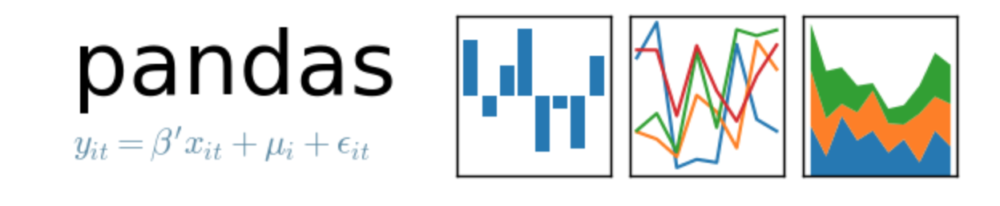

- 2008年WesMcKinney开发出的库
- 专门用于数据挖掘的开源python库
- **以Numpy为基础，借力Numpy模块在计算方面性能高的优势**
- **基于matplotlib，能够简便的画图**
- **独特的数据结构**

#### 2 为什么使用Pandas

Numpy已经能够帮助我们处理数据，能够结合matplotlib解决部分数据展示等问题，那么pandas学习的目的在什么地方呢？

- **增强图表可读性**
  - 回忆我们在numpy当中创建学生成绩表样式：
- 返回结果：

``` lang-python
  array([[92, 55, 78, 50, 50],
         [71, 76, 50, 48, 96],
         [45, 84, 78, 51, 68],
         [81, 91, 56, 54, 76],
         [86, 66, 77, 67, 95],
         [46, 86, 56, 61, 99],
         [46, 95, 44, 46, 56],
         [80, 50, 45, 65, 57],
         [41, 93, 90, 41, 97],
         [65, 83, 57, 57, 40]])
```

如果数据展示为这样，可读性就会更友好：

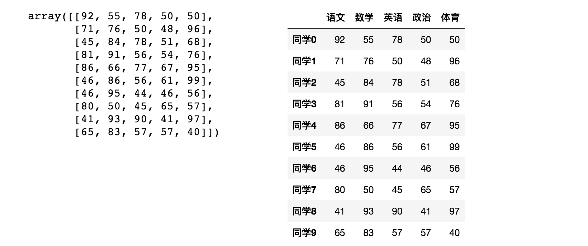

- **便捷的数据处理能力**

  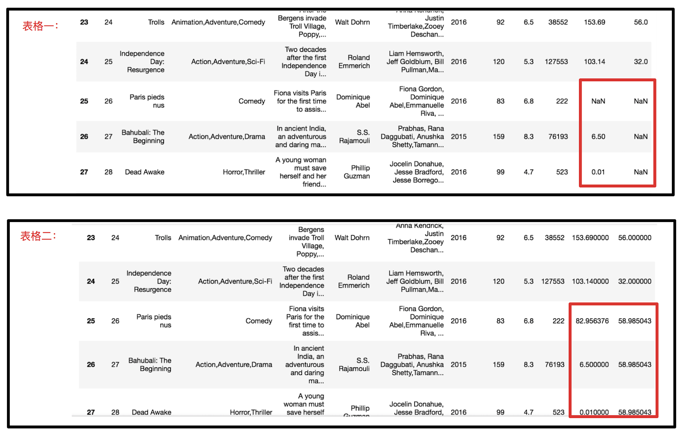

<!-- -->

- **读取文件方便**
- **封装了Matplotlib、Numpy的画图和计算**

#### 3 小结

- pandas的优势【了解】
  - 增强图表可读性
  - 便捷的数据处理能力
  - 读取文件方便
  - 封装了Matplotlib、Numpy的画图和计算

---

### 4.2 Pandas数据类型

#### 学习目标

- 知道Pandas的Series类型
- 掌握Pandas的Dataframe类型
- 了解Pandas的MultiIndex与panel类型

------------------------------------------------------------------------

Pandas中一共有三种数据类型，分别为：Series、DataFrame和MultiIndex（老版本中叫Panel ）。

其中Series是一维数据类型，DataFrame是二维的表格型数据类型，MultiIndex是三维的数据类型。

#### 1.Series

Series是一个类似于一维数组的数据类型，它能够保存任何类型的数据，比如整数、字符串、浮点数等，**主要由一组数据和与之相关的索引两部分构成。**


##### 1.1 Series的创建

``` lang-python
# 导入pandas
import pandas as pd

pd.Series(data=None, index=None, dtype=None)
```

- 参数：
  - data：传入的数据，可以是ndarray、list等
  - index：索引，必须是唯一的，且与数据的长度相等。如果没有传入索引参数，则默认会自动创建一个从0-N的整数索引。
  - dtype：数据的类型

通过已有数据创建

- 指定内容，默认索引

``` lang-python
pd.Series(np.arange(10))
```

    # 运行结果
    0    0
    1    1
    2    2
    3    3
    4    4
    5    5
    6    6
    7    7
    8    8
    9    9
    dtype: int64

- 指定索引

``` lang-python
pd.Series([6.7,5.6,3,10,2], index=[1,2,3,4,5])
```

    # 运行结果
    1     6.7
    2     5.6
    3     3.0
    4    10.0
    5     2.0
    dtype: float64

- 通过字典数据创建

``` lang-python
color_count = pd.Series({'red':100, 'blue':200, 'green': 500, 'yellow':1000})
color_count
```

    # 运行结果
    blue       200
    green      500
    red        100
    yellow    1000
    dtype: int64

##### 1.2 Series的属性

为了更方便地操作Series对象中的索引和数据，**Series中提供了两个属性index和values**

- index

``` lang-python
color_count.index

# 结果
Index(['blue', 'green', 'red', 'yellow'], dtype='object')
```

- values

``` lang-python
color_count.values

# 结果
array([ 200,  500,  100, 1000])
```

也可以使用索引来获取数据：

``` lang-python
color_count[2]

# 结果
100
```

#### 2.DataFrame

DataFrame是一个类似于二维数组或表格(如excel)的对象，既有行索引，又有列索引

- 行索引，表明不同行，横向索引，叫index，0轴，axis=0
- 列索引，表名不同列，纵向索引，叫columns，1轴，axis=1


##### 2.1 DataFrame的创建

``` lang-python
# 导入pandas
import pandas as pd

pd.DataFrame(data=None, index=None, columns=None)
```

参数

- index：行标签。如果没有传入索引参数，则默认会自动创建一个从0-N的整数索引。

- columns：列标签。如果没有传入索引参数，则默认会自动创建一个从0-N的整数索引。

------------------------------------------------------------------------

通过已有数据创建

举例一：

``` lang-python
pd.DataFrame(np.random.randn(2,3))
```

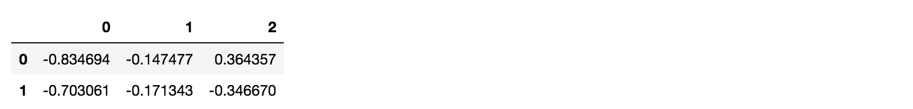

回忆咱们在前面直接使用np创建的数组显示方式，比较两者的区别。

举例二：创建学生成绩表

``` lang-python
# 生成10名同学，5门功课的数据
score = np.random.randint(40, 100, (10, 5))

# 结果
array([[92, 55, 78, 50, 50],
       [71, 76, 50, 48, 96],
       [45, 84, 78, 51, 68],
       [81, 91, 56, 54, 76],
       [86, 66, 77, 67, 95],
       [46, 86, 56, 61, 99],
       [46, 95, 44, 46, 56],
       [80, 50, 45, 65, 57],
       [41, 93, 90, 41, 97],
       [65, 83, 57, 57, 40]])
```

**但是这样的数据形式很难看到存储的是什么的样的数据，可读性比较差！！**

**问题：如何让数据更有意义的显示**？

``` lang-python
# 使用Pandas中的数据类型
score_df = pd.DataFrame(score)
```


给分数数据增加行列索引,显示效果更佳

效果：


- 增加行、列索引

``` lang-python
# 构造列索引序列
subjects = ["语文", "数学", "英语", "政治", "体育"]

# 构造行索引序列
stu = ['同学' + str(i) for i in range(score_df.shape[0])]

# 添加行、列索引
data = pd.DataFrame(score, columns=subjects, index=stu)
```

##### 2.2 DataFrame的属性

- **shape**

``` lang-python
data.shape

# 结果
(10, 5)
```

- **index**

DataFrame的行索引列表

``` lang-python
data.index

# 结果
Index(['同学0', '同学1', '同学2', '同学3', '同学4', '同学5', '同学6', '同学7', '同学8', '同学9'], dtype='object')
```

- **columns**

DataFrame的列索引列表

``` lang-python
data.columns

# 结果
Index(['语文', '数学', '英语', '政治', '体育'], dtype='object')
```

- **values**

直接获取其中array的值

``` lang-python
data.values

array([[92, 55, 78, 50, 50],
       [71, 76, 50, 48, 96],
       [45, 84, 78, 51, 68],
       [81, 91, 56, 54, 76],
       [86, 66, 77, 67, 95],
       [46, 86, 56, 61, 99],
       [46, 95, 44, 46, 56],
       [80, 50, 45, 65, 57],
       [41, 93, 90, 41, 97],
       [65, 83, 57, 57, 40]])
```

- **T**

转置

    data.T

结果

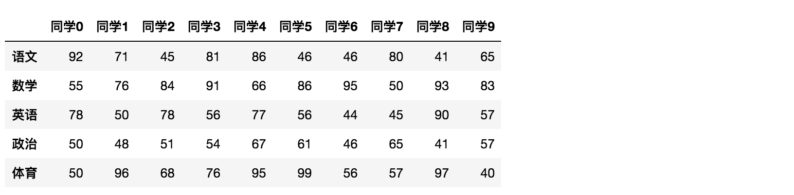

- **head(5)**：显示前5行内容

如果不补充参数，默认5行。填入参数N则显示前N行

``` lang-python
data.head(5)
```


- **tail(5)**:显示后5行内容

如果不补充参数，默认5行。填入参数N则显示后N行

``` lang-python
data.tail(5)
```

##### 2.3 DatatFrame索引的设置

需求：


###### 2.3.1 修改行列索引值

``` lang-python
stu = ["学生_" + str(i) for i in range(score_df.shape[0])]

# 必须整体全部修改
data.index = stu
```

注意：以下修改方式是错误的

``` lang-python
# 错误修改方式
data.index[3] = '学生_3'
```

###### 2.3.2 重设索引

reset_index(drop=False)

- 设置新的下标索引
- drop:默认为False，不删除原来索引，如果为True,删除原来的索引值

``` lang-python
# 重置索引,drop=False
data.reset_index()
```

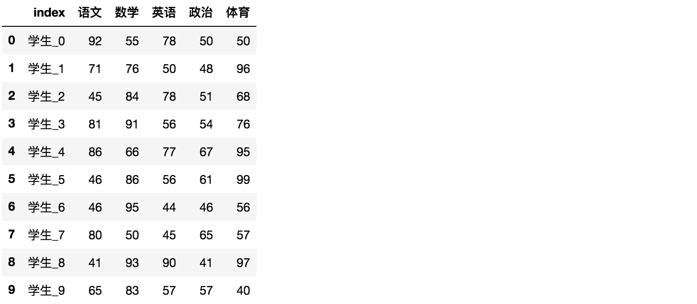

``` lang-python
# 重置索引,drop=True
data.reset_index(drop=True)
```

###### 2.3.3 某列值设置为新的索引

set_index(keys, drop=True)

- **keys** : 列索引名成或者列索引名称的列表
- **drop** : boolean, default True.当做新的索引，删除原来的列

设置新索引案例

1、创建

``` lang-python
df = pd.DataFrame({'month': [1, 4, 7, 10],
                    'year': [2012, 2014, 2013, 2014],
                    'sale':[55, 40, 84, 31]})

   month  sale  year
0  1      55    2012
1  4      40    2014
2  7      84    2013
3  10     31    2014
```

2、以月份设置新的索引

``` lang-python
df.set_index('month')
       sale  year
month
1      55    2012
4      40    2014
7      84    2013
10     31    2014
```

3、设置多个索引，以年和月份

``` lang-python
df = df.set_index(['year', 'month'])
df
            sale
year  month
2012  1     55
2014  4     40
2013  7     84
2014  10    31
```

> 注：通过刚才的设置，这样DataFrame就变成了一个具有MultiIndex的DataFrame。

#### 3.MultiIndex与Panel

##### 3.1 MultiIndex

MultiIndex是三维的数据类型;

多级索引（也称层次化索引）是pandas的重要功能，可以在Series、DataFrame对象上拥有2个以及2个以上的索引。

###### 3.1.1 multiIndex的特性

打印刚才的df的行索引结果

``` lang-python
df.index

MultiIndex(levels=[[2012, 2013, 2014], [1, 4, 7, 10]],
           labels=[[0, 2, 1, 2], [0, 1, 2, 3]],
           names=['year', 'month'])
```

多级或分层索引对象。

index属性

- names:levels的名称

- levels：每个level的元组值

``` lang-python
df.index.names
# FrozenList(['year', 'month'])

df.index.levels
# FrozenList([[1, 2], [1, 4, 7, 10]])
```

###### 3.1.2 multiIndex的创建

``` lang-python
# 构造索引
arrays = [[1, 1, 2, 2], ['red', 'blue', 'red', 'blue']]
mi_index = pd.MultiIndex.from_arrays(arrays, names=('number', 'color'))

# 结果
MultiIndex(levels=[[1, 2], ['blue', 'red']],
           codes=[[0, 0, 1, 1], [1, 0, 1, 0]],
           names=['number', 'color'])
```

``` lang-python
mi_df = pd.DataFrame(np.random.normal(size=(4,4)),index=mi_index)
mi_df
```

结果：

##### 3.2 Panel

###### 3.2.1 panel的创建

*class* `pandas.Panel`(*data=None*, *items=None*, *major_axis=None*, *minor_axis=None*)

- 作用：存储3维数组的Panel类型

- 参数：

  - **data** : ndarray或者dataframe

  - **items** : 索引或类似数组的对象，axis=0

  - **major_axis** : 索引或类似数组的对象，axis=1

  - **minor_axis** : 索引或类似数组的对象，axis=2

``` lang-python
p = pd.Panel(data=np.arange(24).reshape(4,3,2),
                 items=list('ABCD'),
                 major_axis=pd.date_range('20130101', periods=3),
                 minor_axis=['first', 'second'])

# 结果
<class 'pandas.core.panel.Panel'>
Dimensions: 4 (items) x 3 (major_axis) x 2 (minor_axis)
Items axis: A to D
Major_axis axis: 2013-01-01 00:00:00 to 2013-01-03 00:00:00
Minor_axis axis: first to second
```

###### 3.2.2 查看panel数据

    p[:,:,"first"]
    p["B",:,:]

> **注：==Pandas从版本0.20.0开始弃用==：推荐的用于表示3D数据的方法是通过DataFrame上的MultiIndex方法**

#### 4 小结

- pandas的优势【了解】
  - 增强图表可读性
  - 便捷的数据处理能力
  - 读取文件方便
  - 封装了Matplotlib、Numpy的画图和计算
- series【知道】
  - 创建
    - pd.Series(\[\], index=\[\])
    - pd.Series({})
  - 属性
    - 对象.index
    - 对象.values
- DataFrame【掌握】
  - 创建
    - pd.DataFrame(data=None, index=None, columns=None)
  - 属性
    - shape -- 形状
    - index -- 行索引
    - columns -- 列索引
    - values -- 查看值
    - T -- 转置
    - head() -- 查看头部内容
      - tail() -- 查看尾部内容
  - DataFrame索引
    - 修改的时候,需要进行全局修改
    - 对象.reset_index()
    - 对象.set_index(keys)
- MultiIndex与Panel【了解】
  - multiIndex:
    - 类似ndarray中的三维数组
    - 创建：
      - pd.MultiIndex.from_arrays()
    - 属性：
      - 对象.index
  - panel：
    - pd.Panel(data, items, major_axis, minor_axis)
    - panel数据要是想看到,则需要进行索引到dataframe或者series才可以

---

### 4.3 基本数据操作

#### 学习目标

- 记忆DataFrame的形状、行列索引名称获取等基本属性
- 应用Series和DataFrame的索引进行切片获取
- 应用sort_index和sort_values实现索引和值的排序

------------------------------------------------------------------------

为了更好的理解这些基本操作，我们将读取一个真实的股票数据。关于文件操作，后面在介绍，这里只先用一下API

``` lang-python
# 读取文件
data = pd.read_csv("./data/stock_day.csv")

# 删除一些列，让数据更简单些，再去做后面的操作
data = data.drop(["ma5","ma10","ma20","v_ma5","v_ma10","v_ma20"], axis=1)
```

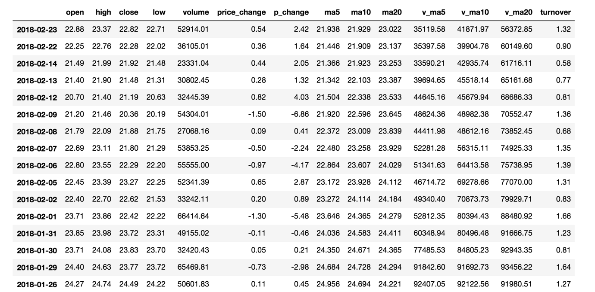

#### 1 索引操作

Numpy当中我们已经讲过使用索引选取序列和切片选择，pandas也支持类似的操作，也可以直接使用列名、行名

称，甚至组合使用。

##### 1.1 **直接使用行列索引**

获取'2018-02-27'这天的'close'的结果

``` lang-python
# 直接使用行列索引名字的方式（先列后行）
data['open']['2018-02-27']
23.53

# 不支持的操作
# 错误
data['2018-02-27']['open']
# 错误
data[:1, :2]
```

##### 1.2 **结合loc、iloc使用索引**

获取从'2018-02-27':'2018-02-22'，'open'的结果

``` lang-python
# 使用loc:只能指定行列索引的名字
data.loc['2018-02-27':'2018-02-22', 'open']

2018-02-27    23.53
2018-02-26    22.80
2018-02-23    22.88
Name: open, dtype: float64

# 使用iloc可以通过索引的下标去获取
# 获取前3天数据,前5列的结果
data.iloc[:3, :5]

            open    high    close    low
2018-02-27    23.53    25.88    24.16    23.53
2018-02-26    22.80    23.78    23.53    22.80
2018-02-23    22.88    23.37    22.82    22.71
```

##### 1.3 **使用ix组合索引**

> Warning:Starting in 0.20.0, the `.ix` indexer is deprecated, in favor of the more strict `.iloc` and `.loc` indexers.

获取行第1天到第4天，\['open', 'close', 'high', 'low'\]这个四个指标的结果

``` lang-python
# 使用ix进行下表和名称组合做引
data.ix[0:4, ['open', 'close', 'high', 'low']]

# 推荐使用loc和iloc来获取的方式
data.loc[data.index[0:4], ['open', 'close', 'high', 'low']]
data.iloc[0:4, data.columns.get_indexer(['open', 'close', 'high', 'low'])]

            open    close    high    low
2018-02-27    23.53    24.16    25.88    23.53
2018-02-26    22.80    23.53    23.78    22.80
2018-02-23    22.88    22.82    23.37    22.71
2018-02-22    22.25    22.28    22.76    22.02
```

#### 2 赋值操作

对DataFrame当中的close列进行重新赋值为1

``` lang-python
# 直接修改原来的值
data['close'] = 1
# 或者
data.close = 1
```

#### 3 排序

排序有两种形式，一种对于索引进行排序，一种对于内容进行排序

##### 3.1 DataFrame排序

- 使用df.sort_values(by=, ascending=)单个键或者多个键进行排序,

<!-- -->

    参数：
    * by：指定排序参考的键
    * ascending:默认升序
        * ascending=False:降序
        * ascending=True:升序

``` lang-python
# 按照开盘价大小进行排序 , 使用ascending指定按照大小排序
data.sort_values(by="open", ascending=True).head()
```

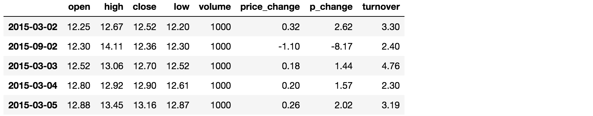

``` lang-python
# 按照多个键进行排序
data.sort_values(by=['open', 'high'])
```

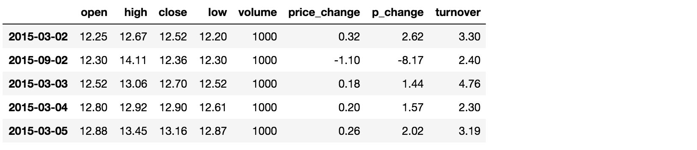

- 使用df.sort_index给索引进行排序

这个股票的日期索引原来是从大到小，现在重新排序，从小到大

``` lang-python
# 对索引进行排序
data.sort_index()
```

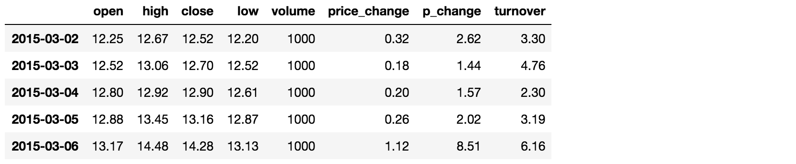

##### 3.2 Series排序

- 使用series.sort_values(ascending=True)进行排序

series排序时，只有一列，不需要参数

``` lang-python
data['p_change'].sort_values(ascending=True).head()

2015-09-01     -10.03
2015-09-14     -10.02
2016-01-11     -10.02
2015-07-15     -10.02
2015-08-26     -10.01
Name: p_change, dtype: float64
```

- 使用series.sort_index()进行排序

与df一致

``` lang-python
# 对索引进行排序
data['p_change'].sort_index().head()

2015-03-02    2.62
2015-03-03    1.44
2015-03-04    1.57
2015-03-05    2.02
2015-03-06    8.51
Name: p_change, dtype: float64
```

#### 4 总结

- 1.索引【掌握】
  - 直接索引 -- 先列后行,是需要通过索引的字符串进行获取
  - loc -- 先行后列,是需要通过索引的字符串进行获取
  - iloc -- 先行后列,是通过下标进行索引
  - ix -- 先行后列, 可以用上面两种方法混合进行索引
- 2.赋值【知道】
  - data\[""\] = \*\*
  - data. **=**
- 3.排序【知道】
  - dataframe
    - 对象.sort_values()
    - 对象.sort_index()
  - series
    - 对象.sort_values()
    - 对象.sort_index()

---

### 4.4 DataFrame运算

#### 学习目标

- 应用add等实现数据间的加、减法运算
- 应用逻辑运算符号实现数据的逻辑筛选
- 应用isin, query实现数据的筛选
- 使用describe完成综合统计
- 使用max, min, mean, std完成统计计算
- 使用idxmin、idxmax完成最大值最小值的索引
- 使用cumsum等实现累计分析
- 应用apply函数实现数据的自定义处理

------------------------------------------------------------------------

#### 1 算术运算

- add(other)

比如进行数学运算加上具体的一个数字

``` lang-python
data['open'].add(1)

2018-02-27    24.53
2018-02-26    23.80
2018-02-23    23.88
2018-02-22    23.25
2018-02-14    22.49
```

- sub(other)'

#### 2 逻辑运算

##### 2.1 逻辑运算符号

- 例如筛选data\["open"\] \> 23的日期数据

``` lang-python
data["open"] > 23

2018-02-27     True
2018-02-26    False
2018-02-23    False
2018-02-22    False
2018-02-14    False
```

``` lang-python
# 逻辑判断的结果可以作为筛选的依据
data[data["open"] > 23].head()
```

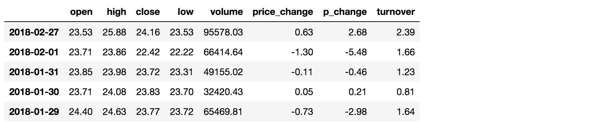

- 完成多个逻辑判断，

``` lang-python
data[(data["open"] > 23) & (data["open"] < 24)].head()
```

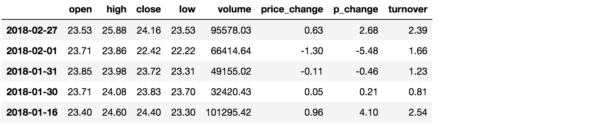

##### 2.2 逻辑运算函数

- query(expr)

<!-- -->

    参数：
    expr:查询字符串

通过query使得刚才的过程更加方便简单

``` lang-python
data.query("open<24 & open>23").head()
```

- isin(values)

例如判断'open'是否为23.53和23.85

``` lang-python
# 可以指定值进行一个判断，从而进行筛选操作
data[data["open"].isin([23.53, 23.85])]
```

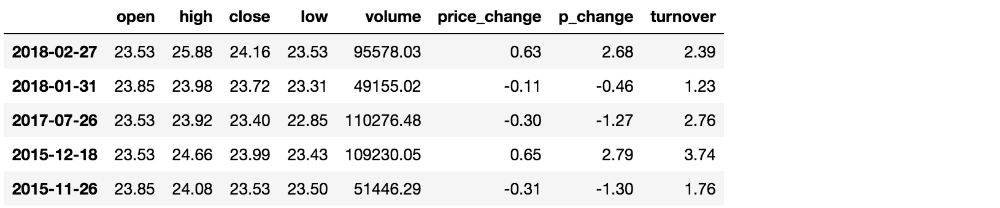

#### 3 统计运算

##### 3.1 describe

综合分析: 能够直接得出很多统计结果,`count`, `mean`, `std`, `min`, `max` 等

``` lang-python
# 计算平均值、标准差、最大值、最小值
data.describe()
```

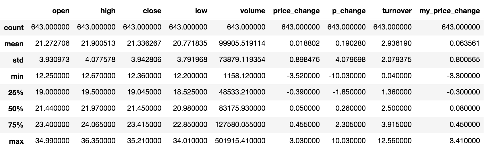

##### 3.2 统计函数

Numpy当中已经详细介绍，在这里我们演示min(最小值), max(最大值), mean(平均值), median(中位数), var(方差), std(标准差),mode(众数)结果:

| 函数     | 作用                                           |
|----------|------------------------------------------------|
| `sum`    | **Sum of values**                              |
| `mean`   | **Mean of values**                             |
| `median` | Arithmetic median of values                    |
| `min`    | **Minimum**                                    |
| `max`    | **Maximum**                                    |
| `count`  | Number of non-NA observations                  |
| `abs`    | Absolute Value                                 |
| `prod`   | Product of values                              |
| `std`    | **Bessel-corrected sample standard deviation** |
| `var`    | **Unbiased variance**                          |
| `idxmax` | compute the index labels with the maximum      |
| `idxmin` | compute the index labels with the minimum      |
| `mode`   | Mode                                           |

**对于单个函数去进行统计的时候，坐标轴还是按照默认列“columns” (axis=0, default)，如果要对行“index” 需要指定(axis=1)**

- max()、min()

``` lang-python
# 使用统计函数：0 代表列求结果， 1 代表行求统计结果
data.max(0)

open                   34.99
high                   36.35
close                  35.21
low                    34.01
volume             501915.41
price_change            3.03
p_change               10.03
turnover               12.56
my_price_change         3.41
dtype: float64
```

- std()、var()

``` lang-python
# 方差
data.var(0)

open               1.545255e+01
high               1.662665e+01
close              1.554572e+01
low                1.437902e+01
volume             5.458124e+09
price_change       8.072595e-01
p_change           1.664394e+01
turnover           4.323800e+00
my_price_change    6.409037e-01
dtype: float64

# 标准差
data.std(0)

open                   3.930973
high                   4.077578
close                  3.942806
low                    3.791968
volume             73879.119354
price_change           0.898476
p_change               4.079698
turnover               2.079375
my_price_change        0.800565
dtype: float64
```

- **median()：中位数**

中位数为将数据从小到大排列，在最中间的那个数为中位数。如果没有中间数，取中间两个数的平均值。

``` lang-python
df = pd.DataFrame({'COL1' : [2,3,4,5,4,2],
                   'COL2' : [0,1,2,3,4,2]})

df.median()

COL1    3.5
COL2    2.0
dtype: float64
```

- idxmax()、idxmin()

``` lang-python
# 求出最大值的位置
data.idxmax(axis=0)

open               2015-06-15
high               2015-06-10
close              2015-06-12
low                2015-06-12
volume             2017-10-26
price_change       2015-06-09
p_change           2015-08-28
turnover           2017-10-26
my_price_change    2015-07-10
dtype: object

# 求出最小值的位置
data.idxmin(axis=0)

open               2015-03-02
high               2015-03-02
close              2015-09-02
low                2015-03-02
volume             2016-07-06
price_change       2015-06-15
p_change           2015-09-01
turnover           2016-07-06
my_price_change    2015-06-15
dtype: object
```

##### 3.3 累计统计函数

| 函数      | 作用                        |
|-----------|-----------------------------|
| `cumsum`  | **计算前1/2/3/…/n个数的和** |
| `cummax`  | 计算前1/2/3/…/n个数的最大值 |
| `cummin`  | 计算前1/2/3/…/n个数的最小值 |
| `cumprod` | 计算前1/2/3/…/n个数的积     |

**那么这些累计统计函数怎么用？**

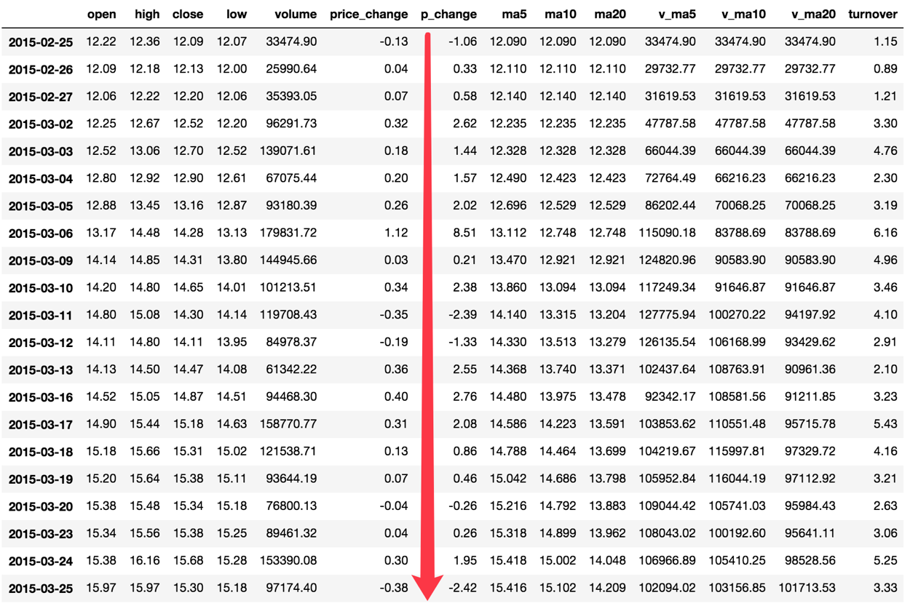

以上这些函数可以对series和dataframe操作

这里我们按照时间的从前往后来进行累计

- 排序

``` lang-python
# 排序之后，进行累计求和
data = data.sort_index()
```

- 对p_change进行求和

``` lang-python
stock_rise = data['p_change']
# plot方法集成了前面直方图、条形图、饼图、折线图
stock_rise.cumsum()

2015-03-02      2.62
2015-03-03      4.06
2015-03-04      5.63
2015-03-05      7.65
2015-03-06     16.16
2015-03-09     16.37
2015-03-10     18.75
2015-03-11     16.36
2015-03-12     15.03
2015-03-13     17.58
2015-03-16     20.34
2015-03-17     22.42
2015-03-18     23.28
2015-03-19     23.74
2015-03-20     23.48
2015-03-23     23.74
```

**那么如何让这个连续求和的结果更好的显示呢？**

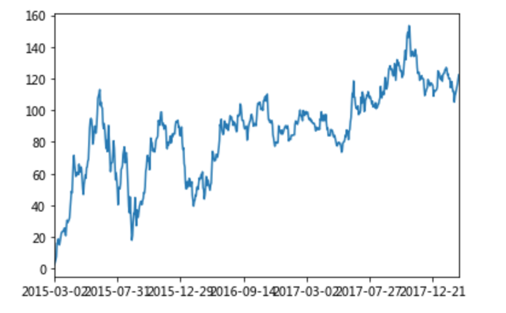

如果要使用plot函数，需要导入matplotlib.

``` lang-python
import matplotlib.pyplot as plt
# plot显示图形
stock_rise.cumsum().plot()
# 需要调用show，才能显示出结果
plt.show()
```

> 关于plot，稍后会介绍API的选择

#### 4 自定义运算

- apply(func, axis=0)
  - func:自定义函数
  - axis=0:默认是列，axis=1为行进行运算
- 定义一个对列，最大值-最小值的函数

``` lang-python
data[['open', 'close']].apply(lambda x: x.max() - x.min(), axis=0)

open     22.74
close    22.85
dtype: float64
```

#### 5 小结

- 算术运算【知道】
- 逻辑运算【知道】
  - 1.逻辑运算符号
  - 2.逻辑运算函数
    - 对象.query()
    - 对象.isin()
- 统计运算【知道】
  - 1.对象.describe()
  - 2.统计函数
  - 3.累积统计函数
- 自定义运算【知道】
  - apply(func, axis=0)

---

### 4.5 Pandas画图

#### 学习目标

- 了解DataFrame的画图函数
- 了解Series的画图函数

------------------------------------------------------------------------

#### 1 pandas.DataFrame.plot

`DataFrame.plot`(*kind='line'*)

kind : str，需要绘制图形的种类

------------------------------------------------------------------------

- **‘line’ : line plot (default)**

- ‘bar’ : vertical bar plot

- ‘barh’ : horizontal bar plot
  - 关于“barh”的解释：
  - <a href="http://pandas.pydata.org/pandas-docs/stable/reference/api/pandas.DataFrame.plot.barh.html" target="_blank">http://pandas.pydata.org/pandas-docs/stable/reference/api/pandas.DataFrame.plot.barh.html</a>

- ‘hist’ : histogram

- ‘pie’ : pie plot

- ‘scatter’ : scatter plot

> 更多细节：<a href="https://pandas.pydata.org/pandas-docs/stable/generated/pandas.DataFrame.plot.html?highlight=plot#pandas.DataFrame.plot" target="_blank">https://pandas.pydata.org/pandas-docs/stable/generated/pandas.DataFrame.plot.html?highlight=plot#pandas.DataFrame.plot</a>

#### 2 pandas.Series.plot

> 更多细节：<a href="https://pandas.pydata.org/pandas-docs/stable/generated/pandas.Series.plot.html?highlight=plot#pandas.Series.plot" target="_blank">https://pandas.pydata.org/pandas-docs/stable/generated/pandas.Series.plot.html?highlight=plot#pandas.Series.plot</a>

---

### 4.6 文件读取与存储

#### 学习目标

- 了解Pandas的几种文件读取存储操作
- 应用CSV方式、HDF方式和json方式实现文件的读取和存储

------------------------------------------------------------------------

我们的数据大部分存在于文件当中，所以pandas会支持复杂的IO操作，pandas的API支持众多的文件格式，如CSV、SQL、XLS、JSON、HDF5。

> 注：最常用的HDF5和CSV文件

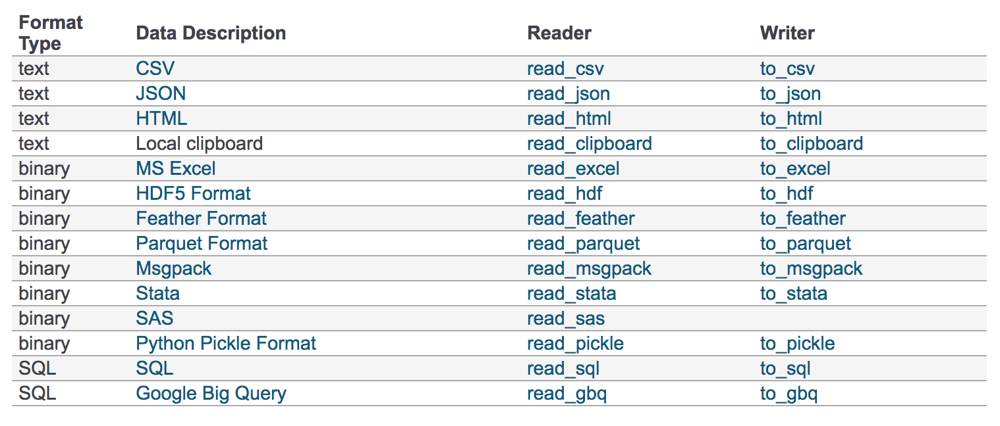

#### 1 CSV

##### 1.1 read_csv

pandas.read_csv(filepath_or_buffer, sep =',', usecols )

------------------------------------------------------------------------

参数：

- filepath_or_buffer:文件路径
- sep :分隔符，默认用","隔开
- usecols:指定读取的列名，列表形式

------------------------------------------------------------------------

举例：读取之前的股票的数据

``` lang-python
# 读取文件,并且指定只获取'open', 'close'指标
data = pd.read_csv("./data/stock_day.csv", usecols=['open', 'close'])

            open    close
2018-02-27    23.53    24.16
2018-02-26    22.80    23.53
2018-02-23    22.88    22.82
2018-02-22    22.25    22.28
2018-02-14    21.49    21.92
```

##### 1.2 to_csv

``` lang-python
DataFrame.to_csv(path_or_buf=None, sep=', ’, columns=None, header=True, index=True, mode='w', encoding=None)
```

------------------------------------------------------------------------

参数：

- path_or_buf :文件路径
- sep :分隔符，默认用","隔开
- columns :选择需要的列索引
- header :boolean or list of string, default True,是否写进列索引值
- index:是否写进行索引
- mode:'w'：重写, 'a' 追加

------------------------------------------------------------------------

举例：保存读取出来的股票数据

- 保存'open'列的数据，然后读取查看结果

``` lang-python
# 选取10行数据保存,便于观察数据
data[:10].to_csv("./data/test.csv", columns=['open'])
```

``` lang-python
# 读取，查看结果
pd.read_csv("./data/test.csv")

     Unnamed: 0    open
0    2018-02-27    23.53
1    2018-02-26    22.80
2    2018-02-23    22.88
3    2018-02-22    22.25
4    2018-02-14    21.49
5    2018-02-13    21.40
6    2018-02-12    20.70
7    2018-02-09    21.20
8    2018-02-08    21.79
9    2018-02-07    22.69
```

会发现将索引存入到文件当中，变成单独的一列数据。如果需要删除，可以指定index参数,删除原来的文件，重新保存一次。

``` lang-python
# index:存储不会讲索引值变成一列数据
data[:10].to_csv("./data/test.csv", columns=['open'], index=False)
```

#### 2 HDF5

##### 2.1 read_hdf与to_hdf

**HDF5文件的读取和存储需要指定一个键，值为要存储的DataFrame**

``` lang-python
pandas.read_hdf(path_or_buf，key =None，** kwargs)

# 从h5文件当中读取数据
```

------------------------------------------------------------------------

参数：

- path_or_buffer:文件路径
- key:读取的键
- return:Theselected object

``` lang-python
DataFrame.to_hdf(path_or_buf, *key*, **\*kwargs*)
```

##### 2.2 案例

- 读取文件

``` lang-python
day_close = pd.read_hdf("./data/day_close.h5")
```

如果读取的时候出现以下错误

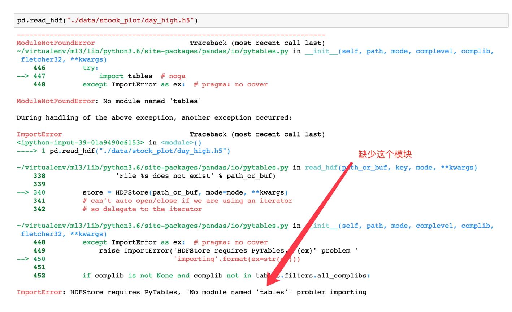

需要安装安装tables模块避免不能读取HDF5文件

``` lang-python
pip install tables
```

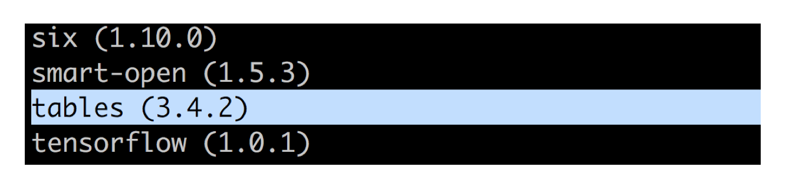

- 存储文件

``` lang-python
day_close.to_hdf("./data/test.h5", key="day_close")
```

再次读取的时候, 需要指定键的名字

``` lang-python
new_close = pd.read_hdf("./data/test.h5", key="day_close")
```

**注意：优先选择使用HDF5文件存储**

- HDF5在存储的时候支持压缩，**使用的方式是blosc，这个是速度最快**的也是pandas默认支持的
- 使用压缩可以**提磁盘利用率，节省空间**
- HDF5还是跨平台的，可以轻松迁移到hadoop 上面

#### 3 JSON

JSON是我们常用的一种数据交换格式，前面在前后端的交互经常用到，也会在存储的时候选择这种格式。所以我们需要知道Pandas如何进行读取和存储JSON格式。

##### 3.1 read_json

``` lang-python
pandas.read_json(path_or_buf=None, orient=None, typ='frame', lines=False)
# 将JSON格式准换成默认的Pandas DataFrame格式
```

------------------------------------------------------------------------

参数：

- orient : string,Indication of expected JSON string format.
  - 'split' : dict like {index -\> \[index\], columns -\> \[columns\], data -\> \[values\]}
    - split 将索引总结到索引，列名到列名，数据到数据。将三部分都分开了
  - **'records' : list like \[{column -\> value}, ... , {column -\> value}\]**
    - records 以`columns：values`的形式输出
  - 'index' : dict like {index -\> {column -\> value}}
    - index 以`index：{columns：values}...`的形式输出
  - **'columns' : dict like {column -\> {index -\> value}}**,默认该格式
    - colums 以`columns:{index:values}`的形式输出
  - 'values' : just the values array
    - values 直接输出值
- lines : boolean, default False
  - 按照每行读取json对象
- typ : default ‘frame’， 指定转换成的对象类型series或者dataframe

------------------------------------------------------------------------

read_josn 案例：

- 数据介绍

这里使用一个新闻标题讽刺数据集，格式为json。`is_sarcastic`：1讽刺的，否则为0；`headline`：新闻报道的标题；`article_link`：链接到原始新闻文章。存储格式为：

``` lang-json
{"article_link": "https://www.huffingtonpost.com/entry/versace-black-code_us_5861fbefe4b0de3a08f600d5", "headline": "former versace store clerk sues over secret 'black code' for minority shoppers", "is_sarcastic": 0}
{"article_link": "https://www.huffingtonpost.com/entry/roseanne-revival-review_us_5ab3a497e4b054d118e04365", "headline": "the 'roseanne' revival catches up to our thorny political mood, for better and worse", "is_sarcastic": 0}
```

- 读取

orient指定存储的json格式，lines指定按照行去变成一个样本

``` lang-python
json_read = pd.read_json("./data/Sarcasm_Headlines_Dataset.json", orient="records", lines=True)
```

结果为：

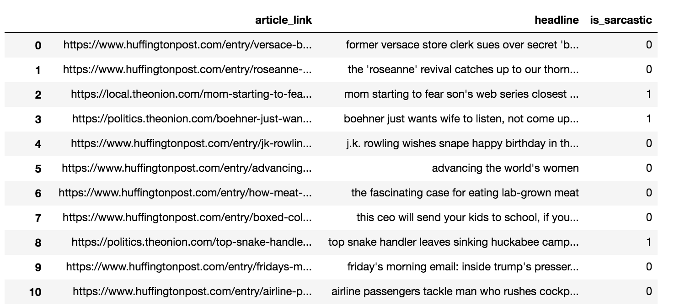

##### 3.2 to_json

``` lang-python
DataFrame.to_json(*path_or_buf=None*, *orient=None*, *lines=False*)
```

------------------------------------------------------------------------

参数：

- 将Pandas 对象存储为json格式
- *path_or_buf=None*：文件地址
- orient:存储的json形式，{‘split’,’records’,’index’,’columns’,’values’}
- lines:一个对象存储为一行

------------------------------------------------------------------------

案例：

- 存储文件

``` lang-python
json_read.to_json("./data/test.json", orient='records')
```

结果

    [{"article_link":"https:\/\/www.huffingtonpost.com\/entry\/versace-black-code_us_5861fbefe4b0de3a08f600d5","headline":"former versace store clerk sues over secret 'black code' for minority shoppers","is_sarcastic":0},{"article_link":"https:\/\/www.huffingtonpost.com\/entry\/roseanne-revival-review_us_5ab3a497e4b054d118e04365","headline":"the 'roseanne' revival catches up to our thorny political mood, for better and worse","is_sarcastic":0},{"article_link":"https:\/\/local.theonion.com\/mom-starting-to-fear-son-s-web-series-closest-thing-she-1819576697","headline":"mom starting to fear son's web series closest thing she will have to grandchild","is_sarcastic":1},{"article_link":"https:\/\/politics.theonion.com\/boehner-just-wants-wife-to-listen-not-come-up-with-alt-1819574302","headline":"boehner just wants wife to listen, not come up with alternative debt-reduction ideas","is_sarcastic":1},{"article_link":"https:\/\/www.huffingtonpost.com\/entry\/jk-rowling-wishes-snape-happy-birthday_us_569117c4e4b0cad15e64fdcb","headline":"j.k. rowling wishes snape happy birthday in the most magical way","is_sarcastic":0},{"article_link":"https:\/\/www.huffingtonpost.com\/entry\/advancing-the-worlds-women_b_6810038.html","headline":"advancing the world's women","is_sarcastic":0},....]

- 修改lines参数为True

``` lang-python
json_read.to_json("./data/test.json", orient='records', lines=True)
```

结果

    {"article_link":"https:\/\/www.huffingtonpost.com\/entry\/versace-black-code_us_5861fbefe4b0de3a08f600d5","headline":"former versace store clerk sues over secret 'black code' for minority shoppers","is_sarcastic":0}
    {"article_link":"https:\/\/www.huffingtonpost.com\/entry\/roseanne-revival-review_us_5ab3a497e4b054d118e04365","headline":"the 'roseanne' revival catches up to our thorny political mood, for better and worse","is_sarcastic":0}
    {"article_link":"https:\/\/local.theonion.com\/mom-starting-to-fear-son-s-web-series-closest-thing-she-1819576697","headline":"mom starting to fear son's web series closest thing she will have to grandchild","is_sarcastic":1}
    {"article_link":"https:\/\/politics.theonion.com\/boehner-just-wants-wife-to-listen-not-come-up-with-alt-1819574302","headline":"boehner just wants wife to listen, not come up with alternative debt-reduction ideas","is_sarcastic":1}
    {"article_link":"https:\/\/www.huffingtonpost.com\/entry\/jk-rowling-wishes-snape-happy-birthday_us_569117c4e4b0cad15e64fdcb","headline":"j.k. rowling wishes snape happy birthday in the most magical way","is_sarcastic":0}...

------------------------------------------------------------------------

#### 4 小结

- pandas的CSV、HDF5、JSON文件的读取【知道】
  - 对象.read\_\*\*()
  - 对象.to\_\*\*()

---

### 4.7 高级处理-缺失值处理

#### 学习目标

- 应用isnull判断是否有缺失数据NaN
- 应用fillna实现缺失值的填充
- 应用dropna实现缺失值的删除
- 应用replace实现数据的替换

------------------------------------------------------------------------


#### 1 如何处理nan

- 获取缺失值的标记方式(NaN或者其他标记方式)
- 如果缺失值的标记方式是NaN
  - 判断数据中是否包含NaN：
    - pd.isnull(df),
    - pd.notnull(df)
  - 存在缺失值nan:
    - 1、删除存在缺失值的:dropna(axis='rows')
      - 注：不会修改原数据，需要接受返回值
    - 2、替换缺失值:fillna(value, inplace=True)
      - value:替换成的值
      - inplace:True:会修改原数据，False:不替换修改原数据，生成新的对象
- 如果缺失值没有使用NaN标记，比如使用"？"
  - 先替换‘?’为np.nan，然后继续处理

#### 2 数据的缺失值处理举例

- 电影数据文件获取

``` lang-python
# 读取电影数据
movie = pd.read_csv("./data/IMDB-Movie-Data.csv")
```

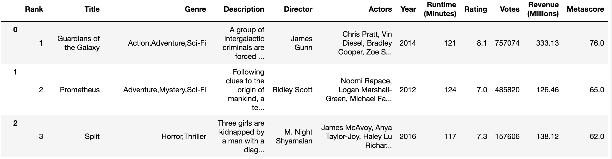

##### 2.1 判断缺失值是否存在

- pd.notnull()

<!-- -->

    pd.notnull(movie)

``` lang-python
Rank    Title    Genre    Description    Director    Actors    Year    Runtime (Minutes)    Rating    Votes    Revenue (Millions)    Metascore
0    True    True    True    True    True    True    True    True    True    True    True    True
1    True    True    True    True    True    True    True    True    True    True    True    True
2    True    True    True    True    True    True    True    True    True    True    True    True
3    True    True    True    True    True    True    True    True    True    True    True    True
4    True    True    True    True    True    True    True    True    True    True    True    True
5    True    True    True    True    True    True    True    True    True    True    True    True
6    True    True    True    True    True    True    True    True    True    True    True    True
7    True    True    True    True    True    True    True    True    True    True    False    True
```

``` lang-python
np.all(pd.notnull(movie))
```

- pd.isnull()

##### 2.2 缺失值是nan标记处理方式

- 1、删除

pandas删除缺失值，使用dropna的前提是，缺失值的类型必须是np.nan

``` lang-python
# 不修改原数据
movie.dropna()

# 可以定义新的变量接受或者用原来的变量名
data = movie.dropna()
```

    * 2、替换缺失值

``` lang-python
# 替换存在缺失值的样本的两列
# 替换填充平均值，中位数
# movie['Revenue (Millions)'].fillna(movie['Revenue (Millions)'].mean(), inplace=True)
```

替换所有缺失值：

``` lang-python
for i in movie.columns:
    if np.all(pd.notnull(movie[i])) == False:
        print(i)
        movie[i].fillna(movie[i].mean(), inplace=True)
```

##### 2.3 缺失值不是nan标记的处理方式

数据是这样的：

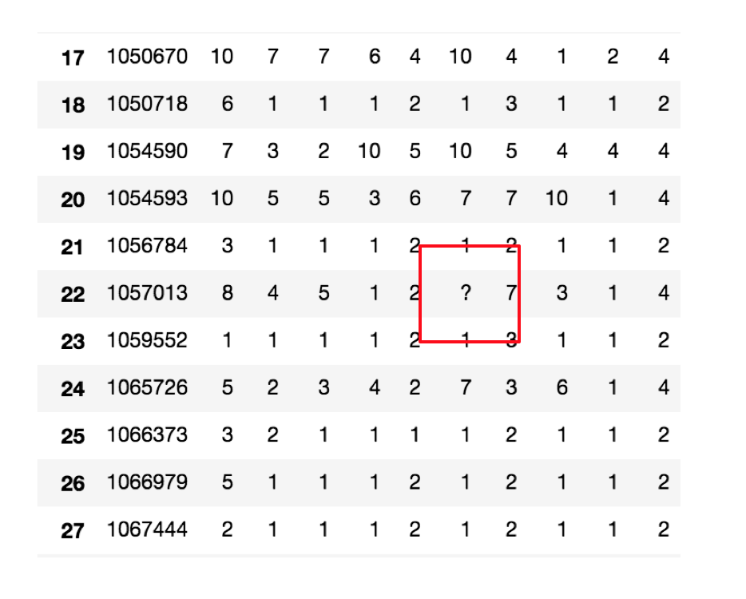

``` lang-python
wis = pd.read_csv("https://archive.ics.uci.edu/ml/machine-learning-databases/breast-cancer-wisconsin/breast-cancer-wisconsin.data")
```

以上数据在读取时，可能会报如下错误：

    URLError: <urlopen error [SSL: CERTIFICATE_VERIFY_FAILED] certificate verify failed (_ssl.c:833)>

解决办法：

``` lang-python
# 全局取消证书验证
import ssl
ssl._create_default_https_context = ssl._create_unverified_context
```

**处理思路分析：**

1、先替换‘?’为np.nan

- df.replace(to_replace=, value=)
  - to_replace:替换前的值
  - value:替换后的值

``` lang-python
# 把一些其它值标记的缺失值，替换成np.nan
wis = wis.replace(to_replace='?', value=np.nan)
```

2、在进行缺失值的处理

``` lang-python
# 删除
wis = wis.dropna()
```

#### 3 小结

- isnull、notnull判断是否存在缺失值【知道】
  - np.any(pd.isnull(movie)) \# 里面如果有一个缺失值,就返回True
  - np.all(pd.notnull(movie)) \# 里面如果有一个缺失值,就返回False
- dropna删除np.nan标记的缺失值【知道】
  - movie.dropna()
- fillna填充缺失值【知道】
  - movie\[i\].fillna(value=movie\[i\].mean(), inplace=True)
- replace替换具体某些值【知道】
  - wis.replace(to_replace="?", value=np.NaN)

---

### 4.8 高级处理-数据离散化

#### 学习目标

- 应用cut、qcut实现数据的区间分组
- 应用get_dummies实现数据的one-hot编码

------------------------------------------------------------------------

#### 1 为什么要离散化

连续属性离散化的目的是为了简化数据结构，**数据离散化技术可以用来减少给定连续属性值的个数**。离散化方法经常作为数据挖掘的工具。

#### 2 什么是数据的离散化

**连续属性的离散化就是在连续属性的值域上，将值域划分为若干个离散的区间，最后用不同的符号或整数** **值代表落在每个子区间中的属性值。**

离散化有很多种方法，这使用一种最简单的方式去操作

- 原始人的身高数据：165，174，160，180，159，163，192，184
- 假设按照身高分几个区间段：150~165, 165~180,180~195

这样我们将数据分到了三个区间段，我可以对应的标记为矮、中、高三个类别，最终要处理成一个"哑变量"矩阵

#### 3 股票的涨跌幅离散化

我们对股票每日的"p_change"进行离散化

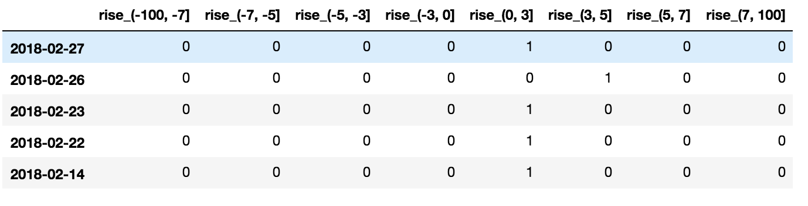

##### 3.1 读取股票的数据

先读取股票的数据，筛选出p_change数据

``` lang-python
data = pd.read_csv("./data/stock_day.csv")
p_change= data['p_change']
```

##### 3.2 将股票涨跌幅数据进行分组

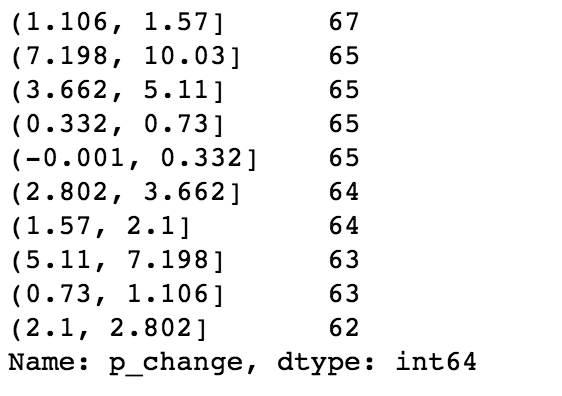

使用的工具：

- pd.qcut(data, q)：
  - 对数据进行分组将数据分组，一般会与value_counts搭配使用，统计每组的个数
- series.value_counts()：统计分组次数

``` lang-python
# 自行分组
qcut = pd.qcut(p_change, 10)
# 计算分到每个组数据个数
qcut.value_counts()
```

自定义区间分组：

- pd.cut(data, bins)

``` lang-python
# 自己指定分组区间
bins = [-100, -7, -5, -3, 0, 3, 5, 7, 100]
p_counts = pd.cut(p_change, bins)
```

##### 3.3 分组数据变成one-hot编码

- **什么是one-hot编码**

把每个类别生成一个布尔列，这些列中只有一列可以为这个样本取值为1.其又被称为独热编码。

把下图中左边的表格转化为使用右边形式进行表示：

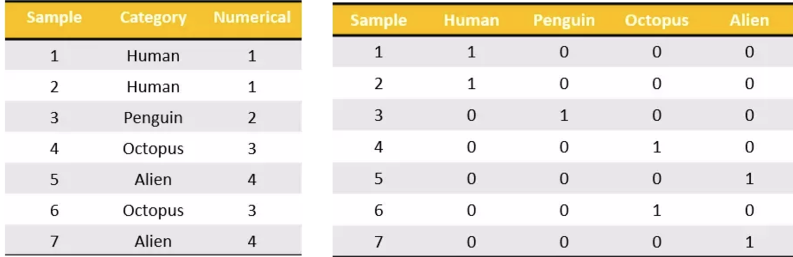

- pandas.get_dummies(*data*, *prefix=None*)

  - data:array-like, Series, or DataFrame

  - prefix:分组名字

``` lang-python
# 得出one-hot编码矩阵
dummies = pd.get_dummies(p_counts, prefix="rise")
```


#### 4 小结

- 数据离散化【知道】
  - 可以用来减少给定连续属性值的个数
  - 在连续属性的值域上，将值域划分为若干个离散的区间，最后用不同的符号或整数值代表落在每个子区间中的属性值。
- qcut、cut实现数据分组【知道】
  - qcut:大致分为相同的几组
  - cut:自定义分组区间
- get_dummies实现哑变量矩阵【知道】

---

### 4.9 高级处理-合并

#### 学习目标

- 应用pd.concat实现数据的合并
- 应用pd.merge实现数据的合并

------------------------------------------------------------------------

如果你的数据由多张表组成，那么有时候需要将不同的内容合并在一起分析

#### 1 pd.concat实现数据合并

- pd.concat(\[data1, data2\], axis=1)
  - 按照行或列进行合并,axis=0为列索引，axis=1为行索引

比如我们将刚才处理好的one-hot编码与原数据合并

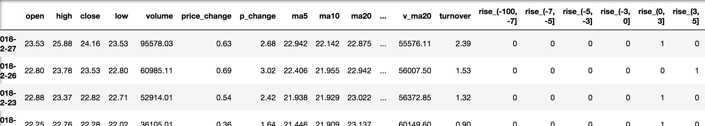

``` lang-python
# 按照行索引进行
pd.concat([data, dummies], axis=1)
```

#### 2 pd.merge

##### 2.1 api介绍

- pd.merge(left, right, how='inner', on=None)
  - 可以指定按照两组数据的共同键值对合并或者左右各自
  - `left`: DataFrame
  - `right`: 另一个DataFrame
  - `on`: 指定的共同键
  - how:按照什么方式连接

| Merge method | SQL Join Name      | Description                               |
|--------------|--------------------|-------------------------------------------|
| `left`       | `LEFT OUTER JOIN`  | Use keys from left frame only             |
| `right`      | `RIGHT OUTER JOIN` | Use keys from right frame only            |
| `outer`      | `FULL OUTER JOIN`  | Use union of keys from both frames        |
| `inner`      | `INNER JOIN`       | Use intersection of keys from both frames |

##### 2.2 pd.merge合并案例

    left = pd.DataFrame({'key1': ['K0', 'K0', 'K1', 'K2'],
                            'key2': ['K0', 'K1', 'K0', 'K1'],
                            'A': ['A0', 'A1', 'A2', 'A3'],
                            'B': ['B0', 'B1', 'B2', 'B3']})

    right = pd.DataFrame({'key1': ['K0', 'K1', 'K1', 'K2'],
                            'key2': ['K0', 'K0', 'K0', 'K0'],
                            'C': ['C0', 'C1', 'C2', 'C3'],
                            'D': ['D0', 'D1', 'D2', 'D3']})

    # 默认内连接
    result = pd.merge(left, right, on=['key1', 'key2'])

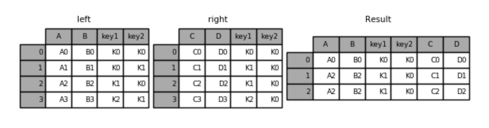

- 左连接

``` lang-python
result = pd.merge(left, right, how='left', on=['key1', 'key2'])
```

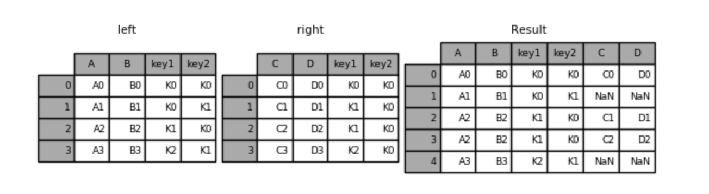

- 右连接

``` lang-python
result = pd.merge(left, right, how='right', on=['key1', 'key2'])
```

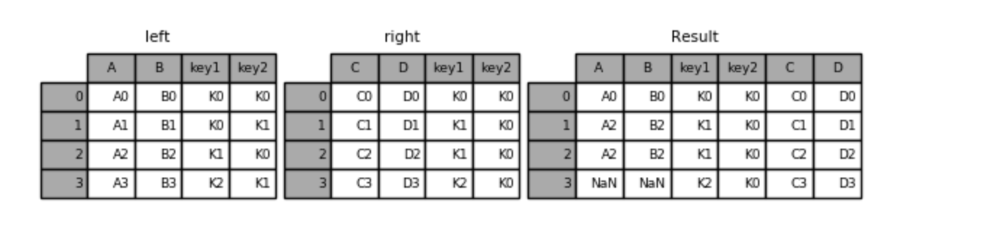

- 外链接

``` lang-python
result = pd.merge(left, right, how='outer', on=['key1', 'key2'])
```

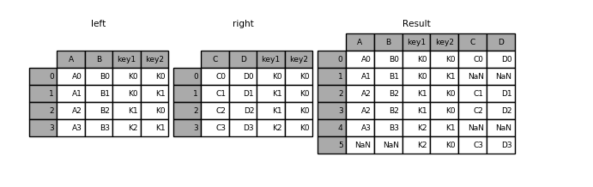

#### 3 总结

- pd.concat(\[数据1, 数据2\], axis=\*\*)【知道】
- pd.merge(left, right, how=, on=)【知道】
  - how -- 以何种方式连接
  - on -- 连接的键的依据是哪几个

---

### 4.10 高级处理-交叉表与透视表

#### 学习目标

- 应用crosstab和pivot_table实现交叉表与透视表

------------------------------------------------------------------------

#### 1 交叉表与透视表什么作用

**探究股票的涨跌与星期几有关？**

**以下图当中表示，week代表星期几，1,0代表这一天股票的涨跌幅是好还是坏，里面的数据代表比例**

**可以理解为所有时间为星期一等等的数据当中涨跌幅好坏的比例**

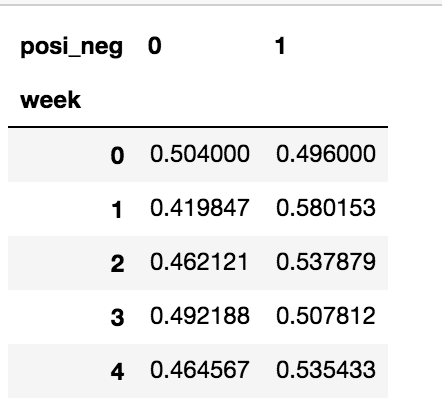

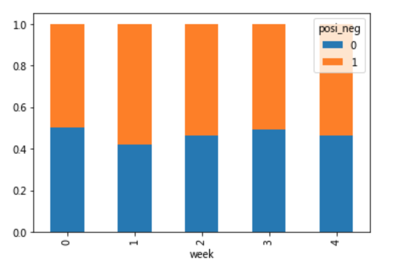

- 交叉表：**交叉表用于计算一列数据对于另外一列数据的分组个数(用于统计分组频率的特殊透视表)**
  - pd.crosstab(value1, value2)
- 透视表：**透视表是将原有的DataFrame的列分别作为行索引和列索引，然后对指定的列应用聚集函数**
  - data.pivot_table(）
- - DataFrame.pivot_table(\[\], index=\[\])

#### 2 案例分析

##### 2.1 数据准备

- 准备两列数据，星期数据以及涨跌幅是好是坏数据
- 进行交叉表计算

``` lang-python
# 寻找星期几跟股票张得的关系
# 1、先把对应的日期找到星期几
date = pd.to_datetime(data.index).weekday
data['week'] = date

# 2、假如把p_change按照大小去分个类0为界限
data['posi_neg'] = np.where(data['p_change'] > 0, 1, 0)

# 通过交叉表找寻两列数据的关系
count = pd.crosstab(data['week'], data['posi_neg'])
```

但是我们看到count只是每个星期日子的好坏天数，并没有得到比例，该怎么去做？

- 对于每个星期一等的总天数求和，运用除法运算求出比例

``` lang-python
# 算数运算，先求和
sum = count.sum(axis=1).astype(np.float32)

# 进行相除操作，得出比例
pro = count.div(sum, axis=0)
```

##### 2.2 查看效果

使用plot画出这个比例，使用stacked的柱状图

``` lang-python
pro.plot(kind='bar', stacked=True)
plt.show()
```

##### 2.3 使用pivot_table实现

使用透视表，刚才的过程更加简单

``` lang-python
# 通过透视表，将整个过程变成更简单一些
data.pivot_table(['posi_neg'], index='week')
```

#### 3 小结

- 交叉表与透视表的作用【知道】
  - 交叉表：计算一列数据对于另外一列数据的分组个数
  - 透视表：指定某一列对另一列的关系

---

### 4.11 高级处理-分组与聚合

#### 学习目标

- 应用groupby和聚合函数实现数据的分组与聚合

------------------------------------------------------------------------

**分组与聚合通常是分析数据的一种方式，通常与一些统计函数一起使用，查看数据的分组情况**

想一想其实刚才的交叉表与透视表也有分组的功能，所以算是分组的一种形式，只不过他们主要是计算次数或者计算比例！！看其中的效果：

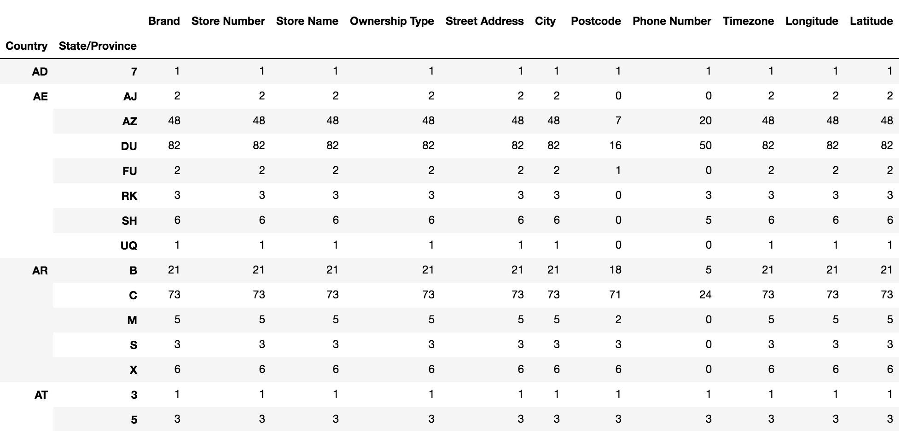

#### 1 什么分组与聚合

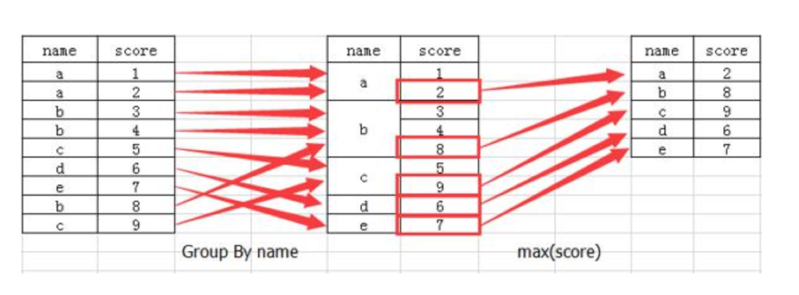

#### 2 分组API

- DataFrame.groupby(key, as_index=False)
  - key:分组的列数据，可以多个
- 案例:不同颜色的不同笔的价格数据

``` lang-python
col =pd.DataFrame({'color': ['white','red','green','red','green'], 'object': ['pen','pencil','pencil','ashtray','pen'],'price1':[5.56,4.20,1.30,0.56,2.75],'price2':[4.75,4.12,1.60,0.75,3.15]})

color    object    price1    price2
0    white    pen    5.56    4.75
1    red    pencil    4.20    4.12
2    green    pencil    1.30    1.60
3    red    ashtray    0.56    0.75
4    green    pen    2.75    3.15
```

- 进行分组，对颜色分组，price进行聚合

``` lang-python
# 分组，求平均值
col.groupby(['color'])['price1'].mean()
col['price1'].groupby(col['color']).mean()

color
green    2.025
red      2.380
white    5.560
Name: price1, dtype: float64

# 分组，数据的结构不变
col.groupby(['color'], as_index=False)['price1'].mean()

color    price1
0    green    2.025
1    red    2.380
2    white    5.560
```

#### 3 星巴克零售店铺数据

现在我们有一组关于全球星巴克店铺的统计数据，如果我想知道美国的星巴克数量和中国的哪个多，或者我想知道中国每个省份星巴克的数量的情况，那么应该怎么办？

> 数据来源：<a href="https://www.kaggle.com/starbucks/store-locations/data" target="_blank">https://www.kaggle.com/starbucks/store-locations/data</a>

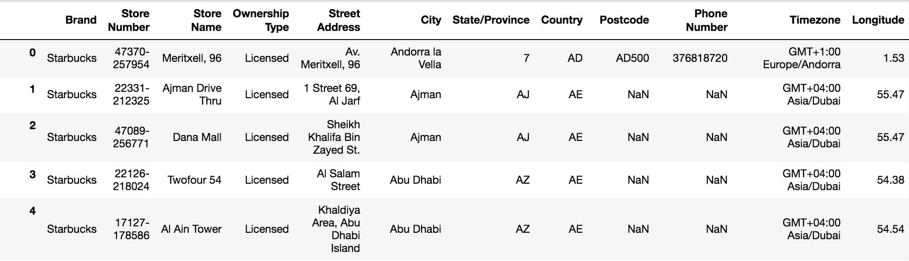

##### 3.1 数据获取

从文件中读取星巴克店铺数据

``` lang-python
# 导入星巴克店的数据
starbucks = pd.read_csv("./data/starbucks/directory.csv")
```

##### 3.2 进行分组聚合

``` lang-python
# 按照国家分组，求出每个国家的星巴克零售店数量
count = starbucks.groupby(['Country']).count()
```

**画图显示结果**

``` lang-python
count['Brand'].plot(kind='bar', figsize=(20, 8))
plt.show()
```

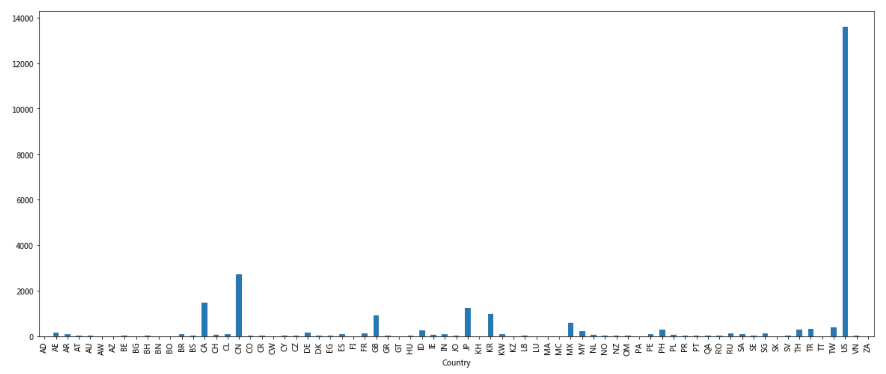

假设我们加入省市一起进行分组

``` lang-python
# 设置多个索引，set_index()
starbucks.groupby(['Country', 'State/Province']).count()
```

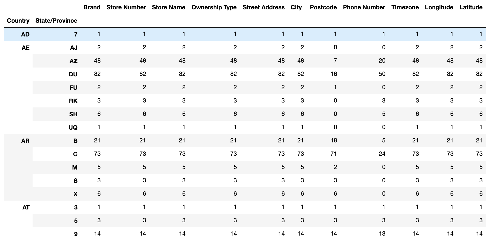

**仔细观察这个结构，与我们前面讲的哪个结构类似？？**

与前面的MultiIndex结构类似

#### 4 小结

- groupby进行数据的分组【知道】
  - pandas中，抛开聚合谈分组，无意义

---

### 4.12 案例

#### 学习目标

- 通过电影数据联系，熟悉pandas基本数据处理思路

------------------------------------------------------------------------

#### 1 需求

现在我们有一组从2006年到2016年1000部最流行的电影数据

数据来源：<a href="https://www.kaggle.com/damianpanek/sunday-eda/data" target="_blank">https://www.kaggle.com/damianpanek/sunday-eda/data</a>

- 问题1：我们想知道这些电影数据中评分的平均分，导演的人数等信息，我们应该怎么获取？
- 问题2：对于这一组电影数据，如果我们想rating，runtime的分布情况，应该如何呈现数据？
- 问题3：对于这一组电影数据，如果我们希望统计电影分类(genre)的情况，应该如何处理数据？

#### 2 实现

首先获取导入包，获取数据

    %matplotlib inline
    import pandas  as pd
    import numpy as np
    from matplotlib import pyplot as plt

``` lang-python
#文件的路径
path = "./data/IMDB-Movie-Data.csv"
#读取文件
df = pd.read_csv(path)
```

##### 2.1 问题一解决方案

**我们想知道这些电影数据中评分的平均分，导演的人数等信息，我们应该怎么获取？**

- 得出评分的平均分

使用mean函数

``` lang-python
df["Rating"].mean()
```

- 得出导演人数信息

求出唯一值，然后进行形状获取

``` lang-python
## 导演的人数
# df["Director"].unique().shape[0]
np.unique(df["Director"]).shape[0]

644
```

##### 2.2 问题二解决方案

**对于这一组电影数据，如果我们想Rating，Runtime (Minutes)的分布情况，应该如何呈现数据？**

- 直接呈现，以直方图的形式

选择分数列数据，进行plot

``` lang-python
df["Rating"].plot(kind='hist',figsize=(20,8))
```

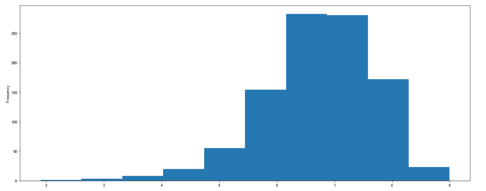

- Rating进行分布展示

进行绘制直方图

``` lang-python
plt.figure(figsize=(20,8),dpi=80)
plt.hist(df["Rating"].values,bins=20)
plt.show()
```

修改刻度的间隔

``` lang-python
# 求出最大最小值
max_ = df["Rating"].max()
min_ = df["Rating"].min()

# 生成刻度列表
t1 = np.linspace(min_,max_,num=21)

# [ 1.9    2.255  2.61   2.965  3.32   3.675  4.03   4.385  4.74   5.095  5.45   5.805  6.16   6.515  6.87   7.225  7.58   7.935  8.29   8.645  9.   ]

# 修改刻度
plt.xticks(t1)

# 添加网格
plt.grid()
```

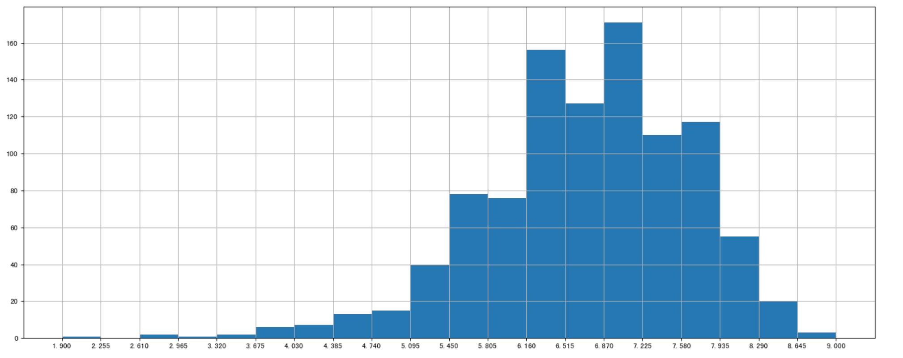

- Runtime (Minutes)进行分布展示

进行绘制直方图

``` lang-python
plt.figure(figsize=(20,8),dpi=80)
plt.hist(df["Runtime (Minutes)"].values,bins=20)
plt.show()
```

修改间隔

``` lang-python
# 求出最大最小值
max_ = df["Runtime (Minutes)"].max()
min_ = df["Runtime (Minutes)"].min()

# # 生成刻度列表
t1 = np.linspace(min_,max_,num=21)

# 修改刻度
plt.xticks(np.linspace(min_,max_,num=21))

# 添加网格
plt.grid()
```

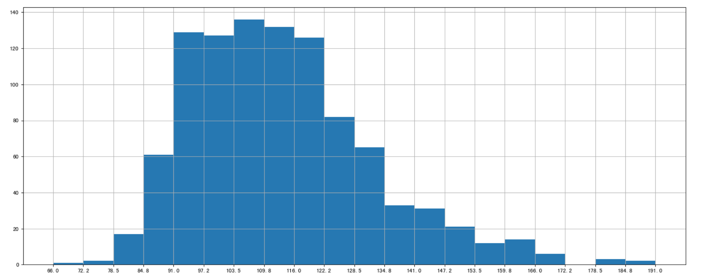

##### 2.3 问题三解决方案

**对于这一组电影数据，如果我们希望统计电影分类(genre)的情况，应该如何处理数据？**

- 思路

  - 1、创建一个全为0的dataframe，列索引置为电影的分类，temp_df
  - 2、遍历每一部电影，temp_df中把分类出现的列的值置为1
  - 3、求和

- 1、创建一个全为0的dataframe，列索引置为电影的分类，temp_df

``` lang-python
# 进行字符串分割
temp_list = [i.split(",") for i in df["Genre"]]
# 获取电影的分类
genre_list = np.unique([i for j in temp_list for i in j])

# 增加新的列
temp_df = pd.DataFrame(np.zeros([df.shape[0],genre_list.shape[0]]),columns=genre_list)
```

- 2、遍历每一部电影，temp_df中把分类出现的列的值置为1

``` lang-python
for i in range(1000):
    #temp_list[i] ['Action','Adventure','Animation']
    temp_df.ix[i,temp_list[i]]=1

    # 使用loc\iloc方法进行创建
    # temp_movie.loc[i, temp_list[i]] = 1
    # temp_movie.iloc[i, temp_movie.columns.get_indexer(temp_list[i])] = 1

print(temp_df.sum().sort_values())
```

- 3、求和,绘图

``` lang-python
temp_df.sum().sort_values(ascending=False).plot(kind="bar",figsize=(20,8),fontsize=20,colormap="cool")

Musical        5.0
Western        7.0
War           13.0
Music         16.0
Sport         18.0
History       29.0
Animation     49.0
Family        51.0
Biography     81.0
Fantasy      101.0
Mystery      106.0
Horror       119.0
Sci-Fi       120.0
Romance      141.0
Crime        150.0
Thriller     195.0
Adventure    259.0
Comedy       279.0
Action       303.0
Drama        513.0
dtype: float64
```

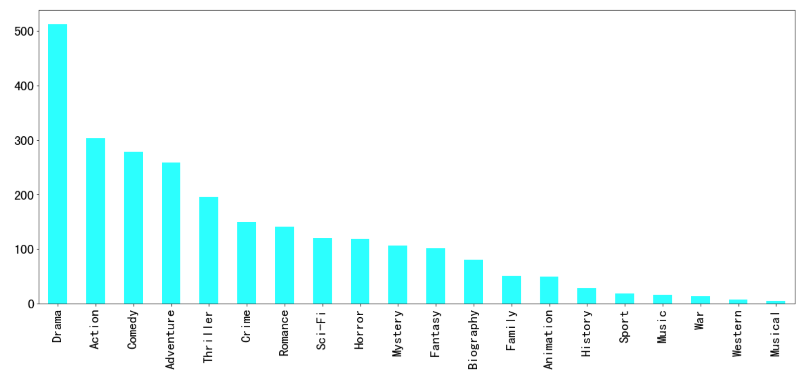

---

## 独立同分布IID(independent and identically distributed)

### 1.独立同分布(i.i.d.)

在概率统计理论中，**如果变量序列或者其他随机变量有相同的概率分布，并且互相独立，那么这些随机变量是独立同分布。**

在西瓜书中解释是：**输入空间中的所有样本服从一个隐含未知的分布，训练数据所有样本都是独立地从这个分布上采样而得。**

### 2.简单解释 — 独立、同分布、独立同分布

（1）**独立**：每次抽样之间没有关系，不会相互影响

举例：给一个骰子，每次抛骰子抛到几就是几，这是独立；如果我要抛骰子两次之和大于8，那么第一次和第二次抛就不独立，因为第二次抛的结果和第一次相关。

（2）**同分布**：每次抽样，样本服从同一个分布

举例：给一个骰子，每次抛骰子得到任意点数的概率都是六分之一，这个就是同分布

（3）**独立同分布**：i.i.d.，每次抽样之间独立而且同分布

### 3.机器学习领域的重要假设

IID独立同分布即假设**训练数据和测试数据是满足相同分布的，它是通过训练数据获得的模型能够在测试集获得好的效果的一个基本保障。**

### 4.目前发展

机器学习并不总要求独立同分布，在不少问题中要求样本数据采样自同一个分布是因为希望用训练数据集得到的模型可以合理的用于测试数据集，使用独立同分布假设能够解释得通。

目前**一些机器学习内容已经不再囿于独立同分布假设下，一些问题会假设样本没有同分布**。

---

### 完整机器学习项目的流程（拓展阅读）

###### **1** **抽象成数学问题**

明确问题是进行机器学习的第一步。机器学习的训练过程通常都是一件非常耗时的事情，胡乱尝试时间成本是非常高的。

这里的抽象成数学问题，指的明确我们可以获得什么样的数据，抽象出的问题，是一个分类还是回归或者是聚类的问题。

###### **2** **获取数据**

数据决定了机器学习结果的上限，而算法只是尽可能逼近这个上限。

数据要有代表性，否则必然会过拟合。

而且对于分类问题，数据偏斜不能过于严重，不同类别的数据数量不要有数量级的差距。

而且还要对数据的量级有一个评估，多少个样本，多少个特征，可以估算出其对内存的消耗程度，判断训练过程中内存是否能够放得下。如果放不下就得考虑改进算法或者使用一些降维的技巧了。如果数据量实在太大，那就要考虑分布式了。

###### **3** **特征预处理与特征选择**

良好的数据要能够提取出良好的特征才能真正发挥作用。

特征预处理、数据清洗是很关键的步骤，往往能够使得算法的效果和性能得到显著提高。归一化、离散化、因子化、缺失值处理、去除共线性等，数据挖掘过程中很多时间就花在它们上面。这些工作简单可复制，收益稳定可预期，是机器学习的基础必备步骤。

筛选出显著特征、摒弃非显著特征，需要机器学习工程师反复理解业务。这对很多结果有决定性的影响。特征选择好了，非常简单的算法也能得出良好、稳定的结果。这需要运用特征有效性分析的相关技术，如相关系数、卡方检验、平均互信息、条件熵、后验概率、逻辑回归权重等方法。

###### **4** **训练模型与调优**

直到这一步才用到我们上面说的算法进行训练。现在很多算法都能够封装成黑盒供人使用。但是真正考验水平的是调整这些算法的（超）参数，使得结果变得更加优良。这需要我们对算法的原理有深入的理解。理解越深入，就越能发现问题的症结，提出良好的调优方案。

###### **5** **模型诊断**

如何确定模型调优的方向与思路呢？这就需要对模型进行诊断的技术。

过拟合、欠拟合 判断是模型诊断中至关重要的一步。常见的方法如交叉验证，绘制学习曲线等。过拟合的基本调优思路是增加数据量，降低模型复杂度。欠拟合的基本调优思路是提高特征数量和质量，增加模型复杂度。

误差分析 也是机器学习至关重要的步骤。通过观察误差样本全面分析产生误差的原因:是参数的问题还是算法选择的问题，是特征的问题还是数据本身的问题……

诊断后的模型需要进行调优，调优后的新模型需要重新进行诊断，这是一个反复迭代不断逼近的过程，需要不断地尝试， 进而达到最优状态。

###### **6** **模型融合**

一般来说，模型融合后都能使得效果有一定提升。而且效果很好。

工程上，主要提升算法准确度的方法是分别在模型的前端（特征清洗和预处理，不同的采样模式）与后端（模型融合）上下功夫。因为他们比较标准可复制，效果比较稳定。而直接调参的工作不会很多，毕竟大量数据训练起来太慢了，而且效果难以保证。

###### **7** **上线运行**

这一部分内容主要跟工程实现的相关性比较大。工程上是结果导向，模型在线上运行的效果直接决定模型的成败。 不单纯包括其准确程度、误差等情况，还包括其运行的速度(时间复杂度)、资源消耗程度（空间复杂度）、稳定性是否可接受。

这些工作流程主要是工程实践上总结出的一些经验。并不是每个项目都包含完整的一个流程。这里的部分只是一个指导性的说明，只有大家自己多实践，多积累项目经验，才会有自己更深刻的认识。

---

### 独立同分布IID(independent and identically distributed)

#### 1.独立同分布(i.i.d.)

在概率统计理论中，**如果变量序列或者其他随机变量有相同的概率分布，并且互相独立，那么这些随机变量是独立同分布。**

在西瓜书中解释是：**输入空间中的所有样本服从一个隐含未知的分布，训练数据所有样本都是独立地从这个分布上采样而得。**

#### 2.简单解释 — 独立、同分布、独立同分布

（1）**独立**：每次抽样之间没有关系，不会相互影响

举例：给一个骰子，每次抛骰子抛到几就是几，这是独立；如果我要抛骰子两次之和大于8，那么第一次和第二次抛就不独立，因为第二次抛的结果和第一次相关。

（2）**同分布**：每次抽样，样本服从同一个分布

举例：给一个骰子，每次抛骰子得到任意点数的概率都是六分之一，这个就是同分布

（3）**独立同分布**：i.i.d.，每次抽样之间独立而且同分布

#### 3.机器学习领域的重要假设

IID独立同分布即假设**训练数据和测试数据是满足相同分布的，它是通过训练数据获得的模型能够在测试集获得好的效果的一个基本保障。**

#### 4.目前发展

机器学习并不总要求独立同分布，在不少问题中要求样本数据采样自同一个分布是因为希望用训练数据集得到的模型可以合理的用于测试数据集，使用独立同分布假设能够解释得通。

目前**一些机器学习内容已经不再囿于独立同分布假设下，一些问题会假设样本没有同分布**。
