# 机器学习（算法篇1）

## 目录

- 1. K近邻算法
  - 1.1. K近邻算法简介
  - 1.2. K近邻算法api初步使用
  - 1.3. 距离度量
  - 1.4. K值选择
  - 1.5. KD树
  - 1.6. 案例：鸢尾花种类预测-数据集介绍
  - 1.7. 特征工程-特征预处理
  - 1.8. 案例：鸢尾花种类预测-流程实现
  - 1.9. KNN算法总结
  - 1.10. 交叉验证+网格搜索
  - 1.11. 案例2：预测facebook签到位置
- 2. 线性回归
  - 2.1. 线性回归简介
  - 2.2. 线性回归api初步使用
  - 2.3. 数学：求导
  - 2.4. 线性回归的损失和优化
  - 2.5. 梯度下降方法介绍
  - 2.6. 线性回归api再介绍
  - 2.7. 案例：波士顿房价预测
  - 2.8. 欠拟合和过拟合
  - 2.9. 正则化线性模型
  - 2.10. 岭回归
  - 2.11. 模型的保存和加载
- 3. 逻辑回归
  - 3.1. 逻辑回归介绍
  - 3.2. 逻辑回归api介绍
  - 3.3. 案例：癌症分类预测
  - 3.4. 分类评估方法
  - 3.5. ROC曲线绘制
- 4. 决策树
  - 4.1. 决策树算法简介
  - 4.2. 决策树分类原理
  - 4.3. CART剪枝
  - 4.4. 特征工程-特征提取
  - 4.5. 决策树算法api
  - 4.6. 案例：泰坦尼克号乘客生存预测
  - 4.7. 回归决策树
- 5. 集成学习
  - 5.1. 集成学习算法简介
  - 5.2. Bagging和随机森林
  - 5.3. OTTO案例
  - 5.4. Boosting
  - 5.5. GBDT介绍
- 6. 聚类算法
  - 6.1. 聚类算法简介
  - 6.2. 聚类算法api初步使用
  - 6.3. 聚类算法实现流程
  - 6.4. 模型评估
  - 6.5. 算法优化
  - 6.6. 特征降维
  - 6.7. 案例：用户物品类别喜好
- 7. 拓展知识
  - 7.1. 其他距离公式
  - 7.2. 再议数据分割
  - 7.3. 正规方程另一种推导方式
  - 7.4. 梯度下降算法比较和进一步优化
  - 7.5. 多项式回归
  - 7.6. 维灾难
  - 7.7. 分类中解决类别不平衡问题
  - 7.8. 向量与矩阵的范数
  - 7.9. 无偏估计


---

# 机器学习算法课程定位、目标

## 定位

- 课程以算法、案例为驱动的学习，伴随浅显易懂的数学知识
- 作为人工智能领域的提升课程，掌握更深更有效的解决问题技能

## 目标

- 掌握机器学习常见算法原理
- 应用Scikit-learn实现机器学习算法的应用，
- 结合场景解决实际问题

---

## K-近邻算法

### 学习目标

- 掌握K-近邻算法实现过程
- 知道K-近邻算法的距离公式
- 知道K-近邻算法的超参数K值以及取值问题
- 知道kd树实现搜索的过程
- 应用KNeighborsClassifier实现分类
- 知道K-近邻算法的优缺点
- 知道交叉验证实现过程
- 知道超参数搜索过程
- 应用GridSearchCV实现算法参数的调优

------------------------------------------------------------------------

---

### 1.1 K-近邻算法简介

#### 学习目标

- 了解什么是KNN算法
- 知道KNN算法求解过程

#### 1 什么是K-近邻算法


- 根据你的“邻居”来推断出你的类别

##### 1.1 K-近邻算法(KNN)概念

K Nearest Neighbor算法又叫KNN算法，这个算法是机器学习里面一个比较经典的算法， 总体来说KNN算法是相对比较容易理解的算法

- 定义

如果一个样本在特征空间中的**k个最相似(即特征空间中最邻近)的样本中的大多数属于某一个类别**，则该样本也属于这个类别。

> 来源：KNN算法最早是由Cover和Hart提出的一种分类算法

- 距离公式

两个样本的距离可以通过如下公式计算，又叫欧式距离 ，关于距离公式会在后面进行讨论


##### 1.2 电影类型分析

假设我们现在有几部电影


其中？ 9号电影不知道类别，如何去预测？我们可以利用K近邻算法的思想


分别计算每个电影和被预测电影的距离，然后求解


##### 1.3 KNN算法流程总结

1）计算已知类别数据集中的点与当前点之间的距离

2）按距离递增次序排序

3）选取与当前点距离最小的k个点

4）统计前k个点所在的类别出现的频率

5）返回前k个点出现频率最高的类别作为当前点的预测分类

#### 2 小结

- K-近邻算法简介【了解】
  - 定义:就是通过你的"邻居"来判断你属于哪个类别
  - 如何计算你到你的"邻居"的距离：一般时候,都是使用欧氏距离

---

### 1.2 k近邻算法api初步使用

#### 学习目标

- 了解sklearn工具的优点和包含内容
- 应用sklearn中的api实现KNN算法的简单使用

------------------------------------------------------------------------

- 机器学习流程复习：


- 1.获取数据集
- 2.数据基本处理
- 3.特征工程
- 4.机器学习
- 5.模型评估

#### 1 Scikit-learn工具介绍


- Python语言的机器学习工具
- Scikit-learn包括许多知名的机器学习算法的实现
- Scikit-learn文档完善，容易上手，丰富的API
- 目前稳定版本0.19.1

##### 1.1 安装

    pip3 install scikit-learn==0.19.1

安装好之后可以通过以下命令查看是否安装成功

``` lang-python
import sklearn
```

- 注：安装scikit-learn需要Numpy, Scipy等库

##### 1.2 Scikit-learn包含的内容


- 分类、聚类、回归
- 特征工程
- 模型选择、调优

#### 2 K-近邻算法API

``` lang-python
sklearn.neighbors.KNeighborsClassifier(n_neighbors=5)
```

- 参数介绍：
  - n_neighbors：int,可选（默认= 5），k_neighbors查询默认使用的邻居数

#### 3 案例

##### 3.1 步骤分析

- 1.获取数据集
- 2.数据基本处理（该案例中省略）
- 3.特征工程（该案例中省略）
- 4.机器学习
- 5.模型评估（该案例中省略）

##### 3.2 代码过程

- 步骤一：导入模块

``` lang-python
from sklearn.neighbors import KNeighborsClassifier
```

- 步骤二：构造数据集
- 数据集格式一：

``` lang-python
x = [[0], [1], [2], [3]]
y = [0, 0, 1, 1]
```

- 数据集格式二：

``` lang-python
x = [[39,0,31],[3,2,65],[2,3,55],[9,38,2],[8,34,17],[5,2,57],[21,17,5],[45,2,9]]
y = [0,1,2,2,2,2,1,1]
```

- 步骤三：机器学习 -- 模型训练

``` lang-python
# 实例化API
estimator = KNeighborsClassifier(n_neighbors=1)
# 使用fit方法进行训练
estimator.fit(x, y)

estimator.predict([[1]])

# 数据集格式二对应的测试数据
# estimator.predict([[23,3,17]])
```

#### 4 小结

- sklearn的优势:
  - 文档多,且规范
  - 包含的算法多
  - 实现起来容易
- knn中的api
  - sklearn.neighbors.KNeighborsClassifier(n_neighbors=5)

------------------------------------------------------------------------

#### 5 问题思考

1.距离公式，除了欧式距离，还有哪些距离公式可以使用？

2.选取K值的大小？

3.api中其他参数的具体含义？

---

### 1.3 距离度量

#### 学习目标

- 了解距离公式的基本性质
- 知道机器学习中常见的距离计算公式

------------------------------------------------------------------------

#### 1 距离公式的基本性质

在机器学习过程中，对于函数 dist()，若它是一"距离度量" (distance measure)，则需满足一些基本性质:

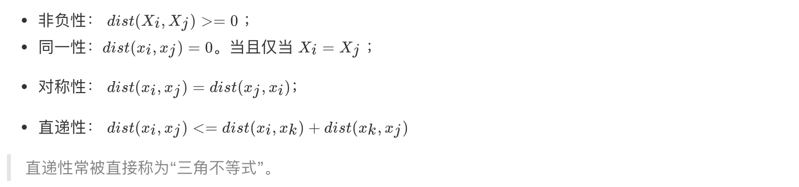

> 直递性常被直接称为“三角不等式”。

#### 2 常见的距离公式

##### 2.1 欧式距离

欧氏距离(Euclidean Distance)是最容易直观理解的距离度量方法，我们小学、初中和高中接触到的两个点在空间中的距离一般都是指欧氏距离。


举例:

    X=[[1,1],[2,2],[3,3],[4,4]];
    经计算得:
    d = 1.4142    2.8284    4.2426    1.4142    2.8284    1.4142

##### 2.2 **曼哈顿距离**

在曼哈顿街区要从一个十字路口开车到另一个十字路口，驾驶距离显然不是两点间的直线距离。这个实际驾驶距离就是“曼哈顿距离(Manhattan Distance)”。曼哈顿距离也称为“城市街区距离”(City Block distance)。


举例:

    X=[[1,1],[2,2],[3,3],[4,4]];
    经计算得:
    d =   2     4     6     2     4     2

##### 2.3 切比雪夫距离

国际象棋中，国王可以直行、横行、斜行，所以国王走一步可以移动到相邻8个方格中的任意一个。国王从格子(x1,y1)走到格子(x2,y2)最少需要多少步？这个距离就叫切比雪夫距离(Chebyshev Distance)。


举例:

    X=[[1,1],[2,2],[3,3],[4,4]];
    经计算得:
    d =   1     2     3     1     2     1

##### 2.4 闵可夫斯基距离

闵氏距离(Minkowski Distance)不是一种距离，而是一组距离的定义，是对多个距离度量公式的概括性的表述。

两个n维变量a(x<sub>11</sub>,x<sub>12</sub>,…,x<sub>1n</sub>)与b(x<sub>21</sub>,x<sub>22</sub>,…,x<sub>2n</sub>)间的闵可夫斯基距离定义为：


其中p是一个变参数：

- 当p=1时，就是曼哈顿距离；

- 当p=2时，就是欧氏距离；

- 当p→∞时，就是切比雪夫距离。

根据p的不同，闵氏距离可以表示某一类/种的距离。

**小结：**

1 闵氏距离，包括曼哈顿距离、欧氏距离和切比雪夫距离，都存在明显的缺点:

e.g. 二维样本(身高\[单位:cm\],体重\[单位:kg\]),现有三个样本：a(180,50)，b(190,50)，c(180,60)。

a与b的闵氏距离（无论是曼哈顿距离、欧氏距离或切比雪夫距离）等于a与c的闵氏距离。但实际上身高的10cm并不能和体重的10kg划等号。

**2 闵氏距离的缺点：**

​**(1)将各个分量的量纲(scale)，也就是“单位”相同的看待了;**

​**(2)未考虑各个分量的分布（期望，方差等）可能是不同的。**

------------------------------------------------------------------------

#### 3 “连续属性”和“离散属性”的距离计算

我们常将属性划分为"连续属性" (continuous attribute)和"离散属性" (categorical attribute)，前者在定义域上有无穷多个可能的取值，后者在定义域上是有限个取值.

- 若属性值之间存在序关系，则可以将其转化为连续值，例如：身高属性“高”“中等”“矮”，可转化为{1, 0.5, 0}。
  - 闵可夫斯基距离可以用于有序属性。
- 若属性值之间不存在序关系，则通常将其转化为向量的形式，例如：性别属性“男”“女”，可转化为{（1,0），（0,1）}。

#### 4 小结

- 1 距离公式的基本性质：非负性、统一性、对称性、直递性【了解】
- 2 常见距离公式
  - 2.1 欧式距离(Euclidean Distance)【知道】：
    - 通过距离平方值进行计算
  - 2.曼哈顿距离(Manhattan Distance)【知道】：
    - 通过距离的绝对值进行计算
  - 3.切比雪夫距离 (Chebyshev Distance)【知道】：
    - 维度的最大值进行计算
  - 4.闵可夫斯基距离(Minkowski Distance)【知道】：
    - 当p=1时，就是曼哈顿距离；
    - 当p=2时，就是欧氏距离；
    - 当p→∞时，就是切比雪夫距离。
- 3 属性【知道】
  - 连续属性
  - 离散属性，
    - 存在序关系，可以将其转化为连续值
    - 不存在序关系，通常将其转化为向量的形式

---

### 1.4 k值的选择

#### 学习目标

- 知道KNN中K值大小选择对模型的影响
- 知道估计误差和近似误差

------------------------------------------------------------------------

#### 1 K值选择说明

- **举例说明：**


- **K值过小**：
  - 容易受到异常点的影响
- **k值过大：**
  - 受到样本均衡的问题

------------------------------------------------------------------------

**K值选择问题，李航博士的一书「统计学习方法」上所说：**

- 1\) 选择较小的K值，就相当于用较小的领域中的训练实例进行预测，
  - “学习”近似误差会减小，只有与输入实例较近或相似的训练实例才会对预测结果起作用，与此同时带来的问题是“学习”的估计误差会增大，
  - 换句话说，**K值的减小就意味着整体模型变得复杂，容易发生过拟合；**
- 2\) 选择较大的K值，就相当于用较大领域中的训练实例进行预测，
  - 其优点是可以减少学习的估计误差，但缺点是学习的近似误差会增大。这时候，**与输入实例较远（不相似的）训练实例也会对预测器作用，使预测发生错误。**
  - **且K值的增大就意味着整体的模型变得简单。**
- 3\) K=N（N为训练样本个数），则完全不足取，
  - 因为此时无论输入实例是什么，都只是简单的预测它属于在训练实例中最多的类，模型过于简单，忽略了训练实例中大量有用信息。
- 在**实际应用中，K值一般取一个比较小的数值**，例如采用交叉验证法（简单来说，就是把训练数据在分成两组:训练集和验证集）来选择最优的K值。

------------------------------------------------------------------------

- **近似误差**：
  - 对现有训练集的训练误差，**关注训练集**，
  - 如果**近似误差过小可能会出现过拟合的现象**，对现有的训练集能有很好的预测，但是对未知的测试样本将会出现较大偏差的预测。
  - 模型本身不是最接近最佳模型。
- **估计误差**：
  - 可以理解为对测试集的测试误差，关注测试集，
  - 估计误差小说明对未知数据的预测能力好，
  - 模型本身最接近最佳模型。

#### 2 小结

- KNN中K值大小选择对模型的影响【知道】
  - **K值过小**：
    - 容易受到异常点的影响
    - 容易过拟合
  - **k值过大：**
    - 受到样本均衡的问题
    - 容易欠拟合
- 近似误差、估计误差基本概念介绍【了解】
  - 近似误差
    - 对现有训练集的训练误差，**关注训练集**
  - 估计误差
    - 可以理解为对测试集的测试误差，**关注测试集**

---

### 1.5 kd树

#### 学习目标

- 知道kd树构建和搜索过程

------------------------------------------------------------------------

**问题导入：**

实现k近邻算法时，**主要考虑的问题是如何对训练数据进行快速k近邻搜索。**

这在特征空间的维数大及训练数据容量大时尤其必要。

**k近邻法最简单的实现是线性扫描（穷举搜索），即要计算输入实例与每一个训练实例的距离。计算并存储好以后，再查找K近邻。**当训练集很大时，计算非常耗时。

为了提高kNN搜索的效率，可以考虑使用特殊的结构存储训练数据，以减小计算距离的次数。

------------------------------------------------------------------------

#### 1 kd树简介

##### 1.1 什么是kd树

根据**KNN**每次需要预测一个点时，我们都需要计算训练数据集里每个点到这个点的距离，然后选出距离最近的k个点进行投票。**当数据集很大时，这个计算成本非常高，针对N个样本，D个特征的数据集，其算法复杂度为O（DN<sup>2</sup>）**。

**kd树**：为了避免每次都重新计算一遍距离，算法会把距离信息保存在一棵树里，这样在计算之前从树里查询距离信息，尽量避免重新计算。其基本原理是，**如果A和B距离很远，B和C距离很近，那么A和C的距离也很远**。有了这个信息，就可以在合适的时候跳过距离远的点。

这样优化后的算法复杂度可降低到O（DNlog（N））。感兴趣的读者可参阅论文：Bentley，J.L.，Communications of the ACM（1975）。

1989年，另外一种称为**Ball Tree**的算法，在kd Tree的基础上对性能进一步进行了优化。感兴趣的读者可以搜索**Five balltree construction algorithms**来了解详细的算法信息。

##### 1.2 原理


黄色的点作为根节点，上面的点归左子树，下面的点归右子树，接下来再不断地划分，分割的那条线叫做分割超平面（splitting hyperplane），在一维中是一个点，二维中是线，三维的是面。


黄色节点就是Root节点，下一层是红色，再下一层是绿色，再下一层是蓝色。


**1.树的建立；**

**2.最近邻域搜索（Nearest-Neighbor Lookup）**

kd树(K-dimension tree)是**一种对k维空间中的实例点进行存储以便对其进行快速检索的树形数据结构。**kd树是一种二叉树，表示对k维空间的一个划分，**构造kd树相当于不断地用垂直于坐标轴的超平面将K维空间切分，构成一系列的K维超矩形区域**。kd树的每个结点对应于一个k维超矩形区域。**利用kd树可以省去对大部分数据点的搜索，从而减少搜索的计算量。**


类比“二分查找”：给出一组数据：\[9 1 4 7 2 5 0 3 8\]，要查找8。如果挨个查找（线性扫描），那么将会把数据集都遍历一遍。而如果排一下序那数据集就变成了：\[0 1 2 3 4 5 6 7 8 9\]，按前一种方式我们进行了很多没有必要的查找，现在如果我们以5为分界点，那么数据集就被划分为了左右两个“簇” \[0 1 2 3 4\]和\[6 7 8 9\]。

因此，根本就没有必要进入第一个簇，可以直接进入第二个簇进行查找。把二分查找中的数据点换成k维数据点，这样的划分就变成了用超平面对k维空间的划分。空间划分就是对数据点进行分类，“挨得近”的数据点就在一个空间里面。

#### 2 构造方法

（1）**构造根结点，使根结点对应于K维空间中包含所有实例点的超矩形区域；**

（2）**通过递归的方法，不断地对k维空间进行切分，生成子结点。**在超矩形区域上选择一个坐标轴和在此坐标轴上的一个切分点，确定一个超平面，这个超平面通过选定的切分点并垂直于选定的坐标轴，将当前超矩形区域切分为左右两个子区域（子结点）；这时，实例被分到两个子区域。

（3）**上述过程直到子区域内没有实例时终止（终止时的结点为叶结点）**。在此过程中，将实例保存在相应的结点上。

（4）通常，循环的选择坐标轴对空间切分，选择训练实例点在坐标轴上的中位数为切分点，这样得到的kd树是平衡的（平衡二叉树：它是一棵空树，或其左子树和右子树的深度之差的绝对值不超过1，且它的左子树和右子树都是平衡二叉树）。

KD树中每个节点是一个向量，和二叉树按照数的大小划分不同的是，KD树每层需要选定向量中的某一维，然后根据这一维按左小右大的方式划分数据。在构建KD树时，关键需要解决2个问题：

**（1）选择向量的哪一维进行划分；**

**（2）如何划分数据；**

第一个问题简单的解决方法可以是随机选择某一维或按顺序选择，但是**更好的方法应该是在数据比较分散的那一维进行划分（分散的程度可以根据方差来衡量）**。

第二个问题中，好的划分方法可以使构建的树比较平衡，可以每次选择中位数来进行划分。

#### 3 案例分析

##### 3.1 树的建立

给定一个二维空间数据集：T={(2,3),(5,4),(9,6),(4,7),(8,1),(7,2)}，构造一个平衡kd树。


（1）思路引导：

根结点对应包含数据集T的矩形，选择x(1)轴，6个数据点的x(1)坐标中位数是6，这里选最接近的(7,2)点，以平面x(1)=7将空间分为左、右两个子矩形（子结点）；接着左矩形以x(2)=4分为两个子矩形（左矩形中{(2,3),(5,4),(4,7)}点的x(2)坐标中位数正好为4），右矩形以x(2)=6分为两个子矩形，如此递归，最后得到如下图所示的特征空间划分和kd树。


##### 3.2 最近领域的搜索

假设标记为星星的点是 test point， 绿色的点是找到的近似点，在回溯过程中，需要用到一个队列，存储需要回溯的点，在判断其他子节点空间中是否有可能有距离查询点更近的数据点时，做法是以查询点为圆心，以当前的最近距离为半径画圆，这个圆称为候选超球（candidate hypersphere），如果圆与回溯点的轴相交，则需要将轴另一边的节点都放到回溯队列里面来。


样本集{(2,3),(5,4), (9,6), (4,7), (8,1), (7,2)}

###### 3.2.1 查找点(2.1,3.1)


在(7,2)点测试到达(5,4)，在(5,4)点测试到达(2,3)，然后search_path中的结点为\<(7,2),(5,4), (2,3)\>，从search_path中取出(2,3)作为当前最佳结点nearest, dist为0.141；

然后回溯至(5,4)，以(2.1,3.1)为圆心，以dist=0.141为半径画一个圆，并不和超平面y=4相交，如上图，所以不必跳到结点(5,4)的右子空间去搜索，因为右子空间中不可能有更近样本点了。

于是再回溯至(7,2)，同理，以(2.1,3.1)为圆心，以dist=0.141为半径画一个圆并不和超平面x=7相交，所以也不用跳到结点(7,2)的右子空间去搜索。

至此，search_path为空，结束整个搜索，返回nearest(2,3)作为(2.1,3.1)的最近邻点，最近距离为0.141。

###### 3.2.2 查找点(2,4.5)


在(7,2)处测试到达(5,4)，在(5,4)处测试到达(4,7)【优先选择在本域搜索】，然后search_path中的结点为\<(7,2),(5,4), (4,7)\>，从search_path中取出(4,7)作为当前最佳结点nearest, dist为3.202；

然后回溯至(5,4)，以(2,4.5)为圆心，以dist=3.202为半径画一个圆与超平面y=4相交，所以需要跳到(5,4)的左子空间去搜索。所以要将(2,3)加入到search_path中，现在search_path中的结点为\<(7,2),(2, 3)\>；另外，(5,4)与(2,4.5)的距离为3.04 \< dist = 3.202，所以将(5,4)赋给nearest，并且dist=3.04。

回溯至(2,3)，(2,3)是叶子节点，直接平判断(2,3)是否离(2,4.5)更近，计算得到距离为1.5，所以nearest更新为(2,3)，dist更新为(1.5)

回溯至(7,2)，同理，以(2,4.5)为圆心，以dist=1.5为半径画一个圆并不和超平面x=7相交, 所以不用跳到结点(7,2)的右子空间去搜索。

至此，search_path为空，结束整个搜索，返回nearest(2,3)作为(2,4.5)的最近邻点，最近距离为1.5。

#### 4 总结

- kd树的构建过程【知道】
  - 1.**构造根节点**
  - 2.**通过递归的方法，不断地对k维空间进行切分，生成子节点**
  - 3.重复第二步骤，直到子区域中没有实例时终止
  - 需要关注细节：**a.选择向量的哪一维进行划分；b.如何划分数据**
- kd树的搜索过程【知道】
  - 1**.二叉树搜索比较待查询节点和分裂节点的分裂维的值**，（小于等于就进入左子树分支，大于就进入右子树分支直到叶子结点）
  - 2.**顺着“搜索路径”找到最近邻的近似点**
  - 3.**回溯搜索路径**，并判断搜索路径上的结点的其他子结点空间中是否可能有距离查询点更近的数据点，如果有可能，则需要跳到其他子结点空间中去搜索
  - 4.**重复这个过程直到搜索路径为空**

---

### 1.6 案例：鸢尾花种类预测--数据集介绍

#### 学习目标

- 知道sklearn中获取数据集的方法
- 知道sklearn中对数据集的划分方法

------------------------------------------------------------------------

本实验介绍了使用Python进行机器学习的一些基本概念。 在本案例中，将使用K-Nearest Neighbor（KNN）算法对鸢尾花的种类进行分类，并测量花的特征。

本案例目的：

1.  遵循并理解完整的机器学习过程
2.  对机器学习原理和相关术语有基本的了解。
3.  了解评估机器学习模型的基本过程。

#### 1 案例：鸢尾花种类预测

Iris数据集是常用的分类实验数据集，由Fisher, 1936收集整理。Iris也称鸢尾花卉数据集，是一类多重变量分析的数据集。关于数据集的具体介绍：


#### 2 scikit-learn中数据集介绍

##### 2.1 scikit-learn数据集API介绍

- sklearn.datasets
  - 加载获取流行数据集
  - datasets.load\_\*()
    - 获取小规模数据集，数据包含在datasets里
  - datasets.fetch\_\*(data_home=None)
    - 获取大规模数据集，需要从网络上下载，函数的第一个参数是data_home，表示数据集下载的目录,默认是 ~/scikit_learn_data/

###### 2.1.1 sklearn小数据集

- sklearn.datasets.load_iris()

  加载并返回鸢尾花数据集


###### 2.1.2 sklearn大数据集

- sklearn.datasets.fetch_20newsgroups(data_home=None,subset=‘train’)
  - subset：'train'或者'test'，'all'，可选，选择要加载的数据集。
  - 训练集的“训练”，测试集的“测试”，两者的“全部”

##### 2.2 sklearn数据集返回值介绍

- load和fetch返回的数据类型datasets.base.Bunch(字典格式)
  - data：特征数据数组，是 \[n_samples \* n_features\] 的二维 numpy.ndarray 数组
  - target：标签数组，是 n_samples 的一维 numpy.ndarray 数组
  - DESCR：数据描述
  - feature_names：特征名,新闻数据，手写数字、回归数据集没有
  - target_names：标签名

``` lang-python
from sklearn.datasets import load_iris
# 获取鸢尾花数据集
iris = load_iris()
print("鸢尾花数据集的返回值：\n", iris)
# 返回值是一个继承自字典的Bench
print("鸢尾花的特征值:\n", iris["data"])
print("鸢尾花的目标值：\n", iris.target)
print("鸢尾花特征的名字：\n", iris.feature_names)
print("鸢尾花目标值的名字：\n", iris.target_names)
print("鸢尾花的描述：\n", iris.DESCR)
```

##### 2.3 查看数据分布

通过创建一些图，以查看不同类别是如何通过特征来区分的。 在理想情况下，标签类将由一个或多个特征对完美分隔。 在现实世界中，这种理想情况很少会发生。

- seaborn介绍

  - Seaborn 是基于 Matplotlib 核心库进行了更高级的 API 封装，可以让你轻松地画出更漂亮的图形。而 Seaborn 的漂亮主要体现在配色更加舒服、以及图形元素的样式更加细腻。

  - 安装 pip3 install seaborn

  - seaborn.lmplot() 是一个非常有用的方法，它会在绘制二维散点图时，自动完成回归拟合

    - sns.lmplot() 里的 x, y 分别代表横纵坐标的列名,
    - data= 是关联到数据集,
    - hue=\*代表按照 species即花的类别分类显示,
    - fit_reg=是否进行线性拟合。

  - <a href="http://seaborn.pydata.org/" target="_blank">参考链接: api链接</a>

``` lang-python
import seaborn as sns
import matplotlib.pyplot as plt
import pandas as pd

# 把数据转换成dataframe的格式
iris_d = pd.DataFrame(iris['data'], columns = ['Sepal_Length', 'Sepal_Width', 'Petal_Length', 'Petal_Width'])
iris_d['Species'] = iris.target

def plot_iris(iris, col1, col2):
    sns.lmplot(x = col1, y = col2, data = iris, hue = "Species", fit_reg = False)
    plt.xlabel(col1)
    plt.ylabel(col2)
    plt.title('鸢尾花种类分布图')
    plt.show()
plot_iris(iris_d, 'Petal_Width', 'Sepal_Length')
```


##### 2.4 数据集的划分

机器学习一般的数据集会划分为两个部分：

- 训练数据：用于训练，**构建模型**
- 测试数据：在模型检验时使用，用于**评估模型是否有效**

划分比例：

- 训练集：70% 80% 75%
- 测试集：30% 20% 25%

**数据集划分api**

- sklearn.model_selection.train_test_split(arrays, \*options)
  - 参数：
    - x 数据集的特征值
    - y 数据集的标签值
    - test_size 测试集的大小，一般为float
    - random_state 随机数种子,不同的种子会造成不同的随机采样结果。相同的种子采样结果相同。
  - return
    - x_train, x_test, y_train, y_test

``` lang-python
from sklearn.datasets import load_iris
from sklearn.model_selection import train_test_split
# 1、获取鸢尾花数据集
iris = load_iris()
# 对鸢尾花数据集进行分割
# 训练集的特征值x_train 测试集的特征值x_test 训练集的目标值y_train 测试集的目标值y_test
x_train, x_test, y_train, y_test = train_test_split(iris.data, iris.target, random_state=22)
print("x_train:\n", x_train.shape)
# 随机数种子
x_train1, x_test1, y_train1, y_test1 = train_test_split(iris.data, iris.target, random_state=6)
x_train2, x_test2, y_train2, y_test2 = train_test_split(iris.data, iris.target, random_state=6)
print("如果随机数种子不一致：\n", x_train == x_train1)
print("如果随机数种子一致：\n", x_train1 == x_train2)
```

#### 3 总结

- 获取数据集【知道】
  - 小数据:
    - sklearn.datasets.load\_\*
  - 大数据集:
    - sklearn.datasets.fetch\_\*
- 数据集返回值介绍【知道】
  - 返回值类型是bunch--是一个字典类型
  - 返回值的属性:
    - data：特征数据数组
    - target：标签(目标)数组
    - DESCR：数据描述
    - feature_names：特征名,
    - target_names：标签(目标值)名
- 数据集的划分【掌握】
  - sklearn.model_selection.train_test_split(arrays, \*options)
  - 参数:
    - x -- 特征值
    - y -- 目标值
    - test_size -- 测试集大小
    - ramdom_state -- 随机数种子
  - 返回值:
    - x_train, x_test, y_train, y_test

---

### 1.7 特征工程-特征预处理

#### 学习目标

- 了解什么是特征预处理
- 知道归一化和标准化的原理及区别

------------------------------------------------------------------------

#### 1 什么是特征预处理

##### 1.1 特征预处理定义

> scikit-learn的解释
>
> provides several common utility functions and transformer classes to change raw feature vectors into a representation that is more suitable for the downstream estimators.

翻译过来：通过**一些转换函数**将特征数据**转换成更加适合算法模型**的特征数据过程


- 为什么我们要进行归一化/标准化？

  - 特征的**单位或者大小相差较大，或者某特征的方差相比其他的特征要大出几个数量级**，**容易影响（支配）目标结果**，使得一些算法无法学习到其它的特征

<!-- -->

- 举例：约会对象数据


我们需要用到一些方法进行**无量纲化**，**使不同规格的数据转换到同一规格**

##### 1.2 包含内容

- 归一化
- 标准化

##### 1.3 特征预处理API

``` lang-python
sklearn.preprocessing
```

#### 2 归一化

##### 2.1 定义

通过对原始数据进行变换把数据映射到(默认为\[0,1\])之间

##### 2.2 公式


> 作用于每一列，max为一列的最大值，min为一列的最小值,那么X’’为最终结果，mx，mi分别为指定区间值默认mx为1,mi为0

那么怎么理解这个过程呢？我们通过一个例子


##### 2.3 API

- sklearn.preprocessing.MinMaxScaler (feature_range=(0,1)… )
  - MinMaxScalar.fit_transform(X)
    - X:numpy array格式的数据\[n_samples,n_features\]
  - 返回值：转换后的形状相同的array

##### 2.4 数据计算

我们对以下数据进行运算，在dating.txt中。保存的就是之前的约会对象数据

``` lang-python
milage,Liters,Consumtime,target
40920,8.326976,0.953952,3
14488,7.153469,1.673904,2
26052,1.441871,0.805124,1
75136,13.147394,0.428964,1
38344,1.669788,0.134296,1
```

- 分析

  - 1、实例化MinMaxScalar
  - 2、通过fit_transform转换

``` lang-python
import pandas as pd
from sklearn.preprocessing import MinMaxScaler

def minmax_demo():
    """
    归一化演示
    :return: None
    """
    data = pd.read_csv("./data/dating.txt")
    print(data)
    # 1、实例化一个转换器类
    transfer = MinMaxScaler(feature_range=(2, 3))
    # 2、调用fit_transform
    data = transfer.fit_transform(data[['milage','Liters','Consumtime']])
    print("最小值最大值归一化处理的结果：\n", data)

    return None
```

返回结果：

``` lang-python
     milage     Liters  Consumtime  target
0     40920   8.326976    0.953952       3
1     14488   7.153469    1.673904       2
2     26052   1.441871    0.805124       1
3     75136  13.147394    0.428964       1
..      ...        ...         ...     ...
998   48111   9.134528    0.728045       3
999   43757   7.882601    1.332446       3

[1000 rows x 4 columns]
最小值最大值归一化处理的结果：
 [[ 2.44832535  2.39805139  2.56233353]
 [ 2.15873259  2.34195467  2.98724416]
 [ 2.28542943  2.06892523  2.47449629]
 ...,
 [ 2.29115949  2.50910294  2.51079493]
 [ 2.52711097  2.43665451  2.4290048 ]
 [ 2.47940793  2.3768091   2.78571804]]
```

**问题：如果数据中异常点较多，会有什么影响？**


##### 2.5 归一化总结

注意最大值最小值是变化的，另外，最大值与最小值非常容易受异常点影响，**所以这种方法鲁棒性较差，只适合传统精确小数据场景。**

怎么办？

#### 3 标准化

##### 3.1 定义

通过对原始数据进行变换把数据变换到均值为0,标准差为1范围内

##### 3.2 公式


> 作用于每一列，mean为平均值，σ为标准差

所以回到刚才异常点的地方，我们再来看看标准化


- 对于归一化来说：如果出现异常点，影响了最大值和最小值，那么结果显然会发生改变
- 对于标准化来说：如果出现异常点，由于具有一定数据量，少量的异常点对于平均值的影响并不大，从而方差改变较小。

##### 3.3 API

- sklearn.preprocessing.StandardScaler( )
  - 处理之后每列来说所有数据都聚集在均值0附近标准差差为1
  - StandardScaler.fit_transform(X)
    - X:numpy array格式的数据\[n_samples,n_features\]
  - 返回值：转换后的形状相同的array

##### 3.4 数据计算

同样对上面的数据进行处理

- 分析

  - 1、实例化StandardScaler
  - 2、通过fit_transform转换

``` lang-python
import pandas as pd
from sklearn.preprocessing import StandardScaler

def stand_demo():
    """
    标准化演示
    :return: None
    """
    data = pd.read_csv("dating.txt")
    print(data)
    # 1、实例化一个转换器类
    transfer = StandardScaler()
    # 2、调用fit_transform
    data = transfer.fit_transform(data[['milage','Liters','Consumtime']])
    print("标准化的结果:\n", data)
    print("每一列特征的平均值：\n", transfer.mean_)
    print("每一列特征的方差：\n", transfer.var_)

    return None
```

返回结果：

``` lang-python
     milage     Liters  Consumtime  target
0     40920   8.326976    0.953952       3
1     14488   7.153469    1.673904       2
2     26052   1.441871    0.805124       1
..      ...        ...         ...     ...
997   26575  10.650102    0.866627       3
998   48111   9.134528    0.728045       3
999   43757   7.882601    1.332446       3

[1000 rows x 4 columns]
标准化的结果:
 [[ 0.33193158  0.41660188  0.24523407]
 [-0.87247784  0.13992897  1.69385734]
 [-0.34554872 -1.20667094 -0.05422437]
 ...,
 [-0.32171752  0.96431572  0.06952649]
 [ 0.65959911  0.60699509 -0.20931587]
 [ 0.46120328  0.31183342  1.00680598]]
每一列特征的平均值：
 [  3.36354210e+04   6.55996083e+00   8.32072997e-01]
每一列特征的方差：
 [  4.81628039e+08   1.79902874e+01   2.46999554e-01]
```

##### 3.5 标准化总结

在已有样本足够多的情况下比较稳定，适合现代嘈杂大数据场景。

#### 4 总结

- 什么是特征工程【知道】
  - 定义
    - 通过一些转换函数将特征数据转换成更加适合算法模型的特征数据过程
  - 包含内容:
    - 归一化
    - 标准化
- 归一化【知道】
  - 定义:
    - 对原始数据进行变换把数据映射到(默认为\[0,1\])之间
  - api:
    - sklearn.preprocessing.MinMaxScaler (feature_range=(0,1)… )
    - 参数:feature_range -- 自己指定范围,默认0-1
  - 总结:
    - 鲁棒性比较差(容易受到异常点的影响)
    - 只适合传统精确小数据场景(以后不会用你了)
- 标准化【掌握】
  - 定义:
    - 对原始数据进行变换把数据变换到均值为0,标准差为1范围内
  - api:
    - sklearn.preprocessing.StandardScaler( )
  - 总结:
    - 异常值对我影响小
    - 适合现代嘈杂大数据场景(以后就是用你了)

---

### 1.8 案例：鸢尾花种类预测—流程实现

#### 学习目标

- 知道KNeighborsClassifier的用法

#### 1 再识K-近邻算法API

- sklearn.neighbors.KNeighborsClassifier(n_neighbors=5,algorithm='auto')
  - n_neighbors：
    - int,可选（默认= 5），k_neighbors查询默认使用的邻居数
  - algorithm：{‘auto’，‘ball_tree’，‘kd_tree’，‘brute’}
    - 快速k近邻搜索算法，默认参数为auto，可以理解为算法自己决定合适的搜索算法。除此之外，用户也可以自己指定搜索算法ball_tree、kd_tree、brute方法进行搜索，
      - brute是蛮力搜索，也就是线性扫描，当训练集很大时，计算非常耗时。
      - kd_tree，构造kd树存储数据以便对其进行快速检索的树形数据结构，kd树也就是数据结构中的二叉树。以中值切分构造的树，每个结点是一个超矩形，在维数小于20时效率高。
      - ball tree是为了克服kd树高维失效而发明的，其构造过程是以质心C和半径r分割样本空间，每个节点是一个超球体。

#### 2 案例：鸢尾花种类预测

##### 2.1 数据集介绍

Iris数据集是常用的分类实验数据集，由Fisher, 1936收集整理。Iris也称鸢尾花卉数据集，是一类多重变量分析的数据集。关于数据集的具体介绍：


##### 2.2 步骤分析

- 1.获取数据集
- 2.数据基本处理
- 3.特征工程
- 4.机器学习(模型训练)
- 5.模型评估

##### 2.3 代码过程

- 导入模块

``` lang-python
from sklearn.datasets import load_iris
from sklearn.model_selection import train_test_split
from sklearn.preprocessing import StandardScaler
from sklearn.neighbors import KNeighborsClassifier
```

- 先从sklearn当中获取数据集，然后进行数据集的分割

``` lang-python
# 1.获取数据集
iris = load_iris()

# 2.数据基本处理
# x_train,x_test,y_train,y_test为训练集特征值、测试集特征值、训练集目标值、测试集目标值
x_train, x_test, y_train, y_test = train_test_split(iris.data, iris.target, test_size=0.2, random_state=22)
```

- 进行数据标准化 -- 特征值的标准化

``` lang-python
# 3、特征工程：标准化
transfer = StandardScaler()
x_train = transfer.fit_transform(x_train)
x_test = transfer.transform(x_test)
```

- 模型进行训练预测

``` lang-python
# 4、机器学习(模型训练)
estimator = KNeighborsClassifier(n_neighbors=9)
estimator.fit(x_train, y_train)
# 5、模型评估
# 方法1：比对真实值和预测值
y_predict = estimator.predict(x_test)
print("预测结果为:\n", y_predict)
print("比对真实值和预测值：\n", y_predict == y_test)
# 方法2：直接计算准确率
score = estimator.score(x_test, y_test)
print("准确率为：\n", score)
```

#### 3 案例小结

在本案例中，具体完成内容有：

- 使用可视化加载和探索数据，以确定特征是否能将不同类别分开。
- 通过标准化数字特征并随机抽样到训练集和测试集来准备数据。
- 通过统计学，精确度度量进行构建和评估机器学习模型。

**同学之间讨论刚才完成的机器学习代码,并且确保在自己的电脑运行成功**

#### 4 总结

- KNeighborsClassifier的使用【知道】
  - sklearn.neighbors.KNeighborsClassifier(n_neighbors=5,algorithm='auto')
    - algorithm（auto,ball_tree, kd_tree, brute） -- 选择什么样的算法进行计算

---

### 1.9 KNN算法总结

#### 1 k近邻算法优缺点汇总

- **优点：**

  - **简单有效**

  - **重新训练的代价低**

  - **适合类域交叉样本**
    - **KNN方法主要靠周围有限的邻近的样本**,而不是靠判别类域的方法来确定所属类别的，因此对于类域的交叉或重叠较多的待分样本集来说，KNN方法较其他方法更为适合。

  - **适合样本容量比较大的类域自动分类**

    - 该算法比较**适用于样本容量比较大的类域的自动分类**，而那些**样本容量较小的类域采用这种算法比较容易产生误分**。

    <!-- -->

        样本量、样本个数与样本容量的关系举例

        一个箱子最多能放50个苹果（样本），从中取样30个。
        在这里，苹果是样本，箱子最多能放的个数（即苹果的总数）50是这个样本的样本（容）量，而所抽取的样本个数30则是样本量。

------------------------------------------------------------------------

- **缺点：**

  - **惰性学习**

    - KNN算法是懒散学习方法（lazy learning,基本上不学习），一些积极学习的算法要快很多

  - **类别评分不是规格化**

    - 不像一些通过概率评分的分类

  - **输出可解释性不强**
    - 例如决策树的输出可解释性就较强

  - **对不均衡的样本不擅长**
    - 当样本不平衡时，如一个类的样本容量很大，而其他类样本容量很小时，有可能导致当输入一个新样本时，该样本的K个邻居中大容量类的样本占多数。该算法只计算“最近的”邻居样本，某一类的样本数量很大，那么或者这类样本并不接近目标样本，或者这类样本很靠近目标样本。无论怎样，数量并不能影响运行结果。可以采用权值的方法（和该样本距离小的邻居权值大）来改进。

  - **计算量较大**
    - 目前常用的解决方法是事先对已知样本点进行剪辑，事先去除对分类作用不大的样本。

---

### 1.10 交叉验证，网格搜索

#### 学习目标

- 知道交叉验证、网格搜索的概念
- 会使用交叉验证、网格搜索优化训练模型

#### 1 什么是交叉验证(cross validation)

交叉验证：将拿到的训练数据，分为训练和验证集。以下图为例：将数据分成4份，其中一份作为验证集。然后经过4次(组)的测试，每次都更换不同的验证集。即得到4组模型的结果，取平均值作为最终结果。又称4折交叉验证。

##### 1.1 分析

我们之前知道数据分为训练集和测试集，但是**为了让从训练得到模型结果更加准确。**做以下处理

- 训练集：训练集+验证集
- 测试集：测试集


##### 1.2 为什么需要交叉验证

交叉验证目的：**为了让被评估的模型更加准确可信**

------------------------------------------------------------------------

**问题：这个只是让被评估的模型更加准确可信，那么怎么选择或者调优参数呢？**

#### 2 什么是网格搜索(Grid Search)

通常情况下，**有很多参数是需要手动指定的（如k-近邻算法中的K值），这种叫超参数**。但是手动过程繁杂，所以需要对模型预设几种超参数组合。**每组超参数都采用交叉验证来进行评估。最后选出最优参数组合建立模型。**


#### 3 交叉验证-网格搜索API：

- sklearn.model_selection.GridSearchCV(estimator, param_grid=None,cv=None)
  - 解释：对估计器的指定参数值进行详尽搜索
  - 参数：
    - estimator：估计器对象
    - param_grid：估计器参数(dict){“n_neighbors”:\[1,3,5\]}
    - cv：指定几折交叉验证
  - 方法：
    - fit：输入训练数据
    - score：准确率
  - 结果分析：
    - best*score\_\_:在交叉验证中验证的最好结果*
    - best*estimator*：最好的参数模型
    - cv*results*:每次交叉验证后的验证集准确率结果和训练集准确率结果

#### 4 鸢尾花案例增加K值调优

- 使用GridSearchCV构建估计器

``` lang-python
# 1、获取数据集
iris = load_iris()
# 2、数据基本处理 -- 划分数据集
x_train, x_test, y_train, y_test = train_test_split(iris.data, iris.target, random_state=22)
# 3、特征工程：标准化
# 实例化一个转换器类
transfer = StandardScaler()
# 调用fit_transform
x_train = transfer.fit_transform(x_train)
x_test = transfer.transform(x_test)
# 4、KNN预估器流程
#  4.1 实例化预估器类
estimator = KNeighborsClassifier()

# 4.2 模型选择与调优——网格搜索和交叉验证
# 准备要调的超参数
param_dict = {"n_neighbors": [1, 3, 5]}
estimator = GridSearchCV(estimator, param_grid=param_dict, cv=3)
# 4.3 fit数据进行训练
estimator.fit(x_train, y_train)
# 5、评估模型效果
# 方法a：比对预测结果和真实值
y_predict = estimator.predict(x_test)
print("比对预测结果和真实值：\n", y_predict == y_test)
# 方法b：直接计算准确率
score = estimator.score(x_test, y_test)
print("直接计算准确率：\n", score)
```

- 然后进行评估查看最终选择的结果和交叉验证的结果

``` lang-python
print("在交叉验证中验证的最好结果：\n", estimator.best_score_)
print("最好的参数模型：\n", estimator.best_estimator_)
print("每次交叉验证后的准确率结果：\n", estimator.cv_results_)
```

- 最终结果

``` lang-python
比对预测结果和真实值：
 [ True  True  True  True  True  True  True False  True  True  True  True
  True  True  True  True  True  True False  True  True  True  True  True
  True  True  True  True  True  True  True  True  True  True  True  True
  True  True]
直接计算准确率：
 0.947368421053
在交叉验证中验证的最好结果：
 0.973214285714
最好的参数模型：
 KNeighborsClassifier(algorithm='auto', leaf_size=30, metric='minkowski',
           metric_params=None, n_jobs=1, n_neighbors=5, p=2,
           weights='uniform')
每次交叉验证后的准确率结果：
 {'mean_fit_time': array([ 0.00114751,  0.00027037,  0.00024462]), 'std_fit_time': array([  1.13901511e-03,   1.25300249e-05,   1.11011951e-05]), 'mean_score_time': array([ 0.00085751,  0.00048693,  0.00045625]), 'std_score_time': array([  3.52785082e-04,   2.87650037e-05,   5.29673344e-06]), 'param_n_neighbors': masked_array(data = [1 3 5],
             mask = [False False False],
       fill_value = ?)
, 'params': [{'n_neighbors': 1}, {'n_neighbors': 3}, {'n_neighbors': 5}], 'split0_test_score': array([ 0.97368421,  0.97368421,  0.97368421]), 'split1_test_score': array([ 0.97297297,  0.97297297,  0.97297297]), 'split2_test_score': array([ 0.94594595,  0.89189189,  0.97297297]), 'mean_test_score': array([ 0.96428571,  0.94642857,  0.97321429]), 'std_test_score': array([ 0.01288472,  0.03830641,  0.00033675]), 'rank_test_score': array([2, 3, 1], dtype=int32), 'split0_train_score': array([ 1.        ,  0.95945946,  0.97297297]), 'split1_train_score': array([ 1.        ,  0.96      ,  0.97333333]), 'split2_train_score': array([ 1.  ,  0.96,  0.96]), 'mean_train_score': array([ 1.        ,  0.95981982,  0.96876877]), 'std_train_score': array([ 0.        ,  0.00025481,  0.0062022 ])}
```

#### 5 总结

- 交叉验证【知道】
  - 定义：
    - 将拿到的训练数据，分为训练和验证集
    - \*折交叉验证
  - 分割方式：
    - 训练集：训练集+验证集
    - 测试集：测试集
  - 为什么需要交叉验证
    - 为了让被评估的模型更加准确可信
    - 注意：交叉验证不能提高模型的准确率
- 网格搜索【知道】
  - 超参数:
    - sklearn中,需要手动指定的参数,叫做超参数
  - 网格搜索就是把这些超参数的值,通过字典的形式传递进去,然后进行选择最优值
- api【知道】
  - sklearn.model_selection.GridSearchCV(estimator, param_grid=None,cv=None)
    - estimator -- 选择了哪个训练模型
    - param_grid -- 需要传递的超参数
    - cv -- 几折交叉验证

---

### 1.11 案例2：预测facebook签到位置

#### 学习目标

- 通过Facebook位置预测案例熟练掌握第一章学习内容

------------------------------------------------------------------------

#### 1 项目描述


- 本次比赛的目的是**预测一个人将要签到的地方。**
- 为了本次比赛，Facebook创建了一个虚拟世界，其中包括**10公里\*10公里共100平方公里的约10万个地方。**
- 对于给定的坐标集，您的任务将**根据用户的位置，准确性和时间戳等预测用户下一次的签到位置。**
- 数据被制作成类似于来自移动设备的位置数据。
- 请注意：您只能使用提供的数据进行预测。

#### 2 数据集介绍

数据介绍：


``` lang-python
文件说明 train.csv, test.csv
  row id：签入事件的id
  x y：坐标
  accuracy: 准确度，定位精度
  time: 时间戳
  place_id: 签到的位置，这也是你需要预测的内容
```

> 官网：<a href="https://www.kaggle.com/c/facebook-v-predicting-check-ins" target="_blank">https://www.kaggle.com/c/facebook-v-predicting-check-ins</a>

#### 3 步骤分析

- 对于数据做一些基本处理（这里所做的一些处理不一定达到很好的效果，我们只是简单尝试，有些特征我们可以根据一些特征选择的方式去做处理）
  - 1 缩小数据集范围 DataFrame.query()
  - 2 选取有用的时间特征
  - 3 将签到位置少于n个用户的删除
- 分割数据集
- 标准化处理
- k-近邻预测

<!-- -->

    具体步骤：
    # 1.获取数据集
    # 2.基本数据处理
    # 2.1 缩小数据范围
    # 2.2 选择时间特征
    # 2.3 去掉签到较少的地方
    # 2.4 确定特征值和目标值
    # 2.5 分割数据集
    # 3.特征工程 -- 特征预处理(标准化)
    # 4.机器学习 -- knn+cv
    # 5.模型评估

#### 4 代码实现

- 1.获取数据集

``` lang-python
# 1、获取数据集
facebook = pd.read_csv("./data/FBlocation/train.csv")
```

- 2.基本数据处理

``` lang-python
# 2.基本数据处理
# 2.1 缩小数据范围
facebook_data = facebook.query("x>2.0 & x<2.5 & y>2.0 & y<2.5")
# 2.2 选择时间特征
time = pd.to_datetime(facebook_data["time"], unit="s")
time = pd.DatetimeIndex(time)
facebook_data["day"] = time.day
facebook_data["hour"] = time.hour
facebook_data["weekday"] = time.weekday
# 2.3 去掉签到较少的地方
place_count = facebook_data.groupby("place_id").count()
place_count = place_count[place_count["row_id"]>3]
facebook_data = facebook_data[facebook_data["place_id"].isin(place_count.index)]
# 2.4 确定特征值和目标值
x = facebook_data[["x", "y", "accuracy", "day", "hour", "weekday"]]
y = facebook_data["place_id"]
# 2.5 分割数据集
x_train, x_test, y_train, y_test = train_test_split(x, y, random_state=22)
```

- 3.特征工程--特征预处理(标准化)

``` lang-python
# 3.特征工程--特征预处理(标准化)
# 3.1 实例化一个转换器
transfer = StandardScaler()
# 3.2 调用fit_transform
x_train = transfer.fit_transform(x_train)
x_test = transfer.transform(x_test)
```

- 4.机器学习--knn+cv

``` lang-python
# 4.机器学习--knn+cv
# 4.1 实例化一个估计器
estimator = KNeighborsClassifier()
# 4.2 调用gridsearchCV
param_grid = {"n_neighbors": [1, 3, 5, 7, 9]}
estimator = GridSearchCV(estimator, param_grid=param_grid, cv=5)
# 4.3 模型训练
estimator.fit(x_train, y_train)
```

- 5.模型评估

``` lang-python
# 5.模型评估
# 5.1 基本评估方式
score = estimator.score(x_test, y_test)
print("最后预测的准确率为:\n", score)

y_predict = estimator.predict(x_test)
print("最后的预测值为:\n", y_predict)
print("预测值和真实值的对比情况:\n", y_predict == y_test)

# 5.2 使用交叉验证后的评估方式
print("在交叉验证中验证的最好结果:\n", estimator.best_score_)
print("最好的参数模型:\n", estimator.best_estimator_)
print("每次交叉验证后的验证集准确率结果和训练集准确率结果:\n",estimator.cv_results_)
```

---

## 线性回归

### 学习目标

- 掌握线性回归的实现过程
- 应用LinearRegression或SGDRegressor实现回归预测
- 知道回归算法的评估标准及其公式
- 知道过拟合与欠拟合的原因以及解决方法
- 知道岭回归的原理及与线性回归的不同之处
- 应用Ridge实现回归预测
- 应用joblib实现模型的保存与加载

---

### 2.1 线性回归简介

#### 学习目标

- 了解线性回归的应用场景
- 知道线性回归的定义

------------------------------------------------------------------------

#### 1 线性回归应用场景

- 房价预测

- 销售额度预测

- 贷款额度预测

举例：


#### 2 什么是线性回归

##### 2.1 定义与公式

线性回归(Linear regression)是利用**回归方程(函数)**对**一个或多个自变量(特征值)和因变量(目标值)之间**关系进行建模的一种分析方式。

- 特点：只有一个自变量的情况称为单变量回归，多于一个自变量情况的叫做多元回归

  

- 线性回归用矩阵表示举例


那么怎么理解呢？我们来看几个例子

- 期末成绩：0.7×考试成绩+0.3×平时成绩
- 房子价格 = 0.02×中心区域的距离 + 0.04×城市一氧化氮浓度 + (-0.12×自住房平均房价) + 0.254×城镇犯罪率

上面两个例子，**我们看到特征值与目标值之间建立了一个关系，这个关系可以理解为线性模型**。

##### 2.2 线性回归模型介绍

线性回归当中主要有两种模型，**一种是线性关系，另一种是非线性关系。**在这里我们只能画一个平面更好去理解，所以都用单个特征或两个特征举例子。

- 线性关系

  - 单变量线性关系：

    

  - 多变量线性关系

    

> 注释：单特征与目标值的关系呈直线关系，或者两个特征与目标值呈现平面的关系
>
> 更高维度的我们不用自己去想，记住这种关系即可

- 非线性关系

  

> 注释：为什么会这样的关系呢？原因是什么？
>
> 如果是非线性关系，那么回归方程可以理解为：
>
> <span class="katex"><span class="katex-mathml">$`w_1x_1+w_2x_2^2+w_3x_3^2`$</span></span>

#### 3 小结

- 线性回归的定义【了解】
  - 利用**回归方程(函数)**对**一个或多个自变量(特征值)和因变量(目标值)之间**关系进行建模的一种分析方式
- 线性回归的分类【知道】
  - 线性关系
  - 非线性关系

---

### 2.2 线性回归api初步使用

#### 学习目标

- 知道线性回归api的简单使用

------------------------------------------------------------------------

#### 1 线性回归API

- sklearn.linear_model.LinearRegression()
  - LinearRegression.coef\_：回归系数

#### 2 举例


##### 2.1 步骤分析

- 1.获取数据集
- 2.数据基本处理（该案例中省略）
- 3.特征工程（该案例中省略）
- 4.机器学习
- 5.模型评估（该案例中省略）

##### 2.2 代码过程

- 导入模块

``` lang-python
from sklearn.linear_model import LinearRegression
```

- 构造数据集

``` lang-python
x = [[80, 86],
[82, 80],
[85, 78],
[90, 90],
[86, 82],
[82, 90],
[78, 80],
[92, 94]]
y = [84.2, 80.6, 80.1, 90, 83.2, 87.6, 79.4, 93.4]
```

- 机器学习-- 模型训练

``` lang-python
# 实例化API
estimator = LinearRegression()
# 使用fit方法进行训练
estimator.fit(x,y)

estimator.coef_

estimator.predict([[100, 80]])
```

#### 3 小结

- sklearn.linear_model.LinearRegression()
  - LinearRegression.coef\_：回归系数

---

### 2.3 数学:求导

#### 学习目标

- 知道常见的求导方法
- 知道导数的四则运算

------------------------------------------------------------------------

#### 1 常见函数的导数


#### 2 导数的四则运算


#### 3 练习

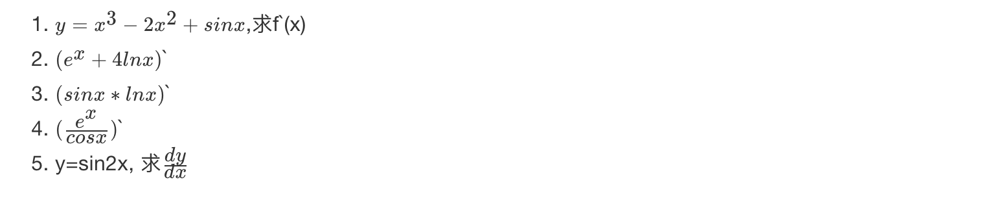

答案：

- 1\.


- 2\.


- 3\.


- 4\.


- 5\.


#### 4 矩阵（向量）求导 \[了解\]


参考链接：<a href="https://en.wikipedia.org/wiki/Matrix_calculus#Scalar-by-vector_identities" target="_blank"></a><a href="https://en.wikipedia.org/wiki/Matrix_calculus#Scalar-by-vector_identities" target="_blank">https://en.wikipedia.org/wiki/Matrix_calculus#Scalar-by-vector_identities</a>

#### 3 小结

- 常见函数的求导方式和导数的四则运算

---

### 2.4 线性回归的损失和优化

#### 学习目标

- 知道线性回归中损失函数
- 知道使用正规方程对损失函数优化的过程
- 知道使用梯度下降法对损失函数优化的过程

------------------------------------------------------------------------

假设刚才的房子例子，真实的数据之间存在这样的关系：

``` lang-python
真实关系：
真实房子价格 = 0.02×中心区域的距离 + 0.04×城市一氧化氮浓度 + (-0.12×自住房平均房价) + 0.254×城镇犯罪率
```

那么现在呢，我们随意指定一个关系（猜测）

``` lang-python
随机指定关系：
预测房子价格 = 0.25×中心区域的距离 + 0.14×城市一氧化氮浓度 + 0.42×自住房平均房价 + 0.34×城镇犯罪率
```

请问这样的话，会发生什么？真实结果与我们预测的结果之间是不是存在一定的误差呢？类似这样样子


既然存在这个误差，那我们就将这个误差给衡量出来

#### 1 损失函数

总损失定义为：


- y<sub>i</sub>为第i个训练样本的真实值
- h(x<sub>i</sub>)为第i个训练样本特征值组合预测函数
- 又称最小二乘法

如何去减少这个损失，使我们预测的更加准确些？既然存在了这个损失，我们一直说机器学习有自动学习的功能，在线性回归这里更是能够体现。这里可以通过一些优化方法去优化（其实是数学当中的求导功能）回归的总损失！！！

#### 2 优化算法

**如何去求模型当中的W，使得损失最小？（目的是找到最小损失对应的W值）**

- 线性回归经常使用的两种优化算法
  - 正规方程
  - 梯度下降法

##### 2.1 正规方程

###### 2.1.1 什么是正规方程


> 理解：X为特征值矩阵，y为目标值矩阵。直接求到最好的结果
>
> 缺点：当特征过多过复杂时，求解速度太慢并且得不到结果


###### 2.1.2 正规方程求解举例

以下表示数据为例：


即：


运用正规方程方法求解参数：


###### 2.1.3 正规方程的推导

- **推导方式：**

把该损失函数转换成矩阵写法：


其中y是真实值矩阵，X是特征值矩阵，w是权重矩阵

把损失函数分开书写： <span class="katex-display"><span class="katex"><span class="katex-mathml">$`
(Xw-y)^2=(Xw-y)^T(Xw-y)
`$</span></span></span> 对展开上式进行求导：


需要求得求导函数的极小值，即上式求导结果为0，经过化解，得结果为： <span class="katex-display"><span class="katex"><span class="katex-mathml">$`
X^TXw=X^Ty
`$</span></span></span> 经过化解为： <span class="katex-display"><span class="katex"><span class="katex-mathml">$`
w=(X^TX)^{-1}X^Ty
`$</span></span></span>

------------------------------------------------------------------------

> 补充：需要用到的矩阵求导公式：

<span class="katex-display"><span class="katex"><span class="katex-mathml">$`
\frac{dx^TA}{dx}=A
`$</span></span></span>

<span class="katex-display"><span class="katex"><span class="katex-mathml">$`
\frac{dAx}{dx}=A^T
`$</span></span></span>


##### 2.2 梯度下降

###### 2.2.1 什么是梯度下降

梯度下降法(Gradient Descent)的基本思想可以类比为一个下山的过程。

假设这样一个场景：

一个人**被困在山上，需要从山上下来**(i.e. 找到山的最低点，也就是山谷)。但此时山上的浓雾很大，导致可视度很低。

因此，下山的路径就无法确定，他必须利用自己周围的信息去找到下山的路径。这个时候，他就可以利用梯度下降算法来帮助自己下山。

具体来说就是，以他当前的所处的位置为基准，**寻找这个位置最陡峭的地方，然后朝着山的高度下降的地方走**，（同理，如果我们的目标是上山，也就是爬到山顶，那么此时应该是朝着最陡峭的方向往上走）。然后每走一段距离，都反复采用同一个方法，最后就能成功的抵达山谷。


梯度下降的基本过程就和下山的场景很类似。

首先，我们有一个**可微分的函数**。这个函数就代表着一座山。

我们的目标就是找到**这个函数的最小值**，也就是山底。

根据之前的场景假设，最快的下山的方式就是找到当前位置最陡峭的方向，然后沿着此方向向下走，对应到函数中，就是**找到给定点的梯度** ，然后朝着梯度相反的方向，就能让函数值下降的最快！因为梯度的方向就是函数值变化最快的方向。 所以，我们重复利用这个方法，反复求取梯度，最后就能到达局部的最小值，这就类似于我们下山的过程。而求取梯度就确定了最陡峭的方向，也就是场景中测量方向的手段。

###### 2.2.2 梯度的概念

梯度是微积分中一个很重要的概念

- **在单变量的函数中，梯度其实就是函数的微分，代表着函数在某个给定点的切线的斜率；**

- **在多变量函数中，梯度是一个向量，向量有方向，梯度的方向就指出了函数在给定点的上升最快的方向；**

  - > 在微积分里面，对多元函数的参数求∂偏导数，把求得的各个参数的偏导数以向量的形式写出来，就是梯度。

这也就说明了为什么我们需要千方百计的求取梯度！我们需要到达山底，就需要在每一步观测到此时最陡峭的地方，梯度就恰巧告诉了我们这个方向。梯度的方向是函数在给定点上升最快的方向，那么梯度的反方向就是函数在给定点下降最快的方向，这正是我们所需要的。所以我们只要沿着梯度的反方向一直走，就能走到局部的最低点！

###### 2.2.3 梯度下降举例

- **1. 单变量函数的梯度下降**

我们假设有一个单变量的函数 :J(θ) = θ<sup>2</sup>

函数的微分:J<sup>、</sup>(θ) = 2θ

初始化，起点为： θ<sup>0</sup> = 1

学习率：α = 0.4

我们开始进行梯度下降的迭代计算过程:


如图，经过四次的运算，也就是走了四步，基本就抵达了函数的最低点，也就是山底


- **2.多变量函数的梯度下降**

我们假设有一个目标函数 ：:J(θ) = θ<sub>1</sub><sup>2</sup> + θ<sub>2</sub><sup>2</sup>

现在要通过梯度下降法计算这个函数的最小值。我们通过观察就能发现最小值其实就是 (0，0)点。但是接下 来，我们会从梯度下降算法开始一步步计算到这个最小值! 我们假设初始的起点为: θ<sup>0</sup> = (1, 3)

初始的学习率为:α = 0.1

函数的梯度为:▽:J(θ) =\< 2θ<sub>1</sub> ,2θ<sub>2</sub>\>

进行多次迭代:


我们发现，已经基本靠近函数的最小值点


###### 2.2.4 梯度下降公式


- **1) α是什么含义？**

  α在梯度下降算法中被称作为**学习率**或者**步长**，意味着我们可以通过α来控制每一步走的距离，以保证不要步子跨的太大扯着蛋，哈哈，其实就是不要走太快，错过了最低点。同时也要保证不要走的太慢，导致太阳下山了，还没有走到山下。所以α的选择在梯度下降法中往往是很重要的！α不能太大也不能太小，太小的话，可能导致迟迟走不到最低点，太大的话，会导致错过最低点！


- **2) 为什么梯度要乘以一个负号**？

梯度前加一个负号，就意味着朝着梯度相反的方向前进！我们在前文提到，梯度的方向实际就是函数在此点上升最快的方向！而我们需要朝着下降最快的方向走，自然就是负的梯度的方向，所以此处需要加上负号

我们通过两个图更好理解梯度下降的过程


**所以有了梯度下降这样一个优化算法，回归就有了"自动学习"的能力**

- **优化动态图演示**


#### 3 梯度下降和正规方程的对比

##### 3.1 两种方法对比

| 梯度下降             | 正规方程                        |
|----------------------|---------------------------------|
| 需要选择学习率       | 不需要                          |
| 需要迭代求解         | 一次运算得出                    |
| 特征数量较大可以使用 | 需要计算方程，时间复杂度高O(n3) |

经过前面的介绍，我们发现最小二乘法适用简洁高效，比梯度下降这样的迭代法似乎方便很多。但是这里我们就聊聊最小二乘法的局限性。

- 首先，最小二乘法需要计算X<sup>T</sup>X的逆矩阵，**有可能它的逆矩阵不存在**，这样就没有办法直接用最小二乘法了。
  - 此时就需要使用梯度下降法。当然，我们可以通过对样本数据进行整理，去掉冗余特征。让X<sup>T</sup>X的行列式不为0，然后继续使用最小二乘法。
- 第二，当样本特征n非常的大的时候，计算X<sup>T</sup>X的逆矩阵是一个非常耗时的工作（n x n的矩阵求逆），甚至不可行。
  - 此时以梯度下降为代表的迭代法仍然可以使用。
  - 那这个n到底多大就不适合最小二乘法呢？如果你没有很多的分布式大数据计算资源，建议超过10000个特征就用迭代法吧。或者通过主成分分析降低特征的维度后再用最小二乘法。
- 第三，如果拟合函数不是线性的，这时无法使用最小二乘法，需要通过一些技巧转化为线性才能使用，此时梯度下降仍然可以用。
- 第四，以下特殊情况，。
  - 当样本量m很少，小于特征数n的时候，这时拟合方程是欠定的，常用的优化方法都无法去拟合数据。
  - 当样本量m等于特征数n的时候，用方程组求解就可以了。
  - 当m大于n时，拟合方程是超定的，也就是我们常用与最小二乘法的场景了。

##### 3.2 算法选择依据

- 小规模数据：
  - 正规方程：**LinearRegression(不能解决拟合问题)**
  - 岭回归
- 大规模数据：
  - 梯度下降法：**SGDRegressor**

经过前面介绍，我们发现在真正的开发中，我们使用梯度下降法偏多（深度学习中更加明显），下一节中我们会进一步介绍梯度下降法的一些原理。

#### 4 小结

- 损失函数【知道】
  - 最小二乘法
- 线性回归优化方法【知道】
  - 正规方程
  - 梯度下降法
- 正规方程 -- 一蹴而就【知道】
  - 利用矩阵的逆,转置进行一步求解
  - 只是适合样本和特征比较少的情况
- 梯度下降法 — 循序渐进【知道】
  - 梯度的概念
    - 单变量 -- 切线
    - 多变量 -- 向量
  - 梯度下降法中关注的两个参数
    - α -- 就是步长
      - 步长太小 -- 下山太慢
      - 步长太大 -- 容易跳过极小值点(**\***)
    - 为什么梯度要加一个负号
      - 梯度方向是上升最快方向,负号就是下降最快方向
- 梯度下降法和正规方程选择依据【知道】
  - 小规模数据：
    - 正规方程：**LinearRegression(不能解决拟合问题)**
    - 岭回归
  - 大规模数据：
    - 梯度下降法：**SGDRegressor**

---

### 2.5 梯度下降方法介绍

#### 学习目标

- 掌握梯度下降法的推导过程
- 知道全梯度下降算法的原理
- 知道随机梯度下降算法的原理
- 知道随机平均梯度下降算法的原理
- 知道小批量梯度下降算法的原理

------------------------------------------------------------------------

上一节中给大家介绍了最基本的梯度下降法实现流程，本节我们将进一步介绍**梯度下降法的详细过算法推导过程**和**常见的梯度下降算法**。

#### 1 详解梯度下降算法

##### 1.1梯度下降的相关概念复习

在详细了解梯度下降的算法之前，我们先复习相关的一些概念。

- 步长(Learning rate)：

  - **步长决定了在梯度下降迭代的过程中，每一步沿梯度负方向前进的长度。**用前面下山的例子，步长就是在当前这一步所在位置沿着最陡峭最易下山的位置走的那一步的长度。

- 特征(feature)：

  - **指的是样本中输入部分**，比如2个单特征的样本
    - <span class="katex"><span class="katex-mathml">$`(x^{(0)},y^{(0)}),(x^{(1)},y^{(1)})`$</span></span>
  - 则第一个样本特征为x<sup>(0)</sup>，第一个样本输出为y<sup>(0)</sup>。

- 假设函数(hypothesis function)：

  - **在监督学习中，为了拟合输入样本，而使用的假设函数，记为。**比如对于单个特征的m个样本<span class="katex"><span class="katex-mathml">$`(x^{(i)},y^{(i)})(i=1,2,...m)`$</span></span>,可以采用拟合函数如下： <span class="katex"><span class="katex-mathml">$`h_\theta (x)=\theta _0+\theta _1x`$</span></span>

- 损失函数(loss function)：

  - 为了评估模型拟合的好坏，**通常用损失函数来度量拟合的程度。**损失函数极小化，意味着拟合程度最好，对应的模型参数即为最优参数。

  - 在线性回归中，损失函数通常为样本输出和假设函数的差取平方。比如对于m个样本<span class="katex"><span class="katex-mathml">$`(x_i,y_i)(i=1,2,...m)`$</span></span> 采用线性回归，损失函数为：

    

> 其中x<sub>i</sub>表示第i个样本特征，y<sub>i</sub>表示第i个样本对应的输出，h<sub>θ</sub>(x<sub>i</sub>)为假设函数。

##### 1.2 梯度下降法的推导流程

**1) 先决条件： 确认优化模型的假设函数和损失函数。**

比如对于线性回归，假设函数表示为 <span class="katex"><span class="katex-mathml">$`h_\theta (x_1,x_2,...,x_n)=\theta _0+\theta _1x_1+...+\theta _nx_n`$</span></span>, 其中为模型参数，<span class="katex"><span class="katex-mathml">$`x_i (i = 0,1,2... n)`$</span></span>为每个样本的n个特征值。这个表示可以简化，我们增加一个特征x<sub>0</sub>=1 ，这样


同样是线性回归，对应于上面的假设函数，损失函数为：


**2) 算法相关参数初始化,**

主要是初始化,算法终止距离ε以及步长α。在没有任何先验知识的时候，我喜欢将所有的θ 初始化为0， 将步长初始化为1。在调优的时候再 优化。

**3) 算法过程：**

3.1) 确定当前位置的损失函数的梯度，对于,其梯度表达式如下：


3.2) 用步长乘以损失函数的梯度，得到当前位置下降的距离，即


对应于前面登山例子中的某一步。

3.3) 确定是否所有的，梯度下降的距离都小于ε，如果小于ε则算法终止，当前所有的<span class="katex"><span class="katex-mathml">$`\theta _i(i=0,1,...n)`$</span></span>即为最终结果。否则进入步骤4.

4)更新所有的θ ，对于，其更新表达式如下。更新完毕后继续转入步骤1.


------------------------------------------------------------------------

下面用线性回归的例子来具体描述梯度下降。假设我们的样本是:


损失函数如前面先决条件所述：


则在算法过程步骤1中对于的偏导数计算如下：


由于样本中没有x<sub>i</sub>上式中令所有的x<sup>j</sup><sub>0</sub>为1.

步骤4中的更新表达式如下：


从这个例子可以看出当前点的梯度方向是由所有的样本决定的，加1/m是为了好理解。由于步长也为常数，他们的乘积也为常数，所以这里α\*1/m可以用一个常数表示。

------------------------------------------------------------------------

在下面一节中，咱们会详细讲到梯度下降法的变种，他们主要的区别就是**对样本的采用方法不同。这里我们采用的是用所有样本。**

#### 2 梯度下降法大家族

首先，我们来看一下，常见的梯度下降算法有：

- **全梯度下降算法(Full gradient descent),**
- **随机梯度下降算法(Stochastic gradient descent),**
- **小批量梯度下降算法(Mini-batch gradient descent),**
- **随机平均梯度下降算法(Stochastic average gradient descent)**

它们都是为了正确地调节权重向量，通过为每个权重计算一个梯度，从而更新权值，使目标函数尽可能最小化。其差别在于样本的使用方式不同。

##### 2.1 全梯度下降算法(FG)

批量梯度下降法，是梯度下降法最常用的形式，**具体做法也就是在更新参数时使用所有的样本来进行更新。**

**计算训练集所有样本误差**，**对其求和再取平均值作为目标函数**。

权重向量沿其梯度相反的方向移动，从而使当前目标函数减少得最多。

其是在整个训练数据集上计算损失函数关于参数θ 的梯度：


> 由于我们有m个样本，这里求梯度的时候就用了所有m个样本的梯度数据。

注意：

- 因为在执行每次更新时，我们需要在整个数据集上计算所有的梯度，所以批梯度下降法的速度会很慢，同时，批梯度下降法无法处理超出内存容量限制的数据集。

- **批梯度下降法同样也不能在线更新模型，即在运行的过程中，不能增加新的样本**。

##### 2.2 随机梯度下降算法(SG)

由于FG每迭代更新一次权重都需要计算所有样本误差，而实际问题中经常有上亿的训练样本，故效率偏低，且容易陷入局部最优解，因此提出了随机梯度下降算法。

其每轮计算的目标函数不再是全体样本误差，而仅是单个样本误差，即**每次只代入计算一个样本目标函数的梯度来更新权重，再取下一个样本重复此过程，直到损失函数值停止下降或损失函数值小于某个可以容忍的阈值。**

此过程简单，高效，通常可以较好地避免更新迭代收敛到局部最优解。其迭代形式为


但是由于，SG每次只使用一个样本迭代，若遇上噪声则容易陷入局部最优解。

##### 2.3 小批量梯度下降算法

小批量梯度下降(mini-batch)算法是FG和SG的折中方案,在一定程度上兼顾了以上两种方法的优点。

**每次从训练样本集上随机抽取一个小样本集，在抽出来的小样本集上采用FG迭代更新权重。**

被抽出的小样本集所含样本点的个数称为batch_size，通常设置为2的幂次方，更有利于GPU加速处理。

特别的，若batch_size=1，则变成了SG；若batch_size=n，则变成了FG.其迭代形式为


> 上式中，也就是我们从m个样本中，选择x个样本进行迭代(1\<x\<m),

##### 2.4 随机平均梯度下降算法(SAG)

在SG方法中，虽然避开了运算成本大的问题，但对于大数据训练而言，SG效果常不尽如人意，因为每一轮梯度更新都完全与上一轮的数据和梯度无关。

**随机平均梯度算法克服了这个问题，在内存中为每一个样本都维护一个旧的梯度，随机选择第i个样本来更新此样本的梯度，其他样本的梯度保持不变，然后求得所有梯度的平均值，进而更新了参数。**

如此，每一轮更新仅需计算一个样本的梯度，计算成本等同于SG，但收敛速度快得多。

其迭代形式为：


- 我们知道sgd是当前权重减去步长乘以梯度，得到新的权重。sag中的a，就是平均的意思，具体说，就是在第k步迭代的时候，我考虑的这一步和前面n-1个梯度的平均值，当前权重减去步长乘以最近n个梯度的平均值。
- n是自己设置的，当n=1的时候，就是普通的sgd。
- 这个想法非常的简单，在随机中又增加了确定性，类似于mini-batch sgd的作用，但不同的是，sag又没有去计算更多的样本，只是利用了之前计算出来的梯度，所以每次迭代的计算成本远小于mini-batch sgd，和sgd相当。效果而言，sag相对于sgd，收敛速度快了很多。这一点下面的论文中有具体的描述和证明。
- SAG论文链接：<a href="https://arxiv.org/pdf/1309.2388.pdf" target="_blank">https://arxiv.org/pdf/1309.2388.pdf</a>

#### 3 小结

- 全梯度下降算法(FG)【知道】
  - 在进行计算的时候,计算所有样本的误差平均值,作为我的目标函数
- 随机梯度下降算法(SG)【知道】
  - 每次只选择一个样本进行考核
- 小批量梯度下降算法(mini-batch)【知道】
  - 选择一部分样本进行考核
- 随机平均梯度下降算法(SAG)【知道】
  - 会给每个样本都维持一个平均值,后期计算的时候,参考这个平均值

---

### 2.6 线性回归api再介绍

#### 学习目标

- 了解正规方程的api及常用参数
- 了解梯度下降法api及常用参数

------------------------------------------------------------------------

- sklearn.linear_model.LinearRegression(fit_intercept=True)
  - 通过正规方程优化
  - 参数
    - fit_intercept：是否计算偏置
  - 属性
    - LinearRegression.coef\_：回归系数
    - LinearRegression.intercept\_：偏置
- sklearn.linear_model.SGDRegressor(loss="squared_loss", fit_intercept=True, learning_rate ='invscaling', eta0=0.01)
  - SGDRegressor类实现了随机梯度下降学习，它支持不同的**loss函数和正则化惩罚项**来拟合线性回归模型。
  - 参数：
    - loss:损失类型
      - **loss=”squared_loss”: 普通最小二乘法**
    - fit_intercept：是否计算偏置
    - learning_rate : string, optional
      - 学习率填充
      - **'constant': eta = eta0**
      - 'optimal': eta = 1.0 / (alpha \* (t + t0))
      - **'invscaling': eta = eta0 / pow(t, power_t)\[default\]**
        - **power_t=0.25:存在父类当中**
      - **对于一个常数值的学习率来说，可以使用learning_rate=’constant’ ，并使用eta0来指定学习率。**
  - 属性：
    - SGDRegressor.coef\_：回归系数
    - SGDRegressor.intercept\_：偏置

> sklearn提供给我们两种实现的API， 可以根据选择使用

#### 小结

- 正规方程
  - sklearn.linear_model.LinearRegression()
- 梯度下降法
  - sklearn.linear_model.SGDRegressor(）

---

### 2.7 案例：波士顿房价预测

#### 学习目标

- 通过案例掌握正规方程和梯度下降法api的使用

------------------------------------------------------------------------

#### 1 案例背景介绍

- 数据介绍


> 给定的这些特征，是专家们得出的影响房价的结果属性。我们此阶段不需要自己去探究特征是否有用，只需要使用这些特征。到后面量化很多特征需要我们自己去寻找

#### 2 案例分析

回归当中的数据大小不一致，是否会导致结果影响较大。所以需要做标准化处理。

- 数据分割与标准化处理
- 回归预测
- 线性回归的算法效果评估

#### 3 回归性能评估

均方误差(Mean Squared Error)MSE)评价机制：


注：y<sup>i</sup>为预测值， 为真实值

> 思考：MSE和最小二乘法的区别是？

- sklearn.metrics.mean_squared_error(y_true, y_pred)
  - 均方误差回归损失
  - y_true:真实值
  - y_pred:预测值
  - return:浮点数结果

#### 4 代码实现

##### 4.1 正规方程

``` lang-python
def linear_model1():
    """
    线性回归:正规方程
    :return:None
    """
    # 1.获取数据
    data = load_boston()

    # 2.数据集划分
    x_train, x_test, y_train, y_test = train_test_split(data.data, data.target, random_state=22)

    # 3.特征工程-标准化
    transfer = StandardScaler()
    x_train = transfer.fit_transform(x_train)
    x_test = transfer.fit_transform(x_test)

    # 4.机器学习-线性回归(正规方程)
    estimator = LinearRegression()
    estimator.fit(x_train, y_train)

    # 5.模型评估
    # 5.1 获取系数等值
    y_predict = estimator.predict(x_test)
    print("预测值为:\n", y_predict)
    print("模型中的系数为:\n", estimator.coef_)
    print("模型中的偏置为:\n", estimator.intercept_)

    # 5.2 评价
    # 均方误差
    error = mean_squared_error(y_test, y_predict)
    print("误差为:\n", error)

    return None
```

##### 4.2 梯度下降法

``` lang-python
def linear_model2():
    """
    线性回归:梯度下降法
    :return:None
    """
    # 1.获取数据
    data = load_boston()

    # 2.数据集划分
    x_train, x_test, y_train, y_test = train_test_split(data.data, data.target, random_state=22)

    # 3.特征工程-标准化
    transfer = StandardScaler()
    x_train = transfer.fit_transform(x_train)
    x_test = transfer.fit_transform(x_test)

    # 4.机器学习-线性回归(特征方程)
    estimator = SGDRegressor(max_iter=1000)
    estimator.fit(x_train, y_train)

    # 5.模型评估
    # 5.1 获取系数等值
    y_predict = estimator.predict(x_test)
    print("预测值为:\n", y_predict)
    print("模型中的系数为:\n", estimator.coef_)
    print("模型中的偏置为:\n", estimator.intercept_)

    # 5.2 评价
    # 均方误差
    error = mean_squared_error(y_test, y_predict)
    print("误差为:\n", error)

    return None
```

我们也可以尝试去修改学习率

``` lang-python
estimator = SGDRegressor(max_iter=1000,learning_rate="constant",eta0=0.1)
```

此时我们可以通过调参数，找到学习率效果更好的值。

#### 5 小结

- 正规方程和梯度下降法api在真实案例中的使用【知道】
- 线性回归性能评估【知道】
  - 均方误差

---

### 2.8 欠拟合和过拟合

#### 学习目标

- 掌握过拟合、欠拟合的概念
- 掌握过拟合、欠拟合产生的原因
- 知道什么是正则化，以及正则化的分类

------------------------------------------------------------------------

#### 1 定义

- 过拟合：一个假设**在训练数据上能够获得比其他假设更好的拟合， 但是在测试数据集上却不能很好地拟合数据**，此时认为这个假设出现了过拟合的现象。(模型过于复杂)
- 欠拟合：一个假设**在训练数据上不能获得更好的拟合，并且在测试数据集上也不能很好地拟合数据**，此时认为这个假设出现了欠拟合的现象。(模型过于简单)


那么是什么原因导致模型复杂？线性回归进行训练学习的时候变成模型会变得复杂，这里就对应前面再说的线性回归的两种关系，非线性关系的数据，也就是存在很多无用的特征或者现实中的事物特征跟目标值的关系并不是简单的线性关系。

#### 2 原因以及解决办法

- 欠拟合原因以及解决办法
  - 原因：学习到数据的特征过少
  - 解决办法：
    - **1）添加其他特征项，**有时候我们模型出现欠拟合的时候是因为特征项不够导致的，可以添加其他特征项来很好地解决。例如，“组合”、“泛化”、“相关性”三类特征是特征添加的重要手段，无论在什么场景，都可以照葫芦画瓢，总会得到意想不到的效果。除上面的特征之外，“上下文特征”、“平台特征”等等，都可以作为特征添加的首选项。
    - **2）添加多项式特征**，这个在机器学习算法里面用的很普遍，例如将线性模型通过添加二次项或者三次项使模型泛化能力更强。
- 过拟合原因以及解决办法
  - 原因：原始特征过多，存在一些嘈杂特征， 模型过于复杂是因为模型尝试去兼顾各个测试数据点
  - 解决办法：
    - 1）重新清洗数据，导致过拟合的一个原因也有可能是数据不纯导致的，如果出现了过拟合就需要我们重新清洗数据。
    - 2）增大数据的训练量，还有一个原因就是我们用于训练的数据量太小导致的，训练数据占总数据的比例过小。
    - **3）正则化**
    - 4）减少特征维度，防止**维灾难**

#### 3 正则化

##### 3.1 什么是正则化

在解决回归过拟合中，我们选择正则化。但是对于其他机器学习算法如分类算法来说也会出现这样的问题，除了一些算法本身作用之外（决策树、神经网络），我们更多的也是去自己做特征选择，包括之前说的删除、合并一些特征


**如何解决？**


**在学习的时候，数据提供的特征有些影响模型复杂度或者这个特征的数据点异常较多，所以算法在学习的时候尽量减少这个特征的影响（甚至删除某个特征的影响），这就是正则化**

注：调整时候，算法并不知道某个特征影响，而是去调整参数得出优化的结果

##### 3.2 正则化类别

- L2正则化
  - 作用：可以使得其中一些W的都很小，都接近于0，削弱某个特征的影响
  - 优点：越小的参数说明模型越简单，越简单的模型则越不容易产生过拟合现象
  - Ridge回归
- L1正则化
  - 作用：可以使得其中一些W的值直接为0，删除这个特征的影响
  - LASSO回归

------------------------------------------------------------------------

#### 4 小结

- 欠拟合【掌握】
  - 在训练集上表现不好，在测试集上表现不好
  - 解决方法：
    - 继续学习
      - 1.添加其他特征项
      - 2.添加多项式特征
- 过拟合【掌握】
  - 在训练集上表现好，在测试集上表现不好
  - 解决方法：
    - 1.重新清洗数据集
    - 2.增大数据的训练量
    - 3.正则化
    - 4.减少特征维度
- 正则化【掌握】
  - 通过限制高次项的系数进行防止过拟合
  - L1正则化
    - 理解：直接把高次项前面的系数变为0
    - Lasso回归
  - L2正则化
    - 理解：把高次项前面的系数变成特别小的值
    - 岭回归

---

### 2.9 正则化线性模型

#### 学习目标

- 知道正则化中岭回归的线性模型
- 知道正则化中lasso回归的线性模型
- 知道正则化中弹性网络的线性模型
- 了解正则化中early stopping的线性模型

------------------------------------------------------------------------

正则化线性模型介绍：

- Ridge Regression 岭回归
- Lasso 回归
- Elastic Net 弹性网络
- Early stopping

#### 1 岭回归

岭回归(Ridge Regression ，又名 Tikhonov regularization)是线性回归的正则化版本，即在原来的线性回归的 cost function 中添加正则项（regularization term）:


以达到在拟合数据的同时，使模型权重尽可能小的目的,岭回归代价函数:


- α=0：岭回归退化为线性回归

#### 2 Lasso 回归

Lasso 回归(Lasso Regression)是线性回归的另一种正则化版本，正则项为权值向量的ℓ1范数。

Lasso回归的代价函数 ：


【注意 】

- Lasso Regression 的代价函数在 θ<sub>i</sub>=0处是不可导的.
- 解决方法：在θ<sub>i</sub>=0处用一个次梯度向量(subgradient vector)代替梯度，如下式
- Lasso Regression 的次梯度向量


Lasso Regression 有一个很重要的性质是：倾向于完全消除不重要的权重。

例如：当α 取值相对较大时，高阶多项式退化为二次甚至是线性：高阶多项式特征的权重被置为0。

也就是说，Lasso Regression 能够自动进行特征选择，并输出一个稀疏模型（只有少数特征的权重是非零的）。

#### 3 弹性网络

弹性网络(Elastic Net)在岭回归和Lasso回归中进行了折中，通过 **混合比(mix ratio) r** 进行控制：

- r=0：弹性网络变为岭回归
- r=1：弹性网络便为Lasso回归

弹性网络的代价函数 ：


一般来说，我们应避免使用**朴素线性回归**，而应对模型进行一定的正则化处理，那如何选择正则化方法呢？

------------------------------------------------------------------------

**小结：**

- 常用：岭回归

- 假设只有少部分特征是有用的：

  - 弹性网络
  - Lasso
  - 一般来说，弹性网络的使用更为广泛。因为在特征维度高于训练样本数，或者特征是强相关的情况下，Lasso回归的表现不太稳定。

- api:

``` lang-python
from sklearn.linear_model import Ridge, ElasticNet, Lasso
```

#### 4 Early Stopping \[了解\]

Early Stopping 也是正则化迭代学习的方法之一。

其做法为：在验证错误率达到最小值的时候停止训练。

#### 5 小结

- Ridge Regression 岭回归
  - 就是把系数添加平方项
  - 然后限制系数值的大小
  - α值越小，系数值越大，α越大，系数值越小
- Lasso 回归
  - 对系数值进行绝对值处理
  - 由于绝对值在顶点处不可导，所以进行计算的过程中产生很多0，最后得到结果为：稀疏矩阵
- Elastic Net 弹性网络
  - 是前两个内容的综合
  - 设置了一个r,如果r=0--岭回归；r=1--Lasso回归
- Early stopping
  - 通过限制错误率的阈值，进行停止

---

### 2.10 线性回归的改进-岭回归

#### 学习目标

- 知道岭回归api的具体使用

------------------------------------------------------------------------

#### 1 API

- sklearn.linear_model.Ridge(alpha=1.0, fit_intercept=True,solver="auto", normalize=False)
  - 具有l2正则化的线性回归
  - alpha:正则化力度，也叫 λ
  - solver:会根据数据自动选择优化方法
    - **sag:如果数据集、特征都比较大，选择该随机梯度下降优化（SAG）**
  - normalize:数据是否进行标准化
    - normalize=False:可以在fit之前调用preprocessing.StandardScaler标准化数据
  - Ridge.coef\_:回归权重
  - Ridge.intercept\_:回归偏置

**Ridge方法相当于SGDRegressor(penalty='l2', loss="squared_loss"),只不过SGDRegressor实现了一个普通的随机梯度下降学习，推荐使用Ridge(实现了SAG)**

- sklearn.linear_model.RidgeCV(\_BaseRidgeCV, RegressorMixin)
  - 具有l2正则化的线性回归，可以进行交叉验证
  - coef\_:回归系数

``` lang-python
class _BaseRidgeCV(LinearModel):
    def __init__(self, alphas=(0.1, 1.0, 10.0),
                 fit_intercept=True, normalize=False,scoring=None,
                 cv=None, gcv_mode=None,
                 store_cv_values=False):
```

#### 2 正则化程度变化

观察正则化程度的变化，对结果的影响？


- 正则化力度越大，权重系数会越小
- 正则化力度越小，权重系数会越大

#### 3 波士顿房价预测

``` lang-python
def linear_model3():
    """
    线性回归:岭回归
    :return:
    """
    # 1.获取数据
    data = load_boston()

    # 2.数据集划分
    x_train, x_test, y_train, y_test = train_test_split(data.data, data.target, random_state=22)

    # 3.特征工程-标准化
    transfer = StandardScaler()
    x_train = transfer.fit_transform(x_train)
    x_test = transfer.fit_transform(x_test)

    # 4.机器学习-线性回归(岭回归)
    estimator = Ridge(alpha=1)
    # estimator = RidgeCV(alphas=(0.1, 1, 10))
    estimator.fit(x_train, y_train)

    # 5.模型评估
    # 5.1 获取系数等值
    y_predict = estimator.predict(x_test)
    print("预测值为:\n", y_predict)
    print("模型中的系数为:\n", estimator.coef_)
    print("模型中的偏置为:\n", estimator.intercept_)

    # 5.2 评价
    # 均方误差
    error = mean_squared_error(y_test, y_predict)
    print("误差为:\n", error)
```

#### 4 小结

- sklearn.linear_model.Ridge(alpha=1.0, fit_intercept=True,solver="auto", normalize=False)【知道】
  - 具有l2正则化的线性回归
  - alpha -- 正则化
    - 正则化力度越大，权重系数会越小
    - 正则化力度越小，权重系数会越大
  - normalize
    - 默认封装了，对数据进行标准化处理

---

### 2.11 模型的保存和加载

#### 学习目标

- 知道sklearn中模型的保存和加载

------------------------------------------------------------------------

#### 1 sklearn模型的保存和加载API

- from sklearn.externals import joblib
  - 保存：joblib.dump(estimator, 'test.pkl')
  - 加载：estimator = joblib.load('test.pkl')

#### 2 线性回归的模型保存加载案例

``` lang-python
def load_dump_demo():
    """
    模型保存和加载
    :return:
    """
    # 1.获取数据
    data = load_boston()

    # 2.数据集划分
    x_train, x_test, y_train, y_test = train_test_split(data.data, data.target, random_state=22)

    # 3.特征工程-标准化
    transfer = StandardScaler()
    x_train = transfer.fit_transform(x_train)
    x_test = transfer.fit_transform(x_test)

    # 4.机器学习-线性回归(岭回归)
    # # 4.1 模型训练
    # estimator = Ridge(alpha=1)
    # estimator.fit(x_train, y_train)
    #
    # # 4.2 模型保存
    # joblib.dump(estimator, "./data/test.pkl")

    # 4.3 模型加载
    estimator = joblib.load("./data/test.pkl")

    # 5.模型评估
    # 5.1 获取系数等值
    y_predict = estimator.predict(x_test)
    print("预测值为:\n", y_predict)
    print("模型中的系数为:\n", estimator.coef_)
    print("模型中的偏置为:\n", estimator.intercept_)

    # 5.2 评价
    # 均方误差
    error = mean_squared_error(y_test, y_predict)
    print("误差为:\n", error)
```

#### 3 tips

如果你在学习过程中，发现使用上面方法报如下错误：

``` lang-python
ImportError: cannot import name 'joblib' from 'sklearn.externals' (/Library/Python/3.7/site-packages/sklearn/externals/__init__.py)
```

这是因为scikit-learn版本在0.21之后，无法使用`from sklearn.externals import joblib`进行导入，你安装的scikit-learn版本有可能是最新版本。如果需要保存模块，可以使用：

``` lang-python
# 安装
pip install joblib

# 导入
import joblib
```

安装joblib,然后使用`joblib.load`进行加载；使用`joblib.dump`进行保存

参考：<a href="https://scikit-learn.org/stable/modules/model_persistence.html" target="_blank">https://scikit-learn.org/stable/modules/model_persistence.html</a>

#### 4 小结

- sklearn.externals import joblib【知道】
  - 保存：joblib.dump(estimator, 'test.pkl')
  - 加载：estimator = joblib.load('test.pkl')
  - 注意：
    - 1.保存文件，后缀名是\*\*.pkl
    - 2.加载模型是需要通过一个变量进行承接

---

## 逻辑回归

### 学习目标

- 知道逻辑回归的损失函数、优化方法
- 知道逻辑回归的应用场景
- 应用LogisticRegression实现逻辑回归预测
- 知道精确率、召回率等指标的区别
- 知道如何解决样本不均衡情况下的评估
- 会绘制ROC曲线图形

---

### 3.1 逻辑回归介绍

#### 学习目标

- 了解逻辑回归的应用场景
- 知道逻辑回归的原理
- 掌握逻辑回归的损失函数和优化方案

------------------------------------------------------------------------

逻辑回归（Logistic Regression）是机器学习中的**一种分类模型**，逻辑回归是一种分类算法，虽然名字中带有回归。由于算法的简单和高效，在实际中应用非常广泛。

#### 1 逻辑回归的应用场景

- 广告点击率
- 是否为垃圾邮件
- 是否患病
- 金融诈骗
- 虚假账号

看到上面的例子，我们可以发现其中的特点，那就是都属于两个类别之间的判断。逻辑回归就是解决二分类问题的利器

#### 2 逻辑回归的原理

要想掌握逻辑回归，必须掌握两点：

- 逻辑回归中，其输入值是什么

- 如何判断逻辑回归的输出

##### 2.1 输入


逻辑回归的输入就是一个线性回归的结果。

##### 2.2 激活函数

- sigmoid函数 <span class="katex-display"><span class="katex"><span class="katex-mathml">$`
      g(w^T, x)=\frac{1}{1+e^{-h(w)}}=\frac{1}{1+e^{-w^Tx}}
      `$</span></span></span>

- 判断标准

  - 回归的结果输入到sigmoid函数当中
  - 输出结果：\[0, 1\]区间中的一个概率值，默认为0.5为阈值


> 逻辑回归最终的分类是通过属于某个类别的概率值来判断是否属于某个类别，并且这个类别默认标记为1(正例),另外的一个类别会标记为0(反例)。（方便损失计算）

输出结果解释(重要)：假设有两个类别A，B，并且假设我们的概率值为属于A(1)这个类别的概率值。现在有一个样本的输入到逻辑回归输出结果0.55，那么这个概率值超过0.5，意味着我们训练或者预测的结果就是A(1)类别。那么反之，如果得出结果为0.3那么，训练或者预测结果就为B(0)类别。

关于**逻辑回归的阈值是可以进行改变的**，比如上面举例中，如果你把阈值设置为0.6，那么输出的结果0.55，就属于B类。

**在之前，我们用最小二乘法衡量线性回归的损失**

**在逻辑回归中，当预测结果不对的时候，我们该怎么衡量其损失呢？**

我们来看下图(下图中，设置阈值为0.6)，


那么如何去衡量逻辑回归的预测结果与真实结果的差异呢？

#### 3 损失以及优化

##### 3.1 损失

逻辑回归的损失，称之为**对数似然损失**，公式如下：

- 分开类别：


> 为预测值对应的概率值。

怎么理解单个的式子呢？这个要根据log的函数图像来理解


无论何时，我们都希望**损失函数值，越小越好**

分情况讨论，对应的损失函数值：

- **当y=1时，我们希望值越大越好；**
- **当y=0时，我们希望值越小越好**

<!-- -->

- 综合完整损失函数


接下来我们呢就带入上面那个例子来计算一遍，就能理解意义了。


> 我们已经知道，-log(P), P值越大，结果越小，所以我们可以对着这个损失的式子去分析

##### 3.2 优化

同样使用梯度下降优化算法，去减少损失函数的值。这样去更新逻辑回归前面对应算法的权重参数，**提升原本属于1类别的概率，降低原本是0类别的概率。**

------------------------------------------------------------------------

#### 4 小结

- 逻辑回归概念【知道】
  - 解决的是一个二分类问题
  - 逻辑回归的输入是线性回归的输出
- 逻辑回归的原理【掌握】
  - 输入：
    - 线性回归的输出
  - 激活函数
    - sigmoid函数
    - 把整体的值映射到\[0,1\]
    - 再设置一个阈值，进行分类判断
- 逻辑回归的损失和优化【掌握】
  - 损失
    - 对数似然损失
    - 借助了log思想，进行完成
    - 真实值等于0，等于1两种情况进行划分
  - 优化
    - 提升原本属于1类别的概率，降低原本是0类别的概率。

---

### 3.2 逻辑回归api介绍

#### 学习目标

- 知道逻辑回归api的用法

------------------------------------------------------------------------

- sklearn.linear_model.LogisticRegression(solver='liblinear', penalty=‘l2’, C = 1.0)

  - solver可选参数:{'liblinear', 'sag', 'saga','newton-cg', 'lbfgs'}，

    - 默认: 'liblinear'；用于优化问题的算法。

    - 对于小数据集来说，“liblinear”是个不错的选择，而“sag”和'saga'对于大型数据集会更快。

    - 对于多类问题，只有'newton-cg'， 'sag'， 'saga'和'lbfgs'可以处理多项损失;“liblinear”仅限于“one-versus-rest”分类。

  - penalty：正则化的种类

  - C：正则化力度

> **默认将类别数量少的当做正例**

**LogisticRegression方法相当于 SGDClassifier(loss="log", penalty=" "),SGDClassifier实现了一个普通的随机梯度下降学习。而使用LogisticRegression(实现了SAG)**

---

### 3.3 案例：癌症分类预测-良／恶性乳腺癌肿瘤预测

#### 学习目标

- 通过肿瘤预测案例，学会如何使用逻辑回归对模型进行训练

------------------------------------------------------------------------

#### 1 背景介绍

- 数据介绍


原始数据的下载地址：<a href="https://archive.ics.uci.edu/ml/machine-learning-databases/breast-cancer-wisconsin/" target="_blank">https://archive.ics.uci.edu/ml/machine-learning-databases/</a>

> 数据描述
>
> （1）699条样本，共11列数据，第一列用语检索的id，后9列分别是与肿瘤
>
> 相关的医学特征，最后一列表示肿瘤类型的数值。
>
> （2）包含16个缺失值，用”?”标出。

#### 2 案例分析

    1.获取数据
    2.基本数据处理
    2.1 缺失值处理
    2.2 确定特征值,目标值
    2.3 分割数据
    3.特征工程(标准化)
    4.机器学习(逻辑回归)
    5.模型评估

#### 3 代码实现

``` lang-python
import pandas as pd
import numpy as np
from sklearn.model_selection import train_test_split
from sklearn.preprocessing import StandardScaler
from sklearn.linear_model import LogisticRegression

import ssl
ssl._create_default_https_context = ssl._create_unverified_context
```

``` lang-python
# 1.获取数据
names = ['Sample code number', 'Clump Thickness', 'Uniformity of Cell Size', 'Uniformity of Cell Shape',
                   'Marginal Adhesion', 'Single Epithelial Cell Size', 'Bare Nuclei', 'Bland Chromatin',
                   'Normal Nucleoli', 'Mitoses', 'Class']

data = pd.read_csv("https://archive.ics.uci.edu/ml/machine-learning-databases/breast-cancer-wisconsin/breast-cancer-wisconsin.data",
                  names=names)
data.head()
```

``` lang-python
# 2.基本数据处理
# 2.1 缺失值处理
data = data.replace(to_replace="?", value=np.NaN)
data = data.dropna()
# 2.2 确定特征值,目标值
x = data.iloc[:, 1:10]
x.head()
y = data["Class"]
y.head()
# 2.3 分割数据
x_train, x_test, y_train, y_test = train_test_split(x, y, random_state=22)
```

``` lang-python
# 3.特征工程(标准化)
transfer = StandardScaler()
x_train = transfer.fit_transform(x_train)
x_test = transfer.transform(x_test)
```

``` lang-python
# 4.机器学习(逻辑回归)
estimator = LogisticRegression()
estimator.fit(x_train, y_train)
```

``` lang-python
# 5.模型评估
y_predict = estimator.predict(x_test)
y_predict
estimator.score(x_test, y_test)
```

在很多分类场景当中我们不一定只关注预测的准确率！！！！！

比如以这个癌症举例子！！！**我们并不关注预测的准确率，而是关注在所有的样本当中，癌症患者有没有被全部预测（检测）出来。**

------------------------------------------------------------------------

#### 4 小结

- 肿瘤预测案例实现【知道】
  - 如果数据中有缺失值，一定要对其进行处理
  - 准确率并不是衡量分类正确的唯一标准

---

### 3.4 分类评估方法

#### 学习目标

- 了解什么是混淆矩阵
- 知道分类评估中的精确率和召回率
- 知道roc曲线和auc指标

------------------------------------------------------------------------

#### 1.分类评估方法

##### 1.1 精确率与召回率

###### 1.1.1 混淆矩阵

在分类任务下，预测结果(Predicted Condition)与正确标记(True Condition)之间存在四种不同的组合，构成混淆矩阵(适用于多分类)


###### 1.1.2 精确率与召回率

- 精确率(Precision)：预测结果为正例样本中真实为正例的比例（了解）


- 召回率(Recall)：真实为正例的样本中预测结果为正例的比例（查得全，对正样本的区分能力）


##### 1.2 F1-score

还有其他的评估标准，F1-score，反映了模型的稳健型


------------------------------------------------------------------------

##### 1.3 分类评估报告api

- sklearn.metrics.classification_report(y_true, y_pred, labels=\[\], target_names=None )
  - y_true：真实目标值
  - y_pred：估计器预测目标值
  - labels:指定类别对应的数字
  - target_names：目标类别名称
  - return：每个类别精确率与召回率

``` lang-python
ret = classification_report(y_test, y_predict, labels=(2,4), target_names=("良性", "恶性"))
print(ret)
```

**假设这样一个情况，如果99个样本癌症，1个样本非癌症，不管怎样我全都预测正例(默认癌症为正例),准确率就为99%但是这样效果并不好，这就是样本不均衡下的评估问题**

问题：**如何衡量样本不均衡下的评估**？

#### 2 ROC曲线与AUC指标

##### 2.1 TPR与FPR

- TPR = TP / (TP + FN)
  - 所有真实类别为1的样本中，预测类别为1的比例
- FPR = FP / (FP + TN)
  - 所有真实类别为0的样本中，预测类别为1的比例

##### 2.2 ROC曲线

- ROC曲线的横轴就是FPRate，纵轴就是TPRate，当二者相等时，表示的意义则是：对于不论真实类别是1还是0的样本，分类器预测为1的概率是相等的，此时AUC为0.5


##### 2.3 AUC指标

- AUC的概率意义是随机取一对正负样本，正样本得分大于负样本得分的概率
- AUC的范围在\[0, 1\]之间，并且越接近1越好，越接近0.5属于乱猜
- **AUC=1，完美分类器，采用这个预测模型时，不管设定什么阈值都能得出完美预测。绝大多数预测的场合，不存在完美分类器。**
- **0.5\<AUC\<1，优于随机猜测。这个分类器（模型）妥善设定阈值的话，能有预测价值。**

##### 2.4 AUC计算API

- from sklearn.metrics import roc_auc_score
  - sklearn.metrics.roc_auc_score(y_true, y_score)
    - 计算ROC曲线面积，即AUC值
    - y_true：每个样本的真实类别，必须为0(反例),1(正例)标记
    - y_score：预测得分，可以是正类的估计概率、置信值或者分类器方法的返回值

``` lang-python
# 0.5~1之间，越接近于1约好
y_test = np.where(y_test > 2.5, 1, 0)

print("AUC指标：", roc_auc_score(y_test, y_predict)
```

- AUC只能用来评价二分类
- AUC非常适合评价样本不平衡中的分类器性能

------------------------------------------------------------------------

#### 3 小结

- 混淆矩阵【了解】
  - 真正例（TP）
  - 伪反例（FN）
  - 伪正例（FP）
  - 真反例（TN）
- 精确率(Precision)与召回率(Recall)【知道】
  - 准确率：（对不对）
    - （TP+TN）/(TP+TN+FN+FP)
  - 精确率 -- 查的准不准
    - TP/(TP+FP)
  - 召回率 -- 查的全不全
    - TP/(TP+FN)
  - F1-score
    - 反映模型的稳健性
- roc曲线和auc指标【知道】
  - roc曲线
    - 通过tpr和fpr来进行图形绘制，然后绘制之后，行成一个指标auc
  - auc
    - 越接近1，效果越好
    - 越接近0，效果越差
    - 越接近0.5，效果就是胡说
  - 注意：
    - 这个指标主要用于评价不平衡的二分类问题

---

### 3.5 ROC曲线的绘制

#### 学习目标

- 知道ROC曲线的绘制

------------------------------------------------------------------------

关于ROC曲线的绘制过程，通过以下举例进行说明

假设有6次展示记录，有两次被点击了，得到一个展示序列（1:1,2:0,3:1,4:0,5:0,6:0），前面的表示序号，后面的表示点击（1）或没有点击（0）。

然后在这6次展示的时候都通过model算出了点击的概率序列。

下面看三种情况。

#### 1 曲线绘制

##### 1.1 序列一曲线绘制

**如果概率的序列是（1:0.9,2:0.7,3:0.8,4:0.6,5:0.5,6:0.4）。**

与原来的序列一起，得到序列（从概率从高到低排）

| 1   | 1   | 0   | 0   | 0   | 0   |
|-----|-----|-----|-----|-----|-----|
| 0.9 | 0.8 | 0.7 | 0.6 | 0.5 | 0.4 |

- 绘制的步骤是：
  - 1）把概率序列从高到低排序，得到顺序（1:0.9,3:0.8,2:0.7,4:0.6,5:0.5,6:0.4）；
  - 2）从概率最大开始取一个点作为正类，取到点1，计算得到TPR=0.5，FPR=0.0；
  - 3）从概率最大开始，再取一个点作为正类，取到点3，计算得到TPR=1.0，FPR=0.0；
  - 4）再从最大开始取一个点作为正类，取到点2，计算得到TPR=1.0，FPR=0.25;
  - 5）以此类推，得到6对TPR和FPR。

然后把这6对数据组成6个点(0,0.5),(0,1.0),(0.25,1),(0.5,1),(0.75,1),(1.0,1.0)。

这6个点在二维坐标系中能绘出来。


看看图中，那个就是ROC曲线。

##### 1.2 序列二曲线绘制

**如果概率的序列是（1:0.9,2:0.8,3:0.7,4:0.6,5:0.5,6:0.4）**

与原来的序列一起，得到序列（从概率从高到低排）

| 1   | 0   | 1   | 0   | 0   | 0   |
|-----|-----|-----|-----|-----|-----|
| 0.9 | 0.8 | 0.7 | 0.6 | 0.5 | 0.4 |

- 绘制的步骤是：
  - 1）把概率序列从高到低排序，得到顺序（1:0.9,2:0.8,3:0.7,4:0.6,5:0.5,6:0.4）；
  - 2）从概率最大开始取一个点作为正类，取到点1，计算得到TPR=0.5，FPR=0.0；
  - 3）从概率最大开始，再取一个点作为正类，取到点2，计算得到TPR=0.5，FPR=0.25；
  - 4）再从最大开始取一个点作为正类，取到点3，计算得到TPR=1.0，FPR=0.25;
  - 5）以此类推，得到6对TPR和FPR。

然后把这6对数据组成6个点(0,0.5),(0.25,0.5),(0.25,1),(0.5,1),(0.75,1),(1.0,1.0)。

这6个点在二维坐标系中能绘出来。


看看图中，那个就是ROC曲线。

##### 1.3 序列三曲线绘制

**如果概率的序列是（1:0.4,2:0.6,3:0.5,4:0.7,5:0.8,6:0.9）**

与原来的序列一起，得到序列（从概率从高到低排）

| 0   | 0   | 0   | 0   | 1   | 1   |
|-----|-----|-----|-----|-----|-----|
| 0.9 | 0.8 | 0.7 | 0.6 | 0.5 | 0.4 |

- 绘制的步骤是：
  - 1）把概率序列从高到低排序，得到顺序（6:0.9,5:0.8,4:0.7,2:0.6,3:0.5,1:0.4）；
  - 2）从概率最大开始取一个点作为正类，取到点6，计算得到TPR=0.0，FPR=0.25；
  - 3）从概率最大开始，再取一个点作为正类，取到点5，计算得到TPR=0.0，FPR=0.5；
  - 4）再从最大开始取一个点作为正类，取到点4，计算得到TPR=0.0，FPR=0.75;
  - 5）以此类推，得到6对TPR和FPR。

然后把这6对数据组成6个点(0.25,0.0),(0.5,0.0),(0.75,0.0),(1.0,0.0),(1.0,0.5),(1.0,1.0)。

这6个点在二维坐标系中能绘出来。


看看图中，那个就是ROC曲线。

#### 2 意义解释

如上图的例子，总共6个点，2个正样本，4个负样本，取一个正样本和一个负样本的情况总共有8种。

上面的第一种情况，从上往下取，无论怎么取，正样本的概率总在负样本之上，所以分对的概率为1，AUC=1。再看那个ROC曲线，它的积分是什么？也是1，ROC曲线的积分与AUC相等。

上面第二种情况，如果取到了样本2和3，那就分错了，其他情况都分对了；所以分对的概率是0.875，AUC=0.875。再看那个ROC曲线，它的积分也是0.875，ROC曲线的积分与AUC相等。

上面的第三种情况，无论怎么取，都是分错的，所以分对的概率是0，AUC=0.0。再看ROC曲线，它的积分也是0.0，ROC曲线的积分与AUC相等。

很牛吧，其实AUC的意思是——Area Under roc Curve，就是ROC曲线的积分，也是ROC曲线下面的面积。

绘制ROC曲线的意义很明显，不断地把可能分错的情况扣除掉，从概率最高往下取的点，每有一个是负样本，就会导致分错排在它下面的所有正样本，所以要把它下面的正样本数扣除掉（1-TPR，剩下的正样本的比例）。总的ROC曲线绘制出来了，AUC就定了，分对的概率也能求出来了。

------------------------------------------------------------------------

#### 3 小结

- ROC曲线的绘制【知道】
  - 1.构建模型，把模型的概率值从大到小进行排序
  - 2.从概率最大的点开始取值，一直进行tpr和fpr的计算，然后构建整体模型，得到结果
  - 3.其实就是在求解积分（面积）

---

## 决策树算法

### 学习目标

- 掌握决策树实现过程
- 知道信息熵的公式以及作用
- 知道信息增益、信息增益率和基尼指数的作用
- 知道id3,c4.5，cart算法的区别
- 了解cart剪枝的作用
- 知道特征提取的作用
- 应用DecisionTreeClassifier实现决策树分类

---

### 4.1 决策树算法简介

#### 学习目标

- 知道什么是决策树

------------------------------------------------------------------------

决策树思想的来源非常朴素，程序设计中的条件分支结构就是if-else结构，最早的决策树就是利用这类结构分割数据的一种分类学习方法

**决策树：**

- **是一种树形结构，本质是一颗由多个判断节点组成的树**
- **其中每个内部节点表示一个属性上的判断，**
- **每个分支代表一个判断结果的输出，**
- **最后每个叶节点代表一种分类结果**。

怎么理解这句话？通过一个对话例子


想一想这个女生为什么把年龄放在最上面判断！！！！！！！！！

上面案例是女生通过定性的主观意识，把年龄放到最上面，那么如果需要对这一过程进行量化，该如何处理呢？

此时需要用到信息论中的知识：信息熵，信息增益

------------------------------------------------------------------------

#### 小结

- 决策树定义：
  - 是**一种树形结构**，
  - 本质是**一颗由多个判断节点组成的树**

---

### 4.2 决策树分类原理

#### 学习目标

- 知道如何求解信息熵
- 知道信息增益的求解过程
- 知道信息增益率的求解过程
- 知道基尼系数的求解过程
- 知道信息增益、信息增益率和基尼系数三者之间的区别、联系

------------------------------------------------------------------------

#### 1 熵

##### 1.1 概念

物理学上，**熵 Entropy** 是“混乱”程度的量度。


**系统越有序，熵值越低；系统越混乱或者分散，熵值越高**。

1948年香农提出了**信息熵**（Entropy）的概念。

------------------------------------------------------------------------

- **信息理论**：

1、**从信息的完整性上进行的描述:**

当**系统的有序状态一致时**，数据越集中的地方熵值越小，数据越分散的地方熵值越大。

2、**从信息的有序性上进行的描述:**

当**数据量一致时**，**系统越有序，熵值越低；系统越混乱或者分散，熵值越高**。

------------------------------------------------------------------------

"信息熵" (information entropy)是度量样本集合纯度最常用的一种指标。

假定当前样本集合 D 中第 k 类样本所占的比例为 p<sub>k</sub> (k = 1, 2,. . . , \|y\|) ，

<span class="katex"><span class="katex-mathml">$`p_k=\frac{C^k}{D}`$</span></span>,

> 其中：D为样本的所有数量，C<sup>k</sup> 为第k类样本的数量。

则 D的信息熵定义为(（log是以2为底，lg是以10为底）:


其中：Ent(D) 的值越小，则 D 的纯度越高.

##### 1.2 案例

    课堂案例：
    假设我们没有看世界杯的比赛，但是想知道哪支球队会是冠军，
    我们只能猜测某支球队是或不是冠军，然后观众用对或不对来回答，
    我们想要猜测次数尽可能少，你会用什么方法？

    答案：
    二分法：
    假如有 16 支球队，分别编号，先问是否在 1-8 之间，如果是就继续问是否在 1-4 之间，
    以此类推，直到最后判断出冠军球队是哪支。
    如果球队数量是 16，我们需要问 4 次来得到最后的答案。那么世界冠军这条消息的信息熵就是 4。

    那么信息熵等于4，是如何进行计算的呢？
    Ent(D) = -（p1 * logp1 + p2 * logp2 + ... + p16 * logp16），
    其中 p1, ..., p16 分别是这 16 支球队夺冠的概率。
    当每支球队夺冠概率相等都是 1/16 的时：Ent(D) = -（16 * 1/16 * log1/16） = 4
    每个事件概率相同时，熵最大，这件事越不确定。

    随堂练习：
    篮球比赛里，有4个球队 {A,B,C,D} ，获胜概率分别为{1/2, 1/4, 1/8, 1/8}
    求Ent(D)

答案：


#### 2 划分依据一 -- 信息增益

##### 2.1 **概念**

**信息增益：**以某特征划分数据集前后的熵的差值。熵可以表示样本集合的不确定性，熵越大，样本的不确定性就越大。因此可以**使用划分前后集合熵的差值来衡量使用当前特征对于样本集合D划分效果的好坏**。

**信息增益 = entroy(前) - entroy(后)**

> 注：信息增益表示得知特征X的信息而使得类Y的信息熵减少的程度

- 定义与公式

假定离散属性a有 V 个可能的取值:


> 假设离散属性性别有2（男，女）个可能的取值

若使用a来对样本集 D 进行划分，则会产生 V 个分支结点,

其中第v个分支结点包含了 D 中所有在属性a上取值为a<sup>v</sup>的样本，记为D<sup>v</sup>.

我们可根据前面给出的信息熵公式计算出D<sup>v</sup>的信息熵，再考虑到不同的分支结点所包含的样本数不同，给分支结点赋予权重。

即样本数越多的分支结点的影响越大，于是可计算出用属性a对样本集 D 进行划分所获得的"信息增益" (information gain)

其中：

特征a对训练数据集D的信息增益Gain(D,a),定义为**集合D的信息熵Ent(D)**与**给定特征a条件下D的信息条件Ent(D\|a)**之差，即公式为：


公式的详细解释：

信息熵的计算：


条件熵的计算：


> 其中：
>
> D<sup>v</sup>表示a属性中第v个分支节点包含的样本数
>
> C<sup>kv</sup>表示a属性中第v个分支节点包含的样本数中，第k个类别下包含的样本数

一般而言，信息增益越大，则意味着**使用属性 a 来进行划分所获得的"纯度提升"越大**。因此，我们可用信息增益来进行决策树的划分属性选择，著名的 ID3 决策树学习算法 \[Quinlan， 1986\] 就是以信息增益为准则来选择划分属性。

> 其中，ID3 名字中的 ID 是 Iterative Dichotomiser (迭代二分器)的简称

##### 2.2 案例

如下图，第一列为论坛号码，第二列为性别，第三列为活跃度，最后一列用户是否流失。

我们要解决一个问题：**性别和活跃度两个特征，哪个对用户流失影响更大**？


通过计算信息增益可以解决这个问题，统计上右表信息

其中Positive为正样本（已流失），Negative为负样本（未流失），下面的数值为不同划分下对应的人数。

可得到三个熵：

**a.计算类别信息熵**

整体熵：


**b.计算性别属性的信息熵(a="性别")**


**c.计算性别的信息增益(a="性别")**


**b.计算活跃度属性的信息熵(a="活跃度")**


**c.计算活跃度的信息增益(a="活跃度")**


**活跃度的信息增益比性别的信息增益大，也就是说，活跃度对用户流失的影响比性别大。**在做特征选择或者数据分析的时候，我们应该重点考察活跃度这个指标。

#### 3 划分依据二 -- 信息增益率

##### 3.1 概念

在上面的介绍中，我们有意忽略了"编号"这一列.若把"编号"也作为一个候选划分属性，则根据信息增益公式可计算出它的信息增益为 0.9182，远大于其他候选划分属性。

> 计算每个属性的信息熵过程中,我们发现,该属性的值为0, 也就是其信息增益为0.9182. 但是很明显这么分类,最后出现的结果不具有泛化效果.无法对新样本进行有效预测.

实际上，**信息增益准则对可取值数目较多的属性有所偏好**，为减少这种偏好可能带来的不利影响，著名的 **C4.5 决策树算法 \[Quinlan， 1993J 不直接使用信息增益，而是使用"增益率" (gain ratio) 来选择最优划分属性.**

**增益率：**增益率是用前面的信息增益Gain(D, a)和属性a对应的"固有值"(intrinsic value) \[Quinlan , 1993J的比值来共同定义的。


> 属性 a 的可能取值数目越多(即 V 越大)，则 IV(a) 的值通常会越大.

##### 3.2 案例

###### 3.2.1 案例一

> **a.计算类别信息熵**
>
> **b.计算性别属性的信息熵(性别、活跃度)**
>
> **c.计算活跃度的信息增益(性别、活跃度)**

**d.计算属性分裂信息度量**

用分裂信息度量来考虑某种属性进行分裂时分支的数量信息和尺寸信息，我们把这些信息称为属性的内在信息（instrisic information）。信息增益率用信息增益/内在信息，会导致属性的重要性随着内在信息的增大而减小**（也就是说，如果这个属性本身不确定性就很大，那我就越不倾向于选取它）**，这样算是对单纯用信息增益有所补偿。


**e.计算信息增益率**


活跃度的信息增益率更高一些，所以在构建决策树的时候，优先选择

通过这种方式，在选取节点的过程中，我们可以降低取值较多的属性的选取偏好。

###### 3.2.2 案例二

如下图，第一列为天气，第二列为温度，第三列为湿度，第四列为风速，最后一列该活动是否进行。

我们要解决：**根据下面表格数据，判断在对应天气下，活动是否会进行**？


该数据集有四个属性，属性集合A={ 天气，温度，湿度，风速}， 类别标签有两个，类别集合L={进行，取消}。

**a.计算类别信息熵**

类别信息熵表示的是所有样本中各种类别出现的不确定性之和。根据熵的概念，熵越大，不确定性就越大，把事情搞清楚所需要的信息量就越多。 <span class="katex-display"><span class="katex"><span class="katex-mathml">$`
Ent(D)=-\frac{9}{14}log_2\frac{9}{14}-\frac{5}{14}log_2\frac{5}{14}=0.940
`$</span></span></span> **b.计算每个属性的信息熵**

每个属性的信息熵相当于一种条件熵。他表示的是在某种属性的条件下，各种类别出现的不确定性之和。属性的信息熵越大，表示这个属性中拥有的样本类别越不“纯”。

**c.计算信息增益**

信息增益的 = 熵 - 条件熵，在这里就是 类别信息熵 - 属性信息熵，它表示的是信息不确定性减少的程度。如果一个属性的信息增益越大，就表示用这个属性进行样本划分可以更好的减少划分后样本的不确定性，当然，选择该属性就可以更快更好地完成我们的分类目标。

**信息增益就是ID3算法的特征选择指标。**


> 假设我们把上面表格1的数据前面添加一列为"编号",取值(1--14). 若把"编号"也作为一个候选划分属性,则根据前面步骤: 计算每个属性的信息熵过程中,我们发现,该属性的值为0, 也就是其信息增益为0.940. 但是很明显这么分类,最后出现的结果不具有泛化效果.此时根据信息增益就无法选择出有效分类特征。所以，C4.5选择使用信息增益率对ID3进行改进。

**d.计算属性分裂信息度量**

用分裂信息度量来考虑某种属性进行分裂时分支的数量信息和尺寸信息，我们把这些信息称为属性的内在信息（instrisic information）。信息增益率用信息增益/内在信息，会导致属性的重要性随着内在信息的增大而减小**（也就是说，如果这个属性本身不确定性就很大，那我就越不倾向于选取它）**，这样算是对单纯用信息增益有所补偿。


**e.计算信息增益率**


天气的信息增益率最高，选择天气为分裂属性。发现分裂了之后，天气是“阴”的条件下，类别是”纯“的，所以把它定义为叶子节点，选择不“纯”的结点继续分裂。


在子结点当中重复过程1~5，直到所有的叶子结点足够"纯"。

现在我们来总结一下C4.5的算法流程

    while(当前节点"不纯")：
        1.计算当前节点的类别熵(以类别取值计算)
        2.计算当前阶段的属性熵(按照属性取值吓得类别取值计算)
        3.计算信息增益
        4.计算各个属性的分裂信息度量
        5.计算各个属性的信息增益率
    end while
    当前阶段设置为叶子节点

##### 3.3 为什么使用C4.5要好

**1.用信息增益率来选择属性**

克服了用信息增益来选择属性时偏向选择值多的属性的不足。

**2.采用了一种后剪枝方法**

避免树的高度无节制的增长，避免过度拟合数据

**3.对于缺失值的处理**

在某些情况下，可供使用的数据可能缺少某些属性的值。假如〈x，c(x)〉是样本集S中的一个训练实例，但是其属性A的值A(x)未知。

处理缺少属性值的一种策略是赋给它结点n所对应的训练实例中该属性的最常见值；

另外一种更复杂的策略是为A的每个可能值赋予一个概率。

例如，给定一个布尔属性A，如果结点n包含6个已知A=1和4个A=0的实例，那么A(x)=1的概率是0.6，而A(x)=0的概率是0.4。于是，实例x的60%被分配到A=1的分支，40%被分配到另一个分支。

C4.5就是使用这种方法处理缺少的属性值。

#### 4 划分依据三 -- 基尼值和基尼指数

##### 4.1 概念

CART 决策树 \[Breiman et al., 1984\] 使用"基尼指数" (Gini index)来选择划分属性.

> CART 是Classification and Regression Tree的简称，这是一种著名的决策树学习算法,分类和回归任务都可用

**基尼值Gini（D）：**从数据集D中随机抽取两个样本，其类别标记不一致的概率。**故，Gini（D）值越小，数据集D的纯度越高。**

数据集 D 的纯度可用基尼值来度量:


> <span class="katex"><span class="katex-mathml">$`p_k=\frac{C^k}{D}`$</span></span>
>
> 其中：D为样本的所有数量，C<sup>k</sup>为第k类样本的数量。

**基尼指数Gini_index（D）：**一般，选择使划分后基尼系数最小的属性作为最优化分属性。


##### 4.2 案例

请根据下图列表，按照基尼指数的划分依据，做出决策树。

| 序号 | 是否有房 | 婚姻状况 | 年收入 | 是否拖欠贷款 |
|------|----------|----------|--------|--------------|
| 1    | yes      | single   | 125k   | no           |
| 2    | no       | married  | 100k   | no           |
| 3    | no       | single   | 70k    | no           |
| 4    | yes      | married  | 120k   | no           |
| 5    | no       | divorced | 95k    | yes          |
| 6    | no       | married  | 60k    | no           |
| 7    | yes      | divorced | 220k   | no           |
| 8    | no       | single   | 85k    | yes          |
| 9    | no       | married  | 75k    | no           |
| 10   | No       | Single   | 90k    | Yes          |

1，对数据集非序列标号属性{是否有房，婚姻状况，年收入}分别计算它们的Gini指数，**取Gini指数最小的属性作为决策树的根节点属性。**

> 第一次大循环

2，根节点的Gini值为：


3，当根据是否有房来进行划分时，Gini指数计算过程为：


4，若按婚姻状况属性来划分，属性婚姻状况有三个可能的取值{married，single，divorced}，分别计算划分后的Gini系数增益。

​**{married} \| {single,divorced}**

​**{single} \| {married,divorced}**

​**{divorced} \| {single,married}**


对比计算结果，根据婚姻状况属性来划分根节点时取Gini指数最小的分组作为划分结果，即:

{married} \| {single,divorced}

5，同理可得年收入Gini：

对于年收入属性为数值型属性，首先需要对数据按升序排序，然后从小到大依次用相邻值的中间值作为分隔将样本划分为两组。例如当面对年收入为60和70这两个值时，我们算得其中间值为65。以中间值65作为分割点求出Gini指数。


根据计算知道，三个属性划分根节点的指数最小的有两个：年收入属性和婚姻状况，他们的指数都为0.3。此时，选取首先出现的属性【married】作为第一次划分。

> 第二次大循环

6，接下来，采用同样的方法，分别计算剩下属性，其中根节点的Gini系数为（此时是否拖欠贷款的各有3个records）


7，对于是否有房属性，可得：


8，对于年收入属性则有：


经过如上流程，构建的决策树，如下图：


现在我们来总结一下CART的算法流程

    while(当前节点"不纯")：
        1.遍历每个变量的每一种分割方式，找到最好的分割点
        2.分割成两个节点N1和N2
    end while
    每个节点足够“纯”为止

------------------------------------------------------------------------

#### **5 小结**

##### 5.1 常见决策树的启发函数比较


| 名称 | 提出时间 | 分支方式 | 备注 |
|----|----|----|----|
| ID3 | 1975 | 信息增益 | ID3只能对离散属性的数据集构成决策树 |
| C4.5 | 1993 | 信息增益率 | 优化后解决了ID3分支过程中总喜欢偏向选择值较多的 属性 |
| CART | 1984 | Gini系数 | 可以进行分类和回归，可以处理离散属性，也可以处理连续属性 |

###### **5.1.1 ID3 算法**

- **存在的缺点**
  - \(1\) ID3算法在选择根节点和各内部节点中的分支属性时，**采用信息增益作为评价标准**。信息增益的缺点是倾向于选择取值较多的属性，在有些情况下这类属性可能不会提供太多有价值的信息.
  - \(2\) ID3算法**只能对描述属性为离散型属性的数据集构造决策树**。

###### **5.1.2 C4.5算法**

- **做出的改进(为什么使用C4.5要好)**

  - \(1\) 用信息增益率来选择属性
  - \(2\) 可以处理连续数值型属性
  - (3)采用了一种后剪枝方法
  - (4)对于缺失值的处理

- **C4.5算法的优缺点**

  - 优点：
    - 产生的分类规则易于理解，准确率较高。
  - 缺点：
    - 在构造树的过程中，需要对数据集进行多次的顺序扫描和排序，因而导致算法的低效。
    - 此外，C4.5只适合于能够驻留于内存的数据集，当训练集大得无法在内存容纳时程序无法运行。

###### 5.1.3 CART算法

- CART算法相比C4.5算法的分类方法，采用了简化的二叉树模型，同时特征选择采用了近似的基尼系数来简化计算。

- **C4.5不一定是二叉树，但CART一定是二叉树。**

###### 5.1.4 多变量决策树

- 同时，无论是ID3, C4.5还是CART,在做特征选择的时候都是选择最优的一个特征来做分类决策，但是大多数，**分类决策不应该是由某一个特征决定的，而是应该由一组特征决定的。**这样决策得到的决策树更加准确。这个决策树叫做多变量决策树(multi-variate decision tree)。在选择最优特征的时候，多变量决策树不是选择某一个最优特征，而是选择最优的一个特征线性组合来做决策。这个算法的代表是OC1，这里不多介绍。

- 如果样本发生一点点的改动，就会导致树结构的剧烈改变。这个可以通过集成学习里面的随机森林之类的方法解决。

##### 5.2 决策树变量的两种类型

1.  数字型（Numeric）：变量类型是整数或浮点数，如前面例子中的“年收入”。用“\>=”，“\>”,“\<”或“\<=”作为分割条件（排序后，利用已有的分割情况，可以优化分割算法的时间复杂度）。
2.  名称型（Nominal）：类似编程语言中的枚举类型，变量只能从有限的选项中选取，比如前面例子中的“婚姻情况”，只能是“单身”，“已婚”或“离婚”，使用“=”来分割。

##### 5.3 如何评估分割点的好坏

- 如果一个分割点可以将当前的所有节点分为两类，使得每一类都很“纯”，也就是同一类的记录较多，那么就是一个好分割点。

- 比如上面的例子，“拥有房产”，可以将记录分成了两类，“是”的节点全部都可以偿还债务，非常“纯”；“否”的节点，可以偿还贷款和无法偿还贷款的人都有，不是很“纯”，但是两个节点加起来的纯度之和与原始节点的纯度之差最大，所以按照这种方法分割。

- 构建决策树采用贪心算法，只考虑当前纯度差最大的情况作为分割点。

---

### 4.3 cart剪枝

#### 学习目标

- 了解为什么要进行cart剪枝
- 知道常用的cart剪枝方法

------------------------------------------------------------------------

#### 1 为什么要剪枝


- **图形描述**

  - 横轴表示在决策树创建过程中树的结点总数，纵轴表示决策树的预测精度。
  - 实线显示的是决策树在训练集上的精度，虚线显示的则是在一个独立的测试集上测量出来的精度。
  - 随着树的增长，在训练样集上的精度是单调上升的， 然而在独立的测试样例上测出的精度先上升后下降。

- **出现这种情况的原因：**

  - 原因1：**噪声、样本冲突，即错误的样本数据。**
  - 原因2：**特征即属性不能完全作为分类标准。**
  - 原因3：**巧合的规律性，数据量不够大。**

剪枝 (pruning)是**决策树学习算法对付"过拟合"的主要手段**。

在决策树学习中，为了尽可能正确分类训练样本，结点划分过程将不断重复，有时会造成决策树分支过多，这时就可能因训练样本学得"太好"了，以致于把训练集自身的一些特点当作所有数据都具有的一般性质而导致过拟合。因此，可通过**主动去掉一些分支来降低过拟合的风险**。

如何判断决策树泛化性能是否提升呢？

- 可使用前面介绍的留出法，即预留一部分数据用作"验证集"以进行性 能评估。例如对下表的西瓜数据集，我们将其随机划分为两部分，其中编号为 {1，2，3，6， 7， 10， 14， 15， 16， 17} 的样例组成训练集，编号为 {4， 5， 8， 9， 11， 12， 13} 的样例组成验证集。


假定咱们采用信息增益准则来划分属性选择，则上表中训练集将会生成一棵下面决策树。

为便于讨论，我们对圈中的部分结点做了编号。


接下来，我们一起看一下，如何对这一棵树进行剪枝。

#### 2 常用的减枝方法

决策树剪枝的基本策略有"预剪枝" (pre-pruning)和"后剪枝"(post- pruning) 。

- 预剪枝是**指在决策树生成过程中，对每个结点在划分前先进行估计，若当前结点的划分不能带来决策树泛化性能提升，则停止划分并将当前结点标记为叶结点;**
- 后剪枝则是**先从训练集生成一棵完整的决策树，然后自底向上地对非叶结点进行考察**，若将该结点对应的子树替换为叶结点能带来决策树泛化性能提升，则将该子树替换为叶结点。

##### 2.1 预剪枝

首先，基于信息增益准则，我们会选取属性"脐部"来对训练集进行划分，并产生 3 个分支，如下图所示。然而，是否应该进行这个划分呢？预剪枝要对划分前后的泛化性能进行估计。


在划分之前，所有样例集中在根结点。

- 若不进行划分，该结点将被标记为叶结点，其类别标记为训练样例数最多的类别，假设我们将这个叶结点标记为"好瓜"。
- 用前面表的验证集对这个单结点决策树进行评估。则编号为 {4，5，8} 的样例被分类正确。另外 4个样例分类错误，于是验证集精度为<span class="katex"><span class="katex-mathml">$` \frac{3}{7}*100\% = 42.9\%`$</span></span>。

在用属性"脐部"划分之后，上图中的结点2、3、4分别包含编号为 {1，2，3， 14}、 {6，7， 15， 17}、 {10， 16} 的训练样例，因此这 3 个结点分别被标记为叶结点"好瓜"、 "好瓜"、 "坏瓜"。


此时，验证集中编号为 {4， 5， 8，11， 12} 的样例被分类正确，验证集精度为<span class="katex"><span class="katex-mathml">$` \frac{5}{7}*100\% = 71.4\% > 42.9\% `$</span></span>.

于是，用"脐部"进行划分得以确定。

然后，决策树算法应该对结点2进行划分，基于信息增益准则将挑选出划分属性"色泽"。然而，在使用"色泽"划分后，编号为 {5} 的验证集样本分类结果会由正确转为错误，使得验证集精度下降为 57.1%。于是，预剪枝策略将禁 止结点2被划分。

对结点3，最优划分属性为"根蒂"，划分后验证集精度仍为 71.4%. **这个 划分不能提升验证集精度，于是，预剪枝策略禁止结点3被划分。**

对结点4，其所含训练样例己属于同一类，不再进行划分.

于是，基于预剪枝策略从上表数据所生成的决策树如上图所示，其验证集精度为 71.4%. 这是一棵仅有一层划分的决策树，亦称"决策树桩" (decision stump).

##### **2.2** 后剪枝：

后剪枝先从训练集生成一棵完整决策树，继续使用上面的案例，从前面计算，我们知前面构造的决策树的验证集精度为42.9%。


后剪枝首先考察结点6，**若将其领衔的分支剪除则相当于把6替换为叶结点**。替换后的叶结点包含编号为 {7， 15} 的训练样本，于是该叶结点的类别标记为"好瓜"，此时决策树的验证集精度提高至 57.1%。于是，后剪枝策略决定剪枝，如下图所示。


然后考察结点5，若将其领衔的子树替换为叶结点，则替换后的叶结点包含编号为 {6，7，15}的训练样例，叶结点类别标记为"好瓜'；此时决策树验证集精度仍为 57.1%. 于是，可以不进行剪枝.

对结点2，若将其领衔的子树替换为叶结点，则替换后的叶结点包含编号 为 {1， 2， 3， 14} 的训练样例，叶结点标记为"好瓜"此时决策树的验证集精度提高至 71.4%. 于是，后剪枝策略决定剪枝.

对结点3和1，若将其领衔的子树替换为叶结点，则所得决策树的验证集 精度分别为 71.4% 与 42.9%，均未得到提高，于是它们被保留。

最终，基于后剪枝策略所生成的决策树就如上图所示，其验证集精度为 71.4%。

对比两种剪枝方法，

- 后剪枝决策树通常比预剪枝决策树保留了更多的分支。
- 一般情形下，后剪枝决策树的欠拟合风险很小，泛化性能往往优于预剪枝决策树。
- 但后剪枝过程是在生成完全决策树之后进行的。 并且要自底向上地对树中的所有非叶结点进行逐一考察，因此其训练时间开销比未剪枝决策树和预剪枝决策树都要大得多.

------------------------------------------------------------------------

#### 3 小结

- 剪枝原因【了解】
  - 噪声、样本冲突，即错误的样本数据
  - 特征即属性不能完全作为分类标准
  - 巧合的规律性，数据量不够大。
- 常用剪枝方法【知道】
  - 预剪枝
    - 在构建树的过程中，同时剪枝
      - 限制节点最小样本数
      - 指定数据高度
      - 指定熵值的最小值
  - 后剪枝
    - 把一棵树，构建完成之后，再进行从下往上的剪枝

---

### 4.4 特征工程-特征提取

#### 学习目标

- 了解什么是特征提取
- 知道字典特征提取操作流程
- 知道文本特征提取操作流程
- 知道tfidf的实现思想

------------------------------------------------------------------------

什么是特征提取呢？


#### 1 特征提取

##### 1.1 定义

**将任意数据（如文本或图像）转换为可用于机器学习的数字特征**

> 注：特征值化是为了计算机更好的去理解数据

- 特征提取分类:
  - 字典特征提取(特征离散化)
  - 文本特征提取
  - 图像特征提取（深度学习将介绍）

##### 1.2 特征提取API

``` lang-python
sklearn.feature_extraction
```

#### 2 字典特征提取

**作用：对字典数据进行特征值化**

- sklearn.feature_extraction.DictVectorizer(sparse=True,…)
  - DictVectorizer.fit_transform(X)
    - X:字典或者包含字典的迭代器返回值
    - 返回sparse矩阵
  - DictVectorizer.get_feature_names() 返回类别名称

##### 2.1 应用

我们对以下数据进行特征提取

``` lang-python
[{'city': '北京','temperature':100},
{'city': '上海','temperature':60},
{'city': '深圳','temperature':30}]
```


##### 2.2 流程分析

- 实例化类DictVectorizer
- 调用fit_transform方法输入数据并转换（注意返回格式）

``` lang-python
from sklearn.feature_extraction import DictVectorizer

def dict_demo():
    """
    对字典类型的数据进行特征抽取
    :return: None
    """
    data = [{'city': '北京','temperature':100}, {'city': '上海','temperature':60}, {'city': '深圳','temperature':30}]
    # 1、实例化一个转换器类
    transfer = DictVectorizer(sparse=False)
    # 2、调用fit_transform
    data = transfer.fit_transform(data)
    print("返回的结果:\n", data)
    # 打印特征名字
    print("特征名字：\n", transfer.get_feature_names())

    return None
```

注意观察没有加上sparse=False参数的结果

``` lang-python
返回的结果:
   (0, 1)    1.0
  (0, 3)    100.0
  (1, 0)    1.0
  (1, 3)    60.0
  (2, 2)    1.0
  (2, 3)    30.0
特征名字：
 ['city=上海', 'city=北京', 'city=深圳', 'temperature']
```

这个结果并不是我们想要看到的，所以加上参数，得到想要的结果：

``` lang-python
返回的结果:
 [[   0.    1.    0.  100.]
 [   1.    0.    0.   60.]
 [   0.    0.    1.   30.]]
特征名字：
 ['city=上海', 'city=北京', 'city=深圳', 'temperature']
```

之前在学习pandas中的离散化的时候，也实现了类似的效果。我们把这个处理数据的技巧叫做”one-hot“编码

##### 2.3 总结

**对于特征当中存在类别信息的我们都会做one-hot编码处理**

#### 3 文本特征提取

**作用：对文本数据进行特征值化**

- **sklearn.feature_extraction.text.CountVectorizer(stop_words=\[\])**

  - 返回词频矩阵
  - CountVectorizer.fit_transform(X)
    - X:文本或者包含文本字符串的可迭代对象
    - 返回值:返回sparse矩阵
  - CountVectorizer.get_feature_names() 返回值:单词列表

- **sklearn.feature_extraction.text.TfidfVectorizer**

##### 3.1 应用

我们对以下数据进行特征提取

``` lang-python
["life is short,i like python",
"life is too long,i dislike python"]
```


##### 3.2 流程分析

- 实例化类CountVectorizer
- 调用fit_transform方法输入数据并转换 （注意返回格式，利用toarray()进行sparse矩阵转换array数组）

``` lang-python
from sklearn.feature_extraction.text import CountVectorizer

def text_count_demo():
    """
    对文本进行特征抽取，countvetorizer
    :return: None
    """
    data = ["life is short,i like like python", "life is too long,i dislike python"]
    # 1、实例化一个转换器类
    # transfer = CountVectorizer(sparse=False) # 注意,没有sparse这个参数
    transfer = CountVectorizer()
    # 2、调用fit_transform
    data = transfer.fit_transform(data)
    print("文本特征抽取的结果：\n", data.toarray())
    print("返回特征名字：\n", transfer.get_feature_names())

    return None
```

返回结果：

``` lang-python
文本特征抽取的结果：
 [[0 1 1 2 0 1 1 0]
 [1 1 1 0 1 1 0 1]]
返回特征名字：
 ['dislike', 'is', 'life', 'like', 'long', 'python', 'short', 'too']
```

**问题:如果我们将数据替换成中文？**

``` lang-python
"人生苦短，我喜欢Python","生活太长久，我不喜欢Python"
```

那么最终得到的结果是


为什么会得到这样的结果呢，**仔细分析之后会发现英文默认是以空格分开的。其实就达到了一个分词的效果**，所以我们要对中文进行分词处理

##### 3.3 jieba分词处理

- jieba.cut()
  - 返回词语组成的生成器

需要安装下jieba库

``` lang-python
pip3 install jieba
```

##### 3.4 案例分析

对以下三句话进行特征值化

``` lang-python
今天很残酷，明天更残酷，后天很美好，
但绝对大部分是死在明天晚上，所以每个人不要放弃今天。

我们看到的从很远星系来的光是在几百万年之前发出的，
这样当我们看到宇宙时，我们是在看它的过去。

如果只用一种方式了解某样事物，你就不会真正了解它。
了解事物真正含义的秘密取决于如何将其与我们所了解的事物相联系。
```

- 分析
  - 准备句子，利用jieba.cut进行分词
  - 实例化CountVectorizer
  - 将分词结果变成字符串当作fit_transform的输入值


``` lang-python
from sklearn.feature_extraction.text import CountVectorizer
import jieba

def cut_word(text):
    """
    对中文进行分词
    "我爱北京天安门"————>"我 爱 北京 天安门"
    :param text:
    :return: text
    """
    # 用结巴对中文字符串进行分词
    text = " ".join(list(jieba.cut(text)))

    return text

def text_chinese_count_demo2():
    """
    对中文进行特征抽取
    :return: None
    """
    data = ["一种还是一种今天很残酷，明天更残酷，后天很美好，但绝对大部分是死在明天晚上，所以每个人不要放弃今天。",
            "我们看到的从很远星系来的光是在几百万年之前发出的，这样当我们看到宇宙时，我们是在看它的过去。",
            "如果只用一种方式了解某样事物，你就不会真正了解它。了解事物真正含义的秘密取决于如何将其与我们所了解的事物相联系。"]
    # 将原始数据转换成分好词的形式
    text_list = []
    for sent in data:
        text_list.append(cut_word(sent))
    print(text_list)

    # 1、实例化一个转换器类
    # transfer = CountVectorizer(sparse=False)
    transfer = CountVectorizer()
    # 2、调用fit_transform
    data = transfer.fit_transform(text_list)
    print("文本特征抽取的结果：\n", data.toarray())
    print("返回特征名字：\n", transfer.get_feature_names())

    return None
```

返回结果：

``` lang-python
Building prefix dict from the default dictionary ...
Dumping model to file cache /var/folders/mz/tzf2l3sx4rgg6qpglfb035_r0000gn/T/jieba.cache
Loading model cost 1.032 seconds.
['一种 还是 一种 今天 很 残酷 ， 明天 更 残酷 ， 后天 很 美好 ， 但 绝对 大部分 是 死 在 明天 晚上 ， 所以 每个 人 不要 放弃 今天 。', '我们 看到 的 从 很 远 星系 来 的 光是在 几百万年 之前 发出 的 ， 这样 当 我们 看到 宇宙 时 ， 我们 是 在 看 它 的 过去 。', '如果 只用 一种 方式 了解 某样 事物 ， 你 就 不会 真正 了解 它 。 了解 事物 真正 含义 的 秘密 取决于 如何 将 其 与 我们 所 了解 的 事物 相 联系 。']
Prefix dict has been built succesfully.
文本特征抽取的结果：
 [[2 0 1 0 0 0 2 0 0 0 0 0 1 0 1 0 0 0 0 1 1 0 2 0 1 0 2 1 0 0 0 1 1 0 0 1 0]
 [0 0 0 1 0 0 0 1 1 1 0 0 0 0 0 0 0 1 3 0 0 0 0 1 0 0 0 0 2 0 0 0 0 0 1 0 1]
 [1 1 0 0 4 3 0 0 0 0 1 1 0 1 0 1 1 0 1 0 0 1 0 0 0 1 0 0 0 2 1 0 0 1 0 0 0]]
返回特征名字：
 ['一种', '不会', '不要', '之前', '了解', '事物', '今天', '光是在', '几百万年', '发出', '取决于', '只用', '后天', '含义', '大部分', '如何', '如果', '宇宙', '我们', '所以', '放弃', '方式', '明天', '星系', '晚上', '某样', '残酷', '每个', '看到', '真正', '秘密', '绝对', '美好', '联系', '过去', '还是', '这样']
```

**但如果把这样的词语特征用于分类，会出现什么问题？**

请看问题：


**该如何处理某个词或短语在多篇文章中出现的次数高这种情况**

##### 3.5 Tf-idf文本特征提取

- TF-IDF的主要思想是：如果**某个词或短语在一篇文章中出现的概率高，并且在其他文章中很少出现**，则认为此词或者短语具有很好的类别区分能力，适合用来分类。
- **TF-IDF作用：用以评估一字词对于一个文件集或一个语料库中的其中一份文件的重要程度。**

###### 3.5.1 公式

- 词频（term frequency，tf）指的是某一个给定的词语在该文件中出现的频率
- 逆向文档频率（inverse document frequency，idf）是一个词语普遍重要性的度量。某一特定词语的idf，可以**由总文件数目除以包含该词语之文件的数目，再将得到的商取以10为底的对数得到**


最终得出结果可以理解为重要程度。

    举例：
    假如一篇文章的总词语数是100个，而词语"非常"出现了5次，那么"非常"一词在该文件中的词频就是5/100=0.05。
    而计算文件频率（IDF）的方法是以文件集的文件总数，除以出现"非常"一词的文件数。
    所以，如果"非常"一词在1,0000份文件出现过，而文件总数是10,000,000份的话，
    其逆向文件频率就是lg（10,000,000 / 1,0000）=3。
    最后"非常"对于这篇文档的tf-idf的分数为0.05 * 3=0.15

###### 3.5.2 案例

``` lang-python
from sklearn.feature_extraction.text import TfidfVectorizer
import jieba

def cut_word(text):
    """
    对中文进行分词
    "我爱北京天安门"————>"我 爱 北京 天安门"
    :param text:
    :return: text
    """
    # 用结巴对中文字符串进行分词
    text = " ".join(list(jieba.cut(text)))

    return text

def text_chinese_tfidf_demo():
    """
    对中文进行特征抽取
    :return: None
    """
    data = ["一种还是一种今天很残酷，明天更残酷，后天很美好，但绝对大部分是死在明天晚上，所以每个人不要放弃今天。",
            "我们看到的从很远星系来的光是在几百万年之前发出的，这样当我们看到宇宙时，我们是在看它的过去。",
            "如果只用一种方式了解某样事物，你就不会真正了解它。了解事物真正含义的秘密取决于如何将其与我们所了解的事物相联系。"]
    # 将原始数据转换成分好词的形式
    text_list = []
    for sent in data:
        text_list.append(cut_word(sent))
    print(text_list)

    # 1、实例化一个转换器类
    # transfer = CountVectorizer(sparse=False)
    transfer = TfidfVectorizer(stop_words=['一种', '不会', '不要'])
    # 2、调用fit_transform
    data = transfer.fit_transform(text_list)
    print("文本特征抽取的结果：\n", data.toarray())
    print("返回特征名字：\n", transfer.get_feature_names())

    return None
```

返回结果：

``` lang-python
Building prefix dict from the default dictionary ...
Loading model from cache /var/folders/mz/tzf2l3sx4rgg6qpglfb035_r0000gn/T/jieba.cache
Loading model cost 0.856 seconds.
Prefix dict has been built succesfully.
['一种 还是 一种 今天 很 残酷 ， 明天 更 残酷 ， 后天 很 美好 ， 但 绝对 大部分 是 死 在 明天 晚上 ， 所以 每个 人 不要 放弃 今天 。', '我们 看到 的 从 很 远 星系 来 的 光是在 几百万年 之前 发出 的 ， 这样 当 我们 看到 宇宙 时 ， 我们 是 在 看 它 的 过去 。', '如果 只用 一种 方式 了解 某样 事物 ， 你 就 不会 真正 了解 它 。 了解 事物 真正 含义 的 秘密 取决于 如何 将 其 与 我们 所 了解 的 事物 相 联系 。']
文本特征抽取的结果：
 [[ 0.          0.          0.          0.43643578  0.          0.          0.
   0.          0.          0.21821789  0.          0.21821789  0.          0.
   0.          0.          0.21821789  0.21821789  0.          0.43643578
   0.          0.21821789  0.          0.43643578  0.21821789  0.          0.
   0.          0.21821789  0.21821789  0.          0.          0.21821789
   0.        ]
 [ 0.2410822   0.          0.          0.          0.2410822   0.2410822
   0.2410822   0.          0.          0.          0.          0.          0.
   0.          0.2410822   0.55004769  0.          0.          0.          0.
   0.2410822   0.          0.          0.          0.          0.48216441
   0.          0.          0.          0.          0.          0.2410822
   0.          0.2410822 ]
 [ 0.          0.644003    0.48300225  0.          0.          0.          0.
   0.16100075  0.16100075  0.          0.16100075  0.          0.16100075
   0.16100075  0.          0.12244522  0.          0.          0.16100075
   0.          0.          0.          0.16100075  0.          0.          0.
   0.3220015   0.16100075  0.          0.          0.16100075  0.          0.
   0.        ]]
返回特征名字：
 ['之前', '了解', '事物', '今天', '光是在', '几百万年', '发出', '取决于', '只用', '后天', '含义', '大部分', '如何', '如果', '宇宙', '我们', '所以', '放弃', '方式', '明天', '星系', '晚上', '某样', '残酷', '每个', '看到', '真正', '秘密', '绝对', '美好', '联系', '过去', '还是', '这样']
```

##### 3.6 Tf-idf的重要性

**分类机器学习算法进行文章分类中前期数据处理方式**

------------------------------------------------------------------------

#### 4 小结

- 特征提取【了解】
  - 将任意数据（如文本或图像）转换为可用于机器学习的数字特征
- 特征提取分类:【了解】
  - 字典特征提取(特征离散化)
  - 文本特征提取
  - 图像特征提取
- 字典特征提取【知道】
  - 字典特征提取就是对类别型数据进行转换
  - api:sklearn.feature_extraction.DictVectorizer(sparse=True,…)
    - sparse矩阵
      - 1.节省内容
      - 2.提高读取效率
    - 注意：
      - 对于特征当中存在类别信息的我们都会做one-hot编码处理
- 文本特征提取（英文）【知道】
  - api:sklearn.feature_extraction.text.CountVectorizer(stop_words=\[\])
    - stop_words -- 停用词
    - 注意：没有sparse这个参数
    - 单个字母，标点符号不做统计
- 文本特征提取（中文）【知道】
  - 注意：
    - 1.在中文文本特征提取之前，需要对句子（文章）进行分词（jieba）
    - 2.里面依旧可以使用停用词，进行词语的限制
- tfidf【知道】
  - 主要思想：
    - 如果某个词或短语在一篇文章中出现的概率高，并且在其他文章中很少出现，则认为此词或者短语具有很好的
    - 类别区分能力，适合用来分类
  - tfidf
    - tf -- 词频
    - idf -- 逆向文档频率
  - api:sklearn.feature_extraction.text.TfidfVectorizer
  - 注意：
    - 分类机器学习算法进行文章分类中前期数据处理方式

---

### 4.5 决策树算法api

#### 学习目标

- 知道决策树算法api的具体使用

------------------------------------------------------------------------

- class sklearn.tree.DecisionTreeClassifier(criterion=’gini’, max_depth=None,random_state=None)
  - **criterion**
    - 特征选择标准
    - "gini"或者"entropy"，前者代表基尼系数，后者代表信息增益。一默认"gini"，即CART算法。
  - **min_samples_split**
    - 内部节点再划分所需最小样本数
    - 这个值限制了子树继续划分的条件，如果某节点的样本数少于min_samples_split，则不会继续再尝试选择最优特征来进行划分。 默认是2.如果样本量不大，不需要管这个值。如果样本量数量级非常大，则推荐增大这个值。我之前的一个项目例子，有大概10万样本，建立决策树时，我选择了min_samples_split=10。可以作为参考。
  - **min_samples_leaf**
    - 叶子节点最少样本数
    - 这个值限制了叶子节点最少的样本数，如果某叶子节点数目小于样本数，则会和兄弟节点一起被剪枝。 默认是1,可以输入最少的样本数的整数，或者最少样本数占样本总数的百分比。如果样本量不大，不需要管这个值。如果样本量数量级非常大，则推荐增大这个值。之前的10万样本项目使用min_samples_leaf的值为5，仅供参考。
  - **max_depth**
    - 决策树最大深度
    - 决策树的最大深度，默认可以不输入，如果不输入的话，决策树在建立子树的时候不会限制子树的深度。一般来说，数据少或者特征少的时候可以不管这个值。如果模型样本量多，特征也多的情况下，推荐限制这个最大深度，具体的取值取决于数据的分布。常用的可以取值10-100之间
  - random_state
    - 随机数种子

---

### 4.6 案例：泰坦尼克号乘客生存预测

#### 学习目标

- 通过案例进一步掌握决策树算法api的具体使用

------------------------------------------------------------------------

#### 1 案例背景

泰坦尼克号沉没是历史上最臭名昭着的沉船之一。1912年4月15日，在她的处女航中，泰坦尼克号在与冰山相撞后沉没，在2224名乘客和机组人员中造成1502人死亡。这场耸人听闻的悲剧震惊了国际社会，并为船舶制定了更好的安全规定。 造成海难失事的原因之一是乘客和机组人员没有足够的救生艇。尽管幸存下沉有一些运气因素，但有些人比其他人更容易生存，例如妇女，儿童和上流社会。 在这个案例中，我们要求您完成对哪些人可能存活的分析。特别是，我们要求您运用机器学习工具来预测哪些乘客幸免于悲剧。

> 案例：<a href="https://www.kaggle.com/c/titanic/overview" target="_blank">https://www.kaggle.com/c/titanic/overview</a>

我们提取到的数据集中的特征包括票的类别，是否存活，乘坐班次，年龄，登陆home.dest，房间，船和性别等。

> 数据：<a href="http://biostat.mc.vanderbilt.edu/wiki/pub/Main/DataSets/titanic.txt" target="_blank">http://biostat.mc.vanderbilt.edu/wiki/pub/Main/DataSets/titanic.txt</a>


经过观察数据得到:

- **1 乘坐班是指乘客班（1，2，3），是社会经济阶层的代表。**

- **2 其中age数据存在缺失。**

#### 2 步骤分析

- 1.获取数据
- 2.数据基本处理
  - 2.1 确定特征值,目标值
  - 2.2 缺失值处理
  - 2.3 数据集划分
- 3.特征工程(字典特征抽取)
- 4.机器学习(决策树)
- 5.模型评估

#### 3 代码实现

- 导入需要的模块

``` lang-python
import pandas as pd
import numpy as np
from sklearn.feature_extraction import DictVectorizer
from sklearn.model_selection import train_test_split
from sklearn.tree import DecisionTreeClassifier, export_graphviz
```

- **1.获取数据**

``` lang-python
# 1、获取数据
titan = pd.read_csv("http://biostat.mc.vanderbilt.edu/wiki/pub/Main/DataSets/titanic.txt")
```

- **2.数据基本处理**
- 2.1 确定特征值,目标值

``` lang-python
x = titan[["pclass", "age", "sex"]]
y = titan["survived"]
```

- 2.2 缺失值处理

``` lang-python
# 缺失值需要处理，将特征当中有类别的这些特征进行字典特征抽取
x['age'].fillna(x['age'].mean(), inplace=True)
```

- 2.3 数据集划分

``` lang-python
x_train, x_test, y_train, y_test = train_test_split(x, y, random_state=22)
```

- **3.特征工程(字典特征抽取)**

特征中出现类别符号，需要进行one-hot编码处理(DictVectorizer)

x.to_dict(orient="records") 需要将数组特征转换成字典数据

``` lang-python
# 对于x转换成字典数据x.to_dict(orient="records")
# [{"pclass": "1st", "age": 29.00, "sex": "female"}, {}]

transfer = DictVectorizer(sparse=False)

x_train = transfer.fit_transform(x_train.to_dict(orient="records"))
x_test = transfer.fit_transform(x_test.to_dict(orient="records"))
```

- 4.决策树模型训练和模型评估

决策树API当中，如果没有指定max_depth那么会根据信息熵的条件直到最终结束。这里我们可以指定树的深度来进行限制树的大小

``` lang-python
# 4.机器学习(决策树)
estimator = DecisionTreeClassifier(criterion="entropy", max_depth=5)
estimator.fit(x_train, y_train)

# 5.模型评估
estimator.score(x_test, y_test)

estimator.predict(x_test)
```

决策树的结构是可以直接显示

#### 4 决策树可视化

##### 4.1 保存树的结构到dot文件

- sklearn.tree.export_graphviz() 该函数能够导出DOT格式
  - tree.export_graphviz(estimator,out_file='tree.dot’,feature_names=\[‘’,’’\])

``` lang-python
export_graphviz(estimator, out_file="./data/tree.dot", feature_names=['age', 'pclass=1st', 'pclass=2nd', 'pclass=3rd', '女性', '男性'])
```

dot文件当中的内容如下

``` lang-python
digraph Tree {
node [shape=box] ;
0 [label="petal length (cm) <= 2.45\nentropy = 1.584\nsamples = 112\nvalue = [39, 37, 36]"] ;
1 [label="entropy = 0.0\nsamples = 39\nvalue = [39, 0, 0]"] ;
0 -> 1 [labeldistance=2.5, labelangle=45, headlabel="True"] ;
2 [label="petal width (cm) <= 1.75\nentropy = 1.0\nsamples = 73\nvalue = [0, 37, 36]"] ;
0 -> 2 [labeldistance=2.5, labelangle=-45, headlabel="False"] ;
3 [label="petal length (cm) <= 5.05\nentropy = 0.391\nsamples = 39\nvalue = [0, 36, 3]"] ;
2 -> 3 ;
4 [label="sepal length (cm) <= 4.95\nentropy = 0.183\nsamples = 36\nvalue = [0, 35, 1]"] ;
3 -> 4 ;
5 [label="petal length (cm) <= 3.9\nentropy = 1.0\nsamples = 2\nvalue = [0, 1, 1]"] ;
4 -> 5 ;
6 [label="entropy = 0.0\nsamples = 1\nvalue = [0, 1, 0]"] ;
5 -> 6 ;
7 [label="entropy = 0.0\nsamples = 1\nvalue = [0, 0, 1]"] ;
5 -> 7 ;
8 [label="entropy = 0.0\nsamples = 34\nvalue = [0, 34, 0]"] ;
4 -> 8 ;
9 [label="petal width (cm) <= 1.55\nentropy = 0.918\nsamples = 3\nvalue = [0, 1, 2]"] ;
3 -> 9 ;
10 [label="entropy = 0.0\nsamples = 2\nvalue = [0, 0, 2]"] ;
9 -> 10 ;
11 [label="entropy = 0.0\nsamples = 1\nvalue = [0, 1, 0]"] ;
9 -> 11 ;
12 [label="petal length (cm) <= 4.85\nentropy = 0.191\nsamples = 34\nvalue = [0, 1, 33]"] ;
2 -> 12 ;
13 [label="entropy = 0.0\nsamples = 1\nvalue = [0, 1, 0]"] ;
12 -> 13 ;
14 [label="entropy = 0.0\nsamples = 33\nvalue = [0, 0, 33]"] ;
12 -> 14 ;
}
```

那么这个结构不能看清结构，所以可以在一个网站上显示

##### 4.2 网站显示结构

- <a href="http://webgraphviz.com/" target="_blank">http://webgraphviz.com/</a>


将dot文件内容复制到该网站当中显示


#### 5 决策树总结

- 优点：
  - 简单的理解和解释，树木可视化。
- 缺点：
  - **决策树学习者可以创建不能很好地推广数据的过于复杂的树,容易发生过拟合。**
- 改进：
  - 减枝cart算法
  - **随机森林**（集成学习的一种）

**注：企业重要决策，由于决策树很好的分析能力，在决策过程应用较多， 可以选择特征**

------------------------------------------------------------------------

#### 6 小结

- 案例流程分析【了解】
  - 1.获取数据
  - 2.数据基本处理
    - 2.1 确定特征值,目标值
    - 2.2 缺失值处理
    - 2.3 数据集划分
  - 3.特征工程(字典特征抽取)
  - 4.机器学习(决策树)
  - 5.模型评估
- 决策树可视化【了解】
  - sklearn.tree.export_graphviz()
- 决策树优缺点总结【知道】
  - 优点：
    - 简单的理解和解释，树木可视化。
  - 缺点：
    - 决策树学习者可以创建不能很好地推广数据的过于复杂的树,容易发生过拟合。
  - 改进：
    - 减枝cart算法
    - 随机森林（集成学习的一种）

---

### 4.7 回归决策树

#### 学习目标

- 知道回归决策树的实现原理

------------------------------------------------------------------------

前面已经讲到，关于数据类型，我们主要可以把其分为两类，**连续型数据和离散型数据。**在面对不同数据时，决策树也可以分为两大类型：

- **分类决策树和回归决策树。**
- **前者主要用于处理离散型数据，后者主要用于处理连续型数据。**

#### 1.原理概述

不管是回归决策树还是分类决策树，都会存在两个核心问题：

- 如何选择划分点？
- 如何决定叶节点的输出值？

一个回归树对应着输入空间（即特征空间）的一个划分以及在划分单元上的输出值。分类树中，我们采用信息论中的方法，通过计算选择最佳划分点。

而在回归树中，采用的是启发式的方法。**假如我们有n个特征，每个特征有个取值，那我们遍历所有特征，尝试该特征所有取值，对空间进行划分，直到取到特征 j 的取值 s，使得损失函数最小，这样就得到了一个划分点。**描述该过程的公式如下：


假设将输入空间划分为M个单元：<span class="katex"><span class="katex-mathml">$`R_1,R_2,...,R_m`$</span></span> 那么每个区域的输出值就是：<span class="katex"><span class="katex-mathml">$`c_m=avg(y_i|x_i\in R_m)`$</span></span>也就是该区域内所有点y值的平均数。

> 举例：
>
> 如下图，假如我们想要对楼内居民的年龄进行回归，将楼划分为3个区域R<sub>1</sub>,R<sub>2</sub>,R<sub>3</sub>（红线），
>
> 那么R<sub>1</sub>的输出就是第一列四个居民年龄的平均值，
>
> R<sub>2</sub>的输出就是第二列四个居民年龄的平均值，
>
> R<sub>3</sub>的输出就是第三、四列八个居民年龄的平均值。


#### 2.算法描述

- 输入：训练数据集D:
- 输出：回归树f(x)​.
- 在训练数据集所在的输入空间中，递归的将每个区域划分为两个子区域并决定每个子区域上的输出值，构建二叉决策树：
  - （1）选择最优切分特征j与切分点s，求解遍历特征j,对固定的切分特征j扫描切分点s,选择使得上式达到最小值的对 (j,s).
  - （2）用选定的对(j,s)划分区域并决定相应的输出值：
  - （3）继续对两个子区域调用步骤（1）和（2），直至满足停止条件。
  - （4）将输入空间划分为M个区域R<sub>1</sub>,R<sub>2</sub>,……,R<sub>m</sub>, 生成决策树：

#### 3.简单实例

为了易于理解，接下来通过一个简单实例加深对回归决策树的理解。

训练数据见下表，目标是得到一棵最小二乘回归树。

| x   | 1    | 2   | 3    | 4   | 5   | 6    | 7   | 8   | 9   | 10   |
|-----|------|-----|------|-----|-----|------|-----|-----|-----|------|
| y   | 5.56 | 5.7 | 5.91 | 6.4 | 6.8 | 7.05 | 8.9 | 8.7 | 9   | 9.05 |

##### 3.1 实例计算过程

**（1）选择最优的切分特征j与最优切分点s：**

- **确定第一个问题：选择最优切分特征：**
  - 在本数据集中，只有一个特征，因此最优切分特征自然是x。
- **确定第二个问题：我们考虑9个切分点 \[1.5,2.5,3.5,4.5,5.5,6.5,7.5,8.5,9.5\] 。**
  - 损失函数定义为平方损失函数：<span class="katex"><span class="katex-mathml">$`Loss(y,f(x))=(f(x)-y)^2`$</span></span>
  - 将上述9个切分点依此代入下面的公式，其中 <span class="katex"><span class="katex-mathml">$`c_m=avg(yi|xi\in R_m) `$</span></span>

**a、计算子区域输出值：**

例如，取 s=1.5。此时<span class="katex"><span class="katex-mathml">$` R1={1},R2={2,3,4,5,6,7,8,9,10}`$</span></span>，这两个区域的输出值分别为：

- <span class="katex"><span class="katex-mathml">$`c1=5.56`$</span></span>

- <span class="katex"><span class="katex-mathml">$`c2=(5.7+5.91+6.4+6.8+7.05+8.9+8.7+9+9.05)/9=7.50`$</span></span>

同理，得到其他各切分点的子区域输出值，如下表：

| s   | 1.5  | 2.5  | 3.5  | 4.5  | 5.5  | 6.5  | 7.5  | 8.5  | 9.5  |
|-----|------|------|------|------|------|------|------|------|------|
| c1  | 5.56 | 5.63 | 5.72 | 5.89 | 6.07 | 6.24 | 6.62 | 6.88 | 7.11 |
| c2  | 7.5  | 7.73 | 7.99 | 8.25 | 8.54 | 8.91 | 8.92 | 9.03 | 9.05 |

**b、计算损失函数值，找到最优切分点：**

把c1,c2的值代入到同平方损失函数：<span class="katex"><span class="katex-mathml">$`Loss(y,f(x))=(f(x)-y)^2`$</span></span>

当s=1.5时，


同理，计算得到其他各切分点的损失函数值，可获得下表：

| s    | 1.5   | 2.5   | 3.5  | 4.5  | 5.5  | 6.5      | 7.5  | 8.5   | 9.5   |
|------|-------|-------|------|------|------|----------|------|-------|-------|
| m(s) | 15.72 | 12.07 | 8.36 | 5.78 | 3.91 | **1.93** | 8.01 | 11.73 | 15.74 |

显然取 s=6.5时，m(s)最小。因此，第一个划分变量【j=x,s=6.5】

**（2）用选定的(j,s)划分区域，并决定输出值;**

- 两个区域分别是：<span class="katex"><span class="katex-mathml">$`R1=\{1,2,3,4,5,6\},R2=\{7,8,9,10\}`$</span></span>
- 输出值<span class="katex"><span class="katex-mathml">$`c_m=avg(yi|xi\in Rm),c1=6.24,c2=8.91`$</span></span>

**（3）调用步骤 (1)、(2)，继续划分：**

对R1继续进行划分:

| x   | 1    | 2   | 3    | 4   | 5   | 6    |
|-----|------|-----|------|-----|-----|------|
| y   | 5.56 | 5.7 | 5.91 | 6.4 | 6.8 | 7.05 |

取切分点\[1.5,2.5,3.5,4.5,5.5\]，则各区域的输出值c如下表：

| s   | 1.5  | 2.5  | 3.5  | 4.5  | 5.5  |
|-----|------|------|------|------|------|
| c1  | 5.56 | 5.63 | 5.72 | 5.89 | 6.07 |
| c2  | 6.37 | 6.54 | 6.75 | 6.93 | 7.05 |

计算损失函数值m(s)：

| s    | 1.5    | 2.5   | 3.5    | 4.5    | 5.5    |
|------|--------|-------|--------|--------|--------|
| m(s) | 1.3087 | 0.754 | 0.2771 | 0.4368 | 1.0644 |

s=3.5时，m(s)最小。

**（4）生成回归树**

**假设**在生成**3个区域**之后停止划分，那么最终生成的回归树形式如下：


##### 3.2 回归决策树和线性回归对比

``` lang-python
import numpy as np
import matplotlib.pyplot as plt
from sklearn.tree import DecisionTreeRegressor
from sklearn import linear_model

# 生成数据
x = np.array(list(range(1, 11))).reshape(-1, 1)
y = np.array([5.56, 5.70, 5.91, 6.40, 6.80, 7.05, 8.90, 8.70, 9.00, 9.05])

# 训练模型
model1 = DecisionTreeRegressor(max_depth=1)
model2 = DecisionTreeRegressor(max_depth=3)
model3 = linear_model.LinearRegression()
model1.fit(x, y)
model2.fit(x, y)
model3.fit(x, y)

# 模型预测
X_test = np.arange(0.0, 10.0, 0.01).reshape(-1, 1)  # 生成1000个数,用于预测模型
X_test.shape
y_1 = model1.predict(X_test)
y_2 = model2.predict(X_test)
y_3 = model3.predict(X_test)

# 结果可视化
plt.figure(figsize=(10, 6), dpi=100)
plt.scatter(x, y, label="data")
plt.plot(X_test, y_1,label="max_depth=1")
plt.plot(X_test, y_2, label="max_depth=3")
plt.plot(X_test, y_3, label='liner regression')

plt.xlabel("data")
plt.ylabel("target")
plt.title("Decision Tree Regression")
plt.legend()

plt.show()
```

> 结果展示


------------------------------------------------------------------------

#### 4 小结

- 回归决策树算法总结【指导】
  - 输入：训练数据集D:
  - 输出：回归树f(x).
  - **流程：在训练数据集所在的输入空间中，递归的将每个区域划分为两个子区域并决定每个子区域上的输出值，构建二叉决策树**：
    - （1）选择最优切分**特征j与切分点s**，求解遍历特征j,对固定的切分特征j扫描切分点s,选择使得上式达到最小值的对(j,s).
    - （2）用选定的对(j,s)划分区域并决定相应的输出值：
    - （3）继续对两个子区域调用步骤（1）和（2），直至满足停止条件。
    - （4）将输入空间划分为M个区域R<sub>1</sub>,R<sub>2</sub>,……,R<sub>m</sub>, 生成决策树：

---

## 集成学习基础

### 学习目标

- 了解什么是集成学习
- 知道机器学习中的两个核心任务
- 知道Bagging集成原理
- 知道随机森林构造过程
- 知道RandomForestClassifier的使用
- 知道boosting集成原理和实现过程
- 知道bagging和boosting集成的区别
- 知道AdaBoost集成原理
- 知道GBDT的算法原理

---

### 5.1 集成学习算法简介

#### 学习目标

- 了解什么是集成学习
- 知道机器学习中的两个核心任务
- 了解集成学习中的boosting和bagging

------------------------------------------------------------------------

#### 1 什么是集成学习


集成学习通过建立几个模型来解决单一预测问题。它的工作原理是**生成多个分类器/模型**，各自独立地学习和作出预测。**这些预测最后结合成组合预测，因此优于任何一个单分类的做出预测。**

#### 2 **复习：机器学习的两个核心任务**

- 任务一：**如何优化训练数据** —\> 主要用于**解决欠拟合问题**
- 任务二：**如何提升泛化性能** —\> 主要用于**解决过拟合问题**

#### 3 集成学习中boosting和Bagging


**只要单分类器的表现不太差，集成学习的结果总是要好于单分类器的**

------------------------------------------------------------------------

#### 4 小结

- 什么是集成学习【了解】
  - 通过建立几个模型来解决单一预测问题
- 机器学习两个核心任务【知道】
  - 1.解决欠拟合问题
    - 弱弱组合变强
    - boosting
  - 2.解决过拟合问题
    - 互相遏制变壮
    - Bagging

---

### 5.2 Bagging和随机森林

#### 学习目标

- 知道Bagging集成原理
- 知道随机森林构造过程
- 知道什么是包外估计
- 知道RandomForestClassifier的使用
- 了解baggind集成的优点

------------------------------------------------------------------------

#### 1 Bagging集成原理

目标：把下面的圈和方块进行分类


实现过程：

1\) 采样不同数据集


2)训练分类器


3)平权投票，获取最终结果


4)主要实现过程小结


#### 2 随机森林构造过程

在机器学习中，**随机森林是一个包含多个决策树的分类器**，并且其输出的类别是由个别树输出的类别的众数而定。

**随机森林** **= Bagging +** **决策树**


例如, 如果你训练了5个树, 其中有4个树的结果是True, 1个树的结果是False, 那么最终投票结果就是True

**随机森林够造过程中的关键步骤**(M表示特征数目)：

​**1)一次随机选出一个样本，有放回的抽样，重复N次(有可能出现重复的样本)**

​**2) 随机去选出m个特征, m \<\<M，建立决策树**

- **思考**
  - 1.为什么要随机抽样训练集？
    - 如果不进行随机抽样，每棵树的训练集都一样，那么最终训练出的树分类结果也是完全一样的
  - 2.为什么要有放回地抽样？
    - 如果不是有放回的抽样，那么每棵树的训练样本都是不同的，都是没有交集的，这样每棵树都是“有偏的”，都是绝对“片面的”(当然这样说可能不对)，也就是说每棵树训练出来都是有很大的差异的；而随机森林最后分类取决于多棵树(弱分类器)的投票表决。

#### 3 包外估计

在随机森林构造过程中，如果进行有放回的抽样，我们会发现，总是有一部分样本我们选不到。

- 这部分数据，占整体数据的比重有多大呢？
- 这部分数据有什么用呢？

##### 3.1 包外估计的定义

随机森林的 Bagging 过程，对于每一颗训练出的决策树 g<sub>t</sub> ，与数据集 D 有如下关系：

|  | <span class="katex"><span class="katex-mathml">$`g_1`$</span></span> | <span class="katex"><span class="katex-mathml">$`g_2`$</span></span> | <span class="katex"><span class="katex-mathml">$`g_3`$</span></span> | …… | <span class="katex"><span class="katex-mathml">$`g_T`$</span></span> |
|----|----|----|----|----|----|
| <span class="katex"><span class="katex-mathml">$`(x_1,y_1)`$</span></span> | <span class="katex"><span class="katex-mathml">$`D_1`$</span></span> | \* | <span class="katex"><span class="katex-mathml">$`D_3`$</span></span> |  | <span class="katex"><span class="katex-mathml">$`D_T`$</span></span> |
| <span class="katex"><span class="katex-mathml">$`(x_2,y_2)`$</span></span> | \* | \* | <span class="katex"><span class="katex-mathml">$`D_3`$</span></span> |  | <span class="katex"><span class="katex-mathml">$`D_T`$</span></span> |
| <span class="katex"><span class="katex-mathml">$`(x_3,y_3)`$</span></span> | \* | <span class="katex"><span class="katex-mathml">$`D_2`$</span></span> | \* |  | <span class="katex"><span class="katex-mathml">$`D_T`$</span></span> |
| …… |  |  |  |  |  |
| <span class="katex"><span class="katex-mathml">$`(x_N,y_N)`$</span></span> | <span class="katex"><span class="katex-mathml">$`D_1`$</span></span> | <span class="katex"><span class="katex-mathml">$`D_2`$</span></span> | \* |  | \* |

对于星号的部分，即是没有选择到的数据，称之为 Out-of-bag(OOB)数据，当数据足够多，对于任意一组数据 (x<sub>n</sub>, y<sub>n</sub>) 是包外数据的概率为：


由于基分类器是构建在训练样本的自助抽样集上的，只有约 63.2％ 原样本集出现在中，而剩余的 36.8％ 的数据作为包外数据，可以用于基分类器的验证集。

经验证，包外估计（ Out-of-Bag Estimate）是对集成分类器泛化误差的**无偏估计.**

在随机森林算法中数据集属性的重要性、分类器集强度和分类器间相关性计算都依赖于袋外数据。

##### 3.2 包外估计的用途

- 当基学习器是决策树时，可使用包外样本来辅助剪枝 ，或用于估计决策树中各结点的后验概率以辅助对零训练样本结点的处理；
- 当基学习器是神经网络时，可使用包外样本来辅助早期停止以减小过拟合 。

#### 4 随机森林api介绍

- sklearn.ensemble.RandomForestClassifier(n_estimators=10, criterion=’gini’, max_depth=None, bootstrap=True, random_state=None, min_samples_split=2)

  - **n_estimators**：integer，optional(default = 10)森林里的树木数量120,200,300,500,800,1200

    - 在利用最大投票数或平均值来预测之前，你想要建立子树的数量。

  - **Criterion**：string，可选(default =“gini”)

    - 分割特征的测量方法

  - **max_depth**：integer或None，可选(默认=无)

    - 树的最大深度 5,8,15,25,30

  - **max_features="auto”**,每个决策树的最大特征数量

    - If "auto", then `max_features=sqrt(n_features)`.
    - If "sqrt", then `max_features=sqrt(n_features)`(same as "auto").
    - If "log2", then `max_features=log2(n_features)`.
    - If None, then `max_features=n_features`.

  - **bootstrap**：boolean，optional(default = True)

    - 是否在构建树时使用放回抽样

  - **min_samples_split** 内部节点再划分所需最小样本数

    - 这个值限制了子树继续划分的条件，如果某节点的样本数少于min_samples_split，则不会继续再尝试选择最优特征来进行划分，默认是2。
    - 如果样本量不大，不需要管这个值。如果样本量数量级非常大，则推荐增大这个值。

  - **min_samples_leaf** 叶子节点的最小样本数

    - 这个值限制了叶子节点最少的样本数，如果某叶子节点数目小于样本数，则会和兄弟节点一起被剪枝， 默认是1。

    - 叶是决策树的末端节点。 较小的叶子使模型更容易捕捉训练数据中的噪声。

    - > 一般来说，我更偏向于将最小叶子节点数目设置为大于50。

  - **min_impurity_split:** 节点划分最小不纯度

    - 这个值限制了决策树的增长，如果某节点的不纯度(基于基尼系数，均方差)小于这个阈值，则该节点不再生成子节点。即为叶子节点 。

    - > 一般不推荐改动默认值1e-7。

- 上面决策树参数中最重要的包括

  - **最大特征数max_features，**
  - **最大深度max_depth，**
  - **内部节点再划分所需最小样本数min_samples_split**
  - **叶子节点最少样本数min_samples_leaf。**

#### 5 随机森林预测案例

- 实例化随机森林

``` lang-python
# 随机森林去进行预测
rf = RandomForestClassifier()
```

- 定义超参数的选择列表

``` lang-python
param = {"n_estimators": [120,200,300,500,800,1200], "max_depth": [5, 8, 15, 25, 30]}
```

- 使用GridSearchCV进行网格搜索

``` lang-python
# 超参数调优
gc = GridSearchCV(rf, param_grid=param, cv=2)

gc.fit(x_train, y_train)

print("随机森林预测的准确率为：", gc.score(x_test, y_test))
```

> 注意
>
> - 随机森林的建立过程
> - 树的深度、树的个数等需要进行超参数调优

#### 6 bagging集成优点

​**Bagging + 决策树/线性回归/逻辑回归/深度学习… = bagging集成学习方法**

经过上面方式组成的集成学习方法:

1.  **均可在原有算法上提高约2%左右的泛化正确率**
2.  **简单, 方便, 通用**

------------------------------------------------------------------------

#### 7 小结

- bagging集成过程【知道】
  - 1.采样 — 从所有样本里面，采样一部分
  - 2.学习 — 训练弱学习器
  - 3.集成 — 使用平权投票
- 随机森林介绍【知道】
  - 随机森林定义
    - 随机森林 = Bagging + 决策树
  - 流程：
    - 1.随机选取m条数据
    - 2.随机选取k个特征
    - 3.训练决策树
    - 4.重复1-3
    - 5.对上面的若决策树进行平权投票
  - 注意：
    - 1.随机选取样本，且是有放回的抽取
    - 2.选取特征的时候吗，选择m\<\<M
    - M是所有的特征数
  - 包外估计
    - 如果进行有放回的对数据集抽样，会发现，总是有一部分样本选不到；
  - api
    - sklearn.ensemble.RandomForestClassifier()
- Bagging + 决策树/线性回归/逻辑回归/深度学习… = bagging集成学习方法【了解】
- bagging的优点【了解】
  - 1.均可在原有算法上提高约2%左右的泛化正确率
  - 2.简单, 方便, 通用

---

### 5.3 otto案例介绍 -- Otto Group Product Classification Challenge

#### 1.背景介绍

奥托集团是世界上最大的电子商务公司之一，在20多个国家设有子公司。该公司每天都在世界各地销售数百万种产品,所以对其产品根据性能合理的分类非常重要。

不过,在实际工作中,工作人员发现,许多相同的产品得到了不同的分类。本案例要求,你对奥拓集团的产品进行正确的分类。尽可能的提供分类的准确性。

链接：<a href="https://www.kaggle.com/c/otto-group-product-classification-challenge/overview" target="_blank">https://www.kaggle.com/c/otto-group-product-classification-challenge/overview</a>


#### 2.数据集介绍

- 本案例中，数据集包含大约200,000种产品的93个特征。
- 其目的是建立一个能够区分otto公司主要产品类别的预测模型。
- 所有产品共被分成九个类别（例如时装，电子产品等）。


- **id** - 产品id
- **feat_1, feat_2, ..., feat_93** - 产品的各个特征
- **target** - 产品被划分的类别

#### 3.评分标准

本案例中，最后结果使用多分类对数损失进行评估。

具体公式： 

上公式中，

- N：样本数

- M：类别数

- Pij：代表第i个样本属于类别j的概率（i表示样本，j表示类别。）

- 如果第i个样本真的属于类别j，则yij等于1，否则为0。

------------------------------------------------------------------------

- 根据上公式，假如你将所有的测试样本都正确分类，所有pij都是1，那每个log(pij)都是0，最终的logloss也是0。
- 假如第1个样本本来是属于1类别的，但是你给它的类别概率pij=0.1，那logloss就会累加上log(0.1)这一项。我们知道这一项是负数，而且pij越小，负得越多，如果pij=0，将是无穷。这会导致这种情况：你分错了一个，logloss就是无穷。这当然不合理，为了避免这一情况，我们对非常小的值做如下处理：


- 也就是说最小不会小于10^-15。

#### 4.实现过程

##### 4.1 流程分析

- 获取数据
- 数据基本处理
  - 数据量比较大，尝试是否可以进行数据分割
  - 转换目标值表示方式
- 模型训练
  - 模型基本训练

##### 4.2 代码实现

- 具体见【\[RF\]OTTO Group Product Classification Challenge.ipynb】

---

### 5.4 Boosting

#### 学习目标

- 知道boosting集成原理和实现过程
- 知道bagging和boosting集成的区别
- 知道AdaBoost集成原理

------------------------------------------------------------------------

#### 1 什么是boosting


**随着学习的积累从弱到强**

**简而言之：每新加入一个弱学习器，整体能力就会得到提升**

代表算法：Adaboost，GBDT，XGBoost，LightGBM

#### 2 实现过程：

**1.训练第一个学习器**


**2.调整数据分布**


**3.训练第二个学习器**


**4.再次调整数据分布**


**5.依次训练学习器，调整数据分布**


**6.整体过程实现**


#### 3 bagging与boosting的区别

- 区别一:数据方面
  - Bagging：对数据进行采样训练；
  - Boosting：根据前一轮学习结果调整数据的重要性。
- 区别二:投票方面
  - Bagging：所有学习器平权投票；
  - Boosting：对学习器进行加权投票。
- 区别三:学习顺序
  - Bagging的学习是并行的，每个学习器没有依赖关系；
  - Boosting学习是串行，学习有先后顺序。
- 区别四:主要作用
  - Bagging主要用于提高泛化性能（解决过拟合，也可以说降低方差）
  - Boosting主要用于提高训练精度 （解决欠拟合，也可以说降低偏差）


#### 4 AdaBoost介绍

##### 4.1 构造过程细节

- 步骤一：初始化训练数据权重相等，训练第一个学习器。

  - > 该假设每个训练样本在基分类器的学习中作用相同，这一假设可以保证第一步能够在原始数据上学习基本分类器H<sub>1</sub>(x)

- 步骤二：AdaBoost反复学习基本分类器，在每一轮m=1,2,...,M 顺次的执行下列操作：

  - （a） 在权值分布为D<sub>t</sub>的训练数据上，**确定基分类器；**

  - （b） 计算该学习器在训练数据中的**错误率**：

    <span class="katex"><span class="katex-mathml">$`\varepsilon _t = P(h_t(x_t)\neq y_t)`$</span></span>

  - （c） 计算该学习器的**投票权重**：

    <span class="katex"><span class="katex-mathml">$`\alpha _t=\frac{1}{2}ln(\frac{1-\varepsilon _t}{\varepsilon _t})`$</span></span>

  - （d） 根据投票权重，对**训练数据重新赋权**

    - > 将下一轮学习器的注意力集中在错误数据上

  - 重复执行a到d步，m次；

- 步骤三：对m个学习器进行加权投票

  

##### 4.2 关键点剖析

**如何确认投票权重？**

**如何调整数据分布？**


##### 4.3 案例介绍

给定下面这张训练数据表所示的数据，假设弱分类器由xv产生，其阈值v使该分类器在训练数据集上的分类误差率最低，试用Adaboost算法学习一个强分类器。


问题解答：

**步骤一：初始化训练数据权重相等，训练第一个学习器：**

<span class="katex"><span class="katex-mathml">$`D_1=(w_{11},w_{12},...,w_{110},)`$</span></span>

<span class="katex"><span class="katex-mathml">$`w_{1i}=0.1, i=1,2,...,10`$</span></span>

------------------------------------------------------------------------

**步骤二：AdaBoost反复学习基本分类器，在每一轮m=1,2,...,M顺次的执行下列操作：**

**当m=1的时候：**

（a）在权值分布为D<sub>1</sub>的训练数据上，阈值v取2.5时分类误差率最低，故基本分类器为:

> 6,7,8被分错


（b）计算该学习器在训练数据中的**错误率**：<span class="katex"><span class="katex-mathml">$`\varepsilon _1 = P(h_1(x_1)\neq y_1)=0.3`$</span></span>

（c）计算该学习器的**投票权重**：<span class="katex"><span class="katex-mathml">$`\alpha _1=\frac{1}{2}ln(\frac{1-\varepsilon _1}{\varepsilon _1})=0.4236`$</span></span>

（d）根据投票权重，对**训练数据重新赋权:**

<span class="katex"><span class="katex-mathml">$`D_2=(w_{21},w_{22},...,w_{210},)`$</span></span>

根据下公式，计算各个权重值

经计算得，D<sub>2</sub>的值为：

<span class="katex"><span class="katex-mathml">$`D_2=(0.07143,0.07143,0.07143,0.07143,0.07143, 0.07143,0.16667,0.16667,0.16667,0.07143)`$</span></span>

计算过程：

> 

<span class="katex"><span class="katex-mathml">$`H_1(x)=sign[0.4236h_1(x)]`$</span></span>

分类器H<sub>1</sub>(x)在训练数据集上有3个误分类点。

------------------------------------------------------------------------

**当m=2的时候：**

（a）在权值分布为D<sub>2</sub>的训练数据上，阈值v取8.5时分类误差率最低，故基本分类器为:

> 3,4,5被分错


（b）计算该学习器在训练数据中的**错误率**：<span class="katex"><span class="katex-mathml">$`\varepsilon _2 = P(h_2(x_2)\neq y_2)=0.2143`$</span></span>

（c）计算该学习器的**投票权重**：<span class="katex"><span class="katex-mathml">$`\alpha _2=\frac{1}{2}ln(\frac{1-\varepsilon _2}{\varepsilon _2})=0.6496`$</span></span>

（d）根据投票权重，对**训练数据重新赋权:**

经计算得，D<sub>3</sub>的值为：

<span class="katex"><span class="katex-mathml">$`D_3=(0.0455, 0.0455, 0.0455, 0.1667, 0.1667, 0.1667, 0.1060, 0.1060, 0.1060,0.0455)`$</span></span>

<span class="katex"><span class="katex-mathml">$`H_2(x)=sign[0.4236h_1(x)+0.6496h_2(x)]`$</span></span>

分类器H<sub>2</sub>(x)在训练数据集上有3个误分类点。

------------------------------------------------------------------------

**当m=3的时候：**

（a）在权值分布为D<sub>3</sub>的训练数据上，阈值v取5.5时分类误差率最低，故基本分类器为:


（b）计算该学习器在训练数据中的**错误率**：<span class="katex"><span class="katex-mathml">$`\varepsilon _3 = 0.1820`$</span></span>

（c）计算该学习器的**投票权重**：<span class="katex"><span class="katex-mathml">$`\alpha _3=0.7514`$</span></span>

（d）根据投票权重，对**训练数据重新赋权:**

经计算得，D<sub>2</sub>的值为：

<span class="katex"><span class="katex-mathml">$`D_4=(0.125, 0.125, 0.125, 0.102, 0.102, 0.102, 0.065, 0.065, 0.065, 0.125)`$</span></span>

<span class="katex"><span class="katex-mathml">$`H_3(x)=sign[0.4236h_1(x)+0.6496h_2(x)+0.7514h_3(x)]`$</span></span>

分类器H<sub>3</sub>(x)在训练数据集上的误分类点个数为0。

------------------------------------------------------------------------

**步骤三：对m个学习器进行加权投票,获取最终分类器**

<span class="katex"><span class="katex-mathml">$`H_3(x)=sign[0.4236h_1(x)+0.6496h_2(x)+0.7514h_3(x)]`$</span></span>

##### 4.4 api

- from sklearn.ensemble import AdaBoostClassifier
  - <a href="https://scikit-learn.org/stable/modules/generated/sklearn.ensemble.AdaBoostClassifier.html#sklearn.ensemble.AdaBoostClassifier" target="_blank">api链接:</a><a href="https://scikit-learn.org/stable/modules/generated/sklearn.ensemble.AdaBoostClassifier.html#sklearn.ensemble.AdaBoostClassifier" target="_blank">https://scikit-learn.org/stable/modules/generated/sklearn.ensemble.AdaBoostClassifier.html#sklearn.ensemble.AdaBoostClassifier</a>

------------------------------------------------------------------------

#### 5 小结

- 什么是Boosting 【知道】

  - 随着学习的积累从弱到强
  - 代表算法：Adaboost，GBDT，XGBoost，LightGBM

- bagging和boosting的区别【知道】

  - 区别一:数据方面

    - Bagging：对数据进行采样训练；

    - Boosting：根据前一轮学习结果调整数据的重要性。

  - 区别二:投票方面

    - Bagging：所有学习器平权投票；

    - Boosting：对学习器进行加权投票。

  - 区别三:学习顺序

    - Bagging的学习是并行的，每个学习器没有依赖关系；

    - Boosting学习是串行，学习有先后顺序。

  - 区别四:主要作用

    - Bagging主要用于提高泛化性能（解决过拟合，也可以说降低方差）

    - Boosting主要用于提高训练精度 （解决欠拟合，也可以说降低偏差）

- AdaBoost构造过程【知道】

  - 步骤一：初始化训练数据权重相等，训练第一个学习器;
  - 步骤二：AdaBoost反复学习基本分类器;
  - 步骤三：对m个学习器进行加权投票

---

### 5.5 GBDT介绍

#### 学习目标

- 知道GBDT的算法原理

------------------------------------------------------------------------

GBDT 的全称是 Gradient Boosting Decision Tree，梯度提升树，在传统机器学习算法中，GBDT算的上TOP3的算法。

想要理解GBDT的真正意义，那就必须理解GBDT中的**Gradient Boosting** 和**Decision Tree**分别是什么？

#### 1 CART回归树

首先，**GBDT使用的决策树是CART回归树**，无论是处理回归问题还是二分类以及多分类，GBDT使用的决策树通通都是都是CART回归树。

- 为什么不用CART分类树呢？
  - 因为**GBDT每次迭代要拟合的是梯度值**，是连续值所以要用回归树。

对于回归树算法来说最重要的是寻找最佳的划分点，那么回归树中的可划分点包含了所有特征的所有可取的值。

在分类树中最佳划分点的判别标准是熵或者基尼系数，都是用纯度来衡量的，但是在回归树中的样本标签是连续数值，所以再使用熵之类的指标不再合适，**取而代之的是平方误差，它能很好的评判拟合程度。**

##### 1.1 回归树生成算法（复习）

- 输入：训练数据集D:
- 输出：回归树f(x)​.
- 在训练数据集所在的输入空间中，递归的将每个区域划分为两个子区域并决定每个子区域上的输出值，构建二叉决策树：
  - （1）选择最优切分特征j与切分点s，求解遍历特征j,对固定的切分特征j扫描切分点s,选择使得上式达到最小值的对 (j,s).
  - （2）用选定的对(j,s)划分区域并决定相应的输出值：
  - （3）继续对两个子区域调用步骤（1）和（2），直至满足停止条件。
  - （4）将输入空间划分为M个区域R<sub>1</sub>,R<sub>2</sub>,……,R<sub>m</sub>, 生成决策树：

#### 2 拟合负梯度

梯度提升树（Grandient Boosting）是提升树（Boosting Tree）的一种改进算法，所以在讲梯度提升树之前先来说一下提升树。

先来个通俗理解：假如有个人30岁，我们首先用20岁去拟合，发现损失有10岁，这时我们用6岁去拟合剩下的损失，发现差距还有4岁，第三轮我们用3岁拟合剩下的差距，差距就只有一岁了。如果我们的迭代轮数还没有完，可以继续迭代下面，每一轮迭代，拟合的岁数误差都会减小。最后将每次拟合的岁数加起来便是模型输出的结果。

**提升树算法：**

- （1）初始化:<span class="katex"><span class="katex-mathml">$`f_0(x)=0`$</span></span>

- （2）对m=1,2,...,M

  - （a）计算残差:<span class="katex"><span class="katex-mathml">$`r_{mi}=y_i-f_{m-1}(x),i=1,2,...,N`$</span></span>
  - （b）拟合残差r<sub>mi</sub> 学习一个回归树，得到h<sub>m</sub>(x)
  - （c）更新:<span class="katex"><span class="katex-mathml">$`f_m(x) = f_{m-1}+h_m(x)`$</span></span>

- （3）得到回归问题提升树：<span class="katex"><span class="katex-mathml">$`f_M(x)=\sum_{m=1}^Mh_m(x)`$</span></span>

------------------------------------------------------------------------

上面伪代码中的残差是什么？

在提升树算法中，

- 假设我们前一轮迭代得到的强学习器是：<span class="katex"><span class="katex-mathml">$`f_{t-1}(x)`$</span></span>
- 损失函数是：<span class="katex"><span class="katex-mathml">$`L(y,f_{t-1}(x))`$</span></span>
- 我们本轮迭代的目标是找到一个弱学习器：<span class="katex"><span class="katex-mathml">$`h_t(x)`$</span></span>
- 最小化让本轮的损失：<span class="katex"><span class="katex-mathml">$`L(y,f_t(x))=L(y,f_{t-1}(x)+h_t(x))`$</span></span>
- 当采用平方损失函数时：


- 这里，是当前模型拟合数据的残差（residual）。
- 所以，对于提升树来说只需要简单地拟合当前模型的残差。

回到我们上面讲的那个通俗易懂的例子中，第一次迭代的残差是10岁，第二 次残差4岁,,,,,,

------------------------------------------------------------------------

当损失函数是平方损失和指数损失函数时，梯度提升树每一步优化是很简单的，但是对于一般损失函数而言，往往每一步优化起来不那么容易。

针对这一问题，Friedman提出了梯度提升树算法，这是利用最速下降的近似方法，其关**键是利用损失函数的负梯度作为提升树算法中的残差的近似值**。

那么负梯度长什么样呢？

- 第t轮的第i个样本的损失函数的负梯度为：


- 此时不同的损失函数将会得到不同的负梯度，如果选择平方损失：


- 负梯度为：


此时我们发现GBDT的负梯度就是残差，所以说对于回归问题，我们要拟合的就是残差。

那么对于分类问题呢？

- 二分类和多分类的损失函数都是logloss。

本文以回归问题为例进行讲解。

#### 3 GBDT算法原理

上面两节分别将Decision Tree和Gradient Boosting介绍完了，下面将这两部分组合在一起就是我们的GBDT了。

------------------------------------------------------------------------

**GBDT算法：**

- （1）初始化弱学习器
- （2）对m=1,2,...,M有：
  - （a）对每个样本i=1,2,...,N，计算负梯度，即残差
  - （b）将上步得到的残差作为样本新的真实值，并将数据<span class="katex"><span class="katex-mathml">$`(x_i,r_{im}), i=1,2,..N`$</span></span>作为下棵树的训练数据，得到一颗新的回归树f<sub>m</sub>(x)其对应的叶子节点区域为<span class="katex"><span class="katex-mathml">$`R_{jm}, j =1,2,..., J`$</span></span> 其中J为回归树t的叶子节点的个数。
  - （c）对叶子区域j=1,2,..J计算最佳拟合值
  - （d）更新强学习器

<!-- -->

- （3）得到最终学习器 

#### 4 实例介绍

##### 4.1 数据介绍

根据如下数据，预测最后一个样本的身高。

| 编号        | 年龄(岁) | 体重（kg） | 身高(m)(标签值) |
|-------------|----------|------------|-----------------|
| 0           | 5        | 20         | 1.1             |
| 1           | 7        | 30         | 1.3             |
| 2           | 21       | 70         | 1.7             |
| 3           | 30       | 60         | 1.8             |
| 4(要预测的) | 25       | 65         | ？              |

##### 4.2 模型训练

###### **4.2.1 设置参数：**

- 学习率：learning_rate=0.1
- 迭代次数：n_trees=5
- 树的深度：max_depth=3

###### 4.2.2 开始训练

**（1）初始化弱学习器:**


损失函数为平方损失，因为平方损失函数是一个凸函数，直接求导，倒数等于零，得到c。


令导数等于0


所以初始化时，c取值为所有训练样本标签值的均值。

<span class="katex"><span class="katex-mathml">$`c=(1.1+1.3+1.7+1.8)/4=1.475`$</span></span>此时得到初始学习器f<sub>0</sub>(x)：

<span class="katex"><span class="katex-mathml">$`f_0(x)=c=1.475`$</span></span>

**（2）对迭代轮数m=1,2,…,M:**

由于我们设置了迭代次数：n_trees=5，这里的M=5。

计算负梯度，根据上文损失函数为平方损失时，负梯度就是残差，再直白一点就是 y与上一轮得到的学习器f<sub>m-1</sub>的差值：


残差在下表列出：

| 编号 | 真实值 | <span class="katex"><span class="katex-mathml">$`f_{0} (x)`$</span></span> | 残差 |
|----|----|----|----|
| 0 | 1.1 | 1.475 | -0.375 |
| 1 | 1.3 | 1.475 | -0.175 |
| 2 | 1.7 | 1.475 | 0.225 |
| 3 | 1.8 | 1.475 | 0.325 |

此时将残差作为样本的真实值来训练弱学习器f<sub>1</sub>(x)，即下表数据

| 编号 | 年龄(岁) | 体重（kg） | 标签值 |
|------|----------|------------|--------|
| 0    | 5        | 20         | -0.375 |
| 1    | 7        | 30         | -0.175 |
| 2    | 21       | 70         | 0.225  |
| 3    | 30       | 60         | 0.325  |

接着，寻找回归树的最佳划分节点，遍历每个特征的每个可能取值。

从年龄特征的5开始，到体重特征的70结束，分别计算分裂后两组数据的平方损失（Square Error），

SE<sub>l</sub>左节点平方损失，SE<sub>r</sub>右节点平方损失，找到使平方损失和:<span class="katex"><span class="katex-mathml">$`SE_{sum}=SE_l+SE_r `$</span></span>

最小的那个划分节点，即为最佳划分节点。

例如：以年龄21为划分节点，将小于21的样本划分为到左节点，大于等于21的样本划分为右节点。左节点包括x<sub>0</sub>, x<sub>1</sub> ，右节点包括样本x<sub>2</sub>, x<sub>3</sub>，

<span class="katex"><span class="katex-mathml">$`SE_l = 0.02,SE_r=0.005,SE_{sum}=0.025,`$</span></span>

<span class="katex"><span class="katex-mathml">$`SE_l = [-0.375-(-0.275)]^2+[-0.175-(-0.275)]^2 = 0.02`$</span></span>

<span class="katex"><span class="katex-mathml">$`SE_r = [0.225-0.275]^2+[0.325-0.275]^2 = 0.005`$</span></span>

所有可能划分情况如下表所示：

| 划分点 | 小于划分点的样本 | 大于等于划分点的样本 | <span class="katex"><span class="katex-mathml">$`SE_l`$</span></span> | <span class="katex"><span class="katex-mathml">$`SE_r`$</span></span> | <span class="katex"><span class="katex-mathml">$`SE_{sum}`$</span></span> |
|----|----|----|----|----|----|
| 年龄5 | / | 0，1，2，3 | 0 | 0.327 | 0.327 |
| 年龄7 | 0 | 1，2，3 | 0 | 0.14 | 0.14 |
| **年龄21** | **0，1** | **2，3** | **0.02** | **0.005** | **0.025** |
| 年龄30 | 0，1，2 | 3 | 0.187 | 0 | 0.187 |
| 体重20 | / | 0，1，2，3 | 0 | 0.327 | 0.327 |
| 体重30 | 0 | 1，2，3 | 0 | 0.14 | 0.14 |
| **体重60** | **0，1** | **2，3** | **0.02** | **0.005** | **0.025** |
| 体重70 | 0，1，3 | 2 | 0.26 | 0 | 0.26 |

以上划分点是的总平方损失最小为**0.025**有两个划分点：年龄21和体重60，所以随机选一个作为划分点，这里我们选 **年龄21** 现在我们的第一棵树长这个样子：


我们设置的参数中树的深度max_depth=3，现在树的深度只有2，需要再进行一次划分，这次划分要对左右两个节点分别进行划分：

------------------------------------------------------------------------

对于**左节点**，只含有0,1两个样本，根据下表我们选择**年龄7**划分

| 划分点 | 小于划分点的样本 | 大于等于划分点的样本 | <span class="katex"><span class="katex-mathml">$`SE_l`$</span></span> | <span class="katex"><span class="katex-mathml">$`SE_r`$</span></span> | <span class="katex"><span class="katex-mathml">$`SE_{sum}`$</span></span> |
|----|----|----|----|----|----|
| 年龄5 | / | 0，1 | 0 | 0.02 | 0.02 |
| 年龄7 | 0 | 1 | 0 | 0 | 0 |
| 体重20 | / | 0，1 | 0 | 0.02 | 0.02 |
| 体重30 | 0 | 1 | 0 | 0 | 0 |

对于**右节点**，只含有2,3两个样本，根据下表我们选择**年龄30**划分（也可以选**体重70**）

| 划分点 | 小于划分点的样本 | 大于等于划分点的样本 | <span class="katex"><span class="katex-mathml">$`SE_l`$</span></span> | <span class="katex"><span class="katex-mathml">$`SE_r`$</span></span> | <span class="katex"><span class="katex-mathml">$`SE_{sum}`$</span></span> |
|----|----|----|----|----|----|
| 年龄21 | / | 2，3 | 0 | 0.005 | 0.005 |
| 年龄30 | 2 | 3 | 0 | 0 | 0 |
| 体重60 | / | 2，3 | 0 | 0.005 | 0.005 |
| 体重70 | 3 | 2 | 0 | 0 | 0 |

现在我们的第一棵树长这个样子：


此时我们的树深度满足了设置，还需要做一件事情，给这每个叶子节点分别赋一个参数 r ，来拟合残差。 

这里其实和上面初始化学习器是一个道理，平方损失，求导，令导数等于零，化简之后得到每个叶子节点的参数 r ，其实就是标签值的均值。这个地方的标签值不是原始的 y，而是本轮要拟合的标残差 y - f<sub>0</sub>(x).

根据上述划分结果，为了方便表示，规定从左到右为第1,2,3,4个叶子结点


此时的树长这个样子：


此时可更新强学习器，需要用到参数学习率：learning_rate=0.1，用 lr 表示。 

为什么要用学习率呢？这是**Shrinkage**的思想，如果每次都全部加上（学习率为1）很容易一步学到位导致过拟合。

重复此步骤，直到 m\>5 结束，最后生成5棵树。 

> 结果中，0.9倍这个现象，和其学习率有关。这是因为数据简单每棵树长得一样，导致每一颗树的拟合效果一样，而每棵树都只学上一棵树残差的0.1倍，导致这颗树只能拟合剩余0.9了。

**（3）得到最后的强学习器：**


**（4）预测样本：**

- <span class="katex"><span class="katex-mathml">$`f_0(x)=1.475`$</span></span>
- 在f<sub>1</sub>(x)中，样本4的年龄为25，大于划分节点21岁，又小于30岁，所以被预测为0.2250;
- 在f<sub>2</sub>(x)中，样本4的…此处省略…所以被预测为0.2025;
- 在f<sub>3</sub>(x)中，样本4的…此处省略…所以被预测为0.1823;
- 在f<sub>3</sub>(x)中，样本4的…此处省略…所以被预测为0.1640;
- 在f<sub>5</sub>(x)中，样本4的…此处省略…所以被预测为0.1476.

最终预测结果：

<span class="katex"><span class="katex-mathml">$`f(x)=1.475+0.1\ast(0.225+0.2025+0.1823+0.164+0.1476)=1.56714`$</span></span>

------------------------------------------------------------------------

#### 5 小结

GBDT算法原理【知道】

- （1）初始化弱学习器
- （2）对m=1,2,...,M有：
  - （a）对每个样本i=1,2,...,N，计算负梯度，即残差
  - （b）将上步得到的残差作为样本新的真实值，并将数据<span class="katex"><span class="katex-mathml">$`(x_i,r_{im}), i=1,2,..N`$</span></span>作为下棵树的训练数据，得到一颗新的回归树f<sub>m</sub>(x)其对应的叶子节点区域为<span class="katex"><span class="katex-mathml">$`R_{jm}, j =1,2,..., J`$</span></span> 其中J为回归树t的叶子节点的个数。
  - （c）对叶子区域j=1,2,..J计算最佳拟合值
  - （d）更新强学习器

<!-- -->

- （3）得到最终学习器 

---

## 聚类算法

### 学习目标

- 掌握聚类算法实现过程
- 知道K-means算法原理
- 知道聚类算法中的评估模型
- 说明K-means的优缺点
- 了解聚类中的算法优化方式
- 知道特征降维的实现过程
- 应用Kmeans实现聚类任务

---

### 6.1 聚类算法简介

#### 学习目标

- 知道聚类算法的概念
- 了解聚类算法和分类算法的最大区别

------------------------------------------------------------------------

#### 1 认识聚类算法


**使用不同的聚类准则，产生的聚类结果不同**。

##### 1.1 聚类算法在现实中的应用

- 用户画像，广告推荐，Data Segmentation，搜索引擎的流量推荐，恶意流量识别

- 基于位置信息的商业推送，新闻聚类，筛选排序

- 图像分割，降维，识别；离群点检测；信用卡异常消费；发掘相同功能的基因片段


##### 1.2 聚类算法的概念

**聚类算法**：

一种典型的**无监督**学习算法，主要用于将相似的样本自动归到一个类别中。

在聚类算法中根据样本之间的相似性，将样本划分到不同的类别中，对于不同的相似度计算方法，会得到不同的聚类结果，常用的相似度计算方法有欧式距离法。

##### 1.3 聚类与分类最大的区别

聚类算法是无监督的学习算法，而分类算法属于监督的学习算法。

------------------------------------------------------------------------

#### 2 小结

- 聚类算法分类【了解】
  - 粗聚类
  - 细聚类
- 聚类的定义【了解】
  - 一种典型的无监督学习算法，
  - 主要用于将相似的样本自动归到一个类别中
  - 计算样本和样本之间的相似性，一般使用欧式距离

---

### 6.2 聚类算法api初步使用

#### 学习目标

- 知道聚类算法API的使用

------------------------------------------------------------------------

#### 1 api介绍

- sklearn.cluster.KMeans(n_clusters=8)
  - 参数:
    - n_clusters:开始的聚类中心数量
      - 整型，缺省值=8，生成的聚类数，即产生的质心（centroids）数。
  - 方法:
    - estimator.fit(x)
    - estimator.predict(x)
    - estimator.fit_predict(x)
      - 计算聚类中心并预测每个样本属于哪个类别,相当于先调用fit(x),然后再调用predict(x)

#### 2 案例

随机创建不同二维数据集作为训练集，并结合k-means算法将其聚类，你可以尝试分别聚类不同数量的簇，并观察聚类效果：


聚类参数n_cluster传值不同，得到的聚类结果不同


##### 2.1流程分析


##### 2.2 代码实现

1.创建数据集

``` lang-python
import matplotlib.pyplot as plt
from sklearn.datasets.samples_generator import make_blobs
from sklearn.cluster import KMeans
from sklearn.metrics import calinski_harabaz_score

# 创建数据集
# X为样本特征，Y为样本簇类别， 共1000个样本，每个样本2个特征，共4个簇，
# 簇中心在[-1,-1], [0,0],[1,1], [2,2]， 簇方差分别为[0.4, 0.2, 0.2, 0.2]
X, y = make_blobs(n_samples=1000, n_features=2, centers=[[-1, -1], [0, 0], [1, 1], [2, 2]],
                  cluster_std=[0.4, 0.2, 0.2, 0.2],
                  random_state=9)

# 数据集可视化
plt.scatter(X[:, 0], X[:, 1], marker='o')
plt.show()
```

2.使用k-means进行聚类,并使用CH方法评估

``` lang-python
y_pred = KMeans(n_clusters=2, random_state=9).fit_predict(X)
# 分别尝试n_cluses=2\3\4,然后查看聚类效果
plt.scatter(X[:, 0], X[:, 1], c=y_pred)
plt.show()

# 用Calinski-Harabasz Index评估的聚类分数
print(calinski_harabaz_score(X, y_pred))
```

------------------------------------------------------------------------

#### 3 小结

- api：sklearn.cluster.KMeans(n_clusters=8)【知道】
  - 参数:
    - n_clusters:开始的聚类中心数量
  - 方法：
    - estimator.fit_predict(x)
      - 计算聚类中心并预测每个样本属于哪个类别,相当于先调用fit(x),然后再调用predict(x)

---

### 6.3 聚类算法实现流程

#### 学习目标

- 掌握K-means聚类的实现步骤

------------------------------------------------------------------------

- **k-means其实包含两层内容：**
  - ​ K : 初始中心点个数（计划聚类数）
  - ​ means：求中心点到其他数据点距离的平均值

------------------------------------------------------------------------

#### 1 k-means聚类步骤

- 1、随机设置K个特征空间内的点作为初始的聚类中心
- 2、对于其他每个点计算到K个中心的距离，未知的点选择最近的一个聚类中心点作为标记类别
- 3、接着对着标记的聚类中心之后，重新计算出每个聚类的新中心点（平均值）
- 4、如果计算得出的新中心点与原中心点一样（质心不再移动），那么结束，否则重新进行第二步过程

通过下图解释实现流程：


k聚类动态效果图

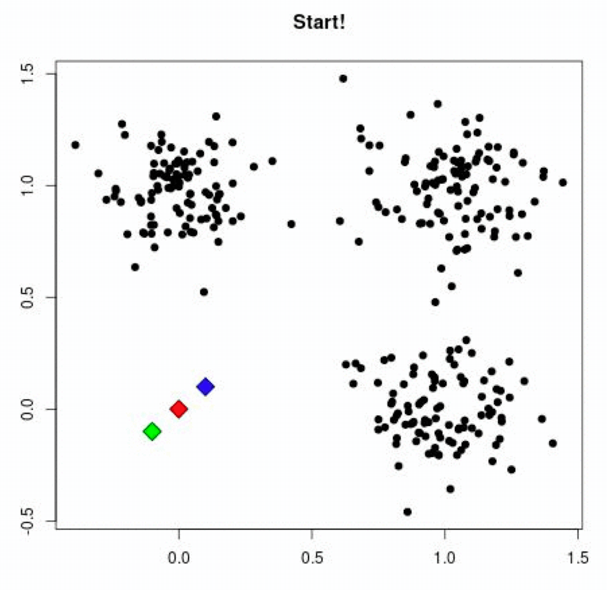

#### 2 案例练习

- 案例：


- 1、随机设置K个特征空间内的点作为初始的聚类中心（本案例中设置p1和p2）


2、对于其他每个点计算到K个中心的距离，未知的点选择最近的一个聚类中心点作为标记类别


3、接着对着标记的聚类中心之后，重新计算出每个聚类的新中心点（平均值）


4、如果计算得出的新中心点与原中心点一样（质心不再移动），那么结束，否则重新进行第二步过程【经过判断，需要重复上述步骤，开始新一轮迭代】


5、当每次迭代结果不变时，认为算法收敛，聚类完成，**K-Means一定会停下，不可能陷入一直选质心的过程。**


------------------------------------------------------------------------

#### 3 小结

- **K-means聚类实现流程**【掌握】
  - 事先**确定常数K**，常数K意味着最终的聚类类别数;
  - 随机**选定初始点为质心**，并通过计算每一个样本与质心之间的相似度(这里为欧式距离)，将样本点归到最相似的类中，
  - 接着，**重新计算**每个类的质心(即为类中心)，重复这样的过程，直到**质心不再改变**，
  - 最终就确定了每个样本所属的类别以及每个类的质心。
  - **注意**:
    - 由于每次都要计算所有的样本与每一个质心之间的相似度，故在大规模的数据集上，K-Means算法的收敛速度比较慢。

---

### 6.4 模型评估

#### 学习目标

- 知道模型评估中的SSE、“肘”部法、SC系数和CH系数的实现原理

------------------------------------------------------------------------

#### 1 误差平方和

误差平方和(SSE \The sum of squares due to error)具体概念通过如下举例介绍：

举例:

(下图中数据-0.2, 0.4, -0.8, 1.3, -0.7, 均为真实值和预测值的差)


在k-means中的应用:


公式各部分内容:


上图中: k=2

- **SSE图最终的结果,对图松散度的衡量.**(eg: **SSE(左图)\<SSE(右图)**)

<!-- -->

- SSE随着聚类迭代,其值会越来越小,直到最后趋于稳定:

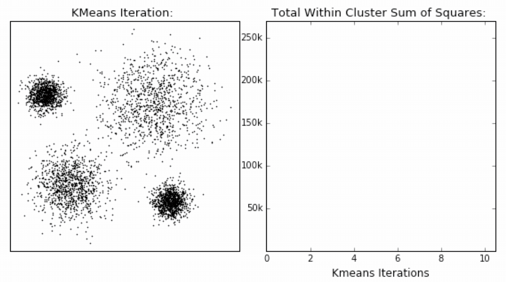

- 如果质心的初始值选择不好,SSE只会达到一个不怎么好的局部最优解.

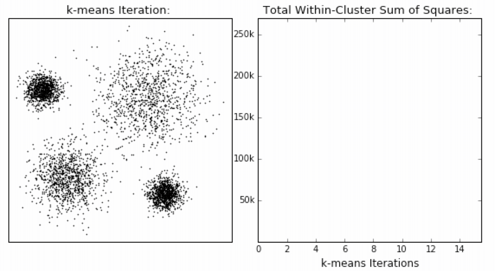

#### 2 “肘”方法

“肘”方法 (Elbow method) 主要是用于确定聚类算法中的K值，具体流程如下：


（1）对于n个点的数据集，迭代计算k from 1 to n，每次聚类完成后计算每个点到其所属的簇中心的距离的平方和；

（2）平方和是会逐渐变小的，直到k==n时平方和为0，因为每个点都是它所在的簇中心本身。

（3）在这个平方和变化过程中，会出现一个拐点也即“肘”点，**下降率突然变缓时即认为是最佳的k值**。

在决定什么时候停止训练时，肘形判据同样有效，数据通常有更多的噪音，在**增加分类无法带来更多回报时，我们停止增加类别**。

#### 3 轮廓系数法

轮廓系数法（Silhouette Coefficient）结合了聚类的凝聚度（Cohesion）和分离度（Separation），用于评估聚类的效果：


**目的：**

​内部距离最小化，外部距离最大化


计算样本i到同簇其他样本的平均距离ai，ai 越小样本i的簇内不相似度越小，说明样本i越应该被聚类到该簇。

计算样本i到最近簇Cj 的所有样本的平均距离bij，称样本i与最近簇Cj 的不相似度，定义为样本i的簇间不相似度：bi =min{bi1, bi2, ..., bik}，bi越大，说明样本i越不属于其他簇。

求出所有样本的轮廓系数后再求平均值就得到了**平均轮廓系数**。

平均轮廓系数的取值范围为\[-1,1\]，系数越大，聚类效果越好。

簇内样本的距离越近，簇间样本距离越远

**案例：**

下图是500个样本含有2个feature的数据分布情况，我们对它进行SC系数效果衡量：


**n_clusters = 2 The average silhouette_score is : 0.7049787496083262**

n_clusters = 3 The average silhouette_score is : 0.5882004012129721

**n_clusters = 4 The average silhouette_score is : 0.6505186632729437**

n_clusters = 5 The average silhouette_score is : 0.56376469026194

n_clusters = 6 The average silhouette_score is : 0.4504666294372765

n_clusters 分别为 2，3，4，5，6时，SC系数如下，是介于\[-1,1\]之间的度量指标：

**每次聚类后，每个样本都会得到一个轮廓系数，当它为1时，说明这个点与周围簇距离较远，结果非常好，当它为0，说明这个点可能处在两个簇的边界上，当值为负时，暗含该点可能被误分了。**

从平均SC系数结果来看，K取3，5，6是不好的，那么2和4呢？

k=2的情况：


k=4的情况：


n_clusters = 2时，第0簇的宽度远宽于第1簇；

n_clusters = 4时，所聚的簇宽度相差不大，因此选择K=4，作为最终聚类个数。

#### 4 CH系数

CH系数（Calinski-Harabasz Index）追求的是：**类别内部数据的协方差越小越好，类别之间的协方差越大越好**（换句话说：类别内部数据的距离平方和越小越好，类别之间的距离平方和越大越好）。

这样的Calinski-Harabasz分数s会高，分数s高则聚类效果越好。


> tr为**矩阵的迹**, B<sub>k</sub>为类别之间的协方差矩阵，W<sub>k</sub>为类别内部数据的协方差矩阵;
>
> m为训练集样本数，k为类别数。

------------------------------------------------------------------------


使用矩阵的迹进行求解的理解：

矩阵的对角线可以表示一个物体的相似性

在机器学习里，主要为了获取数据的特征值，那么就是说，在任何一个矩阵计算出来之后，都可以简单化，只要获取矩阵的迹，就可以表示这一块数据的最重要的特征了，这样就可以把很多无关紧要的数据删除掉，达到简化数据，提高处理速度。

CH需要达到的目的：

​**用尽量少的类别聚类尽量多的样本，同时获得较好的聚类效果。**

------------------------------------------------------------------------

#### 5 小结

- sse【知道】
  - 误差平方和的值越小越好
- 肘部法【知道】
  - 下降率突然变缓时即认为是最佳的k值
- SC系数【知道】
  - 取值为\[-1, 1\]，其值越大越好
- CH系数【知道】
  - 分数s高则聚类效果越好
  - CH需要达到的目的：**用尽量少的类别聚类尽量多的样本，同时获得较好的聚类效果。**

---

### 6.5 算法优化

#### 学习目标

- 知道k-means算法的优缺点
- 知道canopy、K-means++、二分K-means、K-medoids的优化原理
- 了解kernel K-means、ISODATA、Mini-batch K-means的优化原理

------------------------------------------------------------------------

**k-means算法小结**

**优点：**

- 1.原理简单（靠近中心点），实现容易
- 2.聚类效果中上（依赖K的选择）
- 3.空间复杂度o(N)，时间复杂度o(I*K*N)

<!-- -->

    N为样本点个数，K为中心点个数，I为迭代次数

**缺点：**

- 1.对离群点，噪声敏感 （中心点易偏移）
- 2.很难发现大小差别很大的簇及进行增量计算
- 3.结果不一定是全局最优，只能保证局部最优（与K的个数及初值选取有关）

------------------------------------------------------------------------

#### 1 Canopy算法配合初始聚类

##### 1.1 实现流程


##### 1.2 Canopy算法优缺点

优点：

​1.Kmeans对噪声抗干扰较弱，通过Canopy对比，将较小的NumPoint的Cluster直接去掉有利于抗干扰。

​2.Canopy选择出来的每个Canopy的centerPoint作为K会更精确。

​3.只是针对每个Canopy的内做Kmeans聚类，减少相似计算的数量。

缺点：

​1.算法中 T1、T2的确定问题 ，依旧可能落入局部最优解

#### 2 K-means++


> 其中：


为方便后面表示，把其记为A


kmeans++目的，让选择的质心尽可能的分散

如下图中，如果第一个质心选择在圆心，那么最优可能选择到的下一个点在P(A)这个区域（根据颜色进行划分）


#### 3 二分k-means

实现流程:

- 1.所有点作为一个簇

- 2.将该簇一分为二

- 3.选择能最大限度降低聚类代价函数（也就是误差平方和）的簇划分为两个簇。

- 4.以此进行下去，直到簇的数目等于用户给定的数目k为止。


**隐含的一个原则**

因为聚类的误差平方和能够衡量聚类性能，该值越小表示数据点越接近于他们的质心，聚类效果就越好。所以需要对误差平方和最大的簇进行再一次划分，因为误差平方和越大，表示该簇聚类效果越不好，越有可能是多个簇被当成了一个簇，所以我们首先需要对这个簇进行划分。

二分K均值算法可以加速K-means算法的执行速度，因为它的相似度计算少了并且不受初始化问题的影响，因为这里不存在随机点的选取，且每一步都保证了误差最小

#### 4 k-medoids（k-中心聚类算法）

K-medoids和K-means是有区别的，**不一样的地方在于中心点的选取**

- K-means中，将中心点取为当前cluster中所有数据点的平均值，对异常点很敏感!

- K-medoids中，将从当前cluster 中选取到其他所有（当前cluster中的）点的距离之和最小的点作为中心点。

  

算法流程：

- ( 1 )总体n个样本点中任意选取k个点作为medoids

- ( 2 )按照与medoids最近的原则，将剩余的n-k个点分配到当前最佳的medoids代表的类中

- ( 3 )对于第i个类中除对应medoids点外的所有其他点，按顺序计算当其为新的medoids时，代价函数的值，遍历所有可能，选取代价函数最小时对应的点作为新的medoids

- ( 4 )重复2-3的过程，直到所有的medoids点不再发生变化或已达到设定的最大迭代次数

- ( 5 )产出最终确定的k个类

**k-medoids对噪声鲁棒性好。**

例：当一个cluster样本点只有少数几个，如（1,1）（1,2）（2,1）（1000,1000）。其中（1000,1000）是噪声。如果按照k-means质心大致会处在（1,1）（1000,1000）中间，这显然不是我们想要的。这时k-medoids就可以避免这种情况，他会在（1,1）（1,2）（2,1）（1000,1000）中选出一个样本点使cluster的绝对误差最小，计算可知一定会在前三个点中选取。

k-medoids只能对小样本起作用，样本大，速度就太慢了，当样本多的时候，少数几个噪音对k-means的质心影响也没有想象中的那么重，所以k-means的应用明显比k-medoids多。

#### 5 Kernel k-means（了解）

kernel k-means实际上，就是将每个样本进行一个投射到高维空间的处理，然后再将处理后的数据使用普通的k-means算法思想进行聚类。


#### 6 ISODATA（了解）

类别数目随着聚类过程而变化；

对类别数会进行合并，分裂，

“合并”：（当聚类结果某一类中样本数太少，或两个类间的距离太近时）

“分裂”：（当聚类结果中某一类的类内方差太大，将该类进行分裂）

#### 7 Mini Batch K-Means（了解）

适合大数据的聚类算法

大数据量是什么量级？通常当样本量大于1万做聚类时，就需要考虑选用Mini Batch K-Means算法。

Mini Batch KMeans使用了Mini Batch（分批处理）的方法对数据点之间的距离进行计算。

Mini Batch计算过程中不必使用所有的数据样本，而是从不同类别的样本中抽取一部分样本来代表各自类型进行计算。由于计算样本量少，所以会相应的减少运行时间，但另一方面抽样也必然会带来准确度的下降。

该算法的迭代步骤有两步：

- (1)从数据集中随机抽取一些数据形成小批量，把他们分配给最近的质心

- (2)更新质心

与Kmeans相比，数据的更新在每一个小的样本集上。对于每一个小批量，通过计算平均值得到更新质心，并把小批量里的数据分配给该质心，随着迭代次数的增加，这些质心的变化是逐渐减小的，直到质心稳定或者达到指定的迭代次数，停止计算。

------------------------------------------------------------------------

#### 8 小结

- **k-means算法优缺点总结**【知道】
  - **优点：**
    - ​ 1.原理简单（靠近中心点），实现容易
    - ​ 2.聚类效果中上（依赖K的选择）
    - ​ 3.空间复杂度o(N)，时间复杂度o(I*K*N)
  - **缺点：**
    - ​ 1.对离群点，噪声敏感 （中心点易偏移）
    - ​ 2.很难发现大小差别很大的簇及进行增量计算
    - ​ 3.结果不一定是全局最优，只能保证局部最优（与K的个数及初值选取有关）

<!-- -->

- 优化方法【知道】

| **优化方法**       | **思路**                     |
|--------------------|------------------------------|
| Canopy+kmeans      | Canopy粗聚类配合kmeans       |
| kmeans++           | 距离越远越容易成为新的质心   |
| 二分k-means        | 拆除SSE最大的簇              |
| k-medoids          | 和kmeans选取中心点的方式不同 |
| kernel kmeans      | 映射到高维空间               |
| ISODATA            | 动态聚类，可以更改K值大小    |
| Mini-batch K-Means | 大数据集分批聚类             |

---

### 6.6 特征降维

#### 学习目标

- 了解降维的定义
- 知道通过低方差过滤实现降维过程
- 知道相关系数实现降维的过程
- 知道主成分分析法实现过程

------------------------------------------------------------------------

#### 1 降维

##### 1.1 定义

**降维**是指在某些限定条件下，**降低随机变量(特征)个数**，得到**一组“不相关”主变量**的过程

- 降低随机变量的个数


- 相关特征(correlated feature)
  - 相对湿度与降雨量之间的相关
  - 等等

> 正是因为在进行训练的时候，我们都是使用特征进行学习。如果特征本身存在问题或者特征之间相关性较强，对于算法学习预测会影响较大

##### 1.2 降维方式

我们可以通过下面两种方式达到降维目的：

- **特征选择**
- **主成分分析（可以理解一种特征提取的方式）**

#### 2 特征选择

##### 2.1 定义

数据中包含**冗余或无关变量（或称特征、属性、指标等）**，旨在从**原有特征中找出主要特征**。


##### 2.2 方法

- Filter(过滤式)：主要探究特征本身特点、特征与特征和目标值之间关联
  - **方差选择法：低方差特征过滤**
  - **相关系数**
- Embedded (嵌入式)：算法自动选择特征（特征与目标值之间的关联）
  - **决策树:信息熵、信息增益**
  - **正则化：L1、L2**
  - **深度学习：卷积等**

##### 2.3 低方差特征过滤

删除低方差的一些特征，前面讲过方差的意义。再结合方差的大小来考虑这个方式的角度。

- 特征方差小：某个特征大多样本的值比较相近
- 特征方差大：某个特征很多样本的值都有差别

###### 2.3.1 API

- sklearn.feature_selection.VarianceThreshold(threshold = 0.0)
  - 删除所有低方差特征
  - Variance.fit_transform(X)
    - X:numpy array格式的数据\[n_samples,n_features\]
    - 返回值：训练集差异低于threshold的特征将被删除。默认值是保留所有非零方差特征，即删除所有样本中具有相同值的特征。

###### 2.3.2 数据计算

我们对**某些股票的指标特征之间进行一个筛选**，除去'index,'date','return'列不考虑**（这些类型不匹配，也不是所需要指标）**

一共这些特征

    pe_ratio,pb_ratio,market_cap,return_on_asset_net_profit,du_return_on_equity,ev,earnings_per_share,revenue,total_expense

    index,pe_ratio,pb_ratio,market_cap,return_on_asset_net_profit,du_return_on_equity,ev,earnings_per_share,revenue,total_expense,date,return
    0,000001.XSHE,5.9572,1.1818,85252550922.0,0.8008,14.9403,1211444855670.0,2.01,20701401000.0,10882540000.0,2012-01-31,0.027657228229937388
    1,000002.XSHE,7.0289,1.588,84113358168.0,1.6463,7.8656,300252061695.0,0.326,29308369223.2,23783476901.2,2012-01-31,0.08235182370820669
    2,000008.XSHE,-262.7461,7.0003,517045520.0,-0.5678,-0.5943,770517752.56,-0.006,11679829.03,12030080.04,2012-01-31,0.09978900335112327
    3,000060.XSHE,16.476,3.7146,19680455995.0,5.6036,14.617,28009159184.6,0.35,9189386877.65,7935542726.05,2012-01-31,0.12159482758620697
    4,000069.XSHE,12.5878,2.5616,41727214853.0,2.8729,10.9097,81247380359.0,0.271,8951453490.28,7091397989.13,2012-01-31,-0.0026808154146886697

- 分析

1、初始化VarianceThreshold,指定阀值方差

2、调用fit_transform

``` lang-python
def variance_demo():
    """
    删除低方差特征——特征选择
    :return: None
    """
    data = pd.read_csv("factor_returns.csv")
    print(data)
    # 1、实例化一个转换器类
    transfer = VarianceThreshold(threshold=1)
    # 2、调用fit_transform
    data = transfer.fit_transform(data.iloc[:, 1:10])
    print("删除低方差特征的结果：\n", data)
    print("形状：\n", data.shape)

    return None
```

返回结果：

``` lang-python
            index  pe_ratio  pb_ratio    market_cap  \
0     000001.XSHE    5.9572    1.1818  8.525255e+10
1     000002.XSHE    7.0289    1.5880  8.411336e+10
...           ...       ...       ...           ...
2316  601958.XSHG   52.5408    2.4646  3.287910e+10
2317  601989.XSHG   14.2203    1.4103  5.911086e+10

      return_on_asset_net_profit  du_return_on_equity            ev  \
0                         0.8008              14.9403  1.211445e+12
1                         1.6463               7.8656  3.002521e+11
...                          ...                  ...           ...
2316                      2.7444               2.9202  3.883803e+10
2317                      2.0383               8.6179  2.020661e+11

      earnings_per_share       revenue  total_expense        date    return
0                 2.0100  2.070140e+10   1.088254e+10  2012-01-31  0.027657
1                 0.3260  2.930837e+10   2.378348e+10  2012-01-31  0.082352
2                -0.0060  1.167983e+07   1.203008e+07  2012-01-31  0.099789
...                  ...           ...            ...         ...       ...
2315              0.2200  1.789082e+10   1.749295e+10  2012-11-30  0.137134
2316              0.1210  6.465392e+09   6.009007e+09  2012-11-30  0.149167
2317              0.2470  4.509872e+10   4.132842e+10  2012-11-30  0.183629

[2318 rows x 12 columns]
删除低方差特征的结果：
 [[  5.95720000e+00   1.18180000e+00   8.52525509e+10 ...,   1.21144486e+12
    2.07014010e+10   1.08825400e+10]
 [  7.02890000e+00   1.58800000e+00   8.41133582e+10 ...,   3.00252062e+11
    2.93083692e+10   2.37834769e+10]
 [ -2.62746100e+02   7.00030000e+00   5.17045520e+08 ...,   7.70517753e+08
    1.16798290e+07   1.20300800e+07]
 ...,
 [  3.95523000e+01   4.00520000e+00   1.70243430e+10 ...,   2.42081699e+10
    1.78908166e+10   1.74929478e+10]
 [  5.25408000e+01   2.46460000e+00   3.28790988e+10 ...,   3.88380258e+10
    6.46539204e+09   6.00900728e+09]
 [  1.42203000e+01   1.41030000e+00   5.91108572e+10 ...,   2.02066110e+11
    4.50987171e+10   4.13284212e+10]]
形状：
 (2318, 8)
```

##### 2.4 **相关系数**

- 主要实现方式：
  - 皮尔逊相关系数
  - 斯皮尔曼相关系数

###### 2.4.1 皮尔逊相关系数

**1.作用**

皮尔逊相关系数(Pearson Correlation Coefficient)的作用是：反映变量之间相关关系密切程度的统计指标

**2.公式计算案例(了解，不用记忆)**

公式


举例

- 比如说我们计算年广告费投入与月均销售额


那么之间的相关系数怎么计算


最终计算：

= 0.9942

**所以我们最终得出结论是广告投入费与月平均销售额之间有高度的正相关关系。**

**3.特点**

**相关系数的值介于–1与+1之间，即–1≤ r ≤+1**。其性质如下：

- **当r\>0时，表示两变量正相关，r\<0时，两变量为负相关**
- 当\|r\|=1时，表示两变量为完全相关，当r=0时，表示两变量间无相关关系
- **当0\<\|r\|\<1时，表示两变量存在一定程度的相关。且\|r\|越接近1，两变量间线性关系越密切；\|r\|越接近于0，表示两变量的线性相关越弱**
- **一般可按三级划分：\|r\|\<0.4为低度相关；0.4≤\|r\|\<0.7为显著性相关；0.7≤\|r\|\<1为高度线性相关**

**4.api**

- from scipy.stats import pearsonr
  - x : (N,) array_like
  - y : (N,) array_like Returns: (Pearson’s correlation coefficient, p-value)

**5.案例**

``` lang-python
from scipy.stats import pearsonr

x1 = [12.5, 15.3, 23.2, 26.4, 33.5, 34.4, 39.4, 45.2, 55.4, 60.9]
x2 = [21.2, 23.9, 32.9, 34.1, 42.5, 43.2, 49.0, 52.8, 59.4, 63.5]

pearsonr(x1, x2)
```

结果

    (0.9941983762371883, 4.9220899554573455e-09)

###### 2.4.2 斯皮尔曼相关系数

**1.作用：**

斯皮尔曼相关系数(Rank IC)的作用是：反映变量之间相关关系密切程度的统计指标

**2.公式计算案例(了解，不用记忆)**

公式:


> n为等级个数，d为二列成对变量的等级差数

举例:


**3.特点**

- 斯皮尔曼相关系数表明 X (自变量) 和 Y (因变量)的相关方向。 如果当X增加时， Y 趋向于增加, 斯皮尔曼相关系数则为正
- 与之前的皮尔逊相关系数大小性质一样，取值 \[-1, 1\]之间

> 斯皮尔曼相关系数比皮尔逊相关系数应用更加广泛

**4.api**

- from scipy.stats import spearmanr

**5.案例**

``` lang-python
from scipy.stats import spearmanr

x1 = [12.5, 15.3, 23.2, 26.4, 33.5, 34.4, 39.4, 45.2, 55.4, 60.9]
x2 = [21.2, 23.9, 32.9, 34.1, 42.5, 43.2, 49.0, 52.8, 59.4, 63.5]

spearmanr(x1, x2)
```

结果

    SpearmanrResult(correlation=0.9999999999999999, pvalue=6.646897422032013e-64)

#### 3 主成分分析

##### 3.1 什么是主成分分析

- 定义：**高维数据转化为低维数据的过程**，在此过程中**可能会舍弃原有数据、创造新的变量**
- 作用：**是数据维数压缩，尽可能降低原数据的维数（复杂度），损失少量信息。**
- 应用：回归分析或者聚类分析当中

> 对于信息一词，在决策树中会进行介绍

那么更好的理解这个过程呢？我们来看一张图


##### 3.2 API

- sklearn.decomposition.PCA(n_components=None)
  - 将数据分解为较低维数空间
  - n_components:
    - **小数：表示保留百分之多少的信息**
    - **整数：减少到多少特征**
  - PCA.fit_transform(X) X:numpy array格式的数据\[n_samples,n_features\]
  - 返回值：转换后指定维度的array

##### 3.3 数据计算

先拿个简单的数据计算一下

``` lang-python
[[2,8,4,5],
[6,3,0,8],
[5,4,9,1]]
from sklearn.decomposition import PCA

def pca_demo():
    """
    对数据进行PCA降维
    :return: None
    """
    data = [[2,8,4,5], [6,3,0,8], [5,4,9,1]]

    # 1、实例化PCA, 小数——保留多少信息
    transfer = PCA(n_components=0.9)
    # 2、调用fit_transform
    data1 = transfer.fit_transform(data)

    print("保留90%的信息，降维结果为：\n", data1)

    # 1、实例化PCA, 整数——指定降维到的维数
    transfer2 = PCA(n_components=3)
    # 2、调用fit_transform
    data2 = transfer2.fit_transform(data)
    print("降维到3维的结果：\n", data2)

    return None
```

返回结果：

``` lang-python
保留90%的信息，降维结果为：
 [[ -3.13587302e-16   3.82970843e+00]
 [ -5.74456265e+00  -1.91485422e+00]
 [  5.74456265e+00  -1.91485422e+00]]
降维到3维的结果：
 [[ -3.13587302e-16   3.82970843e+00   4.59544715e-16]
 [ -5.74456265e+00  -1.91485422e+00   4.59544715e-16]
 [  5.74456265e+00  -1.91485422e+00   4.59544715e-16]]
```

------------------------------------------------------------------------

#### 4 小结

- 降维的定义【了解】
  - 就是改变特征值，选择哪列保留，哪列删除
  - 目标是得到一组”不相关“的主变量
- 降维的两种方式【了解】
  - 特征选择
  - 主成分分析（可以理解一种特征提取的方式）
- 特征选择【知道】
  - 定义：提出数据中的冗余变量
  - 方法：
    - Filter(过滤式)：主要探究特征本身特点、特征与特征和目标值之间关联
      - 方差选择法：低方差特征过滤
      - 相关系数
    - Embedded (嵌入式)：算法自动选择特征（特征与目标值之间的关联）
      - 决策树:信息熵、信息增益
      - 正则化：L1、L2
- 低方差特征过滤【知道】
  - 把方差比较小的某一列进行剔除
  - api:sklearn.feature_selection.VarianceThreshold(threshold = 0.0)
    - 删除所有低方差特征
    - 注意，参数threshold一定要进行值的指定
- 相关系数【掌握】
  - 主要实现方式：
    - 皮尔逊相关系数
    - 斯皮尔曼相关系数
  - 皮尔逊相关系数
    - 通过具体值的大小进行计算
    - 相对复杂
    - api:from scipy.stats import pearsonr
      - 返回值，越接近\|1\|，相关性越强；越接近0，相关性越弱
  - 斯皮尔曼相关系数
    - 通过等级差进行计算
    - 比上一个简单
    - api:from scipy.stats import spearmanr
    - 返回值，越接近\|1\|，相关性越强；越接近0，相关性越弱
- pca【知道】
  - 定义：高维数据转换为低维数据，然后产生了新的变量
  - api:sklearn.decomposition.PCA(n_components=None)
    - n_components
      - 整数 -- 表示降低到几维
      - 小数 -- 保留百分之多少的信息

---

### 6.7 案例：探究用户对物品类别的喜好细分

#### 学习目标

- 应用pca和K-means实现用户对物品类别的喜好细分划分

------------------------------------------------------------------------


数据如下：

- order_products\_\_prior.csv：订单与商品信息
  - 字段：**order_id**, **product_id**, add_to_cart_order, reordered
- products.csv：商品信息
  - 字段：**product_id**, product_name, **aisle_id**, department_id
- orders.csv：用户的订单信息
  - 字段：**order_id**,**user_id**,eval_set,order_number,….
- aisles.csv：商品所属具体物品类别
  - 字段： **aisle_id**, **aisle**

------------------------------------------------------------------------

#### 1 需求


#### 2 分析

- 1.获取数据
- 2.数据基本处理
  - 2.1 合并表格
  - 2.2 交叉表合并
  - 2.3 数据截取
- 3.特征工程 — pca
- 4.机器学习（k-means）
- 5.模型评估
  - sklearn.metrics.silhouette_score(X, labels)
    - 计算所有样本的平均轮廓系数
    - X：特征值
    - labels：被聚类标记的目标值

#### 3 完整代码

``` lang-python
import pandas as pd
from sklearn.decomposition import PCA
from sklearn.cluster import KMeans
from sklearn.metrics import silhouette_score
```

- 1.获取数据

``` lang-python
order_product = pd.read_csv("./data/instacart/order_products__prior.csv")
products = pd.read_csv("./data/instacart/products.csv")
orders = pd.read_csv("./data/instacart/orders.csv")
aisles = pd.read_csv("./data/instacart/aisles.csv")
```

- 2.数据基本处理
- 2.1 合并表格

``` lang-python
# 2.1 合并表格
table1 = pd.merge(order_product, products, on=["product_id", "product_id"])
table2 = pd.merge(table1, orders, on=["order_id", "order_id"])
table = pd.merge(table2, aisles, on=["aisle_id", "aisle_id"])
```

- 2.2 交叉表合并

``` lang-py
table = pd.crosstab(table["user_id"], table["aisle"])
```

- 2.3 数据截取

``` lang-py
table = table[:1000]
```

- 3.特征工程 — pca

``` lang-py
transfer = PCA(n_components=0.9)
data = transfer.fit_transform(table)
```

- 4.机器学习（k-means）

``` lang-python
estimator = KMeans(n_clusters=8, random_state=22)
estimator.fit_predict(data)
```

- 5.模型评估

``` lang-python
silhouette_score(data, y_predict)
```

---

### 其他距离公式

#### 1 标准化欧氏距离

标准化欧氏距离(Standardized EuclideanDistance)是针对欧氏距离的缺点而作的一种改进。

思路：既然数据各维分量的分布不一样，那先将各个分量都“标准化”到均值、方差相等。


> tips: S<sub>k</sub>表示各个维度的标准差

如果将方差的倒数看成一个权重，也可称之为加权欧氏距离(Weighted Euclidean distance)。

举例:

    X=[[1,1],[2,2],[3,3],[4,4]];（假设两个分量的标准差分别为0.5和1）
    经计算得:
    d =   2.2361    4.4721    6.7082    2.2361    4.4721    2.2361

#### 2 余弦距离

几何中，夹角余弦可用来衡量两个向量方向的差异；机器学习中，借用这一概念来衡量样本向量之间的差异，就是余弦距离(Cosine Distance)。

- 二维空间中向量A(x1,y1)与向量B(x2,y2)的夹角余弦公式：


- 两个n维样本点a(x11,x12,…,x1n)和b(x21,x22,…,x2n)的夹角余弦为：


即：


夹角余弦取值范围为\[-1,1\]。余弦越大表示两个向量的夹角越小，余弦越小表示两向量的夹角越大。当两个向量的方向重合时余弦取最大值1，当两个向量的方向完全相反余弦取最小值-1。

举例:

    X=[[1,1],[1,2],[2,5],[1,-4]]
    经计算得:
    d =   0.9487    0.9191   -0.5145    0.9965   -0.7593   -0.8107

#### 3 汉明距离【了解】

两个等长字符串s1与s2的汉明距离(Hamming Distance)为：将其中一个变为另外一个所需要作的最小字符替换次数。

例如:

      The Hamming distance between "1011101" and "1001001" is 2.
      The Hamming distance between "2143896" and "2233796" is 3.
      The Hamming distance between "toned" and "roses" is 3.


    随堂练习：
    求下列字符串的汉明距离：

      1011101与 1001001

      2143896与 2233796

      irie与 rise

**汉明重量**：是字符串相对于同样长度的零字符串的汉明距离，也就是说，它是字符串中非零的元素个数：对于二进制字符串来说，就是 1 的个数，所以 11101 的汉明重量是 4。因此，如果向量空间中的元素a和b之间的汉明距离等于它们汉明重量的差a-b。

应用：汉明重量分析在包括信息论、编码理论、密码学等领域都有应用。比如在信息编码过程中，为了增强容错性，应使得编码间的最小汉明距离尽可能大。但是，如果要比较两个不同长度的字符串，不仅要进行替换，而且要进行插入与删除的运算，在这种场合下，通常使用更加复杂的编辑距离等算法。

举例:

    X=[[0,1,1],[1,1,2],[1,5,2]]
    注：以下计算方式中，把2个向量之间的汉明距离定义为2个向量不同的分量所占的百分比。

    经计算得:
    d =   0.6667    1.0000    0.3333

#### 4 杰卡德距离【了解】

杰卡德相似系数(Jaccard similarity coefficient)：两个集合A和B的交集元素在A，B的并集中所占的比例，称为两个集合的杰卡德相似系数，用符号J(A,B)表示：


杰卡德距离(Jaccard Distance)：与杰卡德相似系数相反，用两个集合中不同元素占所有元素的比例来衡量两个集合的区分度：


举例:

    X=[[1,1,0],[1,-1,0],[-1,1,0]]
    注：以下计算中，把杰卡德距离定义为不同的维度的个数占“非全零维度”的比例
    经计算得:
    d =   0.5000    0.5000    1.0000

#### 5 马氏距离【了解】

下图有两个正态分布图，它们的均值分别为a和b，但方差不一样，则图中的A点离哪个总体更近？或者说A有更大的概率属于谁？显然，A离左边的更近，A属于左边总体的概率更大，尽管A与a的欧式距离远一些。这就是马氏距离的直观解释。


马氏距离(Mahalanobis Distance)是基于样本分布的一种距离。

马氏距离是由印度统计学家马哈拉诺比斯提出的，表示数据的协方差距离。它是一种有效的计算两个位置样本集的相似度的方法。

与欧式距离不同的是，它考虑到各种特性之间的联系，即独立于测量尺度。

**马氏距离定义：**设总体G为m维总体（考察m个指标），均值向量为μ=（μ<sub>1</sub>，μ<sub>2</sub>，… ...，μ<sub>m</sub>，）<sup>\`</sup>,协方差阵为∑=（σ<sub>ij</sub>）,

则样本X=（X<sub>1</sub>，X<sub>2</sub>，… …，X<sub>m</sub>，）<sup>\`</sup>与总体G的马氏距离定义为：


马氏距离也可以定义为两个服从同一分布并且其协方差矩阵为∑的随机变量的差异程度：如果协方差矩阵为单位矩阵，马氏距离就简化为欧式距离；如果协方差矩阵为对角矩阵，则其也可称为正规化的欧式距离。

**马氏距离特性：**

1.**量纲无关**，排除变量之间的相关性的干扰；

2.**马氏距离的计算是建立在总体样本的基础上的**，如果拿同样的两个样本，放入两个不同的总体中，最后计算得出的两个样本间的马氏距离通常是不相同的，除非这两个总体的协方差矩阵碰巧相同；

3 .计算马氏距离过程中，**要求总体样本数大于样本的维数**，否则得到的总体样本协方差矩阵逆矩阵不存在，这种情况下，用欧式距离计算即可。

4.还有一种情况，满足了条件总体样本数大于样本的维数，但是协方差矩阵的逆矩阵仍然不存在，比如三个样本点（3，4），（5，6），（7，8），这种情况是因为这三个样本在其所处的二维空间平面内共线。这种情况下，也采用欧式距离计算。

**欧式距离&马氏距离：**


举例：

已知有两个类G<sub>1</sub>和G<sub>2</sub>，比如G<sub>1</sub>是设备A生产的产品，G<sub>2</sub>是设备B生产的同类产品。设备A的产品质量高（如考察指标为耐磨度X），其平均耐磨度μ<sub>1</sub>=80，反映设备精度的方差σ<sup>2</sup>(1)=0.25;设备B的产品质量稍差，其平均耐磨损度μ<sub>2</sub>=75，反映设备精度的方差σ<sup>2</sup>(2)=4.

今有一产品G<sub>0</sub>，测的耐磨损度X<sub>0</sub>=78，试判断该产品是哪一台设备生产的？

直观地看，X<sub>0</sub>与μ<sub>1</sub>（设备A）的绝对距离近些，按距离最近的原则，是否应把该产品判断设备A生产的？

考虑一种相对于分散性的距离，记X<sub>0</sub>与G<sub>1</sub>，G<sub>2</sub>的相对距离为d<sub>1</sub>，d<sub>2</sub>,则：


因为d<sub>2</sub>=1.5 \< d<sub>1</sub>=4，按这种距离准则，应判断X<sub>0</sub>为设备B生产的。

设备B生产的产品质量较分散，出现X<sub>0</sub>为78的可能性较大；而设备A生产的产品质量较集中，出现X<sub>0</sub>为78的可能性较小。

这种相对于分散性的距离判断就是马氏距离。


##

---

### 再议数据分割

前面已经讲过，我们可**通过实验测试来对学习器的泛化误差进行评估并进而做出选择**。

为此，需使用一个“测试集”( testing set)来测试学习器对新样本的判别能力，然后**以测试集上的“测试误差” (testing error)作为泛化误差的近似。**

通常我们假设测试样本也是**从样本真实分布中独立同分布采样而得**。但需注意的是，**测试集应该尽可能与训练集互斥。**

> 互斥，即测试样本尽量不在训练集中出现、未在训练过程中使用过。

测试样本为什么要尽可能不出现在训练集中呢？为理解这一点，不妨考虑这样一个场景:

> 老师出了10道习题供同学们练习，考试时老师又用同样的这10道题作为试题，这个考试成绩能否有效反映出同学们学得好不好呢？
>
> 答案是否定的，可能有的同学只会做这10道题却能得高分。

回到我们的问题上来，我们希望得到泛化性能强的模型，好比是希望同学们对课程学得很好、获得了对所学知识“举一反三”的能力；训练样本相当于给同学们练习的习题，测试过程则相当于考试。显然，**若测试样本被用作训练了，则得到的将是过于“乐观”的估计结果。**

可是，我们只有一个包含m个样例的数据集

既要训练，又要测试，怎样才能做到呢？

- 答案是:**通过对D进行适当的处理，从中产生出训练集S和测试集T。（这个也是我们前面一直在做的事情）。**

下面我们一起总结一下几种常见的做法：

- 留出法
- 交叉验证法
- 自助法

------------------------------------------------------------------------

#### 1 留出法

“留出法”(hold-out)直接将数据集D划分为两个互斥的集合，其中一个集合作为训练集S，另一个作为测试集T，即。在S上训练出模型后，用T来评估其测试误差，作为对泛化误差的估计。

大家在使用的过程中，**需注意的是，训练/测试集的划分要尽可能保持数据分布的一致性，避免因数据划分过程引入额外的偏差而对最终结果产生影响**，例如在分类任务中至少要保持样本的类别比例相似。

如果从采样( sampling)的角度来看待数据集的划分过程，则保留类别比例的采样方式通常称为**“分层采样”( stratified sampling)。**

> 例如通过对D进行分层样而获得含70%样本的训练集S和含30%样本的测试集T，
>
> 若D包含500个正例、500个反例，则分层采样得到的S应包含350个正例、350个反例，而T则包含150个正例和150个反例；
>
> 若S、T中样本类别比例差别很大，则误差估计将由于训练/测试数据分布的差异而产生偏差。

另一个需注意的问题是，即便在给定训练测试集的样本比例后，仍存在多种划分方式对初始数据集D进行分割。

例如在上面的例子中，可以把D中的样本排序，然后把前350个正例放到训练集中，也可以把最后350个正例放到训练集中，这些不同的划分将导致不同的训练/测试集，相应的，模型评估的结果也会有差别。

因此，单次使用留出法得到的估计结果往往不够稳定可靠，**在使用留出法时，一般要采用若干次随机划分、重复进行实验评估后取平均值作为留出法的评估结果。**

> 例如进行100次随机划分，每次产生一个训练/测试集用于实验评估，100次后就得到100个结果，而留出法返回的则是这100个结果的平均。

此外，我们希望评估的是用D训练出的模型的性能，但留出法需划分训练/测试集，这就会导致一个窘境:

- 若令训练集S包含绝大多数样本，则训练出的模型可能更接近于用D训练出的模型，但由于T比较小，评估结果可能不够稳定准确；
- 若令测试集T多包含一些样本，则训练集S与D差别更大了，被评估的模型与用D训练出的模型相比可能有较大差别，从而降低了评估结果的保真性( fidelity)。

这个问题没有完美的解决方案，常见做法是将大约2/3~4/5的样本用于训练，剩余样本用于测试。

使用Python实现留出法：

``` lang-python
from sklearn.model_selection import train_test_split
#使用train_test_split划分训练集和测试集
train_X , test_X, train_Y ,test_Y = train_test_split(
        X, Y, test_size=0.2,random_state=0)
```

在留出法中，有一个特例，叫：**留一法( Leave-One-Out，简称LOO）**，即每次抽取一个样本做为测试集。

显然，留一法不受随机样本划分方式的影响，因为m个样本只有唯一的方式划分为m个子集一每个子集包含个样本；

使用Python实现留一法：

``` lang-python
from sklearn.model_selection import LeaveOneOut

data = [1, 2, 3, 4]
loo = LeaveOneOut()
for train, test in loo.split(data):
    print("%s %s" % (train, test))
'''结果
[1 2 3] [0]
[0 2 3] [1]
[0 1 3] [2]
[0 1 2] [3]
'''
```

留一法优缺点：

优点：

- 留一法使用的训练集与初始数据集相比只少了一个样本，这就使得在绝大多数情况下，留一法中被实际评估的模型与期望评估的用D训练出的模型很相似。因此，**留一法的评估结果往往被认为比较准确**。

缺点：

- 留一法也有其缺陷:在数据集比较大时，训练m个模型的计算开销可能是难以忍受的(例如数据集包含1百万个样本，则需训练1百万个模型，而这还是在未考虑算法调参的情况下。

#### 2 交叉验证法

##### 2.1 交叉验证法基本介绍

“交叉验证法”( cross validation)先将数据集D划分为k个大小相似的互斥子集，即。每个子集D<sub>i</sub>都尽可能保持数据分布的一致性，即从D中通过分层抽样得到。

然后，每次用k-1个子集的并集作为训练集，余下的那个子集作为验证集；这样就可获得k组训练/验证集，从而可进行k次训练和测试，最终返回的是这k个测试结果的均值。

显然，交叉验证法评估结果的稳定性和保真性在很大程度上取决于k的取值，为强调这一点，通常把交叉验证法称为“k折交叉验证”(k- fold cross validation)。k最常用的取值是10，此时称为10折交叉验证；其他常用的k值有5、20等。下图给出了10折交叉验证的示意图。


**与留出法相似，将数据集D划分为k个子集同样存在多种划分方式。**为减小因样本划分不同而引入的差别，k折交叉验证通常要随机使用不同的划分重复p次，最终的评估结果是这p次k折交叉验证结果的均值，例如常见的有 “10次10折交叉验证”。

交叉验证实现方法，除了咱们前面讲的GridSearchCV之外，还有KFold, StratifiedKFold

##### 2.2 KFold和StratifiedKFold

``` lang-python
from sklearn.model_selection import KFold,StratifiedKFold
```

- 用法：
  - 将训练/测试数据集划分n_splits个互斥子集，每次用其中一个子集当作验证集，剩下的n_splits-1个作为训练集，进行n_splits次训练和测试，得到n_splits个结果
  - StratifiedKFold的用法和KFold的区别是：SKFold是分层采样，确保训练集，测试集中，各类别样本的比例是和原始数据集中的一致。

- 注意点：
  - 对于不能均等分数据集，其前n_samples % n_splits子集拥有n_samples // n_splits + 1个样本，其余子集都只有n_samples // n_splits样本

- 参数说明：

  - n_splits：表示划分几等份
  - shuffle：在每次划分时，是否进行洗牌
    - ①若为Falses时，其效果等同于random_state等于整数，每次划分的结果相同
    - ②若为True时，每次划分的结果都不一样，表示经过洗牌，随机取样的

- 属性：

  - ①split(X, y=None, groups=None)：将数据集划分成训练集和测试集，返回索引生成器

``` lang-python
import numpy as np
from sklearn.model_selection import KFold,StratifiedKFold

X = np.array([
    [1,2,3,4],
    [11,12,13,14],
    [21,22,23,24],
    [31,32,33,34],
    [41,42,43,44],
    [51,52,53,54],
    [61,62,63,64],
    [71,72,73,74]
])

y = np.array([1,1,0,0,1,1,0,0])

folder = KFold(n_splits = 4, random_state=0, shuffle = False)
sfolder = StratifiedKFold(n_splits = 4, random_state = 0, shuffle = False)

for train, test in folder.split(X, y):
    print('train:%s | test:%s' %(train, test))
    print("")

for train, test in sfolder.split(X, y):
    print('train:%s | test:%s'%(train, test))
    print("")
```

结果：

``` lang-python
# 第一个for，输出结果为：
train:[2 3 4 5 6 7] | test:[0 1]

train:[0 1 4 5 6 7] | test:[2 3]

train:[0 1 2 3 6 7] | test:[4 5]

train:[0 1 2 3 4 5] | test:[6 7]

# 第二个for，输出结果为：
train:[1 3 4 5 6 7] | test:[0 2]

train:[0 2 4 5 6 7] | test:[1 3]

train:[0 1 2 3 5 7] | test:[4 6]

train:[0 1 2 3 4 6] | test:[5 7]
```

可以看出，sfold进行4折计算时候，是平衡了测试集中，样本正负的分布的；但是fold却没有。

#### 3 自助法

我们希望评估的是用D训练出的模型。但在留出法和交叉验证法中，由于保留了一部分样本用于测试，因此**实际评估的模型所使用的训练集比D小，**这必然会引入一些因训练样本规模不同而导致的估计偏差。留一法受训练样本规模变化的影响较小，但计算复杂度又太高了。

有没有什么办法可以减少训练样本规模不同造成的影响，同时还能比较高效地进行实验估计呢？

“自助法”( bootstrapping)是一个比较好的解决方案，它**直接以自助采样法( bootstrap sampling)为基础**。给定包含m个样本的数据集D，我们对它进行采样产生数据集D:

- 每次随机从D中挑选一个样本，将其拷贝放入D，然后再将该样本放回初始数据集D中，使得该样本在下次采样时仍有可能被到；
- 这个过程重复执行m次后，我们就得到了包含m个样本的数据集D′，这就是自助采样的结果。

显然，D中有一部分样本会在D′中多次出现，而另一部分样本不出现。可以做一个简单的估计，样本在m次采样中始终不被采到的概率是，取极限得到


即通过自助采样，初始数据集D中约有36.8%的样本未出现在采样数据集D′中。

于是我们可将D′用作训练集，D\D′用作测试集；这样，实际评估的模型与期望评估的模型都使用m个训练样本，而我们仍有数据总量约1/3的、没在训练集中出现的样本用于测试。

这样的测试结果，亦称**“包外估计”(out- of-bagestimate）**

自助法优缺点：

- 优点：
  - 自助法在数据集较小、难以有效划分训练/测试集时很有用；
  - 此外，自助法能从初始数据集中产生多个不同的训练集，这对集成学习等方法有很大的好处。
- 缺点：
  - 自助法产生的数据集改变了初始数据集的分布，这会引入估计偏差。因此，在初始数据量足够时；留出法和交叉验证法更常用一些。

#### 4 总结

**综上所述：**

- 当我们数据量足够时，选择留出法简单省时，在牺牲很小的准确度的情况下，换取计算的简便；
- 当我们的数据量较小时，我们应该选择交叉验证法，因为此时划分样本集将会使训练数据过少；
- 当我们的数据量特别少的时候，我们可以考虑留一法。

---

### 正规方程的另一种推导方式

------------------------------------------------------------------------

#### 1.损失表示方式

总损失定义为：


- y<sub>i</sub>为第i个训练样本的真实值
- h(x<sub>i</sub>)为第i个训练样本特征值组合预测函数
- 又称最小二乘法

#### 2.另一种推导方式

把损失函数分开书写： <span class="katex-display"><span class="katex"><span class="katex-mathml">$`
(Xw-y)^2=(Xw-y)^T(Xw-y)
`$</span></span></span> 对展开上式进行求导：


需要求得求导函数的极小值，即上式求导结果为0，经过化解，得结果为： <span class="katex-display"><span class="katex"><span class="katex-mathml">$`
X^TXw=X^Ty
`$</span></span></span> 经过化解为： <span class="katex-display"><span class="katex"><span class="katex-mathml">$`
w=(X^TX)^{-1}X^Ty
`$</span></span></span>

> 补充：需要用到的矩阵求导公式：

<span class="katex-display"><span class="katex"><span class="katex-mathml">$`
\frac{dx^TA}{dx}=A
`$</span></span></span>

<span class="katex-display"><span class="katex"><span class="katex-mathml">$`
\frac{dAx}{dx}=A^T
`$</span></span></span>


---

### 梯度下降法算法比较和进一步优化

常见的梯度下降算法有：

- 全梯度下降算法(Full gradient descent）,
- 随机梯度下降算法（Stochastic gradient descent）,
- 小批量梯度下降算法（Mini-batch gradient descent）,
- 随机平均梯度下降算法（Stochastic average gradient descent）

它们都是为了正确地调节权重向量，通过为每个权重计算一个梯度，从而更新权值，使目标函数尽可能最小化。其差别在于样本的使用方式不同。

我们通过一个数据集案例进行对比，查看他们的区别

#### 1 算法比较

为了比对四种基本梯度下降算法的性能，我们通过一个逻辑二分类实验来说明。本文所用的Adult数据集来自UCI公共数据库（<a href="http://archive.ics.uci.edu/ml/datasets/Adult）。" target="_blank">http://archive.ics.uci.edu/ml/datasets/Adult）。</a> 数据集共有15081条记录，包括“性别”“年龄”“受教育情况”“每周工作时常”等14个特征，数据标记列显示“年薪是否大于50000美元”。我们将数据集的80%作为训练集，剩下的20%作为测试集，使用逻辑回归建立预测模型，根据数据点的14个特征预测其数据标记（收入情况）。

以下6幅图反映了模型优化过程中四种梯度算法的性能差异。


在图1和图2中，横坐标代表有效迭代次数，纵坐标代表平均损失函数值。图1反映了前25次有效迭代过程中平均损失函数值的变化情况，为了便于观察，图2放大了第10次到25次的迭代情况。

从图1中可以看到，**四种梯度算法下，平均损失函数值随迭代次数的增加而减少**。**FG的迭代效率始终领先**，能在较少的迭代次数下取得较低的平均损失函数值。**FG与SAG的图像较平滑**，这是因为这两种算法在进行梯度更新时都结合了之前的梯度；**SG与mini-batch的图像曲折明显**，这是因为这两种算法在每轮更新梯度时都随机抽取一个或若干样本进行计算，并没有考虑到之前的梯度。

从图2中可以看到**虽然四条折现的纵坐标虽然都趋近于0，但SG和FG较早，mini-batch最晚。**这说明如果想使用mini-batch获得最优参数，必须对其进行较其他三种梯度算法更多频次的迭代。

在图3，4，5，6中，横坐标表示时间，纵坐标表示平均损失函数值。

从图3中可以看出使用四种算法将平均损失函数值从0.7降到0.1最多只需要2.5s，由于本文程序在初始化梯度时将梯度设为了零，故前期的优化效果格外明显。其中SG在前期的表现最好，仅1.75s便将损失函值降到了0.1，虽然SG无法像FG那样达到线性收敛，但在处理大规模机器学习问题时，**为了节约时间成本和存储成本，可在训练的一开始先使用SG，后期考虑到收敛性和精度可改用其他算法。**

从图4，5，6可以看出，随着平均损失函数值的不断减小，SG的性能逐渐反超FG，FG的优化效率最慢，即达到相同平均损失函数值时FG所需要的时间最久。

综合分析六幅图我们得出以下结论：

（1**）FG方法由于它每轮更新都要使用全体数据集，故花费的时间成本最多，内存存储最大。**

**（2）SAG在训练初期表现不佳，优化速度较慢。这是因为我们常将初始梯度设为0，而SAG每轮梯度更新都结合了上一轮梯度值。**

**（3）综合考虑迭代次数和运行时间，SG表现性能都很好，能在训练初期快速摆脱初始梯度值，快速将平均损失函数降到很低。但要注意，在使用SG方法时要慎重选择步长，否则容易错过最优解。**

**（4）mini-batch结合了SG的“胆大”和FG的“心细”，从6幅图像来看，它的表现也正好居于SG和FG二者之间。在目前的机器学习领域，mini-batch是使用最多的梯度下降算法，正是因为它避开了FG运算效率低成本大和SG收敛效果不稳定的缺点。**

#### 2 梯度下降优化算法

以下这些算法主要用于深度学习优化

- 动量法
  - 其实动量法(SGD with monentum)就是SAG的姐妹版
  - SAG是对过去K次的梯度求平均值
  - SGD with monentum 是对过去所有的梯度求加权平均
- Nesterov加速梯度下降法
  - 类似于一个智能球，在重新遇到斜率上升时候，能够知道减速
- Adagrad
  - 让学习率使用参数
  - 对于出现次数较少的特征，我们对其采用更大的学习率，对于出现次数较多的特征，我们对其采用较小的学习率。
- Adadelta
  - Adadelta是Adagrad的一种扩展算法，以处理Adagrad学习速率单调递减的问题。
- RMSProp
  - 其结合了梯度平方的指数移动平均数来调节学习率的变化。
  - 能够在不稳定（Non-Stationary）的目标函数情况下进行很好地收敛。
- Adam
  - 结合AdaGrad和RMSProp两种优化算法的优点。
  - 是一种自适应的学习率算法

参考链接：\[<a href="https://blog.csdn.net/google19890102/article/details/69942970" target="_blank">https://blog.csdn.net/google19890102/article/details/69942970</a>\]

---

### 第二章知识补充： 多项式回归

我们在前面讲的都是一般线性回归，即使用的假设函数是一元一次方程，也就是二维平面上的一条直线。

但是很多时候可能会遇到直线方程无法很好的拟合数据的情况，这个时候可以尝试使用多项式回归。

多项式回归中，加入了特征的更高次方（例如平方项或立方项），也相当于增加了模型的自由度，用来捕获数据中非线性的变化。添加高阶项的时候，也增加了模型的复杂度。随着模型复杂度的升高，模型的容量以及拟合数据的能力增加，可以进一步降低训练误差，但导致过拟合的风险也随之增加（后面会专门讨论出现过拟合的情况）。

### 1 多项式回归的一般形式

在多项式回归中，最重要的参数是最高次方的次数。设最高次方的次数为n，且只有一个特征时，其多项式回归的方程为：

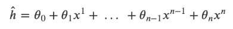

如果令x_0=1*x*0=1，在多样本的情况下，可以写成向量化的形式：

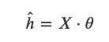

其中𝑋是大小为m⋅(n+1)的矩阵，θ是大小为(n+1)⋅1的矩阵。

在这里虽然只有一个特征x以及x的不同次方，但是也可以将x的高次方当做一个新特征。与多元回归分析唯一不同的是，这些特征之间是高度相关的，而不是通常要求的那样是相互对立的。

> 在这里有个问题在刚开始学习线性回归的时候困扰了自己很久：如果假设中出现了高阶项，那么这个模型还是线性模型吗？此时看待问题的角度不同，得到的结果也不同。如果把上面的假设看成是特征xx的方程，那么该方程就是非线性方程；如果看成是参数𝜃θ的方程，那么xx的高阶项都可以看做是对应𝜃θ的参数，那么该方程就是线性方程。很明显，在线性回归中采用了后一种解释方式。因此多项式回归仍然是参数的线性模型。

### 2 多项式回归的实现

``` lang-python
import numpy as np
import matplotlib.pyplot as plt
from sklearn.linear_model import LinearRegression
from sklearn.metrics import mean_squared_error
```

下是使用的数据是使用 **y=x<sup>2</sup>+2** 并加入一些随机误差生成的，只取了10个数据点：

``` lang-python
# 构造数据,数据可视化展示
data = np.array([[ -2.95507616,  10.94533252],
                 [ -0.44226119,   2.96705822],
                 [ -2.13294087,   6.57336839],
                 [  1.84990823,   5.44244467],
                 [  0.35139795,   2.83533936],
                 [ -1.77443098,   5.6800407 ],
                 [ -1.8657203 ,   6.34470814],
                 [  1.61526823,   4.77833358],
                 [ -2.38043687,   8.51887713],
                 [ -1.40513866,   4.18262786]])

X = data[:, 0].reshape(-1, 1)  # 将array转换成矩阵
y = data[:, 1].reshape(-1, 1)

plt.plot(X, y, "b.")
plt.xlabel('X')
plt.ylabel('y')
plt.show()
```

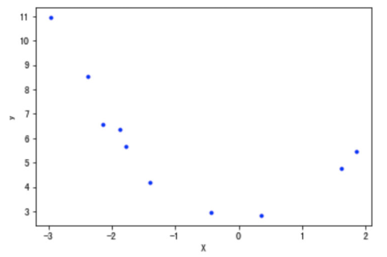

#### 2.1 直线方程的拟合

下面先用直线方程拟合上面的数据点

``` lang-python
lin_reg = LinearRegression()
lin_reg.fit(X, y)
print(lin_reg.intercept_, lin_reg.coef_)  # [ 4.97857827] [[-0.92810463]]

X_plot = np.linspace(-3, 3, 1000).reshape(-1, 1)

# 可以使用两种方法用于模型预测
# y_plot = np.dot(X_plot, lin_reg.coef_.T) + lin_reg.intercept_
y_plot = lin_reg.predict(X_plot)

plt.plot(X_plot, y_plot,"red")
plt.plot(X, y, 'b.')
plt.xlabel('X')
plt.ylabel('y')

# 使用mse衡量其误差值:
y_pre = lin_reg.predict(X)
mean_squared_error(y, y_pre)
# 3.3363076332788495
```

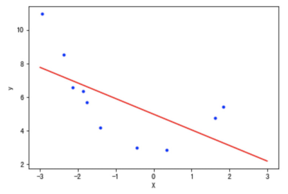

#### 2.2 使用多项式方程

为了拟合2次方程，需要有特征x<sup>2</sup>的数据，这里可以使用函数"PolynomialFeatures"来获得：

**sklearn 的 PolynomialFeatures 的用法**

<a href="http://scikit-learn.org/stable/modules/generated/sklearn.preprocessing.PolynomialFeatures.html" target="_blank">官方文档链接</a>

使用 `sklearn.preprocessing.PolynomialFeatures` 这个类可以进行特征的构造，构造的方式就是特征与特征相乘（自己与自己，自己与其他人），这种方式叫做使用多项式的方式。 例如：有 𝑎、𝑏 两个特征，那么它的 2 次多项式的次数为 1,a,b,a<sup>2</sup>,ab,b<sup>2</sup>。

`PolynomialFeatures` 这个类有 3 个参数：

- degree：控制多项式的次数；
- interaction_only：默认为 False，如果指定为 True，那么就不会有特征自己和自己结合的项，组合的特征中没有 a<sup>2</sup> 和 b<sup>2</sup> ；
- include_bias：默认为 True 。如果为 True 的话，那么结果中就会有 0 次幂项，即全为 1 这一列。

``` lang-python
X = np.arange(6).reshape(3, 2)
X

# 输出结果
array([[0, 1],
       [2, 3],
       [4, 5]])

from sklearn.preprocessing import PolynomialFeatures
# 设置多项式阶数为2,其他值默认
# degree 多项式阶数
poly = PolynomialFeatures(degree=2)
res = poly.fit_transform(X)
res

# 输出结果
array([[ 1.,  0.,  1.,  0.,  0.,  1.],
       [ 1.,  2.,  3.,  4.,  6.,  9.],
       [ 1.,  4.,  5., 16., 20., 25.]])
```

使用函数"PolynomialFeatures"获取二次方项：

``` lang-python
poly_features = PolynomialFeatures(degree=2, include_bias=False)
X_poly = poly_features.fit_transform(X)
print(X_poly)

# 输出结果
[[-2.95507616  8.73247511]
 [-0.44226119  0.19559496]
 [-2.13294087  4.54943675]
 [ 1.84990823  3.42216046]
 [ 0.35139795  0.12348052]
 [-1.77443098  3.1486053 ]
 [-1.8657203   3.48091224]
 [ 1.61526823  2.60909145]
 [-2.38043687  5.66647969]
 [-1.40513866  1.97441465]]
```

利用上面的数据做线性回归分析：

``` lang-python
lin_reg = LinearRegression()
lin_reg.fit(X_poly, y)
print(lin_reg.intercept_, lin_reg.coef_)
# [ 2.60996757] [[-0.12759678  0.9144504 ]]

X_plot = np.linspace(-3, 3, 1000).reshape(-1, 1)
X_plot_poly = poly_features.fit_transform(X_plot)
y_plot = lin_reg.predict(X_plot_poly)
plt.plot(X_plot, y_plot, 'red')
plt.plot(X, y, 'b.')
plt.show()
```

第3行得到了训练后的参数，即多项式方程为h=-0.13x+0.91x^2+2.61*h*=−0.13*x*+0.91*x*2+2.61（结果中系数的顺序与𝑋中特征的顺序一致），如下图所示：

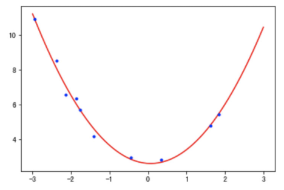

``` lang-ptyhpn
# 使用mse衡量其误差值:
y_pre = lin_reg.predict(X_poly)
mean_squared_error(y, y_pre)
# 0.07128562789085331
```

利用多项式回归，代价函数MSE的值下降到了0.07。

通过观察代码，可以发现训练多项式方程与直线方程唯一的差别是输入的训练集𝑋的差别。在训练直线方程时直接输入了𝑋的值，在训练多项式方程的时候，还添加了我们计算出来的x<sup>2</sup>这个“新特征”的值（由于x<sup>2</sup>完全是由x的值确定的，因此严格意义上来讲此时该模型只有一个特征x）。

此时有个非常有趣的问题：假如一开始得到的数据就是上面代码中"X_poly"的样子，且不知道x1与x2之间的关系。此时相当于我们有10个样本，每个样本具有x1,x2两个不同的特征。这时假设函数为：

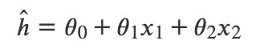

直接按照二元线性回归方程来训练，也可以得到上面同样的结果（𝜃的值）。如果在相同情况下，收集到了新的数据，可以直接带入上面的方程进行预测。

唯一不同的是，我们不知道x2=x^2_1*x*2=*x*12这个隐含在数据内部的关系，所有也就无法画出上图中的这条曲线。一旦了解到了这两个特征之间的关系，数据的维度就从3维下降到了2维（包含截距项\theta_0*θ*0）。

### 3 持续降低训练误差与过拟合

在上面实现多项式回归的过程中，通过引入高阶项x2，训练误差从3.34下降到了0.07，减小了将近50倍。那么训练误差是否还有进一步下降的空间呢？

- 答案是肯定的，通过继续增加更高阶的项，训练误差可以进一步降低。通过尝试，当最高阶项为x<sup>12</sup>时，训练误差为3.87e-23，几乎等于0了。

下面是测试不同degree的过程：

``` lang-python
# 定义模型训练函数
def try_degree(degree, X, y):
    poly_features_d = PolynomialFeatures(degree=degree, include_bias=False)
    X_poly_d = poly_features_d.fit_transform(X)
    lin_reg_d = LinearRegression()
    lin_reg_d.fit(X_poly_d, y)
    return {'X_poly': X_poly_d, 'intercept': lin_reg_d.intercept_, 'coef': lin_reg_d.coef_}

degree2loss_paras = []
for i in range(2, 20):
    paras = try_degree(i, X, y)

    # 自己实现预测值的求解
    h = np.dot(paras['X_poly'], paras['coef'].T) + paras['intercept']
    _loss = mean_squared_error(h, y)
    degree2loss_paras.append({'d': i, 'loss': _loss, 'coef': paras['coef'], 'intercept': paras['intercept']})
```

查看最小模型参数：

``` lang-python
min_index = np.argmin(np.array([i['loss'] for i in degree2loss_paras]))
min_loss_para = degree2loss_paras[min_index]
print(min_loss_para)

# 输出结果
{'d': 12,
 'loss': 3.8764202841976227e-23,
 'coef': array([[ 1.17159189,  8.60674192, -4.91798703, -4.18378115,  3.79426131, -8.56026107, -6.94465715,  5.03891035,  4.08870088, -0.30369348, -0.6635493 , -0.11314395]]),
 'intercept': array([1.63695924])}
```

对最小模型可视化展示：

``` lang-python
X_plot = np.linspace(-3, 1.9, 1000).reshape(-1, 1)
poly_features_d = PolynomialFeatures(degree=min_loss_para['d'], include_bias=False)

X_plot_poly = poly_features_d.fit_transform(X_plot)
y_plot = np.dot(X_plot_poly, min_loss_para['coef'].T) + min_loss_para['intercept']

plt.plot(X_plot, y_plot, 'red', label="degree12")
plt.plot(X, y, 'b.', label="X")
plt.legend(loc='best')
plt.show()
```

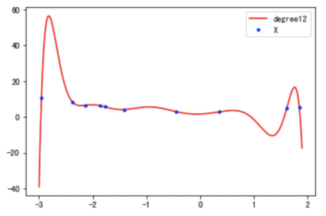

此时函数图像穿过了每一个样本点，所有的训练样本都落在了拟合的曲线上，训练误差接近与0。 可以说是近乎完美的模型了。但是，这样的曲线与我们最开始数据的来源（一个二次方程加上一些随机误差）差异非常大。

如果从相同来源再取一些样本点，使用该模型预测会出现非常大的误差。类似这种训练误差非常小，但是新数据点的测试误差非常大的情况，就叫做模型的过拟合。过拟合出现时，表示模型过于复杂，过多考虑了当前样本的特殊情况以及噪音（模型学习到了当前训练样本非全局的特性），使得模型的泛化能力下降。

防止模型过拟合是机器学习领域里最重要的问题之一。鉴于该问题的普遍性和重要性，**在满足要求的情况下，能选择简单模型时应该尽量选择简单的模型。**

---

### 维灾难

#### 1 什么是维灾难

随着维度的增加，分类器性能逐步上升，到达某点之后，其性能便逐渐下降


有一系列的图片，每张图片的内容可能是猫也可能是狗；我们需要构造一个分类器能够对猫、狗自动的分类。首先，要寻找到一些能够描述猫和狗的特征，这样我们的分类算法就可以利用这些特征去识别物体。猫和狗的皮毛颜色可能是一个很好的特征，考虑到红绿蓝构成图像的三基色，因此用图片三基色各自的平均值称得上方便直观。这样就有了一个简单的Fisher分类器：

    If  0.5*red + 0.3*green + 0.2*blue > 0.6 : return cat;
        else return dog;

使用颜色特征可能无法得到一个足够准确的分类器，如果是这样的话，我们不妨加入一些诸如图像纹理(图像灰度值在其X、Y方向的导数dx、dy)，就有5个特征(Red、Blue、Green、dx、dy)来设计我们的分类器：

也许分类器准确率依然无法达到要求，加入更多的特征，比如颜色、纹理的统计信息等等，如此下去，可能会得到上百个特征。那是不是我们的分类器性能会随着特征数量的增加而逐步提高呢？答案也许有些让人沮丧，事实上，当特征数量达到一定规模后，分类器的性能是在下降的。

**随着维度(特征数量)的增加，分类器的性能却下降了**

#### 2 维数灾难与过拟合

我们假设猫和狗图片的数量是有限的(样本数量总是有限的)，假设有10张图片，接下来我们就用这仅有的10张图片来训练我们的分类器。


增加一个特征，比如绿色，这样特征维数扩展到了2维：

增加一个特征后，我们依然无法找到一条简单的直线将它们有效分类


再增加一个特征，比如蓝色，扩展到3维特征空间：


在3维特征空间中，我们很容易找到一个分类平面，能够在训练集上有效的将猫和狗进行分类：

在高维空间中，我们似乎能得到更优的分类器性能。


从1维到3维，给我们的感觉是：维数越高，分类性能越优。然而，维数过高将导致一定的问题：在一维特征空间下，我们假设一个维度的宽度为5个单位，这样样本密度为10/5=2;在2维特征空间下，10个样本所分布的空间大小25，这样样本密度为10/25=0.4;在3维特征空间下，10个样本分布的空间大小为125，样本密度就为10/125=0.08.

如果继续增加特征数量，随着维度的增加，样本将变得越来越稀疏，在这种情况下，也更容易找到一个超平面将目标分开。然而，如果我们将高维空间向低维空间投影，高维空间隐藏的问题将会显现出来：

**过多的特征导致的过拟合现象**：训练集上表现良好，但是对新数据缺乏泛化能力。


**高维空间训练形成的线性分类器，相当于在低维空间的一个复杂的非线性分类器**，这种分类器过多的强调了训练集的准确率甚至于对一些错误/异常的数据也进行了学习，而正确的数据却无法覆盖整个特征空间。为此，这样得到的分类器在对新数据进行预测时将会出现错误。这种现象称之为过拟合，同时也是维灾难的直接体现。


简单的线性分类器在训练数据上的表现不如非线性分类器，但由于线性分类器的学习过程中对噪声没有对非线性分类器敏感，因此对新数据具备更优的泛化能力。换句话说，通过使用更少的特征，避免了维数灾难的发生(也即避免了高维情况下的过拟合)

由于高维而带来的数据稀疏性问题：假设有一个特征，它的取值范围D在0到1之间均匀分布，并且对狗和猫来说其值都是唯一的，我们现在利用这个特征来设计分类器。如果我们的训练数据覆盖了取值范围的20%(e.g 0到0.2)，那么所使用的训练数据就占总样本量的20%。上升到二维情况下，覆盖二维特征空间20%的面积，则需要在每个维度上取得45%的取值范围。在三维情况下，要覆盖特征空间20%的体积，则需要在每个维度上取得58%的取值范围...在维度接近一定程度时，要取得同样的训练样本数量，则几乎要在每个维度上取得接近100%的取值范围，或者增加总样本数量，但样本数量也总是有限的。

如果一直增加特征维数，由于样本分布越来越稀疏，如果要避免过拟合的出现，就不得不持续增加样本数量。


数据在高维空间的中心比在边缘区域具备更大的稀疏性，数据更倾向于分布在空间的边缘区域：

不属于单位圆的训练样本比搜索空间的中心更接近搜索空间的角点。这些样本很难分类，因为它们的特征值差别很大（例如，单位正方形的对角的样本）。


一个有趣的问题是，当我们增加特征空间的维度时，圆（超球面）的体积如何相对于正方形（超立方体）的体积发生变化。尺寸d的单位超立方体的体积总是1 ^ d = 1.尺寸d和半径0.5的内切超球体的体积可以计算为：


在高维空间中，大多数训练数据驻留在定义特征空间的超立方体的角落中。如前所述，特征空间角落中的实例比围绕超球体质心的实例难以分类。


在高维空间中，大多数训练数据驻留在定义特征空间的超立方体的角落中。如前所述，特征空间角落中的实例比围绕超球体质心的实例难以分类：


an 8D hypercube which has 2^8 = 256 corners

事实证明，许多事物在高维空间中表现得非常不同。 例如，如果你选择一个单位平方（1×1平方）的随机点，它将只有大约0.4％的机会位于小于0.001的边界（换句话说，随机点将沿任何维度“极端”这是非常不可能的）。 但是在一个10000维单位超立方体（1×1×1立方体，有1万个1）中，这个概率大于99.999999％。 高维超立方体中的大部分点都非常靠近边界。更难区分的是：如果你在一个单位正方形中随机抽取两个点，这两个点之间的距离平均约为0.52。如果在单位三维立方体中选取两个随机点，则平均距离将大致为0.66。但是在一个100万维的超立方体中随机抽取两点呢？那么平均距离将是大约408.25（大约1,000,000 / 6）！

非常违反直觉：当两个点位于相同的单位超立方体内时，两点如何分离？这个事实意味着高维数据集有可能非常稀疏：大多数训练实例可能彼此远离。当然，这也意味着一个新实例可能离任何训练实例都很远，这使得预测的可信度表现得比在低维度数据中要来的差。**训练集的维度越多，过度拟合的风险就越大**。

理论上讲，维度灾难的一个解决方案可能是增加训练集的大小以达到足够密度的训练实例。 不幸的是，在实践中，达到给定密度所需的训练实例的数量随着维度的数量呈指数增长。 如果只有100个特征（比MNIST问题少得多），那么为了使训练实例的平均值在0.1以内，需要比可观察宇宙中的原子更多的训练实例，假设它们在所有维度上均匀分布。

对于8维超立方体，大约98％的数据集中在其256个角上。结果，当特征空间的维度达到无穷大时，从采样点到质心的最小和最大欧几里得距离的差与最小距离本身只比趋于零：


距离测量开始失去其在高维空间中测量的有效性,由于分类器取决于这些距离测量,因此在较低维空间中分类通常更容易，其中较少特征用于描述感兴趣对象。

如果理论无限数量的训练样本可用，则维度的诅咒不适用，我们可以简单地使用无数个特征来获得完美的分类。训练数据的大小越小，应使用的功能就越少。如果N个训练样本足以覆盖单位区间大小的1D特征空间，则需要N ^ 2个样本来覆盖具有相同密度的2D特征空间，并且在3D特征空间中需要N ^ 3个样本。换句话说，**所需的训练实例数量随着使用的维度数量呈指数增长**。

---

### 分类中解决类别不平衡问题

------------------------------------------------------------------------

前面我们已经初步认识了，什么是类别不平衡问题。其实，在现实环境中，采集的数据（建模样本）往往是比例失衡的。比如网贷数据，逾期人数的比例是极低的（千分之几的比例）；奢侈品消费人群鉴定等。

#### 1 类别不平衡数据集基本介绍

在这一节中，我们一起看一下，当遇到数据类别不平衡的时候，我们该如何处理。在Python中，有Imblearn包，它就是为处理数据比例失衡而生的。

- 安装Imblearn包

``` lang-python
pip3 install imbalanced-learn
```

第三方包链接：<a href="https://pypi.org/project/imbalanced-learn/" target="_blank">https://pypi.org/project/imbalanced-learn/</a>

- 创造数据集

``` lang-python
from sklearn.datasets import make_classification
import matplotlib.pyplot as plt

#使用make_classification生成样本数据
X, y = make_classification(n_samples=5000,
                           n_features=2,  # 特征个数= n_informative（） + n_redundant + n_repeated
                           n_informative=2,  # 多信息特征的个数
                           n_redundant=0,   # 冗余信息，informative特征的随机线性组合
                           n_repeated=0,  # 重复信息，随机提取n_informative和n_redundant 特征
                           n_classes=3,  # 分类类别
                           n_clusters_per_class=1,  # 某一个类别是由几个cluster构成的
                           weights=[0.01, 0.05, 0.94],  # 列表类型，权重比
                           random_state=0)
```

- 查看各个标签的样本

``` lang-python
#查看各个标签的样本量
from collections import Counter
Counter(y)

# Counter({2: 4674, 1: 262, 0: 64})
```

- 数据集可视化

``` lang-python
# 数据集可视化
plt.scatter(X[:, 0], X[:, 1], c=y)
plt.show()
```


可以看出样本的三个标签中，1，2的样本量极少，样本失衡。下面使用imblearn进行过采样。

接下来，我们就要基于以上数据，进行相应的处理。

------------------------------------------------------------------------

关于类别不平衡的问题，主要有两种处理方式：

- 过采样方法
  - 增加数量较少那一类样本的数量，使得正负样本比例均衡。
- 欠采样方法
  - 减少数量较多那一类样本的数量，使得正负样本比例均衡。

#### 2 解决类别不平衡数据方法介绍

##### 2.1 过采样方法

###### 2.1.1 **什么是过采样方法**

对训练集里的少数类进行“过采样”（oversampling），**即增加一些少数类样本使得正、反例数目接近，然后再进行学习。**

###### 2.1.2 **随机过采样方法**

随机过采样是在少数类 ![\[公式\]](https://www.zhihu.com/equation?tex=S_%7Bmin%7D) 中随机选择一些样本，然后**通过复制所选择的样本生成样本集 ![\[公式\]](https://www.zhihu.com/equation?tex=E) ，**将它们添加到 ![\[公式\]](https://www.zhihu.com/equation?tex=S_%7Bmin%7D) 中来扩大原始数据集从而得到新的少数类集合 ![\[公式\]](https://www.zhihu.com/equation?tex=S_%7Bnew-min%7D) 。新的数据集 ![\[公式\]](https://www.zhihu.com/equation?tex=S_%7Bnew-min%7D%3DS_%7Bmin%7D%2BE) 。

- 通过代码实现随机过采样方法：

``` lang-python
# 使用imblearn进行随机过采样
from imblearn.over_sampling import RandomOverSampler
ros = RandomOverSampler(random_state=0)
X_resampled, y_resampled = ros.fit_resample(X, y)
#查看结果
Counter(y_resampled)

#过采样后样本结果
# Counter({2: 4674, 1: 4674, 0: 4674})

# 数据集可视化
plt.scatter(X_resampled[:, 0], X_resampled[:, 1], c=y_resampled)
plt.show()
```


------------------------------------------------------------------------

- 缺点：
  - 对于随机过采样，由于需要对少数类样本进行复制来扩大数据集，**造成模型训练复杂度加大**。
  - 另一方面也容易**造成模型的过拟合问题**，因为随机过采样是简单的对初始样本进行复制采样，这就使得学习器学得的规则过于具体化，不利于学习器的泛化性能，造成过拟合问题。

为了解决随机过采样中造成模型过拟合问题，又能保证实现数据集均衡的目的，出现了过采样法代表性的算法SMOTE算法。

###### 2.1.3 **过采样代表性算法-SMOTE**

SMOTE全称是Synthetic Minority Oversampling即合成少数类过采样技术。

SMOTE算法是对随机过采样方法的一个改进算法，由于随机过采样方法是直接对少数类进行重采用，会使训练集中有很多重复的样本，容易造成产生的模型过拟合问题。而SMOTE算法的基本思想:

> 对每个少数类样本 ![\[公式\]](https://www.zhihu.com/equation?tex=x_%7Bi%7D) ，从它的最近邻中随机选择一个样本 ![\[公式\]](https://www.zhihu.com/equation?tex=\hat%7Bx_%7Bi%7D%7D) （ ![\[公式\]](https://www.zhihu.com/equation?tex=\hat%7Bx_%7Bi%7D%7D) 是少数类中的一个样本），然后在 ![\[公式\]](https://www.zhihu.com/equation?tex=x_%7Bi%7D) 和 ![\[公式\]](https://www.zhihu.com/equation?tex=\hat%7Bx_%7Bi%7D%7D) 之间的连线上随机选择一点作为新合成的少数类样本。

SMOTE算法合成新少数类样本的算法描述如下：

- 1\) 对于少数类中的每一个样本 ![\[公式\]](https://www.zhihu.com/equation?tex=x_%7Bi%7D) ，以欧氏距离为标准计算它到少数类样本集 ![\[公式\]](https://www.zhihu.com/equation?tex=S_%7Bmin%7D) 中所有样本的距离，得到其k近邻。
- 2\) 根据样本不平衡比例设置一个采样比例以确定采样倍率N，对于每一个少数类样本 ![\[公式\]](https://www.zhihu.com/equation?tex=x_%7Bi%7D) ，从其k近邻中随机选择若干个样本，假设选择的是 ![\[公式\]](https://www.zhihu.com/equation?tex=\hat%7Bx_%7Bi%7D%7D) 。
- 3\) 对于每一个随机选出来的近邻 ![\[公式\]](https://www.zhihu.com/equation?tex=\hat%7Bx_%7Bi%7D%7D) ，分别与 ![\[公式\]](https://www.zhihu.com/equation?tex=x_%7Bi%7D) 按照如下公式构建新的样本。


------------------------------------------------------------------------

我们用图文表达的方式，再来描述一下SMOTE算法。

1\) 先随机选定一个少数类样本 ![\[公式\]](https://www.zhihu.com/equation?tex=x_%7Bi%7D) 。


2\) 找出这个少数类样本 ![\[公式\]](https://www.zhihu.com/equation?tex=x_%7Bi%7D) 的K个近邻（假设K=5），5个近邻已经被圈出。


3\) 随机从这K个近邻中选出一个样本 ![\[公式\]](https://www.zhihu.com/equation?tex=\hat%7Bx_%7Bi%7D%7D) （用绿色圈出来了）。


4)在少数类样本 ![\[公式\]](https://www.zhihu.com/equation?tex=x_%7Bi%7D) 和被选中的这个近邻样本 ![\[公式\]](https://www.zhihu.com/equation?tex=\hat%7Bx_%7Bi%7D%7D) 之间的连线上，随机找一点。这个点就是人工合成的新的样本点（绿色正号标出）。


SMOTE算法摒弃了随机过采样复制样本的做法，可以防止随机过采样中容易过拟合的问题，实践证明此方法可以提高分类器的性能。

- 代码实现：

``` lang-python
# SMOTE过采样
from imblearn.over_sampling import SMOTE
X_resampled, y_resampled = SMOTE().fit_resample(X, y)
Counter(y_resampled)

# 采样后样本结果
# [(0, 4674), (1, 4674), (2, 4674)]

# 数据集可视化
plt.scatter(X_resampled[:, 0], X_resampled[:, 1], c=y_resampled)
plt.show()
```


##### 2.2 欠采样方法

###### 2.2.1 什么是欠采样方法

直接对训练集中多数类样本进行“欠采样”（undersampling），即去**除一些多数类中的样本使得正例、反例数目接近，然后再进行学习。**

###### 2.2.2 随机欠采样方法

随机欠采样顾名思义即从多数类 ![\[公式\]](https://www.zhihu.com/equation?tex=S_%7Bmaj%7D) 中随机选择一些样样本组成样本集 ![\[公式\]](https://www.zhihu.com/equation?tex=E) 。然后将样本集 ![\[公式\]](https://www.zhihu.com/equation?tex=E) 从 ![\[公式\]](https://www.zhihu.com/equation?tex=S_%7Bmaj%7D) 中移除。新的数据集 ![\[公式\]](https://www.zhihu.com/equation?tex=S_%7Bnew-maj%7D%3DS_%7Bmaj%7D-E) 。

- 代码实现：

``` lang-python
# 随机欠采样
from imblearn.under_sampling import RandomUnderSampler
rus = RandomUnderSampler(random_state=0)
X_resampled, y_resampled = rus.fit_resample(X, y)
Counter(y_resampled)

# 采样后结果
[(0, 64), (1, 64), (2, 64)]

# 数据集可视化
plt.scatter(X_resampled[:, 0], X_resampled[:, 1], c=y_resampled)
plt.show()
```


------------------------------------------------------------------------

- 缺点：
  - 随机欠采样方法通过改变多数类样本比例以达到修改样本分布的目的，从而使样本分布较为均衡，但是这也存在一些问题。对于随机欠采样，**由于采样的样本集合要少于原来的样本集合，因此会造成一些信息缺失，即将多数类样本删除有可能会导致分类器丢失有关多数类的重要信息。**

------------------------------------------------------------------------

官网链接：<a href="https://imbalanced-learn.readthedocs.io/en/stable/ensemble.html" target="_blank">https://imbalanced-learn.readthedocs.io/en/stable/ensemble.html</a>

---

### 向量与矩阵的范数

#### 1.向量的范数

向量的1-范数：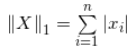; 各个元素的绝对值之和；

向量的2-范数：每个元素的平方和再开平方根；

向量的无穷范数：

**例：向量X=\[2, 3, -5, -7\] ，求向量的1-范数，2-范数和无穷范数**。

**向量X的1-范数**：各个元素的绝对值之和 = 2+3+5+7 = 17=2+3+5+7=17；

**向量X的2-范数**：每个元素的平方和再开平方根；；

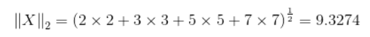

**向量X的无穷范数**：

（1）正无穷范数：向量的所有元素的绝对值中最大的；即X的正无穷范数为：7；

（2）负无穷范数：向量的所有元素的绝对值中最小的；即X的负无穷范数为：2；

#### 2.矩阵的范数

设：向量 X \in R^n*X*∈*R\*\*n* ，矩阵 A \in R^{n \times n}*A*∈*R\*\*n*×*n* ，例如矩阵A为：

    A=[2, 3, -5, -7;

       4, 6,  8, -4;

       6, -11, -3, 16];

（1）矩阵的1-范数（列模）：；矩阵的每一列上的元素绝对值先求和，再从中取个最大的，（列和最大)；即矩阵A的1-范数为：27

（2）矩阵的2-范数（谱模）：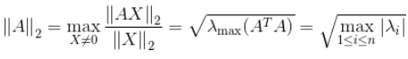，其中\lambda_i*λ\*\*i*为A^TA*A**T**A*的特征值；矩阵A^TA*A**T**A*的最大特征值开平方根。

（3）矩阵的无穷范数（行模）：；矩阵的每一行上的元素绝对值先求和，再从中取个最大的，（行和最大)

------------------------------------------------------------------------

> 原文链接：<a href="https://blog.csdn.net/zaishuiyifangxym/article/details/81673491" target="_blank">https://blog.csdn.net/zaishuiyifangxym/article/details/81673491</a>

---

### 如何理解无偏估计？

#### 1.如何理解无偏估计

**无偏估计**：就是我认为**所有样本出现的概率一样**。

假如有N种样本我们认为所有样本出现概率都是1/N。然后根据这个来计算数学期望。此时的数学期望就是我们平常讲的平均值。

> 数学期望本质就是平均值

#### 2.无偏估计为何叫做“无偏”？它要“估计”什么？

首先回答第一个问题：它要“估计”什么？

- 它要估计的是整体的数学期望（平均值）。

第二个问题：那为何叫做无偏？有偏是什么？

- 假设这个是一些样本的集合:<span class="katex"><span class="katex-mathml">$`X=x_1, x_2, x_3,...,x_N`$</span></span> 我们根据样本估计整体的数学期望（平均值）。

- 因为正常求期望是加权和，什么叫加权和这个就叫加权和。每个样本出现概率不一样，概率大的乘起来就大，这个就产生偏重了（有偏估计）。

- 但是，但是我们不知道某个样本出现的概率啊。比如你从别人口袋里面随机拿了3张钞票。两张是十块钱，一张100元，然后你想估计下他口袋里的剩下的钱平均下来每张多少钱（估计平均值）。

- 然后呢？

<!-- -->

- **无偏估计计算数学期望**就是认为所有样本出现概率一样大，没有看不起哪个样本。
  - 回到求钱的平均值的问题。无偏估计我们认为每张钞票出现概率都是1/2（因为只出现了10和100这两种情况，所以是1/2。如果是出现1 10 100三种情况，每种情况概率则是1/3。
  - 哪怕拿到了两张十块钱，我还是认为十块钱出现的概率和100元的概率一样。不偏心。所以无偏估计，所估计的别人口袋每张钱的数学期望（平均值）=10 *1/2+100* 1/2。
- 有偏估计那就是偏重那些出现次数多的样本。认为样本的概率是不一样的。
  - 我出现了两次十块钱，那么我认为十块钱的概率是2/3，100块钱概率只有1/3. 有偏所估计的别人口袋每张钱的数学期望（平均值）=10 *2/3+100* 1/3。

#### 3.为何要用无偏估计？

因为现实生活中我不知道某个样本出现的概率啊，就像骰子，我不知道他是不是加过水银。

所以我们暂时按照每种情况出现概率一样来算。
