# 机器学习（算法篇2）

## 目录

- 1. 朴素贝叶斯
  - 1.1. 朴素贝叶斯算法简介
  - 1.2. 概率基础复习
  - 1.3. 案例：商品评论情感分析
  - 1.4. 朴素贝叶斯算法总结
- 2. 支持向量机
  - 2.1. SVM算法简介
  - 2.2. SVM算法api初步使用
  - 2.3. SVM算法原理
  - 2.4. SVM的损失函数
  - 2.5. SVM的核方法
  - 2.6. SVM回归
  - 2.7. SVM算法api再介绍
  - 2.8. 案例：数字识别器
  - 2.9. SVM总结
- 3. EM算法
  - 3.1. 初识EM算法
  - 3.2. EM算法介绍
  - 3.3. EM算法实例
- 4. HMM模型
  - 4.1. 马尔科夫链
  - 4.2. HMM简介
  - 4.3. HMM模型基础
  - 4.4. 前向后向算法评估观察序列概率
  - 4.5. 维特比算法解码隐藏状态
  - 4.6. 鲍姆-韦尔奇算法简介
  - 4.7. HMM模型api介绍
- 5. 集成学习进阶
  - 5.1. XGBoost算法原理
  - 5.2. XGBoost算法api介绍
  - 5.3. XGBoost案例介绍
  - 5.4. XGBoost-OTTO案例
  - 5.5. LightGBM
  - 5.6. LightGBM算法api介绍
  - 5.7. LightGBM案例介绍
  - 5.8. 案例：《绝地求生》玩家排名预测
- 6. 拓展知识
  - 6.1. 向量与矩阵的范数
  - 6.2. 拉格朗日乘子法
  - 6.3. 极大似然函数取对数原因


---

# 机器学习（算法篇2）

---

## 朴素贝叶斯

### 学习目标

- 说明条件概率与联合概率
- 说明贝叶斯公式、以及特征独立的关系
- 记忆贝叶斯公式
- 知道拉普拉斯平滑系数
- 应用贝叶斯公式实现概率的计算
- 会使用朴素贝叶斯对商品评论进行情感分析

---

### 7.1 朴素贝叶斯算法简介


---

### 7.2 概率基础复习

#### 学习目标

- 了解联合概率、条件概率和相关独立的概念
- 知道贝叶斯公式
- 知道拉普拉斯平滑系数

------------------------------------------------------------------------

#### 1.概率定义

- 概率定义为一件事情发生的可能性
  - 扔出一个硬币，结果头像朝上
- P(X) : 取值在\[0, 1\]

#### 2.案例：判断女神对你的喜欢情况

在讲这两个概率之前我们通过一个例子，来计算一些结果：


问题如下：

1.  女神喜欢的概率？
2.  职业是程序员并且体型匀称的概率？
3.  在女神喜欢的条件下，职业是程序员的概率？
4.  在女神喜欢的条件下，职业是程序员、体重超重的概率？

计算结果为：

``` lang-python
P(喜欢) = 4/7
P(程序员, 匀称) = 1/7(联合概率)
P(程序员|喜欢) = 2/4 = 1/2(条件概率)
P(程序员, 超重|喜欢) = 1/4
```

思考题：在小明是产品经理并且体重超重的情况下，如何计算小明被女神喜欢的概率？

即P(喜欢\|产品, 超重) = ？

此时我们需要用到朴素贝叶斯进行求解，在讲解贝叶斯公式之前，首先复习一下联合概率、条件概率和相互独立的概念。

#### 3.联合概率、条件概率与相互独立

- 联合概率：包含多个条件，且所有条件同时成立的概率
  - 记作：P(A,B)
- 条件概率：就是事件A在另外一个事件B已经发生条件下的发生概率
  - 记作：P(A\|B)
- 相互独立：如果P(A, B) = P(A)P(B)，则称事件A与事件B相互独立。

#### 4.贝叶斯公式

##### 4.1 公式介绍


##### 4.2 案例计算

那么思考题就可以套用贝叶斯公式这样来解决：

``` lang-python
P(喜欢|产品, 超重) = P(产品, 超重|喜欢)P(喜欢)/P(产品, 超重)
```

上式中，

- **P(产品, 超重\|喜欢)和P(产品, 超重)的结果均为0，导致无法计算结果。**这是因为我们的样本量太少了，不具有代表性。
- 本来现实生活中，肯定是存在职业是产品经理并且体重超重的人的，P(产品, 超重)不可能为0；
- 而且事件“职业是产品经理”和事件“体重超重”通常被认为是相互独立的事件，但是，**根据我们有限的7个样本计算“P(产品, 超重) = P(产品)P(超重)”不成立。**

而朴素贝叶斯可以帮助我们解决这个问题。

- 朴素贝叶斯，简单理解，就是**假定了特征与特征之间相互独立的贝叶斯公式**。

- 也就是说，朴素贝叶斯，**之所以朴素，就在于假定了特征与特征相互独立。**

所以，思考题如果按照朴素贝叶斯的思路来解决，就可以是

``` lang-python
P(产品, 超重) = P(产品) * P(超重) = 2/7 * 3/7 = 6/49
p(产品, 超重|喜欢) = P(产品|喜欢) * P(超重|喜欢) = 1/2 * 1/4 = 1/8
P(喜欢|产品, 超重) = P(产品, 超重|喜欢)P(喜欢)/P(产品, 超重) = 1/8 * 4/7 / 6/49 = 7/12
```

那么这个公式如果应用在文章分类的场景当中，我们可以这样看：


公式分为三个部分：

- P(C)：每个文档类别的概率(某文档类别数／总文档数量)
- P(W│C)：给定类别下特征（被预测文档中出现的词）的概率
  - 计算方法：P(F1│C)=Ni/N （训练文档中去计算）
    - Ni为该F1词在C类别所有文档中出现的次数
    - N为所属类别C下的文档所有词出现的次数和
- P(F1,F2,…) 预测文档中每个词的概率

如果计算两个类别概率比较：

**所以我们只要比较前面的大小就可以，得出谁的概率大**

##### 4.3 文章分类计算

需求：通过前四个训练样本（文章），判断第五篇文章，是否属于China类


- 计算结果

``` lang-python
P(C|Chinese, Chinese, Chinese, Tokyo, Japan) -->
P(Chinese, Chinese, Chinese, Tokyo, Japan|C) * P(C) / P(Chinese, Chinese, Chinese, Tokyo, Japan)
=
P(Chinese|C)^3 * P(Tokyo|C) * P(Japan|C) * P(C) / [P(Chinese)^3 * P(Tokyo) * P(Japan)]

# 这个文章是需要计算是不是China类，是或者不是最后的分母值都相同:

# 首先计算是China类的概率:
P(Chinese|C) = 5/8
P(Tokyo|C) = 0/8
P(Japan|C) = 0/8

# 接着计算不是China类的概率:
P(Chinese|C`) = 1/3
P(Tokyo|C`) = 1/3
P(Japan|C`) = 1/3
```

------------------------------------------------------------------------

- 问题：从上面的例子我们得到P(Tokyo\|C)和P(Japan\|C)都为0，这是不合理的，如果词频列表里面有很多出现次数都为0，很可能计算结果都为0.

------------------------------------------------------------------------

- 解决方法：<span class="katex"><span class="katex-mathml">$`P(F1|C)=\frac{Ni+\alpha}{N+\alpha*m}`$</span></span>

  - > α为指定的系数，一般为1；
    >
    > m为训练文档中统计出的特征词个数

<!-- -->

    # 这个文章是需要计算是不是China类:

    首先计算是China类的概率:  0.0003
        P(Chinese|C) = 5/8 --> 6/14
        P(Tokyo|C) = 0/8 --> 1/14
        P(Japan|C) = 0/8 --> 1/14

    接着计算不是China类的概率: 0.0001
        P(Chinese|C`) = 1/3 -->(经过拉普拉斯平滑系数处理) 2/9
        P(Tokyo|C`) = 1/3 --> 2/9
        P(Japan|C`) = 1/3 --> 2/9

------------------------------------------------------------------------

#### 5 小结

- 概率【了解】
  - 一件事情发生的可能性
- 联合概率【知道】
  - 包含多个条件，且所有条件同时成立的概率
- 条件概率【知道】
  - 事件A在另外一个事件B已经发生条件下的发生概率
- 贝叶斯公式【掌握】
  - 

---

### 7.3 案例：商品评论情感分析

#### 学习目标

- 应用朴素贝叶斯API实现商品评论情感分析

------------------------------------------------------------------------

#### 1.api介绍

- sklearn.naive_bayes.MultinomialNB(alpha = 1.0)
  - 朴素贝叶斯分类
  - alpha：拉普拉斯平滑系数

#### 2.商品评论情感分析


##### 2.1 步骤分析

- 1）获取数据
- 2）数据基本处理
  - 2.1） 取出内容列，对数据进行分析
  - 2.2） 判定评判标准
  - 2.3） 选择停用词
  - 2.4） 把内容处理，转化成标准格式
  - 2.5） 统计词的个数
  - 2.6）准备训练集和测试集
- 3）模型训练
- 4）模型评估

##### 2.2 代码实现

``` lang-python
import pandas as pd
import numpy as np
import jieba
import matplotlib.pyplot as plt
from sklearn.feature_extraction.text import CountVectorizer
from sklearn.naive_bayes import MultinomialNB
```

- 1）获取数据

``` lang-python
# 加载数据
data = pd.read_csv("./data/书籍评价.csv", encoding="gbk")
data
```

- 2）数据基本处理

``` lang-python
# 2.1） 取出内容列，对数据进行分析
content = data["内容"]
content.head()

# 2.2） 判定评判标准 -- 1好评;0差评
data.loc[data.loc[:, '评价'] == "好评", "评论标号"] = 1  # 把好评修改为1
data.loc[data.loc[:, '评价'] == '差评', '评论标号'] = 0

# data.head()
good_or_bad = data['评价'].values  # 获取数据
print(good_or_bad)
# ['好评' '好评' '好评' '好评' '差评' '差评' '差评' '差评' '差评' '好评' '差评' '差评' '差评']

# 2.3） 选择停用词
# 加载停用词
stopwords=[]
with open('./data/stopwords.txt','r',encoding='utf-8') as f:
    lines=f.readlines()
    print(lines)
    for tmp in lines:
        line=tmp.strip()
        print(line)
        stopwords.append(line)
# stopwords  # 查看新产生列表

#对停用词表进行去重
stopwords=list(set(stopwords))#去重  列表形式
print(stopwords)

# 2.4） 把“内容”处理，转化成标准格式
comment_list = []
for tmp in content:
    print(tmp)
    # 对文本数据进行切割
    # cut_all 参数默认为 False,所有使用 cut 方法时默认为精确模式
    seg_list = jieba.cut(tmp, cut_all=False)
    print(seg_list)  # <generator object Tokenizer.cut at 0x0000000007CF7DB0>
    seg_str = ','.join(seg_list)  # 拼接字符串
    print(seg_str)
    comment_list.append(seg_str)  # 目的是转化成列表形式
# print(comment_list)  # 查看comment_list列表。

# 2.5） 统计词的个数
# 进行统计词个数
# 实例化对象
# CountVectorizer 类会将文本中的词语转换为词频矩阵
con = CountVectorizer(stop_words=stopwords)
# 进行词数统计
X = con.fit_transform(comment_list)  # 它通过 fit_transform 函数计算各个词语出现的次数
name = con.get_feature_names()  # 通过 get_feature_names()可获取词袋中所有文本的关键字
print(X.toarray())  # 通过 toarray()可看到词频矩阵的结果
print(name)

# 2.6）准备训练集和测试集
# 准备训练集   这里将文本前10行当做训练集  后3行当做测试集
x_train = X.toarray()[:10, :]
y_train = good_or_bad[:10]
# 准备测试集
x_text = X.toarray()[10:, :]
y_text = good_or_bad[10:]
```

- 3）模型训练

``` lang-python
# 构建贝叶斯算法分类器
mb = MultinomialNB(alpha=1)  # alpha 为可选项，默认 1.0，添加拉普拉修/Lidstone 平滑参数
# 训练数据
mb.fit(x_train, y_train)
# 预测数据
y_predict = mb.predict(x_text)
#预测值与真实值展示
print('预测值：',y_predict)
print('真实值：',y_text)
```

- 4）模型评估

``` lang-python
mb.score(x_text, y_text)
```

------------------------------------------------------------------------

应用说明：<a href="https://ai.baidu.com/tech/nlp_apply/sentiment_classify" target="_blank">百度AI情感倾向分析</a>

------------------------------------------------------------------------

#### 3 总结

- API：sklearn.naive_bayes.MultinomialNB(alpha = 1.0)
  - 朴素贝叶斯分类
    - alpha：拉普拉斯平滑系数

---

### 7.4 朴素贝叶斯算法总结

#### 1.朴素贝叶斯优缺点

- 优点：
  - 朴素贝叶斯模型发源于古典数学理论，**有稳定的分类效率**
  - 对**缺失数据不太敏感**，算法也比较简单，**常用于文本分类**
  - 分类准确度高，速度快
- 缺点：
  - 由于使用了样本属性独立性的假设，所以**如果特征属性有关联时其效果不好**
  - 需要计算先验概率，而先验概率很多时候取决于假设，假设的模型可以有很多种，因此**在某些时候会由于假设的先验模型的原因导致预测效果不佳**；

#### 2.朴素贝叶斯内容汇总

##### 2.1 **NB的原理**

朴素贝叶斯法是基于贝叶斯定理与特征条件独立假设的分类方法。

- 对于给定的待分类项x，通过学习到的模型计算后验概率分布，
- 即：在此项出现的条件下各个目标类别出现的概率，将后验概率最大的类作为x所属的类别。

##### 2.2 **朴素贝叶斯朴素在哪里？**

在计算条件概率分布P(X=x∣Y=c_k)时，NB引入了一个很强的条件独立假设，**即，当Y确定时，X的各个特征分量取值之间相互独立。**

##### 2.3 **为什么引入条件独立性假设？**

**为了避免贝叶斯定理求解时面临的组合爆炸、样本稀疏问题**。

假设条件概率分为


##### 2.4 **在估计条件概率P(X∣Y)时出现概率为0的情况怎么办？**

解决这一问题的方法是采用贝叶斯估计。

简单来说，**引入λ，**

- 当λ=0时，就是普通的极大似然估计；
- 当λ=1时称为拉普拉斯平滑。

##### 2.5 **为什么属性独立性假设在实际情况中很难成立，但朴素贝叶斯仍能取得较好的效果?**

- 人们在使用分类器之前，首先做的第一步（也是最重要的一步）往往是**特征选择**，这个过程的目的就是为了**排除特征之间的共线性、选择相对较为独立的特征**；
- 对于分类任务来说，**只要各类别的条件概率排序正确，无需精准概率值就可以得出正确分类**；
- 如果**属性间依赖对所有类别影响相同，或依赖关系的影响能相互抵消，**则属性条件独立性假设在降低计算复杂度的同时不会对性能产生负面影响。

##### 2.6 **朴素贝叶斯与LR的区别？**

###### 2.6.1 简单说明

- 区别一：

  - 朴素贝叶斯是生成模型，

    - 根据已有样本进行贝叶斯估计学习出先验概率P(Y)和条件概率P(X\|Y)，
    - 进而求出联合分布概率P(XY),
    - 最后利用贝叶斯定理求解P(Y\|X)，

  - 而LR是判别模型，

    - 根据极大化对数似然函数直接求出条件概率P(Y\|X)；

- 区别二：

  - 朴素贝叶斯是基于很强的条件独立假设（在已知分类Y的条件下，各个特征变量取值是相互独立的），
  - 而LR则对此没有要求；

- 区别三：

  - 朴素贝叶斯适用于数据集少的情景，
  - 而LR适用于大规模数据集。

------------------------------------------------------------------------

补充知识点：

从概率框架的角度来理解机器学习；主要有两种策略：

> 第一种：给定 x， 可通过直接建模 P(c \|x) 来预测 c，这样得到的是"判别式模型" (discriminative models)；
>
> 第二种：也可先对联合概率分布 P(x,c) 建模，然后再由此获得 P(c \|x)， 这样得到的是"生成式模型" (generative models) ;
>
> 显然，前面介绍的逻辑回归、决策树、都可归入判别式模型的范畴，还有后面学到的BP神经网络支持向量机等；
>
> 对生成式模型来说，必然需要考虑

------------------------------------------------------------------------

###### 2.6.2 进一步说明

**前者是生成式模型，后者是判别式模型**，二者的区别就是生成式模型与判别式模型的区别。

- 首先，Navie Bayes通过已知样本求得先验概率P(Y), 及条件概率P(X\|Y), 对于给定的实例，计算联合概率，进而求出后验概率。也就是说，它尝试去找到底这个数据是怎么生成的（产生的），然后再进行分类。哪个类别最有可能产生这个信号，就属于那个类别。
  - 优点： 样本容量增加时，收敛更快；隐变量存在时也可适用。
  - 缺点：时间长；需要样本多；浪费计算资源
- 相比之下，Logistic回归不关心样本中类别的比例及类别下出现特征的概率，它直接给出预测模型的式子。设每个特征都有一个权重，训练样本数据更新权重w，得出最终表达式。
  - 优点：
    - 直接预测往往准确率更高；
    - 简化问题；
    - 可以反应数据的分布情况，类别的差异特征；
    - 适用于较多类别的识别。
  - 缺点
    - 收敛慢；
    - 不适用于有隐变量的情况。

---

## 支持向量机

### 学习目标

- 了解什么是SVM算法
- 掌握SVM算法的原理
- 知道SVM算法的损失函数
- 知道SVM算法的核函数
- 了解SVM算法在回归问题中的使用
- 应用SVM算法实现手写数字识别器

---

### 8.1 SVM算法简介

#### 学习目标

- 了解SVM算法的定义
- 知道软间隔和硬间隔

------------------------------------------------------------------------

#### 1 SVM算法导入

在很久以前的情人节，大侠要去救他的爱人，但魔鬼和他玩了一个游戏。

魔鬼在桌子上似乎有规律放了两种颜色的球，说：

“你用一根棍分开它们？要求：尽量在放更多球之后，仍然适用。”


于是大侠这样放，干的不错？


然后魔鬼，又在桌上放了更多的球，似乎有一个球站错了阵营。


怎么办？？

把分解的小棍儿变粗。

> **SVM就是试图把棍放在最佳位置，好让在棍的两边有尽可能大的间隙。**


现在即使魔鬼放了更多的球，棍仍然是一个好的分界线。


然后，在SVM 工具箱中有另一个更加重要的技巧（ **trick**）。 魔鬼看到大侠已经学会了一个trick，于是魔鬼给了大侠一个新的挑战。


现在，大侠没有棍可以很好帮他分开两种球了，现在怎么办呢？

当然像所有武侠片中一样大侠桌子一拍，球飞到空中。然后，凭借大侠的轻功，大侠抓起一张纸，插到了两种球的中间。


现在，从魔鬼的角度看这些球，这些球看起来像是被一条曲线分开了。


再之后，无聊的大人们，把上面的物体起了别名：

- 球—— **「data」数据**

- 棍子—— **「classifier」分类**

- 最大间隙——**「optimization」最优化**

- 拍桌子——**「kernelling」核方法**

- 纸——**「hyperplane」超平面**

> 案例来源：<a href="http://bytesizebio.net/2014/02/05/support-vector-machines-explained-well/" target="_blank">http://bytesizebio.net/2014/02/05/support-vector-machines-explained-well/</a>

支持向量机直观感受：<a href="https://www.youtube.com/watch?v=3liCbRZPrZA" target="_blank">https://www.youtube.com/watch?v=3liCbRZPrZA</a>

#### 2 SVM算法定义

##### 2.1 定义

SVM：**SVM全称是supported vector machine（支持向量机），即寻找到一个超平面使样本分成两类，并且间隔最大。**

SVM能够执行线性或非线性分类、回归，甚至是异常值检测任务。它是机器学习领域最受欢迎的模型之一。SVM特别适用于中小型复杂数据集的分类。


##### 2.2 超平面最大间隔介绍


上左图显示了三种可能的线性分类器的决策边界：

虚线所代表的模型表现非常糟糕，甚至都无法正确实现分类。其余两个模型在这个训练集上表现堪称完美，但是**它们的决策边界与实例过于接近，导致在面对新实例时，表现可能不会太好**。

**右图中的实线代表SVM分类器的决策边界**，不仅分离了两个类别，且**尽可能远离最近的训练实例**。

##### 2.3 硬间隔和软间隔

###### 2.3.1 硬间隔分类

在上面我们使用超平面进行分割数据的过程中，如果我们严格地让所有实例都不在最大间隔之间，并且位于正确的一边，这就是硬间隔分类。

**硬间隔分类有两个问题**，首先，它只在**数据是线性可分离的时候才有效**；其次，**它对异常值非常敏感**。

当有一个额外异常值的鸢尾花数据：左图的数据根本找不出硬间隔，而右图最终显示的决策边界与我们之前所看到的无异常值时的决策边界也大不相同，可能无法很好地泛化。


###### 2.3.2 软间隔分类

要避免这些问题，最好使用更灵活的模型。**目标是尽可能在保持最大间隔宽阔和限制间隔违例（即位于最大间隔之上，甚至在错误的一边的实例）之间找到良好的平衡**，这就是软间隔分类。

要避免这些问题，最好使用更灵活的模型。目标是尽可能在保持间隔宽阔和限制间隔违例之间找到良好的平衡，这就是软间隔分类。


在Scikit-Learn的SVM类中，可以通过超参数C来控制这个平衡：C值越小，则间隔越宽，但是间隔违例也会越多。上图显示了在一个非线性可分离数据集上，两个软间隔SVM分类器各自的决策边界和间隔。

左边使用了高C值，分类器的错误样本（间隔违例）较少，但是间隔也较小。

右边使用了低C值，间隔大了很多，但是位于间隔上的实例也更多。看起来第二个分类器的泛化效果更好，因为大多数间隔违例实际上都位于决策边界正确的一边，所以即便是在该训练集上，它做出的错误预测也会更少。

。

------------------------------------------------------------------------

#### 3 小结

- SVM算法定义【了解】
  - **寻找到一个超平面使样本分成两类，并且间隔最大。**
- 硬间隔和软间隔【知道】
  - 硬间隔
    - **只有在数据是线性可分离的时候才有效**
    - **对异常值非常敏感**
  - 软间隔
    - **尽可能在保持最大间隔宽阔和限制间隔违例之间找到良好的平衡**

---

### 8.2 SVM算法api初步使用

#### 学习目标

- 知道SVM算法API的用法

------------------------------------------------------------------------

``` lang-python
>>> from sklearn import svm
>>> X = [[0, 0], [1, 1]]
>>> y = [0, 1]
>>> clf = svm.SVC()
>>> clf.fit(X, y)
SVC(C=1.0, cache_size=200, class_weight=None, coef0=0.0,
 decision_function_shape='ovr', degree=3, gamma='scale', kernel='rbf',
 max_iter=-1, probability=False, random_state=None, shrinking=True,
 tol=0.001, verbose=False)
```

在拟合后, 这个模型可以用来预测新的值:

``` lang-python
>>> clf.predict([[2., 2.]])
array([1])
```

---

### 8.3 SVM算法原理

#### 学习目标

- 知道SVM中线性可分支持向量机
- 知道SVM中目标函数的推导过程
- 了解朗格朗日乘子法、对偶问题
- 知道SVM中目标函数的求解过程

------------------------------------------------------------------------

#### 1 定义输入数据

假设给定一个特征空间上的训练集为：

<span class="katex"><span class="katex-mathml">$`T=\{(x_1, y_1),(x_2,y_2)...,(x_N,y_N)\}`$</span></span>

<span class="katex"><span class="katex-mathml">$`x_i \in R^n, y_i \in \{+1, -1\}, i=1,2,...,N.`$</span></span>

其中，(x<sub>i</sub>,y<sub>i</sub>)称为样本点。

- x<sub>i</sub>为第i个实例（样本），

- y<sub>i</sub>为的x<sub>i</sub>标记：

  - 当y<sub>i</sub>=1时，为x<sub>i</sub>正例
  - 当y<sub>i</sub>=-1时，为x<sub>i</sub>负例

> 至于为什么正负用（-1，1）表示呢？
>
> 其实这里没有太多原理，就是一个标记，你也可以用(2，-3)来标记。只是为了方便，<span class="katex"><span class="katex-mathml">$`y_i/y_j=y_i*y_j`$</span></span>的过程中刚好可以相等，便于之后的计算。）

#### 2 线性可分支持向量机

给定了上面提出的线性可分训练数据集，通过间隔最大化得到分离超平面为 :<span class="katex"><span class="katex-mathml">$`y(x)=w^T\Phi(x)+b`$</span></span>

相应的分类决策函数为： <span class="katex"><span class="katex-mathml">$`f(x)=sign(w^T\Phi(x)+b)`$</span></span>

以上决策函数就称为线性可分支持向量机。

这里解释一下这个东东。

这是某个确定的特征空间转换函数，它的作用是将x映射到更高的维度，它有一个以后我们经常会见到的专有称号**”核函数“**。

> 比如我们看到的特征有2个： x1,x2,组成最先见到的线性函数可以是: 但也许这两个特征并不能很好地描述数据，于是我们进行维度的转化，变成了:<span class="katex"><span class="katex-mathml">$`w_1x_1+w_2x_2+w_3x_1x_2+w_4x_1^2+w_5x_2^2`$</span></span>. 于是我们多了三个特征。而这个就是笼统地描述x的映射的。 最简单直接的就是：

以上就是线性可分支持向量机的模型表达式。我们要去求出这样一个模型，或者说这样一个超平面y(x),它能够最优地分离两个集合。

**其实也就是我们要去求一组参数（w,b),使其构建的超平面函数能够最优地分离两个集合。**

如下就是一个最优超平面：


又比如说这样：


阴影部分是一个“过渡带”，“过渡带”的边界是集合中离超平面最近的样本点落在的地方。

#### 3 SVM的计算过程与算法步骤

##### 3.1 推导目标函数

我们知道了支持向量机是个什么东西了。现在我们要去寻找这个支持向量机，也就是寻找一个最优的超平面。

于是我们要建立一个目标函数。那么如何建立呢？

再来看一下我们的超平面表达式： <span class="katex"><span class="katex-mathml">$`y(x)=w^T\Phi(x)+b`$</span></span>

为了方便我们让：<span class="katex"><span class="katex-mathml">$`\Phi(x)=x`$</span></span>

则在样本空间中，划分超平面可通过如下线性方程来描述：<span class="katex"><span class="katex-mathml">$`w^Tx+b=0`$</span></span>

- 我们知道为法向量，决定了超平面的方向；

- b为位移项，决定了超平面和原点之间的距离。

- 显然，划分超平面可被法向量w和位移b确定，我们把其记为（w,b）.

样本空间中任意点x到超平面（w,b）的距离可写成


假设超平面（w, b）能将训练样本正确分类，即对于，

- 若y<sub>i</sub>=+1，则有;
- 若y<sub>i</sub>=-1，则有;

令


如图所示，距离超平面最近的几个训练样本点使上式等号成立，他们被称为“支持向量"，

两个异类支持向量到超平面的距离之和为:；

它被称为“”间隔“”。


欲找到具有最大间隔的划分超平面，也就是要找到能满足下式中约束的参数w和b，使得 r 最大。


即：


显然，为了最大化间隔，仅需要最大化，这等价于最小化。于是上式可以重写为：


这就是支持向量机的基本型。

> 拓展：什么是 \|\|w\|\|?

##### 3.2 目标函数的求解

到这一步，终于把目标函数给建立起来了。

那么下一步自然是去求目标函数的最优值.

因为目标函数带有一个约束条件，所以**我们可以用拉格朗日乘子法求解**。

###### 3.2.1 朗格朗日乘子法

啥是拉格朗日乘子法呢？

拉格朗日乘子法 (Lagrange multipliers)是**一种寻找多元函数在一组约束下的极值的方法**.

通过引入拉格朗日乘子，可将有 d 个变量与 k 个约束条件的最优化问题转化为具有 d + k 个变量的无约束优化问题求解。

------------------------------------------------------------------------

经过朗格朗日乘子法，我们可以把目标函数转换为：


然后我们令：


容易验证，当某个约束条件不满足时，例如，那么显然有 θ(w) = ∞ （只要令 α<sub>i</sub> = ∞ 即可）。而当所有约束条件都满足时，则有  ，亦即最初要 最小化的量。

因此，在要求约束条件得到满足的情况下最小化 ，实际上等价于直接最小化 θ(w)（当然， 这里也有约束条件， 就是 α <sub>i</sub> ≥ 0, i = 1, …, n），因为如果约束条件没有得 到满足， θ(w) 会等于无穷大，自然不会是我们所要求的最小值。

具体写出来，目标函数变成了：


这里用 p\* 表示这个问题的最优值，且和最初的问题是等价的。如果直接求解，那么一上来便得面对 w 和 b 两个参数，而 α <sub>i</sub> 又是不等式约束，这个求解过程不好做。

此时，我们可以借助**对偶问题**进行求解。

###### 3.2.2 对偶问题

因为我们在上面求解的过程中，直接求解 w 和 b 两个参数不方便，所以想办法转换为对偶问题。

我们要将其转换为**对偶问题**，变成极大极小值问题：


> 参考资料： <a href="https://wenku.baidu.com/view/7bf945361b37f111f18583d049649b6649d70975.html" target="_blank">https://wenku.baidu.com/view/7bf945361b37f111f18583d049649b6649d70975.html</a>

如何获取对偶函数？

- 首先我们对原目标函数的w和b分别求导：
  - 原目标函数：
  - 对w求偏导： 
  - 对b求偏导： 

<!-- -->

- 然后将以上w和b的求导函数重新代入原目标函数的w和b中，得到的就是原函数的对偶函数：


- 这个对偶函数其实求的是：中的<span class="katex"><span class="katex-mathml">$`minL(w,b)`$</span></span>部分（因为对w,b求了偏导）。

- 于是现在要求的是这个函数的极大值max(a),写成公式就是：


- 好了，现在我们只需要对上式求出极大值α，然后将α代入w求偏导的那个公式：


- 从而求出w.

- 将w代入超平面的表达式，计算b值；

- 现在的w,b就是我们要寻找的最优超平面的参数。

###### 3.2.3 整体流程确定

我们用数学表达式来说明上面的过程：

- 1）首先是求的极大值。即：


> 注意有两个约束条件。

- 对目标函数添加负号，转换成求极小值：


- 2）计算上面式子的极值求出 α\*;

- 3）α\* 代入，计算w,b


- 4）求得超平面：


- 5）求得分类决策函数：


#### 4 举例

给定3个数据点：正例点x1=(3,3),x2=(4,3),负例点x3=(1,1),求线性可分支持向量机。 三个点画出来：


1\) 首先确定目标函数


2\) 求得目标函数的极值

- 原式：

- 把数据代入：

- 由于：

- 化简可得：

- 对α1,α2 求偏导并令其为0，易知s(α1， α2)在点（1.5， -1）处取极值。

- 而该点不满足条件α2 \>= 0,所以，最小值在边界上达到。

  - 当α1=0 时，最小值<span class="katex"><span class="katex-mathml">$`s(0,\frac{2}{13})=-\frac{2}{13}=-0.1538`$</span></span>
  - 当α2=0 时，最小值<span class="katex"><span class="katex-mathml">$`s(\frac{1}{4},0)=-\frac{1}{4}=-0.25`$</span></span>

- 于是，s(α1， α2)在α1=1/4 , α2=0时达到最小，此时：<span class="katex"><span class="katex-mathml">$`\alpha_3 = \alpha_1+\alpha_2 = \frac{1}{4}`$</span></span>

3\) 将求得的极值代入从而求得最优参数w,b

- 对应的点x<sub>1</sub>, x<sub>3</sub>就是支持向量机

- 代入公式：

  - 将α结果代入求解：

  - 

  - 

    > 选择α的一个支持向量的正分量α<sub>j</sub>\>0进行计算

  - 平面方程为：<span class="katex"><span class="katex-mathml">$`0.5x_1+0.5x_2-2=0`$</span></span>

4\) 因此得到分离超平面为: <span class="katex"><span class="katex-mathml">$`0.5x_1+0.5x_2-2=0`$</span></span>

5\) 得到分离决策函数为：<span class="katex"><span class="katex-mathml">$`f(x)=sign(0.5x_1+0.5x_2-2)`$</span></span>

> ps:参考的另一种计算方式： <a href="https://blog.csdn.net/zhizhjiaodelaoshu/article/details/97112073" target="_blank">https://blog.csdn.net/zhizhjiaodelaoshu/article/details/97112073</a>

------------------------------------------------------------------------

#### 3 小结

- SVM中目标函数

  - 

- SVM中目标函数的求解过程

  - 1）首先是求的极大值。即：

    

    > 注意有两个约束条件。

  - 对目标函数添加符号，转换成求极小值：

    

  - 2）计算上面式子的极值求出α\*;

  - 3）将α\*代入，计算w,b

    

  - 4）求得超平面：

    

  - 5）求得分类决策函数：

    

---

### 8.4 SVM的损失函数

#### 学习目标

- 了解SVM的损失函数
- 知道SVM中的Hinge损失函数

------------------------------------------------------------------------

在SVM中，我们主要讨论三种损失函数：


- **绿色：0/1损失**

  - 当正例的点落在y=0这个超平面的下边，说明是分类正确，无论距离超平面所远多近，误差都是0.
  - 当这个正例的样本点落在y=0的上方的时候，说明分类错误，无论距离多远多近，误差都为1.
  - 图像就是上图绿色线。

- **蓝色：SVM Hinge损失函数**

  - 当一个正例的点落在y=1的直线上，距离超平面长度1，那么1-ξ=1，ξ=0，也就是说误差为0；
  - 当它落在距离超平面0.5的地方，1-ξ=0.5，ξ=0.5，也就是说误差为0.5；
  - 当它落在y=0上的时候，距离为0，1-ξ=0，ξ=1，误差为1；
  - 当这个点落在了y=0的上方，被误分到了负例中，距离算出来应该是负的，比如-0.5，那么1-ξ=-0.5，ξ=1.5.误差为1.5.
  - 以此类推，画在二维坐标上就是上图中蓝色那根线了。

- **红色：Logistic损失函数**

  - 损失函数的公式为：<span class="katex"><span class="katex-mathml">$`ln(1+e^{-y_i}) `$</span></span>
  - 当y<sub>i</sub>=0​时，损失等于ln2,这样真丑，所以我们给这个损失函数除以ln2.
  - 这样到y<sub>i</sub>=0时，损失为1，即损失函数过（0，1）点
  - 即上图中的红色线。

> 拓展学习：PPT讲义

------------------------------------------------------------------------

#### 小结

- SVM的损失函数
  - 0/1损失函数
  - Hinge损失函数
  - Logistic损失函数

---

### 8.5 SVM的核方法

#### 学习目标

- 知道SVM的核方法
- 了解常见的核函数

------------------------------------------------------------------------

【SVM + 核函数】 具有极大威力。

核函数并不是SVM特有的，核函数可以和其他算法也进行结合，只是核函数与SVM结合的优势非常大。

#### 1 什么是核函数

##### 1.1 核函数概念

核函数，是将原始输入空间映射到新的特征空间，从而，使得原本线性不可分的样本可能在核空间可分。


下图所示的两类数据，分别分布为两个圆圈的形状，这样的数据本身就是线性不可分的，此时该如何把这两类数据分开呢?

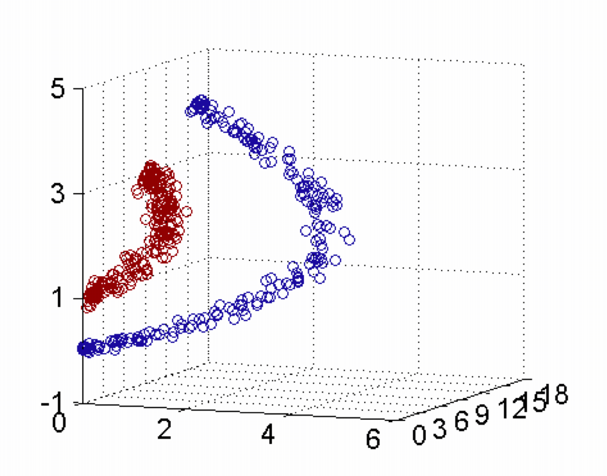

- 假设X是输入空间，
- H是特征空间，
- 存在一个映射ϕ使得X中的点x能够计算得到H空间中的点h，
- 对于所有的X中的点都成立：


若x，z是X空间中的点，函数k(x,z)满足下述条件，那么都成立，则称k为核函数，而ϕ为映射函数：


##### 1.2 核函数举例

###### 1.2.1 核方法举例1


------------------------------------------------------------------------

经过上面公式，具体变换过过程为：

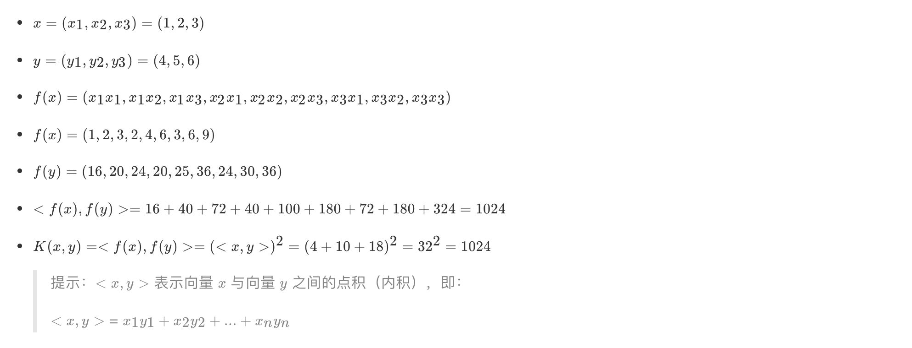

###### 1.2.2 核方法举例2

- 下面这张图位于第一、二象限内。我们关注红色的门，以及“北京四合院”这几个字和下面的紫色的字母。
- 我们把红色的门上的点看成是“+”数据，字母上的点看成是“-”数据，它们的横、纵坐标是两个特征。
- 显然，在这个二维空间内，“+”“-”两类数据不是线性可分的。


> （前后轴为x轴，左右轴为y轴，上下轴为z轴）

------------------------------------------------------------------------

- 绿色的平面可以完美地分割红色和紫色，两类数据在三维空间中变成线性可分的了。

- 三维中的这个判决边界，再映射回二维空间中：**是一条双曲线，它不是线性的**。

- 核函数的作用就是**一个从低维空间到高维空间的映射**，而这个映射可以把低维空间中线性不可分的两类点变成线性可分的。


#### 2 常见核函数


> 1.多项核中，d=1时，退化为线性核；
>
> 2.高斯核亦称为RBF核。

- **线性核和多项式核：**
  - 这两种核的作用也是首先在属性空间中找到一些点，把这些点当做base，核函数的作用就是找与该点距离和角度满足某种关系的样本点。
  - 当样本点与该点的夹角近乎垂直时，两个样本的欧式长度必须非常长才能保证满足线性核函数大于0；而当样本点与base点的方向相同时，长度就不必很长；而当方向相反时，核函数值就是负的，被判为反类。即，它在空间上划分出一个梭形，按照梭形来进行正反类划分。

- **RBF核：**
  - 高斯核函数就是在属性空间中找到一些点，这些点可以是也可以不是样本点，把这些点当做base，以这些base为圆心向外扩展，扩展半径即为带宽，即可划分数据。
  - 换句话说，在属性空间中找到一些超圆，用这些超圆来判定正反类。

- **Sigmoid核：**

  - 同样地是定义一些base，
  - 核函数就是将线性核函数经过一个tanh函数进行处理，把值域限制在了-1到1上。

- 总之，都是在定义距离，大于该距离，判为正，小于该距离，判为负。至于选择哪一种核函数，要根据具体的样本分布情况来确定。

------------------------------------------------------------------------

- 一般有如下指导规则：
  - 1） 如果Feature的数量很大，甚至和样本数量差不多时，往往线性可分，这时选用LR或者线性核Linear；
  - 2） 如果Feature的数量很小，样本数量正常，不算多也不算少，这时选用RBF核；
  - 3） 如果Feature的数量很小，而样本的数量很大，这时手动添加一些Feature，使得线性可分，然后选用LR或者线性核Linear；
  - 4） 多项式核一般很少使用，效率不高，结果也不优于RBF；
  - 5） Linear核参数少，速度快；RBF核参数多，分类结果非常依赖于参数，需要交叉验证或网格搜索最佳参数，比较耗时；
  - 6）应用最广的应该就是RBF核，无论是小样本还是大样本，高维还是低维等情况，RBF核函数均适用。

------------------------------------------------------------------------

#### 3 小结

- SVM的核方法
  - 将原始输入空间映射到新的特征空间，从而，使得原本线性不可分的样本可能在核空间可分。
- 常见核函数
  - 线性核
  - 多项式核
  - RBF核
  - Sigmoid核

---

### 8.6 SVM回归

#### 学习目标

- 了解SVM回归的实现原理

------------------------------------------------------------------------

**SVM回归**是让尽可能多的实例位于预测线上，同时限制间隔违例（也就是不在预测线距上的实例）。

线距的宽度由超参数ε控制。


---

### 8.7 SVM算法api再介绍

#### 学习目标

- 知道SVM算法api中的SVC、NuSVC、LinearSVC

------------------------------------------------------------------------

#### 1 SVM算法api综述

- SVM方法既可以用于分类（二/多分类），也可用于回归和异常值检测。

<!-- -->

- SVM具有良好的鲁棒性，对未知数据拥有很强的泛化能力，**特别是在数据量较少的情况下**，相较其他传统机器学习算法具有更优的性能。

------------------------------------------------------------------------

使用SVM作为模型时，通常采用如下流程：

1.  对样本数据进行归一化
2.  应用核函数对样本进行映射**（最常采用和核函数是RBF和Linear，在样本线性可分时，Linear效果要比RBF好）**
3.  用cross-validation和grid-search对超参数进行优选
4.  用最优参数训练得到模型
5.  测试

------------------------------------------------------------------------

sklearn中支持向量分类主要有三种方法：SVC、NuSVC、LinearSVC，扩展为三个支持向量回归方法：SVR、NuSVR、LinearSVR。

- SVC和NuSVC方法基本一致，唯一区别就是损失函数的度量方式不同
  - NuSVC中的nu参数和SVC中的C参数；
- LinearSVC是实现线性核函数的支持向量分类，没有kernel参数。

#### 2 SVC

``` lang-python
class sklearn.svm.SVC(C=1.0, kernel='rbf', degree=3,coef0=0.0,random_state=None)
```

- **C:** 惩罚系数，用来控制损失函数的惩罚系数，类似于线性回归中的正则化系数。
  - C越大，相当于惩罚松弛变量，希望松弛变量接近0，即**对误分类的惩罚增大**，趋向于对训练集全分对的情况，这样会出现训练集测试时准确率很高，但泛化能力弱，容易导致过拟合。
  - C值小，**对误分类的惩罚减小**，容错能力增强，泛化能力较强，但也可能欠拟合。
- **kernel:** 算法中采用的核函数类型，核函数是用来将非线性问题转化为线性问题的一种方法。
  - 参数选择有RBF, Linear, Poly, Sigmoid或者自定义一个核函数。
    - 默认的是"RBF"，即径向基核，也就是高斯核函数；
    - 而Linear指的是线性核函数，
    - Poly指的是多项式核，
    - Sigmoid指的是双曲正切函数tanh核；。
- **degree:**
  - 当指定kernel为'poly'时，表示选择的多项式的最高次数，默认为三次多项式；
  - 若指定kernel不是'poly'，则忽略，即该参数只对'poly'有用。
    - 多项式核函数是将低维的输入空间映射到高维的特征空间。
- **coef0:** 核函数常数值(y=kx+b中的b值)，
  - 只有‘poly’和‘sigmoid’核函数有，默认值是0。

#### 3 NuSVC

``` lang-python
class sklearn.svm.NuSVC(nu=0.5)
```

- **nu：** 训练误差部分的上限和支持向量部分的下限，取值在（0，1）之间，默认是0.5

#### 4 LinearSVC

``` lang-python
class sklearn.svm.LinearSVC(penalty='l2', loss='squared_hinge', dual=True, C=1.0)
```

- penalty:正则化参数，
  - L1和L2两种参数可选，仅LinearSVC有。
- loss:损失函数，
  - 有hinge和squared_hinge两种可选，前者又称L1损失，后者称为L2损失，默认是squared_hinge，
  - 其中hinge是SVM的标准损失，squared_hinge是hinge的平方
- dual:是否转化为对偶问题求解，默认是True。
- C:惩罚系数，
  - 用来控制损失函数的惩罚系数，类似于线性回归中的正则化系数。

------------------------------------------------------------------------

#### 3 小结

- SVM的核方法
  - 将原始输入空间映射到新的特征空间，从而，使得原本线性不可分的样本可能在核空间可分。
- SVM算法api
  - sklearn.svm.SVC
  - sklearn.svm.NuSVC
  - sklearn.svm.LinearSVC

---

### 8.8 案例：数字识别器

#### 学习目标

- 应用SVM算法实现数字识别器

------------------------------------------------------------------------

#### 1 案例背景介绍


MNIST（“修改后的国家标准与技术研究所”）是计算机视觉事实上的“hello world”数据集。自1999年发布以来，这一经典的手写图像数据集已成为分类算法基准测试的基础。随着新的机器学习技术的出现，MNIST仍然是研究人员和学习者的可靠资源。

本次案例中，我们的目标是**从数万个手写图像的数据集中正确识别数字。**

#### 2 数据介绍

数据文件train.csv和test.csv包含从0到9的手绘数字的灰度图像。

**每个图像的高度为28个像素，宽度为28个像素，总共为784个像素**。

每个像素具有与其相关联的单个像素值，指示该像素的亮度或暗度，较高的数字意味着较暗。**该像素值是0到255之间的整数，包括0和255。**

**训练数据集（train.csv）有785列。第一列称为“标签”，是用户绘制的数字。其余列包含关联图像的像素值。**

训练集中的每个像素列都具有像pixelx这样的名称，其中x是0到783之间的整数，包括0和783。为了在图像上定位该像素，假设我们已经将x分解为x = i \* 28 + j，其中i和j是0到27之间的整数，包括0和27。然后，pixelx位于28 x 28矩阵的第i行和第j列上（索引为零）。

例如，pixel31表示从左边开始的第四列中的像素，以及从顶部开始的第二行，如下面的ascii图中所示。

在视觉上，如果我们省略“像素”前缀，像素组成图像如下：

    000 001 002 003 ... 026 027
    028 029 030 031 ... 054 055
    056 057 058 059 ... 082 083
     | | | | ...... | |
    728 729 730 731 ... 754 755
    756 757 758 759 ... 782 783


测试数据集（test.csv）与训练集相同，只是它不包含“标签”列。

#### 3 案例实现

> 参考：案例_手写数字分类.ipynb

---

### 8.9 SVM总结

#### 1 SVM基本综述

- SVM是一种二类分类模型。

- 它的基本模型是在特征空间中寻找间隔最大化的分离超平面的线性分类器。

  - 1）当训练样本线性可分时，通过硬间隔最大化，学习一个线性分类器，即线性可分支持向量机；
  - 2）当训练数据近似线性可分时，引入松弛变量，通过软间隔最大化，学习一个线性分类器，即线性支持向量机；
  - 3）当训练数据线性不可分时，通过使用核技巧及软间隔最大化，学习非线性支持向量机。

#### 2 SVM优缺点：

- SVM的优点：

  - 在高维空间中非常高效；
  - 即使在数据维度比样本数量大的情况下仍然有效；
  - 在决策函数（称为支持向量）中使用训练集的子集,因此它也是高效利用内存的；
  - 通用性：不同的核函数与特定的决策函数一一对应；

- SVM的缺点：

  - 如果特征数量比样本数量大得多，在选择核函数时要避免过拟合；
  - 对缺失数据敏感;
  - 对于核函数的高维映射解释力不强

---

## EM算法

------------------------------------------------------------------------

### 学习目标

- 了解什么是EM算法
- 知道极大似然估计
- 知道EM算法实现流程

---

### 9.1 初识EM算法

#### 学习目标

- 知道什么是EM算法

------------------------------------------------------------------------

EM算法也称期望最大化（Expectation-Maximum,简称EM）算法。

**它是一个基础算法，是很多机器学习领域算法的基础，**比如隐式马尔科夫算法（HMM）等等。

EM算法是一种迭代优化策略，由于它的计算方法中每一次迭代都分两步，

- **其中一个为期望步（E步），**
- **另一个为极大步（M步），**

所以算法被称为EM算法（Expectation-Maximization Algorithm）。

------------------------------------------------------------------------

EM算法受到缺失思想影响，**最初是为了解决数据缺失情况下的参数估计问题**，其算法基础和收敛有效性等问题在Dempster、Laird和Rubin三人于1977年所做的文章《Maximum likelihood from incomplete data via the EM algorithm》中给出了详细的阐述。其基本思想是：

- 首先**根据己经给出的观测数据，估计出模型参数的值**；
- 然后**再依据上一步估计出的参数值估计缺失数据的值**，再根据估计出的缺失数据加上之前己经观测到的数据**重新再对参数值进行估计**；
- 然后反复迭代，直至最后收敛，迭代结束。

**EM算法计算流程：**


------------------------------------------------------------------------

#### 小结

- EM算法是一种迭代优化策略，由于它的计算方法中每一次迭代都分两步：
  - **其中一个为期望步（E步）**
  - **另一个为极大步（M步）**

---

### 9.2 EM算法介绍

#### 学习目标

- 知道什么是极大似然估计
- 知道EM算法实现流程

------------------------------------------------------------------------

想清晰的了解EM算法，我们需要知道一个基础知识：

- “极大似然估计”

#### 1 极大似然估计

##### 1.1 问题描述

假如我们需要调查学校的男生和女生的身高分布 ，我们抽取100个男生和100个女生，将他们按照性别划分为两组。

然后，统计抽样得到100个男生的身高数据和100个女生的身高数据。

如果我们知道他们的身高服从正态分布，但**是这个分布的均值μ 和方差δ<sup>2</sup> 是不知道，这两个参数就是我们需要估计的。**

------------------------------------------------------------------------

问题：我们知道样本所服从的概率分布模型和一些样本，我们需要求解该模型的参数.


- 我们已知的条件有两个：

  - 样本服从的分布模型
  - 随机抽取的样本。

- 我们需要求解模型的参数。

根据已知条件，通过极大似然估计，求出未知参数。

**总的来说：极大似然估计就是用来估计模型参数的统计学方法。**

##### 1.2 用数学知识解决现实问题

问题数学化：

- 样本集 。

- 概率密度是：![\[公式\]](https://www.zhihu.com/equation?tex=p(x_%7Bi%7D%7C\theta)) 抽到第i个男生身高的概率。

- 由于**100个样本之间独立同分布**，所以同时抽到这100个男生的概率是它们各自概率的乘积，也就是样本集X中各个样本的联合概率，用下式表示：


- 这个概率反映了在概率密度函数的参数是θ时，得到X这组样本的概率。

- 我们需要找到一个参数θ，使得抽到X这组样本的概率最大，也就是说需要其对应的似然函数L(θ)最大。

  - 满足条件的θ叫做θ的最大似然估计值，记为：

##### 1.3 最大似然函数估计值的求解步骤

- 首先，写出似然函数：

- 其次，对似然函数取对数：

- 然后，对上式求导，令导数为0，得到似然方程。

- 最后，解似然方程，得到的参数值即为所求。

多数情况下，我们是根据已知条件来推算结果，而极大似然估计是已知结果，寻求使该结果出现的可能性最大的条件，以此作为估计值。

------------------------------------------------------------------------

链接：[极大似然函数取对数的原因](03-EM算法/section4.md)

#### 2 EM算法实例描述

我们目前有100个男生和100个女生的身高，但是**我们不知道这200个数据中哪个是男生的身高，哪个是女生的身高，**即抽取得到的每个样本都不知道是从哪个分布中抽取的。

这个时候，对于每个样本，就有两个未知量需要估计：

（1）这个身高数据是来自于男生数据集合还是来自于女生？

（2）男生、女生身高数据集的正态分布的参数分别是多少？

**具体问题如下图：**


**对于具体的身高问题使用EM算法求解步骤如下：**


（1）**初始化参数：**先初始化男生身高的正态分布的参数：如均值=1.65，方差=0.15；

（2）**计算分布：**计算每一个人更可能属于男生分布或者女生分布；

（3）**重新估计参数**：通过分为男生的n个人来重新估计男生身高分布的参数（最大似然估计），女生分布也按照相同的方式估计出来，更新分布。

（4）这时候两个分布的概率也变了，**然后重复步骤（1）至（3），直到参数不发生变化为止**。

#### 3 EM算法流程

**输入：**

- n个样本观察数据 ![\[公式\]](https://www.zhihu.com/equation?tex=x%3D(x_%7B1%7D%2Cx_%7B2%7D%2C...x_%7Bn%7D)) ，未观察到的隐含数据 ![\[公式\]](https://www.zhihu.com/equation?tex=z%3D(z_%7B1%7D%2Cz_%7B2%7D%2C...%2Cz_%7Bn%7D)) ，
- 联合分布 ![\[公式\]](https://www.zhihu.com/equation?tex=p(x%2Cz%3B\theta)) ，条件分布 ![\[公式\]](https://www.zhihu.com/equation?tex=p(z%7Cx%2C\theta)) ，最大迭代次数 J。

**算法步骤：**

1）随机初始化模型参数θ的初值 ![\[公式\]](https://www.zhihu.com/equation?tex=\theta_%7B0%7D) 。

2）j=1,2,...,J 开始EM算法迭代：

- **E步：计算联合分布的条件概率期望：**


- **M步：极大化 ![\[公式\]](https://www.zhihu.com/equation?tex=l(\theta%2C\theta_%7Bj%7D)) ,得到 ![\[公式\]](https://www.zhihu.com/equation?tex=\theta_%7Bj%2B1%7D) :**


- **如果![\[公式\]](https://www.zhihu.com/equation?tex=\theta_%7Bj%2B1%7D) 已经收敛，则算法结束。否则继续进行E步和M步进行迭代。**

**输出：**模型参数θ。

------------------------------------------------------------------------

#### 3 小结

- 极大似然估计
  - 根据已知条件，通过极大似然估计，求出未知参数；
  - 极大似然估计就是用来估计模型参数的统计学方法。
- EM算法基本流程
  - 1） 初始化参数；
  - 2） 计算分布；
  - 3） 重新估计参数；
  - 4） 重复1-3步，直到参数不发生变化为止。

---

### 9.3 EM算法实例

#### 学习目标

- 通过实例了解EM算法实现的流程

------------------------------------------------------------------------

#### 1 一个超级简单的案例

假设现在有两枚硬币1和2，,随机抛掷后正面朝上概率分别为P1，P2。为了估计这两个概率，做实验，每次取一枚硬币，连掷5下，记录下结果，如下：

| 硬币 |    结果    |  统计   |
|:----:|:----------:|:-------:|
|  1   | 正正反正反 | 3正-2反 |
|  2   | 反反正正反 | 2正-3反 |
|  1   | 正反反反反 | 1正-4反 |
|  2   | 正反反正正 | 3正-2反 |
|  1   | 反正正反反 | 2正-3反 |

可以很容易地估计出P1和P2，如下：

P1 = （3+1+2）/ 15 = 0.4 P2= （2+3）/10 = 0.5

到这里，一切似乎很美好，下面我们加大难度。

#### 2 加入隐变量z后的求解

还是上面的问题，现在我们抹去每轮投掷时使用的硬币标记，如下：

|  硬币   |    结果    |  统计   |
|:-------:|:----------:|:-------:|
| Unknown | 正正反正反 | 3正-2反 |
| Unknown | 反反正正反 | 2正-3反 |
| Unknown | 正反反反反 | 1正-4反 |
| Unknown | 正反反正正 | 3正-2反 |
| Unknown | 反正正反反 | 2正-3反 |

好了，**现在我们的目标没变，还是估计P1和P2，要怎么做呢？**

显然，此时我们多了一个隐变量z，可以把它认为是一个5维的向量（z1,z2,z3,z4,z5)，代表每次投掷时所使用的硬币，比如z1，就代表第一轮投掷时使用的硬币是1还是2。但是，这个变量z不知道，就无法去估计P1和P2，所以，我们必须先估计出z，然后才能进一步估计P1和P2。

但要估计 z，我们又得知道P1和P2，这样我们才能用最大似然概率法则去估计z，这不是鸡生蛋和蛋生鸡的问题吗，如何破？

答案就是先随机初始化一个P1和P2，用它来估计z，然后基于z，还是按照最大似然概率法则去估计新的P1和P2，如果新的P1和P2和我们初始化的P1和P2一样，请问这说明了什么？（此处思考1分钟）

这说明我们初始化的P1和P2是一个相当靠谱的估计！

就是说，我们初始化的P1和P2，按照最大似然概率就可以估计出z，然后基于z，按照最大似然概率可以反过来估计出P1和P2，当与我们初始化的P1和P2一样时，说明是P1和P2很有可能就是真实的值。这里面包含了两个交互的最大似然估计。

如果新估计出来的P1和P2和我们初始化的值差别很大，怎么办呢？就是继续用新的P1和P2迭代，直至收敛。

这就是下面的EM初级版。

##### 2.1 EM初级版

我们不妨这样，先随便给P1和P2赋一个值，比如：

- P1 = 0.2
- P2 = 0.7

然后，我们看看第一轮抛掷最可能是哪个硬币。

- 如果是硬币1，得出3正2反的概率为: 0.2\*0.2\*0.2\*0.8\*0.8 = 0.00512
- 如果是硬币2，得出3正2反的概率为: 0.7\*0.7\*0.7\*0.3\*0.3=0.03087

然后依次求出其他4轮中的相应概率。做成表格如下：

| 轮数 | 若是硬币1 | 若是硬币2 |
|:----:|:---------:|:---------:|
|  1   |  0.00512  |  0.03087  |
|  2   |  0.02048  |  0.01323  |
|  3   |  0.08192  |  0.00567  |
|  4   |  0.00512  |  0.03087  |
|  5   |  0.02048  |  0.01323  |

按照最大似然法则：

- 第1轮中最有可能的是**硬币2**
- 第2轮中最有可能的是**硬币1**
- 第3轮中最有可能的是**硬币1**
- 第4轮中最有可能的是**硬币2**
- 第5轮中最有可能的是**硬币1**

我们就把上面的值作为z的估计值。然后按照最大似然概率法则来估计新的P1和P2。

- P1 =（2 + 1 + 2）/ 15 = 0.33
- P2=（3 + 3）/ 10 = 0.6

设想我们是全知的神，知道每轮抛掷时的硬币就是如本文第001部分标示的那样，那么，P1和P2的最大似然估计就是0.4和0.5（下文中将这两个值称为P1和P2的真实值）。那么对比下我们初始化的P1和P2和新估计出的P1和P2：

|   初始化的P1   |   估计出的P1   |   真实的P1   |
|:--------------:|:--------------:|:------------:|
|      0.2       |      0.33      |     0.4      |
| **初始化的P2** | **估计出的P2** | **真实的P2** |
|      0.7       |      0.6       |     0.5      |

看到没？我们估计的P1和P2相比于它们的初始值，更接近它们的真实值了！

可以期待，我们继续按照上面的思路，用估计出的P1和P2再来估计z，再用z来估计新的P1和P2，反复迭代下去，就可以最终得到P1 = 0.4，P2=0.5，此时无论怎样迭代，P1和P2的值都会保持0.4和0.5不变，于是乎，我们就找到了P1和P2的最大似然估计。

这里有两个问题：

- 1、新估计出的P1和P2一定会更接近真实的P1和P2？
  - 答案是：没错，一定会更接近真实的P1和P2，数学可以证明，但这超出了本文的主题，请参阅其他书籍或文章。
- 2、迭代一定会收敛到真实的P1和P2吗？
  - 答案是：不一定，取决于P1和P2的初始化值，上面我们之所以能收敛到P1和P2，是因为我们幸运地找到了好的初始化值。

##### 2.2 EM进阶版

下面，我们思考下，上面的方法还有没有改进的余地？

我们是用最大似然概率法则估计出的z值，然后再用z值按照最大似然概率法则估计新的P1和P2。也就是说，我们使用了一个最可能的z值，而不是所有可能的z值。

如果考虑所有可能的z值，对每一个z值都估计出一个新的P1和P2，将每一个z值概率大小作为权重，将所有新的P1和P2分别加权相加，这样的P1和P2应该会更好一些。

所有的z值有多少个呢？

- 显然，有 2<sup>5</sup>=32 种，需要我们进行32次估值？？

不需要，我们可以用期望来简化运算。

| 轮数 | 若是硬币1 | 若是硬币2 |
|:----:|:---------:|:---------:|
|  1   |  0.00512  |  0.03087  |
|  2   |  0.02048  |  0.01323  |
|  3   |  0.08192  |  0.00567  |
|  4   |  0.00512  |  0.03087  |
|  5   |  0.02048  |  0.01323  |

利用上面这个表，我们可以算出每轮抛掷中使用硬币1或者使用硬币2的概率。

比如第1轮，使用硬币1的概率是：

- <span class="katex"><span class="katex-mathml">$`0.00512/(0.00512+0.03087)=0.14`$</span></span>

使用硬币2的概率是1-0.14=0.86

依次可以算出其他4轮的概率，如下：

| 轮数 | <span class="katex"><span class="katex-mathml">$`z_i=`$</span></span>硬币1​ | <span class="katex"><span class="katex-mathml">$`z_i=`$</span></span>硬币2​ |
|:--:|:--:|:--:|
| 1 | 0.14 | 0.86 |
| 2 | 0.61 | 0.39 |
| 3 | 0.94 | 0.06 |
| 4 | 0.14 | 0.86 |
| 5 | 0.61 | 0.39 |

上表中的右两列表示期望值。看第一行，0.86表示，从期望的角度看，**这轮抛掷使用硬币2的概率是0.86。相比于前面的方法，我们按照最大似然概率，直接将第1轮估计为用的硬币2，此时的我们更加谨慎，我们只说，有0.14的概率是硬币1，有0.86的概率是硬币2，不再是非此即彼。**这样我们在估计P1或者P2时，就可以用上全部的数据，而不是部分的数据，显然这样会更好一些。

这一步，我们实际上是估计出了z的概率分布，这步被称作E步。

结合下表：

|  硬币   |    结果    |  统计   |
|:-------:|:----------:|:-------:|
| Unknown | 正正反正反 | 3正-2反 |
| Unknown | 反反正正反 | 2正-3反 |
| Unknown | 正反反反反 | 1正-4反 |
| Unknown | 正反反正正 | 3正-2反 |
| Unknown | 反正正反反 | 2正-3反 |

我们按照期望最大似然概率的法则来估计新的P1和P2：

以P1估计为例，第1轮的3正2反相当于

- 0.14\*3=0.42正
- 0.14\*2=0.28反

依次算出其他四轮，列表如下：

| 轮数 | 正面 | 反面 |
|:----:|:----:|:----:|
|  1   | 0.42 | 0.28 |
|  2   | 1.22 | 1.83 |
|  3   | 0.94 | 3.76 |
|  4   | 0.42 | 0.28 |
|  5   | 1.22 | 1.83 |
| 总计 | 4.22 | 7.98 |

P1=4.22/(4.22+7.98)=0.35

可以看到，改变了z值的估计方法后，新估计出的P1要更加接近0.4。原因就是我们使用了所有抛掷的数据，而不是之前只使用了部分的数据。

这步中，我们根据E步中求出的z的概率分布，依据最大似然概率法则去估计P1和P2，被称作M步。

------------------------------------------------------------------------

#### 3 小结

- EM算法的实现思路：

  - 首先**根据己经给出的观测数据，估计出模型参数的值**；
  - 然后**再依据上一步估计出的参数值估计缺失数据的值**，再根据估计出的缺失数据加上之前己经观测到的数据**重新再对参数值进行估计**；
  - 然后反复迭代，直至最后收敛，迭代结束。

---

## HMM模型

### 学习目标

- 了解什么是马尔科夫链
- 知道什么是HMM模型
- 知道前向后向算法评估观察序列概率
- 知道维特比算法解码隐藏状态序列
- 了解鲍姆-韦尔奇算法
- 知道HMM模型API的使用

---

### 10.1 马尔科夫链

#### 学习目标

- 知道什么是马尔科夫链

------------------------------------------------------------------------

在机器学习算法中，马尔可夫链(Markov chain)是个很重要的概念。**马尔可夫链（Markov chain），又称离散时间马尔可夫链（discrete-time Markov chain）**，因俄国数学家安德烈·马尔可夫（俄语：Андрей Андреевич Марков）得名。


#### 1 简介

马尔科夫链即为**状态空间中从一个状态到另一个状态转换的随机过程。**


- 该过程要求具备**“无记忆”**的性质：
  - **下一状态的概率分布只能由当前状态决定，在时间序列中它前面的事件均与之无关**。这种特定类型的“无记忆性”称作**马尔可夫性质**。

- 马尔科夫链作为实际过程的统计模型具有许多应用。

- 在马尔可夫链的每一步，**系统根据概率分布，可以从一个状态变到另一个状态，也可以保持当前状态。**

- **状态的改变叫做转移，与不同的状态改变相关的概率叫做转移概率。**

- 马尔可夫链的数学表示为：

- 既然某一时刻状态转移的概率只依赖前一个状态，那么**只要求出系统中任意两个状态之间的转移概率，这个马尔科夫链的模型就定了。**

#### 2 经典举例

下图中的马尔科夫链是用来表示股市模型，共有三种状态：牛市（Bull market）, 熊市（Bear market）和横盘（Stagnant market）。

每一个状态都以一定的概率转化到下一个状态。比如，牛市以0.025的概率转化到横盘的状态。


- 这个状态概率转化图可以以矩阵的形式表示。
- 如果我们定义矩阵阵P某一位置P(i, j)的值为P(j\|i)，即从状态i变为状态j的概率。
- 另外定义牛市、熊市、横盘的状态分别为0、1、2，这样我们得到了马尔科夫链模型的状态转移矩阵为：


当这个状态转移矩阵P确定以后，整个股市模型就已经确定！

------------------------------------------------------------------------

#### 3 小结

- 马尔科夫链即为
  - **状态空间中从一个状态到另一个状态转换的随机过程。**
  - 该过程要求具备**“无记忆”**的性质：
    - **下一状态的概率分布只能由当前状态决定，在时间序列中它前面的事件均与之无关**。

---

### 10.2 HMM简介

#### 学习目标

- 通过举例了解什么HMM

------------------------------------------------------------------------

**隐马尔可夫模型**（Hidden Markov Model，HMM）是统计模型，它用来**描述一个含有隐含未知参数的马尔可夫过程。**

**其难点是从可观察的参数中确定该过程的隐含参数。然后利用这些参数来作进一步的分析，**例如模式识别。

#### 1 简单案例

下面我们一起用一个简单的例子来阐述：

- 假设我手里有三个不同的骰子。
  - 第一个骰子是我们平常见的骰子（称这个骰子为D6），6个面，每个面（1，2，3，4，5，6）出现的概率是1/6。
  - 第二个骰子是个四面体（称这个骰子为D4），每个面（1，2，3，4）出现的概率是1/4。
  - 第三个骰子有八个面（称这个骰子为D8），每个面（1，2，3，4，5，6，7，8）出现的概率是1/8。


- 我们开始掷骰子，我们先从三个骰子里挑一个，挑到每一个骰子的概率都是1/3。
- 然后我们掷骰子，得到一个数字，1，2，3，4，5，6，7，8中的一个。不停的重复上述过程，我们会得到一串数字，每个数字都是1，2，3，4，5，6，7，8中的一个。
- 例如我们可能得到这么一串数字（掷骰子10次）：1 6 3 5 2 7 3 5 2 4
- 这串数字叫做**可见状态链。**

但是在隐马尔可夫模型中，我们不仅仅有这么一串可见状态链，还有一串**隐含状态链**。

- 在这个例子里，这串隐含状态链就是你用的骰子的序列。
  - 比如，隐含状态链有可能是：D6 D8 D8 D6 D4 D8 D6 D6 D4 D8

一般来说，**HMM中说到的马尔可夫链其实是指隐含状态链，**因为隐含状态（骰子）之间存在转换概率（transition probability）。

- 在我们这个例子里，D6的下一个状态是D4，D6，D8的概率都是1/3。D4，D8的下一个状态是D4，D6，D8的转换概率也都一样是1/3。
- 这样设定是为了最开始容易说清楚，但是我们其实是可以随意设定转换概率的。
  - 比如，我们可以这样定义，D6后面不能接D4，D6后面是D6的概率是0.9，是D8的概率是0.1。
  - 这样就是一个新的HMM。

同样的，尽管可见状态之间没有转换概率，但是隐含状态和可见状态之间有一个概率叫做**输出概率**（emission probability）。

- 就我们的例子来说，六面骰（D6）产生1的输出概率是1/6。产生2，3，4，5，6的概率也都是1/6。
- 我们同样可以对输出概率进行其他定义。比如，我有一个被赌场动过手脚的六面骰子，掷出来是1的概率更大，是1/2，掷出来是2，3，4，5，6的概率是1/10。


其实对于HMM来说，如果提前知道所有隐含状态之间的转换概率和所有隐含状态到所有可见状态之间的输出概率，做模拟是相当容易的。但是应用HMM模型时候呢，往往是缺失了一部分信息的。

- 有时候你知道骰子有几种，每种骰子是什么，但是不知道掷出来的骰子序列；
- 有时候你只是看到了很多次掷骰子的结果，剩下的什么都不知道。

如果应用算法去估计这些缺失的信息，就成了一个很重要的问题。这些算法我会在后面详细讲。

#### 2 案例进阶

##### 2.1 问题阐述

和HMM模型相关的算法主要分为三类，分别解决三种问题：

**1）知道骰子有几种（隐含状态数量），每种骰子是什么（转换概率），根据掷骰子掷出的结果（可见状态链），我想知道每次掷出来的都是哪种骰子（隐含状态链）。**

- 这个问题呢，在语音识别领域呢，叫做解码问题。
- 这个问题其实有两种解法，会给出两个不同的答案。每个答案都对，只不过这些答案的意义不一样。
  - 第一种解法求最大似然状态路径，说通俗点呢，就是我求一串骰子序列，这串骰子序列产生观测结果的概率最大。
  - 第二种解法呢，就不是求一组骰子序列了，而是求每次掷出的骰子分别是某种骰子的概率。比如说我看到结果后，我可以求得第一次掷骰子是D4的概率是0.5，D6的概率是0.3，D8的概率是0.2。

**2）还是知道骰子有几种（隐含状态数量），每种骰子是什么（转换概率），根据掷骰子掷出的结果（可见状态链），我想知道掷出这个结果的概率。**

- 看似这个问题意义不大，因为你掷出来的结果很多时候都对应了一个比较大的概率。
- 问这个问题的目的呢，其实是**检测观察到的结果和已知的模型是否吻合。**
- 如果很多次结果都对应了比较小的概率，那么就说明我们已知的模型很有可能是错的，有人偷偷把我们的骰子給换了。

**3）知道骰子有几种（隐含状态数量），不知道每种骰子是什么（转换概率），观测到很多次掷骰子的结果（可见状态链），我想反推出每种骰子是什么（转换概率）。**

- 这个问题很重要，因为这是最常见的情况。
- 很多时候我们只有可见结果，不知道HMM模型里的参数，我们需要从可见结果估计出这些参数，这是建模的一个必要步骤。

##### 2.2 问题解决

###### 2.2.1 一个简单问题【对应问题二】

其实这个问题实用价值不高。由于对下面较难的问题有帮助，所以先在这里提一下。

- **知道骰子有几种，每种骰子是什么，每次掷的都是什么骰子，根据掷骰子掷出的结果，求产生这个结果的概率。**


- 解法无非就是概率相乘：


###### 2.2.2 看见不可见的，破解骰子序列【对应问题一】

这里我说的是第一种解法，解最大似然路径问题。

举例来说，我知道我有三个骰子，六面骰，四面骰，八面骰。我也知道我掷了十次的结果

（1 6 3 5 2 7 3 5 2 4），**我不知道每次用了那种骰子，我想知道最有可能的骰子序列。**

其实最简单而暴力的方法就是穷举所有可能的骰子序列，然后依照上一个问题的解法把每个序列对应的概率算出来。然后我们从里面把对应最大概率的序列挑出来就行了。

如果马尔可夫链不长，当然可行。如果长的话，穷举的数量太大，就很难完成了。

另外一种很有名的算法叫做**维特比算法（Viterbi algorithm）**. 要理解这个算法，我们先看几个简单的列子。 首先，如果我们只掷一次骰子：


看到结果为1.对应的最大概率骰子序列就是D4，因为D4产生1的概率是1/4，高于1/6和1/8.

把这个情况拓展，我们掷两次骰子：


结果为1，6.这时问题变得复杂起来，我们要计算三个值，分别是第二个骰子是D6，D4，D8的最大概率。显然，要取到最大概率，第一个骰子必须为D4。这时，第二个骰子取到D6的最大概率是：


同样的，我们可以计算第二个骰子是D4或D8时的最大概率。我们发现，第二个骰子取到D6的概率最大。而使这个概率最大时，第一个骰子为D4。所以最大概率骰子序列就是D4 D6。 继续拓展，我们掷三次骰子：


同样，我们计算第三个骰子分别是D6，D4，D8的最大概率。我们再次发现，要取到最大概率，第二个骰子必须为D6。这时，第三个骰子取到D4的最大概率是：


同上，我们可以计算第三个骰子是D6或D8时的最大概率。我们发现，第三个骰子取到D4的概率最大。而使这个概率最大时，第二个骰子为D6，第一个骰子为D4。所以最大概率骰子序列就是D4 D6 D4。

------------------------------------------------------------------------

写到这里，大家应该看出点规律了。既然掷骰子一、二、三次可以算，掷多少次都可以以此类推。

我们发现，我们要求最大概率骰子序列时要做这么几件事情。

- 首先，不管序列多长，**要从序列长度为1算起，**算序列长度为1时取到每个骰子的最大概率。
- 然后，逐渐增加长度，每**增加一次长度，重新算一遍在这个长度下最后一个位置取到每个骰子的最大概率。**因为上一个长度下的取到每个骰子的最大概率都算过了，重新计算的话其实不难。
- 当我们**算到最后一位时，就知道最后一位是哪个骰子的概率最大了**。然后，我们要把**对应这个最大概率的序列从后往前推出来。**

###### 2.2.3 谁动了我的骰子？【对应问题三】

比如说你怀疑自己的六面骰被赌场动过手脚了，有可能被换成另一种六面骰，这种六面骰掷出来是1的概率更大，是1/2，掷出来是2，3，4，5，6的概率是1/10。你怎么办么？

- 答案很简单，算一算正常的三个骰子掷出一段序列的概率，再算一算不正常的六面骰和另外两个正常骰子掷出这段序列的概率。如果前者比后者小，你就要小心了。

比如说掷骰子的结果是：


要算用正常的三个骰子掷出这个结果的概率，其实就是将所有可能情况的概率进行加和计算。

同样，**简单而暴力的方法就是把穷举所有的骰子序列，**还是计算每个骰子序列对应的概率，但是这回，我们不挑最大值了，而是**把所有算出来的概率相加，**得到的总概率就是我们要求的结果。这个方法依然不能应用于太长的骰子序列（马尔可夫链）。 我们会应用一个和前一个问题类似的解法，只不过前一个问题关心的是概率最大值，这个问题关心的是概率之和。解决这个问题的算法叫做**前向算法**（forward algorithm）。

首先，如果我们只掷一次骰子：


看到结果为1.产生这个结果的总概率可以按照如下计算，总概率为0.18：


把这个情况拓展，我们掷两次骰子：


看到结果为1，6.产生这个结果的总概率可以按照如下计算，总概率为0.05：


继续拓展，我们掷三次骰子：


看到结果为1，6，3.产生这个结果的总概率可以按照如下计算，总概率为0.03：


同样的，我们一步一步的算，有多长算多长，再长的马尔可夫链总能算出来的。

用同样的方法，也可以算出不正常的六面骰和另外两个正常骰子掷出这段序列的概率，然后我们比较一下这两个概率大小，就能知道你的骰子是不是被人换了。

------------------------------------------------------------------------

#### 3 小结

- **隐马尔可夫模型**（Hidden Markov Model，HMM）是统计模型，它用来**描述一个含有隐含未知参数的马尔可夫过程。**
- 常见术语
  - 可见状态链
  - 隐含状态链
  - 转换概率
  - 输出概率

---

### 10.3 HMM模型基础

#### 学习目标

- 了解HMM模型解决的问题的主要特征
- 知道HMM模型的两个重要假设
- 指导HMM观测序列的生成过程
- 知道HMM模型的三个基本问题

------------------------------------------------------------------------

#### 1 什么样的问题需要HMM模型

首先我们来看看什么样的问题解决可以用HMM模型。使用HMM模型时我们的问题一般有这两个特征：

- １）我们的问题是基于序列的，比如时间序列，或者状态序列。
- ２）我们的问题中有两类数据，
  - 一类序列数据是可以观测到的，**即观测序列**；
  - 而另一类数据是不能观察到的，**即隐藏状态序列，简称状态序列**。

有了这两个特征，那么这个问题一般可以用HMM模型来尝试解决。这样的问题在实际生活中是很多的。

- 比如：我现在给大家写课件，我在键盘上敲出来的一系列字符就是**观测序列**，而我实际想写的一段话就是**隐藏状态序列**，输入法的任务就是从敲入的一系列字符尽可能的猜测我要写的一段话，并把最可能的词语放在最前面让我选择，这就可以看做一个HMM模型了。

<!-- -->

- 再举一个，假如我上课讲课，我发出的一串连续的声音就是**观测序列**，而我实际要表达的一段话就是**隐藏状态序列**，你大脑的任务，就是从这一串连续的声音中判断出我最可能要表达的话的内容。

从这些例子中，我们可以发现，HMM模型可以无处不在。但是上面的描述还不精确，下面我们用精确的数学符号来表述我们的HMM模型。

#### 2 HMM模型的定义

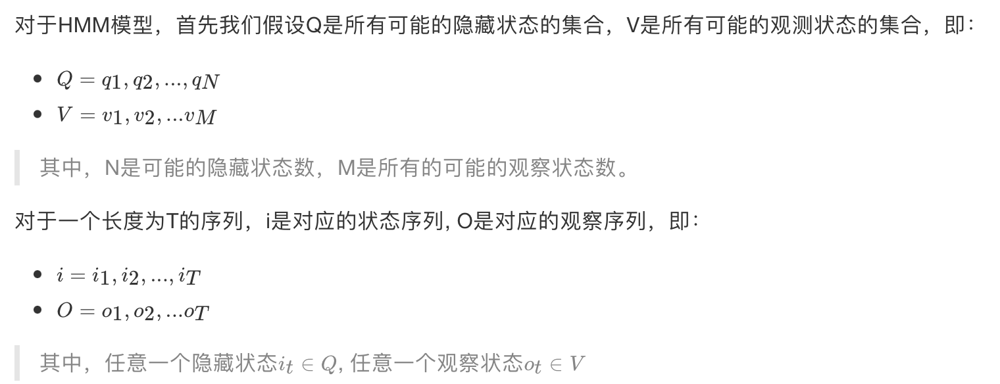

HMM模型做了两个很重要的假设如下：

**1） 齐次马尔科夫链假设。**

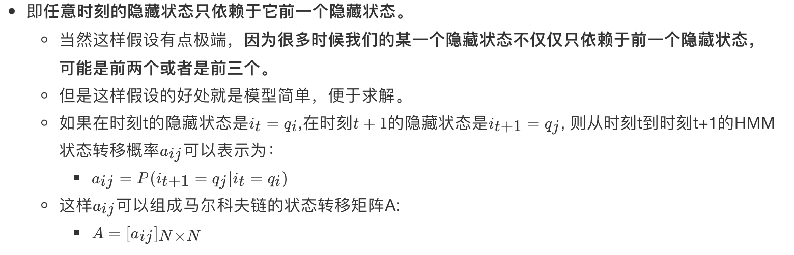

2） **观测独立性假设。**

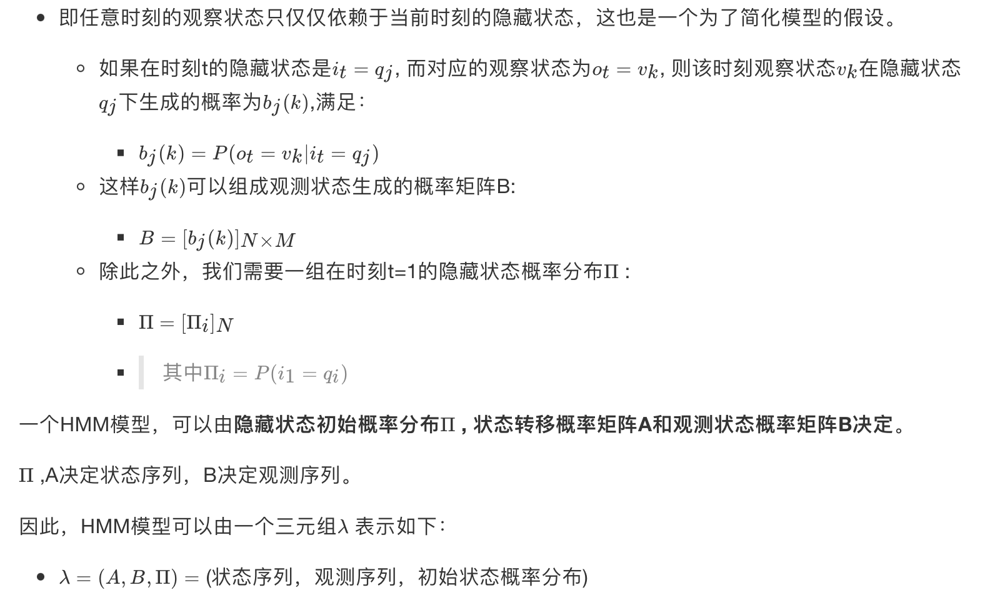

#### 3 一个HMM模型实例

下面我们用一个简单的实例来描述上面抽象出的HMM模型。这是一个盒子与球的模型。

> 案例来源于李航-《统计学习方法》。

假设我们有3个盒子，每个盒子里都有红色和白色两种球，这三个盒子里球的数量分别是：

| 盒子   | 1   | 2   | 3   |
|--------|-----|-----|-----|
| 红球数 | 5   | 4   | 7   |
| 白球数 | 5   | 6   | 3   |

按照下面的方法从盒子里抽球，开始的时候，

- 从第一个盒子抽球的概率是0.2，
- 从第二个盒子抽球的概率是0.4，
- 从第三个盒子抽球的概率是0.4。

以这个概率抽一次球后，将球放回。

然后从当前盒子转移到下一个盒子进行抽球。规则是：

- 如果当前抽球的盒子是第一个盒子，则以0.5的概率仍然留在第一个盒子继续抽球，以0.2的概率去第二个盒子抽球，以0.3的概率去第三个盒子抽球。
- 如果当前抽球的盒子是第二个盒子，则以0.5的概率仍然留在第二个盒子继续抽球，以0.3的概率去第一个盒子抽球，以0.2的概率去第三个盒子抽球。
- 如果当前抽球的盒子是第三个盒子，则以0.5的概率仍然留在第三个盒子继续抽球，以0.2的概率去第一个盒子抽球，以0.3的概率去第二个盒子抽球。

------------------------------------------------------------------------

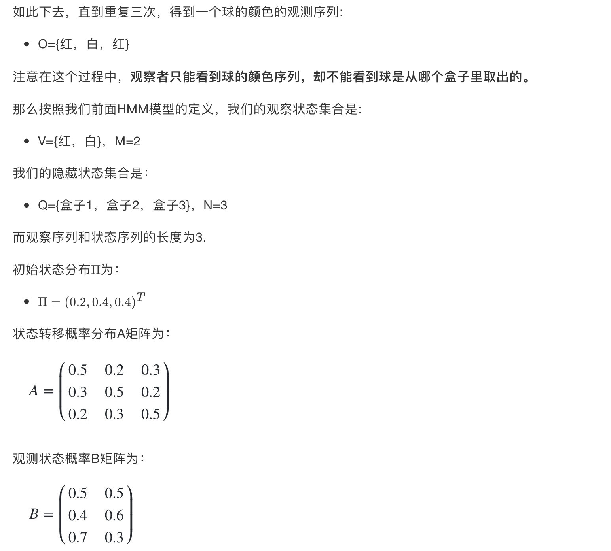

#### 4 HMM观测序列的生成

从上面的例子，我们也可以抽象出HMM观测序列生成的过程。

- 输入的是HMM的模型 λ=(A,B,Π) ,观测序列的长度T

- 输出是观测序列：

生成的过程如下：

- 1）根据初始状态概率分布 Π 生成隐藏状态i<sub>1</sub>

- 2\) for t from 1 to T

  - a\. 按照隐藏状态i<sub>t</sub>的观测状态分布b<sub>it</sub>(k)生成观察状态o<sub>t</sub>
  - b\. 按照隐藏状态i<sub>t</sub>的状态转移概率分布ai<sub>t</sub>, i<sub>t+1</sub>产生隐藏状态i<sub>t+1</sub>

所有的o<sub>t</sub>一起形成观测序列

#### 5 HMM模型的三个基本问题

HMM模型一共有三个经典的问题需要解决：

1）评估观察序列概率 —— **前向后向的概率计算**

- 即给定模型 λ=(A,B,Π) 和观测序列，计算在模型 λ下某一个观测序列O出现的概率P(O\|λ )。
- 这个问题的求解需要用到前向后向算法，是HMM模型三个问题中最简单的。

2）预测问题，也称为解码问题 ——**维特比（Viterbi）算法**

- 即给定模型λ=(A,B,Π) 和观测序列，求给定观测序列条件下，最可能出现的对应的状态序列。
- 这个问题的求解需要用到基于动态规划的维特比算法，是HMM模型三个问题中复杂度居中的算法。

3）模型参数学习问题 —— **鲍姆-韦尔奇（Baum-Welch）算法**(状态未知) ，这是一个学习问题

- 即给定观测序列，估计模型 λ=(A,B,Π) 的参数，使该模型下观测序列的条件概率P(O\|λ )最大。
- 这个问题的求解需要用到基于EM算法的鲍姆-韦尔奇算法，是HMM模型三个问题中最复杂的。

接下来的三节，我们将基于这个三个问题展开讨论。

------------------------------------------------------------------------

#### 3 小结

- 什么样的问题可以用HMM模型解决
  - 基于序列的，比如时间序列；
  - 问题中包含两类数据，一类是可以观测到的观测序列；另一类是不能观察到的隐藏状态序列。
- HMM模型的两个重要假设
  - 其次马尔科夫链假设
  - 观测独立性假设
- HMM模型的三个基本问题
  - 评估观察序列概率—— **前向后向的概率计算**
  - 预测问题，也称为解码问题 ——**维特比（Viterbi）算法**
  - 模型参数学习问题 —— **鲍姆-韦尔奇（Baum-Welch）算法**

---

### 10.4 前向后向算法评估观察序列概率

#### 学习目标

- 知道用前向算法求HMM观测序列的概率
- 知道用后向算法求HMM观测序列的概率

------------------------------------------------------------------------

本节我们就关注HMM第一个基本问题的解决方法，即已知模型和观测序列，求观测序列出现的概率。

#### 1 回顾HMM问题一：求观测序列的概率

首先我们回顾下HMM模型的问题一。这个问题是这样的。

我们已知HMM模型的参数λ=(A,B,Π)。

> 其中A是隐藏状态转移概率的矩阵，
>
> B是观测状态生成概率的矩阵，
>
> Π是隐藏状态的初始概率分布。

同时我们也已经得到了观测序列,

现在我们要求观测序列O在模型λ 下出现的条件概率P(O\|λ)。

乍一看，这个问题很简单。因为我们知道**所有的隐藏状态之间的转移概率和所有从隐藏状态到观测状态生成概率**，那么我们是可以暴力求解的。

我们可以列举出所有可能出现的长度为T的隐藏序列,分别求出这些隐藏序列与观测序列的联合概率分布P(O,i\|λ)，这样我们就可以很容易的求出边缘分布了P(O\|λ)。

------------------------------------------------------------------------

具体暴力求解的方法是这样的：

- 首先，任意隐藏序列

- 出现的概率是：

<!-- -->

- 对于固定的状态序列，我们要求的观察序列出现的概率是：<span class="katex"><span class="katex-mathml">$`P(O|i,\lambda )=b_{i1}(o_1)b_{i2}(o_2)...b_{iT}(o_T)`$</span></span>

<!-- -->

- 则O和i联合出现的概率是：

- 然后求边缘概率分布，即可得到观测序列O在模型λ 下出现的条件概率P(O\|λ )P(O\|λ )：


虽然上述方法有效，但是如果我们的隐藏状态数N非常多的那就麻烦了，此时我们预测状态有N<sup>T</sup>种组合，算法的时间复杂度是O(TN<sup>T</sup>)阶的。

因此对于一些隐藏状态数极少的模型，我们可以用暴力求解法来得到观测序列出现的概率，但是如果隐藏状态多，则上述算法太耗时，我们需要寻找其他简洁的算法。

**前向后向算法**就是来帮助我们在较低的时间复杂度情况下求解这个问题的。

#### 2 用前向算法求HMM观测序列的概率

前向后向算法是前向算法和后向算法的统称，这两个算法都可以用来求HMM观测序列的概率。我们先来看看前向算法是如何求解这个问题的。

##### 2.1 流程梳理

前向算法本质上属于动态规划的算法，也就是我们要通过找到局部状态递推的公式，这样一步步的从子问题的最优解拓展到整个问题的最优解。

- 在前向算法中，通过定义“前向概率”来定义动态规划的这个局部状态。

- 什么是前向概率呢, 其实定义很简单：**定义时刻t时隐藏状态为q<sub>i</sub>, 观测状态的序列为的概率为前向概率。**记为：

  - 

- 既然是动态规划，我们就要递推了，现在假设我们已经找到了在时刻t时各个隐藏状态的前向概率，现在我们需要递推出时刻t+1时各个隐藏状态的前向概率。

<!-- -->

- 我们可以基于时刻t时各个隐藏状态的前向概率，再乘以对应的状态转移概率，即就是在时刻t观测到，并且时刻t隐藏状态q<sub>j</sub> 时刻t+1隐藏状态q<sub>i</sub>的概率。

<!-- -->

- 如果将下面所有的线对应的概率求和，即就是在时刻t观测到，并且时刻t+1隐藏状态q<sub>i</sub>的概率。
- 继续一步，由于观测状态o<sub>t+1</sub>只依赖于t+1时刻隐藏状态q<sub>i</sub>, 这样就是在时刻t+1观测到，并且时刻t+1隐藏状态的q<sub>i</sub>概率。
- 而这个概率，恰恰就是时刻t+1对应的隐藏状态i的前向概率，这样我们得到了前向概率的递推关系式如下：


我们的动态规划从时刻1开始，到时刻T结束，由于α<sub>T</sub>(i)表示在时刻T观测序列为，并且时刻T隐藏状态q<sub>i</sub>的概率，我们只要将所有隐藏状态对应的概率相加，即就得到了在时刻T观测序列为的概率。

##### 2.2 算法总结。

- 输入：HMM模型 λ=(A,B,Π)，观测序列

- 输出：观测序列概率P(O\|λ)

  - 1\) 计算时刻1的各个隐藏状态前向概率：
  - 2\) 递推时刻2,3,... ...T时刻的前向概率：
  - 3\) 计算最终结果：

从递推公式可以看出，我们的算法时间复杂度是O(TN<sup>2</sup>)，比暴力解法的时间复杂度O(TN<sup>T</sup>)少了几个数量级。

#### 3 HMM前向算法求解实例

这里我们用前面盒子与球的例子来显示前向概率的计算。 我们的观察集合是:


我们的状态集合是：


而观察序列和状态序列的长度为3.

初始状态分布为：


状态转移概率分布矩阵为：


观测状态概率矩阵为：


球的颜色的观测序列:


------------------------------------------------------------------------

按照我们上一节的前向算法。首先计算时刻1三个状态的前向概率：

时刻1是红色球，

- 隐藏状态是盒子1的概率为：


- 隐藏状态是盒子2的概率为：


- 隐藏状态是盒子3的概率为：


------------------------------------------------------------------------

现在我们可以开始递推了，首先递推时刻2三个状态的前向概率：

时刻2是白色球，

- 隐藏状态是盒子1的概率为：


- 隐藏状态是盒子2的概率为：


- 隐藏状态是盒子3的概率为：


------------------------------------------------------------------------

继续递推，现在我们递推时刻3三个状态的前向概率：

时刻3是红色球，

- 隐藏状态是盒子1的概率为：


- 隐藏状态是盒子2的概率为：


- 隐藏状态是盒子3的概率为：


最终我们求出观测序列:O=红，白，红的概率为：


------------------------------------------------------------------------

#### 4 用后向算法求HMM观测序列的概率

##### 4.1 流程梳理

熟悉了用前向算法求HMM观测序列的概率，现在我们再来看看怎么用后向算法求HMM观测序列的概率。

后向算法和前向算法非常类似，都是用的动态规划，唯一的区别是选择的局部状态不同，后向算法用的是“后向概率”。

##### 4.2 后向算法流程

以下是后向算法的流程,注意下和前向算法的相同点和不同点：

- 输入：HMM模型 λ=(A,B,Π)，观测序列
- 输出：观测序列概率P(O\|λ)
  - 初始化时刻T的各个隐藏状态后向概率：
  - 递推时刻T−1,T−2,...1时刻的后向概率：
  - 计算最终结果：

此时我们的算法时间复杂度仍然是O(TN<sup>2</sup>)

------------------------------------------------------------------------

#### 5 小结

- 前向算法求HMM观测序列

  - 输入：HMM模型 λ=(A,B,Π)，观测序列
  - 输出：观测序列概率P(O\|λ)
    - 1\) 计算时刻1的各个隐藏状态前向概率：
    - 2\) 递推时刻2,3,... ...T时刻的前向概率：
    - 3\) 计算最终结果：

- 后向算法求HMM观测序列

  - 输入：HMM模型 λ=(A,B,Π)，观测序列
  - 输出：观测序列概率P(O\|λ)
    - 初始化时刻T的各个隐藏状态后向概率：
    - 递推时刻T−1,T−2,...1时刻的后向概率：
    - 计算最终结果：

---

### 10.5 维特比算法解码隐藏状态序列

#### 学习目标

- 知道维特比算法解码隐藏状态序列

------------------------------------------------------------------------

在本篇我们会讨论维特比算法解码隐藏状态序列，**即给定模型和观测序列，求给定观测序列条件下，最可能出现的对应的隐藏状态序列。**

HMM模型的解码问题最常用的算法是维特比算法，当然也有其他的算法可以求解这个问题。

同时维特比算法是一个通用的求序列最短路径的动态规划算法，也可以用于很多其他问题。

#### 1 HMM最可能隐藏状态序列求解概述

HMM模型的解码问题即：

- 给定模型 λ=(A,B,Π) 和观测序列，求给定观测序列O条件下，最可能出现的对应的状态序列,即的最大化。

一个可能的近似解法是求出观测序列O在每个时刻t最可能的隐藏状态  然后得到一个近似的隐藏状态序列。要这样近似求解不难，利用前向后向算法评估观察序列概率的定义：

- 在给定模型λ和观测序列O时，在时刻t处于状态q<sub>i</sub>的概率是，这个概率可以通过HMM的前向算法与后向算法计算。这样我们有：
  - 

近似算法很简单，但是却不能保证预测的状态序列整体是最可能的状态序列，因为预测的状态序列中某些相邻的隐藏状态可能存在转移概率为0的情况。

而**维特比算法可以将HMM的状态序列作为一个整体来考虑**，避免近似算法的问题，下面我们来看看维特比算法进行HMM解码的方法。

#### 2 维特比算法概述

维特比算法是一个通用的解码算法，是基于动态规划的求序列最短路径的方法。

既然是动态规划算法，那么就需要找到合适的局部状态，以及局部状态的递推公式。在HMM中，维特比算法定义了两个局部状态用于递推。

1\) 第一个局部状态是**在时刻t隐藏状态为 i 所有可能的状态转移路径中的概率最大值。**

- 记为:


由的定义可以得到 的递推表达式：


2\) 第二个局部状态由第一个局部状态递推得到。

- 我们定义在时刻t隐藏状态为i的所有单个状态转移路径中概率最大的转移路径中第t-1个节点的隐藏状态为:
- 其递推表达式可以表示为：


有了这两个局部状态，我们就可以从时刻0一直递推到时刻T，然后利用记录的前一个最可能的状态节点回溯，直到找到最优的隐藏状态序列。

#### 3 维特比算法流程总结

现在我们来总结下维特比算法的流程：

- 输入：HMM模型 λ=(A,B,Π)，观测序列

- 输出：最有可能的隐藏状态序列

流程如下：

- 1）初始化局部状态：


- 2\) 进行动态规划递推时刻 t=2,3,...T 时刻的局部状态：


- 3\) 计算时刻T最大的,即为最可能隐藏状态序列出现的概率。计算时刻T最大的 ,即为时刻T最可能的隐藏状态。


- 4\) 利用局部状态开始回溯。对于 t=T-1,T-2,...,1


最终得到最有可能的隐藏状态序列: 

#### 4 HMM维特比算法求解实例

下面我们仍然用盒子与球的例子来看看HMM维特比算法求解。 我们的观察集合是:


我们的状态集合是：


而观察序列和状态序列的长度为3.

初始状态分布为：


状态转移概率分布矩阵为：


观测状态概率矩阵为：


球的颜色的观测序列:


按照我们前面的维特比算法，首先需要得到三个隐藏状态在时刻1时对应的各自两个局部状态，此时观测状态为1：


现在开始递推三个隐藏状态在时刻2时对应的各自两个局部状态，此时观测状态为2：

- <span class="katex"><span class="katex-mathml">$`\delta_2(1) = \max_{1\leq j \leq 3}[\delta_1(j)a_{j1}]b_1(o_2) = \max_{1\leq j \leq 3}[0.1 \times 0.5, 0.16 \times 0.3, 0.28\times 0.2] \times 0.5 = 0.028`$</span></span>
  - <span class="katex"><span class="katex-mathml">$`\Psi_2(1)=3`$</span></span>
- <span class="katex"><span class="katex-mathml">$`\delta_2(2) = \max_{1\leq j \leq 3}[\delta_1(j)a_{j2}]b_2(o_2) = \max_{1\leq j \leq 3}[0.1 \times 0.2, 0.16 \times 0.5, 0.28\times 0.3] \times 0.6 = 0.0504`$</span></span>
  - <span class="katex"><span class="katex-mathml">$`\Psi_2(2)=3`$</span></span>
- <span class="katex"><span class="katex-mathml">$`\delta_2(3) = \max_{1\leq j \leq 3}[\delta_1(j)a_{j3}]b_3(o_2) = \max_{1\leq j \leq 3}[0.1 \times 0.3, 0.16 \times 0.2, 0.28\times 0.5] \times 0.3 = 0.042`$</span></span>
  - <span class="katex"><span class="katex-mathml">$`\Psi_2(3)=3`$</span></span>

继续递推三个隐藏状态在时刻3时对应的各自两个局部状态，此时观测状态为1：

- <span class="katex"><span class="katex-mathml">$`\delta_3(1) = \max_{1\leq j \leq 3}[\delta_2(j)a_{j1}]b_1(o_3) = \max_{1\leq j \leq 3}[0.028 \times 0.5, 0.0504 \times 0.3, 0.042\times 0.2] \times 0.5 = 0.00756`$</span></span>
  - <span class="katex"><span class="katex-mathml">$`\Psi_3(1)=2`$</span></span>
- <span class="katex"><span class="katex-mathml">$`\delta_3(2) = \max_{1\leq j \leq 3}[\delta_2(j)a_{j2}]b_2(o_3) = \max_{1\leq j \leq 3}[0.028 \times 0.2, 0.0504\times 0.5, 0.042\times 0.3] \times 0.4 = 0.01008`$</span></span>
  - <span class="katex"><span class="katex-mathml">$`\Psi_3(2)=2`$</span></span>
- <span class="katex"><span class="katex-mathml">$`\delta_3(3) = \max_{1\leq j \leq 3}[\delta_2(j)a_{j3}]b_3(o_3) = \max_{1\leq j \leq 3}[0.028 \times 0.3, 0.0504 \times 0.2, 0.042\times 0.5] \times 0.7 = 0.0147`$</span></span>
  - <span class="katex"><span class="katex-mathml">$`\Psi_3(3)=3`$</span></span>


------------------------------------------------------------------------

#### 5 小结

- 维特比算法流程总结：

  - 输入：HMM模型 λ=(A,B,Π)，观测序列

  - 输出：最有可能的隐藏状态序列

<!-- -->

    流程如下：

    - 1）初始化局部状态：

    

    - 2) 进行动态规划递推时刻 t=2,3,...T 时刻的局部状态：

    

    - 3) 计算时刻T最大的,即为最可能隐藏状态序列出现的概率。计算时刻T最大的 ,即为时刻T最可能的隐藏状态。

    

    - 4) 利用局部状态开始回溯。对于 t=T-1,T-2,...,1

    

    最终得到最有可能的隐藏状态序列: 

---

### 10.6 鲍姆-韦尔奇算法简介

#### 学习目标

- 了解鲍姆-韦尔奇算法

------------------------------------------------------------------------

#### 1 鲍姆-韦尔奇算法简介

模型参数学习问题 —— **鲍姆-韦尔奇（Baum-Welch）算法**(状态未知) ，

- 即给定观测序列，估计模型的λ=(A,B,Π)参数，使该模型下观测序列的条件概率最P(O\|λ)大。
- 它的解法最常用的是鲍姆-韦尔奇算法，其实就是基于EM算法的求解，只不过鲍姆-韦尔奇算法出现的时代，EM算法还没有被抽象出来，所以被叫为鲍姆-韦尔奇算法。


#### 2 鲍姆-韦尔奇算法原理

鲍姆-韦尔奇算法原理既然使用的就是EM算法的原理，

- 那么我们需要在E步求出联合分布P(O,I\|λ)基于条件概率的期望，其中为当前的模型参数，
- 然后在M步最大化这个期望，得到更新的模型参数λ。

接着不停的进行EM迭代，直到模型参数的值收敛为止。

------------------------------------------------------------------------

首先来看看E步，当前模型参数为, 联合分布P(O,I\|λ)基于条件概率的期望表达式为：

- <span class="katex"><span class="katex-mathml">$`L(\lambda, \overline{\lambda}) = \sum\limits_{I}P(I|O,\overline{\lambda})logP(O,I|\lambda)`$</span></span>

在M步，我们极大化上式，然后得到更新后的模型参数如下：

- <span class="katex"><span class="katex-mathml">$`\overline{\lambda} = arg\;\max_{\lambda}\sum\limits_{I}P(I|O,\overline{\lambda})logP(O,I|\lambda)`$</span></span>

通过不断的E步和M步的迭代，直到收敛。

---

### 10.7 HMM模型API介绍

#### 学习目标

- 指导HMM模型API使用方法

------------------------------------------------------------------------

#### 1 API的安装：

官网链接：<a href="https://hmmlearn.readthedocs.io/en/latest/" target="_blank">https://hmmlearn.readthedocs.io/en/latest/</a>

``` lang-python
pip3 install hmmlearn
```

#### 2 hmmlearn介绍

hmmlearn实现了三种HMM模型类，按照观测状态是连续状态还是离散状态，可以分为两类。

GaussianHMM和GMMHMM是连续观测状态的HMM模型，而MultinomialHMM是离散观测状态的模型，也是我们在HMM原理系列篇里面使用的模型。

在这里主要介绍我们前面一直讲的关于离散状态的MultinomialHMM模型。

对于MultinomialHMM的模型，使用比较简单，里面有几个常用的参数：

- "startprob\_"参数对应我们的隐藏状态初始分布Π,
- "transmat\_"对应我们的状态转移矩阵A,
- "emissionprob\_"对应我们的观测状态概率矩阵B。

#### 3 MultinomialHMM实例

下面我们用我们在前面讲的关于球的那个例子使用MultinomialHMM跑一遍。

``` lang-python
import numpy as np
from hmmlearn import hmm
```

``` lang-python
# 设定隐藏状态的集合
states = ["box 1", "box 2", "box3"]
n_states = len(states)

# 设定观察状态的集合
observations = ["red", "white"]
n_observations = len(observations)

# 设定初始状态分布
start_probability = np.array([0.2, 0.4, 0.4])

# 设定状态转移概率分布矩阵
transition_probability = np.array([
  [0.5, 0.2, 0.3],
  [0.3, 0.5, 0.2],
  [0.2, 0.3, 0.5]
])

# 设定观测状态概率矩阵
emission_probability = np.array([
  [0.5, 0.5],
  [0.4, 0.6],
  [0.7, 0.3]
])
```

``` lang-python
# 设定模型参数
model = hmm.MultinomialHMM(n_components=n_states)
model.startprob_=start_probability  # 初始状态分布
model.transmat_=transition_probability  # 状态转移概率分布矩阵
model.emissionprob_=emission_probability  # 观测状态概率矩阵
```

现在我们来跑一跑HMM问题三维特比算法的解码过程，使用和之前一样的观测序列来解码，代码如下：

``` lang-python
seen = np.array([[0,1,0]]).T  # 设定观测序列
box = model.predict(seen)

print("球的观测顺序为：\n", ", ".join(map(lambda x: observations[x], seen.flatten())))
# 注意：需要使用flatten方法，把seen从二维变成一维
print("最可能的隐藏状态序列为:\n"， ", ".join(map(lambda x: states[x], box)))
```

我们再来看看求HMM问题一的观测序列的概率的问题，代码如下：

``` lang-python
print(model.score(seen))
# 输出结果是：-2.03854530992
```

要注意的是score函数返回的是以自然对数为底的对数概率值，我们在HMM问题一中手动计算的结果是未取对数的原始概率是0.13022。对比一下：

``` lang-python
import math

math.exp(-2.038545309915233)
# ln0.13022≈−2.0385
# 输出结果是：0.13021800000000003
```

---

## 集成学习进阶

### 学习目标

- 知道xgboost算法原理
- 知道otto案例通过xgboost实现流程
- 知道lightGBM算法原理
- 知道PUBG案例通过lightGBM实现流程
- 知道stacking算法原理
- 知道住房月租金预测通过stacking实现流程

---

### 11.1 xgboost算法原理

#### 学习目标

- 了解XGBoost的目标函数推导过程
- 知道XGBoost的回归树构建方法
- 知道XGBoost与GDBT的区别

------------------------------------------------------------------------

XGBoost（Extreme Gradient Boosting）全名叫极端梯度提升树，XGBoost是集成学习方法的王牌，在Kaggle数据挖掘比赛中，大部分获胜者用了XGBoost。

XGBoost在绝大多数的回归和分类问题上表现的十分顶尖，本节将较详细的介绍XGBoost的算法原理。

#### 1 最优模型的构建方法

我们在前面已经知道，构建最优模型的一般方法是**最小化训练数据的损失函数**。

我们用字母 L表示损失，如下式：


> 其中，F是假设空间，假设空间是在已知属性和属性可能取值的情况下，对所有可能满足目标的情况的一种毫无遗漏的假设集合。
>
> N是所有样本数，L代表损失函数，y<sub>i</sub>代表目标值，f(x<sub>i</sub>)代表预测值。

式（1.1）称为**经验风险最小化**，训练得到的模型复杂度较高。当训练数据较小时，模型很容易出现过拟合问题。

因此，为了降低模型的复杂度，常采用下式：


> 其中 J(f)为模型的复杂度，

式（2.1）称为**结构风险最小化**，结构风险最小化的模型往往对训练数据以及未知的测试数据都有较好的预测 。

------------------------------------------------------------------------

应用：

- 决策树的生成和剪枝分别对应了经验风险最小化和结构风险最小化，
- XGBoost的决策树生成是结构风险最小化的结果，后续会详细介绍。

#### 2 XGBoost的目标函数推导

##### 2.1 目标函数确定

目标函数，即损失函数，通过最小化损失函数来构建最优模型。

由前面可知， 损失函数应加上表示模型复杂度的正则项，且XGBoost对应的模型包含了多个CART树，因此，模型的目标函数为：


> （3.1）式是正则化的损失函数；
>
> 其中y<sub>i</sub>是模型的实际输出结果，是模型的输出结果；
>
> 等式右边第一部分是模型的训练误差，第二部分是正则化项，这里的正则化项是K棵树的正则化项相加而来的。

##### 2.2 CART树的介绍


上图为第K棵CART树，确定一棵CART树需要确定两部分，

第一部分就是**树的结构，**这个结构将输入样本映射到一个确定的叶子节点上，记为f<sub>k</sub>(x;

第二部分就是**各个叶子节点的值**，q(x)表示输出的叶子节点序号，w<sub>q</sub>(x)表示对应叶子节点序号的值。

由定义得：


##### 2.3 树的复杂度定义

###### 2.3.1 定义每课树的复杂度

XGBoost法对应的模型包含了多棵cart树，定义每棵树的复杂度：


> 其中T为叶子节点的个数，\|\|w\|\|为叶子节点向量的模 。γ表示节点切分的难度，λ表示L2正则化系数。

###### 2.3.2 树的复杂度举例

假设我们要预测一家人对电子游戏的喜好程度，考虑到年轻和年老相比，年轻更可能喜欢电子游戏，以及男性和女性相比，男性更喜欢电子游戏，故先根据年龄大小区分小孩和大人，然后再通过性别区分开是男是女，逐一给各人在电子游戏喜好程度上打分，如下图所示：


就这样，训练出了2棵树tree1和tree2，类似之前gbdt的原理，两棵树的结论累加起来便是最终的结论，所以：

- 小男孩的预测分数就是两棵树中小孩所落到的结点的分数相加：2 + 0.9 = 2.9。
- 爷爷的预测分数同理：-1 + （-0.9）= -1.9。

具体如下图所示：


如下例树的复杂度表示：


##### 2.4 目标函数推导

根据（3.1）式，共进行t次迭代的学习模型的目标函数为：


由前向分布算法可知，前t-1棵树的结构为常数


我们知道，泰勒公式的二阶导近似表示：


令为Δx , 则（3.5）式的二阶近似展开：


其中：


> g<sub>i</sub>和h<sub>i</sub>分别表示预测误差对当前模型的一阶导和二阶导;
>
> 表示前t-1棵树组成的学习模型的预测误差。

当前模型往预测误差减小的方向进行迭代。

忽略（3.8）式常数项，并结合（3.4）式，得：


通过（3.2）式简化（3.9）式：


> （3.10）式第一部分是对所有训练样本集进行累加，
>
> 此时，所有样本都是映射为树的叶子节点，

所以，我们换种思维，从叶子节点出发，对所有的叶子节点进行累加，得：


G<sub>j</sub> 表示映射为叶子节点 j 的所有输入样本的一阶导之和，同理，H<sub>j</sub>表示二阶导之和。

得：


对于第 t 棵CART树的某一个确定结构（可用q(x)表示），其叶子节点是相互独立的，

G<sub>j</sub> 和H<sub>j</sub>是确定量，因此，（3.12）可以看成是关于叶子节点w的一元二次函数 。

最小化（3.12）式，得：


把（3.13）带入到（3.12），得到最终的目标函数：


（3.14）也称为**打分函数(scoring function)**，它是衡量树结构好坏的标准，

- 值越小，代表这样的结构越好 。

- 我们用打分函数选择最佳切分点，从而构建CART树。

#### 3 XGBoost的回归树构建方法

##### 3.1 计算分裂节点

在实际训练过程中，当建立第 t 棵树时，XGBoost采用贪心法进行树结点的分裂：

从树深为0时开始：

- 对树中的每个叶子结点尝试进行分裂；

- 每次分裂后，原来的一个叶子结点继续分裂为左右两个子叶子结点，原叶子结点中的样本集将根据该结点的判断规则分散到左右两个叶子结点中；

- 新分裂一个结点后，我们需要检测这次分裂是否会给损失函数带来增益，增益的定义如下：


如果增益Gain\>0，即分裂为两个叶子节点后，目标函数下降了，那么我们会考虑此次分裂的结果。

那么一直这样分裂，什么时候才会停止呢？

##### 3.2 停止分裂条件判断

情况一：上节推导得到的打分函数是衡量树结构好坏的标准，因此，可用打分函数来选择最佳切分点。首先确定样本特征的所有切分点，对每一个确定的切分点进行切分，切分好坏的标准如下：


- Gain表示单节点obj*与切分后的两个节点的树obj*之差，

- 遍历所有特征的切分点，找到最大Gain的切分点即是最佳分裂点，根据这种方法继续切分节点，得到CART树。

- 若 γ 值设置的过大，则Gain为负，表示不切分该节点，因为切分后的树结构变差了。

  - γ 值越大，表示对切分后obj下降幅度要求越严，这个值可以在XGBoost中设定。

情况二：当树达到最大深度时，停止建树，因为树的深度太深容易出现过拟合，这里需要设置一个超参数max_depth。

情况三：当引入一次分裂后，重新计算新生成的左、右两个叶子结点的样本权重和。如果任一个叶子结点的样本权重低于某一个阈值，也会放弃此次分裂。这涉及到一个超参数:最小样本权重和，是指如果一个叶子节点包含的样本数量太少也会放弃分裂，防止树分的太细，这也是过拟合的一种措施。

#### 4 XGBoost与GDBT的区别

- 区别一：
  - XGBoost生成CART树考虑了树的复杂度，
  - GDBT未考虑，GDBT在树的剪枝步骤中考虑了树的复杂度。
- 区别二：
  - XGBoost是拟合上一轮损失函数的二阶导展开，GDBT是拟合上一轮损失函数的一阶导展开，因此，XGBoost的准确性更高，且满足相同的训练效果，需要的迭代次数更少。
- 区别三：
  - XGBoost与GDBT都是逐次迭代来提高模型性能，但是XGBoost在选取最佳切分点时可以开启多线程进行，大大提高了运行速度。

------------------------------------------------------------------------

#### 5 小结

- XGBoost的目标函数

  

- 知道XGBoost的回归树构建方法

  

- XGBoost与GBDT的区别

  - 区别一：
    - XGBoost生成CART树考虑了树的复杂度，
    - GBDT未考虑，GBDT在树的剪枝步骤中考虑了树的复杂度。
  - 区别二：
    - XGBoost是拟合上一轮损失函数的二阶导展开，GDBT是拟合上一轮损失函数的一阶导展开，因此，XGBoost的准确性更高，且满足相同的训练效果，需要的迭代次数更少。
  - 区别三：
    - XGBoost与GDBT都是逐次迭代来提高模型性能，但是XGBoost在选取最佳切分点时可以开启多线程进行，大大提高了运行速度。

---

### 11.2 xgboost算法api介绍

#### 学习目标

- 了解xgboost算法api中常用的参数

------------------------------------------------------------------------

#### 1 xgboost的安装：

官网链接：<a href="https://xgboost.readthedocs.io/en/latest/" target="_blank">https://xgboost.readthedocs.io/en/latest/</a>

``` lang-python
pip3 install xgboost
```

#### 2 xgboost参数介绍

xgboost虽然被称为kaggle比赛神奇，但是，我们要想训练出不错的模型，必须要给参数传递合适的值。

xgboost中封装了很多参数，主要由三种类型构成：**通用参数（general parameters），Booster 参数（booster parameters）和学习目标参数（task parameters）**

- 通用参数：主要是**宏观函数控制；**
- Booster参数：取决于选择的Booster类型，**用于控制每一步的booster（tree, regressiong）**；
- 学习目标参数：**控制训练目标的表现**。

##### 2.1 通用参数（general parameters）

1.  **booster** \[缺省值=gbtree\]

2.  决定使用哪个booster，可以是gbtree，gblinear或者dart。

    - g**btree和dart使用基于树的模型(dart 主要多了 Dropout)，而gblinear 使用线性函数.**

3.  **silent** \[缺省值=0\]

    - 设置为0打印运行信息；设置为1静默模式，不打印

4.  **nthread** \[缺省值=设置为最大可能的线程数\]

    - 并行运行xgboost的线程数，输入的参数应该\<=系统的CPU核心数，若是没有设置算法会检测将其设置为CPU的全部核心数

> 下面的两个参数不需要设置，使用默认的就好了

1.  **num_pbuffer** \[xgboost自动设置，不需要用户设置\]

    - 预测结果缓存大小，通常设置为训练实例的个数。该缓存用于保存最后boosting操作的预测结果。

2.  **num_feature** \[xgboost自动设置，不需要用户设置\]

    - 在boosting中使用特征的维度，设置为特征的最大维度

##### 2.2 Booster 参数（booster parameters）

###### 2.2.1 Parameters for Tree Booster

1.  **eta** \[缺省值=0.3，别名：learning_rate\]

    - 更新中减少的步长来防止过拟合。

    - 在每次boosting之后，可以直接获得新的特征权值，这样可以使得boosting更加鲁棒。

    - 范围： \[0,1\]

2.  **gamma** \[缺省值=0，别名: min_split_loss\]（分裂最小loss）

    - 在节点分裂时，只有分裂后损失函数的值下降了，才会分裂这个节点。

    - Gamma指定了节点分裂所需的最小损失函数下降值。 这个参数的值越大，算法越保守。这个参数的值和损失函数息息相关，所以是需要调整的。

    - 范围: \[0,∞\]

3.  **max_depth** \[缺省值=6\]

    - 这个值为树的最大深度。 这个值也是用来避免过拟合的。max_depth越大，模型会学到更具体更局部的样本。设置为0代表没有限制
    - 范围: \[0,∞\]

4.  **min_child_weight** \[缺省值=1\]

    - 决定最小叶子节点样本权重和。XGBoost的这个参数是最小样本权重的和.
    - 当它的值较大时，可以避免模型学习到局部的特殊样本。 但是如果这个值过高，会导致欠拟合。这个参数需要使用CV来调整。.
    - 范围: \[0,∞\]

5.  **subsample** \[缺省值=1\]

    - 这个参数控制对于每棵树，随机采样的比例。

    - 减小这个参数的值，算法会更加保守，避免过拟合。但是，如果这个值设置得过小，它可能会导致欠拟合。

    - 典型值：0.5-1，0.5代表平均采样，防止过拟合.

    - 范围: (0,1\]

6.  **colsample_bytree** \[缺省值=1\]

    - 用来控制每棵随机采样的列数的占比(每一列是一个特征)。
    - 典型值：0.5-1
    - 范围: (0,1\]

7.  **colsample_bylevel** \[缺省值=1\]

    - 用来控制树的每一级的每一次分裂，对列数的采样的占比。
    - 我个人一般不太用这个参数，因为subsample参数和colsample_bytree参数可以起到相同的作用。但是如果感兴趣，可以挖掘这个参数更多的用处。
    - 范围: (0,1\]

8.  **lambda** \[缺省值=1，别名: reg_lambda\]

    - 权重的L2正则化项(和Ridge regression类似)。
    - 这个参数是用来控制XGBoost的正则化部分的。虽然大部分数据科学家很少用到这个参数，但是这个参数
    - 在减少过拟合上还是可以挖掘出更多用处的。.

9.  **alpha** \[缺省值=0，别名: reg_alpha\]

    - 权重的L1正则化项。(和Lasso regression类似)。 可以应用在很高维度的情况下，使得算法的速度更快。

10. **scale_pos_weight**\[缺省值=1\]

    - 在各类别样本十分不平衡时，把这个参数设定为一个正值，可以使算法更快收敛。通常可以将其设置为负
    - 样本的数目与正样本数目的比值。

###### 2.2.2 Parameters for Linear Booster

> linear booster一般很少用到。

1.  **lambda** \[缺省值=0，别称: reg_lambda\]

    - L2正则化惩罚系数，增加该值会使得模型更加保守。

2.  **alpha** \[缺省值=0，别称: reg_alpha\]

    - L1正则化惩罚系数，增加该值会使得模型更加保守。

3.  **lambda_bias** \[缺省值=0，别称: reg_lambda_bias\]

    - 偏置上的L2正则化(没有在L1上加偏置，因为并不重要)

##### 2.3 学习目标参数（task parameters）

1.  **objective** \[缺省值=reg:linear\]

    1.  “**reg:linear**” – 线性回归
    2.  **“reg:logistic**” – 逻辑回归
    3.  “**binary:logistic**” – 二分类逻辑回归，输出为概率
    4.  “**multi:softmax**” – 使用softmax的多分类器，返回预测的类别(不是概率)。在这种情况下，你还需要多设一个参数：num_class(类别数目)
    5.  “**multi:softprob**” – 和multi:softmax参数一样，但是返回的是每个数据属于各个类别的概率。

2.  **eval_metric** \[缺省值=通过目标函数选择\]

    可供选择的如下所示：

    1.  “**rmse**”: 均方根误差
    2.  “**mae**”: 平均绝对值误差
    3.  “**logloss**”: 负对数似然函数值
    4.  “**error”**: 二分类错误率。
        - 其值通过错误分类数目与全部分类数目比值得到。对于预测，预测值大于0.5被认为是正类，其它归为负类。
    5.  “**error@t**”: 不同的划分阈值可以通过 ‘t’进行设置
    6.  “**merror**”: 多分类错误率，计算公式为(wrong cases)/(all cases)
    7.  “**mlogloss**”: 多分类log损失
    8.  “**auc**”: 曲线下的面积

3.  seed \[缺省值=0\]

    - 随机数的种子

<!-- -->

    - 设置它可以复现随机数据的结果，也可以用于调整参数

---

### 11.3 xgboost案例介绍

#### 1 案例背景

> 该案例和前面决策树中所用案例一样。

泰坦尼克号沉没是历史上最臭名昭着的沉船事件之一。1912年4月15日，在她的处女航中，泰坦尼克号在与冰山相撞后沉没，在2224名乘客和机组人员中造成1502人死亡。这场耸人听闻的悲剧震惊了国际社会，并为船舶制定了更好的安全规定。 造成海难失事的原因之一是乘客和机组人员没有足够的救生艇。尽管幸存下沉有一些运气因素，但有些人比其他人更容易生存，例如妇女，儿童和上流社会。 在这个案例中，我们要求您完成对哪些人可能存活的分析。特别是，我们要求您运用机器学习工具来预测哪些乘客幸免于悲剧。

> 案例：<a href="https://www.kaggle.com/c/titanic/overview" target="_blank">https://www.kaggle.com/c/titanic/overview</a>

我们提取到的数据集中的特征包括票的类别，是否存活，乘坐班次，年龄，登陆home.dest，房间，船和性别等。

> 数据：<a href="http://biostat.mc.vanderbilt.edu/wiki/pub/Main/DataSets/titanic.txt" target="_blank">http://biostat.mc.vanderbilt.edu/wiki/pub/Main/DataSets/titanic.txt</a>


经过观察数据得到:

- **1 乘坐班是指乘客班（1，2，3），是社会经济阶层的代表。**
- **2 其中age数据存在缺失。**

#### 2 步骤分析

- 1.获取数据
- 2.数据基本处理
  - 2.1 确定特征值,目标值
  - 2.2 缺失值处理
  - 2.3 数据集划分
- 3.特征工程(字典特征抽取)
- 4.机器学习(xgboost)
- 5.模型评估

#### 3 代码实现

- 导入需要的模块

``` lang-python
import pandas as pd
import numpy as np
from sklearn.feature_extraction import DictVectorizer
from sklearn.model_selection import train_test_split
```

- 1.获取数据

``` lang-python
# 1、获取数据
titan = pd.read_csv("http://biostat.mc.vanderbilt.edu/wiki/pub/Main/DataSets/titanic.txt")
```

- 2.数据基本处理
- 2.1 确定特征值,目标值

``` lang-python
x = titan[["pclass", "age", "sex"]]
y = titan["survived"]
```

- 2.2 缺失值处理

``` lang-python
# 缺失值需要处理，将特征当中有类别的这些特征进行字典特征抽取
x['age'].fillna(x['age'].mean(), inplace=True)
```

- 2.3 数据集划分

``` lang-python
x_train, x_test, y_train, y_test = train_test_split(x, y, random_state=22)
```

- 3.特征工程(字典特征抽取)

特征中出现类别符号，需要进行one-hot编码处理(DictVectorizer)

x.to_dict(orient="records") 需要将数组特征转换成字典数据

``` lang-python
# 对于x转换成字典数据x.to_dict(orient="records")
# [{"pclass": "1st", "age": 29.00, "sex": "female"}, {}]

transfer = DictVectorizer(sparse=False)

x_train = transfer.fit_transform(x_train.to_dict(orient="records"))
x_test = transfer.fit_transform(x_test.to_dict(orient="records"))
```

------------------------------------------------------------------------

- 4.xgboost模型训练和模型评估

``` lang-python
# 模型初步训练
from xgboost import XGBClassifier
xg = XGBClassifier()

xg.fit(x_train, y_train)

xg.score(x_test, y_test)
```

``` lang-python
# 针对max_depth进行模型调优
depth_range = range(10)
score = []
for i in depth_range:
    xg = XGBClassifier(eta=1, gamma=0, max_depth=i)
    xg.fit(x_train, y_train)
    s = xg.score(x_test, y_test)
    print(s)
    score.append(s)
```

``` lang-python
# 结果可视化
import matplotlib.pyplot as plt

plt.plot(depth_range, score)

plt.show()
```


---

### 11.4 otto案例介绍 -- Otto Group Product Classification Challenge【xgboost实现】

#### 1 背景介绍

奥托集团是世界上最大的电子商务公司之一，在20多个国家设有子公司。该公司每天都在世界各地销售数百万种产品,所以对其产品根据性能合理的分类非常重要。

不过,在实际工作中,工作人员发现,许多相同的产品得到了不同的分类。本案例要求,你对奥拓集团的产品进行正确的分分类。尽可能的提供分类的准确性。

链接：<a href="https://www.kaggle.com/c/otto-group-product-classification-challenge/overview" target="_blank">https://www.kaggle.com/c/otto-group-product-classification-challenge/overview</a>


------------------------------------------------------------------------

#### 2 思路分析

- 1.数据获取

- 2.数据基本处理

  - 2.1 截取部分数据
  - 2.2 把标签纸转换为数字
  - **2.3 分割数据(使用StratifiedShuffleSplit)**
  - **2.4 数据标准化**
  - **2.5 数据pca降维**

- **3.模型训练**

  - **3.1 基本模型训练**
  - **3.2 模型调优**
    - **3.2.1 调优参数:**
      - **n_estimator,**
      - **max_depth,**
      - **min_child_weights,**
      - **subsamples,**
      - **consample_bytrees,**
      - **etas**
    - **3.2.2 确定最后最优参数**

#### 3 部分代码实现

- 2.数据基本处理
- 2.1 截取部分数据
- 2.2 把标签值转换为数字
- **2.3 分割数据(使用StratifiedShuffleSplit)**

``` lang-python
# 使用StratifiedShuffleSplit对数据集进行分割
from sklearn.model_selection import StratifiedShuffleSplit

sss = StratifiedShuffleSplit(n_splits=1, test_size=0.2, random_state=0)
for train_index, test_index in sss.split(X_resampled.values, y_resampled):
    print(len(train_index))
    print(len(test_index))

    x_train = X_resampled.values[train_index]
    x_val = X_resampled.values[test_index]

    y_train = y_resampled[train_index]
    y_val = y_resampled[test_index]
```

``` lang-python
# 分割数据图形可视化
import seaborn as sns

sns.countplot(y_val)

plt.show()
```

- **2.4 数据标准化**

``` lang-python
from sklearn.preprocessing import StandardScaler

scaler = StandardScaler()
scaler.fit(x_train)

x_train_scaled = scaler.transform(x_train)
x_val_scaled = scaler.transform(x_val)
```

- **2.5 数据pca降维**

``` lang-python
print(x_train_scaled.shape)
# (13888, 93)

from sklearn.decomposition import PCA

pca = PCA(n_components=0.9)
x_train_pca = pca.fit_transform(x_train_scaled)
x_val_pca = pca.transform(x_val_scaled)

print(x_train_pca.shape, x_val_pca.shape)
(13888, 65) (3473, 65)
```

从上面输出的数据可以看出,只选择65个元素,就可以表达出特征中90%的信息

``` lang-python
# 降维数据可视化
plt.plot(np.cumsum(pca.explained_variance_ratio_))

plt.xlabel("元素数量")
plt.ylabel("可表达信息的百分占比")

plt.show()
```


------------------------------------------------------------------------

- **3.模型训练**
- **3.1 基本模型训练**

``` lang-python
from xgboost import XGBClassifier

xgb = XGBClassifier()
xgb.fit(x_train_pca, y_train)

# 改变预测值的输出模式,让输出结果为百分占比,降低logloss值
y_pre_proba = xgb.predict_proba(x_val_pca)
```

``` lang-python
# logloss进行模型评估
from sklearn.metrics import log_loss
log_loss(y_val, y_pre_proba, eps=1e-15, normalize=True)

xgb.get_params
```

- **3.2 模型调优**

<!-- -->

- **3.2.1 调优参数:**

- **1） n_estimator**

``` lang-python
scores_ne = []
n_estimators = [100,200,400,450,500,550,600,700]

for nes in n_estimators:
    print("n_estimators:", nes)
    xgb = XGBClassifier(max_depth=3,
                        learning_rate=0.1,
                        n_estimators=nes,
                        objective="multi:softprob",
                        n_jobs=-1,
                        nthread=4,
                        min_child_weight=1,
                        subsample=1,
                        colsample_bytree=1,
                        seed=42)

    xgb.fit(x_train_pca, y_train)
    y_pre = xgb.predict_proba(x_val_pca)
    score = log_loss(y_val, y_pre)
    scores_ne.append(score)
    print("测试数据的logloss值为:{}".format(score))
```

``` lang-python
# 数据变化可视化
plt.plot(n_estimators, scores_ne, "o-")

plt.ylabel("log_loss")
plt.xlabel("n_estimators")
print("n_estimators的最优值为:{}".format(n_estimators[np.argmin(scores_ne)]))
```


- **2）max_depth**

``` lang-python
scores_md = []
max_depths = [1,3,5,6,7]

for md in max_depths:  # 修改
    xgb = XGBClassifier(max_depth=md, # 修改
                        learning_rate=0.1,
                        n_estimators=n_estimators[np.argmin(scores_ne)],   # 修改
                        objective="multi:softprob",
                        n_jobs=-1,
                        nthread=4,
                        min_child_weight=1,
                        subsample=1,
                        colsample_bytree=1,
                        seed=42)

    xgb.fit(x_train_pca, y_train)
    y_pre = xgb.predict_proba(x_val_pca)
    score = log_loss(y_val, y_pre)
    scores_md.append(score)  # 修改
    print("测试数据的logloss值为:{}".format(log_loss(y_val, y_pre)))
```

``` lang-python
# 数据变化可视化
plt.plot(max_depths, scores_md, "o-")  # 修改

plt.ylabel("log_loss")
plt.xlabel("max_depths")  # 修改
print("max_depths的最优值为:{}".format(max_depths[np.argmin(scores_md)]))  # 修改
```

- **3） min_child_weights,**
  - 依据上面模式进行调整

- **4） subsamples,**

- **5） consample_bytrees,**

- **6） etas**

- **3.2.2 确定最后最优参数**

``` lang-python
xgb = XGBClassifier(learning_rate =0.1,
                    n_estimators=550,
                    max_depth=3,
                    min_child_weight=3,
                    subsample=0.7,
                    colsample_bytree=0.7,
                    nthread=4,
                    seed=42,
                    objective='multi:softprob')
xgb.fit(x_train_scaled, y_train)

y_pre = xgb.predict_proba(x_val_scaled)

print("测试数据的logloss值为 : {}".format(log_loss(y_val, y_pre, eps=1e-15, normalize=True)))
```

---

### 11.5 lightGBM

#### 学习目标

- 了解lightGBM演进过程
- 知道什么是lightGBM
- 知道lightGBM原理

------------------------------------------------------------------------

#### 1 写在介绍lightGBM之前

##### 1.1 lightGBM演进过程


##### 1.2 AdaBoost算法

AdaBoost是一种提升树的方法，和三个臭皮匠，赛过诸葛亮的道理一样。

AdaBoost两个问题：

- \(1\) 如何改变训练数据的权重或概率分布
  - 提高前一轮被弱分类器错误分类的样本的权重，降低前一轮被分对的权重
- \(2\) 如何将弱分类器组合成一个强分类器，亦即，每个分类器，前面的权重如何设置
  - 采取”多数表决”的方法.加大分类错误率小的弱分类器的权重，使其作用较大，而减小分类错误率大的弱分类器的权重，使其在表决中起较小的作用。

##### 1.3 GBDT算法以及优缺点

GBDT和AdaBosst很类似，但是又有所不同。

- GBDT和其它Boosting算法一样，通过**将表现一般的几个模型（通常是深度固定的决策树）组合在一起来集成一个表现较好的模型。**

<!-- -->

- AdaBoost是**通过提升错分数据点的权重来定位模型的不足**， Gradient Boosting通过负梯度来识别问题，通过计算负梯度来改进模型，即通过反复地选择一个指向负梯度方向的函数，该算法可被看做在函数空间里对目标函数进行优化。

因此可以说 。

<span class="katex"><span class="katex-mathml">$`GradientBoosting=GradientDescent+Boosting`$</span></span>

------------------------------------------------------------------------

缺点：

GBDT -\>预排序方法(pre-sorted)

- \(1\) **空间消耗大**。
  - 这样的算法需要保存数据的特征值，还保存了特征排序的结果（例如排序后的索引，为了后续快速的计算分割点），这里**需要消耗训练数据两倍的内存**。
- \(2\) **时间上也有较大的开销。**
  - 在遍历每一个分割点的时候，都需要进行分裂增益的计算，消耗的代价大。
- \(3\) **对内存(cache)优化不友好。**
  - 在预排序后，特征对梯度的访问是一种随机访问，并且不同的特征访问的顺序不一样，无法对cache进行优化。
  - 同时，在每一层长树的时候，需要随机访问一个行索引到叶子索引的数组，并且不同特征访问的顺序也不一样，也会造成较大的cache miss。

##### 1.4 启发

常用的机器学习算法，例如神经网络等算法，**都可以以mini-batch的方式训练，训练数据的大小不会受到内存限制。**

而GBDT在每一次迭代的时候，都需要遍历整个训练数据多次。

如果把整个训练数据装进内存则会限制训练数据的大小；如果不装进内存，反复地读写训练数据又会消耗非常大的时间。

尤其面对工业级海量的数据，普通的GBDT算法是不能满足其需求的。

LightGBM提出的主要原因就是为了解决GBDT在海量数据遇到的问题，让GBDT可以更好更快地用于工业实践。

#### 2 什么是lightGBM

lightGBM是2017年1月，微软在GItHub上开源的一个新的梯度提升框架。

<a href="https://github.com/Microsoft/LightGBM" target="_blank">github介绍链接</a>

在开源之后，就被别人冠以“速度惊人”、“支持分布式”、“代码清晰易懂”、“占用内存小”等属性。

LightGBM主打的高效并行训练让其性能超越现有其他boosting工具。在Higgs数据集上的试验表明，LightGBM比XGBoost快将近10倍，内存占用率大约为XGBoost的1/6。

> higgs数据集介绍：这是一个分类问题，用于区分产生希格斯玻色子的信号过程和不产生希格斯玻色子的信号过程。
>
> <a href="https://archive.ics.uci.edu/ml/datasets/HIGGS" target="_blank">数据链接</a>

#### 3 lightGBM原理

**lightGBM 主要基于以下方面优化，提升整体特特性：**

1.  基于Histogram（直方图）的决策树算法
2.  Lightgbm 的Histogram（直方图）做差加速
3.  带深度限制的Leaf-wise的叶子生长策略
4.  直接支持类别特征
5.  直接支持高效并行

具体解释见下，分节介绍。

------------------------------------------------------------------------

##### 3.1 基于Histogram(直方图)的决策树算法

直方图算法的基本思想是

- 先把连续的浮点特征值离散化成k个整数，同时构造一个宽度为k的直方图。
- 在遍历数据的时候，根据离散化后的值作为索引在直方图中累积统计量，当遍历一次数据后，直方图累积了需要的统计量，然后根据直方图的离散值，遍历寻找最优的分割点。

> Eg：
>
> \[0, 0.1) --\> 0;
>
> \[0.1,0.3) --\> 1;
>
> ...


使用直方图算法有很多优点。首先，**最明显就是内存消耗的降低，**直方图算法不仅不需要额外存储预排序的结果，而且可以只保存特征离散化后的值，而这个值一般用8位整型存储就足够了，内存消耗可以降低为原来的1/8。


然后**在计算上的代价也大幅降低**，预排序算法每遍历一个特征值就需要计算一次分裂的增益，而直方图算法只需要计算k次（k可以认为是常数），时间复杂度从O(#data*\#feature)优化到O(k*\#features)。

当然，Histogram算法并不是完美的。由于特征被离散化后，**找到的并不是很精确的分割点，所以会对结果产生影响。**但在不同的数据集上的结果表明，离散化的分割点对最终的精度影响并不是很大，甚至有时候会更好一点。原因是决策树本来就是弱模型，分割点是不是精确并不是太重要；较粗的分割点也有正则化的效果，可以有效地防止过拟合；即使单棵树的训练误差比精确分割的算法稍大，但在梯度提升（Gradient Boosting）的框架下没有太大的影响。

##### 3.2 Lightgbm 的Histogram(直方图)做差加速

一个叶子的直方图可以由它的父亲节点的直方图与它兄弟的直方图做差得到。

通常构造直方图，需要遍历该叶子上的所有数据，但直方图做差仅需遍历直方图的k个桶。

利用这个方法，LightGBM可以在构造一个叶子的直方图后，可以用非常微小的代价得到它兄弟叶子的直方图，在速度上可以提升一倍。


##### 3.3 带深度限制的Leaf-wise的叶子生长策略

**Level-wise**遍历一次数据可以同时分裂同一层的叶子，容易进行多线程优化，也好控制模型复杂度，不容易过拟合。

- 但实际上Level-wise是一种低效的算法，因为它不加区分的对待同一层的叶子，带来了很多没必要的开销，因为实际上很多叶子的分裂增益较低，没必要进行搜索和分裂。


**Leaf-wise**则是一种更为高效的策略，每次从当前所有叶子中，找到分裂增益最大的一个叶子，然后分裂，如此循环。

- 因此同Level-wise相比，在分裂次数相同的情况下，Leaf-wise可以降低更多的误差，得到更好的精度。
- Leaf-wise的缺点是可能会长出比较深的决策树，产生过拟合。因此LightGBM在Leaf-wise之上增加了一个最大深度的限制，在保证高效率的同时防止过拟合。


##### 3.4 直接支持类别特征

实际上大多数机器学习工具都无法直接支持类别特征，一般需要把类别特征，转化到多维的0/1特征，降低了空间和时间的效率。

而类别特征的使用是在实践中很常用的。基于这个考虑，LightGBM优化了对类别特征的支持，可以直接输入类别特征，不需要额外的0/1展开。并在决策树算法上增加了类别特征的决策规则。

在Expo数据集上的实验，相比0/1展开的方法，训练速度可以加速8倍，并且精度一致。目前来看，LightGBM是第一个直接支持类别特征的GBDT工具。

> Expo数据集介绍：<a href="http://stat-computing.org/dataexpo/2009/the-data.html" target="_blank">数据</a>包含1987年10月至2008年4月美国境内所有商业航班的航班到达和离开的详细信息。这是一个庞大的数据集：总共有近1.2亿条记录。主要用于预测航班是否准时。
>
> <a href="http://stat-computing.org/dataexpo/2009/" target="_blank">数据链接</a>

##### 3.5 直接支持高效并行

LightGBM还具有支持高效并行的优点。LightGBM原生支持并行学习，目前支持特征并行和数据并行的两种。

- 特征并行的主要思想是在不同机器在不同的特征集合上分别寻找最优的分割点，然后在机器间同步最优的分割点。
- 数据并行则是让不同的机器先在本地构造直方图，然后进行全局的合并，最后在合并的直方图上面寻找最优分割点。

LightGBM针对这两种并行方法都做了优化:

- 在**特征并行**算法中，通过在本地保存全部数据避免对数据切分结果的通信；

  

- 在**数据并行**中使用分散规约 (Reduce scatter) 把直方图合并的任务分摊到不同的机器，降低通信和计算，并利用直方图做差，进一步减少了一半的通信量。

  

- **基于投票的数据并行(Voting Parallelization)**则进一步优化数据并行中的通信代价，使通信代价变成常数级别。在数据量很大的时候，使用投票并行可以得到非常好的加速效果。

  

------------------------------------------------------------------------

#### 4 小结

- lightGBM 演进过程

  

- lightGBM优势

  - 基于Histogram（直方图）的决策树算法
  - Lightgbm 的Histogram（直方图）做差加速
  - 带深度限制的Leaf-wise的叶子生长策略
  - 直接支持类别特征
  - 直接支持高效并行

---

### 11.6 lightGBM算法api介绍

#### 学习目标

- 了解lightGBM算法api中常用的参数

------------------------------------------------------------------------

#### 1 lightGBM的安装

- windows下：

``` lang-python
pip3 install lightgbm
```

- mac下：<a href="https://github.com/Microsoft/LightGBM/blob/master/docs/Installation-Guide.rst#macos" target="_blank">安装链接</a>

#### 2 lightGBM参数介绍

##### 2.1 Control Parameters

| Control Parameters | 含义 | 用法 |
|----|----|----|
| max_depth | 树的最大深度 | 当模型过拟合时,可以考虑首先降低 max_depth |
| min_data_in_leaf | 叶子可能具有的最小记录数 | 默认20，过拟合时用 |
| feature_fraction | 例如 为0.8时，意味着在每次迭代中随机选择80％的参数来建树 | boosting 为 random forest 时用 |
| bagging_fraction | 每次迭代时用的数据比例 | 用于加快训练速度和减小过拟合 |
| early_stopping_round | 如果一次验证数据的一个度量在最近的early_stopping_round 回合中没有提高，模型将停止训练 | 加速分析，减少过多迭代 |
| lambda | 指定正则化 | 0～1 |
| min_gain_to_split | 描述分裂的最小 gain | 控制树的有用的分裂 |
| max_cat_group | 在 group 边界上找到分割点 | 当类别数量很多时，找分割点很容易过拟合时 |
| n_estimators | 最大迭代次数 | 最大迭代数不必设置过大，可以在进行一次迭代后，根据最佳迭代数设置 |

##### 2.2 Core Parameters

<table>
<colgroup>
<col style="width: 33%" />
<col style="width: 33%" />
<col style="width: 33%" />
</colgroup>
<thead>
<tr>
<th>Core Parameters</th>
<th>含义</th>
<th>用法</th>
</tr>
</thead>
<tbody>
<tr>
<td>Task</td>
<td>数据的用途</td>
<td>选择 train 或者 predict</td>
</tr>
<tr>
<td>application</td>
<td>模型的用途</td>
<td>选择 regression: 回归时，<br />
binary: 二分类时，<br />
multiclass: 多分类时</td>
</tr>
<tr>
<td>boosting</td>
<td>要用的算法</td>
<td>gbdt，<br />
rf: random forest，<br />
dart: Dropouts meet Multiple Additive Regression Trees，<br />
goss: Gradient-based One-Side Sampling</td>
</tr>
<tr>
<td>num_boost_round</td>
<td>迭代次数</td>
<td>通常 100+</td>
</tr>
<tr>
<td>learning_rate</td>
<td>学习率</td>
<td>常用 0.1, 0.001, 0.003…</td>
</tr>
<tr>
<td>num_leaves</td>
<td>叶子数量</td>
<td>默认 31</td>
</tr>
<tr>
<td>device</td>
<td></td>
<td>cpu 或者 gpu</td>
</tr>
<tr>
<td>metric</td>
<td></td>
<td>mae: mean absolute error ，<br />
mse: mean squared error ，<br />
binary_logloss: loss for binary classification ，<br />
multi_logloss: loss for multi classification</td>
</tr>
</tbody>
</table>

##### 2.3 IO parameter

| IO parameter | 含义 |
|----|----|
| max_bin | 表示 feature 将存入的 bin 的最大数量 |
| categorical_feature | 如果 categorical_features = 0,1,2， 则列 0，1，2是 categorical 变量 |
| ignore_column | 与 categorical_features 类似，只不过不是将特定的列视为categorical，而是完全忽略 |
| save_binary | 这个参数为 true 时，则数据集被保存为二进制文件，下次读数据时速度会变快 |

#### 3 调参建议

| IO parameter | 含义 |
|----|:---|
| `num_leaves` | 取值应 \<= 2<sup>(max_depth)</sup>， 超过此值会导致过拟合 |
| `min_data_in_leaf` | 将它设置为较大的值可以避免生长太深的树，但可能会导致 underfitting，在大型数据集时就设置为数百或数千 |
| `max_depth` | 这个也是可以限制树的深度 |

下表对应了 Faster Speed ，better accuracy ，over-fitting 三种目的时，可以调的参数

<table>
<colgroup>
<col style="width: 33%" />
<col style="width: 33%" />
<col style="width: 33%" />
</colgroup>
<thead>
<tr>
<th>Faster Speed</th>
<th style="text-align: left;">better accuracy</th>
<th style="text-align: left;">over-fitting</th>
</tr>
</thead>
<tbody>
<tr>
<td>将 <code>max_bin</code> 设置小一些</td>
<td style="text-align: left;">用较大的 <code>max_bin</code></td>
<td style="text-align: left;"><code>max_bin</code> 小一些</td>
</tr>
<tr>
<td></td>
<td style="text-align: left;"><code>num_leaves</code> 大一些</td>
<td style="text-align: left;"><code>num_leaves</code> 小一些</td>
</tr>
<tr>
<td>用 <code>feature_fraction</code>来做 <code>sub-sampling</code></td>
<td style="text-align: left;"></td>
<td style="text-align: left;">用 <code>feature_fraction</code></td>
</tr>
<tr>
<td>用 <code>bagging_fraction</code><br />
和<code>bagging_freq</code>【bagging的次数。0表示禁用bagging，非零值表示执行k次bagging】</td>
<td style="text-align: left;"></td>
<td style="text-align: left;">设定 <code>bagging_fraction 和 bagging_freq</code></td>
</tr>
<tr>
<td></td>
<td style="text-align: left;">training data 多一些</td>
<td style="text-align: left;">training data 多一些</td>
</tr>
<tr>
<td>用 <code>save_binary</code>来加速数据加载</td>
<td style="text-align: left;">直接用 categorical feature</td>
<td style="text-align: left;">用 <code>gmin_data_in_leaf 和 min_sum_hessian_in_leaf【和xgboost中的min_child_weight类似】</code></td>
</tr>
<tr>
<td>用 parallel learning</td>
<td style="text-align: left;">用 dart<br />
【DART利用了深度神经网络中dropout设置的技巧，随机丢弃生成的决策树，然后再从剩下的决策树集中迭代优化提升树】</td>
<td style="text-align: left;">用 <code>lambda_l1, lambda_l2 ，min_gain_to_split</code> 做正则化</td>
</tr>
<tr>
<td></td>
<td style="text-align: left;"><code>num_iterations</code> 大一些，<code>learning_rate</code>小一些</td>
<td style="text-align: left;">用 <code>max_depth</code> 控制树的深度</td>
</tr>
</tbody>
</table>

###

---

### 11.7 lightGBM案例介绍

#### 学习目标

- 通过鸢尾花数据集知道lightGBM算法对应api的使用

------------------------------------------------------------------------

接下来，通过鸢尾花数据集对lightGBM的基本使用，做一个介绍。

``` lang-python
from sklearn.datasets import load_iris
from sklearn.model_selection import train_test_split
from sklearn.model_selection import GridSearchCV
from sklearn.metrics import mean_squared_error
import lightgbm as lgb
```

加载数据，对数据进行基本处理

``` lang-python
# 加载数据
iris = load_iris()
data = iris.data
target = iris.target
X_train, X_test, y_train, y_test = train_test_split(data, target, test_size=0.2)
```

模型训练

``` lang-python
gbm = lgb.LGBMRegressor(objective='regression', learning_rate=0.05, n_estimators=20)

gbm.fit(X_train, y_train, eval_set=[(X_test, y_test)], eval_metric='l1', early_stopping_rounds=5)

gbm.score(X_test, y_test)
# 0.810605595102488
```


``` lang-python
#  网格搜索，参数优化
estimator = lgb.LGBMRegressor(num_leaves=31)
param_grid = {
    'learning_rate': [0.01, 0.1, 1],
    'n_estimators': [20, 40]
}
gbm = GridSearchCV(estimator, param_grid, cv=4)
gbm.fit(X_train, y_train)
print('Best parameters found by grid search are:', gbm.best_params_)
# Best parameters found by grid search are: {'learning_rate': 0.1, 'n_estimators': 40}
```

模型调优训练

``` lang-python
gbm = lgb.LGBMRegressor(num_leaves=31, learning_rate=0.1, n_estimators=40)

gbm.fit(X_train, y_train, eval_set=[(X_test, y_test)], eval_metric='l1', early_stopping_rounds=5)

gbm.score(X_test, y_test)
# 0.9536626296481988
```

---

### 11.8 《绝地求生》玩家排名预测

#### 1 项目背景


绝地求生(Player unknown's Battlegrounds)，俗称吃鸡，是一款战术竞技型射击类沙盒游戏。

这款游戏是一款大逃杀类型的游戏，每一局游戏将有最多100名玩家参与，他们将被投放在绝地岛(battlegrounds)上，在游戏的开始时所有人都一无所有。玩家需要在岛上收集各种资源，在不断缩小的安全区域内对抗其他玩家，让自己生存到最后。

本作拥有很高的自由度，玩家可以体验飞机跳伞、开越野车、丛林射击、抢夺战利品等玩法，小心四周埋伏的敌人，尽可能成为最后1个存活的人。


该游戏中，玩家需要在游戏地图上收集各种资源，并在不断缩小的安全区域内对抗其他玩家，让自己生存到最后。

#### 2 数据集介绍

本项目中，将为您提供大量匿名的《绝地求生》游戏统计数据。

其格式为每行包含一个玩家的游戏后统计数据，列为数据的特征值。

数据来自所有类型的比赛：单排，双排，四排；不保证每场比赛有100名人员，每组最多4名成员。

文件说明:

- train_V2.csv - 训练集
- test_V2.csv - 测试集

数据集局部图如下图所示:


------------------------------------------------------------------------

数据集中字段解释：

- Id \[用户id\]
  - Player’s Id
- groupId \[所处小队id\]
  - ID to identify a group within a match. If the same group of players plays in different matches, they will have a different groupId each time.
- matchId \[该场比赛id\]
  - ID to identify match. There are no matches that are in both the training and testing set.
- assists \[助攻数\]
  - Number of enemy players this player damaged that were killed by teammates.
- boosts \[使用能量,道具数量\]
  - Number of boost items used.
- damageDealt \[总伤害\]
  - Total damage dealt. Note: Self inflicted damage is subtracted.
- DBNOs \[击倒敌人数量\]
  - Number of enemy players knocked.
- headshotKills \[爆头数\]
  - Number of enemy players killed with headshots.
- heals \[使用治疗药品数量\]
  - Number of healing items used.
- killPlace \[本厂比赛杀敌排行\]
  - Ranking in match of number of enemy players killed.
- killPoints \[Elo杀敌排名\]
  - Kills-based external ranking of player. (Think of this as an Elo ranking where only kills matter.) If there is a value other than -1 in rankPoints, then any 0 in killPoints should be treated as a “None”.
- kills \[杀敌数\]
  - Number of enemy players killed.
- killStreaks \[连续杀敌数\]
  - Max number of enemy players killed in a short amount of time.
- longestKill \[最远杀敌距离\]
  - Longest distance between player and player killed at time of death. This may be misleading, as downing a player and driving away may lead to a large longestKill stat.
- matchDuration \[比赛时长\]
  - Duration of match in seconds.
- matchType \[比赛类型(小组人数)\]
  - String identifying the game mode that the data comes from. The standard modes are “solo”, “duo”, “squad”, “solo-fpp”, “duo-fpp”, and “squad-fpp”; other modes are from events or custom matches.
- maxPlace \[本局最差名次\]
  - Worst placement we have data for in the match. This may not match with numGroups, as sometimes the data skips over placements.
- numGroups \[小组数量\]
  - Number of groups we have data for in the match.
- rankPoints \[Elo排名\]
  - Elo-like ranking of player. This ranking is inconsistent and is being deprecated in the API’s next version, so use with caution. Value of -1 takes place of “None”.
- revives \[救活队员的次数\]
  - Number of times this player revived teammates.
- rideDistance \[驾车距离\]
  - Total distance traveled in vehicles measured in meters.
- roadKills \[驾车杀敌数\]
  - Number of kills while in a vehicle.
- swimDistance \[游泳距离\]
  - Total distance traveled by swimming measured in meters.
- teamKills \[杀死队友的次数\]
  - Number of times this player killed a teammate.
- vehicleDestroys \[毁坏机动车的数量\]
  - Number of vehicles destroyed.
- walkDistance \[步行距离\]
  - Total distance traveled on foot measured in meters.
- weaponsAcquired \[收集武器的数量\]
  - Number of weapons picked up.
- winPoints \[胜率Elo排名\]
  - Win-based external ranking of player. (Think of this as an Elo ranking where only winning matters.) If there is a value other than -1 in rankPoints, then any 0 in winPoints should be treated as a “None”.
- winPlacePerc \[百分比排名\]
  - The target of prediction. This is a percentile winning placement, where 1 corresponds to 1st place, and 0 corresponds to last place in the match. It is calculated off of maxPlace, not numGroups, so it is possible to have missing chunks in a match.

------------------------------------------------------------------------

#### 3 项目评估方式

你必须创建一个模型，根据他们的最终统计数据预测玩家的排名，从1（第一名）到0（最后一名）。

最后结果通过平均绝对误差（MAE）进行评估，即通过预测的winPlacePerc和真实的winPlacePerc之间的平均绝对误差

关于MAE:

- sklearn.metrics.mean_absolute_error


#### 4 代码实现

见【PUBG-RF+lightGBM.ipynb】

---

### 8.10 向量与矩阵的范数

#### 1.向量的范数

向量的1-范数：; 各个元素的绝对值之和；

向量的2-范数：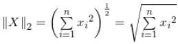每个元素的平方和再开平方根；

向量的无穷范数：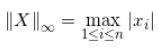

例：向量X=\[2, 3, -5, -7\] ，求向量的1-范数，2-范数和无穷范数。

向量的1-范数：各个元素的绝对值之和；=2+3+5+7=17；

向量的2-范数：每个元素的平方和再开平方根；


向量的无穷范数：

（1）正无穷范数：向量的所有元素的绝对值中最大的；即X的正无穷范数为：7；

（2）负无穷范数：向量的所有元素的绝对值中最小的；即X的负无穷范数为：2；

#### 2.矩阵的范数

设：向量，矩阵，例如矩阵A为：

``` lang-python
A=[2, 3, -5, -7;

   4, 6,  8, -4;

   6, -11, -3, 16];
```

（1）矩阵的1-范数（列模）：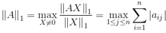；矩阵的每一列上的元素绝对值先求和，再从中取个最大的，（列和最大)；即矩阵A的1-范数为：27

（2）矩阵的2-范数（谱模）：，

> 其中 λ<sub>i</sub> 为A<sup>T</sup>A的特征值；矩阵A<sup>T</sup>A的最大特征值开平方根。

（3）矩阵的无穷范数（行模）：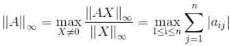；矩阵的每一行上的元素绝对值先求和，再从中取个最大的，（行和最大)

------------------------------------------------------------------------

> 原文链接：<a href="https://blog.csdn.net/zaishuiyifangxym/article/details/81673491" target="_blank">https://blog.csdn.net/zaishuiyifangxym/article/details/81673491</a>

---

### 8.11 朗格朗日乘子法

拉格朗日乘子法 (Lagrange multipliers)是**一种寻找多元函数在一组约束下的极值的方法**.

通过引入拉格朗日乘子，**可将有 d 个变量与 k 个约束条件的最优化问题转化为具有 d + k 个变量的无约束优化问题求解。**

本文希望通过一个直观简单的例子尽力解释拉格朗日乘子法和KKT条件的原理。

------------------------------------------------------------------------

以包含一个变量一个约束的简单优化问题为例。

如图所示，我们的目标函数是：<span class="katex"><span class="katex-mathml">$`f(x)=x^2+4x-1`$</span></span>讨论两种约束条件g(x)：

- 1\) 在满足x≤−1 约束条件下求目标函数的最小值；

- 2\) 在满足 x≥−1约束条件g(x)下求目标函数的最小值。

------------------------------------------------------------------------


我们可以直观的从图中得到，

- 对于约束 1) 使目标值f(x)最小的最优解是x=−2；
- 对于约束 2) 使目标值f(x)最小的最优解是x=−1。

------------------------------------------------------------------------

下面我们用拉格朗日乘子来求解这个最优解。

当没有约束的时候，我们可以直接令目标函数的导数为0，求最优值。

可现在有约束，那怎么边考虑约束边求目标函数最优值呢？

- **最直观的办法是把约束放进目标函数里**，由于本例中只有一个约束，所以引入一个朗格朗日乘子λ，构造一个新的函数，拉格朗日函数h(x)：<span class="katex"><span class="katex-mathml">$`h(x)=f(x)+\lambda g(x)`$</span></span>

**该拉格朗日函数h(x)最优解可能在g(x)\<0区域中，或者在边界g(x)=0上，**下面具体分析这两种情况，

- 当g(x)\<0时，也就是最优解在g(x)\<0区域中， 对应**约束1)** x≤−1的情况。此时约束对求目标函数最小值不起作用，等价于λ=0，直接通过条件∇𝑓(𝑥∗)=0，得拉格朗日函数h(x)最优解x=−2。
- 当g(x)=0时，也就是最优解在边界g(x)=0上，对应**约束2)** x≥−1的情况。此时不等式约束转换为等式约束，也就是在λ\>0、约束起作用的情况下，通过求∇𝑓(𝑥∗)+𝜆∇𝑔(𝑥∗)=0，得拉格朗日函数h(x)最优解x=−1。

所以整合这两种情况，必须满足λg(x)=0

因此约束g(x)最小化f(x)的优化问题，可通过引入拉格朗日因子转化为在如下约束下，最小化拉格朗日函数h(x)，


上述约束条件称为KKT条件。

该KKT条件可扩展到多个等式约束和不等式约束的优化问题。

---

### 极大似然函数取对数的原因

### 1 减少计算量

在计算一个独立同分布数据集的联合概率时，如：


其联合概率是每个数据点概率的连乘：


两边取对数则可以将连乘化为连加：


乘法变成加法，从而减少了计算量；

同时，如果概率中含有指数项，如高斯分布，能把指数项也化为求和形式，进一步减少计算量；

另外，在对联合概率求导时，和的形式会比积的形式更方便。

### 2. 利于结果更好的计算

但其实可能更重要的一点是，因为概率值都在\[0,1\]之间，因此，概率的连乘将会变成一个很小的值，可能会引起浮点数下溢，尤其是当数据集很大的时候，联合概率会趋向于0，非常不利于之后的计算。

### 3. 取对数并不影响最后结果的单调性


因为相同的单调性，它确保了概率的最大对数值出现在与原始概率函数相同的点上。因此，可以用更简单的对数似然来代替原来的似然。

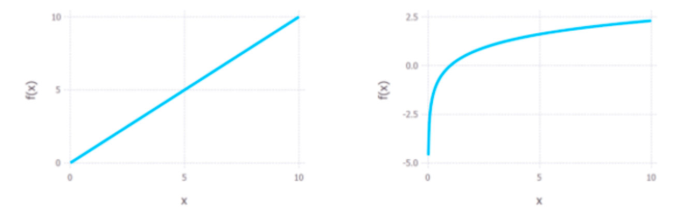
