# 邂逅小程序开发

## 目录

- [什么是小程序？](#什么是小程序)
- [小程序是什么呢？](#小程序是什么呢)
- [那么目前常见的小程序有哪些呢？](#那么目前常见的小程序有哪些呢)
- [各个平台小程序的时间线](#各个平台小程序的时间线)
- [各个平台为什么都需要支持小程序呢？](#各个平台为什么都需要支持小程序呢)
- [小程序由谁来开发？](#小程序由谁来开发)
- [开发小程序的技术选型](#开发小程序的技术选型)
- [uni-app 和taro](#uni-app-和taro)
- [需要掌握的预备知识](#需要掌握的预备知识)
- [注册账号– 申请AppID](#注册账号-申请appid)
- [下载小程序开发工具](#下载小程序开发工具)
- [使用VSCode开发](#使用vscode开发)
- [创建小程序项目](#创建小程序项目)
- [开发工具的解析](#开发工具的解析)
- [小程序项目结构](#小程序项目结构)
- [阅读官方文档](#阅读官方文档)
- [小程序开发体验](#小程序开发体验)
- [小程序开发初体验](#小程序开发初体验)
- [1.数据绑定](#1.数据绑定)
- [2.列表渲染](#2.列表渲染)
- [3.事件监听](#3.事件监听)
- [小程序的MVVM架构](#小程序的mvvm架构)
- [Vue的MVVM和小程序MVVM对比](#vue的mvvm和小程序mvvm对比)
- [MVVM为什么好用呢?](#mvvm为什么好用呢)

目录 content 认识小程序开发 1 小程序开发选择

小程序开发前准备 3 小程序目录的结构 4 小程序的开发体验 5 小程序MVVM架构

## 什么是小程序？

## 小程序是什么呢？

小程序（Mini Program）是一种不需要下载安装即可使用的应用，它实现了“触手可及”的梦想，使用起来方便快捷，用完

即走。

事实上，目前小程序在我们生活中已经随处可见（特别是这次疫情的推动，不管是什么岗位、什么年龄阶段的人，都哪都需

要打开健康码）；

所以对于小程序的基本认识和特点，我们就不再赘述了。

最初我们提到小程序时，往往指的是微信小程序：

但是目前小程序技术本身已经被各个平台所实现和支持；

待会儿我也会聊到它的技术特点以及为什么这些平台想要支持小程序技术。

## 那么目前常见的小程序有哪些呢？

微信小程序、支付宝小程序、淘宝小程序、抖音小程序、头条小程序、QQ小程序、美团小程序等等；

## 各个平台小程序的时间线

各个平台小程序大概的发布时间线：

2017年1月微信小程序上线，依附于微信App；

2018年7月百度小程序上线，依附于百度App；

2018年9月支付宝程序线，依附于支付宝App；

2018年10月抖音小程序上线，依附于抖音App；

2018年11月头条小程序上线，依附于头条App；

2019年5月QQ小程序上线，依附于QQApp；

2019年10月美团小程序上线，依附于美团App；

## 各个平台为什么都需要支持小程序呢？

第一：你有，我也得有。

大厂竞争格局中一个重要的一环。

第二：小程序作为介于H5页面和App之间的一项技术，它有自身很大的优势；

体验比传统H5页面要好很多； 相当于传统的App，使用起来更加方便，不需要在应用商店中下载安装，甚至注册登录等麻烦的操作；

第三：小程序可以间接的动态为App添加新功能。

传统的App更新需要先打包，上架到应用商店之后需要通过审核（App Store）； 但是小程序可以在App不更新的情况下，动态为自己的应用添加新的功能需求；

## 那么目前在这么多小程序的竞争格局中，哪一个是使用最广泛的呢？

显示是微信小程序，目前支付宝、抖音小程序也或多或少有人在使用； 其实我们透过小程序看本质，他们本身还是应用和平台之间的竞争，有最大流量入口的平台，对应的小程序也是用户更多一些； 目前在公司开发小程序主要开发的还是微信小程序，其他平台的小程序往往是平台本身的一些公司或者顺手开发的；

所以重点学习的一定是微信小程序开发。

## 小程序由谁来开发？

## 首先，我们确定一下小程序的定位是怎么样的呢？

介于原生App和手机H5页面之间的一个产品定位。

那么，由此我们也会产生一个疑惑：小程序是由谁来开发呢？

## 难道搞出一个《小程序开发工程师》？

由谁开发事实上是由它的技术特点所决定的，比如微信小程序WXML、WXSS、JavaScript；

它更接近于我们前端的开发技术栈，所以小程序都是由我们前端来开发的；

也就是说呢，你想要成为一个前端工程师或者找一份前端的工作，小程序是你必须学会的。

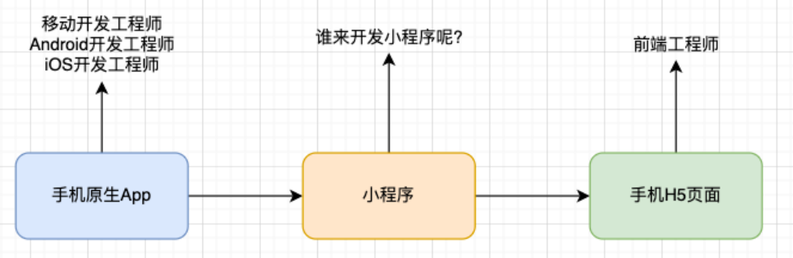

## 开发小程序的技术选型

原生小程序开发：

微信小程序：https://developers.weixin.qq.com/miniprogram/dev/framework/

主要技术包括：WXML、WXSS、JavaScript；

支付宝小程序：https://opendocs.alipay.com/mini/developer

主要技术包括：AXML、ACSS、JavaScript；

选择框架开发小程序：

mpvue：

mpvue是一个使用Vue开发小程序的前端框架，也是支持微信小程序、百度智能小程序，头条小程序和支付宝小程序；

该框架在2018年之后就不再维护和更新了，所以目前已经被放弃；

wepy：

WePY (发音: /'wepi/)是由腾讯开源的，一款让小程序支持组件化开发的框架，通过预编译的手段让开发者可以选择自己

喜欢的开发风格去开发小程序。

该框架目前维护的也较少，在前两年还有挺多的项目在使用，不推荐使用；

## uni-app 和taro

uni-app：

由DCloud团队开发和维护； uni-app 是一个使用Vue 开发所有前端应用的框架，开发者编写一套代码，可发布到iOS、Android、Web（响应式）、以及各种小程序（微信/支付宝/ 百度/头条/飞书/QQ/快手/钉钉/淘宝）、快应用等多个平台。 uni-app目前是很多公司的技术选型，特别是希望适配移动端App的公司；

taro：

由京东团队开发和维护； taro 是一个开放式跨端跨框架解决方案，支持使用React/Vue/Nerv 等框架来开发微信/ 京东/ 百度/ 支付宝/ 字节跳动/ QQ / 飞书小程序/ H5 / RN 等应用； taro因为本身支持React、Vue的选择，给了我们更加灵活的选择空间； 特别是在Taro3.x之后，支持Vue3、React Hook写法等； taro['tɑ:roʊ]，泰罗·奥特曼，宇宙警备队总教官，实力最强的奥特曼；

uni-app和taro开发原生App：

无论是适配原生小程序还是原生App，都有较多的适配问题，所以你还是需要多了解原生的一些开发知识； 产品使用体验整体相较于原生App差很多； 也有其他的技术选项来开发原生App：ReactNative、Flutter；

## 需要掌握的预备知识

小程序的核心技术主要是三个：

- 页面布局：WXML，类似HTML；

- 页面样式：WXSS，几乎就是CSS(某些不支持，某些进行了增强，但是基本是一致的) ；

- 页面脚本：JavaScript+WXS(WeixinScript) ；

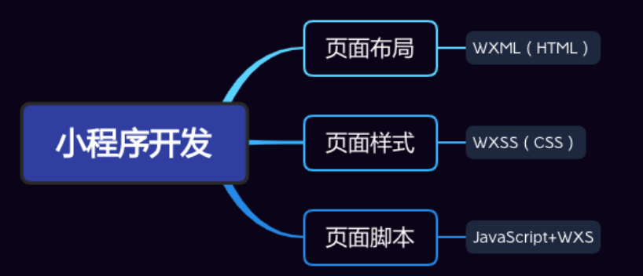

如果你之前已经掌握了Vue或者React等框架开发，那么学习小程序是更简单的；

因为里面的核心思想都是一致的（比如组件化开发、数据响应式、mustache语法、事件绑定等等）

## 注册账号– 申请AppID

注册账号：申请AppID

接入流程：https://mp.weixin.qq.com/cgi-bin/wx

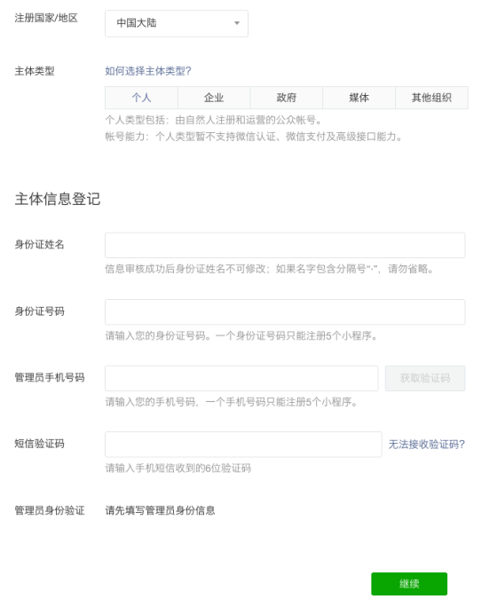

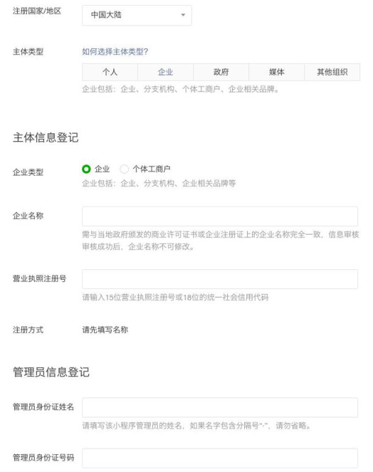

## 下载小程序开发工具

小程序的开发工具：

微信开发者工具：官方提供的开发工具，必须下载、安装；

VSCode：很多人比较习惯使用VSCode来编写代码；

微信开发者工具下载地址：

https://developers.weixin.qq.com/miniprogram/dev/devtools/download.html

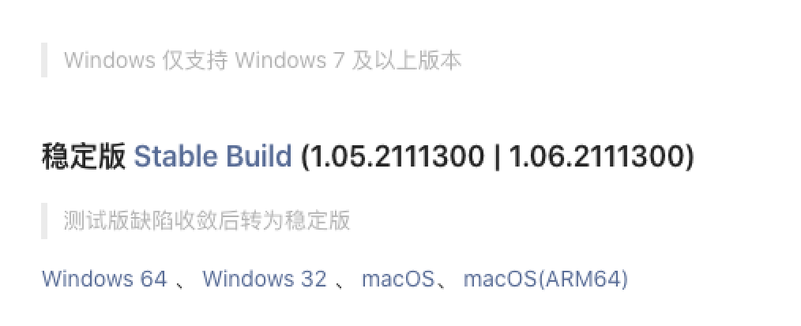

## 使用VSCode开发

推荐一些插件：

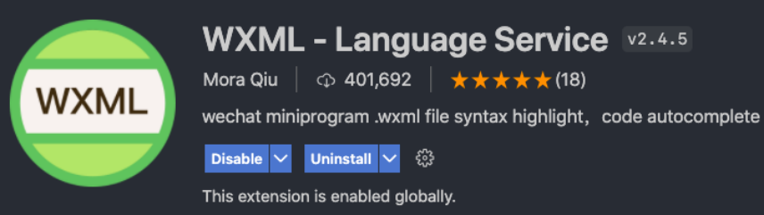

## 创建小程序项目

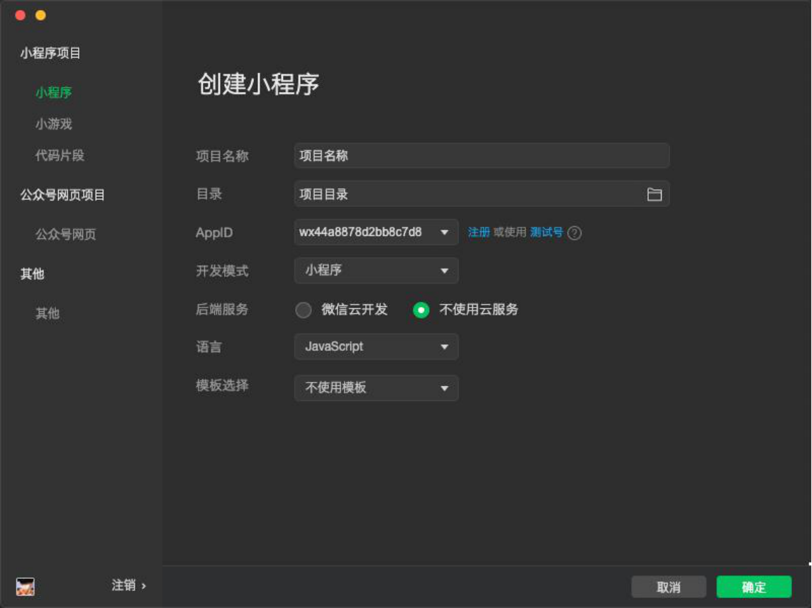

## 开发工具的解析

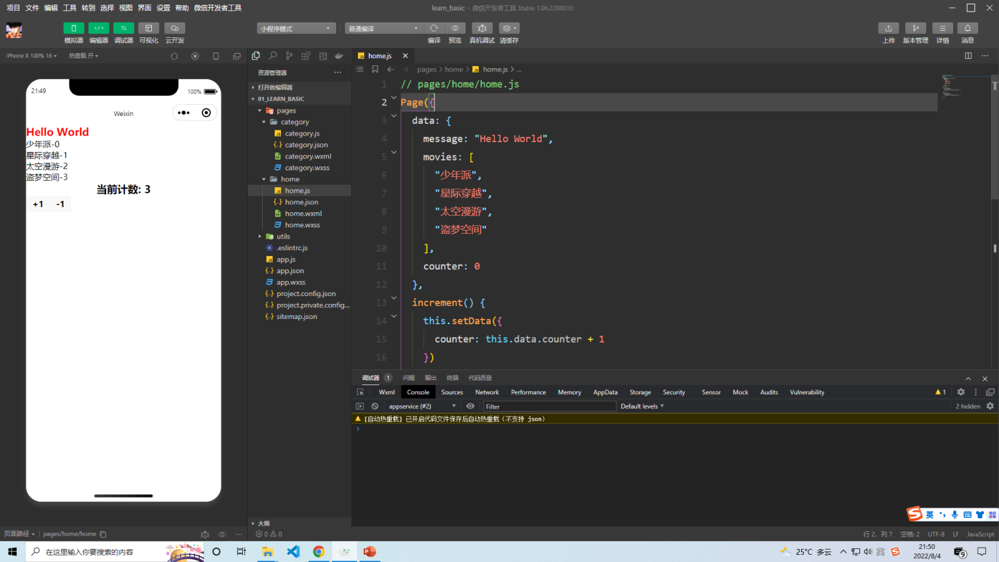

## 小程序项目结构

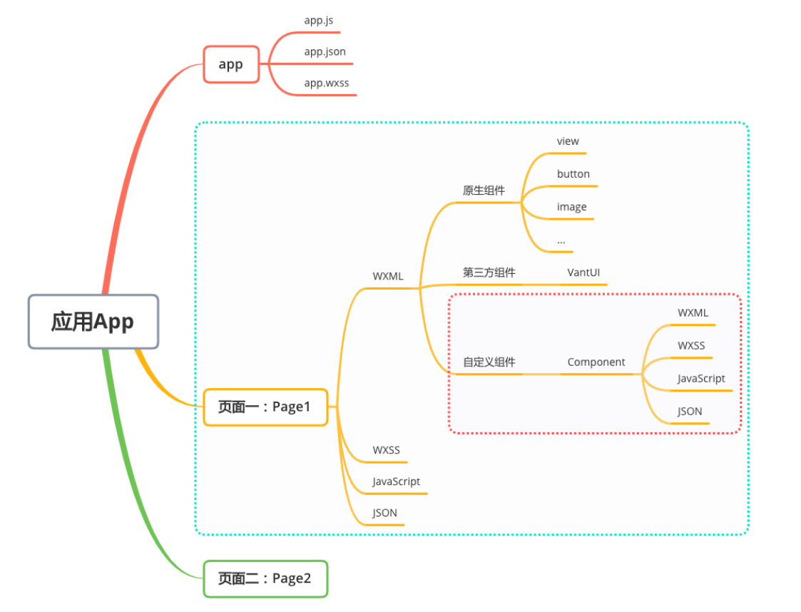

## 阅读官方文档

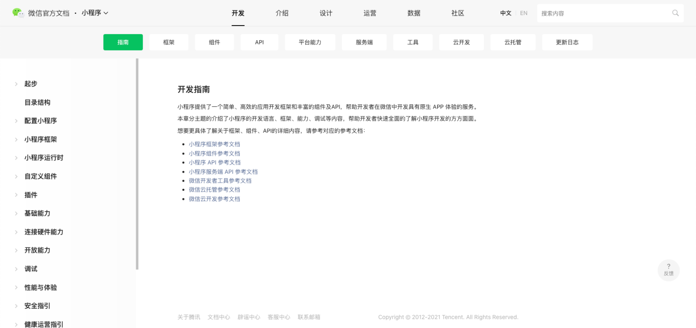

## 小程序开发体验

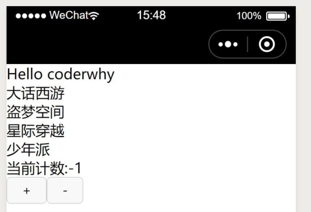

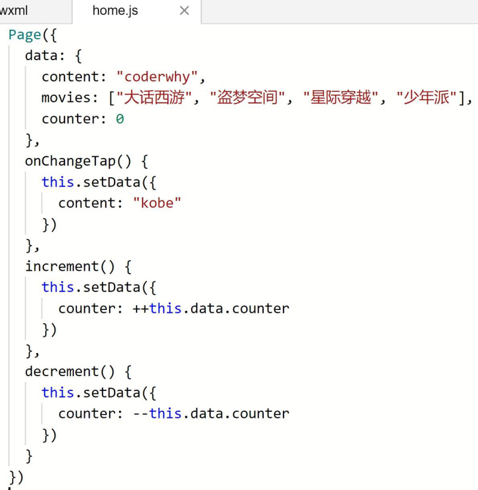

## 小程序开发初体验

## 1.数据绑定

## 2.列表渲染

## 3.事件监听

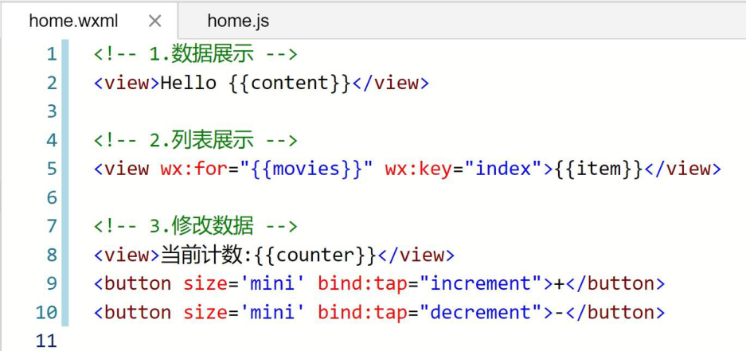

## 小程序的MVVM架构

## Vue的MVVM和小程序MVVM对比

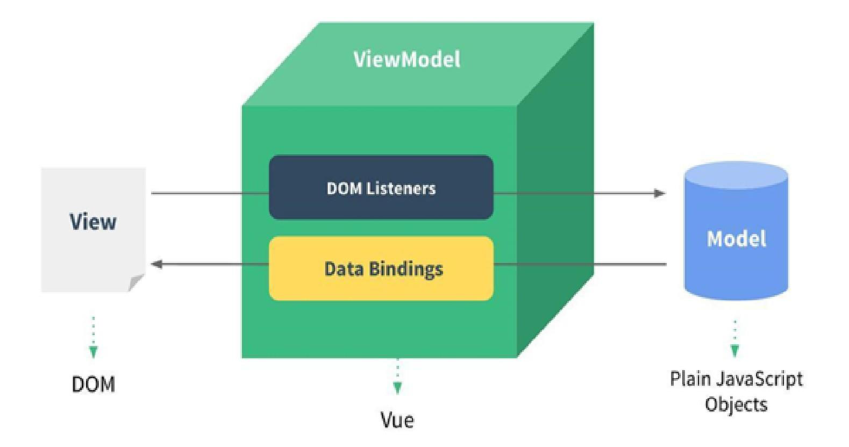

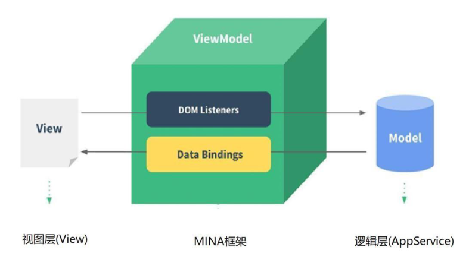

## MVVM为什么好用呢?

DOM Listeners: ViewModel层可以将DOM的监听绑定到Model层

Data Bindings: ViewModel层可以将数据的变量, 响应式的反应到View层

## MVVM架构将我们从命令式编程转移到声明式编程
