# 小程序的架构和配置

## 目录

- [小程序的架构模型](#小程序的架构模型)
- [谁是小程序的宿主环境呢？微信客户端](#谁是小程序的宿主环境呢微信客户端)
- [小程序的配置文件](#小程序的配置文件)
- [为什么这样做呢?](#为什么这样做呢)
- [常见的配置文件有哪些呢?](#常见的配置文件有哪些呢)
- [全局app配置文件](#全局app配置文件)
- [pages: 页面路径列表](#pages-页面路径列表)
- [window: 全局的默认窗口展示](#window-全局的默认窗口展示)
- [tabBar: 顶部tab栏的展示](#tabbar-顶部tab栏的展示)
- [具体属性稍后我们进行演示](#具体属性稍后我们进行演示)
- [配置案例实现](#配置案例实现)
- [我们来做如下的效果:](#我们来做如下的效果)
- [页面page配置文件](#页面page配置文件)
- [注册小程序– App函数](#注册小程序-app函数)
- [1. 判断小程序的进入场景](#1.-判断小程序的进入场景)
- [如何确定场景?](#如何确定场景)
- [作用三– 生命周期函数](#作用三-生命周期函数)
- [注册页面– Page函数](#注册页面-page函数)
- [注册Page时做什么呢?](#注册page时做什么呢)
- [上拉和下拉的监听](#上拉和下拉的监听)

目录 content 小程序的双线程模型 1 不同配置文件的区分

全局配置文件app.json 3 页面配置文件page.json 4 注册App实例的操作 5 注册Page实例的操作

## 小程序的架构模型

## 谁是小程序的宿主环境呢？微信客户端

宿主环境为了执行小程序的各种文件：wxml文件、wxss文件、js文件

当小程序基于WebView 环境下时，WebView 的JS 逻辑、DOM 树创建、CSS 解析、样式计算、Layout、Paint (Composite) 都发生

在同一线程，在WebView 上执行过多的JS 逻辑可能阻塞渲染，导致界面卡顿。

以此为前提，小程序同时考虑了性能与安全，采用了目前称为「双线程模型」的架构。

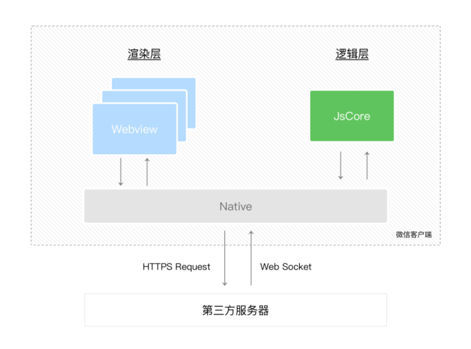

双线程模型：

## WXML模块和WXSS样式运行于渲染层，渲染层使用

## WebView线程渲染（一个程序有多个页面，会使用多个

WebView的线程）。

## JS脚本（app.js/home.js等）运行于逻辑层，逻辑层使

用JsCore运行JS脚本。

这两个线程都会经由微信客户端（Native）进行中转交互。

## 小程序的配置文件

小程序的很多开发需求被规定在了配置文件中。

## 为什么这样做呢?

这样做可以更有利于我们的开发效率；

并且可以保证开发出来的小程序的某些风格是比较一致的；

比如导航栏– 顶部TabBar，以及页面路由等等。

## 常见的配置文件有哪些呢?

project.config.json：项目配置文件, 比如项目名称、appid等；

https://developers.weixin.qq.com/miniprogram/dev/devtools/projectconfig.html

sitemap.json：小程序搜索相关的；

https://developers.weixin.qq.com/miniprogram/dev/framework/sitemap.html

app.json：全局配置；

page.json：页面配置；

## 全局app配置文件

全局配置比较多, 我们这里将几个比较重要的. 完整的查看官方文档.

https://developers.weixin.qq.com/miniprogram/dev/reference/configuration/app.html

属性 类型 必填 描述 pages String[] 是 页面路径列表 window Object 否 全局的默认窗口表现 tabBar Object 否 底部tab 栏的表现

## pages: 页面路径列表

用于指定小程序由哪些页面组成，每一项都对应一个页面的路径（含文件名）信息。

小程序中所有的页面都是必须在pages中进行注册的。

## window: 全局的默认窗口展示

## 用户指定窗口如何展示, 其中还包含了很多其他的属性

## tabBar: 顶部tab栏的展示

## 具体属性稍后我们进行演示

## 配置案例实现

## 我们来做如下的效果:

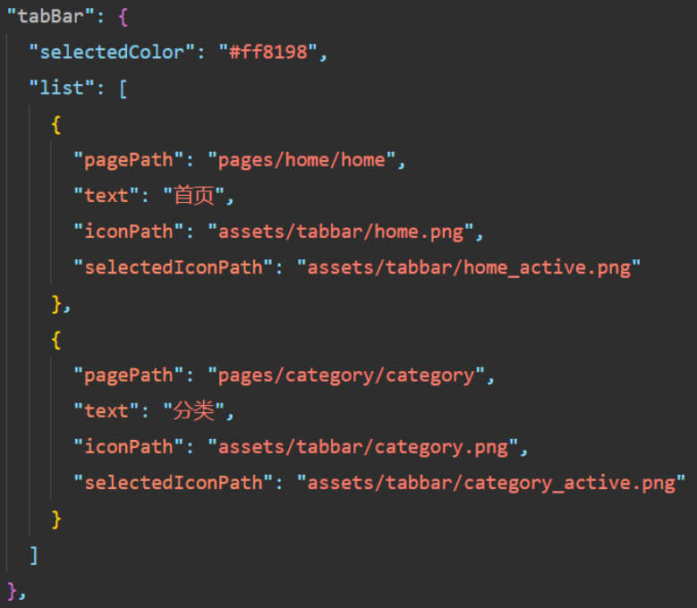

## 页面page配置文件

每一个小程序页面也可以使用.json 文件来对本页面的窗口表现进行配置。

页面中配置项在当前页面会覆盖app.json 的window 中相同的配置项。

https://developers.weixin.qq.com/miniprogram/dev/reference/configuration/page.html

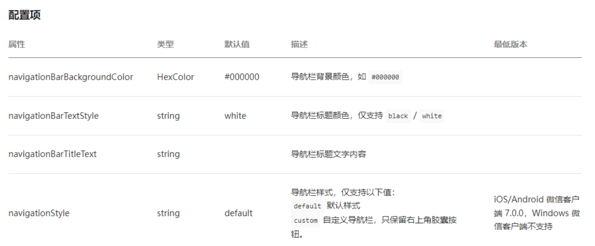

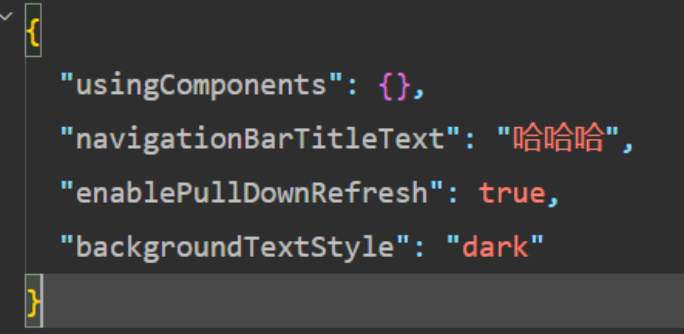

## 注册小程序– App函数

## 每个小程序都需要在app.js 中调用App 函数注册小程序示例

在注册时, 可以绑定对应的生命周期函数；

在生命周期函数中, 执行对应的代码；

https://developers.weixin.qq.com/miniprogram/dev/reference/api/App.html

我们来思考：注册App时，我们一般会做什么呢？

## 1. 判断小程序的进入场景

2. 监听生命周期函数，在生命周期中执行对应的业务逻辑，比如在某个生命周期函数中进行登录操作或者请求网络数据；

3. 因为App()实例只有一个，并且是全局共享的（单例对象），所以我们可以将一些共享数据放在这里；

App函数的参数

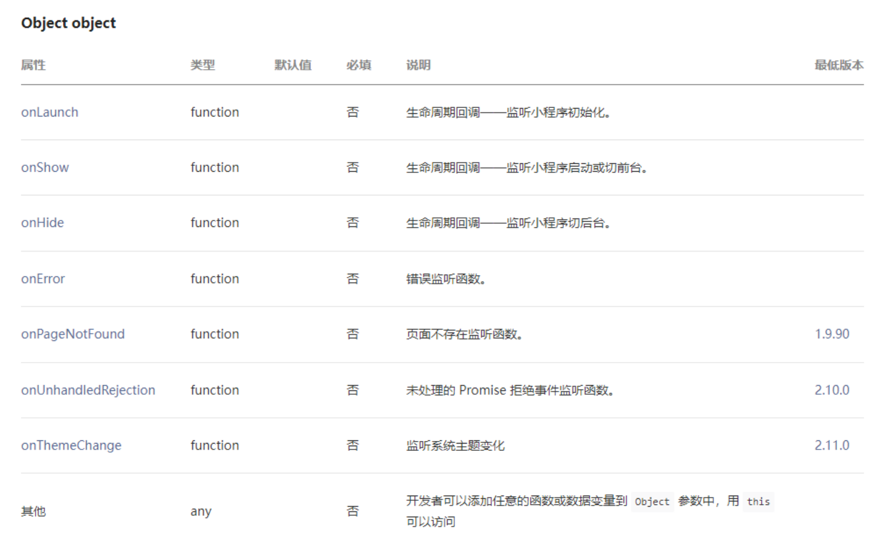

作用一：判断打开场景

小程序的打开场景较多：

常见的打开场景：群聊会话中打开、小程序列表中打开、微信扫一扫打开、另一个小程序打开

https://developers.weixin.qq.com/miniprogram/dev/reference/scene-list.html

## 如何确定场景?

在onLaunch和onShow生命周期回调函数中，会有options参数，其中有scene值；

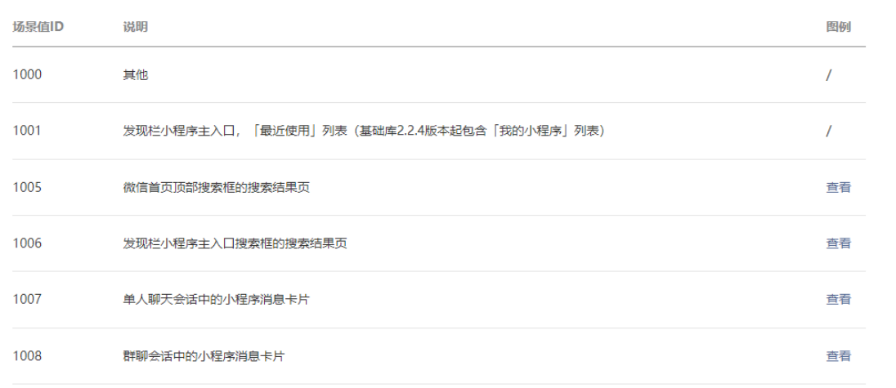

作用二：定义全局App的数据

作用二：可以在Object中定义全局App的数据

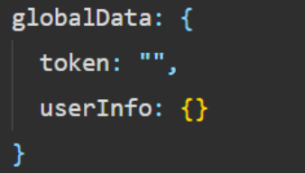

定义的数据可以在其他任何页面中访问：

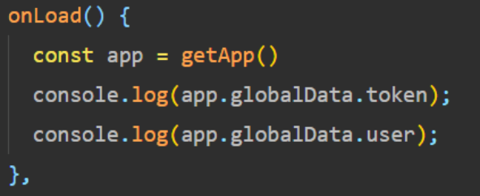

## 作用三– 生命周期函数

作用二：在生命周期函数中，完成应用程序启动后的初始化操作

比如登录操作（这个后续会详细讲解）；

## 比如读取本地数据（类似于token，然后保存在全局方便使用）

比如请求整个应用程序需要的数据；

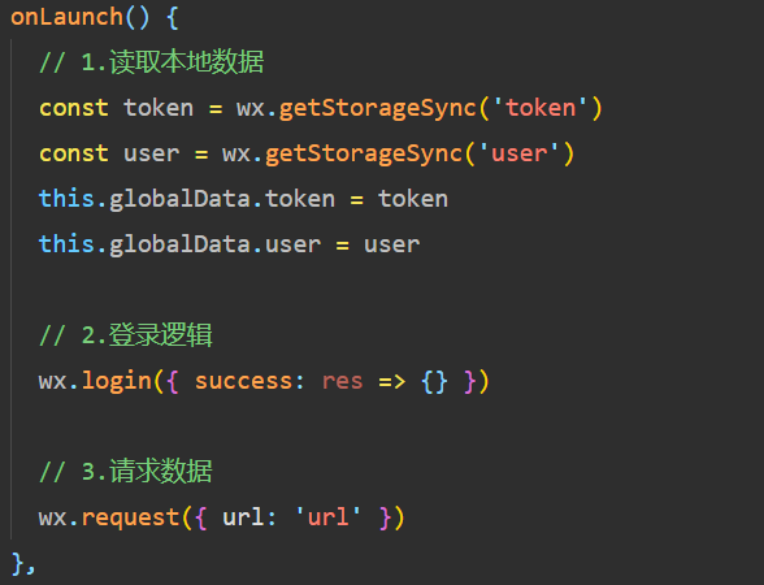

## 注册页面– Page函数

小程序中的每个页面, 都有一个对应的js文件, 其中调用Page函数注册页面示例

在注册时, 可以绑定初始化数据、生命周期回调、事件处理函数等。

https://developers.weixin.qq.com/miniprogram/dev/reference/api/Page.html

我们来思考：注册一个Page页面时，我们一般需要做什么呢？

1.在生命周期函数中发送网络请求，从服务器获取数据；

2.初始化一些数据，以方便被wxml引用展示；

3.监听wxml中的事件，绑定对应的事件函数；

4.其他一些监听（比如页面滚动、上拉刷新、下拉加载更多等）；

## 注册Page时做什么呢?

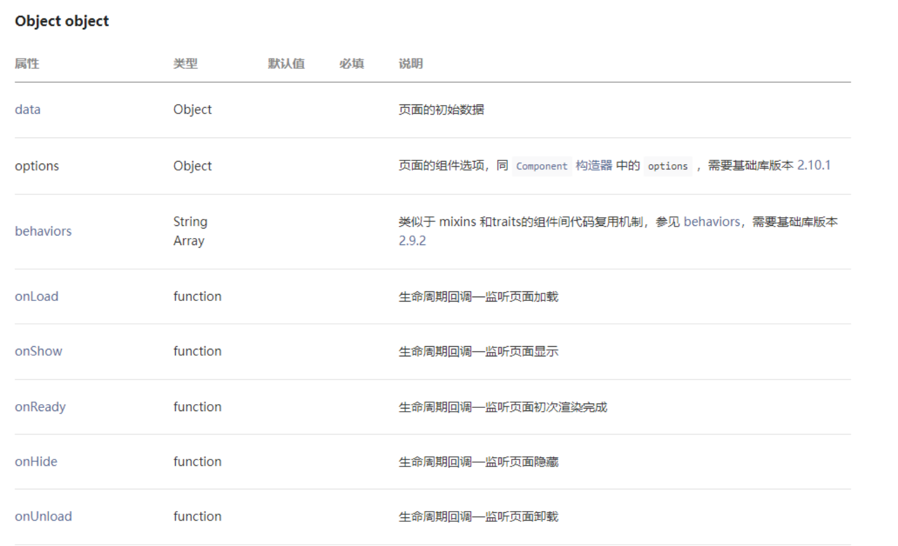

Page页面的生命周期

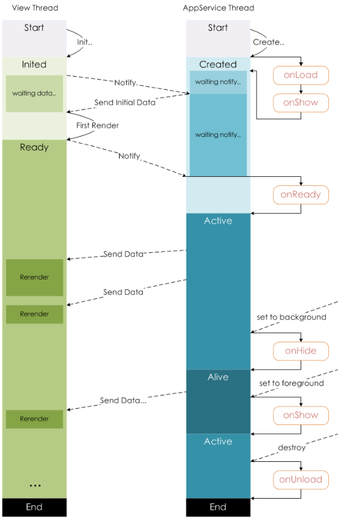

## 上拉和下拉的监听

监听页面的下拉刷新和上拉加载更多：

步骤一：配置页面的json文件；

步骤二：代码中进行监听；

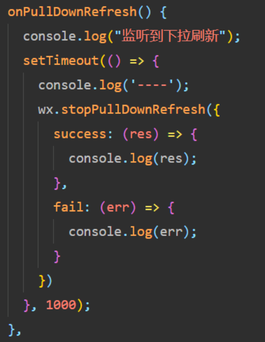

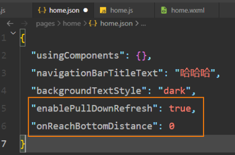

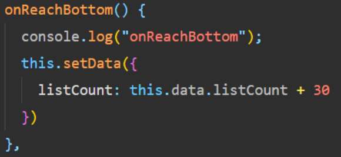
