# 小程序常见的内置组件

## 目录

- [Text组件解析](#text组件解析)
- [space有三个取值(了解)](#space有三个取值了解)
- [decode是否解码(了解)](#decode是否解码了解)
- [Button组件解析](#button组件解析)
- [Button组件用于创建按钮，默认块级元素](#button组件用于创建按钮默认块级元素)
- [open-type属性](#open-type属性)
- [View组件解析](#view组件解析)
- [Image组件解析](#image组件解析)
- [Image组件用于显示图片，有如下常见属性](#image组件用于显示图片有如下常见属性)
- [其中src可以是本地图片，也可以是网络图片](#其中src可以是本地图片也可以是网络图片)
- [Image组件代码](#image组件代码)
- [scroll-view组件解析](#scroll-view组件解析)

目录 content Text文本组件 1 Button按钮组件

View视图组件 3 Image图片组件 4 ScrollView滚动组件 5 组件的共同属性

## Text组件解析

## Text组件用于显示文本, 类似于span标签, 是行内元素

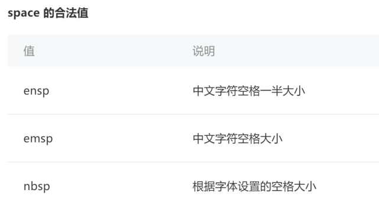

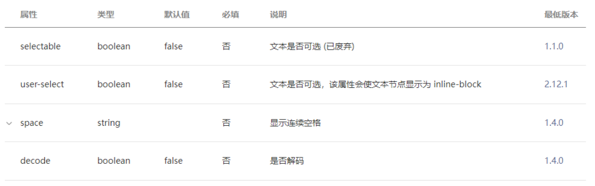

## user-select属性决定文本内容是否可以让用户选中

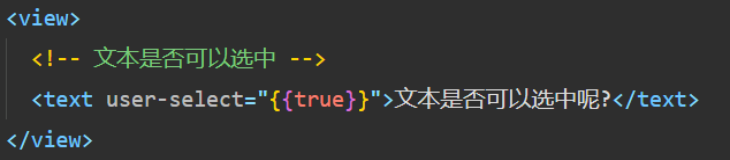

## space有三个取值(了解)

## decode是否解码(了解)

decode可以解析的有&nbsp; &lt; &gt; &amp; &apos; &ensp; &emsp;

## Button组件解析

## Button组件用于创建按钮，默认块级元素

常见属性：

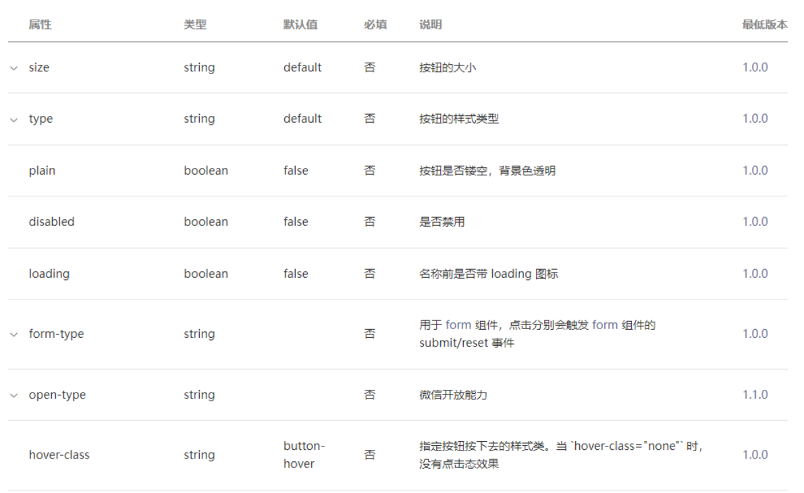

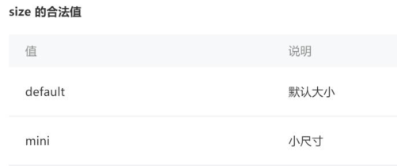

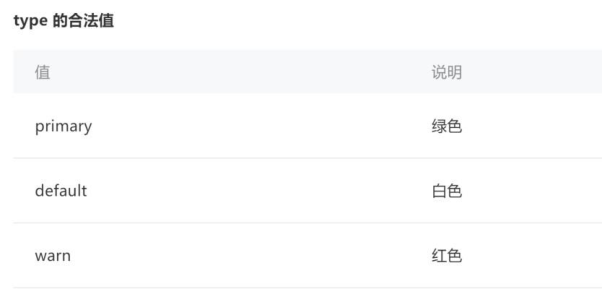

Button组件代码

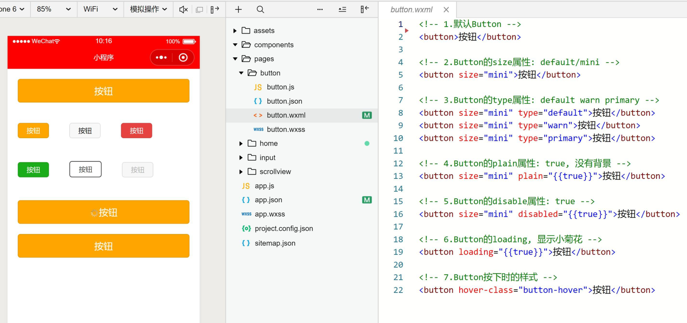

## open-type属性

open-type用户获取一些特殊性的权限，可以绑定一些特殊的事件

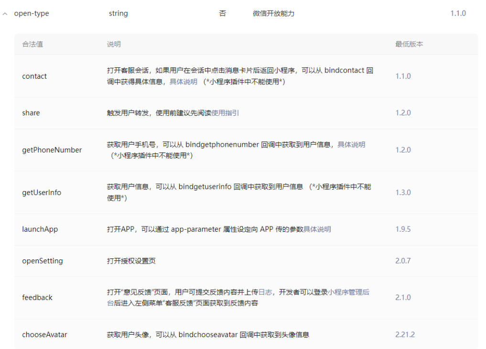

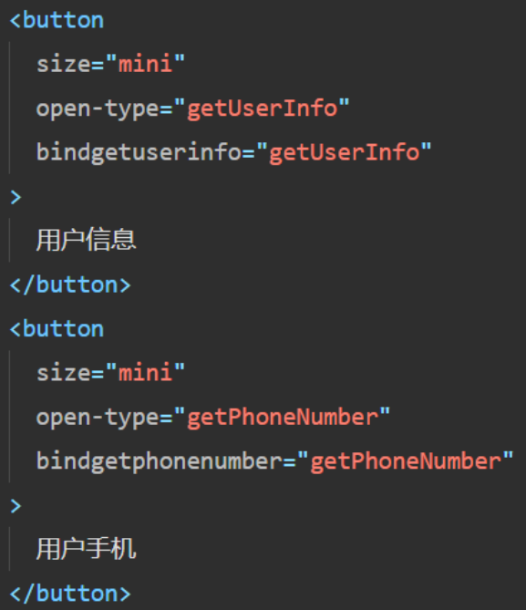

## View组件解析

## 视图组件（块级元素，独占一行，通常用作容器组件）

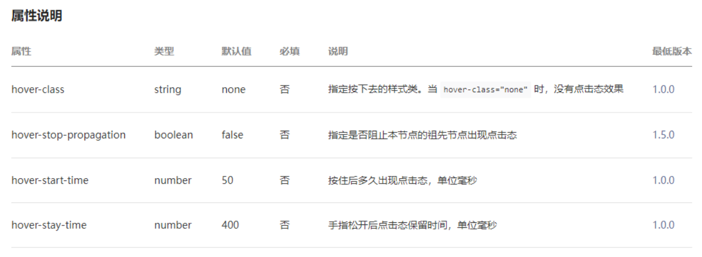

## Image组件解析

## Image组件用于显示图片，有如下常见属性

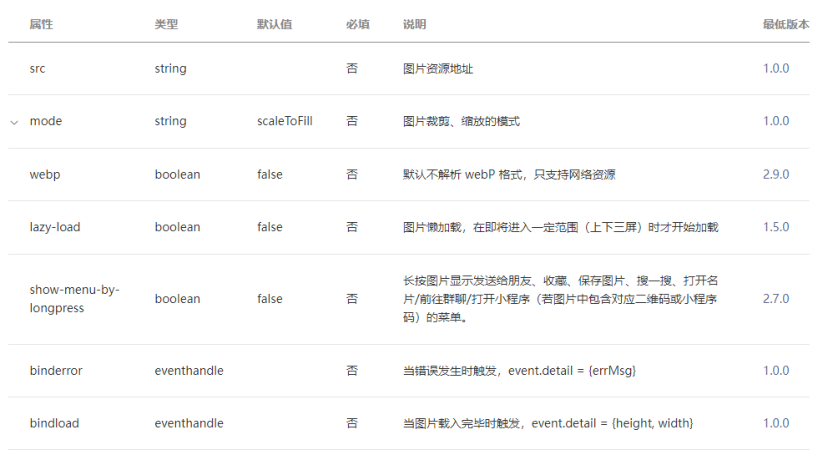

## 其中src可以是本地图片，也可以是网络图片

Mode属性使用也非常关键，详情查看官网：

https://developers.weixin.qq.com/miniprogram/dev/component/image.html

注意：image组件默认宽度320px、高度240px

## Image组件代码

这里补充一个API：wx.chooseMedia（具体用法查看文档）

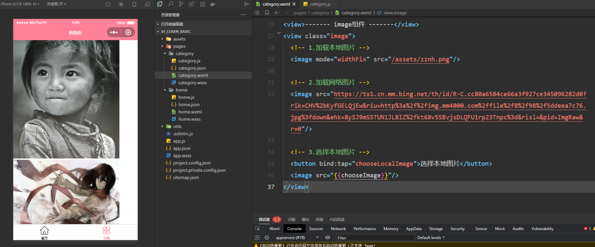

## scroll-view组件解析

scroll-view可以实现局部滚动，常见属性如下：

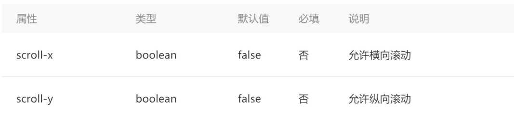

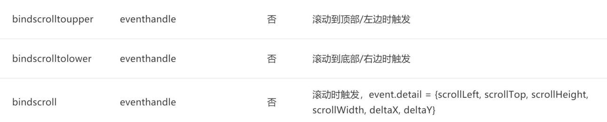

注意事项：

实现滚动效果必须添加scroll-x或者scroll-y属性（只需要添加即可，属性值相当于为true了）

## 垂直方向滚动必须设置scroll-view一个高度

scroll-view组件代码

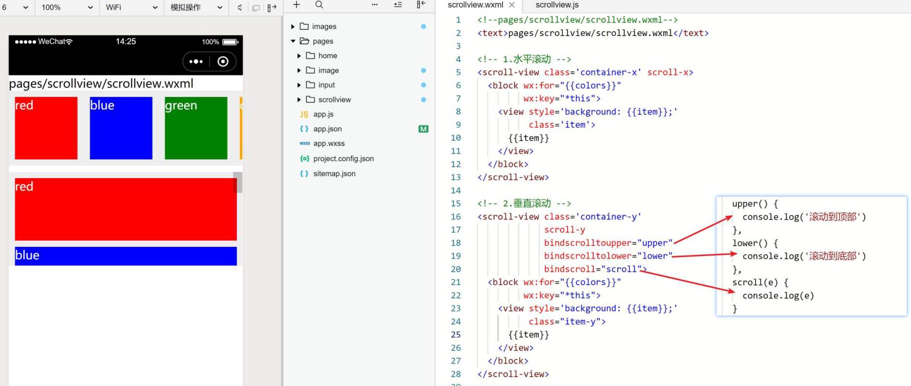

组件共同的属性

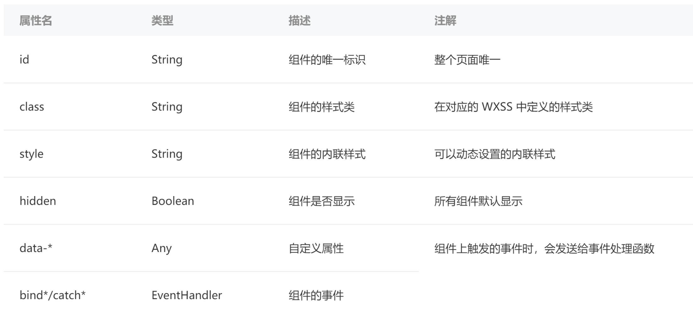
