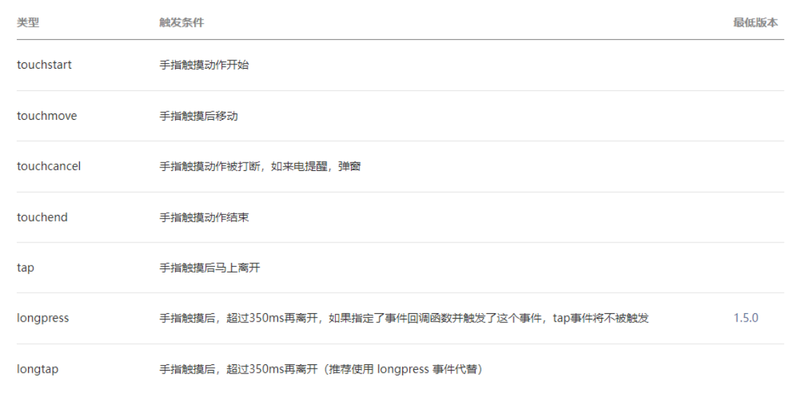
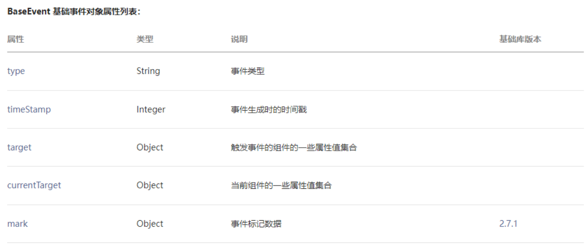
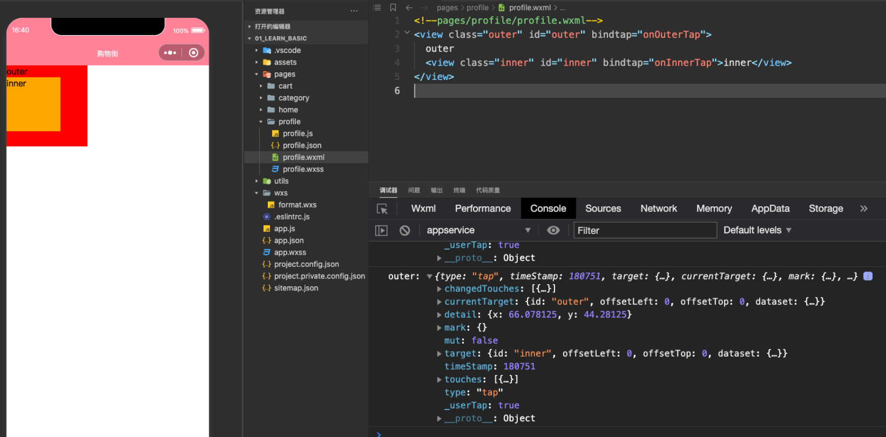
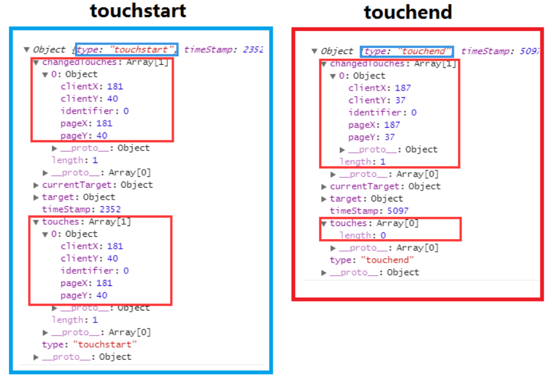
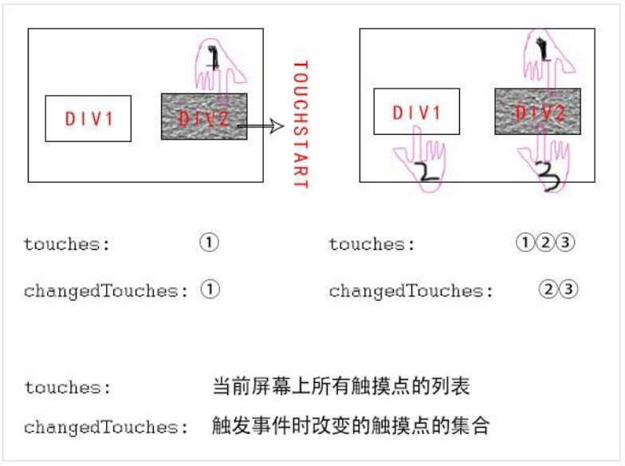
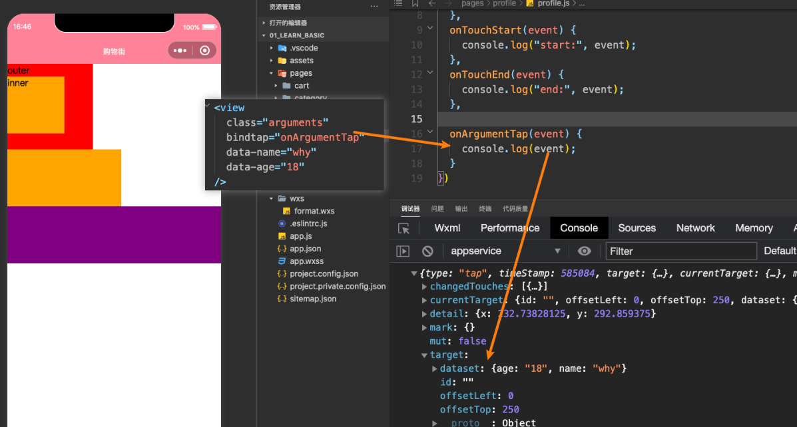
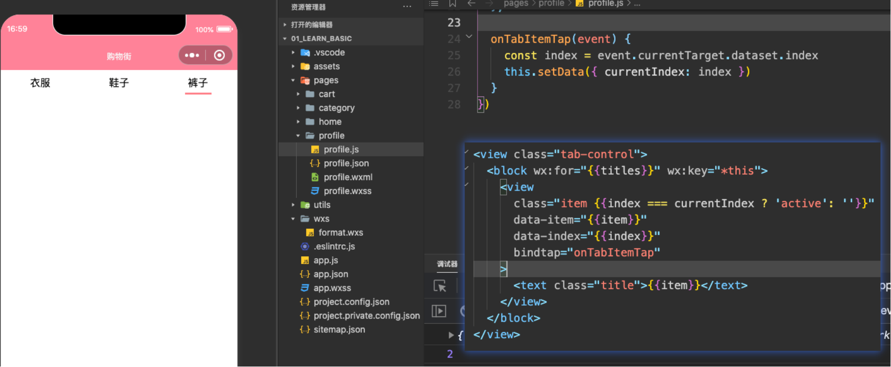
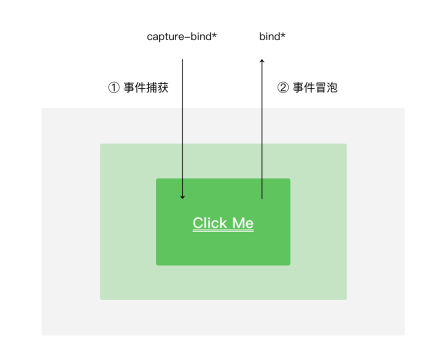

# 小程序的事件处理

## 目录

- [事件的监听](#事件的监听)
- [什么时候会产生事件呢？](#什么时候会产生事件呢)
- [事件时如何处理呢？](#事件时如何处理呢)
- [组件的特殊事件](#组件的特殊事件)
- [事件对象event](#事件对象event)
- [1.在touchend中不同](#1.在touchend中不同)
- [2.多手指触摸时不同](#2.多手指触摸时不同)
- [事件参数的传递](#事件参数的传递)
- [事件冒泡和事件捕获](#事件冒泡和事件捕获)

目录 content 小程序的事件监听 1 常见事件类型划分

事件对象属性分析 3 事件参数传递方法 4 事件传递案例练习 5 冒泡和捕获的区别

## 事件的监听

## 什么时候会产生事件呢？

小程序需要经常和用户进行某种交互，比如点击界面上的某个按钮或者区域，比如滑动了某个区域；

事件是视图层到逻辑层的通讯方式；

事件可以将用户的行为反馈到逻辑层进行处理；

事件可以绑定在组件上，当触发事件时，就会执行逻辑层中对应的事件处理函数；

事件对象可以携带额外信息，如id, dataset, touches；

## 事件时如何处理呢？

- 事件是通过bind/catch这个属性绑定在组件上的（和普通的属性写法很相似, 以key=“value”形式）；

- key以bind或catch开头, 从1.5.0版本开始, 可以在bind和catch后加上一个冒号；

- 同时在当前页面的Page构造器中定义对应的事件处理函数, 如果没有对应的函数, 触发事件时会报错；

- 比如当用户点击该button区域时，达到触发条件生成事件tap，该事件处理函数会被执行，同时还会收到一个事件对象

event。

## 组件的特殊事件

某些组件会有自己特性的事件类型，大家可以在使用组件时具体查看对应的文档

- 比如input有bindinput/bindblur/bindfocus等

- 比如scroll-view有bindscrolltowpper/bindscrolltolower等

这里我们讨论几个组件都有的, 并且也比较常见的事件类型：

## 事件对象event

当某个事件触发时, 会产生一个事件对象, 并且这个对象被传入到回调函数中, 事件对象有哪些常见的属性呢?

currentTarget和target的区别

## touches和changedTouches的区别

## 1.在touchend中不同

## 2.多手指触摸时不同

## 事件参数的传递

当视图层发生事件时，某些情况需要事件携带一些参数到执行的函数中, 这个时候就可以通过data-属性来完成：

格式：data-属性的名称

获取：e.currentTarget.dataset.属性的名称

参数传递的案例练习

## 事件冒泡和事件捕获

当界面产生一个事件时，事件分为了捕获阶段和冒泡阶段。

