# 小程序的组件化开发

## 目录

- [小程序组件化开发](#小程序组件化开发)
- [创建一个组件](#创建一个组件)
- [2.在wxml中编写属于我们组件自己的模板](#2.在wxml中编写属于我们组件自己的模板)
- [3.在wxss中编写属于我们组件自己的相关样式](#3.在wxss中编写属于我们组件自己的相关样式)
- [使用自定义组件和细节注意事项](#使用自定义组件和细节注意事项)
- [组件的样式细节](#组件的样式细节)
- [组件的通信](#组件的通信)
- [页面](#页面)
- [组件](#组件)
- [向组件传递数据- properties](#向组件传递数据--properties)
- [如何传递呢？](#如何传递呢)
- [String、Number、Boolean](#stringnumberboolean)
- [3.在页面中传入对应的class，并且给这个class设置样式](#3.在页面中传入对应的class并且给这个class设置样式)
- [组件向外传递事件– 自定义事件](#组件向外传递事件-自定义事件)
- [页面直接调用组件方法](#页面直接调用组件方法)
- [什么是插槽？](#什么是插槽)
- [单个插槽的使用](#单个插槽的使用)
- [多个插槽的使用](#多个插槽的使用)
- [behaviors](#behaviors)
- [组件的生命周期](#组件的生命周期)
- [组件所在页面的生命周期](#组件所在页面的生命周期)

目录 content 小程序组件化思想 1 自定义组件的过程

组件样式实现细节 3 组件使用过程通信 4 组件插槽定义使用 5 Component构造器

## 小程序组件化开发

小程序在刚刚推出时是不支持组件化的, 也是为人诟病的一个点：

但是从v1.6.3开始, 小程序开始支持自定义组件开发, 也让我们更加方便的在程序中使用组件化.

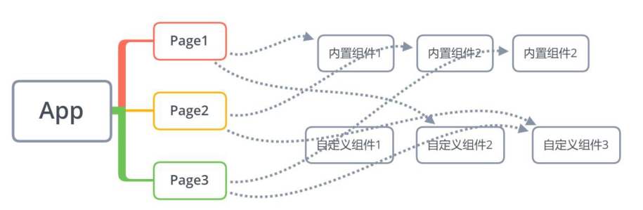

组件化思想的应用：

有了组件化的思想，我们在之后的开发中就要充分的利用它。 尽可能的将页面拆分成一个个小的、可复用的组件。 这样让我们的代码更加方便组织和管理，并且扩展性也更强。

所以，组件是目前小程序开发中，非常重要的一个篇章，要认真学习（不过学习Vue的过程中我们已经强调过很多次了）。

## 创建一个组件

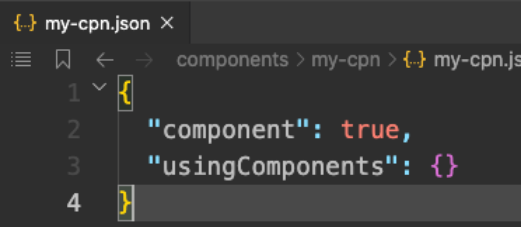

类似于页面，自定义组件由json wxml wxss js 4个文件组成。

按照我的个人习惯, 我们会先在根目录下创建一个文件夹；

components, 里面存放我们之后自定义的公共组件；

常见一个自定义组件my-cpn: 包含对应的四个文件；

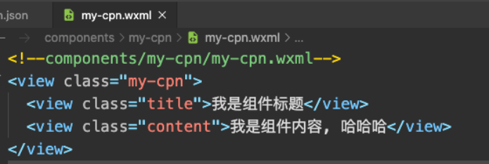

自定义组件的步骤：

1.首先需要在json 文件中进行自定义组件声明（将component 字段设

为true 可这一组文件设为自定义组件）：

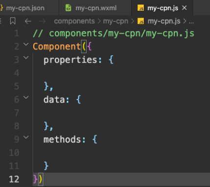

## 2.在wxml中编写属于我们组件自己的模板

## 3.在wxss中编写属于我们组件自己的相关样式

4.在js文件中, 可以定义数据或组件内部的相关逻辑(后续我们再使用)

## 使用自定义组件和细节注意事项

一些需要注意的细节：

自定义组件也是可以引用自定义组件的，引用方法类似于页面引用自定义组件的方式（使用usingComponents 字段）。

自定义组件和页面所在项目根目录名不能以“wx-”为前缀，否则会报错。

如果在app.json的usingComponents声明某个组件，那么所有页面和组件可以直接使用该组件。

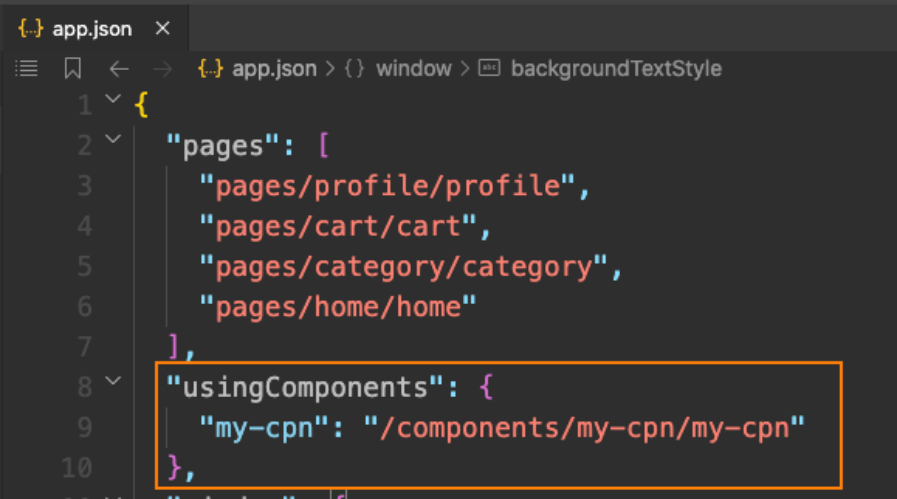

## 组件的样式细节

课题一：组件内的样式对外部样式的影响

结论一：组件内的class样式，只对组件wxml内的节点生效, 对于引用组件的Page页面不生效。

结论二：组件内不能使用id选择器、属性选择器、标签选择器

课题二：外部样式对组件内样式的影响

结论一：外部使用class的样式，只对外部wxml的class生效，对组件内是不生效的

结论二：外部使用了id选择器、属性选择器不会对组件内产生影响

结论三：外部使用了标签选择器，会对组件内产生影响

课题三：如何让class可以相互影响

在Component对象中，可以传入一个options属性，其中options属性中有一个styleIsolation（隔离）属性。

styleIsolation有三个取值：

- isolated 表示启用样式隔离，在自定义组件内外，使用class 指定的样式将不会相互影响（默认取值）；

- apply-shared 表示页面wxss 样式将影响到自定义组件，但自定义组件wxss 中指定的样式不会影响页面；

- shared 表示页面wxss 样式将影响到自定义组件，自定义组件wxss 中指定的样式也会影响页面和其他设置了

## 组件的通信

很多情况下，组件内展示的内容（数据、样式、标签），并不是在组件内写死的，而且可以由使用者来决定。

## 页面

数据:properties 样式:externalClasses 标签:slot 自定义事件

## 组件

## 向组件传递数据- properties

给组件传递数据：

大部分情况下，组件只负责布局和样式，内容是由使用组件的对象决定的；

所以，我们经常需要从外部传递数据给我们的组件，让我们的组件来进行展示；

## 如何传递呢？

使用properties属性；

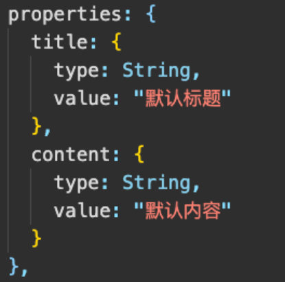

支持的类型：

## String、Number、Boolean

## Object、Array、null（不限制类型）

默认值：

可以通过value设置默认值；

## 向组件传递样式- externalClasses

给组件传递样式：

有时候，我们不希望将样式在组件内固定不变，而是外部可以决定样式。

这个时候，我们可以使用externalClasses属性：

1.在Component对象中，定义externalClasses属性

2.在组件内的wxml中使用externalClasses属性中的class

## 3.在页面中传入对应的class，并且给这个class设置样式

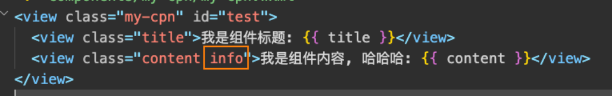

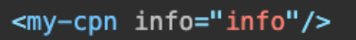

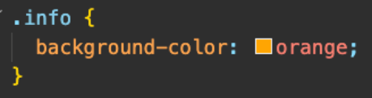

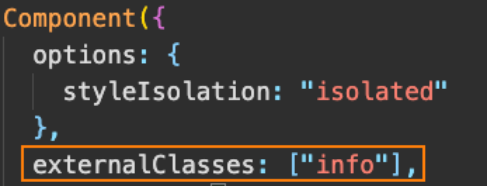

## 组件向外传递事件– 自定义事件

有时候是自定义组件内部发生了事件，需要告知使用者，这个时候可以使用自定义事件：

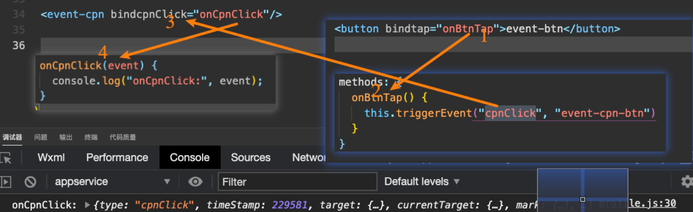

自定义组件练习

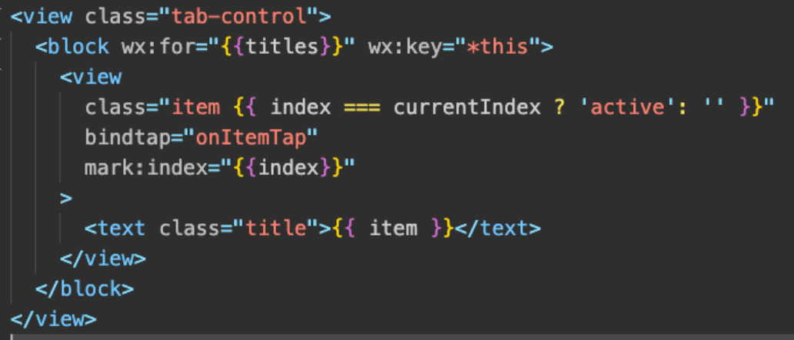

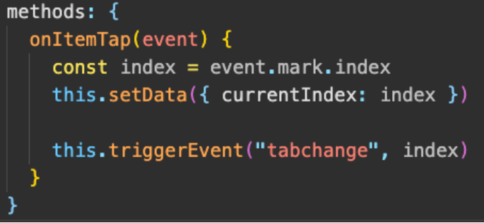

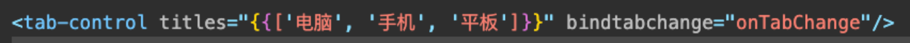

## 页面直接调用组件方法

可在父组件里调用this.selectComponent ，获取子组件的实例对象。

调用时需要传入一个匹配选择器selector，如：this.selectComponent(".my-component")。

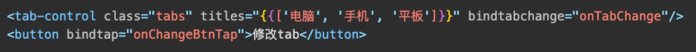

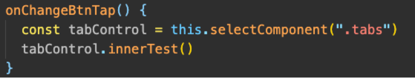

## 什么是插槽？

slot翻译为插槽：

在生活中很多地方都有插槽，电脑的USB插槽，插板当中的电源插槽。

插槽的目的是让我们原来的设备具备更多的扩展性。

比如电脑的USB我们可以插入U盘、硬盘、手机、音响、键盘、鼠标等等。

组件的插槽：

组件的插槽也是为了让我们封装的组件更加具有扩展性。

让使用者可以决定组件内部的一些内容到底展示什么。

栗子：移动网站中的导航栏。

移动开发中，几乎每个页面都有导航栏。

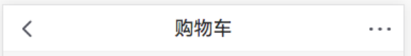

导航栏我们必然会封装成一个插件，比如nav-bar组件。

一旦有了这个组件，我们就可以在多个页面中复用了。

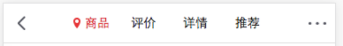

## 但是，每个页面的导航是一样的吗？类似右图

## 单个插槽的使用

## 除了内容和样式可能由外界决定之外，也可能外界想决定显示的方式

比如我们有一个组件定义了头部和尾部，但是中间的内容可能是一段文字，也可能是一张图片，或者是一个进度条。

在不确定外界想插入什么其他组件的前提下，我们可以在组件内预留插槽：

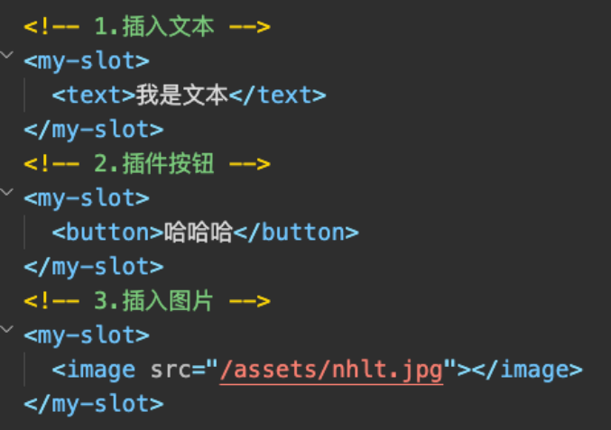

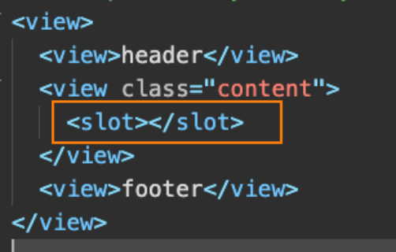

## 多个插槽的使用

有时候为了让组件更加灵活, 我们需要定义多个插槽：

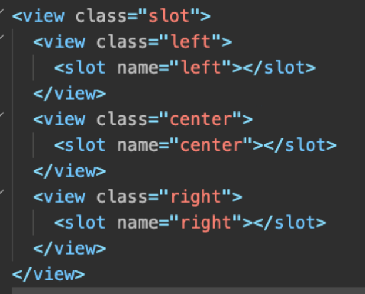

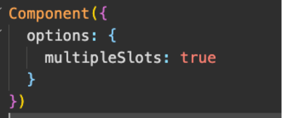

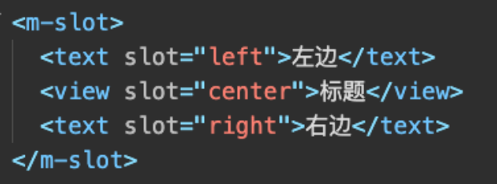

## behaviors

behaviors 是用于组件间代码共享的特性，类似于一些编程语言中的“mixins”。

每个behavior 可以包含一组属性、数据、生命周期函数和方法；

组件引用它时，它的属性、数据和方法会被合并到组件中，生命周期函数也会在对应时机被调用；

每个组件可以引用多个behavior ，behavior 也可以引用其它behavior ；

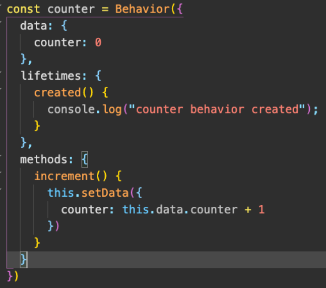

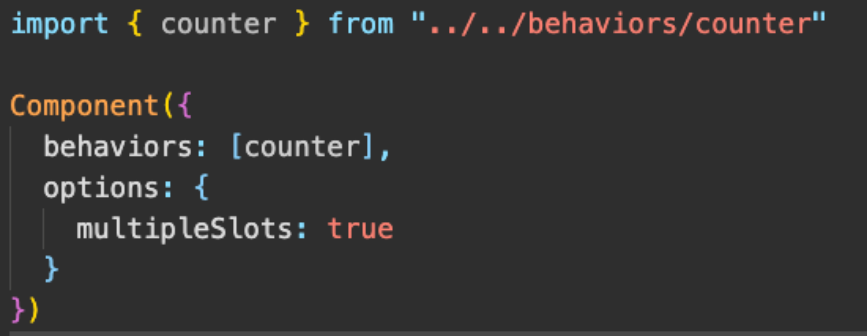

## 组件的生命周期

组件的生命周期，指的是组件自身的一些函数，这些函数在特殊的时间点或遇到一些特殊的框架事件时被自动触发。

其中，最重要的生命周期是created attached detached ，包含一个组件实例生命流程的最主要时间点。

自小程序基础库版本2.2.3 起，组件的的生命周期也可以在lifetimes 字段内进行声明（这是推荐的方式，其优先级最高）。

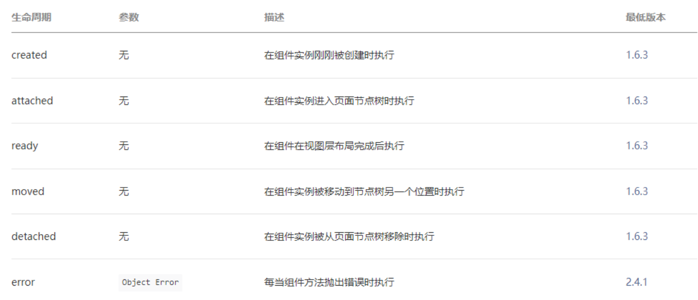

## 组件所在页面的生命周期

还有一些特殊的生命周期，它们并非与组件有很强的关联，但有时组件需要获知，以便组件内部处理。

样的生命周期称为“组件所在页面的生命周期”，在pageLifetimes 定义段中定义。

其中可用的生命周期包括：

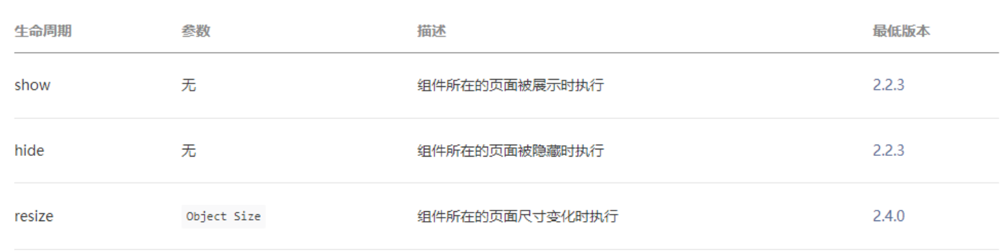

Component构造器

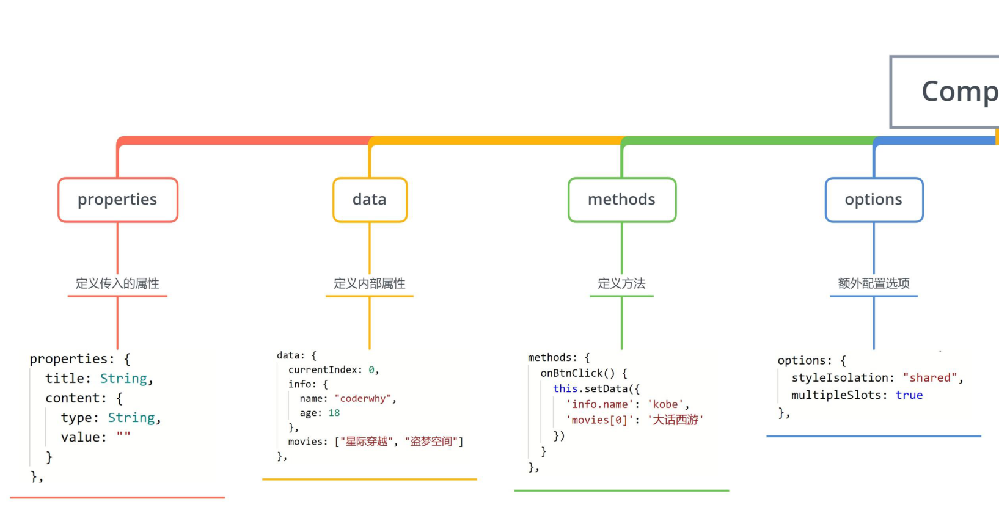

Component构造器

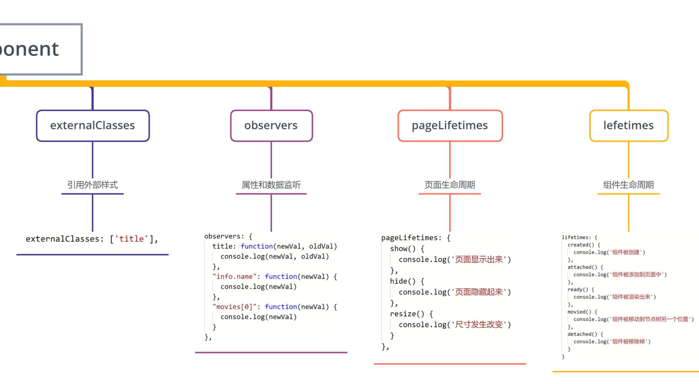
