# 小程序系统API调用

## 目录

- [网络请求– API参数](#网络请求-api参数)
- [比较关键的几个属性解析:](#比较关键的几个属性解析)
- [url: 必传, 不然请求什么.](#url-必传-不然请求什么.)
- [data: 请求参数](#data-请求参数)
- [method: 请求的方式](#method-请求的方式)
- [success: 成功时的回调](#success-成功时的回调)
- [fail: 失败时的回调](#fail-失败时的回调)
- [网络请求– API使用](#网络请求-api使用)
- [网络请求– API封装](#网络请求-api封装)
- [网络请求域名配置](#网络请求域名配置)
- [展示弹窗效果](#展示弹窗效果)
- [分享功能](#分享功能)
- [获取设备信息](#获取设备信息)
- [获取位置信息](#获取位置信息)
- [Storage存储](#storage存储)
- [wx.clearStorageSync()](#wx.clearstoragesync)
- [界面跳转的方式](#界面跳转的方式)
- [页面跳转- navigateTo](#页面跳转--navigateto)
- [页面返回- navigateBack](#页面返回--navigateback)
- [页面跳转- 数据传递（一）](#页面跳转--数据传递一)
- [页面跳转- 数据传递（二）](#页面跳转--数据传递二)
- [界面跳转的方式](#界面跳转的方式)
- [小程序登录解析](#小程序登录解析)
- [为什么需要用户登录？](#为什么需要用户登录)
- [如何识别同一个小程序用户身份？](#如何识别同一个小程序用户身份)
- [认识小程序登录流程](#认识小程序登录流程)
- [openid和unionid](#openid和unionid)
- [获取code](#获取code)
- [换取authToken](#换取authtoken)
- [用户身份多平台共享](#用户身份多平台共享)
- [账号绑定](#账号绑定)
- [手机号绑定](#手机号绑定)


目录 content 网络请求API和封装 1 展示弹窗和页面分享


设备信息和位置信息 3 小程序Storage存储 4 页面跳转和数据传递 5 小程序登录流程演练

## 网络请求– API参数

微信提供了专属的API接口,用于网络请求: wx.request(Object object)

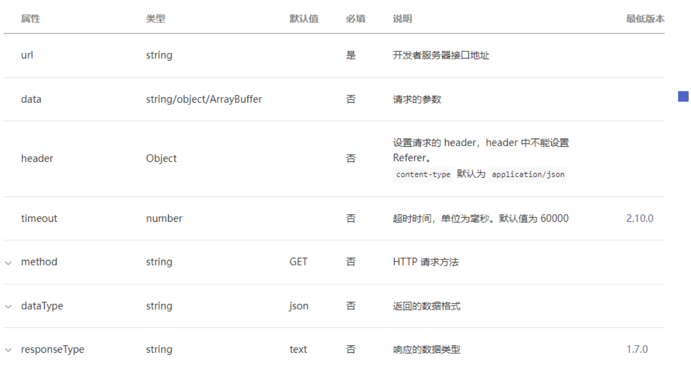

## 比较关键的几个属性解析:

## url: 必传, 不然请求什么.

## data: 请求参数

## method: 请求的方式

## success: 成功时的回调

## fail: 失败时的回调

## 网络请求– API使用

直接使用wx.request(Object object)发送请求：

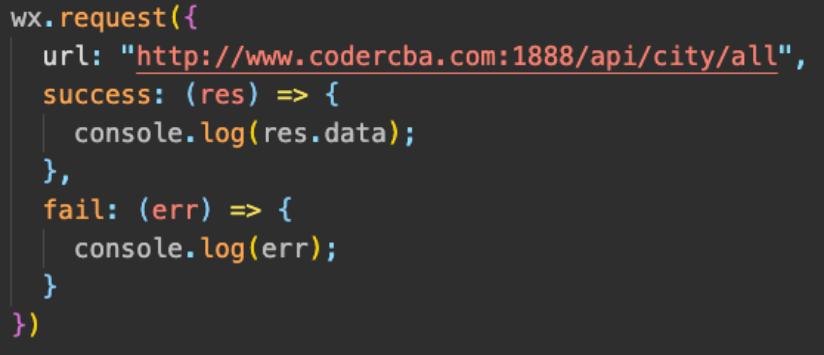

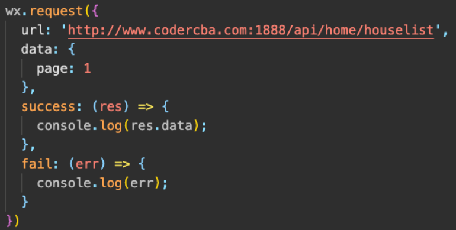

## 网络请求– API封装

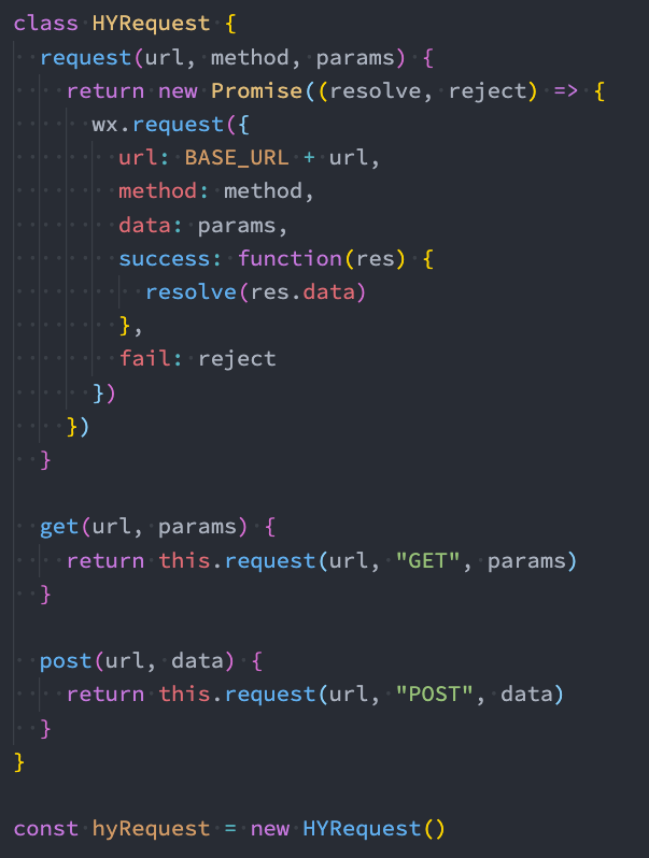

## 网络请求域名配置

每个微信小程序需要事先设置通讯域名，小程序只可以跟指定的域名进行网络通信。

小程序登录后台– 开发管理– 开发设置– 服务器域名；

服务器域名请在「小程序后台- 开发- 开发设置- 服务器域名」中进行配置，配置时需要注意：

域名只支持https (wx.request、wx.uploadFile、wx.downloadFile) 和wss (wx.connectSocket) 协议；

域名不能使用IP 地址（小程序的局域网IP 除外）或localhost；

可以配置端口，如https://myserver.com:8080，但是配置后只能向https://myserver.com:8080 发起请求。如果向

https://myserver.com、https://myserver.com:9091 等URL 请求则会失败。

如果不配置端口。如https://myserver.com，那么请求的URL 中也不能包含端口，甚至是默认的443 端口也不可以。如果

向https://myserver.com:443 请求则会失败。

域名必须经过ICP 备案；

出于安全考虑，api.weixin.qq.com 不能被配置为服务器域名，相关API 也不能在小程序内调用。开发者应将AppSecret

保存到后台服务器中，通过服务器使用getAccessToken 接口获取access_token，并调用相关API；

不支持配置父域名，使用子域名。

## 展示弹窗效果

小程序中展示弹窗有四种方式: showToast、showModal、showLoading、showActionSheet

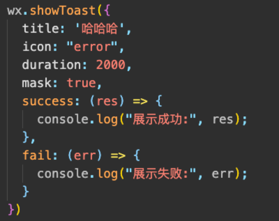

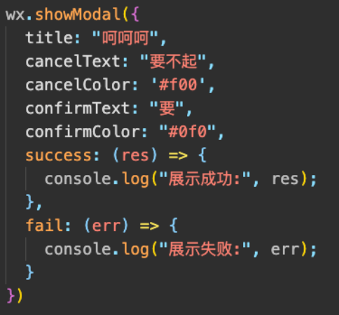

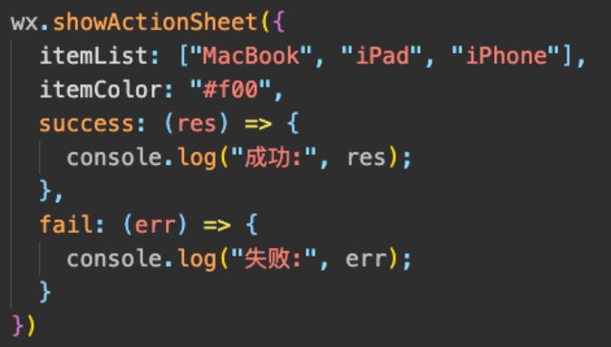

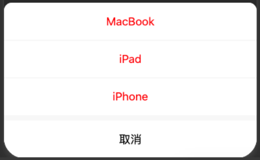

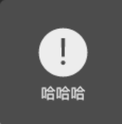

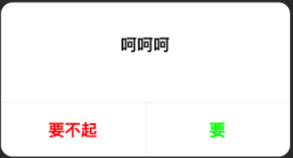

## 分享功能

分享是小程序扩散的一种重要方式，小程序中有两种分享方式：

方式一：点击右上角的菜单按钮，之后点击转发

方式二：点击某一个按钮，直接转发

当我们转发给好友一个小程序时，通常小程序中会显示一些信息：

## 如何决定这些信息的展示呢？通过onShareAppMessage

监听用户点击页面内转发按钮（button 组件open-type="share"）或右上角菜单“转发”按钮的行为，并自定义转发内容。

此事件处理函数需要return 一个Object，用于自定义转发内容；

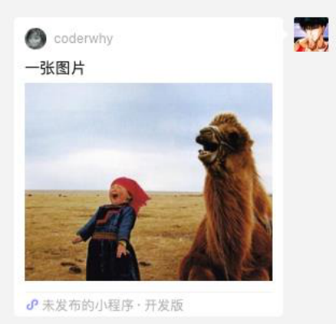

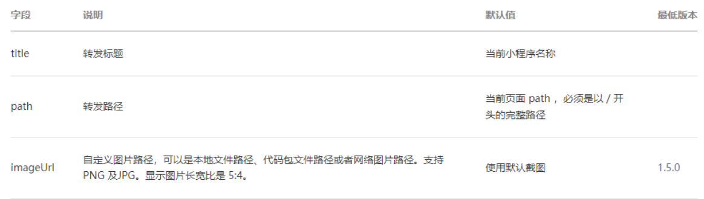

## 获取设备信息

在开发中，我们需要经常获取当前设备的信息，用于手机信息或者进行一些适配工作。

小程序提供了相关个API：wx.getSystemInfo(Object object)

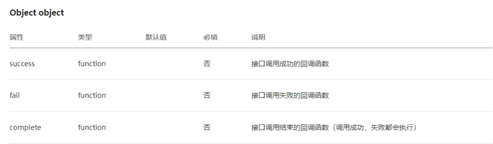

## 获取位置信息

开发中我们需要经常获取用户的位置信息，以方便给用户提供相关的服务：

我们可以通过API获取：wx.getLocation(Object object)

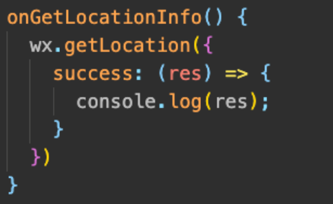

对于用户的关键信息，需要获取用户的授权后才能获得：

https://developers.weixin.qq.com/miniprogram/dev/reference/configuration/app.html#permission

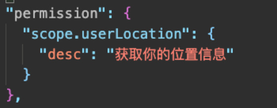

## Storage存储

在开发中，某些常见我们需要将一部分数据存储在本地：比如token、用户信息等。

小程序提供了专门的Storage用于进行本地存储。

同步存取数据的方法：

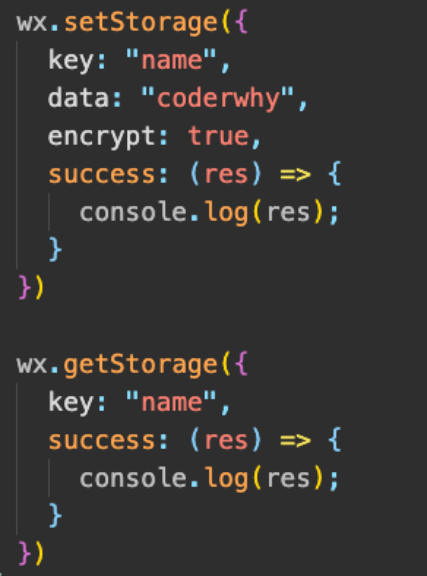

wx.setStorageSync(string key, any data)

any wx.getStorageSync(string key)

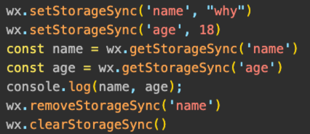

## wx.removeStorageSync(string key)

## wx.clearStorageSync()

异步存储数据的方法：

## wx.setStorage(Object object)

## wx.getStorage(Object object)

## wx.removeStorage(Object object)

## wx.clearStorage(Object object)

## 界面跳转的方式

界面的跳转有两种方式：通过navigator组件和通过wx的API跳转

这里我们先以wx的API作为讲解：

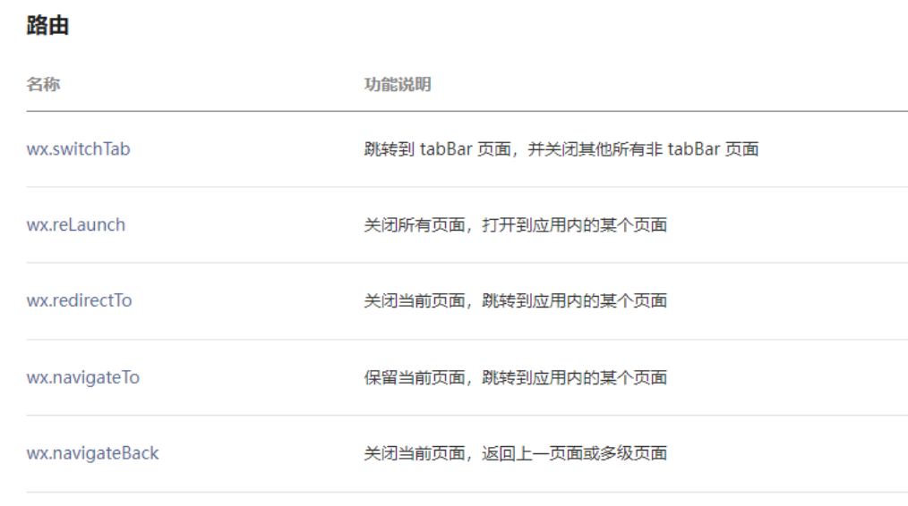

## 页面跳转- navigateTo

## wx.navigateTo(Object object)

保留当前页面，跳转到应用内的某个页面；

但是不能跳到tabbar 页面；

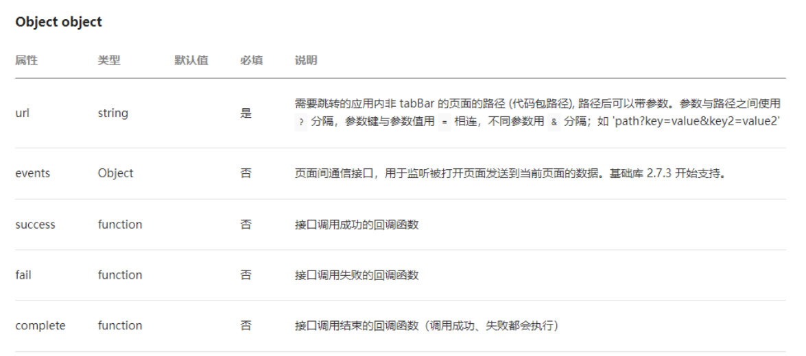

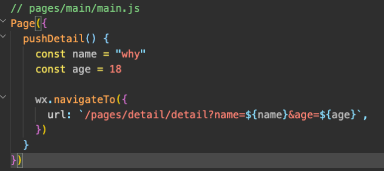

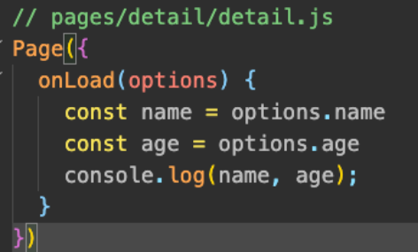

## 页面返回- navigateBack

## wx.navigateBack(Object object)

关闭当前页面，返回上一页面或多级页面。

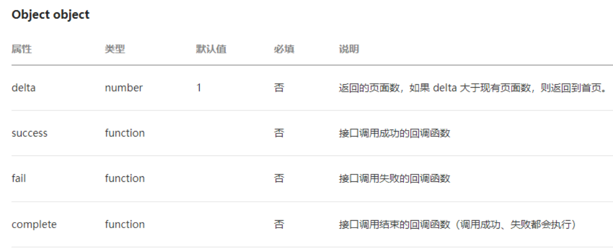

## 页面跳转- 数据传递（一）

## 如何在界面跳转过程中我们需要相互传递一些数据，应该如何完成呢？

首页-> 详情页：使用URL中的query字段

详情页-> 首页：在详情页内部拿到首页的页面对象，直接修改数据

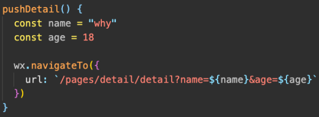

```
url?key1=value1&key2=value2
```

首页 详情页

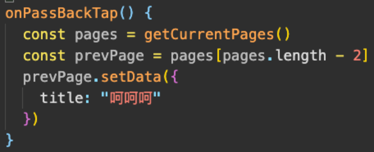

```
getCurrentPages()[length-2]
prePage.setData(设置数据)
```

## 页面跳转- 数据传递（二）

早期数据的传递方式只能通过上述的方式来进行，在小程序基础库2.7.3 开始支持events参数，也可以用于数据的传递。

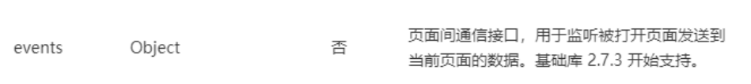

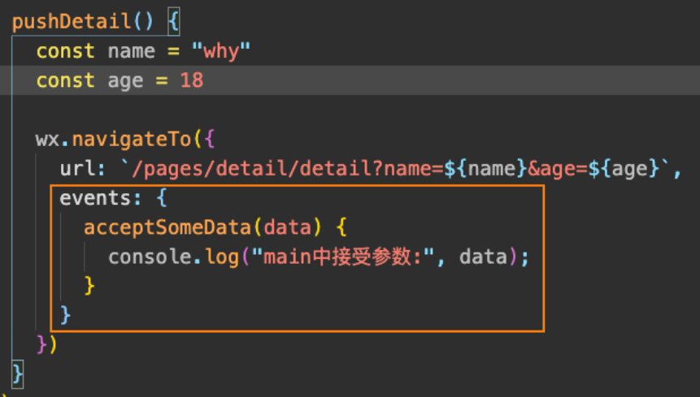

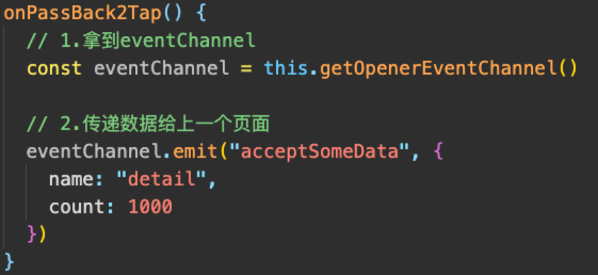

## 界面跳转的方式

navigator组件主要就是用于界面的跳转的，也可以跳转到其他小程序中：

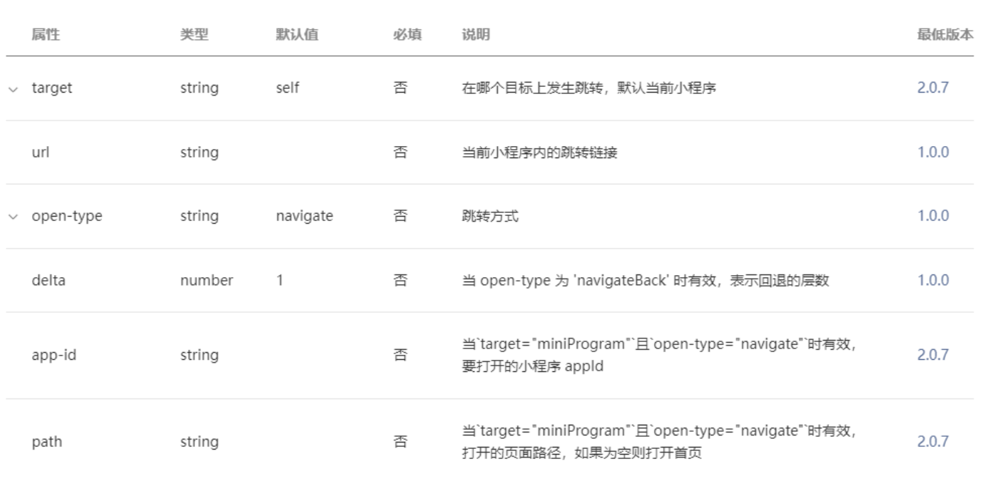

## 小程序登录解析

## 为什么需要用户登录？

增加用户的粘性和产品的停留时间；

## 如何识别同一个小程序用户身份？

## 认识小程序登录流程

## openid和unionid

## 获取code

## 换取authToken

## 用户身份多平台共享

## 账号绑定

## 手机号绑定

小程序用户登录的流程

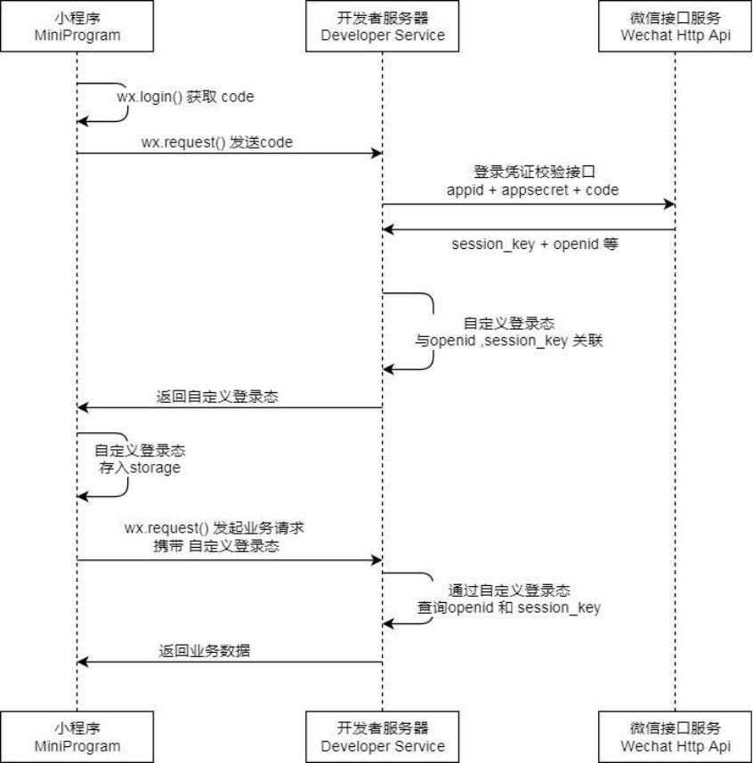

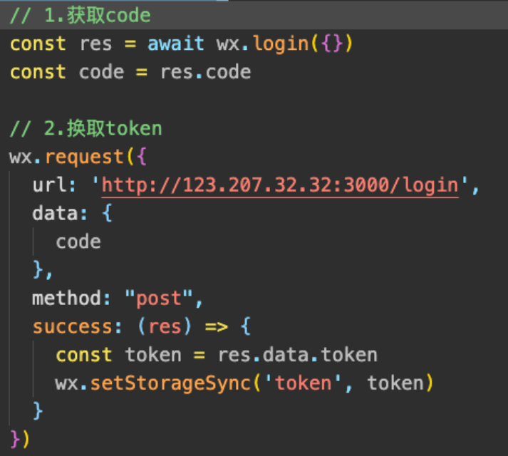
