# 人工智能三大概念

目录

人工智能三大概念人工智能（AI）、机器学习（ML）和深度学习（DL）

机器学习的应用领域和发展史

u 机器学习常用术语

样本、特征、标签、训练集和测试集

机器学习算法分类有监督学习、无监督学习、半监督、强化学习

机器学习建模流程

u 特征工程概念入门特征工程、特征工程子领域

模型拟合问题

机器学习开发环境

# 学习目标

# Learning Objectives

1. 知道AI，ML，DL是什么？

1. 了解AI、ML、DL之间的关系

1. 知道自动学习和规则编程的区别

多一句没有，少一句不行，用更短时间，教会更实用的技术！

# 人工智能的概念

# 1 什么是人工智能

. Artificial Intelligence 人工智能

• 人工智能定义：是一个研究领域，像人一样、机器智能的综合与分析

• 人工智能研究目标：使用计算机来模拟或者代替人类

# AI的期望

like像人那human样思考

像人那样理性思考

hink像人like那样活动

like像人那样human合理系统

多一句没有，少一句不行，用更短时间，教会更实用的技术！

# 机器学习

# 什么是机器学习

Machine Learning 机器学习

从数据中获取规律；来了一个新的数据，产生一个新的预测；

# 机器如何学习

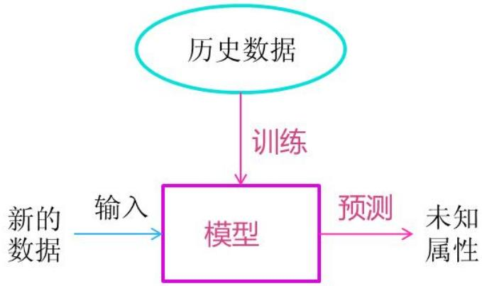

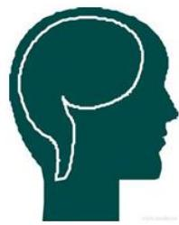

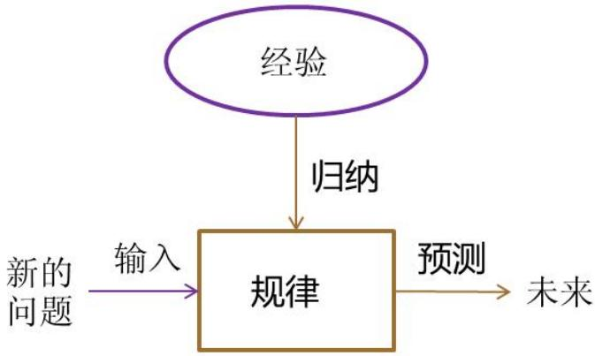

# 深度学习

• 深度学习(DL, Deep Learning) : ，也叫深度神经网络，大脑仿生，设计一层一层的神经元模拟万事万物

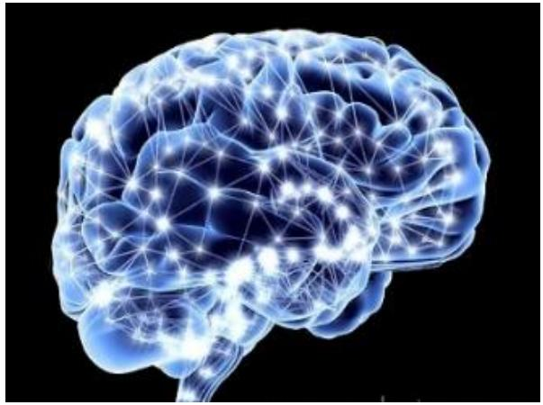

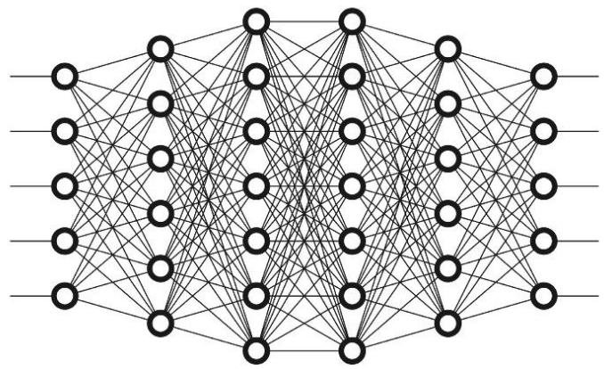

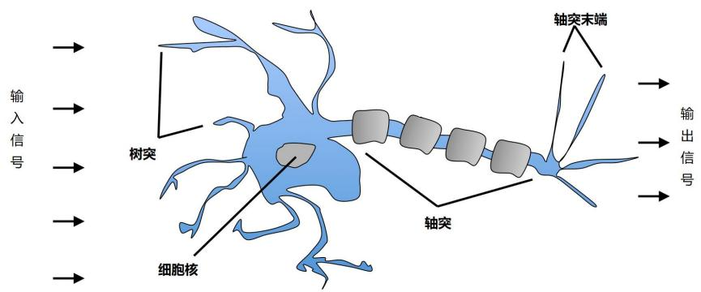

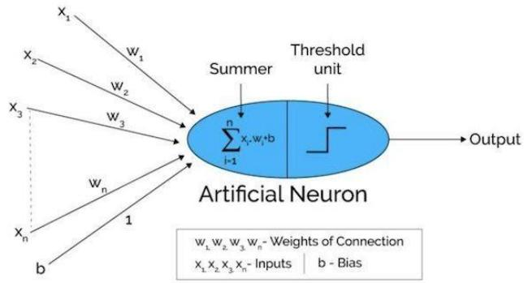

多一句没有，少一句不行，用更短时间，教会更实用的技术！

# 三者之间的关系

1.人工智能（AI, Artificial Intelligence）

这是最广泛的概念，指的是使机器能够模拟人类智能行为的技术和研究领域。AI包括理解语言、识别图像、解决问题等各种能力。

2.机器学习（ML, Machine Learning）

机器学习是实现人工智能的一种方法。它涉及到算法和统计模型的使用，使得计算机系统能够从数据中“学习”和改进任务的执行，而不是通过明确的编程来实现。机器学习包括多种技术，如KNN、线性回归、逻辑回归、决策树、集成学习、聚类算法等。

3.深度学习（DL, Deep Learning）

深度学习是机器学习中的一种特殊方法，它使用称为神经网络的复杂结构，特别是“深层”的神经网络，来学习和做出预测。深度学习特别适合处理大规模和高维度的数据，如图像、声音和文本。

多一句没有，少一句不行，用更短时间，教会更实用的技术！

# 三者之间的关系

机器学习是实现人工智能的一种途径

深度学习是机器学习的一种方法

多一句没有，少一句不行，用更短时间，教会更实用的技术！

# 学习方式

• 基于规则的学习 ： 程序员根据经验利用手工的if-else方式进行预测

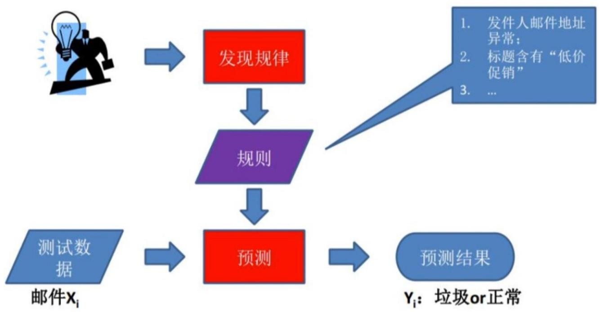

多一句没有，少一句不行，用更短时间，教会更实用的技术！

# 学习方式

有很多问题无法明确的写下规则，此时我们无法使用规则学习的方式来解决这一类问题，比如：图像和语音识别和自然语言处理

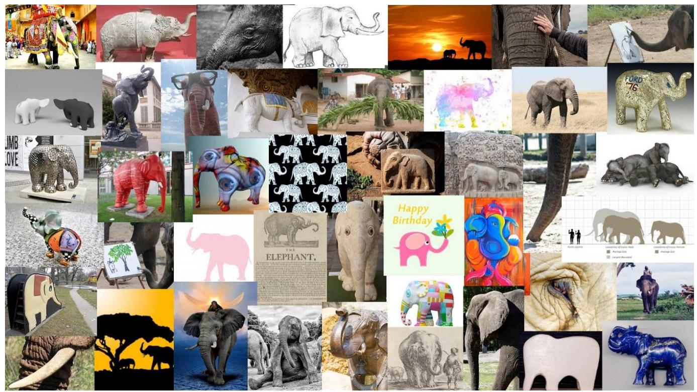

多一句没有，少一句不行，用更短时间，教会更实用的技术！

# 学习方式

基于模型的学习 : 从数据中自动学出规律

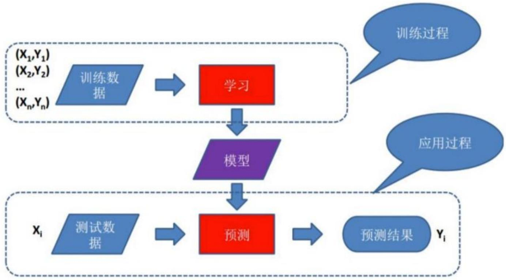

多一句没有，少一句不行，用更短时间，教会更实用的技术！

# 学习方式

基于模型的学习 : 房价预测应用入门

| 面积(m2) | 销售价钱(万元) |
| -------- | -------------- |
| 123      | 250            |
| 150      | 320            |
| 87       | 160            |
| 102      | 220            |
| ...      | ...            |

1 利用线性关系来模拟面积和房价之间的关系

eg：让直线尽可能多的经过这些点，不能经过的点分布直线两侧

2 机器学习模型

eg：直线记成y = ax + b 就是模型，其中 a、b 就是我们要训练的模型参数！

多一句没有，少一句不行，用更短时间，教会更实用的技术！

# 总结结

# 1 人工智能

. Artificial Intelligence(AI)：仿智使用计算机来模拟或者代替人类

# 2 机器学习

Machine Learning(ML) ：机器自动学习，不是人为规则编程

# 3 深度学习

• Deep Learning (DL) ：大脑仿生，设计一层一层的神经元模拟万事万物

# 4 AI、ML、DL三者之间的关系

机器学习是实现人工智能的一种途径

深度学习是机器学习的一种方法发展而来的

# 5 算法的学习方式有哪两种？

基于规则的学习

基于模型的学习

# 机器学 ／ 习

# 目录

人工智能三大概念人工智能（AI）、机器学习（ML）和深度学习（DL）

机器学习的应用领域和发展史

u 机器学习常用术语

样本、特征、标签、训练集和测试集

机器学习算法分类有监督学习、无监督学习、半监督、强化学习

机器学习建模流程

特征工程概念入门特征工程、特征工程子领域

模型拟合问题u 机器学习开发环境

# 目录

# Contents

1. 了解机器学习的应用领域

1. 了解人工智能的发展史

1. 能说出机器学习发展三要素

多一句没有，少一句不行，用更短时间，教会更实用的技术！

# 机器学习的应用领域

多一句没有，少一句不行，用更短时间，教会更实用的技术！

# 机器学习发展史

2023年：大模型技术突破,引发全球热潮

2024 年：AI 应用大规模落地,硬件与场景深度融合

2025年：开启智能体时代,AI自主性提升

# 大规模预训练模型2017-至今

大规模预训练模型

2017年，自然语言处理NLP的Transformer框架出现

2018年，Bert和GPT的出现

2022年，chatGPT的出现，进入到大模型AIGC发展的阶段

# 神经网络21世纪初期

神经网络、深度学习流派

•2012： AlexNet深度学习的开山之作,计算机视觉深度神经网络方法研究兴起

•2016：Google AlphaGO 战胜李世石（人工智能第三次浪潮）

# 统计主义20世纪80-2000

主要用统计模型解决问题

•1993：Vapnik提出SVM

•1997：IBM 深蓝战胜卡斯帕罗夫（人工智能第二次浪潮）

# 符号主义20世纪50-70

专家系统占主导

1950：图灵设计国际象棋程序

1956: 美国达特茅斯学院的约翰·麦卡锡、马文·闵斯基、克劳德·香农和纳撒尼尔·罗切斯特等人发起达特茅斯会议，首次提出了“人工智能”这一术语，并确立了研究目标和方向

1962：IBM Arthur Samuel 的跳棋程序战胜人类高手（人工智能第一次浪潮）

多一句没有，少一句不行，用更短时间，教会更实用的技术！

# AI发展三要素

• 数据、算法、算力三要素相互作用，是AI发展的基石

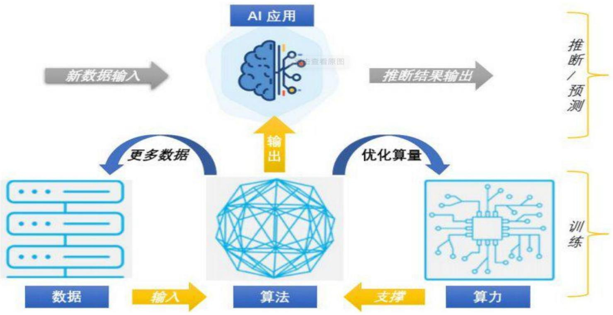

•CPU：主要适合I\O密集型的任务

•GPU：主要适合计算密集型任务

•TPU：专门针对大型网络训练而设计的一款处理器

# 总结

> 机器学习的应用领域
>
> 计算机视觉CV：对人看到的东西进行理解
>
> 自然语言处理：对人交流的东西进行理解
>
> 数据挖掘和数据分析：也属于人工智能的范畴

# 2 人工智能发展史

. 1956年:人工智能元年

.

. 2024 年：AI 应用大规模落地,硬件与场景深度融合

2025 年：开启智能体时代,AI 自主性提升

# 3 人工智能发展三要素

数据，算法，算力

CPU：主要适合I\O密集型的任务

GPU：主要适合计算密集型任务

• TPU：专门针对大型网络训练而设计的一款处理器

# 目录

# Contents

人工智能三大概念人工智能（AI）、机器学习（ML）和深度学习（DL）

机器学习的应用领域和发展史

机器学习常用术语样本、特征、标签、训练集和测试集

机器学习算法分类有监督学习、无监督学习、半监督、强化学习

机器学习建模流程建模流程、回归、分类、聚类API求解

特征工程概念入门特征工程、特征工程子领域

模型拟合问题u 机器学习开发环境

# 学习目标

# Learning Objectives

1. 知道样本是什么？

1. 知道特征是什么？

1. 知道标签/目标值是什么？

1. 理解数据集划分的方法

多一句没有，少一句不行，用更短时间，教会更实用的技术！

# 样本、特征、标签

黑马程序员同学就业薪资表

| 同学编号 | 培训学科 | 作业考试 | 学历   | 工作经验 | 工作地点 | 就业薪资 |
| -------- | -------- | -------- | ------ | -------- | -------- | -------- |
| 1        | java     | 90       | 本科   | 1        | 北京     | 14k      |
| 2        | java     | 80       | 本科   | 1        | 武汉     | 10k      |
| 3        | AI       | 90       | 本科   | 0        | 北京     | 15k      |
| 4        | AI       | 92       | 研究生 | 2        | 上海     | 25k      |
| 5        | 测试     | 95       | 本科   | 0        | 上海     | 11k      |
| 6        | 测试     | 80       | 专科   | 0        | 武汉     | 7k       |
| ...      |          |          |        |          |          |          |
| n        | AI       | 91       | 本科   | 1        | 上海     | ?        |

样本(sample) ：一行数据就是一个样本；多个样本组成数据集；有时一条样本被叫成一条记录

特征(feature) ：一列数据一个特征，有时也被称为属性

标签/目标(label/target) ：模型要预测的那一列数据。本场景是就业薪资

就业薪资 与 培训学科、作业考试、学历、工作经验、工作地点 5个特征有关系

特征如何理解（重点）：特征是从数据中抽取出来的，对结果预测有用的信息 eg:房价预测、车图片识别

多一句没有，少一句不行，用更短时间，教会更实用的技术！

# 数据集划分

黑马程序员同学就业薪资表

| 同学编号 | 培训学科 | 作业考试 | 学历   | 工作经验 | 工作地点 | 就业薪资 |
| -------- | -------- | -------- | ------ | -------- | -------- | -------- |
| 1        | java     | 90       | 本科   | 1        | 北京     | 14k      |
| 2        | java     | 80       | 本科   | 1        | 武汉     | 10k      |
| 3        | AI       | 90       | 本科   | 0        | 北京     | 15k      |
| 4        | AI       | 92       | 研究生 | 2        | 上海     | 25k      |
| 5        | 测试     | 95       | 本科   | 0        | 上海     | 11k      |
| 6        | 测试     | 80       | 专科   | 0        | 武汉     | 7k       |
| ...      |          |          |        |          |          |          |
| n        | AI       | 91       | 本科   | 1        | 上海     | ?        |

数据集可划分两部分：训练集、测试集 比例：8 : 2，7 : 3

训练集(training set) ：用来训练模型（model）的数据集

测试集(testing set)：用来测试模型的数据集

多一句没有，少一句不行，用更短时间，教会更实用的技术！

# 数据集划分

黑马程序员同学就业薪资表

| 同学编号 | 培训学科 | 作业考试 | 学历   | 工作经验 | 工作地点 | 就业薪资 |
| -------- | -------- | -------- | ------ | -------- | -------- | -------- |
| 1        | java     | 90       | 本科   | 1        | 北京     | 14k      |
| 2        | java     | 80       | 本科   | 1        | 武汉     | 10k      |
| 3        | AI       | 90       | 本科   | 0        | 北京     | 15k      |
| 4        | AI       | 92       | 研究生 | 2        | 上海     | 25k      |
| 5        | 测试     | 95       | 本科   | 0        | 上海     | 11k      |
| 6        | 测试     | 80       | 专科   | 0        | 武汉     | 7k       |
| ...      |          |          |        |          |          |          |
| n        | AI       | 91       | 本科   | 1        | 上海     | ?        |

x_train 训练集中的x的x

x_test 测试集中

y_train 训练集中的y y_test 测试集中的y

多一句没有，少一句不行，用更短时间，教会更实用的技术！

# 总结结

# 1 样本和数据集

? 样本(sample) ：一行数据就是一个样本

? 数据集dataset：多个样本组成数据集

# 2 特征

. 特征(feature) ：一列数据一个特征，有时也被称为属性

# 3 标签

标签/目标(label/target) ：模型要预测的那一列数据。

# 4 数据集划分

训练集用来训练模型、测试集用来测试评估模型 。

. 一般划分比例7:3 ~ 8:2

# 目录

# Contents

人工智能三大概念人工智能（AI）、机器学习（ML）和深度学习（DL）

机器学习的应用领域和发展史

u 机器学习常用术语

样本、特征、标签、训练集和测试集

机器学习算法分类有监督学习、无监督学习、半监督、强化学习

机器学习建模流程

u 特征工程概念入门特征工程、特征工程子领域

模型拟合问题u 机器学习开发环境

# 学习目标

# Learning Objectives

1. 知道有监督学习是什么？

1. 知道无监督学习是什么？

1. 知道半监督学习是什么？

1. 了解强化学习是什么？

1. 能掌握监督学习、无监督学习的数学表示

多一句没有，少一句不行，用更短时间，教会更实用的技术！

# 有监督学习 & 无监督学习

# 有监督学习

u 定义：输入数据是由输入特征值和目标值所组成，即输入的训练数据有标签的

数据集：需要标注数据的标签/目标值

| 序号 | 电影名称   | 搞笑镜头 | 拥抱镜头 | 打斗镜头 | 电影类型 |
| ---- | ---------- | -------- | -------- | -------- | -------- |
| 1    | 功夫熊猫   | 39       | 0        | 31       | 喜剧片   |
| 2    | 叶问3      | 3        | 2        | 65       | 动作片   |
| 3    | 二次曝光   | 2        | 3        | 55       | 爱情片   |
| 4    | 代理情人   | 9        | 38       | 2        | 爱情片   |
| 5    | 新步步惊心 | 8        | 34       | 17       | 爱情片   |
| 6    | 谍影重重   | 5        | 2        | 57       | 动作片   |
| 7    | 美人鱼     | 21       | 17       | 5        | 喜剧片   |
| 8    | 宝贝当家   | 45       | 2        | 9        | 喜剧片   |
| 9    | 唐人街探案 | 23       | 3        | 17       | ?        |

# 无监督学习

定义：输入数据没有被标记，即样本数据类别未知，没有标签，根据样本间的相似性，对样本集聚类，以发现

事物内部

结构及相互关系。

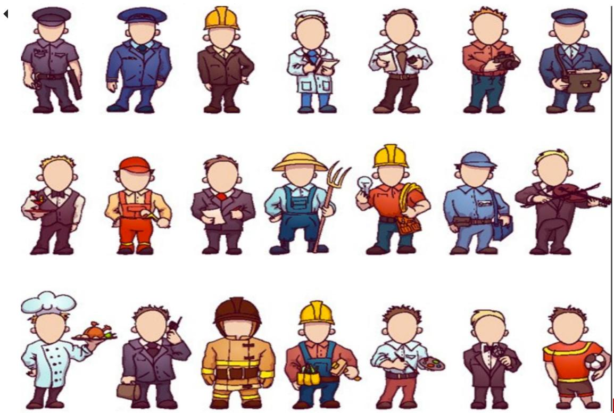

多一句没有，少一句不行，用更短时间，教会更实用的技术！

# 有监督分类问题 & 回归问题

# 分类问题

u 目标值（标签值）是不连续的

u 分类种类：二分类、多分类

| 同学编号 | 培训学科 | 作业考试 | 学历   | 工作经验 | 工作地点 | 就业薪资 |
| -------- | -------- | -------- | ------ | -------- | -------- | -------- |
| 1        | java     | 90       | 本科   | 1        | 北京     | 中       |
| 2        | java     | 80       | 本科   | 1        | 武汉     | 中       |
| 3        | AI       | 90       | 本科   | 0        | 北京     | 中       |
| 4        | AI       | 92       | 研究生 | 2        | 上海     | 高       |
| 5        | 测试     | 95       | 本科   | 0        | 上海     | 低       |
| 6        | 测试     | 80       | 专科   | 0        | 武汉     | 低       |
| ...      |          |          |        |          |          |          |
| n        | AI       | 91       | 本科   | 1        | 上海     | ?        |

# 回归问题

u 目标值（标签值）是连续的

|       | 房子面积 | 房子位置 | 房子楼层 | 房子朝向 | 房子价格 |
| ----- | -------- | -------- | -------- | -------- | -------- |
| 数据1 | 80       | 1        | 3        | 0        | 81       |
| 数据2 | 100      | 2        | 5        | 1        | 121      |
| 数据3 | 80       | 3        | 3        | 0        | 102      |
| ...   |          |          |          |          |          |
| 数据n | 90       | 2        | 4        | 1        | ?        |

多一句没有，少一句不行，用更短时间，教会更实用的技术！

# 无监督再举例

无监督学习特点： 1训练数据无标签

2 根据样本间的相似性对样本集进行聚类，发现事物内部结构及相互关系

多一句没有，少一句不行，用更短时间，教会更实用的技术！

# 半监督学习

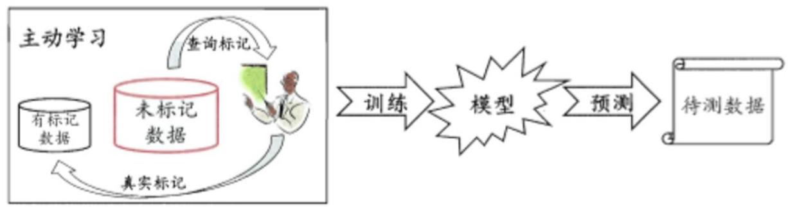

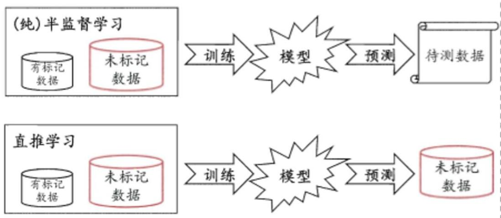

# 工作原理：

1 让专家标注少量数据，利用已经标记的数据（也就是带有类标签）训练出一个模型

2 再利用该模型去套用未标记的数据

3 通过询问领域专家分类结果与模型分类结果做对比

从而对模型做进一步改善和提高思考有什么好处？

半监督学习方式可大幅降低标记成本

多一句没有，少一句不行，用更短时间，教会更实用的技术！

# 机器学习算法分类 – 强化学习

1 强化学习（Reinforcement Learning）：机器学习的一个重要分支

2 应用场景：里程碑AlphaGo围棋、各类游戏、对抗比赛、无人驾驶场景

3 基本原理：通过构建四个要素：agent，环境状态，行动，奖励，agent根据环境状态进行行动获得最多的累计奖励。

多一句没有，少一句不行，用更短时间，教会更实用的技术！

# 机器学习算法分类 – 总结

多一句没有，少一句不行，用更短时间，教会更实用的技术！

# 总结结

|                                       | In                     | Out        | 目的               | 案例                  |
| ------------------------------------- | ---------------------- | ---------- | ------------------ | --------------------- |
| 监督学习 (supervised learning)        | 有标签                 | 有反馈     | 预测结果           | 猫狗分类 房价 预测    |
| 无监督学习 (unsupervised learning)    | 无标签                 | 无反馈     | 发现潜在结构       | “物以类聚，人 以群分” |
| 半监督学习 (Semi-Supervised Learning) | 部分有标签，部分无标签 | 有反馈     | 降低数据标记的难度 |                       |
| 强化学习 (reinforcement learning)     | 决策流程及激励系统     | 一系列行动 | 长期利益最大化     | 学下棋                |

多一句没有，少一句不行，用更短时间，教会更实用的技术！

机器学习算法可分为哪些类别？分别说一说各自的特点？

按照学习方式分类可分为: 监督学习, 无监督学习, 半监督学习, 强化学习

1 监督学习: 输入训练集数据包含输入特征值和目标值

回归: 函数的输出是一个连续的值

分类: 函数的输出是有限个离散值

2 无监督学习: 输入训练集数据是由输入特征值组成，没有目标值

比如：聚类根据样本间的相似性对样本集进行分类

3 半监督学习: 训练集同时包含有目标值的样本数据和不含有目标值的样本数据

4 强化学习: 智能体不断与环境进行交互，通过获取最大奖励的方式（试错的方式）来

获得最佳策略；主要包含四个元素：Agent(智能体)，环境(Environment)，行动(Action)，

奖励(reward)

# 目录

# Contents

u 人工智能三大概念人工智能（AI）、机器学习（ML）和深度学习（DL）

u 机器学习的应用领域和发展史

机器学习常用术语

样本、特征、标签、训练集和测试集

u 机器学习算法分类有监督学习、无监督学习、半监督、强化学习

机器学习建模流程

u 特征工程概念入门特征工程、特征工程子领域

模型拟合问题

机器学习开发环境

# 学习目标

# Learning Objectives

掌握机器学习建模流程

多一句没有，少一句不行，用更短时间，教会更实用的技术！

# 机器学习建模流程

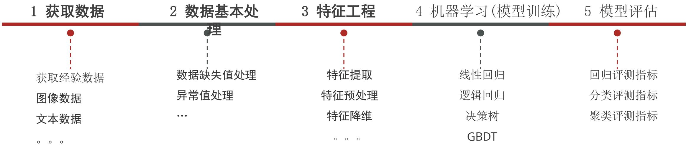

注：在整个建模流程中，数据基本处理、特征工程一般是耗时、耗精力最多的。

多一句没有，少一句不行，用更短时间，教会更实用的技术！

# 有监督学习模型训练和模型预测

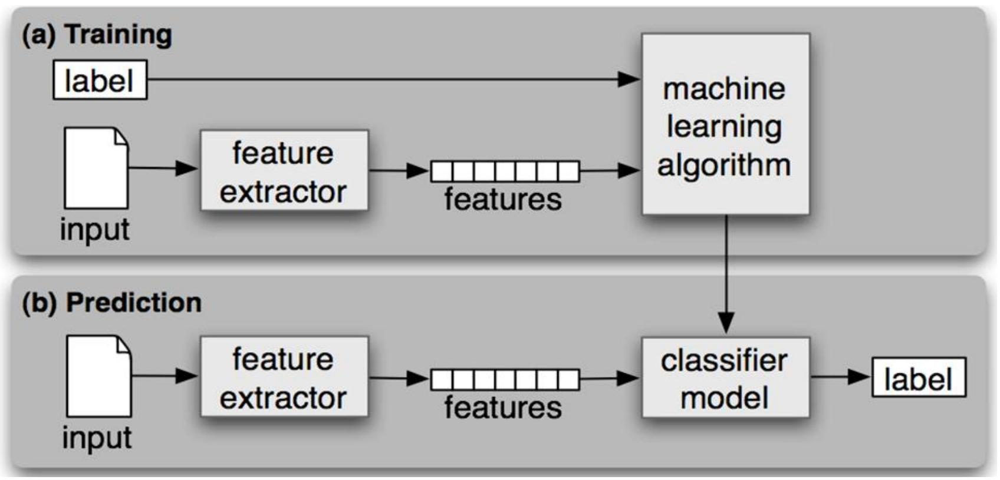

多一句没有，少一句不行，用更短时间，教会更实用的技术！

# 总结结

# 1 机器学习建模的一般步骤

• 获取数据：搜集与完成机器学习任务相关的数据集

. 数据基本处理：数据集中异常值,缺失值的处理等

. 特征工程：对数据特征进行提取、转成向量，让模型达到最好的效果

机器学习(模型训练)：选择合适的算法对模型进行训练

根据不同的任务来选中不同的算法；有监督学习,无监督学习,半监督学习,强化学习

. 模型评估：评估效果好上线服务,评估效果不好则重复上述步骤

# 目录

# Contents

人工智能三大概念人工智能（AI）、机器学习（ML）和深度学习（DL）

u 机器学习的应用领域和发展史

机器学习常用术语

样本、特征、标签、训练集和测试集

u 机器学习算法分类有监督学习、无监督学习、半监督、强化学习

机器学习建模流程

特征工程概念入门特征工程、特征工程子领域

模型拟合问题

机器学习环境

# 学习目标

# Learning Objectives

1. 知道特征工程是什么？

1. 理解特征提取的作用

1. 理解特征预处理的作用

1. 了解特征降维、特征选择、特征组合

多一句没有，少一句不行，用更短时间，教会更实用的技术！

# 特征工程概念入门

特征(feature)

房子面积

房子位置

房子楼层

房子朝向

房子价格

特征工程(FeatureEngineering)

• 利用专业背景知识和技巧处理数据，让机器学习算法效果最好。这个过程就是特征工程

Coming up with features is difficult, time-consuming, requires expert knowledge. “Applied machine learning” is basically feature engineering. ”

数据和特征决定了机器学习的上限，而模型和算法只是逼近这个上限而已

多一句没有，少一句不行，用更短时间，教会更实用的技术！

# 特征工程概念入门 – 涉及内容

1

特征提取

feature extraction

2

特征预处理

feature preprocessing

3

特征降维

Feature decomposition

4

特征选择

feature selection

5

特征组合

feature crosses

# 原始数据中提取与任务相关的特征，构成特征向量

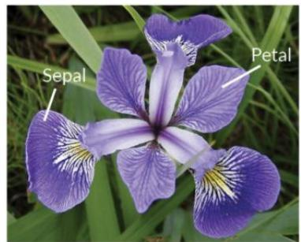

Iris Versicolor

Iris Setosa

Iris Virginica

https://cdn-mineru.openxlab.org.cn/result/2026-05-15/65e09efe-abe4-4f48-ad1c-238fc689e8da/28218fc825671837851b7db52ab29b7d66beca05900ef460fb59c8807747251f.jpg

Features

(attributes,measurements,dimensions)

多一句没有，少一句不行，用更短时间，教会更实用的技术！

# 特征工程概念入门 – 涉及内容

1

特征提取

feature extraction

2

特征预处理

feature preprocessing

特征对模型产生影响；因量纲问题，有些特征对模型影响大、有些影响小

3

特征降维

Feature decomposition

4

特征选择

feature selection

5

特征组合

feature crosses

特征1 特征2 特征3 特征4

| 90   | 2    | 10   | 40   |
| ---- | ---- | ---- | ---- |
| 60   | 4    | 15   | 45   |
| 75   | 3    | 13   | 46   |

特征1 特征2 特征3 特征4

| 1.   | 0.   | 0.   | 0.   |
| ---- | ---- | ---- | ---- |
| 0.   | 1.   | 1.   | 0.83 |
| 0.5  | 0.5  | 0.6  | 1.   |

多一句没有，少一句不行，用更短时间，教会更实用的技术！

# 特征工程概念入门 – 涉及内容

1

特征提取

feature extraction

2

特征预处理

feature preprocessing

3

特征降维

Feature decomposition

4

特征选择

feature selection

5

特征组合

feature crosses

3D

2D

将原始数据的维度降低，叫做特征降维，一般会对原始数据产生影响

多一句没有，少一句不行，用更短时间，教会更实用的技术！

# 特征工程概念入门 – 涉及内容

1

特征提取

feature extraction

2

特征预处理

feature preprocessing

3

特征降维

Feature decomposition

4

特征选择

feature selection

5

特征组合

feature crosses

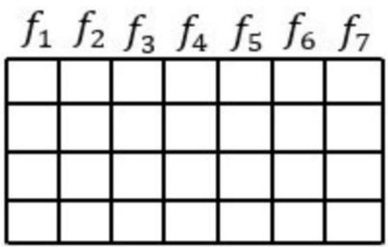

feature selection

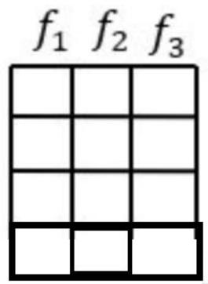

原始数据特征很多，与任务相关是其中一个特征集合子集，不会改变原数据

多一句没有，少一句不行，用更短时间，教会更实用的技术！

# 特征工程概念入门 – 涉及内容

1

特征提取

feature extraction

2

特征预处理

feature preprocessing

3

特征降维

Feature decomposition

4

特征选择

feature selection

5

特征组合

feature crosses

[AXB]：将两个特征的值相乘形成的特征组合。

[AxB×C×D×E]：将五个特征的值相乘形成的特征组合。

[AxA]：对单个特征的值求平方形成的特征组合。

把多个的特征合并成一个特征。利用乘法或加法来完成

多一句没有，少一句不行，用更短时间，教会更实用的技术！

# 特征工程概念入门 – 涉及内容

1 特征提取 从原始数据中提取与任务相关的特征feature extraction

2 特征预处理feature preprocessing . 特征对模型产生影响；因量纲问题，有些特征对模型影响大、有些影响小

3 特征降维Feature decomposition 将原始数据的维度降低，叫做特征降维

特征选择4 feature selection 原始数据特征很多，但是对模型训练相关是其中一个特征集合子集。

特征组合5 把多个的特征合并成一个特征。一般利用乘法或加法来完成feature crosses

多一句没有，少一句不行，用更短时间，教会更实用的技术！

# 总结结

# 1 特征工程 Feature Engineering

特征Feature：对任务有用的属性信息

• 特征工程：利用专业背景知识和技巧处理数据，让模型效果更好

# 2 特征工程的内容

特征提取 feature extraction ：特征向量

• 特征预处理 feature preprocessing：不同特征对模型影响一致性

• 特征降维 Feature decomposition：保证数据的主要信息要保留下来

• 特征选择 feature selection ：从特征中选择出一些重要特征训练模型

特征组合 feature crosses：把多个特征合并组合成一个特征

# 目录

# Contents

人工智能三大概念人工智能（AI）、机器学习（ML）和深度学习（DL）

u 机器学习的应用领域和发展史

机器学习常用术语样本、特征、标签、训练集和测试集

u 机器学习算法分类有监督学习、无监督学习、半监督、强化学习

机器学习建模流程

u 特征工程概念入门特征工程、特征工程子领域

模型拟合问题

u 机器学习开发环境

# 学习目标

# Learning Objectives

1. 知道拟合是什么？

1. 理解过拟合、欠拟合是什么？

1. 知道过拟合、欠拟合出现的原因

1. 理解泛化是什么？

多一句没有，少一句不行，用更短时间，教会更实用的技术！

# 拟合

• 拟合 fitting

用在机器学习领域，用来表示模型对样本点的拟合情况

• 欠拟合under-fitting

模型在训练集上表现很差、在测试集表现也很差

过拟合over-fitting

模型在训练集上表现很好、在测试集表现很差

多一句没有，少一句不行，用更短时间，教会更实用的技术！

# 拟合

机器学习天鹅特征

机器学到的特征

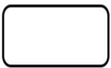

有翅膀

嘴巴长

机器识别天鹅

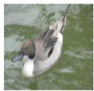

机器：是天鹅

机器：是天鹅

机器：是天鹅！

机器学习到的天鹅特征太少了，

导致区分标准太粗糙，不能准确识别出天鹅

机器学习天鹅特征

机器学到的特征

有翅膀

嘴巴长且弯曲

脖子长有曲度

体型像“2”

略比鸭子大

白色的

机器识别天鹅

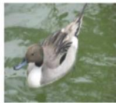

机器：

脖子短，体型小，不是天鹅

机器：

黑色的，不是天鹅！

机器已基本能区别天鹅和其他动物了

很不巧已有的天鹅图片全是白天鹅的。黑色的天鹅不能识别

多一句没有，少一句不行，用更短时间，教会更实用的技术！

模型表现效果 – 欠拟合欠拟合 – 从样本分布角度看

https://cdn-mineru.openxlab.org.cn/result/2026-05-15/65e09efe-abe4-4f48-ad1c-238fc689e8da/30c04165619393b08ac5a8dd97d4150c1ca5f50f68b103d273149ba7bdf55608.jpg

Underfitting

https://cdn-mineru.openxlab.org.cn/result/2026-05-15/65e09efe-abe4-4f48-ad1c-238fc689e8da/ad1abd3e21e57f0946eb06c37ec5031290543dd8c1bed39d302435a5a1443195.jpg

Just right!

https://cdn-mineru.openxlab.org.cn/result/2026-05-15/65e09efe-abe4-4f48-ad1c-238fc689e8da/2ea29b7789a1eab91cc85cd3a1f8e31075487e4c1381cbaedd825dcab3618d95.jpg

overfitting

欠拟合产生的原因：模型过于简单

过拟合产的原因：模型太过于复杂、数据不纯、训练数据太少

• 泛化 Generalization ：模型在新数据集（非训练数据）上的表现好坏的能力。

• 奥卡姆剃刀原则：给定两个具有相同泛化误差的模型，较简单的模型比较复杂的模型更可取

多一句没有，少一句不行，用更短时间，教会更实用的技术！

# 总结结

# 1 过拟合欠拟合？

拟合：用来表示模型对样本分布点的模拟情况

• 模型在训练集上表现很差、在测试集表现也很差，是欠拟合

模型在训练集上表现很好、在测试集表现很差，是过拟合

# 2 过拟合欠拟合产生的原因

欠拟合产生的原因：模型过于简单

过拟合产生的原因：模型太过于复杂、数据不纯、训练数据太少

# 3 泛化概念

• 泛化 Generalization ：具体的、个别的扩大为一般的能力

• 奥卡姆剃刀原则：给定两个具有相同泛化误差的模型，倾向选择较简单的模型

# 目录

# Contents

、 人工智能三大概念人工智能（AI）、机器学习（ML）和深度学习（DL）

机器学习的应用领域和发展史

u 机器学习常用术语

样本、特征、标签、训练集和测试集

u 机器学习算法分类有监督学习、无监督学习、半监督、强化学习

u 机器学习建模流程

特征工程概念入门特征工程、特征工程子领域

u 模型拟合问题

u 机器学习开发环境

多一句没有，少一句不行，用更短时间，教会更实用的技术！

# 基于Python的 scikit-learn 库

1. 简单高效的数据挖掘和数据分析工具

1. 可供大家使用，可在各种环境中重复使用

1. 建立在NumPy，SciPy和matplotlib上

1. 开源，可商业使用-获取BSD许可证

安装方法：

pip install scikit-learn

官网：

https://scikit-learn.org/stable/

多一句没有，少一句不行，用更短时间，教会更实用的技术！

# 基于Python的 scikit-learn 库

# Classification

Applications:Spam detection,imagerecognition

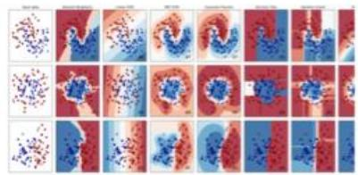

Examples

# Dimensionalityreduction

https://cdn-mineru.openxlab.org.cn/result/2026-05-15/65e09efe-abe4-4f48-ad1c-238fc689e8da/be4dcca607c9341d5779790e3815899564153d540414fa91d111c9e541122458.jpg

Examples

# Regression

Applications: Drug response,Stock prices.

https://cdn-mineru.openxlab.org.cn/result/2026-05-15/65e09efe-abe4-4f48-ad1c-238fc689e8da/fc9a3c5bc51c2891f0042f2048f45706a7259f38216a87477e51793b55d2fd58.jpg

Examples

# Model selection

Applications: Improved accuracy via parameter

https://cdn-mineru.openxlab.org.cn/result/2026-05-15/65e09efe-abe4-4f48-ad1c-238fc689e8da/1d85f61b9fa849aecdb375fcfb3435c162b7a1e5b3998f9f683ffe4796be5975.jpg

Examples

# Clustering

Applications:Customersegmentation,Grouping

Cenodsremarkedwithwhteross

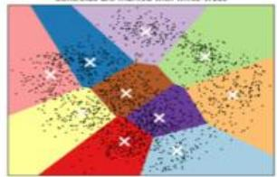

Examples

# Preprocessing

Applications:Transforming input data such as text

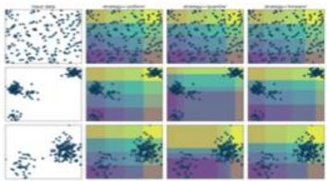

Examples

多一句没有，少一句不行，用更短时间，教会更实用的技术！

基于Python的 scikit-learn 库

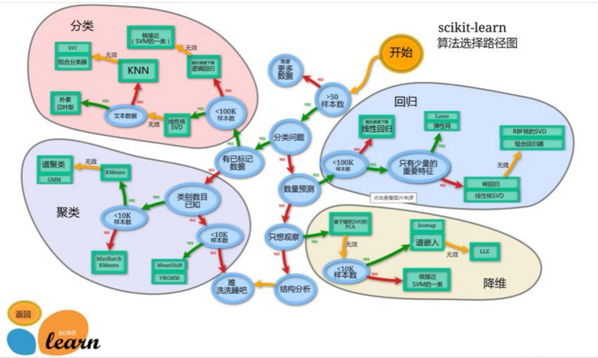

