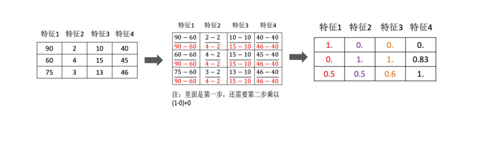
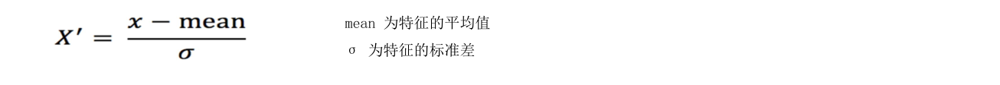

# KNN算法

目录

## KNN算法简介

> KNN思想、分类和回归问题处理流程

KNN算法API

> 介绍分类、回归实现

距离度量

> 常用距离计算方法

特征预处理

> 归一化、标准化

## 学习目标

1. 理解K近邻算法的思想

1. 知道K近邻算法分类流程

1. 知道K近邻算法回归流程

KNN

• K-近邻算法（K Nearest Neighbor，简称KNN）。比如：根据你的“邻居”来推断出你的类别


• KNN算法思想：如果一个样本在特征空间中的 k 个最相似的样本中的大多数属于某一个类别，则该样本也属于这个类别

思考：如何确定样本的相似性？

KNN算法

解决问题：分类问题、回归问题

• 算法思想：若一个样本在特征空间中的 k 个最相似的样本大多数属于某一个类别，则该样本也属于这个类别

相似性：欧氏距离

## 分类流程

1.计算未知样本到每一个训练样本的距离

2.将训练样本根据距离大小升序排列

3.取出距离最近的 K 个训练样本

4.进行多数表决，统计 K 个样本中哪个类别的样本个数最多

5.将未知的样本归属到出现次数最多的类别

## 回归流程

1.计算未知样本到每一个训练样本的距离

2.将训练样本根据距离大小升序排列

3.取出距离最近的 K 个训练样本

4.把这个 K 个样本的目标值计算其平均值

5.作为将未知的样本预测的值

多一句没有，少一句不行，用更短时间，教会更实用的技术！

总结

1 KNN概念 K Nearest Neighbor

> 一个样本最相似的 k 个样本中的大多数属于某一个类别，则该样本也属于这个类别

2 KNN分类流程

> 1.计算未知样本到每一个训练样本的距离
>
> 2.将训练样本根据距离大小升序排列
>
> 3.取出距离最近的 K 个训练样本
>
> 4.进行多数表决，统计 K 个样本中哪个类别的样本个数最多
>
> 5.将未知的样本归属到出现次数最多的类别

3 KNN回归流程

> 1.计算未知样本到每一个训练样本的距离
>
> 2.将训练样本根据距离大小升序排列
>
> 3.取出距离最近的 K 个训练样本
>
> 4.把这个 K 个样本的目标值计算其平均值
>
> 5.将未知的样本预测的值了

# 学习目标

1. 掌握KNN算法分类API

1. 掌握KNN算法回归API

## KNN算法API使用 - 分类问题

• KNN分类API

```
sklearn.neighbors.KNeighborsClassifier(n_neighbors=5)
n_neighbors: int, 可选（默认=5），k_neighbors查询默认使用的邻居数
from sklearn.neighbors import KNeighborsClassifier
def dm01_knnapi_分类():
    estimator = KNeighborsClassifier(n_neighbors=1)
    X = [[0], [1], [2], [3]]
    y = [0, 0, 1, 1]
    estimator.fit(X, y)
    myret = estimator.predict([[4]])
    print('myret-->', myret)
```

## KNN算法API使用 - 回归问题

KNN回归API：

sklearn.neighbors.KNeighborsRegressor(n_neighbors=5)

```
from sklearn.neighbors import KNeighborsRegressor
def dm02_knnapi_回归():
    estimator = KNeighborsRegressor(n_neighbors=2)
    X = [[0, 0, 1],
    [1, 1, 0],
    [3, 10, 10],
    [4, 11, 12]]
    y = [0.1, 0.2, 0.3, 0.4]
    estimator.fit(X, y)
    myret = estimator.predict([[3, 11, 10]])
    print('myret-->', myret)
```

# 学习目标

1. 掌握欧氏距离的计算方法

1. 掌握曼哈顿距离的计算方法

1. 了解切比雪夫距离的计算方法

1. 了解闵可夫斯基距离的计算方法

## 距离度量 distance measure 

- 常见距离公式

| 距离类型       | 核心思想              | 关键参数 | 对异常值敏感性 | 适用场景                   |
| -------------- | --------------------- | -------- | -------------- | -------------------------- |
| 欧氏距离       | 直线最短距离          | p=2      | 高             | 连续数值、低维空间(如KNN)  |
| 曼哈顿距离     | 各维度差异绝对值之和  | p=1      | 中             | 高维稀疏数据、离散特征     |
| 切比雪夫距离   | 仅关注最大维度差异    | p→∞      | 极高           | 极值主导场景(如路径规划)   |
| 闵可夫斯基距离 | 通过p灵活调整距离性质 | 任意p    | 依赖p          | 需平衡不同维度差异的通用场 |

距离度量 distance measure – 常见距离公式

$$ d _ {1 2} = \sqrt [ p ]{\sum_ {k = 1} ^ {n} \left| x _ {1 k} - x _ {2 k} \right| ^ {p}} $$

其中p是一个变参数：

当 p=1 时，就是曼哈顿距离；

当 p=2 时，就是欧氏距离；

当 p→∞ 时，就是切比雪夫距离

根据 p 的不同，闵氏距离可表示某一类种的距离

# 学习目标

特征预处理

> 1. 知道为什么进行归一化、标准化
>
> 1. 能应用归一化API处理数据
>
> 1. 能应用标准化API处理数据
>
> 1. 使用KNN算法进行鸢尾花分类

为什么做归一化和标准化 ?

特征的单位或者大小相差较大，或者某特征的方差相比其他的特征要大出几个数量级，容易影响（支配）目标结果，使得一些模型（算法）无法学习到其它的特征。

| 编号                                           | 身高m | 体重kg | 视力0.2-2.0 | 健康状况 |
| ---------------------------------------------- | ----- | ------ | ----------- | -------- |
| 1                                              | 1.70  | 67     | 1.5         | 1        |
| 2                                              | 1.71  | 80     | 0.8         | 2        |
| 3                                              | 1.75  | 70     | 1.5         | 1        |
| 4                                              | 1.76  | 68     | 1.2         | 1        |
| 5                                              | 1.80  | 80     | 1.8         | 1        |
| 6                                              | 1.81  | 90     | 0.6         | 2        |
| 男子身高体重视力与健康关系表 健康为1 不健康为2 |       |        |             |          |

## 特征预处理归一化

• 归一化：通过对原始数据进行变换把数据映射到【mi,mx】(默认为[0,1])之间

$$ X ^ {\prime} = \frac {x - m i n}{m a x - m i n} X ^ {\prime \prime} = X ^ {\prime} * (m x - m i) + m i $$



特征预处理

• 数据归一化：通过对原始数据进行变换把数据映射到【mi,mx】(默认为[0,1])之间

## 数据归一化API：

1.sklearn.preprocessing.MinMaxScaler (feature_range=(0,1)… )feature_range 缩放区间

2.fit_transform(X) 将特征进行归一化缩放

```python
import numpy as np
from sklearn.preprocessing import MinMaxScaler
def dm01_MinMaxScaler():
# 1. 准备数据
data = [[90, 2, 10, 40],
    [60, 4, 15, 45],
    [75, 3, 13, 46]]

# 2. 初始化归一化对象
transformer = MinMaxScaler()

# 3. 对原始特征进行变换
data = transformer.fit_transform(data)

# 4. 打印归一化后的结果
print(data)
```

特征预处理

• 数据标准化：通过对原始数据进行标准化，转换为均值为0标准差为1的标准正态分布的数据



## 数据标准化API：

1.sklearn.preprocessing. StandardScaler()

2.fit_transform(X) 将特征进行归一化缩放

```python
# 1. 准备数据

data = [[90, 2, 10, 40], [60, 4, 15, 45], [75, 3, 13, 46]]

# 2. 初始化标准化对象

transformer = StandardScaler()

# 3. 对原始特征进行变换

data = transformer.fit_transform(data)

# 4. 打印归一化后的结果

print(data)

# 5 打印每1列数据的均值和标准差

print('transfer.mean-->', transfer.mean_) print('transfer.var-->', transfer.var_)
```

特征预处理

数据归一化

- 如果出现异常点，影响了最大值和最小值，那么结果显然会发生改变

- 应用场景：最大值与最小值非常容易受异常点影响，鲁棒性较差，只适合传统精确小数据场景

- sklearn.preprocessing.MinMaxScaler (feature_range=(0,1)… )

数据标准化

-  如果出现异常点，由于具有一定数据量，少量的异常点对于平均值的影响并不大

- 应用场景：适合现代嘈杂大数据场景。(以后就是用你了）

- sklearn.preprocessing.StandardScaler( )


