# 线性回归

线性回归简介

> 定义、线性回归的分类、应用场景

线性回归问题的求解

> 线性回归API、损失函数、导数和矩阵、正规方程法、梯度下降算法

回归模型评估方法

> MAE、MSE、RMSE

线性回归API和梯度下降API

> 波斯顿案例

# 学习目标

1. 理解线性回归是什么？

1. 知道一元线性回归和多元线性回归的区别

1. 知道线性回归的应用场景

线性回归概念 – 举个栗子

• 假如有了以下身高和体重数据.假如已知播仔的身高，你能预测播仔体重吗？

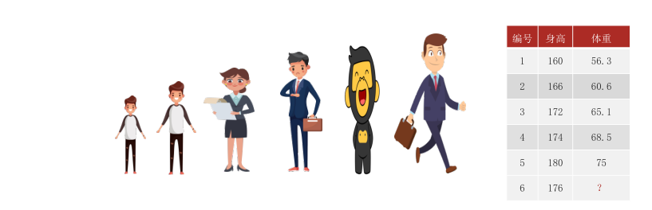

这样的问题是回归问题，该如何求解呢？

- 思路：先从已知身高X和体重Y中找规律，再预测

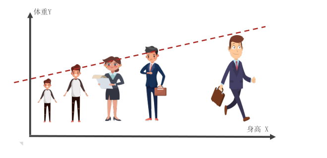

• 数学问题：用一条线来拟合身高和体重之间的关系，再对新数据进行预测

| 编号 | 身高 | 体重 |
| ---- | ---- | ---- |
| 1    | 160  | 56.3 |
| 2    | 166  | 60.6 |
| 3    | 172  | 65.1 |
| 4    | 174  | 68.5 |
| 5    | 180  | 75   |
| 6    | 176  | ?    |

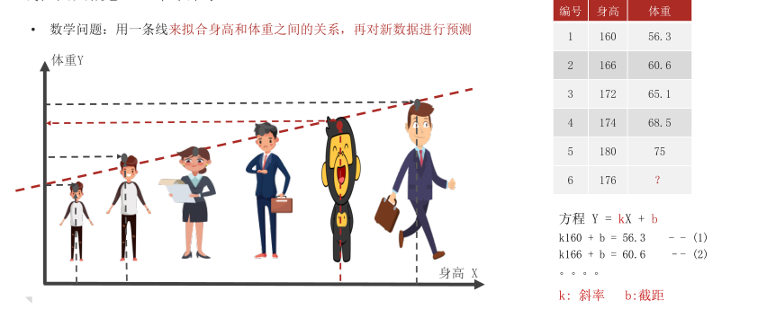

## 线性回归概念

- 定义

利用回归方程(函数) 对 一个或多个自变量(特征值)和因变量(目标值)之间 关系进行建模的一种分析方式。

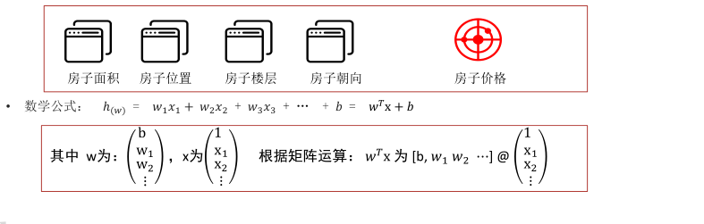

• 数学公式： $\begin{array} { r l r l } { h _ { ( w ) } = } & { { } w _ { 1 } x _ { 1 } + w _ { 2 } x _ { 2 } \ + \ w _ { 3 } x _ { 3 } \ + \ \cdots } & { + \ b = } & { { } w ^ { T } \mathrm { x } + b } \end{array}$

其中 w为： $\left( \begin{array} { c } { \mathsf { b } } \\ { \mathsf { w } _ { 1 } } \\ { \mathsf { w } _ { 2 } } \\ { \vdots } \end{array} \right)$ ，x为 $\left( \begin{array} { l } { 1 } \\ { \mathrm { x } _ { 1 } } \\ { \mathrm { x } _ { 2 } } \\ { \vdots } \end{array} \right)$ 根据矩阵运算： *w**T***X** 为 [b, $w _ { 1 } w _ { 2 } \cdots ] \circledast \left( \begin{array} { c } { { 1 } } \\ { { \mathrm { x } _ { 1 } } } \\ { { \mathrm { x } _ { 2 } } } \\ { { \vdots } } \end{array} \right)$ 

## 线性回归分类

一元线性回归：  y =  w x + b

. 目标值(因标量)只与一个特征(自变量)有关系

| 编号 | 身高 | 体重 |
| ---- | ---- | ---- |
| 1    | 160  | 56.3 |
| 2    | 166  | 60.6 |
| 3    | 172  | 65.1 |
| 4    | 174  | 68.5 |
| 5    | 180  | 75   |
| 6    | 176  | ?    |

• 多元线性回归： y = w1*x*1 + w2*x*2 + w3*x*3 + ⋯ + *b*

. 目标值(因标量)同时与多个特征(自变量)有关系

|       | 房子面积 | 房子位置 | 房子楼层 | 房子朝向 | 房子价格 |
| ----- | -------- | -------- | -------- | -------- | -------- |
| 数据1 | 80       | 1        | 3        | 0        | 81       |
| 数据2 | 100      | 2        | 5        | 1        | 121      |
| 数据3 | 80       | 3        | 3        | 0        | 102      |
| ...   |          |          |          |          |          |
| 数据n | 90       | 2        | 4        | 1        | ?        |

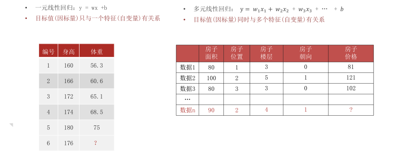

应用常见场景是非常多

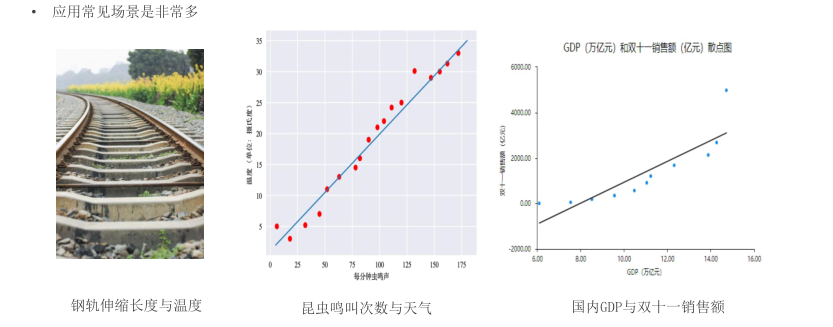

如何利用线性回归API来快速的解决实际问题呢？


总结

> # 1 线性回归概念
>
> • 利用 回归方程(函数) 对 一个或多个自变量(特征值)和因变量(目标值)之间 关系进行建模的一种分析方式。
>
> • 数学公式： $\begin{array} { r l r l r } { h _ { ( w ) } = } & { { } w _ { 1 } x _ { 1 } + \ w _ { 2 } x _ { 2 } \ + \ w _ { 3 } x _ { 3 } \ + \ \cdots } & { + \ b = } & { w ^ { T } \mathbf { x } + b } \end{array}$
>
> # 2 线性回归分类
>
> 一元线性回归、多元线性回归


# 学习目标

1. 知道线性回归API的使用

1. 知道损失函数是什么

案例

一元线性回归案例：根据播仔身高预测体重

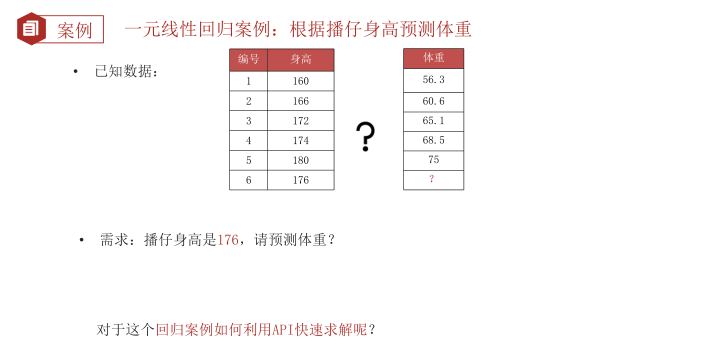

需求：播仔身高是176，请预测体重？

对于这个回归案例如何利用API快速求解呢？

## 线性回归API介绍

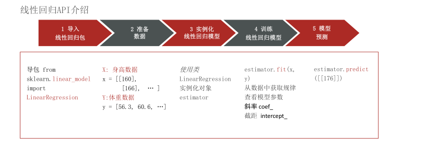

线性回归API介绍

```python
from sklearn.linear_model import LinearRegression

def dm01_lr预测播仔身高():
    # 1 准备数据身高和体重
    x = [[160], [166], [172], [174], [180]]
    y = [56.3, 60.6, 65.1, 68.5, 75]

    # 2 实例化 线性回归模型 estimator
    estimator = LinearRegression()
    # 3 训练 线性回归模型 fit() h(w) = w1x1 + w2x2 + b
    estimator.fit(x, y)

    # 4 打印 线性回归模型参数 coef_intercept_ print('estimator.coef_->', estimator.coef_)
    print('estimator.intercept_->', estimator.intercept_)
    # 5 模型预测 predict()
    myres = estimator.predict([[176]])
    print('myres-->', myres)
```

总结

> 线性回归API使用步骤:
>
> 导包:from sklearn.linear_model import LinearRegression
>
> 实例化模型: estimator = LinearRegression()
>
> 训练模型: estimator.fit(x_train, y_train)
>
> 模型预测: estimator.predict(x_test)

- 线性回归问题求解需要什么？

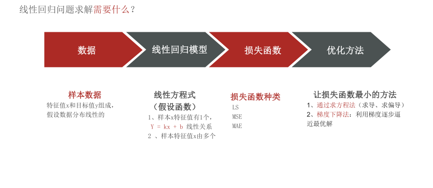

## 线性回归的求解方法

通过线性回归API可快速的找到拟合结果，那是怎么求解的呢？

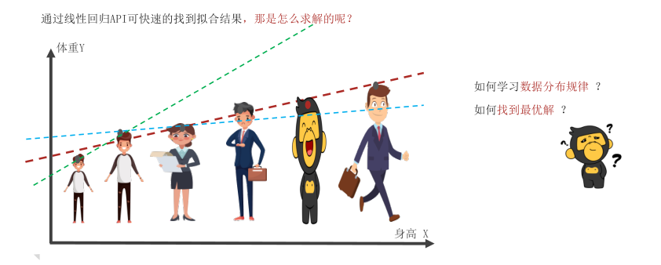

## 损失函数

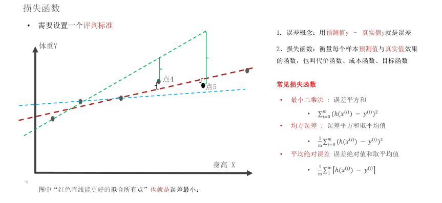

总结

> # 损失函数概念
>
> 误差：预测值 - 真实值的差值
>
> 损失函数：衡量预测值和真实值效果的函数，也叫代价函数、目标函数
>
> # 回归问题中的损失函数
>
> . 最小二乘法 : 误差平方和
>
> $$ \bullet \sum_ {i = 0} ^ {m} (h (x ^ {(i)}) - y ^ {(i)}) ^ {2} $$
>
> . 均方误差 : 误差平方和取平均值
>
> $$ \bullet \quad \frac {1}{\mathrm{m}} \sum_ {i = 0} ^ {m} (h (x ^ {(i)}) - y ^ {(i)}) ^ {2} $$
>
> 平均绝对误差 误差绝对值和取平均值
>
> $$ \bullet \quad \frac {1}{m} \sum_ {1} ^ {m} \left[ h (x ^ {(i)}) - y ^ {(i)} \right] $$


## 线性回归问题求解需要什么？

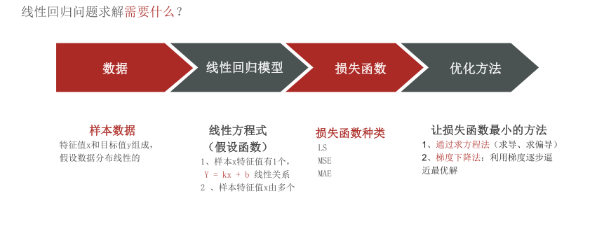

# 学习目标

> 1. 知道什么是导数
>
> 1. 知道什么是偏导
>
> 1. 知道向量和矩阵的简单运算

## 导数 – 基本概念

导数是微积分的核心概念，描述函数在某一点处的瞬时变化率

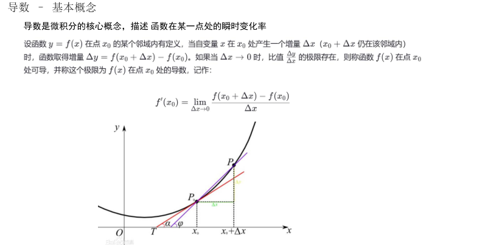

## 导数的几何意义

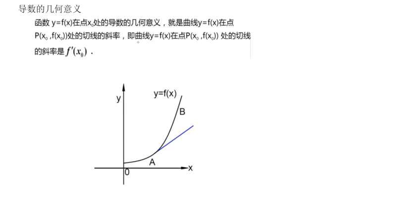

## 导数的入门案例

求函数 *f*(*x*) = *x*2 在x=2处的导数

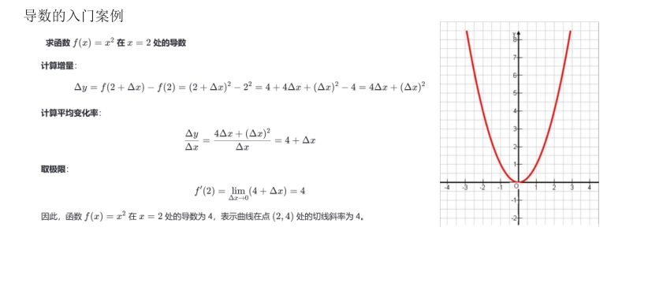

## 常见函数的导数

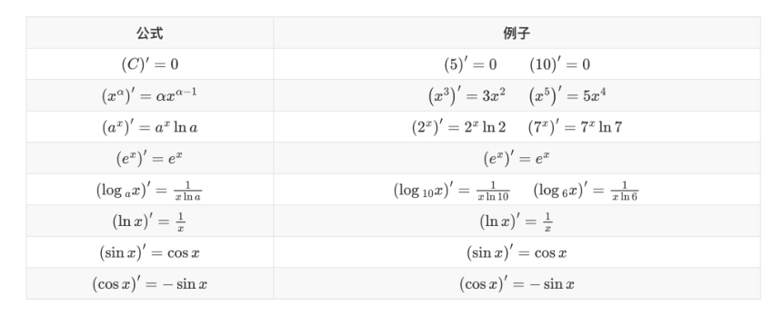

## 导数的四则运算

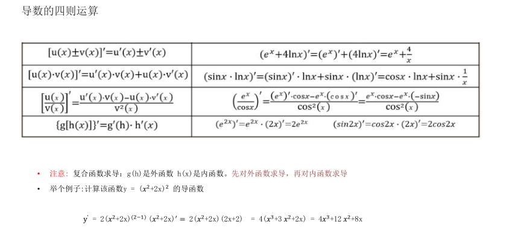

注意: 复合函数求导：g(h)是外函数 h(x)是内函数。先对外函数求导，再对内函数求导

举个例子:计算该函数 $\begin{array} { r } { \mathrm { ~ y ~ } = \ ( x ^ { 2 } + 2 \mathrm { x } ) ^ { 2 } } \end{array}$ 的导函数

## 导数求极值

导数为0的位置是函数的极值点

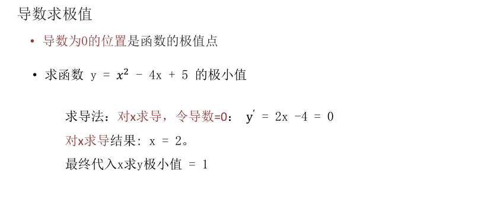

总结

> # 1 导数 Derivative
>
> 导数是微积分中的一个核心概念，它用于描述函数在某一点上的瞬时变化率
>
> # 2 导数的求解方法
>
> 常数、指数函数、幂指数、正弦余弦都有自己的导函数，会查表应用
>
> 特别注意复合函数求导：先对外函数求导，在对内函数求导
>
> # 3 利用导数求极值
>
> 导数为0的位置即为极值点

## 偏导数的定义

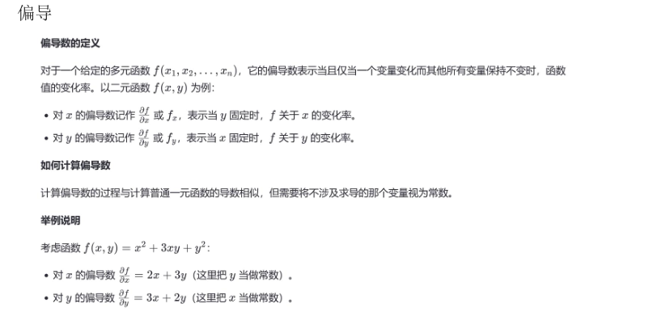

总结

> # 偏导数
>
> 偏导数是多元函数微积分中的一个基本概念，对于一个给定的多元函数f(x1,x2,…,xn)，它的偏导数表示当且仅当一个变量变化而其他所有变量保持不变时，函数值的变化率

## 基础数学 – 机器学习中常见的数据表述

宗旨：用到就学什么，不要盲目的展开、大篇幅学数学

• 标量scalar ：一个独立存在的数，只有大小没有方向

• 向量vector ：向量指一列顺序排列的元素。默认是列向量

矩阵matrix ：二维数组

张量Tensor ：数组，张量是基于向量和矩阵的推广

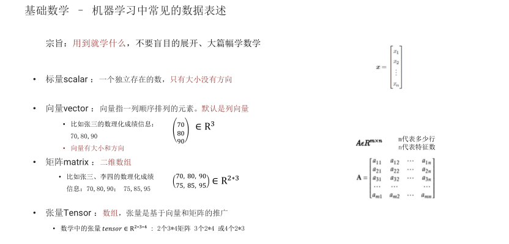

## 基础数学向量和矩阵 范数Norm

• 范数(norm)是数学中的一种基本概念，用于度量向量或者矩阵的大小或者长度

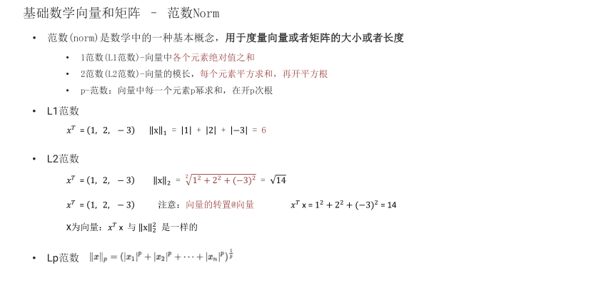

## 基础数学向量和矩阵 向量运算

向量是有大小和方向

几何意义上表示：向量(1,1), 向量（1,2）

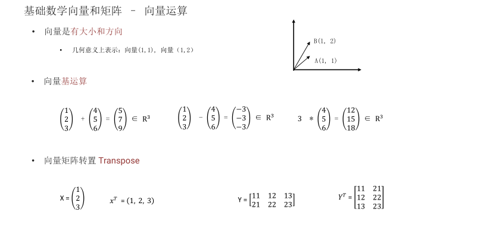

## 基础数学向量和矩阵 – 矩阵 Matrix 1

• 矩阵:是一个按照长方形排列的复数或实数集合，它由若干行和若干列组成。

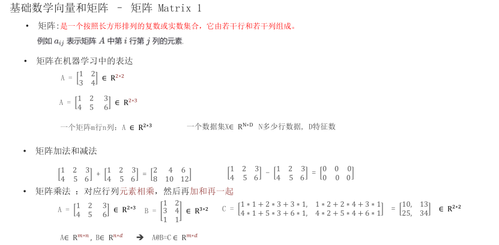

## 基础数学向量和矩阵 – 矩阵 Matrix 2

• 矩阵:是一个按照长方形排列的复数或实数集合，它由若干行和若干列组成。

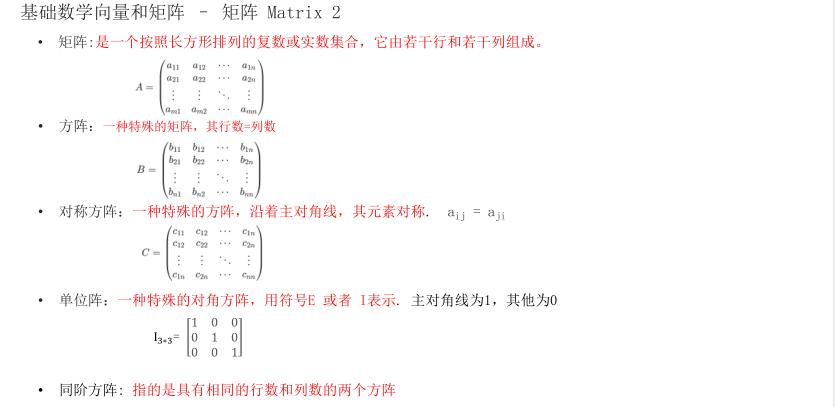

## 基础数学向量和矩阵 – 矩阵 Matrix 3

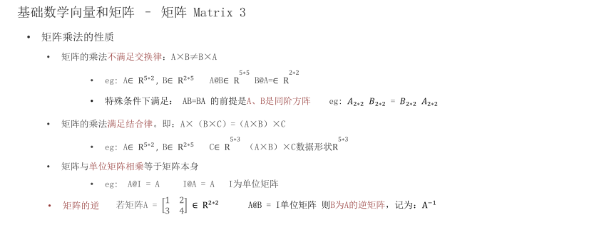

## 基础数学向量和矩阵 – 矩阵 Matrix 4

矩阵转置

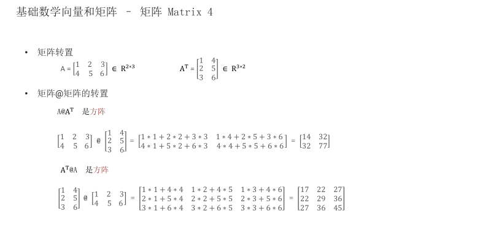

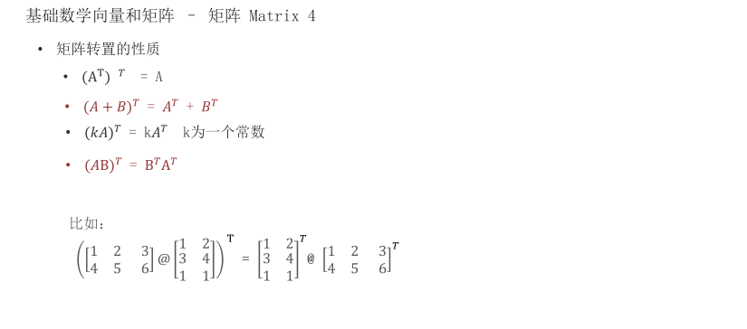

总结

> # 矩阵的概念
>
> 方阵
>
> 对称方阵
>
> 单位阵
>
> 同阶方阵
>
> 矩阵的逆
>
> # 矩阵的运算
>
> • 1 矩阵数学表示 X∈ RN * D
>
> 2 矩阵加减法：形状相同对应元素加减
>
> • 3 矩阵乘法：条件A∈ R*m* * *n* , B∈ R*n* * *d*  `A``@``B` `=` `C` `∈` ℝ`m` `*` `d`
>
> • 4 矩阵的乘法不满足交换律：A×B≠B×A ；矩阵的乘法满足结合律

## 线性回归问题求解需要什么？

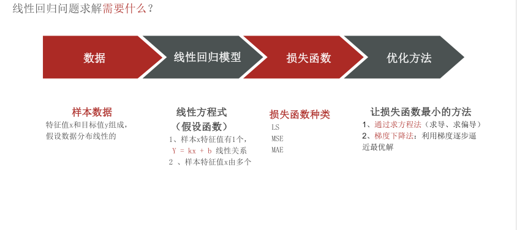

# 学习目标

## 知道正规方程法求解过程

## 多元线性回归 –正规方程法

正规方程法（NormalEquation）是求解线性回归问题的一种解析方法，它提供了一种直接计算模型参数的方法，而不需要迭代过程。这种方法基于最小化代价函数来找到最佳拟合直线的参数。

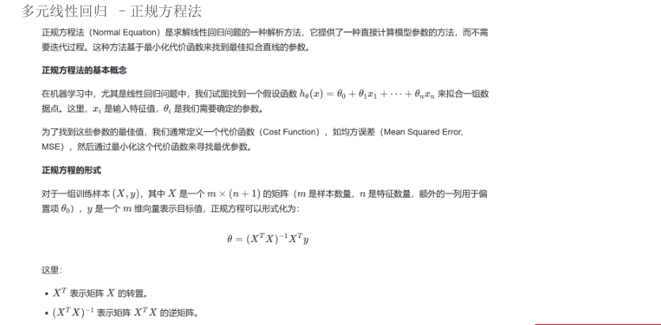

## 多元线性回归 –正规方程法

正规方程w公式的解释说明：

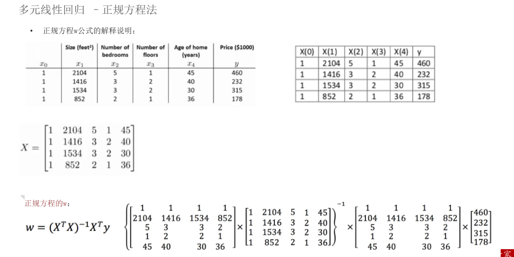

## 多元线性回归 –正规方程法

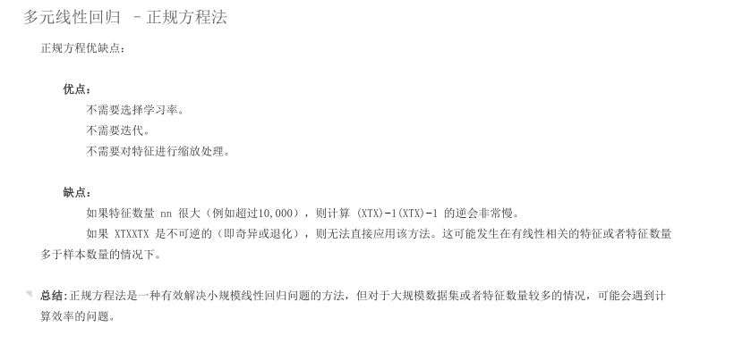

总结

> # 多元线性回归的正规方程
>
> 公式: $\begin{array} { r l } { \mathrm {  ~ w ~ } = } & { { } ( \mathrm { X } ^ { T } X ) ^ { - 1 } \mathrm { X } ^ { T } \mathrm { y } } \end{array}$
>
> 缺点:
>
> 计算量比较大
>
> 如果没有逆矩阵，方程无解

# 学习目标

> 1. 掌握梯度下降算法的思想
>
> 1. 知道梯度下降算法的分类
>
> 1. 知道正规方程和梯度下降算法的特点

## 梯度下降法 – 梯度下降和梯度

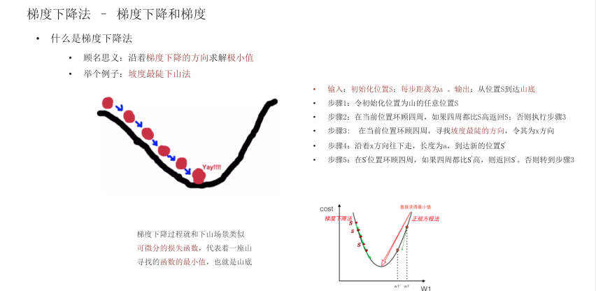

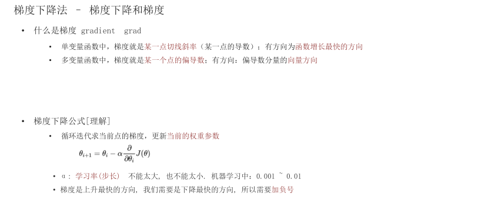

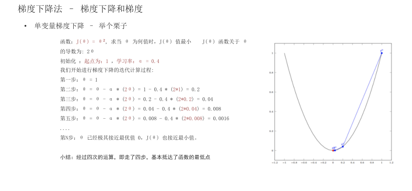

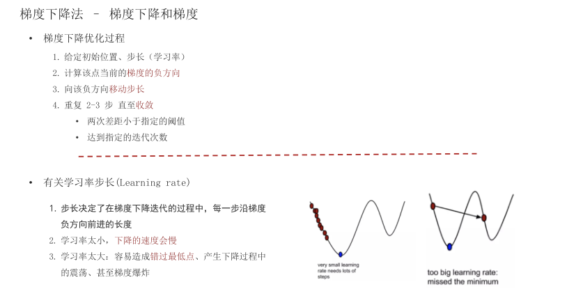

## 梯度下降法分类

- 全梯度下降算法 FGD

由于使用全部数据集，训练速度较慢

- 随机梯度下降算法 SGD

简单，高效，不稳定。SG每次只使用一个样本迭代，若遇上噪声则容易陷入局部最优解

- 小批量梯度下降算法 mini-batch

结合了 SG 的胆大和 FG 的心细，它的表现也正好居于 SG 和 FG 二者之间。

目前使用最多，正是因为它避开了 FG 运算效率低成本大和 SG 收敛效果不稳定的缺点

- 随机平均梯度下降算法 SAG

训练初期表现不佳，优化速度较慢。这是因为我们常将初始梯度设为0，而 SAG 每轮梯度更新都结合了上一轮梯度值。

目前使用较多的是：小批量梯度下降

总结

>  1 梯度概念
>
> 梯度：单变量函数就是导数；多变量函数就是偏导数
>
> 2 梯度下降法 下降法
>
> • 公式： $\theta _ { i + 1 } = \theta _ { i } - \alpha \frac { \partial } { \partial \theta _ { i } } J ( \theta )$
>
> w新 = w旧 - a * 梯度
>
> • (*w*1, *w*2, ⋯ *w**n*) = (*w*1, *w*2, ⋯ *wn*) − a * (梯度1，梯度2… 梯度n)
>
> 学习率 俗称步长
>
> • 学习率太小学的慢；学习率太大，梯度下降中抖动、震荡、易错过最优解
>
> 3. 梯度下降算法中常用的是哪个?
>
> 小批量梯度下降：随机选择小部分样本的梯度值更新权重

## 线性回归问题求解需要什么？

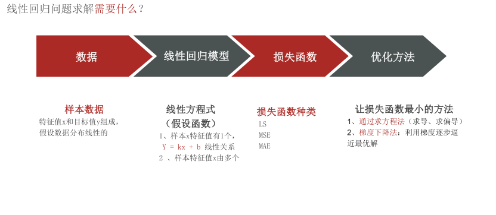

## 梯度下降法与正规方程对比

梯度下降

-  需要选择学习率

- 需要迭代求解

- 特征数量较大可以使用

- 应用场景：更加普适，迭代的计算方式，适合于嘈杂、大数据应用场景

- 注意：梯度下降在各种损失函数（目标函数）求解中大量使用。深度学习中更是如此，深度学习模型参数很轻松就上亿，只能通过迭代的方式求最优解。

正规方程

- 不需要学习率

- 一次运算得出，一蹴而就

- 应用场景：小数据量场景、精准的数据场景

- 缺点：计算量大、容易收到噪声、特征强相关性的影响

- 注意：X TX的逆矩阵不存在时，无法求解

- 注意：计算XTX的逆矩阵非常耗时

- 如果数据规律不是线性的，无法使用或效果不好

# 学习目标

> 1. 掌握常用的回归评估方法
>
> 1. 了解不同评估方法的特点

## 线性回归模型评估 – MAE、MSE、RMSE三种指标

为什么要进行线性回归模型的评估

- 我们希望衡量预测值和真实值之间的差距，

- 会用到MAE、MSE、RMSE多种测评函数进行评价

- 平均绝对误差 Mean Absolute Error MAE

$$ M A E = \frac {1}{n} \sum_ {i = 1} ^ {n} \left| y _ {i} - \hat {y} _ {i} \right| $$

n 为样本数量, y 为实际值, y为预测值

MAE 越小模型预测约准确

from sklearn.metrics import mean_absolute_error

mean_absolute_error(y_test,y_predict)


- 均方误差 Mean Squared Error MSE

$$ M S E = \frac {1}{n} \sum_ {i = 1} ^ {n} \left(y _ {i} - \hat {y} _ {i}\right) ^ {2} $$

n 为样本数量, y 为实际值, y为预测值

MSE 越小模型预测约准确

from sklearn.metrics import mean_squared_error

mean_squared_error(y_test,y_predict)


- 均方根误差 Root Mean Squared Error (RMSE)

$$ R M S E = \sqrt {\frac {1}{n} \sum_ {i = 1} ^ {n} \left(y _ {i} - \hat {y} _ {i}\right) ^ {2}} $$

n 为样本数量, y 为实际值, y为预测值

RMSE 越小模型预测约准确

RMSE是MSE的平方根，某些情况下比MSE更有用

总结

> 1 一般使用MAE 和 RMSE 这两个指标
>
> - MAE反应的是“真实”的平均误差，RMSE会将误差大的数据点放大
>
> - MAE 不能体现出误差大的数据点，RMSE放大大误差的数据点对指标的影响， 但是对异常数据比较敏感
>
> 2 综合结论
>
> - 都能反映出预测值和真实值之间的误差
>
> - MAE对误差大小不敏感
>
> - RMSE会放大预测误差较大的样本的影响
>
> - RMSE对异常数据敏感

## 线性回归正规方程API和梯度下降API

sklearn提供两种实现的API， 根据选择使用

1: sklearn.linear_model.LinearRegression(fit_intercept=True)

通过正规方程优化

参数：fit_intercept，是否计算偏置

属性：LinearRegression.coef_ （回归系数） LinearRegression.intercept_（偏置）

2: sklearn.linear_model.SGDRegressor(loss="squared_loss", fit_intercept=True, learning_rate ='constant', eta0=0.01)

• SGDRegressor类实现了随机梯度下降学习，它支持不同的损失函数和正则化惩罚项，来拟合线性回归模型。

参数

loss（损失函数类型） eg：loss=”squared_loss”

fit_intercept（是否计算偏置）

learning_rate （学习率策略）：string, optional ，可以配置学习率随着迭代次数不断减小

- 比如：学习率不断变小策略： ‘invscaling’: eta = eta0 / pow(t, power_t=0.25)eta0=0.01 （学习率的值）

- 属性

SGDRegressor.coef_ （回归系数）SGDRegressor.intercept_ （偏置）

## 波士顿房价预测

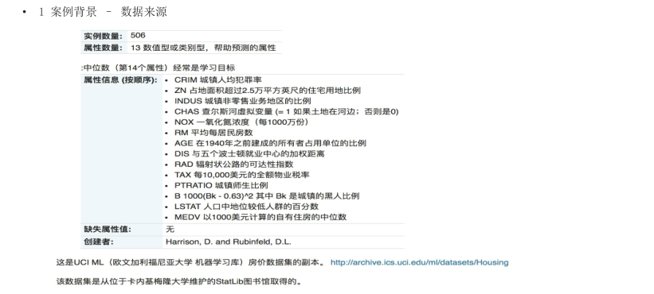

• 1 案例背景 – 数据来源

实例数量：506

属性数量：13数值型或类别型，帮助预测的属性

：中位数（第14个属性）经常是学习目标

属性信息（按顺序）：

·CRIM城镇人均犯罪率

·ZN占地面积超过2.5万平方英尺的住宅用地比例

·INDUS城镇非零售业务地区的比例

·CHAS查尔斯河虚拟变量(=1如果土地在河边；否则是0)

·NOX一氧化氮浓度（每1000万份）

·RM平均每居民房数

·AGE在1940年之前建成的所有者占用单位的比例

·DIS与五个波士顿就业中心的加权距离

·RAD辐射状公路的可达性指数

·TAX每10,000美元的全额物业税率

·PTRATIO城镇师生比例

·B1000(Bk-0.63)^2其中Bk是城镇的黑人比例

·LSTAT人口中地位较低人群的百分数

·MEDV以1000美元计算的自有住房的中位数

缺失属性值： 无

创建者： Harrison,D.and Rubinfeld,D.L.

这是UCI ML（欧文加利福尼亚大学机器学习库）房价数据集的副本。htp://archive.ics.uci.edu/ml/datasets/Housing

该数据集是从位于卡内基梅隆大学维护的StatLib图书馆取得的。

1 案例背景 - 数据属性

| 属性名  | 解释                                   | 类型                   |
| ------- | -------------------------------------- | ---------------------- |
| CRIM    | 该镇的人均犯罪率                       | 连续值                 |
| ZN      | 占地面积超过25,000平方呎的住宅用地比例 | 连续值                 |
| INDUS   | 非零售商业用地比例                     | 连续值                 |
| CHAS    | 是否邻近 Charles River                 | 离散值,1=邻近;0=不邻近 |
| NOX     | 一氧化氮浓度                           | 连续值                 |
| RM      | 每栋房屋的平均客房数                   | 连续值                 |
| AGE     | 1940年之前建成的自用单位比例           | 连续值                 |
| DIS     | 到波士顿5个就业中心的加权距离          | 连续值                 |
| RAD     | 到径向公路的可达性指数                 | 连续值                 |
| TAX     | 全值财产税率                           | 连续值                 |
| PTRATIO | 学生与教师的比例                       | 连续值                 |
| B       | 1000(BK - 0.63)^2,其中BK为黑人占比     | 连续值                 |
| LSTAT   | 低收入人群占比                         | 连续值                 |
| MEDV    | 同类房屋价格的中位数                   | 连续值                 |

多一句没有，少一句不行，用更短时间，教会更实用的技术！

- 2 案例分析

回归当中的数据大小不一致，是否会导致结果影响较大。所以需要做标准化处理。

数据分割与标准化处理

回归预测

线性回归的算法效果评估

- 3 回归性能评估

均方误差(Mean Squared Error)MSE)评价机制：

$$ M S E = \frac {1}{m} \sum_ {i = 1} ^ {m} \left(y ^ {i} - \bar {y}\right) ^ {2} $$

sklearn.metrics.mean_squared_error(y_true, y_pred)

均方误差回归损失

y_true:真实值

y_pred:预测值

return:浮点数结果

- 导入库

```python
from sklearn.datasets import load_boston    # 数据
from sklearn.preprocessing import StandardScaler    # 特征处理
from sklearn.model_selection import train_test_split    # 数据集划分
from sklearn.linear_model import LinearRegression    # 正规方程的回归模型
from sklearn.linear_model import SGDRegressor    # 梯度下降的回归模型
from sklearn.metrics import mean_squared_error    # 均方误差评估
from sklearn.linear_model import Ridge, RidgeCV
```

正规方程

```
正规方程
def linear_model1():
    # 1 获取数据
    data = load_boston()

    # 2 数据集划分
    x_train, x_test, y_train, y_test = train_test_split(data.data, data.target, random_state=22)

    # 3 特征工程-标准化
    transfer = StandardScaler()
    x_train = transfer.fit_transform(x_train)
    x_test = transfer.transform(x_test)

    # 4 机器学习-线性回归(正规方程)
    estimator = LinearRegression()
    estimator.fit(x_train, y_train)

    # 5 模型评估 # 获取模型系数
    y_predict = estimator.predict(x_test)
    print("预测值为:\n", y_predict)
    print("模型的权重系数为:\n", estimator.coef)
    print("模型的偏置为:\n", estimator.intercept)

    # 5.2 评价 均方误差
    error = mean_squared_error(y_test, y_predict)
    print("误差为:\n", error)
```

- 梯度下降

```python
def linear_model2():
    # 1. 获取数据
    data = load_boston()

    # 2. 数据集划分
    x_train, x_test, y_train, y_test = train_test_split(data.data, data.target, random_state=22)

    # 3. 特征工程-标准化
    transfer = StandardScaler()
    x_train = transfer.fit_transform(x_train)
    x_test = transfer.transform(x_test)

    # 4. 机器学习-线性回归(正规方程)
    estimator = SGDRegressor()
    # estimator = SGDRegressor(max_iter=1000, learning_rate="constant", eta0=0.001)
    estimator.fit(x_train, y_train)

    # 5. 模型评估#5.1 获取模型参数
    y_predict = estimator.predict(x_test)
    print("预测值为:\n", y_predict)
    print("模型的权重系数为:\n", estimator.coef_)
    print("模型的偏置为:\n", estimator.intercept_^)

    # 5.2 评价 均方误差
    error = mean_squared_error(y_test, y_predict)
    print("误差为:\n", error)
```

总结

> 1 正规方程
>
> sklearn.linear_model.LinearRegression()
>
> 2 梯度下降
>
> sklearn.linear_model.SGDRegressor(）

