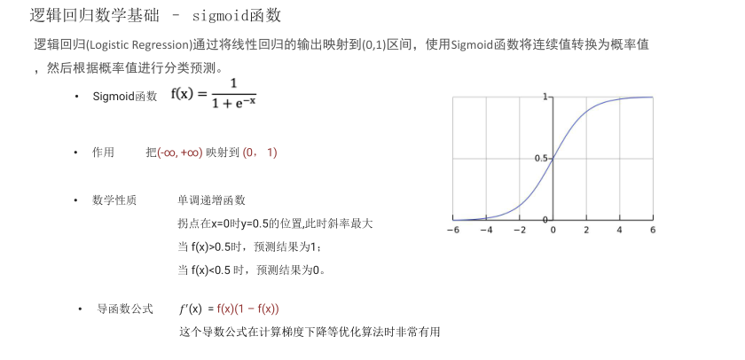
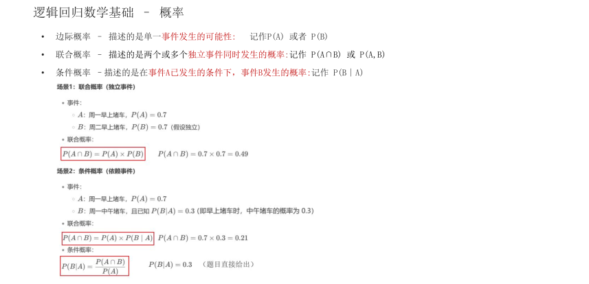
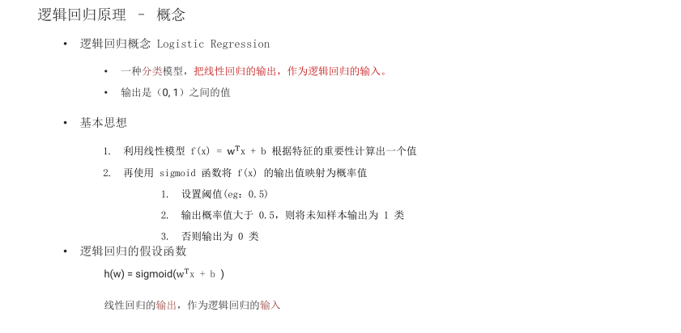
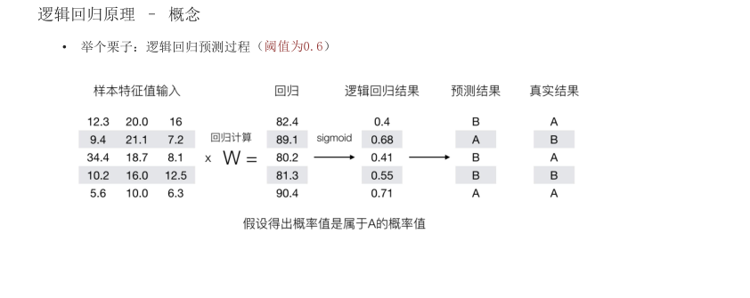
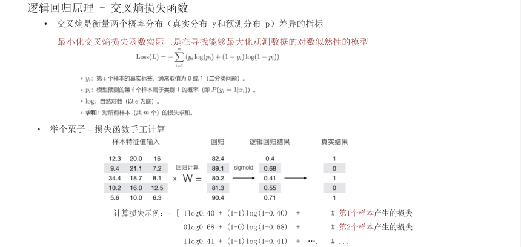
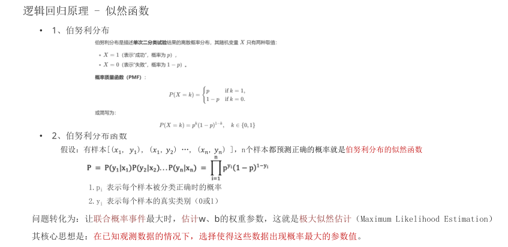
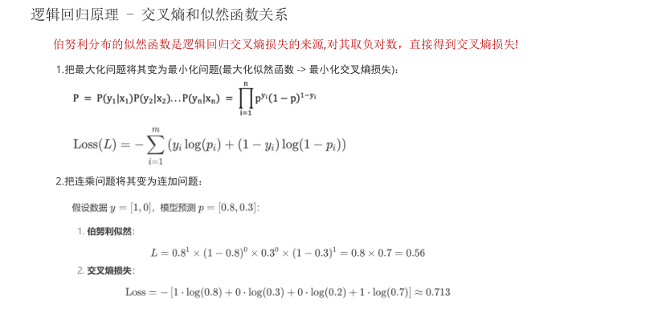
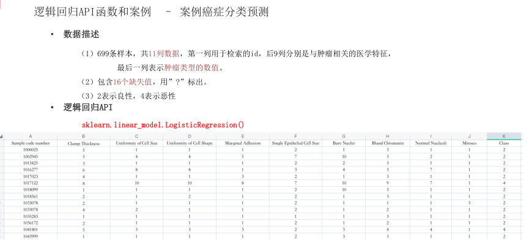

# 逻辑回归

> 逻辑回归简介应用场景，数学知识
>
> 逻辑回归原理
>
> 逻辑回归API函数和案例

# 学习目标

> 1. 知道逻辑回归的应用场景
>
> 1. 复习逻辑回归应用到的数学知识

## 逻辑回归的应用场景


逻辑回归是解决二分类问题的利器，你还能想到哪些二分类的场景？


## 逻辑回归数学基础 – sigmoid函数

逻辑回归(Logistic Regression)通过将线性回归的输出映射到(0,1)区间，使用Sigmoid函数将连续值转换为概率值，然后根据概率值进行分类预测。

Sigmoid函数 ${ \bf f } ( { \bf x } ) = \frac { 1 } { 1 + { \bf e } ^ { - { \bf x } } }$

作用 把(-∞, +∞) 映射到 (0， 1)



## 逻辑回归数学基础 – 概率

边际概率 – 描述的是单一事件发生的可能性: 记作P(A) 或者 P(B)

• 联合概率 – 描述的是两个或多个独立事件同时发生的概率:记作 P(A∩B) 或 P(A,B)

• 条件概率 –描述的是在事件A已发生的条件下，事件B发生的概率:记作 P(B∣A)



总结

> 1 逻辑回归的作用？
>
> 解决二分类问题
>
> 2 激活函数 sigmoid 作用？
>
> 把数值映射到(0，1）区间,进行分类预测
>
> 3 极大似然估计
>
> 通过极大化概率事件，来估计最优参数

# 学习目标

> 1. 理解逻辑回归算法的原理
>
> 1. 知道逻辑回归的优化操作

## 逻辑回归原理 – 概念

逻辑回归概念 Logistic Regression

一种分类模型，把线性回归的输出，作为逻辑回归的输入。

输出是（0, 1）之间的值



## 逻辑回归原理 – 概念

举个栗子：逻辑回归预测过程（阈值为0.6）



## 逻辑回归原理 - 交叉熵损失函数

• 交叉熵是衡量两个概率分布（真实分布 y和预测分布 p）差异的指标

最小化交叉熵损失函数实际上是在寻找能够最大化观测数据的对数似然性的模型



## 逻辑回归原理 - 似然函数

1、伯努利分布

伯努利分布是描述单次二分类试验结果的离散概率分布，其随机变量X只有两种取值：

·X=1（表示"成功"，概率为p），

·X=0（表示“失败”，概率为1-p）。



## 逻辑回归原理 - 交叉熵和似然函数关系

伯努利分布的似然函数是逻辑回归交叉熵损失的来源,对其取负对数，直接得到交叉熵损失!



总结

> # 1 逻辑回归核心思想
>
> 思想：解决分类问题，把线性回归的输出作为逻辑回归的输入
>
> # 2 逻辑回归的优化操作
>
> - 极大化似然函数
>
> - 最小化交叉熵损失

# 学习目标

> 1. 知道逻辑回归的API
>
> 1. 动手实现癌症分类案例

## 逻辑回归API函数和案例 – 案例癌症分类预测



数据描述

（1）699条样本，共11列数据，第一列用于检索的id，后9列分别是与肿瘤相关的医学特征，最后一列表示肿瘤类型的数值。

（2）包含16个缺失值，用”?”标出。

（3）2表示良性，4表示恶性

逻辑回归API

sklearn.linear_model.LogisticRegression()

代码实现

```python
def dm_LogisticRegression():
    # 1 获取数据
    data = pd.read_csv('./data/breast-cancer-wisconsin.csv')
    data.info()
    # 2 基本数据处理
    # 2.1 缺失值处理
    data = data.replace(to_replace="?", value=np.NaN)
    data = data.dropna()
    # 2.2 确定特征值,目标值
    x = data.iloc[:, 1:-1]
    print('x.head()->\n', x.head())
    y = data["Class"]
    print('y.head()->\n', y.head())
    # 2.3 分割数据
    x_train, x_test, y_train, y_test = train_test_split(x, y, random_state=22)

    # 3 特征工程(标准化)
    transfer = StandardScaler()
    x_train = transfer.fit_transform(x_train)
    x_test = transfer.transform(x_test)
    # 4 机器学习(逻辑回归)
    estimator = LogisticRegression()
    estimator.fit(x_train, y_train)
    # 5 模型评估
    y_predict = estimator.predict(x_test)
    print('y_predict-->', y_predict)
    accuracy = estimator.score(x_test, y_test)
    print('accuracy-->', accuracy)
```

