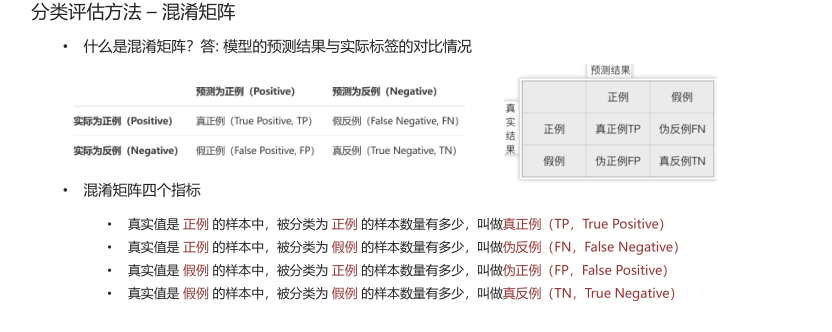
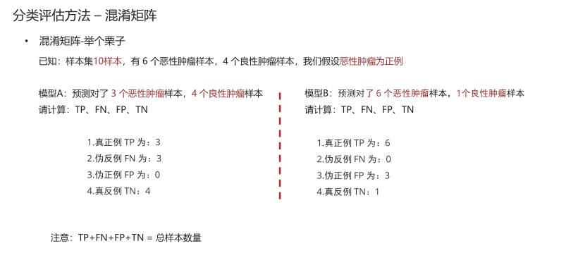
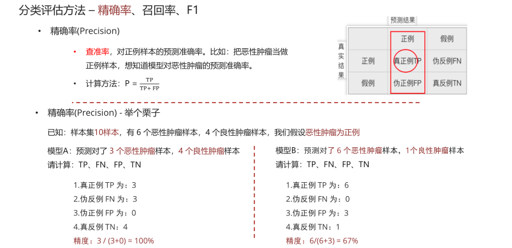
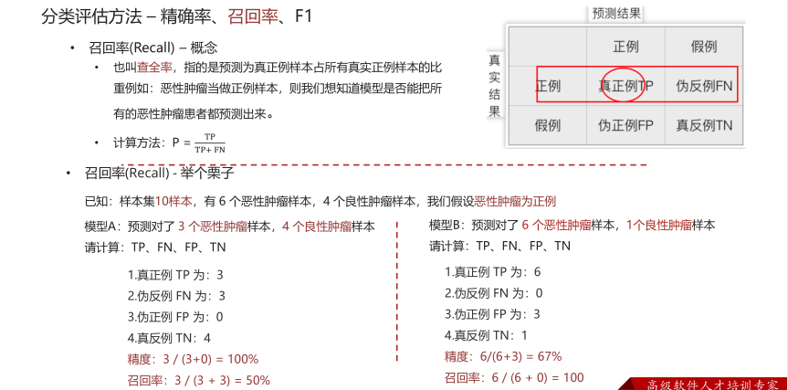
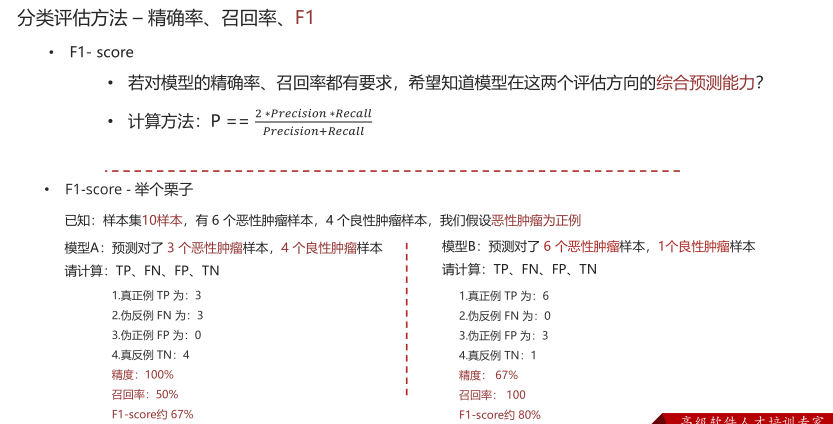

# 混淆矩阵

# 学习目标

> 1. 理解混淆矩阵的构建方法
>
> 1. 掌握精确率，召回率和F1score的计算方法

- 思考

1. 只做预测准确率能满足各种场景需要吗？

1. 比如之前我们做的癌症检测的案例

​	癌症患者有没有被全部预测（检测）出来?

## 分类评估方法 – 混淆矩阵

• 什么是混淆矩阵？答: 模型的预测结果与实际标签的对比情况



混淆矩阵四个指标

• 真实值是 正例 的样本中，被分类为 正例 的样本数量有多少，叫做真正例（TP，True Positive）

• 真实值是 正例 的样本中，被分类为 假例 的样本数量有多少，叫做伪反例（FN，False Negative）

• 真实值是 假例 的样本中，被分类为 正例 的样本数量有多少，叫做伪正例（FP，False Positive）

• 真实值是 假例 的样本中，被分类为 假例 的样本数量有多少，叫做真反例（TN，True Negative）

- 混淆矩阵-举个栗子

已知：样本集10样本，有 6 个恶性肿瘤样本，4 个良性肿瘤样本，我们假设恶性肿瘤为正例



- 混淆矩阵 - 举个栗子

```python
from sklearn.metrics import confusion_matrix
import pandas as pd

def dm01_混淆矩阵四个指标():
    # 样本集中共有6个恶性肿瘤样本, 4个良性肿瘤样本
    y_true = ["恶性", "恶性", "恶性", "恶性", "恶性", "恶性", "良性", "良性", "良性"]
    labels = ["恶性", "良性"]
    dataframe_labels = ["恶性(正例)", "良性(反例)"]
# 1. 模型A: 预测对了3个恶性肿瘤样本, 4个良性肿瘤样本
print("模型A:")
print("-" * 13)
y_pred1 = ["恶性", "恶性", "恶性", "良性", "良性", "良性", "良性", "良性", "良性"]
result = confusion_matrix(y_true, y_pred, 1 labels=labels)
print(pd.DataFrame(result, columns=dataframe_labels, index=dataframe_labels))
# 2. 模型B: 预测对了6个恶性肿瘤样本, 1个良性肿瘤样本
print("模型B:")
print("-" * 13)
y_pred2 = ["恶性", "恶性", "恶性", "恶性", "恶性", "恶性", "恶性", "恶性", "良性"]
result = confusion_matrix(y_true, y_pred2, labels=labels)
print(pd.DataFrame(result, columns=dataframe_labels, index=dataframe_labels))
```

## 分类评估方法 – 精确率、召回率、F1

精确率(Precision)

• 查准率，对正例样本的预测准确率。比如：把恶性肿瘤当做正例样本，想知道模型对恶性肿瘤的预测准确率。

计算方法： ${ \mathsf { P } } = { \frac { \mathrm { T P } } { \mathrm { T P } + \mathrm { F P } } }$​



- 精确率(Precision) - 举个栗子

```python
from sklearn.metrics import accuracy_score
from sklearn.metrics import precision_score 
def dm01_精度Precision():
# 样本集中共有6个恶性肿瘤样本, 4个良性肿瘤样本
y_true = ["恶性", "恶性", "恶性", "恶性", "恶性", "良性", "良性", "良性", "良性"]
# 1. 模型A: 预测对了3个恶性肿瘤样本, 4个良性肿瘤样本
y_pred1 = ["恶性", "恶性", "恶性", "良性", "良性", "良性", "良性", "良性"]
result = precision_score(y_true, y_pred1, pos_label="恶性")
print("模型A精度:", result)
# 2. 模型 B: 预测对了6个恶性肿瘤样本, 1个良性肿瘤样本
y_pred2 = ["恶性", "恶性", "恶性", "恶性", "恶性", "恶性", "恶性", "恶性", "良性"]
result = precision_score(y_true, y_pred2, pos_label="恶性")
print("模型B精度:", result)
```

## 分类评估方法 – 精确率、召回率、F1

召回率(Recall) – 概念

• 也叫查全率，指的是预测为真正例样本占所有真实正例样本的比重例如：恶性肿瘤当做正例样本，则我们想知道模型是否能把所有的恶性肿瘤患者都预测出来。

计算方法： $\mathsf { P } = \frac { \mathsf { T P } } { \mathsf { T P } + \mathsf { F N } }$​



- F1- score - 举个栗子

```python
from sklearn.metrics import recall_score
def dm02_召回率recall():
    # 样本集中共有6个恶性肿瘤样本, 4个良性肿瘤样本
    y_true = ["恶性", "恶性", "恶性", "恶性", "恶性", "良性", "良性", "良性"]
# 1. 模型A: 预测对了3个恶性肿瘤样本, 4个良性肿瘤样本
    y_pred1 = ["恶性", "恶性", "恶性", "良性", "良性", "良性", "良性", "良性",
    result = recall_score(y_true, y_pred1, pos_label="恶性")
    print("模型A召回率:", result)

# 2. 模型B: 预测对了6个恶性肿瘤样本, 1个良性肿瘤样本
    y_pred2 = ["恶性", "恶性", "恶性", "恶性", "恶性", "恶性", "恶性", "良性"]
result = recall_score(y_true, y_pred2, pos_label="恶性")
print("模型B召回率:", result)
```

• F1- score

• 若对模型的精确率、召回率都有要求，希望知道模型在这两个评估方向的综合预测能力？

计算方法： $\begin{array} { r } { \mathsf { P } = = \frac { 2 * P r e c i s i o n * R e c a l l } { P r e c i s i o n + R e c a l l } } \end{array}$



- F1- score - 举个栗子 – 程序计算

```python
from sklearn.metrics import f1_score
def dm03_F1():
    # 样本集中共有6个恶性肿瘤样本, 4个良性肿瘤样本
    y_true = ["恶性", "恶性", "恶性", "恶性", "恶性", "恶性", "良性", "良性", "良性"]
# 1. 模型A: 预测对了3个恶性肿瘤样本, 4个良性肿瘤样本
y_pred = ["恶性", "恶性", "恶性", "良性", "良性", "良性", "良性", "良性"]
result = f1_score(y_true, y_pred, pos_label="恶性")
print("模型Af1-score:", result)

# 2. 模型B: 预测对了6个恶性肿瘤样本, 1个良性肿瘤样本
y_pred = ["恶性", "恶性", "恶性", "恶性", "恶性", "恶性", "恶性", "良性"]
result = f1_score(y_true, y_pred, pos_label="恶性")
print("模型Bf1-score:", result)
```

总结

1、 混淆矩阵的四个指标

预测结果

|      | 正例     | 假例     |
| ---- | -------- | -------- |
| 正例 | 真正例TP | 伪反例FN |
| 假例 | 伪正例FP | 真反例TN |

3 精确率Precision，也叫查准率,精度
$$
{ \mathsf { P } } = { \frac { { \mathrm { T P } } } { { \mathrm { T P } } + { \mathrm { F P } } } }P
$$
4 召回率Recall，也叫查全率 
$$
\mathsf { P } = \frac { \mathsf { T P } } { \mathsf { T P } + \mathsf { F N } }
$$
5 F1 score,综合精确率、召回率 
$$
\begin{array} { r } { \mathsf { P } = \frac { 2 * P r e c i s i o n * R e c a l l } { P r e c i s i o n + R e c a l l } } \end{array}
$$

$$

$$
