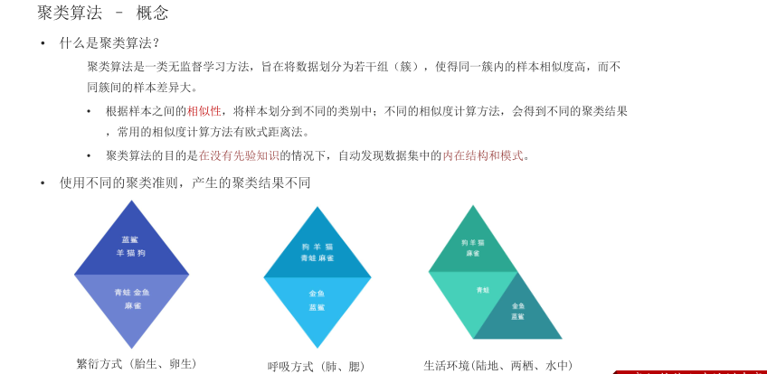
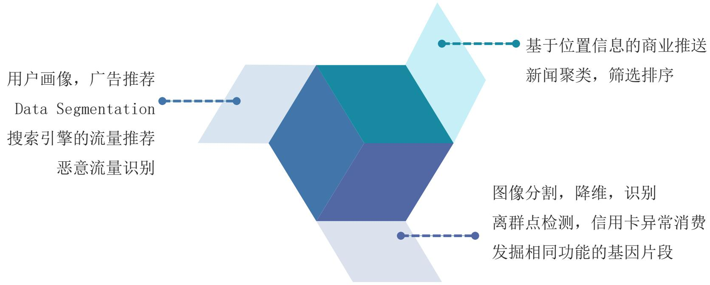
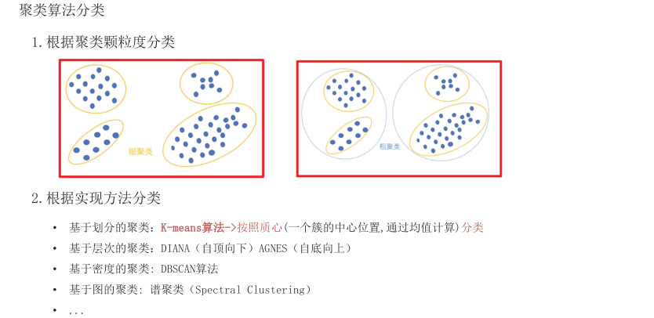
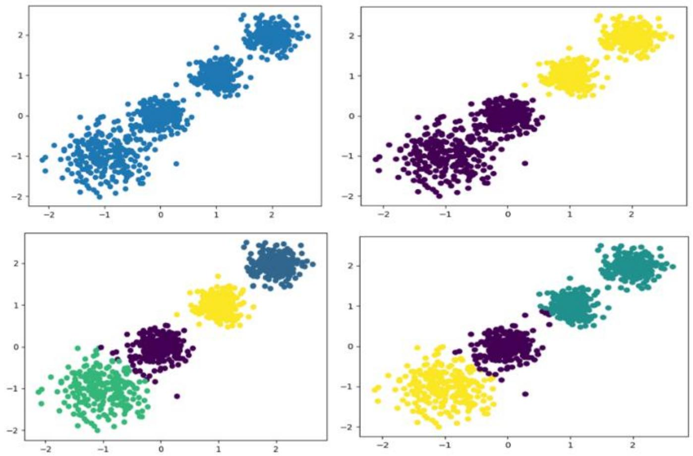

# 聚类算法

> 聚类算法简介
>
> 聚类算法API的使用

# 学习目标

> 1. 知道什么是聚类
>
> 1. 了解聚类算法的应用场景
>
> 1. 知道聚类算法的分类

## 聚类算法 – 概念

什么是聚类算法？

聚类算法是一类无监督学习方法，旨在将数据划分为若干组（簇），使得同一簇内的样本相似度高，而不同簇间的样本差异大。

• 根据样本之间的相似性，将样本划分到不同的类别中；不同的相似度计算方法，会得到不同的聚类结果，常用的相似度计算方法有欧式距离法。

• 聚类算法的目的是在没有先验知识的情况下，自动发现数据集中的内在结构和模式。

• 使用不同的聚类准则，产生的聚类结果不同



## 聚类算法在现实生活中的应用



多一句没有，少一句不行，用更短时间，教会更实用的技术！

## 聚类算法分类



# 2.根据实现方法分类

• 基于划分的聚类：K-means算法->按照质心(一个簇的中心位置,通过均值计算)分类

• 基于层次的聚类：DIANA（自顶向下）AGNES（自底向上）

基于密度的聚类: DBSCAN算法

• 基于图的聚类: 谱聚类（Spectral Clustering）

总结

> # 1 聚类概念
>
> 无监督学习算法，主要用于将相似的样本自动归到一个类别中；
>
> 计算样本和样本之间的相似性，一般使用欧式距离
>
> # 2 聚类分类
>
> 颗粒度：粗聚类、细聚类。
>
> • 实现方法： K-means聚类、层次聚类、 DBSCAN聚类、谱聚类

# 学习目标

> 1. 了解Kmeans算法的API
>
> 1. 动手实践Kmeans算法

## 聚类算法API

• sklearn.cluster.KMeans(n_clusters=8)

• 参数: n_clusters:开始的聚类中心数量整型，缺省值=8，生成的聚类数，即产生的质心（centroids）数。

方法

estimator.fit(x)

estimator.predict(x)

estimator.fit_predict(x): 计算聚类中心并预测每个样本属于哪个类别,相当于先调用fit(x),然后再调用predict(x)

## 使用KMeans模型数据探索聚类

随机创建不同二维数据集作为训练集，并结合k-means算法将其聚类，尝试分别聚类不同数量的簇，并观察聚类效果：



## 使用KMeans模型数据探索聚类

1 导包 sklearn.cluster.KMeans sklearn.datasets.make_blobs

2 创建数据集

3 实例化Kmeans模型并预测

4 展示聚类效果

5 评估聚类效果好坏

## 使用KMeans模型数据探索聚类

```python
# 1.导入工具包
from sklearn.cluster import KMeans
import matplotlib.pyplot as plt
from sklearn.datasets import make_blobs
from sklearn.metrics import calinski_harabasz_score #calinski_harabaz_score 废弃
#2 创建数据集1000个样本,每个样本2个特征4个质心簇数据标准差[0.4, 0.2, 0.2, 0.2]
x, y = make_blobs(n_samples=1000, n_features=2, centers=[[-1,-1], [0,0], [1,1], [2,2]],
    cluster_std = [0.4, 0.2, 0.2, 0.2], random_state=22)
plt.figure()
plt.scatter(x[:, 0], x[:, 1], marker='o')
plt.show()

#3 使用k-means进行聚类,并使用CH方法评估
y_pred = KMeans(n_clusters=4, random_state=22).fit_predict(x)
plt.scatter(x[:, 0], x[:, 1], c=y_pred)
plt.show()

#4 模型评估
print(calinski_harabasz_score(x, y_pred))
```

总结

聚类算法API

sklearn.cluster.KMeans(n_clusters=8)


