# 第二章 文本预处理


## 认识文本预处理

- 文本预处理及作用


~~~properties
所处阶段：数据输入到模型之前
作用：数据清洗、指导超参数的确定
~~~


- 文本预处理的主要环节


~~~properties
1.文本处理的基本方法：分词、NER、POS
2.文本张量的表示方法：one-hot、word2vec、wordEmbedding
3.文本语料的数据分析：标签数量分析（类别不均衡问题）、句子长度分析、词频统计和关键词词云
4.文本特征处理：添加n-gram特征、文本长度规范
5.数据增强方法：回译数据增强
~~~


```properties
Anaconda沙箱/虚拟环境介绍
作用：同台电脑能够同时拥有多个不同的Python环境；因为实际工作中，偶尔会出现你参与的/维护项目使用的Python解释器版本的要求是不同的。

每个项目创建单独的虚拟环境
优点：各个项目间隔离开了，相互之间不影响；用到啥库就安装上，开发的时候效率比较高
缺点：需要根据开发需求一个个安装对应的第三方库

Anaconda沙箱/虚拟环境相关命令
	conda env list：查看当前有哪些虚拟环境
	conda create -n 虚拟环境名称 python==版本号：创建新的虚拟环境，注意虚拟环境的名称不要用中文
	conda activate 虚拟环境名称：进入指定的虚拟环境
	conda deactivate：退出当前的虚拟环境
	conda remove -n 虚拟环境名称 --all：彻底删除指定的虚拟环境
	
	
创建nlp_base虚拟环境的流程如下：
	1- 查看当前有没有nlp_base
		conda env list
		
    2- 如果没有，那么需要新建。按回车即可
        conda create -n nlp_base python==3.10

    3- 验证是否创建成功
        conda env list

    4- 进入nlp_base中查看有哪些工具包
        conda activate nlp_base
        conda list

    5- 安装jieba分词器
        pip install jieba -i https://mirrors.aliyun.com/pypi/simple/
        pip install torch -i https://mirrors.aliyun.com/pypi/simple/
        pip install tensorflow -i https://mirrors.aliyun.com/pypi/simple/
        pip install joblib -i https://mirrors.aliyun.com/pypi/simple/
        
        pip install fasttext -i https://mirrors.aliyun.com/pypi/simple/
        或者
        pip install fasttext-wheel -i https://mirrors.aliyun.com/pypi/simple/
        
        如果不管是安装fasttext还是fasttext-wheel都失败，那么原因是python版本过高。
    	操作步骤如下：
        1- 先进入对应的虚拟环境
        2- 安装低版本的python解释器
            conda install python=3.10
        3- 安装fasttext
            pip install fasttext-wheel -i https://mirrors.aliyun.com/pypi/simple/
            
            

        pip install seaborn -i https://mirrors.aliyun.com/pypi/simple/
        pip install matplotlib==3.8.4 -i https://mirrors.aliyun.com/pypi/simple/
        
        如果运行matplotlib代码报错，依次执行如下两行命令：
        pip uninstall -y matplotlib
        pip install matplotlib==3.8.4 -i https://mirrors.aliyun.com/pypi/simple/
        
        pip install wordcloud -i https://mirrors.aliyun.com/pypi/simple/
```
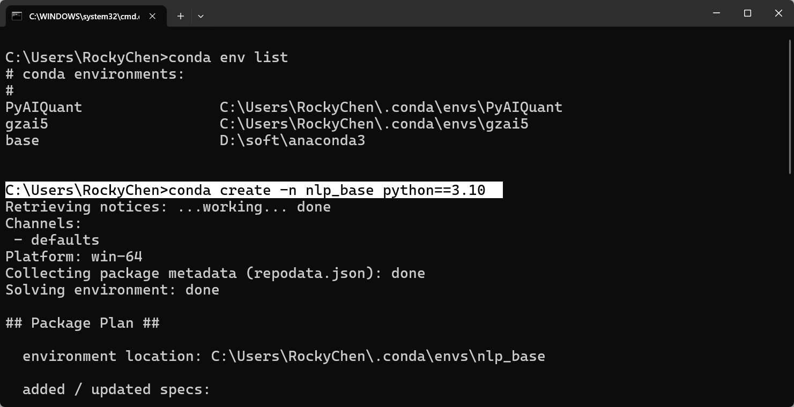

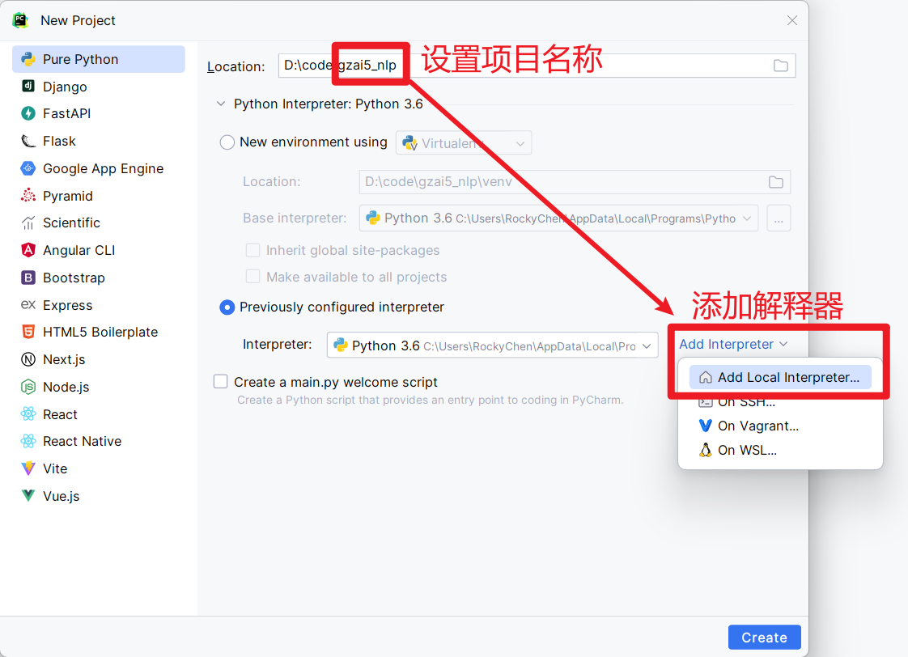

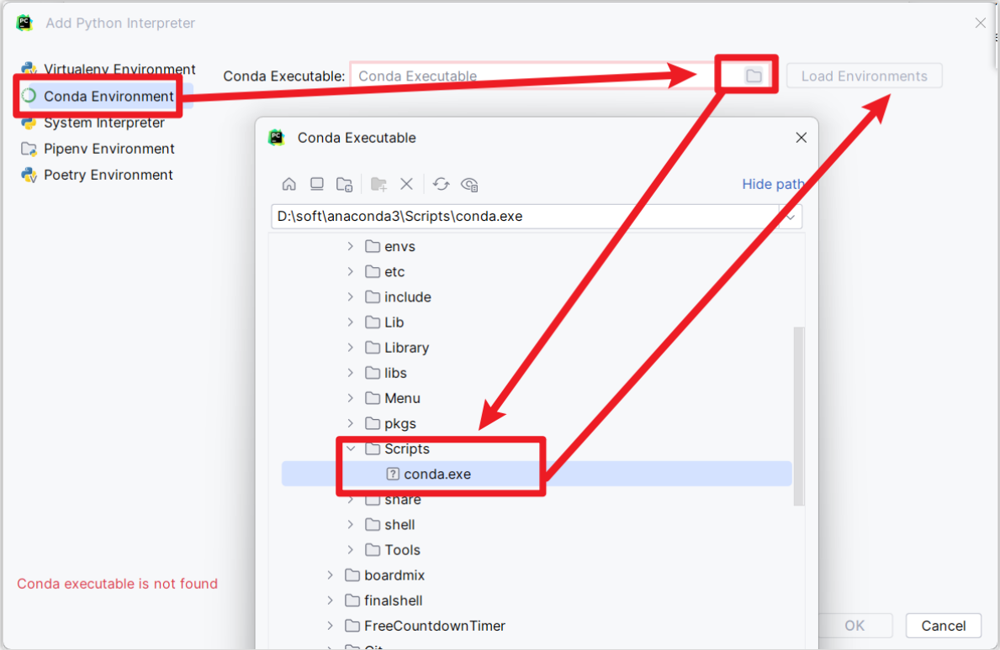


## 文本处理的基本方法

### 分词器【掌握】

- 分词的意义

```properties
分词就是将连续的字序列，按照一定的规范，重新组合成词序列的过程
一般实现模型训练的时候，模型接受的文本基本最小单位是词语，因此我们需要对文本进行分词
词语是语意理解的基本单元
英文具有天然的空格分隔符，而中文分词的目的：寻找一个合适的分词边界，进行准确分词
```


* jieba分词工具

~~~python
import jieba

# 1- 精确模式
def demo01():
    content = "传智教育是一家上市公司，旗下有黑马程序员品牌。我是在黑马这里学习人工智能"

    """
        sentence：要分词的内容
        cut_all：是否使用全词模式。默认是False
    """
    words = jieba.lcut(content,cut_all=False)
    print(type(words))
    print(words)

    print("-"*30)

    """
        lcut：返回结果类型是List列表，直接将所有的词全部返回
        cut：返回结果类型是生成器对象，不会直接将所有的词全部返回，需要真正用到的时候才一个个给你生成，非常节约内存
    """
    words2 = jieba.cut(content,cut_all=False)
    print(type(words2))
    print(words2)
    print("-" * 30)

# 2- 全（词）模式
def demo02():
    content = "传智教育是一家上市公司，旗下有黑马程序员品牌。我是在黑马这里学习人工智能"

    """
        sentence：要分词的内容
        cut_all：是否使用全词模式。如果是True，那么就是全词模式，也就是分的更加精细
    """
    words = jieba.lcut(content,cut_all=True)
    print(words)

# 3- 搜索引擎模式
def demo03():
    content = "传智教育是一家上市公司，旗下有黑马程序员品牌。我是在黑马这里学习人工智能"

    words = jieba.lcut_for_search(content)
    print(words)

if __name__ == '__main__':
    # 【掌握】1- 精确模式
    demo01()

    # 2- 全（词）模式
    demo02()

    # 3- 搜索引擎模式
    demo03()
~~~


* 支持用户自定义词典和繁体字分词

词典的意义

```properties
可以根据自定义词典，修改jieba分词方式，优先考虑词典里面的词来切分
格式：词语 词频（可省略） 词性（可省略）
```


自定义词典内容

~~~properties
# 格式：词 词频(可省略) 词性(可省略)
传智教育 10 n
黑马程序员 8
我是 1000000
旗下有
~~~


代码实现

```python
import jieba

# 繁体字分词：正常分词即可
def demo1():
    content = "煩惱即是菩提，我暫且不提"
    print(jieba.lcut(content))

    content = "煩恼即是菩提，我暫且不提"
    print(jieba.lcut(content))

# 自定义字典
def demo2():
    content = "传智教育是一家上市公司，旗下有黑马程序员品牌。我是在黑马这里学习人工智能"

    # 默认不使用自定义指定的形式
    result = jieba.lcut(content)
    print(result)

    # 加载自定义字典
    # 字典中用来存放需要进行特殊关照的词。这些词会作为整体，不会被分词
    jieba.load_userdict("data/my_dict.txt")
    result = jieba.lcut(content)
    print(result)

if __name__ == '__main__':
    # 繁体字分词
    # demo1()

    # 用户自定义字典
    demo2()
```


### 命名实体识别

- 定义

```properties
命名实体：通常指人名、地名、机构名等专有名词
NER：从一段文本中识别出上述描述的命名实体
常见的7类命名实体：人名、地名、机构名、时间、日期、货币、百分比
```

- 作用

```properties
同词汇一样，命名实体也是人类理解文本的基础单元，也是AI解决NLP领域高阶任务的重要环节
```


### 词性标注（pos）

- 定义

```properties
对每个词语进行词性的标注：动词、名词、形容词等
```

- 实现方式

```python
import jieba.posseg as pseg # POS词性标注

# POS词性
def demo1():
    content = "鲁迅爱北京天安门"
    result = pseg.lcut(content)

    for word,pos in result:
        print(word,"=",pos)

if __name__ == '__main__':
    # POS词性标注
    demo1()
```


## 文本张量的表示方法【熟悉】

文本张量的表示方法有几种

* onehot

* word2vec
  * CBOW：连续词袋模式。使用两边的词预测中间的内容
  * Skip-gram：跳词模式。使用中间的词预测两边的内容

* word embedding


### One-Hot 词向量表示

- 介绍

```properties
针对每一个词汇，都会用一个向量表示，向量的长度是n（n就是词表大小）,n代表去重之后的词汇总量，而且向量中只有0和1两种数字
也称之为：独热编码、01编码
```


- 代码实现

~~~python
import os
os.environ["TF_ENABLE_ONEDNN_OPTS"]="0"

import joblib
# from tensorflow.keras.preprocessing.text import Tokenizer   # 词汇映射器
from keras.src.legacy.preprocessing.text import Tokenizer   # 上面的替代方案

"""
    获得词向量的one-hot方式总结：
        优点：实现、理解简单
        缺点：
            1- 词向量是一个稀疏向量，会浪费存储和计算资源
            2- 对多义词的处理不好。例如：过过过过过过，中的3对过的词向量是同一个
"""

def demo01():
    # 1- 准备语料库
    vocabs = {"周杰伦", "陈奕迅", "王力宏", "李宗盛", "吴亦凡", "鹿晗"}

    # 2- 训练词汇映射器
    # 2.1- 创建映射器对象
    my_tokenizer = Tokenizer()
    # 2.2- 训练模型
    my_tokenizer.fit_on_texts(vocabs)
    # 2.3- 得到训练好的结果数据：词和索引的映射关系
    # 注意：1- word_index后面不要加小括号；2- 返回结果类型是普通的Python字典
    word_dict = my_tokenizer.word_index
    # print(type(word_dict))
    # print(word_dict)

    # 3- 得到每个词的one-hot词向量
    vocabs_len = len(vocabs)
    for word in vocabs:
        # 3.1- 初始化一个全0的词向量列表
        word_one_hot = [0]*vocabs_len   # 得到是[0,0,0,0,0,0]
        # 3.2- 获得词在词汇映射器中的索引。注意：索引是从1开始的
        index = word_dict[word]-1
        # 3.3- 将指定位置的值改为1即可
        word_one_hot[index] = 1

        print(f"{word}，对应的词向量是{word_one_hot}")

    # 4- 保存训练好的模型
    joblib.dump(my_tokenizer,"model/tokenizer.pkl")

def demo02():
    word = "王力宏"

    # 1- 加载训练好的模型
    my_tokenizer = joblib.load("model/tokenizer.pkl")

    # 2- 得到某个词的词向量
    # 2.1- 获得词汇映射器中词和索引的对应关系
    word_dict = my_tokenizer.word_index
    # 2.2- 初始化一个全0的列表
    word_one_hot = [0]*len(word_dict)
    # 2.3- 获得该词的索引
    index = word_dict[word]-1
    # 2.4- 将指定索引位置的值设置为1即可
    word_one_hot[index] = 1

    print(word_one_hot)

# 基于纯Python入门试学班的代码实现
def demo03():
    # 1- 准备语料库
    vocabs = ["周杰伦", "陈奕迅", "王力宏", "李宗盛", "吴亦凡", "鹿晗"]

    # 2- 得到每个词的one-hot词向量
    vocabs_len = len(vocabs)
    for word in vocabs:
        # 2.1- 初始化一个全0的词向量列表
        word_one_hot = [0] * vocabs_len  # 得到是[0,0,0,0,0,0]
        # 2.2- 获得词在语料库的索引
        index = vocabs.index(word)
        # 3.3- 将指定位置的值改为1即可
        word_one_hot[index] = 1

        print(f"{word}，对应的词向量是{word_one_hot}")


if __name__ == '__main__':
    # 1- 训练模型：也就是训练词汇映射器
    demo01()

    # 2- 使用训练好的模型
    demo02()

    # 3- 用最基本的方式实现
    demo03()
~~~


- One-hot总结

```properties
获得词向量的one-hot方式总结：
    优点：实现、理解简单
    缺点：
        1- 词向量是一个稀疏向量，会浪费存储和计算资源
        2- 对多义词的处理不好。例如：过过过过过过，中的3对过的词向量是同一个
```


### Word2Vec模型

```properties
word2vec介绍
	1- 是将文本变成词向量张量的一种方法，是一种无监督（自监督）的训练方法，本质是训练一个模型，将模型的参数矩阵当作所有词汇的词向量表示。基于one-hot的形式进行优化改造
    2- 它又分为两种具体模式：
        CBOW：连续词袋模式。使用两边的词预测中间的内容
        Skip-gram：跳词模式。使用中间的词预测两边的内容
```


#### CBOW【了解】


  ```properties
  核心思想：给一段文本，选择一定的窗口，然后利用上下文预测中间目标词
  ```

  - 实现过程

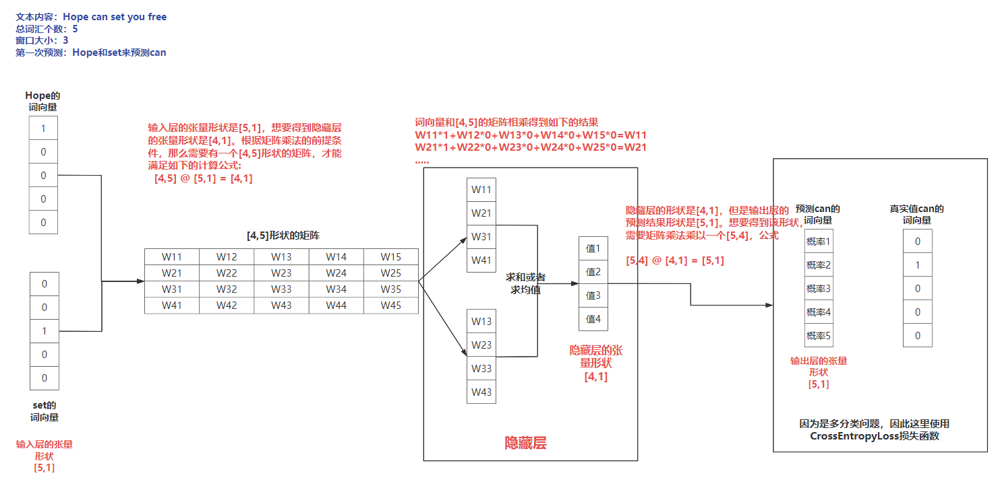


#### skip-gram【了解】

```properties
核心思想: 给出一段文本，选择一定窗口获取数据集，利用中间词来预测上下文
```

- 实现过程


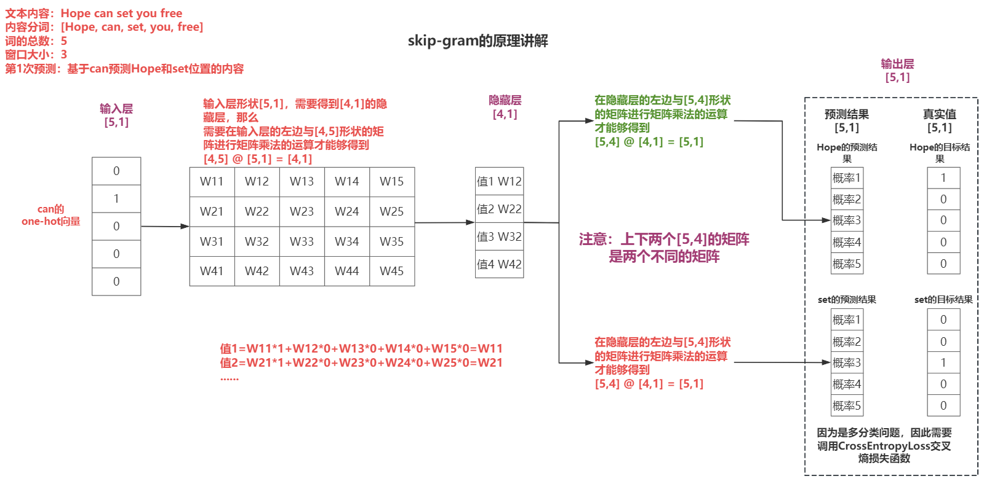


#### Fasttext实现Word2Vec代码【掌握】

- 基本过程

```properties
1.获取数据
2.训练模型（训练词向量）  
	正常安装：pip install fasttext -i https://mirrors.aliyun.com/pypi/simple/
    如果失败：pip install fasttext-wheel -i https://mirrors.aliyun.com/pypi/simple/
3.向量的检验
4.超参数设定
5.模型的保存和加载
```

- 代码实现

```python
"""
    如果不管是安装fasttext还是fasttext-wheel都失败，那么原因是python版本过高。
    操作步骤如下：
        1- 先进入对应的虚拟环境
        2- 安装低版本的python解释器
            conda install python=3.10
        3- 安装fasttext
            pip install fasttext-wheel -i https://mirrors.aliyun.com/pypi/simple/
"""
import fasttext

def demo01():
    # 1- 使用无监督学习训练模型
    """
        为什么这里只能使用无监督学习？
        答：因为数据中没有明确标记目标值。有监督学习对文件内容有严格要求，有__label__
    """
    # model = fasttext.train_unsupervised("data/fil9")
    model = fasttext.train_unsupervised("data/gz03ag")

    # 2- 保存训练好的模型
    model.save_model("model/word2vec.pkl")

def demo02():
    # 1- 加载训练好的模型
    model = fasttext.load_model("model/word2vec.pkl")

    # 2- 获得某个词的词向量
    word_vec = model.get_word_vector("hello")
    print(word_vec)

def demo03():
    # 1- 加载训练好的模型
    model = fasttext.load_model("model/word2vec.pkl")

    # 2- 获得相近的几个词
    # 会从词形、词义方面进行查找。
    # result_list = model.get_nearest_neighbors("dog")
    result_list = model.get_nearest_neighbors("cat")

    # 3- 输出
    print(result_list)

def demo04():

    """
        参数解释：
            input：训练集路径
            model：word2vec的模式。默认是skipgram，可以设置为cbow
            dim：词向量的维度
            epoch：训练的轮次
            lr：初始学习率
            thread：训练的线程个数
    """
    model = fasttext.train_unsupervised(
        input="data/gz03ag",
        model="cbow",
        dim=200,
        epoch=1,
        lr=0.1,
        thread=10
    )

    model.save_model("word2vec_better.pkl")

if __name__ == '__main__':
    # 1- 训练并保存模型
    # demo01()

    # 2- 获得词的词向量
    # demo02()

    # 3- 获得相近的词
    # demo03()

    # 4- 超参数调优设置【掌握】
    demo04()
```

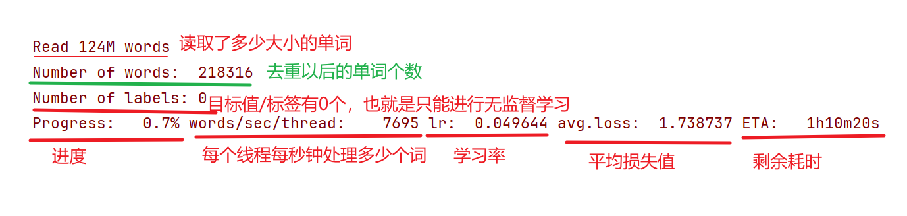


### 词嵌入Word Embedding【复习】

```properties
word2vec缺点：静态的、固定的vec表示方法，对多义词处理效果不佳
```


- 实现过程

```properties
借助nn.Embedding(num_embeddings, embed_dim): 
	num_embeddings：代表词汇（去重之后）的总量
	embed_dim：是我们设定的词向量维度
```


- 代码实现

```python
import os
import torch

os.environ['TF_ENABLE_ONEDNN_OPTS']='0'
from tensorflow.keras.preprocessing.text import Tokenizer # 词汇映射表
import jieba
import torch.nn as nn
from torch.utils.tensorboard import SummaryWriter # 词向量可视化化

if __name__ == '__main__':
    # 1- 准备文本数据
    sentence1 = '传智教育是一家上市公司，旗下有黑马程序员品牌。我是在黑马这里学习人工智能'
    sentence2 = "我爱自然语言处理"
    sentence_list = [sentence1,sentence2]

    # 2- 分词处理
    word_list = []
    for sen in sentence_list:
        word_list.append(jieba.lcut(sen))
    # print(word_list)

    # 3- 使用语料库对Tokenizer词汇映射器进行训练
    # 3.1- 创建Tokenizer实例对象
    my_token = Tokenizer()
    # 3.2- 模型训练
    my_token.fit_on_texts(word_list)
    # 3.3- 得到索引和词的映射关系，结果是一个字典。注意：索引从1开始
    # 【了解】1- 首先根据词在句子中的顺序来排序；2- 然后将出现频次高的词排在前面；3- 如果频次相同，那么按照首次出现的顺序排序
    index_word = my_token.index_word
    word_num = len(index_word)
    print(index_word)

    # 4- 创建词嵌入层
    """
        num_embeddings：去重后的词汇表中总共有多少个词
        embedding_dim：每个词的词向量维度（也就是向量中有多少个数字）
    """
    ebd = nn.Embedding(num_embeddings=word_num,embedding_dim=6)

    # 5- 得到词向量
    for i in range(word_num):
        # 5.1- 根据词索引得到词向量
        word_vector = ebd(torch.tensor(i))

        # 5.2- 打印输出
        print(f"索引是{i+1}，对应的词是 {index_word.get(i+1)}，词向量{word_vector}")

    # 6- 可视化展示：通过tensorboard（张量面板）观察词之间的相似性
    summary_obj = SummaryWriter(log_dir="./runs")
    summary_obj.add_embedding(ebd.weight.data,index_word.values())
    summary_obj.close()
```

- 结果可视化

  - 命令：tensorboard --logdir=runs --host 127.0.0.1
  - 截图

  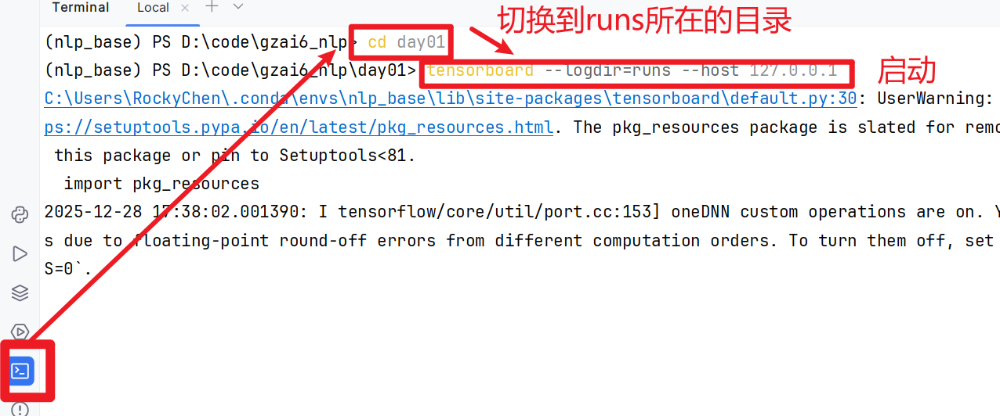

  * 访问：使用Edge浏览器来访问。输入链接 http://127.0.0.1:6006

  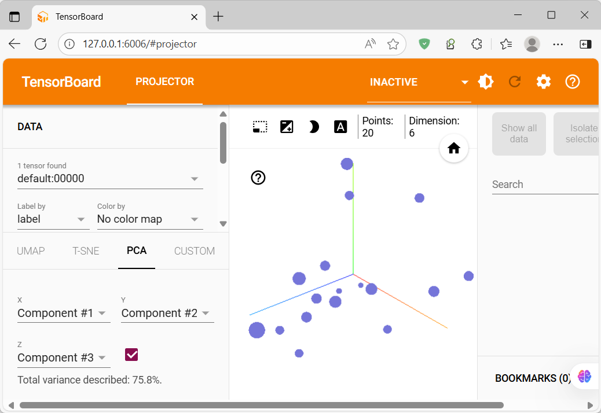
  
  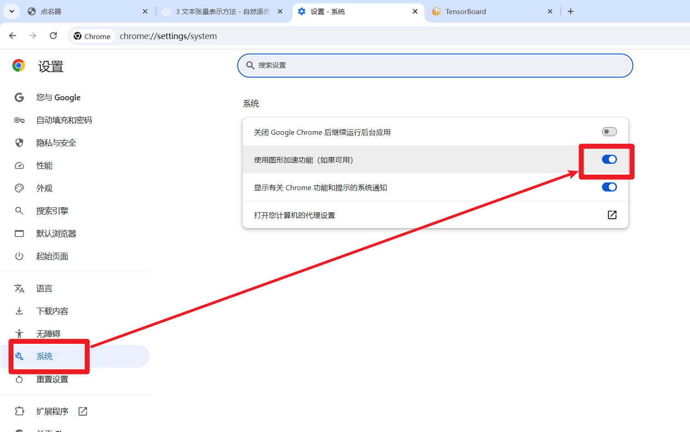


## 文本数据分析【理解】

``````properties
文本数据分析有哪些方法
    1、标签数量分布
    2、句子长度分布
    3、词频统计和词云
    
文本数据分析的作用
	1、帮助我们理解语料
	2、帮助我们检查语料, 快速分析语料中可能存在的问题.
        例如:
            数据质量类: 错别字, 语法错误, 重复内容, 缺失值...
            数据均衡类: 标签分布不均, 句子长度不同...
``````


### 标签数量分布

```properties
目的: 查询样本类别是否均衡，如果样本过大，需要减少数据；如果样本过少，需要增加数据
```

- 代码实现

```python
import seaborn as sns
import matplotlib.pyplot as plt
import pandas as pd
"""
    如果出现AttributeError: 'FigureCanvasInterAgg' object has no attribute 'tostring_rgb'. Did you mean: 'tostring_argb'?
    那么是matplotlib的版本过高导致的
    pip uninstall -y matplotlib
    pip install matplotlib==3.8.4 -i https://mirrors.aliyun.com/pypi/simple/
"""

if __name__ == '__main__':
    # 1- 读取文件
    """
        注意：需要指定具体的分隔符sep，否则会报错pandas.errors.ParserError: Error tokenizing data. C error: Expected 6 fields in line 12, saw 8
    """
    train_df = pd.read_csv("data/train.tsv",encoding="UTF-8",sep="\t")
    dev_df = pd.read_csv("data/dev.tsv",encoding="UTF-8",sep="\t")

    # 2- 展示训练集
    plt.style.use("fivethirtyeight")
    sns.countplot(x="label",data=train_df)
    plt.title("train")
    plt.show()

    # 3- 展示验证集
    sns.countplot(x="label", data=dev_df)
    plt.title("dev")
    plt.show()
```

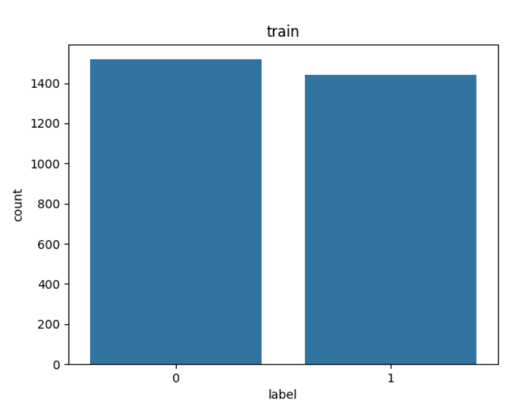


### 句子长度分布

```properties
目的: 模型一般规定需要输入固定的尺寸，也就是长度统一，通过分析句子长度，可以明确大部分样本属于什么长度范围，然后进行句子的长短补齐或截断
```


* 解释list( map(lambda x: len(x), sentence_series))

~~~python
if __name__ == '__main__':
    my_data = [11,22,33]
    map_result = map(lambda num:num*10, my_data) # 这里实际是得到了一个生成器对象
    # print(map_result) # 得到的是内存地址值

    # 取值方式一【推荐】：转成List列表
    # list_result = list(map_result)
    # print(list_result)

    print("-"*30)

    # 取值方式二：for循环
    # for i in map_result:
    #     print(i)

    print("-" * 30)

    # 取值方式三：next一个个取值
    print(next(map_result))
    print(next(map_result))
    print(next(map_result))
~~~


- 代码实现

```properties
import seaborn as sns
import matplotlib.pyplot as plt
import pandas as pd

def demo01():
    # 1- 读取数据
    df = pd.read_csv("data/train.tsv",sep="\t",encoding="UTF-8")

    # 2- 统计句子长度
    # 2.1- 获得句子列
    sentence_series = df["sentence"]
    # 2.2- 计算句子长度
    # 方式一：list(map)
    # df["length"] = list(map(lambda line:len(line),sentence_series))

    # 方式二：apply
    df["length"] = sentence_series.apply(lambda line:len(line))
    # print(df.head())

    # 3- 绘制图形
    # 3.1- 绘制分布直方图
    plt.style.use("fivethirtyeight")
    sns.countplot(x="length",data=df)
    plt.xticks([])
    plt.title("length_dist")
    plt.show()

    # 3.2- 绘制趋势曲线
    # kde：让曲线更加平滑
    sns.displot(x="length",data=df,kde=True)
    plt.show()


def demo02():
    # 1- 读取数据
    df = pd.read_csv("data/train.tsv", sep="\t", encoding="UTF-8")

    # 2- 统计句子长度
    # 2.1- 获得句子列
    sentence_series = df["sentence"]
    # 2.2- 计算句子长度
    df["length"] = sentence_series.apply(lambda line: len(line))

    # 3- 绘制图形
    sns.stripplot(x="label",y="length",data=df,hue="label")
    plt.title("label_length")
    plt.show()

if __name__ == '__main__':
    # 句子长度分布
    demo01()

    # 好评差评的句子长度分布
    demo02()
```

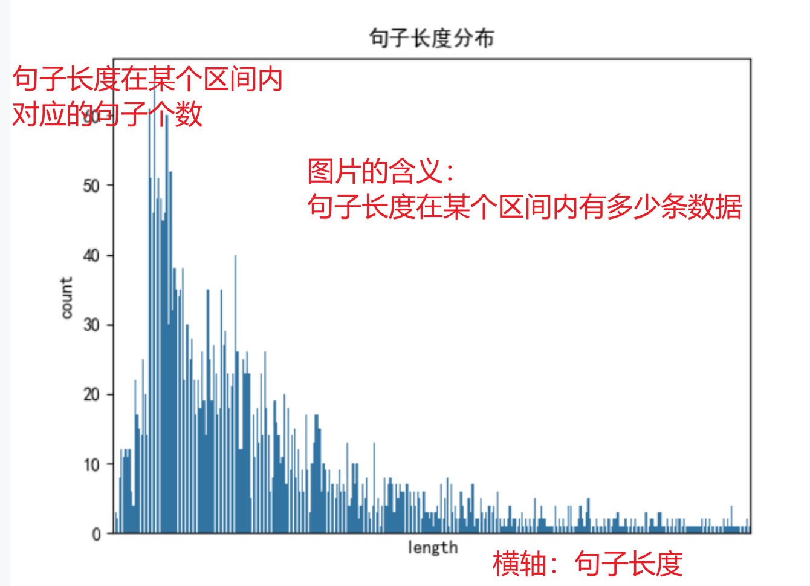


### 词频和高频词云

```properties
词频: 这里指的是统计样本中词汇的总数量（需要去重）
高频词云目的: 可以方便我们查看数据集中是否存在脏数据，进而实现人工的审核和清洗
```


* 解释chain(*map())

~~~properties
chain的作用可以简单理解为和List.extend等价，但是有区别：chain返回一个的是一个迭代器，因此对内存的使用极低，而且不修改原始列表
~~~


~~~python
# 导包
from itertools import chain
import jieba

def dm01():
    list1 = ['今天天很好', '今天天很热']
    # 对每个字符串进行分词处理
    tmp_result = map(lambda x: jieba.lcut(x), list1)
    print(list(tmp_result))
    print(*tmp_result)
    # 把上述结果合并, 不会去重.
    result = list(chain(*tmp_result))
    print(f'result: {result}')

    # 上述格式最终版写法, 即: 一行.
    result = list(chain(*map(lambda x: jieba.lcut(x), list1)))
    print(f'result: {result}')

if __name__ == '__main__':
    dm01()
~~~


- 词频_代码实现

```python
# 导包
import jieba
import seaborn as sns
import pandas as pd
import matplotlib.pyplot as plt  # 推荐安装 pip install matplotlib==3.9
from itertools import chain  # 迭代器工具

# 解决Matplotlib绘图时 中文乱码问题.
plt.rcParams['font.sans-serif'] = ['SimHei']  # Mac本字体改为: ['Arial Unicode MS']
plt.rcParams['axes.unicode_minus'] = False

# 1. 词频统计.
def dm01_word_count():
    # 1. 读取数据.
    train_data = pd.read_csv('./data/train.tsv', sep='\t')
    test_data = pd.read_csv('./data/dev.tsv', sep='\t')

    # 2. 统计 训练集中 词汇总数.
    train_vocab = set(chain(*map(lambda x: jieba.lcut(x), train_data['sentence'])))

    # 3. 统计 测试集中 词汇总数.
    test_vocab = set(chain(*map(lambda x: jieba.lcut(x), test_data['sentence'])))

    # 4. 打印结果.
    print(f'训练集的 词汇总数: {len(train_vocab)}')
    print(f'测试集的 词汇总数: {len(test_vocab)}')

if __name__ == '__main__':
    # 词频统计
    dm01_word_count()
```

- 高频词云_代码实现

```python
import pandas as pd
from itertools import chain
from wordcloud import WordCloud # 词云类
import jieba.posseg as pseg
import matplotlib.pyplot as plt

def get_a_word(line):
    # 分词并且标注词性
    word_dict = pseg.lcut(line)
    # print(word_dict)

    result_list = []

    # 过滤形容词
    for word,pos in word_dict:
        if pos=="a":
            result_list.append(word)

    return result_list

def show_cloud(a_word_list):
    # 1- 创建词云对象
    wordcloud_obj = WordCloud(font_path="data/SimHei.ttf",max_words=100,background_color="white")

    # 2- 词汇列表以空格分隔拼接成字符串
    words_str = " ".join(a_word_list)

    # 3- 绘制图形
    wordcloud_obj.generate(words_str)
    plt.figure()
    # bilinear：让文字边缘更加平滑
    plt.imshow(wordcloud_obj,interpolation="bilinear")
    plt.axis("off")
    plt.show()

def word_cloud():
    # 1- 读取文件，并且取出评价内容
    df = pd.read_csv("data/train.tsv",sep="\t",encoding="UTF-8")
    sentence_series = df["sentence"]

    # 2- 句子分词，过滤出形容词
    # 注意：map返回的是生成器，你要真的调用它，才会触发数据的产生
    a_word_list = list(chain(*map(get_a_word,sentence_series)))
    # a_word_list = list(chain(*map(lambda line: [word for word,pos in pseg.lcut(line) if pos=="a"],sentence_series)))
    # print(a_word_list)

    # 3- 绘制词云
    show_cloud(a_word_list)

if __name__ == '__main__':
    word_cloud()
```


## 文本特征处理【熟悉】

【介绍一下n-gram】

``````
将n个连续相邻的token组合到一起，n-gram特征
``````

【为什么要规范文本长度】

``````
模型的输入需要【每个batch】或者【整个数据集】，统一句子长度
``````

```properties
对语料添加普适性的特征：n-gram
对语料进行规范长度：适配模型的输入
```


### 添加N-Gram特征

```properties
n-gram介绍:
    概述:
        就是将连续的n个词组合到一块, 把这些连续片段当做1个新特征(小词组特征), 帮我们分析文本的规律.
    分析:
        uni-gram(1-gram): 把每个 词/字 拆出来.
        bi-gram(2-gram): 找连续2个词的组合.
        tri-gram(3-gram): 找连续3个词的组合.
    目的:
        让计算机更好的理解 文本规律，也就是上下文信息.

例如：
分词内容: 我｜ 爱｜ 黑马
uni-gram: 我｜ 爱｜ 黑马
bi-gram: 我爱｜爱黑马
tri—gram: 我爱黑马
```


* zip函数解释

~~~python
if __name__ == '__main__':
    list1 = [1, 2, 3, 4, 5, 6]
    list2 = [2, 3, 4]

    result = list(zip(list1, list2))
    print(result)
~~~


- 代码实现

```python
"""
    n-gram：指的是 将相邻的n个词拼接到一起成为新词的过程。其中n一般取值为1、2、3
        1：uni-gram，不进行拼接操作
        2：bi-gram，将相邻的2个词拼接到一起
        3：tri-gram，将相邻的3个词拼接到一起

    作用：通过拼接相邻词的过程，提升模型对语义上下文的理解
    注意：n的值实际工作中一般是3以内，大多数情况是2。如果n太大，会导致词汇表个数膨胀，太长的拼接没有意义
"""

def n_gram_fn(n_gram):
    # 1- 测试数据
    word_list = ["aa","bb","cc","dd"]

    # 2- 对相邻的词进行合并
    """
        2-gram：
            ["aa","bb","cc","dd"]
            ["bb","cc","dd"]
            
        3-gram：
            ["aa","bb","cc","dd"]
            ["bb","cc","dd"]
            ["cc","dd"]
    """
    lists = [word_list[i:] for i in range(n_gram)]
    print(lists)

    print(list(zip(*lists)))

if __name__ == '__main__':
    n_gram_fn(n_gram=1)
    n_gram_fn(n_gram=2)
    n_gram_fn(n_gram=3)
```


### 文本长度规范

```properties
意义: 一般模型的输入需要等尺寸大小的矩阵, 所以需要对超长文本做截断, 不足的做补齐。这就是文本长度规范.
```

- 代码实现

```python
# from tensorflow.keras.preprocessing import sequence
from keras.preprocessing import sequence

sen_list = [
                [1, 23, 5, 32, 55, 63, 2, 21, 78, 32, 23, 1],
                [2, 32, 1, 23, 1]
        ]

# 用框架提供的方法实现句子长度的规范
def demo01():
    """
        sequences：要进行长度规范的句子列表
        maxlen：长度规范中的句子长度要求统一为多长，指的是词的个数
        truncating：截断的方向。默认是pre，从前面开始截断；post从后面开始截断
        padding：填充的方向。默认是pre，从前面开始填充；post从后面开始填充
        value：使用什么值进行填充。推荐使用默认的0，因为对原始数据的影响最小
    """
    result = sequence.pad_sequences(sen_list,maxlen=10,truncating="post",padding="post")
    # result = sequence.pad_sequences(sequences=sen_list,maxlen=10,truncating="pre",padding="pre")
    # result = sequence.pad_sequences(sequences=sen_list,maxlen=10,value=6666)
    print(result)

def demo02():
    # 1- 定义一个空列表用来存储规范化后的句子
    result_list = []

    maxlen = 10 # 句子的长度

    # 2- 分别对每条句子进行处理
    for sen in sen_list:
        if len(sen)>maxlen:
            # 超长的要截断
            result_list.append(sen[:maxlen])
        else:
            # 短的要填充
            result_list.append(sen + [0]*(maxlen-len(sen)))

    print(result_list)

if __name__ == '__main__':
    # 用框架提供的方法实现句子长度的规范
    demo01()

    # 使用最简单的python代码实现
    demo02()
```


