# 第三章 RNN及其变体

## 认识RNN模型

- 定义

```properties
循环神经网络：一般接受的一序列进行输入，输出也是一个序列
```

- 作用和应用场景

```properties
RNN擅长处理连续语言文本，机器翻译、文本生成、文本分类、摘要生成
```

- RNN模型的分类

  - 根据输入与输出结构

  ```properties
  N Vs N : 输入和输出等长，应用场景：对联生成；词性标注；NER
  N Vs 1 : 输入N，输出为单值，应用场景：文本分类
  1 Vs N : 输入是一个，输出为N，应用场景：图片文本生成
  N Vs M : 输入和输出不等长，应用场景：文本翻译、摘要总结
  ```

  - 根据RNN内部结构

  ```properties
  传统RNN
  LSTM
  BI-LSTM
  GRU
  BI-GRU
  ```


## 传统RNN模型

### 基本概念

RNN(Recurrent Neural Network), 中文称作循环神经网络, 它一般以序列数据为输入, 通过网络内部的结构设计有效捕捉序列之间的关系特征, 一般也是以序列形式进行输出.


参数解释：

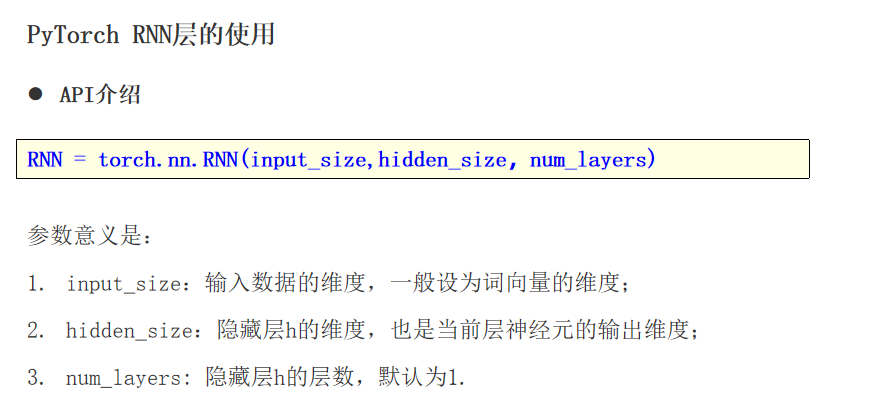

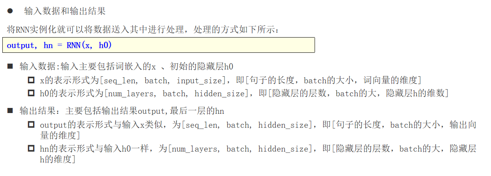


### 内部结构

来源文章：https://colah.github.io/posts/2015-08-Understanding-LSTMs/

- 输入：当前时间步xt和上一时间步输出的ht-1
- 输出：ht和ot （一个时间步内：ht=ot）

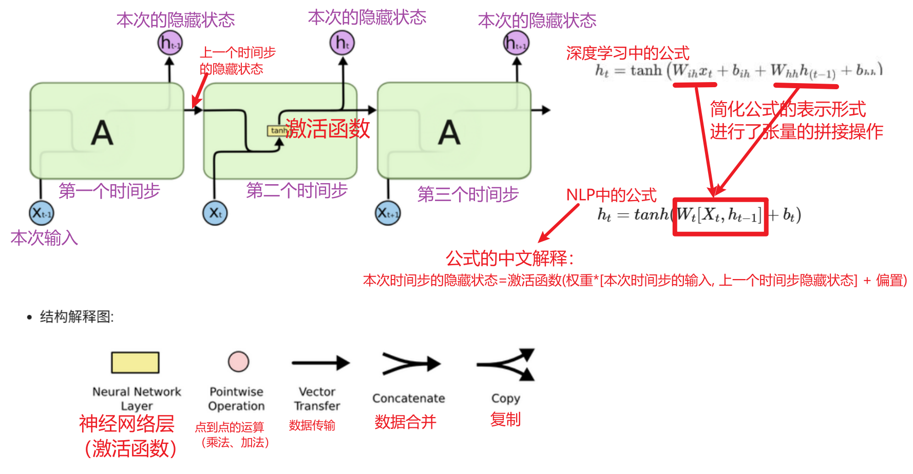


- 多层RNN的解析

  ~~~properties
  output记录的是 最后一层 在每个时间步的隐藏状态。
  hidden 记录的是 每一层 在最后一个时间步的隐藏状态。
  ~~~

  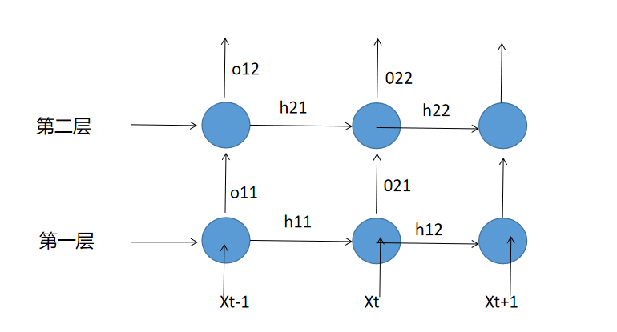

  

### 代码实现

~~~python
import torch
import torch.nn as nn

def rnn_demo(num_layers):
    # 1- 创建RNN循环网络层
    """
        参数解释：
            input_size：输入数据的词向量维度
            hidden_size：隐藏层中隐藏状态的向量维度
            num_layers：隐藏层的层数。默认是1，该值=层数*方向bidirectional
    """
    rnn = nn.RNN(input_size=4, hidden_size=5, num_layers=num_layers)

    # 2- 准备数据
    # 2.1- 本次的输入数据
    """
        张量形状要求：
            [
                seq_len每条句子中有多少个词,
                batch_size每个批次中句子的条数有多少条,
                input_size输入数据的词向量维度
            ]
    """
    input = torch.randn(size=(6, 3, 4))
    # 2.2- 上一个时间步的隐藏状态。最初始的时候，一般进行全0初始化
    """
        张量形状要求：
            [
                num_layers隐藏层的层数,
                batch_size每个批次中句子的条数有多少条,
                hidden_size隐藏层中隐藏状态的向量维度
            ]
    """
    h0 = torch.zeros(size=(num_layers, 3, 5))

    # 3- 调用rnn
    """
        输出的output张量的形状：
            [
                seq_len每条句子中有多少个词,
                batch_size每个批次中句子的条数有多少条,
                hidden_size隐藏层中隐藏状态的向量维度
            ]

        输出的hidden张量的形状：
            [
                num_layers隐藏层的层数,
                batch_size每个批次中句子的条数有多少条,
                hidden_size隐藏层中隐藏状态的向量维度
            ]
    """
    output, hidden = rnn(input, h0)

    # 4- 打印结果
    print(f"output形状-->{output.shape}")  # 6,3,5
    print(f"hidden形状-->{hidden.shape}")  # num_layers,3,5

    print(f"output-->{output}")
    print(f"hidden-->{hidden}")

if __name__ == '__main__':
    # rnn_demo(num_layers=1)
    rnn_demo(num_layers=2)
~~~

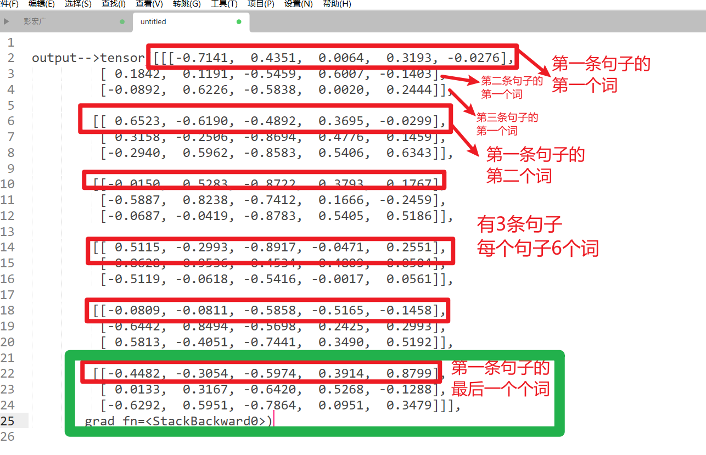


### 总结

传统RNN的优缺点：

~~~properties
优点:
	内部结构简单, 资源消耗相对较小.
缺点:
	处理长序列(一句话中词的个数很多)数据时, 因为 反向传播 结合 梯度连乘, 过大或者过小的w值都会导致 梯度爆炸或者梯度消失.
~~~


## LSTM模型

### 基本概念

LSTM（Long Short-Term Memory）也称长短时记忆结构, 它是传统RNN的变体, 与经典RNN相比能够有效捕捉长序列之间的语义关联, 缓解梯度消失或爆炸现象，处理长序列数据效果差的问题。同时LSTM的结构更复杂

LSTM由如下四个部分组成:

- 遗忘门
- 输入门
- 细胞状态
- 输出门


> 补充：【门】这个词的理解
>
> 它来自于电子工程，用来控制信号的输出。在NLP中，可以与生活中的门、音量按钮等进行类比理解


### 内部结构【理解】

* 细胞状态：是 LSTM 的记忆库，贯穿整个序列，用来解决长序列记忆问题

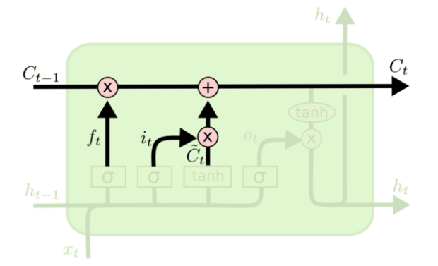


- 遗忘门：决定上一个时间步输出的细胞状态中，哪些内容需要丢弃掉

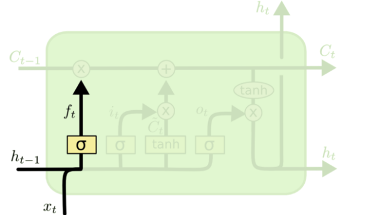

- 输入门：当前输入的数据中，哪些要记录到细胞状态中

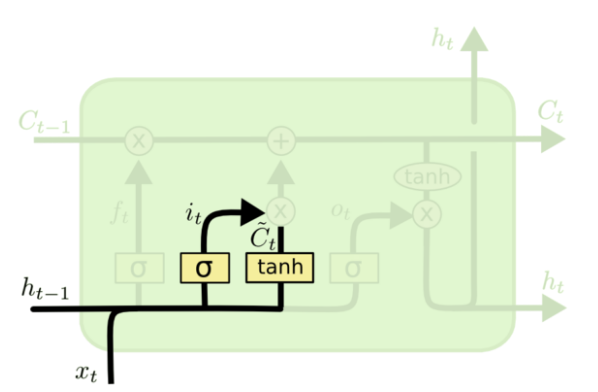


- 输出门：决定本次隐藏状态要输出哪些信息

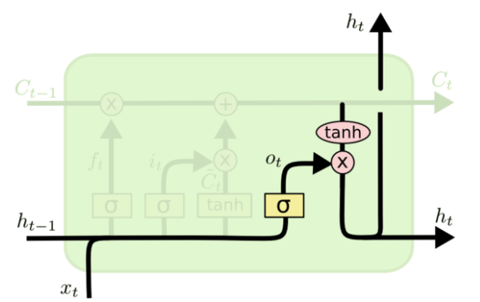


* 完整结构图解释

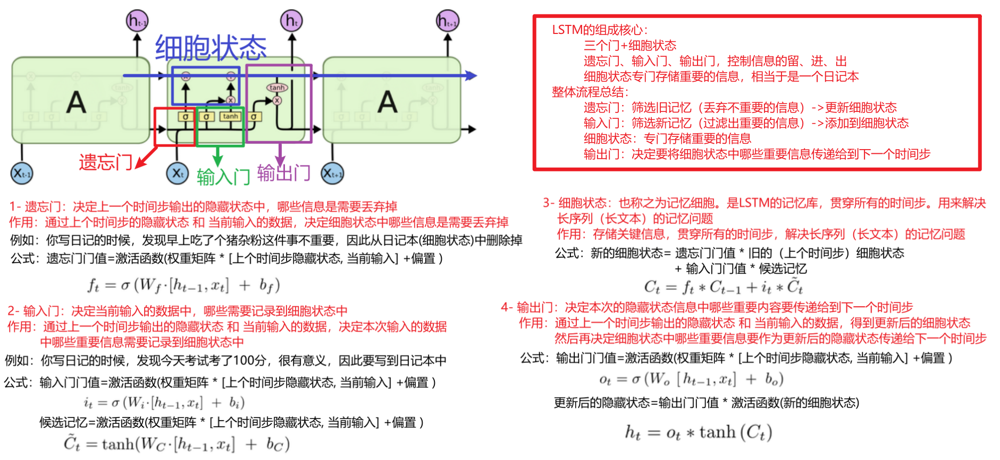


### 代码实现【掌握】

~~~python
import torch
import torch.nn as nn

if __name__ == '__main__':
    # 1- 创建LSTM网络结构
    """
        参数解释：
            bidirectional：是否是双向的网络结构。默认是False，也就是单向的。如果设置为True，LSTM就变成Bi-LSTM
    """
    lstm = nn.LSTM(input_size=4,hidden_size=5,num_layers=1,bidirectional=False)

    # 2- 准备数据
    # input的形状：[seq_len句子中词的个数,batch_size每个批次句子的个数,input_size词向量的维度]
    input = torch.randn(size=(6,3,4))

    """
        因为最终的隐藏状态是根据细胞状态经过激活函数处理得到的，
        但是激活函数不会改变张量的形状，只会改变值
        因此：隐藏状态 和 细胞状态 的张量形状是相同的
        实际工作中，一般对隐藏状态 和 细胞状态全都使用全0初始化
    """
    h0 = torch.zeros(size=(1,3,5))
    c0 = torch.zeros(size=(1,3,5))

    # 3- 调用LSTM
    """
        output形状：[seq_len,batch_size,hidden_size]
        hidden形状：[num_layers,batch_size每个批次句子的个数,hidden_size]
    """
    
    # 注意：传递和接受结果，都需要将隐藏状态 和 细胞状态用元组包起来
    output,(hidden,c1) = lstm(input,(h0,c0))

    print(f"output形状-->{output.shape}") # 6,3,5
    print(f"hidden形状-->{hidden.shape}")
    print(f"c1形状-->{c1.shape}") # 1,3,5

    print(f"output-->{output}")
    print(f"hidden-->{hidden}")
    print(f"c1-->{c1}")
~~~


### Bi-LSTM

定义: 不改变原始的LSTM模型内部结构，只是将文本从左到右计算一遍，再从右到左计算一遍，把最终的输出结果拼接得到模型的完整输出


```python
将bidirectional设置为True，即变成了Bi-LSTM
nn.LSTM(bidirectional=True)
```

### 总结

LSTM的优缺点是什么？

```properties
优点:
    1. 能够解决长时依赖.
    2. 缓解梯度消失, 爆炸的问题 -> 训练更稳定.
    3. 能够抓取复杂的特征.
缺点:
    1. 计算慢, 消耗资源大.
    2. 调参相对较难.
    3. 可解释性稍差.
```


## GRU模型

### 基本概念

GRU（Gated Recurrent Unit）也称门控循环单元结构, 它也是传统RNN的变体, 同LSTM一样能够有效捕捉长序列之间的语义关联, 缓解梯度消失或爆炸现象. 同时它的结构和计算要比LSTM更简单, 它的核心结构可以分为两个部分去解析:

- 更新门
- 重置门


### 内部结构【理解】

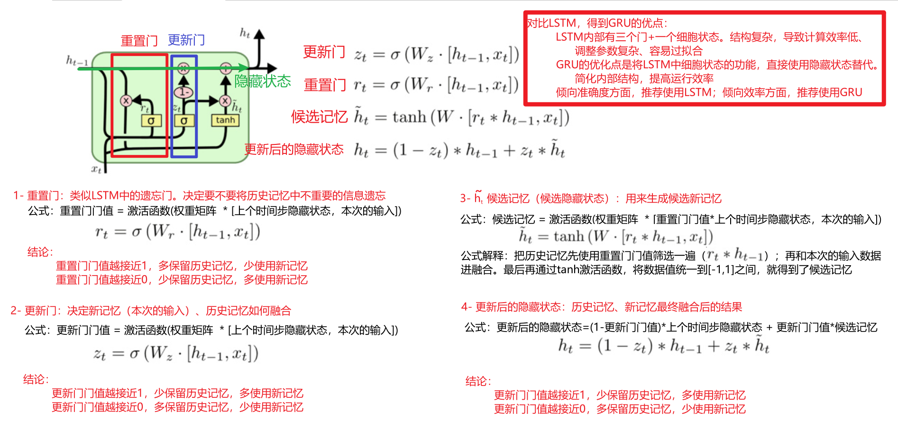


### 代码实现【掌握】

~~~python
import torch
import torch.nn as nn

def single_layer():
    # 1- 创建GRU循环网络层
    """
        参数解释：
            input_size：输入数据的词向量维度
            hidden_size：隐藏层中隐藏状态的向量维度
            num_layers：隐藏层的层数。默认是1
            bidirectional：默认是False，也就是单向的GRU。如果为True，就是双向的GRU
    """
    gru = nn.GRU(input_size=4, hidden_size=5, num_layers=1, bidirectional=False)

    # 2- 准备数据
    # 2.1- 本次的输入数据
    """
        张量形状要求：
            [
                seq_len每条句子中有多少个词,
                batch_size每个批次中句子的条数有多少条,
                input_size输入数据的词向量维度
            ]
    """
    input = torch.randn(size=(6, 3, 4))
    # 2.2- 上一个时间步的隐藏状态。最初始的时候，一般进行全0初始化
    """
        张量形状要求：
            [
                num_layers隐藏层的层数,
                batch_size每个批次中句子的条数有多少条,
                hidden_size隐藏层中隐藏状态的向量维度
            ]
    """
    h0 = torch.zeros(size=(1, 3, 5))

    # 3- 调用GRU
    """
        输出的output张量的形状：
            [
                seq_len每条句子中有多少个词,
                batch_size每个批次中句子的条数有多少条,
                hidden_size隐藏层中隐藏状态的向量维度
            ]

        输出的hidden张量的形状：
            [
                num_layers隐藏层的层数,
                batch_size每个批次中句子的条数有多少条,
                hidden_size隐藏层中隐藏状态的向量维度
            ]
    """
    output, hidden = gru(input, h0)

    # 4- 打印结果
    print(f"output形状-->{output.shape}")  # 6,3,5
    print(f"hidden形状-->{hidden.shape}")  # 2,3,5

    print(f"output-->{output}")
    print(f"hidden-->{hidden}")

def double_layer():
    # 1- 创建GRU循环网络层
    """
        参数解释：
            input_size：输入数据的词向量维度
            hidden_size：隐藏层中隐藏状态的向量维度
            num_layers：隐藏层的层数。默认是1
            bidirectional：默认是False，也就是单向的GRU。如果为True，就是双向的GRU
    """
    gru = nn.GRU(input_size=4, hidden_size=5, num_layers=1, bidirectional=True)

    # 2- 准备数据
    # 2.1- 本次的输入数据
    """
        张量形状要求：
            [
                seq_len每条句子中有多少个词,
                batch_size每个批次中句子的条数有多少条,
                input_size输入数据的词向量维度
            ]
    """
    input = torch.randn(size=(6, 3, 4))
    # 2.2- 上一个时间步的隐藏状态。最初始的时候，一般进行全0初始化
    """
        张量形状要求：
            [
                num_layers隐藏层的层数,
                batch_size每个批次中句子的条数有多少条,
                hidden_size隐藏层中隐藏状态的向量维度
            ]
    """
    h0 = torch.zeros(size=(2, 3, 5))

    # 3- 调用GRU
    """
        输出的output张量的形状：
            [
                seq_len每条句子中有多少个词,
                batch_size每个批次中句子的条数有多少条,
                hidden_size隐藏层中隐藏状态的向量维度
            ]

        输出的hidden张量的形状：
            [
                num_layers隐藏层的层数,
                batch_size每个批次中句子的条数有多少条,
                hidden_size隐藏层中隐藏状态的向量维度
            ]
    """
    output, hidden = gru(input, h0)

    # 4- 打印结果
    print(f"output形状-->{output.shape}")  # 6,3,5
    print(f"hidden形状-->{hidden.shape}")  # 2,3,5

    print(f"output-->{output}")
    print(f"hidden-->{hidden}")

if __name__ == '__main__':
    # 单向GRU
    single_layer()

    # 双向GRU
    double_layer()
~~~


### Bi-GRU

定义: 不改变原始的GRU模型内部结构，只是将文本从左到右计算一遍，再从右到左计算一遍，把最终的输出结果拼接得到模型的完整输出


### 总结

GRU的优缺点是什么？

~~~properties
优点：相比LSTM，结构较为简单，能够和lstm一样缓解梯度消失问题
缺点：只能缓解了梯度消失和爆炸问题, 不能并行计算
~~~


~~~properties
RNN、LSTM、GRU使用总结:
	1- 如果项目、需求简单，短序列（<50）的时候使用RNN
	2- 如果是中等序列（50-200）的使用使用GRU
	3- 如果是长序列（>200）的时候使用LSTM
	4- 如果是计算资源充足，推荐使用LSTM、Bi-LSTM、Bi-GRU；如果资源紧张考虑GRU
~~~


## 注意力机制【理解】

### 基本概念

Seq2Seq是啥，它和RNN、LSTM、GRU的关系和区别是啥？

~~~properties
1- Seq2Seq是一种模型架构，用于将一个序列映射到另一个序列。典型结构是 Encoder-Decoder（编码器-解码器）
2- RNN、LSTM、GRU是神经元内部结构
3- Seq2Seq模型的编码器和解码器通常由 RNN、LSTM 或 GRU 构成
4- 可以将Seq2Seq理解为房子，RNN、LSTM、GRU理解为建房子的砖
~~~


什么是机器翻译？

~~~properties
A文字 -> B文字，语言一样，叫文本生成
A文字 -> B文字，语言不同，叫机器翻译
~~~


注意力机制是什么意思？

~~~properties
注意力机制（Attention Mechanism）是深度学习中一种增强模型对输入数据中重要信息关注能力的技术
注意力机制让模型在处理序列数据时动态地赋予不同输入数据不同的权重
~~~


### 注意力机制的由来

```properties
没有注意力机制之前存在的弊端: 
	弊端1: 如果翻译的句子很长很复杂，比如直接一篇文章输进去，模型的计算量很大，并且模型的准确率下降严重
	弊端2: 没有考虑词与词之间的相关性，导致翻译效果比较差
```

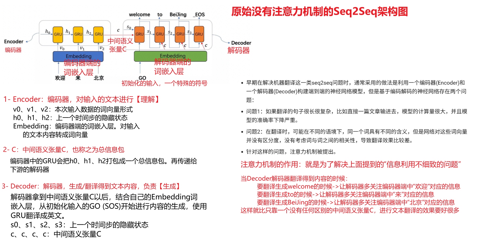


### 什么是注意力机制

==注意力机制是将人的感知方式、注意力的行为应用在机器上，让机器学会去感知数据中的重要和不重要的部分。==


### 注意力机制分类及其实现

#### 基本概念

```properties
1、【重点】软注意力: 也称之为全局注意。注意力权重值分布在0-1之间，关注所有的词汇，但是不同词汇根据权重大小关注的程度不一样。
2、硬注意力: 也称之为局部注意。注意力权重值是0或者1，只关注哪些重要的部分，忽略次要的部分
3、自注意力: 也称之为内注意。通过输入项内部的"表决"来决定应该关注哪些输入项.
```


#### 软注意力

##### 没有加Attention的Encoder-Decoder框架

==这个图主要理解谁是Target，谁是Source==

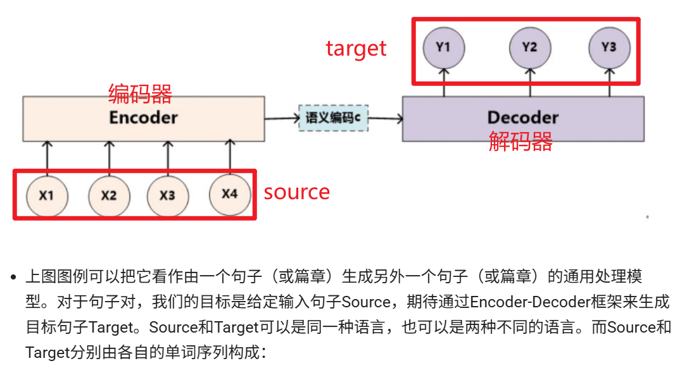


##### 加Attention的Encoder-Decoder框架

**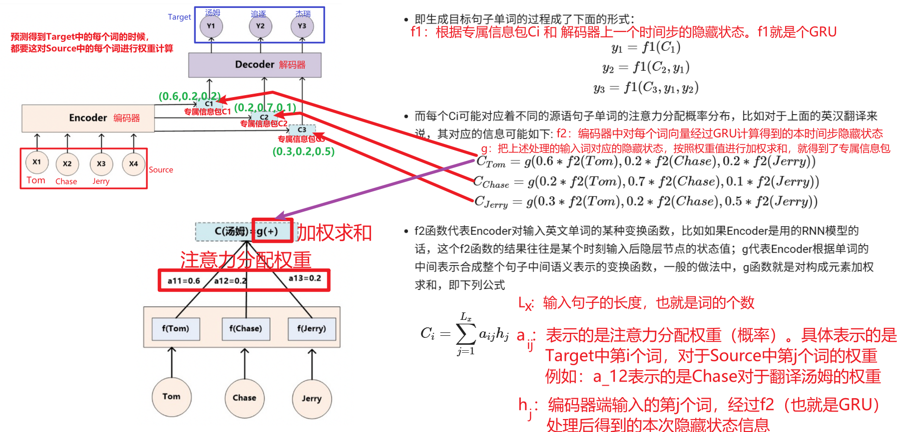**


##### 如何得到注意力概率分布

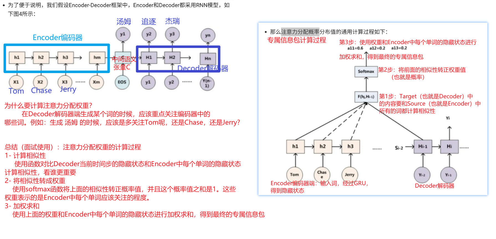

~~~properties
为什么要计算注意力分配系数？
	在Decoder生成当前词时，该重点关注Encoder里哪些单词
	例如：生成 汤姆 时，该多关注Encoder中的Tom、还是Chase、还是Jerry


总结(面试使用):注意力分配权重的计算过程
1-计算相似性
使用函数对比Decoder当前时间步的隐藏状态和Encoder中每个单词的隐藏状态计算相似性，看谁更重要

2-将相似性转成权重
使用softmax函数将上面的相似性转正概率值，并且这个概率值之和是1。这些权重表示的是Encoder中每个单词应该关注的程度。

3-加权求和
使用上面的权重和Encoder中每个单词的隐藏状态进行加权求和，得到最终的专属信息包
~~~


##### Attention机制的本质思想

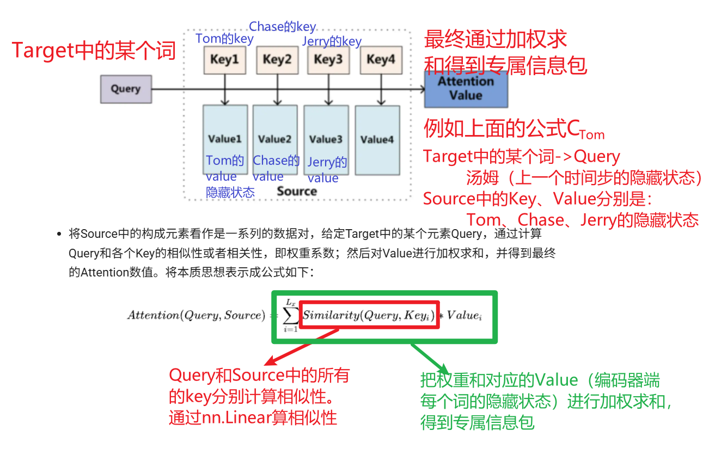

~~~properties
几个英文单词的关系：
	Encoder编码器：
		Source：
			Key
			Value
	
	Decoder解码器：
		Target：
			Query

Seq2Seq+注意力机制的架构中：
	Query: 是解码器中当前时间步中GRU隐藏层输出的隐藏状态
	Key: 是编码器中当前时间步中GRU隐藏层输出的隐藏状态
	Value: 与Key是完全相同的，是编码器中当前时间步中GRU隐藏层输出的隐藏状态
~~~


==计算的详细过程【掌握】==：

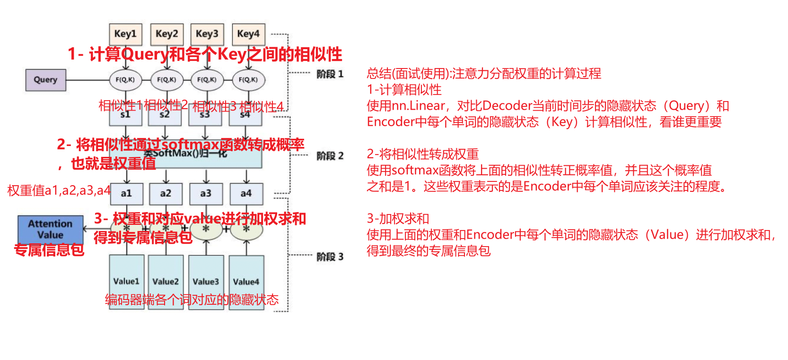

~~~properties
总结(面试使用):注意力分配权重的计算过程
1-计算相似性
使用nn.Linear，对比Decoder当前时间步的隐藏状态（Query）和
Encoder中每个单词的隐藏状态（Key）计算相似性，看谁更重要

2-将相似性转成权重
使用softmax函数将上面的相似性转正概率值，并且这个概率值
之和是1。这些权重表示的是Encoder中每个单词应该关注的程度。

3-加权求和
使用上面的权重和Encoder中每个单词的隐藏状态（Value）进行加权求和，
得到最终的专属信息包

Key和Value大多数情况是完全相同，表示编码器端的词经过GRU以后得到的隐藏状态
~~~


#### 硬注意力【了解】

~~~properties
硬性注意力: 根据注意力分布选择输入向量中的一个作为输出。这里有两种选择方式：
	1- 选择注意力分布中，分数最大的那一项对应的输入向量作为Attention机制的输出
	2- 根据注意力分布进行随机采样，采样结果作为Attention机制的输出
	只关注被选中的部分，那么权重就是1；没选中的不关注，那么权重就是0
	
硬性注意力通过以上两种方式选择Attention的输出，这会使得最终的损失函数与注意力分布之间的函数关系不可导，导致无法使用反向传播算法训练模型，硬性注意力通常需要使用强化学习来进行训练。因此，一般深度学习算法会使用软性注意力的方式进行计算。
~~~


#### 自注意力

~~~properties
自注意力机制: 对每个输入项分配的权重取决于输入项之间的相互作用，即通过输入项内部的"表决"来决定应该关注哪些输入项。
也就是指的是Source内部元素之间或者Target内部元素之间发生的注意力机制，也可以理解为Target=Source这种特殊情况下的注意力机制。

和前两种相比，在处理很长的输入时，具有并行计算的优势。

Transformer框架内部用到了自注意力机制。

结论: query、key、value，如果相等，就是自注意力机制；否则就不是
~~~


### 注意力计算规则

#### Tensorflow版本（传统方式）

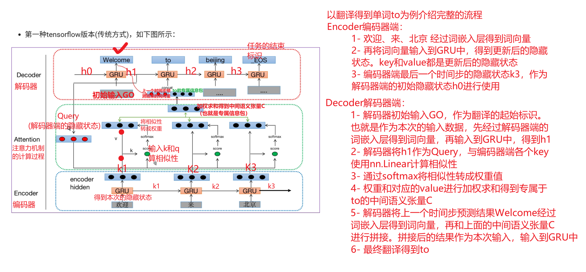

~~~properties
Seq2Seq+注意力机制的架构中：
	Query: 是当前时间步解码器中GRU输出的隐藏状态
	  Key: 是当前时间步编码器中GRU输出的隐藏状态
	Value: 与Key相同，也是编码器中GRU输出的隐藏状态
       h0: 解码器的初始隐藏状态h0不是随机初始化的，而是由编码器最后一个时间步的隐藏状态初始化而来
       
    
以翻译得到单词to为例介绍完整的流程
Encoder编码器端：
	1- 欢迎、来、北京 经过词嵌入层得到词向量
	2- 再将词向量输入到GRU中，得到更新后的隐藏状态。key和value都是更新后的隐藏状态
	3- 编码器端最后一个时间步的隐藏状态k3，作为解码器端的初始隐藏状态h0进行使用
        
        
Decoder解码器端：
	1- 解码器初始输入GO，作为翻译的起始标识。也就是作为本次的输入数据，先经过解码器端的词嵌入层得到词向量，再输入到GRU中，得到h1
    2- 解码器将h1作为Query，与编码器端各个key使用nn.Linear计算相似性
    3- 通过softmax将相似性转成权重值
    4- 权重和对应的value进行加权求和得到专属于to的中间语义张量C
	5- 解码器将上一个时间步预测结果Welcome经过词嵌入层得到词向量，再和上面的中间语义张量C进行拼接。拼接后的结果作为本次输入，输入到GRU中
    6- 最终翻译得到to
~~~


#### Pytorch版本（改进版）【掌握】

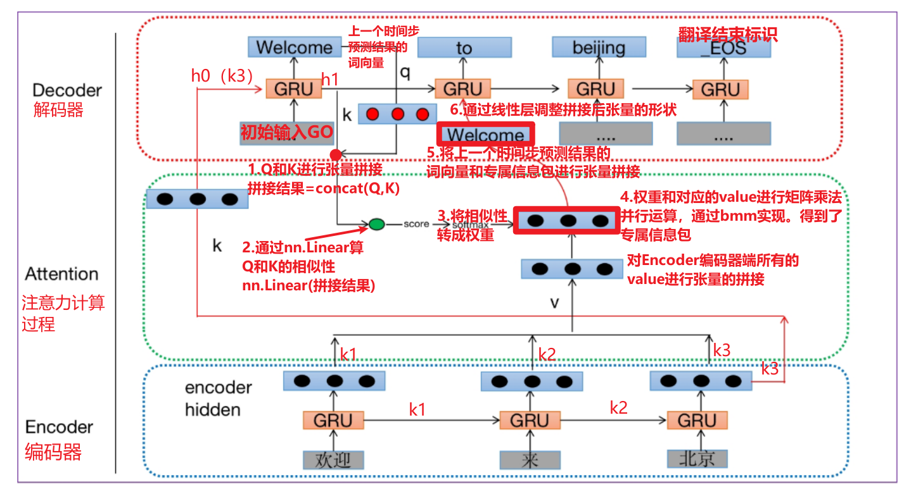

~~~properties
以翻译得到单词to为例介绍完整的流程
Encoder编码器端：
    1: 欢迎、来、北京 经过词嵌入层得到词向量
    2: 再将词向量输入到GRU中，得到对应的隐藏状态。key和value就是对应时间步的隐藏状态
    *3: 对编码器端所有词对应value张量进行拼接操作。
       例如：每个批次1条句子，每条句子5个词，每个词的隐藏状态维度是8，也就是5个[1,1,8]拼接得到[5seq_len,1batch_size,8]。如果batch_first=True，那么就是[1,5,8]
    4: 编码器端最后一个时间步的隐藏状态会作为解码器端的初始隐藏状态h0使用，
       同时作为初始的Key来使用，目的是提高机器翻译的效果
    
Decoder解码器端：
    1: 解码器初始输入GO作为翻译的起始标识到GRU中，生成第一个词Welcome和本次的隐藏状态。也就是图中的h1
    *2: 解码器将上一个时间步翻译词Welcome的词向量作为Query，解码器端中上一个时间步隐藏状态作为Key
    *3: Query和Key进行张量拼接
    4: 使用nn.Linear计算拼接后张量的相似性
    5: 通过Softmax函数将相似性转成概率，也就是权重矩阵
    *6: 权重矩阵和value拼接后的矩阵张量进行【bmm并行计算】，得到属于to的专属信息包
    7: 解码器端将上一个时间步翻译词Welcome的词向量；再和to的专属信息包进行张量拼接
    8: 拼接后的结果经过nn.Linear进行形状转换后，再作为本次时间步的输入到GRU中翻译得到to
~~~


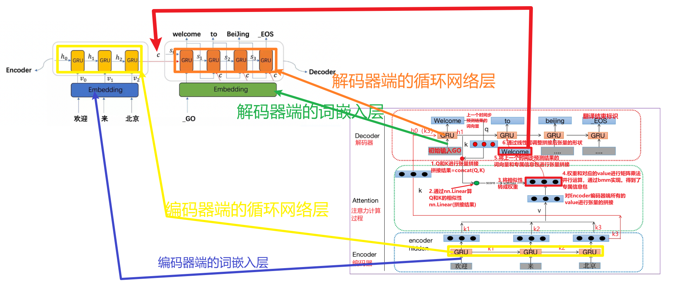


#### 计算公式

计算规则前提

```properties
1- 当Q、K、V相等, 称作自注意力
2- 当Q、K、V不相等时，称为一般注意力
3- 自注意力 和 一般注意力的区别，只是数据层面（也就是QKV是否相等）的区别
4- 具体计算得到 自注意力 和 一般注意力，有如下的3种公式。目前使用最多的是第1个和第3个。

注意: 
	1: 不要将注意力的三种类别（软注意力、硬注意力、自注意力） 和 注意力计算的3个公式搞混
	2: 也就是下面的3个公式，即能够算软注意力，也能够算自注意力
	3: Transformer框架中使用的是第3个公式算自注意力，原因是除以根号dk
```


三种规则方法

* 公式1: 将Q和K进行纵轴拼接，然后经过线性变换，再经过Softmax进行处理得到权重，最后和V进行相乘

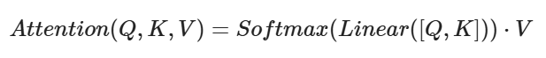


* 【了解】公式2：将Q和K进行纵轴拼接，接着经过一次线性变化，然后进过tanh激活函数处理，再进行sum求和，再经过softmax进行处理得到权重，最后和V进行张量的乘法

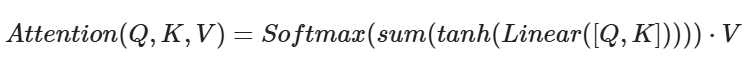


* 公式3：将Q和K的转置进行点乘，然后除以一个缩放系数，再经过softmax进行处理得到权重，最后和V进行张量的乘法

==注意：dk是k的维度，类似于词向量的维度==

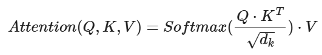

> **常见面试题：为什么公式要除以根号dk**
>
> **答：防止矩阵点乘运算结果过大，导致Softmax计算后概率值出现极端值，极大或极小。避免模型对这些极值学习的不好**

> **【了解】K为什么要转置？**
>
> **举例：**
>
> ​	**K和V的形状是相同的，假设K的形状是[N个词, M的隐藏状态]**
>
> ​	**Q是单个时间步的隐藏状态，形状是[1, M的隐藏状态]**
>
> ​	**为了能和V进行矩阵乘法运算，那么K需要转置**


bmm函数介绍：

~~~python
import torch

"""
    matmul和bmm总结
        1- 过程类似，都是对张量进行矩阵乘法的运算
        2- matmul是串行计算；bmm内部是并行计算
        3- bmm对两个张量的要求如下：
            3.1- 两个张量维度的第一个位置上的形状要完全相同，该位置表示的是batch_size
            3.2- 只能计算三维张量
        4- 为什么matmul能够对(1,3,4)和(10,4,5)能进行矩阵乘法。是因为内部有广播机制
            也就是会把(1,3,4)的形状扩大成(10,3,4)的形状
"""
if __name__ == '__main__':
    # 准备数据
    mat_1 = torch.randn(size=(10,3,4))
    # mat_1 = torch.randn(size=(1,3,4))
    mat_2 = torch.randn(size=(10,4,5))

    # matmul
    matmul_result = torch.matmul(mat_1,mat_2)
    print("matmul形状：",matmul_result.shape)  # 10,3,5

    # bmm
    bmm_result = torch.bmm(mat_1, mat_2)
    print("bmm形状：", bmm_result.shape)  # 10,3,5
~~~


### 注意力机制的作用

~~~properties
注意：编码器、解码器都可以选择是否要加注意力机制
1- 编码器、解码器【都不加】注意力机制，那么就是最初的Seq2Seq
2- 编码器、解码器【都加】注意力机制，那么就是后面要学的Transformer架构
3- 编码器不加注意力机制，而解码器加注意力机制，那么就是Seq2Seq+注意力
4- 编码器加注意力机制，而解码器不加注意力机制，这种情况很少见
~~~

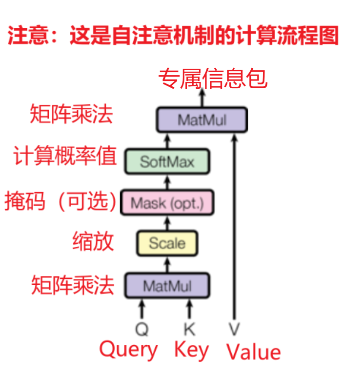


### 实现注意力机制【掌握】

* 步骤

```properties
第一步: 按照注意力规则，对Q、K、V进行注意力的计算
第二步: 如果第一步是拼接操作，需要将Q和第一步计算的结果进行再次拼接，如果是点乘运算，Q和K、V相等,一般属于自注意力，不需要拼接
第三步: 我们需要将第二步的结果，进行线性变化，按照指定输出维度进行结果的表示
```


* 原理图

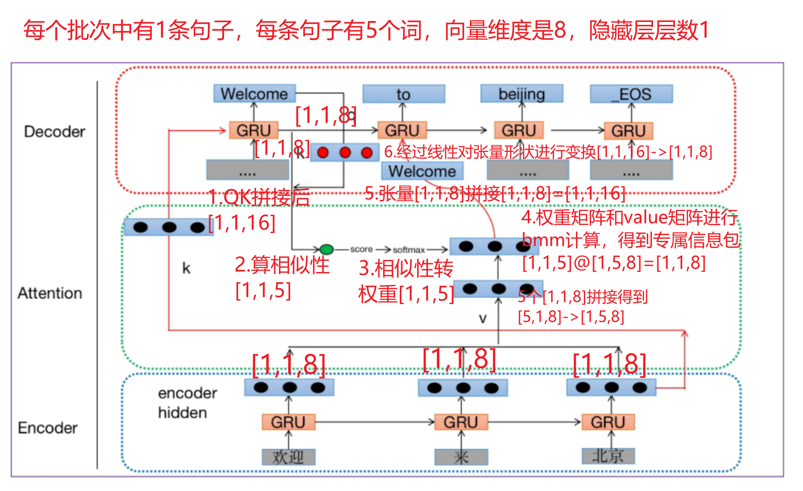

其中，Q与词经过GRU以后输出的output的形状是一样的，形状应该是[seq_len, batch_size, hidden_size]，应该是[5,1,8]。但是为什么标的是[1,1,8]？

答：一个词对应一个时间步，[5,1,8]表示的是5个词全部经过GRU处理后的最终结果。而Q表示的是上一个时间步翻译结果的词向量形式，注意它应该和一个时间步的张量形状相同。`[5,1,8]` 是“我看过的 5 个词”，`[1,1,8]` 是“我现在正在想的一个词”——Q 就是这个“正在想的词”的状态，所以它是 `[1,1,8]`，而不是 `[5,1,8]`


* 代码实现

```properties
import torch
import torch.nn as nn

class MyAttn(nn.Module):
    def __init__(self,query_size,key_size,value_size,weighted_size,output_size):
        """
        :param query_size: 第1步中，进行拼接Q张量的最后一个维度，也就是8
        :param key_size:第1步中，进行拼接K张量的最后一个维度，也就是8
        :param value_size: 第4步中，进行专属信息包计算时，V张量的最后一个维度，也就是8
        :param weighted_size: 第2、3步中，相似性张量、权重张量的最后一个维度，也就是5
        :param output_size: 第6步中，对[1,1,16]形状调整后得到[1,1,8]中8对应位置
        """

        # 1- 初始化父类
        super().__init__()

        # 2- 设置属性值
        self.query_size = query_size
        self.key_size = key_size
        self.value_size = value_size
        self.weighted_size = weighted_size
        self.output_size = output_size

        # 3- 搭建神经网络
        # 3.1- 计算相似性的线性层。也就是原理图中第2步
        """
            in_features：输入到该线性层的向量维度，也就是Q和K拼接后的张量
        """
        self.attn_linear = nn.Linear(in_features=self.query_size+self.key_size, out_features=self.weighted_size)
        # self.attn_linear = nn.Linear(in_features=16,out_features=5)

        # 3.2- 调整张量的形状，达到GRU输入的要求。也就是原理图中的第6步
        self.attn_combine_linear = nn.Linear(in_features=self.query_size+self.key_size, out_features=self.output_size)
        # self.attn_combine_linear = nn.Linear(in_features=16, out_features=8)

    def forward(self,Q,K,V):
        """
        计算专属信息包
        :param Q: query
        :param K: key
        :param V: value
        :return:
        """
        # 1- QK拼接
        qk_concat = torch.concat((Q,K),dim=-1)
        print(f"第1步：{qk_concat.shape}")

        # 2- 计算Q和K的相似性：用的时注意力计算的第1个公式 注意力=softmax(linear([Q,K])) @ V
        attn_score = self.attn_linear(qk_concat)
        print(f"第2步：{attn_score.shape}")

        # 3- 通过Softmax将相似性转成权重
        attn_weight = torch.softmax(attn_score,dim=-1)
        print(f"第3步：{attn_weight.shape}")

        # 4- 权重矩阵和V进行计算，得到专属信息包
        C = torch.bmm(attn_weight, V)
        print(f"第4步：{C.shape}")

        # 5- 拼接上一个时间步的预测结果词向量 和 专属信息包
        qc_concat = torch.concat((Q,C),dim=-1)
        print(f"第5步：{qc_concat.shape}")

        # 6- 经过线性层对张量进行进行变换：[1,1,16]形状调整后得到[1,1,8]
        output = self.attn_combine_linear(qc_concat)
        print(f"第6步：{output.shape}")

        return output,attn_weight

if __name__ == '__main__':
    # 因为只讲PyTorch中注意力是如何计算得到。因此拼接后的value、Q、V我们直接手动初始化

    # 1- 定义基础变量
    batch_size = 1      # 每个批次中句子的条数
    seq_len = 5         # 每个句子中词的个数
    hidden_size = 8     # 我们人为设置词向量维度和隐藏向量维度相同
    num_layers = 1      # 隐藏层层数

    # 2- 初始化Q、K、V
    Q = torch.randn(size=(batch_size,num_layers,hidden_size))
    K = torch.randn(size=(batch_size,num_layers,hidden_size))
    V = torch.randn(size=(batch_size,seq_len,hidden_size))      # 多个词的隐藏状态拼接后的

    # 3- 计算注意力
    query_size = hidden_size
    key_size = hidden_size
    value_size = hidden_size
    weighted_size = seq_len
    output_size = hidden_size

    attn_model = MyAttn(query_size,key_size,value_size,weighted_size,output_size)
    output,attn_weight = attn_model(Q,K,V)

    print(f"权重值{attn_weight}")
    print(f"权重值和{attn_weight.sum()}")
```


## 让代码运行在GPU上

==Windows、Linux、Mac(M芯片)均可==

==Windows(无独显)、Mac(Intel芯片)不行==

* 步骤

~~~properties
1: 【推荐】创建新的虚拟环境进行操作
	conda create -n nlp_cuda python==3.10
	
2: 进入虚拟环境
	conda activate nlp_cuda

3: 去黑窗口查看你本机的CUDA版本。【推荐】先升级英伟达。【操作截图见下面】
	nvidia-smi

4: 去Pytorch官网找到对应你cuda版本的下载命令，【截图见下面】
	官网地址: https://pytorch.org

5: 安装对应版本的cuda。安装命令
	pip3 install torch torchvision --index-url https://download.pytorch.org/whl/cu130

6: 在PyCharm中关联新的沙箱, 运行下边的代码测试即可.

7: 如果不OK,大概率是 显卡驱动(Cuda版本) 和 你的PyTorch版本不兼容, 建议: 直接更新驱动.

8: 要安装的其他包，一个一个安装即可
	pip install jieba -i https://pypi.tuna.tsinghua.edu.cn/simple/
    pip install tensorflow -i https://pypi.tuna.tsinghua.edu.cn/simple/
    pip install joblib -i https://pypi.tuna.tsinghua.edu.cn/simple/
    pip install fasttext-wheel -i https://pypi.tuna.tsinghua.edu.cn/simple/
    pip install seaborn -i https://pypi.tuna.tsinghua.edu.cn/simple/
    pip install matplotlib==3.8.4 -i https://pypi.tuna.tsinghua.edu.cn/simple/
    pip install wordcloud -i https://pypi.tuna.tsinghua.edu.cn/simple/
    pip install tqdm -i https://pypi.tuna.tsinghua.edu.cn/simple/
~~~

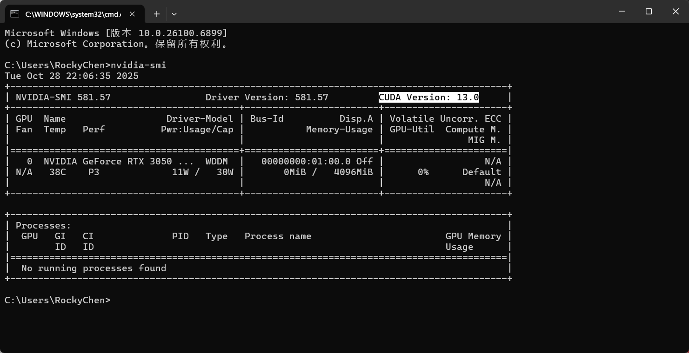


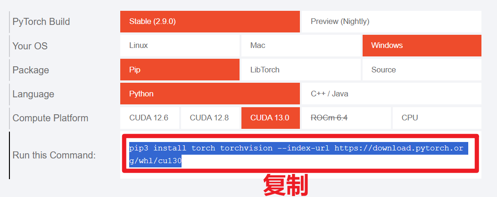

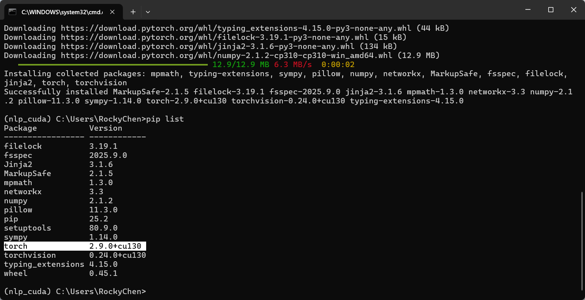

* 代码

~~~python
import torch

# 设备选择，我们可以选择在cuda或者cpu上运行你的代码
device = torch.device("cuda" if torch.cuda.is_available() else "cpu")
# 如果是Mac M芯片, 写这个
# device = 'mps'

print(f'device: {device}')
~~~


## Seq2Seq英译法案例【多练习】

### 任务目的

```properties
目的: 给定一段英文，翻译为法文
典型的文本分类任务: 每个时间步去预测应该属于哪个法文单词
```


### 数据格式

- 注意：两列数据，第一列是英文文本，第二列是法文文本，中间用制表符号"\t"隔开

```properties
i am from brazil .  je viens du bresil .
i am from france .  je viens de france .
i am from russia .  je viens de russie .
i am frying fish .  je fais frire du poisson .
i am not kidding .  je ne blague pas .
```


### 实现流程

```properties
1. 获取数据:案例中是直接给定的
2. 数据预处理: 脏数据清洗、数据格式转换、数据源Dataset的构造、数据迭代器Dataloader的构造
3. 模型搭建: 编码器和解码器等一系列模型
4. 模型评估
5. 模型上线
```


### 基础准备

~~~python
import re
import torch
import torch.nn as nn
import torch.nn.functional as F
from torch.utils.data import Dataset, DataLoader
import torch.optim as optim
import time
import random
import matplotlib.pyplot as plt
from tqdm import tqdm
plt.rcParams['font.sans-serif'] = ['SimHei']  # Mac本字体改为: ['Arial Unicode MS']
plt.rcParams['axes.unicode_minus'] = False

# 设备选择, 我们可以选择在cuda或者cpu上运行你的代码
device = torch.device("cuda" if torch.cuda.is_available() else "cpu")
# 如果是Mac M芯片, 写这个.
# device = 'mps'

# 1- 定义特殊标识和全局变量
SOS_token = 0   # 起始标识和索引
EOS_token = 1   # 结束标识和索引
MAX_LENGTH = 10 # 限定句子的最大长度为10，含标点在内
data_path = "data/eng-fra-v2.txt"   # 语料库路径
~~~


### 数据预处理

#### 定义样本清洗函数和构建字典

- 目的

```properties
样本清洗函数: 将脏数据进行清洗，以免影响模型训练
构建字典:一方面是为了将文本进行数字表示，还有一方面进行解码的时候将预测索引数字映射为真实的文本
```

- 样本清洗函数代码实现

```python
# 2- 数据清洗
def normalizeString(line):
    # 将内容全部转成小写；去除每个句子前后空白（空格、制表符、回车）字符串
    line = line.lower().strip()

    # 在标点符号（.!?）的前面加上空格
    line = re.sub(r"([.!?])",r" \1",line)

    # 除了26个字母和基础的标点符号（.!?）这些以外的其他内容，全部清除，替换为空格
    line = re.sub(r"[^a-z.!?]+", " ", line)

    return line
```

- 构建字典代码实现

```python
# 3- 读取文件内容，处理得到字典
def my_getdata():
    # 1. 读取文件
    # 下面的写法更优，能够及时释放文件资源
    with open(data_path,mode="r",encoding="UTF-8") as file_obj:
        lines = file_obj.readlines()

    # 2. 对每一行都进行处理，得到 英文和法文 的句子对
    """
        目前的lines内容：["英语句子\t法语句子\n", "英语句子\t法语句子\n"]
        最终想要的结构是：[["英语句子","法语句子"]]
    """
    # my_pairs = []
    # for line in lines:
    #     tmp_list = []
    #     for eng_fra in line.split("\t"):
    #         tmp_list.append(normalizeString(eng_fra))
    #     my_pairs.append(tmp_list)

    # 上面是普通的写法
    my_pairs = [[normalizeString(eng_fra) for eng_fra in line.split("\t")] for line in lines]
    # print(my_pairs)

    # 3. 分别构建得到英文、法文的 word->index的映射关系
    # 3.1- 定义字典
    english_word2index = {"SOS":SOS_token,"EOS":EOS_token}
    english_word_n = 2
    france_word2index = {"SOS": SOS_token, "EOS": EOS_token}
    france_word_n = 2

    # 3.2- 对每个英语、法语句子进行分词处理；去重然后放到字典中
    for eng_fra in my_pairs:
        # 处理英语
        for word in eng_fra[0].split(" "):
            if word not in english_word2index:
                english_word2index[word] = english_word_n
                english_word_n += 1

        # 处理法语
        for word in eng_fra[1].split(" "):
            if word not in france_word2index:
                france_word2index[word] = france_word_n
                france_word_n += 1

    # 4. 分别构建得到英文、法文的 index->word的映射关系
    english_index2word = {index:word for word,index in english_word2index.items()}
    france_index2word = {index:word for word,index in france_word2index.items()}

    return english_word2index,english_index2word,english_word_n,france_word2index,france_index2word,france_word_n,my_pairs

# 调用my_getdata方法，将返回值设置为全局变量。因为 后面都要用到
english_word2index,english_index2word,english_word_n,france_word2index,france_index2word,france_word_n,my_pairs = my_getdata()
```


#### 构建DataSet

- 目的

```properties
使用Pytorch框架，一般遵从一个规矩：使用DataSet方法构造数据源，来让模型进行使用
构造数据源的过程中:必须继承torch.utils.data.Dataset类，必须构造两个魔法方法：__len__(), __getitem__()
__len__(): 一般返回的是样本的总个数，我们可以直接len(dataset对象)直接就可以获得结果
__getitem__(): 可以根据某个索引取出样本值，我们可以直接用dataset对象[index]来直接获得结果
```

- 代码实现

```python
# 定义 MyPairsDataset数据集类.
class MyPairsDataset(Dataset):
    def __init__(self,my_pairs):
        self.my_pairs = my_pairs # 英语、法语句子对。嵌套列表
        self.sample_len = len(my_pairs) # 样本条数

    def __len__(self):
        # 返回样本总条数
        return self.sample_len

    def __getitem__(self, index):
        # 1- index索引值调整，防止越界并且不考虑负索引
        index = min(max(index,0), self.sample_len - 1)

        # 2- 获得字符串形式的 特征数据（英语句子） 和 目标值数据（法语句子）
        x = self.my_pairs[index][0]
        y = self.my_pairs[index][1]

        # 3- 句子中的词替换成对应的索引：先分词得到单词，通过单词查询得到对应的索引
        """
            为什么这里只是在句子的后面专门添加了句子的结束标识EOS_token，而没有添加句子的开始标识SOS_token？
            在Seq2Seq+注意力机制中，不管是编码器还是解码器中输入进去的句子的末尾都必须加上EOS_token，明确告诉处理已经结束了
            而SOS_token不是必须加的，可以在解码器中加
        """
        x = [english_word2index[word] for word in x.split(" ")]
        x.append(EOS_token)
        tensor_x = torch.tensor(x,dtype=torch.long,device=device)

        y = [france_word2index[word] for word in y.split(" ")]
        y.append(EOS_token)
        tensor_y = torch.tensor(y, dtype=torch.long, device=device)

        return tensor_x,tensor_y
```


#### 构建Dataloader

- 目的

```properties
为了将Dataset我们上一步构建的数据源，进行再次封装，变成一个迭代器，可以进行for循环，而且，可以自动为我们dataset里面的数据进行增维（bath_size）,也可以随机打乱我们的取值顺序
```

- 代码实现

```python
def get_dataloader():
    # 1- 创建Dataset
    dataset = MyPairsDataset(my_pairs)

    # 2- 创建Dataloader
    dataloader = DataLoader(dataset,batch_size=1,shuffle=True)

    # 3- 遍历Dataloader
    # for x,y in dataloader:
    #     print(f"x-->{x.shape}-->{x}")
    #     print(f"y-->{y.shape}-->{y}")
    #     break

    return dataloader
```


### 模型搭建

#### 搭建编码器GRU模型

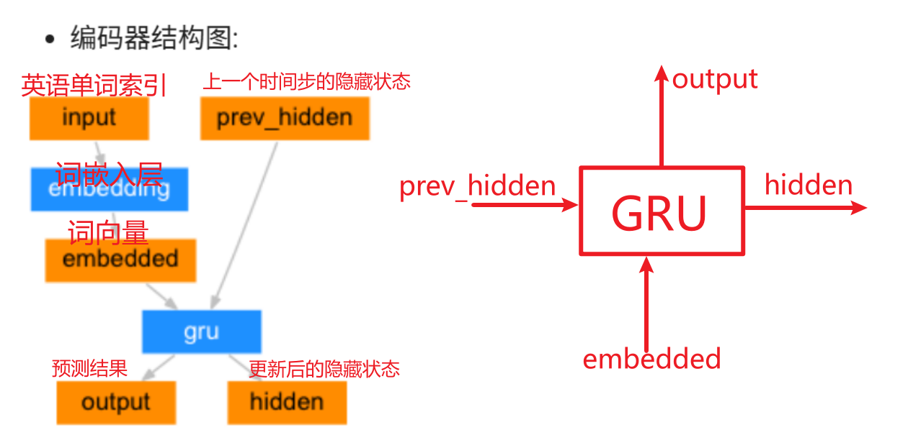

- 代码实现

```python
# 6- 编码器，没有注意力机制
class Encoder(nn.Module):
    def __init__(self,vocab_size,input_size,hidden_size):
        """
        初始化方法
        注：在有注意力机制的神经网络结构中，有的时候推荐将input_size和hidden_size的值设置相同，
           这样可以避免需要进行nn.Linear的线性转换
        :param vocab_size: 编码器中词嵌入层的词汇表大小，也就是2803个【英语】单词
        :param input_size: 词向量维度，例如：256
        :param hidden_size: 隐藏层隐藏状态的向量维度，例如：256
        """

        # 1- 初始化父类
        super().__init__()

        # 2- 属性设置
        self.hidden_size = hidden_size

        # 3- 搭建神经网络结构
        # 3.1- 词嵌入层
        """
            num_embeddings：词汇表中词的个数
            embedding_dim：词向量维度
        """
        self.ebd = nn.Embedding(num_embeddings=vocab_size,embedding_dim=input_size)

        # 3.2- GRU层
        """
            input_size：输入的词向量维度。必须和上面的embedding_dim保持一致
            hidden_size：隐藏层隐藏状态的向量维度
            num_layers：隐藏层的层数
            batch_first：用来调整输入和输出的张量形状，注意：不能调整hidden隐藏状态的张量形状。
                        例如：[seq_len,batch_size,input_size] -> [batch_size,seq_len,input_size]
        """
        self.gru = nn.GRU(input_size=input_size,hidden_size=hidden_size,num_layers=1,batch_first=True)

    def forward(self, input, hidden):
        """
        前向传播，输入词索引到编码器中
        :param input: 输入词的索引，形状：[batch_size每个批次中几条句子, seq_len每个句子中有几个词]
        :param hidden: 隐藏层隐藏状态，形状：[num_layers,batch_size,hidden_size]
        :return:
        """

        # 1- 词嵌入层：输入词的索引，得到词向量
        """
            输入参数input的形状：[batch_size每个批次中几条句子, seq_len每个句子中有几个词]
            输出结果embed的形状：[batch_size每个批次中几条句子, seq_len每个句子中有几个词,input_size词向量维度]
        """
        embed = self.ebd(input)

        # 2- GRU层
        """
            输入参数的形状：
                embed：[batch_size每个批次中几条句子, seq_len每个句子中有几个词,input_size词向量维度]
                hidden：[num_layers,batch_size,hidden_size]
            
            输出结果的形状：
                output：[batch_size,seq_len,hidden_size]  因为前面设置了batch_first=True
                hidden：[num_layers,batch_size,hidden_size]
        """
        output,hidden = self.gru(embed,hidden)

        # 3- 返回结果
        return output,hidden

    def init_hidden(self):
        # 将指定数据放到具体的设备上
        return torch.zeros(size=(1,1,self.hidden_size),device=device)
```

- 编码器模型测试

```python
# 7- 测试编码器
def use_encoder():
    # 1- 准备数据
    dataloader = get_dataloader()

    # 2- 创建编码器对象
    my_encoder = Encoder(vocab_size=english_word_n,input_size=256,hidden_size=256)
    # 将对象发送到对应的设备
    my_encoder = my_encoder.to(device)

    # 3- 遍历数据，进行前向传播
    for x,y in dataloader:
        # 3.1- 初始化隐藏状态
        hidden = my_encoder.init_hidden()

        # 3.2- 前向传播
        output,hidden = my_encoder(x,hidden)

        print(f"2-output形状-->{output.shape}") # 1,词的个数,256
        print(f"3-hidden形状-->{hidden.shape}") # 1,1,256

        break
```


#### 搭建解码器无Attention模型

* 流程

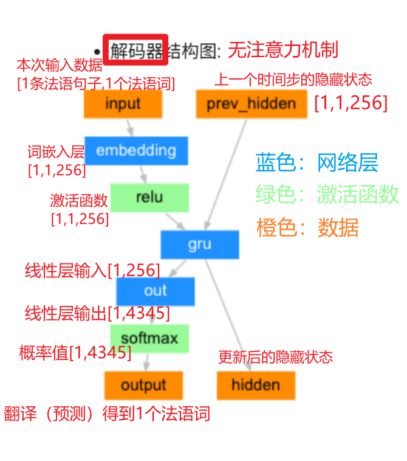

- output[-1]和output[0]的区别

~~~python
import torch

if __name__ == '__main__':
    output = torch.randn(size=(3,2,4))
    print(output)

    print("-"*30)

    output_1 = output[-1]
    print(output_1)
    print(output_1.shape)  # [2,4]

    print("-" * 30)

    output_0 = output[0]
    print(output_0)
    print(output_0.shape)  # [2,4]
~~~


- 代码实现

```python
# 8- 解码器：无注意力机制
class Decoder(nn.Module):
    def __init__(self,vocab_size,hidden_size):
        """
        :param vocab_size:  解码器中词汇表大小，也就是法语词的个数4345个
        :param hidden_size: 隐藏层隐藏状态的向量维度。
            因为是人为设置embedding_dim和hidden_size，因此该参数也表示词向量的维度。但是你可以设置的不一致
        """

        # 1- 初始化父类
        super().__init__()

        # 2- 设置属性值
        self.vocab_size = vocab_size
        self.hidden_size = hidden_size

        # 3- 搭建网络结构
        # 3.1- 词嵌入层
        self.embedding = nn.Embedding(num_embeddings=self.vocab_size,embedding_dim=self.hidden_size)

        # 3.2- 循环网络层：GRU
        self.gru = nn.GRU(input_size=self.hidden_size,hidden_size=self.hidden_size,num_layers=1,batch_first=True)

        # 3.3- 线性层
        self.out = nn.Linear(in_features=self.hidden_size,out_features=self.vocab_size)

        # 3.4- 输出的激活函数
        self.softmax = nn.LogSoftmax(dim=-1)

    def forward(self,input,hidden):
        """
        前向传播。翻译得到法语词
        :param input: 上一个时间步的预测法语词的词索引（也就是要将上个时间步预测结果作为本次输入使用），
            张量形状：[1每个批次中法语句子的条数,1每次只传递一个法语词]。数据内容举例：[[法语词索引]]
        :param hidden: 上一个时间步的隐藏状态，张量形状：[num_layers,batch_size,hidden_size]
        :return:
        """

        # 1- 调用词嵌入层：输入词索引，得到词向量
        ebd = torch.relu(self.embedding(input))

        # 2- 调用GRU
        """
            因为前面__init__中设置了batch_first为True，因此只会影响ebd和output的张量形状
            
            输入参数形状：
                ebd：    [batch_size,seq_len,hidden_size]
                hidden： [num_layers,batch_size,hidden_size]
                
            返回结果形状：
                output： [batch_size,seq_len,hidden_size]
                hidden： [num_layers,batch_size,hidden_size]
        """
        output,hidden = self.gru(ebd,hidden)

        # 3- 调用线性层和激活函数，得到预测的概率值
        # 3.1- 将output降维为二维：因为线性层只能处理二维数据
        """
            output[-1]针对：分类场景，也就是N vs 1的情况。取得是最后一个时间步的隐藏状态
            output[0]针对：batch_size为1，同时是翻译、文本生成的场景，也就是N vs M的情况。取得是第一个时间步的隐藏状态
                假设batch_size>1的情况，output[0]需要改成如下的两种写法中的某一种：
                    第一种：output[:,0,:]
                    第二种：output.squeeze(1)
        """
        output = output[0]

        # 3.2- 调用线性层
        output = self.softmax(self.out(output))

        # 4- 返回
        return output,hidden

    def init_hidden(self):
        return torch.zeros(size=(1,1,self.hidden_size), device=device)
```

- 代码测试

```python
# 9- 解码器测试
def use_decoder():
    # 1- 准备数据
    dataloader = get_dataloader()

    # 2- 创建编码器和解码器
    my_encoder = Encoder(vocab_size=english_word_n,input_size=256,hidden_size=256).to(device)
    my_decoder = Decoder(vocab_size=france_word_n,hidden_size=256,output_size=france_word_n).to(device)

    # 3- 遍历Dataloader
    for x,y in dataloader:
        # x是英语句子，y是法语句子[batch_size,seq_len词的个数]

        # 3.1- 对英语句子进行编码
        h0 = my_encoder.init_hidden()
        output,hidden = my_encoder(x,h0)

        # 3.2- 进行解码翻译得到法语句子，要一个一个法语词进行单独的处理
        for i in range(y.shape[1]):
            # 3.3- 提取法语词的索引
            tmp = y[0][i].reshape(1,-1)   # 形状是[1,1]，例如：[[词索引]]

            # 3.4- 调用解码器
            """
                输入参数中的hidden，第一次输入进去的是编码器端最后一个时间步的隐藏状态
                注意：返回结果变量名只能叫hidden，为了将更新后的隐藏状态传递给到下一个时间步使用
            """
            output,hidden = my_decoder(tmp,hidden)

            print(f"法语的第{i+1}词，output-->{output.shape}")

        # 只处理一对英语和法语句子
        break
```


#### 搭建解码器带Attention模型

- 流程

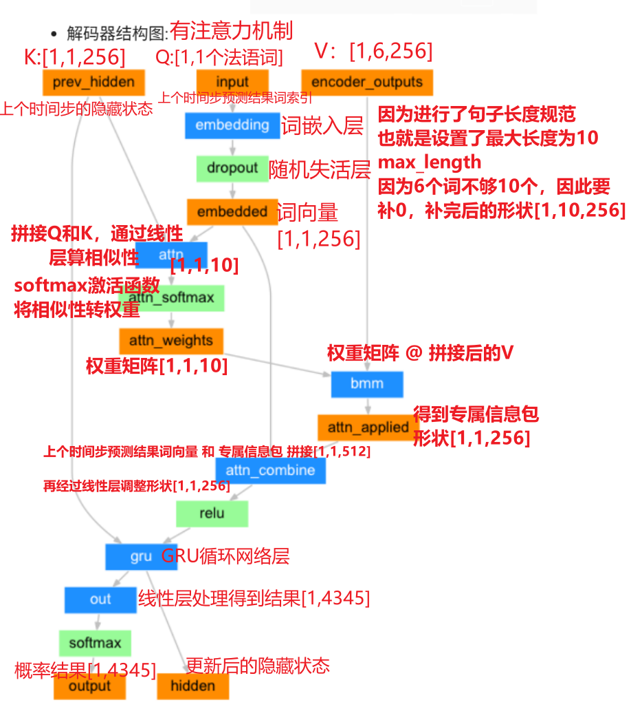

```properties
初始化：
	1. 初始化父类成员
    2. 保存输入参数
    3. 词嵌入层
    4. 注意力权重计算层：计算Q和K的相似性
    5. 注意力融合层, 将 词嵌入 和 注意力权重进行融合
    6. dropout层, 随机丢弃部分神经元, 防止过拟合
    7. GRU层: 处理序列数据, 维持隐藏状态
    8. 输出层: 将GRU的隐藏状态映射为: 目标词汇表大小
    9. 对数softmax层, 将输出映射为 对数softmax概率分布
    
    
前向传播:
	1. 词嵌入层
    	应用Dropout, 随机失活
    2. 计算相似性，并且把相似性转成概率
    3. 计算得到专属信息包
    4. Q和专属信息包拼接：【上一个时间步翻译得到词的词向量】 和 【专属信息包】 拼接
    5. 调整形状，达到输入GRU的形状要求
    6. 激活函数处理, 增加模型的非线性能力
    7. 调用GRU层
    8. 输出层：得到GRU输出的预测结果，并且转成最终的词汇表概率
    9. 返回结果
```

- 代码实现

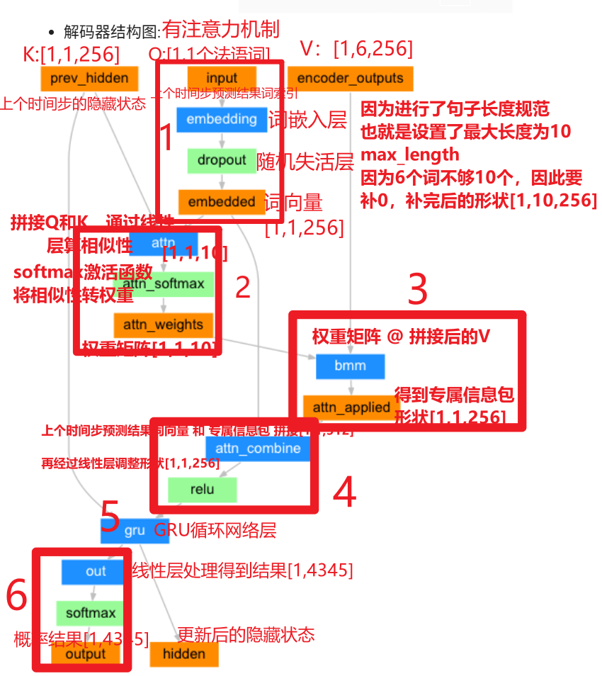

```python
# 10- 解码器：有注意力机制
class AttnDecoder(nn.Module):
    def __init__(self,vocab_size,hidden_size,dropout_p=0.1):
        # 1- 初始化父类
        super().__init__()

        # 2- 设置属性值
        self.vocab_size = vocab_size    # 法语词汇表大小
        self.hidden_size = hidden_size  # 代表如下几个信息：词向量维度、隐藏状态向量维度
        self.dropout_p = dropout_p      # 随机失活概率

        # 3- 搭建网络结构
        # 3.1- 词嵌入层
        self.embedding = nn.Embedding(num_embeddings=self.vocab_size,embedding_dim=self.hidden_size)
        # 词嵌入层后面的随机失活层
        self.dropout = nn.Dropout(p=self.dropout_p)

        # 3.2- 线性层：用来计算Q和K拼接后的相似性
        self.attn = nn.Linear(in_features=self.hidden_size+self.hidden_size,out_features=MAX_LENGTH)

        # 3.3- 线性层：拼接【上一个时间步翻译结果法语词的词向量】和【专属信息包】，然后将张量形状调整为GRU要求的形状
        self.attn_combine = nn.Linear(in_features=self.hidden_size+self.hidden_size,out_features=self.hidden_size)

        # 3.4- GRU循环网络层
        self.gru = nn.GRU(input_size=self.hidden_size,hidden_size=self.hidden_size,num_layers=1,batch_first=True)

        # 3.5- 线性层：输出层
        self.out = nn.Linear(in_features=self.hidden_size,out_features=self.vocab_size)

        # 3.6- 对数激活函数
        self.softmax = nn.LogSoftmax(dim=-1)

    def forward(self,input, key, value):
        """
        :param input: 上一个时间步的预测法语词的词索引。张量形状：[batch_size,seq_len]。seq_len后续我们是一个个法语词进行传递
        :param key: 上一个时间步的隐藏状态，也就是流程图中的prev_hidden。张量形状：[num_layers,batch_size,hidden_size]
        :param value: 编码器端多个词的隐藏状态拼接后的张量。张量形状：[batch_size,seq_len是固定值为MAX_LENGTH,hidden_size]
        :return:
        """
        # 1- input转成词向量，也就是得到Q
        # 方式一：分步骤的版本
        # ebd = self.embedding(input)
        # embedded = self.dropout(ebd)

        # 方式二：合并的版本
        Q = self.dropout(self.embedding(input))

        # 2- Q和K拼接；算相似性；相似性转成权重
        # 方式一：分步骤的版本
        qk_concat = torch.concat((Q,key),dim=-1)     # Q和K拼接
        qk_score = self.attn(qk_concat)                     # 算相似性
        attn_weights = torch.softmax(qk_score,dim=-1)       # 相似性转成权重

        # 方式二：合并的版本
        # attn_weights = torch.softmax(self.attn(torch.concat((Q,key),dim=-1)), dim=-1)

        # 3- 权重矩阵和value进行矩阵乘法运算，得到专属信息包
        attn_applied = torch.bmm(attn_weights,value)

        # 4- 【上一个时间步的预测法语词的词向量】和【专属信息包】拼接；调整拼接后的形状，达到GRU的输入要求
        qc_concat = torch.concat((Q,attn_applied),dim=-1)   # 【上一个时间步的预测法语词的词向量】和【专属信息包】拼接
        gru_input = torch.relu(self.attn_combine(qc_concat))

        # 5- 调用GRU
        output,hidden = self.gru(gru_input,key)

        # 6- 计算预测概率
        output = output[0]
        output = self.softmax(self.out(output))

        # 7- 返回结果
        return output,hidden,attn_weights

    def init_hidden(self):
        return torch.zeros(size=(1,1,self.hidden_size), device=device)
```

- 模型测试

```python
# 11- 测试解码器
def use_attn_decoder():
    # 1- 准备数据
    dataloader = get_dataloader()

    # 2- 创建编码器和解码器
    my_encoder = Encoder(vocab_size=english_word_n,input_size=256,hidden_size=256).to(device)
    my_decoder = AttnDecoder(vocab_size=french_word_n,hidden_size=256).to(device)

    # 3- 遍历数据加载器进行翻译
    for x,y in dataloader:
        # x是英语句子，里面存放的是单词的索引。张量形状[batch_size,seq_len]
        # y是法语句子，里面存放的是单词的索引。张量形状[batch_size,seq_len]

        # 3.1- 先调用编码器
        # 3.1.1- 解码器
        h0 = my_encoder.init_hidden()
        output,hidden = my_encoder(x,h0)    # hidden就是中间语义张量C

        # 3.1.2- 句子长度规范处理。统一到词个数为10的长度
        # 初始化一个[1,MAX_LENGTH,256]的全0张量
        value = torch.zeros(size=(1,MAX_LENGTH,256), device=device)
        # 计算需要复制的词个数
        copy_len = min(MAX_LENGTH, x.shape[1]) # x.shape[1]获取当前英语句子中词的个数
        # 将已有的数据复制到value中
        """
            为什么用output而不使用hidden来取隐藏状态信息数据？
            答：output记录的是最后一层，每个时间步的隐藏状态
               hidden记录的是每一层，最后一个时间步的隐藏状态
               但是value，是编码器端每个词的隐藏状态的拼接
        """
        value[:,:copy_len,:] = output[:,:copy_len,:]

        # 3.2- 再调用解码器。要一个一个法语词传递进解码器
        for i in range(y.shape[1]):
            # 3.3- 先提取法语词的索引，再将索引变成二维张量，最终形状是[[法语词索引]]
            french_word_index_2dtensor = y[0][i].reshape(1,-1)
            print(f"y={y}，y[0]={y[0]}，y[0][i]={y[0][i]}")

            # 3.4- 调用解码器
            output,hidden,attn_weights = my_decoder(french_word_index_2dtensor, hidden, value)

            print(f'解码output.shape: {output.shape}')  # [1, 4345]
            print(f'解码hidden.shape: {hidden.shape}')  # [1, 1, 256]
            print(f'解码att_weights: {attn_weights}')
            print(f'解码att_weights和: {attn_weights.sum()}')
            print(f'解码att_weights.shape: {attn_weights.shape}')  # [1, 1, 10]

            print("-"*30)
        break # 只跑一对英语句子和法语句子
```


### 模型训练

- 基本过程

```properties
整体流程：
    1. 获取数据集加载器对象
    2. 模型初始化
    3. 优化器初始化
    4. 损失函数初始化. 使用 NLLLoss() 负数对数似然损失
    5. 训练参数初始化
    6. 循环训练
        6.1 外层循环, 控制训练轮数
        6.2 内层循环, 遍历数据集的每个样本(即: 每轮具体的训练过程)
            具体训练过程看下面的步骤
        6.3 打印训练日志 (每1000个样本打印一次)
        6.4 记录损失用于绘图(每100个样本记录一次)
    7. 保存模型
    8. 训练结束后, 绘制损失曲线
    9. 训练结束, 返回结果

------------------------------------------------

具体训练过程：
	1. 编码阶段, 将输入的序列转换为上下文向量
    2. 解码参数准备
        2.1 构建编码器的输出张量, 用于注意力计算, 形状为: [10, 256]
        2.2 解码器初始化隐藏状态
        2.3 解码器的初始输入
    3. 初始化损失值
    4. 根据概率值决定是否用 Teacher forcing
		4.1 teacher forcing模型: 使用真实标签作为下一步的输入
		4.2 非Teacherforcing模型: 使用上一时间步的预测结果作为下一步的输入
    5. 反向传播 和 参数更新
    6. 返回平均损失
```

- 代码实现

```python
def train():
    # 1. 获取数据集加载器对象
    dataloader = get_dataloader()

    # 2. 模型初始化
    size = 256
    my_encoder = Encoder(vocab_size=english_word_n,input_size=size,hidden_size=size).to(device=device)
    my_decoder = AttnDecoder(vocab_size=french_word_n,hidden_size=size).to(device=device)

    # 3. 优化器初始化
    encoder_adam = torch.optim.Adam(params=my_encoder.parameters(),lr=1e-4)
    decoder_adam = torch.optim.Adam(params=my_decoder.parameters(),lr=1e-4)

    # 4. 损失函数初始化. 使用 NLLLoss() 负数对数似然损失
    loss = nn.NLLLoss()

    # 5. 训练参数初始化
    epochs = 1
    plot_avg_loss_list = [] # 平均损失值列表，用来画图

    # 6. 循环训练
    for epoch in range(epochs):
        # 6.1 外层循环, 控制训练轮数

        plot_total_loss = 0.0
        print_total_loss = 0.0

        # 6.2 内层循环, 遍历数据集的每个样本(即: 每轮具体的训练过程)
        for index,(x,y) in enumerate(tqdm(dataloader),start=1):
            """
                index：样本条数
                x：英语句子
                y：法语句子
            """
            # 具体训练过程看下面的步骤
            myloss = train_iters(x,y,my_encoder,my_decoder,encoder_adam,decoder_adam,loss)

            plot_total_loss += myloss
            print_total_loss += myloss

            # 6.3 记录损失用于绘图(每100个样本记录一次)
            if index%100==0:
                # 计算平均损失 = 总损失 / 100
                avg_loss = plot_total_loss/100
                # 记录指标
                plot_avg_loss_list.append(avg_loss)
                plot_total_loss = 0.0

            # 6.4 打印训练日志 (每1000个样本打印一次)
            if index%1000==0:
                # 计算平均损失 = 总损失 / 1000
                avg_loss = print_total_loss/1000
                print(f"第{epoch+1}轮次，已训练的样本条数{index}，平均损失是{avg_loss}")
                print_total_loss = 0.0

            if index>10000:
                break

    # 7. 保存模型
    torch.save(my_encoder.state_dict(),"model/encoder.pkl")
    torch.save(my_decoder.state_dict(),"model/attn_decoder.pkl")

    # 8. 训练结束后, 绘制损失曲线
    plt.figure()
    plt.plot(plot_avg_loss_list)
    plt.show()
```

- 模型训练内部迭代函数代码实现

```python
# 12.1- 单次的训练过程
def train_iters(x,y,my_encoder,my_decoder,encoder_adam,decoder_adam,loss):
    """
        单对样本的训练代码
        :param x: 英语句子，特征数据，形状：[batch_size,seq_len]
        :param y: 法语句子，目标值，形状：[batch_size,seq_len]
        :param my_encoder: 编码器
        :param my_decoder: 解码器
        :param encoder_adam: 编码器优化器
        :param decoder_adam: 解码器优化
        :param loss: 损失函数对象
        :return: 单条样本数据的平均损失值
    """
    # 1- 调用编码器
    encoder_hidden = my_encoder.init_hidden()
    encoder_output,encoder_hidden = my_encoder(x,encoder_hidden)

    # 2- 句子长度规范
    # 2.1- 初始化全零的张量，形状[batch_size,MAX_LENGTH,hidden_size]
    value = torch.zeros(size=(1,MAX_LENGTH,256),device=device)
    # 2.2- 计算复制的长度
    copy_len = min(MAX_LENGTH, x.shape[1])
    # 2.3- 复制值
    value[:, :copy_len, :] = encoder_output[:, :copy_len, :]

    # 3- 参数设置
    # 3.1- 将 编码器最后一个时间步的隐藏状态作为解码器的初始隐藏状态使用
    decoder_hidden = encoder_hidden
    # 3.2- 在法语句子的前面增加SOS_TOKEN，标记翻译工作的开始
    input_y = torch.tensor([[SOS_TOKEN]], device=device)
    # 3.3- 初始损失值
    loss_value = 0.0
    # 3.4- 获得当前法语句子中法语词的个数
    y_len = y.shape[1]
    # 3.5- teacher_forcing机制的使用标识
    teacher_forcing_flag = True if random.random()<0.5 else False

    # 4- 调用解码器
    if teacher_forcing_flag:
        # 4.1- 使用teacher_forcing机制

        for i in range(y_len):
            # 解码器的前向传播
            # 注意：输入进去和得到的隐藏状态的变量名称要完全相同，为了持续的将隐藏状态往下个时间步传递
            output,decoder_hidden,attn_weights = my_decoder(input_y, decoder_hidden, value)

            # 计算损失值
            y_true = y[0][i].reshape(1) # 法语真实值的词索引
            loss_value += loss(output,y_true)

            # 告知解码器下一个时间步真实的目标值是多少
            input_y = y[0][i].reshape(1,-1) # [[词索引]]
    else:
        # 4.2- 不使用。普通的训练过程
        for i in range(y_len):
            # 解码器的前向传播
            # 注意：输入进去和得到的隐藏状态的变量名称要完全相同，为了持续的将隐藏状态往下个时间步传递
            output, decoder_hidden, attn_weights = my_decoder(input_y, decoder_hidden, value)

            # 计算损失值
            y_true = y[0][i].reshape(1)  # 法语真实值的词索引
            loss_value += loss(output, y_true)

            # 将上一个时间步的预测结果（topi.detach()），作为【本次输出input_y】传递给到下一个时间步
            topv,topi = output.topk(1)  # 只取预测概率最高的那个词
            y_pred_index = topi.detach()
            if y_pred_index==EOS_TOKEN:
                # 说明到了句子的结尾。那么就结束翻译工作
                break
            input_y = y_pred_index

    # 5- 反向传播固定代码
    # 梯度清零
    encoder_adam.zero_grad()
    decoder_adam.zero_grad()

    # 反向传播
    loss_value.sum().backward()

    # 更新参数
    encoder_adam.step()
    decoder_adam.step()

    # 6- 返回平均损失
    return loss_value.item()/y_len
```


### 模型预测

- 基本过程

```properties
1.获取数据
2.数据预处理
3.实例化模型: 编码器和解码器
4.加载模型训练好的参数: model.load_state_dict(torch.load("model_path"))
5.with torch.no_grad():
6.将数据送入模型进行预测（注意:张量的形状变换）
```

- 预测的核心代码

```python
# 13.1- 单条英语句子的翻译
def seq2seq_evaluate(x,my_encoder,my_decoder):
    with torch.no_grad():
        # 1- 调用编码器：让模型理解英语句子的意思
        encoder_hidden = my_encoder.init_hidden()
        encoder_output,encoder_hidden = my_encoder(x,encoder_hidden)

        # 2- 句子长度规范
        # 2.1- 初始化全零的张量。形状：[1,MAX_LENGTH,256]
        value = torch.zeros(size=(1,MAX_LENGTH,256),device=device)
        # 2.2- 计算拷贝的长度
        copy_len = min(MAX_LENGTH, x.shape[1])
        # 2.3- 复制数据
        value[:, :copy_len, :] = encoder_output[:, :copy_len, :]

        # 3- 定义变量
        # 3.1- 解码器的初始隐藏状态：来自编码器端最后一个时间步的隐藏状态
        decoder_hidden = encoder_hidden
        # 3.2- 翻译工作的开始
        input_y = torch.tensor([[SOS_TOKEN]],device=device)
        # 3.3- 记录解码器端每个时间步对应的权重分布
        decoder_attention = torch.zeros(MAX_LENGTH, MAX_LENGTH)  # 形状[10个法语词,10个权重值]
        # 3.4- 翻译的法语词列表
        french_word_list = []

        # 4- 开始翻译
        for i in range(MAX_LENGTH):
            # 4.1- 调用解码器
            output,decoder_hidden,attn_weights = my_decoder(input_y,decoder_hidden,value)

            # 4.2- 记录权重的分布
            decoder_attention[i] = attn_weights

            # 4.3- 得到预测概率最高的那一个法语词
            # 4.3.1- 先得到最高词的词索引
            topv,topi = output.topk(1)
            french_word_index = topi.squeeze().item()
            print(f"topi-->{topi}-->{topi.squeeze()}-->{topi.squeeze().item()}")

            # 4.3.2- 判断是否到了句子的结束标识
            if french_word_index==EOS_TOKEN:
                french_word_list.append("EOS")
                break
            else:
                # 4.3.3- 词索引转成文字内容
                french_word_list.append(french_index2word[french_word_index])

            # 4.3.4- 本次的预测结果法语词索引作为下个时间步的输入数据使用
            input_y = torch.tensor([[french_word_index]],device=device)

        return french_word_list,decoder_attention
```


- 调用模型预测代码，绘制权重分布图形

```python
# 13.2- 多条英语句子的翻译
def use_seq2seq_evaluate():
    # 1- 准备数据
    # 因为以后是手动准备需要翻译的数据，因此不需要加载数据
    # get_dataloader()

    # 2- 加载训练好的模型
    size = 256
    my_encoder = Encoder(vocab_size=english_word_n,input_size=size,hidden_size=size).to(device=device)
    my_encoder.load_state_dict(torch.load("model/encoder.pkl"))
    my_decoder = AttnDecoder(vocab_size=french_word_n,hidden_size=size).to(device=device)
    # weights_only：只从训练好的模型中加载权重信息，其他信息不加载。作用：加快模型的加载速度
    my_decoder.load_state_dict(torch.load("model/attn_decoder.pkl",weights_only=True))

    # 3- 准备数据
    my_samplepairs = [
        ['i m impressed with your french .', 'je suis impressionne par votre francais .'],
        ['i m more than a friend .', 'je suis plus qu une amie .'],
        ['she is beautiful like her mother .', 'elle est belle comme sa mere .']
    ]

    # 4- 翻译
    for index,pair in enumerate(my_samplepairs):
        x = pair[0] # 英语句子
        y = pair[1] # 法语句子

        # 4.1- 分词并且转成向量
        x = [english_word2index[word] for word in x.split(" ")]
        x.append(EOS_TOKEN)
        x_tensor = torch.tensor(x, dtype=torch.long, device=device).reshape(1,-1)

        # 4.2- 调用预测代码
        french_word_list,decoder_attention = seq2seq_evaluate(x_tensor,my_encoder,my_decoder)

        # 4.3- 打印结果内容
        print(f"真实法语句子：{y}")
        print(f"预测法语句子：{' '.join(french_word_list)}")
        print(f"权重矩阵：{decoder_attention.shape}")
        print(f"权重矩阵：{decoder_attention.sum()}")
        print(f"权重矩阵：{decoder_attention}")

        # 4.4- 绘制权重矩阵
        plt.matshow(decoder_attention.numpy())
        plt.show()

        print("-"*30)
```
