# 第四章 Transformer模型

## 背景介绍【了解】

模型被提出时间

```properties
2017年提出，2018年google发表了BERT模型，使得Transformer架构流行起来，BERT在许多NLP任务上，取得了Soat的成就。

论文地址：https://arxiv.org/pdf/1706.03762
```

模型优势

```properties
1、能够实现并行计算，提高模型训练效率
2、更好的特征提取能力
```


思想间的关系：

~~~properties
Seq2Seq
Seq2Seq+注意力机制
Transformer
2017 《attention is all you need》
2018 Bert
2022 ChatGPT、T5

绝大多数大模型底层的原理都是Transformer
~~~


## Transformer模型架构【掌握】

### 整体架构

组成部分：

```properties
1、输入部分
2、编码器部分
3、解码器部分
4、输出部分
```

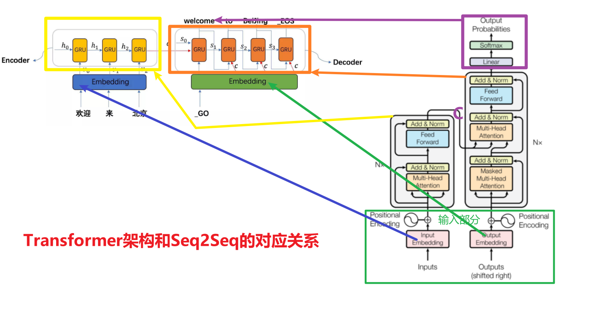

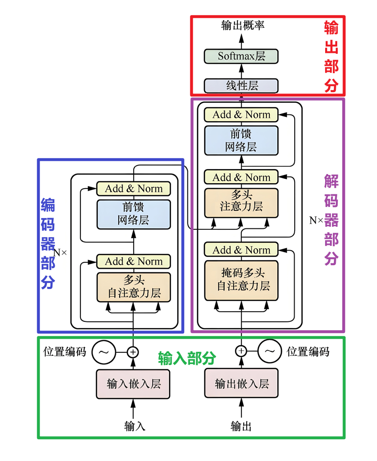

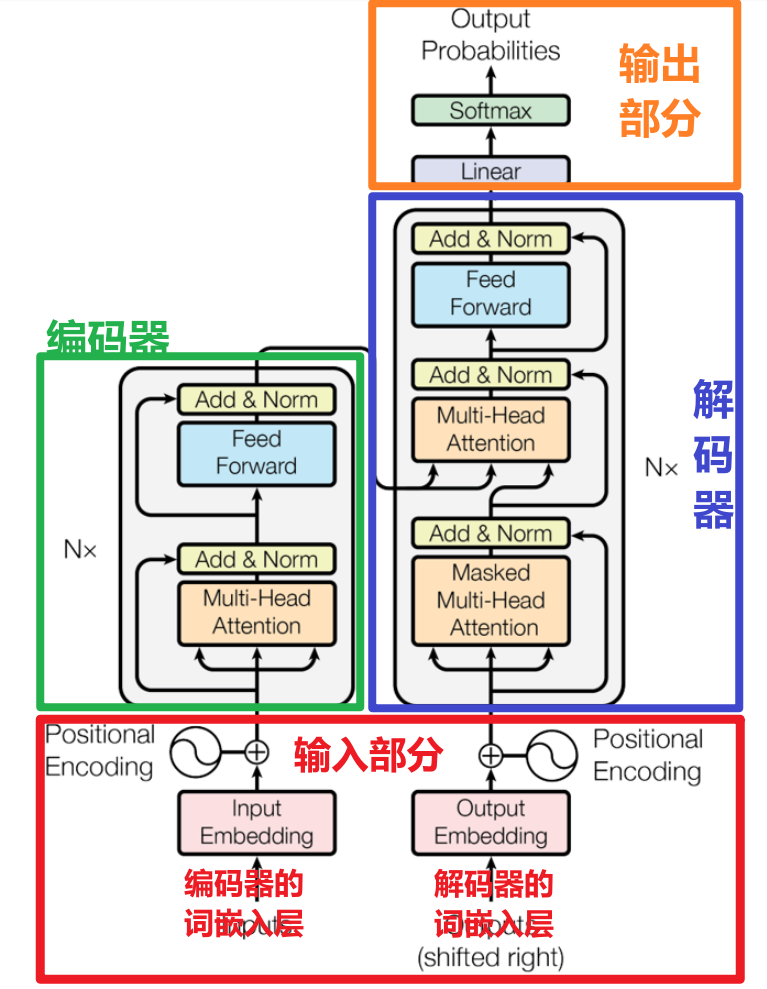

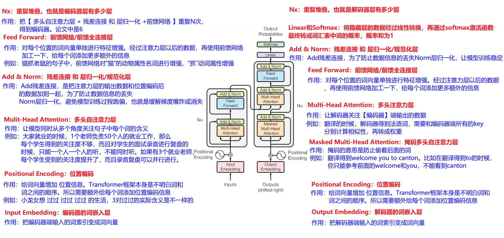

架构概述：

~~~properties
总结流程：
输入文字 -> 嵌入 -> 位置编码 -> 编码器多层加工(注意力+前馈) -> 解码器多层加工(掩码注意力 + 关联编码器 + 前馈) -> 线性层 -> softmax -> 输出概率选词

整个架构的核心：
注意力机制抓关联，多层堆叠挖深度，残差归一化稳训练
~~~


### 输入部分

```properties
Positional Encoding：位置编码
作用：给词向量加'位置信息'
例如：Transformer本身不明白词的顺序，例如：我打你、你打我，所以得额外给每个词向量添加位置信息，告诉模型谁前谁后


Input Embedding：解码器端词嵌入层
作用：把输入的词转成词向量
例如：'你好'->[0.1，-0.3...]
```


### 输出部分

```properties
Softmax：激活层
作用：把线性层输出的数值转成概率，概率总和为1，模型就知道该选哪个词输出


Linear：线性层
作用：把解码器输出的向量，调整成'vocab size词汇表大小'维度，
例如：例如词汇表有1W个词，就把向量变成1W维，每个维度对应1个词的概率分数
```


### 编码器部分

```properties
Nx：重复堆叠
作用：把上面的'多头注意力 + Add&Norm + 前馈网络'重复N次(论文里是6次)
例如：一层不够深，多堆几层，让模型'层层递进'理解文本，从表面语义 ->深层逻辑


Feed Forward：前馈网络
作用：对每个位置的词向量"单独强化特征’
例如：经过注意力层后，再用全连接网络加工一下，给每个词'注入更多细节'，例如：'强化'猫的动物属性，追’的动作属性


Add & Norm：残差连接 + 层归一化
作用：让训练更稳，更高效。层归一化也称之为规范化层
例如：Add是把注意力层的输入和输出加一起，防止信息丢太多。Norm是把数据归一化(数值限制在某个范围)，避免训练时跑偏，梯度消失/爆炸


Multi-Head Attention：多头自注意力层
作用：让模型同时从多个角度关注句子里的词
例如：猫追老鼠'，既要关注'猫"和'追'的关系，也要关注'猫'和'老鼠'的关系，还能对比'猫' 和'老鼠'的关联.
```


### 解码器部分

```properties
Add & Norm + Feed Forward + Nx：
作用：和编码器里的逻辑一样，
     残差连接、归一化保证训练稳定；
     前馈网络强化特征；
     Nx重复堆叠加深模型


Multi-Head Attention：多头注意力层
作用：让解码器'关注编码器输出的内容'
例如：翻译时，解码器生成法语词，盯着处理后的英文词义，确保翻译准确，找对应关系


Masked Multi-Head Attention：掩码多头自注意力层
作用：防止'偷看未来的词'
例如：解码器是一步步生成输出的，只能用'已生成的词'，不能用未生成的词.
```


## 代码开发思路【了解】

### 重点组件

只需要搞清楚如下几个组件的功能、作用和代码开发

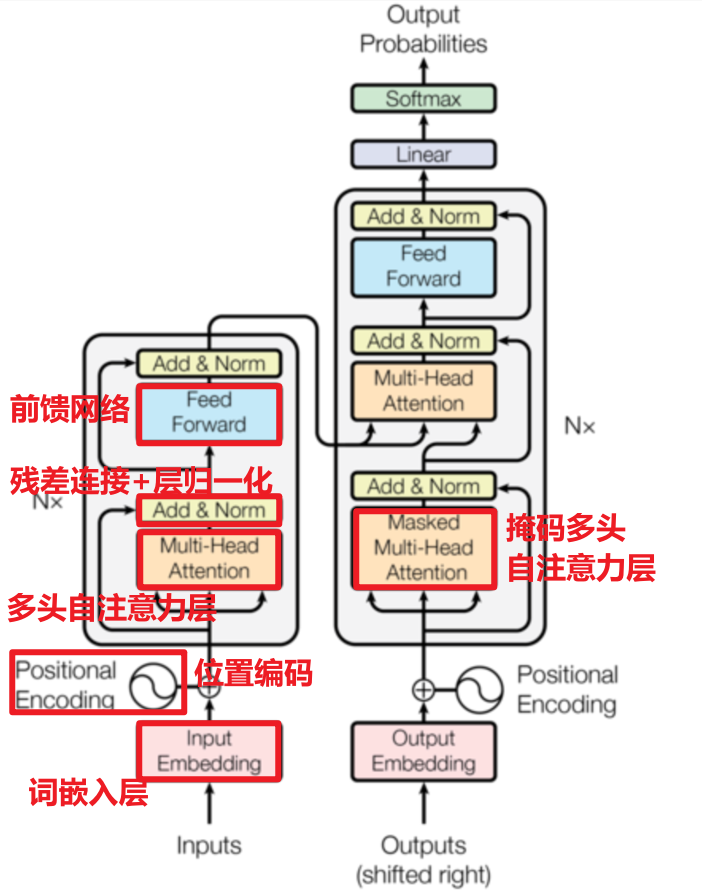


### 具体开发步骤

* 编码器

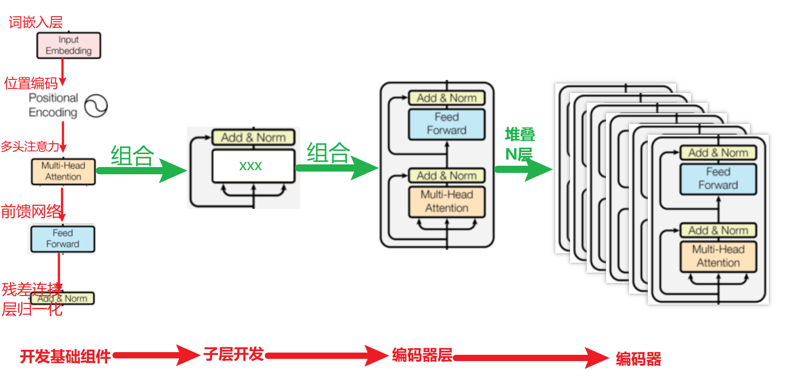


* 解码器

参考编码器的开发过程，大部分地方的功能直接复用。主要是开发【掩码多头自注意力层】


* 输出部分

非常简单，nn.Linear全连接层+Softmax激活函数


* 代码的作用和开发顺序

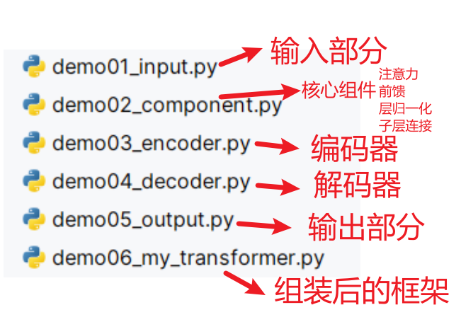

## 输入部分

### 词嵌入层

注意：为什么embedding之后要乘以根号下d_model
- 原因1：为了防止position encoding的信息覆盖我们的word embedding，也就是防止两者的值差距过大。所以进行一个数值增大
- 原因2：符合正态分布


* 代码实现

```python
class Embedding(nn.Module):
    def __init__(self,vocab_size,d_model):
        # 1- 初始化父类
        super().__init__()

        # 2- 设置属性值
        self.vocab_size = vocab_size    # 词汇表大小
        self.d_model = d_model  # 词向量的维度。例如：512

        # 3- 搭建网络结构：只有一个词嵌入层
        self.embed = nn.Embedding(num_embeddings=self.vocab_size,embedding_dim=self.d_model)

    def forward(self,input):
        """
        前向传播。输入一条句子，得到词向量
        :param input: 一条句子，里面的元素是词索引。张量形状[batch_size每个批次中句子的条数,seq_len每条句子中词的个数]
        :return: 词向量
        """

        """
            为什么要乘以math.sqrt(self.d_model)，也就是根号dk？
            答：为了对数据进行缩放，避免与位置编码的数据值之间的大小差异过大。为了让模型训练稳定，也就是缓解梯度消失或梯度爆炸
                词向量维度越大，越容易出现极小值
        """
        return self.embed(input) * math.sqrt(self.d_model)
```


* 测试代码

~~~python
def use_embedding():
    # 1- 创建词嵌入层类的实例对象
    my_embed = Embedding(vocab_size=1000,d_model=5)
    # my_embed = Embedding(vocab_size=1000,d_model=10240)

    # 2- 准备数据
    # 注意：目前情况下，词索引的取值区间[0,999]
    x = torch.tensor([
        # 单词索引
        [100, 2, 666],
        [500, 888, 421]
    ])

    # 3- 输入句子，得到词向量
    word_vector = my_embed(x)
    print(f"词向量的形状{word_vector.shape}") # 2条句子，3句子中3个词，5词向量维度
    print(f"词向量的数据{word_vector}")
    print(f"词向量的数据{word_vector.abs().min()}")   # 获得乘以根号dk以后数据中绝对值的最小值
~~~


### 位置编码

作用

```properties
Transformer编码器或解码器中缺乏位置信息，因此加入位置编码器，将词汇的位置可能代表的不同特征信息和word_embedding进行融合，以此来弥补位置信息的缺失。
```

位置编码器实现方式：三角函数来实现的，sin、cos函数

为什么使用三角函数来进行位置编码

```properties
1、保证同一词汇随着所在位置不同它对应位置嵌入向量会发生变化
2、正弦波和余弦波的值域范围都是1到-1这又很好的控制了嵌入数值的大小, 有助于梯度的快速计算
```

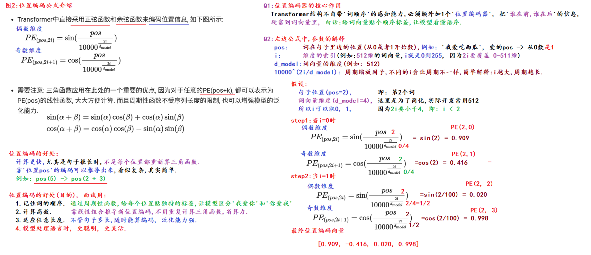


* 代码实现

```python
class PositionalEncoding(nn.Module):
    def __init__(self,d_model,dropout,max_len=60):
        """
        位置编码初始化方法
        :param d_model: 词向量维度。例如：512
        :param dropout: 神经元随机失活概率
        :param max_len: 能够处理的句子最大长度。也就是词的个数
        """

        # 1- 初始化父类
        super().__init__()

        # 2- 创建随机失活层
        self.dropout = nn.Dropout(p=dropout)

        # 3- 定义pe(也就是位置编码张量)
        pe = torch.zeros(size=(max_len,d_model))    # 目前的形状[60,d_model]

        # 4- 定义列向量，用来存储输入句子中词索引信息
        position = torch.arange(0,max_len).unsqueeze(1) # 形状[60,1]

        # 5- 得到pos/分母公式中的，1/分母
        div_term = 1/(10000**(torch.arange(0,d_model,2).float()/d_model))

        # 6- 计算pos/分母的结果
        position_value = position * div_term

        # 7- 调用sin、cos分别计算位置编码值
        pe[:,0::2] = torch.sin(position_value)  # 偶数维度
        pe[:,1::2] = torch.cos(position_value)  # 奇数维度

        # 8- 调整pe的形状变成3维，也就是[60,d_model]->[1,60,d_model]每个批次1条句子，每个句子最多60个词，词向量是d_model
        pe = pe.unsqueeze(0)

        # 9- 将pe的值注册到缓存中，通过它来不断的更新位置编码信息。后面可以直接通过self.pe调用
        self.register_buffer("pe",pe)

    def forward(self,embed):
        """
        位置编码的前向传播：多条句子中所有词的词向量，和位置编码张量进行求和操作，返回结果
        :param embed: 词向量
        :return:
        """

        """
            embed.shape[1]：embed的形状[batch_size,seq_len,d_model]，得到多少个词
            为什么self.pe[:, :embed.shape[1]]？
            如果这条句子中词的个数超过了max_len，那么最多只对前max_len个词的位置编码进行相加
        """
        result = embed + self.pe[:, :embed.shape[1]]
        print(f"对应的位置编码值：{self.pe[:, :embed.shape[1]]}")
        return self.dropout(result)
```


* 测试代码

~~~python
def use_positional_encoding():
    d_model = 512

    # 实例化词嵌入层类的对象
    my_embed = Embedding(vocab_size=1000,d_model=d_model)

    # 准备数据
    x = torch.tensor([
        # 单词索引
        [100, 2, 421, 600],
        [500, 888, 421, 615]
    ])

    # 输入数据，得到对应的词向量
    word_embed = my_embed(x)
    print(f"词向量的形状：{word_embed.shape}")
    print(f"词向量的值：{word_embed}")

    # 创建位置编码
    my_pe = PositionalEncoding(d_model=d_model,dropout=0.1,max_len=60)

    # 调用位置编码，最终效果是往词向量中加上了位置编码的值
    result = my_pe(word_embed)
    print(f"最终的形状：{result.shape}")
    print(f"最终的值：{result}")

    return result

# 可视化位置编码
def plot_position():
    # 1. 实例化位置编码器.
    my_position = PositionalEncoding(20, dropout=0.1, max_len=100)

    # 2. 生成全0的输入, 观察位置编码的模式.
    # (1, 100, 20) -> 批次大小, 句子长度, 词嵌入维度
    embed = torch.zeros(1, 100, 20)
    y = my_position(embed)

    # 3. 设置图表大小.
    plt.figure(figsize=(20, 15))
    # 绘制位置编码第4到第7列, 100个词的  [4, 5, 6, 7]
    """
        图形的信息解释：
            x轴：词的索引，目前总共有100个词
            y轴：位置编码值
    """
    plt.plot(np.arange(100), y[0, :, 4:8].detach().numpy())
    plt.legend([f'dim {p}' for p in [4, 5, 6, 7]])
    plt.show()
~~~

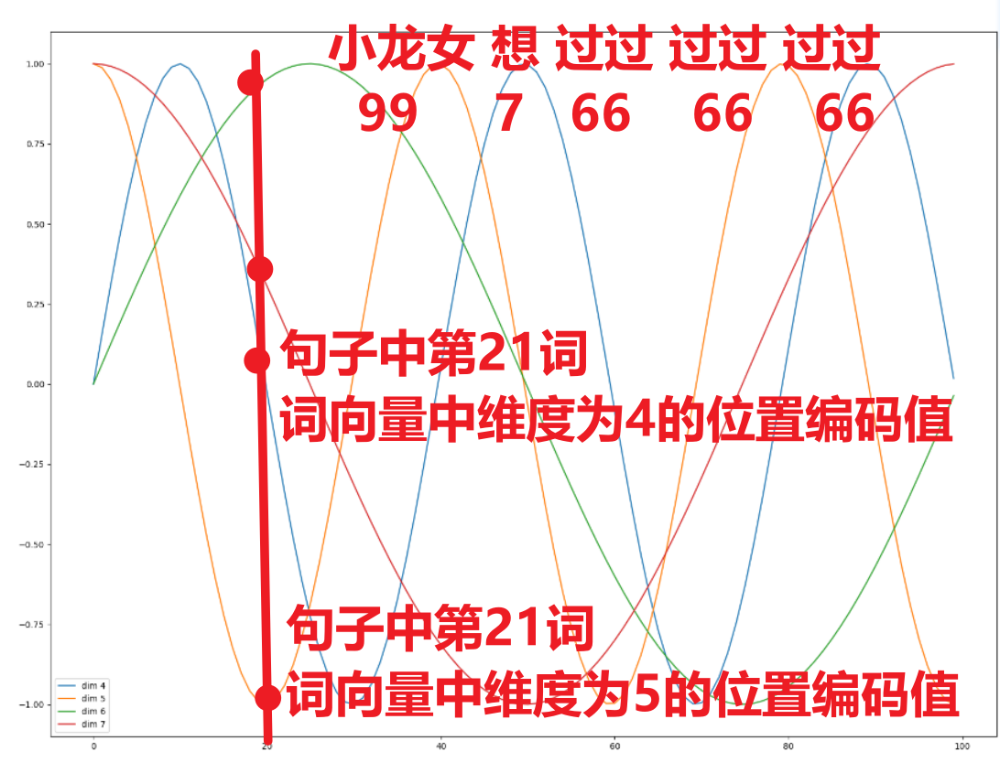


## 编码器部分

### 掩码张量

作用

```properties
掩码：掩就是遮掩、码就是张量。掩码本身需要一个掩码张量，掩码张量的作用是对另一个张量进行数据信息的掩盖。一般掩码张量是由0和1两种数字组成，至于是0对应位置或是1对应位置进行掩码，可以自己设定
```

* PyTorch版本

~~~python
# 使用PyTorch实现掩码。【掌握】
"""
    总结：
        1- 上三角掩码：右上角的值为1，左下角的值为0
        2- 下三角掩码：右上角的值为0，左下角的值为1
        3- 相同的规律：对角线的时候diagonal为0；如果是正数，并且越来越大，那么往右上角移动；反之往左下角移动；diagonal的取值超过范围不会报错
        4- 【掌握】掩码的作用：为了防止解码器端当前时间步偷看后面时间步的数据，你只能看到你前面时间步已经预测出来的数据。核心是防止模型训练效果不好
        5- 【掌握】代码：torch.triu(t,diagonal=0)
"""

import torch
def torch_mask():
    # 创建初始张量
    t = torch.ones(size=(5,5))
    print(f"原始张量：{t}")

    # 进行掩码操作
    # 上三角掩码
    u_0_mask = torch.triu(t,diagonal=0)
    print(f"上三角掩码0：{u_0_mask}")

    u_1_mask = torch.triu(t, diagonal=1)
    print(f"上三角掩码1：{u_1_mask}")

    u__1_mask = torch.triu(t, diagonal=-1)
    print(f"上三角掩码_1：{u__1_mask}")

    u_n_mask = torch.triu(t, diagonal=1000)
    print(f"上三角掩码n：{u_n_mask}")

    print("-"*30)

    # 下三角掩码
    l_0_mask = torch.tril(t, diagonal=0)
    print(f"下三角掩码0：{l_0_mask}")

    l_1_mask = torch.tril(t, diagonal=1)
    print(f"下三角掩码1：{l_1_mask}")

    l__1_mask = torch.tril(t, diagonal=-1)
    print(f"下三角掩码-1：{l__1_mask}")
~~~


* numpy版本

~~~python
import numpy as np
def np_mask():
    # 1- 准备数据
    arr = np.ones(shape=(5,5))

    # 2- 上三角掩码
    # k和PyTorch中diagonal参数的作用完全一样
    u_result = np.triu(arr,k=0)
    print(f"上三角掩码0：\n{u_result}")

    u_result = np.triu(arr, k=1)
    print(f"上三角掩码1：\n{u_result}")

    u_result = np.triu(arr, k=-1)
    print(f"上三角掩码-1：\n{u_result}")

    # 3- 下三角掩码
    l_result = 1 - u_result
    print(f"下三角掩码：\n{l_result}")

    l_result = np.tril(arr,k=0)
    print(f"下三角掩码0：\n{l_result}")

    l_result = np.tril(arr, k=1)
    print(f"下三角掩码1：\n{l_result}")

    l_result = np.tril(arr, k=-1)
    print(f"下三角掩码-1：\n{l_result}")
~~~


* 掩码张量的可视化

~~~python
# 掩码张量的可视化.
def dm03_test_mask():
    # 简单说(总结): 纵向选'当前位置', 横向看'能看哪些位置', 0(黄色): 遮挡, 1(紫色): 不遮挡
    plt.figure(figsize=(5, 5))
    plt.imshow(demo2(20)[0])
    plt.show()
~~~


### 注意力机制【掌握】

#### 计算规则

```properties
自注意力机制，规则：Q乘以K的转置，然后除以根号下d_k，然后再进行Softmax，最后和V进行张量矩阵相乘
如果是自注意力，那么Q、K、V的值完全相同
```


#### 注意力计算

扩展知识：点积和点乘

点积：等同于矩阵乘法，可以使用matmul函数进行计算，也可以使用dot函数进行计算。在注意力机制场景下，一般使用matmul

点乘：两个张量的形状要完全一样。对应坐标位置元素相乘

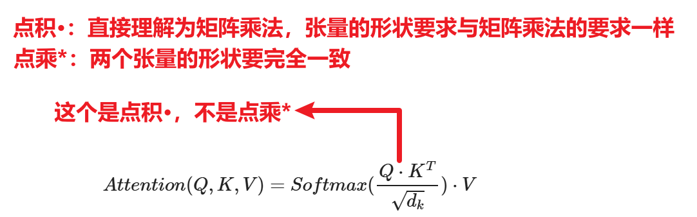


* 代码实现

```properties
import math
import torch
import torch.nn as nn
from torch import Tensor
from demo01_input import *

def attention(query:Tensor,key:Tensor,value:Tensor,mask:Tensor=None,dropout=None):
    """
    注意力计算方法。能够涵盖如下几种情况：
        1- 编码器端的多头自注意力：query=key=value，mask为None
        2- 解码器端的掩码多头自注意力：query=key=value，mask不为None
        3- 解码器端的多头注意力（交叉注意力）：query和key、value不等，但是key和value相同，mask为None
    :param query: 查询张量，形状：[batch_size每个批次中有多少条句子,seq_len每条句子中有几个词,d_model词向量的维度/隐藏状态维度]
    :param key: 键张量，形状：[batch_size,seq_len,d_model]
    :param value: 值张量，形状：[batch_size,seq_len,d_model]
    :param dropout: 随机失活Dropout层对象
    :param mask: 掩码张量，形状：[batch_size,seq_len,seq_len]
    :return: 专属信息包,权重张量。类型是元组
    """

    # 1- 获得d_k：词向量的维度
    d_k = query.shape[-1]

    # 2- Q和K的转置相乘；再除以根号d_k。得到相似性得分scores
    # K的转置：由  [batch_size,seq_len,d_model]  变成了  [batch_size,d_model,seq_len]
    scores = torch.matmul(query,key.transpose(-2,-1)) / math.sqrt(d_k)

    # 3- 可选：对相似性得分scores进行掩码处理
    if mask is not None:
        # 对需要进行掩码的地方，将值替换成-1e9。注意：不要直接设置为0。需要和softmax结合理解。e的-1e9的结果趋近于0，表示权重趋近于0
        scores = scores.masked_fill(mask==0,value=-1e9)

    # 4- 将相似性转成权重
    weight = torch.softmax(scores,dim=-1)

    # 5- 可选：随机时候，缓解过拟合
    if dropout is not None:
        weight = dropout(weight)

    # 6- 权重和value进行矩阵乘法，得到专属信息包
    C = torch.matmul(weight,value)

    return C,weight
```


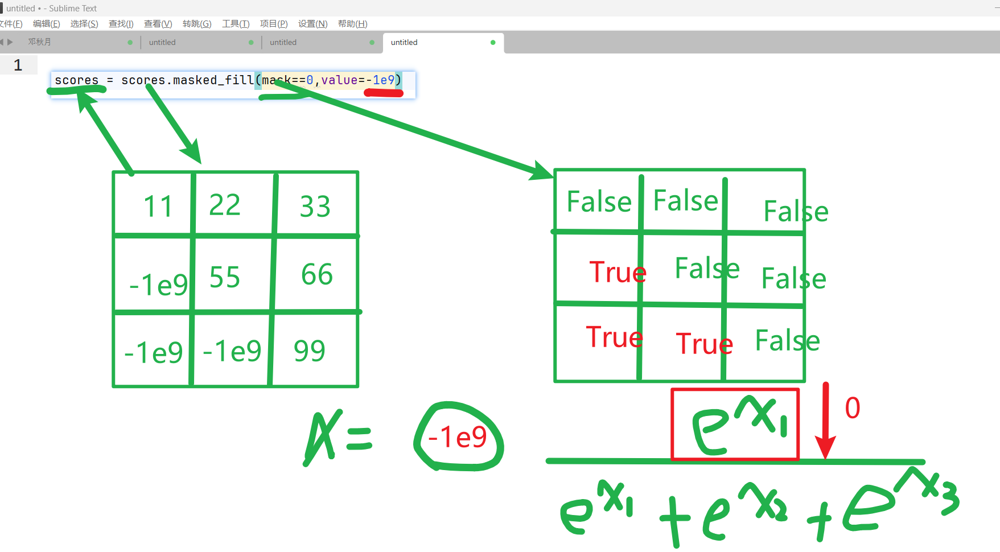


* 测试代码

~~~python
def use_attention():
    # 1- 输入的数据先经过 词嵌入层 和 位置编码
    posi_embed = use_positional_encoding()

    # 2- 调用注意力计算方法
    # 2.1- 准备query、key、value参数
    query=key=value=posi_embed

    # 2.2- 准备掩码【可选】
    # (2,4,4)值的来源于use_positional_encoding的x。每个批次2条句子，每条句子4个词
    # 形状：[batch_size,seq_len,seq_len]
    mask = torch.triu(torch.ones(size=(2,4,4)))

    # 2.3- 随机失活网络层
    dropout = nn.Dropout(p=0.1)

    # 2.4- 调用
    # 2.4.1- 编码器端：没有掩码的多头自注意力
    encoder_attention_C, encoder_attention_weight = attention(query,key,value,dropout=dropout)
    print(f"编码器C：{encoder_attention_C.shape}-->{encoder_attention_C}")
    print(f"编码器C权重：{encoder_attention_weight.shape}-->{encoder_attention_weight}")

    # 2.4.2- 解码器端：有掩码的多头自注意力
    decoder_attention_C, decoder_attention_weight = attention(query,key,value,dropout=dropout,mask=mask)
    print(f"解码器C：{decoder_attention_C.shape}-->{decoder_attention_C}")
    print(f"解码器C权重：{decoder_attention_weight.shape}-->{decoder_attention_weight}")
~~~


### 多头注意力机制【掌握】

概念

```properties
多头的好处：
	1- 能够让模型进行并行计算，提高运行效率
	2- 多个头来同时处理数据，那么模型对数据的理解、学习会更好，模型整体效果会更好
```

* 多头注意力机制原理图

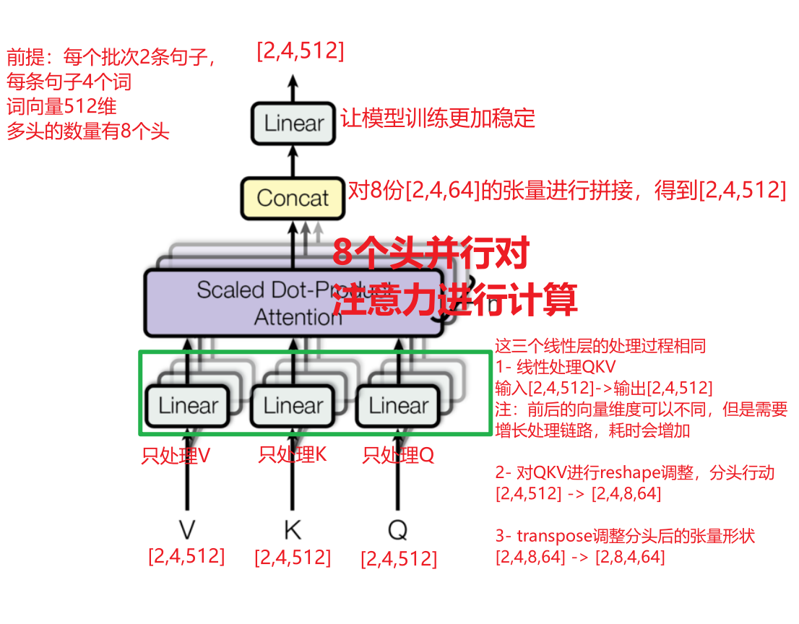


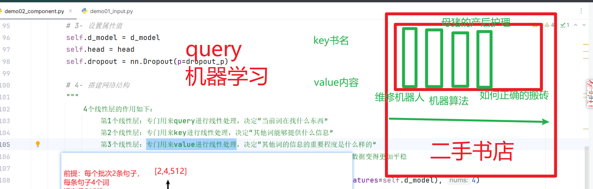

* 代码实现

```properties
def clones(model_obj, nums):
    """
    创建指定个数的相同网络结构对象
    :param model_obj: 网络结构对象
    :param nums: 个数
    :return: 网络结构对象列表
    """
    # 语法 nn.ModuleList([copy.deepcopy(模型对象) for _ in range(深拷贝复制的个数)])
    return nn.ModuleList([copy.deepcopy(model_obj) for _ in range(nums)])

class MultiHeadAttention(nn.Module):
    def __init__(self,d_model,head,dropout_p=0.1):
        """
        初始化
        :param d_model: 词向量维度/隐藏层隐藏状态向量维度。例如：512
        :param head: 多头的头数。例如：8
        :param dropout_p: 随机失活概率
        """

        # 1- 确定d_model能够被head整除
        assert d_model%head==0

        # 2- 初始化父类
        super().__init__()

        # 3- 设置属性值
        self.d_model = d_model
        self.head = head
        self.head_dim = self.d_model // self.head   # 每个头分别处理的数据维度。例如：64
        self.dropout = nn.Dropout(p=dropout_p)

        # 4- 搭建网络结构
        """
            4个线性层的作用如下：
                第1个线性层：专门用来query进行线性处理，决定“当前词在找什么东西”
                第2个线性层：专门用来key进行线性处理，决定“其他词能够提供什么信息”
                第3个线性层：专门用来value进行线性处理，决定“其他词的信息的重要程度是什么样的”
                第4个线性层：对多头并行处理，并且concat拼接后的张量做最终的线性处理，让数据变得更加平稳
        """
        self.linear_list = clones(nn.Linear(in_features=self.d_model,out_features=self.d_model), 4)

        # 5- 权重张量
        self.weight = None

    def forward(self,query:Tensor,key:Tensor,value:Tensor,mask:Tensor=None):
        """
        前向传播：多头注意力计算
        :param query: 查询张量，形状：[batch_size每个批次中有多少条句子,seq_len每条句子中有几个词,d_model词向量的维度/隐藏状态维度]
        :param key: 键张量，形状：[batch_size,seq_len,d_model]
        :param value: 值张量，形状：[batch_size,seq_len,d_model]
        :param mask: 掩码张量，形状：[head,seq_len,seq_len]。注意第一个维度代表的是头数
        :return:
        """

        # 1- 掩码处理：进行升维，3维变4维
        if mask is not None:
            # 例如：[8,4,4] -> [1,8,4,4]
            # 不管每个批次中有多少条句子，每条句子用的掩码是同一份
            mask = mask.unsqueeze(0)

        # 2- 获得batch_size，也就是批次中句子的条数
        batch_size = query.shape[0]

        # 3- 前3个线性层分别并行对QKV进行处理
        # 方式一：分开版
        # [(Linear,query), (Linear,key), (Linear,value)]
        linear_output_list = []
        model_and_data_list = list(zip(self.linear_list, (query,key,value)))
        for model,data in model_and_data_list:
            """
                1- model(data)：线性变换
                2- reshape：[2,4,512]->[2,4,8,64]
                3- transpose：[2,4,8,64]->[2,8,4,64]
            """
            model_output = model(data)
            reshape_output = model_output.reshape(batch_size,-1,self.head,self.head_dim)
            linear_output_list.append(reshape_output.transpose(1,2))

        new_query, new_key, new_value = linear_output_list

        # 方式二：合并版【理解】
        # new_query, new_key, new_value = [
        #     model(data).reshape(batch_size,-1,self.head,self.head_dim).transpose(1,2)
        #     for model,data in list(zip(self.linear_list, (query,key,value)))
        # ]

        # 4- 多头并行计算注意力
        C,weight = attention(new_query, new_key, new_value,mask=mask,dropout=self.dropout)
        self.weight = weight

        # 5- 对多头处理后的数据进行拼接
        # [2,8,4,64] -> [2,4,8,64] -> [2,4,512]
        result = C.transpose(1,2).reshape(batch_size,-1,self.head*self.head_dim)

        # 6- 调用最后一个线性层对拼接后的数据进行处理，让模型更加稳定
        return self.linear_list[-1](result)
```


* 测试代码

~~~python
def use_multi_head_attention():
    # 1- 获取位置编码之后的词数据
    position_data = use_positional_encoding()

    # 2- query、key、value参数
    query=key=value=position_data

    # 3- 创建多头注意力实例对象
    mask = torch.triu(torch.ones(size=(8, 4, 4)))
    my_attention = MultiHeadAttention(d_model=512,head=8,dropout_p=0.1)

    # 4- 调用前向传播
    result = my_attention(query,key,value,mask=mask)
    print(f"多头注意力计算结果：{result.shape}")
    print(f"多头注意力计算结果：{result}")

    return result
~~~


### 前馈网络

概念：前馈网络用来增强模型的拟合能力，内部包含两个全连接层


* 代码实现

```properties
# 前馈网络/前馈全连接层：通过调整张量大小，实现强化信息的过程
class FeedForward(nn.Module):
    def __init__(self,d_model,output_dim,dropout_p=0.1):
        # 1- 初始化父类
        super().__init__()

        # 2- 搭建网络结构
        # 2.1- 第一个线性层：用来对输入的词向量维度进行放大，例如：512->1024
        self.linear_1 = nn.Linear(in_features=d_model,out_features=output_dim)

        # 2.2- 随机失活层
        self.dropout = nn.Dropout(p=dropout_p)

        # 2.3- 第二个线性层：用来对上一个线性层输出的结果进行浓缩，例如：1024->512
        self.linear_2 = nn.Linear(in_features=output_dim, out_features=d_model)

    def forward(self,data):
        # 1- 调用第一个线性层
        data = self.linear_1(data)

        # 2- 调用随机失活
        """
            注意力机制本质是线性计算，如果没有非线性因素，那么整个网络模型比较简单，只能处理线性问题（也就是回归）
            引入relu激活也就是引入了非线性因素；Transformer论文中用的就是relu
        """
        data = self.dropout(torch.relu(data))

        # 3- 调用第二个线性层
        data = self.linear_2(data)

        return data
```


### 层归一化

作用

```properties
随着网络深度的增加，模型参数会出现过大或过小的情况，进而可能影响模型的收敛，因此进行规范化，将参数规范致某个特征范围内，辅助模型快速收敛。
```

代码实现

```properties
# 层归一化/规范化层：随着网络模型训练，数据有可能出现极值，导致梯度爆炸或消失，为了让模型训练稳定，通过标准化处理，让数据变的正常
# 也就是要实现y=kx+b，其中x要经过标准化处理（要计算数据的均值mean和标准差std）
class LayerNorm(nn.Module):
    def __init__(self,d_model):
        # 1- 初始化父类
        super().__init__()

        # 2- 线性公式中参数的定义
        """
            为什么k和b要通过nn.Parameter进行定义？
            答：因为nn.Parameter会自动将k和b注册到神经网络模型中，作为可训练的参数。通过反向传播得到k和b。
                如果不写nn.Parameter，那么k和b的值永远固定，不会发生变化。
                对应前面神经网络模型代码中如下两行代码
                optimizer = optim.Adam(params=model.parameters())
                optimizer.step()
        """
        # 2.1- 定义k
        self.k = nn.Parameter(torch.ones(d_model))

        # 2.2- 定义b
        self.b = nn.Parameter(torch.zeros(d_model))

        # 3- 定义小常数：防止分母为0
        self.eps = 1e-6

    def forward(self,data):
        """
        前向传播：输入前面子层处理后的数据，经过层归一化进行【标准化处理】，让模型训练稳定
        要实现y=kx+b，其中x要经过标准化处理（要计算数据的均值mean和标准差std）
        :param data: 前面子层处理后的数据。形状[batch_size,seq_len,d_model]
        :return:
        """

        # 1- 计算均值
        """
            参数解释：
                dim=-1：对最后一个维度计算均值
                keepdim=True：表示计算后，张量的形状保留。举例：[2,4,512]->[2,4,1]
        """
        mean = data.mean(dim=-1,keepdim=True)

        # 2- 计算标准差
        std = data.std(dim=-1, keepdim=True)

        # 3- 实现y=kx+b
        return self.k * (data - mean)/(std+self.eps) + self.b
```


### 子层连接结构

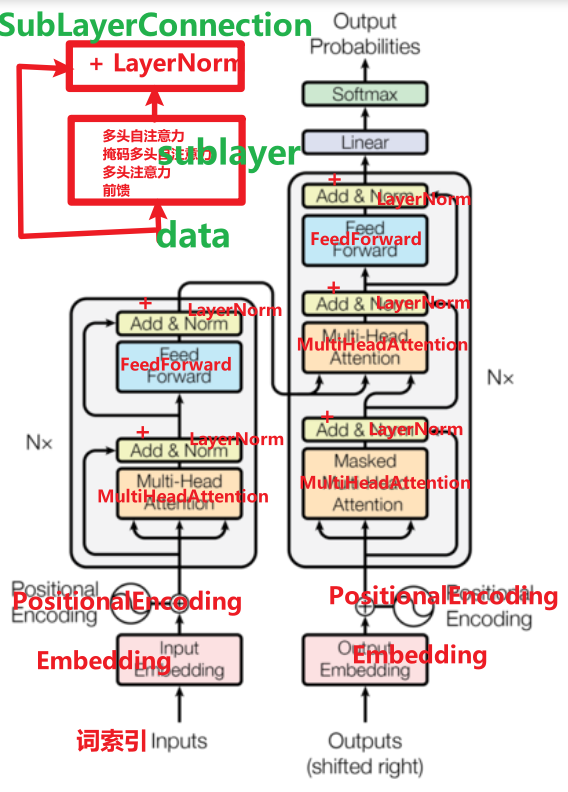

* 代码实现

```properties
# 子层连接类
class SubLayerConnection(nn.Module):
    def __init__(self,d_model,dropout_p):
        # 1- 初始化父类
        super().__init__()

        # 2- 创建层归一化
        """
            为什么把LayerNorm创建在__init__中？
            答：因为每个子层的后面都有该层
        """
        self.layer_norm = LayerNorm(d_model)

        # 3- 创建随机失活层
        self.dropout = nn.Dropout(p=dropout_p)

    def forward(self,data,sublayer_obj):
        """
        前向传播：使用你指定的具体子层实例对象【sublayer_obj】对数据【data】进行指定的处理
        :param data: 输入到层中的数据
        :param sublayer_obj: 具体子层实例对象。例如：多头自注意力实例对象、前馈网络实例对象、掩码多头自注意力实例对象、多头注意力实例对象（交叉注意力）
        :return:
        """

        # 具体子层实例对象【sublayer_obj】对数据【data】进行指定的处理
        # 写法一：原始Transformer的实现
        # 子层处理(也就是调用forward) -> 随机失活层 -> 残差连接 -> 层归一化
        # result = self.layer_norm(self.dropout(sublayer_obj(data)) + data)

        # 写法二：目前主流大模型的实现
        # 层归一化 -> 子层处理(也就是调用forward) -> 随机失活层 -> 残差连接
        """
            第一步：层归一化        self.layer_norm(data)
            第二步：子层处理        sublayer_obj(self.layer_norm(data))
            第三步：随机失活层       self.dropout(sublayer_obj(self.layer_norm(data)))
            第四步：残差连接        + data
        """
        result = self.dropout(sublayer_obj(self.layer_norm(data))) + data

        return result
```


* 子层测试代码

~~~python
# 子层连接测试
def use_SubLayerConnection():
    # 1- 准备数据：词嵌入层+位置编码
    data = use_positional_encoding()
    d_model = 512

    # 2- 子层连接类的实例对象
    SubLayerConnection_obj = SubLayerConnection(d_model,dropout_p=0.1)

    # 3- 演示子层的组合
    # 3.1- 多头自注意力层 + 残差连接和层归一化
    # 3.1.1- 创建 多头自注意力层 数据处理规则
    # 定义方式一：函数的形式
    def data_handler_fn(data):
        # 创建 多头自注意力层 类的实例对象
        attention_obj = MultiHeadAttention(d_model=d_model,head=8,dropout_p=0.1)
        # 调用forward
        return attention_obj(query=data,key=data,value=data)

    # 3.1.2- 组装得到子层：也就是调用SubLayerConnection它的forward
    multi_head_attention_output = SubLayerConnection_obj(data,data_handler_fn)
    print(f"多头自注意力层输出结果形状：{multi_head_attention_output.shape}")

    # 3.2- 前馈网络层 + 残差连接和层归一化
    # 定义方式二：lambda的形式
    feed_forward_output = SubLayerConnection_obj(
        multi_head_attention_output,
        lambda data:FeedForward(d_model=d_model,output_dim=1024,dropout_p=0.1)(data)
    )
    print(f"前馈网络层输出结果形状：{feed_forward_output.shape}")
~~~


### 编码器层

作用

```properties
每个编码器层完成一次对输入的特征提取过程, 即编码过程.
```

代码实现

```properties
from demo02_component import *

# 编码器层
class EncoderLayer(nn.Module):
    def __init__(self,d_model,multi_head_self_attn,feed_forward,dropout_p=0.1):
        """
        定义编码器层的结构
        :param d_model: 词向量维度
        :param multi_head_self_attn: 多头自注意力类的实例对象
        :param feed_forward: 前馈网络类的实例对象
        :param dropout_p:
        """
        # 1- 初始化父类
        super().__init__()

        # 2- 设置属性值
        self.d_model = d_model
        self.dropout_p = dropout_p
        self.multi_head_self_attn = multi_head_self_attn
        self.feed_forward = feed_forward

        # 3- 创建子层
        # 3.1- 第一个子层：多头自注意力子层
        self.multi_layer = SubLayerConnection(self.d_model,self.dropout_p)

        # 3.2- 第二个子层：前馈网络子层
        self.feed_forward_layer = SubLayerConnection(self.d_model,self.dropout_p)

    def forward(self,data):
        # 1- 数据经过第一个层的处理：多头自注意力子层
        multi_output = self.multi_layer(data, lambda x: self.multi_head_self_attn(query=x, key=x, value=x, mask=None))
        # 2- 数据经过第二个层的处理：前馈网络子层
        encoder_output = self.feed_forward_layer(multi_output, lambda x: self.feed_forward(x))

        return encoder_output
```


### 编码器

* 代码实现

```properties
# 编码器
class Encoder(nn.Module):
    def __init__(self, encoder_layer:EncoderLayer, N):
        """
        定义编码器结构。也就是将编码器层重复N层
        :param encoder_layer: 编码器层
        :param N:
        """
        # 1- 初始化父类
        super().__init__()

        # 2- 将编码器层创建N对象
        self.encoder_layer_list = clones(encoder_layer,N)

        # 3- 层归一化
        """
            这东西不是必须的，只是为了缓解经过N层处理后的数据，让数据变得更加平稳。这一层不是必须的
        """
        self.layer_norm = LayerNorm(encoder_layer.d_model)

    def forward(self,data):

        """
            注意：for循环中两个data需要与传递给forward的参数名称完全一致，否则6层网络处理的数据就会断开
        """
        for encoder_layer in self.encoder_layer_list:
            data = encoder_layer(data)

        return self.layer_norm(data)
```


* 编码器完整测试代码

~~~python
# 测试编码器
# 测试最终的编码器
def use_encoder():
    # 1- 得到词向量数据：词向量 + 位置编码
    position_data = use_positional_encoding()

    d_model = 512
    dropout = 0.1

    # 2- 创建编码器的实例对象
    # 2.1- 多头自注意力子层的实例对象
    multi_head = MultiHeadAttention(d_model=d_model,head=8,dropout_p=dropout)
    # 2.2- 前馈网络子层的实例对象
    ff = FeedForward(d_model=d_model,output_dim=1024,dropout_p=dropout)
    # 2.3- 编码器层的实例对象
    encoder_layder = EncoderLayer(d_model=d_model,multi_head_self_attn=multi_head,feed_forward=ff,dropout_p=dropout)
    # 2.4- 编码器层 堆叠N层得到编码器
    encoder = Encoder(encoder_layder,6)

    # 3- 数据进行前向传播
    result = encoder(data=position_data)

    print(f"编码器最终的输出结果是：{result.shape}")
    return result
~~~


## 解码器部分

### 解码器层

作用

```properties
作为解码器的组成单元, 每个解码器层根据给定的输入向目标方向进行特征提取操作
```

代码实现

```properties
"""
    解码器层由如下3层组成
        1- 第一层：掩码多头自注意力层
            掩码多头自注意力 + 层归一化 + 残差连接
        2- 第二层：多头注意力层
            多头注意力 + 层归一化 + 残差连接
        3- 第三层：前馈网络层
            前馈网络 + 层归一化 + 残差连接
"""
from demo03_encoder import *
from demo02_component import *

# 解码器层
class DecoderLayer(nn.Module):
    def __init__(self,d_model,mask_multi_head_self_attn,multi_head_attn,feed_forward,dropout_p=0.1):
        """
        定义解码器层的结构
        :param d_model: 词向量维度
        :param mask_multi_head_self_attn: 掩码多头自注意力类的实例对象
        :param multi_head_attn: 多头注意力类的实例对象
        :param feed_forward: 前馈网络类的实例对象
        :param dropout_p:
        """
        # 1- 初始化父类
        super().__init__()

        # 2- 设置属性值
        self.d_model = d_model
        self.dropout_p = dropout_p
        self.mask_multi_head_self_attn = mask_multi_head_self_attn
        self.multi_head_attn = multi_head_attn
        self.feed_forward = feed_forward

        # 3- 创建子层
        # 3.1- 第一个子层：掩码多头自注意力子层
        self.mask_multi_self_layer = SubLayerConnection(self.d_model,self.dropout_p)

        # 3.2- 第二个子层：多头注意力子层
        self.multi_layer = SubLayerConnection(self.d_model, self.dropout_p)

        # 3.3- 第三个子层：前馈网络子层
        self.feed_forward_layer = SubLayerConnection(self.d_model,self.dropout_p)

    def forward(self,data,mask,encoder_output):
        # 1- 数据经过第一个层的处理：掩码多头自注意力子层
        mask_multi_self_output = self.mask_multi_self_layer(data, lambda x: self.mask_multi_head_self_attn(query=x, key=x, value=x, mask=mask))

        # 2- 数据经过第二个层的处理：多头注意力子层
        multi_output = self.multi_layer(mask_multi_self_output, lambda x: self.multi_head_attn(query=x, key=encoder_output, value=encoder_output, mask=None))

        # 3- 数据经过第三个层的处理：前馈网络子层
        decoder_output = self.feed_forward_layer(multi_output, lambda x: self.feed_forward(x))

        return decoder_output
```


### 解码器

作用

```properties
根据编码器的结果以及上一次预测的结果, 对下一次可能出现的'值'进行特征表示
```

* 代码实现

```properties
# 解码器
class Decoder(nn.Module):
    def __init__(self, decoder_layer:DecoderLayer, N):
        """
        定义解码器结构。也就是将解码器层重复N层
        :param decoder_layer: 解码器层
        :param N:
        """
        # 1- 初始化父类
        super().__init__()

        # 2- 将解码器层创建N对象
        self.decoder_layer_list = clones(decoder_layer,N)

        # 3- 层归一化
        """
            这东西不是必须的，只是为了缓解经过N层处理后的数据，让数据变得更加平稳。这一层不是必须的
        """
        self.layer_norm = LayerNorm(decoder_layer.d_model)

    def forward(self,data, mask, encoder_output):

        """
            注意：for循环中两个data需要与传递给forward的参数名称完全一致，否则6层网络处理的数据就会断开
        """
        for decoder_layer in self.decoder_layer_list:
            data = decoder_layer(data, mask, encoder_output)

        return self.layer_norm(data)
```


* 解码器完整测试代码

~~~python
# 测试解码器
# 测试最终的解码器
def use_decoder():
    # 常用参数定义
    d_model = 512
    dropout = 0.1

    # 1- 获得编码器最终结果数据。作为key、value传递给到解码器
    encoder_output = use_encoder()

    # 2- 准备解码器端原始目标值数据
    y = torch.tensor([
        # 例如法语单词索引
        [1, 2, 3, 4],
        [5, 6, 7, 8]
    ])

    # 3- 构建解码器
    # 3.1- 基础组件实例对象创建
    # 解码器端的词嵌入层
    embed = Embedding(vocab_size=1200,d_model=d_model)
    # 解码器端的位置编码
    position_encoding = PositionalEncoding(d_model=d_model,dropout=dropout)
    # 前馈网络子层
    feed_forward = FeedForward(d_model=d_model,output_dim=1024,dropout_p=dropout)
    # 多头注意力子层
    src_attn = MultiHeadAttention(d_model=d_model,head=8,dropout_p=dropout)
    # 掩码多头自注意力子层
    self_attn = MultiHeadAttention(d_model=d_model, head=8, dropout_p=dropout)

    # 3.2- 拼接得到解码器层
    decoder_layer = DecoderLayer(
        d_model=d_model,
        mask_multi_head_self_attn=self_attn,
        multi_head_attn=src_attn,
        feed_forward=feed_forward,
        dropout_p=dropout
    )

    # 3.3- 解码器层堆叠N层，得到解码器
    decoder = Decoder(decoder_layer,6)

    # 4- 处理数据
    # 4.1- 准备掩码
    mask = torch.zeros(size=(8,4,4)) # 掩码多头自注意力子层 的 掩码。# 注意，第一个位置是多头的数量

    # 4.2- 得到词向量+位置编码
    data = embed(y)
    data = position_encoding(data)

    # 4.3- 调用解码器
    decoder_result = decoder(data, mask, encoder_output)

    print(f"解码器最终的结果：{decoder_result.shape}")
~~~


## 输出部分

```properties
作用：通过线性变化得到指定维度的输出
```

* 代码实现

```properties
"""
    Transformer的输出部分：
        Linear线性层和Softmax激活函数
"""
import torch
import torch.nn as nn

class Output(nn.Module):
    def __init__(self,d_model,vocab_size):
        # 1- 初始化父类
        super().__init__()

        # 2- 搭建神经网络结构
        self.linear = nn.Linear(in_features=d_model,out_features=vocab_size)

    def forward(self,data):
        """
        :param data: 解码器最终的输出结果，形状[batch_size,seq_len,d_model]
        :return:
        """

        return torch.softmax(self.linear(data),dim=-1)
```


## 模型搭建

* 自定义的Transformer模型搭建代码

~~~python
"""
    Transformer框架的结构：
        编码器端_输入部分
            词嵌入层
            位置编码

        编码器
            多头自注意力子层：多头自注意力 + 层归一化 + 残差连接
            前馈网络子层：前馈网络 + 层归一化 + 残差连接

        解码器端_输入部分
            词嵌入层
            位置编码

        解码器
            掩码多头自注意力子层：掩码多头自注意力 + 层归一化 + 残差连接
            多头注意力子层（交叉注意力）：多头注意力 + 层归一化 + 残差连接
            前馈网络子层：前馈网络 + 层归一化 + 残差连接

        输出部分
            线性层
            Softmax激活函数

        结果
"""
from demo01_input import *
from demo02_component import *
from demo03_encoder import *
from demo04_decoder import *
from demo05_output import *

# 创建Transformer框架类
class MyTransformer(nn.Module):
    def __init__(self, en_embde_pos, encoder, de_embde_pos, decoder, output):
        """
        将前面开发的各个部分组织得到完整的Transformer框架
        :param en_embde_pos: 编码器端_输入部分 实例对象
        :param encoder: 编码器 实例对象
        :param de_embde_pos: 解码器端_输入部分 实例对象
        :param decoder: 解码器 实例对象
        :param output: 输出部分 实例对象
        """
        # 1- 初始化父类
        super().__init__()

        # 2- 设置属性值
        self.en_embde_pos = en_embde_pos
        self.encoder = encoder
        self.de_embde_pos = de_embde_pos
        self.decoder = decoder
        self.output = output

    def forward(self,en_input,de_input,mask):
        """
        Transformer前向传播
        :param en_input: 输入到编码器端的词索引数据
        :param de_input: 输入到解码器端的词索引数据
        :param mask: 解码器使用的掩码
        :return:
        """

        # 1- 编码器端_输入部分：词嵌入层、位置编码
        encoder_data = self.en_embde_pos(en_input)

        # 2- 编码器
        encoder_data = self.encoder(encoder_data)

        # 3- 解码器端_输入部分：词嵌入层、位置编码
        decoder_data = self.de_embde_pos(de_input)

        # 4- 解码器
        decoder_data = self.decoder(
            data=decoder_data,
            mask=mask,
            encoder_output=encoder_data
        )

        # 5- 输出部分
        return self.output(decoder_data)
~~~


* 调用Transformer模型框架

~~~python
# 调用Transformer框架
def get_mytransformer():
    # 常用变量
    d_model = 512
    dropout = 0.1
    de_vocab_size = 4345

    # ---------------- 编码器部分 ----------------
    # 词嵌入层
    en_ebd = Embedding(vocab_size=1000, d_model=d_model)
    # 位置编码
    en_pos = PositionalEncoding(d_model=d_model, dropout=dropout, max_len=60)
    # 多头自注意力
    en_multi_self_attn = MultiHeadAttention(d_model=d_model, head=8, dropout_p=dropout)
    # 前馈网络
    en_ff = FeedForward(d_model=d_model, output_dim=1024, dropout_p=dropout)
    # 组装得到编码器层
    encoder_layer = EncoderLayer(
        d_model=d_model,
        multi_head_self_attn=en_multi_self_attn,
        feed_forward=en_ff,
        dropout_p=dropout
    )
    # 得到编码器
    encoder = Encoder(encoder_layer=encoder_layer, N=6)

    # ---------------- 解码器部分 ----------------
    # 词嵌入层
    de_ebd = Embedding(vocab_size=de_vocab_size, d_model=d_model)
    # 位置编码
    de_pos = PositionalEncoding(d_model=d_model, dropout=dropout, max_len=60)
    # 掩码多头自注意力
    de_multi_self_attn = MultiHeadAttention(d_model=d_model, head=8, dropout_p=dropout)
    # 多头注意力
    de_multi_attn = MultiHeadAttention(d_model=d_model, head=8, dropout_p=dropout)
    # 前馈网络
    de_ff = FeedForward(d_model=d_model, output_dim=1024, dropout_p=dropout)
    # 组装得到编码器层
    decoder_layer = DecoderLayer(
        d_model=d_model,
        mask_multi_head_self_attn=de_multi_self_attn,
        multi_head_attn=de_multi_attn,
        feed_forward=de_ff,
        dropout_p=dropout
    )
    # 得到编码器
    decoder = Decoder(decoder_layer=decoder_layer, N=6)

    # ---------------- 输出部分 ----------------
    output = Output(d_model=d_model, vocab_size=de_vocab_size)

    # ---------------- 组装得到Transformer框架 ----------------
    my_transformer = MyTransformer(
        en_embde_pos=nn.Sequential(en_ebd, en_pos),  # 表示 词先经过词嵌入层的处理，然后再经过位置编码的处理。注意：位置不能乱
        encoder=encoder,
        de_embde_pos=nn.Sequential(de_ebd, de_pos),
        decoder=decoder,
        output=output
    )
    print(f"框架结构信息：{my_transformer}")
    return my_transformer
~~~


* 测试Transformer模型架构

~~~python
# 测试编码器
# 测试最终的编码器
def use_encoder():
    # 1- 得到词向量数据：词向量 + 位置编码
    position_data = use_positional_encoding()

    d_model = 512
    dropout = 0.1

    # 2- 创建编码器的实例对象
    # 2.1- 多头自注意力子层的实例对象
    multi_head = MultiHeadAttention(d_model=d_model,head=8,dropout_p=dropout)
    # 2.2- 前馈网络子层的实例对象
    ff = FeedForward(d_model=d_model,output_dim=1024,dropout_p=dropout)
    # 2.3- 编码器层的实例对象
    encoder_layder = EncoderLayer(d_model=d_model,multi_head_self_attn=multi_head,feed_forward=ff,dropout_p=dropout)
    # 2.4- 编码器层 堆叠N层得到编码器
    encoder = Encoder(encoder_layder,6)

    # 3- 数据进行前向传播
    result = encoder(data=position_data)

    print(f"编码器最终的输出结果是：{result.shape}")
    return result
~~~

