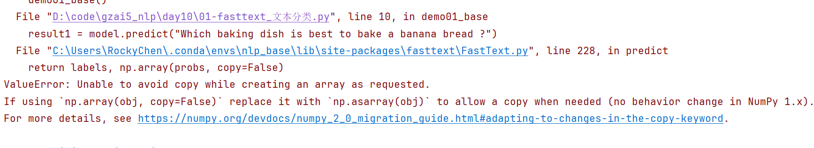

# 迁移学习

## fasttext

### 基本概念

fasttext优势：

- 十分简单的网络结构.
- 使用fasttext模型训练词向量时使用层次softmax结构, 来提升超多类别下的模型性能.
- 由于fasttext模型过于简单无法捕捉词序特征, 因此会进行n-gram特征提取以弥补模型缺陷提升精度.


~~~properties
安装命令
pip install fasttext -i https://mirrors.aliyun.com/pypi/simple/
或者
pip install fasttext-wheel -i https://mirrors.aliyun.com/pypi/simple/
~~~


负采样的优势：

- 提高训练速度, 选择了部分数据进行计算损失, 损失计算更加简单.
- 改进效果, 增加部分负样本, 能够模拟真实场景下的噪声情况, 能够让模型的稳健性更强.


> 补充的知识：
>
> 训练集->模型开发
>
> 测试集->评估模型的效果
>
> 验证集->项目经理


运行fasttext代码报如下错：



解决：

~~~properties
1- 卸载虚拟环境中的numpy
	pip uninstall -y numpy
	
2- 重新安装1.x版本的numpy
	pip install numpy==1.26.4
~~~


### fasttext文本分类

~~~python
# fasttext文本分类API的使用
import fasttext

# 1- 模型训练和预测
def demo01_base():
    # 1- 模型训练
    model = fasttext.train_supervised(input="data/cooking_train.txt")

    # 2- 使用训练好的模型对数据进行预测
    result1 = model.predict("Which baking dish is best to bake a banana bread ?")
    print(result1)
    result2 = model.predict("Why not put knives in the dishwasher?")
    print(result2)

    # 3- 模型测试
    result = model.test(path="data/cooking_valid.txt")
    print(result)   # (3000, 0.15566666666666668, 0.06732016721925904) 样本条数 精确率 召回率

# 2- 数据基本处理：统一成大小写、标点符号前面加空格。。。
def demo02_preprocessing():
    # 1- 模型训练
    model = fasttext.train_supervised(input="data/cooking.pre.train")

    # 2- 模型测试
    result = model.test(path="data/cooking.pre.valid")
    print(result)

# 3- 增加训练轮次
def demo03_epoch():
    # 1- 模型训练
    model = fasttext.train_supervised(input="data/cooking.pre.train",epoch=20)

    # 2- 模型测试
    result = model.test(path="data/cooking.pre.valid")
    print(result)

# 4- 调整学习率
def demo04_lr():
    # 1- 模型训练
    model = fasttext.train_supervised(input="data/cooking.pre.train",epoch=20,lr=1)

    # 2- 模型测试
    result = model.test(path="data/cooking.pre.valid")
    print(result)

# 5- 设置n-gram参数
def demo05_n_gram():
    # 1- 模型训练
    model = fasttext.train_supervised(input="data/cooking.pre.train",epoch=20,lr=1,wordNgrams=2)

    # 2- 模型测试
    result = model.test(path="data/cooking.pre.valid")
    print(result)

# 6- 调整损失函数
def demo06_loss():
    # 1- 模型训练
    model = fasttext.train_supervised(input="data/cooking.pre.train",epoch=20,lr=1,wordNgrams=2,loss="hs")

    # 2- 模型测试
    result = model.test(path="data/cooking.pre.valid")
    print(result)

# 7- 自动超参数调优
def demo07_auto():
    # 1- 模型训练
    """
        参数解释：
            autotuneDuration：查找最优超参数组合的时间，最终找到的参数组合不一定是最优的
            autotuneValidationFile：找到最优超参数组合，使用验证集数据对参数效果进行验证
    """
    model = fasttext.train_supervised(
        input="data/cooking.pre.train",
        autotuneValidationFile="data/cooking.pre.valid",
        autotuneDuration=60*2
    )

    # 2- 模型测试
    result = model.test(path="data/cooking.pre.valid")
    print(result)

# 8- 多标签多分类问题：将问题拆解为单标签多分类问题，loss损失函数需要设置为ova->one vs all
def demo08_ova():
    # 1- 模型训练
    # 注意：lr的学习率不要过大，如果过大会出现梯度消失/爆炸的情况
    model = fasttext.train_supervised(input="data/cooking.pre.train",epoch=20,lr=0.1,wordNgrams=2,loss="ova")

    # 2- 预测
    """
        k：表示预测结果中目标值最多展示多少个。如果值为-1，那么是尽可能将所有的目标值全部都展示
        threshold：阈值。如果预测的目标值的概率超过了threshold，那么才有可能显示出来
        
        result1中输出的概率值是经过sigmoid计算后的结果，计算是__label__baking标签的概率以及不是__label__baking标签的概率。
        多标签中每个标签的概率计算是相互独立的
    """
    result1 = model.predict("Which baking dish is best to bake a banana bread ?",k=3,threshold=0.5)
    print(result1)

    result2 = model.predict("Which baking dish is best to bake a banana bread ?",k=-1)
    print(result2)

    # 3- 模型测试
    result = model.test(path="data/cooking.pre.valid")
    print(result)

# 9- 保存模型和重新加载模型
def demo09_savemodel():
    # 1- 模型训练
    model = fasttext.train_supervised(input="data/cooking.pre.train",epoch=20,lr=1,wordNgrams=2,loss="hs")

    # 2- 保存训练好的模型
    model.save_model("model/cooking_model.pkl")

    # 3- 加载训练好的模型
    model2 = fasttext.load_model("model/cooking_model.pkl")
    result = model2.test(path="data/cooking.pre.valid")
    print(result)

if __name__ == '__main__':
    # 1- 模型训练和预测
    # demo01_base()   # (3000, 0.15566666666666668, 0.06732016721925904)

    # 2- 数据基本处理
    # demo02_preprocessing() # (3000, 0.172, 0.07438373936860314)

    # 3- 增加训练轮次
    # demo03_epoch()  # (3000, 0.48733333333333334, 0.21075392821104225)

    # 4- 调整学习率
    # demo04_lr() # (3000, 0.5976666666666667, 0.2584690788525299)

    # 5- 设置n-gram参数
    # demo05_n_gram() # (3000, 0.596, 0.2577483061842295)

    # 6- 调整损失函数
    # demo06_loss() # (3000, 0.5946666666666667, 0.2571716880495892)

    # 7- 自动超参数调优
    # demo07_auto() # (3000, 0.536, 0.23180049012541445)

    # 8- 多标签多分类问题
    # demo08_ova() # (3000, 0.532, 0.23007063572149344)

    # 9- 保存模型和重新加载模型
    demo09_savemodel()
~~~


### 训练词向量

参考NLP课程第一天，使用fasttext实现word2vec代码


## 迁移学习的概念

魔搭社区：https://www.modelscope.cn/models?page=1&tabKey=task


### 预训练模型

```properties
定义: 简单来说别人训练好的模型。一般预训练模型具备复杂的网络模型结构；一般是在大量的语料下训练完成的
```


预训练语言模型的类别

```properties
现在我们接触到的预训练语言模型，基本上都是基于transformer这个模型迭代而来的
因此划分模型类别的时候，以transformer架构来划分：
Encoder-Only: 只有编码器部分的模型，代表：BERT
Decoder-Only: 只要解码器部分的模型，代表：GPT
Encoder-Decoder: 本质就transformer架构，代表：T5
```


### 微调

```properties
定义:一般是对预训练语言模型，进行垂直领域数据的微调，可以将预训练模型的参数全部微调或者部分微调或者不微调，但是一般我们在做任务的时候，会在预训练模型后加入自定义网络，自定义网络模型的参数需要训练
```


### 迁移学习的两种方式

```properties
开箱即用: 当预训练模型的任务和我们要做的任务相似时，可以直接使用预训练模型来解决对应的任务
微调: 进行垂直领域数据的微调，一般在预训练网络模型后，加入自定义网络，自定义网络模型的参数需要训练，但是预训练模型的参数可以全部微调或者部分微调或者不微调。
```


## NLP常用预训练模型

### 当下NLP流行的预训练模型

- BERT
- GPT
- GPT-2
- Transformer-XL
- XLNet
- XLM
- RoBERTa
- DistilBERT
- ALBERT
- T5
- XLM-RoBERTa


### BERT及其变体

- bert-base-uncased: 编码器具有12个隐层, 输出768维张量, 12个自注意力头, 共110M参数量, 在小写的英文文本上进行训练而得到.
- bert-large-uncased: 编码器具有24个隐层, 输出1024维张量, 16个自注意力头, 共340M参数量, 在小写的英文文本上进行训练而得到.
- bert-base-cased: 编码器具有12个隐层, 输出768维张量, 12个自注意力头, 共110M参数量, 在不区分大小写的英文文本上进行训练而得到.
- bert-large-cased: 编码器具有24个隐层, 输出1024维张量, 16个自注意力头, 共340M参数量, 在不区分大小写的英文文本上进行训练而得到.
- bert-base-multilingual-uncased: 编码器具有12个隐层, 输出768维张量, 12个自注意力头, 共110M参数量, 在小写的102种语言文本上进行训练而得到.
- bert-large-multilingual-uncased: 编码器具有24个隐层, 输出1024维张量, 16个自注意力头, 共340M参数量, 在小写的102种语言文本上进行训练而得到.
- bert-base-chinese: 编码器具有12个隐层, 输出768维张量, 12个自注意力头, 共110M参数量, 在简体和繁体中文文本上进行训练而得到.


## Transformers库使用

### 了解Transformers库

- Huggingface总部位于纽约，是一家专注于自然语言处理、人工智能和分布式系统的创业公司。他们所提供的聊天机器人技术一直颇受欢迎，但更出名的是他们在NLP开源社区上的贡献。Huggingface一直致力于自然语言处理NLP技术的平民化(democratize)，希望每个人都能用上最先进(SOTA, state-of-the-art)的NLP技术，而非困窘于训练资源的匮乏。同时Hugging Face专注于NLP技术，拥有大型的开源社区。尤其是在github上开源的自然语言处理，预训练模型库 Transformers，已被下载超过一百万次，github上超过24000个star。
- Huggingface Transformers 是基于一个开源基于 transformer 模型结构提供的预训练语言库。它支持 Pytorch，Tensorflow2.0，并且支持两个框架的相互转换。Transformers 提供了NLP领域大量state-of-art的 预训练语言模型结构的模型和调用框架。
- 框架支持了最新的各种NLP预训练语言模型，使用者可快速的进行模型调用，并且支持模型further pretraining 和 下游任务fine-tuning。举个例子Transformers 库提供了很多SOTA的预训练模型，比如BERT, GPT-2, RoBERTa, XLM, DistilBert, XLNet, CTRL。
- 社区Transformer的访问地址为：https://huggingface.co/。

### 三层应用结构

- 管道（Pipline）方式：高度集成的极简使用方式，只需要几行代码即可实现一个NLP任务。
- 自动模型（AutoMode）方式：可载入并使用BERTology系列模型。
- 具体模型（SpecificModel）方式：在使用时，需要明确指定具体的模型，并按照每个BERTology系列模型中的特定参数进行调用，该方式相对复杂，但具有较高的灵活度。


### 环境搭建

```properties
使用transformers需要执行如下安装命令
1- 进入到你的虚拟环境
    conda activate nlp_cuda
2- 安装命令
    pip install transformers
    pip install datasets
    pip install tf-keras
```


### Pipeline方式应用预训练模型

#### 文本分类

```properties
定义:对一个文本进行分类：eg：对一个评论文本，判断其实好评还是差评
```

代码实现

```python
import os
os.environ["TF_ENABLE_ONEDNN_OPTS"]="0"

import torch
from transformers import pipeline

def text_classification():
    # 1- 加载预训练模型
    """
        参数解释：
            task：业务的任务类型。这里是文本分类，可以传递text-classification或sentiment-analysis，推荐使用text-classification
                注意：其他任务的task值去pipeline源代码中找
            model：预训练模型的路径。推荐前面加上r，避免转义
    """
    model = pipeline(task="text-classification",model=r"D:\soft\PretrainedModel\chinese_sentiment")   # 5分类问题
    # model = pipeline(task="text-classification",model=r"D:\soft\PretrainedModel\bert-base-chinese")     # 二分类。好评是1，差评是0

    # 2- 预测
    # pred_result = model("我爱北京天安门，天安门上太阳升。")
    pred_result = model("这家餐馆的卫生太差了，吃了拉稀，非常不推荐")
    # pred_result = model("这家餐馆的卫生还行，就是有点油")

    print(type(pred_result))
    print(pred_result)  # [{'label': 'star 5', 'score': 0.6314295530319214}]
```

#### 特征抽取

```properties
定义:将文本输入模型，得到特征向量的表示
```

代码实现

```python
def text_feature_extraction():
    # 1- 加载预训练模型
    model = pipeline(task="feature-extraction",model=r"D:\soft\PretrainedModel\bert-base-chinese")

    # 2- 文本特征提取：先分词->以列表形式返回词向量
    # 返回的形状是 [1, 17, 768]。1是句子条数，17是因为对每个字进行分词加上句子的开始和结束；768词向量的维度数
    result = model("这家餐馆的卫生还行，就是有点油")

    print(type(result))
    print(result)

    print(torch.tensor(result).shape)
```

#### 完形填空

```properties
掩码任务，将一段文本中的某个token进行MASK,然后通过模型来预测被MASK掉的词
```

代码实现

```python
def fill_blank():
    # 1- 加载预训练模型
    # model = pipeline(task="fill-mask",model=r"D:\soft\PretrainedModel\bert-base-chinese")
    model = pipeline(task="fill-mask",model=r"D:\soft\PretrainedModel\chinese-bert-wwm")

    # 2- 填空
    """
        注意：要进行填充的地方，必须写 [MASK]
    """
    content = "我想明天去[MASK]家吃饭。"
    result = model(content)
    print(type(result))
    print(result)
```

#### 阅读理解

```properties
question-answer,根据文本以及问题，从文本里面解答问题的答案
```

代码实现

```python
def q_and_a():
    # 1- 加载模型
    model = pipeline(task="question-answering",model=r"D:\soft\PretrainedModel\chinese_pretrain_mrc_roberta_wwm_ext_large")

    # 因为bert-base-chinese模型训练的语料库全都是中文的，因此对英文内容处理不好
    # model = pipeline(task="question-answering",model=r"D:\soft\PretrainedModel\bert-base-chinese")

    # 2- 提问
    # context = '我叫张三，我是一个程序员，我的喜好是打篮球。'
    # context = '张三是我的名字，程序员是我的职业，打篮球是我的喜好。'
    context = 'my name is zhangsan，my job is programmer，i like play basketball'
    questions = ['我是谁？', '我是做什么的？', '我的爱好是什么？']
    answers = model(context=context, question=questions)
    print(type(answers))
    print(answers)
```

#### 文本摘要

```properties
对文档的概括总结
```

代码实现

```python
def summary():
    # 1- 加载模型
    model = pipeline(task="summarization",model=r"D:\soft\PretrainedModel\distilbart-cnn-12-6")

    # 2- 提供语料库
    text = "BERT is a transformers model pretrained on a large corpus of English data " \
           "in a self-supervised fashion. This means it was pretrained on the raw texts " \
           "only, with no humans labelling them in any way (which is why it can use lots " \
           "of publicly available data) with an automatic process to generate inputs and " \
           "labels from those texts. More precisely, it was pretrained with two objectives:Masked " \
           "language modeling (MLM): taking a sentence, the model randomly masks 15% of the " \
           "words in the input then run the entire masked sentence through the model and has " \
           "to predict the masked words. This is different from traditional recurrent neural " \
           "networks (RNNs) that usually see the words one after the other, or from autoregressive " \
           "models like GPT which internally mask the future tokens. It allows the model to learn " \
           "a bidirectional representation of the sentence.Next sentence prediction (NSP): the models" \
           " concatenates two masked sentences as inputs during pretraining. Sometimes they correspond to " \
           "sentences that were next to each other in the original text, sometimes not. The model then " \
           "has to predict if the two sentences were following each other or not."

    summary_result = model(text)
    print(type(summary_result))
    print(summary_result)
```

#### 命名实体识别

```properties
对一段文本进行序列标注，对每一个词汇都要进行分类，习惯用BIO或者BIOES的标识符
```

代码实现

```python
def ner():
    # 1- 加载模型
    model = pipeline(task="ner", model=r"D:\soft\PretrainedModel\roberta-base-finetuned-cluener2020-chinese")

    # 2- 提取实体
    print(model('鲁迅原名周树人，代表作有朝花夕拾，在商务部上班，今天他去故宫游览'))
    """
        B表示命名实体的开始，I是命名实体的中间内容
        
        {'entity': 'B-name', 'score': 0.9945884, 'index': 1, 'word': '鲁', 'start': 0, 'end': 1}, 
        {'entity': 'I-name', 'score': 0.99043053, 'index': 2, 'word': '迅', 'start': 1, 'end': 2}, 
        
        {'entity': 'B-name', 'score': 0.9791542, 'index': 5, 'word': '周', 'start': 4, 'end': 5}, 
        {'entity': 'I-name', 'score': 0.97904646, 'index': 6, 'word': '树', 'start': 5, 'end': 6}, 
        {'entity': 'I-name', 'score': 0.9797911, 'index': 7, 'word': '人', 'start': 6, 'end': 7}, 
        
        {'entity': 'I-organization', 'score': 0.3546072, 'index': 20, 'word': '务', 'start': 19, 'end': 20}, 
        {'entity': 'I-organization', 'score': 0.32793036, 'index': 21, 'word': '部', 'start': 20, 'end': 21}, 
        
        {'entity': 'B-scene', 'score': 0.881768, 'index': 29, 'word': '故', 'start': 28, 'end': 29}, 
        {'entity': 'I-scene', 'score': 0.91957027, 'index': 30, 'word': '宫', 'start': 29, 'end': 30}
    """
```


### AutoModel方式应用预训练模型

#### 文本分类

```properties
定义:对一个文本进行分类：eg：对一个评论文本，判断其实好评还是差评
```

代码实现

```python
import torch

# 自动加载模型的配置文件
from transformers import AutoConfig
# 自动加载对应的模型
from transformers import AutoModel
# 自动加载模型词汇表，分词器
from transformers import AutoTokenizer
# 文本分类
from transformers import AutoModelForSequenceClassification
# 完型填空
from transformers import AutoModelForMaskedLM
# 阅读理解
from transformers import AutoModelForQuestionAnswering
# 文本摘要
from transformers import AutoModelForSeq2SeqLM
# NER命名实体识别
from transformers import AutoModelForTokenClassification


# 1- 文本分类
def demo01_classification():
    # 1- 创建类的实例对象
    # 1.1- 创建分词器：从预训练模型中创建得到分词器
    model_path = r"D:\PretrainedModel\chinese_sentiment"
    my_tokenizer = AutoTokenizer.from_pretrained(model_path)
    # 1.2- 创建模型对象：根据具体的业务需求，选择对应的类
    my_model = AutoModelForSequenceClassification.from_pretrained(model_path)

    # 2- 准备数据
    message = "我爱黑马"

    # 3- 文本内容分词并且转成模型需要的数据类型，也就是张量
    """
        参数解释：
            text：要处理的文本内容
            return_tensors：处理后的结果数据以什么形式方法。最常用的是pt（pytorch tensor）
            padding：是否对不满足max_length长度的句子进行内容填充。max_length是参数值，表示填充到满足要求的句子长度。例如：句子有3个词，因此会填充两个0，直到满足max_length=5
            truncation：超过max_length长度的句子是否要进行截断
            max_length：句子的最大长度
    """
    data_tensor = my_tokenizer.encode(text=message, return_tensors="pt", padding="max_length", truncation=True,
                                      max_length=10)
    print(f"分词器处理后的结果：{data_tensor}, {type(data_tensor)}")

    data_tensor2 = my_tokenizer.encode(text=message, return_tensors="np", padding="max_length", truncation=True,max_length=10)
    print(f"分词器处理后的结果：{data_tensor2}, {type(data_tensor2)}")

    # 4- 将处理后的数据输入到模型中得到结果
    my_model.eval()
    result = my_model(data_tensor)
    print(f"运行结果：{result}, {type(result)}")

    # 获得预测分类概率值最高的分类ID
    print(result[0].argmax(dim=-1))
```

#### 特征抽取

```properties
定义:将文本输入模型，得到特征向量的表示
```

代码实现

```python
def text_feature_extraction():
    # 1- 创建模型实例对象
    model_path = r"D:\soft\PretrainedModel\bert-base-chinese"
    tokenizer = AutoTokenizer.from_pretrained(model_path)
    model = AutoModel.from_pretrained(model_path)

    # 2- 准备数据
    sens = ['你是谁', '人生该如何起头']

    # 3- 将数据处理成张量
    # encode_plus比encode会返回更加丰富的信息
    data_tensor = tokenizer.encode_plus(
        text=sens,
        return_tensors="pt",
        padding="max_length",
        truncation=True,
        max_length=30
    )
    """
    返回值解释：
        1- input_ids：句子对应的词索引
        2- token_type_ids：词索引来源于的句子索引。句子索引从0开始
        3- attention_mask：注意力掩码。0表示不看input_ids对应位置的词索引；1反之
        {
  'input_ids': tensor([[ 101,  872, 3221, 6443,  102,  782, 4495, 6421, 1963,  862, 6629, 1928,
          102,    0,    0,    0,    0,    0,    0,    0,    0,    0,    0,    0,
            0,    0,    0,    0,    0,    0]]), 

'token_type_ids': tensor([[0, 0, 0, 0, 0, 1, 1, 1, 1, 1, 1, 1, 1, 0, 0, 0, 0, 0, 0, 0, 0, 0, 0, 0,0, 0, 0, 0, 0, 0]]), 
'attention_mask': tensor([[1, 1, 1, 1, 1, 1, 1, 1, 1, 1, 1, 1, 1, 0, 0, 0, 0, 0, 0, 0, 0, 0, 0, 0,0, 0, 0, 0, 0, 0]])}
    """
    # print(data_tensor)

    # 4- 调用模型
    model.eval()
    result = model(**data_tensor)   # 对字典进行解包操作

    print(result)
    print("最后一个隐藏状态信息", result.last_hidden_state.shape)
    print("池化层信息", result.pooler_output.shape)
```


~~~properties
扩展知识：
bert中的池化层和CNN中的池化，压根不是同一个东西
bert中的池化层，实际是一个线性层

为什么都叫“池化”？
“Pooling” 在机器学习中泛指将多个值聚合为一个值的操作
~~~


#### 完形填空

```properties
掩码任务，将一段文本中的某个token进行MASK,然后通过模型来预测被MASK掉的词
```

代码实现

```python
def fill_blank():
    # 1- 创建模型对象
    model_path = r"D:\soft\PretrainedModel\chinese-bert-wwm"
    tokenizer = AutoTokenizer.from_pretrained(model_path)
    model = AutoModelForMaskedLM.from_pretrained(model_path)

    # 2- 准备数据
    content = "我想明天去[MASK]家吃饭."

    # 3- 处理数据
    # 推荐：完型填空类的任务，不要设置padding、truncation此类的参数
    data_tensor = tokenizer.encode_plus(
        text=content,
        return_tensors="pt"
    )

    # 4- 调用
    model.eval()
    result = model(**data_tensor)

    print(f"result-->类型：{type(result)}")
    print(f"result-->内容：{result}")

    """
        结果形状是[1, 12, 21128]，解释如下：
            1- 1：上面传递给大模型的有1条句子
            2- 12：上面传递给大模型的句子中，含句子开头、句子结尾、标点符号、[MASK]在内，总共有12个词
            3- 21128：chinese-bert-wwm大模型的词汇表中有这么多个词
            
        这里写[0][6]原因是，[MASK]所在的索引是6
    """
    print(f"result中logits-->形状：{result.logits.shape}")
    print(f"result中logits某个词-->形状：{result.logits[0][6].shape}")
    print(f"result中logits某个词-->结果数据：{result.logits[0][6]}")

    # 获得概率最高词的索引信息
    pred_word_index = torch.argmax(result.logits[0][6]).item()
    # 将概率最高词的索引转成能够识别的内容
    pred_word_content = tokenizer.convert_ids_to_tokens(pred_word_index)

    print(f"填充词的索引：{pred_word_index}，对应的内容：{pred_word_content}") # 填充词的索引：1961，对应的内容：她
```

#### 阅读理解

```properties
question-answer,根据文本以及问题，从文本里面解答问题的答案
```

代码实现

```python
def q_and_a():
    # 1- 创建模型实例对象
    model_path = r"D:\soft\PretrainedModel\chinese_pretrain_mrc_roberta_wwm_ext_large"
    tokenizer = AutoTokenizer.from_pretrained(model_path)
    model = AutoModelForQuestionAnswering.from_pretrained(model_path)

    # 2- 准备数据
    # context的内容中，如果有空格，它会自动的过滤掉
    context = '我叫张三 我是一个程序员 我的喜好是打篮球'
    questions = ['我是谁？', '我是做什么的？', '我的爱好是什么？']
    # questions = ['我是谁？', '我是做什么的？', '我的爱好是什么？','我爸姓啥？']

    # 3- 对问题列表进行循环。每次让大模型回答一个问题。这是与pipeline的主要区别
    for question in questions:
        # 3.1- 数据处理
        data_tensor = tokenizer.encode_plus(question,context,return_tensors="pt")
        print(data_tensor)

        # 3.2- 调用模型
        model.eval()
        result = model(**data_tensor)
        # print(result)

        # 3.3- 处理结果
        # 获得答案中预测概率最高start开始索引
        start_index = torch.argmax(result.start_logits).item()
        # 获得答案中预测概率最高end结束索引
        end_index = torch.argmax(result.end_logits).item() + 1
        # 通过start和end，对context（因为问题的答案肯定存在于上下文中）上下文进行切片，得到答案
        answer = tokenizer.convert_ids_to_tokens(data_tensor.input_ids[0][start_index:end_index])

        print(f"问题是：{question}，对应的答案：{answer}")
```

#### 文本摘要

```properties
对文档的概括总结
```

代码实现

```python
def summary():
    # 1- 创建模型对象
    model_path = r"D:\soft\PretrainedModel\distilbart-cnn-12-6"
    tokenizer = AutoTokenizer.from_pretrained(model_path)
    model = AutoModelForSeq2SeqLM.from_pretrained(model_path)

    # 2- 准备数据
    text = "BERT is a transformers model pretrained on a large corpus of English data " \
           "in a self-supervised fashion. This means it was pretrained on the raw texts " \
           "only, with no humans labelling them in any way (which is why it can use lots " \
           "of publicly available data) with an automatic process to generate inputs and " \
           "labels from those texts. More precisely, it was pretrained with two objectives:Masked " \
           "language modeling (MLM): taking a sentence, the model randomly masks 15% of the " \
           "words in the input then run the entire masked sentence through the model and has " \
           "to predict the masked words. This is different from traditional recurrent neural " \
           "networks (RNNs) that usually see the words one after the other, or from autoregressive " \
           "models like GPT which internally mask the future tokens. It allows the model to learn " \
           "a bidirectional representation of the sentence.Next sentence prediction (NSP): the models" \
           " concatenates two masked sentences as inputs during pretraining. Sometimes they correspond to " \
           "sentences that were next to each other in the original text, sometimes not. The model then " \
           "has to predict if the two sentences were following each other or not."

    # 3- 处理数据
    data_tensor = tokenizer.encode_plus(text,return_tensors="pt")

    # 4- 得到文本摘要：生成文本内容
    model.eval()
    result = model.generate(**data_tensor)
    print(result)   # 就是一个普通张量

    # 5- 结果解析
    # 5.1- 使用decode进行解码
    decode_result_1 = [tokenizer.decode(word_index,skip_special_tokens=True,clean_up_tokenization_spaces=False) for word_index in result[0]]
    print(f"decode处理后的结果：{' '.join(decode_result_1)}")

    decode_result_2 = [tokenizer.decode(word_index,skip_special_tokens=False,clean_up_tokenization_spaces=False) for word_index in result[0]]
    print(f"decode处理后的结果：{' '.join(decode_result_2)}")

    # 5.2- 直接使用convert_ids_to_tokens
    print("convert_ids_to_tokens处理后的结果："," ".join(tokenizer.convert_ids_to_tokens(result[0],skip_special_tokens=True)))
```

#### 命名实体识别

```properties
对一段文本进行序列标注，对每一个词汇都要进行分类，习惯用BIO或者BIOES的标识符
```

代码实现

```python
def ner():
    # 1- 创建模型实例对象
    model_path = r"D:\soft\PretrainedModel\roberta-base-finetuned-cluener2020-chinese"
    tokenizer = AutoTokenizer.from_pretrained(model_path)
    model = AutoModelForTokenClassification.from_pretrained(model_path)
    config = AutoConfig.from_pretrained(model_path)

    # 2- 准备数据
    content = "鲁迅原名周树人，代表作有《朝花夕拾》，在外交部上班，今天他去故宫游览"

    # 3- 数据处理
    data_tensor = tokenizer.encode_plus(text=content,return_tensors="pt")

    # 4- 调用
    model.eval()
    result = model(**data_tensor)
    print(result)
    """
        [1, 34, 32]形状解释
            1- 1：上面有1条句子
            2- 34：上面句子中，含开头、结尾、标点符号在内有34个词
            3- 32：该模型支持的命名实体的种类有32。每种大模型支持的命名实体的种类不同
    """
    # print(result.logits.shape)  # 形状[1, 34, 32]

    # 5- 结果解析
    words = tokenizer.convert_ids_to_tokens(data_tensor.input_ids[0])

    for word,prob_list in zip(words, result.logits[0]):
        # 过滤掉特殊符号：例如句子的开始、结束
        if word in tokenizer.all_special_tokens:
            continue

        # 1- 获得每个词对应的命名实体类别索引
        ner_index = torch.argmax(prob_list).item()
        # 2- 根据索引，获得命名实体的名称
        ner_type_name = config.id2label.get(ner_index)

        print(f"词：{word}，命名实体类别索引：{ner_index}，命名实体的名称：{ner_type_name}")
```


### 具体模型方式完成NLP任务

~~~python
import torch
from transformers import BertTokenizer
from transformers import BertForMaskedLM

if __name__ == '__main__':
    # 1- 创建模型的实例对象
    model_path = r"D:\soft\PretrainedModel\bert-base-chinese"
    # 创建词汇映射器
    tokenizer = BertTokenizer.from_pretrained(model_path)
    model = BertForMaskedLM.from_pretrained(model_path)

    # 2- 准备数据
    content = "我想明天去[MASK]家吃饭"

    # 3- 处理数据
    data_tensor = tokenizer.encode_plus(text=content,return_tensors="pt")

    # 4- 调用模型
    my_model.eval()
    result = model(**data_tensor)

    # 5- 结果解析
    # 5.1- 获得预测概率词最高的词索引
    pred_word_index = torch.argmax(result.logits[0][6]).item()
    # 5.2- 词索引转成词
    pred_word = tokenizer.convert_ids_to_tokens(pred_word_index)
    # 5.3- 输出
    print(f"填充词的索引：{pred_word_index}，对应内容：{pred_word}")
~~~


### 预训练模型总结【掌握】

~~~properties
预训练模型使用总结：
   1- pipeline管道：
       优点：代码开发非常简单
       缺点：底层高度封装，可调整的超参数少
       使用：一般用来快速验证预训练模型/大模型是否满足业务需求

   2- AutoModel自动模型：
       优点：代码相对比较简单，有一定可以可调整的超参数
       缺点：相对具体模型来说，可调整的超参数相对较少

   3- 指定模型：
       优点：可调整的超参数很多，能够针对具体的大模型进行指定参数的微调。每种大模型的可调整的参数都是不一样
       缺点：比较灵活，不同的大模型可调整的参数有区别
       使用：针对业务场景需要比较高的情况，推荐使用
       后续课程：LoRA、QLoRA
~~~


## 迁移学习实践（文本分类案例）

### 实现流程

```properties
1.获取数据集
2.数据预处理: 实例化dataset，dataloader,注意这里面在dataloder里用了自定义函数进行文本张量化处理
3.搭建模型: 注意，我们这里用bert预训练模型来得到文本的特征表示，然后在经过自定义网络实现分类
4.模型训练: 注意，不训练bert模型的参数，只更新自己定义的网络参数
5.模型测试: 注意，如果在GPU上训练的模型，想在CPU上使用， model.load_state_dict(torch.load(path, map_location="cpu")) #将模型放到cpu上
```

### 数据预处理

#### 定义批处理函数

```properties
在Dataloader里面自动调用，目的是处理dataset里面的数据，进行张量化处理
```

代码实现

```python
import os
os.environ["TF_ENABLE_ONEDNN_OPTS"]="0"
import torch
import torch.nn as nn

# HuggingFace 提供的据集加载工具, 可以加载本地数据, 也可以加载公开数据源
from datasets import load_dataset
from torch.utils.data import DataLoader
from tqdm import tqdm
# 导入BERT相关组件(中文文本分词器, 预训练的BERT模型)
from transformers import BertTokenizer, BertModel
# 终端打印美化
from rich import print

# 使用GPU或者MPS
device = torch.device("cuda" if torch.cuda.is_available() else "cpu")   # windows的写法
# device = torch.device("mps" if torch.backends.mps.is_available() else "cpu")   # MAC的写法

# 1- 创建预训练模型对象
model_path = r"D:\PretrainedModel\bert-base-chinese"
# 只负责文本预处理，不涉及张量计算，所以不需要也不可以发送到 GPU
bert_tokenizer = BertTokenizer.from_pretrained(model_path)
bert_model = BertModel.from_pretrained(model_path).to(device)

# 2- 数据探索【可选】
def load_data():
    # 查看训练集数据
    """
        path：可以写文件所在目录，也可以写文件类型例如：csv
        data_files：可以写文件路径，也可以写文件名称。可以传递字典
        split：标明这份数据的作用是什么，训练集、测试集、验证集。想想机器学习中train_test_split的作用。
    """
    # 方式一：推荐写法。注意：data_files不要再跟前面path的路径了
    train_data = load_dataset(path="data",data_files="train.csv",split="train")
    # 方式二
    # train_data = load_dataset(path="csv",data_files="data/train.csv",split="train")
    print(type(train_data))
    print(train_data[0])
    print(len(train_data))

# 3- 针对每个批次的数据进行额外的处理
def collate_fn(data):
    # 1- 从每个批次中分别取出特征（也就是句子）和目标值（0/1）
    sents = [item["text"] for item in data] # 格式：['句子1','句子2'...]
    labels = [item["label"] for item in data] # 格式：[1,1,0,1,0...]
    # print(f"sents-->{sents}")
    # print(f"labels-->{labels}")

    # 2- 对句子进行批量处理
    data_tensor = bert_tokenizer.batch_encode_plus(
        sents,
        return_tensors="pt",
        padding=True,
        truncation=True,
        max_length=300
    )

    # 3- 提取分词处理后的数据内容
    input_ids = data_tensor["input_ids"]
    token_type_ids = data_tensor["token_type_ids"]
    attention_mask = data_tensor["attention_mask"]

    # 4- 将目标值labels转成张量
    labels = torch.LongTensor(labels)

    return input_ids,token_type_ids,attention_mask,labels
```


#### 实例化Dataloader

代码实现

```python
# 4- 创建数据加载器
def get_dataloader(file_path):
    # 1- 加载指定路径下的文件
    dataset = load_dataset(path="data",data_files=file_path,split="train")

    # 2- 创建DataLoader实例对象
    """
        参数解释：
            dataset：数据集对象
            batch_size：每个批次中样本的条数。如果样本长度不一致，batch_size只能设置为1
            shuffle：是否对数据打散。让模型训练更加充分
            drop_last：如果最后一个批次的样本条数不足batch_size大小，那么直接不要
            collate_fn：针对每个批次数据的具体处理函数。注意：传递的是函数名称，不要带小括号
    """
    dataloader = DataLoader(
        dataset=dataset,
        batch_size=8,
        shuffle=True,
        drop_last=True,
        collate_fn=collate_fn
    )

    return dataloader
```


测试DataLoader数据加载器

~~~python
if __name__ == '__main__':
    # 测试数据加载器
    dataloader = get_dataloader(file_path="train.csv")
    for input_ids,token_type_ids,attention_mask,labels in dataloader:
        print(input_ids)
        break
~~~


### 搭建模型

```properties
应用迁移学习的思路:bert预训练模型特征处理+自定义模型（分类）
```

代码实现

```python
# 5- 搭建模型：Bert预训练模型+我们自定义的网络层
class AiModel(nn.Module):
    def __init__(self):
        # 1- 初始化父类
        super().__init__()

        # 2- 在Bert预训练模型的后面，增加自己的线性网络结构层
        """
            这里的参数必须是768和2，为什么？
            答：
                768：Bert的词向量/隐藏状态向量维度是768维
                2：目前案例是二分类场景
        """
        self.linear = nn.Linear(in_features=768,out_features=2)

    def forward(self,input_ids,token_type_ids,attention_mask):
        # 1- 先调用Bert预训练模型
        """
            注意如下两点：
                1- 推荐使用torch.no_grad()，冻结Bert的参数训练。可以不加，那么回对Bert的110M个参数都会进行训练，比较耗时
                2- bert_model()里面的参数要使用关键字传参
        """
        with torch.no_grad():
            bert_output = bert_model(input_ids=input_ids, token_type_ids=token_type_ids, attention_mask=attention_mask)

        # 2- 再调用我们自定义的网络层
        """
            为什么写成bert_output.last_hidden_state[:, 0]？
            答：
                1- last_hidden_state表示取的是Bert模型最后一层隐藏层中每个时间步的隐藏状态。等价于多层RNN中output
                2- [:, 0]取到的是每条句子中第一个token（词），也就是[CLS]的隐藏状态
                3- Bert预训练模型的设计思想：只有编码器端，编码器端注意力是自注意力，也就是每个词都能够获得其他词的隐藏状态信息
                    [CLS]是一个固定的标识，每个句子的开头都有
                4- 结论：Bert做分类，固定写成bert_output.last_hidden_state[:, 0]
                    
                以上的解释，建议看论文：https://arxiv.org/pdf/1810.04805
                对应内容：The final hidden state corresponding to this token is used as the aggregate sequence representation for classification tasks. 
        """
        return self.linear(bert_output.last_hidden_state[:, 0])
```


### 模型训练

```properties
注意: 
1: 因为使用的预训练模型，所以在训练的时候，对自定义的模型加上,model.train()
2: 不更新bert预训练模型的参数requires_grad=False
3: 如果要想在GPU上训练：
	3.1将预训练模型的对象放到GPU上
	3.2自定义的模型对象放到GPU上
	3.3模型的输入放到GPU上，eg：input_ids = input_ids.to('cuda');model = model.to('cuda')
```

代码实现

```python
def train():
    # 1- 加载数据
    dataloader = get_dataloader("train.csv")

    # 2- 禁用Bert预训练模型的梯度下降
    for param in bert_model.parameters():
        param.requires_grad_(False)

    # 3- 创建对象
    # 3.1- 创建模型对象
    model = AiModel().to(device=device)
    # 3.2- 优化器
    optimizer = torch.optim.AdamW(params=model.parameters(),lr=1e-3)
    # 3.3- 损失函数
    loss = nn.CrossEntropyLoss()

    # 4- 切换模式
    model.train()

    # 5- 训练
    epochs = 1
    for epoch in range(epochs):

        for i,(input_ids,token_type_ids,attention_mask,labels) in enumerate(tqdm(dataloader),start=1):
            # 5.1- 将数据全部发送到对应的设备
            input_ids = input_ids.to(device)
            token_type_ids = token_type_ids.to(device)
            attention_mask = attention_mask.to(device)
            labels = labels.to(device)

            # 5.2- 前向传播
            pred_result = model(input_ids,token_type_ids,attention_mask)

            # 5.3- 计算损失值
            loss_value = loss(pred_result,labels)

            # 5.4- 固定代码
            optimizer.zero_grad()   # 梯度清零
            loss_value.sum().backward() # 反向传播
            optimizer.step()        # 更新参数：不更新Bert的，只更新我们自己增加的线性层

            # 6- 间隔输出相关指标
            if i%20==0:
                # 6.1- 获得预测概率最高的索引
                pred_index = torch.argmax(pred_result,dim=-1)
                # 6.2- 统计预测正确的样本条数
                correct_count = (pred_index==labels).sum().item()
                # 6.3- 计算准确率
                acc = correct_count / len(labels)
                print(f"第{epoch+1}轮次，已训练的样本批次{i}，平均准确率{round(acc,4)}")

    # 7- 保存训练好的模型
    torch.save(model.state_dict(),"model/bert.pkl")
```


### 模型预测

```properties
注意: model.eavl()和with torch.no_grad()
# 如果在GPU上训练的模型，想在CPU上使用， model.load_state_dict(torch.load(path, map_location="cpu")) #将模型放到cpu上
```

代码实现

```python
def predict():
    # 1- 加载数据
    dataloader = get_dataloader("test.csv")

    # 2- 加载训练好的模型
    model = AiModel().to(device)
    model.load_state_dict(torch.load("model/bert.pkl"))

    # 3- 定义准确率统计变量
    correct_count = 0   # 预测正确的样本条数
    total_sample_count = 0  # 已经预测的总样本条数

    # 4- 预测
    model.eval()
    with torch.no_grad():

        for i,(input_ids,token_type_ids,attention_mask,labels) in enumerate(tqdm(dataloader),start=1):
            # 4.1- 将数据发送到对应设备
            input_ids = input_ids.to(device)
            token_type_ids = token_type_ids.to(device)
            attention_mask = attention_mask.to(device)
            labels = labels.to(device)

            # 4.2- 预测得到结果
            pred_result = model(input_ids,token_type_ids,attention_mask)

            # 4.3- 计算准确率：算的累计平均准确率
            pred_index = torch.argmax(pred_result,dim=-1)
            correct_count += (pred_index==labels).sum().item()
            total_sample_count += len(labels)

            # print("labels-->",labels)
            # print("pred_index-->",pred_index)
            # print("input_ids-->",input_ids)

            # 4.4- 间隔输出相关指标
            if i % 20 == 0:
                # 计算准确率
                acc = correct_count / total_sample_count
                print(f"已预测的样本批次{i}，累计平均准确率{round(acc, 4)}")

                # 恢复得到原始句子内容
                text_content = "".join(tokenizer.convert_ids_to_tokens(input_ids[0], skip_special_tokens=True))
                print(f"每个批次中第一条样本的原始评价内容：{text_content}，预测的类别是：{pred_index[0]}")
```


