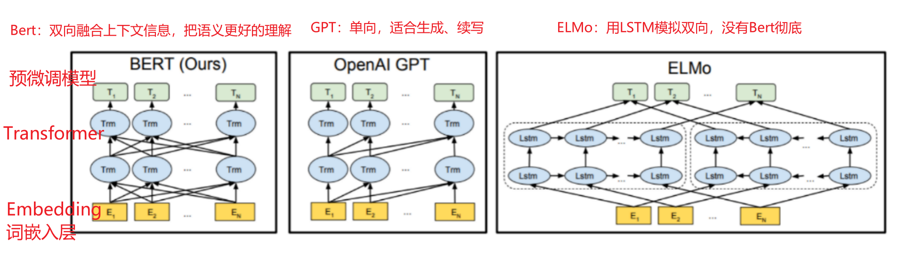
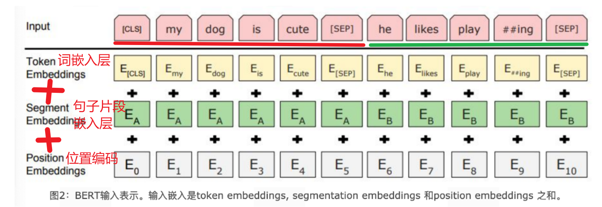
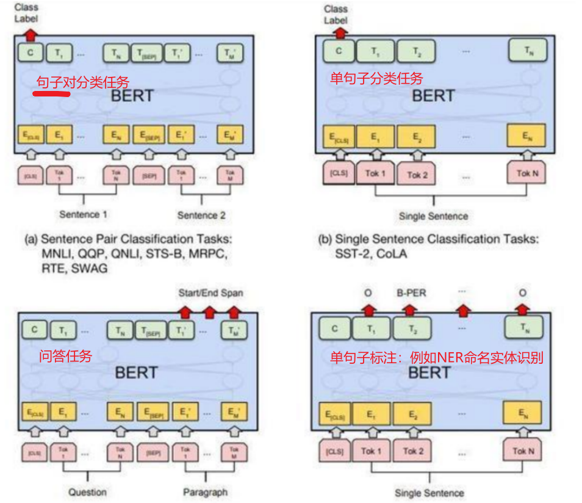

# 第六章BERT系列模型

## BERT模型介绍

### BERT简介

BERT是2018年10月由Google AI研究院提出的一种预训练模型.

- BERT的全称是Bidirectional Encoder Representation from Transformers.
- BERT在机器阅读理解顶级水平测试SQuAD1.1中表现出惊人的成绩: 全部两个衡量指标上全面超越人类, 并且在11种不同NLP测试中创出SOTA表现. 包括将GLUE基准推高至80.4% (绝对改进7.6%), MultiNLI准确度达到86.7% (绝对改进5.6%). 成为NLP发展史上的里程碑式的模型成就.

### BERT架构

总体架构: 如下图所示, 最左边的就是BERT的架构图, 可以很清楚的看到BERT采用了Transformer Encoder block进行连接, 因为是一个典型的双向编码模型.



从上面的架构图中可以看到, 宏观上BERT分三个主要模块.

- 最底层黄色标记的Embedding模块.
- 中间层蓝色标记的Transformer模块.
- 最上层绿色标记的预微调模块.

#### Embedding模块

BERT中的该模块是由三种Embedding共同组成而成, 如下图



> - Token Embeddings 是词嵌入张量, 第一个单词是CLS标志, 可以用于之后的分类任务.
> - Segment Embeddings 是句子分段嵌入张量, 是为了服务后续的两个句子为输入的预训练任务.
> - Position Embeddings 是位置编码张量, 此处注意和传统的Transformer不同, 不是三角函数计算的固定位置编码, 而是通过学习得出来的.
> - 整个Embedding模块的输出张量就是这3个张量的直接加和结果.

#### 双向Transformer模块

BERT中只使用了经典Transformer架构中的Encoder部分, 完全舍弃了Decoder部分. 而两大预训练任务也集中体现在训练Transformer模块中.

#### 预微调模块

- 经过中间层Transformer的处理后, BERT的最后一层根据任务的不同需求而做不同的调整即可.
- 比如对于sequence-level的分类任务, BERT直接取第一个[CLS] token 的final hidden state, 再加一层全连接层后进行softmax来预测最终的标签.

> - 对于不同的任务, 微调都集中在预微调模块, 几种重要的NLP微调任务架构图展示如下



> - 从上图中可以发现, 在面对特定任务时, 只需要对预微调层进行微调, 就可以利用Transformer强大的注意力机制来模拟很多下游任务, 并得到SOTA的结果. (句子对关系判断, 单文本主题分类, 问答任务(QA), 单句贴标签(NER))
> - 若干可选的超参数建议如下:

```
Batch size: 16, 32
Learning rate (Adam): 5e-5, 3e-5, 2e-5
Epochs: 3, 4
```

### BERT的预训练任务

BERT包含两个预训练任务:

- 任务一: Masked LM (带mask的语言模型训练)
- 任务二: Next Sentence Prediction (下一句话预测任务)

#### 任务一: Masked LM

带mask的语言模型训练

- 关于传统的语言模型训练, 都是采用left-to-right, 或者left-to-right + right-to-left结合的方式, 但这种单向方式或者拼接的方式提取特征的能力有限. 为此BERT提出一个深度双向表达模型(deep bidirectional representation). 即采用MASK任务来训练模型.
- 1: 在原始训练文本中, 随机的抽取15%的token作为参与MASK任务的对象.
- 2: 在这些被选中的token中, 数据生成器并不是把它们全部变成[MASK], 而是有下列3种情况.
- 2.1: 在80%的概率下, 用[MASK]标记替换该token, 比如my dog is hairy -> my dog is [MASK]
- 2.2: 在10%的概率下, 用一个随机的单词替换token, 比如my dog is hairy -> my dog is apple
- 2.3: 在10%的概率下, 保持该token不变, 比如my dog is hairy -> my dog is hairy
- 3: 模型在训练的过程中, 并不知道它将要预测哪些单词? 哪些单词是原始的样子? 哪些单词被遮掩成了[MASK]? 哪些单词被替换成了其他单词? 正是在这样一种高度不确定的情况下, 反倒逼着模型快速学习该token的分布式上下文的语义, 尽最大努力学习原始语言说话的样子. 同时因为原始文本中只有15%的token参与了MASK操作, 并不会破坏原语言的表达能力和语言规则.

#### 任务二: Next Sentence Prediction

下一句话预测任务

- 在NLP中有一类重要的问题比如QA(Quention-Answer), NLI(Natural Language Inference), 需要模型能够很好的理解两个句子之间的关系, 从而需要在模型的训练中引入对应的任务. 在BERT中引入的就是Next Sentence Prediction任务. 采用的方式是输入句子对(A, B), 模型来预测句子B是不是句子A的真实的下一句话.
- 1: 所有参与任务训练的语句都被选中作为句子A.
- 1.1: 其中50%的B是原始文本中真实跟随A的下一句话. (标记为IsNext, 代表正样本)
- 1.2: 其中50%的B是原始文本中随机抽取的一句话. (标记为NotNext, 代表负样本)
- 2: 在任务二中, BERT模型可以在测试集上取得97%-98%的准确率.

## BERT模型特点

### BERT模型优缺点

#### BERT的优点

- 通过预训练, 加上Fine-tunning, 在11项NLP任务上取得最优结果.
- BERT的根基源于Transformer, 相比传统RNN更加高效, 可以并行化处理同时能捕捉长距离的语义和结构依赖.
- BERT采用了Transformer架构中的Encoder模块, 不仅仅获得了真正意义上的bidirectional context, 而且为后续微调任务留出了足够的调整空间.

#### BERT的缺点

- BERT模型过于庞大, 参数太多, 不利于资源紧张的应用场景, 也不利于上线的实时处理.
- BERT目前给出的中文模型中, 是以字为基本token单位的, 很多需要词向量的应用无法直接使用. 同时该模型无法识别很多生僻词, 只能以UNK代替.
- BERT中第一个预训练任务MLM中, [MASK]标记只在训练阶段出现, 而在预测阶段不会出现, 这就造成了一定的信息偏差, 因此训练时不能过多的使用[MASK], 否则会影响模型的表现.
- 按照BERT的MLM任务中的约定, 每个batch数据中只有15%的token参与了训练, 被模型学习和预测, 所以BERT收敛的速度比left-to-right模型要慢很多(left-to-right模型中每一个token都会参与训练).

### BERT的MLM任务

#### BERT的MLM任务中为什么采用了80%, 10%, 10%的策略?

- 首先, 如果所有参与训练的token被100%的[MASK], 那么在fine-tunning的时候所有单词都是已知的, 不存在[MASK], 那么模型就只能根据其他token的信息和语序结构来预测当前词, 而无法利用到这个词本身的信息, 因为它们从未出现在训练过程中, 等于模型从未接触到它们的信息, 等于整个语义空间损失了部分信息. 采用80%的概率下应用[MASK], 既可以让模型去学着预测这些单词, 又以20%的概率保留了语义信息展示给模型.
- 保留下来的信息如果全部使用原始token, 那么模型在预训练的时候可能会偷懒, 直接照抄当前token信息. 采用10%概率下random token来随机替换当前token, 会让模型不能去死记硬背当前的token, 而去尽力学习单词周边的语义表达和远距离的信息依赖, 尝试建模完整的语言信息.
- 最后再以10%的概率保留原始的token, 意义就是保留语言本来的面貌, 让信息不至于完全被遮掩, 使得模型可以"看清"真实的语言面貌.

### BERT处理长文本的方法

首选要明确一点, BERT预训练模型所接收的最大sequence长度是512.

那么对于长文本(文本长度超过512的句子), 就需要特殊的方式来构造训练样本. 核心就是如何进行截断.

- head-only方式: 这是只保留长文本头部信息的截断方式, 具体为保存前510个token (要留两个位置给[CLS]和[SEP]).
- tail-only方式: 这是只保留长文本尾部信息的截断方式, 具体为保存最后510个token (要留两个位置给[CLS]和[SEP]).
- head+only方式: 选择前128个token和最后382个token (文本总长度在800以内), 或者前256个token和最后254个token (文本总长度大于800).


~~~properties
BERT的缺点
	1- 相对RNN来说，模型体积过大，也就是参数过多
		超参数：程序员自己手动调试的参数
		参数：模型自己训练得到的。例如：w、b
	2- 对中文的处理有限，因为词汇表中是以单个单个的词进行分词处理的
	3- 预训练任务可能会有偏差
	

为什么MLM选择80%、10%、10%的组合？
    80% -> 用[MASK]替代真实词，避免模型猜词，逼迫模型深入的去理解上下文意思
    10% -> 随机替换。防止模型偷懒
    10% -> 不做任何操作。保留原始语义
~~~


## BERT系列模型介绍

### AlBERT模型

#### AlBERT模型的架构

- AlBERT模型发布于ICLR 2020会议, 是基于BERT模型的重要改进版本. 是谷歌研究院和芝加哥大学共同发布的研究成果.
- 论文<< A Lite BERT For Self-Supervised Learning Of Language Representations >>.
- 从模型架构上看, AlBERT和BERT基本一致, 核心模块都是基于Transformer的强大特征提取能力.

------

- 在本篇论文中, 首先对比了过去几年预训练模型的主流操作思路.
- 第一: 大规模的语料.
- 第二: 更深的网络, 更多的参数.
- 第三: 多任务训练.

#### AlBERT模型的优化点

- 相比较于BERT模型, AlBERT的出发点即是希望降低预训练的难度, 同时提升模型关键能力. 主要引入了5大优化.
- 第一: 词嵌入参数的因式分解.
- 第二: 隐藏层之间的参数共享.
- 第三: 去掉NSP, 增加SOP预训练任务.
- 第四: 去掉dropout操作.
- 第五: MLM任务的优化.

------

- 第一: 词嵌入参数的因式分解.
- AlBERT的作者认为, 词向量只记录了少量的词汇本身的信息, 更多的语义信息和句法信息包含在隐藏层中. 因此词嵌入的维度不一定非要和隐藏层的维度一致.

------

- 具体做法就是通过因式分解来降低嵌入矩阵的参数:
- BERT: embedding_dim * vocab_size = hidden_size * vocab_size, 其中embedding_dim=768, vocab_size大约为30000左右的级别, 大约等于30000 * 768 = 23040000(2300万).
- AlBERT: vocab_size * project + project * hidden_size, 其中project是因式分解的中间映射层维度, 一般取128, 参数总量大约等于30000 * 128 + 128 * 768 = 482304(48万).

------

- 第二: 隐藏层之间的参数共享.
- 在BERT模型中, 无论是12层的base, 还是24层的large模型, 其中每一个Encoder Block都拥有独立的参数模块, 包含多头注意力子层, 前馈全连接层. **非常重要的一点是, 这些层之间的参数都是独立的, 随着训练的进行都不一样了!**

------

- 那么为了减少模型的参数量, 一个很直观的做法便是让这些层之间的参数共享, 本质上只有一套Encoder Block的参数!
- 在AlBERT模型中, 所有的多头注意力子层, 全连接层的参数都是分别共享的, 通过这样的方式, AlBERT属于Block的参数量在BERT的基础上, 分别下降到原来的1/12, 1/24.

------

- 第三: 去掉NSP, 增加SOP预训练任务.
- BERT模型的成功很大程度上取决于两点, 一个是基础架构采用Transformer, 另一个就是精心设计的两大预训练任务, MLM和NSP. 但是BERT提出后不久, 便有研究人员对NSP任务提出质疑, 我们也可以反思一下NSP任务有什么问题?

------

- 在AlBERT模型中, 直接舍弃掉了NSP任务, 新提出了SOP任务(Sentence Order Prediction), 即两句话的顺序预测, 文本中正常语序的先后两句话[A, B]作为正样本, 则[B, A]作为负样本.
- 增加了SOP预训练任务后, 使得AlBERT拥有了更强大的语义理解能力和语序关系的预测能力.

------

- 第四: 去掉dropout操作.
- 原始论文中提到, 在AlBERT训练达到100万个batch_size时, 模型依然没有过拟合, 作者基于这个试验结果直接去掉了Dropout操作, 竟然意外的发现AlBERT对下游任务的效果有了进一步的提升. **这是NLP领域第一次发现dropout对大规模预训练模型会造成负面影响, 也使得AlBERT v2.0版本成为第一个不使用dropout操作而获得优异表现的主流预训练模型**

------

- 第五: MLM任务的优化.
- segments-pair的优化:
  - BERT为了加速训练, 前90%的steps使用了长度为128个token的短句子, 后10%的steps才使用长度为512个token的长句子.
  - AlBERT在90%的steps中使用了长度为512个token的长句子, 更长的句子可以提供更多上下文信息, 可以显著提升模型的能力.
- Masked-Ngram-LM的优化:
  - BERT的MLM目标是随机mask掉15%的token来进行预测, 其中的token早已分好, 一个个算.
  - AlBERT预测的是Ngram片段, 每个片段长度为n (n=1,2,3), 每个Ngram片段的概率按照公式分别计算即可. 比如1-gram, 2-gram, 3-gram的概率分别为6/11, 3/11, 2/11.

------

- AlBERT系列中包含一个albert-tiny模型, 隐藏层仅有4层, 参数量1.8M, 非常轻巧. 相比较BERT, 其训练和推理速度提升约10倍, 但精度基本保留, 语义相似度数据集LCQMC测试集达到85.4%, 相比于bert-base仅下降1.5%, 非常优秀.

### RoBERTa模型

#### RoBERTa模型的架构

- 原始论文<< RoBERTa: A Robustly Optimized BERT Pretraining Approach >>, 由FaceBook和华盛顿大学联合于2019年提出的模型.
- 从模型架构上看, RoBERTa和BERT完全一致, 核心模块都是基于Transformer的强大特征提取能力. 改进点主要集中在一些训练细节上.
  - 第1点: More data
  - 第2点: Larger batch size
  - 第3点: Training longer
  - 第4点: No NSP
  - 第5点: Dynamic masking
  - 第6点: Byte level BPE

#### RoBERTa模型的优化点

- 针对于上面提到的7点细节, 一一展开说明:
- 第1点: More data (更大的数据量)
  - 原始BERT的训练语料采用了16GB的文本数据.
  - RoBERTa采用了160GB的文本数据.
    - 1: Books Corpus + English Wikipedia (16GB): BERT原文使用的之数据.
    - 2: CC-News (76GB): 自CommonCrawl News数据中筛选后得到数据, 约含6300万篇新闻, 2016年9月-2019年2月.
    - 3: OpenWebText (38GB): 该数据是借鉴GPT2, 从Reddit论坛中获取, 取点赞数大于3的内容.
    - 4: Storie (31GB): 同样从CommonCrawl获取, 属于故事类数据, 而非新闻类.

------

- 第2点: Larger batch size (更大的batch size)
  - BERT采用的batch size等于256.
  - RoBERTa的训练在多种模式下采用了更大的batch size, 从256一直到最大的8000.

------

- 第3点: Training longer (更多的训练步数)
  - RoBERTa的训练采用了更多的训练步数, 让模型充分学习数据中的特征.

------

- 第4点: No NSP (去掉NSP任务)
  - 从2019年开始, 已经有越来越多的证据表明NSP任务对于大型预训练模型是一个负面作用, 因此在RoBERTa中直接取消掉NSP任务.
  - 论文作者进行了多组对照试验:
    - 1: Segment + NSP (即BERT模式). 输入包含两部分, 每个部分是来自同一文档或者不同文档的segment(segment是连续的多个句子), 这两个segment的token总数少于512, 预训练包含MLM任务和NSP任务.
    - 2: Sentence pair + NSP (使用两个连续的句子 + NSP, 并采用更大的batch size). 输入也是包含两部分, 每个部分是来自同一个文档或者不同文档的单个句子, 这两个句子的token 总数少于512. 由于这些输入明显少于512个tokens, 因此增加batch size的大小, 以使tokens总数保持与SEGMENT-PAIR + NSP相似, 预训练包含MLM任务和NSP任务.
    - 3: Full-sentences (如果输入的最大长度为512, 那么尽量选择512长度的连续句子; 如果跨越document, 就在中间加上一个特殊分隔符, 比如[SEP]; 该试验没有NSP). 输入只有一部分(而不是两部分), 来自同一个文档或者不同文档的连续多个句子, token总数不超过512. 输入可能跨越文档边界, 如果跨文档, 则在上一个文档末尾添加文档边界token, 预训练不包含NSP任务.
    - 4: Document-sentences (和情况3一样, 但是步跨越document; 该实验没有NSP). 输入只有一部分(而不是两部分), 输入的构造类似于Full-sentences, 只是不需要跨越文档边界, 其输入来自同一个文档的连续句子, token总数不超过512. 在文档末尾附近采样的输入可以短于512个tokens, 因此在这些情况下动态增加batch size大小以达到与Full-sentecens相同的tokens总数, 预训练不包含NSP任务.

------

- 总的来说, 实验结果表明1 < 2 < 3 < 4.
  - 真实句子过短的话, 不如拼接成句子段.
  - 没有NSP任务更优.
  - 不跨越document更优.

------

- 第5点: Dynamic masking (采用动态masking策略)
  - 原始静态mask: 即BERT版本的mask策略, 准备训练数据时, 每个样本只会进行一次随机mask(因此每个epoch都是重复的), 后续的每个训练步都采用相同的mask方式, 这是原始静态mask.
  - 动态mask: 并没有在预处理的时候执行mask, 而是在每次向模型提供输入时动态生成mask, 所以到底哪些tokens被mask掉了是时刻变化的, 无法提前预知的.

------

- 第6点: Byte level BPE (采用字节级别的Encoding)
  - 基于char-level: 原始BERT的方式, 在中文场景下就是处理一个个的汉字.
  - 基于bytes-level: 与char-level的区别在于编码的粒度是bytes, 而不是unicode字符作为sub-word的基本单位.
- 当采用bytes-level的BPE之后, 词表大小从3万(原始BERT的char-level)增加到5万. 这分别为BERT-base和BERT-large增加了1500万和2000万额外的参数. 之前有研究表明, 这样的做法在有些下游任务上会导致轻微的性能下降. 但论文作者相信: 这种统一编码的优势会超过性能的轻微下降.

### MacBert模型

#### MacBert模型的架构

- MacBert模型由哈工大NLP实验室于2020年11月提出, 2021年5月发布应用, 是针对于BERT模型做了优化改良后的预训练模型.
- << Revisiting Pre-trained Models for Chinese Natural Language Processing >>, 通过原始论文题目也可以知道, MacBert是针对于中文场景下的BERT优化.
- MacBert模型的架构和BERT大部分保持一致, 最大的变化有两点:
  - 第一点: 对于MLM预训练任务, 采用了不同的MASK策略.
  - 第二点: 删除了NSP任务, 替换成SOP任务.

#### MacBert模型的优化点

- 第一点: 对于MLM预训练任务, 采用了不同的MASK策略.
  - 1: 使用了全词masked以及n-gram masked策略来选择tokens如何被遮掩, 从单个字符到4个字符的遮掩比例分别为40%, 30%, 20%, 10%
  - 2: 原始BERT模型中的[MASK]出现在训练阶段, 但没有出现在微调阶段, 这会造成exposure bias的问题. 因此在MacBert中提出使用类似的单词来进行masked. 具体来说, 使用基于Word2Vec相似度计算包训练词向量, 后续利用这里面找近义词的功能来辅助mask, 比如以30%的概率选择了一个3-gram的单词进行masked, 则将在Word2Vec中寻找3-gram的近义词来替换, 在极少数情况下, 当没有符合条件的相似单词时, 策略会进行降级, 直接使用随机单词进行替换.
  - 3: 使用15%的百分比对输入单词进行MASK, 其中80%的概率下执行策略2(即替换为相似单词), 10%的概率下替换为随机单词, 10%的概率下保留原始单词不变.

------

- 第二点: 删除了NSP任务, 替换成SOP任务.
- 第二点优化是直接借鉴了AlBERT模型中提出的SOP任务.

------

- 在NLP著名的难任务阅读理解中, MacBert展现出非常优秀的表现.

#### 3.4 SpanBERT模型

#### SpanBERT模型的架构

- 论文的主要贡献有3点:
  - 1: 提出了更好的Span Mask方案, 再次展示了随机遮掩连续一段tokens比随机遮掩单个token要好.
  - 2: 通过加入了Span Boundary Objective(SBO)训练任务, 增强了BERT的性能, 特别在一些和Span适配的任务, 如抽取式问答.
  - 3: 用实验数据获得了和XLNet一致的结果, 发现去除掉NSP任务, 直接用连续一长句训练效果更好.

------

- 架构图中可以清晰的展示论文的核心贡献点:
  - Span Masking
  - Span Boundary Objective

#### Span Masking

- 关于创新的MASK机制, 一般来说都是相对于原始BERT的基准进行改进. 对于BERT, 训练时会随机选取整句中的最小输入单元token来进行遮掩, 中文场景下本质上就是进行字级别的MASK. 但是这种方式会让本来应该有强相关的一些连在一起的字词, 在训练时被割裂开了.
- 那么首先想到的做法: 既然能遮掩字, 那么能不能直接遮掩整个词呢? 这就是BERT-WWM模型的思想.

```
原始输入: 使用语言模型来预测下一个词的概率.

原始BERT: 使用语言[MASK]型来[MASK]测下一个词的[MASK]率.

BERT-WWM: 使用语言[MASK][MASK]来[MASK][MASK]下一个词的[MASK][MASK].
```

------

> - 引申: 百度著名的ERNIE模型中, 直接引入命名实体(Named Entity)的外部知识, 进行整个实体的遮掩, 进行训练.

------

- 综合上面所说, 会更自然的想到, 既然整词的MASK, 那么如果拥有词的边界信息会不会让模型的能力更上一层楼呢? SpanBERT给出的是肯定的回答!!!
- 论文中关于span的选择, 走了这样一个流程:
  - 第一步: 根据几何分布, 先随机选择一个**span长度**.
  - 第二步: 再根据均匀分布随机选择这一段的**起始位置**.
  - 第三步: 最后根据前两步的start和length直接进行MASK.

------

> - 结论: 论文中详细论证了按照上述算法进行MASK, 随机被遮掩的文本平均长度等于3.8

#### Span Boundary Objective(SBO)

- SBO任务是本篇论文最核心的创新点, 希望通过增加这个预训练任务, 可以让被遮掩的Span Boundary的词向量, 能够学习到Span内部的信息

------

- 具体的做法: 在训练时取Span前后边界的两个词, 需要注意这两个词不在Span内, 然后用这两个词向量加上Span中被MASK掉的词的位置向量, 来预测原词.
- 更详细的操作如下, 即将词向量和位置向量进行拼接, 经过GeLU激活和LayerNorm处理, 连续经过两个全连接层, 得到最终的输出张量:

------

- 最后预测Span中原词的时候会得到一个损失, 这就是SBO任务的损失; 再将其和BERT自身的MLM任务的损失进行加和, 共同作为SpanBERT的目标损失函数进行训练

#### NSP任务反思

- 为什么选择Single Sentence而不是BERT的Two Sentence?
  - 1: 训练文本的长度更大, 可以学会长程依赖.
  - 2: 对于NSP的负样本, 基于另一个主题文档的句子来预测单词, 会给MLM任务引入很大的噪声.
  - 3: AlBERT模型已经给出了论证, 因为NSP任务太简单了.

## ELMo模型介绍

- 学习了什么是ELMo.
  - ELMo是2018年3月由华盛顿大学提出的一种预训练语言模型.
  - ELMo在6种NLP测试任务中有很大的提升表现.
- 学习了ELMo的结构.
  - ELMo架构总体上采用了双向双层LSTM的结构.
  - 最底层的Embedding模块.
  - 中间层的双向双层LSTM模块.
  - 最上层的特征融合模块.
- 学习了ELMo的预训练任务.
  - ELMo的本质思想就是根据当前上下文对word embedding进行动态调整的语言模型.
  - ELMo的预训练是一个明显的两阶段过程.
    - 第一阶段: 利用语言模型进行预训练, 得到基础静态词向量和双向双层LSTM网络.
    - 第二阶段: 在拥有上下文的环境中, 将上下文输入双向双层LSTM中, 得到动态调整后的word embedding, 等于将单词融合进了上下文的语义, 可以更准确的表达单词的真实含义.
- 学习了ELMo的效果.
  - 经过与GloVe静态词向量的对比, 明显可以看出ELMo的词向量可以更好的表达真实语义, 更好的解决多义词的问题.
- 学习了ELMo的待改进点.
  - ELMo的特征提取器没有选用更强大的Transformer, 在提取特征上肯定弱于现在的最优结果.

## GPT模型介绍

- 学习了什么是GPT.
  - GPT是OpenAI公司提出的一种预训练语言模型.
  - 本质上来说, GPT是一个单向语言模型.
- 学习了GPT的架构.
  - GPT采用了Transformer架构中的解码器模块.
  - GPT在使用解码器模块时做了一定的改造, 将传统的3层Decoder Block变成了2层Block, 删除了encoder-decoder attention子层, 只保留Masked Multi-Head Attention子层和Feed Forward子层.
  - GPT的解码器总共是由12个改造后的Decoder Block组成的.
- 学习了GPT的预训练任务.
  - 第一阶段: 无监督的预训练语言模型. 只利用单词前面的信息来预测当前单词.
  - 第二阶段: 有监督的下游任务fine-tunning.

## BERT GPT ELMo模型对比

学习了BERT, GPT, ELMo之间的区别: * 三者所选取的特征提取器不同. * BERT采用的是Transformer架构中的Encoder模块. * GPT采用的是Transformer架构中的Decoder模块. * ELMo采用的双层双向LSTM模块.

- 三者所采用的语言模型单/双向不同.
  - BERT采用的是最彻底的双向语言模型, 可以同时关注context before和context after.
  - GPT采用的是单向语言模型, 即Transformer中的Decoder, 由于采用了mask机制, 所以未来信息context after都不可见.
  - ELMo表面上被认为是双向语言模型, 但实际上是左右两个单向LSTM模型分别提取特征, 在进行简单的拼接融合.