尚硅谷大模型技术之LangChain

（作者：尚硅谷研究院）

版本：V1.0.2

# 1.LangChain概述

## 1.1 什么是 LangChain

LangChain是2022年10月，由哈佛大学的Harrison Chase（哈里森·蔡斯）发起研发的一个开源框架，用于开发由大语言模型（LLMs）驱动的应用程序。

以下是关于LangChain的相关网址链接

- github地址：[https://github.com/langchain-ai/langchain](https://github.com/langchain-ai/langchain)
- 官网地址：[https://www.langchain.com/langchain](https://www.langchain.com/langchain)
- 官方文档：[https://docs.langchain.com/oss/python/langchain/overview](https://docs.langchain.com/oss/python/langchain/overview)
- API 文档：[https://reference.langchain.com/python/langchain/](https://reference.langchain.com/python/langchain/)

LangChain可用于如下多种场景，例如：搭建 Agent、问答系统（QA）、文档搜索系统等。

LangChain的发布比ChatGPT问世还要早一个月，从这个启动日期也可以看出创始人的眼光，占了先机的它迅速获得广泛关注和支持！

LangChain在Github上的热度变化：

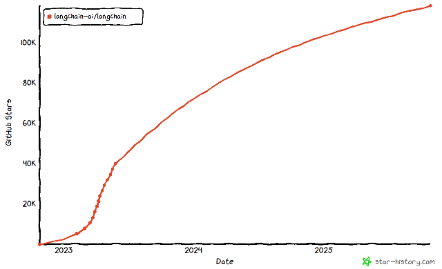

下面通过两个问题，来看下LangChain所提供的价值：

- 问题1：LLMs用的好好的，为什么还需要LangChain？

在大语言模型（LLM）如 ChatGPT、Claude、DeepSeek 等快速发展的今天，开发者不仅希望能“使用”这些模型，还希望能将它们灵活集成到自己的应用中，实现更强大的对话能力、检索增强生成（RAG）、工具调用（Tool Calling）、多轮推理等功能。

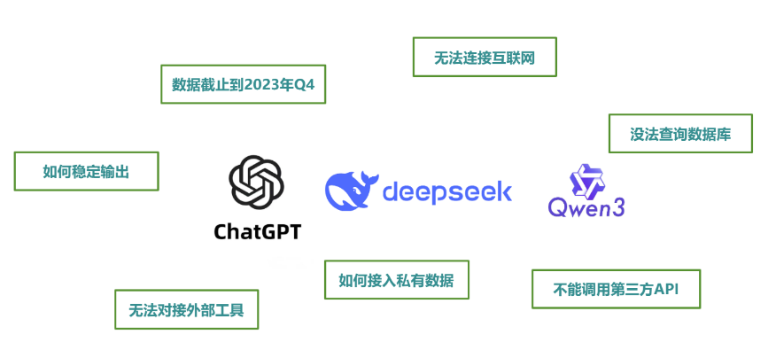

- 问题2：我们可以使用GPT 或GLM4 等模型的API进行开发，为何需要LangChain这样的框架？

不使用LangChain，确实可以使用GPT 或GLM4 等模型的API进行开发。

但使用LangChain的好处：

- 简化开发难度：更简单、更高效、效果更好。
- 开发人员可以更专注于业务逻辑，而无须花费大量时间和精力处理底层技术细节。
- 学习成本更低：不同模型的API不同，调用方式也有区别，切换模型时学习成本高。使用LangChain，可以以统一、规范的方式进行调用，有更好的移植性。
- 现成的Agent构建方法：LangChain提供了现成的构建Agent的方式。让复杂的逻辑变得结构化、易组合、易扩展。

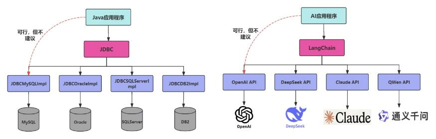

## 1.2 LangChain包及核心模块划分

### 1.2.1 LangChain所包含的包

LangChain所包含的包及其描述，如下所示：

| 包 | 描述 |
| --- | --- |
| langchain | 包含构建使用 LLM 的应用所需的所有实现的主入口点 |
| langchain-core | LangChain 生态系统中的核心接口和抽象 |
| langchain-openai/deepseek | Langchain和OpenAI（deepseek）集成包。langchain还包含一系列集成包，这些集成包涵盖了文本生成模型，工具，文档加载，向量存储等多个方面，构成了langchain生态系统。 |
| langchain-mcp-adapters | 在 LangChain 和 LangGraph 应用中提供 MCP 工具 |
| langchain-text-splitters | 用于文档处理的文本分割工具 |
| langchain-tests | 用于验证 LangChain 集成包实现的标准化测试套件 |
| langchain-classic | 遗留的 langchain 实现和组件，主要为1.0.0版本以前的相关内容 |

### 1.2.2 LangChain核心模块划分

LangChain的核心组件，从逻辑上可以划分为以下四大部分：Model I/O、Chains、RAG、Agents。

- Model I/O

标准化大模型的输入和输出，包含提示模版，模型调用和格式化输出。

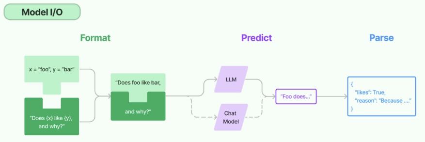

Format（格式化）：通过模板管理大模型的输入。将原始数据格式化成模型可以处理的形式，插入到一个模板中，然后送入模型进行处理。

Predict（预测）：调用 LLM 接收输入，进行预测或生成回答。

Parse（解析）：规范化模型输出。比如将模型输出格式化为 JSON。

- Chains

“链条”用于将多个组件组合成一个完整的流程，方便链式调用。

- Retrieval

对应RAG：检索外部数据，作为参考信息输入LLM辅助生成答案。

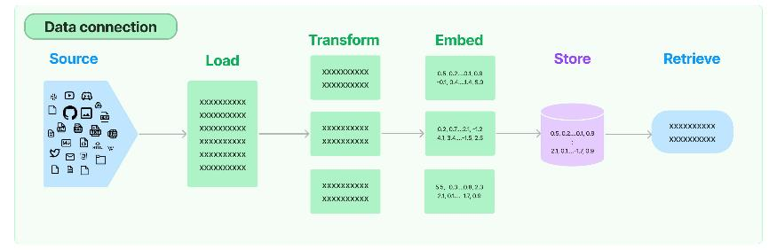

- Agents

Agent 自主规划执行步骤并使用工具来完成任务。

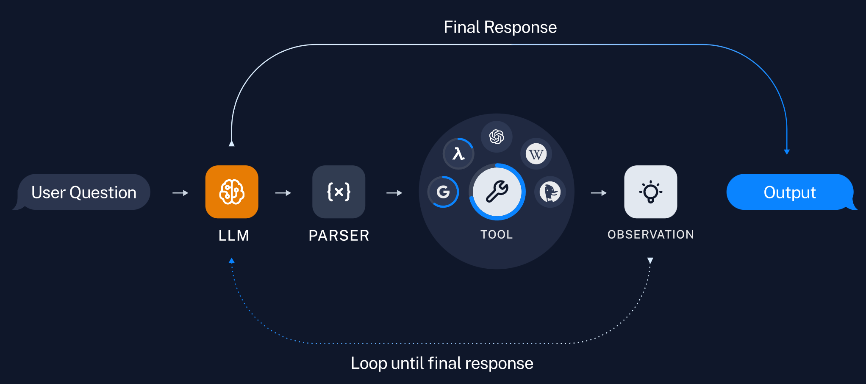

# 2.环境准备

本课程需要新建虚拟环境，python版本为3.12。课程当中所有环境依赖，可以使用课程资料当中的requirements.txt统一进行安装。另外，在每个示例代码演示时，如果需要新的包，也会在前面标注清楚，也可以在学习到相关章节时，再进行安装。

# 3.Model I/O与Chains

## 3.1 Model I/O 介绍

Model I/O 部分是与语言模型进行交互的核心组件，包括输入提示（Prompt Template）、调用模型（Model）、输出解析（Output Parser）。简单来说，就是输入、处理、输出这三个步骤。

## 3.2 调用在线模型

### 3.2.1 常用大模型服务平台介绍

有许多提供大模型API服务的平台，如下所示：

- CloseAI：[https://platform.closeai-asia.com/](https://platform.closeai-asia.com/)，可提供国外OpenAI, Anthropic，Google等公司最新模型调用代理；
- OpenRouter：[https://openrouter.ai/](https://openrouter.ai/)，提供闭源模型和开源模型调用代理；
- 阿里云百炼：[https://bailian.console.aliyun.com/](https://bailian.console.aliyun.com/)，提供大模型API调用、模型微调、模型评测等一系列服务，是一站式大模型应用开发平台；
- 百度千帆：[https://console.bce.baidu.com/qianfan/overview](https://console.bce.baidu.com/qianfan/overview)，类似于阿里云百炼，同样为一站式企业级大模型开发与应用平台；
- 硅基流动：[https://www.siliconflow.cn/](https://www.siliconflow.cn/)，类似上两个平台，不再赘述。

使用时只需要注册、充值并创建API-Key，之后即可使用API-Key与BASE_URL来调用平台提供的相应的模型的服务。

API_KEY为敏感信息，在不同的平台获取到API_KEY之后，需要将API_KEY和BASE_URL通过环境变量存储起来，后续在实际调用时，需要加载环境变量后，从环境变量当中读取，而不是直接硬编码在业务代码当中。

配置环境变量有两种方式：

- 通过.env文件配置，适用于实际项目当中

通过.env配置过程如下：

在项目根目录中创建.env文件，添加环境变量：此处以OPENAI_BASE_URL和OPENAI_API_KEY为例

在代码当中通过dot_env模块（需要安装包：python-dotenv）的load_dotenv方法加载环境变量

在代码当中通过os模块读取环境变量

.env文件内容如下所示：

OPENAI_API_KEY=sk-xxx

OPENAI_BASE_URL=https://api.openai-proxy.org/v1

读取示例如下所示：

```python
# pip install python-dotenv

# 1、从dotenv导入load_dotenv方法
from dotenv import load_dotenv

# 2、调用load_dotenv方法加载.env文件
load_dotenv()

# 3、通过os模块读取环境变量
import os
api_key = os.getenv("OPENAI_API_KEY")
print(api_key)
```


**在实际开发过程中，一定要注意：不要将.env放在git管理目录当中，避免数据泄露**。

- 在Windows当中配置全局环境变量，适用于学习环境下，经常需要使用到的某些环境变量。

本课程当中，会将部分环境变量，通过Windows做全局配置，避免重复执行load_dotenv操作：

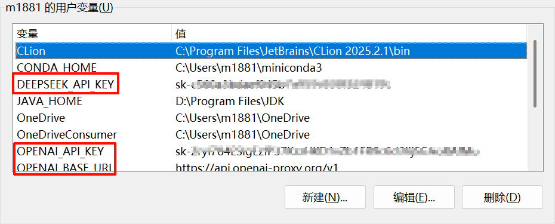

### 3.2.2 OpenAI SDK 调用模型

OpenAI 的 GPT 系列模型影响了大模型技术发展的开发范式和标准。大部分模型，例如 Qwen、ChatGLM、DeepSeek 等模型，它们的使用方法和函数调用逻辑基本遵循 OpenAI 定义的规范，都可以使用OpenAI SDK来进行调用。

OpenAI的接口调用方式也经历的一些转变，其中最为经典的一套API，称之为**ChatCompletionsAPI**（官方文档链接：https://platform.openai.com/docs/api-reference/chat）。

而在2025年年中，OpenAI又发布了一套新的API: ResponsesAPI（官方文档链接：[https://platform.openai.com/docs/api-reference/responses](https://platform.openai.com/docs/api-reference/responses)）。

ResponsesAPI是当前OpenAI中最先进的一套API，对ChatCompletionsAPI做了多处升级，例如，支持服务端内置工具调用，支持服务端维护状态（短期记忆）等。

- ChatCompletionAPI 调用示例

```python
# pip install openai

from openai import OpenAI
import os
from dotenv import load_dotenv

load_dotenv()
client = OpenAI(
base_url=os.getenv("OPENAI_BASE_URL"),  # 平台提供的 URL
api_key=os.getenv("OPENAI_API_KEY"),  # 平台提供的 API-Key
)

completion = client.chat.completions.create(
	model="gpt-4o-mini",  # 模型名称
	messages=[{"role": "user", "content": "将'你好'翻译成意大利语"}],  # 用户输入
)
print(completion.choices[0].message.content)

```

- ResponsesAPI调用示例

```python
import os
from openai import OpenAI

client = OpenAI()
response = client.responses.create(
	model="gpt-5.1",
	input="中国国内今天发生了哪些大事儿？",
	tools=[{"type": "web_search"}] # 可以自动调用内置工具
)
print(response.output_text)
```

### 3.2.3 Google SDK 调用模型（了解）

如果需要调用Gemini相关模型，需要使用google的SDK，以下为一个具体的调用示例：

```python
# pip install google-genai

def call_gemini():

	import os
	from google import genai
	from dotenv import load_dotenv
	load_dotenv()
	client = genai.Client(
		api_key=os.getenv("OPENAI_API_KEY"),
		http_options={
			"base_url": 'https://api.openai-proxy.org/google' # 此处需要根据个人所选择的大模型服务平台去做具体调整
		},
	)

response = client.models.generate_content(
		model="gemini-2.5-flash-lite",
		contents="你是谁，能做什么",
	)

print(response.text)
```

### 3.2.4 LangChain API 调用模型

通过上面两个例子，可以看到，对于不同厂商的模型，需要学习不同的SDK的API来进行调用（**注意**：虽然大部分模型厂商可以兼容OpenAI SDK规范，但是对于复杂场景下，例如后面会学习到的结构化输出等场景，各厂商之间具体构造参数的方式仍有差别），而通过LangChain调用API，其封装了不同模型调用时，复杂的出入参的构建和解析，得到llm对象之后，我们可以通过统一的方法来进行模型调用和结果解析。

在使用langchain进行模型调用时，需要先安装相应的包。对于OpenAI，需要安装langchain-openai包，而如果需要使用DeepSeek的模型，则需要安装langchain-deepseek。（具体可参考官网：[https://docs.langchain.com/oss/python/integrations/providers/overview](https://docs.langchain.com/oss/python/integrations/providers/overview)）。

使用LangChainAPI进行调用的步骤如下：

- 构造LLM ChatModel实例
- 传递Message对象列表或普通字符串对象，调用LLM实例
- 解析调用结果

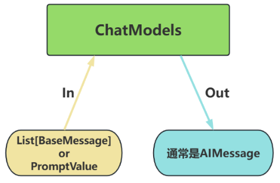

- 构造LLM ChatModel实例

LLM ChatModel实例代表了一个可调用的LLM对象，有两种方式进行初始化，

- langchain提供的统一方法init_chat_model；
- 使用特定包下（例如langchain-openai）下的ChatModel类（例如langchain_openai 下的ChatOpenAI类）。

下面首先介绍init_chat_model的初始化参数，代码示例如下：

```python
# pip install langchain
# pip install langchain-openai

def get_model_from_init():
	import os
	import dotenv
	dotenv.load_dotenv()
	from langchain.chat_models import init_chat_model

	llm = init_chat_model(
		model="gpt-4o-mini",
		model_provider="openai",
		base_url=os.getenv("OPENAI_BASE_URL"),
		api_key=os.getenv("OPENAI_API_KEY"),
		)
	resp = llm.invoke("你好")

	print(type(resp))  # <class 'langchain_core.messages.ai.AIMessage'>
	print(resp.content) # 获取结果
```


init_chat_model所接收的相关参数如下面所示：

| 参数 | 说明 |
| --- | --- |
| model | 模型名称或标识符，例如gpt-4o-mini |
| model_provider | 模型提供厂商,例如：openai |
| base_url | 发送请求的 API 端点的 URL。常由模型的提供商提供 |
| api_key | 与模型提供商进行身份验证所需的 API 密钥 |
| temperature | 控制模型输出的随机性。数字越高，回答越有创意；数字越低，回答越确定，涉及到大模型采样相关内容（https://zhuanlan.zhihu.com/p/1981752176578667658） |
| timeout | 在取消请求之前，等待模型响应的最大时间（以秒为单位） |
| max_tokens | 限制响应中的总tokens 数量，控制输出长度 |
| max_retries | 请求失败时系统尝试重新发送请求的最大次数 |

在此处介绍下max_tokens所涉及到的token的概念：大模型处理的最小单位是 token（相当于自然语言中的词或字），输出时逐个 token 依次生成。模型提供商通常也是以 token 的数量作为其计量或收费的依据。1个中文Token$\approx$1-1.8个汉字，1个英文Token$\approx$3-4字母。

Token与字符转化的可视化工具：

- OpenAI提供：[https://platform.openai.com/tokenizer](https://platform.openai.com/tokenizer)
- 百度智能云提供：[https://console.bce.baidu.com/support/#/tokenizer](https://console.bce.baidu.com/support/#/tokenizer)

使用特定包下的类构造LLM实例和init_chat_model在本质上是一样的（init_chat_model底层就是调用特定包下的类构造LLM实例），参考代码如下所示：

```python
def get_model_from_openai_package():
	import os
	import dotenv
	dotenv.load_dotenv()
	from langchain_openai import ChatOpenAI

	llm = ChatOpenAI(
		model="gpt-4o-mini",
		temperature=0.0,
		base_url=os.getenv("OPENAI_BASE_URL"),
		api_key=os.getenv("OPENAI_API_KEY"),
	)

	resp = llm.invoke("你好")
	print(type(resp))
	print(resp.content)

if __name__ == "__main__":
	get_model_from_openai_package()
```

对于其他厂商，代码类似，此处不再赘述。

- 调用LLM实例

调用LLM实例时，有两处需要关注：调用传入的对象类型和调用方式。

- 调用传入对象类型

前面的例子当中，我们直接传入字符串对象，这通常适用于不需要保留对话历史的直接生成任务。

除此以外，更加好的方式是传入一个消息列表：

```python
def invoke_llm_with_message_list():
	import os
	from langchain_openai import ChatOpenAI
	from langchain_core.messages import HumanMessage,SystemMessage,AIMessage

	llm = ChatOpenAI(
		model="gpt-4o-mini",
		temperature=0.0,
		base_url=os.getenv("OPENAI_BASE_URL"),
		api_key=os.getenv("OPENAI_API_KEY"),
	)
	resp = llm.invoke([SystemMessage(content="你是一个专业的数学助手"),HumanMessage(content="你好，你是谁")])

	print(type(resp))
	print(resp.content)

if __name__ == "__main__":
	invoke_llm_with_message_list()
```


消息列表表示了一段“聊天记录历史”；而不同的消息类型，则代表了不同的角色，各种类型及相关描述如下：

| 消息类型 | 描述 |
| --- | --- |
| SystemMessage | 代表一组初始指令，用于引导模型的行为。可以使用系统消息来设定语气、定义模型的角色，并建立响应的指导方针 |
| HumanMessage | 表示用户输入，可以在message当中传递其他元数据信息 |
| AIMessage | 模型生成的响应，包括文本内容、工具调用和token使用量等元数据信息 |
| ToolMessage | 表示工具调用的输出 |

HumanMessage、AIMessage 和 SystemMessage 是常用的消息类型。

ToolMessage 是在工具调用场景下才会使用的特殊消息类型。

消息对象，除了使用HumanMessage等类以外，还可以通过元组对象来表示，元组对象第一个元素表示角色，第二个元素表示具体消息内容；也可以通过OpenAI官方使用的dict来表示，dict当中有两个键，第一个为role，表示角色，第二个为content，表示内容。

示例代码如下：

```python
def invoke_llm_with_message_list_use_tuple():

	import os
	import dotenv
	dotenv.load_dotenv()
	from langchain_openai import ChatOpenAI
	from langchain_core.messages import HumanMessage,SystemMessage,AIMessage

	llm = ChatOpenAI(
		model="gpt-4o-mini",
		temperature=0.0,
		base_url=os.getenv("OPENAI_BASE_URL"),
		api_key=os.getenv("OPENAI_API_KEY"),
	)
	# 以下两种方式是等价的
	messages_list = [("system","你是一个专业的数学助手"),("user","你好，你是谁")]
	message_list = [{"role":"system","content":"你是一个专业的数学助手"},{"role":"user","content":"你好，你是谁"}]

	resp = llm.invoke(message_list)
	print(type(resp))
	print(resp.content)

if __name__ == "__main__":
	invoke_llm_with_message_list_use_tuple()
```

- 调用方式

除了上述调用方式外，LangChain的LLM对象还支持异步调用、流式调用、批调用等多种方式。

**异步调用**在实际生产环境下非常实用，可以大大提高程序的响应性能，示例代码如下：

```python
import asyncio

async def call_llm_async():
	from langchain_openai import ChatOpenAI

	llm = ChatOpenAI(
		model="gpt-4o-mini"
	)
	response = await llm.ainvoke(
	input=[("user", "什么是LangChain")]
	)
	print(response.content)

if __name__ == "__main__":
	asyncio.run(call_llm_async())
```

**流式调用**，可以让大模型输出结果实现打字机效果，示例代码如下：

```python
def call_llm_streaming_mode():
	from langchain_openai import ChatOpenAI

	llm = ChatOpenAI(
		model="gpt-4o-mini"
	)
	# 调用stream方法，返回迭代器对象
	response = llm.stream(
	input=[("user", "什么是LangChain")]
	)
	# 遍历迭代器对象，打印每个chunk的内容
	for chunk in response:
		print(chunk.content,end="")

call_llm_streaming_mode()
```


**批次调用**，可以并行发出多个请求，统一回收相关结果，示例代码如下：

```python
def call_llm_batch_mode():
	from langchain_openai import ChatOpenAI
	llm = ChatOpenAI(
		model="gpt-4o-mini"
	)
	# 调用batch方法，底部通过thread 并行调用模型
	response = llm.batch(
	inputs=[[("user", "什么是LangChain")],("user","LangChain的核心价值是什么呢？")]
	)
	# 打印每个问题的回答
	for question_chunk in response:
		print(question_chunk.content)

call_llm_batch_mode()
```

- 解析调用结果

解析调用结果会在3.4节中重点介绍，此处略过。

## 3.3 调用本地模型

### 3.3.1 Ollama介绍

Ollama是一个开源项目，其项目定位是：一个本地运行大模型的集成框架。目前主要针对主流的LlaMA架构的开源大模型设计，可以实现如 Qwen、Deepseek 等主流大模型的下载、启动和本地运行的自动化部署及推理流程。注意：Ollma主要用于原型设计和本地开发等，实际生产环境下做大模型部署会使用VLLM等框架。

Ollama目前作为一个非常热门的大模型托管平台，已被包括LangChain、Taskweaver等在内的多个热门项目高度集成。

Ollama官方地址：[https://ollama.com](https://ollama.com)

Ollama Github开源地址：[https://github.com/ollama/ollama](https://github.com/ollama/ollama)

### 3.3.2 Ollama安装

Ollama项目支持跨平台部署，目前已兼容Mac、Linux和Windows操作系统。

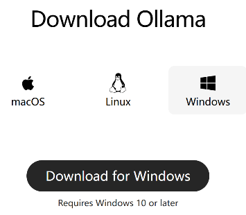

无论使用哪个操作系统，Ollama项目的安装过程都设计得非常简单。

访问 [https://ollama.com/download](https://ollama.com/download) 下载对应系统的安装文件。

- Windows 系统执行.exe文件安装
- Linux 系统执行以下命令安装：

curl -fsSL https://ollama.com/install.sh | sh

这行命令的目的是从https://ollama.com/ 网站读取 install.sh脚本，并立即通过 sh 执行该脚本，在安装过程中会包含以下几个主要的操作：

检查当前服务器的基础环境，如系统版本等；

下载Ollama的二进制文件；

配置系统服务，包括创建用户和用户组，添加Ollama的配置信息；

启动Ollama服务；

课程资料中已经提供Windows环境下Ollama的安装包，可以直接进行安装。

### 3.3.3 模型下载

访问[https://ollama.com/search](https://ollama.com/search)可以查看Ollama支持的模型。使用命令行可以下载并运行模型，例如运行qwen3:8b模型：

ollama run qwen3:8b

因为文件比较大，项目资料当中已经提供了模型资料，可以直接进行配置即可

- 进入到Settings

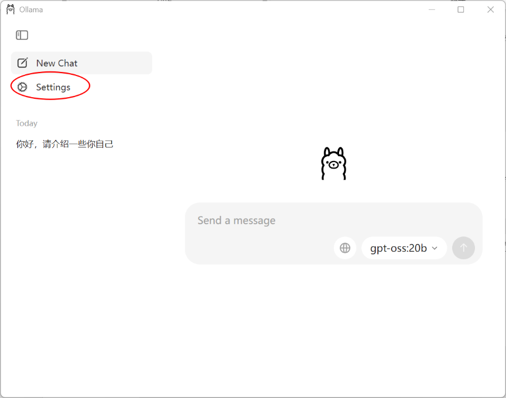

- 切换模型目录

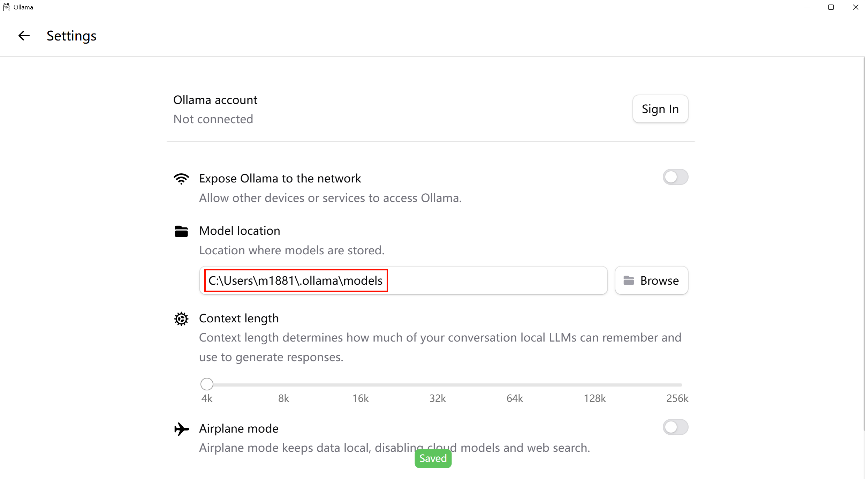

将上面当中的model location切换成资料文件夹中的models文件夹。

- 运行模型 ollama run qwen3:8b

ollama run qwen3:8b

### 3.3.4 调用本地模型

举例：

```python
# pip install langchain-ollama
from langchain_ollama import ChatOllama

ollama_llm = ChatOllama(model="qwen3:8b")
messages = {"role": "user", "content": "你好，请介绍一下你自己"}
resp = ollama_llm.invoke(messages)
print(resp.content)
```

若 Ollama 不在本地默认端口运行，需指定 base_url，即：

```python
# pip install langchain-ollama

from langchain_ollama import ChatOllama
ollama_llm = ChatOllama(
	model="qwen3",   
    base_url="http://localhost:11434",
)

messages = {"role": "user", "content": "你好，请介绍一下你自己"}
resp = ollama_llm.invoke(messages)
print(resp.content)
```

## 3.4 模型调用结果解析

当我们和模型进行对话时，模型会通过自然语言进行回复。在对话式场景下，这没有什么问题，但是对于在实际生产环境当中，将大模型用以非对话场景，或者对话场景下的中间产出时，我们希望模型以一种更加结构化的方式进行输入，例如JSON等，而LangChain设计了一系列包（例如langchain_core.output_parsers）和方法专门用来解决此类问题。

### 3.4.1 获取JSON结果

要想大模型输出Json字符串，有两种方式：

在Prompt当中明确约束大模型输出Json；

通过部分厂商直接提供的接口参数进行限制。

- 通过Prompt约束

要使用Prompt明确约束大模型输出，需要使用到langchain所提供的JSONOutputParser,整体流程如下：

通过Pydantic定义Json schema；

使用构造好的JSON Schem构造JsonOutputParser实例json_parser；

调用json_parser的get_format_information()方法，将json结构输出约束，放到SystemMessage当中；

将SystemMessage和UserMessage都给到LLM，进行调用，结果使用json_parser.parse()方法，解析成PythonDict对象。

下面以一个具体实例来讲解，定义JSON结构：

```python
def json_output_parser():
	import os
	from langchain_openai import ChatOpenAI
	from langchain_core.output_parsers import JsonOutputParser
	from pydantic import BaseModel, Field

	llm = ChatOpenAI(
		model="gpt-4o-mini",
		temperature=0.0,
		base_url=os.getenv("OPENAI_BASE_URL"),
		api_key=os.getenv("OPENAI_API_KEY")
	)

class Prime(BaseModel):
	prime: list[int] = Field(description="素数")
	count: list[int] = Field(description="小于该素数的素数个数")
	
json_parser = JsonOutputParser(pydantic_object=Prime)
print(json_parser.get_format_instructions())
res = llm.invoke([("system",json_parser.get_format_instructions()),("user","任意生成5个1000-100000之间素数，并标出小于该素数的素数个数")])

print(res.content)
parsed_res = json_parser.invoke(res)
print(type(parsed_res))
```

Prompt约束，对于模型能力有一定依赖，如果模型参数不够强，容易出现幻觉，从而导致生成的JSON字符串语法有问题，或者是不符合我们所定义的JSON结构。

- 通过厂商能力

对于主流大模型厂商，其API已经提供了专门的参数，用以限制模型输出内容符合我们所定义的schema结构。

以OpenAI为例，其官方文档如下：[https://platform.openai.com/docs/guides/structured-outputs](https://platform.openai.com/docs/guides/structured-outputs)

示例代码如下所示：

```python
def openai_json_output_demo():
	import os
	from openai import OpenAI
	from pydantic import BaseModel

	client = OpenAI()

class CalendarEvent(BaseModel):
	name: str
	date: str
	participants: list[str]

response = client.chat.completions.parse(
	model="gpt-4o-mini",
	messages=[
	{
	"role": "user",
	"content": "Alice and Bob are going to a science fair on Friday.",
	}
	],
	response_format=CalendarEvent
	)

print(response.choices[0].message.parsed)

# 再以Google Gemini为例，
def gemini_json_output_demo():
	import os
	from google import genai
	from pydantic import BaseModel, Field
	from typing import List, Optional
	# 1、定义一个Pydantic模型，用于表示日历事件

class CalendarEvent(BaseModel):
	name: str
	date: str
	participants: list[str]

# 2、初始化Gemini客户端

client = genai.Client(
	api_key=os.getenv("OPENAI_API_KEY"),
	vertexai=True, # 可选，优先使用vertexai协议访问，稳定性更高

	http_options={
	"base_url": 'https://api.openai-proxy.org/google',
	},
)

# 3、定义一个提示模板，用于生成日历事件
prompt = """
Alice and Bob are going to a science fair on Friday.
"""

# 4、调用Gemini模型生成内容
response = client.models.generate_content(
	model="gemini-2.5-flash-lite",
	contents=prompt,
	config={
	"response_mime_type": "application/json",
	"response_json_schema": CalendarEvent.model_json_schema(),
	},
	)

print(response.text)

# 5、解析Gemini模型的响应,将JSON字符串转换为CalendarEvent对象
event = CalendarEvent.model_validate_json(response.text)
print(event)
```

两个案例当中，都没有在Prompt当中明确指定以JSON输出，但是调用API返回结果仍然能够正确得到结果。

LangChain也对这种能力提供了封装：不同厂商的模型都是继承了ChatModel基类，而ChatModel提供了 with_structured_output方法，传入pydantic base model类作为schema对象，得到一个新的llm对象，调用新的llm对象即可。

具体代码如下所示：

```python
def json_output_use_langchain():
	import os
	from langchain_openai import ChatOpenAI
	from langchain_google_genai import ChatGoogleGenerativeAI
	from langchain_core.messages import HumanMessage,SystemMessage,AIMessage
	from langchain_core.output_parsers import JsonOutputParser
	from pydantic import BaseModel, Field

	# 1、初始化llm: 可以使用OpenAI,也可以使用Gemini
	llm = ChatOpenAI(
		model="gpt-4o-mini",
		temperature=0.0,
		base_url=os.getenv("OPENAI_BASE_URL"),
		api_key=os.getenv("OPENAI_API_KEY")
	)

	llm = ChatGoogleGenerativeAI(
		model="gemini-2.5-flash-lite",
		temperature=0.0,
		base_url='https://api.openai-proxy.org/google',
		api_key=os.getenv("OPENAI_API_KEY"),
	)

# 2、定义一个Pydantic模型，用于表示日历事件
class CalendarEvent(BaseModel):
	name: str
	date: str
	participants: list[str]

#3、使用with_structured_output，得到一个新的llm，用于生成结构化输出

new_llm=llm.with_structured_output(schema=CalendarEvent)

#4、调用新的llm，生成结构化输出
res = new_llm.invoke("Alice and Bob are going to a science fair on Friday.")
print(res)
print(type(res))
```

不管使用什么模型，都是调用统一的方法，就能够实现相关的需求，如果需要换模型，只需要调整llm实例化代码即可，其余代码无需改动，这正是LangChain框架的强大之处。

### 3.4.2 获取其他类型的解析结果

要想获取其他形式的结果，例如XML等，也可通过output_parser当中的其他类来实现，在output_parser包中提供的parser有如下：

```python
__all__ = [

"BaseCumulativeTransformOutputParser",

"BaseGenerationOutputParser",

"BaseLLMOutputParser",

"BaseOutputParser",

"BaseTransformOutputParser",

"CommaSeparatedListOutputParser",

"JsonOutputKeyToolsParser",

"JsonOutputParser",

"JsonOutputToolsParser",

"ListOutputParser",

"MarkdownListOutputParser",

"NumberedListOutputParser",

"PydanticOutputParser",

"PydanticToolsParser",

"SimpleJsonOutputParser",

"StrOutputParser",

"XMLOutputParser",

]
```

由于JSON的强大，对于其他类型，此处不再赘述，大部分场景下，使用JSON输出即可满足需求。

## 3.5 提示词模板

在应用开发中，固定的提示词限制了模型的灵活性和适用范围。通过提示词模板，我们可以将变量插入到模板中，从而创建出不同的Prompt。

LangChain当中有多种类型的提示模板，常用的有 PromptTemplate（字符串提示模板）和 ChatPromptTemplate（聊天提示模板）。

提示词模板以字典作为输入，其中每个键代表要填充的提示模板中的变量。并输出一个 PromptValue。这个 PromptValue 可以传递给聊天模型，也可以转换为字符串或消息列表。PromptValue 存在的目的是为了方便在字符串和消息之间切换。

以下使用PromptTemplate为例子做一个介绍：

```python
def prompt_template_demo():

	from langchain_core.prompts import ChatPromptTemplate
	from langchain.chat_models import init_chat_model
	# 使用构造方法实例化提示词模板
	chat_prompt_template = ChatPromptTemplate.from_messages(
		messages=[
			("system", "你是一个专业的评论员"),
			("human", "请评价{product}的优缺点，包括{aspect1}和{aspect2}。"),
		],
	)

	chat_message_list = chat_prompt_template.invoke({"product": "iPhone 15", "aspect1": "性能", "aspect2": "外观"})

	llm = init_chat_model(
		model="gpt-4o-mini",
		model_provider="openai",
	)

	resp = llm.invoke(chat_message_list)
	print(resp.content)
```

## 3.6 Chains

在前面的例子当中所涉及到的模型调用、解析器调用，以及对PromptTemplate调用，都使用到了invoke方法，这是因为这些类都实现了LangChain最底层定义的Runnable接口，其代表了LangChain 中可以调用、批处理、流式传输、转换和组合的工作单元，是使用 LangChain 组件的基础，它在许多组件中实现，例如语言模型、输出解析器、检索器、编译的 LangGraph 图等。

Runnable 接口定义了一系列标准的方法，如下所示：

| invoke / ainvoke | 将单个输入转换为输出 |
| --- | --- |
| batch / abatch | 批量将多个输入转换为输出 |
| stream / astream | 从单个输入生成流式输出 |
| … |

为什么需要统一调用方式？

假设没有统一调用方式，每个组件调用方式不同，组合时需要手动适配：

- 提示词渲染用 .format()
- 模型调用用 .generate()
- 解析器解析用 .parse()
- 工具调用用 .run()

代码会变成：

```python
prompt_text = prompt.format(topic="猫")  # 方法1
model_out = model.generate(prompt_text)  # 方法2
result = parser.parse(model_out)  # 方法3
```

Runnable** **统一调用方式：

分步调用

```python
prompt_text = prompt.invoke({"topic": "猫"})  # 方法1
model_out = model.invoke(prompt_text)  # 方法2
result = parser.invoke(model_out)  # 方法3
```

而所有实现了Runnable接口的组件，均可以通过一种特定的方式，将其连接起来，打包成一整个可调用对象，这也就是LangChain当中的Chain的由来，而这种方式则称之为LCEL。

LCEL （LangChain Expression Language），中文名称为LangChain 表达式语言，是一种从现有的Runnable 构建新的 Runnable 的声明式方法，用于声明、组合和执行各种组件（模型、提示、工具、函数等）。

```python
# LCEL管道式

chain = prompt | model | parser  # 用管道符组合
result = chain.invoke({"topic": "猫"})  # 所有组件统一用invoke
```

无论组件的功能多复杂（模型/提示词/工具），调用方式完全相同。并且可以通过管道符 | 组合，自动处理类型匹配和中间结果传递。

我们称使用 LCEL 创建的 Runnable 为“链”，“链”本身就是 Runnable。

LCEL 两个主要的组合原语是 RunnableSequence 和 RunnableParallel。许多其他组合原语可以被认为是这两个原语的变体。

### 3.6.1 RunnableSequence 可运行序列

RunnableSequence 按顺序“链接”多个可运行对象，其中一个对象的输出作为下一个对象的输入。

LCEL重载了 | 运算符，以便从两个 Runnables 创建 RunnableSequence。

```python
chain = runnable1 | runnable2
# 等同于
chain = RunnableSequence([runnable1, runnable2])
```

举例：提示模板➡️模型➡️输出解析器

```python
import os
from langchain.chat_models import init_chat_model
from langchain_core.prompts import PromptTemplate
from langchain_core.output_parsers import StrOutputParser

prompt_template = PromptTemplate(
	template="讲一个关于{topic}的笑话",
	input_variables=["topic"],
)

llm = init_chat_model(
	model="gpt-4o-mini",
	model_provider="openai", # 注意，此处没有再传入base_url=xxx 是因为默认也会读取相关环境变量，
)

parser = StrOutputParser()
chain = prompt_template | llm | parser
resp = chain.invoke({"topic": "人工智能"})
print(resp)
```

### 3.6.2 RunnableParallel 可运行并行

RunnableParallel 同时运行多个可运行对象，并为每个对象提供相同的输入。

对于同步执行，RunnableParallel 使用 ThreadPoolExecutor 来同时运行可运行对象。对于异步执行，RunnableParallel 使用 asyncio.gather 来同时运行可运行对象。

构造RunnableParallel实例时，参数列表是可变数量关键字参数，一个参数名对应着一个可运行组件，每个可运行组件输出结果将作为参数名key所对应的值，封装到整个运行实例的结果当中。

具体代码如下所示：

```python
def runnable_parallel_demo():

	import os
	from langchain.chat_models import init_chat_model
	from langchain_core.prompts import PromptTemplate
	from langchain_core.runnables import RunnableParallel
	from langchain_core.output_parsers import StrOutputParser

	llm = init_chat_model(
		model="gpt-4o-mini",
		model_provider="openai",
	)

	english_chain = (
		PromptTemplate.from_template("把这个句子{topic}翻译成英文") | llm | 		StrOutputParser()
	)

	korean_chain = (
		PromptTemplate.from_template("把这个句子{topic}翻译成韩文") | llm | 		StrOutputParser()
	)

	map_chain = RunnableParallel(english=english_chain, 						korean=korean_chain)
	resp = map_chain.invoke({"topic": "人工智能是一种智能技术"})
	print(resp)

if __name__ == "__main__":
	runnable_parallel_demo()
```

在LCEL当中，要想定义并行运行结构，只需通过字典的方式定义即可，代码如下所示：

```python
def runnable_parallel_use_lcel_demo():
	import os
	from langchain.chat_models import init_chat_model
	from langchain_core.prompts import PromptTemplate
	from langchain_core.output_parsers import StrOutputParser

	# 1、初始化两个模型
	llm = init_chat_model(
		model="gpt-4o-mini",
		model_provider="openai",
	)

	deepseek_llm = init_chat_model(
		model="deepseek-chat",
		model_provider="deepseek",
	)

	# 2、创建两个并行运行的chain：使用两个不同的模型回答同一个问题，用以对比结果

	paragraph_1_chain = (
		PromptTemplate.from_template("对这首诗{poem}做一下赏析，分析它蕴含的含		义") | llm | StrOutputParser()
	)

	paragraph_2_chain = (
		PromptTemplate.from_template("对这首诗{poem}做一下赏析，分析它蕴含的含		义") | llm | StrOutputParser()
	)

	# 3、对前面的两个chain的结果进行分析总结

	summary_chain = (
		PromptTemplate.from_template("这两种赏析，第一种：{paragraph_1}，第二种：{paragraph_2}，哪个更好，为什么") | llm | StrOutputParser()
	)

	# 4、构造LCEL：将前面的两个chain并行运行，然后将结果传递给summary_chain

	map_chain = {
		"paragraph_1": paragraph_1_chain,
		"paragraph_2": paragraph_2_chain,
	} | summary_chain

	poem= """
	菩提本无树，
	明镜亦非台，
	本来无一物，
	何处惹尘埃。
	"""

	# 5、运行LCEL
	resp = map_chain.invoke({"poem": poem})
	print(resp)

if __name__ == "__main__":
	runnable_parallel_use_lcel_demo()
```

### 3.6.3 其他Runnable结构

LangChain所提供的其他Runnable组件，如下表所示，此处不再详细介绍。

| 名称 | 描述 |
| --- | --- |
| RunnableLambda | 将普通函数，封装成符合Runnable接口的可运行组件 |
| RunnableBranch | 对输入进行if-else判断，并路由到不同的函数中 |
| RunnablePassthrough | 接收输入并将其原样输出；LCEL 体系中的“无操作节点”，用于在流水线中透传输入或保留上下文，也可以用于向输出中添加键 |
| RunnableWithFallbacks | 对Runnable组件进行兜底，使得 Runnable 失败后可以回退到其他 Runnable |

随着Agent的火热发展，LangChain框架的核心也从Chain这种链式结构逐渐转向支持循环迭代的Agent；构建方式，也从LCEL转成了通过LangGraph进行构建，因此对于Chain这种结构，只需要了解即可，在查看LangChain源码时，可能会发现在某些地方还会用到，能够明白其作用即可。

# 4.Retrieval

## 4.1 RAG介绍

### 4.1.1 大模型的局限

- 知识滞后

LLM 因其具有海量参数，需要花费相当的物力与时间成本进行预训练和微调，同时商用 LLM 还需要进行各种安全测试与风险评估等。因此 LLM 会存在知识滞后的问题。

- 知识缺失

在专有领域，LLM 无法学习到所有的专业知识细节，因此在面向专业领域知识的提问时，无法给出可靠准确的回答。

- 幻觉

LLM 在生成回答时，可能会“胡言乱语”，这种现象称之为 LLM 的“幻觉”。“幻觉”可以体现为错误陈述、编造事实、错误的复杂推理或者复杂语境下理解能力不足等。

“幻觉”产生的原因：

训练知识存在偏差，这些错误信息被 LLM 学习后在输出中复现

LLM 训练时过度泛化，将普通的模式应用在特定场合导致不准确输出

- LLM 本身没有真正学习到训练数据中深层次的含义，导致在一些需要深入理解或复杂推理的任务中出错
- LLM 缺乏某些领域的相关知识，在面临这些领域的相关问题时编造不存在的信息
- 大模型生成内容的不可控，尤其是在金融和医疗领域等领域，一次金额评估的错误，一次医疗诊断的失误，哪怕只出现一次都是致命的。但这些错误对于非专业人士来说难以辨识。目前还没有能够百分之百解决这种情况的方案。 

### 4.1.2 什么是RAG

为了改善大模型在时效性、可靠性与准确性方面的不足，各种针对 LLM 优化的方法应运而生。RAG（Retrieval-Augmented Generation，检索增强生成）就是其中一种被广泛研究和应用的优化架构。

RAG 的基本思想为：将传统的生成式大模型和实时信息检索技术相结合，为大模型补充来自外部的相关数据和上下文，来帮助大模型生成更加准确可靠的内容。这使得大模型在生成内容时可以依赖实时与个性化的数据和知识，而非仅仅依赖训练知识。就相当于在大模型回答时给它一本参考书。

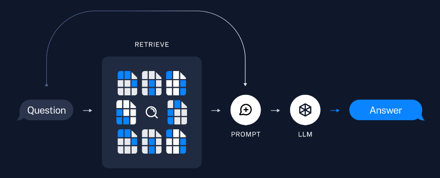

可以说，当应用需求集中在利用大模型去回答特定私有领域的知识，且知识库足够大时，那么除了微调大模型外，RAG 就是非常有效的一种解决方案。LangChain 对这一流程提供了解决方案。

### 4.1.3 RAG优缺点

- **RAG的优点**

相比提示词工程，RAG 有更丰富的上下文和数据样本，可以不需要用户提供过多的背景描述，就能生成比较符合用户预期的答案。相比于模型微调，RAG 可以提升问答内容的时效性和可靠性。在一定程度上保护了业务数据的隐私性。

- **RAG的缺点**

由于每次问答都涉及外部系统数据检索，因此 RAG 的响应时延相对较高。引用的外部知识数据会消耗大量的模型 Token 资源。

### 4.1.4 RAG流程

典型的RAG有两个主要流程：

索引：从数据源提取数据，构建索引。

检索生成：接受用户查询并从索引中检索相关数据，然后将其传递给模型。。

- 索引阶段整体流程如下：

从各种数据源加载数据；

将文档切分为小块；

对文本块进行嵌入；

存储嵌入向量。

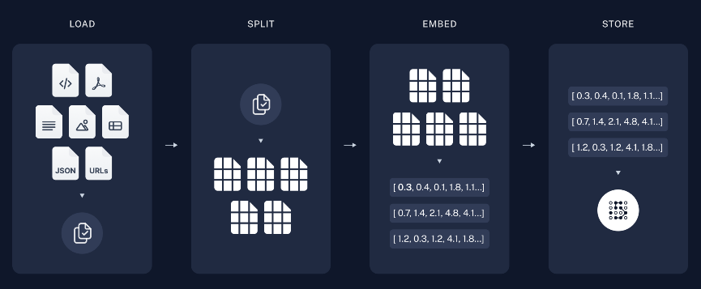

- 检索生成阶段：

根据用户输入，使用检索器从存储中检索相关文本块；

大模型使用包含问题和检索结果的提示生成回答。


## 4.2 文档加载

数据源可能包含多种格式的文件，如文本文档、Markdown，PDF 等。因此我们首先需要对各种格式的文件进行处理。LangChain 实现和集成了众多文档加载器，方便从不同格式的文件中加载数据。可在 [https://docs.langchain.com/oss/python/integrations/document_loaders](https://docs.langchain.com/oss/python/integrations/document_loaders) 查看所有集成的文档加载器。

LangChain 所有文档加载器都实现了 BaseLoader 接口，接口提供了通用的 load（一次加载所有文档） 与 lazy_load（以延迟方式加载文档） 方法，用于从数据源加载数据并处理为 Document 对象。

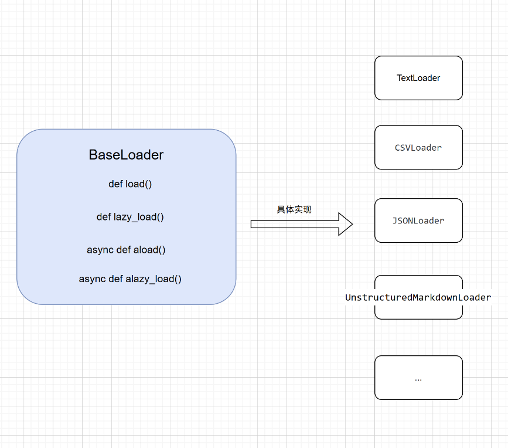

LangChain 实现了 Document 抽象，用于表示文本单元及其元数据，它包含三个属性：

- page_content：文本内容字符串。
- metadata：包含元数据的字典，如文档的来源等。
- id：可选，文档标识符。

下面通过Markdown和Docx以及PDF作为例子，来了解下如何对文件进行相关加载和解析。

### 4.2.1 加载 Markdown

MarkDown形式一种半结构化的数据，其原始文本，通过特定语法，标记出了标题、段落、有序列表、无序列表等相关信息，

如下所示，不同的层级的文本，在markdown当中表示的形式不一致：

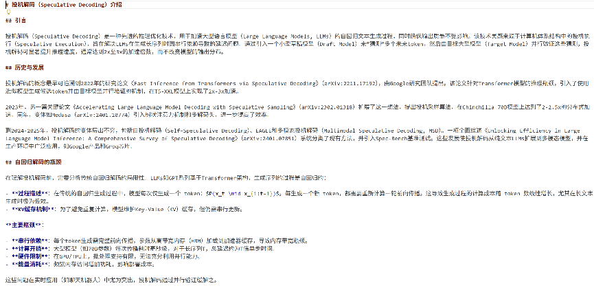

可以使用 Unstructured 文档加载器来加载多种类型的文件，关于如何在 LangChain 中使用 unstructured 生态系统，可参考[这里](https://docs.langchain.com/oss/python/integrations/providers/unstructured)。

Unstructured.io对Markdown的解析流程，如下所示：

按照Markdown结构进行切分，标题等会被切分成单独的element

对于同一个标题下的文本，再按照段落进行切分，不同的段落（通过\n标识）会被切分成多个element。

可使用 langchain集成的UnstructuredMarkdownLoader 来加载 Markdown 文件，示例代码如下所示：

```python
#pip install markdown langchain_community unstructured[md]

def markdown_loader_demo():
	from langchain_community.document_loaders import 		UnstructuredMarkdownLoader
	loader = 	UnstructuredMarkdownLoader("./assets/sample.md",encoding="utf-8",mode="elements")
	docs = loader.load()
	for doc in docs:
		print(doc.page_content,end="\n============\n")

if __name__ == "__main__":
	markdown_loader_demo()
```

### 4.2.2 加载Docx

现代的 Word 文档（.docx 格式）本质上也是一种**半结构化**（Semi-structured）且**机器可读**（Machine-readable）的文件。

.docx 的本质上是XML 的容器，XML 标签严格规定了文档的层级（比如 <w:p> 代表段落，<w:r> 代表文本运行块）。机器可以利用这些标签精确地提取信息。

但是，由于Word文档对于层级的定义相较于Markdown又更加灵活，我们可以自定义不同层级标题的样式，而这些样式通常只是正文样式，加了手动格式，使得解析库无法按照统一的标准格式将层级进行解析，这个特点给Word解析又带来了难点。

同样可以使用LangChain封装的Unstructured.io的Loader对.docx进行解析。在使用Unstructured.io对Word进行解析时，仅会按照换行对文件进行解析，无法识别出文档标题，示例代码如下：

```python
# pip install unstructured[docx]

def word_loader_demo():
	from langchain_community.document_loaders import 			UnstructuredWordDocumentLoader

	docs = UnstructuredWordDocumentLoader(
	# 文件路径
	file_path="assets/sample.docx",
	# 加载模式:
    # single 返回单个Document对象
    # elements 按标题等元素切分文档
	mode="elements",
	).load()

	for doc in docs[230:260]: # 从文档中间选取30个文档查看结构
		print(doc.page_content)
		print(doc.metadata,end="\n============\n")

if __name__ == "__main__":
	word_loader_demo()
```

对于标题层级信息并不敏感的.docx文件，可以通过上面的loader进行加载。但是，对于标题层级信息敏感的.docx文件，上面的方式，会丢失掉标题层级信息，此时可以通过下面所讲到的Mineru进行处理。

### 4.3.3 加载 PDF

PDF 存在多种来源格式，包括扫描版（图片 PDF）、电子文本版、混合版。并且布局格式也多种多样，包括单列布局、双列布局甚至竖排文本布局。并且包含段落、标题、页眉页脚、表格、数学公式、化学式、特殊符号、图片等各种元素。

因此，PDF 解析存在很多挑战。对于复杂 PDF，需要进行文本提取、布局检测、表格解析、公式识别等处理。

在此处，我们介绍一个开源的，专门用于解析PDF的工具：Mineru。

MinerU是一款将PDF转化为机器可读格式的工具（如markdown、json），可以很方便地抽取为任意格式。

Mineru可以配置使用VLM模型进行文档解析。其开源的opendatalab/MinerU2.5-2509-1.2B([https://huggingface.co/opendatalab/MinerU2.5-2509-1.2B](https://huggingface.co/opendatalab/MinerU2.5-2509-1.2B))模型，在各项基础测试当中，都达到了SOTA水平。

下图展示了MinerU2-VLM在多项基准测试当中得分排名：

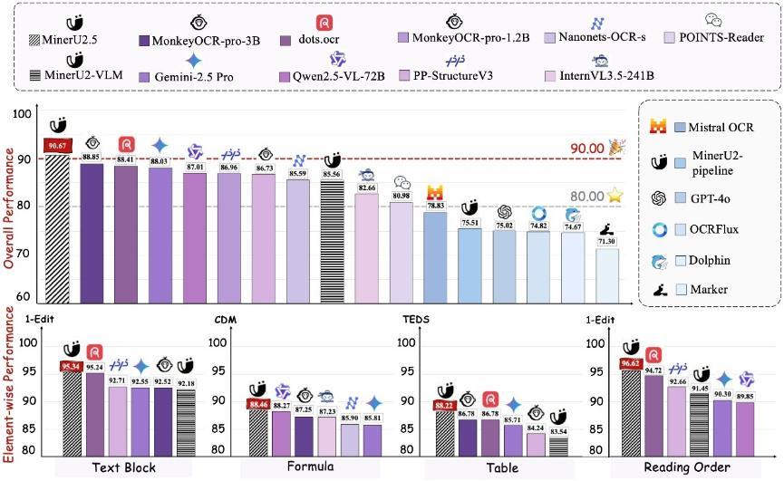

MinerU2.5采用两阶段解析策略：首先对下采样图像进行高效的全局布局分析，然后对文本、公式和表格的原生分辨率裁剪图像进行细粒度内容识别。在大规模、多样化的数据引擎支持下进行预训练和微调，MinerU2.5 在多个基准测试中始终优于通用模型和特定领域模型，同时保持较低的计算开销。[MinerU](https://mineru.net/) 提供了 PDF、Word、PPT、图片等文件的解析，支持图像提取、OCR、公式、表格解析等功能。

另外，Mineru开源所有代码，支持本地通过Docker方式进行部署，其项目仓库链接：[](https://github.com/opendatalab/MinerU。Mineru)https://github.com/opendatalab/MinerU。Mineru官网也提供了直接调用API的方式，上传文件进行解析。首先需要在官网申请API_KEY，并将其放到环境变量当中

调用上传文件接口示例代码如下：

```python
def mineru_upload_file_demo():
	import requests
	import os
	token = os.getenv("MINERU_TOKEN")
	url = "https://mineru.net/api/v4/file-urls/batch"
	header = {
		"Content-Type": "application/json",
    	"Authorization": f"Bearer {token}"
	}
	data = {
	"files": [
		{"name":"demo.pdf", "data_id": "abcd"}
		],

	"model_version":"vlm"

	}

	file_path = [r"D:\PycharmProjects\lessons\demo_class\LangGraph_demo\langchain_demo\05_retrieval\assets\尚硅谷大模型技术之NLP1.0.2.pdf"]

	try:
		response = requests.post(url,headers=header,json=data)
		if response.status_code == 200:
			result = response.json()
			print('上传成功:{}'.format(result))
			batch_id = result['data']['batch_id']
			if result["code"] == 0:
				batch_id = result["data"]["batch_id"]
				urls = result["data"]["file_urls"]
				print('batch_id:{},urls:{}'.format(batch_id, urls))

				for i in range(0, len(urls)):
					with open(file_path[i], 'rb') as f:
					res_upload = requests.put(urls[i], data=f)
					if res_upload.status_code == 200:
						print(f"{urls[i]} 上传成功")
					else:
						print(f"{urls[i]} 上传失败")
			else:
				print('apply upload url failed,reason:{}'.format(result.msg))
				return batch_id

		else:
			print(f"请求失败，状态码：{response.status_code}，响应内容：{response.text}")

    	except Exception as err:

				print(err)

# 上传完成之后，可以通过获取任务结果API来获取解析结果：
def mineru_check_result_demo(batch_id):
	import requests
	import time
	token = os.getenv("MINERU_TOKEN")
		url = f"https://mineru.net/api/v4/extract-results/batch/{batch_id}"
	header = {
		"Content-Type": "application/json",
		"Authorization": f"Bearer {token}"
		}

	res = requests.get(url, headers=header)
	while res.json()["data"]['extract_result'][0]['state'] != 'done':
		print('当前状态为running，等待3秒后重试')
		time.sleep(3)
		res = requests.get(url, headers=header)
		print(res.status_code)
		print(res.json()["data"]['extract_result'][0]['state'],end="\n\n=========\n\n")
		print('提取结果为:',res.json()["data"]['extract_result'][0]['full_zip_url'])
```

Mineru解析之后，有多种不同的输出格式，具体可参见Mineru官方文档：[https://opendatalab.github.io/MinerU/zh/reference/output_files/](https://opendatalab.github.io/MinerU/zh/reference/output_files/)。

要进行下一步处理，最简单的方式是通过解析之后得到的一个MarkDown文件，再利用MarkDown解析器，进行进一步的解析即可。

## 4.3 文档切分

### 4.3.1 为什么切分

获取 Document 对象后，需要将其切分成 Chunk。之所以要进行切分是出于以下考虑：

后续需要根据提问检索出相关的内容放入 Prompt，如果答案出现在某一个 Document 对象中，那么将检索到的整个 Document 对象直接放入 Prompt 中并不是最优的选择，因为 Document 可能包含非常多无关的信息，这些无效信息会干扰大模型的生成。[有研究发现](https://arxiv.org/pdf/2307.03172)，尽管大模型能够处理长文本输入，但它们在利用长上下文方面存在显著不足。尤其是在多文档问答和键值检索等任务中，当相关信息位于输入文本的中间时，模型的性能显著下降。这种现象表明，当前的语言模型在长输入上下文中未能充分利用信息，尤其是位于中间部分的信息。

大模型存在最大输入的 Token 限制，如果一个 Document 非常大，在输入大模型时会被截断，导致信息缺失。

基于此，一个方法是将完整的 Document 进行分块处理（Chunking），将 Document 切分为一个个小块（Chunk）。无论是在存储还是检索过程中，都将以这些块为基本单位，这样能有效地避免内容噪声干扰和超出最大 Token 的问题。

### 4.3.2 切分策略

具体切分时，可以采用如下策略，具体采用哪种，主要取决于在实际使用场景当中，对于语义连贯性，完整性的要求：

按照固定字符数或 Token 数来切分，但可能会在不适当的位置切断句子。

递归使用多个分隔符切分，同时尽量保证字符数或 Token 数不超出限制。能保证不切断完整的句子。

语义切分：根据文本的语义内容切分，旨在保持相关信息的集中和完整，适用于需要高度语义保持的场景。但处理速度较慢，且可能出现不同块之间长度极不均衡的情况。具体切分过程为：将相邻的几个句子拼成一个句组。对所有句组进行嵌入，并比较嵌入向量的距离，找到语义变化大的位置，根据阈值确定切分点（比如计算相邻句子嵌入向量的余弦距离，取距离分布的第 N 百分位值作为阈值，高于此值则切分）。按照切分点切分出若干个语义段，并合并某些长度很短的语义段。

接下来，我们介绍这三种切分策略当中在保持语义连贯性上面的折中方案：按照特定字符进行切分，langchain为我们提供了一个现成的类：RecursiveCharacterTextSplitter.

### 4.3.3 RecursiveCharacterTextSplitter

RecursiveCharacterTextSplitter（递归字符文本切分器）是最常用的切分器，它由一个字符列表作为参数，默认列表为 ["\n\n", "\n", " ", ""]，并且会尝试按顺序使用这些字符进行切分，直到块足够小。由此尽可能地将所有段落（然后是句子，最后是词）保持在一起，因为这些段落通常看起来是语义上最相关的文本片段。

同时为了保证段之间语义完整，可以设置每个块之间有一部分重叠。

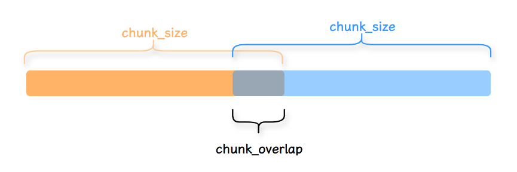

举例：

```python
# pip install langchain-text-splitters

from langchain_text_splitters import RecursiveCharacterTextSplitter
from langchain_community.document_loaders import UnstructuredWordDocumentLoader

# 加载文档
docs = UnstructuredWordDocumentLoader(
file_path="assets/sample.docx", mode="single"
).load()
# 切分为文本块
chunks = RecursiveCharacterTextSplitter(
separators=["\n\n", "\n", "。", "！", "？", "……", "，", ""],  # 分隔符列表
chunk_size=400,  # 每个块的最大长度
chunk_overlap=50,  # 每个块重叠的长度
length_function=len,  # 可选：计算文本长度的函数，默认为字符串长度，可自定义函数来实现按 token 数切分
add_start_index=True,  # 可选：块的元数据中添加此块起始索引
).split_documents(docs)
print(chunks)
```

整个切分过程可以通过如下流程图所示：

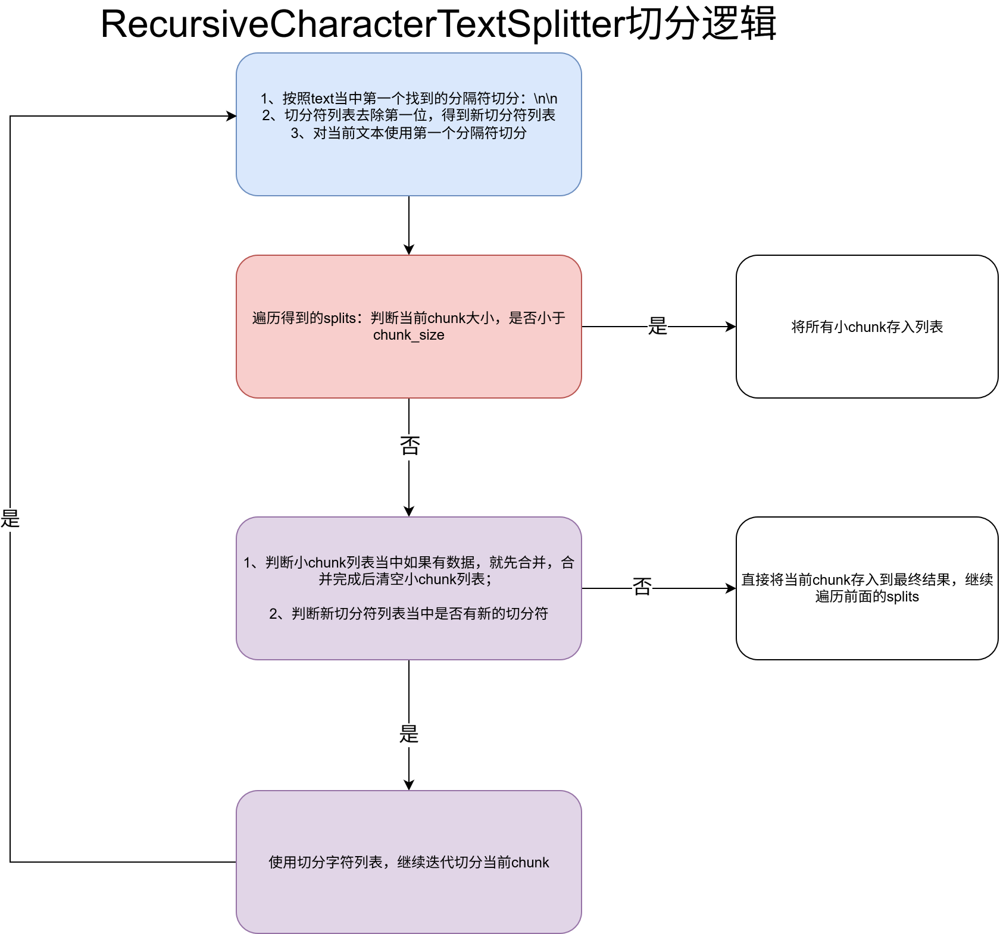

## 4.4 文档嵌入

- 嵌入模型介绍

将文档切分成合适的大小之后，就可以使用嵌入模型生成文档的嵌入向量，后续检索时用于与查询的嵌入向量进行相似度计算。

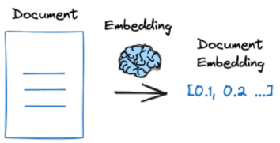

2018年谷歌推出的 BERT 能够将文本嵌入为简单的向量表示，但是 BERT 并未针对有效生成句子嵌入进行优化，由此促使了 Sentence-BERT 的诞生。Sentence-BERT（论文链接：https://arxiv.org/pdf/1908.10084） 调整了 BERT 的架构以及预训练任务以生成包含语义的句子嵌入向量，这些嵌入向量可以通过余弦相似度等相似性指标轻松进行比较，大大降低了查找相似句子等任务的计算开销。

常用嵌入模型：

| 模型 | 机构 | 描述 |
| --- | --- | --- |
| bge-large-zh | 北京智源研究院（BAAI） | 开源，向量维度1024，序列长度512 |
| bge-base-zh | BAAI | 开源，向量维度768，序列长度512 |
| bge-small-zh | BAAI | 开源，向量维度512，序列长度512 |
| bge-m3 | BAAI | 开源，多语言，向量维度 1024，序列长度8192 |
| text-embedding-3-small | OpenAI | 多语言，向量维度1536，序列长度8192 |
| text-embedding-3-large | OpenAI | 多语言，向量维度3072，序列长度8192 |

### 4.4.2 通过langchain完成文档嵌入

LangChain设计了一个Embedding抽象类，在该类当中定义了多个抽象方法：

```python
@abstractmethod

def embed_documents(self, texts: list[str]) -> list[list[float]]:

"""Embed search docs.
Args:
texts: List of text to embed.
Returns:
List of embeddings.
"""

@abstractmethod
def embed_query(self, text: str) -> list[float]:
"""Embed query text.
Args:
text: Text to embed.
Returns:
Embedding.
"""
```

该Embedding的具体实现类有：HuggingFaceEmbeddings，OpenAIEmbeddings等。

要使用huggingface所提供的开源模型进行文本向量嵌入，可以通过HuggingFaceEmbeddings实例完成，模型文件全部都在课程资料中提供：

```python
# pip install sentence-transformers langchain_huggingface

def embedding_demo():
	from langchain_huggingface import HuggingFaceEmbeddings
	embed_model = HuggingFaceEmbeddings(
		model_name=r'.\assets\models\bge-base-zh-v1.5'
	)

	# 单文本嵌入
	query = "你好，世界"
	query_result = embed_model.embed_query(query)
	print(len(query_result))
	print(query_result[0:10])
	# 多文本嵌入

	docs = ["你好，世界", "你好，世界"]
	res = embed_model.embed_documents(docs)
	print(type(res))

if __name__ == "__main__":
	embedding_demo()
```

## 4.5 向量存储和检索

### 4.5.1 向量数据库的理解

假设你是一名摄影师，拍了大量的照片。为了方便管理和查找，你决定将这些照片存储到一个数据库中。传统的关系型数据库（如 MySQL、PostgreSQL 等）可以帮助你存储照片的元数据，比如拍摄时间、地点、相机型号等。

但是，当你想要根据照片的内容（如颜色、纹理、物体等）进行搜索时，传统数据库可能无法满足你的需求，因为它们通常以数据表的形式存储数据，并使用查询语句进行精确搜索。那么此时，向量数据库就可以派上用场。

我们可以构建一个多维的空间使得每张照片特征都存在于这个空间内，并用已有的维度进行表示，比如时间、地点、相机型号、颜色….此照片的信息将作为一个点，存储于其中。以此类推，即可在该空间中构建出无数的点，而后我们将这些点与空间坐标轴的原点相连接，就成为了一条条向量，当这些点变为向量之后，即可利用向量的计算进一步获取更多的信息。当要进行照片的检索时，也会变得更容易更快捷。

注意，在向量数据库中进行检索时，并不是检索唯一的匹配结果，而是查询和目标向量最为相似的一些向量，具有模糊性。

延伸思考一下，只要对图片、视频、商品等素材进行向量化，就可以实现以图搜图、视频相关推荐、相似商品推荐等功能。

### 4.5.2 常用的向量数据库

LangChain提供了众多向量存储的集成，包括开源的本地向量存储与云托管的私有向量存储。并公开了一个标准接口，可以轻松地在向量存储之间进行交换。

常用向量数据库：

| 向量数据库 | 描述 |
| --- | --- |
| FAISS | 一个用于高效相似性搜索和密集向量聚类的库 |
| Chroma | 开源的轻量级向量数据库，有极简的 API |
| Milvus | 开源的专为向量搜索设计的云原生数据库。性能强悍，功能丰富。覆盖轻量级的原型开发到十亿级向量的大规模生产系统 |
| Pgvector | 开源关系型数据库 PostgreSQL 的扩展，为PostgreSQL增加了向量数据类型和相似性搜索功能 |
| Redis | 开源内存数据结构存储，现已原生支持向量相似性搜索功能 |
| Elasticsearch | 开源分布式搜索和分析引擎，提供了一个基于文档的数据库，结构化、非结构化和向量数据通过高效的列式存储统一管理 |

这里我们使用 Milvus 作为向量存储。

### 4.5.3 Milvus 介绍和部署

- Milvus架构

Milvus因其强大的性能（可支持数百亿级别的向量存储和检索），以及可扩缩容等相关特点，在实际生产环境下，使用非常普遍。

Milvus的架构如下图所示：

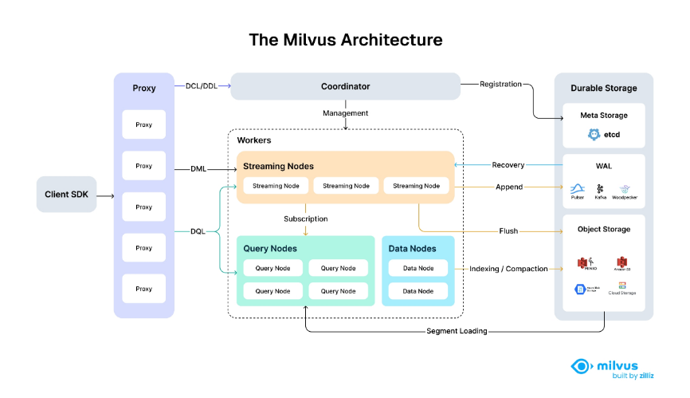

Milvus 的组件解耦良好，其中三个最关键的任务 —— 搜索、数据插入以及索引 / 压缩 —— 被设计为易于并行化的进程，复杂逻辑被分离出来。这确保了相应的查询节点、数据节点和索引节点能够独立地进行纵向和横向扩展，从而优化性能和成本效率。

- Milvus Collection及数据类型

Milvus 通过 数据库—Collections—实体 的结构管理数据。Collections 和实体就类似关系型数据库中的表和记录。具体来说，Collection 是一个二维表，具有固定的列和变化的行。每列代表一个字段，每行代表一个实体。

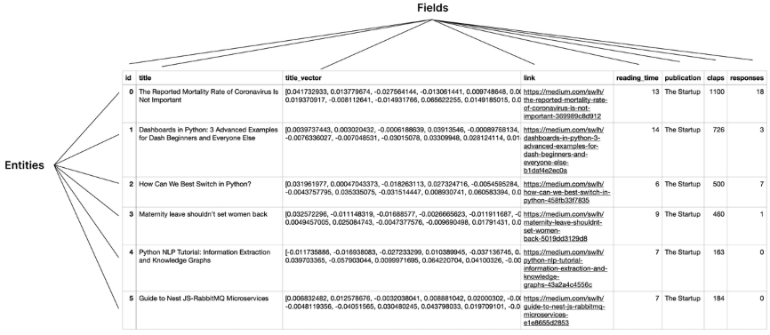

Collection 通过 Collection Schema 来定义有哪些字段以及字段的类型、索引等。

以下是Milvus所支持的数据类型：

| 字段类型 | 字段 | 描述 |
| --- | --- | --- |
| 向量字段 | 密集向量 | FLOAT_VECTOR | 32位浮点数列表 |
| FLOAT16_VECTOR | 16位半精度浮点数列表 |
| BFLOAT16_VECTOR | 16位浮点数列表，精度稍低，但指数范围与 Float32 相同 |
| INT8_VECTOR | 8位有符号整数向量 |
| 稀疏向量 | SPARSE_FLOAT_VECTOR | 非零数字及其序列号列表 |
| 二进制向量 | BINARY_VECTOR | 一个0和1的列表 |
| 标量字段 | VARCHAR | 字符串 |
| BOOL | 存储true或false |
| INT | INT8、INT16、INT32、INT64 |
| FLOAT | 32位浮点数 |
| DOUBLE | 64位双精度浮点数 |
| ARRAY | 相同数据类型元素的有序集合 |
| JSON | 结构化的键值数据 |

一个 Collection Schema 有一个主键、最多四个向量字段和若干标量字段。主键用于唯一标识一个实体，只接受 Int64 或 VarChar 值。插入实体时，默认情况下应包含主键值。但是，如果在创建 Collections 时启用了 AutoId，Milvus 将在插入数据时生成主键值，此时插入的实体中不应包含主键值。

向量字段是最重要的字段，可以分为稠密向量或者是稀疏向量。

**稠密向量**通常由基于 Transformer Encoder 架构的深度学习模型（如 Sentence-BERT）生成。

**稀疏向量**用于表示文本中的关键词及其对应权重，其构建方式经历了从早期基于 TF-IDF 等统计方法的传统词袋模型，到如今基于深度学习模型的学习式构建方法的发展演进。

使用深度学习模型构建稀疏向量的原理如下图所示（分词过程和稠密向量生成当中类似）：

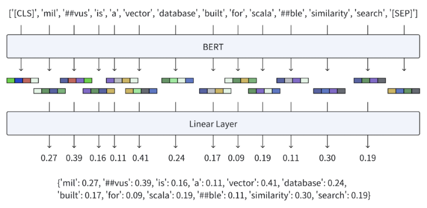

通过深度学习模型生成一个稀疏向量时，不再“只看一句话的总体意思”，而是让模型推理：这句话里哪些词重要、重要到什么程度，并把这些重要词单独拎出来加权表示。

下面以BGE-M3为例，来展示稠密向量和稀疏向量的不同：

```python
# pip install FlagEmbedding==1.3.5

from FlagEmbedding import BGEM3FlagModel
model = BGEM3FlagModel(model_name_or_path=r"D:\PycharmProjects\lessons\demo_class\LangChainDemo\04_retrieval\assets\models\bge-m3")
res = model.encode(["标量字段通常用来存储一些元数据，并可以在搜索时通过元数据进行过滤"],return_sparse=True,return_dense=True)
print('encode结果为：',res,end='\n\n')

# 1、打印稀疏向量
print('稀疏向量为：',res["lexical_weights"],end='\n\n')

# 2、将稀疏向量当中的id转换为token，并打印
sparse_vecs = model.convert_id_to_token(res["lexical_weights"])
print('稀疏向量转换为token后的结果为：',sparse_vecs,end='\n\n')

# 3、打印稠密向量
print('稠密向量为：',res["dense_vecs"],end='\n\n')
```

标量字段通常用来存储一些元数据，并可以在搜索时通过元数据进行过滤，以提高搜索结果的正确性。

- Mivus索引

索引是建立在数据之上的附加结构，可以加快搜索速度。不同字段数据类型适用不同的索引类型。

- 稠密向量

稠密向量可使用 HNSW（分层导航小世界）索引。

HNSW （分层导航小世界）是当下常用的一种基于图的索引算法，可以提高搜索高维浮点数向量时的性能。它具有出色的搜索精度和低延迟，但需要较高的内存开销来维护其分层图结构。该算法构建了一个多层图（类似不同缩放级别的地图），底层包含所有数据点，而上层则由从底层采样的数据点子集组成。在这种层次结构中，每一层都包含代表数据点的节点，节点之间由表示其接近程度的边连接。上层提供远距离跳转，以快速接近目标，而下层则进行细粒度搜索，以获得最准确的结果。其工作原理如下：

- 入口点：搜索从顶层的一个固定入口点开始，该入口点是图中的一个预定节点。
- 贪婪搜索：算法贪婪地移动到当前层的近邻，直到无法再接近查询向量为止。上层起到导航作用，作为粗过滤器，为下层的精细搜索找到潜在的入口点。
- 层层下降：一旦当前层达到局部最小值，算法就会利用预先建立的连接跳转到下层，并重复贪婪搜索。
- 最后细化：这一过程一直持续到最底层，在最底层进行最后的细化步骤，找出最近的邻居。

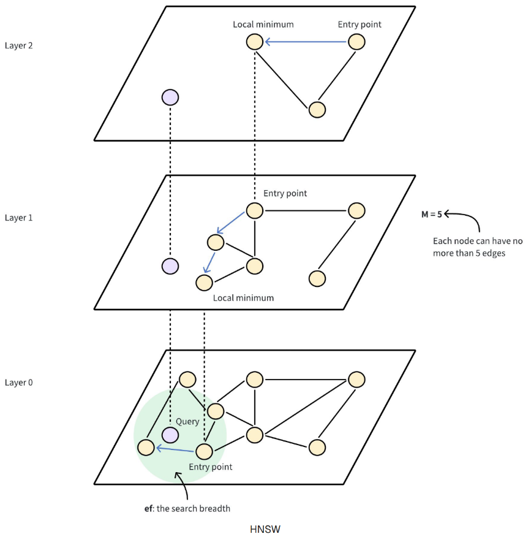

另外一种稠密向量所支持的索引类型是FLAT, FLAT 索引是用于对浮点向量进行索引和搜索的最简单、最直接的方法之一。它采用暴力搜索的方式，每个查询向量直接与数据集中的每个向量进行比较，无需任何高级的预处理或数据结构化操作。这种方法能保证准确性，提供 100% 的召回率，因为每一个潜在的匹配项都会被评估。

- 稀疏向量

SPARSE_INVERTED_INDEX 索引是 Milvus 用于高效存储和搜索稀疏向量的一种索引类型。这种索引类型利用倒排索引的原理，为稀疏数据创建高效的搜索结构。

以下是倒排索引示意图：

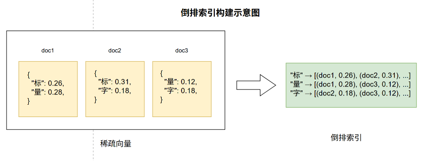

在实际查询时，先通过倒排索引查询到包含query当中token的文档有哪些，然后计算查询和各个文档之间的相似度分数。

在计算查询和文档之间的相似度分数时，有两种指标类型（metric type）:

- IP: 即Inner Product内积，例如查询所对应的稀疏向量为：{27:0.7, 100:0.4}，doc1所对应的稀疏向量为：{27:0.5, 100:0.3, 5369:0.6}，则相似度分数为similarity = (0.5$\times$0.7) + (0.3$\times$0.4) = 0.35 + 0.12 = 0.47
- BM25: 通过对 query 与文档中重合的词项进行加权求和，综合考虑词频（TF）、逆文档频率（IDF: 反映了一个词在全部文档当中的重要性，词出现的文档数量越少，IDF越高）以及文档长度归一化，从而计算二者的相关性得分。Milvus部署

Milvus 提供了多个版本以在不同场景下选择合适的使用方式：

- Milvus Lite：本地轻量化运行，通过 pip install pymilvus[milvus-lite] 即可安装。但 Milvus Lite 有一些限制，比如 Milvus Lite 仅支持 [FLAT](https://milvus.io/docs/index.md?tab=floating#FLAT) 索引类型。无论在 Collections 中指定了哪种索引类型，它都使用 FLAT 类型。另外，Milvus Lite仅支持在MacOs和Linux上面使用。
- Milvus Standalone：单点部署，支持通过 Docker 部署。
- Milvus Distributed：分布式部署，支持在 Kubernetes 集群上部署。

本课程使用Milvus Standalone方式部署，用以做代码演示。在课程资料当中提供了milvus的镜像包：milvus_image.tar。通过如下Docker命令即可将其load到本地镜像仓库当中：

docker load -i milvus_image.tar

load完成后，将课程资料当中提供了另外两个脚本：standalone_embed.sh，standalone.bat。

在虚拟机Linux环境下，先把前面的镜像加载到本地镜像仓库之后，再通过shell脚本即可启动Milvus服务，命令如下：

bash standalone_embed.sh start

在Windows当中使用Docker Desktop时，同样也是先把镜像加载到本地镜像仓库之后，再通过bat脚本启动Milvus服务，命令如下：

standalone.bat start

启动完成后，可以通过Milvus官方所提供的图形化客户端工具Attu，查看Milvus服务上的数据，安装包同样在课程资料当中，选择token，直接连接即可，如下图所示：

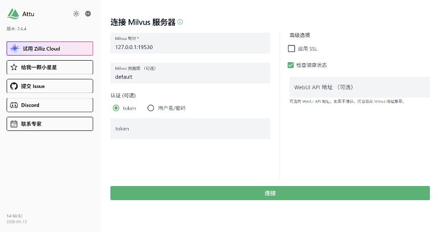

### 4.5.4 Milvus创建 Collection

正如前面介绍，Milvus当中的数据，存储到独立的Collection当中。创建Collection可以分为以下步骤：

构建schema信息；

添加索引；

创建collection。

示例代码如下所示：

```python
# pip install pymilvus

def get_milvus_client():
	from pymilvus import MilvusClient
	client = MilvusClient(
		uri="http://localhost:19530",
		token="",
	)

	res = client.list_collections()
	print(res)
	return client

def build_schema():
	from pymilvus import MilvusClient, DataType
	return (
	MilvusClient.create_schema(
	# 自动为id字段赋值
	auto_id=True,
	)
	# 添加 id 字段，类型为整数，设置为主键
	.add_field(field_name="id", datatype=DataType.INT64, is_primary=True)
	# 添加 vector 字段，类型为浮点数向量，维度为 1024
	.add_field(field_name="vector", datatype=DataType.FLOAT_VECTOR, dim=1024)
	# 添加 text 字段，类型为字符串，最大长度为 1500
	.add_field(field_name="text", datatype=DataType.VARCHAR, max_length=1500)
	# 添加 metadata 字段，类型为 JSON
	.add_field(field_name="metadata", datatype=DataType.JSON)			.add_field(field_name="sparse_vector",datatype=DataType.SPARSE_FLOAT_VECTOR)
)

def build_index():
	from pymilvus import MilvusClient, DataType
	index_params = MilvusClient.prepare_index_params()
	index_params.add_index(
		field_name="vector",  # 建立索引的字段
		index_type="HNSW",  # 索引类型
		metric_type="L2",  # 向量相似度度量方式
	)

	index_params.add_index(
		field_name="sparse_vector",
		index_type="SPARSE_INVERTED_INDEX",
		metric_type="IP",
	)
	return index_params

def create_collection(client):
	from pprint import pprint
client.drop_collection(collection_name="demo_collection")
	if not client.has_collection(collection_name="demo_collection"):
		print("collection demo_collection not exists, create it")

	client.create_collection(
		collection_name="demo_collection",  # collection 名称
		schema=build_schema(),  # collection 的 schema
		index_params=build_index(),  # collection 的 index
	)
	# 查看 collection
	print(client.list_collections())
	# 查看 collection 描述
	print(client.describe_collection(collection_name="demo_collection"))

create_collection(get_milvus_client())
```

### 4.5.5 Milvus操作实体

在创建完了collection之后，就可以“增删”操作。

- 插入实体

将数据构建成List[Dict]形式，其中List表示批量数据，Dict表示符合创建collection时所定义的schema结构的数据，构建完成后，即可通过client.insert方法，将数据插入到指定的collection当中去，示例代码如下：

```python
from pymilvus import MilvusClient,DataType

def get_client():
	return MilvusClient(uri="http://localhost:19530",token="")

def insert_data(client:MilvusClient,collection_name:str):

	"""
	构建数据，并插入到collection中
	"""

	# 1、加载一个文件:此处以assets/sample.docx文件为例

	from langchain_community.document_loaders import 		UnstructuredWordDocumentLoader

	doc_list = UnstructuredWordDocumentLoader("assets/sample.docx",mode="single").load()

	# 2、切分文件
	from langchain_text_splitters import RecursiveCharacterTextSplitter
	text_splitter = RecursiveCharacterTextSplitter(chunk_size=500,chunk_overlap=50,separators=["\n\n","\n","。"])
	splitted_doc_list =text_splitter.split_documents(doc_list)
	splitted_doc_list = splitted_doc_list[0:20]
	# 查看当前文本列表当中最大的文本长度
	max_len = max([len(bytes(doc.page_content.encode("utf-8"))) for doc in splitted_doc_list])
	print('当前最大长度是：',max_len)

	# 3、构建向量：稠密向量，稀疏向量
	from FlagEmbedding import BGEM3FlagModel
		model = BGEM3FlagModel("assets/models/bge-m3") # 需要安装 带cuda的torch
	all_vectors = model.encode([doc.page_content for doc in 	splitted_doc_list],return_dense=True,return_sparse=True)

	dense_vectors = all_vectors["dense_vecs"]
	sparse_vectors = all_vectors['lexical_weights']
	# 4、准备数据：组装成List[Dict]
	insert_data_list=[]

	for  doc, dense_vector, sparse_vector in 	zip(splitted_doc_list,dense_vectors,sparse_vectors):

	insert_data_list.append({
	"vector":dense_vector,
	"sparse_vector":sparse_vector,
	"metadata":doc.metadata,
	"text":doc.page_content
	})
# 5、调用client.insert()方法，插入数据
	res = client.insert(
	collection_name=collection_name,
	data=insert_data_list
	)

	# 有多少条数据插入成功
	print(res)
```

- 删除实体

删除实体，可以调用MilvusClient的delete方法，该同样也可以通过传递id列表，或者是通过其他字段过滤条件来进行删除，该方法返回结果为一个字典，包含了一个delete_count键，值为删除的数据条数，示例代码如下所示：

```python
def delete_demo(client):
	res = client.delete(
	collection_name="demo_collection",
	# 过滤条件，仅删除 id 在指定范围内的实体,也可以传递其他字段的过滤条件
	filter="id in [463480757150366907, 463480757150366908]",

	)
	print(res)

if __name__ == "__main__":
	client = get_milvus_client()
	delete_demo(client)
```

### 4.5.6 Milvus检索

Milvus 支持多种检索方式。对向量字段，Milvus 支持精确检索（KNN）以及近似近邻检索（ANN）。对标量字段，Milvus 提供条件过滤能力，主要用于配合向量检索进行结果筛选，其能力和定位不同于传统关系型数据库普通检索。

- 向量检索

通过调用client.search，传入需要检索的query向量，以及需要和query向量进行比较的向量字段，即可进行向量检索。

在执行向量检索时，通常需要关注以下参数：

- **查询向量（query vector）**：表示待检索对象的向量表示，维度需与集合中向量字段一致。
- **向量字段（anns_field）**：指定参与检索的向量字段名称。
- **TopK（limit）：**返回相似度最高的结果数量。
- **metric_type**：指定相似度计算方式，如 COSINE、L2 或 IP，需与索引和向量语义保持一致。

另外向量检索还支持同时使用稠密向量和稀疏向量，进行混合检索，并配置重排序器，来对两路召回结果进行一个重排序。

**重排序**（Reranker）是指在初步检索（Recall）完成后，对候选结果进行二次排序优化的过程。其目标不是扩大召回范围，而是在已有候选集内提升排序质量和结果相关性。在典型的检索系统中，重排序通常位于向量检索或混合检索之后，用于融合多路检索结果或引入更精细的排序策略。

此处介绍RRFReranker。RRFRanker 策略的主要工作流程如下：

收集搜索排名：收集来自向量搜索各路径的结果排名（rank_1、rank_2）。

合并排名：根据公式转换各路径的排名（rank_rrf_1、rank_rrf_2）。

计算公式涉及 N，N 代表检索器的数量。ranki (d) 是第 i 个检索器生成的文档 d 的排名位置。k 是一个平滑参数，通常设置为 60。

聚合排名：基于合并后的排名对搜索结果进行重新排序，以生成最终结果。

其示意图如下：

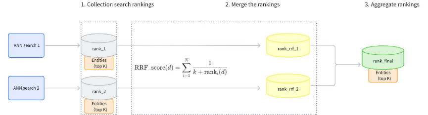

向量检索示例代码如下：

```python
from typing import Any, Dict, List, Tuple

COLLECTION_NAME = "demo_collection"
def get_milvus_client(uri: str = "http://localhost:19530", token: str = ""):
	from pymilvus import MilvusClient
	return MilvusClient(uri=uri, token=token)

def get_bge_m3_model():
	from FlagEmbedding import BGEM3FlagModel
	return BGEM3FlagModel(model_name_or_path="./assets/models/bge-m3")

def encode_query(model, query: str) -> Tuple[List[float], Dict[int, float]]:
	all_embeddings = model.encode([query], return_dense=True, 	return_sparse=True)

	dense_vec = all_embeddings["dense_vecs"][0]
	sparse_raw = all_embeddings["lexical_weights"][0]
	return dense_vec, sparse_vec

def print_hits(title: str, hits: List[dict]):
	print("\n" + "=" * 20)
	print(title)
	print("=" * 20)
	for i, hit in enumerate(hits, start=1):
		entity = hit.get("entity", {})
		print(
		{
			"rank": i,
			"id": entity.get("id"),
			"distance": hit.get("distance"),
			"text": entity.get("text"),
			"metadata": entity.get("metadata"),
		}

	)

def dense_vector_search_example(client, query: str, limit: int = 5):
	model = get_bge_m3_model()
	dense_vec, _ = encode_query(model, query)
	results = client.search(
		collection_name=COLLECTION_NAME,
		data=[dense_vec],
	anns_field="vector",
	limit=limit,
	search_params={"metric_type": "L2"},
	output_fields=["id", "text", "metadata"],
	)
	print_hits("稠密向量检索（vector）", results[0])
	return results

def sparse_vector_search_example(client, query: str, limit: int = 5):
	model = get_bge_m3_model()
_, sparse_vec = encode_query(model, query)
	results = client.search(
	collection_name=COLLECTION_NAME,
	data=[sparse_vec],
	anns_field="sparse_vector",
	limit=limit,
	search_params={"metric_type": "IP"},
	output_fields=["id", "text", "metadata"],
	)
	print_hits("稀疏向量检索（sparse_vector）", results[0])
	return results

def hybrid_vector_search_example_rrf(client, query: str, limit: int = 5):

	from pymilvus import AnnSearchRequest, RRFRanker
	model = get_bge_m3_model()
	dense_vec, sparse_vec = encode_query(model, query)
	dense_req = AnnSearchRequest(
	data=[dense_vec],
	anns_field="vector",
	param={"metric_type": "L2"},
	limit=limit,
	)

	sparse_req = AnnSearchRequest(
	data=[sparse_vec],
	anns_field="sparse_vector",
	param={"metric_type": "IP"},
	limit=limit,
	)
	results = client.hybrid_search(
	collection_name=COLLECTION_NAME,
	reqs=[dense_req, sparse_req],
	ranker=RRFRanker(k=60),
	limit=limit,
	output_fields=["id", "text", "metadata"],
	)
	print_hits("混合向量检索（RRF 融合稠密+稀疏）", results[0])
	return results
```

- 标量检索

标量检索（或标量查询）是指不涉及向量相似度计算，仅基于标量字段条件对数据进行筛选和返回的检索方式。

标量检索示例代码如下所示：

```python
def scalar_query_examples(client, like_keyword: str = "大模型"):
	# 对text字段进行检索
	try:
		like_res = client.query(
		collection_name=COLLECTION_NAME,
		filter=f'text like "%{like_keyword}%"',
		output_fields=["id", "text"],
		limit=5,
	)
		print("\n" + "=" * 20)
		print(f'标量检索（query: text like "%{like_keyword}%"）')
		print("=" * 20)

		for row in like_res:
			print({"id": row.get("id"), "text": row.get("text")})
	except Exception as e:
		print("VARCHAR like 过滤失败：", e)

	# 对metadata字段进行检索
	try:
		json_res = client.query(
		collection_name=COLLECTION_NAME,
		filter='metadata["source"] like "%sample%"',
		output_fields=["id", "metadata"],
		limit=5,
		)
		print("\n" + "=" * 20)
		print('标量检索（query: metadata["source"] like "%sample%"）')
		print("=" * 20)

		for row in json_res:
			print({"id": row.get("id"), "metadata": row.get("metadata")})
	except Exception as e:
		print("JSON 过滤失败（metadata 结构不匹配或不支持该表达式）：", e)
```

## 4.6 生成

查找到相关数据之后，就可以将所有的数据，放到和LLM交互的上下文当中，让LLM基于完整的上下文信息来进行生成。

```python
def rag_demo(client:MilvusClient,query):
	from langchain_openai import ChatOpenAI
	# 加载模型
	llm = ChatOpenAI(model_name="gpt-4o-mini")
	retrieval_res = hybrid_vector_search_example_rrf
	(client=client,query=query)

	# 构建上下文
	context = "\n".join([data["text"] for data in retrieval_res])
	message_list=[
	{"role": "system", "content": "你是一个专业的法律问答机器人，请根据上下文回答问题，当上下文无法回答问题时，请回答“根据上下文无法回答该问题”"},
	{"role": "user", "content": f"根据以下上下文回答问题：{context}\n问题：{query}"}
	]
	# 生成文本
	res = llm.invoke(message_list)
	print(res)

if __name__ == "__main__":
	client = get_milvus_client()
	rag_chain_demo(client,'不动产被占有了怎么办？')
```

# 5.Agents

## 5.1 Agent 介绍

通用人工智能（AGI）将是 AI 的终极形态，几乎已成为业界共识。同样，构建 Agent则是 AI 工程应用当下的“终极形态”。

将 AI 和人类协作的程度类比自动驾驶的不同阶段：

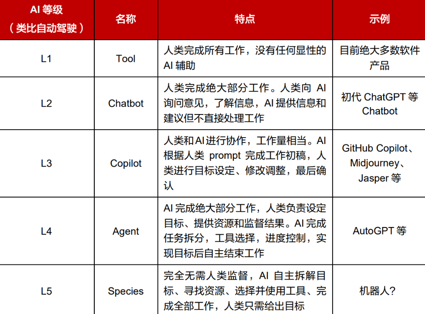

语言模型本身无法采取行动——它们只是输出文本。LangChain 的一个重要功能是创建Agent。Agent 是一种使用 LLM 作为推理引擎的系统，它决定要采取哪些行动以及这些行动的输入应该是什么。这些行动的结果可以反馈给 Agent，由 Agent 决定是否需要采取更多行动，或者是否可以完成。

与传统的固定流程链不同，Agent 具备一定的自主决策能力，更适合处理开放式、多步骤的问题。它可以拆解任务，根据任务动态决定调用哪些工具，并利用中间结果推进任务。

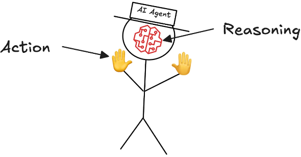

Agent 的核心能力/组件：

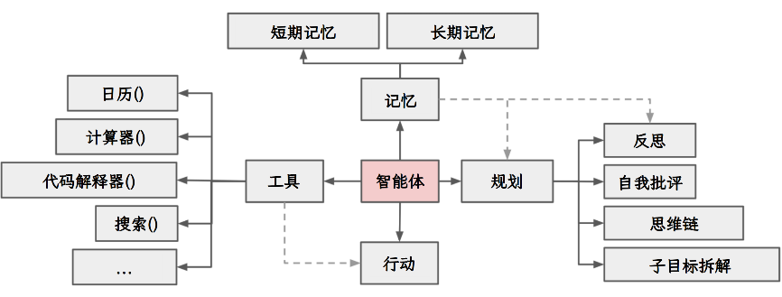

- 大模型(LLM)：作为大脑，提供推理、规划和知识理解能力。
- 记忆(Memory)：具备短期记忆和长期记忆，支持快速知识检索。
- 工具(Tools)：调用外部工具（如API、数据库）的执行单元。
- 规划(Planning)：任务分解、反思与自省框架实现复杂任务处理。
- 行动(Action)：实际执行决策的能力。
- 协作：通过与其他 Agent 交互合作，完成更复杂的任务目标。

## 5.2 Agent构建

LangChain当中提供了一个功能函数：create_agent，可以快速构建一个Agent。create_agent函数所需要传递的参数如下所示：

| 名称 | 是否必传 | 描述 |
| --- | --- | --- |
| model | 是 | 模型实例 |
| system_prompt | 否 | 系统提示词 |
| tools | 否 | 工具列表 |
| response_format | 否 | 结构化输出的schema信息 |
| checkpointer | 否 | 用以保存状态的实例，可用以实现短期记忆 |
| middleware | 否 | 要应用于代理的一系列中间件实例。 中间件可以在各个阶段拦截并修改代理的行为 |

通过传递相关参数，即可构建一个复杂的Agent实例，接下来将详细讲解其中的tools, checkpointer和middleware参数。

## 5.3 Agent添加本地工具

Agent添加工具，本质上是使用大模型服务的function call能力，将所有的工具封装成json schema信息，在调用大模型时，传入所有的json schema，大模型在回答时，能够给出所需要调用的参数名字和入参信息。OpenAI中关于function call的文档链接：[https://platform.openai.com/docs/guides/function-calling?api-mode=chat](https://platform.openai.com/docs/guides/function-calling?api-mode=chat)。

### 5.3.1 OpenAI SDK调用添加工具schema

以下代码演示了如何通过OpenAI的原生SDK来进行工具调用：

```python
from openai import OpenAI
import json
client = OpenAI()

# 1. 通过JSON结构定义工具，包括工具名称，描述，参数等
tools = [
{
"type": "function",
"function": {
"name": "get_weather",
"description": "Get today's weather for a location.",
"parameters": {
"type": "object",
"properties": {
"city": {
"type": "string",
"description": "城市名称, e.g. San Francisco",
},
"date" :{
"type":"string",
"description":"想要查询的天气的日期, e.g. 2023-12-25"
}
},
"required": ["city","date"],
"additionalProperties": False,
},
"strict": True,
},
},
]

def get_weather(city,date):
	return f"{city} on {date} is cloudy with a chance of rain."
	messages = [
{"role": "user", "content": "What is the weather like in 北京 on 2024-12-25?"}
]

	# 2. Prompt the model with tools defined
	response = client.chat.completions.create(
		model="gpt-4.1",
		messages=messages,
		tools=tools,
	)
	messages.append(response.choices[0].message)

	for tool_call in response.choices[0].message.tool_calls or []:
		if tool_call.function.name == "get_weather":
		# 3. 执行工具函数的逻辑
		args = json.loads(tool_call.function.arguments)
	weather = get_weather(args["city"],args["date"])
		# 4. 将工具函数的执行结果添加到消息列表中
	messages.append(
	{
	"role": "tool",
	"tool_call_id": tool_call.id,
	"content": json.dumps({"weather": weather}),
	}
	)

	response = client.chat.completions.create(
		model="gpt-4.1",
		messages=messages,
		tools=tools,
		)

	# 5. 模型会根据工具函数的执行结果，生成最终的回复
	print(response.choices[0].message.content)
```

## 5.3.2 通过LangChain定义工具

通过原生的SDK定义工具时需要使用json来描述工具，比较繁琐。langchain.tools模块下提供了tool装饰器，可以通过 在函数上使用@tool的方式，就可以将一个函数创建成工具。

需要注意的是：定义函数时，需要通过使用 @tool装饰器内传参：description 或者是定义函数的文档字符串的方式，来添加函数的解释说明。

而对于参数的说明，没有对于参数描述的强制限制，不过也可以通过pydantic的BaseModel来定义一个入参的具体描述信息，传递到tool装饰内。

通过LangChain定义好工具之后，调用llm.bind_tools()方法，得到一个新的llm对象，后续在调用新的llm对象时，就可以使用相关的工具

示例代码如下：

```python
from langchain.tools import tool
from langchain_core.messages import HumanMessage,ToolMessage
import logging

logging.basicConfig(level=logging.DEBUG)
# 可选：通过BaseModel详细定义工具的参数
from pydantic import BaseModel,Field
class GetWeatherArgs(BaseModel):
	city: str = Field(description="城市名称")
	date: str = Field(description="日期，格式为YYYY-MM-DD")

@tool
def get_weather(city, date) -> str:
"""获取指定城市在指定日期的天气"""
	return f"{city} 在 {date} 天气多云，有下雨的可能性"

from langchain_openai import ChatOpenAI
	llm = ChatOpenAI(model="gpt-4.1")
	llm = llm.bind_tools([get_weather])
	message_list = [
HumanMessage(content="北京2024-12-25的天气")
]

res = llm.invoke(message_list)
message_list.append(res)
# 当前结果当中包含调用工具的出参
print('LLM的首次回复：',res)
# 解析调用工具的出参，手动调用工具

tool_call = res.tool_calls[0]
args = tool_call['args']
call_tool_res = get_weather.invoke(args)
id = tool_call['id']
#构造Message对象
tool_message = ToolMessage(tool_call_id=id,content=call_tool_res)
message_list.append(tool_message)
res = llm.invoke(message_list)
print('基于工具调用返回信息后，LLM的回复：',res)
```

### 5.3.3 构建agent时添加本地工具

了解了如何定义tool之后，就可以使用 create_agent来创建 一个可以调用工具的Agent了。

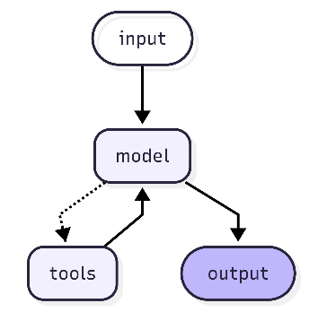

这里使用 [Tavily](https://app.tavily.com/home) （搜索引擎）作为工具，需要先获取它的 API-Key 并添加到环境变量。

```python
# pip install langchain-tavily

import os
from langchain_tavily import TavilySearch
from langchain.agents import create_agent
from langchain.chat_models import init_chat_model
# 定义模型
llm = init_chat_model(
	model="gpt-4o-mini",
	model_provider="openai",
	)

# 定义 Tavily 搜索工具

search = TavilySearch(max_results=5)
tools = [search]
# 创建 Agent
agent = create_agent(
	model=llm,  # 模型
	tools=tools,  # 工具
	system_prompt="你是位助手，需要调用工具来帮助用户。",  # 系统提示词
)

# 调用 Agent

res = agent.invoke(
{"messages": [{"role": "user", "content": "今天北京的天气怎么样？"}]}
)
print(res)

# 如果 Agent 执行多个步骤，这可能需要一些时间。为了显示中间进度，我们可以使用 stream 流式返回消息。
# pip install langchain-tavily

import os
from langchain_tavily import TavilySearch
from langchain.agents import create_agent
from langchain.chat_models import init_chat_model

# 定义模型
llm = init_chat_model(
		model="gpt-4o-mini",
		model_provider="openai",
	)
# 定义 Tavily 搜索工具
search = TavilySearch(max_results=5)
tools = [search]
# 创建 Agent

agent = create_agent(model=llm, tools=tools)
# 调用 Agent
for chunk in agent.stream(
	{
	"messages": [
	{"role": "system", "content": "你是位助手，需要调用工具来帮助用户。"},
	{"role": "user", "content": "今天北京的天气怎么样？"},
	]}):

print(chunk, end="\n\n")
```

要想更加精确地看到每个步骤的耗时，以及输入输出等信息，可以通过LangSmith来实现。LangSmith 是一个用于调试、测试、评估和监控 LLM 应用程序（特别是基于 LangChain 和 LangGraph 构建的应用）的全流程开发平台，旨在帮助开发者将原型转化为生产级应用。

使用LangSmith非常简单，只需要配置如下两个环境变量，不需要改动任何代码，即可将整个调用过程在LangSmit当中展示，其中API_KEY可在langsmith官网进行配置：

LANGSMITH_TRACING="true"
LANGSMITH_API_KEY="..."

配置好环境变量之后，可在 LangSmith 的 Tracing Projects 中查看跟踪记录。

LangSmith 默认将跟踪记录到 default 项目，可通过 LANGSMITH_PROJECT 环境变量设置 LangSmith 跟踪记录保存到哪个项目，如果该项目不存在则会创建。

## 5.4 Agent添加MCP工具

### 5.4.1 MCP介绍

Model Context Protocol（MCP，模型上下文协议）是一个开源协议，它标准化了大语言模型与外部工具和数据源通信的方式，允许开发者和工具提供商只需集成一次，就能与任何兼容 MCP 的系统交互。MCP 就像 USB-C 标准：不需要为每个设备使用不同的连接器，而是使用一个端口来处理多种类型的连接。

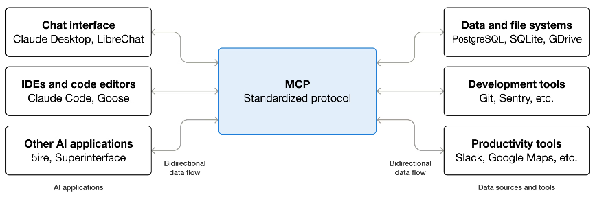

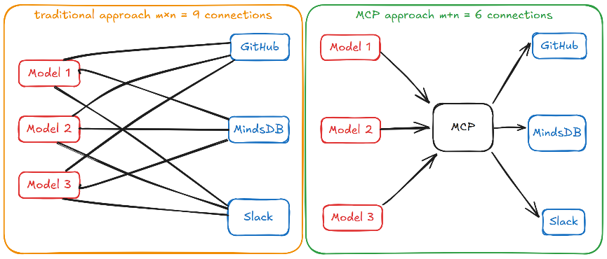

### 5.4.2 MCP架构

MCP 遵循客户端-服务器架构，架构中包括：

| MCP 主机 | 协调和管理一个或多个 MCP 客户端的 AI 应用 |
| --- | --- |
| MCP 客户端 | 一个保持与 MCP 服务器连接的组件，通过 MCP 定义的消息处理通信，从服务器查找并请求资源和工具，并管理与服务器的连接生命周期 |
| MCP 服务器 | 一个向 MCP 客户端提供服务的程序，通过协议暴露工具、资源和提示模板功能 |

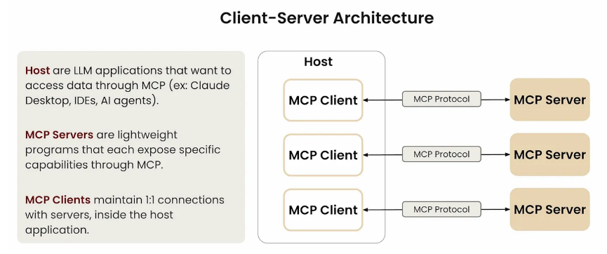

### 5.4.3 MCP数据传输协议

MCP 客户端和服务端之间的数据传输机制，包括 Stdio、Streamable HTTP、SSE。

| Stdio | 使用标准输入和输出流，与在终端输入命令并看到响应时使用的机制相同。适用于本地开发，例如本地文件服务器等 |
| --- | --- |
| Streamable HTTP | 该传输使用 HTTP POST 和 GET 请求，服务器可以选择使用SSE来流式传输多个服务器消息。支持流式传输和服务器到客户端通知，并支持标准 HTTP 身份验证方法，包括授权令牌、API 密钥和自定义头信息 |
| SSE | 带有 SSE（Server-Sent Events 服务器发送事件）的 HTTP，MCP早期传输机制，现逐渐被 Streamable HTTP 取代 |

### 5.4.4 MCP工作流程

MCP的工作流程如下所示：

握手与能力声明（Handshake & Discovery）：当AI应用程序（Host）启动时，它会根据配置启动 MCP Server（通常是一个子进程）。Host 记住了这些工具的名字和用法说明，但此时 并没有执行任何代码 。

用户提问与上下文注入（Context Injection）：User提出问题后，Host 把用户的这个问题，加上刚才 Server 汇报的 工具说明书 ，一起打包发给 LLM。

模型决策（LLM Reasoning）：LLM决定是否需要去调用相关工具。

路由与执行（Routing & Execution）：Host 收到指令，发现是要调用 MCP 工具，Host 通过 MCP 协议（JSON-RPC）给 MCP Server 发消息，Server 收到请求， 在它自己的进程（如果是StreamableHttp方式，则是在远端执行）里执行相关操作。 所有的驱动依赖、复杂逻辑都在 Server 端。

结果回传（Result Feedback）：Server 拿到结果，打包成 MCP 响应发回给 Host，Host再将相关结果，传递给大模型，让大模型做下一步的输出。

### 5.4.5 MCP SDK

- Stdio

以下是使用MCP进行stdio模式下的服务端编码过程：

```python
# pip install mcp

from mcp.server.fastmcp import FastMCP
# 创建 MCP 实例
mcp = FastMCP("Demo")
# 为 MCP 实例添加工具
@mcp.tool()
def add(a: int, b: int) -> int:
	return a + b
# 为 MCP 实例添加资源
@mcp.resource("greeting://default")
def get_greeting() -> str:
	return "Hello from static resource!"
# 为 MCP 实例添加提示词

@mcp.prompt()
def greet_user(name: str, style: str = "friendly") -> str:
	styles = {
		"friendly": "写一句友善的问候",
		"formal": "写一句正式的问候",
		"casual": "写一句轻松的问候",
		}
return f"为{name}{styles.get(style, styles['friendly'])}"

if __name__ == "__main__":
	mcp.run(transport="stdio")
```

stdio客户端使用MCP的流程为：

- 通过stdio_client启动进程：构建stdio启动参数
- 建立会话：通过ClientSession构建会话session
- 握手初始化：调用session.initialize()
- 获取能力: 通过session.list_tools() / session.call_tools() 等获取或者使用MCP能力

示例代码如下所示：

```python
# pip install mcp
import asyncio
from mcp.client.stdio import stdio_client
from mcp import ClientSession, StdioServerParameters

async def stdio_run():
	server_params = StdioServerParameters(
	command=r" D:\PycharmProjects\ LangGraph_demo\.venv\Scripts\python.exe
",
	args=[r"./mcp_server_stdio.py"],

)

	async with stdio_client(server_params) as (read, write):
		async with ClientSession(read, write) as session:
			# 初始化连接
			await session.initialize()
			# 获取可用工具
			tools = await session.list_tools()
			print(tools)
			print()
			# 调用工具
			call_res = await session.call_tool("add", {"a": 1, "b": 2})
			print(call_res)
			print()
			# 获取可用资源
			resources = await session.list_resources()
			print(resources)
			print()
			# 调用资源
			read_res = await session.read_resource("greeting://default")
			print(read_res)
			print()
			# 获取可用提示
			prompts = await session.list_prompts()
			print(prompts)
			print()
			# 调用提示
			get_res = await session.get_prompt("greet_user", {"name": "Jack"})
			print(get_res)

			print()

asyncio.run(stdio_run())
```

- StreamableHttp

构建StreamableHttp服务端和stdio服务端类似，只是需要将服务端运行起来。运行的方式同样是通过mcp.run，并设置transport为streamable-http即可：

```python
# pip install mcp
from mcp.server.fastmcp import FastMCP
# 创建 MCP 实例
mcp = FastMCP("Demo")
# 为 MCP 实例添加工具
@mcp.tool()
def add(a: int, b: int) -> int:
	return a + b

# 为 MCP 实例添加资源
@mcp.resource("greeting://default")
def get_greeting() -> str:
	return "Hello from static resource!"

# 为 MCP 实例添加提示词
@mcp.prompt()
def greet_user(name: str, style: str = "friendly") -> str:
styles = {
"friendly": "写一句友善的问候",
"formal": "写一句正式的问候",
"casual": "写一句轻松的问候",
}
	return f"为{name}{styles.get(style, styles['friendly'])}"

if __name__ == "__main__":
	mcp.settings.host = "0.0.0.0"
	mcp.settings.port = 8888
	mcp.run(transport="streamable-http")  # 默认启动在 127.0.0.1:8000
```

StreamableHttp和Stdio客户端编码方式类似，构建client的方式，从stdio_client的方式换成了streamable_http_client，配置服务端所在的地址。

```python
# pip install mcp
import asyncio
from mcp import ClientSession
from mcp.client.streamable_http import streamable_http_client

async def streamablehttp_run():
	url = "http://127.0.0.1:8000/mcp"
	async with streamable_http_client(url=url) as (read,write,_):
		async with ClientSession(read,write) as session:
		# 初始化连接
			await session.initialize()
			# 获取可用工具
			tools = await session.list_tools()
			print(tools)
			print()
			调用工具
			call_res = await session.call_tool("add", {"a": 1, "b": 2})
			print(call_res)
			print()
			# 获取可用资源
			resources = await session.list_resources()
			print(resources)
			print()
			# 调用资源
			read_res = await session.read_resource("greeting://default")
			print(read_res)
			print()
			# 获取可用提示

			prompts = await session.list_prompts()
			print(prompts)
			print()
			# 调用提示
			get_res = await session.get_prompt("greet_user", {"name": "Jack"})
			print(get_res)
			print()

asyncio.run(streamablehttp_run())
```

### 5.4.6 LangChain 使用 MCP

LangChain Agent 可以通过 langchain-mcp-adapters 包使用 MCP 服务器上定义的工具。这里演示的工具，使用了阿里云魔搭MCP广场当中的工具：[https://www.modelscope.cn/mcp](https://www.modelscope.cn/mcp)。

魔搭广场当中的部分MCP服务，在魔搭平台已经部署，可以直接使用（也可以使用个人函数计算资源进行部署），例如如下12306MCP工具：

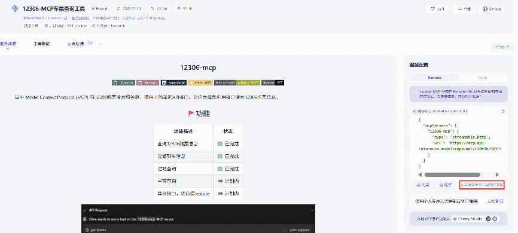

将MCP连接JSON复制到MultiServerMCPClient的参数当中，注意需要将type键的名称改为transport，获取到client实例。

通过client.get_tools()方法即可获取到当前所配置的MCP当中所包含的所有工具，langchain_mcp_adapters会将其封装成符合langchain规范的工具。将其传递到create_agent函数的tool当中，agent即可在决策过程中，判断是否需要使用这些工具。

需要注意的是，由于MultiServerMCPClient只支持异步调用，所以agent的调用，也需要转换成异步形式，示例代码如下所示：

```python
# pip install langchain_mcp_adapters
from langchain_mcp_adapters.client import MultiServerMCPClient
from langchain.agents import create_agent
from langchain_openai import ChatOpenAI
from langgraph.checkpoint.memory import InMemorySaver
import asyncio
client = MultiServerMCPClient(
{
	"12306-mcp": {
	"transport": "streamable_http",
	"url": "https://mcp.api-inference.modelscope.net/c30f9b25034446/mcp"
	},

	"amap-maps": {
	"transport": "http",
	"url": "https://mcp.api-inference.modelscope.net/14db9c03451e47/mcp"

	}
})

def print_message(message):
	from langchain.messages import AIMessage,HumanMessage,ToolMessage
	if isinstance(message,AIMessage):
	print("AI回复：",message.content)
	print("AI决定调用工具",message.tool_calls)
	elif isinstance(message,HumanMessage):
	print("用户输入：",message.content)
	elif isinstance(message,ToolMessage):
	print("工具调用：",message.content)
	else:
	print("未知消息类型")

async def main():
	tools = await client.get_tools()
	print(tools)

def handle_tool_error(error) -> str:
	return f"Tool execution failed: {str(error)}"
# 配置工具错误所对应的处理方式，避免工具调用错误导致整个agent执行过程退出
for tool in tools:
	tool.handle_tool_error = handle_tool_error
llm = ChatOpenAI(
	model="gpt-4o-mini"
	)
agent = create_agent(
	llm,
	tools,
)

while True:
	user_input = input(">")
	if user_input == "exit":
		break
	res = await agent.ainvoke({"messages": [{"role": "user", "content": user_input}]},config={"configurable":{"thread_id":"1"}})
	print(res['messages'][-1].content,end="\n\n")

	for message in res["messages"]:
		print_message(message)
		print("\n")
		print("\n")

asyncio.run(main())
```

## 5.5 Agent添加记忆

前面的agent在多次invoke过程中，并不会将会话历史保存下来，也就是没有短期记忆。要想Agent拥有短期记忆，就需要在create_agent当中为checkpointer参数赋值，该参数其实是底层LangGraph用以保存多次调用记录的检查点配置。

Agent拥有短期记忆能力之后，会将会话历史按照thread_id作为粒度进行隔离的。Thread_id是来自于agent的底层运行时—LangGraph—当中的概念。不同的thread_id，对应着不同的消息列表，如下图所示：

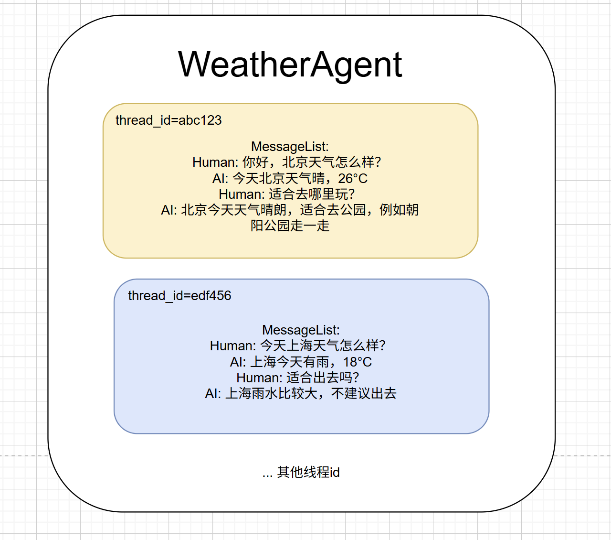

在具体调用时，只需要指定一个thread_id，即可保证将所有短期记忆，存储到一个特定的消息列表当中；LLM在回复时，只会以当前thread_id所对应的消息列表作为上下文进行回复。

下面构造一个实际的WeatherAgent， 来演示记忆功能：

```python
import os
import datetime
from langchain_tavily import TavilySearch
from langchain.agents import create_agent
from langchain.chat_models import init_chat_model
from langgraph.checkpoint.memory import InMemorySaver

# 定义 Tavily 搜索工具
search = TavilySearch(max_results=5)
tools = [search]
llm = init_chat_model(
model="gpt-4o-mini",
model_provider="openai",
)

# 关键点1：定义checkpointer实例
checkpointer = InMemorySaver()
# 创建 Agent
agent = create_agent(
model=llm,
tools=tools,
checkpointer=checkpointer, # 关键点2：将checkpointer实例传递给Agent
)

# 调用
print("=== 第一次调用 ===")
for chunk in agent.stream(
input={
"messages": [
{
"role": "system",
"content": f"当前时间：{datetime.datetime.now().strftime('%Y-%m-%d %H:%M:%S')}",
},
{"role": "user", "content": "今天北京天气怎么样？"},
]
},
config={"configurable": {"thread_id": "abc123"}}, # 关键点3：为每个调用指定一个唯一的thread_id
):

print(chunk, end="\n\n")
print("=== 第二次调用 ===")
for chunk in agent.stream(
	input={
	"messages": [
	{"role": "user", "content": "我刚才问你什么了"},
	]
},

# 关键点4：在多次调用中使用相同的thread_id，模型会记住之前的对话
config={"configurable": {"thread_id": "abcedf"}},
):
print(chunk, end="\n\n")
```

## 5.6 Agent执行添加中间件

在create_agent方法当中，还有一个middleware参数，可以传入中间件列表，即可在调用过程中使用中间件。

在LangChain的Agent当中，中间件用于更加方便地控制Agent在执行过程当中的一些行为，例如，总结中间件可以在调用大模型前对历史消息列表进行总结，人在循环（Human-In-the-Loop）中间件，可以在调用工具过程中引入人类审核机制，人类审核通过后，才继续调用工具。

在没有中间件时，整个Agent的执行过程如下所示：

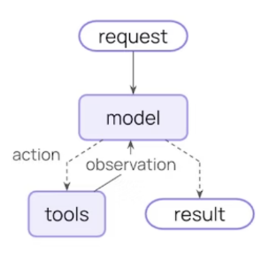

用户先输入请求，会直接进入到model节点，model节点判断，如果需要调用工具，则进入到tools节点，调用完工具之后，再回到model节点，model节点内，大模型继续判断，是否需要进一步调用工具，如果不需要直接走到END节点即可。

而在引入了中间件之后，整个调用过程如下图所示：

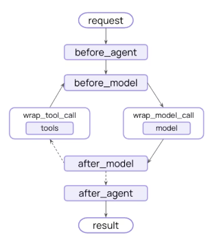

整个调用Agent的过程，可以在不改变model和tools的相关代码前提下，实现多处调整：

- before/after_agent：在agent调用的起始输入和终点输出，进行相关处理（切片编程思想）；
- before/after_model: 在model调用的前后，进行相关处理（切片编程思想）；
- wrap_tool/model_call: 通过handler回调的方式，拦截工具/模型执行，可以为工具执行/模型执行，添加重试，缓存，多次调用等相关逻辑（代理思想）。

**注意**：**不同的中间件，可选择性地仅对以上的一个或者多个节点定义处理逻辑**。

以下是两种中间件，及其分别实现的逻辑：

- SummarizationMiddleware

总结历史消息的中间件，可以通过多种不同的策略，使用一个单独的大模型总结历史消息。该中间件实现了before_model的处理逻辑：在调用模型前，先按照配置的策略对消息进行压缩，再传递给model节点进行调用。

实例化方式如下所示：

from langchain.agents.middleware.human_in_the_loop import HumanInTheLoopMiddleware

summarize_llm = ChatOpenAI(model="gpt-4o-mini")

summary_middleware = SummarizationMiddleware(model=summarize_llm,trigger=("messages", 10))

trigger表示所使用的策略，传入方式为元组，可以传入多种不同的策略：

- (“messages”, 100)：agent消息列表的长度达到100以后，即进行总结压缩；
- (“fraction”,0.5): agent消息列表当中的token总长度（langchain内部提供了token计算函数，也可以在该函数当中自定义token_counter）达到了model最大输入token数的0.5时，进行总结压缩；
- (“tokens”,3000): agent消息列表当中的token总长度达到了一个绝对值之后（3000），进行总结压缩。HumanInTheLoopMiddleware

调用工具前实现人工审核功能的中间件，可以对不同的工具，定义不同的审核策略（是否需要审核）。该中间件实现了after_model的处理逻辑。在模型回复后，该中间件判断模型的回复结果当中是否有工具调用。如果有，判断所需要调用的模型当中，是否有需要人工审核的工具。

具体实例化方式如下所示：

```python
from langchain.agents.middleware.human_in_the_loop import HumanInTheLoopMiddleware
tool_name_to_interrupt = {'send_email':True,'get-current-date':False}
human_in_the_loop_middleware = HumanInTheLoopMiddleware(interrupt_on=tool_name_to_interrupt)
```

示例代码如下所示：

```python
import asyncio
from typing import Literal

from langchain.agents import create_agent
from langchain.agents.middleware import HumanInTheLoopMiddleware
from langchain.chat_models import init_chat_model
from langchain.tools import tool
from langgraph.checkpoint.memory import InMemorySaver
from langgraph.types import Command

# 1. 定义工具
@tool
def get_weather(city: str) -> str:
    """查询天气"""
    return f"{city}的天气晴朗，气温25度。"

@tool
def transfer_money(amount: int, to_account: str) -> str:
    """转账工具 (敏感操作)"""
    print(f"!!! 正在执行转账: {amount} -> {to_account} !!!")
    return f"成功转账 {amount} 元给 {to_account}。"

# 2. 初始化模型
llm = init_chat_model("gpt-4o-mini", model_provider="openai")

# 3. 配置 HumanInTheLoopMiddleware
# 我们希望在调用 transfer_money 时暂停，让用户审核
# True 表示允许所有操作 (approve, edit, reject)
interrupt_config = {
    "transfer_money": True,
    "get_weather": False  # False 表示自动批准，不中断
}
hitl_middleware = HumanInTheLoopMiddleware(interrupt_on=interrupt_config)

# 4. 创建 Agent
# 注意：使用中断功能必须配置 checkpointer，因为中断需要保存状态
checkpointer = InMemorySaver()
agent = create_agent(
    model=llm,
    tools=[get_weather, transfer_money],
    middleware=[hitl_middleware],
    checkpointer=checkpointer,
)

async def run_demo():
    print("=== HumanInTheLoopMiddleware 演示 ===")
    print("场景：用户让 Agent 转账，Agent 在执行前会暂停等待批准。")
    
    thread_id = "thread-1"
    config = {"configurable": {"thread_id": thread_id}}
    
    # 第一步：用户发出指令,可以调整成查询天气
    print("\n[User]: 请帮我转账 100 元给 Alice")
    
    # 使用 ainvoke 或 stream 运行
    # 如果遇到中断，LangGraph 会暂停并保存状态
    # 我们需要在一个循环中处理这种情况，但为了演示清晰，我们分步执行
    
    # 第一次运行：Agent 思考 -> 决定调用 transfer_money -> Middleware 拦截 -> 中断
    # 注意：create_agent 返回的是一个 CompiledGraph，它的行为和标准 LangGraph 一致
    
    # 我们用一个循环来模拟持续交互，并处理潜在的中断
    current_input = {"messages": [{"role": "user", "content": "请帮我转账 100 元给 Alice"}]}
    current_command = None

    while True:
        try:
            # 如果有 resume command，就用它；否则用 input
            if current_command:
                result = await agent.ainvoke(current_command, config=config)
                current_command = None # 重置
            else:
                if not current_input:
                    break
                result = await agent.ainvoke(current_input, config=config)
                current_input = None # 处理完了

            # 打印结果消息
            if "messages" in result:
                for msg in result["messages"]:
                    if hasattr(msg, "tool_calls") and msg.tool_calls:
                         print(f"[Agent]: 我想调用工具: {msg.tool_calls}")
                    if msg.type == "tool":
                         print(f"[Tool Output]: {msg.content}")
                    if msg.type == "ai" and not msg.tool_calls:
                         print(f"[Agent]: {msg.content}")

        except Exception as e:
            print(f"发生错误: {e}")
            pass

        # 检查是否中断，当中断时，result当中有__interrupt__键
        if "__interrupt__" in result:
            interrupt_value = result["__interrupt__"][0].value
            print(f"\n!!! 检测到中断 (Middleware 拦截) !!!")
            print(f"中断详情: {interrupt_value}")
            
            # 这里模拟用户决策
            print("\n[System]: 请审核上述操作 (approve/reject/edit):")
            # 模拟用户输入 "approve"
            decision_type = "approve" 
            print(f"[User]: {decision_type}")
            
            # 构建回复
            # Middleware 期望的格式是 {"decisions": [{"type": "approve", ...}]}
            decisions = []
            action_requests = interrupt_value.get("action_requests", [])
            
            for req in action_requests:
                print(f"  - 批准操作: {req['name']}")
                decisions.append({"type": "approve"})
            
            # 人工审核结果：通过构造 resume command，并传入的方式传入给agent
            current_command = Command(resume={"decisions": decisions})
            print("[System]: 恢复执行...")
            continue
        
        # 如果没有中断，说明任务完成
        break

if __name__ == "__main__":
    asyncio.run(run_demo())

```

