# 第11章 模块和包

## 11.1 模块

### 11.1.1 模块概述

Python中一个以.py结尾的源文件即为一个模块（Module）。其中可以包含变量、函数和类等。通常情况下，我们把能够实现某一特定功能的代码放置在一个文件中作为一个模块。

使用模块提高了代码的可维护性，也提高了代码的复用性。即编写好一个模块后，只要是实现该功能的程序，都可以导入这个模块实现。另外，使用模块也可以避免名称冲突，相同名字的函数或变量可以分别存在与不同的模块中。

### 11.1.2 创建模块

模块名区分大小写，且不能与Python自带的标准模块重名。

> 自定义模块：p02_my_math_module.py

```python
"""
    自定义模块
"""
def add(a,b):
    return a+b

def subtract(a,b):
    return a-b

def multiply(a,b):
    return a*b

def divide(a,b):
    return a/b

def _remainder(a,b): # 为后面演示需要，故意以_开头
    return a%b
```

> 自定义模块：p02_my_shape_module.py

```python
"""
    自定义模块
"""
def print_rectangle(width, height):
    """
    打印矩形
    :param width: 宽度
    :param height: 高度
    :return:
    """
    for i in range(height):
        for j in range(width):
            print("*", end="")
        print()

def print_diamond(lines):
    """
    打印菱形
    :param lines: 层数
    :return:
    """
    if not lines % 2 != 0:
        raise ValueError("lines 必须是奇数")
    center = int(lines // 2)
    for i in range(lines):
        for j in range(lines):
            if abs(i-center) + abs(j-center) <= center:
                print("*", end="")
            else:
                print(" ", end="")
        print()

# 为了演示重名，故意与p01_my_math_module中的multiply()方法重名
def multiply(a, b):
    """
    重复打印b次的a接收的数据
    :param a: 要重复的数据
    :param b: 重复b次
    :return:
    """
    print(f"{a}"* b)
```


### 11.1.3 导入模块

#### 1、模块搜索顺序

当导入一个模块时，会按照以下顺序进行查找：

（1）当前目录。

（2）PYTHONPATH环境变量中的目录。

（3）包含标准 Python 模块以及这些模块所依赖的任何 extension module 的目录。

（4）site-packages - 查找第三方包安装路径

可以使用以下方式查看模块搜索顺序：

```python
import sys

print(sys.path)
```

路径顺序说明：

- sys.path 列表中的路径按照优先级顺序排列
- Python会从列表的第一个元素开始查找，直到找到所需的模块
- 如果在某个路径中找到了模块，就会停止搜索并加载该模块
- 可以通过 sys.path.append() 或 sys.path.insert() 动态修改搜索路径

这个查找机制确保了模块能够被正确加载，同时允许开发者自定义模块搜索路径

```python
import sys

print(sys.path)

sys.path.append("d:\\atguigu\\python")
sys.path.insert(0,"d:\\atguigu\\python")

print(sys.path)

```

#### 2、import 模块：导入模块所有成员

语法格式：

```python
import 模块名 【as 模块别名】
```

- 导入模块的所有成员，通过模块名.成员名的方式访问。即使多次使用 import导入同一模块，模块也只会被导入一次。

示例代码：

```python
"""
    导入某个模块的全部成员
"""
import p02_my_math_module as my
import p02_my_shape_module

print(f"10+2={my.add(10,2)}")
print(f"10-2={my.subtract(10,2)}")
print(f"10*2={my.multiply(10,2)}")
print(f"10÷2={my.divide(10,2)}")
print(f"10%2={my._remainder(10,2)}")

print("打印9行菱形")
p02_my_shape_module.print_diamond(9)
print("打印9行5列矩形")
p02_my_shape_module.print_rectangle(9,5)
print("打印5个$")
p02_my_shape_module.multiply('$',5)
```

#### 3、from模块import成员：指定导入模块具体成员

语法格式：

```python
from 模块名 import 成员名1[as 别名], 成员名2[as 别名],…
```

- 只能使用其导入的成员，未导入的成员不能使用。
- 指定导入模块的部分成员，直接通过成员名的方式访问，无需加`模块名.`。
- 如果多个模块中存在重名成员，后一次导入会覆盖前一次导入。此时可以通过给成员取不同的别名来区分。

示例代码：

```python

"""
    指定导入模块的具体成员
"""
from p02_my_math_module import add,subtract as sub,multiply as mul,_remainder as mod
from p02_my_shape_module import multiply as mul_star

print(f"10+2={add(10,2)}")
print(f"10-2={sub(10,2)}")
print(f"10*2={mul(10,2)}")
# print(f"10÷2={div(10,2)}") # 报错， div() 未导入
print(f"10%2={mod(10,2)}")

print("打印5个$")
mul_star('$',5)
```

#### 4、 from模块import *：导入模块所有非私有成员

语法格式：

```python
from 模块名 import *
```

- 导入模块中所有不以单下划线开头的成员，直接通过成员名的方式访问。

示例代码：

```python

"""
    导入模块所有非私有成员
"""
from p02_my_math_module import *
from p02_my_shape_module import *

# 2个模块有重名成员，需要使用as 别名解决
from p02_my_math_module import multiply as mul_num
from p02_my_shape_module import multiply as mul_star

print(f"10+2={add(10,2)}")
print(f"10-2={subtract(10,2)}")
print(f"10*2={mul_num(10,2)}")
print(f"10÷2={divide(10,2)}")
# print(f"10%2={_remainder(10,2)}") # 报错，# import * 只能导入模块中所有不以单下划线开头的成员

print("打印9行菱形")
print_diamond(9)

print("打印5个$")
mul_star('$',5)
```

#### 5、`__all__`指定import *可导入成员

使用from import *导入模块时，可以在被导入的模块中使用 `__all__`设置哪些内容可以被导入。`__all__ `的设置只针对使用 from import * 导入模块时有效。

> 创建模块：p06_my_math_module.py
>

```python
"""
    自定义模块
"""
__all__ = ["add","sub","mul"]

def add(a,b):
    return a+b

def sub(a,b):
    return a-b

def mul(a,b):
    return a*b

def div(a,b):
    return a/b
```

> 导入p06_my_math_module.py，测试

```python
"""
    演示__all__ + from import *
"""
from p06_my_math_module import *

print(f"10+2={add(10,2)}")
print(f"10-2={sub(10,2)}")
print(f"10*2={mul(10,2)}")
# print(f"10÷2={div(10,2)}") # 报错， div成员未在__all__中
```

#### 6、使用`__name__`变量检查是否主模块

在 Python 中，`__name__ `是一个特殊的内置变量 

- 当一个Python文件被直接运行时，该文件的`__name__`属性值为`__main__`。
- 当一个Python文件作为模块被导入时，`__name__`属性会被设置为该模块的名称（即文件名，不包含 .py 后缀）。

有时我们会在模块中写一些测试代码，当模块被其他文件导入时这些测试代码会被执行。为了避免模块被导入时测试代码被执行，我们可以在被导入模块中添加对 `__name__ `属性的检查：

```python
if __name__ == "__main__":
    测试代码
```

> 创建模块：p07_my_math_module.py

```python
"""
    自定义模块
"""
def add(a,b):
    return a+b

def sub(a,b):
    return a-b

def mul(a,b):
    return a*b

def div(a,b):
    return a/b

# 测试代码
print(f"10+2={add(10,2)}")
print(f"10-2={sub(10,2)}")
print(f"10*2={mul(10,2)}")
print(f"10÷2={div(10,2)}")

# 使用__name__变量检查是否主模块，如果是主模块，则执行测试代码
# if __name__ == "__main__":
#     print(f"10+2={add(10, 2)}")
#     print(f"10-2={sub(10,2)}")
#     print(f"10*2={mul(10,2)}")
#     print(f"10÷2={div(10,2)}")
```

> 测试导入p07_my_math_module.py模块

```python
"""
    演示导入其他模块，查看其他模块的测试代码是否被执行
"""
from p07_my_math_module import *
```

- 发现`p07_my_math_module`模块中不在`if __name__ == "__main__":`中的测试代码被执行了

## 11.2 dir()函数

dir() 是一个内置函数，主要用于：

- `dir(对象)`：列出一个对象的名称列表（即属性和方法）
- `dir(导入的模块名)`：列出一个模块中定义的名称列表（即函数、类、变量等）
- `dir()`：列出当前作用域中定义的名称列表（即函数、类、变量等）

并以一个字符串列表的形式返回。

```python
"""
    演示dir()函数
"""
import math

# 查看math模块下的名称列表
print(f"math模块的名称列表：{dir(math)}")

# 自定义类
class Person:
    home = "earth"

    def __init__(self, name=None):
        self.name = name

    def eat(self):
        print(f"{self.name} is eating")

# 创建对象
p = Person("张三")
print(f"p对象的名称列表：{dir(p)}")

# 定义函数
def test(info):
    print(f"test函数作用域的名称列表：{dir()}") # dir()函数
# 调用函数
test("hello world")

print(f"当前模块作用域的名称列表：{dir()}")
```


## 11.3 包

### 11.3.1 包概述

包是一种管理 Python 模块命名空间的形式，包可以理解为是一个模块集。

通过使用`包.模块名`来构造Python模块命名空间的一种方式。例如，`包名A.模块名B`表示名为A的包中名为B的子模块。通常我们将多个有联系的模块放入一个包中。包与文件夹相似，不过该文件夹下必须有一个`__init__.py`文件。`__init__.py `可以只是一个空文件，也可以执行包的初始化代码或设置 `__all__ `变量。

> 假设要为统一处理声音文件与声音数据设计一个模块集（包）。

声音文件的格式很多（通常以扩展名来识别，例如：.wav，.aiff,.au），因此，为了不同文件格式之间的转换，需要创建和维护一个不断增长的模块集合。为了实现对声音数据的不同处理（例如：混声、添加回声、均衡器功能、创造人工立体声效果），还要编写无穷无尽的模块流。下面这个分级文件树展示了这个包的架构：

```
sound/                          最高层级的包
      __init__.py               初始化 sound 包
      formats/                  用于文件格式转换的子包
              __init__.py
              wavread.py
              wavwrite.py
              aiffread.py
              aiffwrite.py
              auread.py
              auwrite.py
              ...
      effects/                  用于音效的子包
              __init__.py
              echo.py
              surround.py
              reverse.py
              ...
      filters/                  用于过滤器的子包
              __init__.py
              equalizer.py
              vocoder.py
              karaoke.py
              ...
```

### 11.3.2 通用的项目目录结构

```
my_project/  # 项目根目录（工作目录）
├── main.py   # 自定义的主运行文件（入口）
├── pkg1/     # 自定义包1
│   ├── __init__.py
│   ├── mod1.py  # 包1的模块1
│   └── sub_pkg/ # 包1的子包
│       ├── __init__.py
│       └── mod2.py # 子包的模块2
└── pkg2/     # 自定义包2
    ├── __init__.py
    └── mod3.py  # 包2的模块3
```

> 避坑关键：

1、**关注Python 的搜索路径**：解释器会按顺序在`sys.path`列表中查找包 / 模块，`sys.path`包含：当前工作目录、Python 安装目录的 site-packages（第三方包安装路径）、PYTHONPATH 环境变量路径等。可以通过`print(sys.path)`查看当前的搜索路径。

2、**包的标识**：必须有`__init__.py`文件（Python 3.3 + 可省略，但建议加，避免和普通文件夹混淆），该文件可以是空的，也可以写包的初始化代码（如批量导出模块、定义包的版本等）。

3、**主程序的工作目录**：运行 Python 代码时，**工作目录是项目根**是关键，否则会出现`ModuleNotFoundError`（模块找不到）。

### 11.3.3 准备工作：创建包

#### 1、创建mygraphic包及其模块

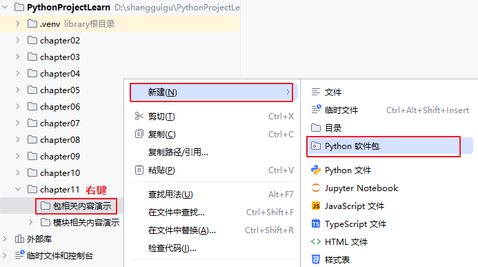


（1）创建模块circle.py

```python
"""circle.py"""

PI = 3.1415926

def area(radius):
    return PI * radius * radius

def perimeter(radius):
    return 2 * PI * radius

```

（2）创建模块rectangle.py

```python
"""rectangle.py"""

def area(width, height):
    return width * height

def perimeter(width, height):
    return 2 * (width + height)

```

#### 2、创建mymath包及其模块

（1）basic_arithmetic.py

```python
def add(a,b):
    return a+b

def subtract(a,b):
    return a-b

def multiply(a,b):
    return a*b

def divide(a,b):
    return a/b

def remainder(a,b):
    return a%b
```

（2）advance_calculate.py

```python
def my_power(a,b):
    return a ** b

def my_sqrt(a):
    return a ** 0.5
```

#### 3、创建主运行文件

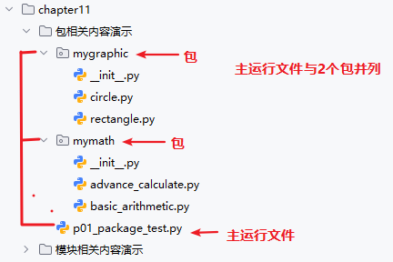


### 11.3.4 导入包的模块

#### 1、import包

语法格式：

```python
import 包名
import 包名.子包名 
```

如果最后一项是包，那么必须在被导入包的`__init__.py`文件中，指定导入包中的哪些模块。这是python导包的一个优化机制，避免导入过多模块。并且在`__init__.py`中指定导入模块的时候，建议使用相对路径。例如：

```python
from . import basic_arithmetic # . 代表当前目录，即当前__init__.py文件的路径下找模块文件
```

如果不加from . ，它会把导入的模块basic_arithmetic作为顶级模块，直接从sys.path中是找basic_arithmetic模块，而不是找mymath包下的basic_arithmetic模块。

```python
import basic_arithmetic # 如果不加from . ，就相当于直接从sys.path中是找basic_arithmetic模块（会报错）
```

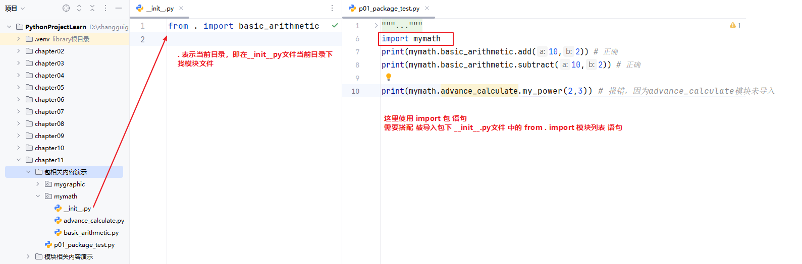

> 主运行文件p01_package_test.py的代码

```python
"""
# 演示导入包
"""
import mymath
print(mymath.basic_arithmetic.add(10,2)) # 正确，因为basic_arithmetic模块在mymath包的__init__.py文件中导入了
print(mymath.basic_arithmetic.subtract(10,2)) # 正确

# print(mymath.advance_calculate.my_power(2,3)) # 报错，因为advance_calculate模块未导入
```

#### 2、import包.模块/from包import模块

语法格式：

```python
import 包名.模块名 [as 别名]

# 或

from 包名 import 模块名 [as 别名]
```

> 主运行文件p02_package_test.py的代码
>

```python
# import mymath.advance_calculate as ma
from mymath import advance_calculate as ma

print(ma.my_power(2,3))
print(ma.my_sqrt(9))
```

#### 3、from包.模块import 成员

语法格式：

```python
from 包名.模块名 import 成员名 [as 别名]
```

> 主运行文件p03_package_test.py的代码
>

```python
from mymath.advance_calculate import my_power as mpo,my_sqrt as msq

print(mpo(2,3))
print(msq(9))
```

#### 4、`__all__`指定import*可导入模块

语法格式：

```python
from 包名.模块名 import *
```

当我们使用 from import * 时，Python并不会查找并导入包的所有子模块，因为这将花费很长的时间，并且可能会产生我们不想要的副作用。

唯一的解决办法是提供包的显式索引。如果包的 `__init__.py `中定义了` __all__`，运行 from import * 时，它就是被导入的模块名列表。

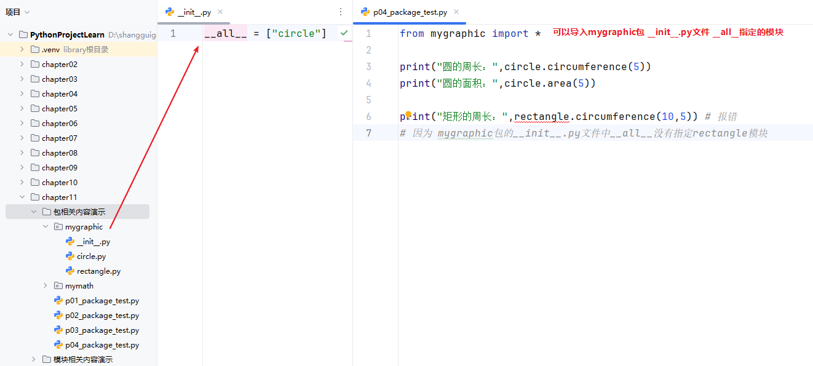

> mygraphic包`__init__.py`中`__all__`定义如下：

```python
__all__ = ["circle"]
```

> 主运行文件p04_package_test.py的代码
>

```py
from mygraphic import *

print("圆的周长：",circle.circumference(5))
print("圆的面积：",circle.area(5))

# print("矩形的周长：",rectangle.circumference(10,5)) # 报错
# 因为 mygraphic包的__init__.py文件中__all__没有指定rectangle模块
```

## 11.4 标准库

标准库指的是在安装Python时就一同被安装的库。这些库经过精心挑选和开发，旨在为Python开发者提供通用且强大的工具集，涵盖各种不同的应用领域。更多标准库可参考https://docs.python.org/zh-cn/3/library/index.html。

### 11.4.1 常用标准库

| **名称**            | **说明**                                                     |
| ------------------- | ------------------------------------------------------------ |
| **os**              | 多种操作系统接口。                                           |
| **sys**             | 系统相关的形参和函数。                                       |
| **time**            | 时间的访问和转换。                                           |
| **datetime**        | 提供了用于操作日期和时间的类。                               |
| **math**            | 数学函数。                                                   |
| **random**          | 生成伪随机数。                                               |
| **re**              | 正则表达式匹配操作。                                         |
| **json**            | JSON 编码器和解码器。                                        |
| **collections**     | 实现了一些专门化的容器，提供了对 Python 的通用内建容器 dict、list、set 和 tuple 的补充。 |
| **functools**       | 高阶函数，以及可调用对象上的操作                             |
| **hashlib**         | 安全哈希与消息摘要。                                         |
| **urllib**          | URL 处理模块。                                               |
| **smtplib**         | SMTP  协议客户端，邮件处理。                                 |
| **zlib**            | 与 gzip 兼容的压缩。                                         |
| **gzip**            | 对 gzip 文件的支持。                                         |
| **bz2**             | 对 bzip2 压缩算法的支持。                                    |
| **multiprocessing** | 基于进程的并行。                                             |
| **threading**       | 基于线程的并行。                                             |
| **copy**            | 浅层及深层拷贝操作。                                         |
| **socket**          | 低层级的网络接口。                                           |
| **shutil**          | 提供了一系列对文件和文件集合的高阶操作，特别是提供了一些支持文件拷贝和删除的函数。 |
| **glob**            | Unix 风格的路径名模式扩展。                                  |

### 14.4.2 日期时间库

> 示例

```python
from datetime import datetime

date1 = datetime(year=2026, month=1, day=1)
print("某一天", date1)

date2 = datetime.now()
print("今天：",date2)
print("获取年：", date2.year)
print("获取月份：",date2.month)
print("获取日期：",date2.day)
print("获取星期值：",date2.weekday())
print("获取星期单词",date2.strftime("%A"))
print("两个日期间隔：",date2 - date1)
str2 = date2.strftime("%Y年%m月%d日 %H:%M:%S")
print("日期转为字符串：", str2)

date3 = datetime.strptime("2026-05-01", "%Y-%m-%d")
print("字符串转为日期：" , date3)

time4 = datetime.timestamp(datetime.now())
print("日期转为时间戳：", time4)
```

常用格式指令：

| 格式指令 |          含义          |          示例          |
| :------: | :--------------------: | :--------------------: |
|   `%Y`   |        4 位年份        |          2026          |
|   `%y`   |   2 位年份（00-99）    |    26（对应 2026）     |
|   `%m`   |   2 位月份（01-12）    |       01（一月）       |
|   `%d`   |   2 位日期（01-31）    |           24           |
|   `%H`   | 24 小时制小时（00-23） |           10           |
|   `%I`   | 12 小时制小时（01-12） |       10（上午）       |
|   `%M`   |   2 位分钟（00-59）    |           30           |
|   `%S`   |   2 位秒数（00-59）    |           00           |
|   `%A`   |        星期全称        |        Saturday        |
|   `%a`   |        星期简称        |          Sat           |
|   `%b`   |        月份简称        |          Jan           |
|   `%B`   |        月份全称        |        January         |
|   `%p`   |  上午 / 下午（AM/PM）  | AM/PM（配合 % I 使用） |

## 11.5 引入第三方库

当需要使用Python中没有内置的库时，可以通过以下方式安装第三方库

### 11.5.1 pip命令方式

pip是Python包管理工具，该工具提供了对 Python 包的查找、下载、安装、卸载的功能。pip 默认的源是 Python Package Index（PyPI），其地址为 https://pypi.org/simple/，如果下载比较慢，还可以指定其它的源

- 阿里云：http://mirrors.aliyun.com/pypi/simple/
- 豆瓣：http://pypi.douban.com/simple/
- 清华大学：https://pypi.tuna.tsinghua.edu.cn/simple/

通过Windows命令行的方式安装，是将第三方包安装在本地python下，例如：D:\ProgramFiles\Python\Python312\Lib\site-packages

- 查看我们已经安装的软件包

```python
pip list
```

-  安装软件包：具体包名就什么可以到PyPI上查找

```python
pip install 包名  # 安装指定包
pip install 包名==版本号 # 安装指定版本
pip install --upgrade 包名 # 升级包到最新版本
pip install -r requirements.txt # 批量安装requirements.txt文件中列出的包
pip install --user 包名 # 安装到用户目录
```

- 卸载软件包

```python
pip uninstall 包名
```

- 临时使用其他源

```python
pip install -i http://mirrors.aliyun.com/pypi/simple/ 包名
```

- 永久修改源

```python
pip config set global.index-url http://mirrors.aliyun.com/pypi/simple/
```

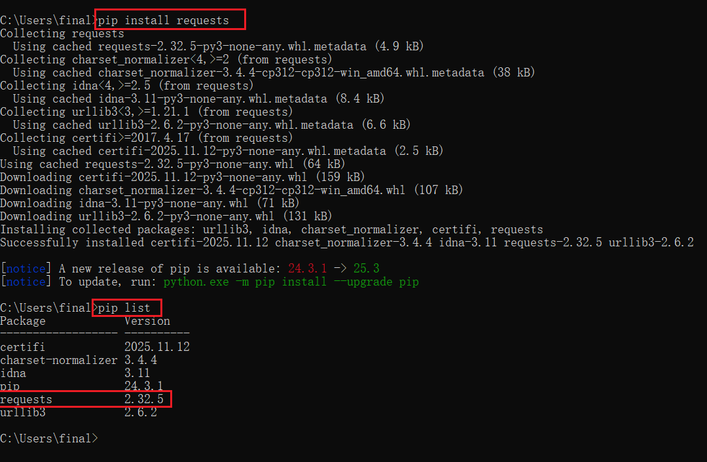

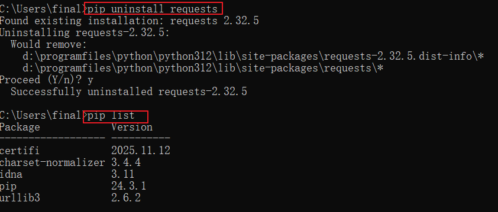

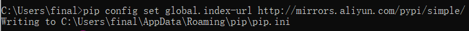

### 11.5.2 PyCharm方式

通过Pycharm安装，我们选择的解释器类型每个项目独立的，所以是将第三方包安装在当前项目环境下，例如：D:\shangguigu\PythonProject\.venv\Lib\site-packages

1）点击右下角的解释器设置

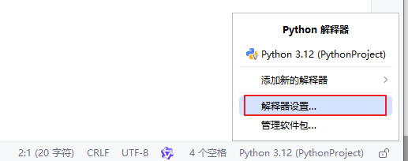

2）点击+

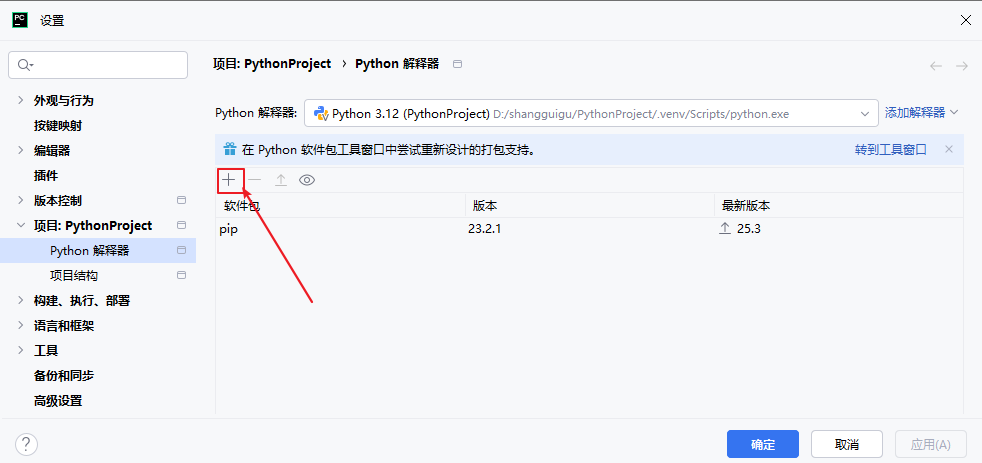

3）搜索包并安装

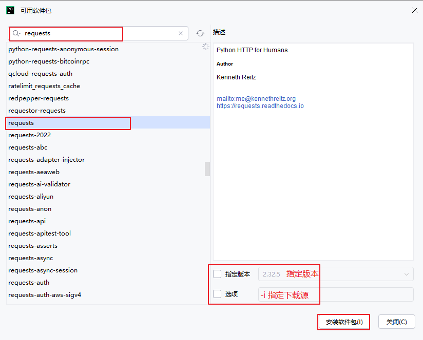

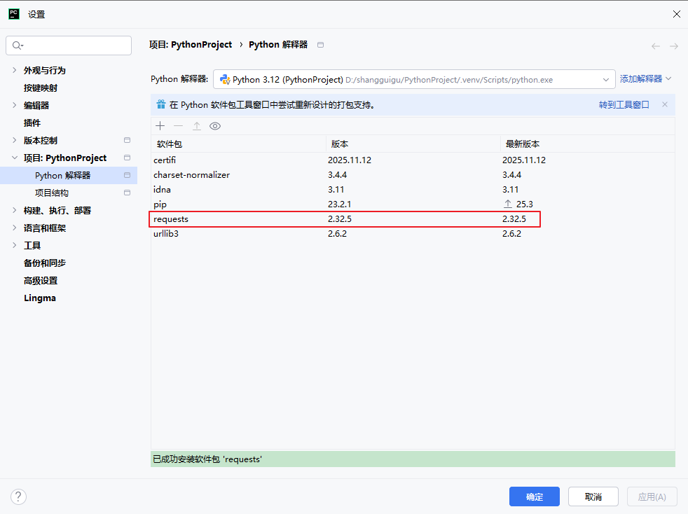

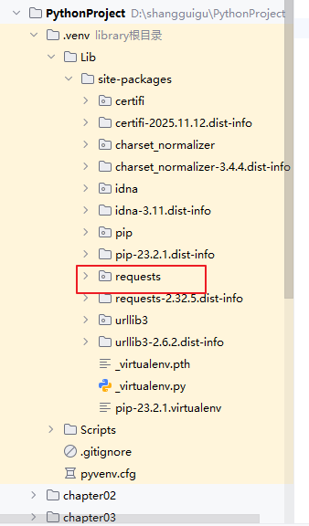

## 11.6 打包自己的库

### 11.6.1 先安装setuptools 库

如果不安装setuptools库，后续打包时可能会遇到报错 ModuleNotFoundError: No module named 'distutils'，所以可以提前安装 setuptools 库。在命令提示符中执行如下命令：

```python
pip install setuptools
```

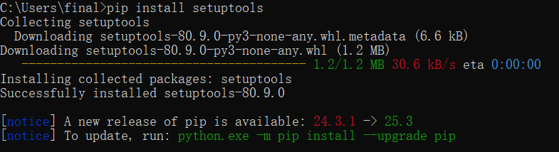

### 11.6.2 编写setup.py文件

🔴在包外创建一个 setup.py 文件

#### 1、打包多个完全独立的包

```python
from setuptools import setup

# 打包第一个独立包
def package1():
    setup(
        name="atguigu_graphic", # 打包后的包名称，必须唯一
        version="0.1.0",        # 版本说明
        packages=["mygraphic"],  # 手动指定第一个包的目录
        python_requires=">=3.7", # python版本要求
    )

# 打包第二个独立包
def package2():
    setup(
        name="atguigu_math",
        version="0.1.0",
        packages=["mymath"],  # 手动指定第二个包的目录
        python_requires=">=3.7",
    )

if __name__ == "__main__":
    # 依次执行两个包的打包
    package1()
    package2()
```


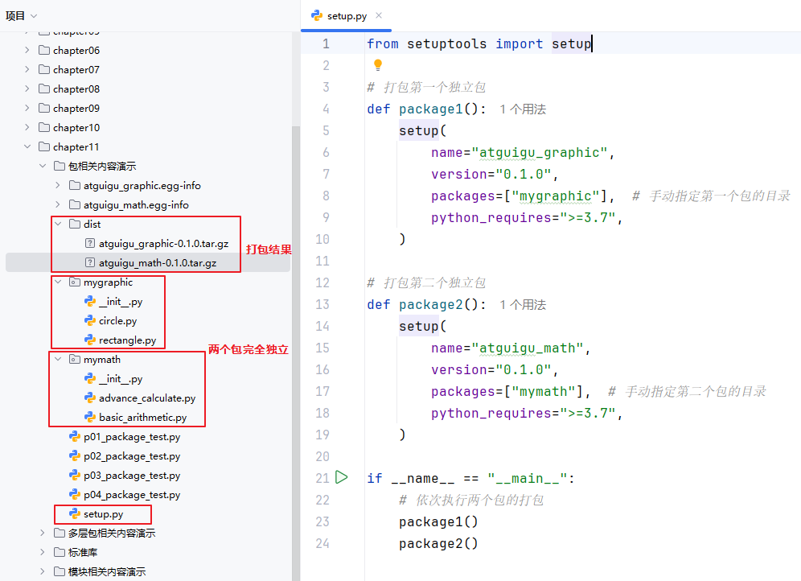

#### 2、总包下含多个子包

```python
from setuptools import setup, find_packages

setup(
    name="atguigu",  # 打包后的包名称，必须唯一
    version="0.1.0", # 版本号
    packages=find_packages(),  # 自动识别主包下的所有子包
    python_requires=">=3.7", # 指定python版本
)
```

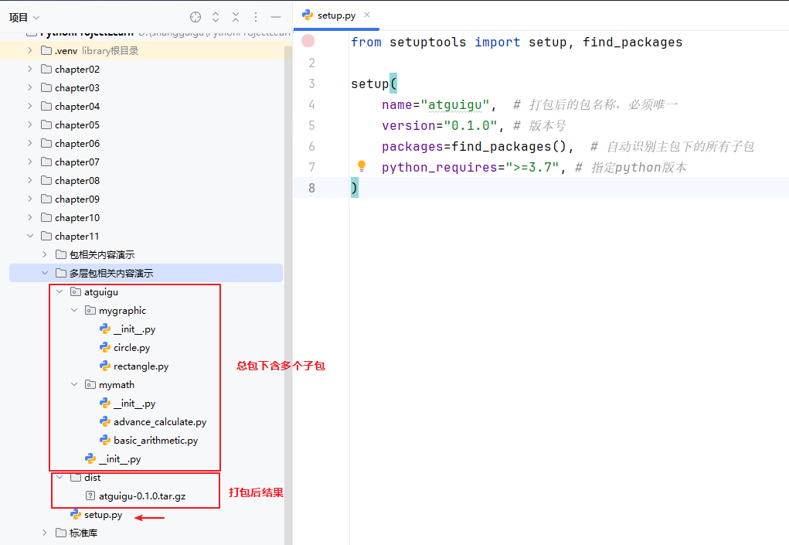


### 11.6.3 命令行方式打包

在 setup.py 同级目录下进行构建

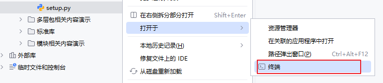

#### 1、build构建

```python
python setup.py build
```

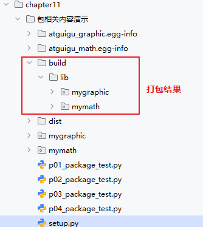


#### 2、sdist构建为压缩包

```python
python setup.py sdist
```

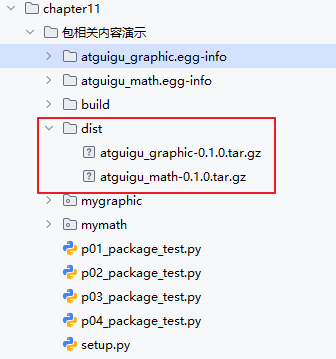


### 11.6.4 安装自己打包的库

#### 1、命令行方式

命令行方式：以你自己打包的库的路径和压缩包名为准

```python
pip install graphic-1.0.tar.gz存储的路径名
```

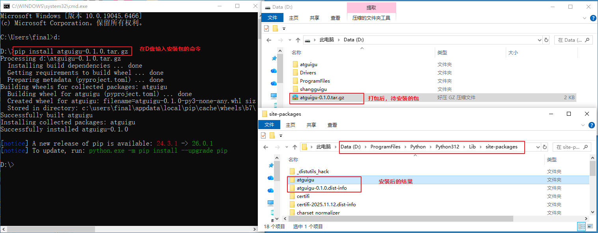


#### 2、PyCharm安装方式

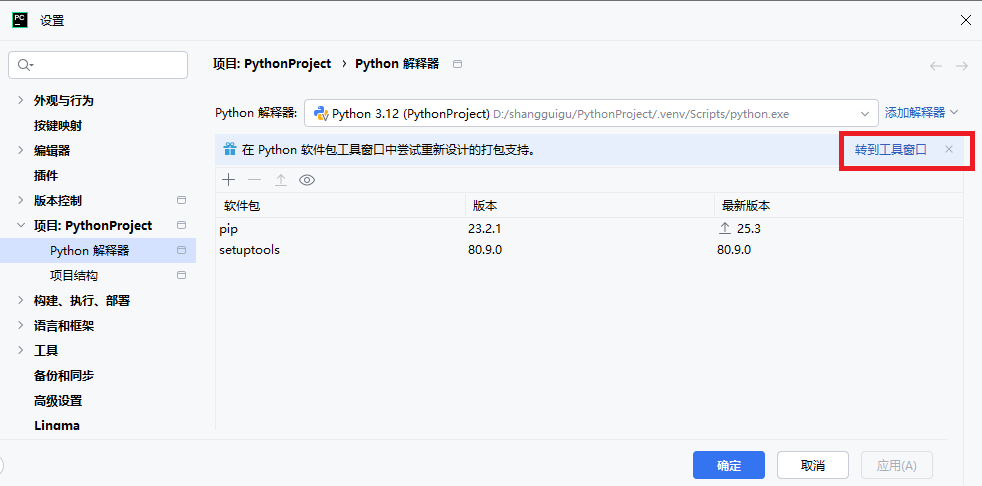

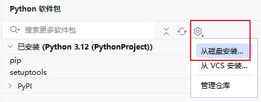

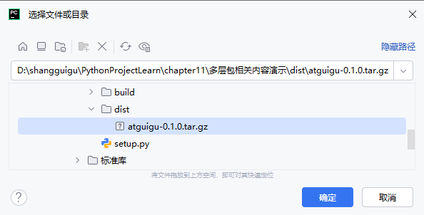

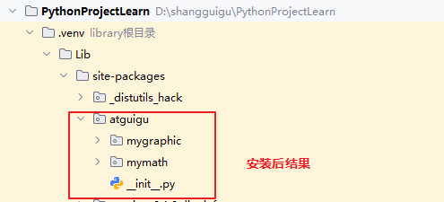

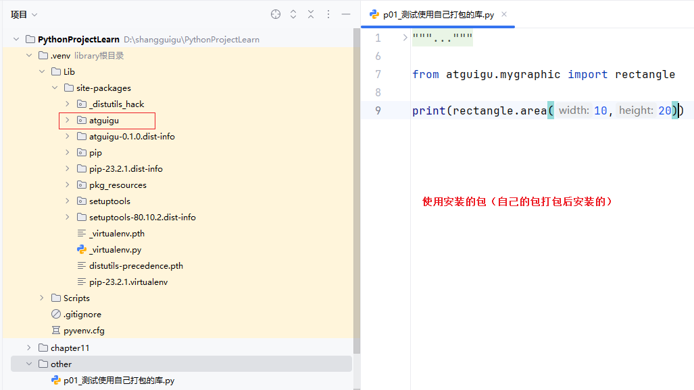
