并发编程

# 1. J.U.C

# 1.1 线程池

# 1.1.1 线程回顾

# 1）回顾线程创建方式

- 继承Thread

- 实现Runnable

# 2）线程的状态

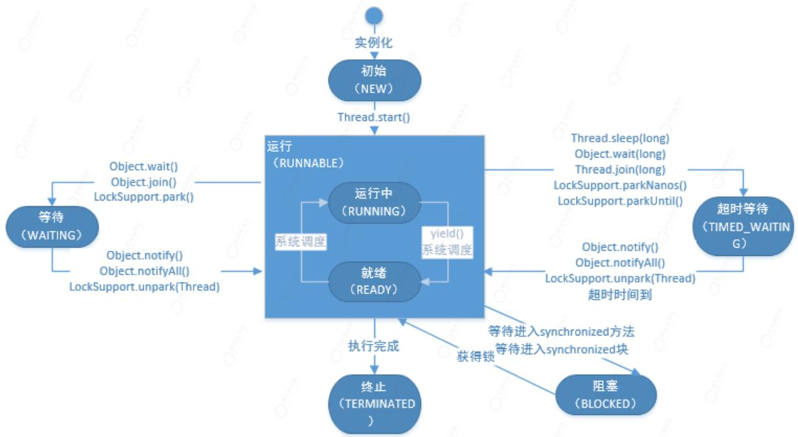

- NEW：刚刚创建，没做任何操作

```
Thread thread = new Thread();
System.out.println(thread.getState()); 
```

- RUNNABLE：调用run，可以执行，但不代表一定在执行（RUNNING,READY）

```
thread.start();
System.out.println(thread.getState()); 
```

- BLOCKED：抢不到锁

```
final byte[] lock = new byte[0];
new Thread(new Runnable() {
    public void run() { 
synchronized (lock){
    try {
    Thread.sleep(3000);
    } catch (InterruptedException e) {
    e.printStackTrace();
    }
    }
}).start();
Thread thread2 = new Thread(new Runnable() {
    public void run() {
    synchronized (lock) {
    }
    }
});
thread2.start();
Thread.sleep(1000);
System.out.println(thread2.getState()); 
```

- WAITING

```
Thread thread2 = new Thread(new Runnable() {
    public void run() {
    LockSupport.park();
    }
});

thread2.start();
Thread.sleep(500);
System.out.println(thread2.getState());
LockSupport.unpark(thread2);
Thread.sleep(500);
System.out.println(thread2.getState()); 
```

- TIMED_WAITING

```
Thread thread3 = new Thread(new Runnable() {
    public void run() {
    try {
    Thread.sleep(10000);
    } catch (InterruptedException e) {
    e.printStackTrace();
    }
    }
});
thread3.start();
Thread.sleep(500);
System.out.println(thread3.getState()); 
```

- TERMINATED

//等待1s后再来看

Thread.sleep(1000);

System.out.println(thread.getState());

# 3）线程池

根据上面的状态，普通线程执行完，就会进入TERMINATED销毁掉，而线程池就是创建一个缓冲池存放线程，执行结束以后，该线程并不会死亡，而是再次返回线程池中成为空闲状态，等候下次任务来临，这使得线程池比手动创建线程有着更多的优势：

- 降低系统资源消耗，通过重用已存在的线程，降低线程创建和销毁造成的消耗；

- 提高系统响应速度，当有任务到达时，通过复用已存在的线程，无需等待新线程的创建便能立即执行；

- 方便线程并发数的管控。因为线程若是无限制的创建，可能会导致内存占用过多而产生OOM

- 节省cpu切换线程的时间成本（需要保持当前执行线程的现场，并恢复要执行线程的现场）。

- 提供更强大的功能，延时定时线程池。（Timer vs ScheduledThreadPoolExecutor）

4）线程池体系（查看：ScheduledThreadPoolExecutor，ForkJoinPool类图）

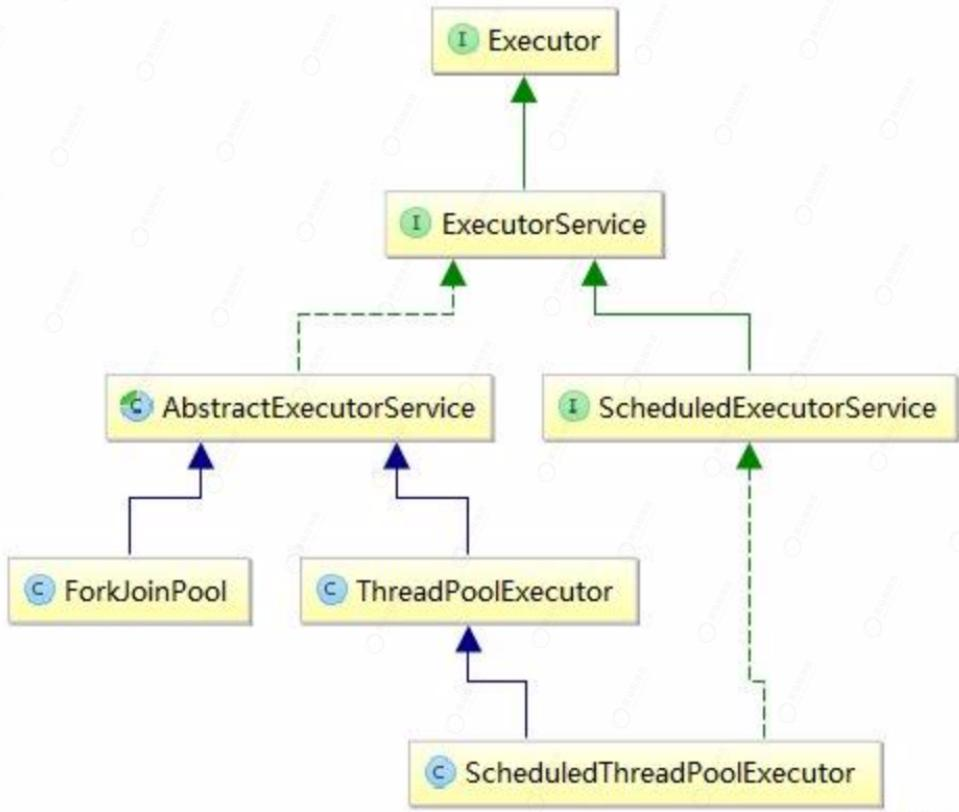

# 说明：

- 最常用的是ThreadPoolExecutor

- 调度用ScheduledThreadPoolExecutor

- 任务拆分合并用ForkJoinPool

- Executors是工具类，协助你创建线程池的

# 1.1.2 核心参数

Java 提供的线程池相关的工具类中，最核心的是 ThreadPoolExecutor，我们首先来看它的类体系及构造

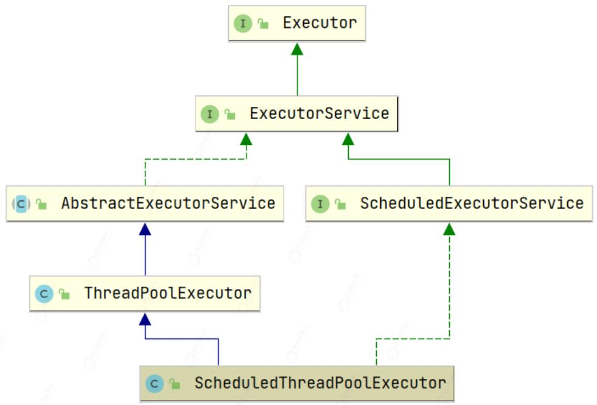

核心构造：

```
public class ThreadPoolExecutor extends AbstractExecutorService {
private static final RejectedExecutionHandler defaultHandler = new AbortPolicy(); 
```

//核心的构造函数，其他构造函数都是调用该构造函数

```
public ThreadPoolExecutor(int corePoolSize,
    int maximumPoolSize,
    long keepAliveTime,
    TimeUnit unit,
    BlockingQueue<Runnable> workQueue,
    ThreadFactory threadFactory,
    RejectedExecutionHandler handler) {
    if (corePoolSize < 0 ||
    maximumPoolSize <= 0 ||
    maximumPoolSize < corePoolSize ||
    keepAliveTime < 0)
    throw new IllegalArgumentException();
    if (workQueue == null || threadFactory == null || handler == null)
    throw new NullPointerException();
    this.corePoolSize = corePoolSize;
    this.maximumPoolSize = maximumPoolSize;
    this.workQueue = workQueue;
    this.keepAliveTime = unit.toNanos(keepAliveTime);
    this.threadFactory = threadFactory;
    this.handler = handler;
    }
} 
```

线程池核心参数介绍：

| 参数名                           | 作用                                       |
| -------------------------------- | ------------------------------------------ |
| corePoolSize                     | 核心线程池基本大小,核心线程数              |
| maximumPoolSize                  | 线程池最大线程数                           |
| keepAliveTime                    | 线程空闲后的存活时间                       |
| TimeUnit unit                    | 线程空闲后的存活时间单位                   |
| BlockingQueue workQueue          | 存放任务的阻塞队列                         |
| ThreadFactory threadFactory      | 创建线程的工厂                             |
| RejectedExecutionHandler handler | 当阻塞队列和最大线程池都满了之后的饱和策略 |

# - corePoolSize：核心线程数量

1: 线程池刚创建时，线程数量为0，当每次执行execute添加新的任务时会在线程池创建一个新的线程，直到线程数量达到corePoolSize为止。

2：核心线程会一直存活，即使没有任务需要执行，当线程数小于核心线程数时，即使有线程空闲，线程池也会优先创建新线程处理

3: 设置 allowCoreThreadTimeout=true（默认false）时，核心线程超时会关闭

# - workQueue: 阻塞队列

1：当线程池正在运行的线程数量已经达到 corePoolSize，那么再通过 execute 添加新的任务则会被加 workQueue 队列中，在队列中排队等待执行，而不会立即执行。

一般来说，这里的阻塞队列有以下几种选择：

ArrayBlockingQueue, LinkedBlockingQueue, SynchronousQueue;

# • maximumPoolSize: 最大线程数

1：当池中的线程数  > = corePoolSize，且任务队列已满时。线程池会创建新线程来处理任务

2：当池中的线程数 = maximumPoolSize，且任务队列已满时，线程池会拒绝处理任务而抛出异常

# - keepAliveTime：线程空闲时间

1: 当线程空闲时间达到 keepAliveTime 时，线程会退出，直到线程数量 = corePoolSize

2: 如果 allowCoreThreadTimeout=true，则会直到线程数量=0

- threadFactory：线程工厂，主要用来创建线程

- rejectedExecutionHandler：任务拒绝处理器，两种情况会拒绝处理任务

1：当线程数已经达到maxPoolSize，且队列已满，会拒绝新任务

2：当线程池被调用 shutdown() 后，会等待线程池里的任务执行完毕，再 shutdown。如果在调用 shutdown() 和线程池真正 shutdown 之间提交任务，会拒绝新任务

3: 当拒绝处理任务时线程池会调用rejectedExecutionHandler来处理这个任务。如果没有设置默认是AbortPolicy，另外在ThreadPoolExecutor类有几个内部实现类来处理这类情况

ThreadPoolExecutor.AbortPolicy：丢弃任务并抛出RejectedExecutionException异常。

ThreadPoolExecutor.CallerRunsPolicy：由调用线程处理该任务

ThreadPoolExecutor.DiscardPolicy：也是丢弃任务，但是不抛出异常

ThreadPoolExecutor.DiscardOldestPolicy：丢弃队列最前面的任务，然后重新尝试执行任务（重复此过程）

# 1.1.3 源码剖析

# execute详解

ThreadPoolExecutor 的最基本使用方式就是通过 execute 方法提交一个 Runnable 任务，首先看图理解 execute 的执行逻辑

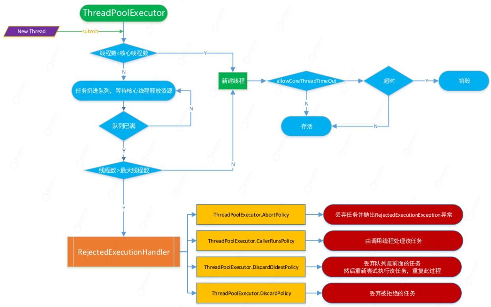

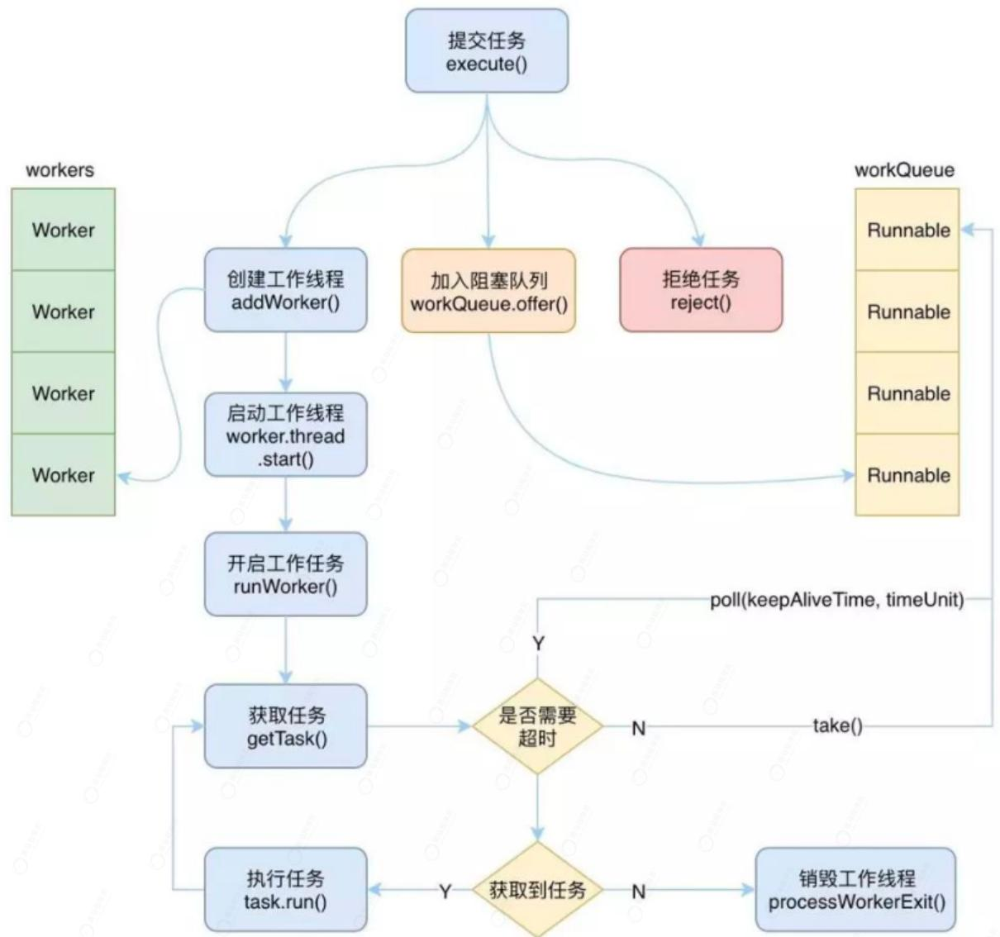

//任务提交阶段：Proceed in 3 steps: 3步走

```
public void execute(Runnable command) {
    if (command == null)
    throw new NullPointerException();
    int c = ctl.get();
    //判断工作数，如果小于coreSize，addWork，注意第二个参数core=true
    if (workerCountOf(c) < corePoolSize) {
    if (addWorker(command, true))
    return;
    c = ctl.get();
    }
    //否则，如果线程池还在运行，offer到队列
    if (isRunning(c) && workQueue.offer(command)) {
    //再检查一下状态
    int recheck = ctl.get();
    //如果线程池已经终止，直接移除任务，不再响应
    if (!isRunning(recheck) && remove(command))
    reject(command);
    //否则，如果没有可用线程的话（比如coreSize=0），创建一个空work
    //该work创建时不会给指派任务（为null），但是会被放入works集合，进而从队列获取任务去执行
    else if (workerCountOf(recheck) == 0)
addworker(null, false);
}
//队列也满，继续调addwork，但是注意，core=false，开启到maxSize的大门
//超出max的话，addwork会返回false，进入reject
else if (!addworker(command, false))
    reject(command);
}
```

//线程创建

```
private boolean addworker(Runnable firstTask, boolean core) {
    //第一步，计数判断，不符合条件打回false
    retry:
    for (;;) {
    int c = ctl.get();
    int rs = runStateOf(c);

    // Check if queue empty only if necessary.

    for (;;) {
    int wc = workerCountOf(c);
    //判断线程数，注意这里！
    //也就说明线程池的线程数是不可能设置任意大的。
    //最大29位（CAPACITY=29位二进制）
    //超出规定范围，返回false，表示不允许再开启新工作线程，创建worker失败！
    if (wc >= CAPACITY || wc >= (core ? corePoolSize : maximumPoolSize)) return false;
    if (compareAndIncrementWorkerCount(c)) break retry;
    c = ctl.get(); // Re-read ctl
    if (runStateOf(c) != rs) continue retry;
    // else CAS failed due to workerCount change; retry inner loop }
    }
    //第二步，创建新work放入线程集合works（一个HashSet）
    boolean workerStarted = false;
    boolean workerAdded = false;
    worker w = null;
    try {
    //符合条件，创建新的work并包装task
    w = new Worker(firstTask);
    final Thread t = w.thread;
    if (t != null) {
    final ReentrantLock mainLock = this.mainLock;
    //加锁，workers是一个hashset，这里要保障线程安全性
    mainLock.lock();
    try {
    //...
    //在这里！！！
    workers.add(w);

    //...
    workerAdded = true;
    }
}
} finally {
    mainLock.unlock();
}
if (workerAdded) {
    //注意，只要是成功add了新的work，那么将该新work立即启动，任务得到执行
    t.start();
    workerStarted = true;
}
}
} finally {
    if (! workerStarted)
    addWorkerFailed(w);
}
return workerStarted;
```

//任务获取与执行

//在worker执行runWorker()的时候，不停循环，先查看自己有没有携带Task，如果有，执行

```
while (task != null || (task = getTask()) != null) 
```

//如果没用，会调用getTask，从队列获取任务

```
private Runnable getTask() {
    boolean timedOut = false; // Did the last poll() time out?

    for (;;) {
    int c = ctl.get();
    int rs = runStateOf(c);

    // ...

    int wc = workerCountOf(c);

    // Are workers subject to culling? - 很形象，要不要乖乖的被“捕杀”？
    //判断是不是要超时处理，重点！！！决定了当前线程要不要被释放
    boolean timed = allowCoreThreadTimeOut || wc > corePoolSize;
    //线程数超出max，并且上次循环中poll等待超时了，那么说明该线程已终止
    //将线程队列数量原子性减
    if ((wc > maximumPoolSize || (timed && timedOut))
    && (wc > 1 || workQueue.isEmpty())) {
    //计数器做原子递减，递减成功后，返回null，for被中止
    if (compareAndDecrementWorkerCount(c))
    return null;
    //递减失败，继续下一轮循环，直到成功
    continue;
    }

    try {
    //重点！！！
    //如果线程可被释放，那就poll，释放的时间为：keepAliveTime
    //否则，线程是不会被释放的，take一直被阻塞在这里，直到来了新任务继续工作
    Runnable r = timed ?
    workQueue.poll(keepAliveTime, TimeUnit.NANOSECONDS) :
workQueue.take();
if (r != null)
    return r;
    //到这里说明可被释放的线程等待超时，已经销毁，设置该标记，下次循环将线程数减少
    timedOut = true;
} catch (InterruptedException retry) {
    timedOut = false;
}
}
```

# 1.1.4 Executors

以上构造函数比较多，为了方便使用，juc提供了一个Executors工具类，内部提供静态方法

1. newCachedThreadPool(): 弹性线程数

1. newFixedThreadPool(int nThreads): 固定线程数

1. newSingleThreadExecutor(): 单一线程数

1. newScheduledThreadPool(int corePoolSize)：可调度，常用于定时

# 1.1.5 经典面试

1）线程池是如何保证线程不被销毁的呢？

答案：如果队列中没有任务时，核心线程会一直阻塞在获取任务的方法，直到返回任务。而任务执行完后，又会进入下一轮 work.runWork() 中循环

验证：秘密就藏在核心源码里 ThreadPoolExecutor.getTask()

```
//work.runWork():
while (task != null || (task = getTask()) != null)
//work.getTask():
boolean timed = allowCoreThreadTimeOut || wc > corePoolSize;
Runnable r = timed ?
    workQueue.poll(keepAliveTime, TimeUnit.NANOSECONDS) :
    workQueue.take(); 
```

2）那么线程池中的线程会处于什么状态？

答案：RUNNABLE, WAITING

验证：起一个线程池，放置一个任务sleep，debug查看结束前后的状态

```
//debug add watcher:
((ThreadPoolExecutor) poolExecutor).workers.iterator().next().thread.getState() 
ThreadPoolExecutor poolExecutor = Executors.newFixedThreadPool(1);
poolExecutor.execute(new Runnable() {
    public void run() {
    try {
    Thread.sleep(5000);
    } catch (InterruptedException e) {
    e.printStackTrace();
    }
    }
});
System.out.println("ok"); 
```

3）核心线程与非核心线程有区别吗？

答案：没有。被销毁的线程和创建的先后无关。即便是第一个被创建的核心线程，仍然有可能被销毁验证：看源码，每个work在runWork()的时候去getTask()，在getTask内部，并没有针对性的区分当前work是否是核心线程或者类似的标记。只要判断works数量超出core，就会调用poll()，否则take()

# 1.2 Fork/Join

# 1.2.1 概念

ForkJoinPool是由JDK1.7后提供多线程并行执行任务的框架。可以理解为一种特殊的线程池。

1. 任务分割：Fork（分岔），先把大的任务分割成足够小的子任务，如果子任务比较大的话还要对子任务进行继续分割。

1. 合并结果：join，分割后的子任务被多个线程执行后，再合并结果，得到最终的完整输出。

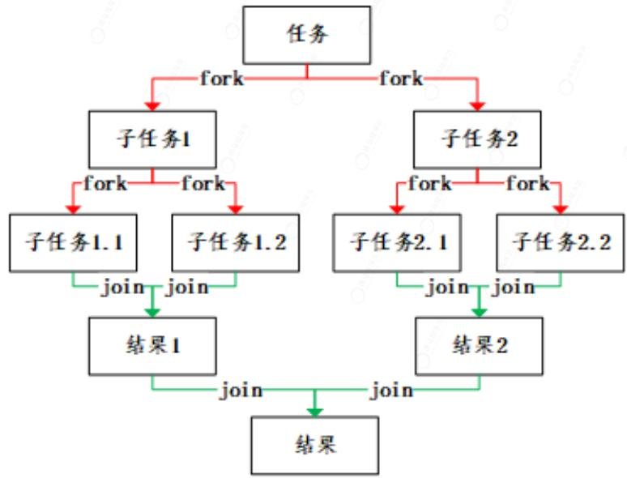

# 1.2.2 组成

- ForkJoinTask：主要提供fork和join两个方法用于任务拆分与合并；一般用子类RecursiveAction（无返回值的任务）和RecursiveTask（需要返回值）来实现compute方法。

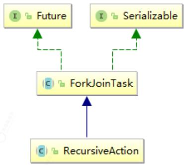

- ForkJoinPool：调度ForkJoinTask的线程池；

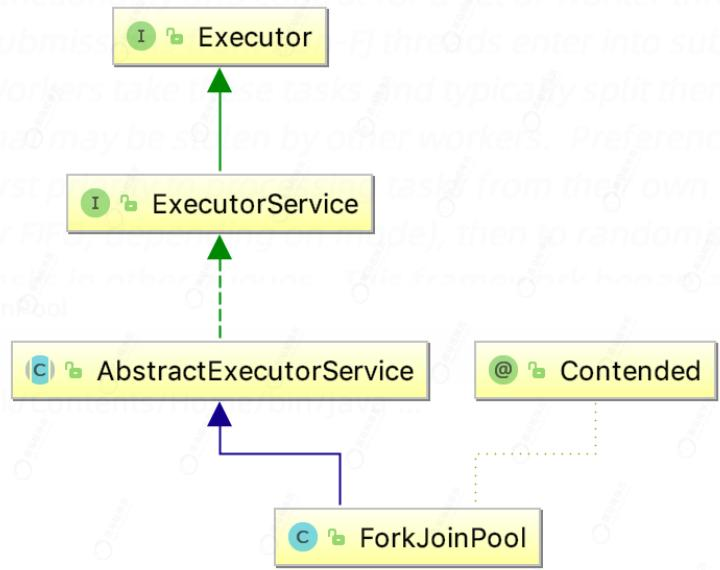

- ForkJoinWorkerThread: Thread的子类，存放于线程池中的工作线程（Worker）；

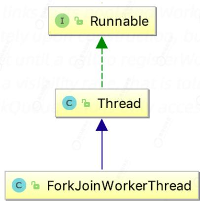

- WorkQueue：任务队列，用于保存任务；

# 1.2.3 基本使用

一个典型的例子：计算1-1000的和

```
package com.itheima.thread;
import java.util.concurrent.*; 
public class SumTask {

    private static final Integer MAX = 100;

    static class SubTask extends RecursiveTask<Integer> {
    // 子任务开始计算的值
    private Integer start;

    // 子任务结束计算的值
    private Integer end;

    public SubTask(Integer start, Integer end) {
    this.start = start;
    this.end = end;
    }

    @Override
    protected Integer compute() {
    if (end - start < MAX) {
    // 小于边界，开始计算
    System.out.println("start = " + start + "; end = " + end);
    Integer totalValue = 0;
    for (int index = this.start ; index <= this.end ; index++) {
    totalValue += index;
    }
    return totalValue;
    } else {
    // 否则，中间劈开继续拆分
    SubTask subTask1 = new SubTask(start, (start + end) / 2);
    subTask1.fork();
    SubTask subTask2 = new SubTask((start + end) / 2 + 1 , end);
    subTask2.fork();
    return subTask1.join() + subTask2.join();
    }
    }
    }

    public static void main(String[] args) {
    ForkJoinPool pool = new ForkJoinPool();
    Future<Integer> taskFuture = pool.submit(new SubTask(1, 1000));
    try {
    Integer result = taskFuture.get();
    System.out.println("result = " + result);
    } catch (InterruptedException | ExecutionException e) {
    e.printStackTrace(System.out);
    }
    }
}
```

# 1.2.4 设计思想

- 普通线程池内部有两个重要集合：工作线程集合（普通线程），和任务队列。

- ForkJoinPool也类似，线程集合里放的是特殊线程ForkJoinWorkerThread，任务队列里放的是特殊任务ForkJoinTask

- 不同之处在于，普通线程池只有一个队列。而ForkJoinPool的工作线程ForkJoinWorkerThread每个线程内都绑定一个双端队列。

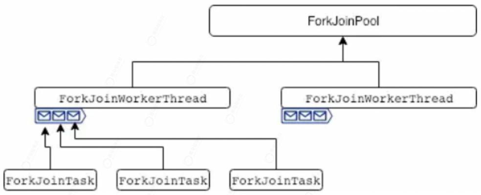

- 在fork的时候，也就是任务拆分，将拆分的task会被当前线程放到自己的队列中。

- 如果有任务，那么线程优先从自己的队列里取任务执行，以LIFO先进后出方式从队尾获取任务，

- 当自己队列中执行完后，工作线程会跑到其他队列以 work-stealing 窃取,窃取方式为 FIFO 先进先出，减少竞争。

# 1.2.5 注意点

使用ForkJoin将相同的计算任务通过多线程执行。但是在使用中需要注意：

- 注意任务切分的粒度，也就是fork的界限。并非越小越好

- 判断要不要使用ForkJoin。任务量不是太大的话，串行可能优于并行。因为多线程会涉及到上下文的切换

# 1.3 原子操作

# 1.3.1 概念

原子（atom）本意是“不能被进一步分割的最小粒子”，而原子操作（atomic operation）意为“不可被中断的一个或一系列操作”。

# 1.3.2 CAS

CAS（Compare-and-Swap/Exchange），即比较并替换，是一种实现并发常用到的技术。CAS的整体架构如下：

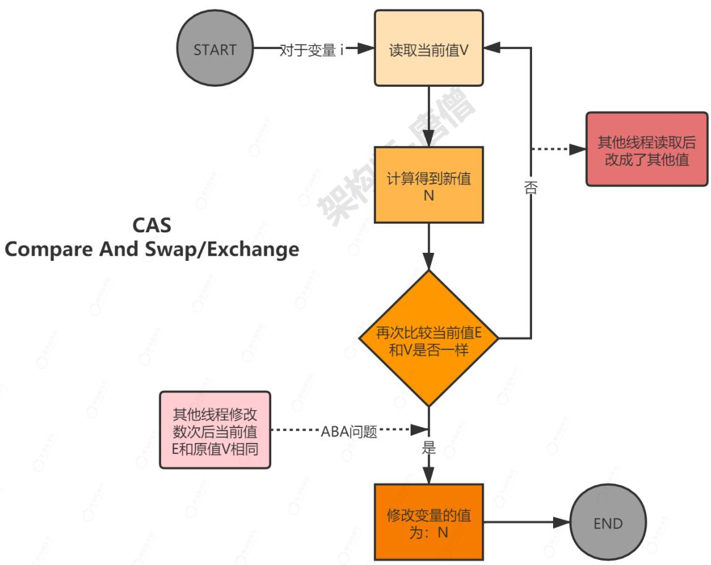

CAS

juc中提供了Atomic开头的类，基于cas实现原子性操作，最基本的应用就是计数器

```
package com.itheima;

import java.util.concurrent.atomic.AtomicInteger;

public class AtomicCounter {

    private static AtomicInteger i = new AtomicInteger(0);
    public int get() {
    return i.get();
    }

    public void inc() {
    i.incrementAndGet();
    }

    public static void main(String[] args) throws InterruptedException {
    final AtomicCounter counter = new AtomicCounter();
    for (int i = 0; i < 10; i++) {
    new Thread(new Runnable() {
    public void run() {
    counter.inc();
    }
    }
} 
}).start();   
} Thread.sleep(3000); //可以正确输出10 System.out.println(counter.i.get());   
}
```

注：AtomicInteger源码。基于unsafe类cas思想实现，性能篇会讲到

CAS虽然很高效的解决了原子操作问题，但是CAS仍然存在三大问题。

1. 自旋(循环)时间长开销很大，如果CAS失败，会一直进行尝试。如果CAS长时间一直不成功，可能会给CPU带来很大的开销，注意这里的自旋是在用户态/SDK层面实现的。

1. 只能保证一个共享变量的原子操作，对多个共享变量操作时，循环CAS就无法保证操作的原子性，这个时候就可以用锁来保证原子性。

1. ABA问题，在使用CAS前要考虑清楚“ABA”问题是否会影响程序并发的正确性，如果需要解决ABA问题，改用传统的互斥同步可能会比CAS更高效。

# 1.3.3 atomic

上面展示了AtomicInteger，关于atomic包，还有很多其他类型：

- 基本类型

- AtomicBoolean：以原子更新的方式更新boolean；

- AtomicInteger：以原子更新的方式更新Integer;

- AtomicLong：以原子更新的方式更新Long；

- 引用类型

- AtomicReference：原子更新引用类型

- AtomicReferenceFieldUpdater：原子更新引用类型的字段

- AtomicMarkableReference：原子更新带有标志位的引用类型

- 数组

- AtomicIntegerArray：原子更新整型数组里的元素。

- AtomicLongArray：原子更新长整型数组里的元素。

- AtomicReferenceArray：原子更新引用类型数组里的元素。

- 字段

- AtomicIntegerFieldUpdater：原子更新整型的字段的更新器。

- AtomicLongFieldUpdater：原子更新长整型字段的更新器。

- AtomicStampedReference：原子更新带有版本号的引用类型。

# 1.3.4 注意!

使用atomic要注意原子性的边界，把握不好会起不到应有的效果，原子性被破坏。

案例：原子性被破坏现象

```
package com.itheima; 
import java.util.concurrent.atomic.AtomicInteger;

public class BadAtomic {
    AtomicInteger i = new AtomicInteger(0);
    static int j=0;

    public void badInc(){
    int k = i.incrementAndGet();
    try {
    Thread.sleep(new Random().nextInt(100));
    } catch (InterruptedException e) {
    e.printStackTrace();
    }
    j=k;
    }

    public static void main(String[] args) throws InterruptedException {
    BadAtomic atomic = new BadAtomic();
    for (int i = 0; i < 10; i++) {
    new Thread(() -> {
    atomic.badInc();
    }).start();
    }
    Thread.sleep(3000);
    System.out.println(atomic.j);
    }
} 
```

# 结果分析：

- 每次都不一样，总之不是10

- i是原子性的，没问题。但是再赋值，变成了两部操作，原子性被打破

- 在badInc上加synchronized，问题解决

# 1.4 AQS

# 1.4.1、前言

如果要想真正的理解 JUC 下的并发工具的实现原理，我们必须要来学习 AQS，因为它是 JUC 下很多类的基石。

在讲解AQS之前，如果老板让你自己写一个SDK层面的锁，给其他同事去使用，你会如何写呢？

1、搞一个状态标记，用来表示持有或未持有锁，但得是 volatile 类型的保证线程可见性。

2、编写一个 lock，unlock 函数用于抢锁和释放锁，就是对状态标记的修改操作

3、lock 函数要保证并发下只能有一个线程能抢到锁，其他线程要等待获取锁（阻塞式），可以采用 CAS+自旋的方式实现

初步实现如下:

```
public class MyLock { 
// 定义一个状态变量status: 为1表示锁被持有，为0表示锁未被持有
private volatile int status;

private static final Unsafe unsafe = reflectGetUnsafe();
private static final long valueOffset;

static {
    try {
    valueOffset = unsafe.objectFieldOffset
    (MyLock.class.getDeclaredField("status"));
    } catch (Exception ex) { throw new Error(ex); }
}

private static Unsafe reflectGetUnsafe() {
    try {
    Field field = Unsafe.class.getDeclaredField("theUnsafe");
    field.setAccessible(true);
    return (Unsafe) field.get(null);
    } catch (Exception e) {
    e.printStackTrace();
    return null;
    }
}

/**
 * 阻塞式获取锁
 * @return
 */
public boolean lock() {
    while (!compareAndSet(0,1)) {
    }
    return true;
}

// cas 设置 status
public final boolean compareAndSet(int expect, int update) {
    return unsafe.compareAndSwapInt(this, valueOffset, expect, update);
}

/**
 * 释放锁
 */
public void unlock() {
    status = 0;
}
```

问题：获取不到锁自旋时，是空转，浪费CPU

1、使用 yield 让出 CPU 执行权，等待调度

```
public boolean lock() {
    while (!compareAndSet(0,1)) {
    Thread.yield(); // yield + 自旋，尽可能的防止CPU空转，让出CPU资源
    }
    return true;
}
```

或者可以采用线程休眠的方式，但是休眠时间不太好确定，太长太短都不好。

# 2、采用等待唤醒机制，但是这里由于没有使用 synchronized 关键字，所以也无法使用

wait/notify，但是我们可以使用 park/unpark，获取不到锁的线程 park 并且去队列排队，释放锁时从队列拿出一个线程 unpark

```
private static final Queue<Thread> QUEUE = new LinkedBlockingQueue<>();

public boolean lock() {
    while (!compareAndSet(0,1)) {
    QUEUE.offer(Thread.currentThread());
    LockSupport.park(); // 线程休眠
    }
    return true;
}

public void unlock() {
    status = 0;
    LockSupport.unpark(QUEU.poll());
}
```

# 1.4.2、AQS概述

AQS（AbstractQueuedSynchronizer）：抽象队列同步器，定义了一套多线程访问共享资源的同步器框架，提供了SDK层面的锁机制，JUC中的很多类譬如：

ReentrantLock/Semaphore/CountDownLatch......等都是基于它。

通过查阅作者的对于该类的文档注释可以得到如下核心信息：

1、AQS用一个 volatile int state; 属性表示锁状态，1表示锁被持有，0表示未被持有，具体的维护由子类去维护，但是提供了修改该属性的三个方法：getState()，setState(int nextState)，compareAndSetState(int expect, int update)，其中CAS方法是核心。

2、框架内部维护了一个FIFO的等待队列，是用双向链表实现的，我们称之为CLH队列，

3、框架也内部也实现了条件变量 Condition，用它来实现等待唤醒机制，并且支持多个条件变量

4、AQS支持两种资源共享的模式：独占模式（Exclusive）和共享模式（Share），所谓独占模式就是任意时刻只允许一个线程访问共享资源，譬如ReentrantLock；而共享模式指的就是允许多个线程同时访问共享资源，譬如Semaphore/CountDownLatch

5、使用者只需继承 AbstractQueuedSynchronizer 并重写指定的方法，在方法内完成对共享资源 state 的获取和释放，至于具体线程等待队列的维护，AQS已经在顶层实现好了，在那些 final 的模板方法里。

- To use this class as the basis of a synchronizer, redefine the 

```
* following methods, as applicable, by inspecting and/or modifying
* the synchronization state using {@link #getState}, {@link
* #setState} and/or {@link #compareAndSetState}:
*
* <ul>
* <li> {@link #tryAcquire}
* <li> {@link #tryRelease}
* <li> {@link #tryAcquireShared}
* <li> {@link #tryReleaseShared}
* <li> {@link #isHeldExclusively}
* </ul>
*
* Each of these methods by default throws {@link
* UnsupportedOperationException}. Implementations of these methods
* must be internally thread-safe, and should in general be short and
* not block. Defining these methods is the <em>only</em> supported
* means of using this class. All other methods are declared
* {@code final} because they cannot be independently varied. 
```

6、AQS底层使用了模板方法模式，给我们提供了许多模板方法，我们直接使用即可。

| API                                  | 说明                                                         |          |
| ------------------------------------ | ------------------------------------------------------------ | -------- |
| final void acquire(int arg)          | 独占模式获取锁,AQS顶层已实现,内部调用了tryAcquire            | 模板方法 |
| boolean tryAcquire(int arg)          | 独占模式尝试获取锁,AQS中未实现,由子类去实现,获取到锁返回true |          |
| final boolean release(int arg)       | 释放独占锁,AQS顶层已实现,内部调用了tryRelease                | 模板方法 |
| boolean tryRelease(int arg)          | 尝试释放独占锁,AQS中未实现,由子类去实现,成功释放返回true     |          |
| final void acquireShared(int arg)    | 共享模式获取锁,AQS顶层已实现,内部调用了tryAcquireShared      | 模板方法 |
| int tryAcquireShared(int arg)        | 尝试获取共享锁,返回负数表示失败,0表示成功,但没有剩余可用资源;正数表示成功,且有剩余资源,AQS中未实现,由子类实现 |          |
| final boolean releaseShared(int arg) | 释放共享锁,返回true代表释放成功,AQS中已实现,内部调用了tryReleaseShared | 模板方法 |
| boolean tryReleaseShared(int arg)    | 尝试释放锁,释放后允许唤醒后续等待结点返回true,否则返回false,AQS中未实现,需要由子类实现 |          |
| boolean isHeldExclusively()          | 共享资源是否被独占                                           |          |

# 1.4.3、基本使用

此时老板给你加了需求，要求你实现一个基于AQS的锁，那该怎么办呢？

在AbstractQueuedSynchronizer的类注释中给出了使用它的基本方法，我们按照它的写法尝试即可

```
/**
 * 基于 aqs实现锁
 */
public class MyLock implements Lock {
    //同步器
    private Syn syn = new Syn();
@Override
public void lock() {
    //调用模板方法
    syn.acquire(1);
}

@Override
public void unlock() {
    //调用模板方法
    syn.release(0);
}

// 其他接口方法暂时先不实现 省略

// 实现一个独占同步器
class Syn extends AbstractQueuedSynchronizer{
    @Override
    protected boolean tryAcquire(int arg) {
    if (compareAndSetState(0,arg)) {
    return true;
    }
    return false;
    }

    @Override
    protected boolean tryRelease(int arg) {
    setState(arg);
    return true;
    }
}

}
```

# 1.4.4、原理解析

自己实现的锁在使用过程中发现一个问题，就是有时候有的线程特别容易抢到锁，而有的线程老是抢不到锁，虽说线程们抢锁确实看命，但能不能加入一种设计，让各个线程机会均等些，起码不要出现某几个线程总是特倒霉抢不到锁的情况吧！

这其实就是涉及到锁是否是公平的，那么什么是公平锁什么是非公平锁呢？

这我们就不得不深入我们使用的模板方法中看一眼了

```
/**
 * Acquires in exclusive mode, ignoring interrupts. Implemented
 * by invoking at least once {@link #tryAcquire},
 * returning on success. Otherwise the thread is queued, possibly
 * repeatedly blocking and unblocking, invoking {@link
 * #tryAcquire} until success. This method can be used
 * to implement method {@link Lock#lock}.
 *
 * @param arg the acquire argument. This value is conveyed to 
*    {@link #tryAcquire} but is otherwise uninterpreted and
*    can represent anything you like.
*/
public final void acquire(int arg) {
    if (!tryAcquire(arg) &&
    acquireQueued(addWaiter(Node.EXCLUSIVE), arg))
    selfInterrupt();
}

//结合我自己写的尝试获取锁的方法
protected boolean tryAcquire(int arg) {
    if (compareAndSetState(0, arg)) {
    return true;
    }
    return false;
}
```

# 这里大概描述如下:

1、线程一来首先调用 tryAcquire，在 tryAcquire 中直接 CAS 获取锁，如果获取不成功通过 addWaiter 加入等待队列，然后走 acquireQueued 让队列中的某个等待线程去获取锁。

2、不公平就体现在这里，线程来了也不先看一下等待队列中是否有线程在等待，如果没有线程等待，那直接获取锁没什么问题，如果有线程等待就直接去获取锁不就相当于插队么？

那如何实现这种公平性呢？这就不得不探究一下AQS的内部的实现原理了，下面我们依次来看：

1、查看 AbstractQueuedSynchronizer 的类定义，虽然它里面代码很多，但重要的属性就那么几个，

```
public abstract class AbstractQueuedSynchronizer extends
AbstractOwnableSynchronizer
    implements java.io.Serializable {

    private volatile int state;
    private transient volatile Node head;
    private transient volatile Node tail;

    static final class Node {
    //其他不重要的略
    volatile int waitStatus;
    volatile Node prev;
    volatile Node next;
    volatile Thread thread;
    }

    public class ConditionObject implements Condition, java.io.Serializable {...}
}
```

结合前面讲的AQS的类文档注释不难猜到，内部类 Node 以及其类型的变量 head 和 tail 就表示 AQS 内部的一个等待队列，而剩下的 state 变量就用来表示锁的状态。

等待队列应该就是线程获取锁失败时，需要临时存放的一个地方，用来等待被唤醒并尝试获取锁。再看 Node 的属性我们知道，Node 存放了当前线程的指针 thread，也即可以表示当前线程并对其进行某些操作，prev 和 next 说明它构成了一个双向链表，也就是为某些需要得到前驱或后继节点的算法提供便利。

# 2、AQS加锁最核心的代码就是如下，我们要来探究它的实现原理

```
public final void acquire(int arg) {
    if (!tryAcquire(arg) &&
    acquireQueued(addWaiter(Node.EXCLUSIVE), arg))
    selfInterrupt();
} 
```

它的原理及整个过程我们以图的形式说明如下：

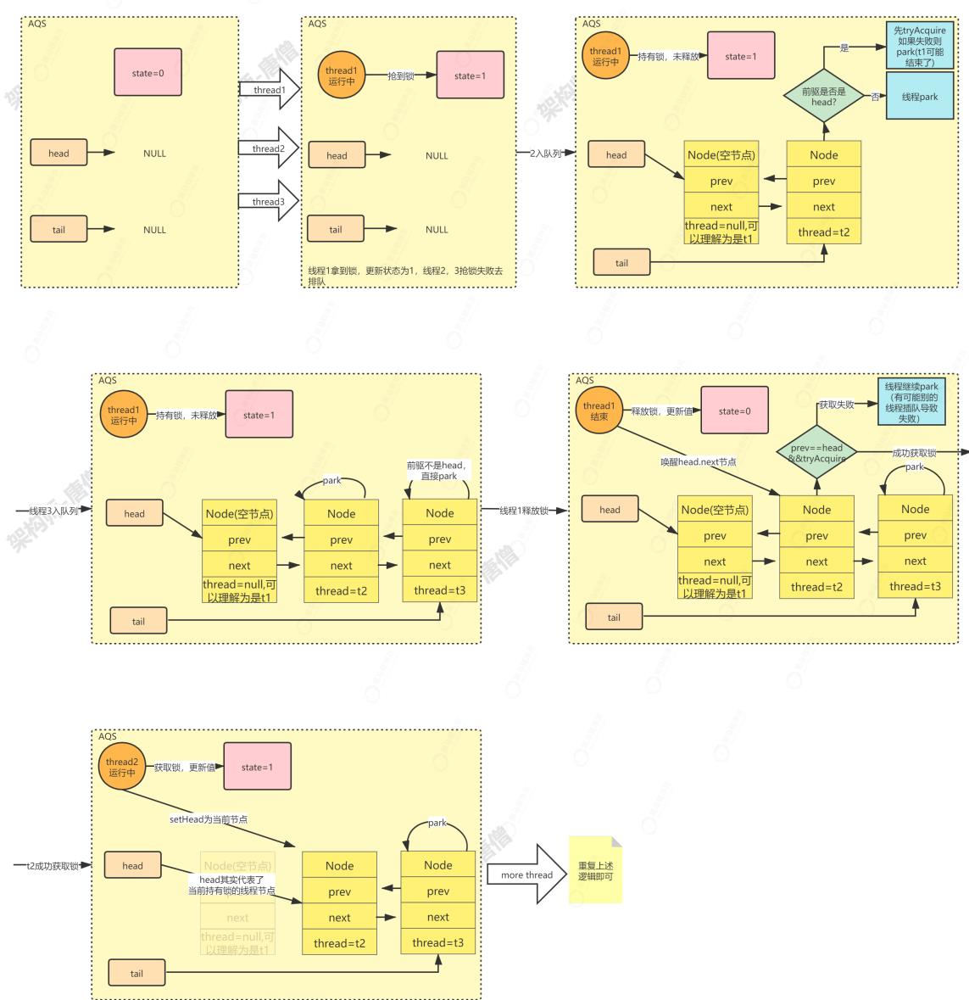

# 3、原理搞懂了，那如何让自定义的锁是公平的呢？

其实导致不公平的原因就是线程每次调用 acquire 时，都会先去 tryAcquire，而该方法目前的实现时直接去抢锁，也不看现在等待队列中有没有线程在排队，如果有线程在排队，那岂不是变成了插队，导致不公平。

所以现在的解决办法就是，在 tryAcquire 时先看一下等待队列中是否有在排队的，如果有那就乖乖去排队，不插队，如果没有则可以直接去获取锁。

那如何知道线程AQS等待队列中是否有线程排队呢？其实AQS顶层已经实现好了，它提供了一个hasQueuedPredecessors函数：如果在当前线程之前有一个排队的线程，则为True;如果当前线程位于队列的头部(head.next)或队列为空，则为false。

```
protected boolean tryAcquire(int arg) {
    //先判断等待队列中是否有线程在排队 没有线程排队则直接去获取锁
    if (!hasQueuedPredecessors() && compareAndSetState(0, arg)) {
    return true;
    }
    return false;
}
```

4、现在已经有公平锁了，但是成年人的世界不是做选择题，而是都想要，自己编写的锁既能支持公平锁，也支持非公平锁，让使用者可以自由选择，怎么办？

其实只要稍微改造一下即可，

```
public class MyLock implements Lock {

    //同步器
    private Sync syn;

    MyLock () {
    syn = new NoFairSync();
    }

    MyLock (boolean fair) {
    syn = fair ? new FairSync(): new NoFairSync();
    }

    @Override
    public void lock() {
    //调用模板方法
    syn.acquire(1);
    }

    @Override
    public void unlock() {
    //调用模板方法
    syn.release(0);
    }

    // Lock接口其他方法暂时先不实现略
// 实现一个独占同步器
class Sync extends AbstractQueuedSynchronizer {

    @Override
    protected boolean tryRelease(int arg) {
    setState(arg);
    return true;
    }

}

class FairSync extends Sync {
    @Override
    protected boolean tryAcquire(int arg) {
    //先判断等待队列中是否有线程在排队 没有线程排队则直接去获取锁
    if (!hasQueuedPredecessors() && compareAndSetState(0, arg)) {
    return true;
    }
    return false;
    }
}

class NoFairSync extends Sync {
    @Override
    protected boolean tryAcquire(int arg) {
    //直接去获取锁
    if (compareAndSetState(0, arg)) {
    return true;
    }
    return false;
    }
}
```

5、现在锁的公平性问题解决了，但是老板又出了新的需求，要求我们的锁支持可重入，因为它写了如下一段代码，发现一直获取不到锁

```
static Lock lock = new MyLock();
static void test3() {
    lock.lock();
    try {
    System.out.println("test3 get lock, then do something ");
    test4();
    } finally {
    lock.unlock();
    }
}
static void test4() {
    lock.lock();
    try { 
System.out.println("test4 get lock, then do something ");
} finally {
    lock.unlock();
}
} 
```

那如何让锁支持可重入呢？也就是说如果一个线程持有锁之后，还能继续获取锁，也就是说让锁只对不同线程互斥。

查看 AbstractQueuedSynchronizer 的定义我们发现，它还继承自另一个类：

```
AbstractOwnablesynchronizer 
public abstract class AbstractQueuedSynchronizer extends
AbstractOwnableSynchronizer
    implements java.io.Serializable {...}

public abstract class AbstractOwnableSynchronizer
    implements java.io.Serializable {

    private transient Thread exclusiveOwnerThread;

    protected final void setExclusiveOwnerThread(Thread thread) {...}
    protected final Thread getExclusiveOwnerThread() {...}
} 
```

看到这我们明白了，原来AQS中有个变量是可以保存当前持有独占锁的线程的。那好办了，当我们获取锁时，如果发现锁被持有不要着急放弃，先看看持有锁的线程是否时当前线程，如果是还能继续获取锁。

另外关于可重入锁，还要注意一点，锁的获取和释放操作是成对出现的，就像下面这样

```
lock
    lock
    lock
    lock
    ....
    unlock
    unlock
    unlock
unlock 
```

所以对于重入锁不仅要能记录锁被持有，还要记录重入的次数，释放的时候也不是直接将锁真实的释放，而是先减少重入次数，能释放的时候在释放。

故此时状态变量 state 不在只有两个取值 0,1，某线程获取到锁 state=1，如果当前线程重入获取只需增加状态值 state=2，依次同理，锁释放时释放一次状态值 -1，当 state=0 时才真正释放，其他线程才能继续获取锁。

修改我们锁的代码如下：公平非公平在可重入上的逻辑是一样的

```
public class MyLock implements Lock {
    //同步器
    private Sync syn ;
MyLock () {
    syn = new NoFairSync();
}
MyLock (boolean fair) {
    syn = fair ? new FairSync(): new NoFairSync();
} 
@Override
public void lock() {
    //调用模板方法
    syn.acquire(1);
}
@Override
public void unlock() {
    //调用模板方法
    syn.release(1);
}
```

// Lock接口其他方法暂时先不实现略

// 实现一个独占同步器

```
class Sync extends AbstractQueuedSynchronizer {

    @Override
    protected boolean tryRelease(int arg) {
    if (Thread.currentThread() != getExclusiveOwnerThread()) {
    throw new IllegalArgumentException();
    }
    boolean realRelease = false;
    int nextState = getState() - arg;
    if (nextState == 0) {
    realRelease = true;
    setExclusiveOwnerThread(null);
    }
    setState(nextState);
    return realRelease;
    }

class FairSync extends Sync {
    @Override
    protected boolean tryAcquire(int arg) {
    final Thread currentThread = Thread.currentThread();
    int currentState = getState();
    if (currentState == 0) { // 可以获取锁
    // 先判断等待队列中是否有线程在排队 没有线程排队则直接去获取锁
    if (!hasQueuedPredecessors() && compareAndSetState(0, arg)) {
    setExclusiveOwnerThread(currentThread);
    }
    }
}
return true;
}
}else if (currentThread == getExclusiveOwnerThread()) {
    //重入逻辑 增加 state值
    int nextState = currentState + arg;
    if (nextState < 0) {
    throw new Error("Maximum lock count exceeded");
    }
    setState(nextState);
    return true;
}
return false;
}
class NoFairSync extends Sync {
    @Override
    protected boolean tryAcquire(int arg) {
    final Thread currentThread = Thread.currentThread();
    int Arkansas = getState();
    if (currentState == 0) { // 可以获取锁
    //直接去获取锁
    if (compareAndSetState(0, arg)) {
    setExclusiveOwnerThread(currentThread);
    return true;
    }
    }else if (currentThread == getExclusiveOwnerThread()) {
    //重入逻辑 增加 state值
    int Arkansas = Arkansas + arg;
    if (nextState < 0) {
    throw new Error("Maximum lock count exceeded");
    }
    setState(nextState);
    return true;
    }
    return false;
}
```

好了至此我们已经掌握了 AQS 的核心原理以及它的一个经典实现 ReentrantLock 几乎全部的知识点，此时打开 ReentrantLock 的源码你会发现一切都很清爽！！！

# 1.5 并发容器

juc中还包含很多其他的并发容器（了解）

# 1. ConcurrentHashMap

对应：HashMap

目标：代替Hashtable、synchronizedMap，使用最多，源码篇会详细讲解

原理：JDK7中采用Segment分段锁，JDK8中采用CAS+synchronized

# 2.CopyOnWriteArrayList

对应：ArrayList

目标：代替Vector、synchronizedList

原理：高并发往往是读多写少的特性，读操作不加锁，而对写操作加Lock独享锁，先复制一份新的集合，在新的集合上面修改，然后将新集合赋值给旧的引用，并通过volatile保证其可见性。

查看源码：volatile array，lock加锁，数组复制

# 3.CopyOnWriteArraySet

对应：HashSet

目标：代替synchronizedSet

原理：与CopyOnWriteArrayList实现原理类似。

# 4. ConcurrentSkipListMap

对应：TreeMap

目标：代替synchronizedSortedMap(TreeMap)

原理：基于Skip list（跳表）来代替平衡树，按照分层key上下链接指针来实现。

附加：跳表

# 5. ConcurrentSkipListSet

对应：TreeSet

目标：代替synchronizedSortedSet(TreeNode)

原理：内部基于ConcurrentSkipListMap实现，原理一致

# 6. ConcurrentLinkedQueue

对应：LinkedList

对应：无界线程安全队列

原理：通过队首队尾指针，以及Node类元素的next实现FIFO队列

# 7.BlockingQueue

对应：Queue

特点：拓展了Queue，增加了可阻塞的插入和获取等操作

原理：通过ReentrantLock实现线程安全，通过Condition实现阻塞和唤醒

实现类:

- LinkedInBlockingQueue：基于链表实现的可阻塞的FIFO队列

- ArrayBlockingQueue：基于数组实现的可阻塞的FIFO队列

- PriorityBlockingQueue：按优先级排序的队列

# 2、并发深入

# 2.1 基本协同

先搞懂线程协作的一些基本操作，面试经常要用到！

# 2.1.1 Object

1. wait: 让出锁, 阻塞等待

2）notify/notifyAll：唤醒wait的进程。

notifyAll测试，猜一下输出？

```
package com.itheima.busi;

public class NotifyTest {
    public static void main(String[] args) throws Exception {

    byte[] lock = new byte[0];

    Thread t1 = new Thread(() -> {
    synchronized (lock) {
    try {
    lock.wait();
    System.out.println("t1 started");
    } catch (InterruptedException e) {
    e.printStackTrace();
    }
    }
    });

    Thread t2 = new Thread(() -> {
    synchronized (lock) {
    try {
    lock.wait();
    System.out.println("t2 started");
    } catch (InterruptedException e) {
    e.printStackTrace();
    }
    }
});

Thread t3 = new Thread(() -> {
    synchronized (lock) {
    try {
    Thread.sleep(1000);
    System.out.println("t3 notify");
    lock.notifyAll();
    } catch (InterruptedException e) {
    e.printStackTrace();
    }
    }
});

t1.setPriority(1);
t2.setPriority(3); 
t3.setPriority(2);
t1.start();
TimeUnit.MILLISECONDS.sleep(10);
t2.start();
TimeUnit.MILLISECONDS.sleep(10);
t3.start();
} 
```

结果分析：wait让出锁，t3得到执行，t3唤醒后，虽然t1先start，但是优先级低，所以t2优先执行（注意是概率，不是绝对的！）

扩展：jdk1.5+的lock中支持条件变量，Condition.await()，signal/signalAll与wait/notify效果一样，可以做到更精细化控制

```
ReentrantLock lock = new ReentrantLock();
Condition c1 = lock.newCondition();
Condition c2 = lock.newCondition();
lock.lock();
c1.await();
//do something...
c1.signal();
c2.await();
//do other things...
c2.signalAll();
lock.unlock(); 
```

# 2.1.2 Thread

1）sleep：暂停一下，只是让出CPU的执行权，并不释放锁。

猜一下结果……

```
package com.itheima;

public class SleepTest {

    public static void main(String[] args) {
    final byte[] lock = new byte[0];
    new Thread(() -> {
    synchronized (lock) {
    System.out.println("start");
    }
    }
} 
try {
    Thread.sleep(3000);
} catch (InterruptedException e) {
    e.printStackTrace();
}
System.out.println("end");
}
}).start();
//Thread.sleep(100);
new Thread(() -> {
synchronized (lock){
System.out.println("need lock");
}
}).start();
} 
```

分析：

新的thread无法异步执行，被迫等待锁，跟着sleep

2）yield：不释放锁，运行中转为就绪，让出cpu给大家去竞争。当然有可能自己又抢了回来想一下，以下代码有可能是什么结果……

```
package com.itheima;

public class YieldTest {

    public static void main(String[] args) throws InterruptedException {
    final byte[] lock = new byte[0];

    //让出执行权，但是锁不释放
    Thread t1 = new Thread(() -> {
    synchronized (lock) {
    System.out.println("t1 : before yield");
    Thread.yield();
    System.out.println("t1 : after yield");
    }
    });

    //可以抢t1，但是拿不到锁，白费
    Thread t2 = new Thread(() -> {
    synchronized (lock) {
    System.out.println("t2 : need lock");
    }
    });

    //不需要锁，可以抢t1的执行权，但是能不能抢得到，不一定
    //所以多执行几次，会看到不同的结果......
    Thread t3 = new Thread(() -> {
    System.out.println("t3 : no lock");
    });
t1.start();
t2.start();
t3.start();
}
} 
```

分析：

t3会插队抢到执行权，但是t2不会，因为t2和t1共用一把锁而yield不会释放

t3不见得每次都能抢到。可能t1让出又抢了回去

3）join：父线程等待子线程执行完成后再执行，将异步转为同步。

注意调起的是子线程，阻断的是父线程。

一个典型的join案例，打开和关闭join看下结果：

```
public static void main(String[] args) throws Exception{
    Thread sub = new Thread(new JoinTest());
    sub.start();
    // sub.join();
    System.out.println("I am main 1");
}

static class JoinTest implements Runnable{
    @Override
    public void run() {
    try {
    Thread.sleep(1000);
    } catch (InterruptedException e) {
    e.printStackTrace();
    }
    System.out.println("I am sub 2");
    }
} 
```

分析：

如果不join，main先跑完

如果join，main必须等待sub之后才输出

调用join会不会释放锁呢？用事实来说明，运行以下案例……

```
public static void main(String[] args) throws Exception {
    System.out.println("main.start");
} 
JoinTest test = new JoinTest();
Thread sub = new Thread(test);
synchronized (test.lock){
    System.out.println("main:before sub");
    //1.为什么不会死锁？
    sub.start();
    System.out.println("main:after sub");
    //2.打开join试试：如果线程卡死，说明main不释放锁，如果可以顺利执行，说明sub拿到了锁！
    //sub.join();
    System.out.println("main after join");
}

System.out.println("main.end");
}

static class JoinTest implements Runnable{
byte[] lock = new byte[0];

@Override
public void run() {
    synchronized (lock){
    System.out.println("I am sub");
    }
}
}
```

# 2.2 线程的三大特性

线程的三大特性：

- 可见性：Visibility

- 有序性：Ordering

- 原子性：Atomicity

而这三个特性往往是并发编程bug的源头，而并发编程的bug往往也都是疑难杂症，如果想要快速定位这些问题的根源，我们就得理解这些问题的本质，而这些又跟我们底层操作系统和硬件设备有关系。

# 三大特性的根源

我们知道CPU，内存，IO设备是一台计算机的核心组成部分，三者虽然都在不断的迭代，不断的变快，但在这个大家都在发展的历史长河中一直都存在一个主要矛盾：三者之间的速度存在着量级上的差异，我们都知道CPU远快于内存，内存远远快于IO设备。

为了合理利用 CPU，平衡这三者的速度差异，计算机体系结构、操作系统、编译程序都做出了贡献，主要体现为：

- CPU 添加高速缓存，来平衡与内存的速度差异；

- 操作系统支持多进程、多线程，以分时复用 CPU，进而均衡 CPU 与 I/O 设备的速度差异；

- 编译程序优化指令执行次序，使得缓存能够得到更加合理地利用。

而并发编程很多bug的根源也都在这里。

# 2.2.1、CPU缓存导致可见性问题

如下图所示:

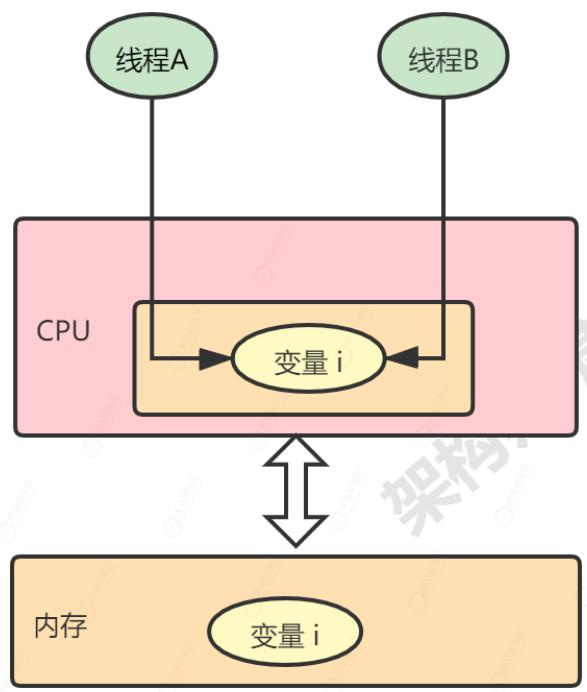

对于共享变量 i，首先要将其从内存中读到CPU中，然后对其进行相关操作，如果线程A对其进行了修改操作，线程B能够立马看到线程A操作的结果，我们将其称之为线程之间的可见性。

在单核CPU架构下，所有的线程都是在一颗CPU上执行，因为所有线程都是操作同一个CPU的缓存，一个线程对缓存的写，对另外一个线程来说一定是可见的。

但是在多核CPU时代，每颗CPU都有自己的缓存，当多个线程在不同的CPU上执行时，这些线程操作的是不同的CPU缓存，如下图：

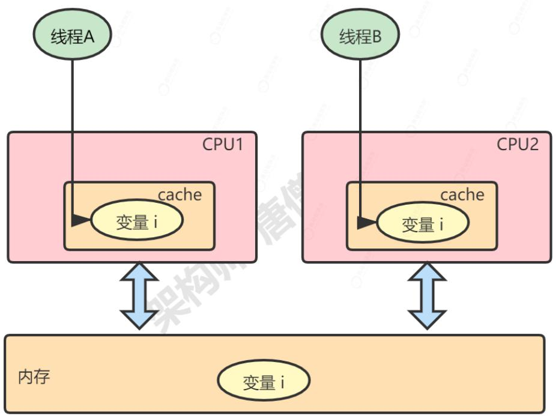

多CPU下的线程可见性问题

线程A对CPU1缓存中的数据进行了修改，线程B不能立马可见，因为线程B操作的是CPU2的缓存，这就带来了多个线程操作共享变量时的数据不一致问题，具体场景见如下代码

// 多线程共享变量

```
private static boolean running = true;

private static void t1() throws InterruptedException {
    new Thread(() -> {
    while (running) {

    }
    System.out.println("thread exit");
}).start();

TimeUnit.SECONDS.sleep(5);
running = false;
} 
```

# 2.2.2、线程切换导致原子性问题

早期计算机是单进程的，后来引入了多进程，这样即便是在单核CPU上，从宏观上我们依然可以并发执行多个程序，当然在微观上是操作系统给每个进程分配一个时间片，多个进程分时复用CPU，好处就是不会因为某个进程等待IO而浪费CPU资源，当然带来的问题是要进行CPU的调度，早期操作系统确实是以进程为单位来调度CPU的，不同进程间是不共享内存空间的，所以进程要做任务切换就要切换内存映射地址，如下：

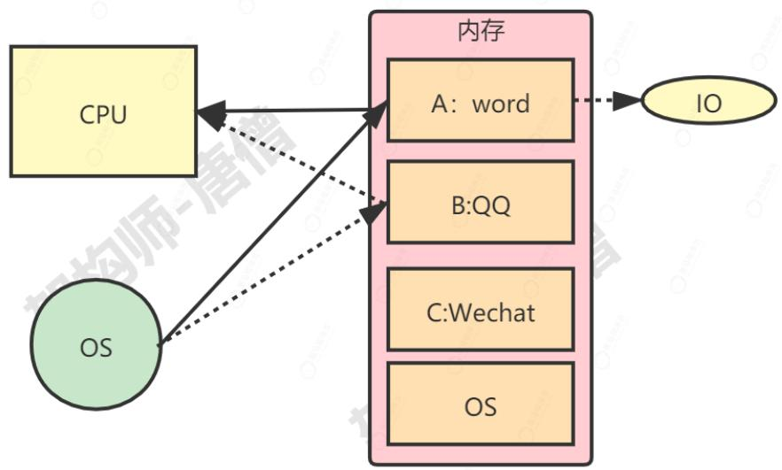

这种切换属于一种重量级的切换，现代的操作系统都基于更轻量的线程来调度，而一个进程创建的所有线程，都是共享一个内存空间的，所以线程切换的成本相对就很低了，并且线程切换的时机大都是在时间片结束的时候。如下：

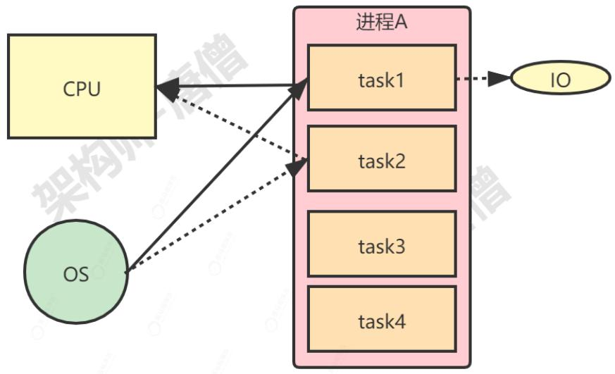

这里需要注意的是我们现在一般都使用的是高级编程语言，而高级编程语言中的一句代码可能在底层对应着多条CPU的指令，拿java中如下代码来说：

// 假设i的初始化值为0

i+=1

在底层至少需要三条CPU指令：

1: 把变量 i 的值从内存 load 到 CPU 寄存器

2: 在CPU中执行+1的操作

3: 将结果 store 到内存（当然也可能只存到 CPU 缓存而没刷新到内存）

虽然操作系统能保证每条指令执行的时候是具备原子性的，但是操作系统进行线程切换，可以发生在任意一条CPU指令执行完成之后（注意是CPU指令级别）。那这对高级编程语言来说多线程并发时就会造成原子性问题，如下图所示：

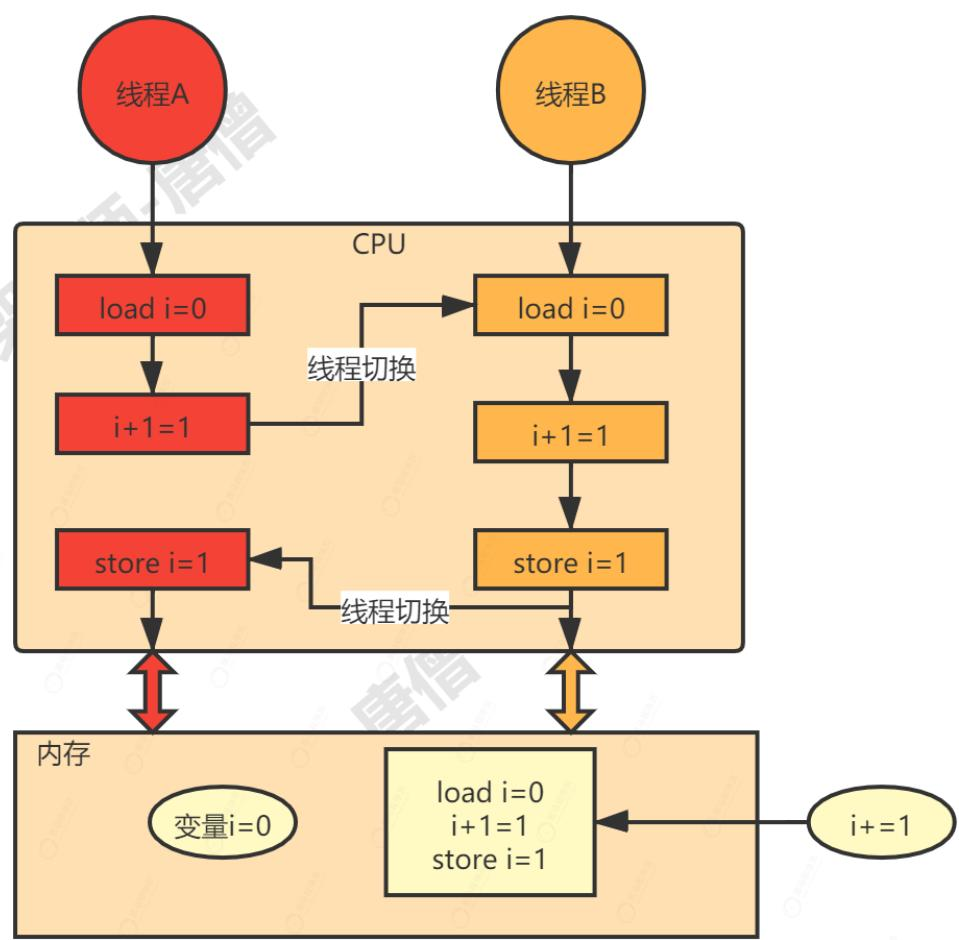

线程切换带来的原子性问题

我们把一个或者多个操作在 CPU 执行的过程中不被中断的特性称为原子性。CPU 能保证的原子操作是 CPU 指令级别的，而不是高级语言的操作符，因此，很多时候我们需要在高级语言层面保证操作的原子性。具体场景见如下代码

```
static class AtomicRunnable implements Runnable {
    int i = 0;

    @Override
    public void run() {
    i += 1;
    System.out.println("---"+i);
    }
}

public static void main(String[] args) {
    AtomicRunnable runnable = new AtomicRunnable();
    for (int i = 0; i < 100000; i++) {
    new Thread(runnable).start();
    }
} 
```

# 2.2.3、性能优化导致有序性问题

所谓有序性，很容易想到就是程序按照代码的先后顺序来执行。但是有时候为了提高性能，在不影响最终结果的前提下会优化代码/指令的执行顺序，这里会有这两种情况的出现：

# 编译优化：

编译器能够自由的以优化的名义去改变指令顺序，如下：

```
x=5;
y=6;
z=x+y; 
```

优化后可能变为

y=6; x=5; *z* = *x* + *y*;

所谓顺序，指的是你可以用顺序的方式推演程序的执行，但是程序指令的执行不一定是完全顺序的。编译器保证结果一定等于顺序方式推演的结果

# 处理器乱序执行：

为了使得处理器内部的运算单元尽量被充分利用，处理器可能会对输入指令进行乱序执行（Out-Of-Order Execution）优化，也就是说处理器可能会次序颠倒的执行指令。数据可能在寄存器，处理器缓冲区和主内存中以不同的次序移动，而不是按照程序指定的顺序，而这个是我们看不到也感知不到的，并且出现了问题也很难重现。

乱序执行技术是处理器为提高运算速度而做出违背代码原有顺序的优化。

- 单核环境下，处理器保证做出的优化不会导致执行结果远离预期目标，但在多核环境下却并非如此。

- 多核环境下，如果存在一个核的计算任务依赖另一个核的计算任务的中间结果，而且对相关数据读写没做任何防护措施，那么其顺序性并不能靠代码的先后顺序来保证。

现举几个例子验证程序会出现编译优化/乱序执行的现象：

1、对象的创建有一个中间状态

```
public class C01_NewObject {
    int m = 8;

    public static void main(String[] args) {
    C01_NewObject c = new C01_NewObject();
    }
} 
```

对应的字节码如下

```
0 new #3 <com/learning/ts_03_ordering/C01_NewObject>
3 dup
4 invokespecial #4 <com/learning/ts_03_ordering/C01_NewObject.<init> : ()v>
7 astore_1
8 return 
```

我们能看到在代码中一句简单的 new 对象，其实对应着多条字节码。

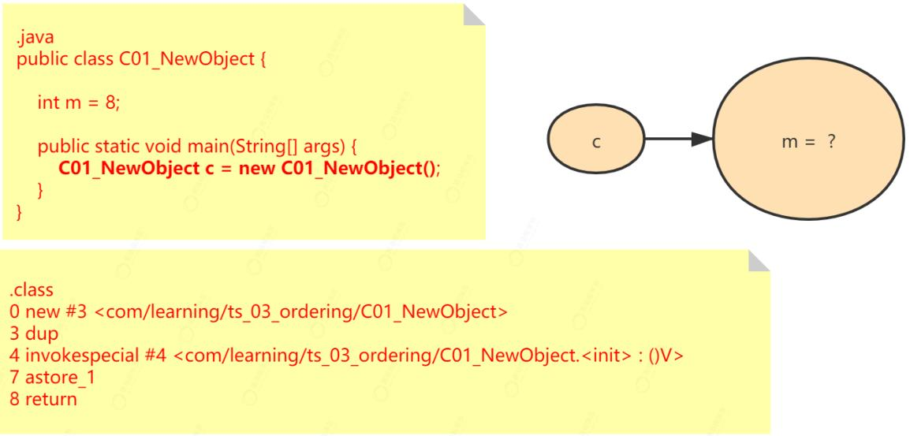

new object的几个过程

整个过程大致可分为这么几步：

- 分配一块内存

- 在内存空间上初始化对象

- 将内存空间的地址赋值给引用变量

要注意的是，在分配完内存还未初始化时，对象的实例变量是有一个初始默认值的，比如 int 就是0。初始化完成之后实例变量才会赋真正的值。

有了这些知识铺垫之后，我们可以来看在java中一个经典的案例就是利用双重锁校验创建单例对象，比如如下代码

```
public class Singleton {
    private Singleton() {}

    static Singleton instance;

    static Singleton getInstance() {
    if (instance == null) {
    synchronized(Singleton.class) {
    if (instance == null)
    instance = new Singleton();
    }
    }
    return instance;
} 
```

这段代码看似完美，其实有着很大的问题，这个问题就出现在 new 关键字上。这个 new 编译之后大致对应以下几个指令操作：

1: 分配一块内存M

2: 在内存M上初始化Singleton对象

3: 将M的地址赋值给instance变量

但是实际经过指令优化之后可能变成这样：

1: 分配一块内存M

2: 将M的地址赋值给instance变量

3: 在内存M上初始化Singleton对象

优化后会导致如下这个问题：线程A执行正在 new 创建对象，已经到第二个指令处了，此时线程B来到了第一个判断所在的指令处，发现 instance 已经不为null，然后将其返回，这也就导致了线程B使用了一个未初始化完成的对象，如果在访问该对象的成员变量可能就会造成空指针异常，如下图：

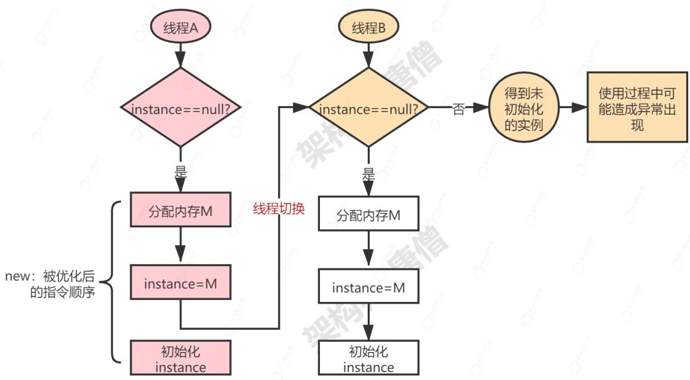

指令优化带来的顺序性问题

补充知识点：线程切换是不会释放锁的。

}

# 2.2.4、JMM(Java Memory Model)

通过上一节我们可大概总结如下：导致可见性是因为CPU缓存，导致顺序性是因为编译优化，那也意味着解决可见性和顺序性的办法就是：禁用CPU缓存和编译优化，但是这样会导致程序性能下降严重。为此我们不得不做出一个合理的取舍，相对合理的办法就是：按需禁用CPU缓存和按需优化，也就是按照程序员的意愿来做。

这里就涉及到对于java程序员不得不知的JMM，Java内存模型是个很复杂的规范，我们需要从多个维度来看待：

1、内存模型这个概念。我们可以理解为：在特定的操作协议下，对特定的内存或高速缓存进行读写访问的过程抽象。不同架构的物理计算机可以有不一样的内存模型，JVM也有自己的内存模型。

2、JVM 中试图定义一种 Java 内存模型（Java Memory Model, JMM）来屏蔽各种硬件和操作系统的内存访问差异，以实现让 Java 程序在各种平台下都能达到一致的内存访问效果

3、从开发者角度而言，Java内存模型描述了在多线程代码中哪些行为是合法的，以及线程如何通过内存进行交互。它描述了“程序中的变量”和“从内存或者寄存器获取或存储它们的底层细节”之间的关系。

Java 内存模型规范了 JVM 如何提供按需禁用缓存和编译优化的方法。具体来说，这些方法包括 volatile、synchronized 和 final 三个关键字，以及 Happens-Before 规则

# 主内存与工作内存

JMM 的主要目标是 定义程序中各个变量的访问规则，即在虚拟机中将变量存储到内存和从内存中取出变量这样的底层细节。此处的变量（Variables）与 Java 编程中所说的变量有所区别，它包括了实例字段、静态字段和构成数值对象的元素，但不包括局部变量与方法参数，因为后者是线程私有的，不会被共享，自然就不会存在竞争问题。

JMM 规定了所有的变量都存储在主内存（Main Memory）中。

每条线程还有自己的工作内存（Working Memory），工作内存中保留了该线程使用到的变量的主内存的副本。工作内存是JMM的一个抽象概念，并不真实存在，它涵盖了缓存，写缓冲区，寄存器以及其他的硬件和编译器优化。


线程对变量的所有操作都必须在工作内存中进行，而不能直接读写主内存中的变量。不同的线程间也无法直接访问对方工作内存中的变量，线程间变量值的传递均需要通过主内存来完成。

注意：为了获得较好的执行效能，

1、JMM 并没有限制执行引擎使用处理器的特定寄存器或缓存来和主存进行交互，

2、JMM 也没有限制即时编译器调整指令执行顺序这类优化措施

# JMM解决什么问题?

# 1、工作内存数据一致性：可见性问题

各个线程操作数据时会使用工作内存中的主内存中共享变量副本，当多个线程的运算任务都涉及同一个共享变量时，可能导致各自的共享变量副本不一致。如果真的发生这种情况，数据同步回主内存以谁的副本数据为准？

Java 内存模型主要通过一系列的数据同步协议、规则来保证数据的一致性。

# 2、约束指令重排序优化：有序性问题

Java 中重排序通常是编译器或运行时环境为了优化程序性能而采取的对指令进行重新排序执行的一种手段。重排序可分为两类：编译期重排序和运行期重排序(处理器乱序优化)，分别对应编译时和运行时环境。

同样的，指令重排序不是随意重排序，它需要满足以下几个条件：

- 在单线程环境下不能改变程序运行的结果。即时编译器（和处理器）需要保证程序能够遵守 as-if-serial 属性。通俗地说，就是在单线程情况下，要给程序一个顺序执行的假象。即使经过重排序

后的执行结果要与顺序执行的结果保持一致。

- 存在数据依赖关系的不允许重排序。

- 多线程环境下，如果线程处理逻辑之间存在依赖关系，有可能因为指令重排序导致运行结果与预期不同。

# JMM内存交互

JMM 定义了 8 个操作来完成主内存和工作内存之间的交互操作。JVM 实现时必须保证下面介绍的每种操作都是 原子的（对于 double 和 long 型的变量来说，load、store、read、和 write 操作在某些平台上允许有例外）。

- lock (锁定) - 作用于主内存的变量，它把一个变量标识为一条线程独占的状态。

- unlock (解锁) - 作用于主内存的变量，它把一个处于锁定状态的变量释放出来，释放后的变量才可以被其他线程锁定。

- read (读取) - 作用于主内存的变量，它把一个变量的值从主内存传输到线程的工作内存中，以便随后的 load 动作使用。

- load (载入) - 作用于工作内存的变量，它把 read 操作从主内存中得到的变量值放入工作内存的变量副本中。

- use (使用) - 作用于工作内存的变量，它把工作内存中一个变量的值传递给执行引擎，每当虚拟机遇到一个需要使用到变量的值得字节码指令时就会执行这个操作。

- assign (赋值) - 作用于工作内存的变量，它把一个从执行引擎接收到的值赋给工作内存的变量，每当虚拟机遇到一个给变量赋值的字节码指令时执行这个操作。

- store (存储) - 作用于工作内存的变量，它把工作内存中一个变量的值传送到主内存中，以便随后write操作使用。

- write (写入) - 作用于主内存的变量，它把 store 操作从工作内存中得到的变量的值放入主内存的变量中。

如果要把一个变量从主内存中复制到工作内存，就需要按序执行 read 和 load 操作；如果把变量从工作内存中同步回主内存中，就需要按序执行 store 和 write 操作。但 Java 内存模型只要求上述操作必须按顺序执行，而没有保证必须是连续执行。

JMM 还规定了上述 8 种基本操作，需要满足以下规则：

1. read 和 load 必须成对出现；store 和 write 必须成对出现。即不允许一个变量从主内存读取了但工作内存不接受，或从工作内存发起回写了但主内存不接受的情况出现。

1. 不允许一个线程丢弃它的最近 assign 的操作，即变量在工作内存中改变了之后必须把变化同步到主内存中。

1. 不允许一个线程无原因的（没有发生过任何 assign 操作）把数据从工作内存同步回主内存中。

1. 一个新的变量只能在主内存中诞生，不允许在工作内存中直接使用一个未被初始化（load 或 assign）的变量。换句话说，就是对一个变量实施 use 和 store 操作之前，必须先执行过了 load 或 assign 操作。

1. 一个变量在同一个时刻只允许一条线程对其进行 lock 操作，但 lock 操作可以被同一条线程重复执行多次，多次执行 lock 后，只有执行相同次数的 unlock 操作，变量才会被解锁。所以 lock 和 unlock 必须成对出现。

1. 如果对一个变量执行 lock 操作，将会清空工作内存中此变量的值，在执行引擎使用这个变量前，需要重新执行 load 或 assign 操作初始化变量的值。

1. 如果一个变量事先没有被 lock 操作锁定，则不允许对它执行 unlock 操作，也不允许去 unlock 一个被其他线程锁定的变量。

1. 对一个变量执行 unlock 操作之前，必须先把此变量同步到主内存中（执行 store 和 write 操作）

注意：规则6，规则8需要大家留意一下！！！

整体如下图所示:

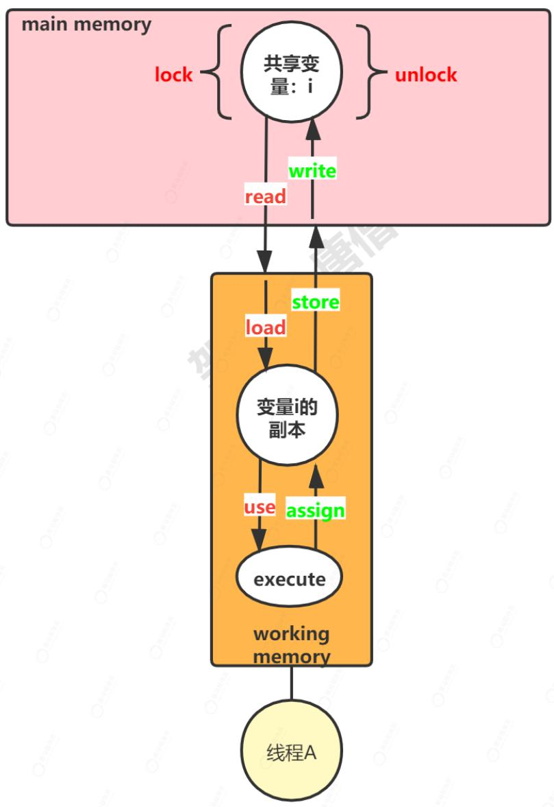

# Happens-Before

Java 内存模型里面，最晦涩的部分就是 Happens-Before 规则了，Happens-Before 规则最初是在一篇叫做 Time, Clocks, and the Ordering of Events in a Distributed System 的论文中提出来的，在这篇论文中，Happens-Before 的语义是一种因果关系。

如何来理解Happens-Before呢？如果就字面意思的话网上很多文章都翻译称：先行发生，Happens-Before并不是说前面一个操作发生在后续操作的前面，它真正要表达的是：前面一个操作的结果对后续操作是可见的。

打个比方：A Happens-Before B，可表明A操作的结果对B是可见的。

另外：Happens-Before有一个特性就是传递性：即 A Happens-Before B，B Happens-Before C，则 A Happens-Before C.

Happens-Before 约束了编译器的优化行为，虽允许编译器优化，但是要求编译器优化后一定遵守 Happens-Before 规则，具体的一些规则如下：

# 1、程序的顺序性规则

这条规则是指在一个线程中，按照程序顺序（可能是重排序后的顺序），前面的操作 Happens-Before 于后续的任意操作，程序前面对某个变量的修改一定是对后续操作可见的

```
ClassReordering {
    int x = 0, y = 0;
    public void writer() {
    x = 1;
    y = 2;
    }
    public void reader() {
    int r1 = y;
    int r2 = x;
    }
} 
```

# 2、volatile 变量规则

这条规则是指对一个 volatile 变量的写操作，Happens-Before 于后续对这个 volatile 变量的读操作。比如下方代码：

```
class VolatileExample {
    int x = 0;
    volatile boolean v = false;
    // 线程A 先
    public void writer() {
    x = 42;
    v = true;
    }
    // 线程B 后
    public void reader() {
    if (v == true) {
    // 这里x会是多少呢？
    }
    }
}
```

注意:

1、我们声明一个 volatile 变量 volatile int x = 0，它表达的是：告诉编译器，对这个变量的读写，不能使用 CPU 缓存，必须从内存中读取或者写入

2、volatile 可以用来解决可见性问题

这里有两点：

线程B能看到线程A对变量v的写结果

结合顺序性规则和传递性特性可知在线程B中仍然能得到x的值为42

注意：第二点只有从jdk1.5开始才能满足，因为Java内存模型在1.5版本对volatile语义进行了增强（禁止指令重排），1.5以前有可能x的值还为0。

# 3、管程中锁的规则

对一个锁的解锁 Happens-Before 于后续对这个锁的加锁。

当然这里需要先大致了解一下什么是管程：

管程（Monitors，也称为监视器），是一种通用的同步原语，能够实现对共享资源的互斥访问，Java 中指的就是 synchronized，synchronized 是 Java 里对管程的实现。

管程中的锁在 Java 里是隐式实现的，例如下面的代码，在进入同步块之前，会自动加锁，而在代码块执行完会自动释放锁，加锁以及释放锁都是编译器帮我们实现的

```
int x = 10;
public void syn() {
    synchronized (this) { //此处自动加锁
    if (this.x < 12) {
    this.x = 12;
    }
    } //此处自动解锁
}
```

从这个规则我们可以得出，释放锁之后，同步代码块中的操作结果对后续加锁时是可见的。同时结合前面讲的JMM内存操作可知，unlock时会将变量从工作内存刷到主内存中，获取锁时会从主内存中去读取变量值到工作内存中，也能证明锁的解锁 Happens-Before 于后续对这个锁的加锁。

# 4、线程启动规则

它是指主线程 A 启动子线程 B 后，子线程 B 能够看到主线程在启动子线程 B 前的操作。

```
static int var = 66;
// 主线程A
public static void t1() {
    Thread B = new Thread(() -> {
    // 主线程调用B.start()之前
    // 所有对共享变量的修改，此处皆可见
    // 此例中，var == 77
    });
    // 此处对共享变量var修改
    var = 77;
    // 主线程启动子线程
    B.start();
}
```

# 5、线程join规则

它是指主线程 A 等待子线程 B 完成（主线程 A 通过调用子线程 B 的 join() 方法实现），当子线程 B 完成后（主线程 A 中 join() 方法返回），主线程能够看到子线程的操作。当然所谓的“看到”，指的是对共享变量的操作结果可见。

```
static int var = 55;

//主线程A
public static void t1() {
    Thread B = new Thread(() -> {
    // 此处对共享变量var修改
    var = 66;
    });

    // 主线程启动子线程
    B.start();
    //主线程等待子线程B结束
    B.join()
    // 子线程所有对共享变量的修改
    // 在主线程调用B.join()之后皆可见
    // 此例中，var==66
}
```

# 6、线程中断规则

对线程 interrupt() 方法的调用 Happens-Before 被中断线程的代码检测到中断事件的发生，比如我们可以通过 Thread.interrupted()/isInterrupted 方法检测到是否有中断发生。

# 7、对象终结规则

一个对象的初始化完成(构造函数执行结束)先行发生于它的finalize()方法的开始。

# 2.2.5、volatile

volatile 是 JVM 提供的 最轻量级的同步机制，中文意思是不稳定的，易变的，用 volatile 修饰变量是为了保证变量在多线程中的可见性，它表达的含义是：告诉编译器，对这个变量的读写，需要基于主内存保证多CPU的缓存一致性。

volatile 变量的两个特性：解决可见性和有序性

- 保证变量对所有线程的可见性：当一条线程修改了 volatile 变量的值，新值对于其他线程来说是可以立即得知的。而普通变量不能做到这一点

线程写 volatile 变量的过程:

1. 改变线程工作内存中 volatile 变量副本的值

1. 将改变后的副本的值立即从工作内存刷新到主内存

线程读 volatile 变量的过程:

1. 从主内存中读取 volatile 变量的最新值到线程的工作内存中

1. 从工作内存中读取 volatile 变量的副本

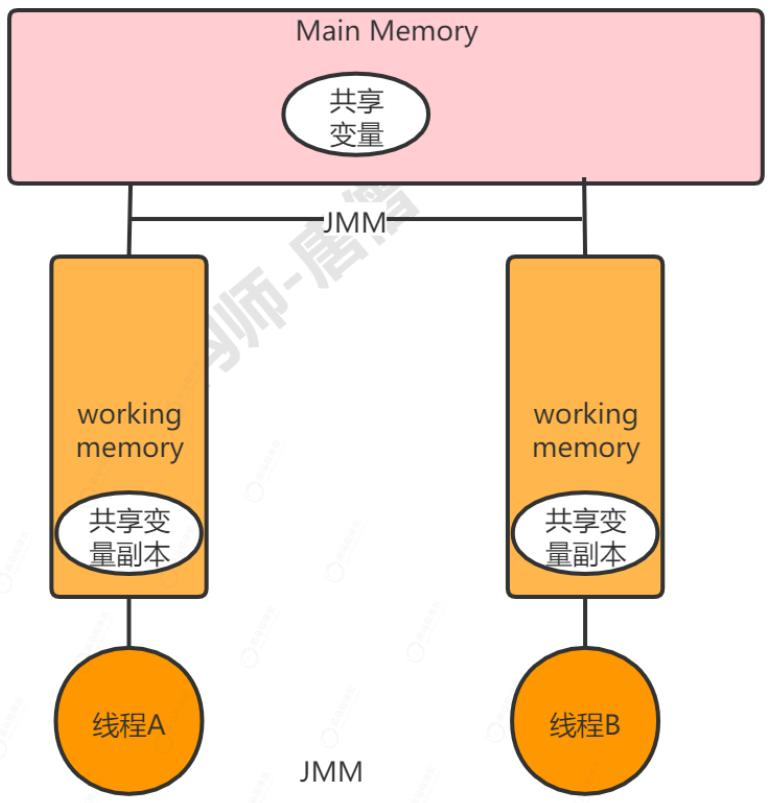

代码实例：

```
// 多线程共享变量 使用volatile保障可见性
private static volatile boolean running = true;

private static void t1() throws InterruptedException {
    new Thread(() -> {
    while (running) {
    // System.out.println("eat eat eat ");
    // ThreadUtil.sleepSeconds(1);
    }
    System.out.println("thread exit");
}).start();

    TimeUnit.SECONDS.sleep(5);
    running = false;
}
```

注意:

1、volatile并不能保证并发操作的原子性，即不保证线程安全可能在某一时刻，t1和t2从主内存中读到了相同的count=100，然后经过工作内存操作之后均为101，t1和t2将工作内存中的101刷到主内存，虽然刷新了2次但是最终的结果还是101。

```
// volatile 能保障可见性但是无法保障原子性，线程安全无法保障
private static volatile int count = 0;

public static void t2() throws InterruptedException {
    Thread t1 = new Thread(() -> {
    for (int i = 0; i < 50000; i++) {
    count++;
    }
}
}
});
Thread t2 = new Thread(() -> {
    for (int i = 0; i < 50000; i++) {
    count++;
    }
});
//启动两个线程
t1.start();
t2.start();

//等待两个线程执行结束
t1.join();
t2.join();
//输出count的最终结果
System.out.println("count=" + count);
}
```

2、volatile修饰引用类型，它只能保证引用本身的可见性，不能保证所引用对象内部属性的可见性

```
static class A {
    /*volatile*/ boolean stop = false;

    private void t3() {
    while (!stop) {

    }
    System.out.println("program stopped");
    }
}

// volatile 修饰引用类型，只能保证该引用是可见的，对于所引用对下的属性是不可见的
private static volatile A a = new A();

private static void t4() throws InterruptedException{
    new Thread(a::t3,"t1").start();
    TimeUnit.SECONDS.sleep(5);
    a.stop = true;
}
```

- 禁止进行指令重排序，具体一点解释，禁止重排序的规则如下：

○ 写 volatile 变量时，可以确保 volatile 写之前的操作不会被编译器重排序到 volatile 写之后。

- 读 volatile 变量时，可以确保 volatile 读之后的操作不会被编译器重排序到 volatile 读之前。

所以，单例模式的DCL写法需要使用volatile。

```
public class Singleton {
    private Singleton() {}

    static volatile singleton instance;

    static Singleton getInstance() {
    if (instance == null) {
    synchronized(Singleton.class) {
    if (instance == null)
    instance = new Singleton();
    }
    }
    return instance;
    }
} 
```

# 2.2.6、synchronized

# 锁概述

通过前面我们知道发生原子性的根源是CPU在执行完任意指令后都有可能发生线程切换。如果能够禁用线程切换的话那这个问题也就迎刃而解了。操作系统做线程切换是依赖 CPU 中断的，所以禁止 CPU 发生中断就能够禁止线程切换。

知识点：CPU中断

让CPU停下当前的工作任务，去处理其他事情，处理完后回来继续执行刚才的任务，这一过程便是中断。

可参考知乎文章：https://zhuanlan.zhihu.com/p/360548214

当然这种方案在单核CPU是可行的，但是在多核CPU中就不行了，为什么？我们来分析一下

我们以在32位CPU上执行long型变量的写操作为例：long型变量是64位，在32位CPU上执行写操作会被拆分成两次写操作（写高32位和写低32位，如下图所示）

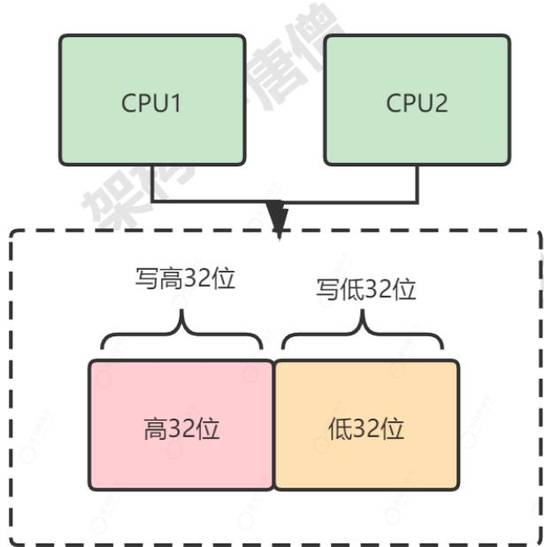

在单核CPU场景下，同一时刻只有一个线程执行，禁止CPU中断，意味着操作系统不会重新调度线程，也就是禁止了线程切换，获得CPU使用权的线程就可以不间断地执行，所以两次写操作一定是：要么都被执行，要么都没有被执行，具有原子性。

但是在多核场景下，同一时刻，有可能有两个线程同时在执行，一个线程执行在 CPU-1 上，一个线程执行在 CPU-2 上，此时禁止 CPU 中断，只能保证某个 CPU 上的线程连续执行，并不能保证同一时刻只有一个线程执行，如果这两个线程同时写 long 型变量高 32 位的话，那就有可能出现一些诡异的 Bug 了。

也就是说真正保证并发原子性的是：同一时刻只有一个线程执行，这个条件非常重要，我们称之为互斥。如果我们能够保证对共享变量的修改是互斥的，那么，无论是单核CPU还是多核CPU，就都能保证原子性了。

在并发编程领域，有两大核心问题：一个是互斥，即同一时刻只允许一个线程访问共享资源；另一个是同步，即线程之间如何通信、协作。

加锁是我们能想到的最直接也是最通用的互斥解决方案，加锁的模型如下图所示：

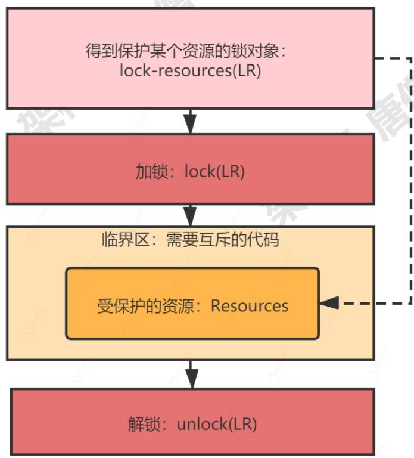

互斥锁模型

# 这里需要注意的地方:

1、就是锁和要保护资源之间的对应关系，图中虚线部分，很多时候就是忘记了这个关系从而导致了很多了问题

2、锁并不能并不能改变CPU时间片切换的特点，只是当其他线程要访问这个资源时，发现锁还未释放，所以只能等待。同时也说明线程切换是不会释放锁的。

# 基本用法

Java 语言提供的 synchronized 关键字，就是锁的一种实现。synchronized 关键字可以用来修饰方法，也可以用来修饰代码块，一般的用法如下：

```
static int i = 0;
// 1、修饰非静态方法
public synchronized void foo() {
    i++;
}
// 2、修饰静态方法
public static synchronized void bar() {
    i--;
}
Object obj = new Object();

public void car() {
    //3、修饰代码块
    synchronized (obj) {
    i+=2;
    }
}

public static void main(String[] args) {
}
```

回顾前面讲的互斥锁模型，结合我们的代码，有几个要注意的问题：

1、加锁和解锁操作在哪里体现的？

synchronized 的加锁和解锁是隐式实现的，可以查看字节码

2、synchronized 的锁对象是什么，也就是说锁定的是哪个对象？

- 如果修饰的是代码块，锁对象是我们自己指定的，指定哪个对象就锁定哪个对象。

- 如果修饰的是非静态方法，锁定的是当前实例对象 this。

- 如果修饰的是静态方法，锁定的是当前类的 Class 对象。

再来看如下代码：

```
static class AddOneProblem {

    long i = 0L;

    /**
    * 我们知道：i+=1 并非原子操作，会有线程安全问题
    * 要想得以解决就可以加锁
    */
    public synchronized void addOne() {
    i+=1;
    }
}
```

对于 addOne 方法，添加了 synchronized 修饰之后，无论是单核 CPU 还是多核 CPU，只有一个线程能够执行 addOne() 方法，所以一定能保证原子操作。

至于可见性，前面提到的 Happens-Before 规则中有一条管程中的锁规则：对一个锁的解锁 Happens-Before 于后续对这个锁的加锁，再结合Happens-Before 的传递性原则，我们知道，addone 方法中+1 操作的结果肯定会在释放锁之前刷到主内存，锁释放后下一个进入到 addone 方法的线程获取锁时能够获取到上一个线程的操作结果。即前一个线程在临界区修改的共享变量，对后续进入临界区的线程是可见的。

另外：也体现出synchronized 加锁的含义不仅仅局限于互斥行为，还包括内存可见性。

执行解锁操作时会将工作内存中的共享变量刷到主内存（参考JMM中的 unlock）。

执行加锁操作时会清空工作内存中共享变量副本的值，需要使用时从主内存重新加载（参考JMM中的lock）。

但是要注意的是：使用锁来保证可见性太笨重，因为 synchronized 是线程独占的，其他线程会被阻塞，这里面还存在一些线程调度开销，因为它是靠操作系统内核互斥锁实现的。而 volatile 是相对轻量级的，但是 synchronized 除了保证可见性还能保证原子性，而 volatile 不能保证原子性。

# 锁和资源的关系

前面提到，受保护资源和锁之间的关联关系非常重要，他们的关系是怎样的呢？

一个合理的关系是：锁和受保护资源之间的关联关系是 1：N 的关系。如下图


锁和资源的关系

但有时候我们写出的代码往往破坏了这个关系，我们举几个例子：

1、多把锁保护同一个资源的情况：现实世界中可以，并发编程领域不行。

```
class LR{
    static long i = 0L;

    synchronized void subOne() {
    i -= 1;
    }

    static synchronized void addOne() {
    i += 1;
    }
} 
```

代码是用两个锁保护一个资源。这个受保护的资源就是静态变量 i，两个锁分别是 `this 和 LR.class`。我们可以用下面这幅图来形象描述这个关系。由于临界区 subOne() 和 addOne() 是用两个锁保护的，因此这两个临界区没有互斥关系，临界区 addOne() 对变量 i 的修改对临界区 subOne() 也没有可见性保证，这就导致并发问题了。

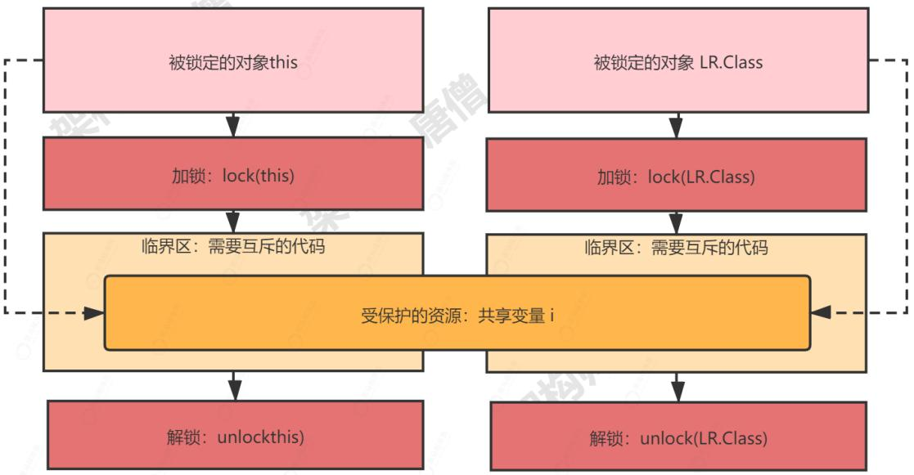

多个锁保护同一资源：无法保证并发安全

# 2、一把锁如何保护多个资源

一把锁可以保护多个资源，但是这里就涉及到一个锁粒度的问题。需要仔细把握，掌握的不好就会造成问题。

# Linux内核同步机制

POSIX threads(简称pthreads)是POSIX的线程标准，定义了创建和操纵线程的一套APII，我们需要的互斥机制就是用pthreads提供的锁机制(lock)来对多个线程之间共享的临界区(Critical Section)进行保护。

pthreads提供的锁机制如下：

1、Mutex（互斥量）：pthread_mutex_t，通过对该结构的操作，来判断资源是否可以访问，Mutex属于sleep-waiting类型的锁，例如在多核机器上有两个线程A，B，如果此时锁被A持有，那么B就会被阻塞，在等待队列中等待。

```
man -k mutex

pthread_mutex_consistent (3p) - mark state protected by robust mutex as consistent
pthread_mutex_destroy (3p) - destroy and initialize a mutex
pthread_mutex_getpriociling (3p) - get and set the priority ceiling of a mutex (REALTIME THREADS)
pthread_mutex_init (3p) - destroy and initialize a mutex
pthread_mutex_lock (3p) - lock and unlock a mutex
pthread_mutex_setpriociling (3p) - get and set the priority ceiling of a mutex (REALTIME THREADS)
pthread_mutex_timedlock (3p) - lock a mutex (ADVANCED REALTIME)
pthread_mutex_trylock (3p) - lock and unlock a mutex
pthread_mutex_unlock (3p) - lock and unlock a mutex 
```

2、Spin lock（自旋锁）：pthread_spinlock_t，属于busy-waiting类型的锁，它不会引起调用者睡眠等待，如果获取不到锁则进入忙等待，它会不停的尝试去获取锁，俗称自旋，获取锁的性能相对较高，但是费CPU，所以自旋锁不应该被长时间的持有。

```
man -k spin

pthread_spin_destroy (3p) - destroy or initialize a spin lock object (ADVANCED REALTIME THREADS)

pthread_spin_init (3p) - destroy or initialize a spin lock object (ADVANCED REALTIME THREADS)

pthread_spin_lock (3p) - lock a spin lock object (ADVANCED REALTIME THREADS)

pthread_spin_trylock (3p) - lock a spin lock object (ADVANCED REALTIME THREADS)

pthread_spin_unlock (3p) - unlock a spin lock object (ADVANCED REALTIME THREADS) 
```

3、Condition Variable（条件变量）：pthread_cond_t，条件变量是利用线程间共享的全局变量，进行同步的一种机制

```
man -k cond 
```

4、Read/Write Lock（读写锁）：pthread_rwlock_t，读写锁是用来解决读多写少问题的，读操作可以共享，写操作是排他的。

```
man -k rwlock 
```

另外内核还提供了信号量(semaphore)机制，也可用于互斥锁的实现

5、semaphore: sem_t

```
man -k sem 
```

下面从不同的层面来认识synchronized关键字的底层实现。

# synchronized源码层面

源码层面是最好理解的，代码如下，这里不再赘述

```
public static void synClass() {
    Object obj = new Object();
    synchronized (obj) {
    }
} 
```

# synchronized字节码层面

下面我们来看一看上面的代码生成的字节码

```
0 new #2 <java/lang/Object>
3 dup
4 invokespecial #1 <java/lang/Object.<init> : ()v>
7 astore_1
8 aload_1
9 dup
10 astore_2
11 monitorenter
12 aload_2
13 monitorexit
14 goto 22 (+8)
17 astore_3
18 aload_2
19 monitorexit
20 aload_3
21 athrow
22 return 
```

其中跟synchronized关键字相关的就是这样的字节码

```
monitorenter
......
monitorexit 
```

monitorenter主要是获取监视器锁，monitorexit主要是释放监视器锁

# synchronized jvm层面

如果一旦获取了某个对象的锁，我们来看一下，获取到对象锁前后该对象有什么变化

```
public static void synJvm() {
    Object obj = new Object();
    System.out.println(ClassLayout.parseInstance(obj).toPrintable());
    synchronized (obj) {
    System.out.println(ClassLayout.parseInstance(obj).toPrintable());
    }
} 
```

使用JOL打印对象的内存结构，添加如下依赖：

```
<!-- https://mvnrepository.com/artifact/org.openjdk.jol/jol-core -->
<dependency>
    <groupId>org.openjdk.jol</groupId>
    <artifactId>jol-core</artifactId>
    <version>0.9</version>
    <!--<scope>provided</scope-->
</dependency> 
```

打印输出的结果如下：

```
java.lang.Object object internals:
OFFSET SIZE TYPE DESCRIPTION VALUE
0 4 (object header) 01 00 00 00 (00000001 00000000 00000000
00000000) (1)
4 4 (object header) 00 00 00 00 (00000000 00000000 00000000
00000000) (0)
8 4 (object header) e5 01 00 f8 (11100101 00000001 00000000
11111000) (-134217243)
12 4 (loss due to the next object alignment)
Instance size: 16 bytes
Space losses: 0 bytes internal + 4 bytes external = 4 bytes total
java.lang.Object object internals:
OFFSET SIZE TYPE DESCRIPTION VALUE
0 4 (object header) 58 f3 2f 92 (01011000 11110011 00101111
10010010) (-1842351272)
4 4 (object header) a3 00 00 00 (10100011 00000000 00000000
00000000) (163)
8 4 (object header) e5 01 00 f8 (11100101 00000001 00000000
11111000) (-134217243)
12 4 (loss due to the next object alignment)
Instance size: 16 bytes
Space losses: 0 bytes internal + 4 bytes external=4 bytes total 
```

在锁的使用过程中伴随着一系列的锁升级过程。

# markword

通过打印一个Object对象加锁前后内存布局的变化可知，对一个对象使用synchronized关键字加锁，锁信息是存储在对象头markword中的。我们可以从JVM源码中找到关于对象头markword的说明

```
src\share\vm\oops\markOop.hpp 
// 64 bits:
// ----
// unused:25 hash:31 -->| unused:1 age:4 biased_lock:1 lock:2 (normal object)
// JavaThread*:54 epoch:2 unused:1 age:4 biased_lock:1 lock:2 (biased object)
// PromotedObject*:61 ---->| promo_bits:3 ---->| (CMS promoted object)
// size:64 ---->| (CMS free block)
//
// unused:25 hash:31 -->| cms_free:1 age:4 biased_lock:1 lock:2 (COOPs && normal object)
// JavaThread*:54 epoch:2 cms_free:1 age:4 biased_lock:1 lock:2 (COOPs && biased object)
// narrowOop:32 unused:24 cms_free:1 unused:4 promo_bits:3 ---->| (COOPs && CMS promoted object)
// unused:21 size:35 -->| cms_free:1 unused:7 ---->| (COOPs && CMS free block) 
```

markword图示如下:

| 锁状态     | 56bit                                                  | 1bit                  | 4bit   | 1bit     | 2bit |      |
| ---------- | ------------------------------------------------------ | --------------------- | ------ | -------- | ---- | ---- |
| 是否偏向锁 | 锁标志位                                               |                       |        |          |      |      |
| 无锁态     | unused: 25bit                                          | 对象的hashCode: 31bit | unused | 分代年龄 | 0    | 01   |
| 偏向锁     | 线程ID: 54bit                                          | Epoch: 2bit           | unused | 分代年龄 | 1    | 01   |
| 轻量级锁   | 指向栈中锁记录的指针(ptr_to_lock_record)               | 00                    |        |          |      |      |
| 重量级锁   | 指向互斥锁(重量级锁)的指针(ptr_to_heavyweight_monitor) | 10                    |        |          |      |      |
| GC标记     | 空                                                     | 11                    |        |          |      |      |

我们发现，markword的后三位被设定成了跟锁相关的标志位，其中有两位是锁标志位，1位是偏向锁标志位。

# 锁升级

前面我们看到了synchronized在字节码层面是对应monitorenter合monitorexit，而真正实现互斥的锁其实依赖操作系统底层的Mutex Lock来实现，首先要明确一点，这个锁是一个重量级的锁，由操作系统直接管理，要想使用它，需要将当前线程挂起并从用户态切换到内核态来执行，这种切换的代价是非常昂贵的。

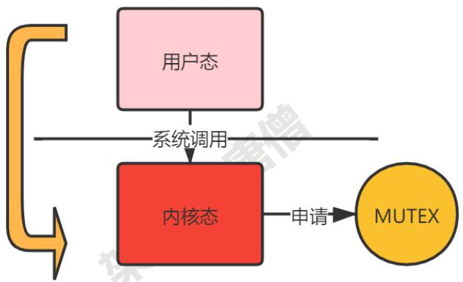

申请重量级锁

确实jdk1.6之前每次获取的都是重量级锁，无疑在很多场景下性能不高，故jdk1.6对synchronized做了很大程度的优化，其目的就是为了减少这种重量级锁的使用。

整体锁升级的过程大致可以分为两条路径，如下：

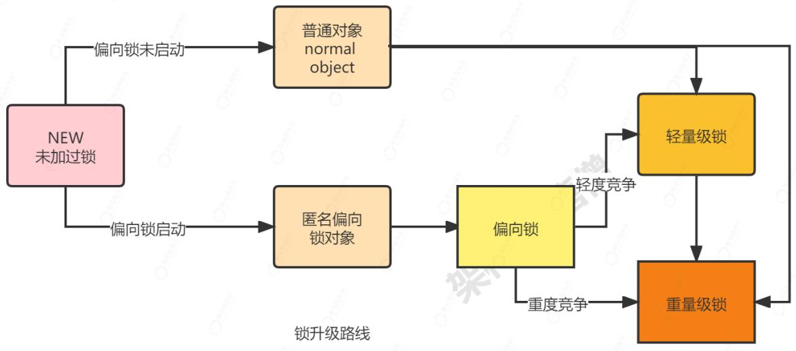

# 1、偏向锁未启动，默认轻量级锁

// 未使用过锁的状态

```
public static void noSyn() throws InterruptedException {
    Object obj = new Object();
    System.out.println(ClassLayout.parseInstance(obj).toPrintable());
    //如果调用了hashcode
    int hashCode = obj.hashCode();
    System.out.println("调用hashcode");
    System.out.println(ClassLayout.parseInstance(obj).toPrintable());
    System.out.println("尝试加锁");
    //使用synchronized
    synchronized (obj) {
    System.out.println(ClassLayout.parseInstance(obj).toPrintable());
    }
System.out.println("退出锁,查看一下");
//退出锁 查看obj
System.out.println(ClassLayout.parseInstance(obj).toPrintable());
System.out.println("开始有竞争了");
// 竞争一下子
for (int i=0;i<2;i++) {
    new Thread(() -> {
    synchronized (obj) {

    System.out.println(ClassLayout.parseInstance(obj).toPrintable());
    }
}).start();
}
TimeUnit.SECONDS.sleep(2);
System.out.println("退出竞争了");
System.out.println(ClassLayout.parseInstance(obj).toPrintable());
}
```

轻量级锁：线程在自己的线程栈生成 Lock Record，使用CAS的方式将markword设置为指向自己线程LOCK Record的指针，设置成功者得锁。竞争会让锁膨胀为重量级锁。

# 2、偏向锁启动

偏向锁，偏向的是第一个来获取锁的线程。所谓上偏向锁，指的是获取锁的线程在markword中写自己的线程ID的过程，偏向锁升级为轻量级锁时首先要撤销偏向锁，如何设置轻量级锁。

偏向锁默认是打开的，但是启动有一个时延，默认4s，之所以要延迟，是因为JVM虚拟机自己有一些默认的启动线程，里面有好多sync代码，这些代码启动时就肯定会有竞争，如果直接使用偏向锁，就会造成偏向锁不断的进行锁撤销和锁升级的操作，效率较低。

```
static void biasedLocking() throws InterruptedException {
    Thread.sleep(5000); // 或开启 -XX:BiasedLockingStartupDelay=0
    System.out.println("等待偏向锁启动");
    Object o = new Object();
    System.out.println(ClassLayout.parseInstance(o).toPrintable()); // 偏向状态正常开启
    System.out.println("开始获取锁");
    synchronized (o){
    // 偏向锁执行
    System.out.println(ClassLayout.parseInstance(o).toPrintable());
    }
    // 代码块已退出
    System.out.println("锁释放");
    // 再次打印对象 o 的 markword 可以看出对象依然是偏向状态 Thread ID 被设置为主线程
    System.out.println(ClassLayout.parseInstance(o).toPrintable());
    System.out.println("再开一个线程获取锁");
    new Thread(() -> {
    synchronized (o) {
    System.out.println(ClassLayout.parseInstance(o).toPrintable()); // 我们可以看到偏向被撤销
    }
}).start();
    TimeUnit.SECONDS.sleep(1);
System.out.println("锁释放");
System.out.println(ClassLayout.parseInstance(o).toPrintable());
System.out.println("有竞争");
//开启子线程
for (int i=0;i<2;i++) {
    new Thread(() -> {
    synchronized (o) {
    System.out.println(ClassLayout.parseInstance(o).toPrintable()); // 我们可以看到偏向被撤销
    }
}).start();
}

Thread.sleep(1000);
System.out.println("锁被释放");
//我们再次查看对象 o 的mark word 偏向被撤销（无锁状态）
System.out.println(ClassLayout.parseInstance(o).toPrintable());
}
```

markword后三位：101

细心的你也许会发现，还未加锁时，对象的锁状态位就已经是101了，的确，偏向锁一旦启动后，这时候New出来的对象就是匿名偏向锁对象，就是说他已经就是偏向锁了，但是没有线程ID，里面空的。有线程来抢，将自己的ID贴出来，就是偏向锁。

另外注意：如果已启动偏向锁，但是加锁前调用了hashcode，则无法使用偏向锁原因是markword中存了hashcode后没位置存偏向锁线程id了，加锁时直接就是轻量级锁了。

另外：有锁升级，是不是也有锁降级呢？

https://www.zhihu.com/question/63859501

STW

# 锁消除，锁粗化

锁消除（lock eliminate）：虚拟机的运行时编译器在运行时如果检测到一些要求同步的代码上不可能发生共享数据竞争，则会去掉这些锁。

```
// 锁消除 append方法本身是添加了synchronized的，但sb变量是线程私有的不会发生竞争
public static void lockEliminate() {
    StringBuffer sb = new StringBuffer();
    sb.append("hello").append("ts");
}
```

锁粗化（Lock coarsening）：将临近的代码块用同一个锁合并起来。

// 锁粗化

```
public static String lockCoarsening() {
    int i=0;
    StringBuffer sb = new StringBuffer();
    while (i<100) {
    sb.append(i);
    i++;
    }
    return sb.toString();
} 
```

# 一些经验

- 降低锁的等级

能用对象级别的，尽量别用类锁，能用实例变量的不要用静态变量

- 减少锁的时间

不需要同步执行的代码，能不放在同步块里面执行就不要放在同步快内，可以让锁尽快释放

- 减少锁的粒度

共享资源数决定锁的数量。有一组资源定义一把锁，而不是多组资源共用一把锁，增加并行度，从而降低锁竞争，典型如分段锁

- 减少加减锁的次数

假如有一个循环，循环内的操作需要加锁，我们应该把锁放到循环外面，否则每次进出循环，都要加锁

- 读写锁

业务细分，读操作加读锁，可以并发读，写操作使用写锁

- 善用volatile

volatile的控制比synchronized更轻量化，在某些变量上不涉及多步打包操作和原子性问题，可以加以运用。

如ConcurrentHashMap的get操作，使用的volatile而不是加锁

# 2.3 ThreadLocal

# 2.3.1 概念

ThreadLocal类并不是用来解决多线程环境下的共享变量问题，而是用来提供线程内部的独享变量。在多线程环境下，可以保证各个线程之间的变量互相隔离、相互独立。

# 2.3.2 使用

ThreadLocal实例一般定义为private static类型的，在一个线程内，该变量共享一份，类似上下文作用，可以用来上下传递信息。

```
public class App {
private static ThreadLocal Appalachott threadLocal = new ThreadLocal <>(); 
public static void main(String[] args) throws InterruptedException {
    Thread t1 = new Thread(() -> {
    threadLocal.set(new App());
    App app = threadLocal.get();
    System.out.println(Thread.currentThread().getName()+"---"+app);
    }, "t1");
    Thread t2 = new Thread(() -> {
    App app = threadLocal.get();
    System.out.println(Thread.currentThread().getName()+"---"+app);
    }, "t2");

    t1.start();
    t1.join();

    t2.start();
    t2.join();
} 
```

# 2.3.3 应用场景

- 数据库连接

- 下面的基于日志平台的访问链路追踪中，会用到

- 上下文传递参数

# 2.3.4 实现原理

先明白类关系：

- Thread, ThreadLocal是两个独立的类

- 在Thread中有个属性叫threadLocals，它的类型是ThreadLocalMap

- ThreadLocalMap是一个内部类，在ThreadLocal里......

这个存储结构的思路是反转的....

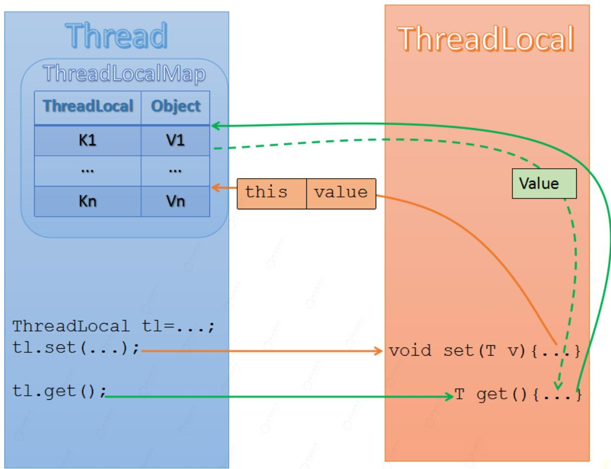

1. set方法源码

```
public void set(T value) {
    // 取到当前线程
    Thread t = Thread.currentThread();
    // 从当前线程中拿出Map
    ThreadLocalMap map = getMap(t);
    if (map != null)
    // 如果非空，说明之前创建过了
    // 以当前创建的ThreadLocal对象为key，需要存储的值为value，写入Map
    // 因为每个线程Thread里有自己独自的Map，所以起到了隔离作用
    map.set(this, value);
    else
    // 如果没有，那就创建
    createMap(t, value);
}
```

1. get方法源码

```
public T get() {
    Thread t = Thread.currentThread();
    // 获取到当前线程下的Map
    ThreadLocalMap map = getMap(t);
    if (map != null) {
    // 如果非空，根据当前ThreadLocal为key，取出对应的价值即可
ThreadLocalMap.Entry e = map.getEntry(this);
if (e != null) {
    @SuppressWarnings("unchecked")
    T result = (T)e.value;
    return result;
}
//如果map是空的，往往返回一个初始值，这是一个protect方法
//这就是为什么创建ThreadLocal的时候往往要求实现这个方法
returnInterstitialValue();
}
```

1. remove方法

```
public void remove() {
ThreadLocalMap m = getMap(Thread.currentThread());
//很简单，获取到map后，调用remove移除掉
if (m != null)
    m.remove(this);
}
```

4）内存泄露问题如何解决

在上述的get方法中，Entry类继承了WeakReference，即每个Entry对象都有一个ThreadLocal的弱引用，GC对于弱引用的对象采取积极的内存回收策略，避免无人搭理时发生内存泄露。

```
ThreadLocalMap.Entry e = map.getEntry(this); 
/**...*/
static class ThreadLocalMap {

    /**...*/
    static class Entry extends WeakReference<ThreadLocal<?>> {...} 
```

验证代码：

```
ThreadLocal local = new ThreadLocal();
local.set(100);
System.out.println(local.get());
System.gc();
//不会回收，因为local被强引用
System.out.println(local.get());
local = null;
//debug，查看currentThread里面的localMaps
//注意table里的reference
Thread currentThread = Thread.currentThread();
//断点1：虽然local被赋值null，但是ThreadLocal内部依然存在引用（内存泄露风险！）
System.out.println(1);
System.gc();
//断点2: gc后，引用消失
system.out.println(2);
```

ThreadLocal对象只是作为ThreadLocalMap的一个key而存在的，现在它被回收了，那么value呢？针对这一问题，ThreadLocalMap类在每次get()，set()，remove() ThreadLocalMap中的值的时候，会自动清理key为null的value。如此一来，value也能被回收了。

用完ThreadLocal后，手动remove是一个好习惯！

# 2.3.5 注意!

ThreadLocal如果指向了同一个引用，会打破隔离而失效。

案例：隔离失败了！

```java
package com.itheima.thread;

import java.util.HashMap;
import java.util.Map;

public class BadLocal {

    public static void main(String[] args) {
    ThreadLocal<Map> local = new ThreadLocal();
    Map map = new HashMap();
    new Thread(() -> {
    // 在线程设置后，过段时间取name
    // 猜一猜结果？
    map.put("name", "i am "+Thread.currentThread().getName());
    local.set(map);
    System.out.println(Thread.currentThread().getName()+"":" +local.get().get("name"));
    // do something...
    try {
    Thread.sleep(1000);
    } catch (InterruptedException e) {
    e.printStackTrace();
    }
    System.out.println(Thread.currentThread().getName()+"":" +local.get().get("name"));
    }, "t1").start();

    new Thread(() -> {
    // 在线程中赋值name
    map.put("name", "i am "+Thread.currentThread().getName());
    local.set(map);
    }, "t2").start();
    }
}
```

https://cdn-mineru.openxlab.org.cn/result/2026-05-18/b510c52e-283a-412d-b3d5-716391c497e9/4595322972ae32376d885bf3417eefd86dbae73f842b65eee2a95533374c6dcd.jpg