ELK异构数据同步


ELKstack

# 概述

# 什么是ELK

ELK是三个开源软件的缩写，分别表示：Elasticsearch, Logstash, Kibana，它们都是开源软件

- Elasticsearch是强大的数据搜索引擎，并且是分布式、能够通过restful方式进行交互的近实时搜索平台框架

- Logstash是免费且开源的服务器端数据处理通道，能够从多个来源收集数据，能够对数据进行转换和清洗，将转换数据后将数据发送到数据存储库中，并且不受格式和复杂度的影响。

- Kibana是针对Elasticsearch的开源分析及可视化平台，用于搜索、查看交互存储在Elasticsearch索引中的数据。

# ELK能做什么

# 日志收集

一般我们需要进行日志分析场景：直接在日志文件中 grep、awk 就可以获得自己想要的信息

$1

# grep / awk / sed

但在规模较大的场景中，此方法效率低下，面临问题包括日志量太大如何归档、文本搜索太慢怎么办、如何多维度查询，需要集中化的日志管理，所有服务器上的日志收集汇总，常见解决思路是建立集中式日志收集系统，将所有节点上的日志统一收集，管理，访问。

企业常用的ELK架构图

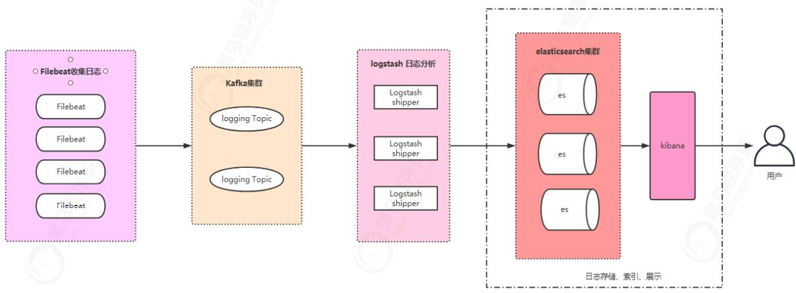

一般大型系统是一个分布式部署的架构，不同的服务模块部署在不同的服务器上，问题出现时，大部分情况需要根据问题暴露的关键信息，定位到具体的服务器和服务模块，构建一套集中式日志系统，可以提高定位问题的效率。

一个完整的集中式日志系统，需要包含以下几个主要特点：

- 收集 - 能够采集多种来源的日志数据

- 传输 - 能够稳定的把日志数据传输到中央系统

- 存储 - 如何存储日志数据

- 分析 - 可以支持 UI 分析

- 警告 - 能够提供错误报告，监控机制

ELK提供了一整套解决方案，并且都是开源软件，之间互相配合使用，完美衔接，高效的满足了很多场合的应用，是目前主流的一种日志分析平台。

# 异构数据同步

我们可以借助ELK来帮助我们将数据库中的数据同步到ES中

我们要将MySQL中的数据同步到ES中可能比较麻烦，但是我们借助 ELK+Canal 可以很轻易的就可以实现，我们现在要做一个全国小区房产的全文检索系统，但是使用MySQL进行全文检索会很麻烦，我们要使用ElasticSearch进行全文检索，就要涉及到异构数据的同步。

下面是我们的整体架构图


# 常用组件介绍

我们实现异构数据同步平台涉及到一下的组件

# MySQL服务

MySQL是我们的主数据库，所有的操作都会写入到MySQL数据库，这个是我们的主要的数据库，因为MySQL不适合于全文检索，所以我们需要将数据同步的ES中，通过ES来进行全文检索

# Canal

canal是用java开发的基于数据库增量日志解析，提供增量数据订阅&消费的中间件。

目前，canal主要支持了MySQL的binlog解析，解析完成后才利用canal client用来处理获得的相关数据。（数据库同步需要阿里的otter中间件，基于canal）

我们这里使用Canal同步来将我们的MySQL的数据同步到ES中

# canal 原理

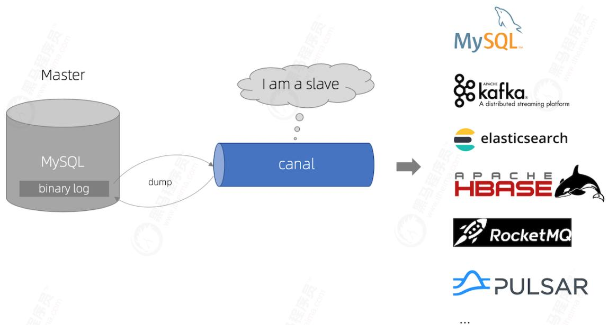

canal的工作原理就是把自己伪装成MySQL slave，模拟MySQL slave的交互协议向MySQL Mater发送dump协议，MySQL mater收到canal发送过来的dump请求，开始推送binary log给canal，然后canal解析binary log，再发送到存储目的地，比如MySQL，Kafka，Elastic Search等等。

# RabbitMQ

RabbitMQ是实现了高级消息队列协议（AMQP）的开源消息代理软件（亦称面向消息的中间件）

我们这里使用RabbitMQ来进行消息的削峰填谷，因为全国的房产数据的操作会很频繁，数据量很大的情况下我们需要使用MQ来进行缓冲数据，这样可以进行大量数据的快速同步

# Logstash

Logstash是具有实时流水线能力的开源的数据收集引擎

Logstash可以动态统一不同来源的数据，并将数据标准化到您选择的目标输出，它提供了大量插件，可帮助我们解析，丰富，转换和缓冲任何类型的数据。

我们需要使用logstash对RabbitMQ过来的数据进行解析以及清晰，并将清洗过的数据放进ES中

# ElasticSearch

Elasticsearch 是一个分布式的开源搜索和分析引擎，在 Apache Lucene 的基础上开发而成。

我们使用ElasticSearch存储logstash清洗完成的数据，通过ES可以对数据进行全文检索，Elasticsearch还是一个分布式文档数据库，其中每个字段均可被索引，而且每个字段的数据均可被搜索，ES能够横向扩展至数以百计的服务器存储以及处理PB级的数据，可以在极短的时间内存储、搜索和分析大量的数据

# kibana

针对es的ES的开源分析可视化工具，与存储在ES的数据进行交互

Kibana是一个开源的分析与可视化平台，设计出来用于和Elasticsearch一起使用的，你可以用kibana搜索、查看存放在Elasticsearch中的数据，Kibana与Elasticsearch的交互方式是各种不同的图表、表格、地图等，直观的展示数据，从而达到高级的数据分析与可视化的目的。

# ES物理部署

# ES单机部署

# 下载 Elasticsearch

我们下载的Elasticsearch 版本是 7.17.5，下载地址

```
https://www.elastic.co/cn/downloads/past-releases/elasticsearch-7-17-5 
wget https://artifacts.elastic.co/downloads/elasticsearch/elasticsearch-7.17.5-linux-x86_64.tar.gz
tar -zvxf elasticsearch-7.17.5-linux-x86_64.tar.gz 
```

# 配置 Elasticsearch

# 关闭防火墙

```
systemctl status firewalld.service
systemctl stop firewalld.service
systemctl disable firewalld.service 
```

# 配置elasticsearch.yml

该配置文件是ES的主配置文件

```
vi elasticsearch.yml 
```

\#设置允许访问地址，配置位0.0.0.0允许任意主机访问

```
- #network.host: 192.168.0.1
+ network.host: 0.0.0.0 
```

# 配置集群

```
# node.name: node-1
+ node.name: node-1

- #discovery.seed_hosts: ["host1", "host2"]
discovery.seed_hosts: ["node-1"]

- #cluster.initial_master_nodes: ["node-1", "node-2"]
+ cluster.initial_master_nodes: ["node-1"] 
```

# 修改Linux句柄数

# 查看当前最大句柄数

```
sysctl -a | grep vm.max_map_count 
```

# 修改句柄数

```
vi /etc/sysctl.conf
+ vm.max_map_count=262144 
```

# 生效配置

修改后需要重启才能生效，不想重启可以设置临时生效

```
sysctl -w vm.max_map_count=262144 
```

# 关闭swap

因为ES的数据大量都是常驻内存的，一旦使用了虚拟内存就会导致查询速度下降，一般需要关闭swap，但是要保证有足够的内存

# 临时关闭

```
swapoff -a 
```

# 永久关闭

```
vi /etc/fstab 
```

# 注释掉 swap 这一行的配置

```
#
# /etc/fstab
# Created by anaconda on Wed Aug 10 14:17:08 2022
#
# Accessible filesystems, by reference, are maintained under '/dev/disk'
# See man pages fstab(5), findfs(8), mount(8) and/or blkid(8) for more info
#
/dev/mapper/centos_bogon-root /
    xfs defaults 0 0
UUID=bc65ec9e-cb8c-4ec9-8d21-b51c0bd3aedd /boot
    xfs defaults 0 0
/dev/mapper/centos_bogon-swap swap swap defaults 0 0 
```

# 修改最大线程数

因为ES运行期间可能创建大量线程，如果线程数支持较少可能报错

# 配置修改

修改后需要重新登录生效

```
vi /etc/security/limits.conf 
```

# 添加以下内容

```
* soft nofile 65536
* hard nofile 65536
* soft nproc 4096
* hard nproc 4096 
```

# 重启服务

```
reboot 
```

# 创建ES用户

注意ES不能以 root 用户启动，否则会报错

# 添加用户

```
useradd elasticsearch
passwd elasticsearch 
```

# 增加管理员权限

增加sudoers权限

```
vi /etc/sudoers 
+ elasticsearch ALL=(ALL) ALL 
```

# 修改Elasticsearch权限

给ES的安装目录进行授权

```
chown -R elasticsearch:elasticsearch elasticsearch-7.17.5 
```

# JVM配置

根据自己的内存自行调整，内存不够则会启动失败

```
vi jvm.options 
- ##-Xms4g
- ##-Xmx4g
+ -Xms4g
+ -Xmx4g 
```

# 添加IK分词器

因为后面要用到IK分词，所以我们要安装以下IK分词器

# 查找

在github中下载对应版本的分词器

```
https://github.com/medcl/elasticsearch-analysis-ik/releases 
```

根据自己的ES版本选择相应版本的IK分词器，因为安装的ES是7.17.5，所以也下载相应的IK分词器


# 解压

将下载的分词器复制到ES安装目录的 plugins 目录中并进行解压

```
mkdir ik && cd ik
unzip elasticsearch-analysis-ik-7.17.5.zip 
```

# 启动ElasticSearch

# 切换用户

切换到刚刚创建的 elasticsearch 用户

```
su elasticsearch 
```

# 启动命令

我们可以使用以下命令来进行使用

```
# 前台启动
sh bin/elasticsearch
# 后台启动
sh bin/elasticsearch -d
```

# 访问测试

访问对应宿主机的 9200 端口

```
http://192.168.245.151:9200/ 
```

# 重启ElasticSearch

# 查找进程

先查找ElasticSearch的进程号

```
ps -ef | grep elastic 
```

# 杀死进程

杀死对应的进程

```
kill -9 49736 
```

# 启动ElasticSearch

注意不要使用ROOT用户启动

```
sh bin/elasticsearch -d 
```

# kibana安装

# 下载安装 Kibana

kibana 版本 7.17.5

下载地址：https://www.elastic.co/cn/downloads/past-releases/kibana-7-17-5

```
wget https://artifacts.elastic.co/downloads/kibana/kibana-7.17.5-linux-x86_64.tar.gz
tar -zvxf kibana-7.17.5-linux-x86_64.tar.gz
mv kibana-7.17.5-linux-x86_64 kibana-7.17.5 
```

# 配置 Kibana

```
vi config/kibana.yml 
- #server.port: 5601
+ server.port: 5601
- #server.host: "localhost"
+ server.host: "0.0.0.0"
- #elasticsearch.hosts: ["http://localhost:9200"]
+ elasticsearch.hosts: ["http://localhost:9200"] 
```

# 启动 Kibana

# 切换用户

Kibana也不能以root用户运行，需要切换到elasticsearch权限

```
su elasticsearch 
```

# 启动kibaba

```
#前台运行
sh bin/kibana
#后台运行
nohup sh bin/kibana >/dev/null 2>&1 &
```

# 访问测试

访问对应宿主机的 5601 端口

```
http://192.168.245.151:5601/ 
```

# ES快速入门

下面我们看下ES的一些基本使用

# 索引管理

我们使用数据库的第一步就是创建数据库，同样ES也是一样的，第一步也是对索引进行管理

# 列出索引

我们使用索引的第一步就是列出索引，查看当前数据库有哪些索引

```
GET/_cat/indices?v 
```


| elastic | Search Elastic |
| ------- | -------------- |
|         |                |


| Console Search Profiler Grok Debugger Painless Lab BETA |                     |      |                                            |                        |                                                           |      |      |      |      |      |      |
| ------------------------------------------------------- | ------------------- | ---- | ------------------------------------------ | ---------------------- | --------------------------------------------------------- | ---- | ---- | ---- | ---- | ---- | ---- |
| History Settings Help                                   |                     |      |                                            |                        |                                                           |      |      |      |      |      |      |
| 1                                                       | GET /_cat/indices?v | 1    | health status index                        | uuid                   | pri rep docs.count docs.deleted store.size pri.store.size |      |      |      |      |      |      |
|                                                         |                     | 2    | green open .geoip_databases                | 22PpW997SFa8nres88uUtw | 1 0 40 0 37.6mb 37.6mb                                    |      |      |      |      |      |      |
|                                                         |                     | 3    | green open .kibana_7.17.5_001              | Jq4BW_VVTbW7Rgcbf1dNoQ | 1 0 563 46 4.8mb 4.8mb                                    |      |      |      |      |      |      |
|                                                         |                     | 4    | green open .apm-custom-link                | EYySqkEhQkKKwLF2EIYjDg | 1 0 0 0 226b 226b                                         |      |      |      |      |      |      |
|                                                         |                     | 5    | green open .apm-agent-configuration        | RmHWY-DORr-zANAaVP_2hg | 1 0 0 0 226b 226b                                         |      |      |      |      |      |      |
|                                                         |                     | 6    | green open .kibana_task_manager_7.17.5_001 | ss8TrkwvQbqT9siamPfZPg | 1 0 17 952 3.7mb 3.7mb                                    |      |      |      |      |      |      |
|                                                         |                     | 7    | yellow open itheima                        | myHFuchATde07hcjQc1EeQ | 1 1 1 0 3.9kb 3.9kb                                       |      |      |      |      |      |      |
|                                                         |                     | 8    | green open .tasks                          | 1mFA2NFBROitED28r5FrqA | 1 0 2 0 7.8kb 7.8kb                                       |      |      |      |      |      |      |
|                                                         |                     | 9    |                                            |                        |                                                           |      |      |      |      |      |      |

# 创建索引

我们接下来要使用索引就需要创建索引了，Elasticsearch使用PUT方式来实现索引的新增

可以在创建索引的时候不添加任何参数，系统会为你创建一个默认的索引，当然你可以添加附加一些配置信息

PUT customer

# 这样我们就创建了一个索引

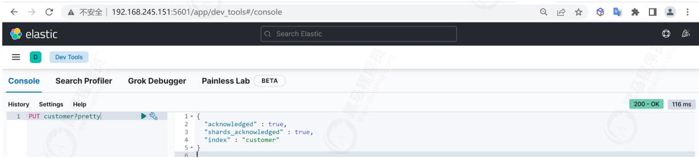

# 查看索引

索引创建完成后，我们接下来就需要对索引进行查询

get customer


# 结果说明

这里返回了一堆数据，具体什么含义呢，我们需要查看字段的详细信息

| 字段                              | 内容                                                         |
| --------------------------------- | ------------------------------------------------------------ |
| aliases                           | 别名                                                         |
| mappings                          | 映射                                                         |
| settings                          | 配置                                                         |
| settings.index.creation_date      | 创建时间                                                     |
| settings.index.number_of_shards   | 数据分片数,索引要做多少个分片,只能在创建索引时指定,后期无法修改 |
| settings.index.number_of_replicas | 数据备份数,每个分片有多少个副本,后期可以动态修改             |
| settings.index.uuid               | 索引id                                                       |
| settings.index.provided_name      | 名称                                                         |

# 索引是否存在

有时候我们需要检查索引时候存在，我们可以使用HEAD命令验证索引是否存在

HEAD customer

出现200表示索引存在

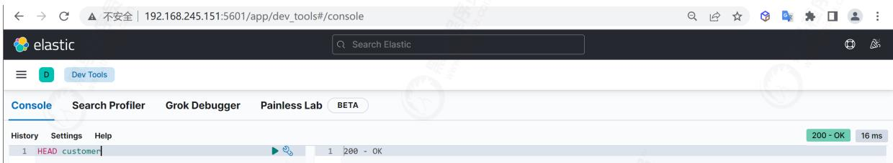

# 关闭索引

在一些业务场景，我们可能需要禁止掉某些索引的访问功能，但是又不想删除这个索引

post customer/_close

这里我们就把这个索引给关闭了

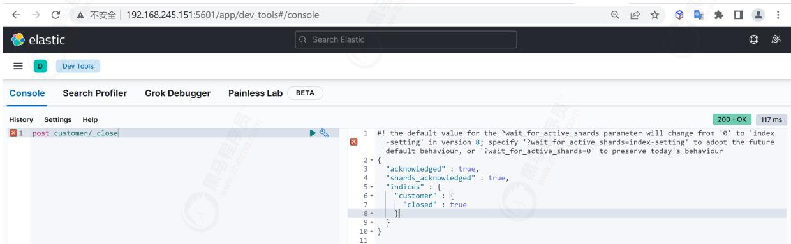

# 查看索引列表

再次查看索引列表，查看索引的状态

```
GET/_cat/indices?v 
```

我们发现索引已经被关闭了

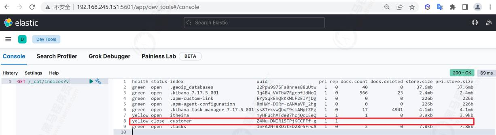

# 为什么关闭索引

如果关闭了一个索引，就无法通过Elasticsearch来读取和写入其中的数据，直到再次打开它

在现实世界中，最好永久地保存应用日志，以防要查看很久之前的信息，另一方面，在Elasticsearch中存放大量数据需要增加资源，对于这种使用案例，关闭旧的索引非常有意义，你可能并不需要那些数据，但是也不想删除它们。

一旦索引被关闭，它在Elasticsearch内存中唯一的痕迹是其元数据，如名字以及分片的位置，如果有足够的磁盘空间，而且也不确定是否需要在那个数据中再次搜索，关闭索引要比删除索引更好，关闭它们会让你非常安心，随时可以重新打开被关闭的索引，然后在其中再次搜索

# 打开索引

如果我们需要继续启动索引可以直接打开索引

```
post customer/_open 
```

现在我们已经打开了索引

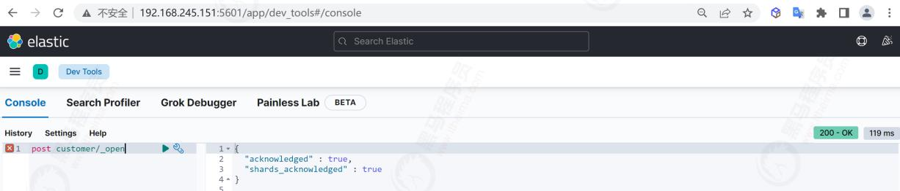

# 查看索引列表

```
GET/_cat/indices?v 
```

现在索引的状态已经是打开的状态了

← → C ▲ 不安全 | 192.168.245.151:5601/app/dev_tools#/console

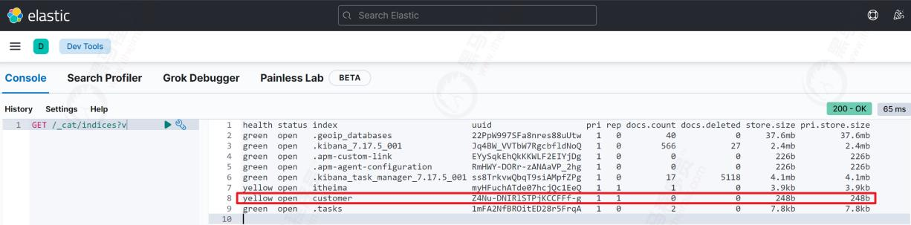

# 删除索引

如果索引中的数据已经不需要了，可以被删除，我们是可以删除索引的，使用以下命令可以删除索引

```
delete customer 
```

这样我们就把索引给删除了

```
← → C ▲ 不安全 | 192.168.245.151:5601/app/dev_tools#/console
```

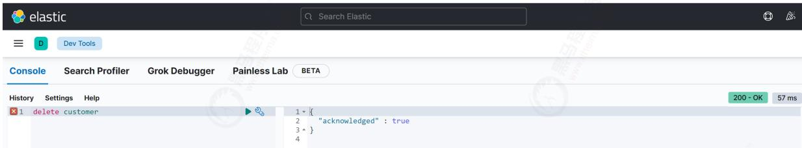

# 映射管理

映射的创建时基于索引的，你必须要先创建索引才能创建映射，es中的映射相当于传统数据库中的表结构，数据存储的格式就是通过映射来规定的

# 创建映射

可以在创建索引时指定映射，其中 mappings.properties 为固定结构，指定创建映射属性

```
PUT customer
{
    "mappings": {
    "properties": {
    "name": {
    "type": "keyword"
    },
    "age": {
    "type": "integer"
    }
    }
} 
```

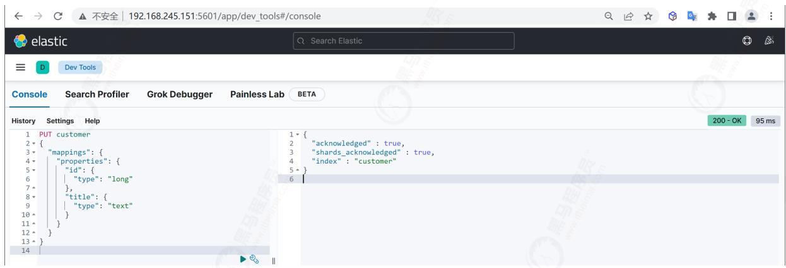

# 查看映射

查看索引完全信息，内容包含映射信息

```
GET customer/_mapping 
← → C ▲ 不安全 | 192.168.245.151:5601/app/dev_tools#/console
```


# 文档管理

# 创建文档(业务ID)

创建文档的时候我们可以手动来指定ID，但是一般不推荐，回对ES插入性能造成影响

如果手动指定ID，为了保证ID不冲突，会先查询一次文档库，如果不存在则进行插入，手动插入多了一次查询操作，性能会有损失。

# 操作说明

- 文档可以类比为关系型数据库中的表数据，添加的数据格式为 JSON 格式

- 注意需要在索引后面添加_doc，表示操作文档

- 在未指定id生成情况，每执行一次post将生成一个新文档

- 如果index不存在，将会默认创建

# 使用示例

新增文档，自动生成文档id，并且如果如果添加文档的索引不存在时会自动创建索引

```
post customer/_doc/1
{
    "name": "张三",
    "age": 15
}
```

# 这样我们就创建了一个文档

← → Ⓗ 不安全 | 192.168.245.151:5601/app/dev_tools#/console

- 


# 返回结果说明

```
{
    "_index": "customer", #所属索引
    "_type": "_doc", #所属mapping type
    "_id": "1", #文档id
    "_version": 1, #文档版本
    "result": "created", #文档创建成功
    "_shards": {
    "total": 2, #所在分片有两个分片
    "successful": 1, #只有一个副本成功写入，可能节点机器只有一台
    "failed": 0 #失败副本数
    },
    "_seq_no": 0, #第几次操作该文档
    "_primary_term": 1 #词项数
}
```

# 创建文档(自动ID)

为了提高插入文档效率，我们一般会使用自动生成ID，这样减少一次插入时的查询性能损耗，插入时不指定文档ID，ES就会自动生成ID

自动生成的ID是一个不会重复的随机数，使用GUID算法，可以保证在分布式环境下，不同节点同一时间创建的_id一定是不冲突的

```
post customer/_doc
{
    "name": "李四",
    "age": 50
}
```

这样创建了一个文档，并且文档ID是系统自动生成的_id

← → C 不安全 | 192.168.245.151:5601/app/dev_tools#/console

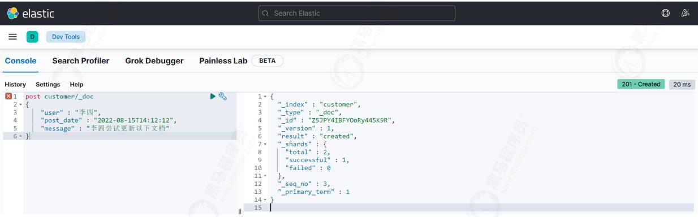

# 更新文档

更新文档和插入文档一样，如果文档ID一致则会进行覆盖更新，而更新又分为全量更新和增量更新

# 全量更新

和新增文档一样，输入相同的 URL 地址请求，如果请求体变化，会将原有的数据内容覆盖

```
post customer/_doc/1
{
    "name": "张三",
    "age": 50
}
```

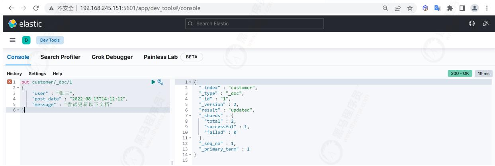

# 增量更新

通过指定_doc 方式默认是全量更新，如果需要更新指定字段则需要将_doc 改为_update，请求内容需要增加doc表示，原始{"key": value}，更新{"doc": {"key": value}}

```
post customer/_update/1
{
    "doc": {
    "age": 55
    }
} 
```

# 查询文档

# 验证是否存在

可以通过以下命令检查文档是否存在

```
HEAD customer/_doc/1 #查看是否存储，返回200表示已存储
```

# 查询文档

```
GET customer/_doc/1 #返回源数据的查询
```

# 不返回source

有时候只是查询，不需要具体的源文档字段，这样可以提高查询速度，可以使用以下方式

```
GET customer/_doc/1?_source=false 
```

# 查询所有

上述只能查询单个，可以查询所有文档，将_doc 替换为_search

```
GET customer/_search 
```

# 删除文档

# 根据文档ID删除

我们可以根据文档ID进行删除

```
DELETE customer/_doc/1 #指定文档id进行删除
```

# 根据条件删除

根据查询条件删除，会先查询然后在删除，可能耗时会比较长

```
post customer/_delete_by_query
{
    "query": {
    "match": {
    "age": "15"
    }
    }
} 
```

# 中文分词器

# IKAnalyzer

IKAnalyzer是一个开源的，基于java的语言开发的轻量级的中文分词工具包

从2006年12月推出1.0版开始，IKAnalyzer已经推出了3个大版本，在2012版本中，IK实现了简单的分词歧义排除算法，标志着IK分词器从单纯的词典分词向模拟语义分词衍化

# 使用IK分词器

IK提供了两个分词算法:

- ik_smart: 最少切分。

- ik_max_word：最细粒度划分。

ik_smart

使用案例

原始内容

传智教育的教学质量是杠杠的

# 测试分词

```
GET _analyze
{
    "analyzer": "ik_smart",
    "text": "传智教育的教学质量是杠杠的"
}
```


ik_max_word

使用案例

原始内容

传智教育的教学质量是杠杠的

# 测试分词

```
GET _analyze
{
    "analyzer": "ik_max_word",
    "text": "传智教育的教学质量是杠杠的"
}
```


# 自定义词库

我们在使用IK分词器时会发现其实有时候分词的效果也并不是我们所期待的

# 问题描述

例如我们输入“传智教育的教学质量是杠杠的”，但是分词器会把“传智教育”进行拆开，分为了“传”，“智”，“教育”，但我们希望的是“传智教育”可以不被拆开。

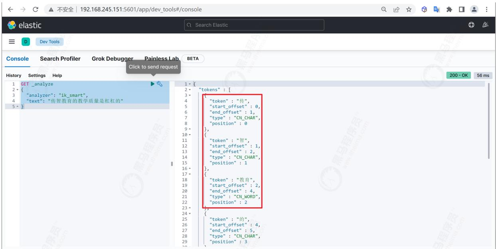

# 解决方案

对于以上的问题，我们只需要将自己要保留的词，加到我们的分词器的字典中即可

# 编辑字典内容

进入elasticsearch目录 plugins/ik/config 中，创建我们自己的字典文件 yixin.dic，并添加内容：

```
cd plugins/ik/config
echo "传智教育" > custom.dic
[root@localhost config]# echo "传智教育" > custom.dic
[root@localhost config]# cat custom.dic
传智教育
[root@localhost config]#
```

# 扩展字典

进入我们的elasticsearch目录：plugins/ik/config，打开IKAnalyzer.cfg.xml文件，进行如下配置：

```
vi IKAnalyzer.cfg.xml
#增加如下内容
<entry key="ext_dict">custom.dic</entry>
```

# 再次测试

重启ElasticSearch，再次使用kibana测试

```
GET _analyze
{
    "analyzer": "ik_max_word",
    "text": "传智教育的教学质量是杠杠的"
}
```

可以发现，现在我们的词汇"传智教育"就不会被拆开了，达到我们想要的效果了

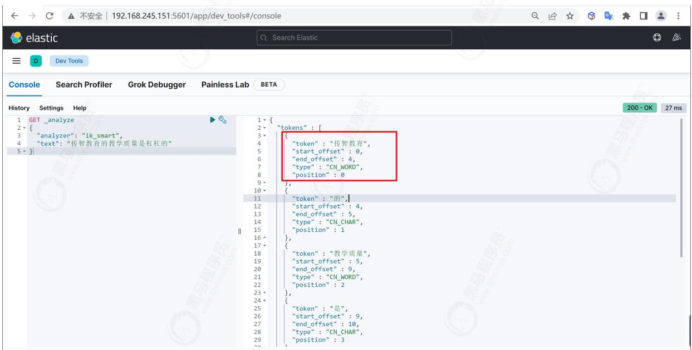

# ES服务集群部署

我们将ES的服务部署和同步服务部署分为两套，因为后期我们数据同步完成可以将异构数据同步的服务停止掉

# 服务布局

我们整体采用Docker方式进行布局，以下是我们需要部署的服务

| 服务名称   | 服务名称 | 开放端口 | 内存限制 |
| ---------- | -------- | -------- | -------- |
| ES-node1   | node-1   | 9200     | 1G       |
| ES-node2   | node-2   | 9201     | 1G       |
| ES-node3   | node-3   | 9202     | 1G       |
| ES-cerebro | cerebro  | 9000     | 不限     |
| kibana     | kibana   | 5601     | 不限     |

# 准备工作

# 创建挂载目录

\#创建ES的数据和配置目录

mkdir -p /tmp/data/elasticsearch/node-{1..3}/{config,plugins,data,log}

# 创建kibana的配置目录

mkdir -p /tmp/data/kibana/config

# 目录授权

```
chmod 777 /tmp/data/elasticsearch/node-{1..3}/{config,plugins,data,log}
chmod 777 /tmp/data/kibana/config 
```

# 修改Linux句柄数

# 查看当前最大句柄数

```
sysctl -a | grep vm.max_map_count 
```

# 修改句柄数

```
vi /etc/sysctl.conf 
+ vm.max_map_count=262144 
```

# 生效配置

修改后需要重启才能生效，不想重启可以设置临时生效

```
sysctl -w vm.max_map_count=262144 
```

# 关闭swap

因为ES的数据大量都是常驻内存的，一旦使用了虚拟内存就会导致查询速度下降，一般需要关闭swap，但是要保证有足够的内存

# 临时关闭

```
swapoff -a 
```

# 永久关闭

```
vi /etc/fstab 
```

注释掉 swap 这一行的配置

```
#
# /etc/fstab
# Created by anaconda on Wed Aug 10 14:17:08 2022
#
# Accessible filesystems, by reference, are maintained under '/dev/disk'
# See man pages fstab(5), findfs(8), mount(8) and/or blkid(8) for more info
#
//dev/mapper/centos_bogon-root /
UUID=bc65ec9e-cb8c-4ec9-8d21-b51c0bd3aedd /boot
# /dev/mapper/centos_bogon-swap swap 
```

# 修改最大线程数

因为ES运行期间可能创建大量线程，如果线程数支持较少可能报错

# 配置修改

修改后需要重新登录生效

```
vi /etc/security/limits.conf 
```

# 添加以下内容

```
* soft nofile 65536
* hard nofile 65536
* soft nproc 4096
* hard nproc 4096 
```

# 重启服务

```
reboot 
```

# 添加IK分词器

因为后面要用到IK分词，所以我们要安装以下IK分词器

# 查找

在github中下载对应版本的分词器

```
https://github.com/medcl/elasticsearch-analysis-ik/releases 
```

根据自己的ES版本选择相应版本的IK分词器，因为安装的ES是7.17.5，所以也下载相应的IK分词器


# 解压

将下载的分词器复制到ES安装目录的 plugins 目录中并进行解压

```
mkdir ik && cd ik
unzip elasticsearch-analysis-ik-7.17.5.zip 
```

# 安装

```
cp -R ik/ /tmp/data/elasticsearch/node-1/plugins/
cp -R ik/ /tmp/data/elasticsearch/node-2/plugins/
cp -R ik/ /tmp/data/elasticsearch/node-3/plugins/ 
```

# 编写配置文件

下面我们对三个节点的配置进行配置

# node-1

```
vi /tmp/data/elasticsearch/node-1/config/elasticsearch.yml 
```

\#集群名称

cluster.name: elastic

\#当前该节点的名称

node.name: node-1

\#是不是有资格竞选主节点

node.master: true

\#是否存储数据

node.data: true

\#最大集群节点数

node.max_local_storage_nodes: 3

\#给当前节点自定义属性（可以省略）

\#node.attr.rack: r1

\#数据存档位置

path.data: /usr/share/elasticsearch/data

\#日志存放位置

path.logs: /usr/share/elasticsearch/log

\#是否开启时锁定内存（默认为是）

\#bootstrap.memory_lock: true

\#设置网关地址，我是被这个坑死了，这个地址我原先填写了自己的实际物理IP地址，

\#然后启动一直报无效的IP地址，无法注入9300端口，这里只需要填写0.0.0.0

network.host: 0.0.0.0

\#设置映射端口

http.port: 9200

\#内部节点之间沟通端口

transport.tcp.port: 9300

集群发现默认值为127.0.0.1:9300,如果要在其他主机上形成包含节点的群集,如果搭建集群则需要填写

\#es7.x 之后新增的配置，写入候选主节点的设备地址，在开启服务后可以被选为主节点，也就是说把所有的节点都写上

discovery.seed_hosts: ["node-1", "node-2", "node-3"]

当你在搭建集群的时候，选出合格的节点集群，有些人说的太官方了，

\#其实就是，让你选择比较好的几个节点，在你节点启动时，在这些节点中选一个做领导者，

如果你不设置呢，elasticsearch就会自己选举，这里我们把三个节点都写上

cluster.initial_master_nodes: ["node-1", "node-2", "node-3"]

\#在群集完全重新启动后阻止初始恢复，直到启动N个节点

\#简单点说在集群启动后，至少复活多少个节点以上，那么这个服务才可以被使用，否则不可以被使用，

gateway.recover_after_nodes: 2

\#删除索引是是否需要显示其名称，默认为显示

\#action.destructive_requires_name: true

# 禁用安全配置，否则查询的时候会提示警告

xpack.security.enabled: false

# node-2

vi /tmp/data/elasticsearch/node-2/config/elasticsearch.yml

\#集群名称

cluster.name: elastic

\#当前该节点的名称

node.name: node-2

\#是不是有资格竞选主节点

node.master: true

\#是否存储数据

node.data: true

\#最大集群节点数

node.max_local_storage_nodes: 3

\#给当前节点自定义属性（可以省略）

\#node.attr.rack: r1

\#数据存档位置

path.data: /usr/share/elasticsearch/data

\#日志存放位置

path.logs: /usr/share/elasticsearch/log

\#是否开启时锁定内存（默认为是）

\#bootstrap.memory_lock: true

\#设置网关地址，我是被这个坑死了，这个地址我原先填写了自己的实际物理IP地址，

然后启动一直报无效的IP地址，无法注入9300端口，这里只需要填写0.0.0.0

network.host: 0.0.0.0

\#设置映射端口

http.port: 9200

\#内部节点之间沟通端口

transport.tcp.port: 9300

\#集群发现默认值为127.0.0.1:9300,如果要在其他主机上形成包含节点的群集,如果搭建集群则需要填写#es7.x 之后新增的配置，写入候选主节点的设备地址，在开启服务后可以被选为主节点，也就是说把所有的节点都写上

discovery.seed_hosts: ["node-1", "node-2", "node-3"]

\#当你在搭建集群的时候，选出合格的节点集群，有些人说的太官方了，

\#其实就是，让你选择比较好的几个节点，在你节点启动时，在这些节点中选一个做领导者，

\#如果你不设置呢，elasticsearch就会自己选举，这里我们把三个节点都写上

cluster.initial_master_nodes: ["node-1", "node-2", "node-3"]

\#在群集完全重新启动后阻止初始恢复，直到启动N个节点

\#简单点说在集群启动后，至少复活多少个节点以上，那么这个服务才可以被使用，否则不可以被使用，

gateway.recover_after_nodes: 2

\#删除索引是是否需要显示其名称，默认为显示

\#action.destructive_requires_name: true

# 禁用安全配置，否则查询的时候会提示警告

xpack.security.enabled: false

# node-3

vi /tmp/data/elasticsearch/node-3/config/elasticsearch.yml

\#集群名称

cluster.name: elastic

\#当前该节点的名称

node.name: node-3

\#是不是有资格竞选主节点

node.master: true

\#是否存储数据

node.data: true

\#最大集群节点数

node.max_local_storage_nodes: 3

\#给当前节点自定义属性（可以省略）

\#node.attr.rack: r1

\#数据存档位置

path.data: /usr/share/elasticsearch/data

\#日志存放位置

path.logs: /usr/share/elasticsearch/log

\#是否开启时锁定内存（默认为是）

\#bootstrap.memory_lock: true

\#设置网关地址，我是被这个坑死了，这个地址我原先填写了自己的实际物理IP地址，

\#然后启动一直报无效的IP地址，无法注入9300端口，这里只需要填写0.0.0.0

network.host: 0.0.0.0

\#设置映射端口

http.port: 9200

\#内部节点之间沟通端口

transport.tcp.port: 9300

\#集群发现默认值为127.0.0.1:9300,如果要在其他主机上形成包含节点的群集,如果搭建集群则需要填写

\#es7.x 之后新增的配置，写入候选主节点的设备地址，在开启服务后可以被选为主节点，也就是说把所有的节点都写上

discovery.seed_hosts: ["node-1", "node-2", "node-3"]

\#当你在搭建集群的时候，选出合格的节点集群，有些人说的太官方了，

\#其实就是，让你选择比较好的几个节点，在你节点启动时，在这些节点中选一个做领导者，

\#如果你不设置呢，elasticsearch就会自己选举，这里我们把三个节点都写上

cluster.initial_master_nodes: ["node-1", "node-2", "node-3"]

\#在群集完全重新启动后阻止初始恢复，直到启动N个节点

\#简单点说在集群启动后，至少复活多少个节点以上，那么这个服务才可以被使用，否则不可以被使用，

```
gateway.recover_after_nodes: 2 
```

\#删除索引是是否需要显示其名称，默认为显示

```
#action.destructive_requires_name: true 
```

# 禁用安全配置，否则查询的时候会提示警告

```
xpack.security.enabled: false 
```

kibana

```
vi /tmp/data/kibana/config/kibana.yml 
server.host: 0.0.0.0 
```

# 监听端口

```
server.port: 5601 
server.name: "kibana" 
```

# kibana访问es服务器的URL, 就可以有多个, 以逗号", "隔开

```
elasticsearch.hosts: ["http://node-1:9200", "http://node-2:9201", "http://node-
3:9202"] 
monitoring.ui.container.elasticsearch.enabled: true 
```

# kibana访问Elasticsearch的账号与密码(如果ElasticSearch设置了的话)

```
elasticsearch.username: "kibana" 
elasticsearch.password: "12345" 
```

# kibana日志文件存储路径

```
logging.dest: stdout 
```

# 此值为true时，禁止所有日志记录输出

```
logging.silent: false 
```

# 此值为true时，禁止除错误消息之外的所有日志记录输出

```
logging.quiet: false 
```

# 此值为true时，记录所有事件，包括系统使用信息和所有请求

```
logging.verbose: false 
ops.interval: 5000 
```

# kibana web语言

```
i18n.locale: "zh-CN" 
```

编写部署文档

```
vi docker-compose.yml 
version: "3" 
services: 
node-1: 
image: elasticsearch:7.17.5 
container_name: node-1 
environment: 
- "ES_JAVA_OPTS=-Xms1024m -Xmx1024m" 
- "TZ=Asia/Shanghai" 
ulimits: 
memlock: 
soft: -1 
hard: -1 
nofile: 
soft: 65536
hard: 65536
ports:
- "9200:9200"
logging:
driver: "json-file"
options:
max-size: "50m"
volumes:
- /tmp/data/elasticsearch/node-
1/config/elasticsearch.yml:/usr/share/elasticsearch/config/elasticsearch.yml
- /tmp/data/elasticsearch/node-1/plugins:/usr/share/elasticsearch/plugins
- /tmp/data/elasticsearch/node-1/data:/usr/share/elasticsearch/data
- /tmp/data/elasticsearch/node-1/log:/usr/share/elasticsearch/log networks:
- elastic
node-2:
image: elasticsearch:7.17.5
container_name: node-2
environment:
- "ES_JAVA_OPTS=-Xms1024m -Xmx1024m"
- "TZ=Asia/Shanghai"
ulimits:
memlock:
soft: -1
hard: -1
nofile:
soft: 65536
hard: 65536
ports:
- "9201:9200"
logging:
driver: "json-file"
options:
max-size: "50m"
volumes:
- /tmp/data/elasticsearch/node-
2/config/elasticsearch.yml:/usr/share/elasticsearch/config/elasticsearch.yml
- /tmp/data/elasticsearch/node-2/plugins:/usr/share/elasticsearch/plugins
- /tmp/data/elasticsearch/node-2/data:/usr/share/elasticsearch/data
- /tmp/data/elasticsearch/node-2/log:/usr/share/elasticsearch/log networks:
- elastic
node-3:
image: elasticsearch:7.17.5
container_name: node-3
environment:
- "ES_JAVA_OPTS=-Xms1024m -Xmx1024m"
- "TZ=Asia/Shanghai"
ulimits:
memlock:
soft: -1
hard: -1
nofile:
soft: 65536 
hard: 65536
ports:
- "9202:9200"
logging:
driver: "json-file"
options:
max-size: "50m"
volumes:
- /tmp/data/elasticsearch/node-
3/config/elasticsearch.yml:/usr/share/elasticsearch/config/elasticsearch.yml
- /tmp/data/elasticsearch/node-3/plugins:/usr/share/elasticsearch/plugins
- /tmp/data/elasticsearch/node-3/data:/usr/share/elasticsearch/data
- /tmp/data/elasticsearch/node-3/log:/usr/share/elasticsearch/log networks:
- elastic
kibana:
container_name: kibana
image: kibana:7.17.5
volumes:
- /tmp/data/kibana/config/kibana.yml:/usr/share/kibana/config/kibana.yml ports:
- 5601:5601
networks:
- elastic
cerebro:
image: lmenezes/cerebro:0.9.4
container_name: cerebro
environment:
TZ: 'Asia/Shanghai'
ports:
- '9000:9000'
networks:
- elastic
networks:
elastic:
driver: bridge 
```

# 启动服务

使用以下命令就可以启动服务了

```
docker-compose up -d 
```

# 同步服务部署

下面我们来搭建以下同步服务，该服务主要用来进行将MySQL的数据同步到ES中

# 服务布局

我们整体采用Docker方式进行布局，以下是我们需要部署的服务

| 服务名称 | 服务名称 | 开放端口 |
| -------- | -------- | -------- |
| MySQL    | MySQL    | 3306     |
| Canal    | Canal    | 无       |
| RabbitMQ | RabbitMQ | 5672     |
| logstash | logstash | 无       |

# 准备工作

# 创建挂载目录

下面我们需要创建相关的挂载目录

```
mkdir -p /tmp/etc/{canal,logstash,mysql}
mkdir -p /tmp/data/{canal,logstash,mysql,rabbitmq}

# 创建canal日志目录
mkdir -p /tmp/data/canal/logs
# 创建logstash的pipeline配置目录
mkdir -p /tmp/etc/logstash/pipeline
# 创建logstash日志目录
mkdir -p /tmp/data/logstash/logs

chmod -R 777 /tmp/etc/{canal,logstash,mysql}
```

# 创建配置文件

# MySQL配置文件

我们需要开启binlog的row模式

```
vi /tmp/etc/mysql/my.cnf 
[mysqld]
log-bin=mysql-bin # 开启 binlog
binlog-format=ROW # 选择 ROW 模式
server_id=1 # 配置 MySQL replaction 需要定义，不要和 canal 的 slaveId 重复
```

# Canan配置文件

配置canal.properties

配置Canal配置文件canal.properties的挂载文件

```
vi /tmp/etc/canal/canal.properties 
##########
######### common argument ##########
##########
# tcp bind ip
canal.ip = 
# register ip to zookeeper
canal.register.ip =
canal.port = 11111
canal.metrics.pull.port = 11112
# canal instance user/passwd
# canal.user = canal
# canal.passwd = E3619321C1A937C46A0D8BD1DAC39F93B27D4458 
# canal admin config
#canal.admin.manager = 127.0.0.1:8089
canal.admin.port = 11110
canal.admin.user = admin
canal.admin.passwd = 4ACFE3202A5FF5CF467898FC58AAB1D615029441 
canal.zkServers =
# flush data to zk
canal.zookeeper.flush.period = 1000
canal.withoutNetty = false
# tcp, kafka, rocketMQ, rabbitMQ
canal.serverMode = rabbitMQ
# flush meta cursor/parse position to file
canal.file.data.dir = ${canal.conf.dir}
canal.file.flush.period = 1000
## memory store RingBuffer size, should be Math.pow(2,n)
canal.instance.memory.buffer.size = 16384
## memory store RingBuffer used memory unit size, default 1kb
canal.instance.memory.buffer.memunit = 1024
## meory store gets mode used MEMSIZE or ITEMSIZE
canal.instance.memory.batch.mode = MEMSIZE
canal.instance.memory.rawEntry = true 
## detecting config
canal.instance.detecting.enable = false
#canal.instance.detecting.sql = insert into retl.xdual values(1, now()) on duplicate key update x=now()
canal.instance.detecting.sql = select 1
canal.instance.detecting.interval.time = 3
canal.instance.detecting.retry.threshold = 3
canal.instance.detecting.heartbeatHaEnable = false 
# support maximum transaction size, more than the size of the transaction will be cut into multiple transactions delivery
canal.instance.transaction.size = 1024
# mysql fallback connected to new master should fallback times
canal.instance.fallbackIntervalInSeconds = 60 
# network config
canal.instance.network.receiveBufferSize = 16384
canal.instance.network.sendBufferSize = 16384
canal.instance.network.soTimeout = 30 
# binlog filter config
canal.instance.filter.druid.ddl = true
canal.instance.filter.query.dcl = false
canal.instance.filter.query.dml = false 
canal.instance.filter.query.ddl = false
canal.instance.filter.table.error = false
canal.instance.filter.rows = false
canal.instance.filter.transaction.entry = false 
# binlog format/image check
canal.instance.binlog.format = ROW, STATEMENT, MIXED
canal.instance.binlog.image = FULL, MINIMAL, NOBLOB 
# binlog ddl isolation
canal.instance.get.ddl.isolation = false 
# parallel parser config
canal.instance.parser.parallel = true
## concurrent thread number, default 60% available processors, suggest not to exceed Runtime.getRuntime().availableProcessors()
# canal.instance.parser.parallelThreadSize = 16
## disruptor ringbuffer size, must be power of 2
canal.instance.parser.parallelBufferSize = 256 
# table meta tsdb info
canal.instance.tsdb.enable = true
canal.instance.tsdb.dir =
${canal.file.data.dir:../conf}/${canal.instance.destination:]
canal.instance.tsdb.url =
jdbc:h2:${canal.instance.tsdb.dir}/h2;CACHE_SIZE=1000;MODE=MYSQL;
canal.instance.tsdb.dbUsername = canal
canal.instance.tsdb.dbPassword = canal
# dump snapshot interval, default 24 hour
canal.instance.tsdb.snapshot.interval = 24
# purge snapshot expire, default 360 hour(15 days)
canal.instance.tsdb.snapshot.expire = 360 
##########
##########
destinations
##########
##########
canal.destinations = village
# conf root dir
canal.conf.dir = ../conf
# auto scan instance dir add/remove and start/stop instance
canal.auto.scan = true
canal.auto.scan.interval = 5 
canal.instance.tsdb.spring.xml = classpath:spring/tsdb/h2-tsdb.xml
#canal.instance.tsdb.spring.xml = classpath:spring/tsdb/mysql-tsdb.xml 
canal.instance.global.mode = spring
canal.instance.global.lazy = false
canal.instance.global.manager.address = ${canal.admin.manager}
#canal.instance.global.spring.xml = classpath:spring/memory-instance.xml
canal.instance.global.spring.xml = classpath:spring/file-instance.xml
#canal.instance.global.spring.xml = classpath:spring/default-instance.xml 
######## 
```

###### 

MQ Properties

###### 

```
#########
# aliyun ak/sk, support rds/mq
canal.aliyun.accessKey =
canal.aliyun.secretKey =
canal.aliyun.uid=

canal.mq.flatMessage = true
canal.mq.canalBatchSize = 50
canal.mq.canalGetTimeout = 100
# Set this value to "cloud", if you want open message trace feature in aliyun.
canal.mq.accessChannel = local

canal.mq.database.hash = true
canal.mq.send.thread.size = 30
canal.mq.build.thread.size = 8

#########
####### Kafka ##########
#########
kafka.bootstrap.servers = 127.0.0.1:9092
kafka.acks = all
kafka.compression.type = none
kafka.batch.size = 16384
kafka.linger.ms = 1
kafka.max.request.size = 1048576
kafka.buffer.memory = 33554432
kafka.max.in.flight.requests.per.connection = 1
kafka.retries = 0

kafka.kerberos.enable = false
kafka.kerberos.krb5.file = "../conf/kerberos/krb5.conf"
kafka.kerberos.jaas.file = "../conf/kerberos/jaas.conf"

#########
####### RocketMQ ##########
#########
rocketmq.producer.group = test
rocketmq.enable.message.trace = false
rocketmq.customized.trace.topic =
rocketmq.namespace =
rocketmq.namesrv.addr = 127.0.0.1:9876
rocketmq.retry.times.when.send.failed = 0
rocketmq.vip.channel.enabled = false

#########
####### RabbitMQ ##########
#########
rabbitmq.host = rabbit
rabbitmq.virtual.host = /
rabbitmq.exchange = canal
rabbitmq.username = guest
rabbitmq.password = guest 
```

配置 instance.properties

配置Canal的数据源配置文件 instance.properties 的挂载文件,路径在 village/instance.properties

```
mkdir -p /tmp/etc/canal/village
vi /tmp/etc/canal/village/instance.properties 
```

\#######

```
## mysql serverId , v1.0.26+ will autoGen
## mysql slaveId v1.0.26 后的版本支持自动生成 可以不需要配置
# canal.instance.mysql.slaveId=0
# enable gtid use true/false
canal.instance.gtidon=false 
```

# position info

```
## 配置连接数据库的地址
canal.instance.master.address=mysql:3306
canal.instance.master.journal.name=
canal.instance.master.position=
canal.instance.master.timestamp=
canal.instance.master.gtid=
# rds oss binlog
canal.instance.rds.accesskey=
canal.instance.rds.secretkey=
canal.instance.rds.instanceId= 
# table meta tsdb info
canal.instance.tsdb.enable=true
#canal.instance.tsdb.url=jdbc:mysql://172.18.0.10:3306/test
#canal.instance.tsdb.dbUsername=canal
#canal.instance.tsdb.dbPassword=canal 
#canal.instance.standby.address =
#canal.instance.standby.journal.name =
#canal.instance.standby.position =
#canal.instance.standby.timestamp =
#canal.instance.standby.gtid= 
# username/password
# 配置数据库用户名密码
canal.instance.dbUsername=canal
canal.instance.dbPassword=canal
```

# 配置 连接数据库的编码格式

```
canal.instance.connectionCharset = UTF-8
# enable druid Decrypt database password
canal.instance.enableDruid=false
#canal.instance.pwdPublicKey=MFwwDQYJKoZIhvcNAQEBBQADSwAwSAJBALK4BUxdDltRRE5/zXpVEVPUgunvscYFtEip3pmLlhrWpacX7y7GCMo2/JM6LeHmiiNdH1FWgGCpUfircSwlWKUCAwEAAQ==
#canal.instance.defaultDatabaseName=village
# table regex
## canal 收集表的 过滤正则表达式 这个表示收集所有表数据
#canal.instance.filter.regex=t_village
canal.instance.filter.regex=village\..\*  
# table black regex  
## canal 收集表的黑名单  
canal.instance.filter.black.regex=  
# table field filter(format: schema1 Frequency1:field1/field2, schema2 Frequency2:field1/field2)  
# canal.instance.filter.field=test1.t_product:id/subject/keywords, test2.t_company: id/name/contact/ch  
# table field black filter(format: schema1 Frequency1:field1/field2, schema2 Frequency2:field1/field2)  
# canal.instance.filter.black.field=test1.t_product:subject/product_image, test2.t_company:id/name/contact/ch
####### 
```

# Logstash配置文件

创建 logstash.yml

该配置文件时logstash的主要的配置文件

```
vi /tmp/etc/logstash/logstash.yml 
http.host: 0.0.0.0
path.config: /usr/share/logstash/config/pipeline/*.conf
path.logs: /usr/share/logstash/logs
pipeline.batch.size: 10
xpack.monitoring.elasticsearch.hosts:
- http://192.168.245.151:9200
xpack.monitoring.enabled: false 
```

创建village.conf

该文件是logstash的pipeline的配置

```
vi /tmp/etc/logstash/pipeline/village.conf 
input {
rabbitmq {
host => "rabbit"    #RabbitMQ-IP地址
port => 5672    #端口号
vhost => "/"    #虚拟主机
user => "guest"    #用户名
password => "guest"    #密码
exchange => "canal" # rabbitmq中的交换器
key => ""
queue => "direct_queue"    #队列
durable => false    #持久化跟队列配置一致
codec => "json"    #格式
}
}
filter {
    if [type] == "DELETE" {
    drop{}
    }

    split {
    field => "data"
    }

    mutate {
    remove_field => ["sqlType"]
    remove_field => ["mysqlType"]
    remove_field => ["database"]
    remove_field => ["sql"]
    remove_field => ["es"]
    remove_field => ["ts"]
    remove_field => ["pkNames"]
    remove_field => ["isDdl"]
    remove_field => ["table"]
    remove_field => ["tags"]
    remove_field => ["type"]
    remove_field => ["old"]
    remove_field => ["id"]
    remove_field => ["sql"]
    }

    date {
    match => ["create_date", "yyyy-MM-dd HH:mm:ss"]
    locale => "en"
    timezone => "Asia/Shanghai"
    target => "@timestamp"
    }

    ruby {
    code => "
    event.set('@timestamp',
LogStash::Timestamp.at(event.get('@timestamp').time.localtime + 8*60*60))
    }

    if [data][name] {
    mutate {
    add_field => { "name" => "%{[data][name]}" }
    }
    }
    if [data][province] {
    mutate {
    add_field => { "province" => "%{[data][province]}" }
    }
    }
    if [data][city] {
    mutate {
    add_field => { "city" => "%{[data][city]}" }
    }
} 
}
if [data][area){
    mutate {
    add_field => { "area" => "%{[data][area]}" }
    }
}
if [data][addr){
    mutate {
    add_field => { "addr" => "%{[data][addr]}" }
    }
}
if [data][lat_gps]{
    mutate {
    add_field => { "[location][lat]" => "%{[data][lat_gps]}" }
    add_field => { "[location][lon]" => "%{[data][lon_gps]}" }
    convert => { "[location][lat]" => "float" }
    convert => { "[location][lon]" => "float" }
    }
}
if [data][property_type]{
    mutate {
    add_field => { "property_type" => "%{[data][property_type]}" }
    }
}
if [data][property_company]{
    mutate {
    add_field => { "property_company" => "%{[data][property_company]}" }
    }
}
if [data][property_cost]{
    mutate {
    add_field => { "property_cost" => "%{[data][property_cost]}" }
    }
}
if [data][floorage]{
    mutate {
    add_field => { "floorage" => "%{[data][floorage]}" }
    }
}
if [data][houses]{
    mutate {
    add_field => { "houses" => "%{[data][houses]}" }
    }
}
if [data][built_year]{
    mutate {
    add_field => { "built_year" => "%{[data][built_year]}" }
    }
}
if [data][parkings]{
    mutate {
    add_field => { "parkings" => "%{[data][parkings]}" } 
}
if [data][volume){
    mutate {
    add_field => { "volume" => "%{[data][volume]}"
    }
}
if [data][greening){
    mutate {
    add_field => { "greening" => "%{[data][greening]}"
    }
}
if [data][producer){
    mutate {
    add_field => { "producer" => "%{[data][producer]}"
    }
}
if [data][school){
    mutate {
    add_field => { "school" => "%{[data][school]}"
    }
}
if [data][info){
    mutate {
    add_field => { "info" => "%{[data][info]}"
    }
}
}
# if [data][create_date){
#    mutate {
#    add_field => { "create_date" => "%{[data][create_date]}"
#    }
# }
}
mutate {
remove_field => ["data"]
}
output {
elasticsearch {
hosts => ["192.168.245.151:9200"]
index => "logstash-village-%{+YYYY.MM.dd}"
}
# stdout { codec => rubydebug }
} 
```

编写部署文档

vi docker-compose.yml

```
version: '2'
services:
    mysql:
    image: mysql:5.7
    hostname: mysql
    container_name: mysql
    networks:
    - dockernetwork
    ports:
    - "3306:3306"
    environment:
    MYSQL_ROOT_PASSWORD: root
    volumes:
    - "/tmp/etc/mysql:/etc/mysql/conf.d"
    - "/tmp/data/mysql:/var/lib/mysql"
    rabbit:
    image: rabbitmq:management
    hostname: rabbit
    container_name: rabbit
    networks:
    - dockernetwork
    ports:
    - "15672:15672"
    volumes:
    - "/tmp/data/rabbitmq:/var/lib/rabbitmq"
    canal:
    image: canal/canal-server:v1.1.5
    hostname: canal
    container_name: canal
    restart: always
    networks:
    - dockernetwork
    volumes:
    - "/tmp/etc/canal/canal.properties:/home/admin/canal-server/conf/canal.properties"
    - "/tmp/etc/canal/village:/home/admin/canal-server/conf/village"
    - "/tmp/data/canal/logs:/home/admin/canal-server/logs"
    depends_on:
    - mysql
    - rabbit
logstash:
    image: logstash:7.17.5
hostname: logstash
container_name: logstash
privileged: true
restart: always
networks:
    - dockernetwork
environment:
    XPACK_MONITORING_ENABLED: "false" 
pipeline.batch.size: 10
volumes:
- "/tmp/etc/logstash/pipeline/:/usr/share/logstash/config/pipeline"
- "/tmp/etc/logstash/logstash.yml/:/usr/share/logstash/config/logstash.yml"
- "/tmp/data/logstash/logs:/usr/share/logstash/logs"
depends_on:
- mysql
- rabbit
- canal
networks:
dockernetwork:
driver: bridge 
```

# 启动服务

执行下面的命令启动服务

```
docker-compose up -d 
```

# 初始化服务

# 初始化数据库

# 检查数据库

可以使用远程工具连接MySQL检查是否能够正常连接

# 创建数据库

通过下面的脚本来创建数据库

```
CREATE DATABASE `village`
USE `village`;
DROP TABLE IF EXISTS `t_village`;
CREATE TABLE `t_village` (
    `id` int(11) NOT NULL AUTO_INCREMENT COMMENT '主键',
    `name` varchar(100) CHARACTER SET utf8mb4 DEFAULT NULL COMMENT '小区名字',
    `province` varchar(100) CHARACTER SET utf8mb4 DEFAULT NULL COMMENT '省',
    `city` varchar(100) CHARACTER SET utf8mb4 DEFAULT NULL COMMENT '市',
    `area` varchar(100) COLLATE utf8_unicode_ci DEFAULT NULL COMMENT '区',
    `addr` varchar(200) CHARACTER SET utf8mb4 DEFAULT NULL COMMENT '地址',
    `lon_baid` varchar(50) CHARACTER SET utf8mb4 DEFAULT NULL COMMENT '经度_百度',
    `lat_baid` varchar(50) CHARACTER SET utf8mb4 DEFAULT NULL COMMENT '维度_百度',
    `lon_gps` varchar(50) CHARACTER SET utf8mb4 DEFAULT NULL COMMENT '经度_GPS',
    `lat_gps` varchar(50) CHARACTER SET utf8mb4 DEFAULT NULL COMMENT '维度_GPS',
    `property_type` varchar(100) CHARACTER SET utf8mb4 DEFAULT NULL COMMENT '小区物业类型',
    `property_cost` float DEFAULT NULL COMMENT '小区物业费用/平米',
    `property_company` varchar(100) CHARACTER SET utf8mb4 DEFAULT NULL COMMENT '物业公司',
    `floorage` float DEFAULT NULL COMMENT '总建筑面积',
    `houses` int(11) DEFAULT NULL COMMENT '总户数',
    `built_year` varchar(10) COLLATE utf8_unicode_ci DEFAULT NULL COMMENT '建造年代',
`parkings` int(11) DEFAULT NULL COMMENT '停车位数量',
`volume` float DEFAULT NULL COMMENT '容积率',
`greening` float DEFAULT NULL COMMENT '绿化率',
`producer` varchar(100) CHARACTER SET utf8mb4 DEFAULT NULL COMMENT '开发商',
`school` varchar(100) CHARACTER SET utf8mb4 DEFAULT NULL COMMENT '相关学校',
`info` varchar(15000) CHARACTER SET utf8mb4 DEFAULT NULL COMMENT '小区介绍',
`create_date` datetime DEFAULT NULL COMMENT '创建时间',
PRIMARY KEY (`id`)
）ENGINE=InnoDB AUTO_INCREMENT=334511 DEFAULT CHARSET=utf8
COLLATE=utf8_unicode_ci;
```

# 导入数据

通过服务连接Mysql服务，就可以将excel数据导入到mysql

# 创建Canal用户

canal的原理是模拟自己为mysql slave，所以这里一定需要做为mysql slave的相关权限

```
CREATE USER canal IDENTIFIED BY 'canal';
GRANT SELECT, REPLICATION SLAVE, REPLICATION CLIENT ON *.* TO 'canal'@'%; -- GRANT ALL PRIVILEGES ON *.* TO 'canal'@'%; FLUSH PRIVILEGES; 
```

# 初始化RabbitMQ

要将消息推送到RabbitMQ需要先添加交换器以及队列，登录 http://192.168.245.151:15672/进行操作

# 新增交换器

我们新增一个 canal 的交换器

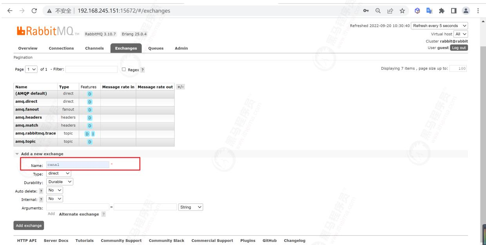

# 建立绑定关系

让 canal 交换器和 direct_queue 队列建立绑定关系，路由键为空

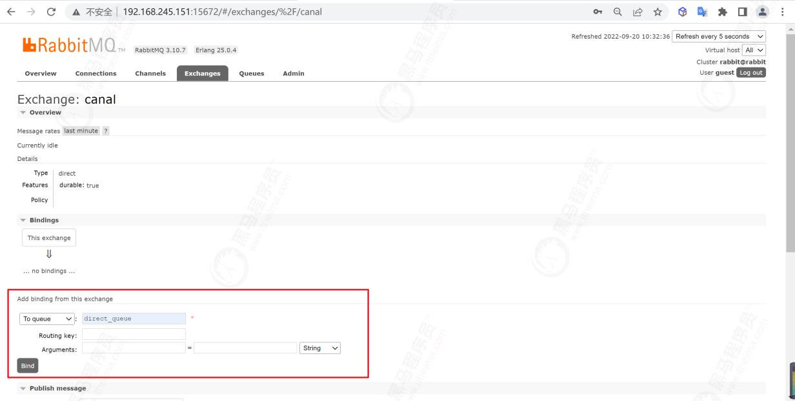

# 查看队列情况

我们绑定完成后，可以来查看一下队列的情况

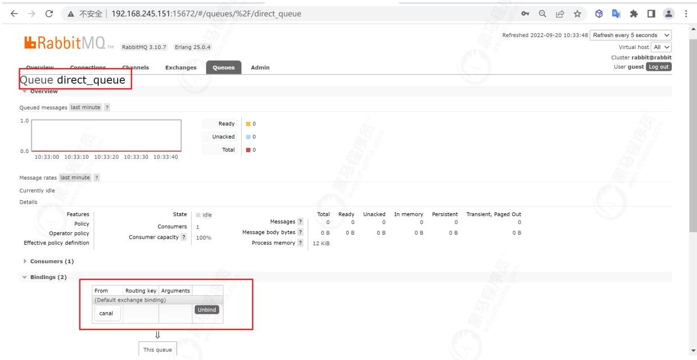

# ElasticSearch初始化

因为要导入ES，我们需要先创建索引

# 创建索引模板

创建一个有三个分片两个副本的索引

```
PUT _index_template/logstash-village
{
    "index_patterns": [
    "logstash-village-*" // 可以通过"logstash-village-*"来适配创建的索引
    ],
    "template": {
    "settings": {
    "number_of_shards": "3", //指定模板分片数量
    "number_of_replicas": "2" //指定模板副本数量
    },
    "aliases": {
{
    "logstash-village": {} //指定模板索引别名
},
"mappings": { //设置映射
    "dynamic": "strict", //禁用动态映射
    "properties": {
    "@timestamp": {
    "type": "date",
    "format": "strict_date_optional_time||epoch_millis||yyyy-MM-dd HH:mm:ss"
    },
    "@version": {
    "doc_values": false,
    "index": "false",
    "type": "integer"
    },
    "name": {
    "type": "keyword"
    },
    "province": {
    "type": "keyword"
    },
    "city": {
    "type": "keyword"
    },
    "area": {
    "type": "keyword"
    },
    "addr": {
    "type": "text",
    "analyzer": "ik_smart"
    },
    "location": {
    "type": "geo_point"
    },
    "property_type": {
    "type": "keyword"
    },
    "property_company": {
    "type": "text",
    "analyzer": "ik_smart"
    },
    "property_cost": {
    "type": "float"
    },
    "floorage": {
    "type": "float"
    },
    "houses": {
    "type": "integer"
    },
    "built_year": {
    "type": "integer"
    },
    "parkings": {
    "type": "integer"
}
},
"volume": {
    "type": "float"
},
"greening": {
    "type": "float"
},
"producer": {
    "type": "text",
    "analyzer": "ik_smart"
},
"school": {
    "type": "text",
    "analyzer": "ik_smart"
},
"info": {
    "type": "text",
    "analyzer": "ik_smart"
}
} 
```

# 导入数据进行同步

接下来我们就需要导入相关的Excel的数据进行同步了，logstash会自动的创建索引，并应用上面的模板

```
http://127.0.0.1:8080/api/import/crawler-data-4745655-1554808595755.xlsx 
```

# KIBANA数据分析

我们的数据已经导入到了ES中了，我们来对数据进行一波分析

# 管理索引

下面我们看下kibana如何进行索引管理

# 创建索引模式

进入索引管理

我们点击 Stack Management 进入索引管理模块


# 查看当前索引

进入管理模块后，点击索引管理，可以看到我们创建的索引

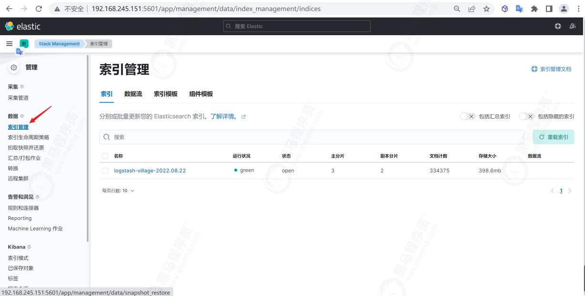

# 创建索引模式

下面我们需要创建索引模式，因为当前的索引是一天一创建的，我们需要匹配所有的索引

← → C 不安全 | 192.168.245.151:5601/app/management/kibana/indexPatterns


进入创建索引模式后，接下来就是创建索引匹配模式，我们需要匹配的就是标红的索引

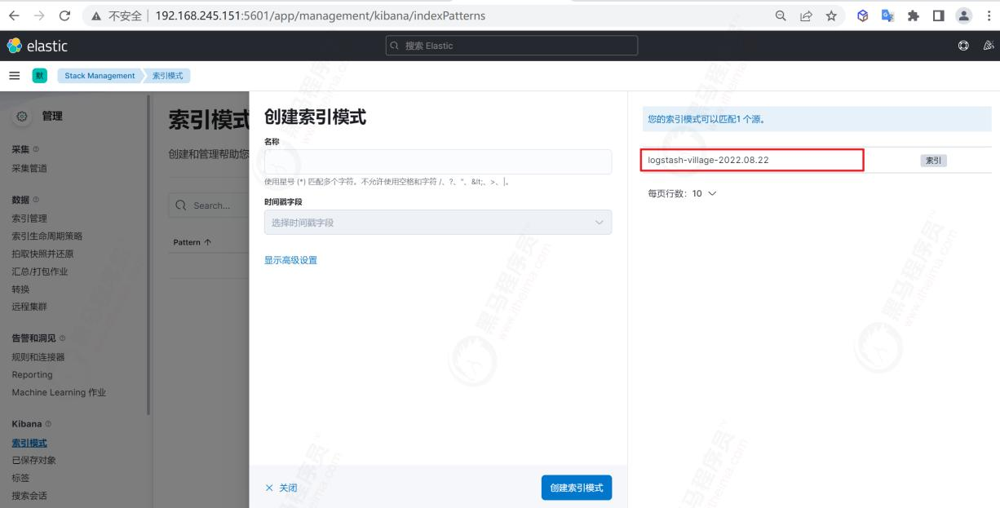

接下来就是创建索引模式，我们使用通配符的方式来进行创建


确定后我们就创建了一个索引模式，在这里我们可以编辑或者转换ES的字段

← → C ▲ 不安全 | 192.168.245.151:5601/app/management/kibana/indexPatterns/patterns/de1df620-3410-11ed-ab68-8dd3791014...

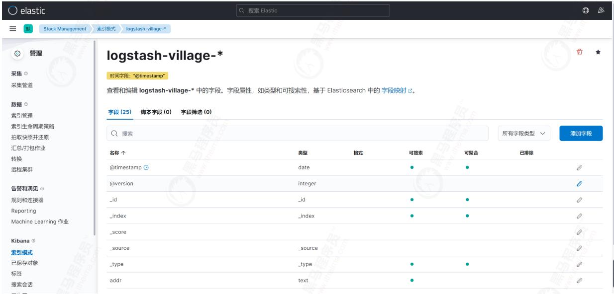

# 查看索引数据

我们点击 Discover 就可以查看索引数据


如果看不到可以选择不同的时间范围

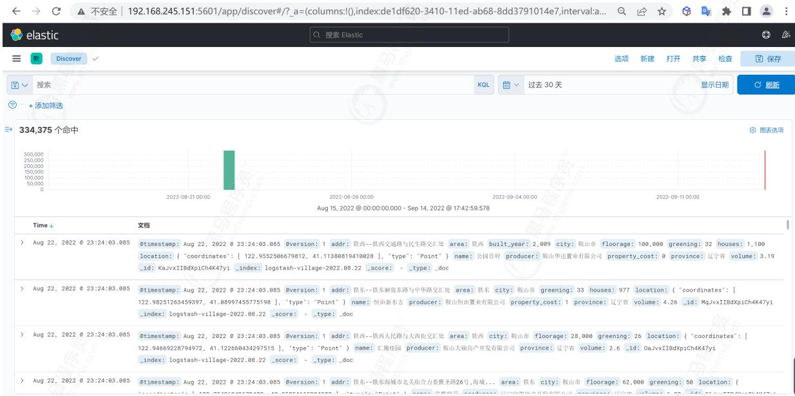

# 数据分析

接下来我们就按照这些数据进行一些图表分析

# 柱状图示例

下面我们演示以下柱状图，我们统计以下按照省份统计下个省份的总住户数量

# 打开仪表盘

下面我们需要到点击进入仪表盘管理节点

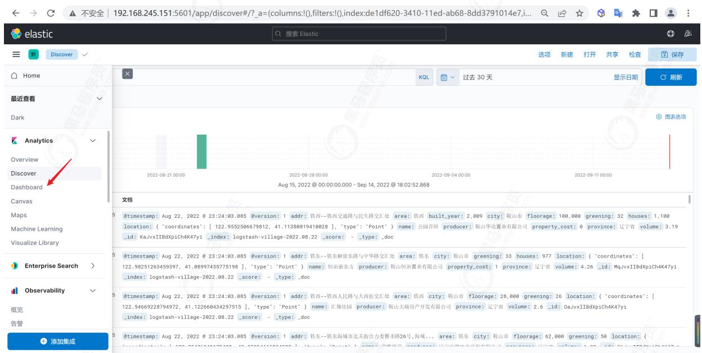

# 点击创建仪表盘

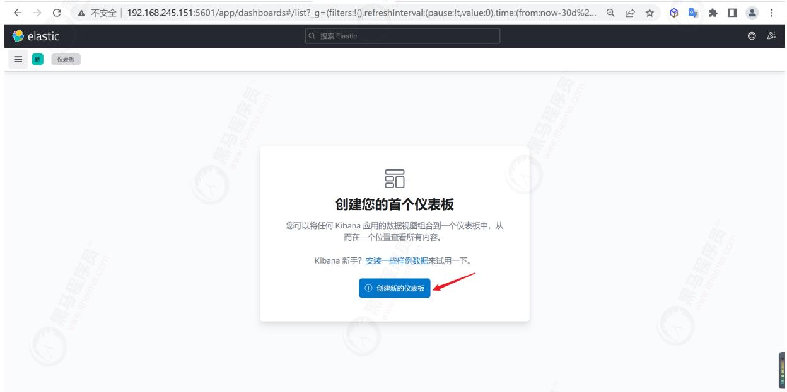

点击创建仪表盘，进入仪表盘管理界面


# 创建柱状图

点击 创建可视化 我们就会打开一个可视化的管理界面


并且在这个管理界面选择对应的图形就好


水平轴数据配置

我们先配置水平轴的数据，选择省份字段作为水平轴的参数


# 垂直轴数据配置

下面我们还需要配置垂直轴的数据，我们设置总户数的平均值作为参数

https://cdn-mineru.openxlab.org.cn/result/2026-05-18/1bf0dcbc-d55d-4d5f-96c7-0149f1fee18b/4ee48f4b5076c5843bfd3d6001e69d3b6e2f172e7c3b5d13295aa72129915a00.jpg

# 查看数据

这样我们就可以进行分析数据了，我们看到安徽省是小区住户平均数量最多的省份

← → C ▲ 不安全 | 192.168.245.151:5601/app/lens#/?_g=(filters:!(),refreshInterval:(pause:!t,value:0),time:(from:now-30d%2Fd,to:now))

https://cdn-mineru.openxlab.org.cn/result/2026-05-18/1bf0dcbc-d55d-4d5f-96c7-0149f1fee18b/cb41bec57b6b3516ba798141e1ddf9112e28e0e67da347ef8aa3ea714a89ec6d.jpg

# 筛选数据

我们筛选以下2020年以后新建的小区住户平均数量最多的省份，我们可以使用表达式 built_year >= 2020 进行筛选

https://cdn-mineru.openxlab.org.cn/result/2026-05-18/1bf0dcbc-d55d-4d5f-96c7-0149f1fee18b/1a2b2b49c4ce4bee031cfa87be58b013484467cadb6fddfd81807bddd729ab54.jpg

# 折线图示例

我们分析下全国每年小区新建面试的走势图

# 创建折线图

点击 创建可视化 我们创建一个折线图


# 水平轴数据配置

我们在水平轴配置小区新建的年份，并选择时间间隔


# 垂直轴数据配置

我们在垂直轴配置小区新建面积的总和

https://cdn-mineru.openxlab.org.cn/result/2026-05-18/1bf0dcbc-d55d-4d5f-96c7-0149f1fee18b/d4b6955b66c6314652ed82d0e93ba8ff5a37c0544bad7b295631135294d2e3cf.jpg

数据分析

我们分析出来数据后可以发现2006年是小区新建面积的高峰期，2006年后就开始慢慢回落了

https://cdn-mineru.openxlab.org.cn/result/2026-05-18/1bf0dcbc-d55d-4d5f-96c7-0149f1fee18b/078e39ad1e697521302b86eb5cc936f8dcb834717f64b48ea7727ea4b18b669d.jpg

# 树状图示例

我们狂野配置一个按照省份的绿化率按照树状图进行展示

# 创建树状图

我们创建一个树状图

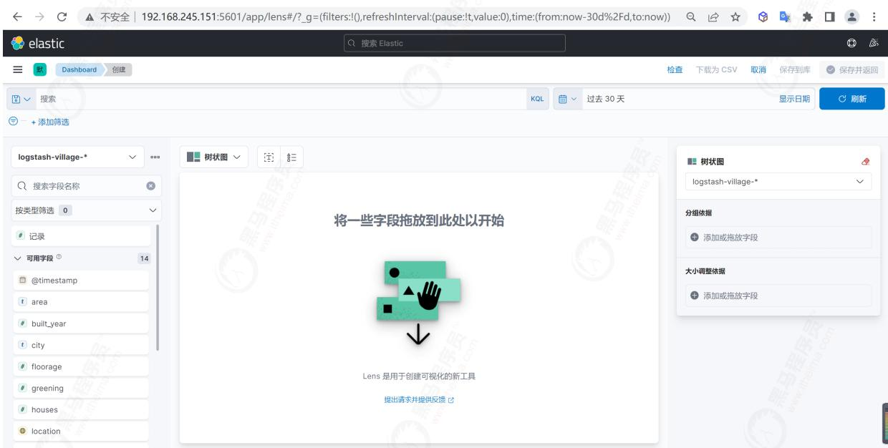

# 配置分组依据

我们可以配置一个分组依据，我们按照省份作为一个外部分组依据


接下来我们再按照市级来作为下级的分组依据


# 配置大小依据

我们按照绿化率的平均值作为大小依据

https://cdn-mineru.openxlab.org.cn/result/2026-05-18/1bf0dcbc-d55d-4d5f-96c7-0149f1fee18b/260ac50047be6ea8ad3f57e499ef6a2be3cd4b7ddec81a471ea15994c1b47cd2.jpg

# 创建地图示例

我们还可以使用GEO信息创建一个地图

# 创建一个地图

我们先创建一个地图，选择Maps来创建一个地图


# 添加图层

在地图上面添加一个图层


# 选择文档数据

添加图层后选择需要添加的文档数据


并且在在弹出的界面选择需要显示索引以及GEO字段

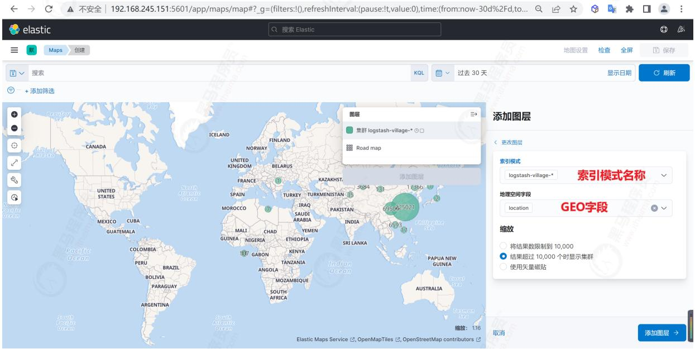

# 缩放显示数据

然后缩放地图可以看到就可以看到地图数据了

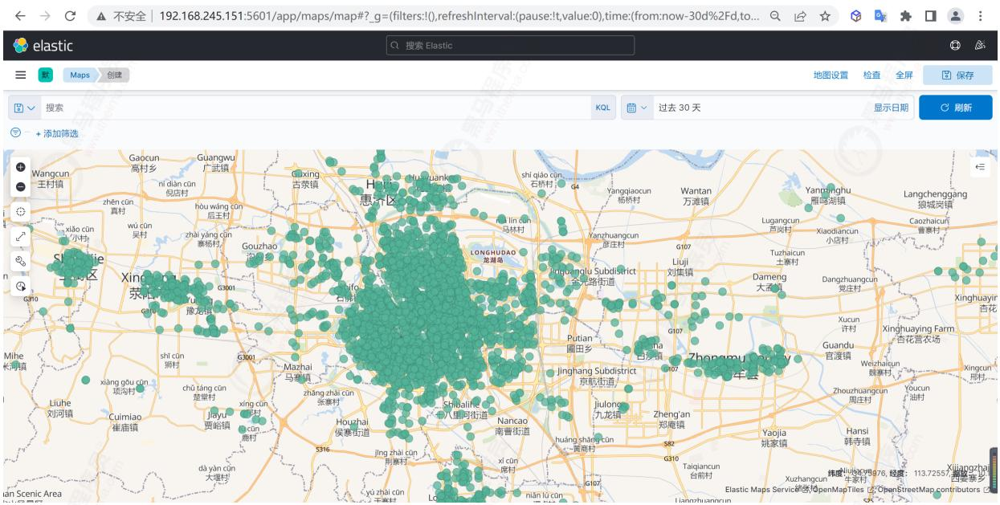