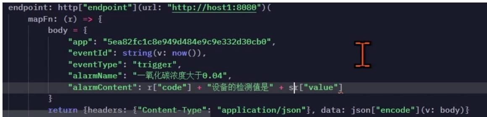


修改好的代码如上图所示。

# 19.5.4 创建定时任务

（1）点击左侧Tasks按钮，在点击右上方的CREATE TASK按钮，


（2）将方才我们修改好的脚本粘贴到编辑区域，将 option task一行代码中的信息写到左侧的设置表单中，并删除原先的 option task代码。

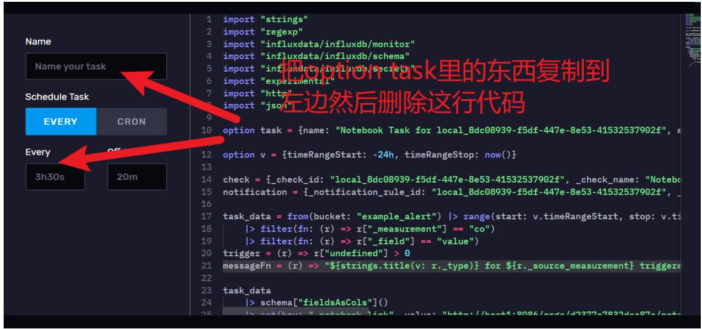


（3）最后点击右上角的 Save按钮，创建这个定时任务

# 19.5.5 测试报警效果

现在，我们上传一条 value大于 0.04的数据，测试一下对接的效果。

更多Java–大数据–前端–python人工智能资料下载，可百度访问：尚硅谷官网


数据如下

```txt
co, code=01 value=0.08 
```

等待一段时间，可以看到，我们收到了一通电话，这个电话里面就向我们说明了一氧化碳浓度的值超过0.04了。


# 19.6 示例：改进报警系统

# 19.6.1 当前的报警架构

更多Java–大数据–前端–python人工智能资料下载，可百度访问：尚硅谷官网

你可以将睿象云视作一个高可用的报警服务，也就是不论如何睿象云 24小时都能无故障访问。那么结合睿象云，我们的 InfluxDB 可以设置一个检查数据合理性的定时任务，每隔一段时间就把最近的数据抽出来算一下。如果数据不合适，就发送一个报警信号给睿象云，然后由睿象云向我们具体的技术人员发起通知。


influxdb 


睿象云

打电话给Tony

1.InfluxDB执行定时任务，检查数据是否正常

2.如果发现异常，通过HTTP请求告知睿象云

3.睿向云收到请求，根据设置的分派策略通知到具体的人

# 19.6.2 更值得信任的架构

上一节的架构有一个问题，如果一晚上过去了，我的 InfluxDB 出现异常宕机了。InfluxDB 宕机了自然不会向睿象云发送报警信息，所以一夜过去了，你睡了一个好觉，但那真是一个平安夜吗？

所以，如果睿象云能够知道 InfluxDB 还有没有活着就好了。最好是睿象云能够每隔一段时间检查一下我的 InfluxDB 还在不在、能不能用。这种行为，我们称为业务可用性检查。

1.睿象云每隔一段时间发起一个请求，看看InfluxDB能不能正常响应

2.如果不能正常响应，一样打电话给Tony


1.InfluxDB执行定时任务，检查数据是否正常

2.如果发现异常，通过HTTP请求告知睿象云

3.睿向云收到请求，根据设置的分派策略通知到具体的人

在这张图中，橘黄色的箭头就是睿象云对InfluxDB的检查。

# 19.6.3 接下来示例中的架构

使用睿象云进行报警，其实是向睿象云购买软件服务，这套软件在睿象云的服务器上，而不是自己企业的服务器上。这种方式我们称为 SaaS，软件即服务。这种情况下，想让睿象云能够反过来访问我们的 InfluxDB 服务，那就得让 InfluxDB 服务暴露在公网。这个时

更多Java–大数据–前端–python人工智能资料下载，可百度访问：尚硅谷官网候 InfluxDB 要么本身就在公网，要么利用内网穿透。因为老师这里的演示环境是内网，所以需要搭建内网传统。

最终整体的架构如下。


这样，不管内网穿透崩了，还是 InfluxDB崩了都会触发报警。

# 19.6.4 搭建内网穿透

本教程采用花生壳提供的内网穿透工具来实现内网穿透。一个新的花生壳账号，有免费的内网穿透额度，而且免费提供的1M大小的带宽

# 19.6.4.1 安装花生壳内网穿透客户端

访问官网下载页面：https://hsk.oray.com/download


注意选择和自己的系统匹配的安装包，我们演示的是使用的 CentOS，所以此处我选择CentOS Linux(x86_64)

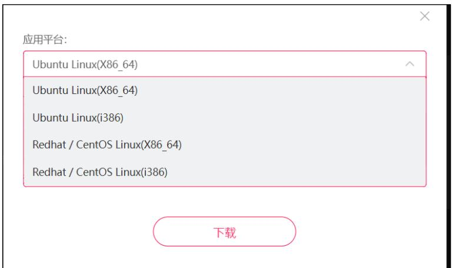


使用下面的命令安装 deb包。

```batch
sudo rpm -ivh ./phddns_5.2.0_amd64.rpm 
```

安装完成后，会自动开启一个名为 Phtunnel 的服务，并且你会拥有一个可以控制这项服务的命令行工具，叫做 phddns。所有相关的信息，都显示在安装好后的打印出来的提示信息里了。

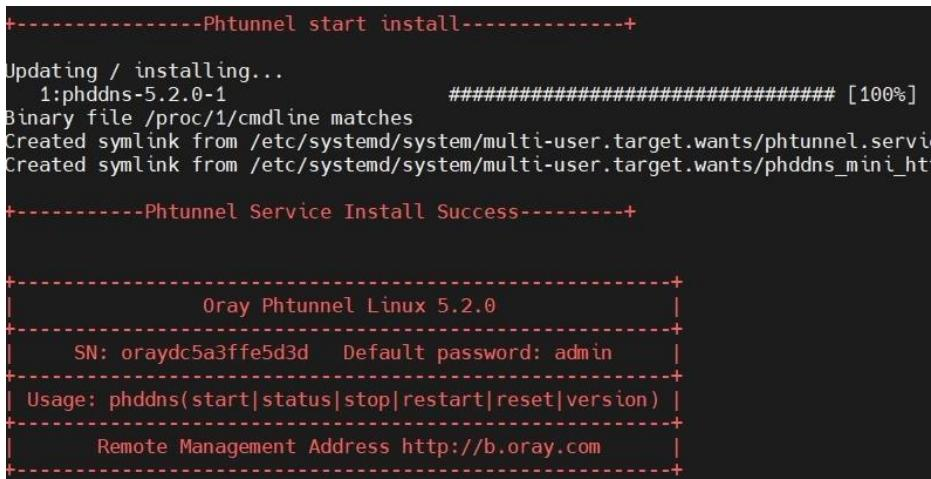


# 19.6.4.2 激活 SN

正常情况下，安装好后，phddns 会自动运行。可以使用 phddns status 命令查看程序的运行状态。

```txt
phddns status 
```

如果显示ONLINE，那就是正常运行。

注意这里的SN码，使我们的设备标识码。

另外，这里显示我们有一个远程的管理地址，是 http://b.oray.com。

在浏览器里访问这个地址。会进入一个登录页面，如下图所示：

更多Java–大数据–前端–python人工智能资料下载，可百度访问：尚硅谷官网

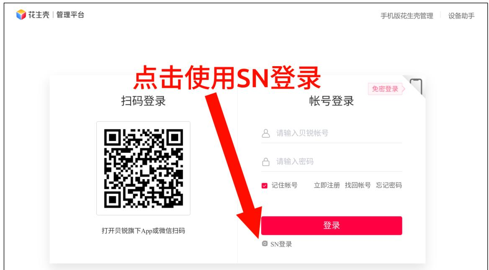


现在，切换到 SN登录，可以看到这里需要输入我们的设备 SN码。刚才安装的时候也提示过我们，初始密码是 admin。现在输入SN码和密码，点击登录。


这里需要注册一个贝瑞账号，进行激活，这些操作请同学们自行完成。

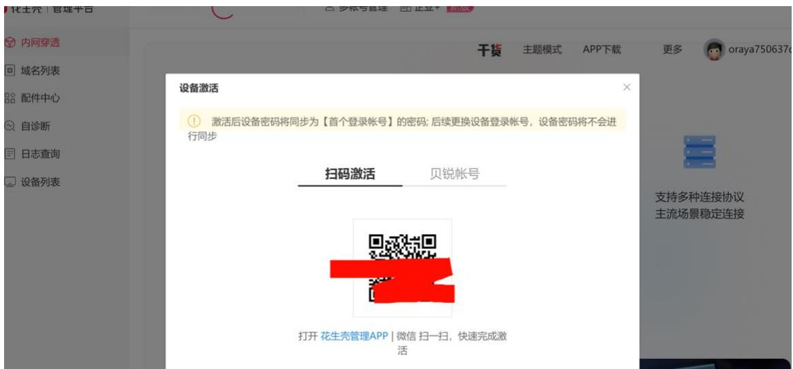


# 19.6.4.3 配置内网穿透

更多Java–大数据–前端–python人工智能资料下载，可百度访问：尚硅谷官网

（1）激活成功后，看到管理页面，先点击左侧工具栏的内网穿透按钮，进入内网穿透的管理面板，点击新增映射。


（2）按照图中顺序先后操作，注意内网主机是指你刚才安装内网穿透所在的主机。试用版最高只能有 1Mbps 带宽，换算上行和下行速度应当在 128kb/s

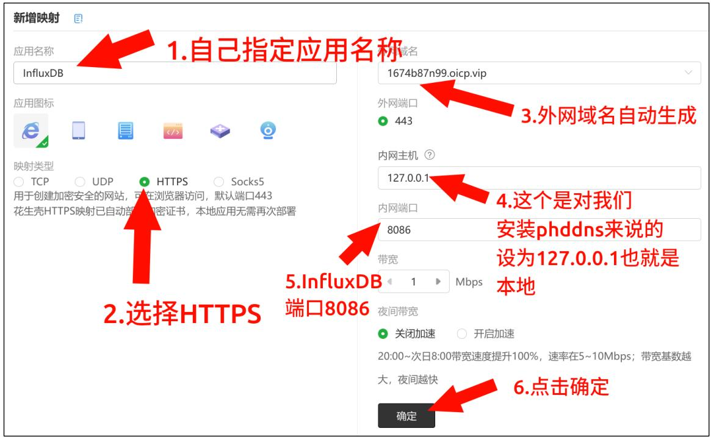


点击确定后，会回到内网穿透的管理页面。

（3）如果能看到下图所示的卡片，那就说明内网穿透已经配置成功。


以后我们访问 https://1674b87n99.oicp.vip/就相当是在访问本地的 127.0.0.1:8086 了

# 19.6.5 配置业务可用性检测

# 19.6.5.1 创建监控任务

（1）首先回到睿象云的主页，在左侧点击图中标出的业务可用性监测平台。

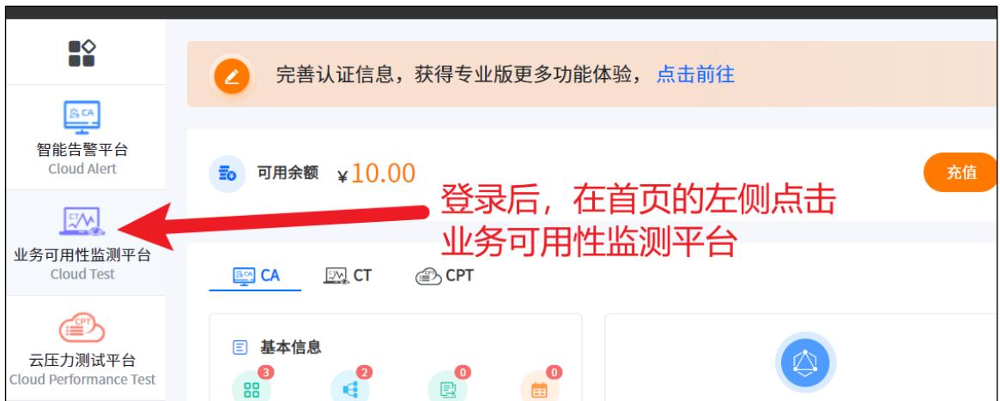


（2）来到监控任务的主页后，点击图中标出的绿色按钮（创建监控）

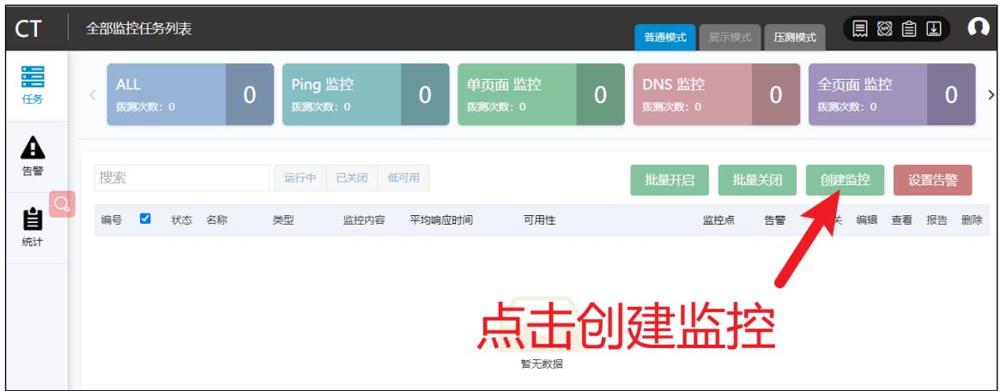


（3）首先完成监控设置，此处我们要把监控地址设成刚才我们配置过内网穿透的地址。地址使用/health，对这个地址发起 Get 请求，正常情况下会返回一个 json 格式的数据，它会告诉我们 InfluxDB 目前是否健康。另外，如果请求成功的话状态码应该为 200。最后，

更多Java–大数据–前端–python人工智能资料下载，可百度访问：尚硅谷官网

对这个接口进行get请求，并不需要 token加持。

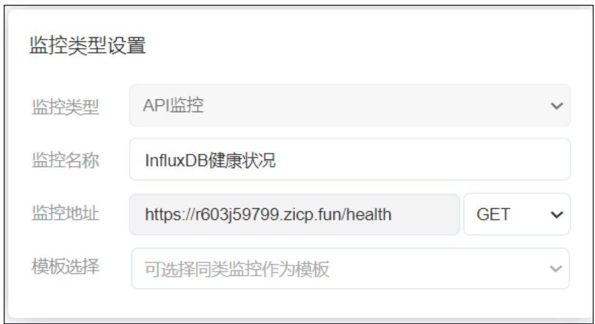


（4）响应部分设置如下图所示，解释一下，这里的意思就是如果接口 2秒内完成响应那说明速度比较满意，如果在 2~5秒之间说明比较慢，如果大于5秒说明非常缓慢。

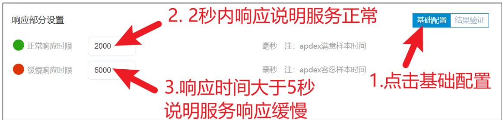


（5）点击右上角的结果验证，设置响应码为 200，也就是说响应码为 200 是我们期望的正常状态。

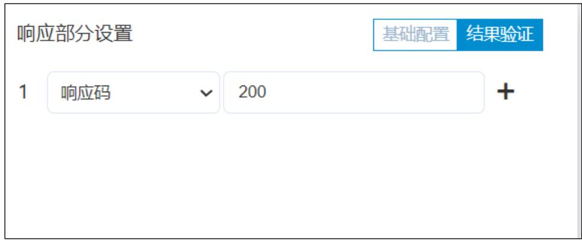


（6）监控频率设置使用 15分钟，其实免费版最快只能每隔 15分钟访问一次，充值后可以获得更高的访问频率

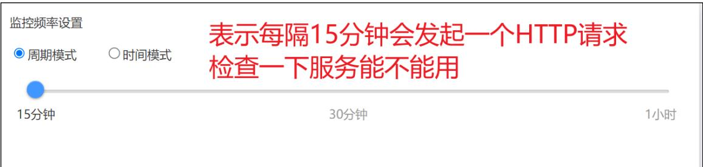


（7）运营商与监控区域，是指你要使用哪个省份、哪个运营商的网络对你的接口发起访问，因为有的时候一个接口，可能移动的网络可以访问，联通的网就访问不通。最后我们只选择一台主机。如下图所示。

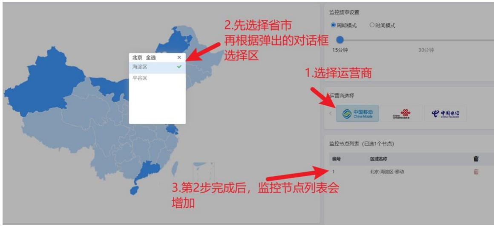


（8）上述操作都完成后，点击右上角的保存按钮。


# 19.6.5.2 配置报警规则

（1）回到监控列表后，可以看到页面上已经有一个监控项了。

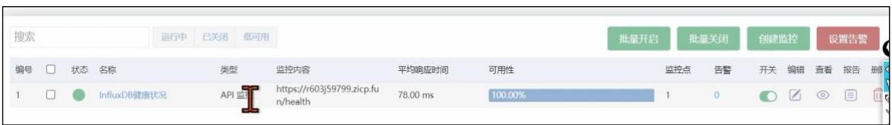


（2）现在点击左侧的告警按钮，我们来配置告警的通道。

更多Java–大数据–前端–python人工智能资料下载，可百度访问：尚硅谷官网

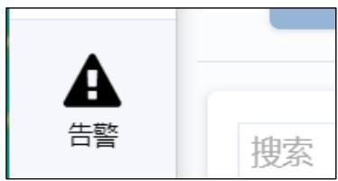


（3）可以看到，我们面对着 3 个概念：报警规则、报警策略、报警行为。和我们的InfluxDB 一样，这里的报警规则对应着检查任务，它将数据翻译为警告、严重和正常三种信号。报警行为相当于报警终端，你可以选择发送邮件还是拨打电话。报警策略就是用来连接报警规则和报警行为的，它相当于 InfluxDB 中的报警规则。

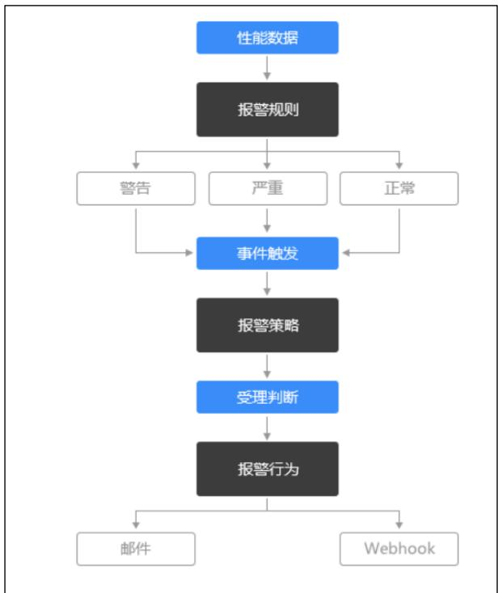


（4）首先我们来配置报警规则首先，点击左侧的报警规则按钮，然后点击+号

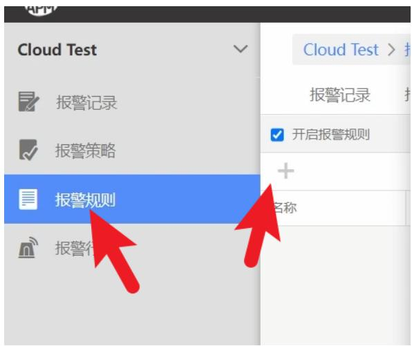


（5）给规则命名、并在规则类型上选择API监控。

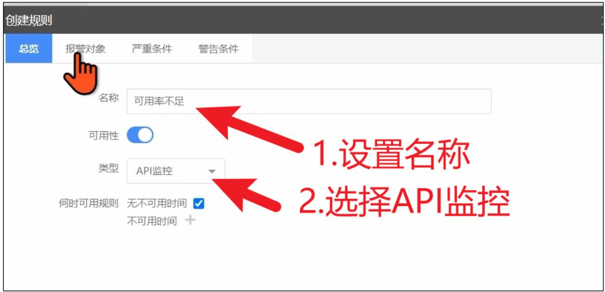


（6）点击上方选项卡的报警对象，可以看到这里左边是已经创建的 API 监控类型的监控任务，选中左边的 InfluxDB 健康状况，再点击中间的>> 按钮，将它加到已选列表里来，再点击下一步。

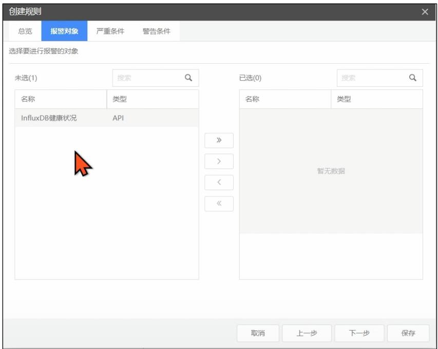


（7）可以看到，这里要设置严重条件，这相当于我们在 InfluxDB里面设置 CRIT的阈值，此处我们设置为，如果过去 15 分钟的可用率不是 100%，那么就认为已经发生严重错误。

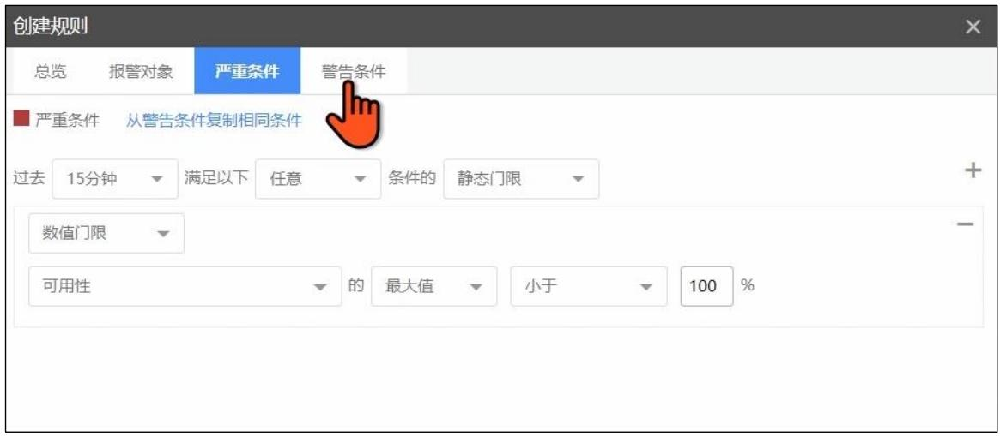


如图所示，再次点击右下角的下一步。

（8）这一步叫做警告条件，相当于 InfluxDB 中的 warn。此处我们直接点击蓝色的按钮，从严重条件复制相同条件，然后再右下角点击保存。

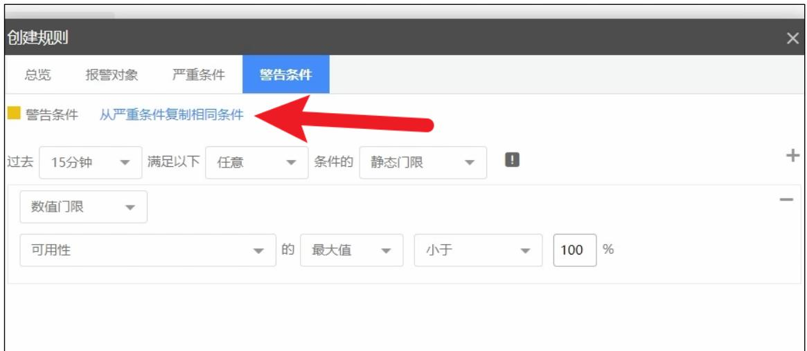


（9）最后，一切正常的话，我们的报警规则列表中就会多出一条，如下图所示。

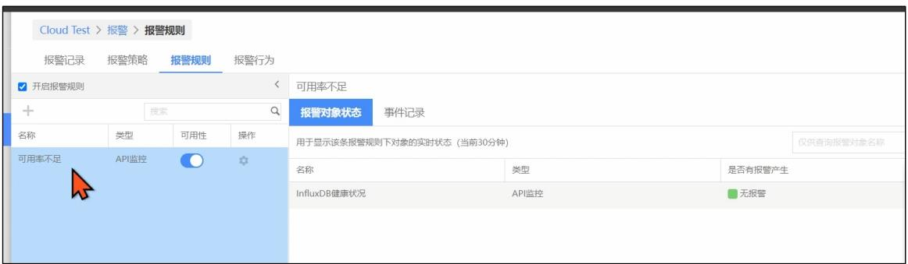


# 19.6.5.3 配置报警行为

（1）点击左侧的报警行为按钮，然后点击+号，创建一个新的报警行为。

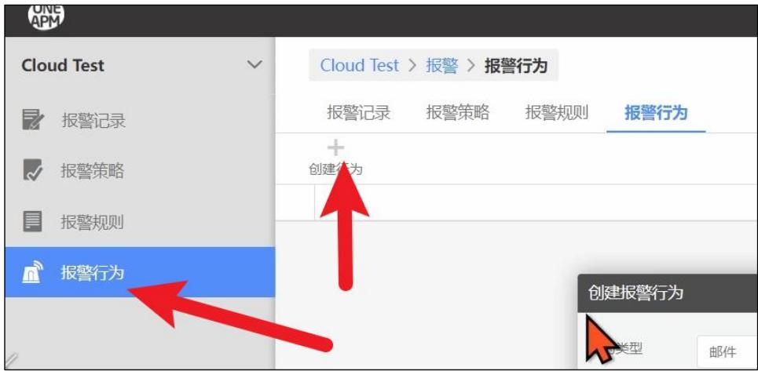


（2）在弹出的窗口上先选好行为类型，此处我们选择 Webhook。可以看到这里需要一个 URL，它也相当于我们要向外发送一个请求。所以这个 URL 指定谁，其实还是应该对接到睿象云来做处理。

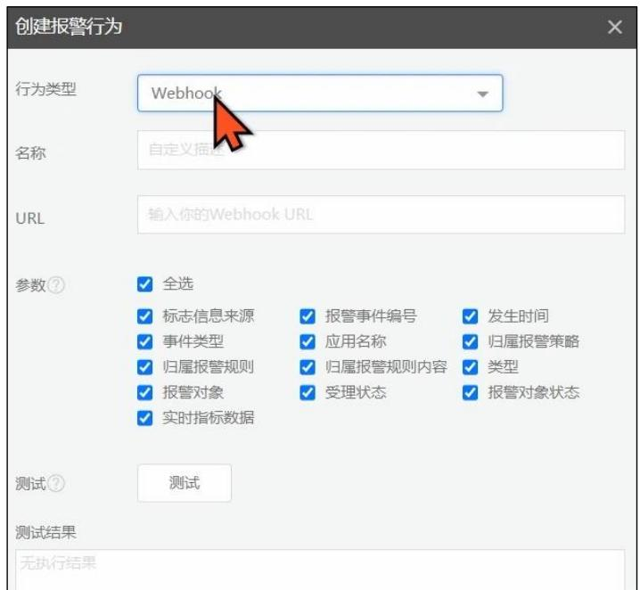


（3）回到智能告警平台的集成页面，在集成工具中找到睿象云。点一下创建。


更多Java–大数据–前端–python人工智能资料下载，可百度访问：尚硅谷官网

（4）先命好名，然后直接点击下方的保存并获取应用 key。

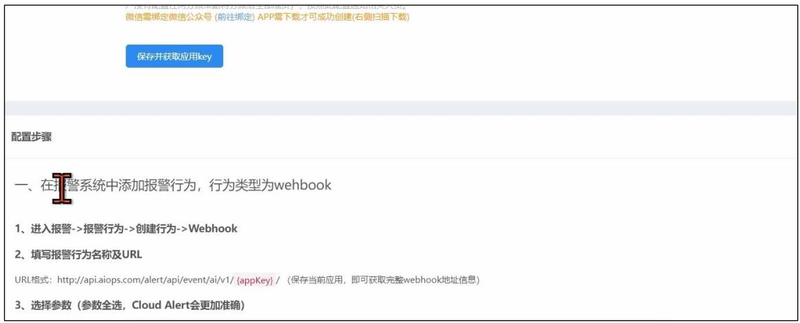


（5）可以看到配置说明上的 url 自动补全了一个随机字符串，这个就是 key。现在将它复制一下。

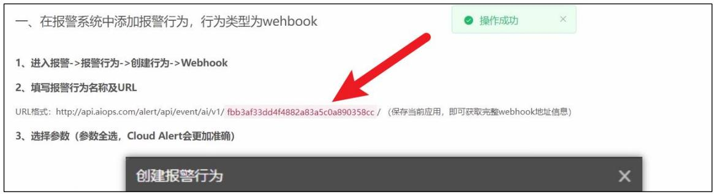


（6）回到创建报警行为的窗口中，填写 URL，再点击测试，如果测试结果显示为connect success，那就说明我们的配置是正确的。点击右下角的保存。

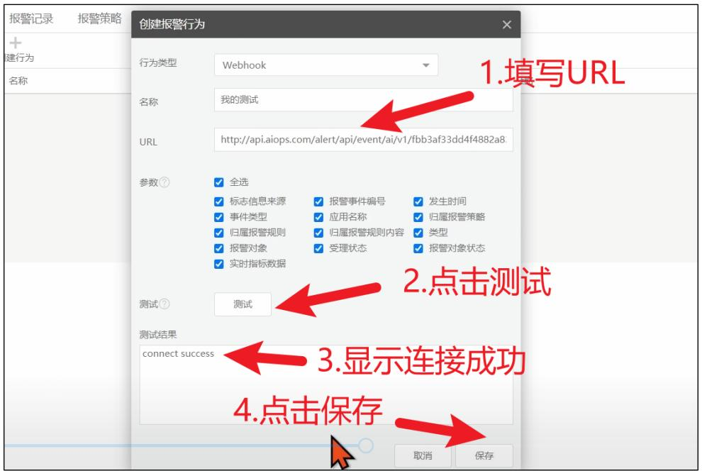


# 19.6.5.4 修改分派策略

更多Java–大数据–前端–python人工智能资料下载，可百度访问：尚硅谷官网

现在我们的告警平台中，已经创建了两个应用了。但是直接我们之前创建过一个分派策略，它会将 REST API 收到的报警通知全部转发给某个用户。但是我们刚才创建的Webhook还尚未包含在这个分派策略中。

所以此处，找到我们之前设置的分派策略，点击右边的编辑按钮。

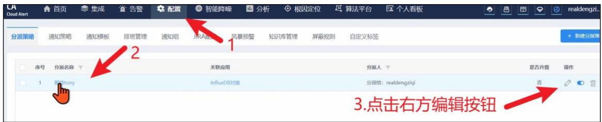


进入编辑页面后，点击图中指出的添加按钮。


可以看到，此处我们就会展示出来两个应用，也就是这两个接口收到的报警通知都会转发给我们指定的用户。


最后点击保存，分派策略就修改成功了。

# 19.6.5.5 创建报警策略

（1）回到之间的监控平台，告警管理页面。首先点击左侧的报警策略按钮，再点击+号，创建一个报警策略。

更多Java–大数据–前端–python人工智能资料下载，可百度访问：尚硅谷官网

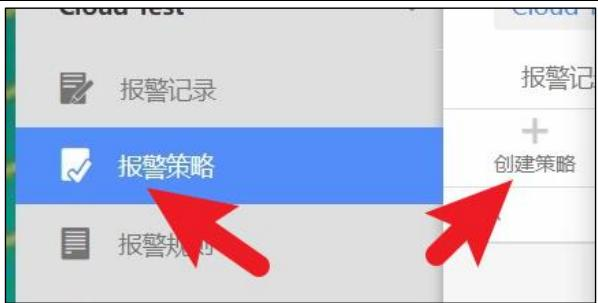


（2）触发策略的配置如下图所示。

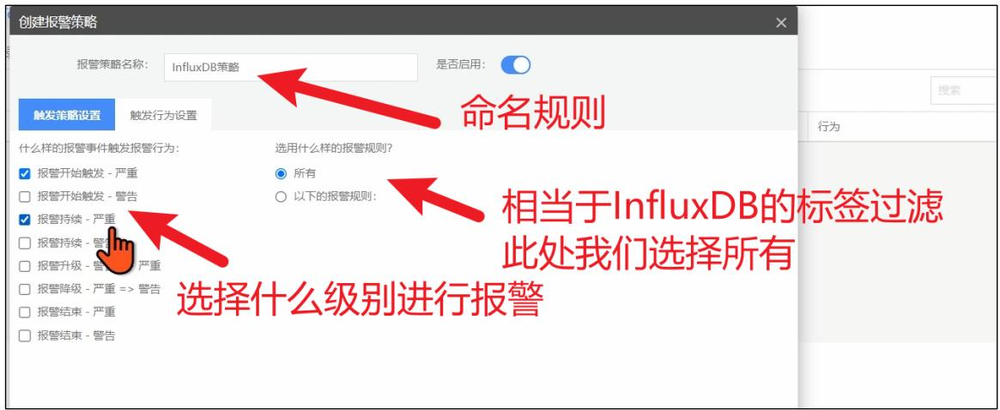


（3）点击上方的触发行为设置按钮，然后点击右侧的添加按钮。

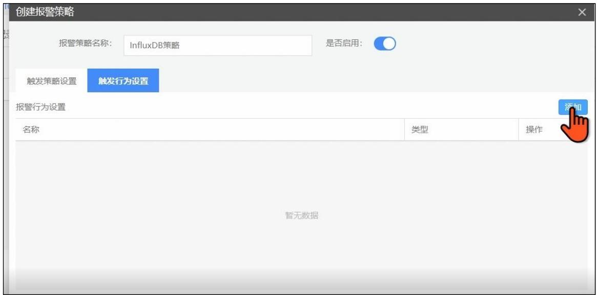


（4）可以看到有一个可以进行选择的选项卡，这是我们之前创建的报警行为，鼠标点一下将它选中，然后点击右下角的选择按钮。

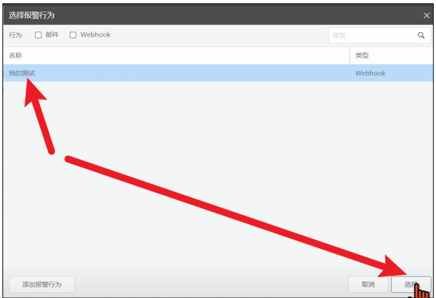


（5）如果报警行为成功添加，就点击右下角的保存按钮。至此我们的报警策略就搭建成功了。

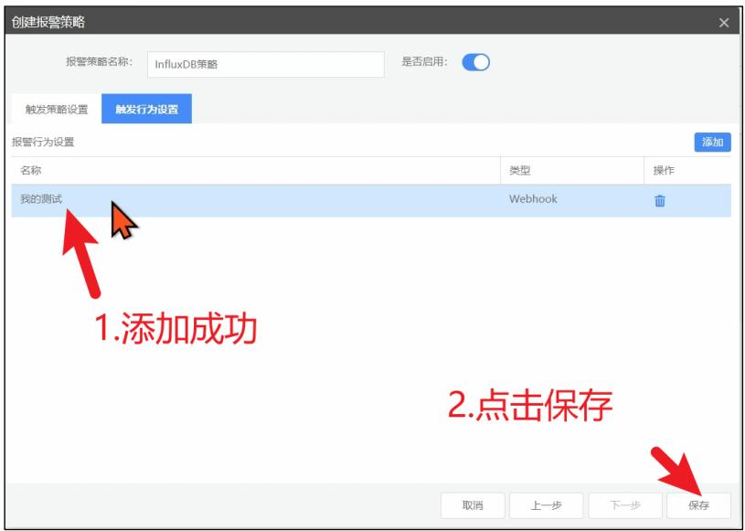


# 19.6.6 小结

经过上述操作，我们的报警架构就已经完成升级了，感兴趣的同学可以自行尝试一下把InfluxDB挂掉会发生怎样的效果。

# 第20章 附录 1：拓展的带注释的 CSV

# 20.1 什么是拓展的带注释的 CSV

拓展的带注释的 CSV 在 CSV 的基础之上提供了额外的注释和选项，用于制定应该如何将CSV数据转换为行协议并写入 InfluxDB。

# 20.2 FLUX 为什么想给 CSV 加注释

下面是一套典型的 CSV 文件。

```csv
m,host,used_percent,time
mem,host1,64.23,2020-01-01T00:00:00Z
mem,host2,72.01,2020-01-01T00:00:00Z
mem,host1,62.61,2020-01-01T00:00:10Z
mem,host2,72.98,2020-01-01T00:00:10Z
mem,host1,63.40,2020-01-01T00:00:20Z
mem,host2,73.77,2020-01-01T00:00:20Z 
```

对编程语言和数据库来说，数据的类型非常重要。但是常见的 CSV并没有告诉你，我哪一列需要用 Long 哪一列需要用 String。所以在大多数的编程语言里，通常编程语言的CSV 包内会有下面的两种基本功能。

（1）自动推断CSV文件中可能的数据类型并将其解析。

（2）允许用户向解析方法传递参数，显示声明 CSV 文件中的哪些列需要解释为 int，哪些列需要解释为 string。

不过FLUX的思路是额外创建一个数据格式。

在传统的CSV文件的最前面，加上两三行，显示说明这些字段都是什么数据类型。

这就是FLUX的带注释的CSV数据格式的基本思想。

除此之外，拓展的带注释的 CSV还支持一些InfluxDB的其他特性。

# 20.1 带注释 CSV 的作用

当你查询 InlfuxDB时，返回的数据格式其实就是带注释的 CSV。不过通常情况下，各种编程语言的客户端库和可视化工具会帮我们处理这种数据。所以带注释的 CSV 对用户来说属于一个偏底层的数据格式。

# 20.2 4 种拓展注释

# 20.2.1 数据类型

如果要将某列数据类型对应到 InfluxDB 中的类型，需要在 CSV 数据的最前面加上#datatype 注释。

比如：

```txt
#datatype string double long 
```

表示第一列是字符串，第二列是双精度浮点数，第三列是 long整数。

下面这些是拓展的带注释的 CSV支持的所有数据类型

<table><tr><td>数据类型</td><td>映射到 InfluxDB 中的数据类型</td></tr><tr><td>measurement</td><td>说明这一列是 InfluxDB 中的 measurement</td></tr><tr><td>tag</td><td>说明这一列是 InfluxDB 中的 tag(标签)</td></tr><tr><td>dateTime</td><td>说明这一列是 InfluxDB 中的 timestamp(时间戳)</td></tr><tr><td>field</td><td>说明这一列是 InfluxDB 中的 field(字段)</td></tr><tr><td>ignored</td><td>不映射 InfluxDB 中的数据类型,这一列会被忽略。</td></tr><tr><td>string</td><td>说明这一列是 InfluxDB 中 string 类型的 field</td></tr><tr><td>double</td><td>说明这一列是 InfluxDB 中的 float 类型的 field</td></tr><tr><td>long</td><td>说明这一列是 InfluxDB 中的 integer 类型的 field</td></tr><tr><td>unsignedLong</td><td>说明这一列是 InfluxDB 中的 unsigned integer field</td></tr><tr><td>boolean</td><td>说明这一列是 InfluxDB 中的 boolean field</td></tr></table>

其中。

⚫ datetime后面可以加上一个日期格式告诉程序该如何解析日期时间。

比如

```ruby
#datatype dateTime:RFC3339
#datatype dateTime:RFC3339Nano
#datatype dateTime:number
#datatype dateTime:2006-01-02 
```

⚫ double，long，unsignedLong 可以用小数点后面跟上一个英文逗号表示数据中有千位分隔符。这个时候类型注释信息需要用双引号引起来

比如

```python
#datatype "long: .," 
```

⚫ boolean 布尔值可以指明哪些值是 True，哪些值是 False

比如

```csv
#datatype "boolean:y,Y,1:n,N,0" 
```

就表示，如果这一列的值是 y 或 Y 又或者 1，那么它就对应 boolean 中的 True。如果这一列的是 n 或 N 或 0，那么就对应 boolean 中的 False。同样，这个语法中出现了逗号，写的时候应该把它用双引号括起来。

# 20.2.1.1 严格模式

所有的类型后面都可以加上一个:strict 关键字，表示如果数据不符合 long 格式，比如1.2 那么整行数据的导入直接失败，如果不加的话，程序一般会把 1.2 截断以适应 long。

# 20.2.2 常量

使用#constant 注释，相当于为 csv 中的每行数据加上一个固定的数据。比如，我 csv里的数据全部都是要去同一个名为 m 的 measurement 的。那么是其实是没有必要在每一行

更多Java–大数据–前端–python人工智能资料下载，可百度访问：尚硅谷官网

都加上一个值为m的列。我可以在 csv的头部加上这么一行。

```txt
#constant measurement, m 
```

那么所有的数据的 measurement 就都为 m。

如果你要加上多个常量，那么需要让每个#constant注释独占一行。

比如

```csv
#constant measurement,m
#constant tag,dataSource,csv 
```

它的语法其实是

```txt
#constant <datatype>,<column-lable>,<column-value> 
```

但是 measurement 比较特殊。

# 20.2.3 时区

因为 CSV里面的数据是日期时间类型，InfluxDB中的数据必须时间戳。这个时候是有必要指定时区的。

你可以在CSV数据的头部加一行

```txt
#timezone ±HHmm 
```

指定当前数据相对于 UTC时区的偏移量。

# 20.2.4 字段拼接

使用#concat 可以使用已有列拼接出来一个新列。它引用列名的语法跟 bash shell 是一个风格。

语法：

```txt
#concat, string, fullName, ${firstName} ${lastName} 
```

这个意思就是说，给 csv 添加一个新的 string 类型的列，名为 fullName。它由firstName 的值+空格+lastName 的值组成。

通常来说，这个语法拼日期更好用一些。

例如：

```csv
#concat,dateTime:2006-01-02,${Year}~${Month}~${Day}
Year,Month,Day,Hour,Minute,Second,Tag,Value
2020,05,22,00,00,00,test,0
2020,05,22,00,05,00,test,1
2020,05,22,00,10,00,test,2 
```

# 20.3 自定义分隔符

可以在 CSV 的头部加一行 sep=;

表示把CSV的分隔符从默认的 ,切换到;

```txt
seq=; 
```

更多Java–大数据–前端–python人工智能资料下载，可百度访问：尚硅谷官网

# 20.4 简短注释

拓展的注释还有更简短的写法

那就是把类型信息什么的加载每个列列名的后面。

比如：

```csv
m|measurement, location|tag|Hong Kong, temp|double, pm|long|0, time|dateTime:RFC3339
weather, San Francisco, 51.9, 38, 2020-01-01T00:00:00Z
weather, New York, 18.2, 2020-01-01T00:00:00Z
weather, 53.6, 171, 2020-01-01T00:00:00Z 
```

意思就是

⚫ m 列是 measurement，并且没有默认值

⚫ localtion 列是一个默认值为 Hong Kong 的 tag

⚫ temp 列的类型是 double

pm列的类型是long而且默认值是0

⚫ time列是一个时间戳，而且数据格式是RFC3339格式的，没有默认值。

# 第21章 附录 2：InfluxDB 行协议

# 21.1 认识 InfluxDB 行协议

InfluxDB 行协议是 InfluxDB 数据库独创的一种数据格式，它由纯文本构成，只要数据符合这种格式，就能使用 InfluxDB的HTTP API将数据写入数据库。

与 CSV 相似，在 InfluxDB 行协议中，一条数据和另一条数据之间使用换行符分隔，所以一行就是一条数据。另外，在时序数据库领域，一行数据一行数据由下面 4 种元素构成。

（1）measurement（测量名称）

（2）Tag Set（标签集）

（3）Field Set（字段集）

（4）Timestamp（时间戳）


下面我们详细介绍一下各个元素的作用。

# 21.2 measurement（测量名称）

更多Java–大数据–前端–python人工智能资料下载，可百度访问：尚硅谷官网

必需

测量的名称。

你可以将它当作普通关系型数据的 table，虽然实际上不是这么回事。

在InfluxDB行协议中，测量名称不可省略。

大小写敏感

不可以用下划线_打头

# 21.3 Tag Set（标签集）

标签应该用在一些值的范围有限（可枚举）的，不太会变动的属性上。比如传感器的类型和 id 等等。在 InfluxDB 中一个 Tag 相当于一个索引。给数据点加上 Tag 有利于将来对数据进行检索。但是如果索引太多了，就会减慢数据的插入速度。

可选

键值关系使用=表示

多个键值对之间使用英文逗号 , 分隔

标签的键和值都区分大小写

标签的键不能以下划线 _ 开头

键的数据类型：字符串

值的数据类型：字符串

# 21.4 Field Set（字段集）

必需

一个数据点上所有的字段键值对，键是字段名，值是数据点的值。

一个数据点至少要有一个字段。

字段集的键是大小写敏感的。

字段

键的数据类型：字符串

值的数据类型：浮点数 | 整数|无符号整数| 字符串| 布尔值

# 21.5 Timestamp（时间戳）

可选

数据点的Unix时间戳，每个数据点都可以制定自己的时间戳。

如果时间戳没有指定。那么 InfluxDB就使用当前系统的时间戳。

更多Java–大数据–前端–python人工智能资料下载，可百度访问：尚硅谷官网

数据类型：Unix timestamp

如果你的数据里的时间戳不是以纳秒为单位的，那么需要在数据写入时指定时间戳的精度。

# 21.6 空格

行协议中的空格决定了 InfluxDB 如何解释数据点，第一个未转义的空格将测量值&TagSet（标签集）与 Field Set（字段集）分开。第二个未转义空格将 Field Set（字段级）和时间戳分开。

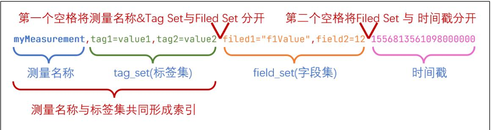


# 21.7 协议中的数据类型及其格式

# 21.7.1 Float（浮点数）

IEEE-754标准的64位浮点数。这是默认的数据类型。

示例：字段级值类型为浮点数的行协议

```txt
myMeasurement fieldKey=1.0
myMeasurement fieldKey=1
myMeasurement fieldKey=-1.234456e+78 
```

# 21.7.2 Integer（整数）

有符号64位整数。需要在数字的尾部加上一个小写数字 i 。

<table><tr><td>整数最小值</td><td>整数最大值</td></tr><tr><td>-9223372036854775808i</td><td>9223372036854775807i</td></tr></table>

示例：字段值类型为有整数的

# 21.7.3 UInteger（无符号整数）

无符号64位整数。需要在数字的尾部加上一个小写数字 u 。

<table><tr><td>无符号整数最小值</td><td>无符号整数最大值</td></tr><tr><td>0u</td><td>18446744073709551615u</td></tr></table>

示例：字段值类型为无符号整数的航协议

```txt
myMeasurement fieldKey=1u
myMeasurement fieldKey=12485903u 
```

更多Java–大数据–前端–python人工智能资料下载，可百度访问：尚硅谷官网

# 21.7.4 String（字符串）

普通文本字符串，长度不能超过 64KB

示例：

```txt
# String measurement name, field key, and field value
myMeasurement fieldKey="this is a string" 
```

# 21.7.5 Boolean（布尔值）

true 或者 false。

示例：

<table><tr><td>布尔值</td><td>支持的语法</td></tr><tr><td>True</td><td>t, T, true, True, TRUE</td></tr><tr><td>False</td><td>f, F, false, False, FALSE</td></tr></table>

示例：

```ini
myMeasurement fieldKey=true
myMeasurement fieldKey=false
myMeasurement fieldKey=t
myMeasurement fieldKey=f
myMeasurement fieldKey=TRUE
myMeasurement fieldKey=FALSE 
```

不要对布尔值使用引号，否则会被解释为字符串

# 21.7.6 Unix Timestamp（Unix 时间戳）

如果你写时间戳，

```txt
myMeasurementName fieldKey="fieldValue" 1556813561098000000 
```

# 21.8 注释

以井号# 开头的一行会被当做注释。

示例：

```txt
# 这是一行数据
myMeasurement fieldKey="string value" 1556813561098000000
```

# 第22章 附录 3：Prometheus 数据格式

# 22.1 认识 Prometheus 数据格式

Prometheus 也是一种时序数据库，不过它通常被用在运维场景下。Prometheus 是开放原子基金会的第二个毕业项目，这个基金会的第一个毕业项目就是大名鼎鼎的k8s。

同 InfluxDB 一样，Prometheus 也有自己的数据格式，只要数据符合这种格式就能被Prometheus 识别并写入数据库。而且 Prometheus 数据格式也是纯文本的。近期 Prometheus

更多Java–大数据–前端–python人工智能资料下载，可百度访问：尚硅谷官网技术热度高涨，有一个名为 OpenMetris 的数据协议越来越流行，它致力于让全球的指标监控有一样的数据格式，而这个数据协议就是根据 Prometheus 数据格式改的，两者 100%兼容，足以见其影响力。

# 22.2 Prometheus 数据格式的构成

Prometheus数据格式主要包含四个元素

（1）指标名称（必需）

（2）标签集（可选）：标签集是一组键值对，键是标签的名称，值是具体的标签内容，而且值必须得是字符串。指标名称和标签共同组成索引。

（3）值（必须）：必须满足浮点数格式

（4）时间戳（可选）：Unix毫秒级时间戳。


（1）第 1个空格，将 指标名称&标签集与指标值 分隔开

（2）第 2个空格，将 指标值与Unix时间戳分隔开

# 第23章 附录 4：时序数据库中的数据模型

想要正确使用时序数据库，就必须理解时序数据库管理数据的逻辑。

这里，我们会和普通的 SQL（关系型）数据库做一下比较。

# 23.1 普通关系型数据库中的表

下面这张表示 SQL（关系型）数据库中一个简单的示例。表中有创建索引和未创建索引的列。

park_id、planet、time 是创建了索引的列。

⚫ _foodships 是未创建索引的列。

<table><tr><td colspan="4">| park_id | planet | time | #_foodships |</td></tr><tr><td colspan="4">| 1 | Earth | 1429185600000000000 | 0 |</td></tr><tr><td colspan="4">| 1 | Earth | 1429185601000000000 | 3 |</td></tr></table>

更多Java–大数据–前端–python人工智能资料下载，可百度访问：尚硅谷官网

<table><tr><td>1</td><td>Earth</td><td>1429185602000000000</td><td>15</td></tr><tr><td>1</td><td>Earth</td><td>1429185603000000000</td><td>15</td></tr><tr><td>2</td><td>Saturn</td><td>1429185600000000000</td><td>5</td></tr><tr><td>2</td><td>Saturn</td><td>1429185601000000000</td><td>9</td></tr><tr><td>2</td><td>Saturn</td><td>1429185602000000000</td><td>10</td></tr><tr><td>2</td><td>Saturn</td><td>1429185603000000000</td><td>14</td></tr><tr><td>3</td><td>Jupiter</td><td>142918560000000000</td><td>20</td></tr><tr><td>3</td><td>Jupiter</td><td>1429185601000000000</td><td>21</td></tr><tr><td>3</td><td>Jupiter</td><td>1429185602000000000</td><td>21</td></tr><tr><td>3</td><td>Jupiter</td><td>1429185603000000000</td><td>20</td></tr><tr><td>4</td><td>Saturn</td><td>142918560000000000</td><td>5</td></tr><tr><td>4</td><td>Saturn</td><td>1429185601000000000</td><td>5</td></tr><tr><td>4</td><td>Saturn</td><td>1429185602000000000</td><td>6</td></tr><tr><td>4</td><td>Saturn</td><td>1429185603000000000</td><td>5</td></tr></table>

# 23.2 InfluxDB 中的数据表示

上一节的数据，如果换到 InfluxDB 中，会换一种形式进行表示。

```yaml
name: foodships
tags: park_id=1, planet=Earth
time    #_foodships
----
2015-04-16T12:00:00Z 0
2015-04-16T12:00:01Z 3
2015-04-16T12:00:02Z 15
2015-04-16T12:00:03Z 15

name: foodships
tags: park_id=2, planet=Saturn
time    #_foodships
----
2015-04-16T12:00:00Z 5
2015-04-16T12:00:01Z 9
2015-04-16T12:00:02Z 10
2015-04-16T12:00:03Z 14

name: foodships
tags: park_id=3, planet=Jupiter
time    #_foodships
----
2015-04-16T12:00:00Z 20
2015-04-16T12:00:01Z 21
2015-04-16T12:00:02Z 21
2015-04-16T12:00:03Z 20

name: foodships
tags: park_id=4, planet=Saturn
time    #_foodships
----
2015-04-16T12:00:00Z 5
2015-04-16T12:00:01Z 5
2015-04-16T12:00:02Z 6
2015-04-16T12:00:03Z 5 
```

你可以这样理解。

⚫ InfluxDB 中的 measurement（foodships）相当于 SQL（关系型）数据库中的表更多Java–大数据–前端–python人工智能资料下载，可百度访问：尚硅谷官网

⚫ InfluxDB 中的 tags（park_id 和 planet）相当于 SQL（关系型）数据库中的索引列

⚫ InfluxDB 中的 fileds（在这里是#_foodships）相当于 SQL（关系型）数据库中的未建索引的列。

⚫ InfluxDB 中的数据点（比如， ）相当于SQL（关系型）数据库中的一行。

# 23.3 理解序列的概念至关重要

简单来说，InfluxDB 这类数据库是用序列的方式来管理数据的。在 InfluxDB 中，唯一的 measurement，tag_set 和 fileld（一个字段）组合是一个 series（序列）。比如下图中有 6条连续的线，这里面每个条线就是一个序列。每一个序列的数据在内存和磁盘上紧密存放，这样当你要查询这一序列的数据时，InfluxDB 可以很快定位到这一序列中的好多条数据。你也可以将 measurement，tag，field 视为索引，而且它们本身就是索引。

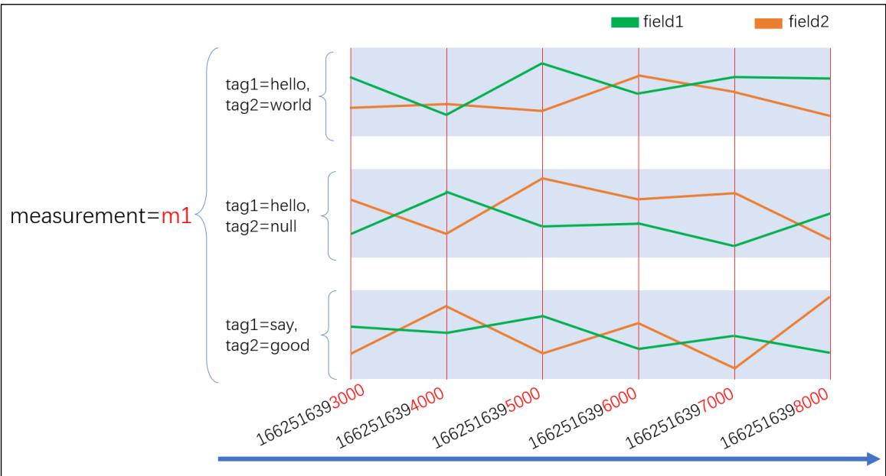


以序列的方式管理数据是时序数据库和传统关系型数据库最不同的地方。传统的关系型数据库通常是以 record（记录或者行）的方式管理数据，这个时候，关系型数据库可以让你快速地通过索引定位到一条数据。

<table><tr><td>measurement</td><td>tag1</td><td>tag2</td><td>fileld1</td><td>field2</td><td>time</td></tr><tr><td>m1</td><td>hello</td><td>world</td><td>9</td><td>46</td><td>1662516393000</td></tr><tr><td>m1</td><td>hello</td><td>world</td><td>30</td><td>29</td><td>1662516394000</td></tr><tr><td>m1</td><td>hello</td><td>world</td><td>39</td><td>31</td><td>1662516395000</td></tr><tr><td>m1</td><td>hello</td><td>world</td><td>14</td><td>33</td><td>1662516396000</td></tr><tr><td>m1</td><td>hello</td><td>world</td><td>1</td><td>24</td><td>1662516397000</td></tr><tr><td>m1</td><td>hello</td><td>world</td><td>24</td><td>9</td><td>1662516398000</td></tr><tr><td>m1</td><td>hello</td><td>null</td><td>42</td><td>49</td><td>1662516393000</td></tr><tr><td>m1</td><td>hello</td><td>null</td><td>33</td><td>30</td><td>1662516394000</td></tr><tr><td>m1</td><td>hello</td><td>null</td><td>30</td><td>22</td><td>1662516395000</td></tr><tr><td>m1</td><td>hello</td><td>null</td><td>46</td><td>47</td><td>1662516396000</td></tr><tr><td>m1</td><td>hello</td><td>null</td><td>1</td><td>14</td><td>1662516397000</td></tr><tr><td>m1</td><td>hello</td><td>null</td><td>24</td><td>14</td><td>1662516398000</td></tr><tr><td>m1</td><td>say</td><td>good</td><td>28</td><td>41</td><td>1662516393000</td></tr><tr><td>m1</td><td>say</td><td>good</td><td>36</td><td>13</td><td>1662516394000</td></tr><tr><td>m1</td><td>say</td><td>good</td><td>11</td><td>2</td><td>1662516395000</td></tr><tr><td>m1</td><td>say</td><td>good</td><td>41</td><td>12</td><td>1662516396000</td></tr><tr><td>m1</td><td>say</td><td>good</td><td>28</td><td>10</td><td>1662516397000</td></tr><tr><td>m1</td><td>say</td><td>good</td><td>43</td><td>33</td><td>1662516398000</td></tr></table>

但是在时序场景下，我们通常需要查找某个设备最近一段时间的数据。这个时候对于传统关系型数据库来说，很可能需要多次寻址来找到多个 record 才能完成查询。而时序库是把索引打到一批次的数据上，所以在这种场景的下的读写，时序库性能是远强于 B+树数据库的。

# 23.4 双索引设计与高效查询思路

我们之前说到你可以将 measurement、tag_set 和 field 视为索引，还没有提到最重要的时间。其实，在 InfluxDB 中时间也是索引，数据在入库时，会按时间戳进行排序。这样，我们在进行查询时，一般遵循下面的思路。

（1）先指定要从哪个存储桶查询数据

（2）指定数据的时间范围

（3）指定 measurement、tag_set、和 field 说明我要查询哪个序列。

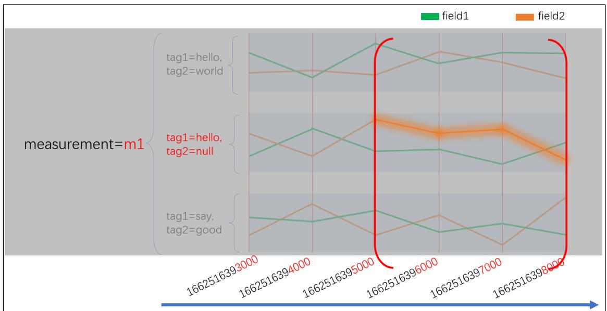


更多Java–大数据–前端–python人工智能资料下载，可百度访问：尚硅谷官网


# 23.5 我一次只能查询一个序列吗

一次只能查询一个序列，这显然是不合理的。

假如，我现在只指定要查询 measurent为 m1和 tag1为 hello的数据，那么就会命中图中 4 条序列。所以实际上，measurement，tag，field 都是倒排索引。

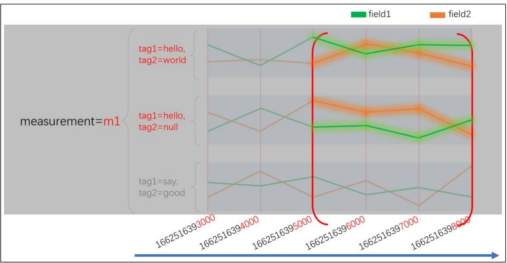


# 23.6 时间线膨胀（高基数问题）

时间线膨胀是所有时序数据库都绕不过的问题。简单地来解释时间线膨胀，就是我们的时序数据库中序列太多了。

当序列过多时，时序数据库的写入和读取性能通常都会有明显的下降。所以，当你去网上看一些时序数据库的压测文章时，需要注意文章有没有将序列数考虑进去。

# 第24章 附录 5：时间的标准与格式

本附录是专门向大家讲解时间的相关知识的。

# 24.1 GMT（格林威治标准时间）

格林威治（又译格林尼治）它是一个位处英国伦敦的小镇。

17 世纪，英国航海事业发展迅速，当时海上航行亟需精确的精度指示，于是英国皇家在格林威治这个地方设立了一个天文台负责测量正确经度的工作。

后来 1884年，在美国华盛顿召开的国际经度会以决定以经过格林尼治天文台（旧址）的经线为本初子午线（0度经线）。同时这次会以也将全球划分为了 24个时区。0度经线所在的时区为0时区。

现在，有时候你要买一个机械表，如果它说支持 GMT，意思就是支持显示格林威治标更多Java–大数据–前端–python人工智能资料下载，可百度访问：尚硅谷官网

准时间。


# 24.2 UT（世界时）

1928年，国际天文联合会提出了 UT的概念，UT主要用来衡量一天究竟有多长。一旦一天的长度可以确定，那么将这个长度除以 24就能确定一小时的长度。以此类推、分钟、秒的长度我们就都能确定了。

UT也是以格林威治时间作为标准的，它规定格林威的子夜为0点。

在当时，衡量一天长度的方法就是通过天文观测，看地球多久转一圈。但一来天文观测存在误差。二来，地球的自转越来越慢。计时方法亟需革新。

# 24.3 计时技术与国际原子时

人类历史上出现的计时手段大体上能分为三类

⚫ 一是试图通过某种匀速的运动来表示时间、比如沙漏、水钟、香钟（烧香）。这种方式的缺陷很大，是一种很粗略的时间衡量方法

⚫ 二是通过天文观测，通过日月或其他星辰的参考确定时间。现在我们已经知道，星系的运动也不是匀速的过程。

⚫ 三是通过固定频率的震动，最早是伽利略通过教堂的吊灯发现了摆的等时性，也就是摆角较小时，吊灯摆动一次的时间是相同的。距今三四百年前的摆钟，基本上都是利用这一原理实现的。

现在，人类已知的最精确的计时技术是原子钟，它以原子共振频率标准来计算和保持时间的准确。它的精度可以达到持续运行上亿年而误差不超过 1秒。

基于这种技术，后来国际计量协会结合了全球 400 多个原子钟，规定 1 秒为铯-133 原

更多Java–大数据–前端–python人工智能资料下载，可百度访问：尚硅谷官网子基态两个超精细能级间跃迁辐射震荡 9,192,631,770 周所持续的时间。这个定义就叫国际原子时（International Atomic Time， TAI）。这样，我们钟表里指针应该转多快也有了一个统一的标准。

国际原子时的秒长以格林威治时间 1958年 1月 1日 0时的秒长为基准。也就是规定，在这一瞬间，国际原子时的秒长和世界时的秒长是一样的。

# 24.4 UTC（世界协调时）

UTC，universal Time Coordinated。世界协调时，世界统一时间、国际协调时。它以国际原子时的秒长为基准。但是我们知道，UT 基于天文观测，地球越来越慢那 UT 的秒长应该越来越长。如果不进行干预那么 UTC 和 UT 之间就会有越来也大的误差，

如下图所示：

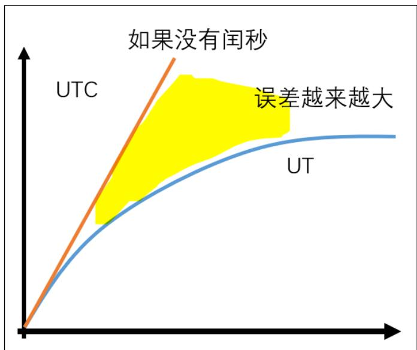


如果这种状况持续下去，在好多好多好多好多年后，人类可能就是 UTC时间凌晨 3点起床挤地铁上班了。因此，让 UTC 符合人类生活习惯，就必须控制 UTC 和 UT 的误差大小，于是 UTC引入了闰秒。所谓闰秒，也就是让在某个时间点上，人为规定这一分钟比普通的分钟多一秒，它有 61秒。这个时候 1 分 59秒过了应该接着是 2分 0秒，但是在遇到闰秒时会遇到1分60秒。

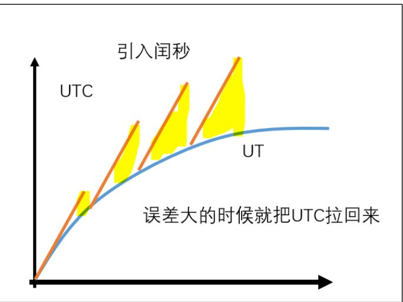


看似好像也能接受。但是何时加入闰秒是不可预测的。它是由国际地球自转服务（IERS）每隔一段时间依据实际情况决定的。对计算机的程序而言，闰秒机制具有明显的破坏性，相关国际标准机构一直在讨论是否继续这种做法。

# 24.5 小结：UTC/GMT

⚫ GMT是最早的国际时间标准，后来是 UTC。

⚫ 因为 UTC要逼近 UT，而 UT又以 GMT为标准。十分严格地说，UTC和 GMT不是一个东西。但宽松地说，你可以把 UTC 等同于 GMT，而且有些网站和应用程序就是这么干的。

⚫ 因为 UTC 标准已经使用多年。所以现在如果再看到 GMT 这个词，它指的通常不是国际时间，而是格林威治所在的时区，也就是 0 时区。同时，通常行政区有很多适应自己所在地的时区缩写，遗憾的是，这种写法经常会撞车。

比如，CCT，它可以表示美国中部时间（Central Standard Time），澳大利亚中部时间（Central Standard Time），中国标准时间（China Standard Time）和古巴标准时间（CubaStandard Time）

所以、如果我写 CCT 2022-08-03 11:56 就很容易误解了。这个时候我们非常需要一种没有歧义的日期时间写法。

# 24.6 时区与 UTC 偏移量

现行的时区表示更多是使用 UTC+偏移量的方式来表示的。比如北京是在东 8 区，时间比 UTC要早 8小时，那么在表示北京时区的方式就是 UTC+08:00。虽然地理界定上只有东西十二区，但是什么地方采用什么方式表达时间实际取决于当地的行政命令。因此UTC+12:00 并不是偏移量的上限。打开你电脑上的日期时间设置，你会发现有的的国家采

更多Java–大数据–前端–python人工智能资料下载，可百度访问：尚硅谷官网

用的是UTC+14:00。还有的国家偏移量并不完全是小时的整数倍，比如UTC+12:45。

# $H + | \bar { \mathbf { g } } | \bar { \mathbf { \phi } } | ] F [ \bar { \mathbf { l } } ] = \mathbf { \Xi } , \mathbf { \Xi } \boxed { \mathbf { \Xi } , \mathbf { H } , \mathbf { \Xi } \mathbf { \bar { \mathbf { g } } } \mathbf { \Xi } \mathbf { \Xi } \mathbf { \Xi } \mathbf { \Xi } \mathbf { \Xi } }$

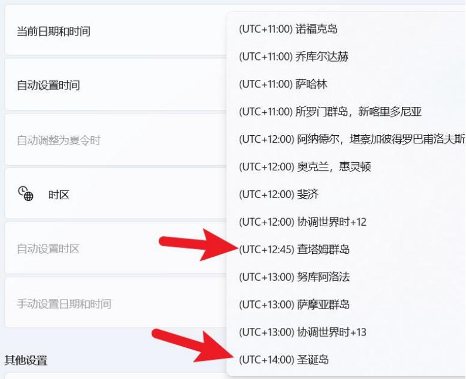


同时，也有很多应用会使用 GMT+0800的方式表示，效果是一样的。

# 24.7 日期时间的表示格式

2022 年 9 月 3 日该怎么表示？是 2022/09/03 还是 2022-09-03 还是 Sep 03 2022 ？这又是一个标准问题，当前的情况是，各个国家有符合本地习惯的日期时间格式标准，同时国际上也有诸多日期时间格式标准，比如 ISO 8601 和 RFC3339 等。

各种格式都有软件采用，所以编程语言中的日期标准库，一般都会准备 dateformat 工具，自己编码日期时间的格式。

# 24.8 ISO 8601

国际标准 ISO 8601，是国际标准化组织的日期和时间的表示方法和我们之前提过的UTC 不同，UTC 是一种时间标准，而 ISO 8601 是一种标准的时间格式，大多数的编程语言都支持。

使用ISO 8601格式可以明确表示下面的时间。

⚫ 公历日期

⚫ 24小时制的时间

⚫ UTC时区偏移量

⚫ 时间间隔

⚫ 以及上面几种元素的组合。

更多Java–大数据–前端–python人工智能资料下载，可百度访问：尚硅谷官网

ISO 8601 的表示非常灵活，这里不会将其完全列出，我们直说最常见的日期时间格式。

比如，下面就是一个符合 ISO 8601的日期时间表示。

2022-09-03T14:13:00Z，这个时间戳中间的 T 用来分隔 日期 和 时间，最后字母 Z 表示0 时区，也就是 UTC 或 GMT 时间。

# 24.9 示例：在编程语言中获取 UTC 时间和 ISO 格式

本例会在浏览器中用 javaScript操作日期对象。

# 24.9.1 打开浏览器

打开浏览器，随便进入一个页面，空白标签页更好。老师这里演示时使用的 chrome浏览器，打开的是bing搜索首页。


# 24.9.2 按 F12 打开开发者工具

按 F12 打开开发者工具，在开发者工具的上方找到 Console 按钮，点一下。如果设置了中文页面，那么应该是控制台。效果如下。

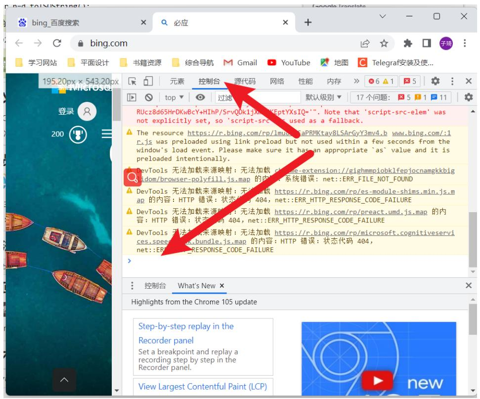


进入控制台后，有一些报错信息和警告，这些都是 bing 页面的问题，可以忽视。下方有一个蓝色的箭头，在这里，我们可以直接编写 javaScript 代码并且立刻运行。

# 24.9.3 编写代码

（1）创建一个日期对象

```txt
x = new Date() 
```

代码敲完后，回车执行

```txt
> x = new Date()
< Sat Sep 03 2022 14:44:29 GMT+0800 (中国标准时间)
```

可以看到控制台有一个返回的结果，表示当前的时间是 2022 年 9 月 3 日星期六 14 点44分 29秒，时区的偏移量是从格林威治时区向东偏移 8小时。

（2）使用下面的代码获取ISO标准的日期时间字符串。

```javascript
x.toISOString() 
```

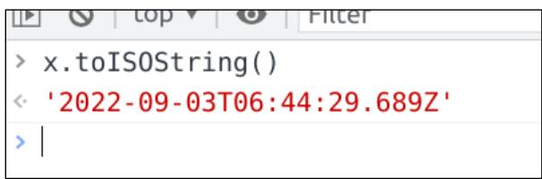


可以看到我们之前是 2022 14:44:29 现在对到 UTC 时间 0 时区，成 06:44:29 了。完成！

# 24.10 RFC 3339

更多Java–大数据–前端–python人工智能资料下载，可百度访问：尚硅谷官网

RFC 是 request for comment 的简写。它其实是一系列加了编号的文件。这一系列文件收集了有关互联网的文章，包括 UNIX 和某些互联网社区上的软件文件。RFC 还收录了很多与互联网标准相关的文章，包含各种网络协议，以及我们今天要谈及的时间格式标准问题。

RFC3339 这篇文章的原文标题叫作，Date and Time on the Internet：Timestamps（互联网上的日期和时间：时间戳）,发表的时间是 2002 年 7 月。感兴趣的同学可以参考原文：https://www.rfc-editor.org/rfc/rfc3339

简单来说 RFC3339 对日期时间的定义更加简洁，去掉了 ISO 8601 中一些小众的表达方式，也更具有可读性。

# 24.11 RFC3339 和 ISO8601 之间的关系

可以参考：https://ijmacd.github.io/rfc3339-iso8601/

这个网站可以实时展示当前时间的 RFC3339 表示和 ISO 8601 表示。下面这张图是它的截图。可以看到 RFC 3339 的表述有一部分和 ISO 8601 是相同的。

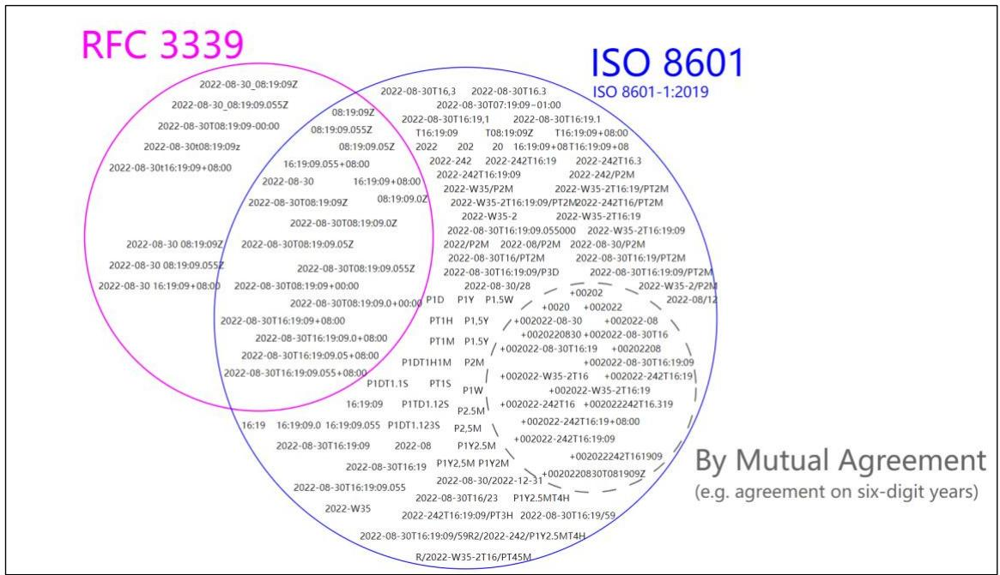


仔细去看你会发现，RFC3339 格式的日期时间表述，基本上都能第一时间反应出来它表述的是什么时间。而 ISO 8601 中就会有像 2022-242T16:55:17/PT3H 这种看上去奇奇怪怪的表述。

# 24.12 补充：Unix时间戳与闰秒

# 24.12.1 什么是 Unix 时间戳

更多Java–大数据–前端–python人工智能资料下载，可百度访问：尚硅谷官网

Unix 时间戳是一种将时间跟踪为运行总秒数的方法，这个技术从 1970 年 1 月 1 日的UTC 开始。因此，Unix 时间戳只表示从特定时间点到现在的秒数。而且，需要注意的是，无论你身处何，这个总秒数的值在技术上都不会发生改变。所以这对计算机系统，客户端和服务端的通信和日期跟踪十分有用。

# 24.12.2 Unix时间戳是怎么处理闰秒的

关于闰秒问题，我们之前说过，什么时候出现闰秒是不确定的。那么在 Unix时间戳里，是怎么处理闰秒的呢？答案是减慢时钟。

比如 1997 年 6 月 30 日 23:59:59 到 1997 年 7 月 1 日 00:00:00 应该发生一次闰秒。

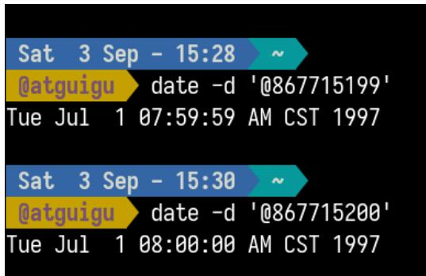


那么 867715200 这个时间戳应该对应 1997 年 6 月 30 日的 23:59:60。但是 Linux 好像压根不知道这件事。这是因为 Unix 时间戳标准里，把一天定死为 86400 秒了。所以类 Unix的处理方案是，当闰秒发生时由 ntrp 服务把时钟慢下来，当时间戳为 867715199 的时候，让它在这个值上多停留 1 秒然后再进入 867715200。