# 微信study322专业一手超清完整全网课程 超低价格

# MongoDB基本使用

# Nosql简介

NoSQL(NoSQL = Not Only SQL )，意即”不仅仅是SQL”。

在现代的计算系统上每天网络上都会产生庞大的数据量， 这些数据有很大一部分是由关系数据库管理系统（RDBMS）来处理。 1970年 E.F.Codd’s提出的关系模型的论文 “A relational model of data forlarge shared data banks”，这使得数据建模和应用程序编程更加简单。

通过应用实践证明，关系模型是非常适合于客户服务器编程，远远超出预期的利益，今天它是结构化数据存储在网络和商务应用的主导技术。

NoSQL 是一项全新的数据库革命性运动，早期就有人提出，发展至2009年趋势越发高涨。NoSQL的拥护者们提倡运用非关系型的数据存储，相对于铺天盖地的关系型数据库运用，这一概念无疑是一种全新的思维的注入。

# 什么是NoSQL

NoSQL，指的是非关系型的数据库。NoSQL有时也称作Not Only SQL的缩写，是对不同于传统的关系型数据库的数据库管理系统的统称。

NoSQL用于超大规模数据的存储。（例如谷歌或Facebook每天为他们的用户收集万亿比特的数据）。这些类型的数据存储不需要固定的模式，无需多余操作就可以横向扩展。

# 为什么使用NoSQL

今天我们可以通过第三方平台（如：Google,Facebook等）可以很容易的访问和抓取数据。用户的个人信息，社交网络，地理位置，用户生成的数据和用户操作日志已经成倍的增加。我们如果要对这些用户数据进行挖掘，那SQL数据库已经不适合这些应用了, NoSQL 数据库的发展却能很好的处理这些大的数据。

# RDBMS vs NoSQL

# RDBMS

高度组织化结构化数据

结构化查询语言（SQL）

数据和关系都存储在单独的表中。

数据操纵语言，数据定义语言

严格的一致性

基础事务

# NoSQL

代表着不仅仅是SQL

没有声明性查询语言全网

没有预定义的模式

键 - 值对存储，列存储，文档存储，图形数据库

最终一致性，而非ACID(原子性、一致性、隔离性、持久性)属性

非结构化和不可预知的数据

# NoSQL的优缺点

# 优点

高可扩展性

分布式计算

低成本

架构的灵活性，半结构化数据

没有复杂的关系

# 缺点

没有标准化

有限的查询功能（到目前为止）

最终一致是不直观的程序

# 分布式理论

# CAP定理


服务器A


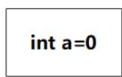


服务器B


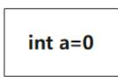


CAP:不可能同时满足以下这三点：

C（一致性）：所有的节点上的数据时刻保持同步

A（可用性）：每个请求都能接受到一个响应，无论响应成功或失败

P (分区容错）：系统应该能持续提供服务，即使系统内部有消息丢失（分区)

CA CP AP 

在计算机科学中, CAP定理（CAP theorem）, 又被称作 布鲁尔定理（Brewer’s theorem）, 它指出对于一个分布式计算系统来说，不可能同时满足以下三点:

一致性(Consistency) (所有节点在同一时间具有相同的数据)

可用性(Availability) (保证每个请求不管成功或者失败都有响应)

分区容错性(Partition tolerance) (系统中任意信息的丢失或失败不会影响系统的继续运作)

CAP理论的核心是：一个分布式系统不可能同时很好的满足一致性，可用性和分区容错性这三个需求，最多只能同时较好的满足两个。

因此，根据 CAP 原理将 NoSQL 数据库分成了满足 CA 原则、满足 CP 原则和满足 AP 原则三 大类：

CA - 单点集群，满足一致性，可用性的系统，通常在可扩展性上不太强大。

CP - 满足一致性，分区容忍性的系统，通常性能不是特别高。

AP - 满足可用性，分区容忍性的系统，通常可能对一致性要求低一些。

# BASE理论

BASE：Basically Available, Soft-state, Eventually Consistent。 由 Eric Brewer 定义。专业一手超清完整

CAP理论的核心是：一个分布式系统不可能同时很好的满足一致性，可用性和分区容错性这三个需求，最多只能同时较好的满足两个。全网课程 超低价格

BASE是NoSQL数据库对可用性及一致性的弱要求原则:

Basically Availble –基本可用

Soft-state – 软状态/柔性事务。 “Soft state” 可以理解为”无连接”的, 而 “Hard state” 是”面向连接”的

软状态是指允许系统存在中间状态，并且该中间状态不会影响系统整体可用性。即允许系统在不同节点间副本同步的时候存在延时。简单来说就是状态可以在一段时间内不同步。

Eventual Consistency – 最终一致性， 也是 ACID 的最终目的。

# MongoDB基础

# 什么是MongoDB

MongoDB 是由C++语言编写的，是一个基于分布式文件存储的开源数据库系统。

在高负载的情况下，添加更多的节点，可以保证服务器性能。

MongoDB 旨在为WEB应用提供可扩展的高性能数据存储解决方案。

# 存储结构

MongoDB 将数据存储为一个文档，数据结构由键值(key=>value)对组成。MongoDB 文档类似于JSON 对象。字段值可以包含其他文档，数组及文档数组。

```txt
{
    name: "sue",
    age: 26,
    status: "A",
    groups: ["news", "sports"]
} 
```

# 主要特点

非关系型数据库，基于 Document data model (文档数据模型)

MongoDB以 BSON (BinaryJSON) 格式存储数据，类似于 JSON 数据形式

关系型数据库使用 table (tables of rows)形式存储数据，而MongoDB使用 collections(collections of documents)

支持 临时查询( ad hoc queries ): 系统不用提前定义可以接收的查询类型

索引通过 B-tree 数据结构， 3.2版本的WiredTiger 支持 log-structured merge-trees(LSM)

支持索引和次级索引( secondary indexes ): 次级索引是指文档或row有一个 主键( primarykey )作为索引，同时允许文档或row内部还拥有一个索引，提升查询的效率，这也是MongoDB比较大的一个特点

# MongoDB安装

# 下载MongoDB

# 查找MongoDB安装包+

到MongoDB地址下载 https://www.mongodb.com/try/download/community linux安装包，并选择对应的版本，点击 copy link 得到地址就可以通过linux环境 wget 进行下载了专业一手超清完整


# 下载MongoDB

通过wget命令下载刚才在页面copy的链接进行下载

# 安装wget

```txt
yum -y install wget 
```

```txt
wget https://fastdl.mongodb.org/linux/mongodb-linux-x86_64-rhel70-4.4.5.tgz 
```

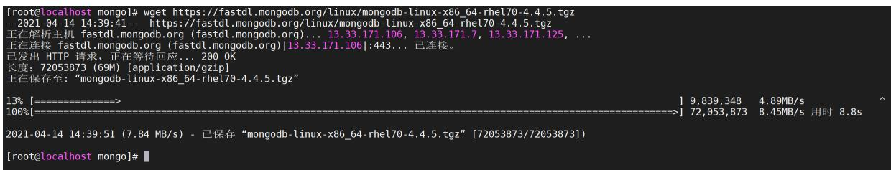


# 解压安装包

```txt
tar -zxvf mongodb-linux-x86_64-rhel70-4.4.5.tgz 
```

```ini
[root@localhost mongo]# tar -zxvf mongodb-linux-x86_64-rhel70-4.4.5.tgz  
mongodb-linux-x86_64-rhel70-4.4.5/LICENSE-Community.txt  
mongodb-linux-x86_64-rhel70-4.4.5/MPL-2  
mongodb-linux-x86_64-rhel70-4.4.5/README  
mongodb-linux-x86_64-rhel70-4.4.5/THIRD-PARTY-NOTICES  
mongodb-linux-x86_64-rhel70-4.4.5/bin/install_compass  
mongodb-linux-x86_64-rhel70-4.4.5/bin/mongo  
mongodb-linux-x86_64-rhel70-4.4.5/bin/mongod  
mongodb-linux-x86_64-rhel70-4.4.5/bin/mongos  
[root@localhost mongo]#  
[root@localhost mongo]# ls  
mongodb-linux-x86_64-rhel70-4.4.5 mongodb-linux-x86_64-rhel70-4.4.5.tgz  
[root@localhost mongo]# 
```

# 重命名文件夹

```txt
mv mongodb-linux-x86_64-rhel70-4.4.5 mongodb4.4.5 
```

```txt
[root@localhost mongo]# mv mongodb-linux-x86_64-rhel70-4.4.5 mongodb4.4.5
[root@localhost mongo]# ll
总用量 70368
drwxr-xr-x. 3 root root 100 4月 14 14:43 mongodb4.4.5
-rw-r--r--. 1 root root 72053873 4月 7 05:48 mongodb-linux-x86_64-rhel70-4.4.5.tgz
[root@localhost mongo]#
```

# 配置环境变量

这里根据自己对应的mongodb路径配置,将我们的MongoDB的bin目录配置到系统环境中

```batch
vi /etc/profile 
```

在 export PATH USER LOGNAME MAIL HOSTNAME HISTSIZE HISTCONTROL 一行的上面添加如下内容:

```txt
#设置 MongoDB环境变量
```

```txt
export PATH=/opt/mongodb/mongodb4.4.5/bin:$PATH 
```

```shell
for i in /etc/profile.d/*.sh /etc/profile.d/sh.local ; do
    if [ -r "$i" ]; then
    if [ "${#*i}" != "$-" ]; then
    . "$i"
    else
    . "$i" >/dev/null
    fi
    fi
done
unset i
unset -f pathmunge
# jdk环境配置
export JAVA_HOME=/opt/jdk1.8.0_301
export JRE_HOME=$JAVA_HOME/jre
export PATH=$PATH:$JAVA_HOME/bin
export CLASSPATH=./://$JAVA_HOME/lib:$JRE_HOME/lib
# maven环境配置
export MAVEN_HOME=/opt/apache-maven-3.6.1
export PATH=$MAVEN_HOME/bin:$PATH
# 设置 Mongodb环境变量
export PATH=/opt/mongodb/mongodb4.4.5/bin:$PATH
:wq
```

保存后通过下面的命令使环境变量生效

```txt
source /etc/profile 
```

# 安装MongoDB

# 准备工作

Linux下我们使用tgz格式的安装包进行安装，没有像windows那样可以使用msi进行简易安装，所以，它这个包是不全的，我们需要进入mongodb目录再手动创建两个目录，data和log，data目录是用于存放数据的，log目录是用于存放日志文件的

```txt
mkdir data logs
#创建mongodb的日志文件
touch logs/mongodb.log
```

```txt
[root@localhost mongodb4.4.5]# mkdir data logs
[root@localhost mongodb4.4.5]# ll
总用量 132
drwxr-xr-x. 2 root root 70 4月 14 14:45 bin
drwxr-xr-x. 2 root root 6 4月 14 14:51 data
-rw-r--r--- 1 root root 30608 4月 7 04:54 LICENSE-Community.txt
drwxr-xr-x. 2 root root 6 4月 14 14:51 logs
-rw-r--r--- 1 root root 16726 4月 7 04:54 MPL-2
-rw-r--r--- 1 root root 1977 4月 7 04:54 README
-rw-r--r--- 1 root root 75685 4月 7 04:54 THIRD-PARTY-NOTICES
[root@localhost mongodb4.4.5]#
```

# 创建配置文件

因为该安装包不包含配置文件，我们需要去bin目录下面写一个mongodb的配置文件

```txt
vi mongodb.conf 
```

这里面的数据文件以及日志路径就是我们刚才创建的目录的路径

```txt
#端口号 默认为27017
port=27017

#数据库数据存放目录
dbpath=/opt/mongodb/mongodb4.4.5/data

#数据库日志存放目录
logpath=/opt/mongodb/mongodb4.4.5/logs/mongodb.log

# pid存储路径
pidfilepath = /var/run/mongo.pid

#以追加的方式记录日志
logappend = true

#以后台方式运行进程
fork=true

#开启用户认证
#auth=true

#最大同时连接数
maxConns=100

#这样就可外部访问了，例如从win10中去连虚拟机中的MongoDB
bind_ip = 0.0.0.0

#每次写入会记录一条操作日志（通过journal可以重新构造出写入的
#启用日志文件，默认启用
journal=true

#这个选项可以过滤掉一些无用的日志信息，若需要调试使用请设置为
quiet=true
```

# 使用系统服务启动

# 创建启动脚本

在 /etc/init.d/ 路径下创建mongod的启动脚本

```txt
vi /etc/init.d/mongod 
```

注意将 MONGODB_HOME 路径改为mongodb的安装路径

#!/bin/sh 

# chkconfig: 

#MogoDB home directory 

MONGODB_HOME=/opt/mongodb/mongodb4.4.5/ 

#mongodb command 

MONGODB_BIN=$MONGODB_HOME/bin/mongod 

#mongodb config file +微

MONGODB_CONF=$MONGODB_HOME/bin/mongodb.conf 

#mongodb PID 

MONGODB_PID=/var/run/mongo.pid 

#set open file limit 

SYSTEM_MAXFD=65535 

MONGODB_NAME="mongodb" 

. /etc/rc.d/init.d/functions 

if [ ! -f $MONGODB_BIN ] 

then 

echo "$MONGODB_NAME startup: $MONGODB_BIN not exists! 1 

exit 

fi 

start(){ 

ulimit -HSn $SYSTEM_MAXFD 

$MONGODB_BIN --config="$MONGODB_CONF" --fork ##added 

ret=$? 

if [ $ret -eq 0 ]; then 

action $"Starting $MONGODB_NAME: /bin/true 

else 

action $"Starting $MONGODB_NAME: " /bin/false 

fi 

stop(){ 

PID=$(ps aux |grep "$MONGODB_NAME" |grep "$MONGODB_CONF" |grep -v grep |wc 

l) 

if [[ $PID -eq 0 ]];then 

action $"Stopping $MONGODB_NAME: " /bin/false 

exit 

fi 

kill -HUP `cat $MONGODB_PID` 

ret=$? 

if [ $ret -eq 0 ]; then 

action $"Stopping $MONGODB_NAME: " /bin/true 

rm -f $MONGODB_PID 

else 

action $"Stopping $MONGODB_NAME: " /bin/false 

fi 

```shell
restart() {
stop
sleep 2
start
}
case "$1" in
start)
start
;; 
stop)
stop
;; 
status)
status $prog
;; 
restart)
restart
;; 
*) echo "$Usage: $0 {start|stop|status|restart}"
esac 
```

# 设置权限

设置该脚本拥有执行权限

```txt
chmod 755 /etc/init.d/mongod 
```

# 启动MongoDB

使用如下命令启动MongoDB

```txt
# 启动mongodb
service mongod start
# 检查服务是否存在
ps -ef|grep mongo
```

出现如下就提示表示mongodb已经启动成功

```shell
[root@localhost mongodb4.4.5]# ps -ef|grep mongo
root 1798 1 2 09:47 ? 00:00:01 /usr/local/mongo/mongodb4.4.5//bin/mongod --config=/usr/local/mongo/mongodb4.4.5//bin/mongodb.conf --fork
root 1834 1535 0 09:48 pts/0 00:00:00 grep --color=auto mongo 
```

# 访问测试

输入mongo命令使用本地客户端进行访问

```txt
mongo 
```

出现如下界面表示登录mongodb成功

```txt
[root@localhost ~]# mongo
MongoDB shell version v4.4.5
connecting to: mongodb://127.0.0.1:27017/?compressors=disabled&gssapiServiceName=mongodb
Implicit session: session { "id" : UUID("6f60ebe5-36dc-4e95-9c64-1a4cae300ca8") }
MongoDB server version: 4.4.5

The server generated these startup warnings when booting:
    2021-04-14T16:07:37.718+08:00: Access control is not enabled for the database. Read and write access to data and configuration is unrestricted
    2021-04-14T16:07:37.718+08:00: You are running this process as the root user, which is not recommended
    2021-04-14T16:07:37.718+08:00: /sys/kernel/mm/transparent_hugepage/enabled is 'always'. We suggest setting it to 'never'
    2021-04-14T16:07:37.718+08:00: /sys/kernel/mm/transparent_hugepage/defrag is 'always'. We suggest setting it to 'never'

Enable MongoDB's free cloud-based monitoring service, which will then receive and display metrics about your deployment (disk utilization, CPU, operation statistics, etc).

The monitoring data will be available on a MongoDB website with a unique URL accessible to you and anyone you share the URL with. MongoDB may use this information to make product improvements and to suggest MongoDB products and deployment options to you.

To enable free monitoring, run the following command: db.enableFreeMonitoring()
To permanently disable this reminder, run the following command: db.disableFreeMonitoring()

> 
```

查询所有的数据库

```txt
show dbs; 
```

```txt
> show dbs;
admin 0.000GB
config 0.000GB
local 0.000GB
> 
```

# 关闭防火墙

如果需要mongoDB进行外部访问需要开放防火墙端口，因为我们使用了虚拟机所以直接关闭防火墙

# 检查防火墙状态

使用下面的命令可以检查防火墙状态

```txt
systemctl status firewalld.service 
```

```txt
[root@localhost ~]# systemctl status firewalld.service
- firewalld.service - firewalld - dynamic firewall daemon
  Loaded: loaded (/usr/lib/systemd/system/firewalld.service; enabled; vendor preset: enabled)
  Active: active (running) since 五 2021-04-16 09:38:40 CST; 2 days ago
  Docs: man:firewalld(1)
Main PID: 718 (firewalld)
CGroup: /system.slice/firewalld.service
    └─718 /usr/bin/python2 -Es /usr/sbin/firewalld --nofork --nopid

4月 16 09:38:39 localhost.localdomain systemd[1]: Starting firewalld - dynamic firewall daemon...
4月 16 09:38:40 localhost.localdomain systemd[1]: Started firewalld - dynamic firewall daemon.
```

然后在下方可以查看得到“active（running）”，此时说明防火墙已经打开了

# 停止防火墙

在命令行中输入systemctl stop firewalld.service命令，进行关闭防火墙

```txt
systemctl stop firewalld.service 
```

```txt
[root@localhost ~]# systemctl stop firewalld.service
[root@localhost ~]# systemctl status firewalld.service
● firewalld.service - firewalld - dynamic firewall daemon
Loaded: loaded (/usr/lib/systemd/system/firewalld.service; enabled; vendor preset: enabled)
Active: inactive (dead) since -- 2021-04-19 09:37:42 CST; 5s ago
Docs: man:firewalld(1)
Process: 718 ExecStart=/usr/sbin/firewalld --nofork --nopid $FIREWALLD_ARGS (code=exited, status=0/SUCCESS)
Main PID: 718 (code=exited, status=0/SUCCESS)

4月 16 09:38:39 localhost.localdomain systemd[1]: Starting firewalld - dynamic firewall daemon...
4月 16 09:38:40 localhost.localdomain systemd[1]: Started firewalld - dynamic firewall daemon.
4月 19 09:37:41 localhost systemd[1]: Stopping firewalld - dynamic firewall daemon...
4月 19 09:37:42 localhost systemd[1]: Stopped firewalld - dynamic firewall daemon.
[root@localhost ~]#
```

然后再使用命令systemctl status firewalld.service，在下方出现disavtive（dead），这样就说明防火墙已经关闭。

# 永久关闭防火墙

再在命令行中输入命令“systemctl disable firewalld.service”命令，即可永久关闭防火墙

```txt
systemctl disable firewalld.service 
```

```txt
[root@localhost ~]# systemctl disable firewalld.service
Removed symlink /etc/systemd/system/multi-user.target.wants/firewalld.service.
Removed symlink /etc/systemd/system/dbus-org.fedoraproject.FirewallD1.service.
[root@localhost ~]# 
```

这样下次启动，防火墙就不会开启了+微信st

# 优雅关机

在生产环境，不要用 kill -9 关掉 mongodb 的进程，很可能造成 mongodb 的数据丢失；可以使用以下方式进行优雅关机 全网课程 超低价格

```txt
use admin
db.shutdownServer() 
```

```txt
> use admin
switched to db admin
> db.shutdownServer()
server should be down...
>
> 
```

# 基本概念

# 和传统数据库对比

不管我们学习什么数据库都应该学习其中的基础概念，在mongodb中基本的概念是文档、集合、数据库，下面我们分别介绍，下表将帮助您更容易理解Mongo中的一些概念：

<table><tr><td>对比项</td><td>mongo</td><td>数据库</td></tr><tr><td>table</td><td>collection</td><td>数据库表/集合</td></tr><tr><td>row</td><td>document</td><td>数据记录行/文档</td></tr><tr><td>column</td><td>field</td><td>数据字段/域</td></tr><tr><td>index</td><td>index</td><td>索引</td></tr><tr><td>table joins</td><td></td><td>表连接,MongoDB不支持</td></tr><tr><td>primary key</td><td>primary key</td><td>主键,MongoDB自动将_id字段设置为主键</td></tr></table>

通过下图实例，我们也可以更直观的了解Mongo中的一些概念：

<table><tr><td>id</td><td>user_name</td><td>email</td><td>age</td><td>city</td></tr><tr><td>1</td><td>Mark Hanks</td><td>mark@abc.com</td><td>25</td><td>Los Angeles</td></tr><tr><td>2</td><td>Richard Peter</td><td>richard@abc.com</td><td>31</td><td>Dallas</td></tr></table>


```json
{
    "_id": ObjectId("5146bb52d8524270060001f3"),
    "age": 25,
    "city": "Los Angeles",
    "email": "mark@abc.com",
    "user_name": "Mark Hanks"
}
{
    "_id": ObjectId("5146bb52d8524270060001f2"),
    "age": 31,
    "city": "Dallas",
    "email": "richard@abc.com",
    "user_name": "Richard Peter"
} 
```

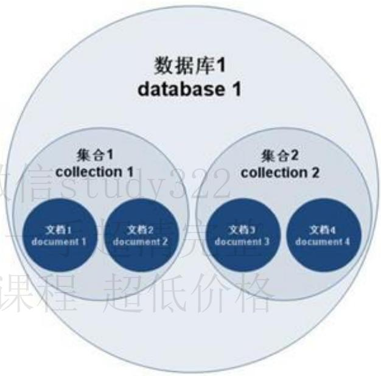


下面我们对里面的每一个概念进行详细解释

# 数据库

一个mongoDB的实例可以运行多个database，database之间是完全独立的，每个database有自己的权限，每个database存储于磁盘的不同文件。

# 命令规范

databases的name可以是任意的UTF-8字符串。但是有以下限制

空字符串””是非法的

不允许出现’’,.,$,/,\,\0字符

建议名称都是小写

不能超过64个字节

# 特殊数据库

有一些数据库名是保留的，可以直接访问这些有特殊作用的数据库。

admin：它是root级别的数据库，如果一个用户创建了admin数据库，该用户将自动集成所有数据库的权限，它可以执行一些服务器级别的命令，如列出所有数据库、关闭服务等。

local：该数据库将永远不能被复制，只能在单台服务器本地使用。

config：存储分布式部署时shard的配置信息

# 数据库操作

# 查看数据库列表

show dbs 命令可以显示所有数据的列表

show dbs; 

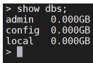


# 显示当前数据库

执行 “db” 命令可以显示当前数据库对象或集合。

```txt
db 
```

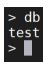


# 创建数据库

MongoDB 使用 use 命令创建数据库，如果数据库不存在，MongoDB 会在第一次使用该数据库时创建数据库。如果数据库已经存在则连接数据库，然后可以在该数据库进行各种操作。专业一手超清完整

```vhdl
show dbs;
#创建tmpdb数据库
use tmpdb;
show dbs;
```

```asm
> show dbs;
admin 0.000GB
config 0.000GB
local 0.000GB
>
> use tmpdb;
switched to db tmpdb
>
> show dbs;
admin 0.000GB
config 0.000GB
local 0.000GB 
```

注意: 在 MongoDB 中，只有在数据库中插入集合后才会创建! 就是说，创建数据库后要再插入一个集合，数据库才会真正创建。

```javascript
use tmpdb;
# 在xxx的集合中插入一条数据
db.xxx.insertOne({"name":"张三"});
show dbs;
```

现在tmpdb数据库就显示出来了

```txt
> use tmpdb;
switched to db tmpdb
>
> db
tmpdb
>
> db.xxx.insertOne({"name":"张三"});
{
    "acknowledged": true,
    "insertedByd": ObjectId("6076b89de04dc9112613227f")
}
>
> show dbs;
admin 0.000GB
config 0.000GB
local 0.000GB
tmpdb 0.000GB
>
```

# 删除数据库

可以使用 db.dropDatabase() 删除数据库

```txt
show dbs;
use tmpdb;
db;
#删除数据库
db.dropDatabase();
show dbs;
```

```asm
> show dbs;
admin 0.000GB
config 0.000GB
local 0.000GB
tmpdb 0.000GB

> use tmpdb;
switched to db tmpdb

> db;
tmpdb

> db.dropDatabase();
{"dropped": "tmpdb", "ok": 1}

> show dbs;
admin 0.000GB
config 0.000GB
local 0.000GB 
```

# 集合

相当于关系数据库的表，不过没有数据结构的定义。它由多个document组成。专业一手超清完整

# 命令规范

因为是无结构定义的，所以你可以把任何document存入一个collection里。每个collection用一个名字标识，需要注意以下几点：

名字不允许是空字符串""

名字不能包含\0字符，因为它表示名字的结束

不能创建以system.开头的

# 集合操作

# 创建集合

可以通过 db.createCollection(name,option) 创建集合

参数说明：

name: 要创建的集合名称

options: 可选参数, 指定有关内存大小及索引的选项

```javascript
# 创建或选择tmpdb数据库
use tmpdb;
# 在db数据库创建一个blog的集合
db.createCollection("blog");
```

```txt
> use tmpdb;
switched to db tmpdb
>
> db.createCollection("blog");
{ "ok" : 1 }
>
> 
```

# 查看集合

如果要查看已有集合，可以使用 show collections 或 show tables 命令：

```txt
show collections;
show tables; 
```

```txt
> show collections;
blog
>
> show tables;
blog
>
> 
```

# 删除集合

MongoDB 中使用 drop() 方法来删除集合 db.collection.drop()

如果成功删除选定集合，则 drop() 方法返回 true，否则返回 false。

```txt
> show tables;
blog
>
> db.blog.drop();
true
>
> show tables;
>
> 
```

从结果中可以看出 所有的集合已被删除。

# 文档

mongoDB的基本单位，相当于关系数据库中的行，它是一组有序的key/value键值对，使用json全网课程 超低价格格式，

如：{"foo" : 3, "greeting": "Hello, world!"}。

# key的命令规范

key是个UTF-8字符串，以下几点是需要注意的地方：

不能包含\0字符（null字符），它用于标识key的结束

.和$字符在mangodb中有特殊含义，如$被用于修饰符($inc表示更新修饰符)，应该考虑保留，以免被驱动解析

以_开始的key也应该保留，比如_id是mangodb中的关键字

# 注意事项

在mangodb中key是不能重复的

value 是弱类型，甚至可以嵌入一个document

key/value键值对在mangodb中是有序的

mangodb是类型和大小写敏感的，如{"foo" : 3}和{"foo" : "3"}是两个不同的document，{"foo" :3}和{"Foo" : 3}

# 文档基础使用

MongoDB最主要是对文档的操作，下面我们来学习一下文档的操作

# 插入文档

MongoDB插入数据有多种形式，下面我们来一一学习

# insert(不推荐)

插入一条或多条数据需要带有允许插入多条的参数,这个方法目前官方已经不推荐了

注意：若插入的数据主键已经存在，则会抛

org.springframework.dao.DuplicateKeyException 异常，提示主键重复，不保存当前数据。

```javascript
db.blog.insert({
    "title": "MongoDB 教程",
    "description": "MongoDB 是一个 Nosp1 数据库",
    "by": "我的博客",
    "url": "http://www.baiyp.ren",
    "tags": [
    "mongodb",
    "database",
    "NoSQL"
    ],
    "likes": 100
});
```

```txt
> db.blog.insert({
...    "title": "MongoDB 教程",
...    "description": "MongoDB 是一个 NoSQL 数据库",
...    "by": "我的博客",
...    "url": "http://www.baiyp.ren",
...    "tags": [
...    "mongodb",
...    "database",
...    "NoSQL"
...    ],
...    "likes": 100
... });
WriteResult({ "nInserted": 1 })
>
>
```

如果没有添加 _id 参数会自动生成 _id 值的，也可以自定义指定 _id

```javascript
db.blog.insert({
    "_id": "1",
    "title": "Redis 教程",
    "description": "Redis 是一个 Nosql 数据库",
    "by": "我的博客",
    "url": "http://www.baiyp.ren",
    "tags": [
    "redis",
    "database",
    "NoSQL"
    ],
    "likes": 1000
});

db.blog.insert({
    "_id": "1",
    "title": "MySQL 教程",
    "description": "Mysql 是一个传统数据库",
    "by": "我的博客",
    "url": "http://www.baiyp.ren",
    "tags": [
    "Mysql",
    "database"
    ],
    "likes": 10000
});
```

如果_id重复会抛出异常

```txt
> db.blog.insert({
...    "_id": "1",
...    "title": "Redis 教程",
...    "description": "Redis 是一个 Nysql 数据库",
...    "by": "我的博客",
...    "url": "http://www.baiyp.ren",
...    "tags": [
...    "redis",
...    "database",
...    "NoSQL"
...    ],
...    "likes": 1000
... });
WriteResult({ "nInserted": 1 })
>
> db.blog.insert({
...    "_id": "1",
...    "title": "MySQL 教程",
...    "description": "Mysql 是一个传统数据库",
...    "by": "我的博客",
...    "url": "http://www.baiyp.ren",
...    "tags": [
...    "Mysql",
...    "database"
...    ],
...    "likes": 10000
... });
WriteResult({
  "nInserted": 0,
  "writeError": {
    "code": 11000,
    "errmsg": "E11000 duplicate key error collection: tmpdb.blog index: _id_dup key: { _id: \"1\" }"
  }
}
```

# insertOne(推荐)

官方推荐的写法，向文档中写入一个文档

```javascript
db.blog.insertOne({
    "title": "MySQL 教程",
    "description": "Mysql 是一个传统数据库",
    "by": "我的博客",
    "url": "http://www.baiyp.ren",
    "tags": [
    "Mysql",
    "database"
    ],
    "likes": 10000
});
```

这样就将数据插入到mongoDB中了

```txt
> db.blog.insertOne({
...    "title": "MySQL 教程",
...    "description": "Mysql是一个传统数据库",
...    "by": "我的博客",
...    "url": "http://www.baiyp.ren",
...    "tags": [
...    "Mysql",
...    "database"
...    ],
...    "likes": 10000
... });
{
    "acknowledged": true,
    "insertedBy": ObjectId("6077f9e6aec5824bb77a5235")
}
>
```

# insertMany(推荐)

该语句是进行批量插入的，可以直接进行批量插入

```javascript
db.blog.insertMany([
    {
    "title": "MySQL 教程1",
    "description": "Mysql 是一个传统数据库",
    "by": "我的博客",
    "url": "http://www.baiyp.ren",
    "tags": [
    "Mysql",
    "database"
    ],
    "likes": 10000
    },
    {
```

```json
"title": "MySQL 教程2",
"description": "Mysql是一个传统数据库",
"by": "我的博客",
"url": "http://www.baiyp.ren",
"tags": [
    "Mysql",
    "database"
],
"likes": 10000
}
```


这样就将多个文档插入到MongoDB中了


```json
> db.blog.insertMany([{
...    "title": "MySQL 教程1",
...    "description": "Mysql是一个传统数据库",
...    "by": "我的博客",
...    "url": "http://www.baiyp.ren",
...    "tags": [
...    "Mysql",
...    "database"
...    ],
...    "likes": 10000
... }, {
...    "title": "MySQL 教程2",
...    "description": "Mysql是一个传统数据库",
...    "by": "我的博客",
...    "url": "http://www.baiyp.ren",
...    "tags": [
...    "Mysql",
...    "database"
...    ],
...    "likes": 10000
... }]);
{
"acknowledged": true,
"insertedIds": [
    ObjectId("6077fc70aec5824bb77a5237"),
    ObjectId("6077fc70aec5824bb77a5238")
]
}
```

# 查询文档

# 查询所有文档

find 方法用于查询已存在的文档,MongoDB 查询数据的语法格式如下

```javascript
db.blog.find(); 
```


这样就将所有的数据查询出来了


```jsonl
> db.blog.find();
{"_id": 1, "title": "mongodb基础入门1"}
{"_id": 2, "title": "mongodb基础入门1"}
{"_id": Algorithm("6077f9e8aec5824bb77a5235"), "title": "MySQL 教程", "description": "Mysql是一个传统数据库", "by": "我的博客", "url": "http://www.baiyp.ren", "tags": ["Mysql", "database"], "likes": 10000}
{"_id": Algorithm("6077fc70aec5824bb77a5237"), "title": "MySQL 教程1", "description": "Mysql是一个传统数据库", "by": "我的博客", "url": "http://www.baiyp.ren", "tags": ["Mysql", "database"], "likes": 10000}
{"_id": Algorithm("6077fc70aec5824bb77a5238"), "title": "MySQL 教程2", "description": "Mysql是一个传统数据库", "by": "我的博客", "url": "http://www.baiyp.ren", "tags": ["Mysql", "database"], "likes": 10000}
```

# 格式化文档

这样看起来不太美观，可以通过pretty进行格式化

```javascript
db.blog.find().pretty(); 
```

经过格式化后，这样看起来就好多了

```txt
> db.blog.find().pretty();
{"_id": 2, "title": "mongoDB基础入门" }
{
    "id": ObjectId("6077f9e6aec5824bb77a5235"),
    "title": "MySQL教程",
    "description": "Mysql是一个传统数据库",
    "by": "我的博客",
    "url": "http://www.baiyp.ren",
    "tags": [
    "Mysql",
    "database"
    ],
    "likes": 10000
}
{
    "id": ObjectId("6077fc70aec5824bb77a5237"),
    "title": "MySQL教程1",
    "description": "Mysql是一个传统数据库",
    "by": "我的博客",
    "url": "http://www.baiyp.ren",
    "tags": [
    "Mysql",
    "database"
    ],
    "likes": 10000
}
{
    "id": ObjectId("6077fc70aec5824bb77a5238"),
    "title": "MySQL教程2",
    "description": "Mysql是一个传统数据库",
    "by": "我的博客",
    "url": "http://www.baiyp.ren",
    "tags": [
```

# 只返回一个文档

find(); 是返回所有的文档，如果想要只返回第一个文档可以使用 findOne()

```javascript
db.blog.findone(); 
```

```json
> db.blog.findOne();
{
    "id": ObjectId("6077f9e6aec5824bb77a5235"),
    "title": "MySQL教程",
    "description": "Mysql是一个传统数据库",
    "by": "我的博客",
    "url": "http://www.baiyp.ren",
    "tags": [
    "Mysql",
    "database"
    ],
    "likes": 10000
}
```

注意：findOne自动带有格式化效果，不需要在加上 pretty 方法了

# 等值查询

我们查询 blog 表中 title='MySql 教程2' 的数据

```javascript
db.blog.find({
    "title": "MySQL 教程2"
}).pretty();
```

这样我们就将数据给查询出来了

```json
> db.blog.find('title":"MySQL教程2"}).pretty();
{
    "id": ObjectId("6077fc70aec5824bb77a5238"),
    "title": "MySQL教程2",
    "description": "Mysql是一个传统数据库",
    "by": "我的博客",
    "url": "http://www.baiyp.ren",
    "tags": [
    "Mysql",
    "database"
    ],
    "likes": 10000
}
```

# 投影

projection选择可以控制某一列是否显示，语法格式如下

```javascript
find({},{"title":1}) 
```

其中如果title是1则该列显示，否则不显示

```javascript
// 只显示title列的数据
db.blog.find({"title":"MySQL 教程2"},{"title":1}).pretty();
// 只显示title和description列的数据
db.blog.find({"title":"MySQL 教程2"},{"title":1,"description":1}).pretty();
// 不显示 title和description列的数据
db.blog.find({"title":"MySQL 教程2"},{"title":0,"description":0}).pretty();
```

```json
> db.blog.find({"title":"MySQL教程2"},{"title":1}).pretty();
{
    "_id": ObjectId("6077fc70aec5824bb77a5238"), "title": "MySQL教程2" }
>
> db.blog.find({"title":"MySQL教程2"},{"title":1,"description":1}).pretty();
{
    "_id": ObjectId("6077fc70aec5824bb77a5238"),
    "Title": "MySQL教程2",
    "description": "MySQL是一个传统数据库"
}
> db.blog.find({"title":"MySQL教程2"},{"title":0,"description":0}).pretty();
{
    "_id": ObjectId("6077fc70aec5824bb77a5238"),
    "by": "我的博客",
    "url": "http://www.baiyp.ren",
    "tags": [
    "Mysql",
    "database"
    ],
    "likes": 10000
}
```

注意在一个查询中，投影列的状态必须是一致的，如果不一致将会报错

```javascript
# 显示 title 不显示description列的数据
db.blog.find({"title":"MySQL 教程2"},{"title":1,"description":0}).pretty();
```

```json
> db.blog.find({"title":"MySQL教程2"},{"title":1,"description":0}).pretty();
Error: error: {
    "ok": 0,
    "errmsg": "Cannot do exclusion on field description in inclusion projection",
    "code": 31254,
    "codeName": "Location31254"
}
```

# 更新文档

# update更新

update() 方法用于更新已存在的文档，更新的时候需要加上关键字 $set

```javascript
db.blog.find({"_id":"1"}) ;
db.blog.update({"_id":"1"},{$set:{"likes":666}}) 
```

和普通的SQL的对应关系如下


执行完成后查询，我们发现数据已经更新了

```txt
> db.blog.update({"id":"1"},{"set:'likes':666})
WriteResult({ "nMatched": 1, "nUpserted": 0, "nModified": 1 })
>
> db.blog.find({"id":"1"}).pretty();
{
    "_id": "1",
    "title": "MySQL 传统教程教程",
    "description": "Mysql是一个传统数据库",
    "by": "我的博客",
    "url": "http://www.baiyp.ren",
    "tags": [
    "Mysql",
    "database"
    ],
    "likes": 666
}
>
```

# save更新

save() 方法通过传入的文档来替换已有文档，_id 主键存在就更新，不存在就插入

```javascript
db.blog.save({
    "_id": "1",
    "title": "MySQL 传统教程教程3",
    "description": "Mysql 是一个传统数据库",
    "by": "我的博客",
    "url": "http://www.baiyp.ren",
    "tags": [
    "Mysql",
    "database"
    ],
    "likes": 100000
});
```


如果 _id 不存在则进行插入操作


```javascript
> db.blog.save({
    ... "_id": "1",
    ...    "title": "MySQL 传统教程教程3",
    ...    "description": "Mysql是一个传统数据库",
    ...    "by": "我的博客",
    ...    "url": "http://www.baiyp.ren",
    ...    "tags": [
    ...
    "Mysql",
    ...
    "database"
    ...
    ],
    ...
    "likes": 100000
... });
WriteResult({ "nMatched": 0, "nUpserted": 1, "nModified": 0, "_id": "1" })
>
> db.blog.find({ "_id":"1"}).pretty();
{
    "_id": "1",
    "title": "MySQL 传统教程教程3",
    "description": "Mysql是一个传统数据库",
    "by": "我的博客",
    "url": "http://www.baiyp.ren",
    "tags": [
    "Mysql",
    "database"
    ],
    "likes": 100000
}
>
```


如果_id存在则更新数据


```javascript
db.blog.save({
    "_id": "1",
    "title": "Redis 教程",
    "description": "Redis 是一个 Nosp1 数据库",
    "by": "我的博客",
    "url": "http://www.baiyp.ren",
    "tags": [
    "redis",
    "database",
    "NoSQL"
    ],
    "likes": 1000
});
```

```txt
> db.blog.save({
...    "_id": "1",
...    "title": "Redis 教程",
...    "description": "Redis 是一个 Nosql 数据库",
...    "by": "我的博客",
...    "url": "http://www.baiyp.ren",
...    "tags": [
...    "redis",
...    "database",
...    "NoSQL"
...    ],
...    "likes": 1000
... }); 
WriteResult({ "nMatched": 1, "nUpserted": 0, "nModified": 1 })
>
> db.blog.find({ "_id":"1"}).pretty();
{
    "id": "1",
    "title": "Redis 教程",
    "description": "Redis 是一个 Nosql 数据库",
    "by": "我的博客",
    "url": "http://www.baiyp.ren",
    "tags": [
    "redis",
    "database",
    "NoSQL"
    ],
    "likes": 1000
}
>
```

# 删除文档

# 条件删除文档

remove() 方法可以删除文档

```javascript
db.blog.remove({"id":"1"}) 
```

这样是删除_id是1的数据

```txt
> db.blog.find({"id":"1"}).pretty();
{
    "id": "1",
    "title": "Redis 教程",
    "description": "Redis 是一个Nosql数据库",
    "by": "我的博客",
    "url": "http://www.baiyp.ren",
    "tags": [
    "redis",
    "database",
    "NoSQL"
    ],
    "likes": 1000
}
>
> db.blog.remove({"id":"1"})
WriteResult({ "nRemoved": 1 })
>
> db.blog.find({"id":"1"}) .pretty();
>
```

我们看到数据已经被删除了,我们可以不加条件删除多个文档

```javascript
db.blog.remove({}); 
```

这样就删除了所有的文档

```txt
> db.blog.find().pretty();
{
    "_id": ObjectId("6077ab15c229d131fb18fb53"),
    "title": "MongoDB教程",
    "description": "MongoDB是一个Nosql数据库",
    "by": "我的博客",
    "url": "http://www.baiyp.ren",
    "tags": [
    "mongodb",
    "database",
    "NoSQL"
    ],
    "likes": 100
}
{
    "_id": "2",
    "title": "Redis教程",
    "description": "Redis是一个Nosql数据库",
    "by": "我的博客",
    "url": "http://www.baiyp.ren",
    "tags": [
    "redis",
    "database",
    "NoSQL"
    ],
    "likes": 1000
}
> db.blog.remove({});
WriteResult({ "nRemoved": 2 })
>
> db.blog.find().pretty();
>
```

# 只删除第一个文档

remove({})方法可以删除所有文档，如果我们只要删除符合条件的第一个文档

# 准备数据

我们插入多条数据，这里用到了mongodb shell，后面我们会讲到

```javascript
for(var i=0;i<10;i++){
    db.blog.save({
    "_id": i,
    "title": "Redis 教程",
    "description": "Redis 是一个 Nysql 数据库",
    "by": "我的博客",
    "url": "http://www.baiyp.ren",
    "tags": [
    "redis",
    "database",
    "NoSQL"
    ],
    "likes": 1000
    });
}
```


这样我们就连续插入了10条数据


```jsonl
> for(var i=0;i<10;i++){
... db.blog.save({
...    "_id": i,
...    "title": "Redis 教程",
...    "description": "Redis 是一个 Nysql 数据库",
...    "by": "我的博客",
...    "url": "http://www.baiyp.ren",
...    "tags": [
...    "redis",
...    "database",
...    "NoSQL"
...    ],
...    "likes": 1000
... });
...
}
WriteResult({ "nMatched": 0, "nUpserted": 1, "nModified": 0, "_id": 9 })
>
> db.blog.find({,"_id":1}).pretty();
{
"_id": 0 }
{
"_id": 1 }
{
"_id": 2 }
{
"_id": 3 }
{
"_id": 4 }
{
"_id": 5 }
{
"_id": 6 }
{
"_id": 7 }
{
"_id": 8 }
{
"_id": 9 }
>
```

# remove方式删除

可以使用 justOne 参数，默认是true，只删除符合条件的第一个文档。如果是false 则删除所有符合条件的数据

```javascript
db.blog.remove({}, true); 
```


这样就把第一个_id为0的数据给删除了


```txt
> db.blog.remove({,true);
WriteResult({ "nRemoved" : 1 })
>
> db.blog.find({},{"_id":1}).pretty();
{
    "_id" : 1 }
{
    "_id" : 2 }
{
    "_id" : 3 }
{
    "_id" : 4 }
{
    "_id" : 5 }
{
    "_id" : 6 }
{
    "_id" : 7 }
{
    "_id" : 8 }
{
    "_id" : 9 }
> 
```

# delete删除文档

官方推荐使用 deleteOne() 和 deleteMany() 方法删除文档

# 删除单个文档

deleteOne 只会删除符合条件的第一个文档，和 remove({},true) 效果一致

```javascript
db.blog.deleteOne({}); 
```

我们看到只删除了一个文档

```snap
> db.blog.find({},{"_id":1}).pretty();
{
    "_id": 1 }
    {
    "_id": 2 }
    {
    "_id": 3 }
    {
    "_id": 4 }
    {
    "_id": 5 }
    {
    "_id": 6 }
    {
    "_id": 7 }
    {
    "_id": 8 }
    {
    "_id": 9 }
}

> db.blog.deleteOne({});
{
    "acknowledged": true, "deletedCount": 1 }

> db.blog.find({},{"_id":1}).pretty();
{
    "_id": 2 }
    {
    "_id": 3 }
    {
    "_id": 4 }
    {
    "_id": 5 }
    {
    "_id": 6 }
    {
    "_id": 7 }
    {
    "_id": 8 }
    {
    "_id": 9 }
} 
```

# 批量删除文档

deleteMany 可以进行批量删除文档，和 remove({}) 效果一致

```javascript
db.blog.deleteMany({}); 
```

这样就把文档全部删除了

```javascript
> db.blog.deleteOne({});
{ "acknowledged" : true, "deletedCount" : 1 }
>
> db.blog.find({}, {"_id":1}).pretty();
{ "_id" : 2 }
{ "_id" : 3 }
{ "_id" : 4 }
{ "_id" : 5 }
{ "_id" : 6 }
{ "_id" : 7 }
{ "_id" : 8 }
{ "_id" : 9 }
>
> db.blog.deleteMany({});
{ "acknowledged" : true, "deletedCount" : 8 }
>
> db.blog.find({}, {"_id":1}).pretty(); 
```

# 高级查询

# 准备数据

# 安装工具包

# 下载工具包

因为下载的MongoDB是不包含导入导出工具包的，到下载页面选择版本下载即可mongoDB工具包下载地址


ngoDB 


Try Free 

# MongoDB Database Tools

The MongoDB Database Tools are acollection of command-line utilities for working with a MongoDB deployment. These tools release independently from the MongoDB Server schedule enabling you to receive more frequent updates and leverage new features as soon as they are available.See the MongoDB Database Tools documentation for more information. 


Available Downloads


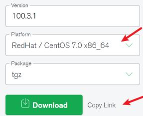


# 选择符合的版本下载即可

```txt
wget https://fastdl.mongodb.org/tools/db/mongodb-database-tools-rhel70-x86_64-100.3.1.tgz 
```

```markdown
[root@localhost mongodb4.4.5]# wget https://fastdl.mongodb.org/tools/db/mongodb-database-tools-rhel70-x86_64-100.3.1.tgz
--2021-04-16 16:35:45-- https://fastdl.mongodb.org/tools/db/mongodb-database-tools-rhel70-x86_64-100.3.1.tgz
正在解析主机 fastdl.mongodb.org (fastdl.mongodb.org)... 52.84.6.5, 52.84.6.41, 52.84.6.116, ...
正在连接 fastdl.mongodb.org (fastdl.mongodb.org)|52.84.6.5|:443... 已连接。
已发出 HTTP 请求，正在等待回应... 200 OK
长度：64213416 (61M) [binary/octet-stream]
正在保存至：“mongodb-database-tools-rhel70-x86_64-100.3.1.tgz”
100%[=================>] 64,213,416 5.93MB/s 用时 11s
2021-04-16 16:35:57 (5.72 MB/s) - 已保存 “mongodb-database-tools-rhel70-x86_64-100.3.1.tgz” [64213416/64213416])
```

# 安装工具包

# 解压安装包

tar -zxvf mongodb-database-tools-rhel70-x86_64-100.3.1.tgz 

# 移动bin目录中所有文件到mongodb安装包的bin目录

mv -f mongodb-database-tools-rhel70-x86_64-100.3.1/bin/* bin/ 

# 将MongoDB工具包中的文件复制到 mongodb安装目录的 bin目录

```ini
[root@localhost mongodb4.4.5]# tar -zxvf mongodb-database-tools-rhel70-x86_64-100.3.1.tgz  
mongodb-database-tools-rhel70-x86_64-100.3.1/LICENSE.md  
mongodb-database-tools-rhel70-x86_64-100.3.1/README.md  
mongodb-database-tools-rhel70-x86_64-100.3.1/THIRD-PARTY-NOTICES  
mongodb-database-tools-rhel70-x86_64-100.3.1/bin/bsondump  
mongodb-database-tools-rhel70-x86_64-100.3.1/bin/mongodbump  
mongodb-database-tools-rhel70-x86_64-100.3.1/bin/mongoexport  
mongodb-database-tools-rhel70-x86_64-100.3.1/bin/mongofiles  
mongodb-database-tools-rhel70-x86_64-100.3.1/bin/mongoimport  
mongodb-database-tools-rhel70-x86_64-100.3.1/bin/mongorestore  
mongodb-database-tools-rhel70-x86_64-100.3.1/bin/mongostat  
mongodb-database-tools-rhel70-x86_64-100.3.1/bin/mongotop  
[root@localhost mongodb4.4.5]#  
[root@localhost mongodb4.4.5]#  
[root@localhost mongodb4.4.5]#  
[root@localhost mongodb4.4.5]#  
[root@localhost mongodb4.4.5]#  
[root@localhost mongodb4.4.5]#  
[root@localhost mongodb4.4.5]# mv -f mongodb-database-tools-rhel70-x86_64-100.3.1/bin/*bin/  
[root@localhost mongodb4.4.5]# 
```

# 导入测试数据

# 下载测试数据

这里使用亚马逊官方提供的，下载地址 亚马逊测试数据

使用 wget 命令下载包含示例数据的 JSON 文件

```txt
wget http://media.mongodb.org/zips.json 
```

```txt
[root@localhost ~]# wget http://media.mongodb.org/zips.json
--2021-04-16 16:28:57-- http://media.mongodb.org/zips.json
正在解析主机 media.mongodb.org (media.mongodb.org)... 13.226.77.128, 13.226.77.44, 13.226.77.106, ...
正在连接 media.mongodb.org (media.mongodb.org)|13.226.77.128|:80... 已连接。
已发出 HTTP 请求，正在等待回应... 301 Moved Permanently
位置：https://media.mongodb.org/zips.json [跟随至新的 URL]
--2021-04-16 16:28:57-- https://media.mongodb.org/zips.json
正在连接 media.mongodb.org (media.mongodb.org)|13.226.77.128|:443... 已连接。
已发出 HTTP 请求，正在等待回应... 200 OK
长度：3182409 (3.0M) [application/json]
正在保存至：“zips.json”
100%[=================>] 3,182,409 519KB/s 用时 7.9s
2021-04-16 16:29:07 (391 KB/s) - 已保存 “zips.json” [3182409/3182409])
[root@localhost ~]# ll
总用量 3112
-rw----. 1 root root 1241 4月 14 11:01 anaconda-ks.cfg
-rw-r--r--. 1 root root 3182409 7月 7 2014 zips.json
[root@localhost ~]#
```

# 导入数据

使用 mongoimport 命令将数据导入新数据库 ( zips-db )专业一手超清完整

```batch
mongoimport --host 127.0.0.1:27017 --db zips-db --file zips.json 
```

```txt
[root@localhost ~]# mongoimport --host 127.0.0.1:27017 --db zips-db --file zips.json
2021-04-16T16:40:58.513+0800 no collection specified
2021-04-16T16:40:58.513+0800 using filename 'zips' as collection
2021-04-16T16:40:58.517+0800 connected to: mongodb://127.0.0.1:27017/
2021-04-16T16:40:59.110+0800 29353 document(s) imported successfully. 0 document(s) failed to import.
[root@localhost ~]# 
```

# 验证导入文档

导入完成后,使用 mongo 连接到 MongoDB 并验证数据是否已成功加载

```batch
mongo --host 127.0.0.1:27017 
```

# 查看所有数据库

show dbs; 

登录后检查发现所有的数据库都是存在的

```txt
connecting to: mongodb://127.0.0.1:27017/?compressors=disabled&gssapiServiceName=mongodb
Implicit session: session { "id" : UUID("f57c4dbe-fd8b-4e8b-94fd-449b79a9a48a") }
MongoDB server version: 4.4.5

---
The server generated these startup warnings when booting:
    2021-04-16T09:40:31.066+08:00: Access control is not enabled for the database. Read and write access to data and configuration is unrestricted
    2021-04-16T09:40:31.067+08:00: You are running this process as the root user, which is not recommended
    2021-04-16T09:40:31.067+08:00: /sys/kernel/mm/transparent_hugepage/enabled is 'always'. We suggest setting it to 'never'
    2021-04-16T09:40:31.067+08:00: /sys/kernel/mm/transparent_hugepage/defrag is 'always'. We suggest setting it to 'never'

---
Enable MongoDB's free cloud-based monitoring service, which will then receive and display metrics about your deployment (disk utilization, CPU, operation statistics, etc).

The monitoring data will be available on a MongoDB website with a unique URL accessible to you and anyone you share the URL with. MongoDB may use this information to make product improvements and to suggest MongoDB products and deployment options to you.

To enable free monitoring, run the following command: db.enableFreeMonitoring()
To permanently disable this reminder, run the following command: db.disableFreeMonitoring()

---
> show dbs;
admin    0.000GB
config    0.000GB
local    0.000GB
test    0.000GB
tmpdb    0.000GB
zips-db   0.002GB

> 
```

# 并检查文档数据

# 切换到zips-db数据库

use zips-db; 

# 查看数据库所有的集合

show tables; 

#查询第一个文档的数据

```javascript
db.zips.findone({}); 
```

我们发现数据库已经成功导入

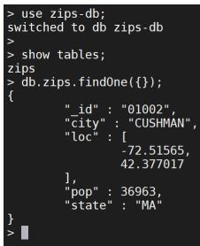


# 测试数据结构

导入的数据是亚马逊官方提供的，没有各个地区的人数统计，数据结构如下

<table><tr><td>_id</td><td>city</td><td>loc</td><td>pop(万)</td><td>state</td></tr><tr><td>数据ID号</td><td>城市名称</td><td>位置坐标</td><td>人数</td><td>所属哪个州</td></tr></table>

具体对应关系如下图

```json
{
    "_id": "01002", 数据ID号
    "city": "CUSHMAN", 城镇名称
    "loc": [
    -72.51565,
    42.377017
    ],
    "pop": 36963, 人数
    "state": "MA" 归属那个州
}
```

# 关系表达式

刚才我们只学习了最基本的查询，下面我们看一下MongoDB的关系表达式

如果你熟悉常规的 SQL 数据，通过下表可以更好的理解 MongoDB 的条件语句查询：

<table><tr><td>操作</td><td>格式</td><td>范例</td><td>RDBMS中的类似语句</td></tr><tr><td>等于</td><td></td><td>db.col.find({&quot;by&quot;:&quot;作者名称&quot;}).pretty()</td><td>where by = &#x27;作者名称&#x27;</td></tr><tr><td>小于</td><td></td><td>db.col.find({&quot;likes&quot;:{&quot;lt:50}}).pretty()</td><td>where likes &lt; 50</td></tr><tr><td>小于或等于</td><td></td><td>db.col.find({&quot;likes&quot;:{&quot;lte:50}}).pretty()</td><td>where likes &lt;= 50</td></tr><tr><td>大于</td><td></td><td>db.col.find({&quot;likes&quot;:{&quot;gt:50}}).pretty()</td><td>where likes &gt; 50</td></tr><tr><td>大于或等于</td><td></td><td>db.col.find({&quot;likes&quot;:{&quot;gte:50}}).pretty()</td><td>where likes &gt;= 50</td></tr><tr><td>不等于</td><td></td><td>db.col.find({&quot;likes&quot;:{&quot;ne:50}}).pretty()</td><td>where likes != 50</td></tr></table>

# 等于

# 标准写法

等于的操作符是$eq，我们可以查询城市名称是CUSHMAN的数据

```javascript
db.zips.find({
    "city": {
    "$eq": "CUSHMAN"
    }
}).pretty(); 
```

这样我们发现查询出来两条数据

```txt
> db.zips.find({ "city":{$eq;"CUSHMAN"}}).pretty();
{
    "_id": "01002",
    "city": "CUSHMAN",
    "loc": [
    -72.51565,
    42.377017
    ],
    "pop": 36963,
    "state": "MA"
}
{
    "_id": "72526",
    "city": "CUSHMAN",
    "loc": [
    -91.776455,
    35.869663
    ],
    "pop": 336,
    "state": "AR"
}
> 
```

# 简写方式

查询城市是CUSHMAN的数据，如果一个条件可以直接简写为如下形式

```txt
db.zips.find({
    "city": "CUSHMAN"
}).pretty(); 
```

我们找到两个城市名称是CUSHMAN的数据

```json
> db.zips.find({ "city": "CUSHMAN" }).pretty();
{
    "_id": "01002",
    "city": "CUSHMAN",
    "loc": [
    -72.51565,
    42.377017
    ],
    "pop": 36963,
    "state": "MA"
}
{
    "_id": "72526",
    "city": "CUSHMAN",
    "loc": [
    .91.776455,
    35.869663
    ],
    "pop": 336,
    "state": "AR"
} 
```

# 小于&小于等于

小于的操作符号是 $lt ,我们查询城市人数小于 10万的城市有哪些

```javascript
db.zips.find({
    "pop": {
    "$lt": 10
    }
}).pretty(); 
```

我们发现美国有很多州的人口小于十万人

```json
> db.zips.find({ "pop":{$lt:10}}).pretty();
{
    "id": "02163",
    "city": "CAMBRIDGE",
    "loc": [
    -71.141879,
    42.364005
    ],
    "pop": 0,
    "state": "MA"
}
{
    "id": "04013",
    "city": "BUSTINS ISLAND",
    "loc": [
    -70.042247,
    43.79602
    ],
    "pop": 0,
    "state": "ME"
}
{
    "id": "04570",
    "city": "SQUIRREL ISLAND",
    "loc": [
    -69.630974,
    43.809031
    ],
    "pop": 3,
    "state": "ME"
} 
```

小于等于的操作符号是$lte,我们查询城市没有人的城市，也就是小于等于0的城市

```txt
db.zips.find({
    "pop": {
    "$lte": 0
    }
}).pretty(); 
```

```txt
> db.zips.find({"pop":{"lte:0}}).pretty();
{
    "_id": "02163",
    "city": "CAMBRIDGE",
    "loc": [
    -71.141879,
    42.364005
    ],
    "pop": 0,
    "state": "MA"
}
{
    "_id": "04013",
    "city": "BUSTINS ISLAND",
    "loc": [
    -70.042247,
    43.79602
    ],
    "pop": 0,
    "state": "ME"
}
{
    "_id": "05405",
    "city": "UNIV OF VERMONT",
    "loc": [
    -73.2002,
    44.477733
    ],
    "pop": 0,
    "state": "VT"
} 
```

# 大于&大于等于

大于的操作符号是$gt,我们查询城市人数大于 十亿的城市有哪些？因为城市的人数单位是万所以是大于十万万人

```txt
db.zips.find({
    "pop": {
    "$gt": 100000
    }
}).pretty(); 
```


第一个符合我们需求的城市就是纽约


```txt
> db.zips.find({"pop":{"gt:100000}}).pretty();
{
    "_id": "10021",
    "city": "NEW YORK",
    "loc": [
    -73.958805,
    40.768476
    ],
    "pop": 106564,
    "state": "NY"
}
{
    "_id": "10025",
    "city": "NEW YORK",
    "loc": [
    -73.968312,
    40.797466
    ],
    "pop": 100027,
    "state": "NY"
}
{
    "_id": "11226",
    "city": "BROOKLYN",
    "loc": [
    -73.956985,
    40.646694
    ],
    "pop": 111396,
    "state": "NY"
} 
```


大于等于的操作符号是$gte,我们来练习下


```txt
db.zips.find({
    "pop": {
    "$gte": 90000
    }
}).pretty(); 
```

```txt
> db.zips.find({"pop":{"gte:100000}}).pretty();
{
    "_id": "10021",
    "city": "NEW YORK",
    "loc": [
    -73.958805,
    40.768476
    ],
    "pop": 106564,
    "state": "NY"
}
{
    "_id": "10025",
    "city": "NEW YORK",
    "loc": [
    -73.968312,
    40.797466
    ],
    "pop": 100027,
    "state": "NY"
}
{
    "_id": "11226",
    "city": "BROOKLYN",
    "loc": [
    -73.956985,
    40.646694
    ],
    "pop": 111396,
    "state": "NY"
}
{
    "_id": "60623", 
```

# 不等于

不等于的操作符号是$ne,我们可以搜索城市人数不是0的城市

```javascript
db.zips.find({
    "pop": {
    "$ne": 0
    }
}).pretty(); 
```

这样我们就找到了城市不是0的数据，是不是很简单呢

```txt
> db.zips.find({"pop":{"ne:0}}).pretty();
{
    "_id": "01002",
    "city": "CUSHMAN",
    "loc": [
    -72.51565,
    42.377017
    ],
    "pop": 36963,
    "state": "MA"
}
{
    "_id": "01007",
    "city": "BELCHERTOWN",
    "loc": [
    -72.410953,
    42.275103
    ],
    "pop": 10579,
    "state": "MA"
}
{
    "_id": "01008",
    "city": "BLANDFORD",
    "loc": [
    -72.936114,
    42.182949
    ],
    "pop": 1240,
    "state": "MA"
} 
```

# 包含查询

IN查询的符号是$in,使用方式如下

```javascript
db.zips.find({
    "state": {
    "$in": [
    "MA",
    "NY"
    ]
    }
}).pretty(); 
```

我们只查询城市名称缩写是MA以及NY的文档

```txt
> db.zips.find({"state":{$in:["MA","NY"]}).pretty();
{
    "_id": "01002",
    "city": "CUSHMAN",
    "loc": [
    -72.51565,
    42.377017
    ],
    "pop": 36963,
    "state": "MA"
}
{
    "_id": "01007",
    "city": "BELCHERTOWN",
    "loc": [
    -72.410953,
    42.275103
    ],
    "pop": 10579,
    "state": "MA"
}
{
    "_id": "01008",
    "city": "BLANDFORD",
    "loc": [
    -72.936114,
    42.182949
    ],
    "pop": 1240,
    "state": "MA"
} 
```

# 不包含查询

NIN相当于MySQL的NOT IN查询，操作符号是$nin，我们查询城市名称缩写不是MA以及NY的文档

```javascript
db.zips.find({
    "state": {
    "$nin": [
    "MA",
    "NY"
    ]
    }
}).pretty(); 
```

这样我们就把数据给查询出来了

```json
> db.zips.find({ "state":{$nin:["MA","NY"]}}).pretty();
{
    "_id": "02804",
    "city": "ASHAWAY",
    "loc": [
    -71.783745,
    41.423054
    ],
    "pop": 2472,
    "state": "RI"
}
{
    "_id": "02806",
    "city": "BARRINGTON",
    "loc": [
    -71.317497,
    41.744334
    ],
    "pop": 15849,
    "state": "RI"
}
{
    "_id": "02807",
    "city": "BLOCK ISLAND",
    "loc": [
    -71.574825,
    41.171546
    ],
    "pop": 836,
    "state": "RI"
} 
```

# 判断字段存在

mongodb是一个文档型数据库，对于表结构没有严格定义，有时候可能缺少字段，如果要查询缺失的字段可以使用$exists判断字段是否存在

```javascript
db.zips.find({
    "state": {
    "$exists": false
    }
}).pretty(); 
```

我们发现没有缺失state字段的数据

```txt
> db.zips.find({"state":{$exists:false}}).pretty();
> 
```

# 多条件查询

有时候存在一个字段需要多个条件，比如 pop>=10 and pop<50 这个如何表示呢

```javascript
db.zips.find({
    "pop": {
    "$gte": 10,
    "$lt": 50
    }
}).pretty(); 
```

这样就查询出来了人数在10-50万之间的城市全网课程 超

```json
> db.zips.find({"pop":{"gte:10,$lte:50}}).pretty();
{
    "id": "01338",
    "city": "BUCKLAND",
    "loc": [
    -72.764124,
    42.615174
    ],
    "pop": 16,
    "state": "MA"
}
{
    "id": "02815",
    "city": "CLAYVILLE",
    "loc": [
    -71.670589,
    41.777762
    ],
    "pop": 45,
    "state": "RI"
}
{
    "id": "03232",
    "city": "EAST HEBRON",
    "loc": [
    -71.767907,
    43.696969
    ],
    "pop": 47,
    "state": "NH"
} 
```

# 逻辑表达式

mongodb的逻辑表达式有以下几种

<table><tr><td>操作</td><td>格式</td></tr><tr><td>AND</td><td>{{key:,,key:}}</td></tr><tr><td>OR</td><td>$or: [{key1: value1}, {key2:value2}]</td></tr><tr><td>大于</td><td>{{key:{$gt:}}}</td></tr><tr><td>大于或等于</td><td>{{$gte:}}}</td></tr><tr><td>不等于</td><td>{{key:{$ne:}}}</td></tr></table>

# AND 条件

# 标准写法

AND的标准写法的操作符是$and,下面是查询，我们查询 州缩写是NY并且人数大于一亿的文档

```javascript
db.zips.find({
    "$and": [
    {
    "state": "NY"
    }
],
    "$or": [
    {
    "state": "NY"
    }
]
}).pretty(); 
```


这样就查询出来了全网


```txt
> db.zips.find({$and:[{"state":"NY"},{"pop':{$gt:100000}}]).pretty();
{
    "_id": "10021",
    "city": "NEW YORK",
    "loc": [
    -73.958805,
    40.768476
    ],
    "pop": 106564,
    "state": "NY"
}
{
    "_id": "10025",
    "city": "NEW YORK",
    "loc": [
    -73.968312,
    40.797466
    ],
    "pop": 100027,
    "state": "NY"
}
{
    "_id": "11226",
    "city": "BROOKLYN",
    "loc": [
    -73.956985,
    40.646694
    ],
    "pop": 111396,
    "state": "NY"
} 
```

# 简写形式

如果只有一个AND操作MongoDB 的 find() 方法可以传入多个键(key)，每个键(key)以逗号隔开，即常规 SQL 的 AND 条件。

```javascript
db.zips.find({
    "state": "NY",
    "pop": {
    "$gt": 100000
    }
}).pretty(); 
```

```txt
> db.zips.find({"state":"NY", 'pop':{$gt:100000}}).pretty();
{
    "_id": "10021",
    "city": "NEW YORK",
    "loc": [
    -73.958805,
    40.768476
    ],
    "pop": 106564,
    "state": "NY"
}
{
    "_id": "10025",
    "city": "NEW YORK",
    "loc": [
    -73.968312,
    40.797466
    ],
    "pop": 100027,
    "state": "NY"
}
{
    "_id": "11226",
    "city": "BROOKLYN",
    "loc": [
    -73.956985,
    40.646694
    ],
    "pop": 111396,
    "state": "NY"
} 
```

MongoDB OR 条件语句使用了关键字 $or,我们查询人数小于0 或者城市缩写是 NY 的城市。

```javascript
db.zips.find({
    "$or": [
    {
    "state": "NY"
    },
    {
    "pop": {
    "$lt": 0
    }
    }
    ]
}).pretty(); 
```

这样我们就把所有符合条件的数据筛选出来了

```json
> db.zips.find({$or:[{"state":"NY"},{"pop':{$lt:0}}]}).pretty();
{
    "_id": "06390",
    "city": "FISHERS ISLAND",
    "loc": [
    -72.017834,
    41.263934
    ],
    "pop": 329,
    "state": "NY"
}
{
    "_id": "10001",
    "city": "NEW YORK",
    "loc": [
    -73.996705,
    40.74838
    ],
    "pop": 18913,
    "state": "NY"
}
{
    "_id": "10002",
    "city": "NEW YORK",
    "loc": [
    -73.987681,
    40.715231
    ],
    "pop": 84143,
    "state": "NY"
} 
```

# NOT 条件

$not是NOT的操作符，和其他的用法不太一样，使用方法如下

```javascript
db.zips.find({
    "pop": {
    "$not": {
    "$gte": 10
    }
    }
}).pretty(); 
```

这样是查询人数 小于十万人的城市

```txt
> db.zips.find({"pop":{"not {:$gte:10}}}).pretty();
{
    "_id": "02163",
    "city": "CAMBRIDGE",
    "loc": [
    -71.141879,
    42.364005
    ],
    "pop": 0,
    "state": "MA"
}
{
    "_id": "04013",
    "city": "BUSTINS ISLAND",
    "loc": [
    -70.042247,
    43.79602
    ],
    "pop": 0,
    "state": "ME"
}
{
    "_id": "04570",
    "city": "SQUIRREL ISLAND",
    "loc": [
    -69.630974,
    43.809031
    ],
    "pop": 3,
    "state": "ME"
} 
```

# 多个条件表达式

我们用一个多条件查询语句，具体语句如下

```javascript
db.zips.find({
    "$or": [
    {
    "$and": [
    {
    "state": "NY"
    },
    {
    "pop": {
    "$gt": 10,
    "$lte": 50
    }
    }
    ]
    },
    {
    "$and": [
    {
    "state": {
    "$in": [
    "MD",
    "VA"
    ]
    }
    },
    {
    "pop": {
    "$gt": 10,
    "$lte": 50
    }
    }
    ]
    }
    ]
}).pretty(); 
```

这个语句的sql形式如下

```sql
select * from zips where (state='NY' and pop>10 and pop <= 50) or (state in('MD', 'VA') and pop>10 and pop <= 50) 
```


查询结果如下


```txt
> db.zips.find({$or:[{$and:[{"state":"NY"},{"pop':{$gt:10,$lte:50}}],{$and:[{"state":{$in:["MD","VA"]}},{'pop':{$gt:10,$lte:50}}]}).pretty();
{
    "_id": "10911",
    "city": "BEAR MOUNTAIN",
    "loc": [
    -73.996108,
    41.306734
    ],
    "pop": 14,
    "state": "NY"
}
{
    "_id": "11251",
    "city": "BROOKLYN NAVY YA",
    "loc": [
    -73.966511,
    40.703578
    ],
    "pop": 18,
    "state": "NY"
}
{
    "_id": "11371",
    "city": "FLUSHING",
    "loc": [
    -73.873535,
    40.772117
    ],
    "pop": 49,
    "state": "NY"
}
{
    "_id": "12131", 
```

# 排序

在MongoDB中使用sort()方法对数据进行排序，sort()方法可以通过参数指定排序的字段，并使用1 和 -1 来指定排序的方式，其中 1 为升序排列，而-1是用于降序排列。

# 语法格式

sort()方法基本语法如下所示

```javascript
db.COLLECTION_NAME.find().sort({KEY1:1,KEY2:-1,...}) 
```

# 升序查询

按照城市人数的升序查询

```javascript
db.zips.find().sort({
    "pop": 1
}).pretty(); 
```

我们发现数据是从小到大的升序

```txt
> db.zips.find().sort({"pop":1}).pretty();
{
    "_id": "02163",
    "city": "CAMBRIDGE",
    "loc": [
    -71.141879,
    42.364005
    ],
    "pop": 0,
    "state": "MA"
}
{
    "_id": "04013",
    "city": "BUSTINS ISLAND",
    "loc": [
    -70.042247,
    43.79602
    ],
    "pop": 0,
    "state": "ME"
}
{
    "_id": "05405",
    "city": "UNIV OF VERMONT",
    "loc": [
    -73.2002,
    44.477733
    ],
    "pop": 0,
    "state": "VT"
} 
```

# 降序查询

按照城市人数的降序查询

```txt
db.zips.find().sort({
    "pop": -1
}).pretty(); 
```

我们发现数据是从大到小的降序

```txt
> db.zips.find().sort({"pop":-1}).pretty();
{
    "_id": "60623",
    "city": "CHICAGO",
    "loc": [
    -87.7157,
    41.849015
    ],
    "pop": 112047,
    "state": "IL"
}
{
    "_id": "11226",
    "city": "BROOKLYN",
    "loc": [
    -73.956985,
    40.646694
    ],
    "pop": 111396,
    "state": "NY"
}
{
    "_id": "10021",
    "city": "NEW YORK",
    "loc": [
    -73.958805,
    40.768476
    ],
    "pop": 106564,
    "state": "NY"
} 
```

# 组合查询

我们查询人数大于1000万，并且先按照城市缩写升序排，如果城市缩写相同再按照人数降序排

```txt
db.zips.find({
    "pop": {
    "$gt": 1000
    }
}).sort({
    "state": 1,
    "pop": -1
}).pretty(); 
```

```txt
> db.zips.find({"pop":{"gt:1000}}).sort({"state":1,"pop":-1}).pretty();
{
    "_id": "99504",
    "city": "ANCHORAGE",
    "loc": [
    -149.74467,
    61.203696
    ],
    "pop": 32383,
    "state": "AK"
}
{
    "_id": "99508",
    "city": "ANCHORAGE",
    "loc": [
    -149.810085,
    61.205959
    ],
    "pop": 29857,
    "state": "AK"
}
{
    "_id": "99801",
    "city": "JUNEAU",
    "loc": [
    -134.529429,
    58.362767
    ],
    "pop": 24947,
    "state": "AK"
} 
```

# 分页查询

传统关系数据库中都提供了基于row number的分页功能，切换MongoDB后，想要实现分页，则需要修改一下思路。


传统分页思路


```markdown
#page 1
1-10
+微信study322
#page 2
11-20
专业一手超清完整
//page 3
21-30
全网课程 超低价格
...
//page n
10*(n-1) +1 - 10*n
```

对应的sql是

```sql
select * from tables limit(pagesize*(pageIndex-1)+1, pagesize) 
```

# MongoDB的分页

MongoDB提供了skip()和limit()方法。

skip: 跳过指定数量的数据. 可以用来跳过当前页之前的数据，即跳过pageSize*(n-1)。

limit: 指定从MongoDB中读取的记录条数，可以当做页面大小pageSize。

前30条的数据是

```javascript
db.zips.find({},{"_id":1}).limit(30); 
```

```txt
> db.zips.find({},{"_id":1}).limit(30);
{ "_id" : "01002" }
{ "_id" : "01007" }
{ "_id" : "01008" }
{ "_id" : "01010" }
{ "_id" : "01011" }
{ "_id" : "01012" }
{ "_id" : "01013" }
{ "_id" : "01005" }
{ "_id" : "01022" }
{ "_id" : "01026" }
{ "_id" : "01027" }
{ "_id" : "01028" }
{ "_id" : "01030" }
{ "_id" : "01031" }
{ "_id" : "01001" }
{ "_id" : "01033" }
{ "_id" : "01035" }
{ "_id" : "01034" }
{ "_id" : "01036" }
{ "_id" : "01032" }
Type "it" for more
> it
{ "_id" : "01020" }
{ "_id" : "01038" }
{ "_id" : "01039" }
{ "_id" : "01040" }
{ "_id" : "01050" }
{ "_id" : "01053" }
{ "_id" : "01060" }
{ "_id" : "01068" }
{ "_id" : "01069" }
{ "_id" : "01070" }
> 
```

所以可以这样实现分析

```javascript
// 第一页数据
db.zips.find({},{"_id":1}).skip(0).limit(10);
// 第二页数据
db.zips.find({},{"_id":1}).skip(10).limit(10);
// 第三页数据
db.zips.find({},{"_id":1}).skip(20).limit(10);
```

<table><tr><td>db.zips.find({},{&quot;_id&quot;:1}).skip(0).limit(10);</td></tr><tr><td>{&quot;_id&quot;: &quot;01002&quot;}</td></tr><tr><td>{&quot;_id&quot;: &quot;01007&quot;}</td></tr><tr><td>{&quot;_id&quot;: &quot;01008&quot;}</td></tr><tr><td>{&quot;_id&quot;: &quot;01010&quot;}</td></tr><tr><td>{&quot;_id&quot;: &quot;01011&quot;}</td></tr><tr><td>{&quot;_id&quot;: &quot;01012&quot;}</td></tr><tr><td>{&quot;_id&quot;: &quot;01013&quot;}</td></tr><tr><td>{&quot;_id&quot;: &quot;01005&quot;}</td></tr><tr><td>{&quot;_id&quot;: &quot;01022&quot;}</td></tr><tr><td>{&quot;_id&quot;: &quot;01026&quot;}</td></tr><tr><td>db.zips.find({},{&quot;_id&quot;:1}).skip(10).limit(10);</td></tr><tr><td>{&quot;_id&quot;: &quot;01027&quot;}</td></tr><tr><td>{&quot;_id&quot;: &quot;01028&quot;}</td></tr><tr><td>{&quot;_id&quot;: &quot;01030&quot;}</td></tr><tr><td>{&quot;_id&quot;: &quot;01031&quot;}</td></tr><tr><td>{&quot;_id&quot;: &quot;01001&quot;}</td></tr><tr><td>{&quot;_id&quot;: &quot;01033&quot;}</td></tr><tr><td>{&quot;_id&quot;: &quot;01035&quot;}</td></tr><tr><td>{&quot;_id&quot;: &quot;01034&quot;}</td></tr><tr><td>{&quot;_id&quot;: &quot;01036&quot;}</td></tr><tr><td>{&quot;_id&quot;: &quot;01032&quot;}</td></tr><tr><td>db.zips.find({},{&quot;_id&quot;:1}).skip(20).limit(10);</td></tr><tr><td>{&quot;_id&quot;: &quot;01020&quot;}</td></tr><tr><td>{&quot;_id&quot;: &quot;01038&quot;}</td></tr><tr><td>{&quot;_id&quot;: &quot;01039&quot;}</td></tr><tr><td>{&quot;_id&quot;: &quot;01040&quot;}</td></tr><tr><td>{&quot;_id&quot;: &quot;01050&quot;}</td></tr><tr><td>{&quot;_id&quot;: &quot;01053&quot;}</td></tr><tr><td>{&quot;_id&quot;: &quot;01069&quot;}</td></tr><tr><td>{&quot;_id&quot;: &quot;01068&quot;}</td></tr><tr><td>{&quot;_id&quot;: &quot;01069&quot;}</td></tr><tr><td>{&quot;_id&quot;: &quot;01070&quot;}</td></tr><tr><td>&gt;</td></tr></table>

# 遇到的问题

看起来，分页已经实现了，但是官方文档并不推荐，说会扫描全部文档，然后再返回结果。

The cursor.skip() method requires the server to scan from the beginning of the input results set before beginning to return results. As the offset increases, cursor.skip() will become slower. 

所以，需要一种更快的方式，其实和mysql数量大之后不推荐用limit m,n一样，解决方案是先查出当前页的第一条，然后顺序数pageSize条，MongoDB官方也是这样推荐的。

# 正确的分页办法

我们假设基于_id的条件进行查询比较，事实上，这个比较的基准字段可以是任何你想要的有序的字段，比如时间戳

实现步骤如下

```javascript
1. 对数据针对于基准字段排序
2. 查找第一页的最后一条数据的基准字段的数据
3. 查找超过基准字段数据然后向前找pagesize条数据

// 第一页数据
db.zips.find({},{_id:1}).sort({"_id":1}).limit(10);
// 第二页数据
db.zips.find({"_id":{$gt:"01020"},{"_id:1}).sort({"_id":1}).limit(10);
// 第三页数据
db.zips.find({"_id":{$gt:"01035"},{"_id:1}).sort({"_id":1}).limit(10);
```

```javascript
// 第一页数据
db.zips.find({}, {_id:1}).sort({"_id":1}).limit(10);
// 第二页数据
db.zips.find({"_id":{$gt:"01020"}}, {_id:1}).sort({"_id":1}).limit(10);
// 第三页数据
db.zips.find({"_id":{$gt:"01035"}}, {_id:1}).sort({"_id":1}).limit(10);
```

```jsonl
> db.zips.find({}).sort({"id":1}).limit(10);
{"_id": "01001", "city": "AGAWAM", "loc": [-72.622739, 42.070206 ], "pop": 15338, "state": "MA" }
{"_id": "01002", "city": "CUSHMAN", "loc": [-72.51565, 42.377017 ], "pop": 36963, "state": "MA" }
{"_id": "01005", "city": "BARRE", "loc": [-72.108354, 42.409698 ], "pop": 4546, "state": "MA" }
{"_id": "01007", "city": "BELCHERTOWN", "loc": [-72.410953, 42.275103 ], "pop": 10579, "state": "MA" }
{"_id": "01008", "city": "BLANDFORD", "loc": [-72.936114, 42.182949 ], "pop": 1240, "state": "MA" }
{"_id": "01010", "city": "BRIMFIELD", "loc": [-72.188455, 42.116543 ], "pop": 3706, "state": "MA" }
{"_id": "01011", "city": "CHESTER", "loc": [-72.988761, 42.279421 ], "pop": 1688, "state": "MA" }
{"_id": "01012", "city": "CHESTERFIELD", "loc": [-72.833309, 42.38167 ], "pop": 177, "state": "MA" }
{"_id": "01013", "city": "CHICOPEE", "loc": [-72.607962, 42.162046 ], "pop": 23396, "state": "MA" }
{"_id": "01020", "city": "CHICOPEE", "loc": [-72.576142, 42.176443 ], "pop": 31495, "state": "MA" }
> db.zips.find({"id":{$gt:"01020"})}.sort({"id":1}).limit(10);
{"_id": "01022", "city": "WESTOVER AFB", "loc": [-72.558657, 42.196672 ], "pop": 1764, "state": "MA" }
{"_id": "01026", "city": "CUMMINGTON", "loc": [-72.905767, 42.435296 ], "pop": 1484, "state": "MA" }
{"_id": "01027", "city": "MOUNT TOM", "loc": [-72.679921, 42.264319 ], "pop": 16864, "state": "MA" }
{"_id": "01028", "city": "EAST LONGMEADOW", "loc": [-72.505565, 42.067203 ], "pop": 13367, "state": "MA" }
{"_id": "01030", "city": "FEEDING HILLS", "loc": [-72.675077, 42.07182], "pop": 11985, "state": "MA" }
{"_id": "01031", "city": "GILBERTVILLE", "loc": [-72.198585, 42.332194 ], "pop": 2385, "state": "MA" }
{"_id": "01032", "city": "GOSHEN", "loc": [-72.844092, 42.466234 ], "pop": 122, "state": "MA" }
{"_id": "01033", "city": "GRANBY", "loc": [-72.520001, 42.255704 ], "pop": 5526, "state": "MA" }
{"_id": "01034", "city": TOLLAND", "loc": [-72.908793, 42.070234 ], "pop": 1652, "state": "MA" }
{"_id": "01035", "city": "HADLEY", "loc": [-72.571499, 42.36062 ], "pop": 4231, "state": "MA" }
> db.zips.find({"id":{$gt:"01035"})}.sort({"id":1}).limit(10);
{"_id": "01036", "city": HAMPDEN", "loc": [-72.431823, 42.064756 ], "pop": 4709, "state": "MA" }
{"_id": "01038", "city": HATFIELD", "loc": [-72.616735, 42.38439 ], "pop": 3184, "state": "MA" }
{"_id": "01039", "city": HAYDENVILLE", "loc": [-72.703178, 42.381799 ], "pop": 1387, "state": "MA" }
{"_id": "01040", "city": HOLYOKE", "loc": [-72.626193, 42.202007 ], "pop": 43704, "state": "MA" }
{"_id": "01050", “city": HUNTINGTON", "loc": [-72.873341, 42.265301 ], "pop": 2084, "state": "MA" }
{"_id": "01053", “city": LEEDS", "loc": [-72.703403, 42.354292 ], "pop": 1350, "state": "MA" }
{"_id": "01054", “city": LEVERETT", "loc": [-72.499334, 42.46823 ], "pop": 1748, "state": "MA" }
{"_id": "01056", “city": LUDLOW", "loc": [-72.471012, 42.172823 ], "pop": 18820, "state": "MA" }
{"_id": "01057", “city”: MONSON", “loc”: [-72.319634, 42.101017 ], "pop": 8194, “state”: “MA" } 
```

这样就可以一页一页的向下搜索，但是对于跳页的情况不太友好了。

# ObjectId有序性

# ObjectId生成规则

比如 "_id" : ObjectId("5b1886f8965c44c78540a4fc")

Objectid = 时间戳（4字节） + 机器（3个字节）+ PID（2个字节）+ 计数器（3个字节）

取id的前4个字节。由于id是16进制的string，4个字节就是32位，1个字节是两个字符，4个字节对应id前8个字符。即 5b1886f8 , 转换成10进制为 1528334072 . 加上1970，就是当前时间。

事实上，更简单的办法是查看org.mongodb:bson:3.4.3里的ObjectId对象。

```java
public ObjectId(Date date) {
    this(dateToTimestampSeconds(date), MACHINE_IDENTIFIER, PROCESS_IDENTIFIER, NEXT_COUNTER.getAndIncrement(), false);
}

//org.bson.types.ObjectId#dateToTimestampSeconds
private static int dateToTimestampSeconds(Date time) {
    return (int)(time.getTime() / 1000L);
}

//java.util.Date#getTime
/**
 * Returns the number of milliseconds since January 1, 1970, 00:00:00 GMT
 * represented by this <tt>Date</tt> object.
 *
 * @return the number of milliseconds since January 1, 1970, 00:00:00 GMT
 * represented by this date.
 */
public long getTime() {
    return getTimeImpl();
} 
```

# ObjectId存在的问题

MongoDB的ObjectId应该是随着时间而增加的，即后插入的id会比之前的大。但考量id的生成规则，最小时间排序区分是秒，同一秒内的排序无法保证。当然，如果是同一台机器的同一个进程生成的对象，是有序的。

如果是分布式机器，不同机器时钟同步和偏移的问题。所以，如果你有个字段可以保证是有序的，那么用这个字段来排序是最好的。 _id 则是最后的备选方案，可以考虑增加 雪花算法ID作为排序ID

# 跳页问题

上面的分页看起来很理想，虽然确实是，但有个刚需不曾指明---我怎么跳页。

我们的分页数据要和排序键关联，所以必须有一个排序基准来截断记录。而跳页，我只知道第几页，条件不足，无法分页了。

现实业务需求确实提出了跳页的需求，虽然几乎不会有人用，人们更关心的是开头和结尾，而结尾+微信study322可以通过逆排序的方案转成开头。所以，真正分页的需求应当是不存在的。如果你是为了查找某个记录，那么查询条件搜索是最快的方案。如果你不知道查询条件，通过肉眼去一一查看，那么下一页足专业一手超清完整矣。

在互联网发展的今天，大部分数据的体量都是庞大的，跳页的需求将消耗更多的内存和cpu，对应全网课程 超低价格的就是查询慢，当然，如果数量不大，如果不介意慢一点，那么skip也不是啥问题，关键要看业务场景。

# 统计查询

MongoDB除了基本的查询功能之外，还提供了强大的聚合功能，这里将介绍一下 count ,distinct

# count

查询记录的总数，下面条件是查询人数 小于十万人的城市的数量

```javascript
db.zips.find({
    "pop": {
    "$not": {
    "$gte": 10
    }
    }
}).count(); 
```

```snap
> db.zips.find({"pop":{"$not Sugte:10}}).count();
118
> 
```

这样就查询出来符合条件的数据的条数是 118个，还可以写成另外一个形式

```javascript
db.zips.count({
    "pop": {
    "$not": {
    "$gte": 10
    }
    }
}); 
```

```txt
> db.zips.count({"pop":{"not {:$gte:10}}});
118
> 
```

# distinct

# 无条件排重

用来找出给定键的所有不同的值

```javascript
db.zips.distinct("state"); 
```

这样就按照state字段进行去重后的数据

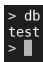


# 有条件排重

对于城市人数是七千万以上的城市的缩写去重

```javascript
db.zips.distinct("state", {
    "pop": {
    "$gt": 70000
    }
}); 
```

```txt
> db.zips.distinct("state", {"pop":{$gt:70000}});  
[ "CA", "FL", "IL", "MD", "MI", "NY", "PA", "TX", "WV" ]  
> 
```

# 索引

索引通常能够极大的提高查询的效率，如果没有索引，MongoDB在读取数据时必须扫描集合中的每个文件并选取那些符合查询条件的记录。

# 索引简介

# 什么是索引

索引最常用的比喻就是书籍的目录，查询索引就像查询一本书的目录。本质上目录是将书中一小部分内容信息（比如题目）和内容的位置信息（页码）共同构成，而由于信息量小（只有题目），所以我们可以很快找到我们想要的信息片段，再根据页码找到相应的内容。同样索引也是只保留某个域的一部分信息（建立了索引的field的信息），以及对应的文档的位置信息。

假设我们有如下文档（每行的数据在MongoDB中是存在于一个Document当中）

<table><tr><td>姓名</td><td>id</td><td>部门</td><td>city</td><td>score</td></tr><tr><td>张三</td><td>2</td><td>xxx</td><td>Beijing</td><td>90</td></tr><tr><td>李四</td><td>1</td><td>xxx</td><td>Shanghai</td><td>70</td></tr><tr><td>王五</td><td>3</td><td>xxx</td><td>guangzhou</td><td>60</td></tr></table>

# 索引的作用

假如我们想找id为2的document(即张三的记录)，如果没有索引，我们就需要扫描整个数据表，然后找出所有为2的document。当数据表中有大量documents的时候，这个时间就会非常长（从磁盘上查找数据还涉及大量的IO操作)。建立索引后会有什么变化呢？MongoDB会将id数据拿出来建立索引数据，如下

<table><tr><td>索引值</td><td>位置</td></tr><tr><td>1</td><td>pos2</td></tr><tr><td>2</td><td>pos1</td></tr><tr><td>3</td><td>pos3</td></tr></table>

# 索引的工作原理

这样我们就可以通过扫描这个小表找到document对应的位置。

# 查找过程示意图如下：专


# 索引为什么这么快

为什么这样速度会快呢？这主要有几方面的因素

1. 索引数据通过B树来存储，从而使得搜索的时间复杂度为O(logdN)级别的(d是B树的度,即拥有子结点的个数， 通常d的值比较大，比如大于100)，比原先O(N)的复杂度大幅下降。这个差距是惊人的，以一个实际例子来看，假设d=100，N=1亿，那么O(logdN) = 4, 而O(N)是1亿。是的，这就是算法的威力。

2. 索引本身是在高速缓存当中，相比磁盘IO操作会有大幅的性能提升。（需要注意的是，有的时候数据量非常大的时候，索引数据也会非常大，当大到超出内存容量的时候，会导致部分索引数据存储在磁盘上，这会导致磁盘IO的开销大幅增加，从而影响性能，所以务必要保证有足够的内存能容下所有的索引数据）

当然，事物总有其两面性，在提升查询速度的同时，由于要建立索引，所以写入操作时就需要额外的添加索引的操作，这必然会影响写入的性能，所以当有大量写操作而读操作比较少的时候，且对读操作性能不需要考虑的时候，就不适合建立索引。当然，目前大多数互联网应用都是读操作远大于写操作，因此建立索引很多时候是非常划算和必要的操作。

# 查看索引

索引是提高查询效率最有效的手段。索引是一种特殊的数据结构，索引以易于遍历的形式存储了数据的部分内容（如：一个特定的字段或一组字段值），索引会按一定规则对存储值进行排序，而且索引的存储位置在内存中，所以从索引中检索数据会非常快。如果没有索引，MongoDB必须扫描集合中的每一个文档，这种扫描的效率非常低，尤其是在数据量较大时。

# 默认主键索引

在创建集合期间，MongoDB 在 _id] 字段上 创建唯一索引,该索引可防止客户端插入两个具有相同值的文档。

# 查看索引

# 查看集合索引

要返回集合中所有索引的列表可以使用 db.collection.getIndexes() 查看现有索引

```javascript
db.zips.getIndexes(); 
```

查看zips集合的所有索引，我们看到有一个默认的_id_索引，并且是一个升序索引

```txt
> db.zips.getIndexes();
[ { "v": 2, "key": { "_id": 1 }, "name": "_id_" } ]
>
> 
```

# 查看数据库

若要列出数据库中所有集合的所有索引，则需在 MongoDB 的 Shell 客户端中进行以下操作：

```javascript
db.getCollectionNames().forEach(function(collection){
    indexes = dbarto[collection].getIndexes();
    print("Indexes for [" + collection + "]:");
    printjson(indexes);
}); 
```

这样可以列出本数据库的所有集合的索引

```txt
> db.getCollectionNames().forEach(function(collection){
... indexes = db(collection].getIndexes();
... print("Indexes for [" + collection + "]:"); 
... printjson(indexes);
... });
Indexes for [result001]:
[ { "v": 2, "key": { "_id": 1 }, "name": "_id_" } ]
Indexes for [zips]:
[ { "v": 2, "key": { "_id": 1 }, "name": "_id_" } ]
> 
```

# 索引常用操作

# 创建索引

MongoDB使用 createIndex() 方法来创建索引。

注意在 3.0.0 版本前创建索引方法为 db.collection.ensureIndex()，之后的版本使用了db.collection.createIndex() 方法，ensureIndex() 还能用，但只是 createIndex() 的别名。

# 语法

createIndex()方法基本语法格式如下所示：

```javascript
db.collection.createIndex(keys, options) 
```

语法中 Key 值为你要创建的索引字段，1 为指定按升序创建索引，如果你想按降序来创建索引指定为 -1 即可。

```javascript
db.zips.createIndex({"pop":1}) 
```

这样就根据pop字段创建了一个升序索引

<table><tr><td>db.zips.createIndex({&quot;pop&quot;:1})</td></tr><tr><td>{ &quot;createdCollectionAutomatically&quot; : false, &quot;numIndexesBefore&quot; : 1, &quot;numIndexesAfter&quot; : 2, &quot;ok&quot; : 1}</td></tr><tr><td>db.zips.getIndexes();</td></tr><tr><td>[ { &quot;v&quot; : 2, &quot;key&quot; : { &quot;_id&quot; : 1 }, &quot;name&quot; : &quot;_id_&quot; }, { &quot;v&quot; : 2, &quot;key&quot; : { &quot;pop&quot; : 1 }, &quot;name&quot; : &quot;pop_1&quot; } ] &gt;</td></tr></table>

# 索引参数

createIndex() 接收可选参数，可选参数列表如下

<table><tr><td>Parameter</td><td>Type</td><td>Description</td></tr><tr><td>background</td><td>Boolean</td><td>建索引过程会阻塞其它数据库操作, background可指定以后台方式创建索引,即增加&quot;background&quot;可选参数。&quot;background&quot;默认值为false。</td></tr><tr><td>unique</td><td>Boolean</td><td>建立的索引是否唯一。指定为true创建唯一索引。默认值为false.</td></tr><tr><td>name</td><td>string</td><td>索引的名称。如果未指定,MongoDB的通过连接索引的字段名和排序顺序生成一个索引名称。</td></tr><tr><td>dropDups</td><td>Boolean</td><td>3.0+版本已废弃。在建立唯一索引时是否删除重复记录,指定 true 创建唯一索引。默认值为 false.</td></tr><tr><td>sparse</td><td>Boolean</td><td>对文档中不存在的字段数据不启用索引;这个参数需要特别注意,如果设置为true的话,在索引字段中不会查询出不包含对应字段的文档。默认值为 false.</td></tr><tr><td>expireAfterSeconds</td><td>integer</td><td>指定一个以秒为单位的数值,完成 TTL设定,设定集合的生存时间。</td></tr><tr><td>v</td><td>index version</td><td>索引的版本号。默认的索引版本取决于mongod创建索引时运行的版本。</td></tr><tr><td>weights</td><td>document</td><td>索引权重值,数值在1到99,999之间,表示该索引相对于其他索引字段的得分权重。</td></tr><tr><td>default_language</td><td>string</td><td>对于文本索引,该参数决定了停用词及词干和词器的规则的列表。 默认为英语</td></tr><tr><td>language_override</td><td>string</td><td>对于文本索引,该参数指定了包含在文档中的字段名,语言覆盖默认的language,默认值为 language.</td></tr></table>

# 示例

创建一个名称是pop_union_index的索引，按照pop字段降序，并且在5秒后删除

```javascript
// 定义两个文档
doc1 = {"date": new Date(), "id": 1}
doc2 = {"date": new Date(), "id": 2}
// 插入文档
db.blog.insertMany([doc1, doc2])
// 查询文档
db.blog.find();
// 创建索引 5s后失效，自动删除
db.blog.createIndex({"date": -1}, {name: "date_expire", expireAfterSeconds: 5})
// 查询
db.blog.find();
```

```txt
db.zips.createIndex(
    {
    "pop": -1
    },
    {
    "name": "pop_union_index",
    "expireAfterSeconds": 5
    }
) 
```


这样我们就创建了一个索引


```txt
> db.zips.createIndex(
...    {
...    "pop": -1
...    },
...    {
...    "name": "pop_union_index",
...    "expireAfterSeconds": 10
...    }
...
{
"createdCollectionAutomatically" : false,
"numIndexesBefore" : 2,
"numIndexesAfter" : 3,
"ok" : 1
}
>
> db.zips.getIndexes( );
[
    {
    "v" : 2,
    "key" : {
    "_id" : 1
    },
    "name" : "_id_"
    },
    {
    "v" : 2,
    "key" : {
    "pop" : 1
    },
    "name" : "pop_1"
    },
    {
    "v" : 2, 
```

# 删除索引

MongoDB 提供的两种从集合中删除索引的方法如下：

# 根据name删除

可以根据索引的名字进行索引删除

```javascript
db.blog.dropIndex("date_expire") 
```

这样我们就把一个索引删除了

```snap
> db.zips.getIndexes();
[
    {
    "v": 2,
    "key": {
    "_id": 1
    },
    "name": "_id_"
    },
    {
    "v": 2,
    "key": {
    "pop": 1
    },
    "name": "pop_1"
    },
    {
    "v": 2,
    "key": {
    "city": 1,
    "state": -1
    },
    "name": "city_1_state_-1"
    },
    {
    "v": 2,
    "key": {
    "loc": "2d"
    },
    "name": "loc_2d"
    }
]
> db.zips.dropIndex("loc_2d")
{ "nIndexesWas": 4, "ok": 1 } 
```

# 根据字段删除

还可以根据字段进行删除

```javascript
db.zips.dropIndex ( { "pop" : 1 }) 
```

删除集合中pop字段升序的索引，这样就把这个索引删除了

```json
> db.zips.getIndexes();
[    {    "v": 2,
    "key": {
    "_id": 1
    },
    "name": "_id_"
    },
    {    "v": 2,
    "key": {
    "pop": 1
    },
    "name": "pop_1"
    },
    {    "v": 2,
    "key": {
    "city": 1,
    "state": -1
    },
    "name": "city_1_state_-1"
    }
] 
```

# 删除所有索引

```txt
db.collection.dropIndexes()可以把集合所有索引删除
```

```javascript
db.zips.dropIndexes() 
```

这样就把非默认的主键索引以外的索引删除了

```txt
> db.zips.getIndexes();
[    {    "v": 2,
    "key": {
    "_id": 1
    },
    "name": "_id_"
    },
    {    "v": 2,
    "key": {
    "city": 1,
    "state": -1
    },
    "name": "city_1_state_-1"
    }
]
> db.zips.dropIndexes();
[    "nIndexesWas": 2,
    "msg": "non-_id indexes dropped for collection",
    "ok": 1
}
> db.zips.getIndexes();
[ { "v": 2, "key": { "_id": 1 }, "name": "_id_" } ] 
```

# MongoDB索引类型

# 单键索引

MongoDB为文档集合中任何字段上的索引提供了完整的支持 。默认情况下，所有集合在_id字段上都有一个索引，应用程序和用户可以添加其他索引来支持重要的查询和操作。

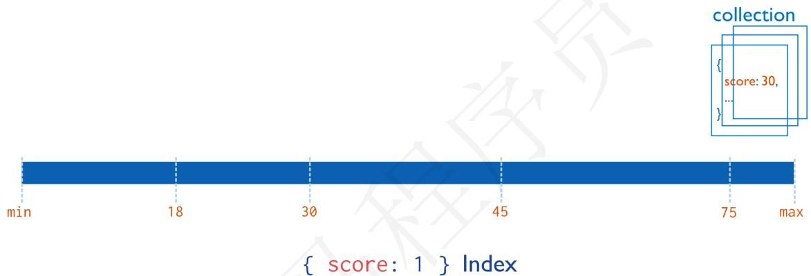


这个是最简单最常用的索引类型，比如我们上边的例子，为id建立一个单独的索引就是此种类型。

# 创建索引

我们创建一个pop人数升序的索引

```javascript
db.zips.createIndex({
    "pop": 1
}) 
```

其中{'pop': 1}中的1表示升序，如果想设置倒序索引的话使用 {'pop': -1}即可

```snap
> db.zips.getIndexes();
[ { "v": 2, "key": { "_id": 1 }, "name": "_id_" } ]
>
> db.zips.createIndex({'pop': 1}}
{
    "createdCollectionAutomatically" : false,
    "numIndexesBefore": 1,
    "numIndexesAfter": 2,
    "ok": 1
}
>
> db.zips.getIndexes();
[
    {
    "v": 2,
    "key": {
    "_id": 1
    },
    "name": "_id_"
    },
    {
    "v": 2,
    "key": {
    "pop": 1
    },
    "name": "pop_1"
    }
]
] 
```

可以在查询中使用执行计划查看索引是否生效

```javascript
db.zips.find({
    "pop": {
    "$gt": 10000
    }
}).explain(); 
```

我们发现索引已经生效了


# 复合索引

复合索引(Compound Indexes)指一个索引包含多个字段，用法和单键索引基本一致。使用复合索引时要注意字段的顺序，如下添加一个userid和score的复合索引，userid正序，score倒序，document首先按照userid正序排序，然后userid相同的document按score进行倒序排序。mongoDB中一个复合索引最多可以包含32个字段。符合索引的原理如下图所示：

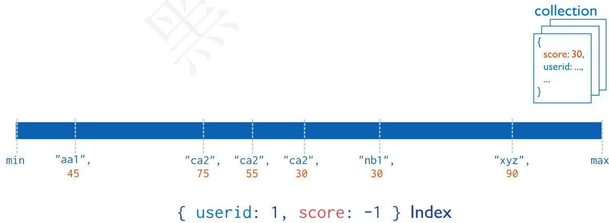


上图查询索引的时候会先查询userid，再查询score，然后就可以找到对应的文档。

# 创建索引

我们创建一个以city升序，state降序的复合索引

```javascript
db.zips.createIndex({
    "city": 1,
    "state": -1
}) 
```


这样我们就把索引创建了


```elixir
> db.zips.createIndex({"city": 1, "state": -1})
{
    "createdCollectionAutomatically" : false,
    "numIndexesBefore" : 2,
    "numIndexesAfter" : 3,
    "ok" : 1
}
> db.zips.getIndexes();
[
    {
    "v" : 2,
    "key" : {
    "_id" : 1
    },
    "name" : "_id_"
    },
    {
    "v" : 2,
    "key" : {
    "pop" : 1
    },
    "name" : "pop_1"
    },
    {
    "v" : 2,
    "key" : {
    "city" : 1,
    "state" : -1
    },
    "name" : "city_1_state_-1"
    }
]
] 
```


查看执行计划


```javascript
db.zips.find({
    "city": "CUSHMAN",
    "state": "NY"
}).explain(); 
```


我们看到我们的查询走了索引


```txt
> db.zips.find({"city":"CUSHMAN","state":"NY"}).explain();
{
    "queryPlanner": {
    "plannerVersion": 1,
    "namespace": "zips-db.zips",
    "indexFilterSet": false,
    "parsedQuery": {
    "$and": [
    {
    "city": {
    "$eq": "CUSHMAN"
    }
    },
    {
    "state": {
    "$eq": "NY"
    }
    }
    ]
    },
    "queryHash": "3BBB13EB",
    "planCacheKey": "D3E2CE3A",
    "winningPlan": {
    "stage": "FETCH",
    "inputStage": {
    "stage": "IXSCAN",
    "keyPattern": {
    "city": 1,
    "state": -1
    },
    "indexName": "city_1_state_-1",
    "isMultiKey": false,
    "multiKeyPaths": {
    "city": [ ], 
```

对于复合索引需要注意以下几点：


最佳左前缀法则


在MySQL中走最佳左前缀法则生效，在mongodb中查询同样生效


```javascript
db.zips.find({
    "city": "CUSHMAN"
}).explain(); 
```

我们只查询最左侧索引列的时候，索引是生效的

```json
> db.zips.find({"city":"CUSHMAN"}}.explain();
{
    "queryPlanner": {
    "plannerVersion": 1,
    "namespace": "zips-db.zips",
    "indexFilterSet": false,
    "parsedQuery": {
    "city": {
    "$eq": "CUSHMAN"
    }
    },
    "queryHash": "0491F17A",
    "planCacheKey": "520D468A",
    "winningPlan": {
    "stage": "FETCH",
    "inputStage": {
    "stage": "IXSCAN",
    "keyPattern": {
    "city": 1,
    "state": -1
    },
    "indexName": "city_1_state_-1",
    "isMultiKey": false,
    "multiKeyPaths": {
    "city": [ ],
    "state": [ ]
    },
    "isUnique": false,
    "isSparse": false,
    "isPartial": false,
    "indexVersion": 2,
    "direction": "forward",
    "indexBounds": {
    "city": [ 
```

但是如果我们查询不加入最左侧索引列

```javascript
db.zips.find({
    "state": "NY"
}).explain(); 
```

我们发现索引未生效，走了全表扫描

```json
> db.zips.find({"state":"NY"}).explain();
{
    "queryPlanner": {
    "plannerVersion": 1,
    "namespace": "zips-db.zips",
    "indexFilterSet": false,
    "parsedQuery": {
    "state": {
    "$eq": "NY"
    }
    },
    "queryHash": "CG81E5F8",
    "planCacheKey": "6D16262B",
    "winningPlan": {
    "stage": "COLLSCAN", 全表扫描
    "filter": {
    "state": {
    "$eq": "NY"
    }
    },
    "direction": "forward"
    },
    "rejectedPlans": [ ]
    },
    "serverInfo": {
    "host": "localhost",
    "port": 27017,
    "version": "4.4.5",
    "gitVersion": "ff5cb77101b052fa02da43b8538093486cf9b3f7"
    },
    "ok": 1
}
```

# 地理索引

地理索引包含两种地理类型，如果需要计算的地理数据表示为类似于地球的球形表面上的坐标，则可以使用 2dsphere 索引。

通常可以按照坐标轴、经度、纬度的方式把位置数据存储为 GeoJSON 对象。GeoJSON 的坐标参考系使用的是 wgs84（World Geodetic System 1984是为GPS全球定位系统使用而建立的坐标系统） 数据。如果需要计算距离（在一个欧几里得平面上），通常可以按照正常坐标对的形式存储位置数据，可使用 2d 索引。

# 创建平面地理索引

如果查找的地方是小范围的可以使用平面索引

```txt
db.zips.createIndex({
    "loc": "2d"
}) 
```

```txt
> db.zips.createIndex( { loc : "2d" } )
{
    "createdCollectionAutomatically" : false,
    "numIndexesBefore" : 3,
    "numIndexesAfter" : 4,
    "ok" : 1
} 
```

# 创建球面地理索引

如果是大范围的，需要考虑地球弧度的情况下如果使用平面坐标可能不准确，就需要使用球面索引

```javascript
db.zips.createIndex({
    "loc": "2dsphere"
}) 
```

```json
> db.zips.createIndex({"loc":"2dsphere"})
{
    "createdCollectionAutomatically": false,
    "numIndexesBefore": 4,
    "numIndexesAfter": 5,
    "ok": 1
} 
```

# 常用索引属性

# 唯一索引

唯一索引(unique indexes)用于为collection添加唯一约束，即强制要求collection中的索引字段没有重复值。添加唯一索引的语法：

```javascript
db.zips.createIndex({"id":1,"city":1},{unique:true,name:"id_union_index"}) 
```

这样我们就创建了一个根据ID以及city的唯一索引

```javascript
> db.zips.createIndex({"id":1,"city":1},{unique:true,name:"id_union_index"})
{
    "createdCollectionAutomatically" : false,
    "numIndexesBefore" : 2,
    "numIndexesAfter" : 3,
    "ok" : 1
} 
```

# 局部索引

局部索引(Partial Indexes)顾名思义，只对collection的一部分添加索引。创建索引的时候，根据过滤条件判断是否对document添加索引，对于没有添加索引的文档查找时采用的全表扫描，对添加了索引的文档查找时使用索引。

# 创建索引

```txt
db.zips.createIndex(
    {
    pop:1
    },
    {
    partialFilterExpression:
    {
    pop:
    {
    $gt: 10000
    }
    }
    }
) 
```

这样就创建了局部索引

```asm
> db.zips.createIndex(
...    {
...    pop:1
...    },
...    {
...    partialFilterExpression:
...    {
...    pop:
...    {
...    $gt: 10000
...    }
...    }
...
{
"createdCollectionAutomatically" : false,
"numIndexesBefore" : 1,
"numIndexesAfter" : 2,
"ok" : 1
}
> 
```

# 查看执行计划

根据索引特性 ，我们知道，只有查找的人数大于10000，才会走索引专业一手超清完整

```javascript
db.zips.find({
    "pop": 9999
}).explain() 
```

我们看到，查询10000以内的数据不走索引

```json
> db.zips.find({"pop":9999}).explain()
{
    "queryPlanner": {
    "plannerVersion": 1,
    "namespace": "zips-db.zips",
    "indexFilterSet": false,
    "parsedQuery": {
    "pop": {
    "$eq": 9999
    }
    },
    "queryHash": "891A44E4",
    "planCacheKey": "4F78FCD2",
    "winningPlan": {
    "stage": "COLLSCAN",
    "filter": {
    "pop": {
    "$eq": 9999
    }
    },
    "direction": "forward"
    },
    "rejectedPlans": [ ]
    },
    "serverInfo": {
    "host": "localhost",
    "port": 27017,
    "version": "4.4.5",
    "gitVersion": "ff5cb77101b052fa02da43b8538093486cf9b3f7"
    },
    "ok": 1
} 
```

如果查找的条件大于10000就会走索引

```txt
db.zips.find({
    "pop": 99999
}).explain() 
```

```txt
> db.zips.find({"pop":99999}).explain()
{
    "queryPlanner": {
    "plannerVersion": 1,
    "namespace": "zips-db.zips",
    "indexFilterSet": false,
    "parsedQuery": {
    "pop": {
    "$eq": 99999
    }
    },
    "queryHash": "891A44E4",
    "planCacheKey": "2D13A19E",
    "winningPlan": {
    "stage": "FETCH",
    "inputStage": {
    "stage": "IXSCAN",
    "keyPattern": {
    "pop": 1
    },
    "indexName": "pop_1",
    "isMultiKey": false,
    "multiKeyPaths": {
    "pop": [ ]
    },
    "isUnique": false,
    "isSparse": false,
    "isPartial": true,
    "indexVersion": 2,
    "direction": "forward",
    "indexBounds": {
    "pop": [
    "[99999.0, 99999.0]" 
```

# 执行计划

MongoDB中的 explain() 函数可以帮助我们查看查询相关的信息，这有助于我们快速查找到搜索瓶颈进而解决它，本文我们就来看看 explain() 的一些用法及其查询结果的含义。

整体来说， explain() 的用法和 sort() 、 limit() 用法差不多，不同的是 explain() 必须放在最后面。

# 基本用法

先来看一个基本用法：

```txt
db.zips.find({
    "pop": 99999
}).explain() 
```

直接跟在 find() 函数后面，表示查看 find() 函数的执行计划，结果如下：

```json
{
    "queryPlanner": {
    "plannerVersion": 1, // 查询计划版本
    "namespace": "zips-db.zips", // 要查询的集合
    "indexFilterSet": false, // 是否使用索引
    "parsedQuery": { // 查询条件
    "pop": {
    "$eq": 99999
    }
    },
    "queryHash": "891A44E4",
    "planCacheKey": "2D13A19E",
    "winningPlan": { // 最佳执行计划
    "stage": "FETCH", // 查询方式，常见的有COLLSCAN/全表扫描、IXSCAN/索引扫描、FETCH/根据索引去检索文档、SHARD_MERGE/合并分片结果、IDHACK/针对_id进行查询
    "inputStage": {
    "stage": "IXSCAN",
    "keyPattern": {
    "pop": 1
    },
    "indexName": "pop_1",
    "isMultiKey": false,
    "multiKeyPaths": {
    "pop": []
    },
    "isUnique": false,
    "isSparse": false,
    "isPartial": true,
    "indexVersion": 2,
    "direction": "forward", // 搜索方向
    "indexBounds": {
    "pop": [
    "[99999.0, 99999.0]"
    ]
    }
    }
},
"rejectedPlans": [] // 拒绝的执行计划
},
```

```json
"serverInfo": {
    "host": "localhost",
    "port": 27017,
    "version": "4.4.5",
    "gitVersion": "ff5cb77101b052fa02da43b8538093486cf9b3f7"
},
"ok": 1
} 
```

返回结果包含两大块信息，一个是 queryPlanner，即查询计划，还有一个是 serverInfo，即+微信study322MongoDB服务的一些信息。

# 参数解释

那么这里涉及到的参数比较多，我们来一一看一下：全网课程 超低价

<table><tr><td>参数</td><td>含义</td></tr><tr><td>plannerVersion</td><td>查询计划版本</td></tr><tr><td>namespace</td><td>要查询的集合</td></tr><tr><td>indexFilterSet</td><td>是否使用索引</td></tr><tr><td>parsedQuery</td><td>查询条件,此处为pop=99999</td></tr><tr><td>winningPlan</td><td>最佳执行计划</td></tr><tr><td>stage</td><td>查询方式,常见的有COLLSCAN/全表扫描、IXSCAN/索引扫描、FETCH/根据索引去检索文档、SHARD_MERGE/合并分片结果、IDHACK/针对_id进行查询</td></tr><tr><td>filter</td><td>过滤条件</td></tr><tr><td>direction</td><td>搜索方向</td></tr><tr><td>rejectedPlans</td><td>拒绝的执行计划</td></tr><tr><td>serverInfo</td><td>MongoDB服务器信息</td></tr></table>

# 添加不同参数

explain() 也接收不同的参数，通过设置不同参数我们可以查看更详细的查询计划。

# queryPlanner

是默认参数，添加queryPlanner参数的查询结果就是我们上文看到的查询结果，so，这里不再赘述。

# executionStats

会返回最佳执行计划的一些统计信息，如下：

```txt
db.zips.find({
    "pop": 99999
}).explain("executionStats") 
```

我们发现增加了一个executionStats的字段列的信息

{ 

```javascript
"queryPlanner": {
    "plannerVersion": 1,
    "namespace": "zips-db.zips",
    "indexFilterSet": false,
    "parsedQuery": {
    "pop": {
    "$eq": 99999
    }
},
"winningPlan": {
    "stage": "FETCH",
    "inputStage": {
    "stage": "IXSCAN",
    "keyPattern": {
    "pop": 1
    },
    "indexName": "pop_1",
    "isMultiKey": false,
    "multiKeyPaths": {
    "pop": []
    },
    "isUnique": false,
    "isSparse": false,
    "isPartial": true,
    "indexVersion": 2,
    "direction": "forward",
    "indexBounds": {
    "pop": [
    "[99999.0, 99999.0]"
    ]
    }
},
"rejectedPlans": []},   
"executionStats": {
    "executionSuccess": true,// 是否执行成功
    "nReturned": 0,// 返回的结果数
    "executionTimeMillis": 1,// 执行耗时
    "totalKeysExamined": 0,// 索引扫描次数
    "totalDocsExamined": 0,// 文档扫描次数
    "executionStages": { // 这个分类下描述执行的状态
    "stage": "FETCH", // 扫描方式
    "nReturned": 0,// 查询结果数量
    "executionTimeMillisEstimate": 0,
    "works": 1,
    "advanced": 0,
    "needTime": 0,
    "needYield": 0,
    "saveState": 0,
    "restoreState": 0,
    "isEOF": 1,
    "docsExamined": 0,// 文档检查数目，与totalDocsExamined一致
    "alreadyHasObj": 0,
    "inputStage": {
    "stage": "IXSCAN",
    "nReturned": 0,
```

```json
"executionTimeMillisEstimate": 0, // 预估耗时
"works": 1, // 工作单元数，一个查询会分解成小的工作单元
"advanced": 0, // 优先返回的结果数
"needTime": 0,
"needYield": 0,
"saveState": 0,
"restoreState": 0,
"isEOF": 1,
"keyPattern": {
    "pop": 1
},
"indexName": "pop_1",
"isMultiKey": false,
"multiKeyPaths": {
    "pop": []
},
"isUnique": false,
"isSparse": false,
"isPartial": true,
"indexVersion": 2,
"direction": "forward",
"indexBounds": {
    "pop": [
    "[99999.0, 99999.0]"
    ]
},
"keysExamined": 0,
"seeks": 1,
"dupsTested": 0,
"dupsDropped": 0
}
},
"serverInfo": {
    "host": "localhost",
    "port": 27017,
    "version": "4.4.5",
    "gitVersion": "ff5cb77101b052fa02da43b8538093486cf9b3f7"
},
"ok": 1
}
```

这里除了我们上文介绍到的一些参数之外，还多了executionStats参数，含义如下：

<table><tr><td>参数</td><td>含义</td></tr><tr><td>executionSuccess</td><td>是否执行成功</td></tr><tr><td>nReturned</td><td>返回的结果数</td></tr><tr><td>executionTimeMillis</td><td>执行耗时</td></tr><tr><td>totalKeysExamined</td><td>索引扫描次数</td></tr><tr><td>totalDocsExamined</td><td>文档扫描次数</td></tr><tr><td>executionStages</td><td>这个分类下描述执行的状态</td></tr><tr><td>stage</td><td>扫描方式,具体可选值与上文的相同</td></tr><tr><td>nReturned</td><td>查询结果数量</td></tr><tr><td>executionTimeMillisEstimate</td><td>预估耗时</td></tr><tr><td>works</td><td>工作单元数,一个查询会分解成小的工作单元</td></tr><tr><td>advanced</td><td>优先返回的结果数</td></tr><tr><td>docsExamined</td><td>文档检查数目,与totalDocsExamined一致</td></tr></table>

allPlansExecution：用来获取所有执行计划，结果参数基本与上文相同，这里就不再细说了。

# 慢查询

在MySQL中，慢查询日志是经常作为我们优化查询的依据，那在MongoDB中是否有类似的功能呢？答案是肯定的，那就是开启Profiling功能。该工具在运行的实例上收集有关MongoDB的写操作，游标，数据库命令等，可以在数据库级别开启该工具，也可以在实例级别开启。该工具会把收集到的所有都写入到system.profile集合中，该集合是一个capped collection。(一旦集合填满其分配的空间，它就会覆盖集合中最旧的文档，从而为新文档腾出空间)

# 慢查询分析流程

慢查询日志一般作为优化步骤里的第一步。通过慢查询日志，定位每一条语句的查询时间。比如超过了200ms，那么查询超过200ms的语句需要优化。然后它通过 .explain() 解析影响行数是不是过大，所以导致查询语句超过200ms。

# 所以优化步骤一般就是：

1. 用慢查询日志（system.profile）找到超过200ms的语句

2. 然后再通过.explain()解析影响行数，分析为什么超过200ms

3. 决定是不是需要添加索引

# 开启慢查询

# Profiling级别说明

0：关闭，不收集任何数据。

1：收集慢查询数据，默认是100毫秒。

2：收集所有数据

# 针对数据库设置

登录需要开启慢查询的数据库

```txt
use zips-db 
```

查看慢查询状态

```txt
db.getProfilingStatus() 
```

设置慢查询级别

```txt
db.setProfilingLevel(2) 
```

```jsonl
> db.getProfilingStatus()
{ "was": 0, "slowms": 100, "sampleRate": 1 }
> db.setProfilingLevel(2)
{ "was": 0, "slowms": 100, "sampleRate": 1, "ok": 1 }
>
> db.getProfilingStatus()
{ "was": 2, "slowms": 100, "sampleRate": 1 } 
```

如果不需要收集所有慢日志，只需要收集小于100ms的慢日志可以使用如下命令

```javascript
db.setProfilingLevel(1,100) 
```

# 注意：

以上操作要是在test集合下面的话，只对该集合里的操作有效，要是需要对整个实例有效，则需要在所有的集合下设置或在开启的时候开启参数

每次设置之后返回给你的结果是修改之前的状态（包括级别、时间参数）。

# 全局设置

在mongoDB启动的时候加入如下参数

```batch
mongod --profile=1 --slowms=200 
```

或在配置文件里添加2行：

```hcl
profile = 1
slowms = 200 
```

这样就可以针对所有数据库进行监控慢日志了

# 关闭Profiling

使用如下命令可以关闭慢日志

```txt
db.setProfilingLevel(0) 
```

```txt
> db.setProfilingLevel(0)
{ "was": 2, "slowms": 100, "sampleRate": 1, "ok": 1 }
>
> db.getProfilingStatus()
{ "was": 0, "slowms": 100, "sampleRate": 1 }
> 
```

# Profile 效率

Profiling功能肯定是会影响效率的，但是不太严重，原因是他使用的是system.profile 来记录，而system.profile 是一个capped collection， 这种collection 在操作上有一些限制和特点，但是效率更高。

# 慢查询分析

通过 db.system.profile.find() 查看当前所有的慢查询日志

```javascript
db.system.profile.find() 
```

```json
> db.system.profile.find().pretty()
{
    "op": "query",
    "ns": "zips-db.system.profile",
    "command": {
    "find": "system.profile",
    "filter": {
    },
    "lsid": {
    "id": UUID("bffafa81-6bdd-45db-98e1-ad4a293aaced")
    },
    "$db": "zips-db"
    },
    "keysExamined": 0,
    "docsExamined": 0,
    "cursorExhausted": true,
    "numYield": 0,
    "nreturned": 0,
    "locks": {
    "ReplicationStateTransition": {
    "acquireCount": {
    "w": NumberLong(1)
    }
    },
    "Global": {
    "acquireCount": {
    "r": NumberLong(1)
    }
    },
    "Database": {
    "acquireCount": {
    "r": NumberLong(1)
    }
    }
} 
```

# 参数含义

```json
{
    "op": "query", // 操作类型，有insert、query、update、remove、getmore、command
    "ns": "onroad.route_model", // 操作的集合
    "query": {
    "$query": {
    "user_id": 314436841,
    "data_time": {
    "$gte": 1436198400
    }
    },
    "$orderby": {
    "data_time": 1
    }
    },
}
```

"ntoskip" : 0, // 指定跳过skip()方法 的文档的数量。

"nscanned" : 2, // 为了执行该操作，MongoDB在 index 中浏览的文档数。 一般来说，如果nscanned 值高于 nreturned 的值，说明数据库为了找到目标文档扫描了很多文档。这时可以考虑创建索引来提高效率。

"nscannedObjects" : 1, // 为了执行该操作，MongoDB在 collection中浏览的文档数。

"keyUpdates" : 0, // 索引更新的数量，改变一个索引键带有一个小的性能开销，因为数据库必须删除旧的key，并插入一个新的key到B-树索引

"numYield" : 1, // 该操作为了使其他操作完成而放弃的次数。通常来说，当他们需要访问还没有完全读入内存中的数据时，操作将放弃。这使得在MongoDB为了放弃操作进行数据读取的同时，还有数据在内存中的其他操作可以完成

"lockStats" : { // 锁信息，R：全局读锁；W：全局写锁；r：特定数据库的读锁；w：特定数据库的写锁

"timeLockedMicros" : { // 该操作获取一个级锁花费的时间。对于请求多个锁的操作，比如对 local 数据库锁来更新 oplog ，该值比该操作的总长要长（即 millis ）

```javascript
"r": NumberLong(1089485), "w": NumberLong(0) }, "timeAcquiringMicros": { // 该操作等待获取一个级锁花费的时间。 "r": NumberLong(102), "w": NumberLong(2) } }, "nreturned": 1, // 返回的文档数量 "responseLength": 1669, // 返回字节长度，如果这个数字很大，考虑值返回所需字段 "millis": 544, // 消耗的时间（毫秒） "execStats": { // 一个文档，其中包含执行 查询 的操作，对于其他操作，这个值是一个空文 system.profile.execStats 显示了就像树一样的统计结构，每个节点提供了在执行阶段的查询操作。
```

```javascript
"type" : "LIMIT", // 使用limit限制返回数
"works" : 2,
"yields" : 1,
"unyields" : 1,
"invalidates" : 0,
"advanced" : 1,
"needTime" : 0,
"needFetch" : 0,
"isEOF" : 1, // 是否为文件结束符
"children" : [
    {
    "type" : "FETCH", // 根据索引去检索指定document
    "works" : 1,
    "yields" : 1,
    "unyields" : 1,
    "invalidates" : 0,
    "advanced" : 1,
    "needTime" : 0,
    "needFetch" : 0,
    "isEOF" : 0,
    "alreadyHasObj" : 0,
    "forcedFetches" : 0,
    "matchTested" : 0,
    "children" : [
    {
    "type" : "IXSCAN", // 扫描索引键
    "works" : 1,
    "yields" : 1,
    "unyields" : 1,
    "invalidates" : 0,
    "advanced" : 1,
    "needTime" : 0,
    "needFetch" : 0,
    "isEOF" : 0,
    "keyPattern" : "{user_id: 1.0, data_time: -1.0}",
    "boundsVerbose" : "field #0['user_id']: [314436841, 314436841], field #1['data_time']: [1436198400, inf.0]",
    "isMultiKey" : 0,
    "yieldMovedCursor" : 0,
    "dupsTested" : 0,
    "dupsDropped" : 0,
    "seenInvalidated" : 0,
```

```txt
"matchTested": 0, "keysExamined": 2, "children": [ ] } ] } ] }, "ts": ISODate("2015-10-15T07:41:03.061z"), //该命令在何时执行"client": "10.10.86.171", //链接ip或主机"allUsers": [ { "user": "martin_v8", "db": "onroad" } ], "user": "martin_v8@onroad" }
```

# 分析

如果发现 millis 值比较大，那么就需要做优化。

1. 如果nscanned数很大，或者接近记录总数（文档数），那么可能没有用到索引查询，而是全表扫描。

2. 如果 nscanned 值高于 nreturned 的值，说明数据库为了找到目标文档扫描了很多文档。这时可以考虑创建索引来提高效率。

# system.profile补充

‘type’的返回参数说明

```sql
COLLSCAN #全表扫描
IXSCAN #索引扫描
FETCH #根据索引去检索指定document
SHARD_MERGE #将各个分片返回数据进行merge
SORT #表明在内存中进行了排序（与老版本的scanAndOrder:true一致）
LIMIT #使用limit限制返回数
SKIP #使用skip进行跳过
IDHACK #针对_id进行查询
SHARDING_FILTER #通过mongos对分片数据进行查询
COUNT #利用db.coll.explain().count()之类进行count运算
COUNTSCAN #count不使用Index进行count时的stage返回
COUNT_SCAN #count使用了Index进行count时的stage返回
SUBPLA #未使用到索引的$or查询的stage返回
TEXT #使用全文索引进行查询时候的stage返回
PROJECTION #限定返回字段时候stage的返回
```

对于普通查询，我们最希望看到的组合有这些

```txt
Fetch+IDHACK
Fetch+ixscan
Limit+ (Fetch+ixscan)
PROJECTION+ixscan
SHARDING_FILTER+ixscan
等
```

COLLSCAN（全表扫），SORT（使用sort但是无index），不合理的SKIP，SUBPLA（未用到index的$or）

# springBoot整合Mongo

# 引入Pom坐标

```xml
<dependency>
    <groupId>org.springframework.boot</groupId>
    <artifactId>spring-boot-starter-data-mongodb</artifactId>
</dependency> 
```

# 编写配置文件

```yaml
server:
    port: 8080
spring:
    application:
    name: spring-boot-test
    data:
    mongodb:
    database: test
    host: 192.168.10.30
    port: 27017 
```

# 定义实体类

# Blog类

```java
@Document("blog")
public class Blog {
    @Id
    private String id;
    private String title;
    private String by;
    private String url;
    private List<String> tags;
    private int likes;
    setter getter ....
} 
```

# DAO

```txt
@Component
public class BlogDao {
    @Autowired
    private MongoTemplate mongoTemplate;

    public void insert(Blog blog) {
    mongoTemplate.insert(blog);
    }
} 
```

```java
public Blog findByID(String id) {
    return mongoTemplate.findById(id, Blog.class);
}

public void deleteByID(String id) {
    mongoTemplate.remove(Query.query(Criteria.where("_id").is(id)), Blog.class);
}

public List<Blog> find(Blog blog) {
    if (null == blog) {
    return null;
    }
    Criteria criteria = getFilter(blog);
    return mongoTemplate.find(Query.query(criteria), Blog.class);
}

public Criteria getFilter(Blog blog) {
    Criteria criteria = new Criteria();
    if (!StringUtils.isEmpty(blog.getTitle())) {
    criteria.andOperator(Criteria.where("title").is(blog.getUrl()));
    }
    if (!StringUtils.isEmpty(blog.getBy())) {
    criteria.andOperator(Criteria.where("by").is(blog.getBy()));
    }
    if (! SungUtils.isEmpty(blog.getLikes())) {
    criteria.andOperator(Criteria.where("likes").is(blog.getLikes()));
    }
    if (null != blog.getTags() && !blog.getTags().isEmpty()) {
    criteria.andOperator(Criteria.where("tags").in(blog.getTags()));
    }

    return criteria;
} 
```

# Controller

```java
@RestController
@RequestMapping("/blog")
public class widthController {
    @Resource
    private BlogDao blogDao;

    @RequestMapping Floorid")
    @ResponseBody
    public String getBlogInfo(@PathVariable("id") String id) {
    Blog blog = blogDao.findById(id);
    if (null == blog) {
    return "访问的数据不存在";
    }
    return JSON.toJSONString(blog);
```

```java
}
@RequestMapping("/add")
@ResponseBody
public String addBlog(@RequestBody Blog blog) {
    blogDao.insert(blog);
    return JSON.toJSONString(blog);
}
public void batchAdd() {
}
} 
```

# 启动测试

# 启动Controller 插入数据

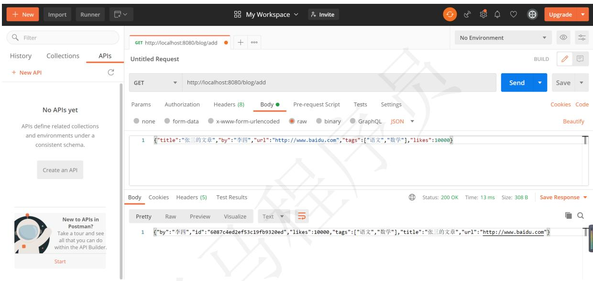


# 到数据库查看结果

<table><tr><td>&gt;db.blog.find().pretty(   );</td></tr><tr><td>{ &quot;id&quot;: ObjectId(&quot;6087c1ac2ef53c19fb9320ea&quot;), &quot;title&quot;: &quot;张三的文章&quot;, &quot;by&quot;: &quot;张三&quot;, &quot;url&quot;: &quot;http://www.baidu.com&quot;, &quot;tags&quot;: [ &quot;语文&quot;, &quot;数学&quot; ], &quot;likes&quot;: 1000, &quot;_class&quot;: &quot;com.heima.test.po.Blog&quot; }</td></tr><tr><td>{ &quot;id&quot;: ObjectId(&quot;6087c3b82ef53c19fb9320eb&quot;), &quot;title&quot;: &quot;张三的文章&quot;, &quot;by&quot;: &quot;张三&quot;, &quot;url&quot;: &quot;http://www.baidu.com&quot;, &quot;tags&quot;: [ &quot;语文&quot;, &quot;数学&quot; ], &quot;likes&quot;: 1000, &quot;_class&quot;: &quot;com.heima.test.po.Blog&quot; }</td></tr><tr><td>{ &quot;id&quot;: ObjectId(&quot;6087c3cb2ef53c19fb9320ec&quot;), &quot;title&quot;: &quot;张三的文章&quot;, &quot;by&quot;: &quot;张三&quot;, &quot;url&quot;: &quot;http://www.baidu.com&quot;, &quot;tags&quot;: [ &quot;语文&quot;, &quot;数学&quot; ],</td></tr></table>