# 业一手超清完整

# MongoDB集群管理


集群介绍


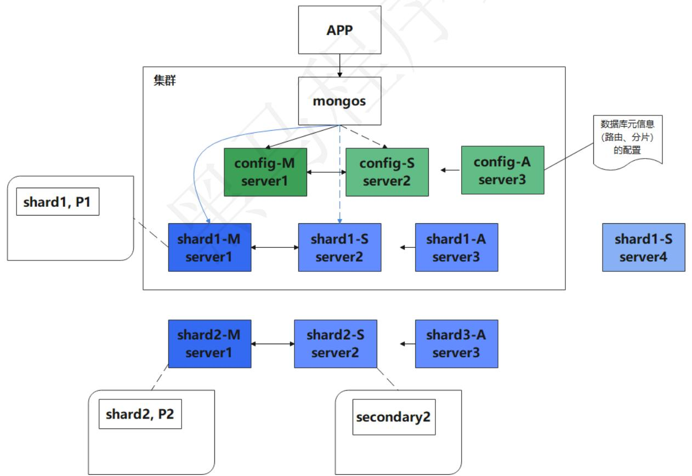


# 为什么使用集群

随着业务数据和并发量的增加，若只使用一台MongoDB服务器，存在着断电和数据风险的问题，故采用Mongodb复制集的方式，来提高项目的高可用、安全性等性能。

MongoDB复制是将数据同步到多个服务器的过程。复制提供了数据的冗余备份，并在多个服务器上存储数据副本，提高了数据的可用性， 并可以保证数据的安全性。复制还允许从硬件故障和服务中断中恢复数据。

使用集群的目的就是提高可用性。高可用性H.A.（High Availability）指的是通过尽量缩短因日常维护操作（计划）和突发的系统崩溃（非计划）所导致的停机时间，以提高系统和应用的可用性。它与被认为是不间断操作的容错技术有所不同。HA系统是目前企业防止核心计算机系统因故障停机的最有效手段。

# 相关概念

在搭建集群之前，需要首先了解几个概念：路由，分片、副本集、配置服务器等。


+微信s


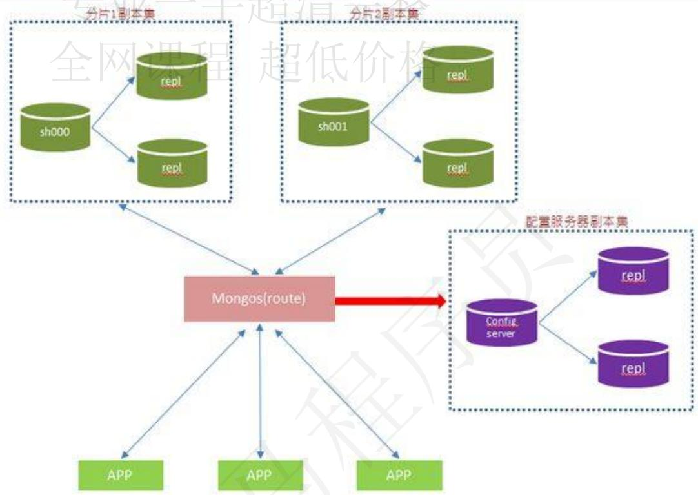


# mongos

数据库集群请求的入口，所有的请求都通过mongos进行协调，不需要在应用程序添加一个路由选择器，mongos自己就是一个请求分发中心，它负责把对应的数据请求转发到对应的shard服务器上。在生产环境通常有多mongos作为请求的入口，防止其中一个挂掉所有的mongodb请求都没有办法操作。

# config server

顾名思义为配置服务器，存储所有数据库元信息（路由、分片）的配置。mongos本身没有物理存储分片服务器和数据路由信息，只是缓存在内存里，配置服务器则实际存储这些数据。mongos第一次启动或者关掉重启就会从 config server 加载配置信息，以后如果配置服务器信息变化会通知到所有的mongos 更新自己的状态，这样 mongos 就能继续准确路由。在生产环境通常有多个 config server 配置服务器，因为它存储了分片路由的元数据，防止数据丢失！

# shard

分片（sharding）是指将数据库拆分，将其分散在不同的机器上的过程。将数据分散到不同的机器上，不需要功能强大的服务器就可以存储更多的数据和处理更大的负载。基本思想就是将集合切成小块，这些块分散到若干片里，每个片只负责总数据的一部分，最后通过一个均衡器来对各个分片进行均衡（数据迁移）。

# replica set

中文翻译副本集，其实就是shard的备份，防止shard挂掉之后数据丢失。复制提供了数据的冗余备份，并在多个服务器上存储数据副本，提高了数据的可用性， 并可以保证数据的安全性。

# 仲裁者

仲裁者（Arbiter），是复制集中的一个MongoDB实例，它并不保存数据。仲裁节点使用最小的资源并且不要求硬件设备，不能将Arbiter部署在同一个数据集节点中，可以部署在其他应用服务器或者监视服务器中，也可部署在单独的虚拟机中。为了确保复制集中有奇数的投票成员（包括primary），需要添加仲裁节点做为投票，否则primary不能运行时不会自动切换primary。

仲裁节点是一种特殊的节点，它本身并不存储数据，主要的作用是决定哪一个备节点在主节点挂掉专业一手超清完整之后提升为主节点，所以客户端不需要连接此节点。这里虽然只有一个备节点，但是仍然需要一个仲裁节点来提升备节点级别。如果没有仲裁节点的话，主节点挂了备节点还是备节点，所以咱们还是需要它的。

# 集群方案

# 主从(Master-Slaver)

因为官方已经不推荐使用，并且已经在MongoDB3.6以后慢慢废弃了，这里不过多的介绍了

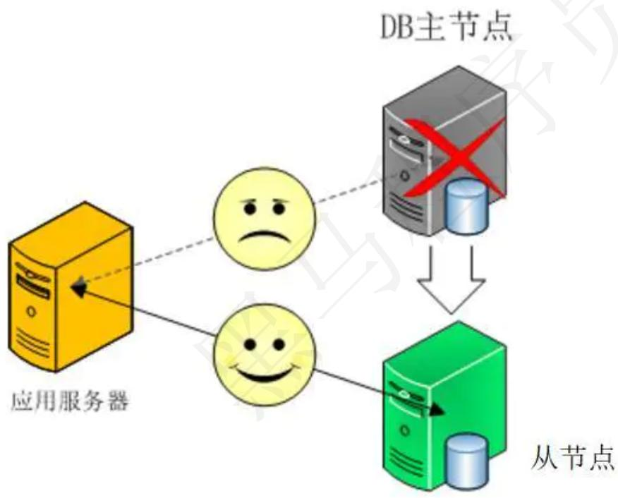


工作原理：主机工作，备机处于监控准备状况；当主机宕机时，备机接管主机的一切工作，待主机恢复正常后，按使用者的设定以自动或手动方式将服务切换到主机上运行，数据的一致性通过共享存储系统解决。

# 副本集(Replica Set)

简单来说就是集群当中包含了多份数据，保证主节点挂掉了，备节点能继续提供数据服务，提供的前提就是数据需要和主节点一致。

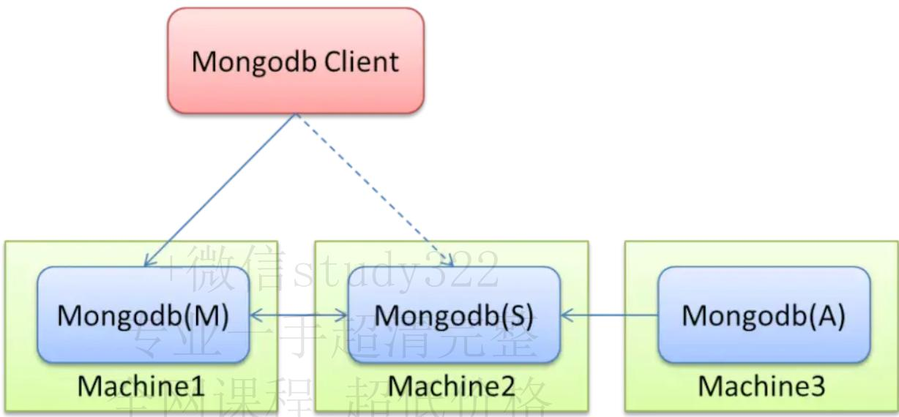


默认设置下，主节点提供所有增删查改服务，备节点不提供任何服务。但是可以通过设置使备节点提供查询服务，这样就可以减少主节点的压力，当客户端进行数据查询时，请求自动转到备节点上。这个设置叫做Read Preference Modes。

# 副本集特点

N个节点的集群

任何节点可作为主节点（除了仲裁节点）

所有写操作都在主节点上

自动故障迁移

自动恢复


分片(Sharding)


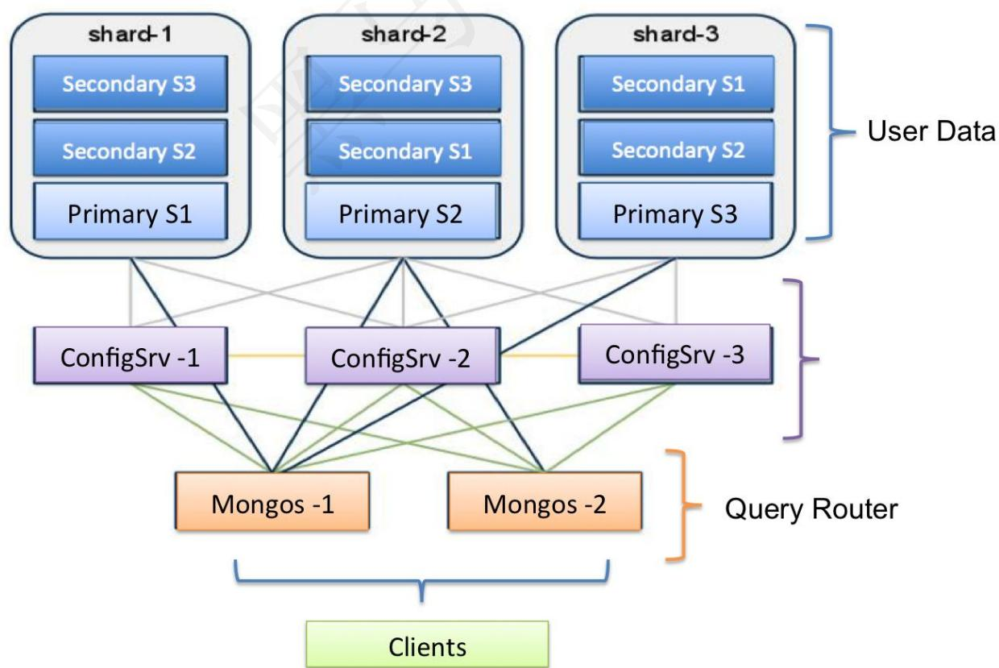


Sharding和Replica Set类似，都需要一个仲裁节点，但是Sharding还需要配置节点和路由节点。就三种集群搭建方式来说，这种是最复杂的。

为什么Sharding会需要配置Replica Set。其实想想也能明白，多个节点的数据肯定是相关联的，如果不配一个Replica Set，怎么标识是同一个集群的呢。配置方式和之前所说的一样，定一个cfg，然后初始化配置。

# 副本集搭建

# 什么是副本集

一组Mongodb复制集，就是一组mongod进程，这些进程维护同一个数据集合。复制集提供了数据冗余和高等级的可靠性，这是生产部署的基础。+微信study322

MongoDB 副本集是将数据同步在多个服务器的过程，复制提供了数据的冗余备份，并在多个服务器上存储数据副本，提高了数据的可用性， 并可以保证数据的安全性，同时还允许从硬件故障和服务中

# 副本集的目的

保证数据在生产部署时的冗余和可靠性，通过在不同的机器上保存副本来保证数据不会因为单点损坏而丢失。能够随时应对数据丢失、机器损坏带来的风险。

换一句话来说，还能提高读取能力，用户的读取服务器和写入服务器在不同的地方，而且，由不同的服务器为不同的用户提供服务，提高整个系统的负载。

# 副本集工作原理

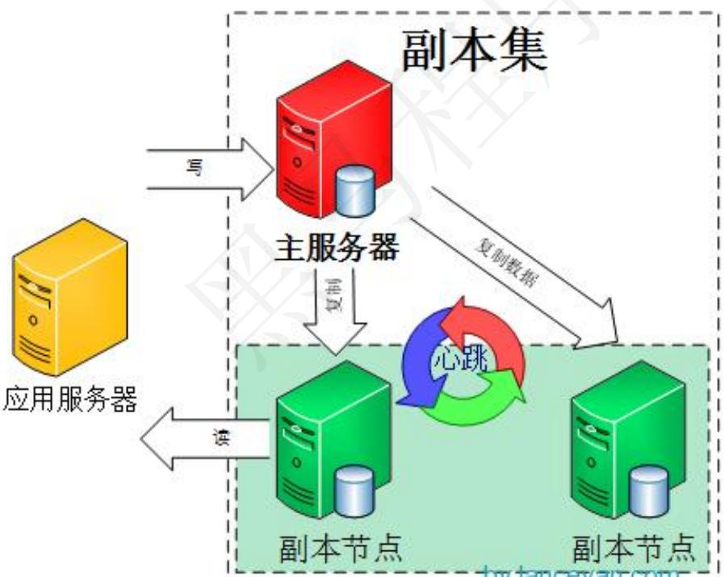


一组复制集就是一组mongod实例掌管同一个数据集，实例可以在不同的机器上面。实例中包含一个主导，接受客户端所有的写入操作，其他都是副本实例，从主服务器上获得数据并保持同步。

主服务器很重要，包含了所有的改变操作（写）的日志。但是副本服务器集群包含所有的主服务器数据，因此当主服务器挂掉了，就会在副本服务器上重新选取一个成为主服务器。

每个复制集还有一个仲裁者，仲裁者不存储数据，只是负责通过心跳包来确认集群中集合的数量，并在主服务器选举的时候作为仲裁决定结果。

# 副本集架构

基本的架构由3台服务器组成，一个三成员的复制集，由三个有数据，或者两个有数据，一个作为仲裁者。

# 没有仲裁节点

具有三个存储数据的成员的复制集有：

一个主库；

两个从库

主库宕机时，这两个从库都可以被选为主库。

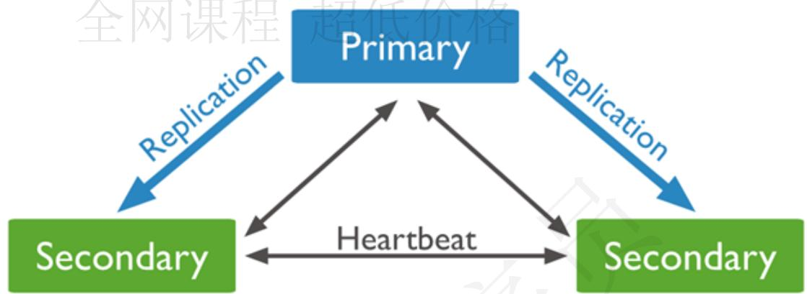


当主库宕机后,两个从库都会进行竞选，其中一个变为主库，当原主库恢复后，作为从库加入当前的复制集群即可。

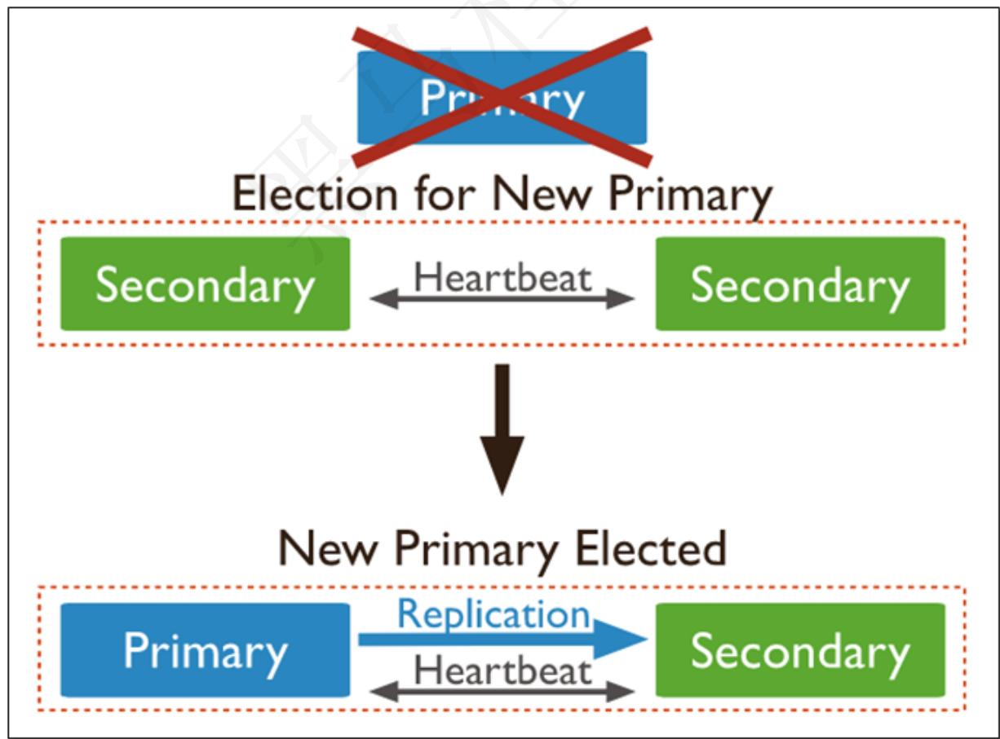


# 当存在仲裁节点

在三个成员的复制集中，有两个正常的主从，及一台arbiter节点：

一个主库

一个从库，可以在选举中成为主库

一个aribiter节点，在选举中，只进行投票，不能成为主库

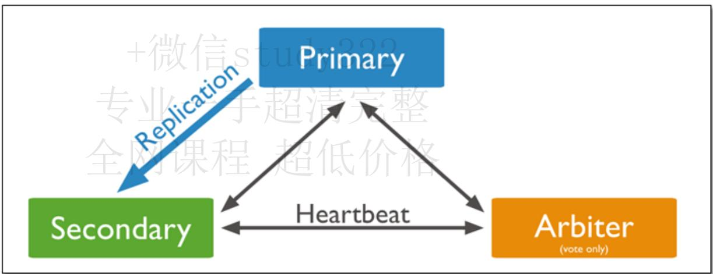


说明：

由于arbiter节点没有复制数据，因此这个架构中仅提供一个完整的数据副本。arbiter节点只需要更少的资源，代价是更有限的冗余和容错。

当主库宕机时，将会选择从库成为主，主库修复后，将其加入到现有的复制集群中即可。

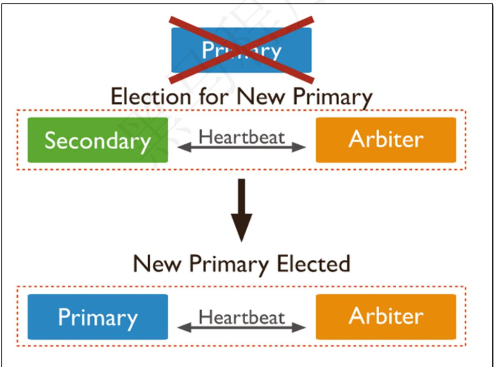


# Primary选举

复制集通过replSetInitiate命令（或mongo shell的rs.initiate()）进行初始化，初始化后各个成员间开始发送心跳消息，并发起Priamry选举操作，获得『大多数』成员投票支持的节点，会成为Primary，其余节点成为Secondary。

# 『大多数』的定义

假设复制集内投票成员（后续介绍）数量为N，则大多数为 N/2 + 1，当复制集内存活成员数量不足大多数时，整个复制集将无法选举出Primary，复制集将无法提供写服务，处于只读状态。

<table><tr><td>投票成员数</td><td>大多数</td><td>容忍失效数</td></tr><tr><td>1</td><td>1</td><td>0</td></tr><tr><td>2</td><td>2</td><td>0</td></tr><tr><td>3</td><td>2</td><td>1</td></tr><tr><td>4</td><td>3</td><td>1</td></tr><tr><td>5</td><td>3</td><td>2</td></tr><tr><td>6</td><td>4</td><td>2</td></tr><tr><td>7</td><td>4</td><td>3</td></tr></table>

通常建议将复制集成员数量设置为奇数，从上表可以看出3个节点和4个节点的复制集都只能容忍1个节点失效，从『服务可用性』的角度看，其效果是一样的。（但无疑4个节点能提供更可靠的数据存储）

# 副本集成员

# Secondary

正常情况下，复制集的Seconary会参与Primary选举（自身也可能会被选为Primary），并从Primary同步最新写入的数据，以保证与Primary存储相同的数据。

Secondary可以提供读服务，增加Secondary节点可以提供复制集的读服务能力，同时提升复制集的可用性。另外，Mongodb支持对复制集的Secondary节点进行灵活的配置，以适应多种场景的需求。

# Arbiter

Arbiter节点只参与投票，不能被选为Primary，并且不从Primary同步数据。

比如你部署了一个2个节点的复制集，1个Primary，1个Secondary，任意节点宕机，复制集将不能提供服务了（无法选出Primary），这时可以给复制集添加一个Arbiter节点，即使有节点宕机，仍能选出Primary。

Arbiter本身不存储数据，是非常轻量级的服务，当复制集成员为偶数时，最好加入一个Arbiter节点，以提升复制集可用性。

# 搭建副本集群

# 准备工作

安装 docker

docker安装步骤：https://docs.docker.com/engine/install/centos/

# 下载Mongo镜像

下载 mongo 镜像，如有需求可加上版本号+微信stud


docker pull mongo 专业


```ini
[root@localhost ~]# docker pull mongo
Using default tag: latest
latest: Pulling from library/mongo
6e0aa5e7af40: Pull complete
d47239a868b3: Pull complete
49cbb10cca85: Pull complete
9729d7ec22de: Pull complete
7b7fd72268d8: Pull complete
5e2934dacaf5: Pull complete
bf9da24d4b2c: Pull complete
d2f8c3715616: Pull complete
e9f96a4a45b0: Pull complete
bd66718f31e2: Pull complete
41ed4d1a1542: Pull complete
7336dfc228e2: Pull complete
Digest: sha256:b66f48968d757262e5c29979e6aa3af944d4ef166314146e1b3a788f0d191ac3
Status: Downloaded newer image for mongo:latest
docker.io/library/mongo:latest
[root@localhost ~]# 
```

# 创建挂载目录

```shell
mkdir -p /tmp/mongo/mongo{1..3}/data
mkdir -p /tmp/mongo/conf 
```

```txt
[root@localhost ~]# mkdir -p /tmp/mongo{1..3}/data
[root@localhost ~]# mkdir -p /tmp/mongo/conf
[root@localhost ~]# 
```

# 建立网络

```txt
docker network create mongo-cluster
docker network ls 
```

```txt
[root@localhost ~]# docker network create mongo-cluster
d103b3c8af5c4792f81773b447e00c198b4a298de4c99ea8b2cf18e201baa139
[root@localhost ~]# docker network ls
NETWORK ID NAME DRIVER SCOPE
330f7580c87e bridge bridge local
e432ed312f97 host host local
d103b3c8af5c mongo-cluster bridge local
a5abd090c1f3 none null local
[root@localhost ~]# 
```

# 生成key

```shell
cd /tmp/mongo/conf
openssl rand -base64 90 -out ./keyfile
chmod 600 keyfile 
```

```txt
[root@localhost ~]# cd /tmp/mongo/conf/
[root@localhost conf]#
[root@localhost conf]# openssl rand -base64 90 -out ./keyfile
[root@localhost conf]#
[root@localhost conf]# ll
总用量 4
-rw-r--r--. 1 root root 122 4月 22 15:30 keyfile
[root@localhost conf]#
```

```txt
vi /tmp/mongo/conf/mongodb.conf 
```

```ini
dbpath = /data/db
port = 27017
# 设置oplog的大小
oplogSize=4096
# 最大同时连接数 默认2000
maxConns=640000
# 设置每个数据库将被保存在一个单独
directoryperdb=true
bind_ip=0.0.0.0
# #内存限制
wiredTigerCacheSizeGB = 6
replSet=mongo-repliset
# 启用key验证
keyFile=/etc/mongo/mongo.key
```


创建3个容器


```shell
docker run --net mongo-cluster \
--restart always --name mongo1 -p 30001:27017 \
-v /tmp/mongo/mongo1/data:/data/db \
-v /tmp/mongo/conf:/etc/mongo \
-v /etc/localtime:/etc/localtime \
-d mongo -f /etc/mongo/mongodb.conf

docker run --net mongo-cluster \
--restart always --name mongo2 -p 30002:27017 \
-v /tmp/mongo/mongo2/data:/data/db \
-v /tmp/mongo/conf:/etc/mongo \
-v /etc/localtime:/etc/localtime \
-d mongo -f /etc/mongo/mongodb.conf

docker run --net mongo-cluster \
--restart always --name mongo3 -p 30003:27017 \
-v /tmp/mongo/mongo3/data:/data/db \
-v /tmp/mongo/conf:/etc/mongo \
-v /etc/localtime:/etc/localtime \
-d mongo -f /etc/mongo/mongodb.conf 
```

```diff
[root@localhost ~]# docker run --net mongo-cluster \
> --restart always --name mongol -p 30001:27017 \
> -v /tmp/mongol/data:/data/db \
> -v /tmp/mongo/conf:/etc/mongo \
> -v /etc/localtime:/etc/localtime \
> -d mongo -f /etc/mongo/mongodb.conf
e19f6a541b370192480a4ae5221c504b6c1df99d25769cddc6a61d0c81130469
[root@localhost ~]#
[root@localhost ~]# docker run --net mongo-cluster \
> --restart always --name mongo2 -p 30002:27017 \
> -v /tmp/mongo2/data:/data/db \
> -v /tmp/mongo/conf:/etc/mongo \
> -v /etc/localtime:/etc/localtime \
> -d mongo -f /etc/mongo/mongodb.conf
d3db31fd1b4db3fcc1f3c41845e6ea3c6f38b9bdb40e9b3ca362b49e14976f7d
[root@localhost ~]#
[root@localhost ~]# docker run --net mongo-cluster \
> --restart always --name mongo3 -p 30003:27017 \
> -v /tmp/mongo3/data:/data/db \
> -v /tmp/mongo/conf:/etc/mongo \
> -v /etc/localtime:/etc/localtime \
> -d mongo -f /etc/mongo/mongodb.conf
ab95f461f4be2d08fcadaf0c2208288c94bb3168944a327b51ba0ab15d4913f3
[root@localhost ~]#
[root@localhost ~]# docker ps
CONTAINER ID    IMAGE    COMMAND    CREATED    STATUS    PORTS    NAMES
ab95f461f4be    mongo    "docker-entrypoint.s..."    4 seconds ago    Restarting (1) Less than a second ago    mongo3
d3db31fd1b4d    mongo    "docker-entrypoint.s..."    12 seconds ago    Restarting (1) 1 second ago    mongo2
e19f6a541b37    mongo    "docker-entrypoint.s..."    20 seconds ago    Restarting (1) 2 seconds ago    mongo1
[root@localhost ~]# 
```

# 参数说明

docker run 从镜像启动一个容器

-p 30001:27017 端口映射，容器内的端口 27017 映射到本机的端口 30001

--name mongo1 给这个容器起个名字 mongo1

--net mongo-cluster 把这个容器添加到网络 mongo-cluster mongo 要使用的镜像名 mongo

--replSet mongo-repliset 容器启动后要运行的命令，执行 mongod 命令，并通过参数指定这个实例加入名为 mongo-repliset 的复制集

# 操作容器

# 登录容器

使用我们的本地客户端登录容器，登录任意一台容器都可以

```batch
mongo 127.0.0.1:30001 
```

```ini
[root@localhost ~]# mongo 127.0.0.1:30001
MongoDB shell version v4.4.5
connecting to: mongodb://127.0.0.1:30001/test?compressors=disabled&gssapiServiceName=mongodb
Implicit session: session { "id" : UUID("50454c50-7741-45ed-89d1-4f292c456662") }
MongoDB server version: 4.4.5

The server generated these startup warnings when booting:
    2021-04-22T15:56:46.945+08:00: The configured WiredTiger cache size is more than 80% of available RAM. See http://dochub.mongodb.org/core/faq-memory-diagnostics-wt
    2021-04-22T15:56:47.804+08:00: Access control is not enabled for the database. Read and write access to data and configuration is unrestricted
    2021-04-22T15:56:47.804+08:00: /sys/kernel/mm/transparent_hugepage/enabled is 'always'. We suggest setting it to 'never'
    2021-04-22T15:56:47.804+08:00: /sys/kernel/mm/transparent_hugepage/defrag is 'always'. We suggest setting it to 'never'

Enable MongoDB's free cloud-based monitoring service, which will then receive and display metrics about your deployment (disk utilization, CPU, operation statistics, etc).

The monitoring data will be available on a MongoDB website with a unique URL accessible to you and anyone you share the URL with. MongoDB may use this information to make product improvements and to suggest MongoDB products and deployment options to you.

To enable free monitoring, run the following command: db.enableFreeMonitoring()
To permanently disable this reminder, run the following command: db.disableFreeMonitoring() 
```

# 初始化集群

执行下面的命令进行初始化集群

```txt
rs.initiate({
    "_id": "mongo-repliset",
    "members" :
    [
    { "_id": 0, "host": "mongo1:27017" },
    { "_id": 1, "host": "mongo2:27017" },
    { "_id": 2, "host": "mongo3:27017" }
    ]
}) 
```

```jsonl
> rs.initiate({
...    "_id": "mongo-replitet",
...    "members" ;
...    [
...    { "_id": 0, "host": "mongo1:27017" },
...    { "_id": 1, "host": "mongo2:27017" },
...    { "_id": 2, "host": "mongo3:27017" }
...    ]
... })
{ "ok": 1 } 
```

# 查看集群信息

```txt
db.hello() 
```

```txt
mongo-repliset:PRIMARY> db.hello()
{
    "topologyVersion": {
    "processId": ObjectId("60812c3e2c2e95ddf895c65"),
    "counter": NumberLong(6)
    },
    "hosts": [
    "mongo1:27017",
    "mongo2:27017",
    "mongo3:27017"
    ],
    "setName": "mongo-repliset",
    "setVersion": 1,
    "isWritablePrimary": true,
    "secondary": false,
    "primary": "mongo1:27017", 主节点地址
    "me": "mongo1:27017",
    "electionId": ObjectId("7ffffff0000000000000001"),
    "lastWrite": {
    "opTime": {
    "ts": Timestamp(1619079112, 1),
    "t": NumberLong(1)
    },
    "lastWriteDate": ISODate("2021-04-22T08:11:52Z"),
    "majorityOpTime": {
    "ts": Timestamp(1619079112, 1),
    "t": NumberLong(1)
    },
    "majorityWriteDate": ISODate("2021-04-22T08:11:52Z")
    },
    "maxBsonObjectSize": 16777216,
    "maxMessageSizeBytes": 48000000,
    "maxWriteBatchSize": 100000,
    "localTime": ISODate("2021-04-22T08:11:59.864Z"),
```

# 主从复制测试

# 主节点添加数据

在主节点执行下面的命令

```javascript
// 创建 mytest数据库
use mytest;
// 插入数据
db.blog.insert({
    "title": "MongoDB 教程",
    "description": "MongoDB 是一个 NSQL 数据库",
    "by": "我的博客",
    "url": "http://www.baiyp.ren",
    "tags": [
    "mongodb",
    "database",
    "NoSQL"
    ],
    "likes": 100
});
```

```txt
mongo-replitset:PRIMARY> db.blog.insert({
    "title": "MongoDB 教程",
    "description": "MongoDB 是一个 Nosql 数据库",
    "by": "我的博客",
    "url": "http://www.baiyp.ren",
    "tags": [
    "mongodb",
    "database",
    "NoSQL"
    ],
    "likes": 100
});
WriteResult({ "nInserted": 1 })
mongo-replitset:PRIMARY>
```

# 从节点查看数据

切换到从节点，进行查看数据

```txt
mongo 127.0.0.1:30002
use mytest;
db.blog.find().pretty(); 
```

```txt
mongo-replitset:SECONDARY> use mytest;
switched to db mytest
mongo-replitset:SECONDARY> db.blog.find();
Error: error: {
    "topologyVersion": {
    "processId": ObjectId("60812c5a2b9713afca6b3a36"),
    "counter": NumberLong(4)
    },
    "operationTime": Timestamp(1619080352, 1),
    "ok": 0,
    "errmsg": "not master and slaveOk=false",
    "code": 13435,
    "codeName": "NotPrimaryNoSecondaryOk",
    "$clusterTime": {
    "clusterTime": Timestamp(1619080352, 1),
    "signature": {
    "hash": BinData(0,"AAAAAAAAAAAAAAAAAAAAA="),
    "keyId": NumberLong(0)
    }
    }
}
mongo-replitset:SECONDARY> 
```

我们发现无法进行查看，报错不是master节点,这个时候需要配置主节点可以查看专业一手超清完整

db.setSecondaryOk很关键，代表允许连接读取非 primary 实例数据，没有设置进行查询时报错

```txt
use mytest;
db.setSecondaryok()
db.blog.find().pretty(); 
```

这个时候就可以查看数据了，但是有一个警告，

```txt
mongo-repliset:SECONDARY> db.setSecondaryOk()
mongo-repliset:SECONDARY>
mongo-repliset:SECONDARY> db.blog.find().pretty();
{
    "id": ObjectId("608134415791d5e8b8d7a3a9"),
    "title": "MongoDB 教程",
    "description": "MongoDB 是一个 Nosql 数据库",
    "by": "我的博客",
    "url": "http://www.baiyp.ren",
    "tags": [
    "mongodb",
    "database",
    "NoSQL"
    ],
    "likes": 100
}
mongo-repliset:SECONDARY>
```

# 主从切换测试

# 停掉主节点

```txt
docker stop mongo1 
```

```txt
[root@localhost ~]# docker ps
CONTAINER ID    IMAGE    COMMAND    CREATED    STATUS    PORTS
NAMES
2e9b12leca71  mongo    "docker-entrypoint.s..."    41 minutes ago    Up 41 minutes    0.0.0.0:30003->27017/tcp,  ::30003->27017/tcp
mongo3
398ac4ad716c  mongo    "docker-entrypoint.s..."    41 minutes ago    Up 41 minutes    0.0.0.0:30002->27017/tcp,  ::30002->27017/tcp
mongo2
4499e189f7f1  mongo    "docker-entrypoint.s..."    42 minutes ago    Up 42 minutes    0.0.0.0:30001->27017/tcp,  ::30001->27017/tcp
mongo1
[root@localhost ~]# docker stop mongo1
mongo1
[root@localhost ~]# docker ps
CONTAINER ID    IMAGE    COMMAND    CREATED    STATUS    PORTS
NAMES
2e9b12leca71  mongo    "docker-entrypoint.s..."    42 minutes ago    Up 41 minutes    0.0.0.0:30003->27017/tcp,  ::30003->27017/tcp
mongo3
398ac4ad716c  mongo    "docker-entrypoint.s..."    42 minutes ago    Up 42 minutes    0.0.0.0:30002->27017/tcp,  ::30002->27017/tcp
mongo2
[root@localhost ~]# 
```

# 查看从节点信息

我们看刚才的从节点已经变成了主节点

```txt
mongo-repliset:SECONDARY>  
mongo-repliset:PRIMARY>  
mongo-repliset:PRIMARY>  
mongo-repliset:PRIMARY>  
mongo-repliset:PRIMARY>  
mongo-repliset:PRIMARY> 
```

```txt
rs.isMaster() 
```

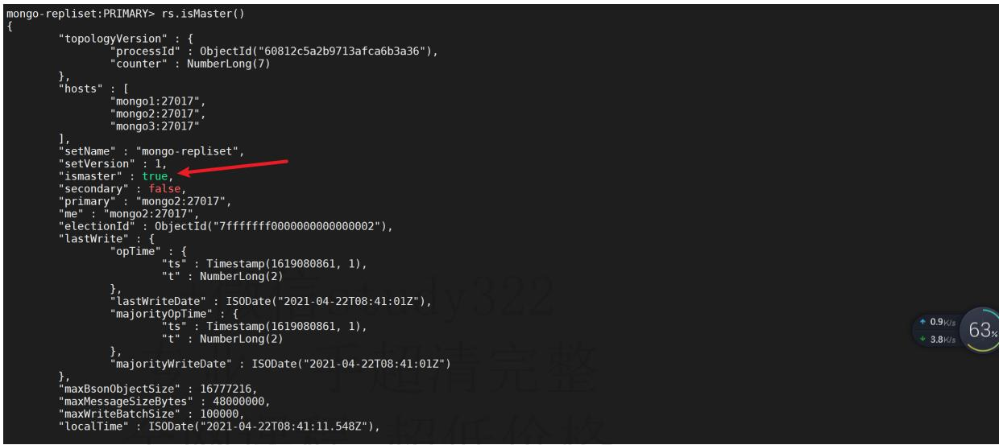


# 启动停止的节点


docker start mongo1


```txt
[root@localhost ~]# docker ps
CONTAINER ID    IMAGE    COMMAND    CREATED    STATUS    PORTS
NAMES
2e9b121eca71    mongo    "docker-entrypoint.s..."    42 minutes ago    Up 41 minutes    0.0.0.0:30003->27017/tcp, :::30003->27017/tcp
mongo3
398ac4ad716c    mongo    "docker-entrypoint.s..."    42 minutes ago    Up 42 minutes    0.0.0.0:30002->27017/tcp, :::30002->27017/tcp
mongo2
[root@localhost ~]# docker start mongol
mongo1
[root@localhost ~]# docker ps
CONTAINER ID    IMAGE    COMMAND    CREATED    STATUS    PORTS    NAMES
2e9b121eca71    mongo    "docker-entrypoint.s..."    45 minutes ago    Up 45 minutes    0.0.0.0:30003->27017/tcp, :::30003->27017/tcp
398ac4ad716c    mongo    "docker-entrypoint.s..."    45 minutes ago    Up 45 minutes    0.0.0.0:30002->27017/tcp, :::30002->27017/tcp
4499e189f7f1    mongo    "docker-entrypoint.s..."    45 minutes ago    Up 2 seconds    0.0.0.0:30001->27017/tcp, :::30001->27017/tcp
[root@localhost ~]# 
```

# 连接节点查看信息


mongo 127.0.0.1:30001


登录后我们发现已经变成了从节点


```txt
[root@localhost ~]# mongo 127.0.0.1:30001
MongoDB shell version v4.4.5
connecting to: mongodb://127.0.0.1:30001/test?compressors=disabled&gssapiServiceName=mongodb
Implicit session: session { "id" : UUID("b9a7a942-551e-4881-8296-59a56bc21d5c") }
MongoDB server version: 4.4.5

The server generated these startup warnings when booting:
2021-04-22T16:42:36.750+08:00: The configured WiredTiger cache size is more than 80% of available RAM. See http://dochub.mongodb.org/core/faq-memory-diagnostics-wt
2021-04-22T16:42:37.647+08:00: Access control is not enabled for the database. Read and write access to data and configuration is unrestricted
2021-04-22T16:42:37.648+08:00: /sys/kernel/mm/transparent_hugepage/enabled is 'always'. We suggest setting it to 'never'
2021-04-22T16:42:37.648+08:00: /sys/kernel/mm/transparent_hugepage/defrag is 'always'. We suggest setting it to 'never'

Enable MongoDB's free cloud-based monitoring service, which will then receive and display metrics about your deployment (disk utilization, CPU, operation statistics, etc).

The monitoring data will be available on a MongoDB website with a unique URL accessible to you and anyone you share the URL with. MongoDB may use this information to make product improvements and to suggest MongoDB products and deployment options to you.

To enable free monitoring, run the following command: db.enableFreeMonitoring()
To permanently disable this reminder, run the following command: db.disableFreeMonitoring()

mongo-replitset:SECONDARY> 
```

# 扩缩容

# 扩容节点


新增一个docker节点


```batch
docker run --net mongo-cluster \
--restart always --name mongo4 -p 30004:27017 \
-v /tmp/mongo/mongo4/data:/data/db \
-v /tmp/mongo/conf:/etc/mongo \
-v /etc/localtime:/etc/localtime \
-d mongo -f /etc/mongo/mongodb.conf 
```

```txt
[root@localhost ~]# docker run --net mongo-cluster \
> --restart always --name mongo4 -p 30004:27017 \
> -v /tmp/mongo/mongo4/data:/data/db \
> -v /tmp/mongo/conf:/etc/mongo \
> -v /etc/localtime:/etc/localtime \
> -d mongo -f /etc/mongo/mongodb.conf
f7a4d0f1eecd29818f4b9299904b74713740f93f2b470d2dd72dc0468a309679
[root@localhost ~]# docker ps
CONTAINER ID IMAGE COMMAND CREATED STATUS PORTS NAMES
f7a4d0f1eecd mongo "docker-entrypoint.s..." 4 seconds ago Up 2 seconds 0.0.0.0:30004->27017/tcp, ::30004->27017/tcp mongo4
2e9b12leca71 mongo "docker-entrypoint.s..." 57 minutes ago Up 57 minutes 0.0.0.0:30003->27017/tcp, ::30003->27017/tcp mongo3
398ac4ad716c mongo "docker-entrypoint.s..." 57 minutes ago Up 57 minutes 0.0.0.0:30002->27017/tcp, ::30002->27017/tcp mongo2
4499e189f7f1 mongo "docker-entrypoint.s..." 58 minutes ago Up 12 minutes 0.0.0.0:30001->27017/tcp, ::30001->27017/tcp mongo1
[root@localhost ~]# 
```

# 从主节点新增节点

```txt
rs.add("mongo4:27017") 
```

```txt
mongo-repliset:PRIMARY> rs.add("mongo4:27017")
{
    "ok": 1,
    "$clusterTime": {
    "clusterTime": Timestamp(1619081749, 1),
    "signature": {
    "hash": BinData(0,"AAAAAAAAAAAAAAAAAAAAAAA=
    "keyId": NumberLong(0)
    }
    },
    "operationTime": Timestamp(1619081749, 1)
}
mongo-repliset:PRIMARY> 
```

# 查看节点信息

```txt
rs.isMaster() 
```

```python
mongo-repliset:SECONDARY> rs.isMaster()
{
    "topologyVersion": {
    "processId": ObjectId("608139d70b4b32a66c866a2c"),
    "counter": NumberLong(3)
    },
    "hosts": [
    "mongo1:27017",
    "mongo2:27017",
    "mongo3:27017",
    "mongo4:27017"
    ],
    "setName": "mongo-repliset",
    "setVersion": 2,
    "ismaster": false,
    "secondary": true,
    "primary": "mongo2:27017",
    "me": "mongo4:27017",
    "lastWrite": {
    "opTime": {
    "ts": Timestamp(1619082121, 1),
    "t": NumberLong(2)
    },
    "lastWriteDate": ISODate("2021-04-22T09:02:01Z"),
    "majorityOpTime": {
    "ts": Timestamp(1619082121, 1),
    "t": NumberLong(2)
    },
    "majorityWriteDate": ISODate("2021-04-22T09:02:01Z")
    },
    "maxBsonObjectSize": 16777216,
    "maxMessageSizeBytes": 48000000,
    "maxWriteBatchSize": 100000,
    "localTime": ISODate("2021-04-22T09:02:07.040Z"), 
```

# 到新增的副本节点查看数据

```javascript
mongo 127.0.0.1:30004
use mytest;
db.setSecondaryOk()
db.blog.find().pretty(); 
```

# 我们发现数据已经同步过来了

```txt
mongo-repliset:SECONDARY> use mytest;
switched to db mytest
mongo-repliset:SECONDARY> db.setSecondaryOk()
mongo-repliset:SECONDARY> db.blog.find().pretty();
{
    "id": ObjectId("608134415791d5e8b8d7a3a9"),
    "title": "MongoDB 教程",
    "description": "MongoDB 是一个 NospL 数据库",
    "by": "我的博客",
    "url": "http://www.baiyp.ren",
    "tags": [
    "mongodb",
    "database",
    "NoSQL"
    ],
    "likes": 100
}
mongo-repliset:SECONDARY>
```

将我们刚才添加的模拟mongo4节点删除，在主节点执行以下命令

```txt
rs.remove("mongo4:27017") 
```

```txt
mongo-repliset:PRIMARY> rs.remove("mongo4:27017")
{
    "ok": 1,
    "$clusterTime": {
    "clusterTime": Timestamp(1619082309, 1),
    "signature": {
    "hash": BinData(0, "AAAAAAAAAAAAAAAAAAAAAAA="),
    "keyId": NumberLong(0)
    }
    },
    "operationTime": Timestamp(1619082309, 1)
}
mongo-repliset:PRIMARY> 
```

# 查看节点信息

```txt
rs.isMaster() 
```

```python
mongo-repliset:PRIMARY> rs.isMaster()
{
    "topologyVersion": {
    "processId": ObjectId("60812c5a2b9713afca6b3a36"),
    "counter": NumberLong(9)
    },
    "hosts": [
    "mongo1:27017",
    "mongo2:27017",
    "mongo3:27017"
    ],
    "setName": "mongo-repliset",
    "setVersion": 3,
    "ismaster": true,
    "secondary": false,
    "primary": "mongo2:27017",
    "me": "mongo2:27017",
    "electionId": ObjectId("7ffffff0000000000000002"),
    "lastWrite": {
    "opTime": {
    "ts": Timestamp(1619082341, 1),
    "t": NumberLong(2)
    },
    "lastWriteDate": ISODate("2021-04-22T09:05:41Z"),
    "majorityOpTime": {
    "ts": Timestamp(1619082341, 1),
    "t": NumberLong(2)
    },
    "majorityWriteDate": ISODate("2021-04-22T09:05:41Z")
    },
    "maxBsonObjectSize": 16777216,
    "maxMessageSizeBytes": 48000000,
    "maxWriteBatchSize": 100000,
    "localTime": ISODate("2021-04-22T09:05:50.985Z"), 
```

# MongoDB分片搭建

分片（sharding）是MongoDB用来将大型集合分割到不同服务器（或者说一个集群）上所采用的方法。尽管分片起源于关系型数据库分区，但MongoDB分片完全又是另一回事。

和MySQL分区方案相比，MongoDB的最大区别在于它几乎能自动完成所有事情，只要告诉MongoDB要分配数据，它就能自动维护数据在不同服务器之间的均衡。

# 分片介绍

# 分片的目的

高数据量和吞吐量的数据库应用会对单机的性能造成较大压力,大的查询量会将单机的CPU耗尽,大的数据量对单机的存储压力较大,最终会耗尽系统的内存而将压力转移到磁盘IO上。

为了解决这些问题,有两个基本的方法: 垂直扩展和水平扩展。

垂直扩展：增加更多的CPU和存储资源来扩展容量。

水平扩展：将数据集分布在多个服务器上。水平扩展即分片。

# 分片设计思想

分片为应对高吞吐量与大数据量提供了方法。使用分片减少了每个分片需要处理的请求数，因此，通过水平扩展，集群可以提高自己的存储容量和吞吐量。举例来说，当插入一条数据时，应用只需要访问存储这条数据的分片.

使用分片减少了每个分片存储的数据。

例如，如果数据库1tb的数据集，并有4个分片，然后每个分片可能仅持有256 GB的数据。如果有40个分片，那么每个分片可能只有25GB的数据。

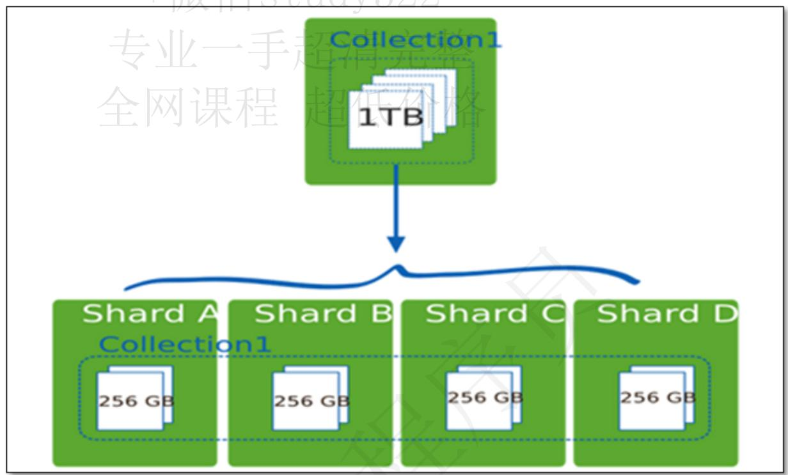


# 分片机制的优势

分片机制提供了如下三种优势

# 自动路由

对集群进行抽象，让集群“不可见”

MongoDB自带了一个叫做mongos的专有路由进程。mongos就是掌握统一入口的路由器，其会将客户端发来的请求准确无误的路由到集群中的一个或者一组服务器上，同时会把接收到的响应拼装起来发回到客户端。

# 保证高可用

保证集群总是可读写

MongoDB通过多种途径来确保集群的可用性和可靠性。将MongoDB的分片和复制功能结合使用，在确保数据分片到多台服务器的同时，也确保了每份数据都有相应的备份，这样就可以确保有服务器挂掉时，其他的从库可以立即接替坏掉的部分继续工作。

# 易于扩展

使集群易于扩展

当系统需要更多的空间和资源的时候，MongoDB使我们可以按需方便的扩充系统容量。


分片架构


<table><tr><td>组件</td><td>说明</td></tr><tr><td>Config Server</td><td>存储集群所有节点、分片数据路由信息。默认需要配置3个Config Server节点。</td></tr><tr><td>Mongos</td><td>提供对外应用访问,所有操作均通过mongos执行。一般有多个mongos节点。数据迁移和数据自动平衡。</td></tr><tr><td>Mongod</td><td>存储应用数据记录。一般有多个Mongod节点,达到数据分片目的</td></tr></table>

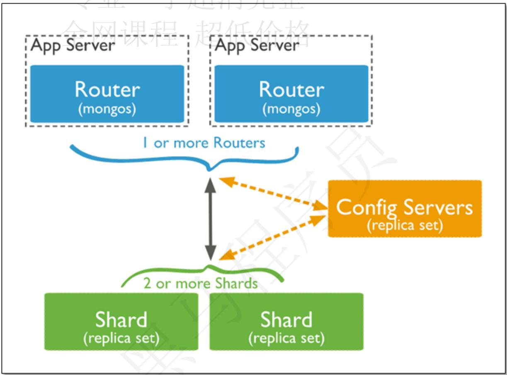


# 分片集群的构造

mongos 

数据路由，和客户端打交道的模块。mongos本身没有任何数据，他也不知道该怎么处理数据，去找config server

Mongos本身并不持久化数据，Sharded cluster所有的元数据都会存储到Config Server，而用户的数据会分散存储到各个shard。Mongos启动后，会从配置服务器加载元数据，开始提供服务，将用户的请求正确路由到对应的分片。

config server 

所有存、取数据的方式，所有shard节点的信息，分片功能的一些配置信息。可以理解为真实数据的元数据。

真正的数据存储位置，以chunk块为单位存数据。

# Mongos的路由功能

当数据写入时，MongoDB Cluster根据分片键设计写入数据。

当外部语句发起数据查询时，MongoDB根据数据分布自动路由至指定节点返回数据。

# 集群中数据分布

# Chunk是什么

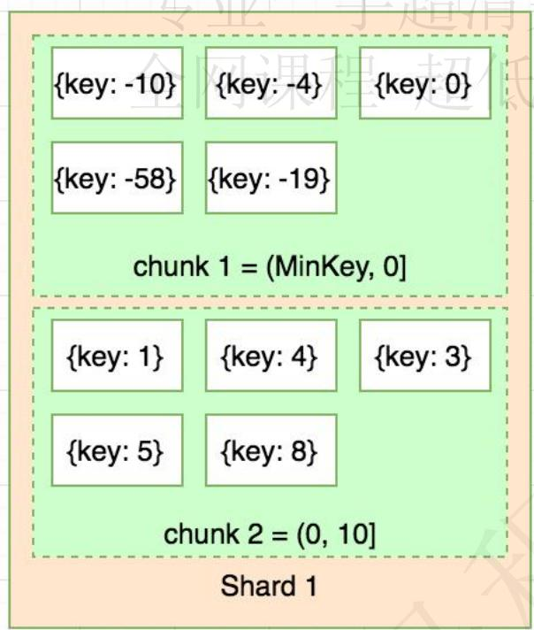


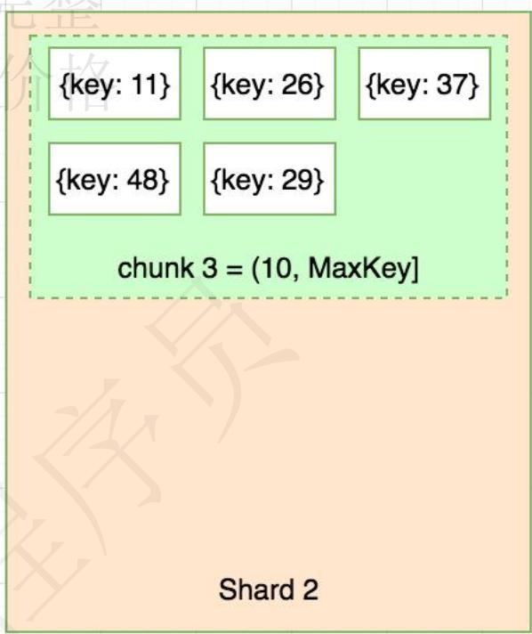


在一个shard server内部，MongoDB还是会把数据分为chunks，每个chunk代表这个shard server内部一部分数据，chunk的产生，会有以下两个用途：

Splitting：当一个chunk的大小超过配置中的chunk size时，MongoDB的后台进程会把这个chunk切分成更小的chunk，从而避免chunk过大的情况

Balancing：在MongoDB中，balancer是一个后台进程，负责chunk的迁移，从而均衡各个shardserver的负载，系统初始1个chunk，chunk size默认值64M,生产库上选择适合业务的chunk size是最好的。mongoDB会自动拆分和迁移chunks。

# chunk的特点

使用chunk来存储数据

集群搭建完成之后，默认开启一个chunk，大小是64M，

存储需求超过64M，chunk会进行分裂，如果单位时间存储需求很大，设置更大的chunk

chunk会被自动均衡迁移。

# chunksize的选择

适合业务的chunksize是最好的。

chunk的分裂和迁移非常消耗IO资源；chunk分裂的时机：在插入和更新，读数据不会分裂。

小的chunksize：数据均衡时迁移速度快，数据分布更均匀，数据分裂频繁，路由节点消耗更多资源。

大的chunksize：数据分裂少。数据块移动集中消耗IO资源，通常100-200M

随着数据的增长，其中的数据大小超过了配置的chunk size，默认是64M，则这个chunk就会分裂成两个。数据的增长会让chunk分裂得越来越多。

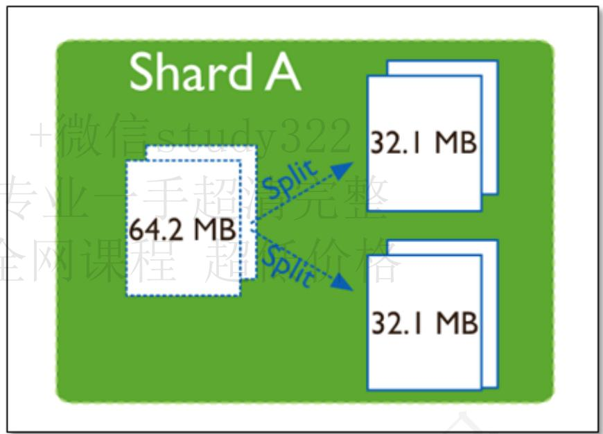


这时候，各个shard 上的chunk数量就会不平衡。mongos中的一个组件balancer 就会执行自动平衡。把chunk从chunk数量最多的shard节点挪动到数量最少的节点。

# chunkSize对分裂及迁移的影响

MongoDB 默认的 chunkSize 为64MB，如无特殊需求，建议保持默认值；chunkSize 会直接影响到 chunk 分裂、迁移的行为。

chunkSize 越小，chunk 分裂及迁移越多，数据分布越均衡；反之，chunkSize 越大，chunk 分裂及迁移会更少，但可能导致数据分布不均。

chunkSize 太小，容易出现 jumbo chunk（即shardKey 的某个取值出现频率很高，这些文档只能放到一个 chunk 里，无法再分裂）而无法迁移；chunkSize 越大，则可能出现 chunk 内文档数太多（chunk 内文档数不能超过 250000 ）而无法迁移。

chunk 自动分裂只会在数据写入时触发，所以如果将 chunkSize 改小，系统需要一定的时间来将chunk 分裂到指定的大小。

chunk 只会分裂，不会合并，所以即使将 chunkSize 改大，现有的 chunk 数量不会减少，但chunk 大小会随着写入不断增长，直到达到目标大小。

# 数据分片

分片键shard key

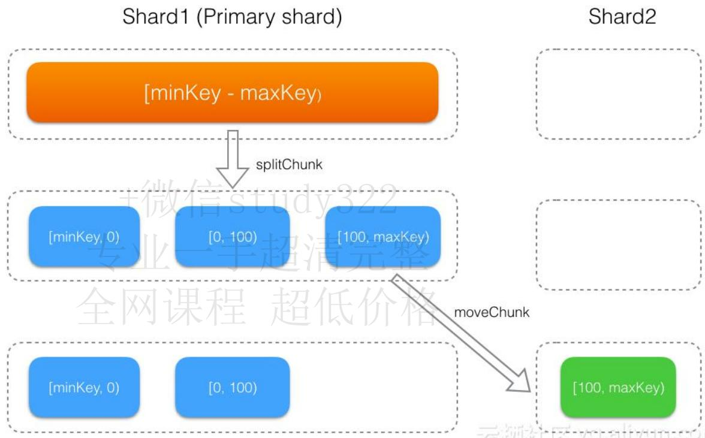


MongoDB中数据的分片是、以集合为基本单位的，集合中的数据通过片键（Shard key）被分成多部分。其实片键就是在集合中选一个键，用该键的值作为数据拆分的依据。

所以一个好的片键对分片至关重要。分片键必须是一个索引，通过sh.shardCollection会自动创建索引（前提是此集合不存在的情况下）。一个自增的分片键对写入和数据均匀分布就不是很好，因为自增的片键总会在一个分片上写入，后续达到某个阀值可能会写到别的分片。但是按照片键查询会非常高效。

随机片键对数据的均匀分布效果很好。注意尽量避免在多个分片上进行查询。在所有分片上查询，mongos会对结果进行归并排序。

对集合进行分片时，你需要选择一个片键，片键是每条记录都必须包含的，且建立了索引的单个字段或复合字段，MongoDB按照片键将数据划分到不同的数据块中，并将数据块均衡地分布到所有分片中。

为了按照片键划分数据块，MongoDB使用基于范围的分片方式或者 基于哈希的分片方式。

# 注意事项

分片键一经设置，不可修改，不可删除。

执行了数据分片操作后，均衡器会对满足条件的数据进行拆分，这将占用实例的资源，请在业务低峰期操作

分片键必须有索引。

分片键大小限制512bytes。

分片键用于路由查询。

MongoDB不接受已进行collection级分片的collection上插入分片

分片键不支持空值插入

# 分片键分类

# 范围分片

MongoDB按照片键的值的范围将数据拆分为不同的块（chunk），每个块包含了一段范围内的数据。

Sharded Cluster支持将单个集合的数据分散存储在多个shard上，用户可以指定根据集合内文档的某个字段即shard key来进行范围分片（range sharding）。

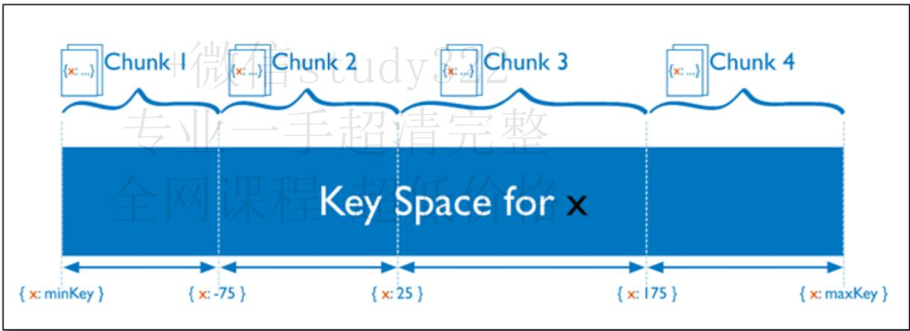


对于基于范围的分片，MongoDB按照片键的范围把数据分成不同部分。

优点： mongos可以快速定位请求需要的数据，并将请求转发到相应的Shard节点中。

缺点： 可能导致数据在Shard节点上分布不均衡，容易造成读写热点，且不具备写分散性。

# 哈希分片

MongoDB计算单个字段的哈希值作为索引值，并以哈希值的范围将数据拆分为不同的块。

分片过程中利用哈希索引作为分片的单个键，且哈希分片的片键只能使用一个字段，而基于哈希片键最大的好处就是保证数据在各个节点分布基本均匀。


对于基于哈希的分片，MongoDB计算一个字段的哈希值，并用这个哈希值来创建数据块。在使用基于哈希分片的系统中，拥有”相近”片键的文档很可能不会存储在同一个数据块中，因此数据的分离性更好一些。

Hash分片与范围分片互补，能将文档随机的分散到各个chunk，充分的扩展写能力，弥补了范围分片的不足，但不能高效的服务范围查询，所有的范围查询要分发到后端所有的Shard才能找出满足条件的文档。

优点：可以将数据更加均衡地分布在各Shard节点中，具备写分散性。

缺点：不适合进行范围查询，进行范围查询时，需要将读请求分发到所有的Shard节点。

# 什么情况下使用分片

当您遇到如下两个问题时，您可以使用Sharded cluster来解决您的问题：

存储容量受单机限制，即磁盘资源遭遇瓶颈。

读写能力受单机限制，可能是CPU、内存或者网卡等资源遭遇瓶颈，导致读写能力无法扩展。

# 如何确定容量

当需要决定使用Sharded cluster时，到底应该部署多少个shard、多少个mongos？shard、mongos的数量归根结底是由应用需求决定：+微信study322

# 存储型

如果您使用sharding只是解决海量数据存储问题，访问并不多。

假设单个shard能存储M(1G)， 需要的存储总量是N(75G)，那么您可以按照如下公式来计算实际需要的shard、mongos数量：

numberOfShards = N/M/0.75 （假设容量水位线为75%）

numberOfMongos = 2+（对访问要求不高，至少部署2个mongos做高可用即可）

# 计算型

如果您使用sharding是解决高并发写入（或读取）数据的问题，总的数据量其实很小。

您要部署的shard、mongos要满足读写性能需求，容量上则不是考量的重点。假设单个shard最大QPS（Query Per Second）为M，单个mongos最大QPS为Ms，需要总的QPS为Q。那么您可以按照如下公式来计算实际需要的shard、mongos数量：

numberOfShards = Q/M/0.75 （假设负载水位线为75%）

numberOfMongos = Q/Ms/0.75 

# 如何选择shard key

如果sharding要同时解决上述2个问题，则按需求更高的指标来预估。以上估算是基于shardedcluster里数据及请求都均匀分布的理想情况。但实际情况下，分布可能并不均衡，为了让系统的负载分布尽量均匀，就需要合理的选择shard key。

# 分片类型

MongoDB Sharded cluster支持2种分片方式：

范围分片，通常能很好的支持基于shard key的范围查询。

Hash 分片，通常能将写入均衡分布到各个shard。

# 问题

上述2种分片策略都无法解决以下3个问题：

shard key取值范围太小（low cardinality），比如将数据中心作为shard key，而数据中心通常不会很多，分片的效果肯定不好。

shard key某个值的文档特别多，这样导致单个chunk特别大（及 jumbo chunk），会影响chunk迁移及负载均衡。

根据非shardkey进行查询、更新操作都会变成scatter-gather查询，影响效率。

好的shard key应该拥有如下特性：

key分布足够离散（sufficient cardinality）

写请求均匀分布（evenly distributed write）

尽量避免scatter-gather查询（targeted read）

# 数据分片

# 分片案例

我们要对我们的Blog数据进行分片，假如数据量是百万以及千万级别的数据专业一手超清完整

```json
{
    "title": "张三的文章",
    "by": "李四",
    "url": "http://www.baidu.com",
    "tags": [
    "语文",
    "数学"
    ],
    "likes": 10000
}
```

# 分片方案

likes范围分片

likes作为shard key，范围分片

新的写入都是连续的likes，都会请求到同一个shard，写分布不均。

根据by的查询会分散到所有shard上查询，效率低。

likes哈希分片

写入能均分到多个shard。

根据 by 的查询会分散到所有shard上查询，效率低。

by哈希分片

by作为shardKey，hash分片（如果ID没有明显的规则，范围分片也一样）

写入能均分到多个shard。

同一个by对应的数据无法进一步细分，只能分散到同一个chunk，会造成jumbo chunk根据by的查询只请求到单个shard。不足的是，请求路由到单个shard后，根据likes的范围查询需要全表扫描并排序。

# 组合分片

(by，likes）组合起来作为shardKey，范围分片（Better)

写入能均分到多个shard。

同一个by的数据能根据likes进一步分散到多个chunk。

根据likes查询时间范围的数据，能直接利用（by，likes）复合索引来完成。

# 开启分片

上面我们已经搭建好了三个分片集群了，但是mongos不知道该如何切分数据，也就是我们先前所说的片键，在mongodb中设置片键要做两步

# 开启数据库分片

开启数据库分片功能，命令很简单 enablesharding(),这里我就开启test数据库。


# 对集合所在的数据库启用分片功能


```txt
sh.enableSharding("test") 
```

```txt
mongos> sh.enableSharding("test")
{
    "ok": 1,
    "operationTime": Timestamp(1619597592, 3),
    "$clusterTime": {
    "clusterTime": Timestamp(1619597592, 3),
    "signature": {
    "hash": BinData(0, "ZB1Isb82TZNULTnd3h9ka0hcxJg="),
    "keyId": NumberLong("6956100243435814933")
    }
    }
}
mongos> 
```

# 对片键的字段建立索引

分片键必须要有索引才可以，并且一个集合只能有一个分片健；

```javascript
db.blog.createIndex({title:1})
db.blog.createIndex({"by":"hashed","likes":1})
db.blog.getIndexes() 
```

因为我们要对by分片，索引需要对likes字段做升序索引

```javascript
mongos> db.blog.createIndex({ "by":"hashed","likes":1})
{
    "raw" : {
    "shard2/shard2-server1:27017,shard2-server2:27017,shard2-server3:27017" : {
    "createdCollectionAutomatically" : false,
    "numIndexesBefore" : 1,
    "numIndexesAfter" : 2,
    "commitQuorum" : "votingMembers",
    "ok" : 1
    }
    },
    "ok" : 1,
    "operationTime" : Timestamp(1619598123, 6),
    "$clusterTime" : {
    "clusterTime" : Timestamp(1619598123, 6),
    "signature" : {
    "hash" : BinData(0,"pQchjR5aJiEutEE/e5kbiuiOWJA="),
    "keyId" : NumberLong("6956100243435814933")
    }
    }
}
mongos> db.blog.getIndexes()
{
    {
    "v" : 2,
    "key" : {
    "_id" : 1
    },
    "name" : "_id_"
    },
    {
    "v" : 2,
    "key" : {
    "by" : "hashed", 
```

# 指定分片键

使用如下命令可以指定分片键

```javascript
sh.shardCollection("<database>.<collection>", { "<key>":<value> } ) 
```

# 说明

<database>：数据库名。

<collection>：集合名。

<key>：分片的键，MongoDB将根据片键的值进行数据分片。

. <value> 

1：表示基于范围分片，通常能很好地支持基于片键的范围查询。

“hashed”：表示基于哈希分片，通常能将写入均衡分布到各Shard节点中

指定集合中分片的片键，并且指定使用哈希分片和范围分片

```javascript
sh.shardCollection("test.blog", {"by":"hashed","likes":1}) 
```

```xml
mongos> sh.shardCollection("test.blog", {"by":"hashed","likes":1})
{
    "collectionsharded": "test.blog",
    "collectionUUID": UUID("a1b1acbc-94b5-469a-a55c-69584740a322"),
    "ok": 1,
    "operationTime": Timestamp(1619598158, 6),
    "$clusterTime": {
    "clusterTime": Timestamp(1619598158, 6),
    "signature": {
    "hash": BinData(0,"HSU/kRoIwax8qf9Z2RiRuAHPJuM="),
    "keyId": NumberLong("6956100243435814933")
    }
    }
}
mongos> 
```

# 查看分片状态


sh.status()


```yaml
{
    "_id": "shard3", "host": "shard3/shard3-server1:27017,shard3-server2:27017", "state": 1}
active mongoes:
    "4.4.5": 3
autosplit:
    Currently enabled: yes
balancer:
    Currently enabled: yes
    Currently running: no
    Failed balancer rounds in last 5 attempts: 0
    Migration Results for the last 24 hours:
    682 : Success
    1 : Failed with error 'aborted', from shard1 to shard2
databases:
    {
    "_id": "config", "primary": "config", "partitioned": true
    config.system.sessions
    shard key: { "_id": 1 }
    unique: false
    balancing: true
    chunks:
    shard1 342
    shard2 341
    shard3 341
    too many chunks to print, use verbose if you want to force print
    {
    "_id": "test", "primary": "shard2", "partitioned": true, "version": { "uuid": UUID("fea4d1bd-2d92-439d-b392-f2d66e6ea046"), "lastMod" : 1 } }
    test.blog
    shard key: { "by": "hashed", "likes": 1 }
    unique: false
    balancing: true
    chunks:
    shard2 1
    { "by": { "$minKey": 1 }, "likes": { "$minKey": 1 } } --> { "by": { "$maxKey": 1 }, "likes": { "$maxKey": 1 } } on : shard2 Timestamp(1, 0)
mongos> 
```

# 查看数据分布

通过该命令可以查看数据的分布

```java
db.blog.getShardDistribution(); #可以查看数据分布
```

mongos> db.blog.getShardDistribution();  
Shard shard2 at shard2/shard2-server1:27017, shard2-server2:27017  
data : 24.79MiB docs : 131610 chunks : 1  
estimated data per chunk : 24.79MiB  
estimated docs per chunk : 131610  
Totals  
data : 24.79MiB docs : 131610 chunks : 1  
Shard shard2 contains $100\%$ data, $100\%$ docs in cluster, avg obj size on shard : 197B 

我们发现现在是没有分片的，数据只在一个分片中

# 插入数据

我们对blog中设置分片键后，我们需要大量插入数据进行测试，我们插入十万条数据


调用Controller插入数据


```java
@RequestMapping(~/batchAdd")
public void batchAdd() {
    for (int i = 0; i < 10000000; i++) {
    blogDao.insert(getBlog(i));
    }
}

public Blog getBlog(int i) {
    Blog blog = new Blog();
    blog.setTitle("随机文章" + i);
    blog Shelby(names[r.nextInt( bound: names.length - 1)]);
    blog.setLikes(r.nextInt( bound: 10000));
    List<String> tags = new ArrayList<String>() {{ add("语文"); add("数学"); add("英语"); }};
    blog.setTags(tags); blog.setUrl("http://www.baidu.com"); return blog;
}
```

```txt
http://localhost:8080/blog/batchAdd 
```

# 查看分片情况

查看分片状态

```txt
sh.status() 
```


我们发现负载均衡正在运行


```yaml
mongos> sh.status()
--- Sharding Status ---
    sharding version: {
    "_id": 1,
    "minCompatibleVersion": 5,
    "currentVersion": 6,
    "clusterId": ObjectId("60890851c180263a140c1f0c")
    }
    shards:
    { "_id": "shard1", "host": "shard1/shard1-server1:27017,shard1-server2:27017", "state": 1}
    { "_id": "shard2", "host": "shard2/shard2-server1:27017,shard2-server2:27017", "state": 1}
    { "_id": "shard3", "host": "shard3/shard3-server1:27017,shard3-server2:27017", "state": 1}
    active mongoses:
    "4.4.5": 3
    autosplit:
    Currently enabled: yes
    balancer:
    Currently enabled: yes
    Currently running: yes
    Collections with active migrations:
    test.blog started at Wed Apr 28 2021 17:06:51 GMT+0800 (CST)
    Failed balancer rounds in last 5 attempts: 0
    Migration Results for the last 24 hours:
    685 : Success
    1 : Failed with error 'aborted', from shard1 to shard2
    databases:
    { "_id": "config", "primary": "config", "partitioned": true }
    config.system.sessions
    shard key: { "_id": 1 }
    unique: false
    balancing: true
    chunks:
    shard1 342
    shard2 341 
```

下面是具体分片的信息

```yaml
databases:
    { "_id" : "config", "primary" : "config", "partitioned" : true }
    config.system.sessions
    shard key: { "_id" : 1 }
    unique: false
    balancing: true
    chunks:
    shard1 342
    shard2 341
    shard3 341
    too many chunks to print, use verbose if you want to force print
    { "_id" : "test", "primary" : "shard2", "partitioned" : true, "version" : { "uuid" : UUID("fea4d1bd-2d92-439d-b392-f2d66e6ea046"), "lastMod" : 1 } }
    test.blog
    shard key: { "by" : "hashed", "likes" : 1 }
    unique: false
    balancing: true
    chunks:
    shard1 3
    shard2 1
    shard3 2
    { "by" : { "$minKey" : 1 }, "likes" : { "$minKey" : 1 } } --> { "by" : NumberLong("-4581349587371747453"), "likes" : 1924 } on :
    shard1 Timestamp(4, 2) { "by" : NumberLong("-4581349587371747453"), "likes" : 1924 } --> { "by" : NumberLong("-4581349587371747453"), "likes" : 2148 } on :
    shard1 Timestamp(4, 3) { "by" : NumberLong("-4581349587371747453"), "likes" : 2148 } --> { "by" : NumberLong("-1850026574102736967"), "likes" : 4145 } on :
    shard3 Timestamp(4, 1) { "by" : NumberLong("-1850026574102736967)", "likes" : 4145 } --> { "by" : NumberLong("-1693192022260240884"), "likes" : 4970 } on :
    shard3 Timestamp(3, 4) { "by" : NumberLong("-1693192022260240884)", "likes" : 4970 } --> { "by" : NumberLong("8705251532973802502"), "likes" : 9658 } on :
    shard1 Timestamp(3, 0) { "by" : NumberLong("8705251532973802502"), "likes" : 9658 } --> { "by" : { "$maxKey" : 1 }, "likes" : { "$maxKey" : 1 } } on :
    shard2 Timestamp(3, 1) mongos> 
```

# 查看分片分布情况


db.blog.getShardDistribution()


```txt
mongos> db.blog.getShardDistribution();

Shard shard1 at shard1/shard1-server1:27017, shard1-server2:27017
data : 108.49MiB docs : 573314 chunks : 2
estimated data per chunk : 54.24MiB
estimated docs per chunk : 286657

Shard shard3 at shard3/shard3-server1:27017, shard3-server2:27017
data : 73.15MiB docs : 386345 chunks : 2
estimated data per chunk : 36.57MiB
estimated docs per chunk : 193172

Shard shard2 at shard2/shard2-server1:27017, shard2-server2:27017
data : 33.91MiB docs : 179426 chunks : 2
estimated data per chunk : 16.95MiB
estimated docs per chunk : 89713

Totals
data : 215.57MiB docs : 1139085 chunks : 6
Shard shard1 contains 50.33% data, 50.33% docs in cluster, avg obj size on shard : 198B
Shard shard3 contains 33.93% data, 33.91% docs in cluster, avg obj size on shard : 198B
Shard shard2 contains 15.73% data, 15.75% docs in cluster, avg obj size on shard : 198B

mongos> 
```

# 扩缩容

# 扩容

# 准备工作

# 创建挂载目录


我们先创建挂载目录


```shell
# 创建配置文件目录
mkdir -p /tmp/mongo-cluster/shard4-server/conf
# 创建数据文件目录
mkdir -p /tmp/mongo-cluster/shard4-server/data/{1..3}
# 创建日志文件目录
mkdir -p /tmp/mongo-cluster/shard4-server/logs/{1..3}
```

```shell
[root@localhost mongo-cluster]# mkdir -p /tmp/mongo-cluster/shard4-server/conf
[root@localhost mongo-cluster]# mkdir -p /tmp/mongo-cluster/shard4-server/data/{1..3}
[root@localhost mongo-cluster]# mkdir -p /tmp/mongo-cluster/shard4-server/logs/{1..3}
[root@localhost mongo-cluster]# 1 
```

# 创建密钥文件

因为集群只需要一个密钥文件，我们可以将config-server中的密钥文件复制过来

```txt
cp /tmp/mongo-cluster/config-server/conf/mongo.key /tmp/mongo-cluster/shard4-server/conf/ 
```

```txt
[root@localhost mongo-cluster]# cp /tmp/mongo-cluster/config-server/conf/mongo.key /tmp/mongo-cluster/shard4-server/conf/
[root@localhost mongo-cluster]# ls /tmp/mongo-cluster/shard4-server/conf/
mongo.key
[root@localhost mongo-cluster]# 
```

# 配置配置文件

因为有多个容器，配置文件是一样的，我们只需要创建一个配置文件，其他的容器统一读取该配置文件即可

```yaml
echo "
# 日志文件
storage:
    # mongod 进程存储数据目录，此配置仅对 mongod 进程有效
    dbPath: /data/db
systemLog:
    destination: file
    logAppend: true
    path: /data/logs/mongo.log
```


网络设置


```yaml
net:
    port: 27017 #端口号
# bindIp: 127.0.0.1 #绑定ip
replication:
    replSetName: shard4 #复制集名称是 shard2
sharding:
    clusterRole: shardsvr # 集群角色，这里配置的角色是分片节点
security:
    authorization: enabled #是否开启认证
    keyFile: /data/configdb/conf/mongo.key #keyFile路径
" > /tmp/mongo-cluster/shard4-server/conf/mongo.conf
```

```yaml
[root@localhost mongo-cluster]# echo "
> # 日志文件
> storage:
    # mongod 进程存储数据目录，此配置仅对 mongod 进程有效
> dbPath: /data/db
> systemctlLog:
> destination: file
> logAppend: true
> path: /data/logs/mongo.log
>
> # 网络设置
sharding:
    clusterRole: shardsvr # 集群角色，这里配置的角色是分片节点
security:
    authorization: enabled #是否开启认证
> net:
    port: 27017 #端口号
> # bindIp: 127.0.0.1 #绑定ip
> replication:
    replSetName: shard4 #复制集名称是 shard2
> sharding:
    clusterRole: shardsvr # 集群角色，这里配置的角色是分片节点
> security:
    authorization: enabled #是否开启认证
> keyFile: /data/configdb/conf/mongo.key #keyFile路径
> " > /tmp/mongo-cluster/shard4-server/conf/mongo.conf
[root@localhost mongo-cluster]#
```

# 启动新分片

# 增加分片节点

增加shard4-server节点

```yaml
version: '2'
services:
    config-server1:
    image: mongo
    container_name: config-server1
    privileged: true
    networks:
    - mongo-cluster-network 
```

```yaml
command: --config /data/configdb/conf/mongo.conf
volumes:
- /etc/localtime:/etc/localtime
- /tmp/mongo-cluster/config-server:/data/configdb
- /tmp/mongo-cluster/config-server/data/1:/data/db
- /tmp/mongo-cluster/config-server/logs/1:/data/logs 
```

```yaml
config-server2:
    image: mongo
    container_name: config-server2
    privileged: true
    networks:
    - mongo-cluster-network
    command: --config /data/configdb/conf/mongo.conf
    volumes:
    - /etc/localtime:/etc/localtime
    - /tmp/mongo-cluster/config-server:/data/configdb
    - /tmp/mongo-cluster/config-server/data/2:/data/db
    - /tmp/mongo-cluster/config-server/logs/2:/data/logs 
```

```yaml
config-server3:
    image: mongo
    container_name: config-server3
    privileged: true
    networks:
    - mongo-cluster-network
    command: --config /data/configdb/conf/mongo.conf
    volumes:
    - /etc/localtime:/etc/localtime
    - /tmp/mongo-cluster/config-server:/data/configdb
    - /tmp/mongo-cluster/config-server/data/3:/data/db
    - /tmp/mongo-cluster/config-server/logs/3:/data/logs 
```

```yaml
shard1-server1:
    image: mongo
    container_name: shard1-server1
    privileged: true
    networks:
    - mongo-cluster-network
    command: --config /data/configdb/conf/mongo.conf
    volumes:
    - /etc/localtime:/etc/localtime
    - /tmp/mongo-cluster/shard1-server:/data/configdb
    - /tmp/mongo-cluster/shard1-server/data/1:/data/db
    - /tmp/mongo-cluster/shard1-server/logs/1:/data/logs 
```

```yaml
shard1-server2:
    image: mongo
    container_name: shard1-server2
    privileged: true
    networks:
    - mongo-cluster-network
    command: --config /data/configdb/conf/mongo.conf
    volumes:
    - /etc/localtime:/etc/localtime
    - /tmp/mongo-cluster/shard1-server:/data/configdb
    - /tmp/mongo-cluster/shard1-server/data/2:/data/db
    - /tmp/mongo-cluster/shard1-server/logs/2:/data/logs 
```

```yaml
shard1-server3:
    image: mongo
    container_name: shard1-server3
    privileged: true
    networks:
    - mongo-cluster-network
    command: --config /data/configdb/conf/mongo.conf
    volumes:
    - /etc/localtime:/etc/localtime
    - /tmp/mongo-cluster/shard1-server:/data/configdb
    - /tmp/mongo-cluster/shard1-server/data/3:/data/db
    - /tmp/mongo-cluster/shard1-server/logs/3:/data/logs 
```

```yaml
shard2-server1:
image: mongo
container_name: shard2-server1
privileged: true
networks:
- mongo-cluster-network
command: --config /data/configdb/conf/mongo.conf
volumes:
- /etc/localtime:/etc/localtime
- /tmp/mongo-cluster/shard2-server:/data/configdb
- /tmp/mongo-cluster/shard2-server/data/1:/data/db
- /tmp/mongo-cluster/shard2-server/logs/1:/data/logs 
```

```yaml
shard2-server2:
    image: mongo
    container_name: shard2-server2
    privileged: true
    networks:
    - mongo-cluster-network
    command: --config /data/configdb/conf/mongo.conf
    volumes:
    - /etc/localtime:/etc/localtime
    - /tmp/mongo-cluster/shard2-server:/data/configdb
    - /tmp/mongo-cluster/shard2-server/data/2:/data/db
    - /tmp/mongo-cluster/shard2-server/logs/2:/data/logs 
```

```yaml
shard2-server3:
image: mongo
container_name: shard2-server3
privileged: true
networks:
- mongo-cluster-network
command: --config /data/configdb/conf/mongo.conf
volumes:
- /etc/localtime:/etc/localtime
- /tmp/mongo-cluster/shard2-server:/data/configdb
- /tmp/mongo-cluster/shard2-server/data/3:/data/db
- /tmp/mongo-cluster/shard2-server/logs/3:/data/logs 
```

```yaml
shard3-server1:
image: mongo
container_name: shard3-server1
privileged: true
networks: 
```

```yaml
- mongo-cluster-network
command: --config /data/configdb/conf/mongo.conf
volumes:
- /etc/localtime:/etc/localtime
- /tmp/mongo-cluster/shard3-server:/data/configdb
- /tmp/mongo-cluster/shard3-server/data/1:/data/db
- /tmp/mongo-cluster/shard3-server/logs/1:/data/logs 
```

```yaml
shard3-server2:
    image: mongo
    container_name: shard3-server2
    privileged: true
    networks:
    - mongo-cluster-network
    command: --config /data/configdb/conf/mongo.conf
    volumes:
    - /etc/localtime:/etc/localtime
    - /tmp/mongo-cluster/shard3-server:/data/configdb
    - /tmp/mongo-cluster/shard3-server/data/2:/data/db
    - /tmp/mongo-cluster/shard3-server/logs/2:/data/logs 
```

```yaml
shard3-server3:
image: mongo
container_name: shard3-server3
privileged: true
networks:
- mongo-cluster-network
command: --config /data/configdb/conf/mongo.conf
volumes:
- /etc/localtime:/etc/localtime
- /tmp/mongo-cluster/shard3-server:/data/configdb
- /tmp/mongo-cluster/shard3-server/data/3:/data/db
- /tmp/mongo-cluster/shard3-server/logs/3:/data/logs 
```

```yaml
shard4-server1:
    image: mongo
    container_name: shard4-server1
    privileged: true
    networks:
    - mongo-cluster-network
    command: --config /data/configdb/conf/mongo.conf
    volumes:
    - /etc/localtime:/etc/localtime
    - /tmp/mongo-cluster/shard4-server:/data/configdb
    - /tmp/mongo-cluster/shard4-server/data/1:/data/db
    - /tmp/mongo-cluster/shard4-server/logs/1:/data/logs 
```

```yaml
shard4-server2:
image: mongo
container_name: shard4-server2
privileged: true
networks:
- mongo-cluster-network
command: --config /data/configdb/conf/mongo.conf
volumes:
- /etc/localtime:/etc/localtime
- /tmp/mongo-cluster/shard4-server:/data/configdb
- /tmp/mongo-cluster/shard4-server/data/2:/data/db 
```

- /tmp/mongo-cluster/shard4-server/logs/2:/data/logs 

```yaml
shard4-server3:
image: mongo
container_name: shard4-server3
privileged: true
networks:
- mongo-cluster-network
command: --config /data/configdb/conf/mongo.conf
volumes:
- /etc/localtime:/etc/localtime
- /tmp/mongo-cluster/shard4-server:/data/configdb
- /tmp/mongo-cluster/shard4-server/data/3:/data/db
- /tmp/mongo-cluster/shard4-server/logs/3:/data/logs 
```

```yaml
mongos-server1:
    image: mongo
    container_name: mongos-server1
    privileged: true
    entrypoint: "mongos"
    networks:
    - mongo-cluster-network
    ports:
    - "30001:27017"
    volumes:
    - /etc/localtime:/etc/localtime
    - /tmp/mongo-cluster/mongos-server:/data/configdb
    - /tmp/mongo-cluster/mongos-server/logs/1:/data/logs
    command: --config /data/configdb/conf/mongo.conf 
```

```yaml
mongos-server2:
    image: mongo
    container_name: mongos-server2
    privileged: true
    entrypoint: "mongos"
    networks:
    - mongo-cluster-network
    ports:
    - "30002:27017"
    volumes:
    - /etc/localtime:/etc/localtime
    - /tmp/mongo-cluster/mongos-server:/data/configdb
    - /tmp/mongo-cluster/mongos-server/logs/2:/data/logs
    command: --config /data/configdb/conf/mongo.conf 
```

```yaml
mongos-server3:
    image: mongo
    container_name: mongos-server3
    privileged: true
    entrypoint: "mongos"
    networks:
    - mongo-cluster-network
    ports:
    - "30003:27017"
    volumes:
    - /etc/localtime:/etc/localtime
    - /tmp/mongo-cluster/mongos-server:/data/configdb
    - /tmp/mongo-cluster/mongos-server/logs/3:/data/logs 
```

```yaml
command: --config /data/configdb/conf/mongo.conf
networks:
mongo-cluster-network:
driver: bridge 
```


启动服务


```txt
docker-compose up -d 
```

```txt
[root@localhost mongo-cluster]# docker-compose up -d
Creating network "mongo-cluster_mongo-cluster-network" with driver "bridge"
Creating mongos-server2 ... done
Creating shard2-server3 ... done
Creating config-server2 ... done
Creating shard4-server2 ... done
Creating shard3-server3 ... done
Creating shard1-server2 ... done
Creating config-server3 ... done
Creating shard2-server2 ... done
Creating shard4-server3 ... done
Creating shard3-server2 ... done
Creating mongos-server3 ... done
Creating shard2-server1 ... done
Creating mongos-server1 ... done
Creating shard4-server1 ... done
Creating shard1-server3 ... done
Creating shard1-server1 ... done
Creating config-server1 ... done
Creating shard3-server1 ... done 
```

# 初始化分片组


登录节点后进行初始化分片2


```batch
docker exec -it shard4-server1 bin/bash
mongo -port 27017 
```

```txt
[root@localhost mongo-cluster]# docker exec -it shard4-server1 bin/bash
root@69e3507d8791:/# mongo port 27017
MongoDB shell version v4.4.5
connecting to: mongodb://127.0.0.1:27017/?compressors=disabled&gssapiServiceName=mongodb
Implicit session: session { "id" : UUID("b5fe10df-741e-450b-94eb-139b40bc8164") }
MongoDB server version: 4.4.5
Welcome to the MongoDB shell.
For interactive help, type "help".
For more comprehensive documentation, see
https://docs.mongodb.com/
Questions? Try the MongoDB Developer Community Forums
https://community.mongodb.com
> 
```

执行下面的命令进行初始化分片4， arbiterOnly:true 参数是设置为仲裁节点


#进行副本集配置


```javascript
rs.initiate(
    {
    _id : "shard4",
    members: [
    { _id : 0, host : "shard4-server1:27017" },
    { _id : 1, host : "shard4-server2:27017" },
    { _id : 2, host : "shard4-server3:27017", arbiterOnly:true }
    ]
    }
); 
```

返回ok就表示

```txt
> rs.initiate(
...    {
...    _id : "shard4",
...    members: [
...    { _id : 0, host : "shard4-server1:27017" },
...    { _id : 1, host : "shard4-server2:27017" },
...    { _id : 2, host : "shard4-server3:27017", arbiterOnly:true }
...    ]
...    }
... );
{ "ok" : 1 }
shard4:SECONDARY> 
```

# 创建用户

因为我们需要对用户进行权限管理，我们需要创建用户，这里为了演示，我们创建超级用户 权限是 root +微信study322

```txt
use admin
db签订了用户创建用户表的数据库。
```

```txt
shard4:PRIMARY> use admin
switched to db admin
shard4:PRIMARY> dbcreateUser({user:"root",pwd:"root",roles:[{role:'root',db:'admin'}],})
Successfully added user: {
    "user": "root",
    "roles": [
    {
    "role": "root",
    "db": "admin"
    }
    ]
}
shard4:PRIMARY> 
```

# 添加到mongos

要将新增节点添加到mongos中


进入容器处理


```txt
docker exec -it mongos-server1 /bin/bash
mongo -port 27017

use admin;
db.auth("root", "root");

sh.addShard("shard4/shard4-server1:27017, shard4-server2:27017, shard4-server3:27017") 
```

```txt
mongos> sh.addShard("shard4/shard4-server1:27017, shard4-server2:27017, shard4-server3:27017")
{
    "shardAdded": "shard4",
    "ok": 1,
    "operationTime": Timestamp(1619602480, 4),
    "$clusterTime": {
    "clusterTime": Timestamp(1619602480, 4),
    "signature": {
    "hash": BinData(0, "jTnv3y2DH+zbhvOKMPe8hraNR00="),
    "keyId": NumberLong("6956100243435814933")
    }
    }
}
mongos> 
```

# 查看均衡信息

```txt
db.blog.getShardDistribution() 
```

```txt
mongos> db.blog.getShardDistribution()

Shard shard2 at shard2/shard2-server1:27017,shard2-server2:27017
data : 31.81MiB docs : 16231 chunks : 2
estimated data per chunk : 15.9MiB
estimated docs per chunk : 8115

Shard shard1 at shard1/shard1-server1:27017,shard1-server2:27017
data : 69.54MiB docs : 35476 chunks : 2
estimated data per chunk : 34.77MiB
estimated docs per chunk : 17738

Shard shard3 at shard3/shard3-server1:27017,shard3-server2:27017
data : 37.71MiB docs : 19239 chunks : 2
estimated data per chunk : 18.85MiB
estimated docs per chunk : 9619

Shard shard4 at shard4/shard4-server1:27017,shard4-server2:27017
data : 35.08MiB docs : 17898 chunks : 2
estimated data per chunk : 17.54MiB
estimated docs per chunk : 8949

Totals
data : 174.15MiB docs : 88844 chunks : 8
Shard shard2 contains 18.26% data, 18.26% docs in cluster, avg obj size on shard : 2KiB
Shard shard1 contains 39.93% data, 39.93% docs in cluster, avg obj size on shard : 2KiB
Shard shard3 contains 21.65% data, 21.65% docs in cluster, avg obj size on shard : 2KiB
Shard shard4 contains 20.14% data, 20.14% docs in cluster, avg obj size on shard : 2KiB 
```

```txt
mongos> 
```

# 查看分片信息


sh.status()


```txt
too many chunks to print, use verbose if you want to force print
{ "_id" : "test", "primary" : "shard2", "partitioned" : true, "version" : { "uuid" : UUID("fea4d1bd-2d92-439d-b392-f2d66e6ea046"),
"lastMod" : 1 } }
test.blog
    shard key: { "by" : "hashed", "likes" : 1 }
    unique: false
    balancing: true
    chunks:
    shard1 3
    shard2 2
    shard3 2
    shard4 2
    { "by" : { "$minKey" : 1 }, "likes" : { "$minKey" : 1 } } --> { "by" : NumberLong("-4581349587371747453"), "likes" : 1924 } on : shard2 Timestamp(5, 0)
    { "by" : NumberLong("-4581349587371747453"), "likes" : 1924 } --> { "by" : NumberLong("-4581349587371747453"), "likes" : 2148 } on : shard4 Timestamp(6, 0)
    { "by" : NumberLong("-4581349587371747453"), "likes" : 2148 } --> { "by" : NumberLong("-1850026574102736967"), "likes" : 4145 } on : shard3 Timestamp(4, 1)
    { "by" : NumberLong("-1850026574102736967"), "likes" : 4145 } --> { "by" : NumberLong("-1693192022260240884"), "likes" : 4970 } on : shard3 Timestamp(3, 4)
    { "by" : NumberLong("-1693192022260240884"), "likes" : 4970 } --> { "by" : NumberLong("3215137769992611512"), "likes" : 1755 } on : shard4 Timestamp(7, 0)
    { "by" : NumberLong("3215137769992611512"), "likes" : 1755 } --> { "by" : NumberLong("8555579715355401592"), "likes" : 2592 } on : shard1 Timestamp(7, 2)
    { "by" : NumberLong("8555579715355401592"), "likes" : 2592 } --> { "by" : NumberLong("8705251532973802502"), "likes" : 9305 } on : shard1 Timestamp(7, 3)
    { "by" : NumberLong("8705251532973802502"), "likes" : 9305 } --> { "by" : NumberLong("8705251532973802502"), "likes" : 9658 } on : shard1 Timestamp(5, 4)
    { "by" : NumberLong("8705251532973802502"), "likes" : 9658 } --> { "by" : { "$maxKey" : 1 }, "likes" : { "$maxKey" : 1 } } on : shard2 Timestamp(3, 1)
mongos> 
```

# 缩容

Mongodb分片集群shard节点缩容相对是比较简单的，可以利用MongoDB自身的平衡器来将预下线中的分片中存储的数据进行转移，待预下线shard节点中无任何数据库，进行下线处理。所有的下线操作通过mongos进行管理实现。

# 查看分片状态

查看分片集群是否开启平衡器

```javascript
sh.getBalancerState(); 
```

```xml
mongos> sh.getBalancerState()
true
mongos> 
```

# 删除分片

发起删除分片节点命令，平衡器开始自动迁移数据

```txt
use admin
db.runCommand({removeshard: "shard4"}) 
```

```txt
mongos> use admin
switched to db admin
mongos> db.runCommand({removeshard: "shard4"})
{
    "msg": "draining started successfully",
    "state": "started",
    "shard": "shard4",
    "note": "you need to drop or movePrimary these databases",
    "dbsToMove": [ ],
    "ok": 1,
    "operationTime": Timestamp(1619604147, 3),
    "$clusterTime": {
    "clusterTime": Timestamp(1619604147, 3),
    "signature": {
    "hash": BinData(0, "J8dEBTbKeFeawvJwTlenaljnxcU="),
    "keyId": NumberLong("6956100243435814933")
    }
    }
}
mongos> 
```

等待平衡器将需要删除的分片节点中数据全部迁移完毕

```txt
sh.status() 
```


正在进行负载均衡


```txt
--- Sharding Status ---
sharding version: {
    "_id": 1,
    "minCompatibleVersion": 5,
    "currentVersion": 6,
    "clusterId": ObjectId("60890851c180263a140c1f0c")
}

shards:
{
    "_id": "shard1", "host": "shard1/shard1-server1:27017,shard1-server2:27017", "state": 1}
{
    "_id": "shard2", "host": "shard2/shard2-server1:27017,shard2-server2:27017", "state": 1}
{
    "_id": "shard3", "host": "shard3/shard3-server1:27017,shard3-server2:27017", "state": 1}
{
    "_id": "shard4", "host": "shard4/shard4-server1:27017,shard4-server2:27017", "state": 1, "draining": true
}

active mongoses:
"4.4.5": 3

autosplit:
Currently enabled: yes

balancer:
Currently enabled: yes

Currently running: yes

Collections with active migrations:
test.blog started at Wed Apr 28 2021 18:02:42 GMT+0800 (CST)

Failed balancer rounds in last 5 attempts: 0

Migration Results for the last 24 hours:
951 : Success
1 : Failed with error 'aborted', from shard1 to shard2

databases:
{
    "_id": "config", "primary": "config", "partitioned": true
    config.system.sessions
    shard key: { "_id": 1 }
    unique: false
    balancing: true 
```

# 查看迁移数据

```txt
sh.status() 
```


我们发现数据已经迁移完成


```yaml
databases:
    { "_id" : "config", "primary" : "config", "partitioned" : true }
    config.system.sessions
    shard key: { "_id" : 1 }
    unique: false
    balancing: true
    chunks:
    shard1 264
    shard2 264
    shard3 264
    shard4 232
    too many chunks to print, use verbose if you want to force print
    { "_id" : "test", "primary" : "shard2", "partitioned" : true, "version" : { "uuid" : UUID("fea4d1bd-2d92-439d-b392-f2d66e6ea046"), "lastMod" : 1 } }
    test.blog
    shard key: { "by" : "hashed", "likes" : 1 }
    unique: false
    balancing: true
    chunks:
    shard1 4
    shard2 4
    shard3 4
    { "by" : { "$minKey" : 1 }, "likes" : { "$minKey" : 1 } } --> { "by" : NumberLong("-4581349587371747453"), "likes" : 1924 } on : shard2 Timestamp(5, 0)
    { "by" : NumberLong("-4581349587371747453"), "likes" : 1924 } --> { "by" : NumberLong("-4581349587371747453"), "likes" : 2148 } on : shard2 Timestamp(10, 0)
    { "by" : NumberLong("-4581349587371747453)", "likes" : 2148 } --> { "by" : NumberLong("-2841831389122157606"), "likes" : 572 } on : shard2 Timestamp(11, 0)
    { "by" : NumberLong("-2841831389122157606)", "likes" : 572 } --> { "by" : NumberLong("-1850026574102736967)", "likes" : 4145 } on : shard3 Timestamp(12, 0)
    { "by" : NumberLong("-1850026574102736967)", "likes" : 4145 } --> { "by" : NumberLong("-1693192022260240884"), "likes" 
```

# 再次删除节点

真正从分片集群中删除shard副本集信息

```javascript
use admin
db.runCommand({removeShard:"shard4"}) 
```

```txt
mongos> use admin
switched to db admin
mongos> db.runCommand({removeShard:"shard4"})
{
    "msg": "draining ongoing",
    "state": "ongoing",
    "remaining": {
    "chunks": NumberLong(175),
    "dbs": NumberLong(0),
    "jumboChunks": NumberLong(0)
    },
    "note": "you need to drop or movePrimary these databases",
    "dbsToMove": [ ],
    "ok": 1,
    "operationTime": Timestamp(1619604866, 3),
    "$clusterTime": {
    "clusterTime": Timestamp(1619604866, 3),
    "signature": {
    "hash": BinData(0, "QEgM7ffk+colmFwtlsvZ3TwN7NE="),
    "keyId": NumberLong("6956100243435814933")
    }
    }
}
mongos> 
```

发现数据还在迁移，稍等，然后在执行删除命令

```javascript
use admin
db.runCommand({removeShard:"shard4"}) 
```

```txt
mongos> db.runCommand({removeShard:"shard4"})
{
    "msg": "removeshard completed successfully",
    "state": "completed",
    "shard": "shard4",
    "ok": 1,
    "operationTime": Timestamp(1619661592, 2),
    "$clusterTime": {
    "clusterTime": Timestamp(1619661592, 2),
    "signature": {
    "hash": BinData(0,"j5wdqhQX6ET7fr4bBR9UWgolPAQ="),
    "keyId": NumberLong("6956100243435814933")
    }
    }
} 
```

这次是真正的删除了

# 查看集群状态

检查分片缩容后的分片集群状态

```txt
sh.status() 
```

```txt
mongos> sh.status()
--- Sharding Status ---
sharding version: {
    "_id": 1,
    "minCompatibleVersion": 5,
    "currentVersion": 6,
    "clusterId": ObjectId("60890851c180263a140c1f0c")
}
shards:
{
    "_id": "shard1", "host": "shard1/shard1-server1:27017,shard1-server2:27017", "state": 1}
{
    "_id": "shard2", "host": "shard2/shard2-server1:27017,shard2-server2:27017", "state": 1}
{
    "_id": "shard3", "host": "shard3/shard3-server1:27017,shard3-server2:27017", "state": 1}
active mongoses:
"4.4.5": 3
autosplit:
Currently enabled: yes
balancer:
Currently enabled: yes
Currently running: no
Failed balancer rounds in last 5 attempts: 0
Migration Results for the last 24 hours:
1206 : Success
1 : Failed with error 'aborted', from shard1 to shard2
databases:
{
    "_id": "config", "primary": "config", "partitioned": true}
config.system.sessions
shard key: { "_id": 1 }
unique: false
balancing: true
chunks:
shard1 341
shard2 342
shard3 341
too many chunks to print, use verbose if you want to force print 
```

我们发现只剩下三个节点

# 课后作业：

1.了解mongos、config server、shard、replica set、arbiter的概念

2.实现对test数据库下的blog集合进行分片操作

+微信study322专业一手超清完整全网课程 超低价格