# MySQL调优

# （讲师：⼦慕）

# 1. MySQL架构设计

# 1.1 引⾔

查询语句：

```
select * from user_info where id = 1; 
```

返回结果为：o

```
+----+----+----+----+----+----+----+
+    | id | username | password | openid | role | create_time    | update_time
+----+----+----+----+----+----+----+
+    | 1 | 子慕    | 123    | 1    | 1    | 2022-01-01 00:29:08 | 2022-01-01 00:29:08 |
+----+----+----+----+----+----+----+----+
+
```

问题：

思考：⼀条SQL查询语句是如何执⾏的？

# 1.2 MySQL架构设计

# Server层

MySQL 架构可以分为 Server层 和 Engine层两部分：

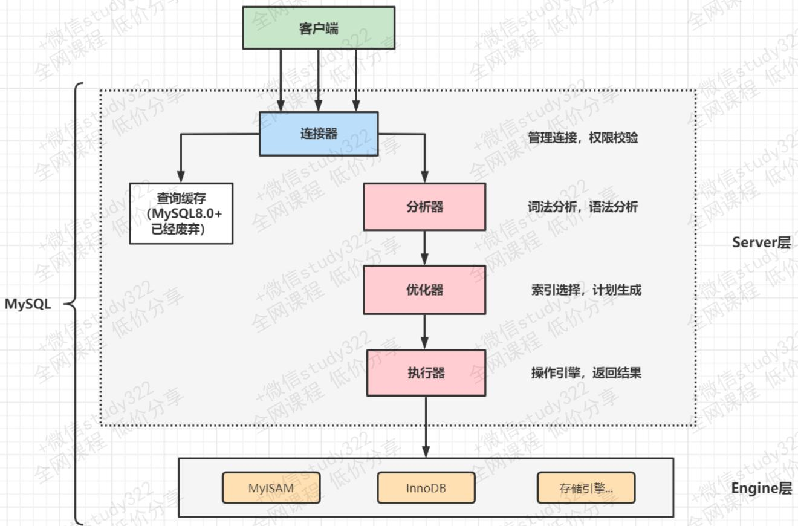

MySQL 的逻辑架构图

# 连接器（Connector）

Mysql作为服务器，⼀个客户端的Sql连接过来就需要分配⼀个线程进⾏处理，这个线程会专⻔负责监听请求并读取数据。这部分的线程和连接管理都是有⼀个连接器，专⻔负责跟客户端建⽴连接、权限认证、维持和管理连接。

思考：（1）⼀个 客户端 只会和 MySQL 服务器建⽴⼀个连接吗？

（2）只能有⼀个 客户端 和 MySQL 服务器建⽴连接吗？

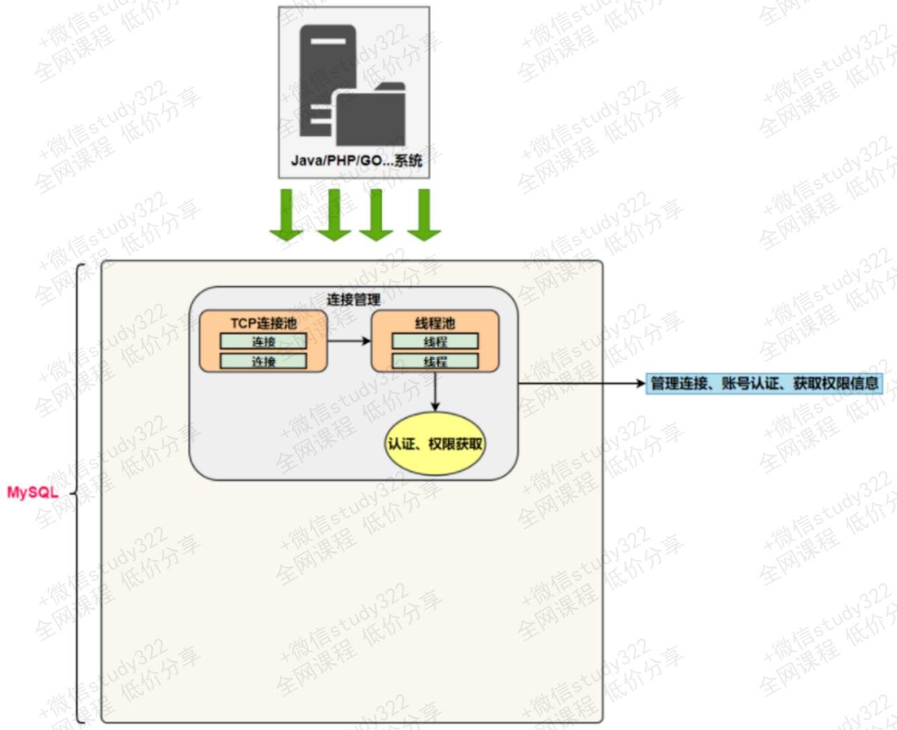

答：

多个系统都可以和 MySQL 服务器建⽴连接，每个系统建⽴的连接肯定不⽌⼀个。

所以，为了解决TCP⽆限创建与TCP频繁创建销毁带来的资源耗尽、性能下降问题。

MySQL 服务器⾥有专⻔的 TCP 连接池限制接数，采⽤⻓连接模式复⽤ TCP 连接，来解决上述问题。

TCP 连接收到请求后，必须要分配给⼀个线程去执⾏，所以还会有个线程池，去⾛后⾯的流程。

连接器负责跟客户端建⽴连接、获取权限、维持和管理连接。

连接命令⼀般是这么写的：

```
mysql -h$ip -P$port -u$user -p 
```

在完成 经典TCP 握⼿后，连接器会基于⽤户名和密码来验证身份。

验证不通过："Access denied for user"错误

验证通过：连接器会到权限表⾥⾯查出拥有的权限，之后，这个连接⾥⾯的权限判断逻辑，都将依赖于此时读到的权限 课扫 课扫口

程码

大获

全取

show processlist -- 查看连接状态

| mysql> show processlist; |      |                 |      |         |      |          |                  |      |
| ------------------------ | ---- | --------------- | ---- | ------- | ---- | -------- | ---------------- | ---- |
| Id                       | User | Host            | db   | Command | Time | State    | Info             |      |
| 5                        | root | localhost:27710 | test | Sleep   | 16   |          | NULL             |      |
| 6                        | root | localhost:27712 | test | Query   | 0    | starting | show processlist |      |
| 2 rows in set (0.00 sec) |      |                 |      |         |      |          |                  |      |

图中的 Command 列显示为“Sleep”的这⼀⾏，就表示现在系统⾥⾯有⼀个空闲连接。

# 查询缓存 （Query Cache）

经过了连接管理，现在MySQL服务器已经获取到SQL字符串。

执⾏逻辑就会来到第⼆步：查询缓存

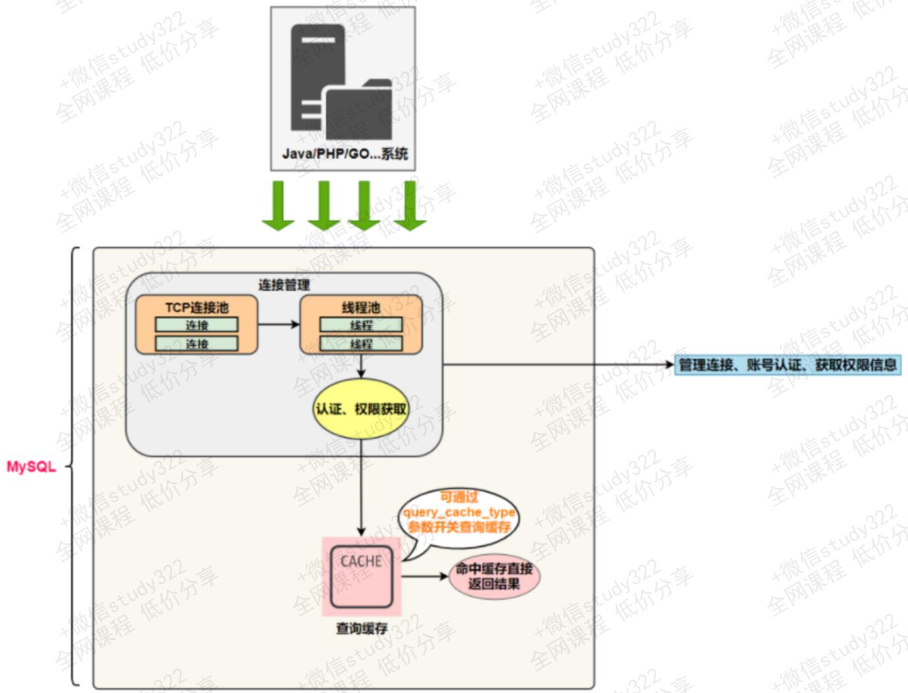

查询语句， MySQL 服务器会使⽤ select SQL 字符串作为 key ，去缓存中获取：

缓存命中，直接返回结果

缓存未命中：执⾏后⾯的阶段，执⾏完成后，执⾏结果会被存⼊查询缓存中

缓存中数据：key：(查询的语句） value：(查询的结果)

注意：但是⼤多数情况下建议不要使⽤查询缓存，为什么呢？因为查询缓存往往弊⼤于利

查询缓存的失效⾮常频繁，只要有对⼀个表的更新，这个表上所有的查询缓存都会被清空

5.x版本可以按需使⽤”的⽅式。可以将参数 query_cache_type 设置成 DEMAND，这样对于默认的 SQL 语句都不使⽤查询缓存。⽽对于确定要使⽤查询缓存的语句，可以⽤ SQL_CACHE 显式指定例：

```
mysql> select SQL_CACHE * from T where ID=10; 
```

MySQL 8.0 版本直接将查询缓存的整块功能删掉了，也就是说 8.0 开始彻底没有这个功能了

# 分析器（Analyzer）

缓存如果未命中，就要开始真正执⾏语句了

⾸先，MySQL 需要知道要做什么，因此需要对 SQL 语句做解析

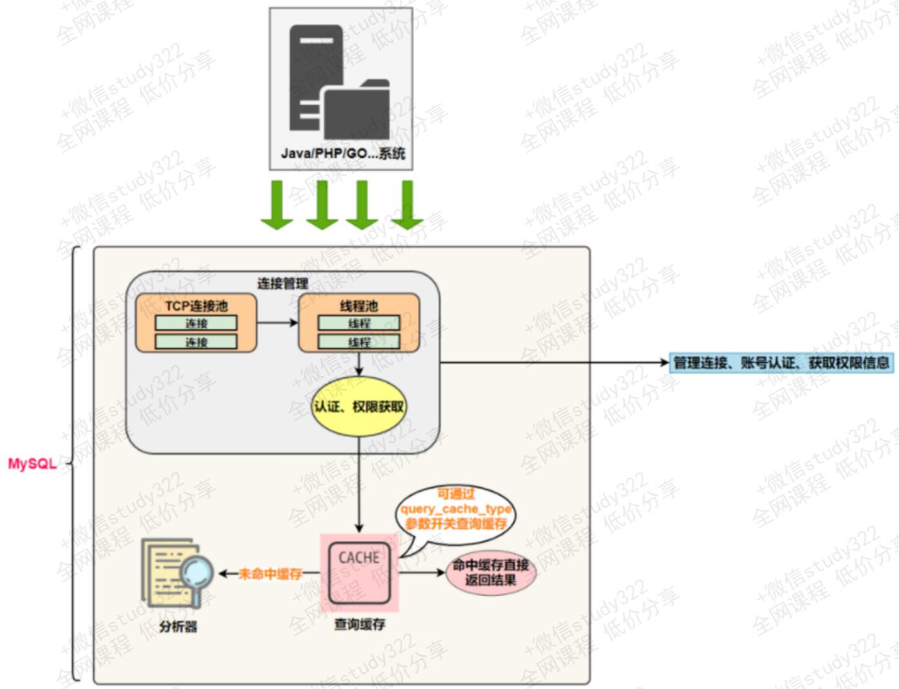

词法分析

⾸先，会进⾏词法分析。

将⼀个完整的SQL语句，拆分成语句类型（select? insert? update? ...）、表名、列名等等。

# 语法分析

其次，会进⾏语法分析。

根据语法规则，判断输⼊的这个 SQL 语句是否满⾜ MySQL 语法。

如果错误，会报出下⾯的错误：

```
mysql> elect * from t where ID=1;
ERROR 1064 (42000): You have an error in your SQL syntax; check the manual that corresponds to your MySQL server version for the right syntax to use near 'elect * from t where ID=1' at line 1 
```

这时，我们只要修正 use near 后⾯的语句即可。

# 优化器（optimizer）

通过了分析器，说明 SQL 字符串符合语法规范，现在 MySQL 服务器要执⾏ SQL 语句了。

MySQL 服务器要怎么执⾏呢？

那么就需要产出执⾏计划，交给 MySQL 服务器执⾏，所以来到了优化器阶段。

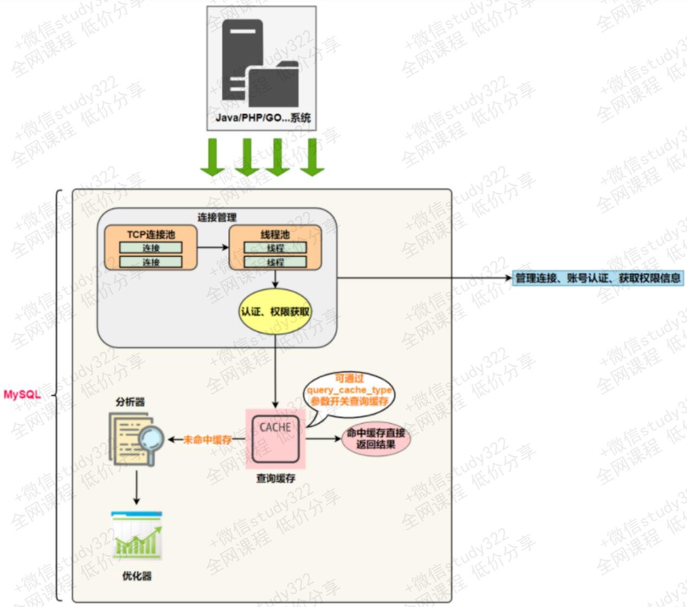

优化器不仅仅只是⽣成执⾏计划这么简单，这个过程它会帮你优化 SQL 语句。

如外连接转换为内连接、表达式简化、⼦查询转为连接、连接顺序、索引选择等⼀堆东⻄，优化的结果就是执⾏计划。

例：执⾏下⾯这样的语句，这个语句是执⾏两个表的 join：

```
mysql> select * from t1 join t2 using(ID) where t1.c=10 and t2.d=20; 
```

既可以先从表 t1 ⾥⾯取出 c=10 的记录的 ID 值，再根据 ID 值关联到表 t2，再判断 t2 ⾥⾯ d 的值是否等于20。

也可以先从表 t2 ⾥⾯取出 d=20 的记录的 ID 值，再根据 ID 值关联到 t1，再判断 t1 ⾥⾯ c 的值是否等于10。

这两种执⾏⽅法的逻辑结果是⼀样的，但是执⾏的效率会有不同，⽽优化器的作⽤就是决定选择使⽤哪⼀个⽅案。

截⽌到现在，还没有真正去读写真实的表，仅仅只是产出了⼀个执⾏计划。

# 执⾏器（Actuator）

MySQL 通过分析器知道了你要做什么，通过优化器知道了该怎么做，于是就进⼊了执⾏器阶段，开始执⾏语句。

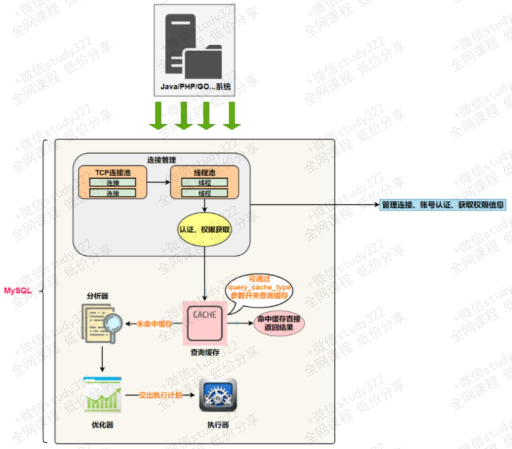

开始执⾏的时候，要先判断⼀下你对这个表 T 有没有执⾏查询的权限，如果没有，就会返回没有权限的错误，如下所示

```
mysql> select * from T where ID=10;
ERROR 1142 (42000): SELECT command denied to user 'zimu'@'localhost' for table 'T' 
```

如果有权限，就会根据表的 Engine 选择来调⽤对应的引擎接⼝。

例：

user_info 表的存储引擎是 InnoDB 。

```
select * from user_info where name = "zimu"; 
```

如果 name 列没有声明任何索引，执⾏步骤如下：

1. 调⽤ innoDB 引擎接⼝获取表的第⼀⾏，判断 name 是否等于 zimu 。如果不是，跳过。如果是，将结果保存。

1. 调⽤ innoDB 引擎接⼝获取表的下⼀⾏，重复相同逻辑，⼀直到表的最后⼀⾏。

1. 将所有满⾜条件的结果集返回给客户端。

如果 name 列有索引，执⾏步骤如下：

1. 调⽤ innoDB 引擎接⼝获取索引树（B+树），基于索引树快速查到 name 等于 zimu 的所有主键id。

1. 将所有满⾜条件的组件 id，回主表查详细信息。（这个操作称为“回表”）

1. 将所有满⾜条件的结果集返回给客户端。

# Engine层

# 什么是存储引擎?

引擎（Engine），我们都知道是机器发动机的核⼼所在，数据库存储引擎便是数据库的底层软件组织。

数据库使⽤数据存储引擎实现存储、处理和保护数据的核⼼服务

不同的存储引擎提供不同的存储机制、索引技巧、锁定⽔平等功能，使⽤不同的存储引擎，还可以 获得特定的功能。现在许多不同的数据库管理系统都⽀持多种不同的数据引擎。MySql的核⼼就是插件式存储引擎。

# mysql⽀持哪些存储引擎？

我们可以使⽤MySQL命令⾏查看：

```
SHOW ENGINES ; 
```

| Engine             | Support | Comment                                                      | Transactions | XA     | Savepoints |
| ------------------ | ------- | ------------------------------------------------------------ | ------------ | ------ | ---------- |
| MEMORY             | YES     | Hash based, stored in memory, useful for temporary tables    | NO           | NO     | NO         |
| MRG_MYISAM         | YES     | Collection of identical MyISAM tables                        | NO           | NO     | NO         |
| CSV                | YES     | CSV storage engine                                           | NO           | NO     | NO         |
| FEDERATED          | NO      | Federated MySQL storage engine                               | (Null)       | (Null) | (Null)     |
| PERFORMANCE_SCHEMA | YES     | Performance Schema                                           | NO           | NO     | NO         |
| MyISAM             | YES     | MyISAM storage engine                                        | NO           | NO     | NO         |
| InnoDB             | DEFAULT | Supports transactions, row-level locking, and foreign keys   | YES          | YES    | YES        |
| BLACKHOLE          | YES     | /dev/null storage engine (anything you write to it disappears) | NO           | NO     | NO         |
| ARCHIVE            | YES     | Archive storage engine                                       | NO           | NO     | NO         |

可以发现，MySQL⽬前⽀持多种数据库存储引擎，默认引擎为InnoDB，且是唯⼀⽀持事务的存储引擎。

# 常⻅的存储引擎对⽐

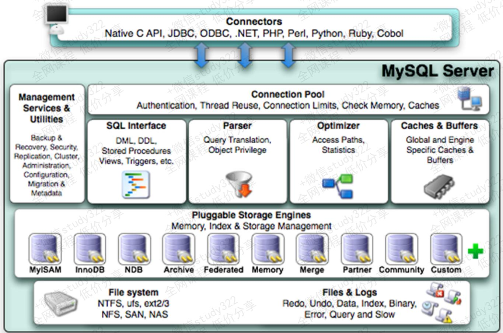

# INnoDB引擎

概述：InnoDB是事务型数据库的⾸选引擎，⽀持事务安全表（ACID），⽀持⾏锁定和外键，InnoDB是默认的MySQL引擎。

# 主要特性：

为MySQL提供了具有提交、回滚和崩溃恢复能⼒的事物安全（ACID兼容）存储引擎。InnoDB锁定在⾏级并且也在 SELECT语句中提供⼀个类似Oracle的⾮锁定读。这些功能增加了多⽤户部署和性能。在SQL查询中，可以⾃由地将InnoDB类型的表和其他MySQL的表类型混合起来，甚⾄在同⼀个查询中也可以混合

InnoDB存储引擎为在主内存中缓存数据和索引⽽维持它⾃⼰的缓冲池。InnoDB将它的表和索引在⼀个逻辑表空间中，表空间可以包含数个⽂件（或原始磁盘⽂件）。这与MyISAM表不同，⽐如在MyISAM表中每个表被存放在分离的⽂件中。InnoDB表可以是任何尺⼨，即使在⽂件尺⼨被限制为2GB的操作系统上

InnoDB⽀持外键完整性约束，存储表中的数据时，每张表的存储都按主键顺序存放，如果没有显示在表定义时指定主键，InnoDB会为每⼀⾏⽣成⼀个6字节的ROWID，并以此作为主键

使⽤ InnoDB存储引擎 MySQL将在数据⽬录下创建⼀个名为 ibdata1的10MB⼤⼩的⾃动扩展数据⽂件，以及两个名为 ib_logfile0和 ib_logfile1的5MB⼤⼩的⽇志⽂件。

# MyISAM存储引擎

概述：MyISAM基于ISAM存储引擎，并对其进⾏扩展。它是在Web、数据仓储和其他应⽤环境下最常使⽤的存储引擎之⼀。MyISAM拥有较⾼的插⼊、查询速度，但不⽀持事务。

# 主要特性：

被⼤⽂件系统和操作系统⽀持

当把删除和更新及插⼊操作混合使⽤的时候，动态尺⼨的⾏产⽣更少碎⽚。这要通过合并相邻被删除的块，若下⼀个块被删除，就扩展到下⼀块⾃动完成

每个MyISAM表最⼤索引数是64，这可以通过重新编译来改变。每个索引最⼤的列数是16

最⼤的键⻓度是1000字节，这也可以通过编译来改变，对于键⻓度超过250字节的情况，⼀个超过1024字节的键将被⽤上

BLOB和TEXT列可以被索引

NULL被允许在索引的列中，这个值占每个键的0~1个字节

所有数字键值以⾼字节优先被存储以允许⼀个更⾼的索引压缩

每个MyISAM类型的表都有⼀个AUTOINCREMENT的内部列，当INSERT和UPDATE操作的时候该列被更新，同时AUTOINCREMENT列将被刷新。所以说，MyISAM类型表的AUTOINCREMENT列更新⽐InnoDB类型的AUTOINCREMENT更快

可以把数据⽂件和索引⽂件放在不同⽬录

每个字符列可以有不同的字符集

有VARCHAR的表可以固定或动态记录⻓度

. VARCHAR和CHAR列可以多达64KB

使⽤MyISAM引擎创建数据库，将产⽣3个⽂件。⽂件的名字以表名字开始，扩展名之处⽂件类型：frm⽂件存储表定义、数据⽂件的扩展名为.MYD（MYData）、索引⽂件的扩展名时.MYI（MYIndex）。

# MEMORY存储引擎

概述：MEMORY存储引擎将表中的数据存储到内存中，为查询和引⽤其他表数据提供快速访问。

# 主要特性：

MEMORY表的每个表可以有多达32个索引，每个索引16列，以及500字节的最⼤键⻓度

MEMORY存储引擎执⾏HASH和BTREE缩影

可以在⼀个MEMORY表中有⾮唯⼀键值

MEMORY表使⽤⼀个固定的记录⻓度格式

MEMORY不⽀持BLOB或TEXT列

MEMORY⽀持AUTO_INCREMENT列和对可包含NULL值的列的索引

MEMORY表在所由客户端之间共享（就像其他任何⾮TEMPORARY表）

MEMORY表内存被存储在内存中，内存是MEMORY表和服务器在查询处理时的空闲中，创建的内部表共享

当不再需要MEMORY表的内容时，要释放被MEMORY表使⽤的内存，应该执⾏ DELETE FROM或 TRUNCATETABLE，或者删除整个表（使⽤DROP TABLE）

# 存储引擎的选择

不同的数据处理选择适合的存储引擎是使⽤MySQL的⼀⼤优势。

| 特点           | Myisam | BDB  | Memory | InnoDB | Archive |
| -------------- | ------ | ---- | ------ | ------ | ------- |
| 存储限制       | 没有   | 没有 | 有     | 64TB   | 没有    |
| 事务安全       |        | 支持 |        | 支持   |         |
| 锁机制         | 表锁   | 页锁 | 表锁   | 行锁   | 行锁    |
| B树索引        | 支持   | 支持 | 支持   | 支持   |         |
| 哈希索引       |        |      | 支持   | 支持   |         |
| 全文索引       | 支持   |      |        |        |         |
| 集群索引       |        |      |        | 支持   |         |
| 数据缓存       |        |      | 支持   | 支持   |         |
| 索引缓存       | 支持   |      | 支持   | 支持   |         |
| 数据可压缩     | 支持   |      |        |        | 支持    |
| 空间使用       | 低     | 低   | N/A    | 高     | 非常低  |
| 内存使用       | 低     | 低   | 中等   | 高     | 低      |
| 批量插入的速度 | 高     | 高   | 高     | 低     | 非常高  |
| 支持外键       |        |      |        | 支持   |         |

InnoDB： ⽀持事务处理，⽀持外键，⽀持崩溃修复能⼒和并发控制。如果需要对事务的完整性要求⽐较⾼（⽐如银⾏），要求实现并发控制（⽐如售票），那选择InnoDB有很⼤的优势。如果需要频繁的更新、删除操作的数据库，也可以选择InnoDB，因为⽀持事务的提交（commit）和回滚（rollback）。

MyISAM： 插⼊数据快，空间和内存使⽤⽐较低。如果表主要是⽤于插⼊新记录和读出记录，那么选择MyISAM能实现处理⾼效率。如果应⽤的完整性、并发性要求⽐ 较低，也可以使⽤。

MEMORY： 所有的数据都在内存中，数据的处理速度快，但是安全性不⾼。如果需要很快的读写速度，对数据的安全性要求较低，可以选择MEMOEY。它对表的⼤⼩有要求，不能建⽴太⼤的表。所以，这类数据库只使⽤在相对较⼩的数据库表。

注意：同⼀个数据库也可以使⽤多种存储引擎的表。如果⼀个表要求⽐较⾼的事务处理，可以选择InnoDB。这个数据库中可以将查询要求⽐较⾼的表选择MyISAM存储。如果该数据库需要⼀个⽤于查询的临时表，可以选择MEMORY存储引擎。

# 2.MySQL索引原理&优化

# 2.1 什么是索引？

# 引⾔

官⽅上⾯说索引是帮助MySQL⾼效获取数据的数据结构，通俗点的说，数据库索引好⽐是⼀本书的⽬录，可以直接根据⻚码找到对应的内容，⽬的就是为了 加快数据库的查询速度 。

索引是对数据库表中⼀列或多列的值进⾏排序的⼀种结构，使⽤索引可快速访问数据库表中的特定信息。

⼀种能帮助mysql提⾼了查询效率的数据结构：索引数据结构。

# 索引原理

索引的存储原理可以概括为⼀句话：以空间换时间

⼀般来说索引本身也很⼤，不可能全部存储在内存中，因此索引往往是存储在磁盘上的⽂件中的（可能存储在单独的索引⽂件中，也可能和数据⼀起存储在数据⽂件中）。

数据库在未添加索引进⾏查询的时候默认是进⾏全⽂搜索，也就是说有多少数据就进⾏多少次查询，然后找到相应的数据就把它们放到结果集中，直到全⽂扫描完毕。

# 索引分类

# 主键索引

设定为主键后，数据库⾃动建⽴索引，InnoDB为聚簇索引，主键索引列值不能为空（Null）。

# (1) 创建表添加主键索引

```
CREATE TABLE `table_name` (
    [...],
    PRIMARY KEY (`col_name`),
)
# (2) 添加主键索引
ALTER TABLE `table_name` ADD PRIMARY KEY (`col_name`);
```

# 普通索引（单列索引）

普通索引（单列索引）：单列索引是最基本的索引，它没有任何限制。

```
# (1) 直接创建索引
CREATE INDEX index_name ON table_name(`col_name`)
# (2) 修改表结构的方式添加索引
ALTER TABLE `table_name` ADD INDEX index_name(`col_name`)
# (3) 创建表的时候同时创建索引
CREATE TABLE `table_name` (
[...],
PRIMARY KEY (`id`),
INDEX index_name (`col_name`)
)
# (4) 删除索引
DROP INDEX index_name ON table_name;
alter table `表名` drop index 索引名;
```

# 复合索引（组合索引）

复合索引：复合索引是在多个字段上创建的索引。复合索引遵守“最左前缀”原则，即在查询条件中使⽤了复合索引的第⼀个字段，索引才会被使⽤。因此，在复合索引中索引列的顺序⾄关重要。

```
# （1）创建一个复合索引
create index index_name on table_name(`col_name1`, `col_name2`, ...);
# （2）修改表结构的方式添加索引
alter table table_name add index index_name(`col_name1`, `col_name2`, ...);
```

# 唯⼀索引

唯⼀索引：唯⼀索引和普通索引类似，主要的区别在于，唯⼀索引限制列的值必须唯⼀，但允许存在空值（只允许存在⼀条空值）。

如果在已经有数据的表上添加唯⼀性索引的话：

如果添加索引的列的值存在两个或者两个以上的空值，则不能创建唯⼀性索引会失败。（⼀般在创建表的时候，要对⾃动设置唯⼀性索引，需要在字段上加上 not null）

如果添加索引的列的值存在两个或者两个以上的null值，还是可以创建唯⼀性索引，只是后⾯创建的数据不能再插⼊null值 ，并且严格意义上此列并不是唯⼀的，因为存在多个null值。

对于多个字段创建唯⼀索引规定列值的组合必须唯⼀

“空值” 和”NULL”的概念：

1：空值是不占⽤空间的 .

2: MySQL中的NULL其实是占⽤空间的.

⻓度验证：注意空值的之间是没有空格的。

```
> select length(''), length(null), length('');
+----+----+----+
| length('') | length(null) | length(' ') |
+----+----+----+
|    0 |    NULL |    1 |
+----+----+----+ 
```

# - （1）创建唯⼀索引

# 创建单个索引

```
CREATE UNIQUE INDEX index_name ON table_name(`col_name`); 
```

# 创建多个索引

```
CREATE UNIQUE INDEX index_name on table_name(`col_name`,...); 
```

# -- （2）修改表结构

# 单个

```
ALTER TABLE table_name ADD UNIQUE index index_name('col_name'); 
```

# 多个

```
ALTER TABLE table_name ADD UNIQUE index index_name(`col_name`,...); 
```

# （3）创建表的时候直接指定索引

```
CREATE TABLE `table_name` (
[...],
PRIMARY KEY (`id`),
UNIQUE index_name_unique(`col_name`)
) 
```

# 全⽂索引

Full Text类型索引（FULLTEXT 索引在 MySQL 5.6 版本之后⽀持 InnoDB，⽽之前的版本只⽀持 MyISAM表）。

全⽂索引主要⽤来查找⽂本中的关键字，⽽不是直接与索引中的值相⽐较，⽬前只有char、varchar，text 列上可以创建全⽂索引。

```
-- （1）创建表的适合添加全文索引
CREATE TABLE `table_name` (
    [...],
    PRIMARY KEY (`id`),
    FULLTEXT (`col_name`)
)

-- （2）修改表结构添加全文索引
ALTER TABLE table_name ADD FULLTEXT index_fulltext_content(`col_name`)
-- （3）直接创建索引
CREATE FULLTEXT INDEX index_fulltext_content ON table_name(`col_name`)
```

# 注意 ：

默认 MySQL 不⽀持中⽂全⽂检索！

MySQL 全⽂搜索只是⼀个临时⽅案，对于全⽂搜索场景，更专业的做法是使⽤全⽂搜索引擎，例如ElasticSearch 或 Solr。

# 索引的查询和删除

```
#查看：
show indexes from `表名`;
#或
show keys from `表名`;
#删除
alter table `表名` drop index 索引名;
```

# 索引的优缺点

# 优点：

⼤⼤提⾼数据查询速度。

可以提⾼数据检索的效率，降低数据库的IO成本，类似于书的⽬录。

通过索引列对数据进⾏排序，降低数据的排序成本降低了CPU的消耗。

被索引的列会⾃动进⾏排序，包括【单例索引】和【组合索引】，只是组合索引的排序需要复杂⼀些。

如果按照索引列的顺序进⾏排序，对order 不⽤语句来说，效率就会提⾼很多。

# 缺点：

索引会占据磁盘空间。

索引虽然会提⾼查询效率，但是会降低更新表的效率。⽐如每次对表进⾏增删改查操作，MySQL不仅要保存数据，还有保存或者更新对应的索引⽂件。 课扫

维护索引需要消耗数据库资源。

# 综合索引的优缺点：

数据库表中不是索引越多越好，⽽是仅为那些常⽤的搜索字段建⽴索引效果最佳!

# 2.2 索引数据结构

MySQL索引使⽤的数据结构主要有 BTree索引 和 hash索引 。

对于hash索引来说，底层的数据结构就是哈希表，因此在绝⼤多数需求为单条记录查询的时候，可以选择哈希索引，查询性能最快；其余⼤部分场景建议选择BTree索引。

# Hash表

Hash表，在Java中的HashMap，TreeMap就是Hash表结构，以键值对的形式存储数据。我们使⽤hash表存储表数据结构，Key可以存储索引列，Value可以存储⾏记录或者⾏磁盘地址。Hash表在等值查询时效率很⾼，时间复杂度为O(1)；但是不⽀持范围快速查找，范围查找时只能通过扫描全表的⽅式，筛选出符合条件的数据。

显然这种⽅式，不适合我们经常需要查找和范围查找的数据库索引使⽤。

# ⼆叉树

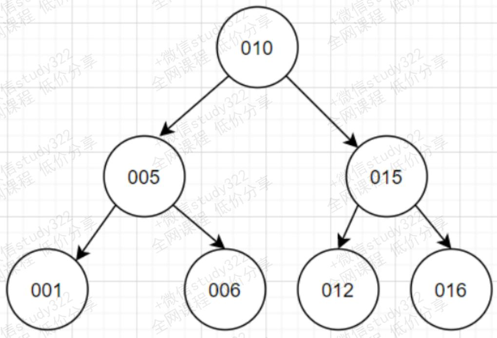

上⾯这个图就是我们常说的⼆叉树：每个节点最多有两个分叉节点，左⼦树和右⼦树数据按顺序左⼩右⼤。

⼆叉树的特点就是为了保证每次查找都可以进⾏折半查找，从⽽减少IO次数。

但是⼆叉树不是⼀直保持⼆叉平衡，因为⼆叉树很考验根节点的取值，因为很容易在某个节点下不分叉了，这样的话⼆叉树就不平衡了，也就没有了所谓的能进⾏折半查找了，如下图：

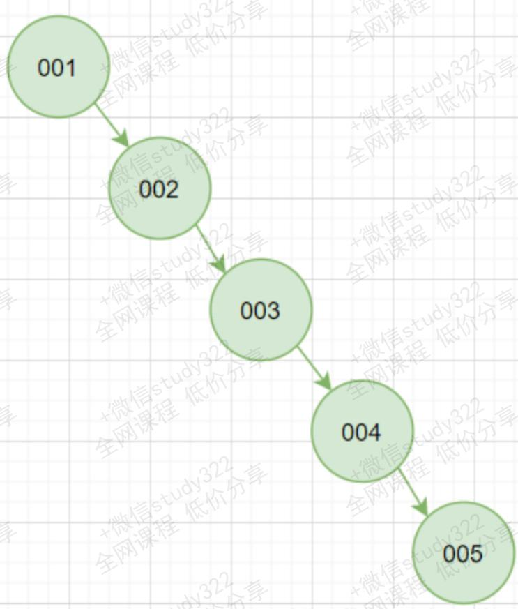

显然这种不稳定的情况，我们在选择存储数据结构的时候就会尽量避免这种的情况发⽣。

# 平衡⼆叉树

平衡⼆叉树采⽤的是⼆分法思维，平衡⼆叉查找树除了具备⼆叉树的特点，最主要的特征是树的左右两个⼦树的层级最多差1。在插⼊删除数据时通过左旋/右旋操作保持⼆叉树的平衡，不会出现左⼦树很⾼、右⼦树很矮的情况。

使⽤平衡⼆叉查找树查询的性能接近与⼆分查找，时间复杂度为O(log2n)，查询id=6，只需要两次IO。

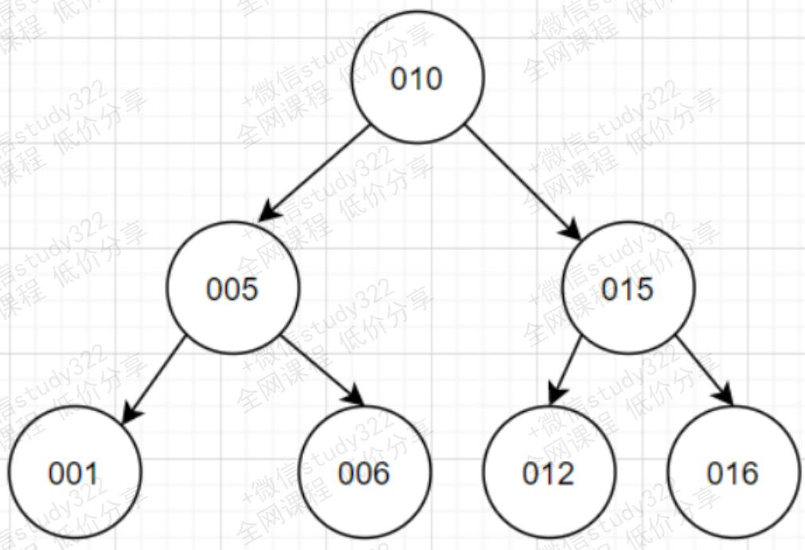

就上述平衡⼆叉树的特点来看，其实是我们理想的状态下，然⽽其实内部还是存在⼀些问题：

时间复杂度和树的⾼度有关。树有多⾼就需要检索多少次，每个节点的读取，都对应⼀次磁盘的IO操作。树的⾼度就等于每次查询数据时磁盘IO操作的次数。磁盘每次寻道的时间为10ms，在数据量⼤时，查询性能会很差。（1百万的数据量，log2n约等于20次磁盘IO读写，时间消耗约等于：20*10=0.2S）

平衡⼆叉树不⽀持范围查询快速查找，范围查询需要从根节点多次遍历，查询效率不⾼。

# B树：改造⼆叉树

MySQL的数据是存储在磁盘⽂件中的，查询处理数据时，需要先把磁盘中的数据加载到内存中，磁盘IO操作⾮常耗时，所以我们优化的重点就是尽量减少磁盘的IO操作。访问⼆叉树的每个节点都会发⽣⼀次IO，如果想要减少磁盘IO操作，就需要尽量降低树的⾼度。

那如何降低树的⾼度呢？

假如key为bigint=8字节，每个节点有两个指针，每个指针为4个字节，⼀个节点占⽤的空间为（8+4*2=16）。

因为在MySQL的InnoDB引擎的⼀次IO操作会读取⼀⻚的数据量（默认⼀⻚⼤⼩为16K），⽽⼆叉树⼀次IO操作的有效数据量只有16字节，空间利⽤率极低。为了最⼤化的利⽤⼀次IO操作空间，⼀个解决⽅法就是在⼀个节点处存储多个元素，在每个节点尽可能多的存储数据。每个节点可以存储1000个索引（16k/16=1000），这样就将⼆叉树改造成了多叉树，通过增加树的分叉树，将树的体型从⾼瘦变成了矮胖。构建1百万条数据，树的⾼度需要2层就可以（1000*1000=1百万），也就是说只需要两次磁盘IO操作就可以查询到数据，磁盘IO操作次数变少了，查询数据的效率整体也就提⾼了。

这种数据结构我们称之为B树，B树是⼀种多叉平衡查找树，如下图主要特点：

B树的节点中存储这多个元素，每个内节点有多个分叉。

节点中的元素包含键值和数据，节点中的键值从⼤到⼩排列。也就是说，在所有的节点中都存储数据。

⽗节点当中的元素不会出现在⼦节点中。

所有的叶⼦节点都位于同⼀层，叶⼦节点具有相同的深度，叶⼦节点之间没有指针连接。

B树结构

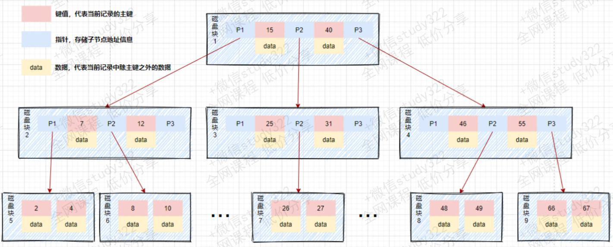

举个简单的例⼦，在B树中查询数据的情况：

假如我们要查询key等于10对应的数据data，根据上图我们可知在磁盘中的查询路径是：磁盘块1->磁盘块2->磁盘块6

第⼀次磁盘IO：将磁盘块1加载到内存中，在内存中从头遍历⽐较，10<15，⾛左⼦树，到磁盘中寻址到磁盘块2。 微信stu

第⼆次磁盘IO：将磁盘块2加载到内存中，在内存中从头遍历⽐较，10>7，⾛右⼦树，到磁盘中寻址到磁盘块6∘ 。

第三次磁盘IO：将磁盘块6加载到内存中，在内存中从头遍历⽐较，10=10，找到key=10的位置，取出对应的数据data，如果data存储的是⾏记录，直接取出数据，查询结束；如果data存储的是⾏磁盘地址，还需要根据磁盘地址到对应的磁盘中取出数据，查询结束。

相⽐较⼆叉平衡查找树，在整个查找过程中，虽然数据的⽐较次数并没有明显减少，但是对于磁盘IO的次数会⼤⼤减少，同时，由于我们是在内存中进⾏的数据⽐较，所以⽐较数据所消耗的时间可以忽略不计。B树的⾼度⼀般2⾄3层就能满⾜⼤部分的应⽤场景，所以使⽤B树构建索引可以很好的提升查询的效率。

过程如图：

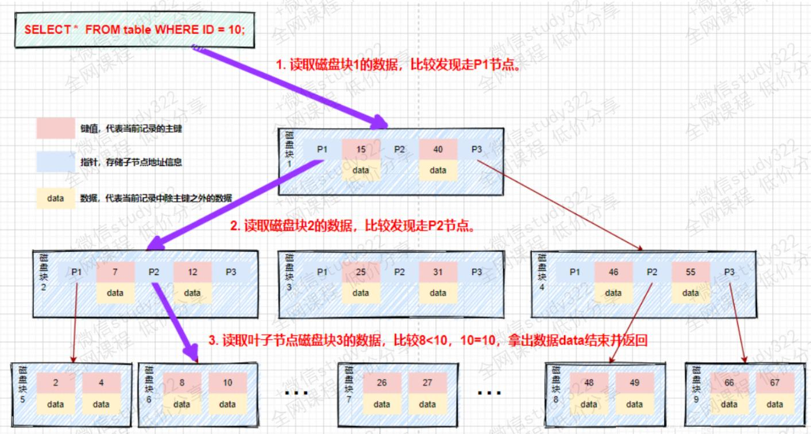

看到上⾯的情况，觉得B树已经很理想了，但是其中还是存在可以优化的地⽅：

B树不⽀持范围查询的快速查找，例如：仍然根据上图，我们想要查询10到35之间的数据，查找到10之后，需要回到根节点重新遍历查找，需要从根节点进⾏多次遍历，查询效率有待提⾼。

如果data存储的是⾏记录，⾏的⼤⼩随着列数的增加，所占空间会变⼤，这时⼀⻚中可存储的数据量就会减少，树相应就会变⾼，磁盘IO次数就会随之增加，有待优化。

# B+树：改造B树

B+树，作为B树的升级版，MySQL在B树的基础上继续进⾏改造，使⽤B+树构建索引。B+树和B树最主要的区别在于⾮叶⼦节点是否存储数据的问题。

B树：叶⼦节点和⾮叶⼦节点都会存储数据。

B+树：只有叶⼦节点才会存储数据，⾮叶⼦节点只存储键值key；叶⼦节点之间使⽤双向指针连接，最底层的叶⼦节点形成了⼀个双向有序链表。

B+树的⼤致数据结构：

B+树结构

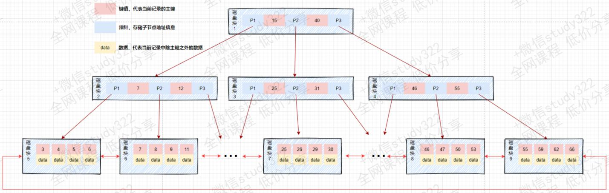

B+树的最底层叶⼦节点包含了所有的索引项。从图上可以看到，B+树在查找数据的时候，由于数据都存放在最底层的叶⼦节点上，所以每次查找都需要检索到叶⼦节点才能查询到数据。所以在需要查询数据的情况下每次的磁盘的IO跟树⾼有直接的关系，但是从另⼀⽅⾯来说，由于数据都被放到了叶⼦节点，所以放索引的磁盘块锁存放的索引数量是会跟这增加的，所以相对于B树来说，B+树的树⾼理论上情况下是⽐B树要矮的。也存在索引覆盖查询的情况，在索引中数据满⾜了当前查询语句所需要的全部数据，此时只需要找到索引即可⽴刻返回，不需要检索到最底层的叶⼦节点。

# 举例：等值查询

假如我们查询值等于9的数据。查询路径磁盘块1->磁盘块2->磁盘块6。

第⼀次磁盘IO：将磁盘块1加载到内存中，在内存中从头遍历⽐较，9<15，⾛左路，到磁盘寻址磁盘块2。

第⼆次磁盘IO：将磁盘块2加载到内存中，在内存中从头遍历⽐较，7<9<12，到磁盘中寻址定位到磁盘块6。

第三次磁盘IO：将磁盘块6加载到内存中，在内存中从头遍历⽐较，在第三个索引中找到9，取出data，如果data存储的⾏记录，取出data，查询结束。如果存储的是磁盘地址，还需要根据磁盘地址到磁盘中取出数据，查询终⽌。（这⾥需要区分的是在InnoDB中Data存储的为⾏数据，⽽MyIsam中存储的是磁盘地址。）

过程如图：

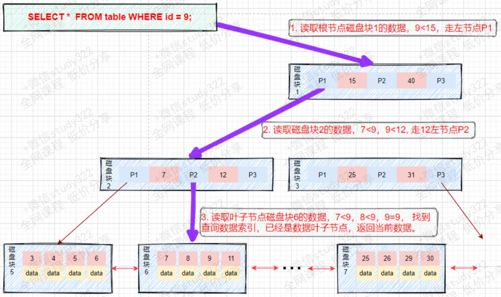

举例：范围查询

假如我们想要查找9和26之间的数据，查找路径为：磁盘块1->磁盘块2->磁盘块6->磁盘块7

前三次磁盘IO：⾸先查找到键值为9对应的数据（定位到磁盘块6），然后缓存⼤结果集中。这⼀步和前⾯等值查询流程⼀样，发⽣了三次磁盘IO。

继续查询，查找到节点15之后，底层的所有叶⼦节点是⼀个有序列表，我们从磁盘块6中的键值9开始向后遍历筛选出所有符合条件的数据。

第四次磁盘IO：根据磁盘块6的后继指针到磁盘中寻址定位到磁盘块7，将磁盘块7加载到内存中，在内存中从头遍历⽐较，9<25<26，9<26<=26，将数据data缓存到结果集中。

逐渐具备唯⼀性（后⾯不会再有<=26的数据），不需要再向后查找，查询结束，将结果集返回给⽤户。

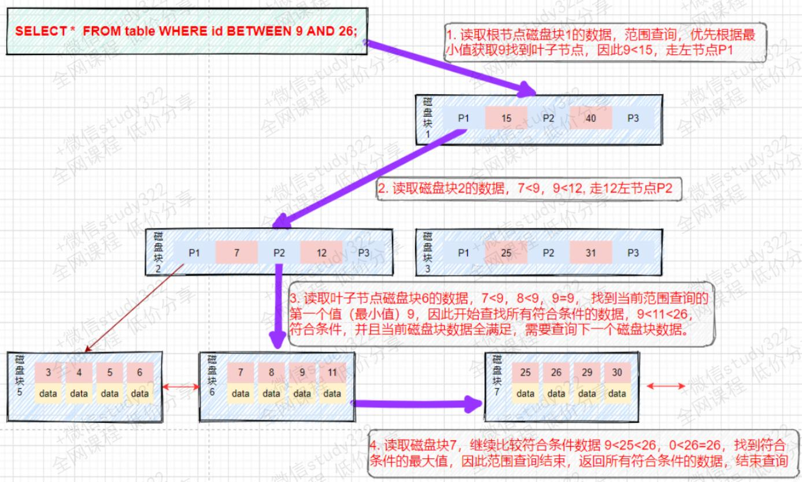

可以看到B+树可以保证等值和范围查询的快速查找，MySQL的索引就采⽤了B+树的数据结构。

# 2.3 MySQL的索引实现

介绍完了索引数据结构，那肯定是要带⼊到Mysql⾥⾯看看真实的使⽤场景的，所以这⾥分析Mysql的两种存储引擎的索引实现：MyISAM索引和InnoDB索引

# InnoDB索引

# 主键索引（聚簇索引）

每个InnoDB表都有⼀个聚簇索引 ，聚簇索引使⽤B+树构建，叶⼦节点存储的数据是整⾏记录。⼀般情况下，聚簇索引等同于主键索引，当⼀个表没有创建主键索引时，InnoDB会⾃动创建⼀个ROWID字段来构建聚簇索引 。

InnoDB创建索引的具体规则如下：

在表上定义主键PRIMARY KEY，InnoDB将主键索引⽤作聚簇索引。

如果表没有定义主键，InnoDB会选择第⼀个不为NULL的唯⼀索引列⽤作聚簇索引。

如果以上两个都没有，InnoDB 会使⽤⼀个6 字节⻓整型的隐式字段 ROWID字段构建聚簇索引。该ROWID字段会在插⼊新⾏时⾃动递增。

除聚簇索引之外的所有索引都称为辅助索引。在中InnoDB，辅助索引中的叶⼦节点存储的数据是该⾏的主键值都。 在检索时，InnoDB使⽤此主键值在聚簇索引中搜索⾏记录。

这⾥以user_innodb为例，user_innodb的id列为主键，age列为普通索引。

```
CREATE TABLE `user_innodb`
(
    `id` int(11) NOT NULL AUTO_INCREMENT,
    `username` varchar(20) DEFAULT NULL,
    `age` int(11) DEFAULT NULL,
    PRIMARY KEY (`id`) USING BTREE,
    KEY `idx_age` (`age`) USING BTREE
) ENGINE = InnoDB; 
```

| id     | username | age  |
| ------ | -------- | ---- |
| 12 张1 | 16       |      |
| 16 张2 | 17       |      |
| 18 张3 | 18       |      |
| 28 张4 | 18       |      |
| 47 张5 | 19       |      |
| 48 张6 | 52       |      |
| 54 张7 | 25       |      |
| 75 张8 | 34       |      |

InnoDB的数据和索引存储在 t_user_innodb.ibd ⽂件中，InnoDB的数据组织⽅式，是聚簇索引。

主键索引的叶⼦节点会存储数据⾏，辅助索引的叶⼦节点只会存储主键值。

InnoDB主键索引：

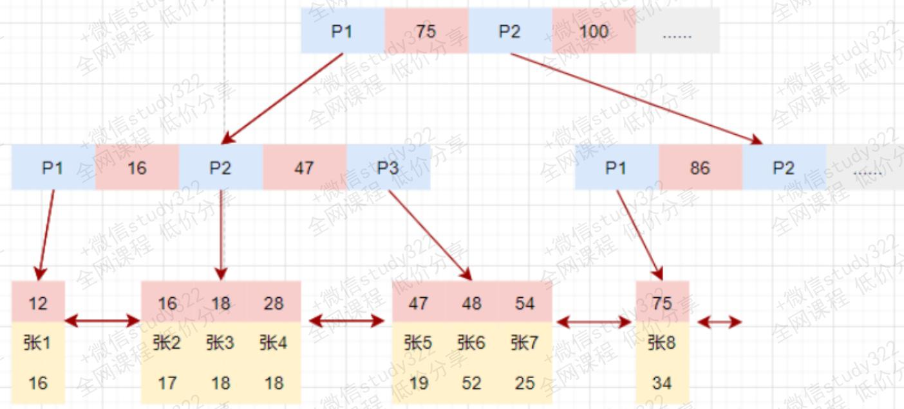

# 等值查询数据：

```
select * from user_innodb where id = 28; 
```

1. 先在主键树中从根节点开始检索，将根节点加载到内存，⽐较28<75，⾛左路。（1次磁盘IO）

1. 将左⼦树节点加载到内存中，⽐较16<28<47，向下检索。（1次磁盘IO）

1. 检索到叶节点，将节点加载到内存中遍历，⽐较16<28，18<28，28=28。查找到值等于28

索引项，

程码

大获

全取

以获取整⾏数据。将改记录返回给客户端。（1次磁盘IO）

磁盘IO数量：3次。

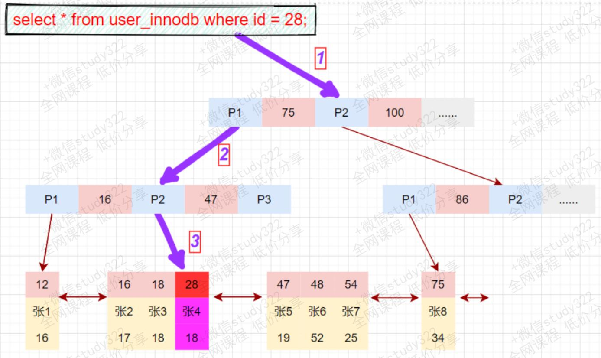

# 辅助索引

除聚簇索引之外的所有索引都称为辅助索引，InnoDB的辅助索引只会存储主键值⽽⾮磁盘地址。

以表user_innodb的age列为例，age索引的索引结果如下图。

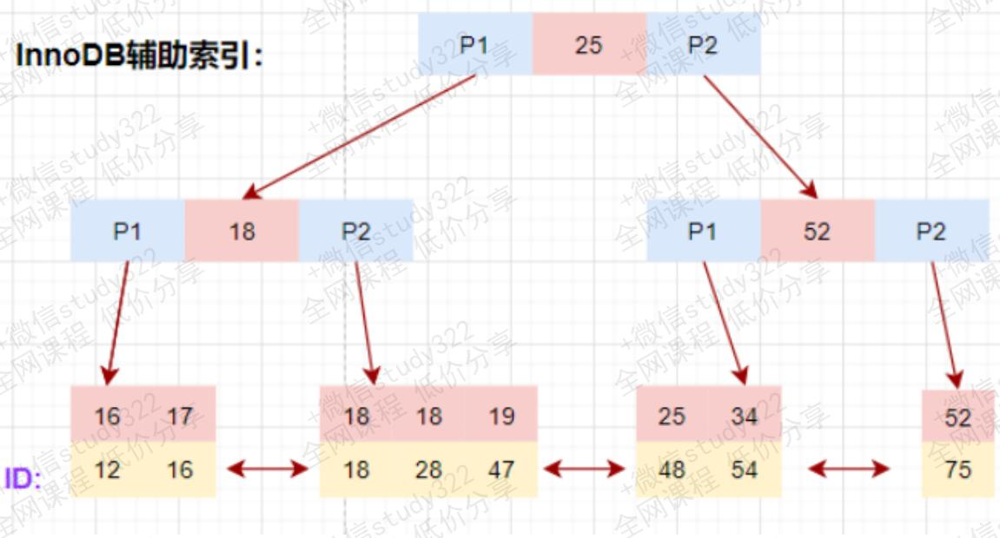

辅助索引的底层叶⼦节点是按照（age，id）的顺序排序，先按照age列从⼩到⼤排序，age相同时按照id列从⼩到⼤排序。

使⽤辅助索引需要检索两遍索引：⾸先检索辅助索引获得主键，然后根据主键到主键索引中检索获得数据记录。

# 辅助索引等值查询的情况：

```
select * from t_user_innodb where age=19; 
```

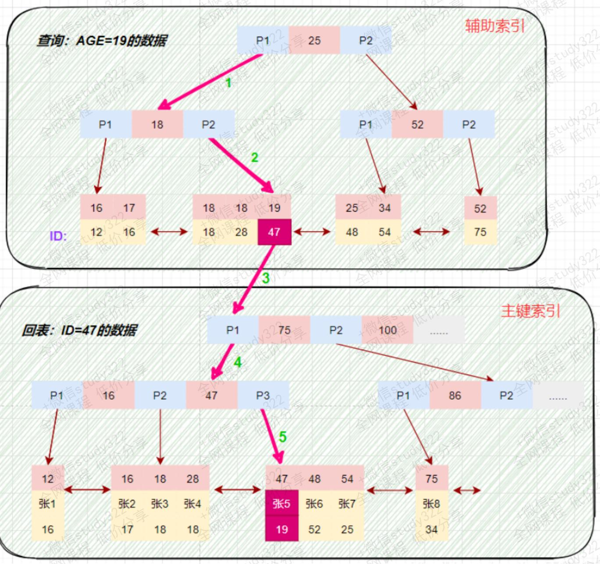

根据在辅助索引树中获取的主键id，到主键索引树检索数据的过程称为回表查询。

磁盘IO数：辅助索引3次+获取记录回表3次

# 组合索引

以表abc_innodb为例，id列为主键索引，创建⼀个联合索引 idx_abc(a，b，c) 。

```
CREATE TABLE `abc_innodb`
(
    `id` int(11) NOT NULL AUTO_INCREMENT,
    `a` int(11) DEFAULT NULL,
    `b` int(11) DEFAULT NULL,
    `c` varchar(10) DEFAULT NULL,
    `d` varchar(10) DEFAULT NULL,
    PRIMARY KEY (`id`) USING BTREE,
    KEY `idx_abc` (`a`, `b`, `c`)
) ENGINE = InnoDB; 
```

# 组合索引的数据结构：

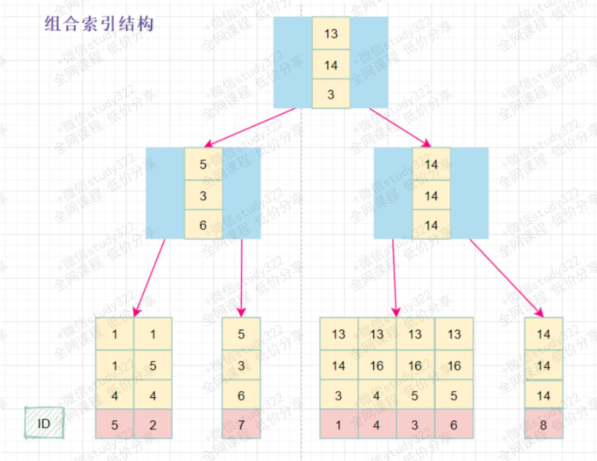

# 组合索引的查询过程：

```
select * from abc_innodb where a = 13 and b = 16 and c = 4; 
```

扫码获取课程大全

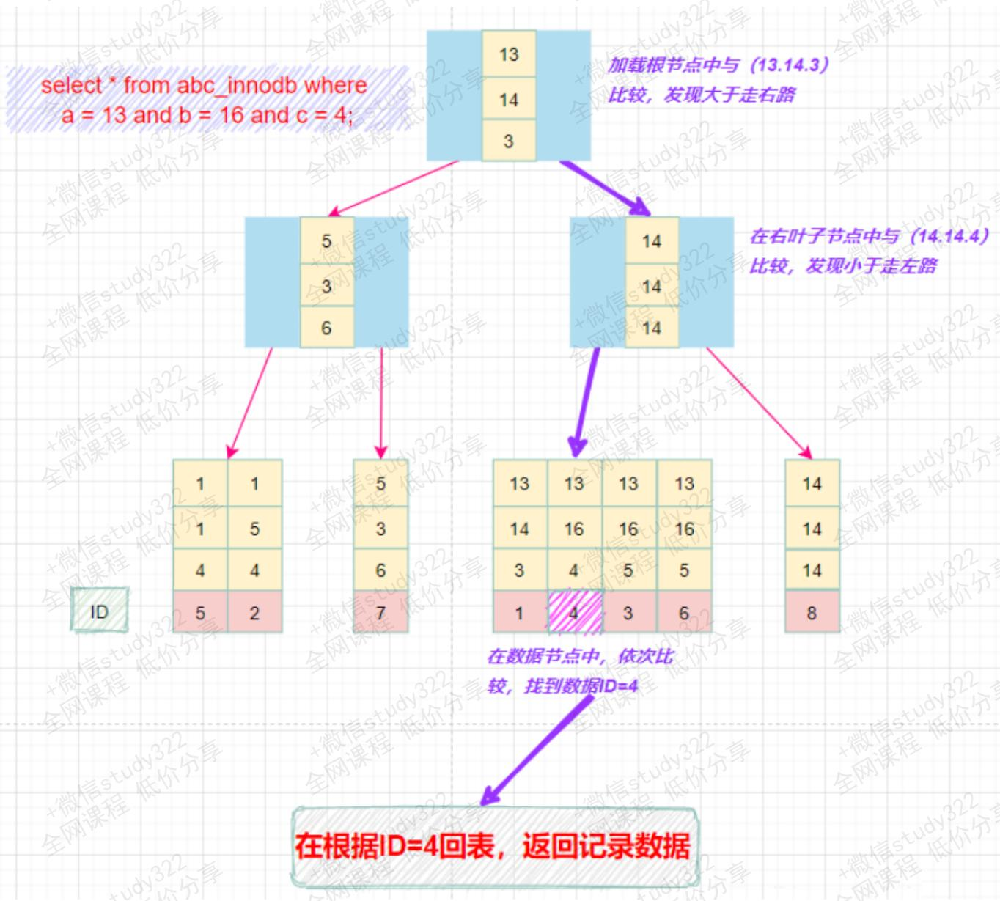

# 最左匹配原则

最左前缀匹配原则和联合索引的索引存储结构和检索⽅式是有关系的。

在组合索引树中，最底层的叶⼦节点按照第⼀列a列从左到右递增排序，但是b列和c列是⽆序的，b列只有在a列值相等的情况下⼩范围内有序递增；⽽c列只能在a和b两列值相等的情况下⼩范围内有序递增。

就像上⾯的查询，B+ 树会先⽐较a列来确定下⼀步应该检索的⽅向，往左还是往右。如果a列相同再⽐较b列，但是如果查询条件中没有a列，B+树就不知道第⼀步应该从那个节点开始查起。

可以说创建的idx_(a，b，c)索引，相当于创建了(a)、(a，b)、(a，b，c)三个索引。

# 组合索引的最左前缀匹配原则：

使⽤组合索引查询时，mysql会⼀直向右匹配直⾄遇到范围查询(>、<、between、like)等就会停⽌匹配。

# 覆盖索引

覆盖索引并不是⼀种索引结构，覆盖索引是⼀种很常⽤的优化⼿段。因为在使⽤辅助索引的时候，我们只可以拿到相应的主键值，想要获取最终的数据记录，还需要根据主键通过主键索引再去检索，最终获取到符合条件的数据记录。

在上⾯的abc_innodb表中的组合索引查询时，如果我们查询的结果只需要a、b、c这三个字段，那我们使⽤这个idx_index(a，b，c)组合索引查询到叶⼦节点时就可以直接返回了，⽽不需要再次回表查询，这种情况就是覆盖索引。

未使⽤索引覆盖的情况：

```
1 EXPLAIN select a,b,c from abc_innodb where a = 13 and b = 16 and c = 4;
信息 结果 1 剖析 状态
id select_type table partitions type possible_keys key key_len ref rows filtered Extra
▶ 1 SIMPLE abc_innodb (Null) ref idx_abc idx_abc 10 const,const 3 12.50 Using where; Using index
```

索引覆盖的情况

```
1 EXPLAIN select * from abc_innodb where a = 13 and b = 16 and c = 4;
信息 结果 1 剖析 状态
id select_type table partitions type possible_keys key key_len ref rows filtered Extra
1 SIMPLE abc_innodb (Null) ref idx_abc idx_abc 10 const,const 3 12.50 Using index condition
```

# MyIsam索引

以⼀个简单的user表为例。user表存在两个索引，id列为主键索引，age列为普通索引

```
CREATE TABLE `user`
(
    `id`    int(11) NOT NULL AUTO_INCREMENT,
    `username` varchar(20) DEFAULT NULL,
    `age`    int(11) DEFAULT NULL,
    PRIMARY KEY (`id`) USING BTREE,
    KEY `idx_age` (`age`) USING BTREE
) ENGINE = MyISAM
AUTO_INCREMENT = 1
DEFAULT CHARSET = utf8; 
```

| id   | name     | age  |
| ---- | -------- | ---- |
| 12   | zhangyi  | 16   |
| 16   | zhanger  | 17   |
| 18   | zhangsan | 18   |
| 28   | zhangsi  | 45   |
| 47   | zhangwu  | 19   |
| 48   | zhangliu | 52   |
| 54   | zhangqi  | 25   |
| 75   | zhangba  | 34   |

MyISAM的数据⽂件和索引⽂件是分开存储的。MyISAM使⽤B+树构建索引树时，叶⼦节点中存储的键值为索引列的值，数据为索引所在⾏的磁盘地址。

主键ID列索引：

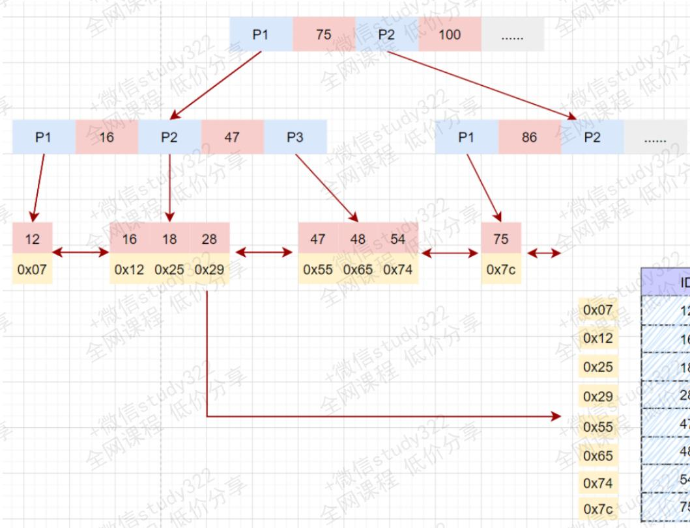

| ID   | USERNAME | AGE  |
| ---- | -------- | ---- |
| 12   | zhangyi  | 16   |
| 16   | zhanger  | 17   |
| 18   | zhangsan | 18   |
| 28   | zhangsi  | 45   |
| 47   | zhangwu  | 19   |
| 48   | zhangliu | 52   |
| 54   | zhangqi  | 25   |
| 75   | zhangba  | 34   |

表user的索引存储在索引⽂件 user.MYI 中，数据⽂件存储在数据⽂件 user.MYD 中。

简单分析下查询时的磁盘IO情况：

# 根据主键等值查询数据

```
select * from user where id = 28 
```

第⼀次磁盘IO：先在主键索引树中从根节点开始检索，将根节点加载到内存中，⽐较28<75，所以⾛左⼦树。

第⼆次磁盘IO：将左⼦树节点加载到内存中，⽐较16<28<47，向下检索。

第三次磁盘IO：检索到叶⼦节点，将节点加载到内存中遍历，从16<28，18<28，28=28，查找到键值等于28的索引项。

第四次磁盘IO：从索引项中获取磁盘地址，然后到数据⽂件user.MYD中获取对应整⾏记录。

将记录返回给客户端。

磁盘IO次数：3次索引检索+记录数据检索。

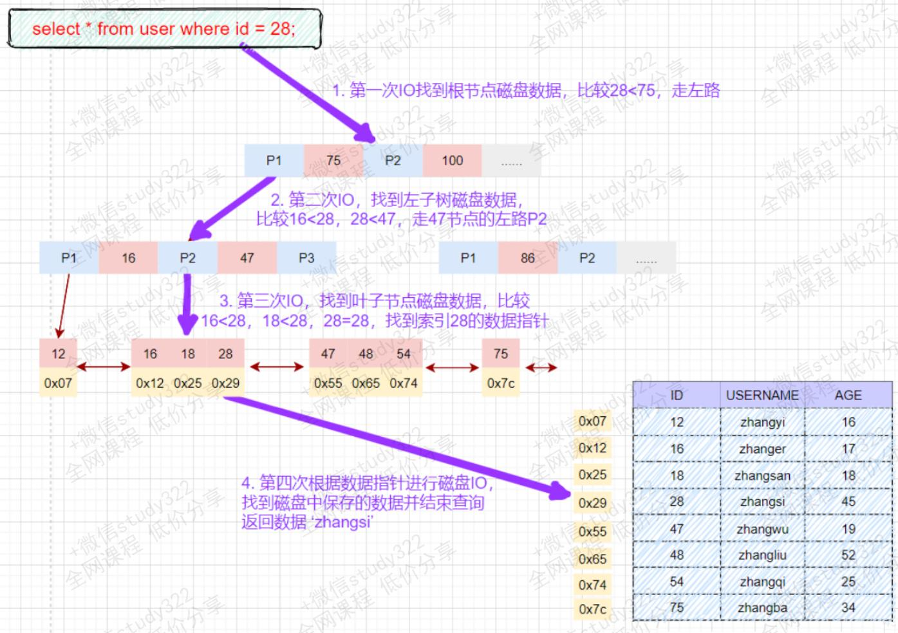

# 根据主键范围查询数据：

select * from user where id between 28 and 47;

1. 先在主键树中从根节点开始检索，将根节点加载到内存，⽐较28<75，⾛左路。（1次磁盘IO）

1. 将左⼦树节点加载到内存中，⽐较16<28<47，向下检索。（1次磁盘IO）

1. 检索到叶节点，将节点加载到内存中遍历⽐较16<28，18<28，28=28<47。查找到值等于28的索引项。

1. 根据磁盘地址从数据⽂件中获取⾏记录缓存到结果集中。（1次磁盘IO）

1. 我们的查询语句时范围查找，需要向后遍历底层叶⼦链表，直⾄到达最后⼀个不满⾜筛选条件。

. 6. 向后遍历底层叶⼦链表，将下⼀个节点加载到内存中，遍历⽐较，28<47=47，根据磁盘地址从数据⽂件中获取⾏记录缓存到结果集中。（1次磁盘IO）

1. 最后得到两条符合筛选条件，将查询结果集返给客户端。

磁盘IO次数：4次索引检索+记录数据检索。

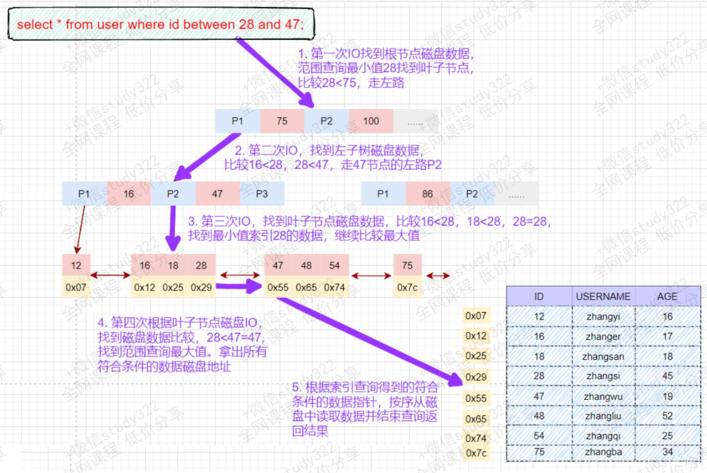

# 辅助索引

在MyISAM存储引擎中，辅助索引和主键索引的结构是⼀样的，没有任何区别，叶⼦节点中data阈存储的都是⾏记录的磁盘地址。

主键列索引的键值是唯⼀的，⽽辅助索引的键值是可以重复的。

查询数据时，由于辅助索引的键值不唯⼀，可能存在多个拥有相同的记录，所以即使是等值查询，也需要按照范围查询的⽅式在辅助索引树种检索数据。

# 2.4 回表和联合索引的应⽤

# 回表查询

在InnoDB的存储引擎中，使⽤辅助索引查询的时候，因为辅助索引叶⼦节点保存的数据不是当前数据记录，⽽是当前数据记录的主键索引。如果需要获取当前记录完整的数据，就必须要再次根据主键从主键索引中继续检索查询，这个过程我们称之为回表查询。

由此可⻅，在数据量⽐较⼤的时候，回表必然会消耗很多的时间影响性能，所以我们要尽量避免回表的发⽣。

# 如何避免回表

# 使⽤索引覆盖

举例：

```
CREATE TABLE `user`
(
    `id` int(11) NOT NULL AUTO_INCREMENT,
    `name` int(11) DEFAULT NULL,
    `sex` char(3) DEFAULT NULL,
    `address` varchar(10) DEFAULT NULL,
    `hobby` varchar(10) DEFAULT NULL,
    PRIMARY KEY (`id`) USING BTREE,
    KEY `i_name` (`name`)
) ENGINE = InnoDB; 
```

如果有⼀个场景:

```
select id, name, sex from user where name = 'zhangsan'; 
```

这个语句在业务上频繁使⽤到，⽽user表中的其他字段使⽤频率远低于这⼏个字段，在这个情况下，如果我们在建⽴name字段的索引时，不是使⽤单⼀索引，⽽是使⽤联合索引（name，sex），这样的话再执⾏这个查询语句，根据这个辅助索引（name，sex）查询到的结果就包括了我们所需要的查询结果的所有字段的完整数据，这样就不需要再次回表查询去检索sex字段的数据了。

以上就是⼀个典型的使⽤覆盖索引的优化策略减少了回表查询的情况。

# 联合索引的使⽤

联合索引：

在建⽴索引的时候，尽量在多个单列索引上判断下是否可以使⽤联合索引。联合索引的使⽤不仅可以节省空间，还可以更容易的使⽤到索引覆盖。

节省空间：

试想⼀下，索引的字段越多，是不是更容易满⾜查询需要返回的数据呢。⽐如联合索引（a_b_c），是不是等于有了索引：a，a_b，a_b_c三个索引，这样是不是节省了空间，当然节省的空间并不是三倍于（a，a_b，a_b_c）三个索引，因为索引树的数据没变，但是索引data字段的数据确实真实的节省了。

# 联合索引的创建原则：

在创建联合索引的时候因该把频繁使⽤的列、区分度⾼的列放在前⾯，频繁使⽤代表索引利⽤率⾼，区分度⾼代表筛选粒度⼤，这些都是在索引创建的需要考虑到的优化场景，也可以在常需要作为查询返回的字段上增加到联合索引中。

如果在联合索引上增加⼀个字段⽽使⽤到了覆盖索引，那建议这种情况下使⽤联合索引。

# 联合索引的使⽤:

考虑当前是否已经存在多个可以合并的单列索引，如果有，那么将当前多个单列索引创建为⼀个联合索引。

当前索引存在频繁使⽤作为返回字段的列，这个时候就可以考虑当前列是否可以加⼊到当前已经存在索引上，使其查询语句可以使⽤到覆盖索引。

# 3.性能瓶颈定位MySQL慢查询

# 性能优化的思路

1. ⾸先需要使⽤慢查询功能，去获取所有查询时间⽐较⻓的SQL语句

1. 其次使⽤explain命令去查询由问题的SQL的执⾏计划

1. 最后可以使⽤show profile[s] 查看由问题的SQL的性能使⽤情况

1. 优化SQL语句

# 引⾔

数据库查询快慢是影响项⽬性能的⼀⼤因素，对于数据库，我们除了要优化SQL，更重要的是得先找到需要优化的SQL语句。

MySQL数据库有⼀个“慢查询⽇志”功能，⽤来记录查询时间超过某个设定值的SQL，这将极⼤程度帮助我们快速定位到问题所在，以便对症下药。

# MySQL慢查询⽇志

慢查询⽇志⽤来记录在 MySQL 中执⾏时间超过指定时间的查询语句。通过慢查询⽇志，可以查找出哪些查询语句的执⾏效率低，以便进⾏优化。

# 慢查询参数

# 1. 执⾏下⾯的语句

```
SHOW VARIABLES LIKE "%slow_query%"; 
```

| 1 SHOW VARIABLES LIKE "%slow_query%"; |                                                          |      |      |
| ------------------------------------- | -------------------------------------------------------- | ---- | ---- |
| 信息                                  | 结果 1                                                   | 剖析 | 状态 |
| Variable_name                         | Value                                                    |      |      |
| slow_query_log                        | OFF                                                      |      |      |
| slow_query_log_file                   | D:\dev\mysql-8.0.22-winx64\data\DESKTOP-LEC7QQM-slow.log |      |      |

slow_query_log：是否开启慢查询,on为开启,off为关闭;

log-slow-queries：慢查询⽇志⽂件路径

```
SHOW VARIABLES LIKE "%long_query_time%"; 
1 SHOW VARIABLES LIKE "%long_query_time%"; 
信息 结果 1 剖析 状态
Variable_name Value 
long_query_time 10.000000 
```

long_query_time : 阈值，超过多少秒的查询就写⼊⽇志

```
show variables like 'log_queries_not_using_indexes'; 
1 show variables like 'log_queries_not_using_indexes'; 
信息 结果 1 剖析 状态
Variable_name Value 
log_queries_not_using_indexes OFF 
```

系统变量 log-queries-not-using-indexes ：未使⽤索引的查询也被记录到慢查询⽇志中（可选项）。如果调优的话，建议开启这个选项。

# 开启慢查询⽇志（临时）

在MySQL执⾏SQL语句设置,但是如果重启MySQL的话会失效。

```
set global slow_query_log=on;
set global long_query_time=1; 
```

# 开启慢查询⽇志（永久）

修改：/etc/my.cnf，添加以下内容，然后重启MySQL服务

```
[mysqld]
lower_case_table_names=1
slow_query_log=ON
slow_query_log_file=D:\dev\mysql-8.0.22-winx64\data\DESKTOP-LEC7QQM-slow.log
long_query_time=1 
```

（数据库操作超过100毫秒认为是慢查询，可根据需要进⾏设定，如果过多，可逐步设定，⽐如先⾏设定为2秒，逐渐降低来确认瓶颈所在）

# 慢查询测试

```
select SLEEP(3); 
/usr/local/mysql/bin/mysqld, Version: 5.7.28-log (MySQL Community Server (GPL)). started with:
Tcp port: 0 Unix socket: (null)
Time    Id Command Argument
# Time: 2020-06-15T08:58:56.406163Z
# User@Host: root[root] @ localhost [127.0.0.1] Id: 3
# Query_time: 3.003982 Lock_time: 0.000000 Rows_sent: 1 Rows_examined: 0
use cyb;
SET timestamp=1592211536;
select sleep(3); 
```

# 格式说明：

第⼀⾏，SQL查询执⾏的具体时间

第⼆⾏，执⾏SQL查询的连接信息，⽤户和连接IP

第三⾏，记录了⼀些我们⽐较有⽤的信息，

Query_timme，这条SQL执⾏的时间，越⻓则越慢

Lock_time，在MySQL服务器阶段(不是在存储引擎阶段)等待表锁时间

Rows_sent，查询返回的⾏数

Rows_examined，查询检查的⾏数，越⻓就越浪费时间

第四⾏，设置时间戳，没有实际意义，只是和第⼀⾏对应执⾏时间。

第五⾏，执⾏的SQL语句记录信息

# MySQL性能分析 EXPLAIN

# 概述

explain（执⾏计划），使⽤explain关键字可以模拟优化器执⾏sql查询语句，从⽽知道MySQL是如何处理sql语句。

explain主要⽤于分析查询语句或表结构的性能瓶颈。

通过explain命令可以得到:

– 表的读取顺序

– 数据读取操作的操作类型

– 哪些索引可以使⽤

– 哪些索引被实际使⽤

– 表之间的引⽤

– 每张表有多少⾏被优化器查询

# EXPLAIN字段介绍

explain使⽤：explain+sql语句，通过执⾏explain可以获得sql语句执⾏的相关信息。

```
explain select * from course; 
mysql> explain select * from course; 
```

| id                                 | select_type | table  | partitions | type | possible_keys | key  | key_len | ref  | rows | filtered | Extra |
| ---------------------------------- | ----------- | ------ | ---------- | ---- | ------------- | ---- | ------- | ---- | ---- | -------- | ----- |
| 1                                  | SIMPLE      | course | NULL       | ALL  | NULL          | NULL | NULL    | NULL | 40   | 100.00   | NULL  |
| 1 row in set, 1 warning (0.00 sec) |             |        |            |      |               |      |         |      |      |          |       |

expain出来的信息有10列，分别是id、select_type、table、type、possible_keys、key、key_len、ref、rows、Extra

# 数据准备

# 创建数据库

CREATE DATABASE test_explain CHARACTER SET 'utf8';

# 创建表

```
CREATE TABLE L1(id INT PRIMARY KEY AUTO_INCREMENT, title VARCHAR(100));
CREATE TABLE L2(id INT PRIMARY KEY AUTO_INCREMENT, title VARCHAR(100));
CREATE TABLE L3(id INT PRIMARY KEY AUTO_INCREMENT, title VARCHAR(100)); 
CREATE TABLE L4(id INT PRIMARY KEY AUTO_INCREMENT, title VARCHAR(100)); 
```

# 每张表插⼊3条数据

```
INSERT INTO L1(title) VALUES('heima001'),('heima002'),('heima003');
INSERT INTO L2(title) VALUES('heima004'),('heima005'),('heima006');
INSERT INTO L3(title) VALUES('heima007'),('heima008'),('heima009');
INSERT INTO L4(title) VALUES('heima010'),('heima011'),('heima012'); 
```

# id字段

select查询的序列号，包含⼀组数字，表示查询中执⾏select⼦句或操作表的顺序

id相同，执⾏顺序由上⾄下

```
EXPLAIN SELECT * FROM L1,L2,L3 WHERE L1.id=L2.id AND L2.id = L3.id; 
```

| id   | select_type | table | partitions | type   | possible_keys | key      | key_len   | ref    | rows   | filtered | Extra  |
| ---- | ----------- | ----- | ---------- | ------ | ------------- | -------- | --------- | ------ | ------ | -------- | ------ |
| 1    | SIMPLE      | L1    | (Null)     | ALL    | PRIMARY       | (Null)   | (Null)    | (Null) | 1      | 100.00   | (Null) |
| 1    | SIMPLE      | L2    | (Null)     | eq_ref | PRIMARY       | PRIMARY4 | test_expl | 1      | 100.00 | (Null)   |        |
| 1    | SIMPLE      | L3    | (Null)     | eq_ref | PRIMARY       | PRIMARY4 | test_expl | 1      | 100.00 | (Null)   |        |

id不同，如果是⼦查询，id的序号会递增，id值越⼤优先级越⾼，越先被执⾏

```
EXPLAIN SELECT * FROM L2 WHERE id = (
SELECT id FROM L1 WHERE id = (SELECT L3.id FROM L3 WHERE L3.title = 'heima03')); 
```

| id   | select_type | table | partitions | type  | possible_keys | key      | key_len | ref    | rows   | filtered    | Extra       |
| ---- | ----------- | ----- | ---------- | ----- | ------------- | -------- | ------- | ------ | ------ | ----------- | ----------- |
| 1    | PRIMARY     | L2    | (Null)     | const | PRIMARY       | PRIMARY4 | const   | 1      | 100.00 | (Null)      |             |
| 2    | SUBQUERY    | L1    | (Null)     | const | PRIMARY       | PRIMARY4 | const   | 1      | 100.00 | Using index |             |
| 3    | SUBQUERY    | L3    | (Null)     | ALL   | (Null)        | (Null)   | (Null)  | (Null) | 1      | 100.00      | Using where |

# select_type 与 table字段

查询类型，主要⽤于区别普通查询，联合查询，⼦查询等的复杂查询

simple : 简单的select查询，查询中不包含⼦查询或者UNION

```
EXPLAIN SELECT * FROM L1; 
```

| id   | select_type | table | partitions | type | possible_keys | key    | key_len | ref    | rows | filtered | Extra  |
| ---- | ----------- | ----- | ---------- | ---- | ------------- | ------ | ------- | ------ | ---- | -------- | ------ |
| 1    | SIMPLE      | L1    | (Null)     | ALL  | (Null)        | (Null) | (Null)  | (Null) | 1    | 100.00   | (Null) |

primary : 查询中若包含任何复杂的⼦部分，最外层查询被标记

```
EXPLAIN SELECT * FROM L2 WHERE id = (
SELECT id FROM L1 WHERE id = (SELECT L3.id FROM L3 WHERE L3.title = 'heima03')); 
```

| id   | select_type | table | partitions | type  | possible_keys | key      | key_len | ref    | rows   | filtered    | Extra       |
| ---- | ----------- | ----- | ---------- | ----- | ------------- | -------- | ------- | ------ | ------ | ----------- | ----------- |
| 1    | PRIMARY     | L2    | (Null)     | const | PRIMARY       | PRIMARY4 | const   | 1      | 100.00 | (Null)      |             |
| 2    | SUBQUERY    | L1    | (Null)     | const | PRIMARY       | PRIMARY4 | const   | 1      | 100.00 | Using index |             |
| 3    | SUBQUERY    | L3    | (Null)     | ALL   | (Null)        | (Null)   | (Null)  | (Null) | 1      | 100.00      | Using where |

subquery : 在select或where列表中包含了⼦查询

```
EXPLAIN SELECT * FROM L2 WHERE L2.id = (SELECT id FROM L3 WHERE L3.title = 'heima03') 
```

| id         | select_type | table  | partitions | type   | possible_keys | key      | key_len | ref  | rows   | filtered    | Extra |
| ---------- | ----------- | ------ | ---------- | ------ | ------------- | -------- | ------- | ---- | ------ | ----------- | ----- |
| ▶          | 1 PRIMARY   | L2     | (Null)     | const  | PRIMARY       | PRIMARY4 | const   | 1    | 100.00 | (Null)      |       |
| 2 SUBQUERY | L3          | (Null) | ALL        | (Null) | (Null)        | (Null)   | (Null)  | 1    | 100.00 | Using where |       |

derived : 在from列表中包含的⼦查询被标记为derived（衍⽣），MySQL会递归执⾏这些⼦查询，把结果放到临时表中

union : 如果第⼆个select出现在UNION之后，则被标记为UNION，如果union包含在from⼦句的⼦查询中，外层select被标记为derived

union result : UNION 的结果

```
EXPLAIN SELECT * FROM L2
UNION
SELECT * FROM L3 
```

| id     | select_type  | table | partitions | type | possible_keys | key    | key_len | ref    | rows   | filtered | Extra           |
| ------ | ------------ | ----- | ---------- | ---- | ------------- | ------ | ------- | ------ | ------ | -------- | --------------- |
| 1      | PRIMARY      | L2    | (Null)     | ALL  | (Null)        | (Null) | (Null)  | (Null) | 1      | 100.00   | (Null)          |
| 2      | UNION        | L3    | (Null)     | ALL  | (Null)        | (Null) | (Null)  | (Null) | 1      | 100.00   | (Null)          |
| (Null) | UNION RESULT |       | (Null)     | ALL  | (Null)        | (Null) | (Null)  | (Null) | (Null) | (Null)   | Using temporary |

# type字段

type显示的是连接类型，是较为重要的⼀个指标。下⾯给出各种连接类型,按照从最佳类型到最坏类型进⾏排序:

```
system > const > eq_ref > ref > fulltext > ref_or_null > index_merge > unique_subquery
> index_subquery > range > index > ALL 
```

简化

```
system > const > eq_ref > ref > range > index > ALL 
```

system : 表仅有⼀⾏ (等于系统表)。这是const连接类型的⼀个特例,很少出现。

const : 表示通过索引 ⼀次就找到了, const⽤于⽐较 primary key 或者 unique 索引. 因为只匹配⼀⾏数据,所以如果将主键 放在 where条件中, MySQL就能将该查询转换为⼀个常量 课扫口

```
EXPLAIN SELECT * FROM L1 WHERE L1.id = 1 
```

| id   | select_type | table | partitions | type  | possible_keys | key      | key_len | ref  | rows   | filtered | Extra |
| ---- | ----------- | ----- | ---------- | ----- | ------------- | -------- | ------- | ---- | ------ | -------- | ----- |
| 1    | SIMPLE      | L1    | (Null)     | const | PRIMARY       | PRIMARY4 | const   | 1    | 100.00 | (Null)   |       |

eq_ref : 唯⼀性索引扫描,对于每个索引键,表中只有⼀条记录与之匹配. 常⻅与主键或唯⼀索引扫描

```
EXPLAIN SELECT * FROM L1 ,L2 WHERE L1.id = L2.id ; 
```

| id   | select_type | table | partitions | type   | possible_keys | key      | key_len   | ref    | rows          | filtered | Extra         |
| ---- | ----------- | ----- | ---------- | ------ | ------------- | -------- | --------- | ------ | ------------- | -------- | ------------- |
| 1    | SIMPLE      | L1    | (Null)     | ALL    | PRIMARY       | (Null)   | (Null)    | (Null) |               | 1        | 100.00 (Null) |
| 1    | SIMPLE      | L2    | (Null)     | eq_ref | PRIMARY       | PRIMARY4 | test_expl | 1      | 100.00 (Null) |          |               |

ref : ⾮唯⼀性索引扫描, 返回匹配某个单独值的所有⾏, 本质上也是⼀种索引访问, 它返回所有匹配某个单独值的⾏, 这是⽐较常⻅连接类型.

# 未加索引之前

```
EXPLAIN SELECT * FROM L1 ,L2 WHERE L1.title = L2.title ; 
```

| id   | select_type | table | partitions | type | possible_keys | key    | key_len | ref    | rows | filtered | Extra                                      |
| ---- | ----------- | ----- | ---------- | ---- | ------------- | ------ | ------- | ------ | ---- | -------- | ------------------------------------------ |
| 1    | SIMPLE      | L1    | (Null)     | ALL  | (Null)        | (Null) | (Null)  | (Null) | 1    | 100.00   | (Null)                                     |
| 1    | SIMPLE      | L2    | (Null)     | ALL  | (Null)        | (Null) | (Null)  | (Null) | 1    | 100.00   | Using where; Using join buffer (hash join) |

# 加索引之后

```
CREATE INDEX idx_title ON L2(title);
EXPLAIN SELECT * FROM L1 ,L2 WHERE L1.title = L2.title ; 
```

| id   | select_type | table | partitions | type | possible_keys | key       | key_len | ref       | rows | filtered | Extra              |
| ---- | ----------- | ----- | ---------- | ---- | ------------- | --------- | ------- | --------- | ---- | -------- | ------------------ |
| 1    | SIMPLE      | L1    | (Null)     | ALL  | (Null)        | (Null)    | (Null)  | (Null)    |      | 1        | 100.00 Using where |
| 1    | SIMPLE      | L2    | (Null)     | ref  | idx_title     | idx_title | 303     | test_expl |      | 1        | 100.00 Using index |

range : 只检索给定范围的⾏,使⽤⼀个索引来选择⾏。

```
EXPLAIN SELECT * FROM L1 WHERE L1.id > 10;
EXPLAIN SELECT * FROM L1 WHERE L1.id IN (1,2); 
```

| id   | select_type | table | partitions | type  | possible_keys | key       | key_len | ref  | rows   | filtered    | Extra |
| ---- | ----------- | ----- | ---------- | ----- | ------------- | --------- | ------- | ---- | ------ | ----------- | ----- |
| ▶    | 1 SIMPLE    | L1    | (Null)     | range | PRIMARY       | PRIMARY 4 | (Null)  | 1    | 100.00 | Using where |       |

key显示使⽤了哪个索引. where ⼦句后⾯ 使⽤ between 、< 、> 、in 等查询, 这种范围查询要⽐全表扫描好

index : 出现index 是 SQL 使⽤了索引, 但是没有通过索引进⾏过滤,⼀般是使⽤了索引进⾏

```
EXPLAIN SELECT * FROM L1 ORDER BY id; 
```

| id   | select_type | table | partitions | type  | possible_keys | key      | key_len | ref  | rows | filtered      | Extra |
| ---- | ----------- | ----- | ---------- | ----- | ------------- | -------- | ------- | ---- | ---- | ------------- | ----- |
| 1    | SIMPLE      | L1    | (Null)     | index | (Null)        | PRIMARY4 | (Null)  |      | 1    | 100.00 (Null) |       |

ALL : 对于每个来⾃于先前的表的⾏组合,进⾏完整的表扫描。

```
EXPLAIN SELECT * FROM L1; 
```

| id   | select_type | table | partitions | type | possible_keys | key    | key_len | ref    | rows | filtered | Extra         |
| ---- | ----------- | ----- | ---------- | ---- | ------------- | ------ | ------- | ------ | ---- | -------- | ------------- |
| 1    | SIMPLE      | L1    | (Null)     | ALL  | (Null)        | (Null) | (Null)  | (Null) |      | 1        | 100.00 (Null) |

⼀般来说,需要保证查询⾄少达到 range级别,最好能到ref

# possible_keys 与 key字段

possible_keys

显示可能应⽤到这张表上的索引, ⼀个或者多个. 查询涉及到的字段上若存在索引, 则该索引将被列出, 但不⼀定被查询实际使⽤.

. key

实际使⽤的索引，若为null，则没有使⽤到索引。（两种可能，1.没建⽴索引, 2.建⽴索引，但索引失效）。查询中若使⽤了覆盖索引，则该索引仅出现在key列表中。

覆盖索引：⼀个索引包含(或覆盖)所有需要查询的字段的值,通过查询索引就可以获取到字段值

1. 理论上没有使⽤索引,但实际上使⽤了

```
EXPLAIN SELECT L1.id FROM L1; 
```

| id   | select_type | table | partitions | type  | possible_keys | key      | key_len | ref  | rows   | filtered    | Extra |
| ---- | ----------- | ----- | ---------- | ----- | ------------- | -------- | ------- | ---- | ------ | ----------- | ----- |
| 1    | SIMPLE      | L1    | (Null)     | index | (Null)        | PRIMARY4 | (Null)  | 1    | 100.00 | Using index |       |

1. 理论和实际上都没有使⽤索引

```
EXPLAIN SELECT * FROM L1 WHERE title = 'heima01'; 
```

| id   | select_type | table | partitions | type | possible_keys | key    | key_len | ref    | rows | filtered | Extra              |
| ---- | ----------- | ----- | ---------- | ---- | ------------- | ------ | ------- | ------ | ---- | -------- | ------------------ |
| 1    | SIMPLE      | L1    | (Null)     | ALL  | (Null)        | (Null) | (Null)  | (Null) |      | 1        | 100.00 Using where |

1. 理论和实际上都使⽤了索引

```
EXPLAIN SELECT * FROM L2 WHERE title = 'heima02'; 
```

| id   | select_type | table | partitions | type | possible_keys | key       | key_len | ref   | rows | filtered | Extra              |
| ---- | ----------- | ----- | ---------- | ---- | ------------- | --------- | ------- | ----- | ---- | -------- | ------------------ |
| 1    | SIMPLE      | L2    | (Null)     | ref  | idx_title     | idx_title | 303     | const |      | 1        | 100.00 Using index |

# key_len字段

表示索引中使⽤的字节数, 可以通过该列计算查询中使⽤索引的⻓度.

key_len 字段能够帮你检查是否充分利⽤了索引 ken_len 越⻓, 说明索引使⽤的越充分

创建表

```
CREATE TABLE L5(
a INT PRIMARY KEY,
b INT NOT NULL,
c INT DEFAULT NULL,
d CHAR(10) NOT NULL
); 
```

使⽤explain 进⾏测试

```
EXPLAIN SELECT * FROM L5 WHERE a > 1 AND b = 1; 
```

索引中只包含了1列,所以,key_len是4。

| id   | select_type | table | partitions | type  | possible_keys | key      | key_len | ref  | rows   | filtered    | Extra |
| ---- | ----------- | ----- | ---------- | ----- | ------------- | -------- | ------- | ---- | ------ | ----------- | ----- |
| 1    | SIMPLE      | L5    | (Null)     | range | PRIMARY,idx_I | PRIMARY4 | (Null)  | 1    | 100.00 | Using where |       |

为b字段添加索引

```
ALTER TABLE L5 ADD INDEX idx_b(b);
-- 执行SQL,这次将b字段也作为条件
EXPLAIN SELECT * FROM L5 WHERE a > 1 AND b = 1;
```

再次测试

为c、d字段添加联合索引,然后进⾏测试

```
ALTER TABLE L5 ADD INDEX idx_c_b(c,d);
explain select * from L5 where c = 1 and d = ''; 
```

| id   | select_type | table | partitions | type | possible_keys | key     | key_len | ref       | rows | filtered      | Extra |
| ---- | ----------- | ----- | ---------- | ---- | ------------- | ------- | ------- | --------- | ---- | ------------- | ----- |
| 1    | SIMPLE      | L5    | (Null)     | ref  | idx_c_b       | idx_c_b | 35      | const,coi | 1    | 100.00 (Null) |       |

# c字段是int类型 4个字节, d字段是 char(10)代表的是10个字符相当30个字节

数据库的字符集是utf8 ⼀个字符3个字节,d字段是 char(10)代表的是10个字符相当30个字节,多出的⼀个字节⽤来表示是联合索引

下⾯这个例⼦中,虽然使⽤了联合索引,但是可以根据ken_len的⻓度推测出该联合索引只使⽤了⼀部分,没有充分利⽤索引,还有优化空间.

```
explain select * from L5 where c = 1 ; 
```

| id   | select_type | table | partitions | type | possible_keys | key     | key_len | ref   | rows | filtered | Extra         |
| ---- | ----------- | ----- | ---------- | ---- | ------------- | ------- | ------- | ----- | ---- | -------- | ------------- |
| 1    | SIMPLE      | L5    | (Null)     | ref  | idx_c_b       | idx_c_b | 5       | const |      | 1        | 100.00 (Null) |

# ref 字段

显示索引的哪⼀列被使⽤了，如果可能的话，是⼀个常数。哪些列或常量被⽤于查找索引列上的值

L1.id='1'; 1是常量 , ref = const

```
EXPLAIN SELECT * FROM L1 WHERE L1.id='1'; 
```

| id   | select_type | table | partitions | type  | possible_keys | key      | key_len | ref  | rows   | filtered | Extra |
| ---- | ----------- | ----- | ---------- | ----- | ------------- | -------- | ------- | ---- | ------ | -------- | ----- |
| 1    | SIMPLE      | L1    | (Null)     | const | PRIMARY       | PRIMARY4 | const   | 1    | 100.00 | (Null)   |       |

L2表被关联查询的时候,使⽤了主键索引, ⽽值使⽤的是驱动表(执⾏计划中靠前的表是驱动表)L1表的ID,所以 ref = test_explain.L1.id

```
EXPLAIN SELECT * FROM L1 LEFT JOIN L2 ON L1.id = L2.id WHERE L1.title = 'heima01'; 
```

| id   | select_type | table | partitions | type   | possible_keys | key      | key_len   | ref    | rows   | filtered | Extra              |
| ---- | ----------- | ----- | ---------- | ------ | ------------- | -------- | --------- | ------ | ------ | -------- | ------------------ |
| 1    | SIMPLE      | L1    | (Null)     | ALL    | (Null)        | (Null)   | (Null)    | (Null) |        | 1        | 100.00 Using where |
| 1    | SIMPLE      | L2    | (Null)     | eq_ref | PRIMARY       | PRIMARY4 | test_expl | 1      | 100.00 | (Null)   |                    |

# rows 字段

表示MySQL根据表统计信息及索引选⽤情况，估算的找到所需的记录所需要读取的⾏数；越少越好

1. 使⽤like 查询,会产⽣全表扫描, L2中有3条记录,就需要读取3条记录进⾏查找

```
EXPLAIN SELECT * FROM L1,L2 WHERE L1.id = L2.id AND L2.title LIKE '%hei%'; 
```

| id   | select_type | table | partitions | type   | possible_keys | key      | key_len   | ref    | rows               | filtered | Extra         |
| ---- | ----------- | ----- | ---------- | ------ | ------------- | -------- | --------- | ------ | ------------------ | -------- | ------------- |
| 1    | SIMPLE      | L1    | (Null)     | ALL    | PRIMARY       | (Null)   | (Null)    | (Null) |                    | 1        | 100.00 (Null) |
| 1    | SIMPLE      | L2    | (Null)     | eq_ref | PRIMARY       | PRIMARY4 | test_expl | 1      | 100.00 Using where |          |               |

1. 如果使⽤等值查询, 则可以直接找到要查询的记录,返回即可,所以只需要读取⼀条

```
EXPLAIN SELECT * FROM L1,L2 WHERE L1.id = L2.id AND L2.title = 'heima03'; 
```

| id   | select_type | table | partitions | type   | possible_keys | key      | key_len   | ref    | rows               | filtered | Extra         |
| ---- | ----------- | ----- | ---------- | ------ | ------------- | -------- | --------- | ------ | ------------------ | -------- | ------------- |
| 1    | SIMPLE      | L1    | (Null)     | ALL    | PRIMARY       | (Null)   | (Null)    | (Null) |                    | 1        | 100.00 (Null) |
| 1    | SIMPLE      | L2    | (Null)     | eq_ref | PRIMARY,idx_t | PRIMARY4 | test_expl | 1      | 100.00 Using where |          |               |

总结: 当我们需要优化⼀个SQL语句的时候，我们需要知道该SQL的执⾏计划，⽐如是全表扫描，还是索引扫描；使⽤explain关键字可以模拟优化器执⾏sql语句，从⽽知道mysql是如何处理sql语句的,⽅便我们开发⼈员有针对性的对SQL进⾏优化.

表的读取顺序。（对应id）

数据读取操作的操作类型。（对应select_type）

哪些索引可以使⽤。（对应possible_keys）

哪些索引被实际使⽤。（对应key）

每张表有多少⾏被优化器查询。（对应rows）

评估sql的质量与效率 (对应type)

# filtered 字段

它指返回结果的⾏占需要读到的⾏(rows列的值)的百分⽐

# extra 字段

Extra 是 EXPLAIN 输出中另外⼀个很重要的列，该列显示MySQL在查询过程中的⼀些详细信息

准备数据

```
CREATE TABLE users (
    uid INT PRIMARY KEY AUTO_INCREMENT,
    uname VARCHAR(20),
    age INT(11)
);

INSERT INTO users VALUES(NULL, 'lisa', 10);
INSERT INTO users VALUES(NULL, 'lisa', 10);
INSERT INTO users VALUES(NULL, 'rose', 11);
INSERT INTO users VALUES(NULL, 'jack', 12);
INSERT INTO users VALUES(NULL, 'sam', 13); 
```

# Using filesort

```
EXPLAIN SELECT * FROM users ORDER BY age; 
```

| id   | select_type | table | partitions | type | possible_keys | key    | key_len | ref    | rows | filtered | Extra          |
| ---- | ----------- | ----- | ---------- | ---- | ------------- | ------ | ------- | ------ | ---- | -------- | -------------- |
| 1    | SIMPLE      | users | (Null)     | ALL  | (Null)        | (Null) | (Null)  | (Null) | 5    | 100.00   | Using filesort |

执⾏结果Extra为 Using filesort ，这说明，得到所需结果集，需要对所有记录进⾏⽂件排序。这类SQL语句性能极差，需要进⾏优化。

典型的，在⼀个没有建⽴索引的列上进⾏了order by，就会触发filesort，常⻅的优化⽅案是，在order by的列上添加索引，避免每次查询都全量排序。

filtered 它指返回结果的⾏占需要读到的⾏(rows列的值)的百分⽐

# Using temporary

```
EXPLAIN SELECT COUNT(*), uname FROM users WHERE uid > 2 GROUP BY uname; 
```

| 信息 | 结果1       | 剖析  | 状态       |       |               |          |         |      |        |                              |       |      |
| ---- | ----------- | ----- | ---------- | ----- | ------------- | -------- | ------- | ---- | ------ | ---------------------------- | ----- | ---- |
| id   | select_type | table | partitions | type  | possible_keys | key      | key_len | ref  | rows   | filtered                     | Extra |      |
| 1    | SIMPLE      | users | (Null)     | range | PRIMARY       | PRIMARY4 | (Null)  | 3    | 100.00 | Using where; Using temporary |       |      |

执⾏结果Extra为 Using temporary ，这说明需要建⽴临时表 (temporary table) 来暂存中间结果。

常⻅与 group by 和 order by，这类SQL语句性能较低，往往也需要进⾏优化。

# Using where

意味着全表扫描或者在查找使⽤索引的情况下,但是还有查询条件不在索引字段当中.

```
EXPLAIN SELECT * FROM users WHERE age=10; 
```

| id   | select_type | table | partitions | type | possible_keys | key    | key_len | ref    | rows | filtered | Extra             |
| ---- | ----------- | ----- | ---------- | ---- | ------------- | ------ | ------- | ------ | ---- | -------- | ----------------- |
| 1    | SIMPLE      | users | (Null)     | ALL  | (Null)        | (Null) | (Null)  | (Null) |      | 5        | 20.00 Using where |

此语句的执⾏结果Extra为Using where，表示使⽤了where条件过滤数据

# 需要注意的是：

1. 返回所有记录的SQL，不使⽤where条件过滤数据，⼤概率不符合预期，对于这类SQL往往需要进⾏优化；

1. 使⽤了where条件的SQL，并不代表不需要优化，往往需要配合explain结果中的type（连接类型）来综合判断。例如本例查询的 age 未设置索引，所以返回的type为ALL，仍有优化空间，可以建⽴索引优化查询。

# Using index

表示直接访问索引就能够获取到所需要的数据(覆盖索引) , 不需要通过索引回表.

-- 为uname创建索引

```
alter table users add index idx_uname(uname);
EXPLAIN SELECT uid,uname FROM users WHERE uname='lisa'; 
```

| id   | select_type | table | partitions | type | possible_keys | key      | key_len | ref   | rows | filtered | Extra       |
| ---- | ----------- | ----- | ---------- | ---- | ------------- | -------- | ------- | ----- | ---- | -------- | ----------- |
|      | 1 SIMPLE    | users | (Null)     | ref  | idx_uname     | idx_unam | 63      | const |      | 2 100.00 | Using index |

此句执⾏结果为Extra为Using index，说明sql所需要返回的所有列数据均在⼀棵索引树上，⽽⽆需访问实际的⾏记录。

# Using join buffer

使⽤了连接缓存, 会显示join连接查询时,MySQL选择的查询算法 .

```
EXPLAIN SELECT * FROM users u1 LEFT JOIN (SELECT * FROM users WHERE sex = '0') u2 ON u1.uname = u2.uname; 
```

| id   | select_type | table | partitions | type | possible_keys | key    | key_len | ref    | rows | filtered | Extra                                      |
| ---- | ----------- | ----- | ---------- | ---- | ------------- | ------ | ------- | ------ | ---- | -------- | ------------------------------------------ |
| 1    | SIMPLE      | u1    | (Null)     | ALL  | (Null)        | (Null) | (Null)  | (Null) | 5    | 100.00   | (Null)                                     |
| 1    | SIMPLE      | users | (Null)     | ALL  | (Null)        | (Null) | (Null)  | (Null) | 5    | 100.00   | Using where; Using join buffer (hash join) |

执⾏结果Extra为 Using join buffer (Block Nested Loop) 说明，需要进⾏嵌套循环计算, 这⾥每个表都有五条记录，内外表查询的type都为ALL。

问题在于 两个关联表join 使⽤ uname，关联字段均未建⽴索引，就会出现这种情况。

常⻅的优化⽅案是，在关联字段上添加索引，避免每次嵌套循环计算。

# Using index condition

查找使⽤了索引 (但是只使⽤了⼀部分,⼀般是指联合索引)，但是需要回表查询数.

```
explain select * from L5 where c > 10 and d = ''; 
```

Extra主要指标的含义(有时会同时出现)

using index ：使⽤覆盖索引的时候就会出现

using where ：在查找使⽤索引的情况下，需要回表去查询所需的数据

using index condition ：查找使⽤了索引，但是需要回表查询数据

. using index & using where ：查找使⽤了索引，但是需要的数据都在索引列中能找到，所以不需要回表查询数据

# 4. 索引优化整合案例实现

# JOIN优化

# 1.JOIN算法原理

# 1) JOIN回顾

JOIN 是 MySQL ⽤来进⾏联表操作的，⽤来匹配两个表的数据，筛选并合并出符合我们要求的结果集。

JOIN 操作有多种⽅式，取决于最终数据的合并效果。常⽤连接⽅式的有以下⼏种:

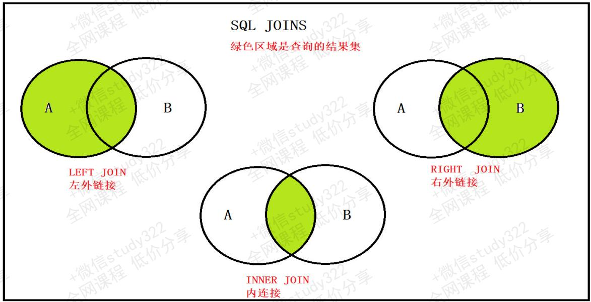

# 2) 驱动表的定义

什么是驱动表 ?

多表关联查询时,第⼀个被处理的表就是驱动表,使⽤驱动表去关联其他表.

驱动表的确定⾮常的关键,会直接影响多表关联的顺序,也决定后续关联查询的性能

驱动表的选择要遵循⼀个规则:

在对最终的结果集没有影响的前提下,优先选择结果集最⼩的那张表作为驱动表

# 3) 三种JOIN算法

# 1.Simple Nested-Loop Join（ 简单的嵌套循环连接 )

简单来说嵌套循环连接算法就是⼀个双层for 循环 ，通过循环外层表的⾏数据，逐个与内层表的所有⾏数据进⾏⽐较来获取结果.

这种算法是最简单的⽅案，性能也⼀般。对内循环没优化。

例如有这样⼀条SQL:

```
-- 连接用户表与订单表 连接条件是 u.id = o.user_id
select * from user t1 left join order t2 on t1.id = t2.user_id;
-- user表为驱动表, order表为被驱动表
```

转换成代码执⾏时的思路是这样的:

```
for(user表行 uRow : user表){
    for(Order表的行 oRow : order表){
    if(uRow.id = oRow.user_id){
    return uRow;
    }
    }
}
```

匹配过程如下图

1.每次从user表中获取一条记录

2.user表的每条记录，都要扫描order表的所有记录进行匹配

USER表

| ID      | NAME    |
| ------- | ------- |
| 1       | A1      |
| 2       | A2      |
| 3       | A3      |
| 4       | A4      |
| ... ... | ... ... |

Order表

SNL 的特点

简单粗暴容易理解，就是通过双层循环⽐较数据来获得结果

查询效率会⾮常慢,假设 A 表有 N ⾏，B 表有 M ⾏。SNL 的开销如下：

A 表扫描 1 次。

B 表扫描 M 次。

⼀共有 N 个内循环，每个内循环要 M 次，⼀共有内循环 N * M 次

1. Index Nested-Loop Join（ 索引嵌套循环连接 ）

Index Nested-Loop Join 其优化的思路: 主要是为了减少内层表数据的匹配次数 , 最⼤的区别在于，⽤来进⾏join 的字段已经在被驱动表中建⽴了索引。

从原来的 匹配次数 = 外层表⾏数 * 内层表⾏数 , 变成了 匹配次数 = 外层表的⾏数 * 内层表索引的⾼度 ，极⼤的提升了 join的性能。

当 order 表的 user_id 为索引的时候执⾏过程会如下图：

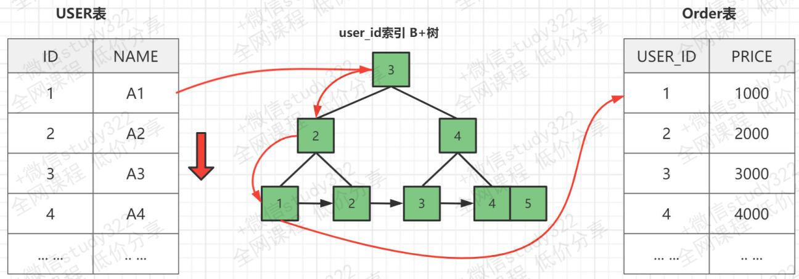

注意：使⽤Index Nested-Loop Join 算法的前提是匹配的字段必须建⽴了索引。

# 3) Block Nested-Loop Join( 块嵌套循环连接 )

如果 join 的字段有索引，MySQL 会使⽤ INL 算法。如果没有的话，MySQL 会如何处理？

因为不存在索引了，所以被驱动表需要进⾏扫描。这⾥ MySQL 并不会简单粗暴的应⽤ SNL 算法，⽽是加⼊了 buffer 缓冲区，降低了内循环的个数，也就是被驱动表的扫描次数。

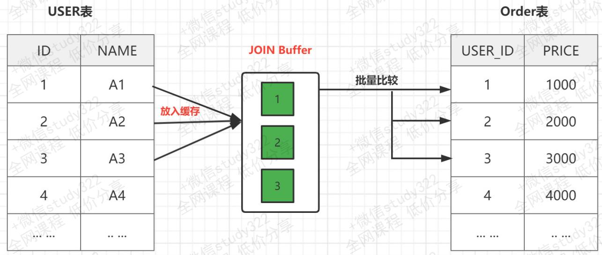

在外层循环扫描 user表中的所有记录。扫描的时候，会把需要进⾏ join ⽤到的列都缓存到 buffer 中。buffer 和 order表进⾏批量⽐较。

如果我们把 buffer 的空间开得很⼤，可以容纳下 user 表的所有记录，那么 order 表也只需要访问⼀次。

MySQL 默认 buffer ⼤⼩ 256K，如果有 n 个 join 操作，会⽣成 n-1 个 join buffer。

```
mysql> show variables like '%join_buffer%';
+----+----+
| Variable_name    | Value    |
+----+----+
| join_buffer_size  | 262144    |
+----+----+
mysql> set session join_buffer_size=262144;
Query OK, 0 rows affected (0.00 sec) 
```

# 4) 总结

1. 永远⽤⼩结果集驱动⼤结果集(其本质就是减少外层循环的数据数量)

1. 为匹配的条件增加索引(减少内层表的循环匹配次数)

1. 增⼤join buffer size的⼤⼩（⼀次缓存的数据越多，那么内层包的扫表次数就越少）

1. 减少不必要的字段查询（字段越少，join buffer 所缓存的数据就越多

# 2.in和exists函数

上⾯我们说了 ⼩表驱动⼤表,就是⼩的数据集驱动⼤的数据集, 主要是为了减少数据库的连接次数,根据具体情况的不同,⼜出现了两个函数 exists 和 in 函数

创建部⻔表与员⼯表,并插⼊数据

部⻔表

```
CREATE TABLE department (
    id INT(11) PRIMARY KEY,
    deptName VARCHAR(30),
    address VARCHAR(40)
); 
```

-- 部⻔表测试数据

```
INSERT INTO `department` VALUES (1, '研发部', '1层');
INSERT INTO `department` VALUES (2, '人事部', '3层');
INSERT INTO `department` VALUES (3, '市场部', '4层');
INSERT INTO `department` VALUES (5, '财务部', '2层');
```

员⼯表

```
CREATE TABLE employee (
    id INT(11) PRIMARY KEY,
    NAME VARCHAR(20), 
dep_id INT(11),
age INT(11),
salary DECIMAL(10, 2); 
```

# -- 员⼯表测试数据

```
INSERT INTO `employee` VALUES (1, '鲁班', 1, 15, 1000.00);
INSERT INTO `employee` VALUES (2, '后裔', 1, 22, 2000.00);
INSERT INTO `employee` VALUES (4, '阿凯', 2, 20, 3000.00);
INSERT INTO `employee` VALUES (5, '露娜', 2, 30, 3500.00);
INSERT INTO `employee` VALUES (6, '李白', 3, 25, 5000.00);
INSERT INTO `employee` VALUES (7, '韩信', 3, 50, 5000.00);
INSERT INTO `employee` VALUES (8, '蔡文姬', 3, 35, 4000.00);
INSERT INTO `employee` VALUES (3, '孙尚香', 4, 20, 2500.00);
```

# 1) in 函数

假设: department表的数据⼩于 employee表数据, 将所有部⻔下的员⼯都查出来,应该使⽤ in 函数

-- 编写SQL,使in 函数

```
SELECT * FROM employee e WHERE e.dep_id IN (SELECT id FROM department); 
```

# in函数的执⾏原理

1. in 语句, 只执⾏⼀次, 将 department 表中的所有id字段查询出来并且缓存.

1. 检查 department 表中的id与 employee 表中的 dep_id 是否相等, 如果相等 添加到结果集, 直到遍历完 department 所有的记录.

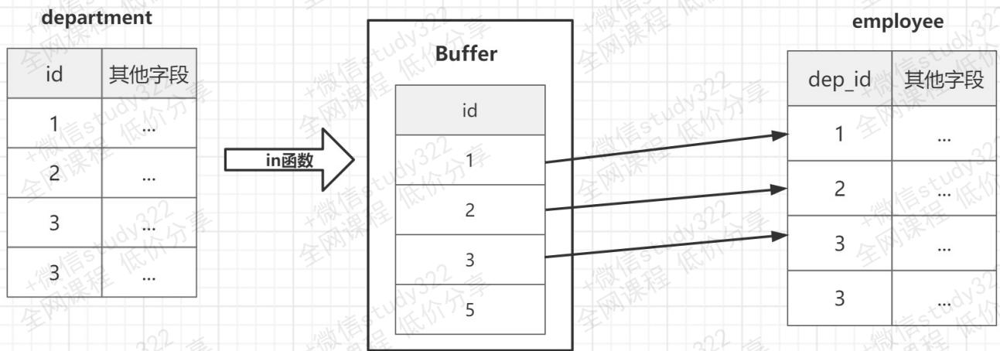

```
-- 先循环：select id from department；相当于得到了小表的数据
for(i = 0; i < $dept.length; i++) { -- 小表
    -- 后循环：select * from employee where e.dep_id = d.id;
    for(j = 0; j < $emp.legth; j++) { -- 大表

    if($dept[i].id == $emp[j].dep_id) {
    $result[i] = $emp[j]
    break;
    }
    }
}
```

结论: 如果⼦查询得出的结果集记录较少，主查询中的表较⼤且⼜有索引时应该⽤ in

# 2) exists 函数

假设: department表的数据⼤于 employee表数据, 将所有部⻔下的的员⼯都查出来,应该使⽤ exists 函数.

```
explain SELECT * FROM employee e WHERE EXISTS
(SELECT id FROM department d WHERE d.id = e.dep_id); 
```

exists 特点

exists ⼦句返回的是⼀个 布尔值，如果有返回数据，则返回值是 true ，反之是 false 。

如果结果为 true , 外层的查询语句会进⾏匹配,否则 外层查询语句将不进⾏查询或者查不出任何记录。

exists(sub)只返回true或者false

```
explain SELECT * FROM employee e WHERE EXISTS (SELECT id FROM department d WHERE d.id = e.dep_id); 
```

exists 函数的执⾏原理

```
-- 先循环：SELECT * FROM employee e;
-- 再判断：SELECT id FROM department d WHERE d.id = e.dep_id
for(j = 0; j < $emp.length; j++) { -- 小表
-- 遍历循环外表，检查外表中的记录有没有和内表的的数据一致的，匹配得上就放入结果集。
if(exists(emp[i].dep_id)) { -- 大表
    $result[i] = $emp[i];
    }
}
```

# 3) in 和 exists 的区别

如果⼦查询得出的结果集记录较少，主查询中的表较⼤且⼜有索引时应该⽤ in

如果主查询得出的结果集记录较少，⼦查询中的表较⼤且⼜有索引时应该⽤ exists

⼀句话: in后⾯跟的是⼩表，exists后⾯跟的是⼤表。

# order by优化

MySQL中的两种排序⽅式

索引排序: 通过有序索引顺序扫描直接返回有序数据

额外排序: 对返回的数据进⾏⽂件排序

ORDER BY优化的核⼼原则: 尽量减少额外的排序，通过索引直接返回有序数据。

# 1.索引排序

因为索引的结构是B+树，索引中的数据是按照⼀定顺序进⾏排列的，所以在排序查询中如果能利⽤索引，就能避免额外的排序操作。EXPLAIN分析查询时，Extra显示为Using index。

联合索引:idx_nal(use_name,user _age,user_level)

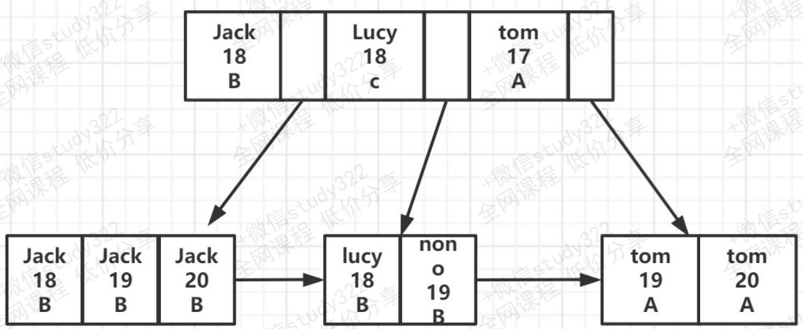

⽐如查询条件是 where age = 21 order by name ，那么查询过程就是会找到满⾜ age = 21 的记录，⽽符合这条的所有记录⼀定是按照 name 排序的，所以也不需要额外进⾏排序.

# 2.额外排序

所有不是通过索引直接返回排序结果的操作都是Filesort排序，也就是说进⾏了额外的排序操作。EXPLAIN分析查询时，Extra显示为Using filesort。

# 1) 按执⾏位置划分

Sort_Buffer

MySQL 为每个线程各维护了⼀块内存区域 sort_buffer ，⽤于进⾏排序。sort_buffer 的⼤⼩可以通过sort_buffer_size 来设置。

```
mysql> show variables like '%sort_buffer_size%';
+----+
| Variable_name    | Value |
+----+
| sort_buffer_size    | 262144 |
+----+
mysql> select 262144 / 1024;
+----+
| 262144 / 1024 |
+----+
| 256.0000 |
+----+ 
```

注: sort_Buffer_Size 并不是越⼤越好，由于是connection级的参数，过⼤的设置+⾼并发可能会耗尽系统内存资源。

Sort_Buffer + 临时⽂件

如果加载的记录字段总⻓度（可能是全字段也可能是 rowid排序的字段）⼩于 sort_buffer_size 便使⽤sort_buffer 排序；如果超过则使⽤ sort_buffer + 临时⽂件进⾏排序。

临时⽂件种类：

临时表种类由参数 tmp_table_size 与临时表⼤⼩决定，如果内存临时表⼤⼩超过 tmp_table_size ，那么就会转成磁盘临时表。因为磁盘临时表在磁盘上，所以使⽤内存临时表的效率是⼤于磁盘临时表的。

# 2) 按执⾏⽅式划分

执⾏⽅式是由 max_length_for_sort_data 参数与⽤于排序的单条记录字段⻓度决定的，如果⽤于排序的单条记录字段⻓度 <= max_length_for_sort_data ，就使⽤全字段排序；反之则使⽤ rowid 排序。

```
mysql> show variables like 'max_length_for_sort_data';
+----+
| Variable_name    | Value |
+----+
| max_length_for_sort_data | 1024 |
+----+ 
```

# 2.1) 全字段排序

全字段排序就是将查询的所有字段全部加载进来进⾏排序。

优点：查询快，执⾏过程简单

缺点：需要的空间⼤。

select name,age,add from user where addr = '北京' order by name limit 1000; -- addr有索引

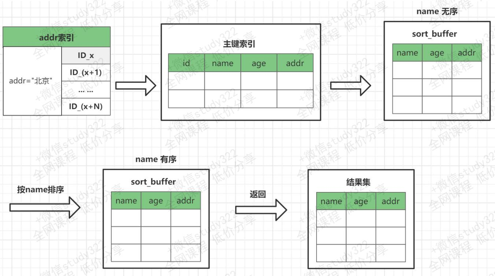

上⾯查询语句的执⾏流程:

1. 初始化 sort_buffer，确定放⼊ name、age、addr 这3个字段。

1. 从索引 addr 中找到第⼀个满⾜ addr=’北京’ 的主键ID（ID_x）。

1. 到主键索引中找到 ID_x，取出整⾏，取 name、addr、age 3个字段的值，存⼊ sort_buffer。

1. 从索引 addr 取下⼀个记录的主键ID。

1. 重复3、4，直到 addr 值不满⾜条件。

1. 对 sort_buffer 中的数据按照 name 做快速排序。

1. 把排序结果中的前1000⾏返回给客户端。

# 2.2) rowid排序

rowid 排序相对于全字段排序，不会把所有字段都放⼊sort_buffer。所以在sort buffer中进⾏排序之后还得回表查询。

缺点：会产⽣更多次数的回表查询，查询可能会慢⼀些。

优点：所需的空间更⼩

select name,age,add from user where addr = '北京' order by name limit 1000; -- addr有索引

假设 name、age、addr3个字段定义的总⻓度为36，⽽ max_length_for_sort_data = 16，就是单⾏的⻓度超了，MySQL认为单⾏太⼤，需要换⼀个算法。

放⼊ sort_buffer 的字段就会只有要排序的字段 name，和主键 id，那么排序的结果中就少了 addr 和 age，就需要回表了。

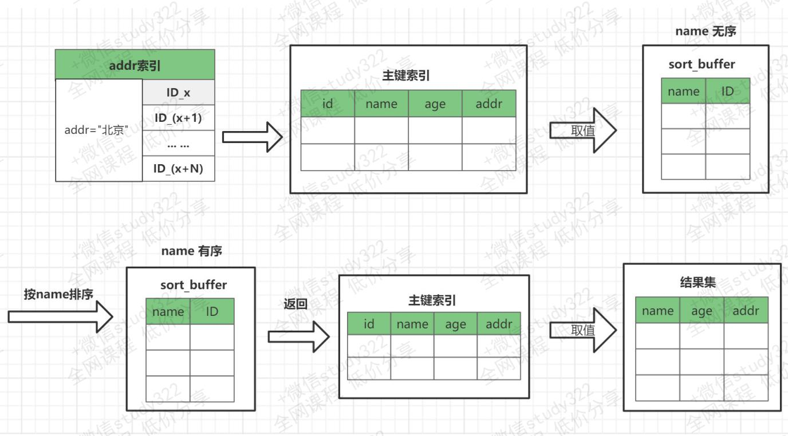

# 上⾯查询语句的执⾏流程:

1. 初始化 sort_buffer，确定放⼊2个字段，name 和 id。

1. 从索引 addr 中找到第⼀个满⾜addr=’北京’的主键ID（ID_x）。

1. 到主键索引中取出整⾏，把 name、id 这2个字段放⼊ sort_buffer。

1. 从索引 addr 取下⼀个记录的主键ID。

1. 重复3、4，直到addr值不满⾜条件。

1. 对 sort_buffer 中的数据按照 name 做快速排序。

1. 取排序结果中的前1000⾏，并按照 id 的值到原表中取出 name、age、addr 3个字段的值返回给客户端。

# 总结

如果 MySQL 认为内存⾜够⼤，会优先选择全字段排序，把需要的字段都放到 sort_buffer中， 这样排序后就会直接从内存⾥⾯返回查询结果了，不⽤再回到原表去取数据。

MySQL 的⼀个设计思想：如果内存够，就要多利⽤内存，尽量减少磁盘访问。 对于 InnoDB 表来说，rowid排序会要求回表多造成磁盘读，因此不会被优先选择。

# 3.排序优化

# 添加索引

为 employee 表 创建索引

- 联合索引

ALTER TABLE employee ADD INDEX idx_name_age(NAME,age);

-- 为薪资字段添加索引

ALTER TABLE employee ADD INDEX idx_salary(salary);

查看 employee 表的索引情况

SHOW INDEX FROM employee;

| Table    | Non_unique | Key_name       | Seq_in_index | Column_name | Collation | Cardinality | Sub_part | Packed | Null | Index_type | C    |
| -------- | ---------- | -------------- | ------------ | ----------- | --------- | ----------- | -------- | ------ | ---- | ---------- | ---- |
| employee |            | 0 PRIMARY      |              | 1 id        | A         | 8           | (Null)   | (Null) |      | BTREE      |      |
| employee |            | 1 idx_name_age |              | 1 NAME      | A         | 8           | (Null)   | (Null) | YES  | BTREE      |      |
| employee |            | 1 idx_name_age |              | 2 age       | A         | 8           | (Null)   | (Null) | YES  | BTREE      |      |
| employee |            | 1 idx_salary   |              | 1 salary    | A         | 7           | (Null)   | (Null) | YES  | BTREE      |      |

# 场景1: 只查询⽤于排序的 索引字段, 可以利⽤索引进⾏排序,最左原则

查询 name, age 两个字段, 并使⽤ name 与 age ⾏排序

EXPLAIN SELECT e.name, e.age FROM employee e ORDER BY e.name,e.age;

| id   | select_type | table | partitions | type  | possible_keys | key          | key_len | ref    | rows | filtered | Extra              |
| ---- | ----------- | ----- | ---------- | ----- | ------------- | ------------ | ------- | ------ | ---- | -------- | ------------------ |
| 1    | SIMPLE      | e     | (Null)     | index | (Null)        | idx_name_age | 68      | (Null) |      | 8        | 100.00 Using index |

# 场景2: 排序字段在多个索引中,⽆法使⽤索引排序

查询 name , salary 字段, 并使⽤ name 与 salary 排序

EXPLAIN SELECT e.name, e.salary FROM employee e ORDER BY e.name,e.salary;

| id   | select_type | table | partitions | type | possible_keys | key    | key_len | ref    | rows | filtered | Extra          |
| ---- | ----------- | ----- | ---------- | ---- | ------------- | ------ | ------- | ------ | ---- | -------- | -------------- |
| 1    | SIMPLE      | e     | (Null)     | ALL  | (Null)        | (Null) | (Null)  | (Null) | 8    | 100.00   | Using filesort |

# 场景3: 只查询⽤于排序的索引字段和主键, 可以利⽤索引进⾏排序

查询 id , name , 使⽤ name 排序

EXPLAIN SELECT e.id, e.name FROM employee e ORDER BY e.name;

| id   | select_type | table | partitions | type  | possible_keys | key        | key_len | ref  | rows | filtered           | Extra |
| ---- | ----------- | ----- | ---------- | ----- | ------------- | ---------- | ------- | ---- | ---- | ------------------ | ----- |
| 1    | SIMPLE      | e     | (Null)     | index | (Null)        | idx_name68 | (Null)  |      | 8    | 100.00 Using index |       |

# 场景4: 查询主键之外的没有添加索引的字段，不会利⽤索引排序

查询 dep_id ,使⽤ name 进⾏排序

EXPLAIN SELECT e.dep_id FROM employee e ORDER BY e.name;

| id   | select_type | table | partitions | type | possible_keys | key    | key_len | ref    | rows   | filtered | Extra                                                        |
| ---- | ----------- | ----- | ---------- | ---- | ------------- | ------ | ------- | ------ | ------ | -------- | ------------------------------------------------------------ |
| 1    | SIMPLE      | e     | (Null)     | ALL  | (Null)        | (Null) | (Null)  | (Null) | (Null) | 8        | 100.0000000000000000000000000000000000000000000000000000000000000000000000000000000000000000000000000000 |

# 场景5: 排序字段顺序与索引列顺序不⼀致,⽆法利⽤索引排序

使⽤联合索引时, ORDER BY⼦句也要求, 排序字段顺序和联合索引列顺序匹配。

```
EXPLAIN SELECT e.name, e.age FROM employee e ORDER BY e.age,e.name; 
```

| id   | select_type | table | partitions | type  | possible_keys | key      | key_len | ref    | rows | filtered | Extra                       |
| ---- | ----------- | ----- | ---------- | ----- | ------------- | -------- | ------- | ------ | ---- | -------- | --------------------------- |
| 1    | SIMPLE      | e     | (Null)     | index | (Null)        | idx_name | 68      | (Null) | 8    | 100.00   | Using index; Using filesort |

# 场景6: where 条件是 范围查询时, 会使order by 索引 失效

⽐如 添加⼀个条件 : age > 18 ,然后再根据 age 排序.

```
EXPLAIN SELECT e.name, e.age FROM employee e WHERE e.age > 10 ORDER BY e.age; 
```

| id   | select_type | table | partitions | type  | possible_keys | key        | key_len | ref    | rows | filtered | Extra                                          |
| ---- | ----------- | ----- | ---------- | ----- | ------------- | ---------- | ------- | ------ | ---- | -------- | ---------------------------------------------- |
| 1    | SIMPLE      | e     | (Null)     | index | idx_name_age  | idx_name68 |         | (Null) |      | 8        | 33.33 Using where; Using index; Using filesort |

注意: ORDERBY⼦句不要求必须索引中第⼀列,没有仍然可以利⽤索引排序。但是有个前提条件，只有在等值过滤时才可以，范围查询时不

```
EXPLAIN SELECT e.name, e.age FROM employee e WHERE e.age = 18 ORDER BY e.age; 
```

| id   | select_type | table | partitions | type  | possible_keys | key      | key_len | ref    | rows | filtered | Extra                    |
| ---- | ----------- | ----- | ---------- | ----- | ------------- | -------- | ------- | ------ | ---- | -------- | ------------------------ |
| 1    | SIMPLE      | e     | (Null)     | index | idx_name_age  | idx_name | 68      | (Null) | 8    | 12.50    | Using where; Using index |

# 场景7: 升降序不⼀致,⽆法利⽤索引排序

ORDER BY排序字段要么全部正序排序，要么全部倒序排序，否则⽆法利⽤索引排序。

- 升序

```
EXPLAIN SELECT e.name, e.age FROM employee e ORDER BY e.name, e.age; 
```

-- 降序

```
EXPLAIN SELECT e.name, e.age FROM employee e ORDER BY e.name DESC, e.age DESC; 
```

| id   | select_type | table | partitions | type  | possible_keys | key      | key_len | ref    | rows | filtered | Extra              |
| ---- | ----------- | ----- | ---------- | ----- | ------------- | -------- | ------- | ------ | ---- | -------- | ------------------ |
| 1    | SIMPLE      | e     | (Null)     | index | (Null)        | idx_name | 68      | (Null) |      | 8        | 100.00 Using index |

name字段升序,age字段降序,索引失效

```
EXPLAIN SELECT e.name, e.age FROM employee e ORDER BY e.name, e.age DESC; 
```

| id   | select_type | table | partitions | type  | possible_keys | key      | key_len | ref    | rows | filtered | Ext  |
| ---- | ----------- | ----- | ---------- | ----- | ------------- | -------- | ------- | ------ | ---- | -------- | ---- |
| 1    | SIMPLE      | e     | (Null)     | index | (Null)        | idx_name | 68      | (Null) | 8    | 100.00   | Us   |

# 索引单表优化案例

# 1. 建表

创建表 插⼊数据

下⾯是⼀张⽤户通讯表的表结构信息,这张表来源于真实企业的实际项⽬中,有接近500万条数据.

```
CREATE TABLE user_contacts (
    id INT(11) NOT NULL AUTO_INCREMENT,
    user_id INT(11) DEFAULT NULL COMMENT '用户标识',
    mobile VARCHAR(50) DEFAULT NULL COMMENT '手机号',
    NAME VARCHAR(20) DEFAULT NULL COMMENT '姓名',
    verson INT(11) NOT NULL DEFAULT '0' COMMENT '版本',
    create_by VARCHAR(64) DEFAULT NULL COMMENT '创建者',
    create_date DATETIME NOT NULL COMMENT '创建时间',
    update_by VARCHAR(64) DEFAULT NULL COMMENT '更新者',
    update_date DATETIME NOT NULL COMMENT '更新时间',
    remarks VARCHAR(255) DEFAULT NULL COMMENT '备注信息',
    del_flag CHAR(1) NOT NULL DEFAULT '0' COMMENT '删除标识',
    PRIMARY KEY (id)
);
```

数据：课后资料 sql脚本中（测试前需删除表全部索引）

# 2. 单表索引分析

# 需求⼀:

查询所有名字中包含李的⽤户姓名和⼿机号,并根据user_id字段排序

```
SELECT NAME, mobile FROM user_contacts WHERE NAME LIKE '李%' ORDER BY user_id;
```

通过explain命令 查看SQL查询优化信息

```
EXPLAIN SELECT NAME, mobile FROM user_contacts WHERE NAME LIKE '%李%' ORDER BY user_id;
```

| 信息 | 结果 1      | 剖析          | 状态       |      |               |        |         |        |         |          |                             |      |
| ---- | ----------- | ------------- | ---------- | ---- | ------------- | ------ | ------- | ------ | ------- | -------- | --------------------------- | ---- |
| id   | select_type | table         | partitions | type | possible_keys | key    | key_len | ref    | rows    | filtered | Extra                       |      |
| 1    | SIMPLE      | user_contacts | (Null)     | ALL  | (Null)        | (Null) | (Null)  | (Null) | 4496491 | 11.11    | Using where; Using filesort |      |

结论：很显然type是ALL，即最坏情况。Extra⾥还出现Using filesort（⽂件内排序,未使⽤到索引），也是最坏情况，所以优化是必须的。

# 优化

1. ⾸先添加联合索引, 该联合索引包含所有要查询的字段,使其成为覆盖索引,⼀并解决like模糊查询时索引失效问题

-- 添加联合索引

```
ALTER TABLE user_contacts ADD INDEX idx_nmu(NAME, mobile, user_id); 
```

1. 进⾏分析

```
EXPLAIN SELECT NAME, mobile FROM user_contacts WHERE NAME LIKE '%李%' ORDER BY user_id;
```

1. 结果: type的类型提升到了index, 但是 Using filesort 还有.

| 信息 | 结果 1      | 剖析   | 状态          |            |                      |             |             |            |              |                                                         |      |
| ---- | ----------- | ------ | ------------- | ---------- | -------------------- | ----------- | ----------- | ---------- | ------------ | ------------------------------------------------------- | ---- |
| id   | select_type | table  | partitions    | type index | possible_keys (Null) | key idx_nmu | key_len 221 | ref (Null) | rows 4496491 | filtered 11.11 Using where; Using index; Using filesort |      |
| ▶    | 1           | SIMPLE | user_contacts | (Null)     |                      |             |             |            |              |                                                         |      |

分析结果显示: type连接类型提升到了index级别,通过索引就获取到了全部数据,但是Extra字段中还是存在Using filesort.

1. 继续优化: 根根据最佳左前缀法则,之后最左侧列是有序的, 在创建联合索引时,正确的顺序应该是:user_id,NAME,mobile

删除索引

```
DROP INDEX idx_nmu ON user_contacts 
```

-- 添加重新排序后的索引

```
ALTER TABLE user_contacts ADD INDEX idx_unm(user_id,NAME,mobile); 
```

1. 执⾏查询,发现type=index , Using filesort没有了.

```
EXPLAIN SELECT NAME, mobile FROM user_contacts WHERE NAME LIKE '%李%' ORDER BY user_id;
```

| id   | select_type | table         | partitions | type  | possible_keys | key     | key_len | ref    | rows    | filtered | Extra                    |
| ---- | ----------- | ------------- | ---------- | ----- | ------------- | ------- | ------- | ------ | ------- | -------- | ------------------------ |
| 1    | SIMPLE      | user_contacts | (Null)     | index | (Null)        | idx_unm | 221     | (Null) | 4496491 | 11.11    | Using where; Using index |

# 需求⼆:

统计⼿机号是135、136、186、187开头的⽤户数量.

```
EXPLAIN SELECT COUNT(*) FROM user_contacts
WHERE mobile LIKE '135%' OR mobile LIKE '136%' OR mobile LIKE '186%' OR mobile LIKE '187%; 
```

通过explain命令 查看SQL查询优化信息

| 信息 | 结果 1      | 剖析          | 状态       |       |               |         |         |        |         |          |                          |
| ---- | ----------- | ------------- | ---------- | ----- | ------------- | ------- | ------- | ------ | ------- | -------- | ------------------------ |
| id   | select_type | table         | partitions | type  | possible_keys | key     | key_len | ref    | rows    | filtered | Extra                    |
| 1    | SIMPLE      | user_contacts | (Null)     | index | (Null)        | idx_unm | 221     | (Null) | 4496491 | 37.57    | Using where; Using index |

type=index : ⽤到了索引,但是进⾏了索引全表扫描

key=idx_unm : 使⽤到了联合索引,但是效果并不是很好

Extra=Using where; Using index : 查询的列被索引覆盖了,但是⽆法通过该索引直接获取数据.

综合上⾯的执⾏计划给出的信息,需要进⾏优化.

# 优化

1. 经过上⾯的分析,发现联合索引没有发挥作⽤,所以尝试对 mobile字段单独建⽴索引

```
ALTER TABLE user_contacts ADD INDEX idx_m(mobile); 
```

1. 再次执⾏,得到下⾯的分析结果

```
EXPLAIN SELECT COUNT(*) FROM user_contacts
WHERE mobile LIKE '135%' OR mobile LIKE '136%' OR mobile LIKE '186%' OR mobile LIKE '187%; 
```

| 信息 | 结果1       | 剖析          | 状态       |       |               |       |         |        |         |          |                          |      |
| ---- | ----------- | ------------- | ---------- | ----- | ------------- | ----- | ------- | ------ | ------- | -------- | ------------------------ | ---- |
| id   | select_type | table         | partitions | type  | possible_keys | key   | key_len | ref    | rows    | filtered | Extra                    |      |
| 1    | SIMPLE      | user_contacts | (Null)     | range | idx_m         | idx_m | 153     | (Null) | 1575026 | 100.00   | Using where; Using index |      |

type=range : 使⽤了索引进⾏范围查询,常⻅于使⽤>，>=，<，<=，BETWEEN，IN() 或者 like 等运算符的查询中。

key=idx_m : mysql选择了我们为mobile字段创建的索引,进⾏数据检索

rows=1575026 : 为获取所需数据⽽进⾏扫描的⾏数,⽐之前减少了近三分之⼀

count(*) 和 count(1)和count(列名)区别

进⾏统计操作时,count中的统计条件可以三种选择:

```
EXPLAIN SELECT COUNT(*) FROM user_contacts
WHERE mobile LIKE '135%' OR mobile LIKE '136%' OR mobile LIKE '186%' OR mobile LIKE '187%;

EXPLAIN SELECT COUNT(id) FROM user_contacts
WHERE mobile LIKE '135%' OR mobile LIKE '136%' OR mobile LIKE '186%' OR mobile LIKE '187%;

EXPLAIN SELECT COUNT(1) FROM user_contacts
WHERE mobile LIKE '135%' OR mobile LIKE '136%' OR mobile LIKE '186%' OR mobile LIKE '187%; 
```

执⾏效果:

count(*) 包括了所有的列,在统计时 不会忽略列值为null的数据.

count(1) ⽤1表示代码⾏,在统计时,不会忽略列值为null的数据.

count(列名)在统计时,会忽略列值为空的数据,就是说某个字段的值为null时不统计.

执⾏效率:

列名为主键, count(列名)会⽐count(1)快

列名为不是主键, count(1)会⽐count(列名)快

如果表没有主键,count(1)会⽐count(*)快

如果表只有⼀个字段,则count(*) 最优.

# 需求三:

查询2017-2-16⽇,新增的⽤户联系⼈信息. 查询字段: name , mobile

```
EXPLAIN SELECT NAME, mobile FROM user_contacts WHERE DATE_FORMAT(create_date, '%Y-%m-%d')='2017-02-16'; 
```

| 信息 | 结果1       | 剖析   | 状态          |        |               |        |         |        |        |          |        |             |
| ---- | ----------- | ------ | ------------- | ------ | ------------- | ------ | ------- | ------ | ------ | -------- | ------ | ----------- |
| id   | select_type | table  | partitions    | type   | possible_keys | key    | key_len | ref    | rows   | filtered | Extra  |             |
| ▶    | 1           | SIMPLE | user_contacts | (Null) | ALL           | (Null) | (Null)  | (Null) | (Null) | 4496491  | 100.00 | Using where |

# 优化:

explain分析的结果显示 type=ALL : 进⾏了全表扫描,需要进⾏优化,为create_date字段添加索引.

```
ALTER TABLE user_contacts ADD INDEX idx_cd(create_date); 
EXPLAIN SELECT NAME, mobile FROM user_contacts WHERE DATE_FORMAT(create_date, '%Y-%m-%d') = '2017-02-16'; 
```

| 信息 | 结果1       | 剖析          | 状态       |      |               |        |         |        |         |          |
| ---- | ----------- | ------------- | ---------- | ---- | ------------- | ------ | ------- | ------ | ------- | -------- |
| id   | select_type | table         | partitions | type | possible_keys | key    | key_len | ref    | rows    | filtered |
| 1    | SIMPLE      | user_contacts | (Null)     | ALL  | (Null)        | (Null) | (Null)  | (Null) | 4496491 | 100.0    |

添加索引后,发现并没有使⽤到索引 key=null

分析原因: create_date字段是datetime类型 ,转换为⽇期再匹配,需要查询出所有⾏进⾏过滤, 所以导致索引失效.

# 继续优化:

改为使⽤ between ... and ... ,使索引⽣效

```
EXPLAIN SELECT NAME, mobile FROM user_contacts WHERE create_date BETWEEN '2017-02-16 00:00:00' AND '2017-02-16 23:59:59'; 
```

| 信息 | 结果1       | 剖析          | 状态       |       |               |        |         |        |       |          |                                  |
| ---- | ----------- | ------------- | ---------- | ----- | ------------- | ------ | ------- | ------ | ----- | -------- | -------------------------------- |
| id   | select_type | table         | partitions | type  | possible_keys | key    | key_len | ref    | rows  | filtered | Extra                            |
| 1    | SIMPLE      | user_contacts | (Null)     | range | idx_cd        | idx_cd | 5       | (Null) | 23810 | 100.00   | Using index condition; Using MRR |

type=range : 使⽤了索引进⾏范围查询

Extra=Using index condition; Using MRR :Using index condition 表示使⽤了部分索引, MRR表示InnoDB存储引擎 通过把「随机磁盘读」，转化为「顺序磁盘读」,从⽽提⾼了索引查询的性能.

# 需求四:

获取⽤户通讯录表第10万条数据开始后的100条数据.

```
EXPLAIN SELECT * FROM user_contacts uc LIMIT 100000,100;
-- 查询记录量越来越大，所花费的时间也会越来越多
EXPLAIN SELECT * FROM user_contacts uc LIMIT 1000000,1000;
EXPLAIN SELECT * FROM user_contacts uc LIMIT 2000000,10000;
EXPLAIN SELECT * FROM user_contacts uc LIMIT 3000000,100000;
```

| id   | select_type | table | partitions | type | possible_keys | key    | key_len | ref    | rows    | filtered | Extra  |
| ---- | ----------- | ----- | ---------- | ---- | ------------- | ------ | ------- | ------ | ------- | -------- | ------ |
| 1    | SIMPLE      | uc    | (Null)     | ALL  | (Null)        | (Null) | (Null)  | (Null) | 4496491 | 100.00   | (Null) |

LIMIT ⼦句可以被⽤于指定 SELECT 语句返回的记录数。需注意以下⼏点：

第⼀个参数指定第⼀个返回记录⾏的偏移量，注意从0开始()

第⼆个参数指定返回记录⾏的最⼤数⽬

如果只给定⼀个参数：它表示返回最⼤的记录⾏数⽬

初始记录⾏的偏移量是 0(⽽不是 1)

优化1: 通过索引进⾏分⻚

直接进⾏limit操作 会产⽣全表扫描,速度很慢. Limit限制的是从结果集的M位置处取出N条输出,其余抛弃.假设ID是连续递增的,我们根据查询的⻚数和查询的记录数可以算出查询的id的范围，然后配合

```
EXPLAIN SELECT * FROM user_contacts WHERE id >= 100001 LIMIT 100; 
```

| 信息 | 结果1       | 剖析          | 状态       |       |               |         |         |        |         |          |             |
| ---- | ----------- | ------------- | ---------- | ----- | ------------- | ------- | ------- | ------ | ------- | -------- | ----------- |
| id   | select_type | table         | partitions | type  | possible_keys | key     | key_len | ref    | rows    | filtered | Extra       |
| 1    | SIMPLE      | user_contacts | (Null)     | range | PRIMARY       | PRIMARY | 4       | (Null) | 2248245 | 100.00   | Using where |

type类型提升到了 range级别

优化2: 使⽤⼦查询优化

⾸先定位偏移位置的id

```
SELECT id FROM user_contacts LIMIT 100000,1; 
```

-- 根据获取到的id值向后查询.

```
EXPLAIN SELECT * FROM user_contacts WHERE id >= (SELECT id FROM user_contacts LIMIT 100000,1) LIMIT 100; 
```

| id   | select_type | table         | partitions | type  | possible_keys | key     | key_len | ref    | rows    | filtered | Extra       |
| ---- | ----------- | ------------- | ---------- | ----- | ------------- | ------- | ------- | ------ | ------- | -------- | ----------- |
| 1    | PRIMARY     | user_contacts | (Null)     | range | PRIMARY       | PRIMARY | 4       | (Null) | 2248245 | 100.00   | Using where |
| 2    | SUBQUERY    | user_contacts | (Null)     | index | (Null)        | idx_cd  | 5       | (Null) | 4496491 | 100.00   | Using index |

# 索引多表优化案例

⽤户⼿机认证表

该表约有11万数据,保存的是通过⼿机认证后的⽤户数据

关联字段: user_id

```
CREATE TABLE `mob_autht` (
    `id` int(11) NOT NULL AUTO_INCREMENT COMMENT '标识',
    `user_id` int(11) NOT NULL COMMENT '用户标识',
    `mobile` varchar(11) NOT NULL COMMENT '手机号码',
    `seevc_pwd` varchar(12) NOT NULL COMMENT '服务密码',
    `autht_indc` varchar(1) NOT NULL DEFAULT '0' COMMENT '认证标志',
    `verson` int(11) NOT NULL DEFAULT '0' COMMENT '版本',
    `create_by` varchar(64) DEFAULT NULL COMMENT '创建者',
    `create_date` datetime NOT NULL COMMENT '创建时间',
    `update_by` varchar(64) DEFAULT NULL COMMENT '更新者',
    `update_date` datetime NOT NULL COMMENT '更新时间',
    `remarks` varchar(255) DEFAULT NULL COMMENT '备注信息',
    `del_flag` char(1) NOT NULL DEFAULT '0' COMMENT '删除标识',
    PRIMARY KEY (`id`)
);
```

紧急联系⼈表

该表约有22万数据,注册成功后,⽤户添加的紧急联系⼈信息.

关联字段: user_id

```
CREATE TABLE `ugncy_cntct_psn` (
    `id` int(11) NOT NULL AUTO_INCREMENT COMMENT '标识',
    `psn_info_id` int(11) DEFAULT NULL COMMENT '个人信息标识',
    `user_id` int(11) NOT NULL COMMENT '向钱用户标识',
    `cntct_psn_name` varchar(10) NOT NULL COMMENT '联系人姓名',
    `cntct_psn_mob` varchar(11) NOT NULL COMMENT '联系手机号',
    `and_self_rltn_cde` char(2) NOT NULL COMMENT '与本人关系代码 字典表关联',
    `verson` int(11) NOT NULL DEFAULT '0' COMMENT '版本',
    `create_by` varchar(64) DEFAULT NULL COMMENT '创建者',
    `create_date` datetime NOT NULL COMMENT '创建时间',
    `update_by` varchar(64) DEFAULT NULL COMMENT '更新者',
    `update_date` datetime NOT NULL COMMENT '更新时间',
    `remarks` varchar(255) DEFAULT NULL COMMENT '备注信息',
    `del_flag` char(1) NOT NULL DEFAULT '0' COMMENT '删除标识',
    PRIMARY KEY (`id`)
);
```

# 借款申请表

该表约有11万数据,保存的是每次⽤户申请借款时 填写的信息.

关联字段: user_id

```
CREATE TABLE `loan_apply` (
    `id` INT(11) NOT NULL AUTO_INCREMENT COMMENT '借款申请标识',
    `loan_nbr` VARCHAR(50) NOT NULL COMMENT '借款编号',
    `user_id` INT(11) NOT NULL COMMENT '用户标识',
    `idnt_info_id` INT(11) DEFAULT NULL COMMENT '身份信息标识',
    `psn_info_id` INT(11) DEFAULT NULL COMMENT '个人信息标识',
    `mob_autht_id` INT(11) DEFAULT NULL COMMENT '手机认证标识',
    `bnk_card_id` INT(11) DEFAULT NULL COMMENT '银行卡标识',
    `apply_limit` DECIMAL(16,2) NOT NULL DEFAULT '0.00' COMMENT '申请额度',
    `apply_tlmt` INT(3) NOT NULL COMMENT '申请期限',
    `apply_time` DATETIME NOT NULL COMMENT '申请时间',
    `audit_limit` DECIMAL(16,2) NOT NULL COMMENT '审核额度',
    `audit_tlmt` INT(3) NOT NULL COMMENT '审核期限',
    `audit_time` DATETIME DEFAULT NULL COMMENT '审核时间',
    `cfrm_limit` DECIMAL(16,2) NOT NULL DEFAULT '0.00' COMMENT '确认额度',
    `cfrm_tlmt` INT(3) NOT NULL COMMENT '确认期限',
    `cfrm_time` DATETIME DEFAULT NULL COMMENT '确认时间',
    `loan_sts_cde` CHAR(1) NOT NULL COMMENT '借款状态:0 未提交 1 提交申请(初始) 2 已校验 3 通过审核4 未通过审核 5开始放款 6放弃借款 7 放款成功',
    `audit_mod_cde` CHAR(1) NOT NULL COMMENT '审核模式: 1 人工 2 智能',
    `day_rate` DECIMAL(16,8) NOT NULL DEFAULT '0.00000000' COMMENT '日利率',
    `seevc_fee_day_rate` DECIMAL(16,8) NOT NULL DEFAULT '0.00000000' COMMENT '服务费日利率',
    `normal_paybk_tot_day_rate` DECIMAL(16,8) NOT NULL DEFAULT '0.00000000' C:\on\on\on\on\on\on\on\on\on\on\on\on\on\on\on\on\on\on\on\on\on\end
`ovrdu_fee_day_rate` DECIMAL(16,8) DEFAULT NULL COMMENT '逾期违约金日利率',
`day_intr_amt` DECIMAL(16,2) NOT NULL DEFAULT '0.00' COMMENT '日利率金额',
`seevc_fee_day_intr_amt` DECIMAL(16,2) NOT NULL DEFAULT '0.00' COMMENT '服务日利率金额',
`normal_paybk_tot_intr_amt` DECIMAL(16,2) NOT NULL DEFAULT '0.00' COMMENT '综合日利率金额',
`cnl_resn_time` DATETIME DEFAULT NULL COMMENT '放弃时间',
`cnl_resn_cde` CHAR(8) DEFAULT NULL COMMENT '放弃原因：关联字典代码',
`cnl_resn_othr` VARCHAR(255) DEFAULT NULL COMMENT '放弃的其他原因',
`verson` INT(11) NOT NULL DEFAULT '0' COMMENT '版本',
`create_by` VARCHAR(64) DEFAULT NULL COMMENT '创建者',
`create_date` DATETIME NOT NULL COMMENT '创建时间',
`update_by` VARCHAR(64) DEFAULT NULL COMMENT '更新者',
`update_date` DATETIME NOT NULL COMMENT '更新时间',
`remarks` VARCHAR(255) DEFAULT NULL COMMENT '备注信息',
`loan_dst_cde` CHAR(1) NOT NULL DEFAULT '0' COMMENT '0,未分配；1,已分配',
`del_flag` CHAR(1) NOT NULL DEFAULT '0' COMMENT '删除标识',
`last_loan_apply_id` INT(11) DEFAULT NULL COMMENT '上次借款申请标识',
PRIMARY KEY (`id`),
UNIQUE KEY `ind_loan_nbr` (`loan_nbr`) USING BTREE,
);
```

# 需求⼀:

查询所有认证⽤户的⼿机号以及认证⽤户的紧急联系⼈的姓名与⼿机号信息

```
explain select
ma.mobile '认证用户手机号',
ucp.cntct_psn_name '紧急联系人姓名',
ucp.cntct_psn_mob '紧急联系人手机号'
from mob_autht ma left join ugncy_cntct_psn ucp on ma.user_id = ucp.user_id;
```

| id   | select_type | table | partitions | type | possible_keys | key    | key_len | ref    | rows   | filtered | Extra                                      |
| ---- | ----------- | ----- | ---------- | ---- | ------------- | ------ | ------- | ------ | ------ | -------- | ------------------------------------------ |
| 1    | SIMPLE      | ma    | (Null)     | ALL  | (Null)        | (Null) | (Null)  | (Null) | 108761 | 100.00   | (Null)                                     |
| 1    | SIMPLE      | ucp   | (Null)     | ALL  | (Null)        | (Null) | (Null)  | (Null) | 193836 | 100.00   | Using where; Using join buffer (hash join) |

type 类型都是ALL, 使⽤了全表扫描

优化: 为 mob_autht 表的 user_id字段 添加索引

```
alter table mob_autht add index idx_user_id(user_id); 
```

| id   | select_type | table | partitions | type | possible_keys | key    | key_len | ref    | rows   | filtered | Extra                          |
| ---- | ----------- | ----- | ---------- | ---- | ------------- | ------ | ------- | ------ | ------ | -------- | ------------------------------ |
| 1    | SIMPLE      | ma    | (Null)     | ALL  | (Null)        | (Null) | (Null)  | (Null) | 108761 | 100.00   | (Null)                         |
| 1    | SIMPLE      | ucp   | (Null)     | ALL  | (Null)        | (Null) | (Null)  | (Null) | 193836 | 100.00   | Using where; Using join buffer |

根据⼩结果及驱动⼤结果集的原则, mob_autht 是驱动表,驱动表即使建⽴索引也不会⽣效.

⼀般情况下: 左外连接左表是驱动表,右外连接右表就是驱动表.

explain分析结果的第⼀⾏的表,就是驱动表

继续优化: 为 ugncy_cntct_psn 表的 user_id字段 添加索引

```
ALTER TABLE ugncy_cntct_psn ADD INDEX idx_userid(user_id); 
```

| id   | select_type | table | partitions | type | possible_keys | key        | key_len | ref       | rows   | filtered | Extra  |
| ---- | ----------- | ----- | ---------- | ---- | ------------- | ---------- | ------- | --------- | ------ | -------- | ------ |
| 1    | SIMPLE      | ma    | (Null)     | ALL  | (Null)        | (Null)     | (Null)  | (Null)    | 108761 | 100.00   | (Null) |
| 1    | SIMPLE      | ucp   | (Null)     | ref  | idx_userid    | idx_userid | 4       | test_expl | 2      | 100.00   | (Null) |

mob_autht 的type类型为ALL, ugncy_cntct_psn 的type类型是ref

# 需求⼆:

获取所有智能审核的⽤户⼿机号和申请额度、申请时间、审核额度

```
EXPLAIN SELECT
    ma.mobile '用户认证手机号',
    la.apply_limit '申请额度',
    la.apply_time '申请时间',
    la.audit_limit '审核额度'
FROM mob_autht ma inner JOIN loan_apply la ON ma.id = la.mob_autht_id
WHERE la.audit_mod_cde = '2';
```

| id   | select_type | table | partitions | type   | possible_keys | key     | key_len | ref       | rows   | filtered | Extra       |
| ---- | ----------- | ----- | ---------- | ------ | ------------- | ------- | ------- | --------- | ------ | -------- | ----------- |
| 1    | SIMPLE      | la    | (Null)     | ALL    | (Null)        | (Null)  | (Null)  | (Null)    | 107389 | 10.00    | Using where |
| 1    | SIMPLE      | ma    | (Null)     | eq_ref | PRIMARY       | PRIMARY | 4       | test_expl | 1      | 100.00   | (Null)      |

优化分析

查询 loan_apply 表,使⽤的条件字段为 audit_mod_cde ,因为该字段没有添加索引,导致 type=ALL发⽣全表扫描,

为 audit_mod_cde 字段添加索引,来提⾼查询效率.

```
ALTER TABLE loan_apply ADD INDEX idx_amc(audit_mod_cde); 
```

| id   | select_type | table | partitions | type   | possible_keys | key     | key_len | ref       | rows  | filtered | Extra       |
| ---- | ----------- | ----- | ---------- | ------ | ------------- | ------- | ------- | --------- | ----- | -------- | ----------- |
| 1    | SIMPLE      | la    | (Null)     | ref    | idx_amc       | idx_amc | 3       | const     | 53694 | 100.00   | Using where |
| 1    | SIMPLE      | ma    | (Null)     | eq_ref | PRIMARY       | PRIMARY | 4       | test_expl | 1     | 100.00   | (Null)      |

添加索引后type的类型确实提升了,但是需要注意的扫描的⾏还是很⾼,并且 Extra字段的值为 Usingwhere 表示: 通过索引访问时,需要再回表访问所需的数据.

注意: 如果执⾏计划中显示⾛了索引，但是rows值很⾼，extra显示为using where，那么执⾏效果就不会很好。因为索引访问的成本主要在回表上.

继续优化:

audit_mod_cde 字段的含义是审核模式,只有两个值: 1 ⼈⼯ 2 智能 ,所以在根据该字段进⾏查询时,会有⼤量的相同数据. 课扫口⽐如: 统计⼀下 audit_mod_cde = '2' 的数据总条数,查询结果是9万多条,该表的总数接近11万条,查询出的数据⾏超过了表的总记录数的30%, 这时就不建议添加索引 ( ⽐如有1000万的数据，就算平均分后结果集也有500万条,结果集还是太⼤，查询效率依然不⾼ ).

```
SELECT COUNT(*) FROM loan_apply; -- 109181条
SELECT COUNT(*) FROM loan_apply la WHERE la.audit_mod_cde = '2'; -- 91630条
```

总结: 唯⼀性太差的字段不需要创建索引,即便⽤于where条件.

继续优化:

如果⼀定要根据状态字段进⾏查询,我们可以根据业务需求 添加⼀个⽇期条件,⽐如获取某⼀时间段的数据,然后再区分状态字段.

```
-- 获取2017年 1月1号~1月5号的数据
EXPLAIN SELECT
    ma.mobile '用户认证手机号',
    la.apply_time '申请时间',
    la.apply_limit '申请额度',
    la.audit_limit '审核额度'
FROM loan_apply la INNER JOIN mob_autht ma ON la.mob_autht_id = ma.id
WHERE apply_time BETWEEN '2017-01-01 00:00:00'
AND '2017-01-05 23:59:59' AND la.audit_mod_cde = '2';
```

| 信息     | 结果1       | 剖析   | 状态       |         |               |         |           |       |        |          |             |      |      |
| -------- | ----------- | ------ | ---------- | ------- | ------------- | ------- | --------- | ----- | ------ | -------- | ----------- | ---- | ---- |
| id       | select_type | table  | partitions | type    | possible_keys | key     | key_len   | ref   | rows   | filtered | Extra       |      |      |
| ▶        | 1 SIMPLE    | la     | (Null)     | ref     | idx_amc       | idx_amc | 3         | const | 53694  | 11.11    | Using where |      |      |
| 1 SIMPLE | ma          | (Null) | eq_ref     | PRIMARY | PRIMARY       | 4       | test_expl | 1     | 100.00 | (Null)   |             |      |      |

extra = Using index condition; : 只有⼀部分索引⽣效

MRR 算法: 通过范围扫描将数据存⼊ read_rnd_buffer_size ，然后对其按照 Primary Key（RowID）排序，最后使⽤排序好的数据进⾏顺序回表，因为 InnoDB 中叶⼦节点数据是按照 PrimaryKey（RowID）进⾏排列的，这样就转换随机IO为顺序IO了，从⽽减⼩磁盘的随机访问.

# 5.索引优化原则&失效情况

创建表 插⼊数据

```
CREATE TABLE users(
    id INT PRIMARY KEY AUTO_INCREMENT,
    user_name VARCHAR(20) NOT NULL COMMENT '姓名',
    user_age INT NOT NULL DEFAULT 0 COMMENT '年龄',
    user_level VARCHAR(20) NOT NULL COMMENT '用户等级',
    reg_time TIMESTAMP NOT NULL DEFAULT CURRENT_TIMESTAMP COMMENT '注册时间'
);

INSERT INTO users(user_name, user_age, user_level, reg_time)
VALUES('tom', 17, 'A', NOW()), ('jack', 18, 'B', NOW()), ('lucy', 18, 'C', NOW());
```

创建联合索引

```
ALTER TABLE users ADD INDEX idx_nal (user_name, user_age, user_level) USING BTREE; 
```

# 1. 全值匹配

按索引字段顺序匹配使⽤。

```
EXPLAIN SELECT * FROM users WHERE user_name = 'tom';
EXPLAIN SELECT * FROM users WHERE user_name = 'tom' AND user_age = 17
EXPLAIN SELECT * FROM users WHERE user_name = 'tom' AND user_age = 17
AND user_level = 'A'; 
```

按顺序使⽤联合索引时, type类型都是 ref ,使⽤到了索引 效率⽐较⾼

| ☐    | id   | select_type | table | partitions | type | possible_keys | key     | key_len | ref   | rows | filtered | Extra  |
| ---- | ---- | ----------- | ----- | ---------- | ---- | ------------- | ------- | ------- | ----- | ---- | -------- | ------ |
| ☐    | 1    | SIMPLE      | users | (NULL) OK  | ref  | idx_nal       | idx_nal | 82      | const | 1    | 100.00   | (NULL) |

# 2. 最佳左前缀法则

如果创建的是联合索引,就要遵循 最佳左前缀法则: 使⽤索引时，where后⾯的条件需要从索引的最左前列开始并且不跳过索引中的列使⽤。

场景1: 按照索引字段顺序使⽤，三个字段都使⽤了索引,没有问题。

```
EXPLAIN SELECT * FROM users WHERE user_name = 'tom'
AND user_age = 17 AND user_level = 'A'; 
```

| id   | select_type | table | partitions | type | possible_keys | key     | key_len | ref  | rows  | filtered | Extra  |        |
| ---- | ----------- | ----- | ---------- | ---- | ------------- | ------- | ------- | ---- | ----- | -------- | ------ | ------ |
| 1    | SIMPLE      | users | (NULL)     | OK   | ref           | idx_nal | idx_nal | 82   | const | 1        | 100.00 | (NULL) |

场景2: 直接跳过user_name使⽤索引字段，索引⽆效，未使⽤到索引。

```
EXPLAIN SELECT * FROM users WHERE user_age = 17 AND user_level = 'A'; 
```

| id   | select_type | table | partitions | type | possible_keys | key    | key_len | ref    | rows | filtered | Extra       |
| ---- | ----------- | ----- | ---------- | ---- | ------------- | ------ | ------- | ------ | ---- | -------- | ----------- |
| 1    | SIMPLE      | users | (NULL) OK  | ALL  | (NULL)        | (NULL) | (NULL)  | (NULL) | 3    | 33.33    | Using where |

场景3: 不按照创建联合索引的顺序,使⽤索引

```
EXPLAIN SELECT * FROM users WHERE
user_age = 17 AND user_name = 'tom' AND user_level = 'A'; 
```

| id   | select_type | table | partitions | type | possible_keys | key     | key_len | ref               | rows | filtered | Extra  |
| ---- | ----------- | ----- | ---------- | ---- | ------------- | ------- | ------- | ----------------- | ---- | -------- | ------ |
| 1    | SIMPLE      | users | (NULL) OK  | ref  | idx_nal       | idx_nal | 168     | const,const,const | 1    | 100.00   | (NULL) |

where后⾯查询条件顺序是 user_age、user_level、user_name与我们建的索引顺序user_name、user_age、user_level不⼀致，为什么还是使⽤了索引，这是因为MySql底层优化器给咱们做了优化。但是，最好还是要按照顺序 使⽤索引。

# 最佳左前缀底层原理

MySQL创建联合索引的规则是: ⾸先会对联合索引最左边的字段进⾏排序 ( 例⼦中是 user_name ), 在第⼀个字段的基础之上 再对第⼆个字段进⾏排序 ( 例⼦中是 user_age )

所以: 最佳左前缀原则其实是个B+树的结构有关系, 最左字段肯定是有序的, 第⼆个字段则是⽆序的(联合索引的排序⽅式是: 先按照第⼀个字段进⾏排序,如果第⼀个字段相等再根据第⼆个字段排序). 所以如果直接使⽤第⼆个字段user_age 通常是使⽤不到索引的.

# 联合索引：

KEY'idx_nal' (user_name',user_age,user_level') UsiNG BTREE

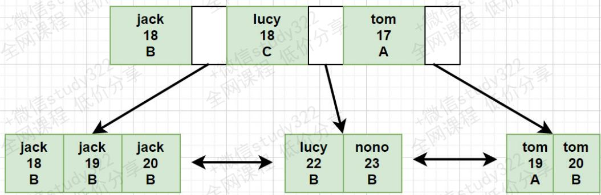

# 3. 不要在索引列上做任何计算

不要在索引列上做任何操作，⽐如计算、使⽤函数、⾃动或⼿动进⾏类型转换,会导致索引失效，从⽽使查询转向全表扫描。

# 插⼊数据

```
INSERT INTO users(user_name, user_age, user_level, reg_time) VALUES('11223344', 22, 'D', NOW()); 
```

# 场景1: 使⽤系统函数 left()函数

```
EXPLAIN SELECT * FROM users WHERE LEFT(user_name, 6) = '112233'; 
```

where条件使⽤计算后的索引字段 user_name，没有使⽤索引，索引失效。

| id   | select_type | table | partitions | type | possible_keys | key    | key_len | ref    | rows | filtered | Extra       |
| ---- | ----------- | ----- | ---------- | ---- | ------------- | ------ | ------- | ------ | ---- | -------- | ----------- |
| 1    | SIMPLE      | users | (NULL) OK  | ALL  | (NULL)        | (NULL) | (NULL)  | (NULL) | 3    | 100.00   | Using where |

# 场景2: 字符串不加单引号 (隐式类型转换)

```
EXPLAIN SELECT * FROM users WHERE user_name = 11223344; 
```

| id   | select_type | table | partitions | type | possible_keys | key     | key_len | ref    | rows   | filtered | Extra |             |
| ---- | ----------- | ----- | ---------- | ---- | ------------- | ------- | ------- | ------ | ------ | -------- | ----- | ----------- |
| 1    | SIMPLE      | users | (NULL)     | OK   | ALL           | idx_nal | (NULL)  | (NULL) | (NULL) | 4        | 25.00 | Using where |

注: Extra = Using where 表示Mysql将对storage engine提取的结果进⾏过滤，过滤条件字段⽆索引；

( 需要回表去查询所需的数据 )

# 4. 范围之后全失效

# 存储引擎不能使⽤索引中范围条件右边的列

场景1: 条件单独使⽤user_name时, type=ref , key_len=82

```
-- 条件只有一个 user_name
EXPLAIN SELECT * FROM users WHERE user_name = 'tom';
```

| id   | select_type | table | partitions | type | possible_keys | key     | key_len | ref   | rows | filtered | Extra  |
| ---- | ----------- | ----- | ---------- | ---- | ------------- | ------- | ------- | ----- | ---- | -------- | ------ |
| 1    | SIMPLE      | users | (NULL) OK  | ref  | idx_nal       | idx_nal | 82      | const | 1    | 100.00   | (NULL) |

场景2: 条件增加⼀个 user_age ( 使⽤常量等值) , type= ref , key_len = 86

```
EXPLAIN SELECT * FROM users WHERE user_name = 'tom' AND user_age = 17; 
```

| id   | select_type | table | partitions | type | possible_keys | key     | key_len | ref         | rows | filtered | Extra  |
| ---- | ----------- | ----- | ---------- | ---- | ------------- | ------- | ------- | ----------- | ---- | -------- | ------ |
| 1    | SIMPLE      | users | (NULL) OK  | ref  | idx_nal       | idx_nal | 86      | const,const | 1    | 100.00   | (NULL) |

场景3: 使⽤全值匹配, type = ref , key_len = 168 , 索引都利⽤上了.

```
EXPLAIN SELECT * FROM users WHERE user_name = 'tom'
AND user_age = 17 AND user_level = 'A'; 
```

| id   | select_type | table | partitions | type | possible_keys | key     | key_len | ref               | rows | filtered | Extra  |
| ---- | ----------- | ----- | ---------- | ---- | ------------- | ------- | ------- | ----------------- | ---- | -------- | ------ |
| 1    | SIMPLE      | users | (NULL) OK  | ref  | idx_nal       | idx_nal | 168     | const,const,const | 1    | 100.00   | (NULL) |

场景4: 使⽤范围条件时, avg > 17 , type = range , key_len = 86 , 与场景3 ⽐较,可以发现user_level 索引没有⽤上. 课

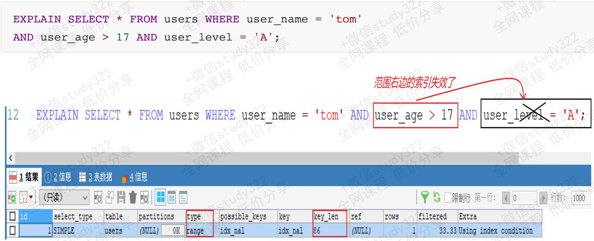

# 5. 尽量使⽤覆盖索引

尽量使⽤覆盖索引（查询列和索引列尽量⼀致，通俗说就是对A、B列创建了索引，然后查询中也使⽤A、B列）减少select *的使⽤。

场景1: 全值匹配查询, 使⽤ select *

```
EXPLAIN SELECT * FROM users WHERE user_name = 'tom' AND user_age = 17
AND user_level = 'A'; 
```

| id   | select_type | table | partitions | type | possible_keys | key     | key_len | ref               | rows | filtered | Extra  |
| ---- | ----------- | ----- | ---------- | ---- | ------------- | ------- | ------- | ----------------- | ---- | -------- | ------ |
| 1    | SIMPLE      | users | (NULL) OK  | ref  | idx_nal       | idx_nal | 168     | const,const,const | 1    | 100.00   | (NULL) |

场景1: 全值匹配查询, 使⽤ select 字段名1 ,字段名2

```
EXPLAIN SELECT user_name, user_age, user_level FROM users WHERE user_name = 'tom'
AND user_age = 17 AND user_level = 'A'; 
```

使⽤覆盖索引（查询列与条件列对应），可看到Extra从Null变成了Using index，提⾼检索效率。

| id   | select_type | table | partitions | type | possible_keys | key     | key_len | ref               | rows | filtered | Extra       |
| ---- | ----------- | ----- | ---------- | ---- | ------------- | ------- | ------- | ----------------- | ---- | -------- | ----------- |
| 1    | SIMPLE      | users | (NULL) OK  | ref  | idx_nal       | idx_nal | 168     | const,const,const | 1    | 100.00   | Using index |

注: Using index 表示 使⽤到了索引 , 并且所取的数据完全在索引中就能拿到,

(使⽤覆盖索引的时候就会出现)

# 6. 使⽤不等于（!=或<>）会使索引失效

使⽤ != 会使type=ALL，key=Null，导致全表扫描，并且索引失效。

使⽤ !=

```
EXPLAIN SELECT * FROM users WHERE user_name != 'tom'; 
```

| id   | select_type | table | partitions | type | possible_keys | key     | key_len | ref    | rows   | filtered | Extra  |             |
| ---- | ----------- | ----- | ---------- | ---- | ------------- | ------- | ------- | ------ | ------ | -------- | ------ | ----------- |
| 1    | SIMPLE      | users | (NULL)     | OK   | ALL           | idx_nal | (NULL)  | (NULL) | (NULL) | 3        | 100.00 | Using where |

# 7. is null 或 is not null也⽆法使⽤索引

在使⽤is null的时候，索引完全失效，使⽤is not null的时候，type=ALL全表扫描，key=Null索引失效。

场景1: 使⽤ is null

```
EXPLAIN SELECT * FROM users WHERE user_name IS NULL; 
```

| id   | select_type | table  | partitions | type   | possible_keys | key    | key_len | ref    | rows   | filtered | Extra            |
| ---- | ----------- | ------ | ---------- | ------ | ------------- | ------ | ------- | ------ | ------ | -------- | ---------------- |
| 1    | SIMPLE      | (NULL) | (NULL) OK  | (NULL) | (NULL)        | (NULL) | (NULL)  | (NULL) | (NULL) | (NULL)   | Impossible WHERE |

场景2: 使⽤ not null

```
EXPLAIN SELECT * FROM users WHERE user_name IS NOT NULL; 
```

| id   | select_type | table | partitions | type | possible_keys | key    | key_len | ref    | rows | filtered | Extra       |
| ---- | ----------- | ----- | ---------- | ---- | ------------- | ------ | ------- | ------ | ---- | -------- | ----------- |
| 1    | SIMPLE      | users | (NULL) OK  | ALL  | idx_nal       | (NULL) | (NULL)  | (NULL) | 3    | 66.67    | Using where |

# 8. like通配符以%开头会使索引失效

like查询为范围查询，%出现在左边，则索引失效。%出现在右边索引未失效。⼝诀：like百分加右边。

场景1

```
EXPLAIN SELECT * FROM users WHERE user_name LIKE '%tom%'; 
```

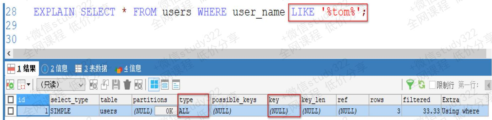

# 场景2

```
EXPLAIN SELECT * FROM users WHERE user_name LIKE '%tom'; 
28 EXPLAIN SELECT * FROM users WHERE user_name LIKE '%tom'; 
```

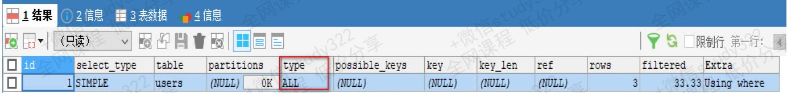

# 场景3

```
EXPLAIN SELECT * FROM users WHERE user_name LIKE 'tom%'; 
28 EXPLAIN SELECT * FROM users WHERE user_name LIKE 'tom%'; 
```

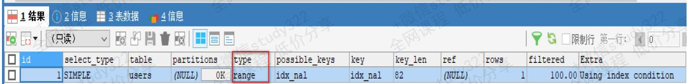

注: Using index condition 表示 查找使⽤了索引，但是需要;';查询数据

解决%出现在左边索引失效的⽅法：使⽤覆盖索引。

Case1:

```
EXPLAIN SELECT user_name FROM users WHERE user_name LIKE '%jack%'; 
```

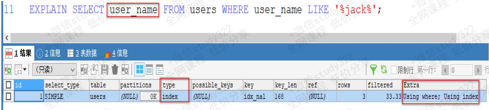

对⽐场景1可以知道, 通过使⽤覆盖索引 type = index,并且使⽤了 Using index,从全表扫描变成了全索引扫描.

注: Useing where; Using index; 查找使⽤了索引，但是需要的数据都在索引列中能找到，所以不需要回表查询数据

# Case2:

```
EXPLAIN SELECT id FROM users WHERE user_name LIKE '%jack%'; 
11 EXPLAIN SELECT id FROM users WHERE user_name LIKE '%jack%'; 
```

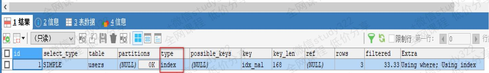

这⾥出现 type=index ，因为主键⾃动创建唯⼀索引。

# Case3:

```
EXPLAIN SELECT user_name, user_age FROM users WHERE user_name LIKE '%jack%';
EXPLAIN SELECT user_name, user_age, user_level FROM users WHERE user_name LIKE '%jack%';
EXPLAIN SELECT id, user_name, user_age, user_level FROM users WHERE user_name LIKE '%jack%'; 
11 EXPLAIN SELECT id FROM users WHERE user_name LIKE '%jack%'; 
```

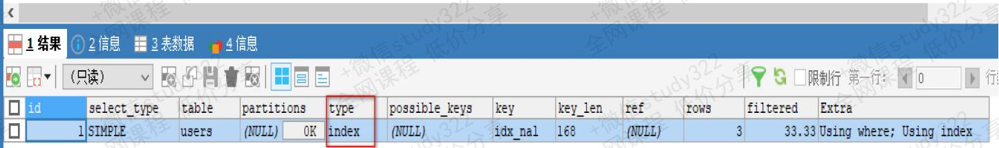

上⾯三组, explain执⾏的结果都相同，表明都使⽤了索引.

# Case4:

```
EXPLAIN SELECT id, user_name, user_age, user_level, reg_time FROM users WHERE user_name LIKE '%jack%'; 
```

12EXPLAIN SELECT id,user_name,user_age,user_level,reg_timeFROM users WHERE user_name LIKE'%jack%';

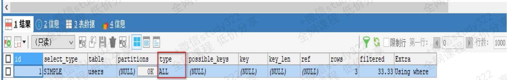

分析：由于只在（user_name,user_age,user_level）上创建索引，当包含reg_time时，导致结果集偏⼤（reg_time未建索引）【锅⼤，锅盖⼩，不能匹配】，所以type=ALL。

# like 失效的原理

# 联合索引：

KEY'idx_nal (user_name',user_age',user_level') UsiNG BTREE

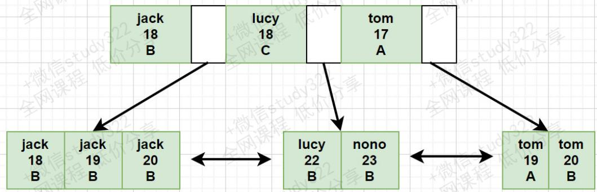

1. %号在右: 由于B+树的索引顺序，是按照⾸字⺟的⼤⼩进⾏排序，%号在右的匹配⼜是匹配⾸字⺟。所以可以在B+树上进⾏有序的查找，查找⾸字⺟符合要求的数据。所以有些时候可以⽤到索引.

1. %号在左: 是匹配字符串尾部的数据，我们上⾯说了排序规则，尾部的字⺟是没有顺序的，所以不能按照索引顺序查询，就⽤不到索引.

1. 两个%%号: 这个是查询任意位置的字⺟满⾜条件即可，只有⾸字⺟是进⾏索引排序的，其他位置的字⺟都是相对⽆序的，所以查找任意位置的字⺟是⽤不上索引的.

# 9. 字符串不加单引号导致索引失效

varchar类型的字段，在查询的时候不加单引号导致索引失效，转向全表扫描。

场景1

```
SELECT * FROM users WHERE user_name = '123';
SELECT * FROM users WHERE user_name = 123; 
```

上述两条sql语句都能查询出相同的数据。

| id   | user_name | user_age | user_level | reg_time            |
| ---- | --------- | -------- | ---------- | ------------------- |
| 4    | 123       | 20       | D          | 2021-04-16 14:36:17 |

场景2:

EXPLAIN SELECT * FROM users WHEREuser name = '123';

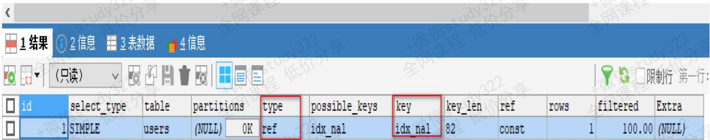

EXPLAIN SELECT * FROM users WHERE user name = 123;

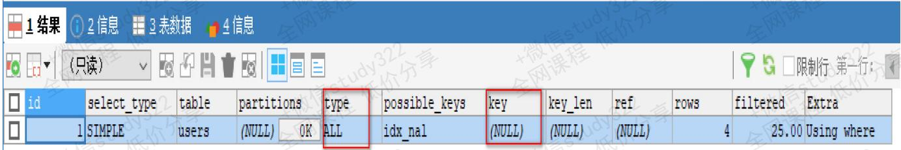

通过explain执⾏结果可以看出，字符串（name）不加单引号在查询的时候，导致索引失效（type=ref变成了type=ALL，并且key=Null），并全表扫描。

# 10. 少⽤or，⽤or连接会使索引失效

在使⽤or连接的时候 type=ALL ，key=Null，索引失效，并全表扫描。

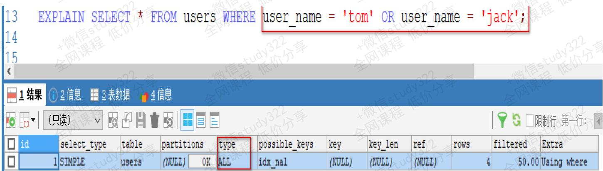

