# 数据库平滑扩容

# 学习目标

目标1：理解传统扩容实现方案

目标2：理解平滑扩容双写方案+微信

目标3：掌握数据库2N扩容方案

目标4：实现数据库双主同步

目标5：掌握ShardingJDBC路由以及动态扩容技术全网课程 超低

目标6：掌握KeepAlived+MariaDB数据库高可用方案

# 1. 扩容方案剖析

# 1.1 扩容问题

在项目初期，我们部署了三个数据库A、B、C，此时数据库的规模可以满足我们的业务需求。为了将数据做到平均分配，我们在Service服务层使用uid%3进行取模分片，从而将数据平均分配到三个数据库中。

如图所示：

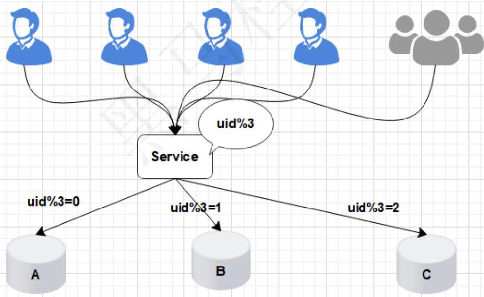


<table><tr><td>uid</td><td>name</td></tr><tr><td>3</td><td>User3</td></tr><tr><td>6</td><td>User6</td></tr><tr><td>...</td><td>...</td></tr></table>

<table><tr><td>uid</td><td>name</td></tr><tr><td>1</td><td>User1</td></tr><tr><td>4</td><td>User4</td></tr><tr><td>...</td><td>...</td></tr></table>

<table><tr><td>uid</td><td>name</td></tr><tr><td>2</td><td>User2</td></tr><tr><td>5</td><td>User5</td></tr><tr><td>...</td><td>...</td></tr></table>

后期随着用户量的增加，用户产生的数据信息被源源不断的添加到数据库中，最终达到数据库的最佳存储容量。如果此时继续向数据库中新增数据，会导致数据库的CRUD等基本操作变慢，进而影响整个服务的响应速度。

这时，我们需要增加新的节点，对数据库进行水平扩容，那么加入新的数据库D后，数据库的规模由原来的3个变为4个。


如图所示：


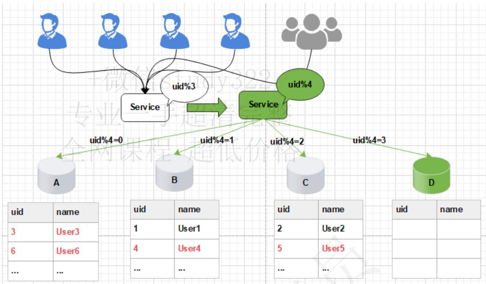


此时由于分片规则发生了变化（uid%3 变为uid%4），导致大部分的数据，无法命中原有的数据，需要重新进行分配，要做大量的数据迁移处理。

比如之前uid如果是uid=3取模3%3=0， 是分配在A库上，新加入D库后， uid=3取模3%4=3，分配在D库上；

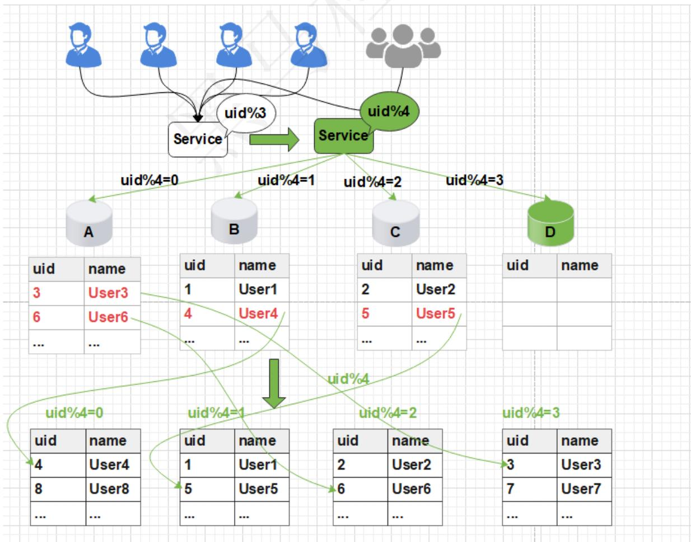


新增一个节点， 大概会有90%的数据需要迁移， 这样会面临大量的数据压力，并且对服务造成极大的不稳定性。

# 1.2 停机方案

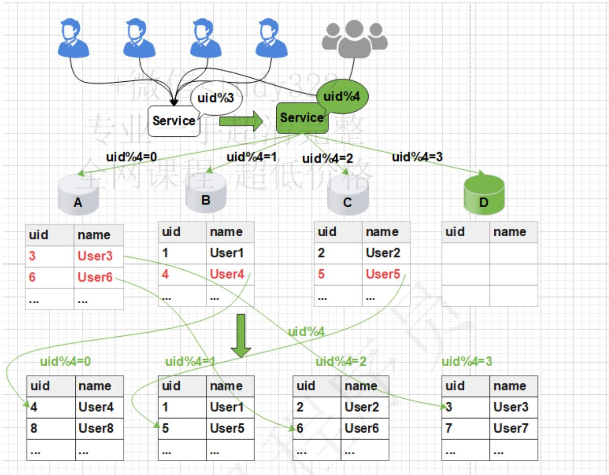


1. 发布公告

为了进行数据的重新拆分，在停止服务之前，我们需要提前通知用户，比如：我们的服务会在yyyy-MM-dd进行升级，给您带来的不便敬请谅解。

2. 停止服务

关闭Service

3. 离线数据迁移（拆分，重新分配数据）

将旧库中的数据按照Service层的算法，将数据拆分，重新分配数据

4. 数据校验

开发定制一个程序对旧库和新库中的数据进行校验，比对

5. 更改配置

修改Service层的配置算法，也就是将原来的uid%3变为uid%4

6. 恢复服务

重启Service服务

7. 回滚预案

针对上述的每个步骤都要有数据回滚预案，一旦某个环节（如：数据迁移，恢复服务等）执行失败，立刻进行回滚，重新再来

停止服务之后， 能够保证迁移工作的正常进行， 但是服务停止，伤害用户体验， 并造成了时间压力，必须在指定的时间内完成迁移。

# 1.3 停写方案

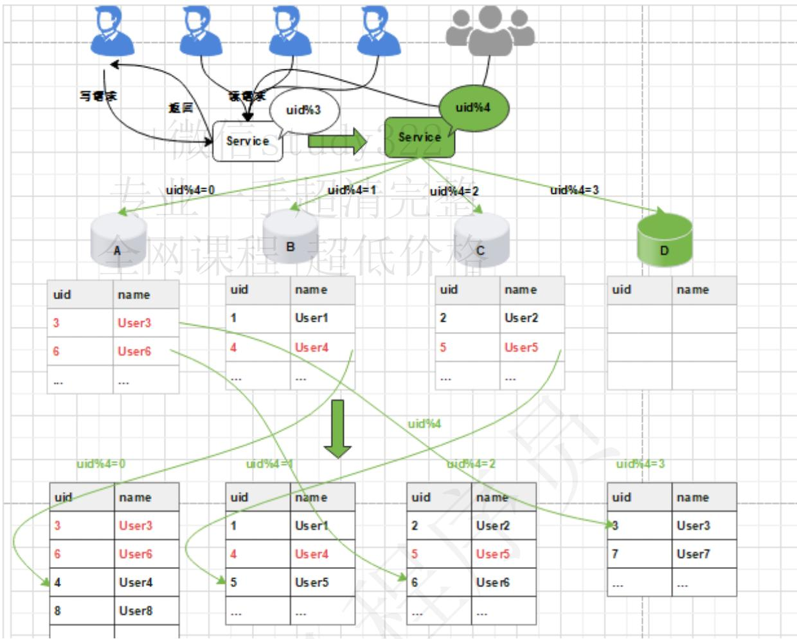


1. 支持读写分离

数据库支持读写分离，在扩容之前，每个数据库都提供了读写功能，数据重新分配的过程中，将每个数据库设置为只读状态，关闭写的功能

2. 升级公告

为了进行数据的重新拆分，在停写之前，我们需要提前通知用户，比如：我们的服务会在yyyy-MM-dd进行升级，给您带来的不便敬请谅解。

3. 中断写操作，隔离写数据源（或拦截返回统一提示）

在Service层对所有的写请求进行拦截，统一返回提示信息，如：服务正在升级中，只对外提供读服务

4. 数据同步处理

将旧库中的数据按照Service层的算法，将数据重新分配，迁移（复制数据）

5. 数据校验

开发定制一个程序对旧库中的数据进行备份，使用备份的数据和重新分配后的数据进行校验，比对

6. 更改配置

通过配置中心，修改Service层的配置算法，也就是将原来的uid%3变为uid%4，这个过程不需要重启服务

7. 恢复写操作

设置数据库恢复读写功能，去除Service层的拦截提示

8. 数据清理

使用delete语句对冗余数据进行删除

# 9. 回滚预案

针对上述的每个步骤都要有数据回滚预案，一旦某个环节（如：数据迁移等）执行失败，立刻进行回滚，重新再来

缺点：在数据的复制过程需要消耗大量的时间，停写时间太长，数据需要先复制，再清理冗余数据

# 1.4 日志方案+

核心是通过日志进行数据库的同步迁移， 主要操作步骤如下：专业一手超清完整

1. 数据迁移之前， 业务应用访问旧的数据库节点。

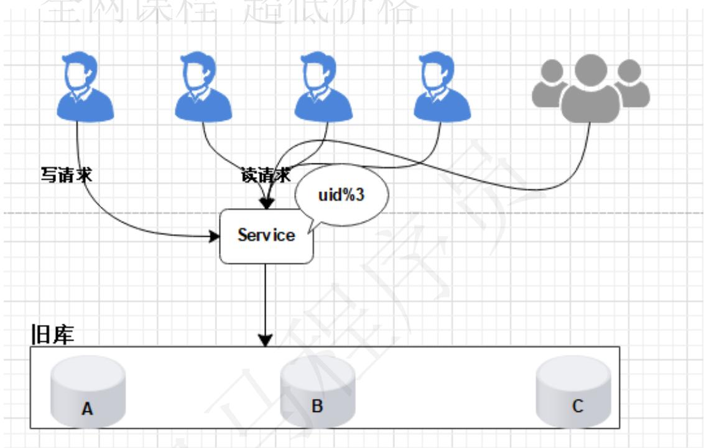


# 2. 日志记录

在升级之前， 记录“对旧数据库上的数据修改”的日志（这里修改包括增、删、改），这个日志不需要记录详细的数据信息，主要记录：

（1）修改的库；

（2）修改的表；

（3）修改的唯一主键；

（4）修改操作类型。

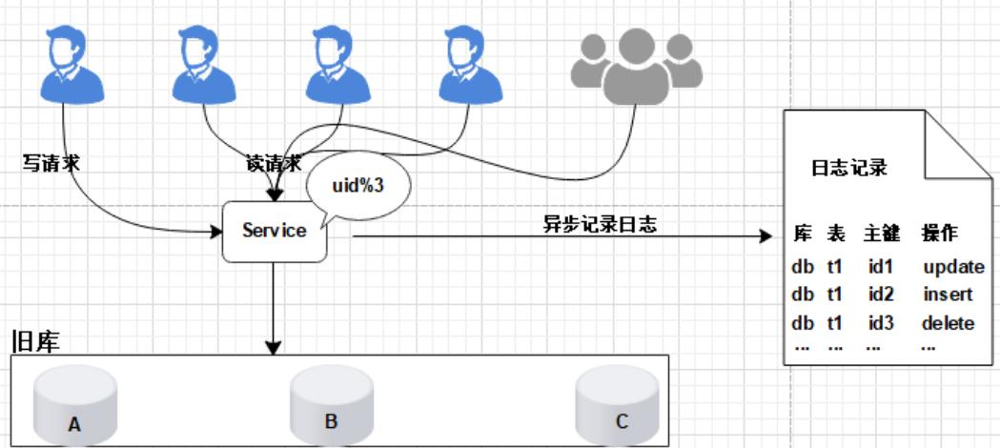


日志记录不用关注新增了哪些信息，修改的数据格式，只需要记录以上数据信息，这样日志格式是固定的， 这样能保证方案的通用性。

服务升级日志记录功能风险较小：

写和修改接口是少数， 改动点少；

升级只是增加了一些日志，采用异步方式实现， 对业务功能没有太多影响。

# 3. 数据迁移：

研发定制数据迁移工具， 作用是把旧库中的数据迁移至新库中。

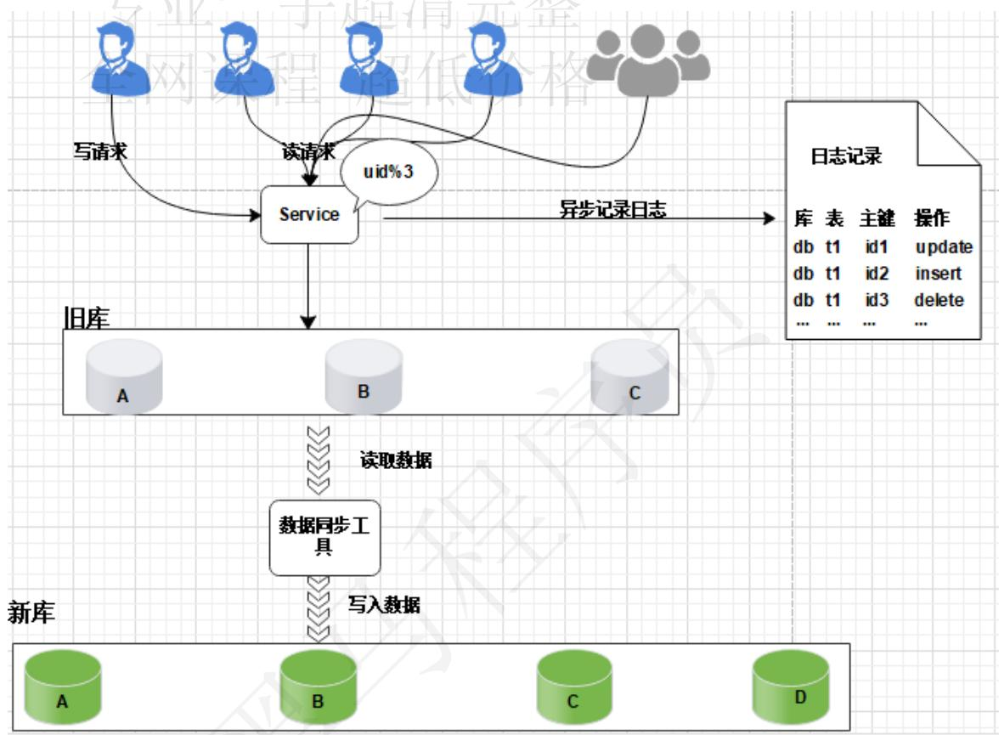


整个过程仍然采用旧库进行对外服务。

数据同步工具实现复杂度不高。

只对旧库进行读取操作， 如果同步出现问题， 都可以对新库进行回滚操作。

可以限速或分批迁移执行， 不会有时间压力。

数据迁移完成之后， 并不能切换至新库提供服务。

因为旧库依然对线上提供服务， 库中的数据随时会发生变化， 但这些变化的数据并没有同步到新库中， 旧库和新库数据不一致， 所以不能直接进行切换， 需要将数据同步完整。

# 4. 日志增量迁移

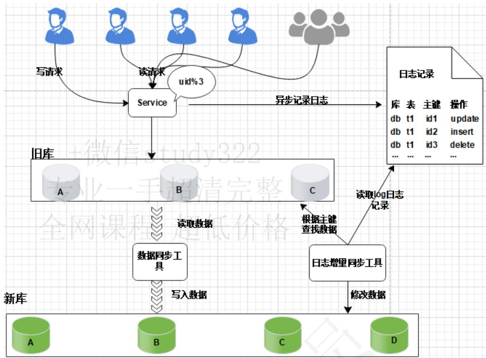


研发一个日志迁移工具，把上面迁移数据过程中的差异数据追平，处理步骤：

读取log日志，获取具体是哪个库、表和主键发生了变化修改；

把旧库中的主键记录读取出来

根据主键ID，把新库中的记录替换掉

这样可以最大程度的保障数据的一致性。风险分析：

整个过程， 仍然是旧库对线上提供服务；

日志迁移工具实现的复杂度较低；

任何时间发现问题， 可以重新再来，有充分的容错空间；

可以限速重放处理日志， 处理过程不会因为对线上影响造成时间压力。

但是， 日志增量同步完成之后， 还不能切换到新的数据库。

因为日志增量同步过程中，旧库中可能有数据发生变化， 导致数据不一致，所以需要进一步读取日志， 追平数据记录； 日志增量同步过程随时可能会产生新的数据， 新库与旧库的数据追平也会是一个无限逼近的过程。

# 5. 数据校验

准备好数据校验工具，将旧库和新库中的数据进行比对，直到数据完全一致。

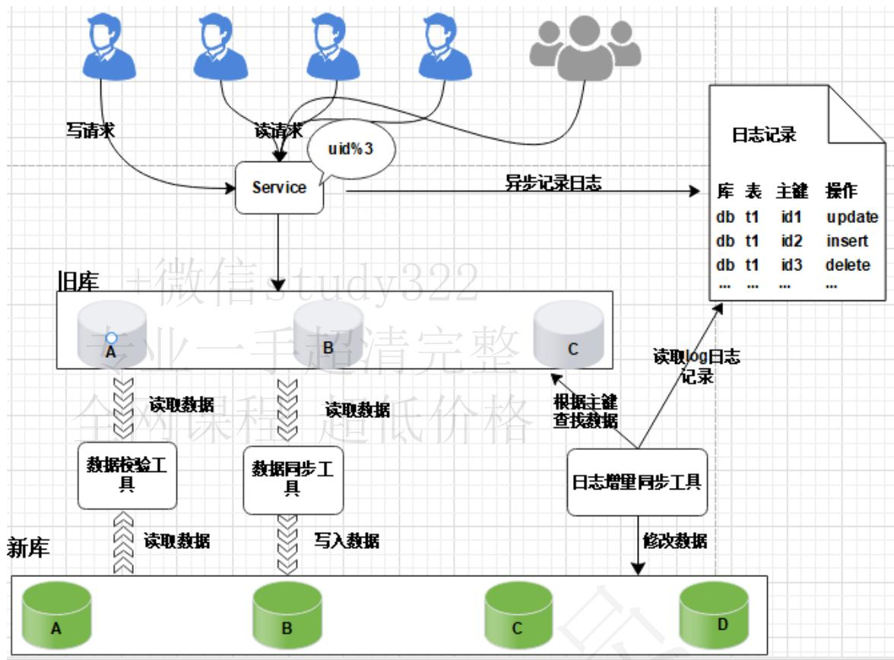


# 6. 切换新库

数据比对完成之后， 将流量转移切换至新库， 至此新库提供服务， 完成迁移。

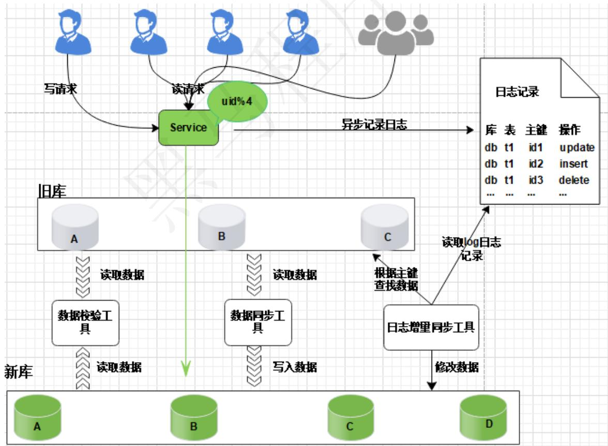


但是在极限情况下， 即便通过上面的数据校验处理， 也有可能出现99.99%数据一致， 不能保障完全一致，这个时候可以在旧库做一个readonly只读功能， 或者将流量屏蔽降级，等待日志增量同步工具完全追平后， 再进行新库的切换。

至此，完成日志方案的迁移扩容处理， 整个过程能够持续对线上提供服务， 只会短暂的影响服务的可用性。

这种方案的弊端，是操作繁琐，需要适配多个同步处理工具，成本较高， 需要制定个性化业务的同步处理， 不具备普遍性，耗费的时间周期也较长。

# 1.5 双写方案（中小型数据）

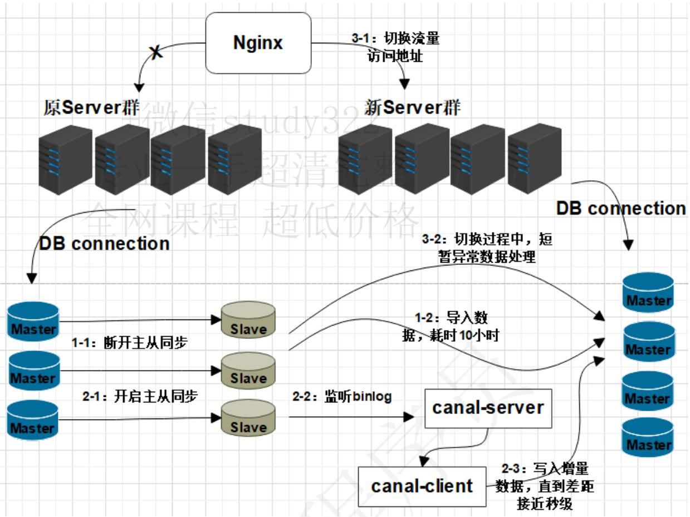


双写方案可通过canal或mq做实现。

1. 增加新库，按照现有节点， 增加对应的数量。

2. 数据迁移：避免增量影响， 先断开主从，再导入（耗时较长）， 同步完成并做校验

3. 增量同步：开启Canal同步服务， 监听从节点数据库， 再开启主从同步，从节点收到数据后会通过Canal服务， 传递至新的DB节点。

4. 切换新库：通过Nginx，切换访问流量至新的服务。

5. 修复切换异常数据：在切换过程中， 如果出现，Canal未同步，但已切换至新库的请求（比如下单，修改了资金， 但还未同步 ）， 可以通过定制程序， 读取检测异常日志，做自动修复或人工处理。

针对此种情况， 最好是在凌晨用户量小的时候， 或专门停止外网访问，进行切换，减少异常数据的产生。

6. 数据校验：为保障数据的完全一致， 有必要对数据的数量完整性做校验。

# 1.6 平滑2N方案（大数据量）

1. 线上数据库，为了保障其高可用，一般每台主库会配置一台从库，主库负责读写，从库负责读取。下图所示，A，B是主库，A0和B0是从库。

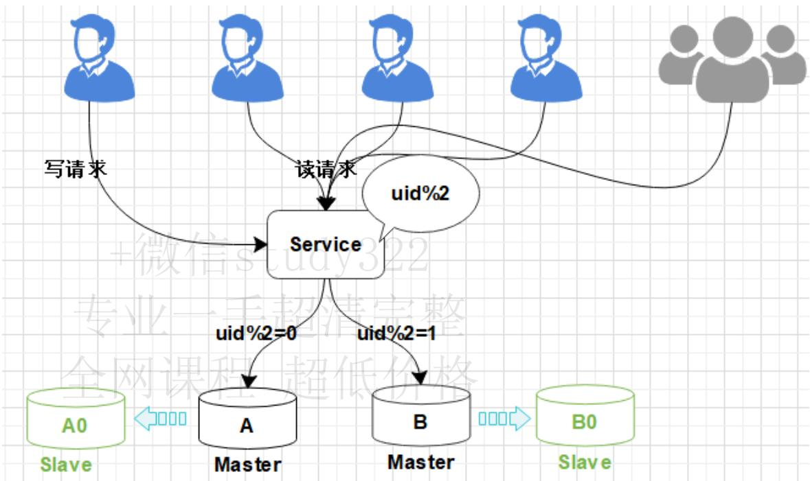


<table><tr><td>uid</td><td>name</td></tr><tr><td>2</td><td>User2</td></tr><tr><td>4</td><td>User4</td></tr><tr><td>...</td><td>...</td></tr></table>

<table><tr><td>uid</td><td>name</td></tr><tr><td>2</td><td>User2</td></tr><tr><td>4</td><td>User4</td></tr><tr><td>...</td><td>...</td></tr></table>

<table><tr><td>uid</td><td>name</td></tr><tr><td>1</td><td>User1</td></tr><tr><td>3</td><td>User3</td></tr><tr><td>...</td><td>...</td></tr></table>

<table><tr><td>uid</td><td>name</td></tr><tr><td>1</td><td>User1</td></tr><tr><td>3</td><td>User3</td></tr><tr><td>...</td><td>...</td></tr></table>

2. 当需要扩容的时候，我们把A0和B0升级为新的主库节点，如此由2个分库变为4个分库。同时在上层的分片配置，做好映射，规则如下:

把uid%4=0和uid%4=2的数据分别分配到A和A0主库中

把uid%4=1和uid%4=3的数据分配到B和B0主库中

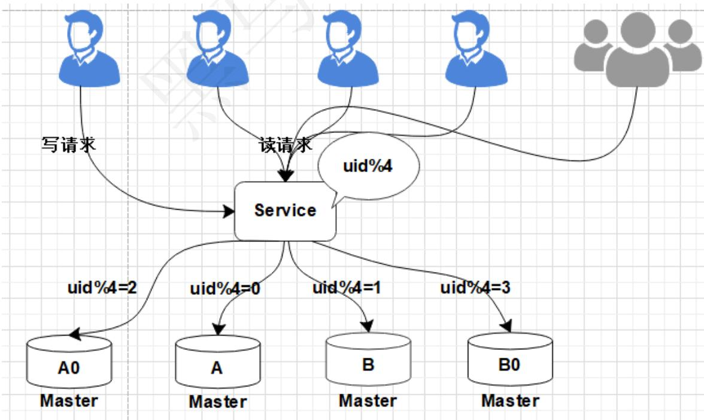


<table><tr><td>uid</td><td>name</td></tr><tr><td>2</td><td>User2</td></tr><tr><td>4</td><td>User4</td></tr><tr><td>...</td><td>...</td></tr></table>

<table><tr><td>uid</td><td>name</td></tr><tr><td>2</td><td>User2</td></tr><tr><td>4</td><td>User4</td></tr><tr><td>...</td><td>...</td></tr></table>

<table><tr><td>uid</td><td>name</td></tr><tr><td>1</td><td>User1</td></tr><tr><td>3</td><td>User3</td></tr><tr><td>...</td><td>...</td></tr></table>

<table><tr><td>uid</td><td>name</td></tr><tr><td>1</td><td>User1</td></tr><tr><td>3</td><td>User3</td></tr><tr><td>...</td><td>...</td></tr></table>

3. 因为A和A0库的数据相同，B和B0数据相同，此时无需做数据迁移。只需调整变更一下分片配置即可，通过配置中心更新，不需要重启。

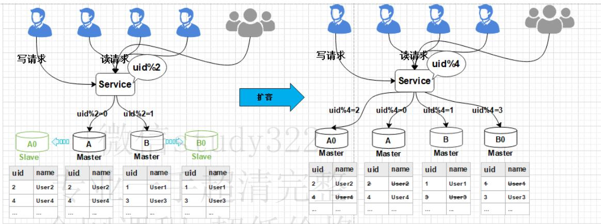


由于之前uid%2的数据是分配在2个库里面，扩容之后需要分布到4个库中，但由于旧数据仍存在（uid%4=0的节点,还有一半uid%4=2的数据），所以需要对冗余数据做一次清理。

这个清理，并不会影响线上数据的一致性，可以随时随地进行。

4. 处理完成之后，为保证数据的高可用，以及将来下一步的扩容需求。

可以为现有的主库再次分配一个从库。

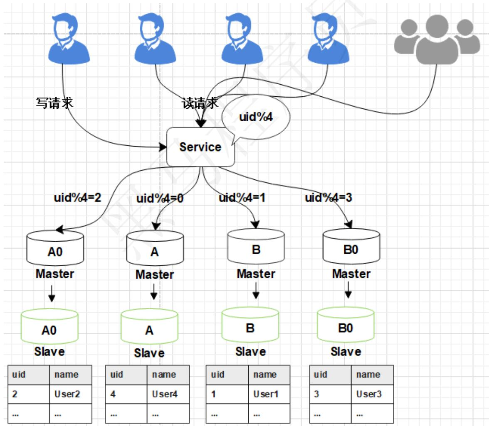


# 2. 平滑2N扩容方案实践

# 2.1 实现应用服务级别的动态扩容

扩容前部署架构：

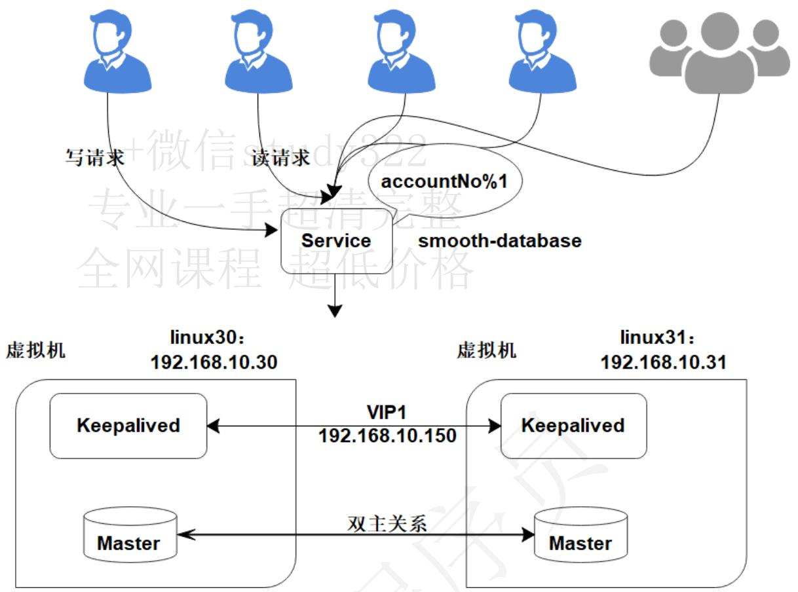


# 2.1.1 MariaDB服务安装

1. 切换阿里云镜像服务（YUM安装过慢可以切换）

```markdown
[root@linux30 ~]# yum -y install wget

## 备份CentOS-Base.repo
[root@linux30 ~]# mv /etc/yum.repos.d/CentOS-Base.repo /etc/yum.repos.d/CentOS-Base.repo.bak

[root@linux30 ~]# wget -O /etc/yum.repos.d/CentOS-Base.repo http://mirrors.aliyun.com/repo/Centos-7.repo

[root@linux30 ~]# wget -P /etc/yum.repos.d/ http://mirrors.aliyun.com/repo/epel-7.repo

[root@linux30 ~]# yum clean all

[root@linux30 ~]# yum makecache
```

2. 配置YUM源

```txt
[root@linux30 ~]# vi /etc/yum.repos.d/mariadb-10.2.repo 
```


增加以下内容：


```ini
[mariadb]
name = MariaDB
baseurl = https://mirrors.ustc.edu.cn/mariadb/yum/10.2/centos7-amd64
gpgkey=https://yum.mariadb.org/RPM-GPG-KEY-MariaDB
gpgcheck=1 
```


3. 执行安装


```txt
[root@linux30 ~]# yum -y install mariadb mariadb-server MariaDB-client MariaDB-common 
```


4. 如果之前已经安装， 需要先删除（如果之前没有安装， 可以忽略此步骤）


停止Mariadb服务


```txt
[root@localhost yum.repos.d]# ps -ef | grep mysql
root 1954 1 0 oct04 ? 00:05:43 /usr/sbin/mysqld --wsrep-new-cluster --user=root
root 89521 81403 0 07:40 pts/0 00:00:00 grep --color=auto mysql
[root@localhost yum.repos.d]# kill 1954 
```


卸载Mariadb服务


```txt
yum -y remove Maria* 
```


删除数据与配置：


```batch
rm -rf /var/lib/mysql/*
rm -rf /etc/my.cnf.d/
rm -rf /etc/my.cnf 
```


5. 启动MariaDB后，执行安全配置向导命令，可根据安全配置向导提高数据库的安全性


```txt
[root@linux30 ~]# systemctl start mariadb

## 执行安全配置向导命令
[root@linux30 ~]# mysql_secure_installation

NOTE: RUNNING ALL PARTS OF THIS SCRIPT IS RECOMMENDED FOR ALL MariaDB SERVERS IN PRODUCTION USE! PLEASE READ EACH STEP CAREFULLY!

In order to log into MariaDB to secure it, we'll need the current password for the root user. If you've just installed MariaDB, and you haven't set the root password yet, the password will be blank, so you should just press enter here.

# 首次安装，直接跳过

Enter current password for root (enter for none):
```

ERROR 1045 (28000): Access denied for user 'root'@'localhost' (using password: YES) 

Enter current password for root (enter for none): 

ERROR 1045 (28000): Access denied for user 'root'@'localhost' (using password: YES) 

Enter current password for root (enter for none): 

OK, successfully used password, moving on... 

Setting the root password ensures that nobody can log into the MariaDBroot user without the proper authorisation.+微信study322

# 设置root用户密码

Set root password? [Y/n] y 

New password:专业

Re-enter new password: 

Password updated successfully!全网课程 超

Reloading privilege tables.. 

... Success! 

By default, a MariaDB installation has an anonymous user, allowing anyone to log into MariaDB without having to have a user account created for them. This is intended only for testing, and to make the installation go a bit smoother. You should remove them before moving into a production environment. 

# 删除匿名用户

Remove anonymous users? [Y/n] y 

... Success! 

Normally, root should only be allowed to connect from 'localhost'. This ensures that someone cannot guess at the root password from the network. 

# 允许root用户远程登录

Disallow root login remotely? [Y/n] n 

... skipping. 

By default, MariaDB comes with a database named 'test' that anyone can access. This is also intended only for testing, and should be removed before moving into a production environment. 

# 删除test数据库

Remove test database and access to it? [Y/n] y 

Dropping test database... 

... Success! 

- Removing privileges on test database... 

... Success! 

Reloading the privilege tables will ensure that all changes made so far will take effect immediately. 

# 刷新权限

Reload privilege tables now? [Y/n] y 

... Success! 

Cleaning up... 

All done! If you've completed all of the above steps, your MariaDB installation should now be secure. 

Thanks for using MariaDB! 

# 6. 开启用户远程连接权限

将连接用户root开启远程连接权限；

```txt
[root@linux30 ~]# mysql -uroot -p123456 
```

进入MySQL服务， 执行以下操作：

```txt
[root@linux30 ~]# mysql -uroot -p123456
Welcome to the MariaDB monitor. Commands end with ; or \g.
Your MariaDB connection id is 17
Server version: 10.2.41-MariaDB MariaDB Server

Copyright (c) 2000, 2018, Oracle, MariaDB Corporation Ab and others.

Type 'help;' or '\h' for help. Type '\c' to clear the current input statement.
## 切换到mysql数据库
MariaDB [(none)]> use mysql;
Reading table information for completion of table and column names
You can turn off this feature to get a quicker startup with -A

Database changed
## 删除所有用户
MariaDB [mysql]> delete from user;
Query OK, 4 rows affected (0.00 sec)
## 配置root用户使用密码123456从任何主机都可以连接到mysql服务器
MariaDB [mysql]> GRANT ALL PRIVILEGES ON *.* TO 'root'@%' IDENTIFIED BY '123456' WITH GRANT OPTION;
Query OK, 0 rows affected (0.00 sec)
## 刷新权限
MariaDB [mysql]> FLUSH PRIVILEGES;
Query OK, 0 rows affected (0.00 sec)

MariaDB [mysql]>
```

# 2.1.2 MariaDB双主同步

# 1. 在linux30增加配置：

在/etc/my.cnf中添加以下配置：

```ini
[root@linux30 ~]# vi /etc/my.cnf

[mysqld]
server-id = 1
log-bin=mysql-bin
relay-log = mysql-relay-bin
## 忽略mysql、information_schema库下对表的操作
replicate-wild-ignore-table=mysql.% 
replicate-wild-ignore-table=information_schema.% 
## 默认的情况下mysql是关闭的；
log-slave-updates=on
```

```ini
## 复制过程中，有任何错误，直接跳过
slave-skip-errors=all
auto-increment-offset=1
auto-increment-increment=2
## binlog的格式：STATEMENT, ROW, MIXED
binlog_format=mixed
## 自动过期清理binlog，默认0天，即不自动清理
expire_logs_days=10
```

注意， linux30自增为奇数位：+微信s

```txt
auto-increment-offset=1 主键自增基数, 从1开始。
auto-increment-increment=2 主键自增偏移量，每次为2。
```

2. 在linux31增加配置：

修改/etc/my.cnf:

```ini
[root@linux31 ~]# vi /etc/my.cnf

[mysqld]
server-id = 2
log-bin=mysql-bin
relay-log = mysql-relay-bin
replicate-wild-ignore-table=mysql.% 
replicate-wild-ignore-table=information_schema.% 
log-slave-updates=on
slave-skip-errors=all
auto-increment-offset=2
auto-increment-increment=2
binlog_format=mixed
expire_logs_days=10 
```

linux31自增为偶数位：

```txt
auto-increment-offset=2 主键自增基数, 从2开始。
auto-increment-increment=2 主键自增偏移量，每次为2。
```

配置修改完成后， 重启数据库。

3. 同步授权配置

在linux30创建replica用于主从同步的用户：

```txt
[root@linux30 ~]# mysql -uroot -p123456
Welcome to the MariaDB monitor. Commands end with ; or \g.
Your MariaDB connection id is 9
Server version: 10.2.41-MariaDB-log MariaDB Server

Copyright (c) 2000, 2018, Oracle, MariaDB Corporation Ab and others.

Type 'help;' or '\h' for help. Type '\c' to clear the current input statement.

## 授权replica用户 replication slave, replication client 权限
MariaDB [(none)]> grant replication slave, replication client on *.* to 'replica'@'%' identified by 'replica';
Query OK, 0 rows affected (0.00 sec)
```


## 刷新权限


```txt
MariaDB [(none)]> flush privileges; Query OK, 0 rows affected (0.01 sec)
MariaDB [(none)]> 
```


查询日志文件与偏移量，开启同步时需使用：


```txt
MariaDB [(none)]> show master status;
+----+----+----+
| File    | Position | Binlog_Do_DB | Binlog_Ignore_DB |
+----+----+----+
| mysql-bin.000001 | 663 |    |    |
+----+----+----+
1 row in set (0.00 sec)
MariaDB [(none)]> 
```


同样， 在linux31创建replica用于主从同步的用户：


```txt
[root@linux31 ~]# mysql -uroot -p123456
## 授权
MariaDB [(none)]> grant replication slave, replication client on *.* to 'replica'@%' identified by 'replica';
Query OK, 0 rows affected (0.00 sec)
## 刷新权限
MariaDB [(none)]> flush privileges;
Query OK, 0 rows affected (0.00 sec)
MariaDB [(none)]>
```


查询日志文件与偏移量：


```txt
MariaDB [(none)]> show master status;
+----+----+----+
| File    | Position | Binlog_Do_DB | Binlog_Ignore_DB |
+----+----+----+
| mysql-bin.000001 | 663 |    |
+----+----+----+
1 row in set (0.00 sec) 
```

# 4. 配置主从同步信息

在linux30中执行：

```txt
MariaDB [(none)]> change master to
master_host='192.168.10.31', master_user='replica',
master_password='replica', master_port=3306, master_log_file='mysql-
bin.000001', master_log_pos=328, master_connect_retry=30;
Query OK, 0 rows affected (0.01 sec)

MariaDB [(none)]> 
```


在linux31中执行：


```txt
MariaDB [(none)]> change master to master_host='192.168.10.30', master_user='replica', master_password='replica', master_port=3306, master_log_file='mysql-bin.000001', master_log_pos=328, master_connect_retry=30; Query OK, 0 rows affected (0.01 sec)  
MariaDB [(none)]> 
```

# 5. 开启双主同步


在linux30和linux31中分别执行：


```txt
MariaDB [(none)]> start slave;
Query OK, 0 rows affected (0.00 sec)
MariaDB [(none)]> 
```


在linux30查询同步信息：


```txt
MariaDB [(none)]> show slave status\G;
*************************** 1. row ***************************
Slave_IO_State: waiting for master to send event
Master_Host: 192.168.10.31
Master_User: replica
Master_Port: 3306
Connect_Retry: 30
Master_Log_File: mysql-bin.000001
Read_Master_Log_Pos: 663
Relay_Log_File: mysql-relay-bin.000002
Relay_Log_Pos: 555
Relay_Master_Log_File: mysql-bin.000001
Slave_IO_Running: Yes
Slave_SQL_Running: Yes 
```


在linux31查询同步信息：


```yaml
MariaDB [(none)]> show slave status\G;
*************************** 1. row ***************************
Slave_IO_State: Waiting for master to send event
Master_Host: 192.168.10.30
Master_User: replica
Master_Port: 3306
Connect_Retry: 30 
```

```yaml
Master_Log_File: mysql-bin.000001
Read_Master_Log_Pos: 663
Relay_Log_File: mysql-relay-bin.000002
Relay_Log_Pos: 555
Relay_Master_Log_File: mysql-bin.000001
Slave_IO_Running: Yes
Slave_SQL_Running: Yes 
```

Slave_IO_Running和Slave_SQL_Running 都是Yes，说明双主同步配置成功。

# 2.1.3 KeepAlived安装与高可用配置全网课程 超

1. 在linux30与linux31两台节点安装keepalived：

```txt
[root@linux30 ~]# yum -y install keepalived 
```

2. 关闭防火墙

```txt
[root@linux30 ~]# systemctl stop firewalld
[root@linux30 ~]# systemctl disable firewalld
Removed symlink /etc/systemd/system/multi-user.target.wants/firewalld.service.
Removed symlink /etc/systemd/system/dbus-org.fedoraproject.FirewallD1.service.
[root@linux30 ~]# systemctl status firewalld
- firewalld.service - firewalld - dynamic firewall daemon
  Loaded: loaded (/usr/lib/systemd/system/firewalld.service; disabled; vendor preset: enabled)
  Active: inactive (dead)
  Docs: man:firewalld(1)

1月 05 11:00:54 localhost.localdomain systemd[1]: Starting firewalld - dynamic firewall daemon...
1月 05 11:00:55 localhost.localdomain systemd[1]: Started firewalld - dynamic firewall daemon.
1月 05 11:00:55 localhost.localdomain firewalld[702]: WARNING:
AllowZoneDrifting is enabled. This is considered an insecure configuration option. ... it now.
1月 05 11:09:03 localhost systemd[1]: Stopping firewalld - dynamic firewall daemon...
1月 05 11:09:04 localhost systemd[1]: Stopped firewalld - dynamic firewall daemon.
Hint: Some lines were ellipsized, use -l to show in full.
[root@linux30 ~]#
```

3. 设置主机名称：

linux30节点：

```txt
[root@linux30 ~]# hostnamectl set-hostname linux30 
```

linux31节点：

```txt
[root@linux31 ~]# hostnamectl set-hostname linux31 
```


4. linux30节点配置


/etc/keepalived/keepalived.conf：


```txt
[root@linux30 ~]# vi /etc/keepalived/keepalived.conf

global_defs {
    router_id linux30    # 机器标识，和主机名保持一致，运行keepalived服务器的一个标识
}
vrrp_instance VI_1 {    #vrrp实例定义
    state BACKUP    #lvs的状态模式，MASTER代表主，BACKUP代表备份节点
    interface ens33    #绑定对外访问的网卡，vrrp实例绑定的网卡
    virtual_router_id 111    #虚拟路由标示，同一个vrrp实例采用唯一标示
    priority 100    #优先级，100代表最大优先级，数字越大优先级越高
    advert_int 1    #master与backup节点同步检查的时间间隔，单位是秒
    authentication {    #设置验证信息
    auth_type PASS    #有PASS和AH两种
    auth_pass 6666    #验证密码，BACKUP密码须相同
    }
    virtual_ipaddress {    #KeepAlived虚拟的IP地址
    192.168.10.150
    }
}

virtual_server 192.168.10.150 3306 {    #配置虚拟服务器IP与访问端口
    delay_loop 6    #健康检查时间
    lb_algo rr    #负载均衡调度算法，rr代表轮询
    lb_kind DR    #负载均衡转发规则 DR/NAT/
    persistence_timeout 0    #会话保持时间，这里要做测试，所以设为0，实际可根据session有效时间配置
    protocol TCP    #转发协议类型，支持TCP和UDP
    real_server 192.168.10.30 3306 {    #配置服务器节点VIP1
    notify_down /opt/mariaDB/mariadb.sh #当服务挂掉时，会执行此脚本，结束keepalived进程
    weight 1    #设置权重，越大权重越高
    TCP_CHECK {    #状态监测设置
    connect_timeout 10    #超时配置，单位秒
    retry 3    #重试次数
    delay_before_retry 3    #重试间隔
    connect_port 3306    #连接端口，和上面保持一致
    }
    }
}
```

[root@linux30 mariaDB]# vi /opt/mariaDB/mariadb.sh 

## 添加脚本内容

pkill keepalived 

# 加入执行权限：

```txt
[root@linux30 mariaDB]# chmod a+x mariadb.sh 
```


5. linux31节点配置：专业


```txt
[root@linux31 ~]# vi /etc/keepalived/keepalived.conf

global_defs {
    router_id linux31    # 机器标识，和主机名保持一致，运行keepalived服务器的一个标识
}
vrrp_instance VI_1 {    #vrrp实例定义
    state BACKUP    #lvs的状态模式，MASTER代表主，BACKUP代表备份节点
    interface ens33    #绑定对外访问的网卡
    virtual_router_id 111    #虚拟路由标示，同一个vrrp实例采用唯一标示
    priority 98    #优先级，100代表最大优先级，数字越大优先级越高
    advert_int 1    #master与backup节点同步检查的时间间隔，单位是秒
    authentication {    #设置验证信息
    auth_type PASS    #有PASS和AH两种
    auth_pass 6666    #验证密码，BACKUP密码须相同
    }
    virtual_ipaddress {    #KeepAlived虚拟的IP地址
    192.168.10.150
    }
}

virtual_server 192.168.10.150 3306 {    #配置虚拟服务器IP与访问端口
    delay_loop 6    #健康检查时间
    lb_algo rr    #负载均衡调度算法，rr代表轮询，可以关闭
    lb_kind DR    #负载均衡转发规则，可以关闭
    persistence_timeout 0    #会话保持时间，这里要做测试，所以设为0，实际可根据session有效时间配置
    protocol TCP    #转发协议类型，支持TCP和UDP
    real_server 192.168.10.31 3306 {    #配置服务器节点linux31
    notify_down /opt/mariaDB/mariadb.sh  #当服务挂掉时，会执行此脚本，结束keepalived进程
    weight 1    #设置权重，越大权重越高
    TCP_CHECK {    #r状态监测设置
    connect_timeout 10    #超时配置，单位秒
    retry 3    #重试次数
    delay_before_retry 3    #重试间隔
    connect_port 3306    #连接端口，和上面保持一致
    }
    }
}
```

```txt
router_id linux31 # 机器标识，和主机名保持一致
priority 98 #优先级，100代表最大优先级，数字越大优先级越高
real_server 192.168.10.31 3306 #配置服务器节点linux31
```

注意， 两台节点都设为BACKUP

```txt
virtual_router_id 111 #同一个vrrp实例采用唯一标示
state BACKUP
```

如果不想重启后， 争夺备用节点的VIP， 可以设置此项

```txt
nopreempt #不主动抢占资源
```

注意：这个配置只能设置在backup主机上，而且这个主机优先级要比另外一台高

# 6. 验证高可用

停止主节点MariaDB服务， 验证是否自动切换。

```ini
[root@linux30 mariaDB]# systemctl start keepalived
[root@linux31 mariaDB]# systemctl start keepalived
[root@linux30 mariaDB]# systemctl stop mariadb
[root@linux30 mariaDB]# systemctl start mariadb 
```

# 2.1.4 搭建应用服务工程

# 1. ShardingJDBC的介绍

是ShardingSphere 下的一个产品

定位为轻量级 Java 框架，在 Java 的 JDBC 层提供的额外服务。 它使用客户端直连数据库，以 jar包形式提供服务，无需额外部署和依赖，可理解为增强版的 JDBC 驱动，完全兼容 JDBC 和各种ORM 框架。

适用于任何基于 JDBC 的 ORM 框架，如：JPA, Hibernate, Mybatis, Spring JDBC Template或直接使用 JDBC。

支持任何第三方的数据库连接池，如：DBCP, C3P0, BoneCP, Druid, HikariCP 等。

支持任意实现 JDBC 规范的数据库，目前支持 MySQL，Oracle，SQLServer，PostgreSQL 以及任何遵循 SQL92 标准的数据库

# 2. ShardingJDBC初始化流程

1）配置ShardingRuleConfiguration对象

2）配置表分片规则TableRuleConfiguration对象，设置分库、分表策略

3）通过Factory对象将Rule对象与DataSource对象装配

4）ShardingJDBC使用DataSource对象进行分库

<table><tr><td>OrchestrationShardingDataSourceFactory</td></tr><tr><td>+ createDataSource( 
    Map&lt;String, DataSource&gt; dataSourceMap, 
    ShardingRuleConfiguration shardingRuleConfig, 
    Properties props, 
    OrchestrationConfiguration orchestrationConfig );</td></tr></table>


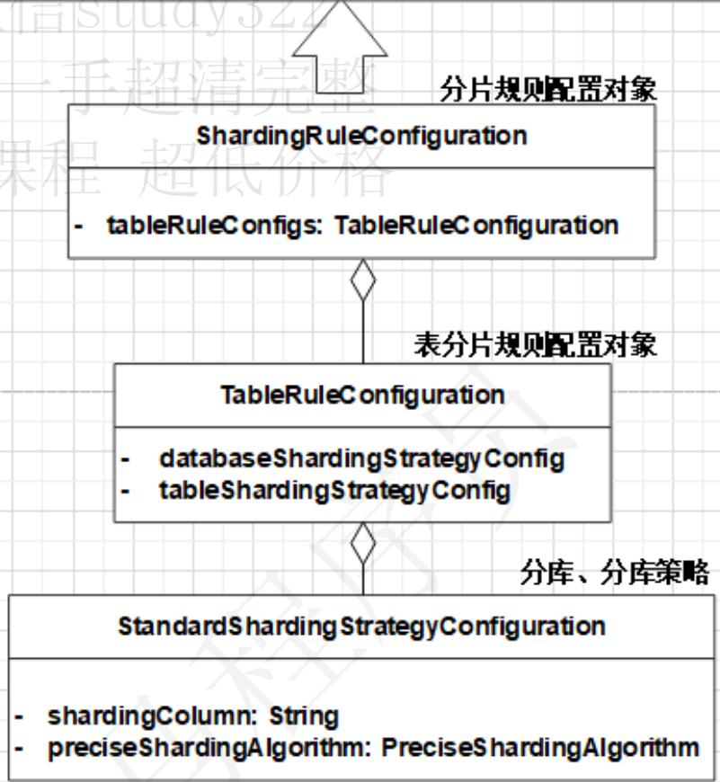


# 3. ShardingJDBC集成配置

1）maven依赖

2）规则配置application.yml

3）创建DataSource

# 4. 验证应用服务高可用

4.1 新增一条数据

4.2 停止linux30数据库，新增一条数据

4.3 重启linux30数据库和keepalived，新增一条数据

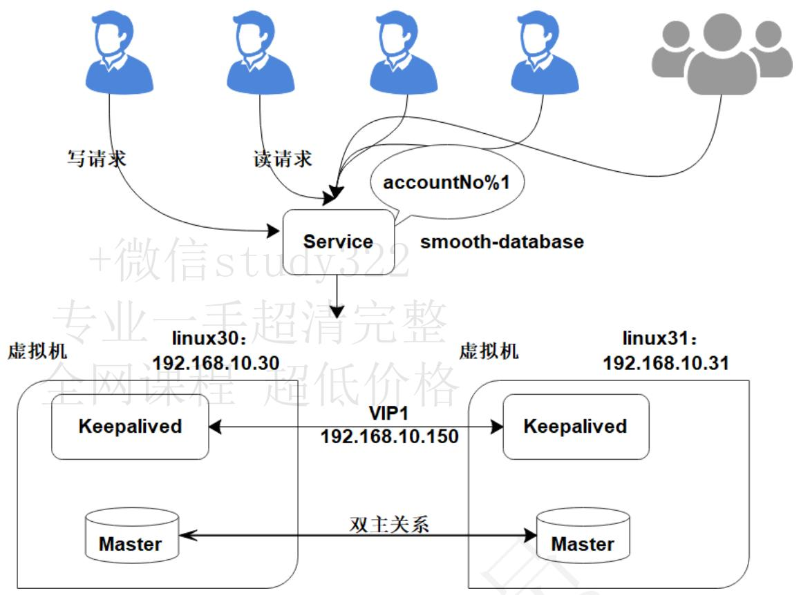


// 动态数据源配置实现扩容


```java
Properties properties = loadPropertiesFile("datasource1.properties");
try {
    log.info("load datasource config url: " + properties.get("url"));
    DruidDataSource druidDataSource = (DruidDataSource)
    DruidDataSourceFactory.createDataSource(properties);
    druidDataSource.setRemoveAbandoned(true);
    druidDataSource.setRemoveAbandonedTimeout(600);
    druidDataSource.setLogAbandoned(true);
    // 设置数据源错误重连时间
    druidDataSource.setTimeBetweenConnectErrorMillis(60000);
    druidDataSource.init();
    OrchestrationShardingDataSource dataSource = SpringContextUtil.getBean("tradeSystemDataSource", OrchestrationShardingDataSource.class);
    Map<String, DataSource> dataSourceMap = dataSource.getDataSource().getDataSourceMap();
    dataSourceMap.put(DatasourceEnum.DATASOURCE_2.getValue(), druidDataSource);

    Map<String, DataSourceConfiguration> dataSourceConfigMap = new HashMap<String, DataSourceConfiguration>();
    for(String key : dataSourceMap.keySet()) {
    dataSourceConfigMap.put(key, DataSourceConfiguration.getDataSourceConfiguration(dataSourceMap.get(key)));
    }
    String result = SHARDING_RULE_TABLE_ORDER.replace(SHARDING_RULE_DATASOURCE, newRule);
    replaceActualDataNodes(result);
    SHARDING_RULE_DATASOURCE = newRule;

    dataSource.renew(new DataSourceChangedEvent(
    "/" + DruidSystemDataSourceConfiguration.DYNAMIC_SHARDING + "/config/schema/logic_db/datasource",
```

```txt
dataSourceConfigMap));
return;
} catch (Exception e) {
    log.error(e.getMessage(), e);
} 
```

# 5. 注意事项

Sharding JDBC, Mycat, Drds 等产品都是分布式数据库中间件, 相比直接的数据源操作, 会存在一些限制, Sharding JDBC在使用时, 要注意以下问题:全网课程 超低价格

有限支持子查询

不支持HAVING

不支持OR，UNION 和 UNION ALL

不支持特殊INSERT

每条INSERT语句只能插入一条数据，不支持VALUES后有多行数据的语句

不支持DISTINCT聚合

不支持dual虚拟表查询

不支持SELECT LAST_INSERT_ID(), 不支持自增序列

不支持CASE WHEN

# 2.2 实现数据库的秒级平滑2N扩容

扩容部署架构：

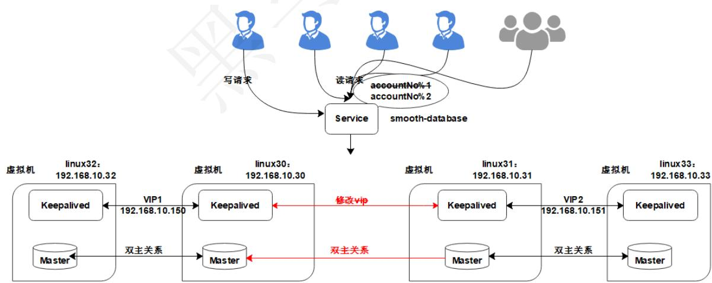


# 2.2.1 新增数据库VIP

1. 在linux31节点， 增加VIP

修改/etc/keepalived/keepalived.conf

```hcl
[root@linux31 mariaDB]# vi /etc/keepalived/keepalived.conf
global_defs {
    router_id linux31
} 
```

```txt
vrrp_instance VI_1 {    #vrrp实例定义
    state BACKUP    #lvs的状态模式，MASTER代表主，BACKUP代表备份节点
    interface ens33    #绑定对外访问的网卡
    virtual_router_id 112    #虚拟路由标示，同一个vrrp实例采用唯一标示
    priority 100    #优先级，100代表最大优先级，数字越大优先级越高
    advert_int 1    #master与backup节点同步检查的时间间隔，单位是秒
    authentication {    #设置验证信息
    auth_type PASS    #有PASS和AH两种
    auth_pass 6666    #验证密码，BACKUP密码须相同
    }
    virtual_ipaddress {    #KeepAlived虚拟的IP地址
    192.168.10.151
    }
}
virtual_server 192.168.10.151 3306 {    #配置虚拟服务器IP与访问端口
    delay_loop 6    #健康检查时间
    persistence_timeout 0    #会话保持时间，这里要做测试，所以设为0，实际可根据session有效时间配置
    protocol TCP    #转发协议类型，支持TCP和UDP
    real_server 192.168.10.31 3306 {    #配置服务器节点linux31
    notify_down /opt/mariaDB/mariadb.sh
    weight 1    #设置权重，越大权重越高
    TCP_CHECK {    #r状态监测设置
    connect_timeout 10    #超时配置，单位秒
    retry 3    #重试次数
    delay_before_retry 3    #重试间隔
    connect_port 3306    #连接端口，和上面保持一致
    }
    }
}
```

注意配置项：

```txt
virtual_router_id 112
priority 100 
```

```txt
#虚拟路由标示，同一个vrrp实例采用唯一标示
#优先级，100代表最大优先级，数字越大优先级越高
```

# 2.2.2 应用服务增加动态数据源

1. 修改应用服务配置， 增加新的数据源， 指向新设置的VIP： 192.168.10.151

2. 通过应用服务接口， 动态扩容调整

# 2.2.3 解除原双主同步

```batch
mysql -uroot -p123456 
```

1. 进入linux30:

```txt
MariaDB [(none)]> stop slave; 
```

2. 进入linux31:

```txt
MariaDB [(none)]> stop slave; 
```

3. 通过应用服务接口验证数据是否解除同步

# 2.2.4 安装MariaDB扩容服务器

1. 新建两台虚拟机， 分别为linux32和linux33。

2. 在linux32和linux33两台节点上安装MariaDB服务

参考2.1.1 MariaDB服务安装

3. 配置linux32与linux30，实现新的双主同步

4. linux32节点， 修改/etc/my.cnf:全网课程 超

```ini
[root@linux32 ~]# vi /etc/my.cnf

[mysqld]
server-id = 3
log-bin=mysql-bin
relay-log = mysql-relay-bin
replicate-wild-ignore-table=mysql.% 
replicate-wild-ignore-table=information_schema.% 
log-slave-updates=on
slave-skip-errors=all
auto-increment-offset=2
auto-increment-increment=2
binlog_format=mixed
expire_logs_days=10 
```

2. 重启linux32数据库

```txt
[root@linux32 ~]# service mariadb restart 
```

3. 创建replica用于主从同步的用户：

```txt
[root@linux32 ~]# mysql -uroot -p123456
MariaDB [(none)]> grant replication slave, replication client on *.* to 'replica'@'%' identified by 'replica';
MariaDB [(none)]> flush privileges; 
```

4. 在linux30节点，进行数据全量备份：

```txt
[root@linux30 mariaDB]# mysqldump -uroot -p123456 --routines --single_transaction --master-data=2 --databases smooth > linux30.sql
[root@linux30 mariaDB]# ll
总用量 8
-rw-r--r--. 1 root root 2873 1月 5 11:22 linux30.sql
-rwxr-xr-x. 1 root root 17 1月 5 09:52 mariadb.sh
[root@linux30 mariaDB]#
```


5. 查看并记录master status信息：


```txt
MariaDB [(none)]> show master status;
+----+----+----+
| File    | Position | Binlog_Do_DB | Binlog_Ignore_DB |
+----+----+----+
| mysql-bin.000003 | 1462 |    |
+----+----+----+
1 row in set (0.00 sec) 
```


6. 将备份的linux30.sql通过scp命令拷贝至linux32节点。


```txt
[root@linux30 mariaDB]# scp linux30.sql root@192.168.10.32:/opt/mariaDB 
```


7. 将数据还原至linux32节点：


```batch
[root@linux32 mariaDB]# mysql -uroot -p123456 < /opt/mariaDB/linux30.sql 
```


8. 配置主从同步信息


根据上面的master status信息， 在linux32中执行：


```txt
MariaDB [(none)]> change master to
master_host='192.168.10.30', master_user='replica',
master_password='replica', master_port=3306, master_log_file='mysql-
bin.000004', master_log_pos=3133, master_connect_retry=30;
Query OK, 0 rows affected (0.00 sec) 
```


9. 开启主从同步：


```txt
MariaDB [(none)]> start slave;
Query OK, 0 rows affected (0.00 sec) 
```


如果出现问题， 复原主从同步信息：


```txt
MariaDB [(none)]> reset slave;
Query OK, 0 rows affected (0.01 sec) 
```


10. 检查同步状态信息：


```txt
MariaDB [(none)]> show slave status \G;
*************************** 1. row ***************************
    Slave_IO_State: waiting for master to send event
    Master_Host: 192.168.10.30
    Master_User: replica
    Master_Port: 3306
    Connect_Retry: 30
    Master_Log_File: mysql-bin.000003
    Read_Master_Log_Pos: 1462
    Relay_Log_File: mysql-relay-bin.000002
    Relay_Log_Pos: 555
    Relay_Master_Log_File: mysql-bin.000003
    Slave_IO_Running: Yes
    Slave_SQL_Running: Yes 
```

# 11. 配置linux30与linux32节点的同步

查看linux32的日志信息：

```txt
MariaDB [(none)]> show master status;
+----+----+----+
| File    | Position | Binlog_Do_DB | Binlog_Ignore_DB |
+----+----+----+
| mysql-bin.000001 | 2358 |    |    |
+----+----+----+
1 row in set (0.00 sec) 
```

在linux30节点， 配置同步信息：

```txt
MariaDB [(none)]> reset slave;
Query OK, 0 rows affected (0.00 sec)

MariaDB [(none)]> change master to
master_host='192.168.10.32', master_user='replica',
master_password='replica', master_port=3306, master_log_file='mysql-
bin.000003', master_log_pos=358, master_connect_retry=30;
Query OK, 0 rows affected (0.02 sec)

MariaDB [(none)]> start slave;
Query OK, 0 rows affected (0.00 sec) 
```

# 4. 配置linux33与linux31的双主同步

1. linux33节点， 修改/etc/my.cnf:

```ini
[root@linux33 ~]# vi /etc/my.cnf
[mysqld]
server-id = 4
log-bin=mysql-bin
relay-log = mysql-relay-bin
replicate-wild-ignore-table=mysql.% 
replicate-wild-ignore-table=information_schema.% 
log-slave-updates=on 
```

```txt
slave-skip-errors=all
auto-increment-offset=2
auto-increment-increment=2
binlog_format=mixed
expire_logs_days=10 
```

2. 重启linux33数据库

```txt
[root@linux33 ~]# service mariadb restart 
```

3. 创建replica用于主从同步的用户：专业一手超

```txt
[root@linux33 ~]# mysql -uroot -p123456
MariaDB [(none)]> grant replication slave, replication client on *.* to 'replica'@'%' identified by 'replica';
Query OK, 0 rows affected (0.00 sec)
MariaDB [(none)]> flush privileges;
Query OK, 0 rows affected (0.00 sec) 
```

4. 在linux31节点，进行数据全量备份：

```txt
[root@linux31 mariaDB]# mysqldump -uroot -p123456 --routines --single_transaction --master-data=2 --databases smooth > linux31.sql
[root@linux31 mariaDB]# ll
总用量 8
-rw-r--r--. 1 root root 2873 1月 5 11:35 linux31.sql
-rwxr-xr-x. 1 root root 17 1月 5 09:56 mariadb.sh
[root@linux31 mariaDB]#
```

5. 查看并记录master status信息：

```txt
[root@linux31 mariaDB]# mysql -uroot -p123456
MariaDB [(none)]> show master status;
+----+----+----+
| File    | Position | Binlog_Do_DB | Binlog_Ignore_DB |
+----+----+----+
| mysql-bin.000001 | 4470 |    |
+----+----+----+
1 row in set (0.00 sec) 
```

6. 将备份的linux31.sql通过scp命令拷贝至linux33节点。

```txt
[root@linux31 mariaDB]# scp linux31.sql root@192.168.10.33:/opt/mariaDB 
```

7. 将数据还原至linux33节点：

```batch
[root@linux33 mariaDB]# mysql -uroot -p123456 < /opt/mariaDB/linux31.sql 
```

# 8. 配置主从同步信息

根据上面的master status信息， 在linux33中执行：

```txt
[root@linux33 mariaDB]# mysql -uroot -p123456
MariaDB [(none)]> change master to master_host='192.168.10.31', master_user='replica', master_password='replica', master_port=3306, master_log_file='mysql-bin.000002', master_log_pos=3133, master_connect_retry=30; Query OK, 0 rows affected (0.00 sec) 
```

# 9. 开启主从同步：

```txt
MariaDB [(none)]> start slave;
Query OK, 0 rows affected (0.00 sec) 
```

注意， 如果出现问题， 复原主从同步信息：

```txt
MariaDB [(none)]> reset slave;
Query OK, 0 rows affected (0.01 sec) 
```

# 10. 检查同步状态信息：

```txt
MariaDB [(none)]> show slave status \G;
*************************** 1. row ***************************
    Slave_IO_State: waiting for master to send event
    Master_Host: 192.168.10.31
    Master_User: replica
    Master_Port: 3306
    Connect_Retry: 30
    Master_Log_File: mysql-bin.000001
    Read_Master_Log_Pos: 4470
    Relay_Log_File: mysql-relay-bin.000002
    Relay_Log_Pos: 555
    Relay_Master_Log_File: mysql-bin.000001
    Slave_IO_Running: Yes
    Slave_SQL_Running: Yes 
```

# 11. 配置linux31与linux33节点的同步

查看linux33的日志信息：

```txt
MariaDB [(none)]> show master status;
+----+----+----+
| File    | Position | Binlog_Do_DB | Binlog_Ignore_DB |
+----+----+----+
| mysql-bin.000001 | 2358 |    |
+----+----+----+
1 row in set (0.00 sec) 
```


在linux31节点， 配置同步信息：


```txt
[root@linux31 mariaDB]# mysql -uroot -p123456
MariaDB [(none)]> reset slave;
Query OK, 0 rows affected (0.01 sec)
MariaDB [(none)]> change master to
master_host='192.168.10.33', master_user='replica',
master_password='replica', master_port=3306, master_log_file='mysql-
bin.000003', master_log_pos=2268, master_connect_retry=30;
Query OK, 0 rows affected (0.01 sec)
MariaDB [(none)]> start slave;
Query OK, 0 rows affected (0.00 sec) 
```

# 2.2.5 增加KeepAlived服务实现高可用

1. 确保新增的linux32和linux33节点安装Keepalived服务。

2. 修改linux32节点配置

```txt
[root@linux32 mariaDB]# vi /etc/keepalived/keepalived.conf
global_defs {
    router_id linux32    # 机器标识，一般设为hostname，故障发生时，邮件通知会使用到。
}
vrrp_instance VI_1 {
    state BACKUP    #lvs的状态模式，MASTER代表主，BACKUP代表备份节点
    interface ens33    #绑定对外访问的网卡
    virtual_router_id 111    #虚拟路由标示，同一个vrrp实例采用唯一标示
    priority 98    #优先级，100代表最大优先级，数字越大优先级越高
    advert_int 1    #master与backup节点同步检查的时间间隔，单位是秒
    authentication {
    auth_type PASS    #有PASS和AH两种
    auth_pass 6666    #验证密码，BACKUP密码须相同
    }
    virtual_ipaddress {
    192.168.10.150    #KeepAlived虚拟的IP地址
    }
}
virtual_server 192.168.10.150 3306 {    #配置虚拟服务器IP与访问端口
    delay_loop 6    #健康检查时间
```

```tcl
persistence_timeout 0    #会话保持时间，这里要做测试，所以设为0，实际可根据session有效时间配置
protocol TCP    #转发协议类型，支持TCP和UDP
real_server 192.168.10.32 3306 {    #配置服务器节点linux32
notify_down /opt/mariaDB/mariadb.sh
weight 1    #设置权重，越大权重越高
TCP_CHECK {    #r状态监测设置
    connect_timeout 10    #超时配置，单位秒
    retry 3    #重试次数
    delay_before_retry 3    #重试间隔
    connect_port 3306    #连接端口，和上面保持一致
}
}
```

注意里面IP配置正确， 修改完成后重启服务。

```txt
[root@linux32 mariaDB]# systemctl restart keepalived 
```

创建关闭脚本mariadb.sh

```txt
[root@linux32 mariaDB]# vi /opt/mariaDB/mariadb.sh
# 添加如下内容
pkill keepalived
```

加入执行权限：

```txt
chmod a+x mariadb.sh 
```

# 3. 修改linux33节点配置

```tcl
[root@linux33 mariaDB]# vi /etc/keepalived/keepalived.conf
global_defs {
    router_id linux33 # 机器标识，一般设为hostname，故障发生时，邮件通知会使用到。
}
vrrp_instance VI_1 { #vrrp实例定义
    state BACKUP #lvs的状态模式，MASTER代表主，BACKUP代表备份节点
    interface ens33 #绑定对外访问的网卡
    virtual_router_id 112 #虚拟路由标示，同一个vrrp实例采用唯一标示
    priority 98 #优先级，100代表最大优先级，数字越大优先级越高
    advert_int 1 #master与backup节点同步检查的时间间隔，单位是秒
    authentication { #设置验证信息
    auth_type PASS #有PASS和AH两种
    auth_pass 6666 #验证密码，BACKUP密码须相同
    }
    virtual_ipaddress { #KeepAlived虚拟的IP地址
    192.168.10.151
}
```

```txt
}
virtual_server 192.168.10.151 3306 {    #配置虚拟服务器IP与访问端口
    delay_loop 6    #健康检查时间
    persistence_timeout 0    #会话保持时间，这里要做测试，所以设为0，实际可根据session有效时间配置
    protocol TCP    #转发协议类型，支持TCP和UDP
    real_server 192.168.10.33 3306{    #配置服务器节点linux33
    notify_down /opt/mariaDB/mariadb.sh
    weight 1    #设置权重，越大权重越高
    TCP_CHECK {    #r状态监测设置
    connect_timeout 10    #超时配置，单位秒
    retry 3    #重试次数
    delay_before_retry 3    #重试间隔
    connect_port 3306    #连接端口，和上面保持一致
    }
    }
}
```


创建关闭脚本mariadb.sh


```txt
[root@linux33 mariaDB]# vi /opt/mariaDB/mariadb.sh
# 添加如下内容
pkill keepalived
```


给所有的用户组加入执行权限：


```txt
chmod a+x mariadb.sh 
```


4. 修改完后重启Keepalived服务。


```txt
[root@linux33 mariaDB]# systemctl restart keepalived 
```

# 2.2.6 清理数据并验证

1. 通过应用服务动态扩容接口做调整和验证

2. 在linux30节点清理数据

根据取模规则， 保留accountNo为偶数的数据

```sql
delete from smooth.t_trade_order where accountNo % 2 != 0; 
```

3. 在linux31节点清理数据

根据取模规则， 保留accountNo为奇数的数据

```sql
delete from smooth.t_trade_order where accountNo % 2 != 1; 
```

