# Redis应用与原理

# 什么是缓存

缓存又称为高速缓存，是计算机存储器的一种，也是现代计算机硬件系统中重要的一环。缓存是为了调节速度不一致的两个或多个不同的物质的速度，在中间对速度较快的一方起到一个加速访问速度较慢的一方的作用

缓存 != 内存，伴随缓存而生的一个词叫：命中率。当我们查询的数据存在于缓存中的时候，我们称之为“命中”，此时，所需数据可以直接由缓存提供。而对于未“命中”的数据，则需要穿过缓存层，进一步去持久化数据层获取。数据获取之后，在返回给应用之前，我们需要重新填充缓存，以供下一次“命中”查询。

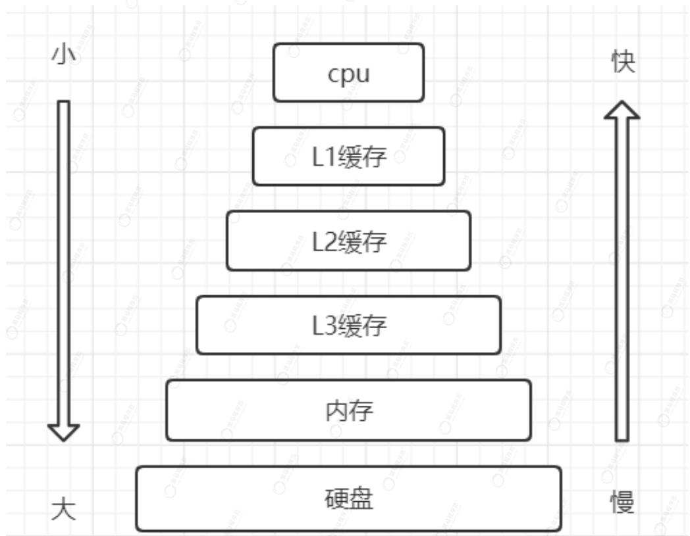


缓存在系统架构中的作用


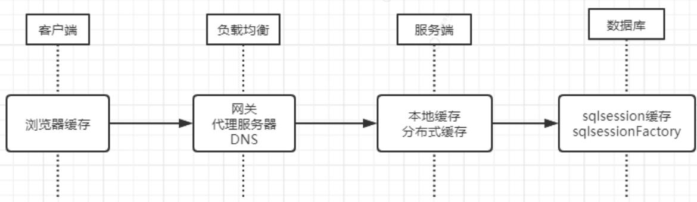


1、减少客户端访问客户端次数


2、减少服务端请求次数

3、减少数据库压力

4、减少磁盘IO次数

# 缓存的加入带来的挑战

1、应用中哪类数据应使用缓存

2、应用数据何时、如何写入缓存

3、应用缓存数据如何保证命中率

4、缓存如何保证实时性

5、如何保证缓存数据不丢失

# 应用常见缓存技术

# 本地缓存

java 程序使用ThreadLocal、List、Map等保存应用数据,生命周期等同JVM

# Ehcache

- 基于Java开发，足够简单，轻量化。

- 纯Java的进程内缓存框架，非分布式的。应用服务器多节点部署时存在问题（如：用户登录信息）

- 被广泛的运用于其他的开源项目，比如，当Ehcache和Hibernate进行整合时，能将查询出的对象集合放入内存中，下次如果再查询这个查询，将直接从内存中返回这个数据集合，不需要再进行数据库的查询。

- 自己的项目中直接使用Ehcache作为缓存方案的情况较少。

# Memcache

- C语言所编写，高性能、分布式对象缓存系统。

- 最初设计于缓解动态网站数据库加载数据的延迟性。

- 常用于网站kv形式的缓存，可以把它想象成一个巨大的内存HashTable。

- Memcache支持多个cpu同时工作。

- 基于纯内存，不做持久化，掉电数据丢失。数据体量大时的宕机重启不可容忍（会压垮数据库）

# Redis

Redis是在Memcache之后编写的，所以经常把这两者拿来做比较，下面详细介绍Redis

# Redis简介

# 简介

官网网址：https://redis.io/commands/

中文网址：http://www.redis.cn/commands.html#string

Remote DIctionary Server(Redis) 是一个由 Salvatore Sanfilippo 写的 key-value 存储系统，官方定义自己为：“跨平台的非关系型数据库”。实际上也就是拿来做缓存用。

开源的，使用 ANSI C 语言编写、遵守 BSD 协议、支持网络、可基于内存、分布式、可选持久性，并提供多种语言的 API。

# 同Memcache类比

1、Redis和Memcache都是将数据存放在内存中，都是内存数据库。

2、Redis不仅仅支持简单的k/v类型的数据，同时还提供list，set，hash等数据结构的存储。

3、超时时间Memcache在set时就指定。Redis可以通过expire 后期设定，例如expire name 10

4、都是分布式的，但是Memcache集群数据分片一般由客户端完成，Redis天生支持集群

5、Memcache挂掉后，数据丢失。Redis可以做到持久化，启动后恢复

6、Redis支持主从、哨兵、集群等模式，可以保障体系的故障自动转移。

# 选型

缓存处理上应该说Memcached和Redis都能很好的满足解决我们的问题，它们性能都很高，总的来说，可以把Redis理解为是对Memcached功能上的拓展，是更加重量级的实现，提供了更多更强大的功能。

# 1. 性能上：

性能上都很出色，Redis只使用单核，而Memcached可以使用多核，所以平均每一个核上Redis在存储小数据时比

Memcached性能更高。而在100k以上的数据中，Memcached性能要高于Redis，虽然Redis最近也在存储大数据的性能上进行优化，但是比起 Memcached，还是稍有逊色。

# 2. 操作便利上：

Memcached数据结构单一，仅用来缓存数据，而Redis支持更加丰富的数据类型，也可以在服务器端直接对数据进行丰富的操作，这样可以减少网络IO次数和数据体积。比如经典的原子加1计数操作。

# 3. 可靠性上：

Memcached不支持数据持久化，断电或重启后数据消失，但其稳定性是有保证的。Redis支持数据持久化和数据恢复，允许单点故障。在这个特性上，Redis将自己定位为一个支持非关系型数据结构的内存数据库（nosql）

# 4. 应用场景：

Memcached：单纯kv缓存，适合多读少写，大数据量的情况（如人人网大量查询用户信息、好友信息、文章信息等）。

Redis：适用于对读写效率要求都很高，数据处理业务复杂和对安全性要求较高的系统（如新浪微博的计数和微博发布部分系统，对数据安全性、读写要求都很高）。

# Redis环境搭建

# 基于Docker

#启动

```batch
docker run --name some-redis -d daocloud.io/library/redis:6.0.6 
```

#进入容器

```txt
docker exec -it some-Redis sh 
```

#使用cli

```txt
redis-cli 
```

```xml
127.0.0.1:6379> 
```

#测试启动情况

```txt
127.0.0.1:6379> info 
```

# 物理机

下载地址：

https://download.Redis.io/releases/redis-6.2.0.tar.gz 

#切换到安装目录

```txt
cd /opt/redis 
```

#下载

```txt
wget https://download.Redis.io/releases/redis-6.2.0.tar.gz 
```

#解压

```txt
tar zxvf redis-6.2.0.tar.gz 
```

#编译

```txt
cd redis-6.2.0 
```

```txt
make 
```

#...各种日志...

#等待编译完成

```txt
11 src/ | grep rwx 
```

```txt
-rwxrwxr-x 1 root root 735 2月 23 05:23 mkreleasehdr.sh
```

```txt
drwxrwxr-x 2 root root 4096 2月 23 05:23 modules
```

```txt
-rwxr-xr-x 1 root root 4833368 3月 1 15:46 redis-benchmark
```

```txt
-rwxr-xr-x 1 root root 9442088 3月 1 15:46 redis-check-aof
```

```txt
-rwxr-xr-x 1 root root 9442088 3月 1 15:46 redis-check-rdb
```

```txt
-rwxr-xr-x 1 root root 5003272 3月 1 15:46 redis-cli
```

```txt
-rwxr-xr-x 1 root root 9442088 3月 1 15:46 redis-sentinel
```

```txt
-rwxr-xr-x 1 root root 9442088 3月 1 15:46 redis-server
```

```txt
-rwxrwxr-x 1 root root 3600 2月 23 05:23 redis-trib.rb
```

#启动

```ignorefile
src/redis-server 
```

#如果需要外部，公网访问的话，bind注释掉，制定protected-mode no，或者命令行带上

```txt
redis-server redis.conf --port 9010 --protected-mode no 
```

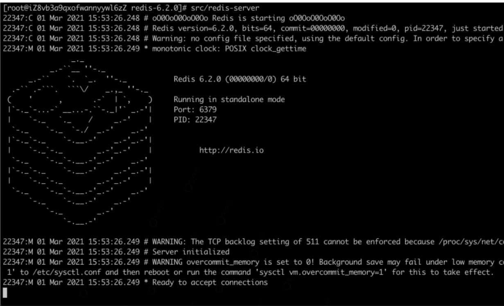


# 安装过程中可能出现的错误

make[3]: cc: 命令未找到

make[3]: *** [Makefile:223: alloc.o] 错误 127

原因: 未安装gcc

解决: yum install -y gcc

zmalloc.h:50:10: fatal error: jemalloc/jemalloc.h: 没有那个文件或目录

原因: 未指定编译库

解决: make MALLOC=libc

# 一些关键配置

port: 端口，默认6379

protected-mode: 是否启用保护模式，默认为yes。需要改为no，否则其他主机无法连接redis，比如：java程序

bind: 绑定ip地址，限制那些ip可以访问redis服务，默认为127.0.0.1 -::1。学习中直接前面加“#”注释，表示所有IP都可以

daemonize: 是否守护进程启动，默认为no。根据需要自行修改。

requirepass: 密码,根据需要自行设置

Redis是k-v型数据库，每个数据的key都是字符串类型。value可以为以下几种对象类型：

# String(字符串)

Redis没有直接使用C语言传统的字符串，而是自己构建了一种名为简单动态字符串(Simle Dynamic String 简称:SDS)的抽象类型，并将SDS用作Redis的默认字符串表示。

# 3.2 版本以前数据结构

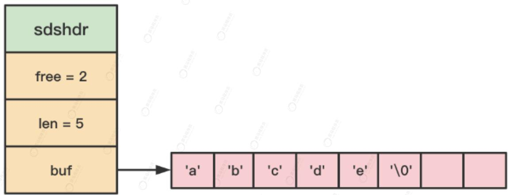


- 每个 src/sds.h/sdshdr 都表示一个 SDS 值

- 假设 free 值 = 0，代表这个 SDS 没有分配或没有剩下任何未使用的空间

- 假设 len = 10，代表这个 SDS 保留了一个 5 byte 长度的字符串

- buf属性是一个char类型的数组，保存了我们的字符串，已\0(空字符串)结尾

# 3.2 版本以后

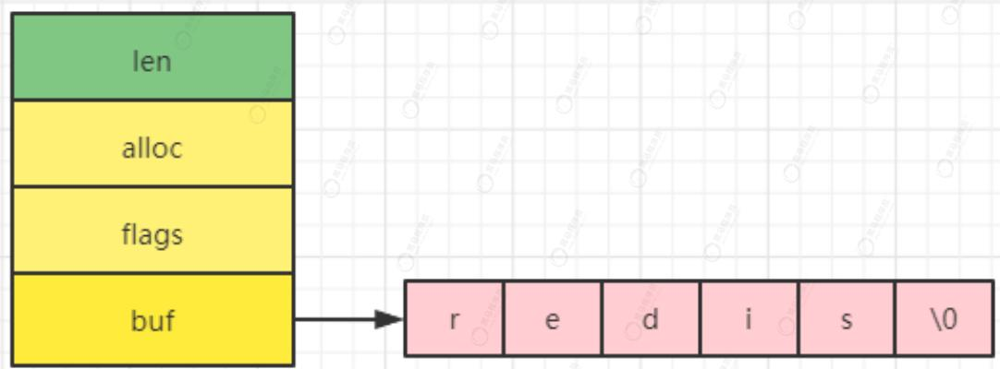


- alloc 表示 SDS 的最大容量，剩余空间 free = alloc - len

- flags 表示字符串类型，占用 1 个字节，低 3 位表示 header 的类型，后 5 位暂时不用 SDS_TYPE_5, SDS_TYPE_8, SDS_TYPE_16, SDS_TYPE_32, SDS_TYPE_64

<table><tr><td>类型</td><td>范围</td><td>最大值</td></tr><tr><td>5</td><td><eq>[0, 2^{5})</eq></td><td>31</td></tr><tr><td>8</td><td><eq>[2^{5}, 2^{8})</eq></td><td><eq>2^{8}-1</eq></td></tr><tr><td>16</td><td><eq>[2^{8}, 2^{16})</eq></td><td><eq>2^{16}-1</eq></td></tr><tr><td>32</td><td><eq>[2^{16}, 2^{32})</eq></td><td><eq>2^{32}-1</eq></td></tr><tr><td>64</td><td><eq>[2^{32}, 2^{64})</eq></td><td><eq>2^{64}-1</eq></td></tr></table>

常用命令：

set: 设置值,覆写旧值，无视类型，原有的 TTL 将被清除

append: 将 value 追加到 key 原来的值的末尾,如果 key 不存在,就简单地将给定 key 设为 value

getrange: 返回 key 中字符串值的子字符串，字符串的截取范围由 start 和 end 两个偏移量决定(包括 start 和 end 在内)。

负数偏移量表示从字符串最后开始计数，-1 表示最后一个字符，-2 表示倒数第二个，以此类推

set*X 

- EX second：设置键的过期时间为second秒。SET key value EX second效果等同于SETEX key second value。

- PX millisecond：设置键的过期时间为 millisecond 毫秒。SET key value PX millisecond 效果等同于 PSETEX key millisecond value。

- NX：只在键不存在时，才对键进行设置操作。SET key value NX 效果等同于 SETNX key value。

- xx：只在键已经存在时，才对键进行设置操作。

mset: 同时设置一个或多个 key-value 对

运算：INCR，INCRBY，DECR，DECRBY

# Hash(哈希表)

Hash类似于java里的HashMap，多用于存储多属性对象，除了基本的set、get方法之外，提供了单属性的值运算，判断属性是否存在等高级使用方法。

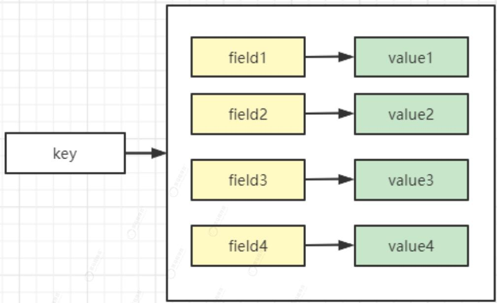


与String不同的是，我们的一个key可以保存多个属性对应的值。可以用来保存我们的热点数据，相比于使用String类型缓存json字符串，更方便后续单个属性的操作。

常用命令：

hget: 返回哈希表 key 中给定域 field 的值。当给定域不存在或是给定 key 不存在时，返回空

hset: 将哈希表 key 中的域 field 的值设为 value 。如果域 field 已经存在于哈希表中，旧值将被覆盖。

hexists: 查看哈希表 key 中，给定域 field 是否存在。如果哈希表含有给定域，返回 1，否则返回 0

hsetnx: 将哈希表 key 中的域 field 的值设置为 value，当且仅当域 field 不存在。若域 field 已经存在，该操作无效。

hgetall: 返回哈希表 key 中，所有的域和值

hincrby: 为哈希表 key 中的域 field 的值加上增量 increment，增量也可以为负数，相当于对给定域进行减法操作。

思考:

Redis存储java对象，一般是String 或 Hash 两种，那到底什么时候用String？什么时候用hash？

String的存储通常用在频繁读操作，它的存储格式是json,即把java对象转换为json，然后存入Redis。

Hash的存储场景应用在频繁写操作，即，当对象的某个属性频繁修改时，不适用string+json的数据结构，因为不灵活，每次修改都需要把整个对象转换为json存储。如果采用hash，就可以针对某个属性单独修改，不用序列号去修改整个对象。例如短链接，商品的库存、价格、关注数、评价数经常变动时，就使用存储hash结果。

注意:

Redis强大的过期功能不用应用在field上，只能应用在key上。如果key过期，则所有的属性值全部消失。

# List(列表)

List即链表，链表提供了高效的节点重排能力，以及顺序性的节点访问方式，并且可以通过增加、删除节点来灵活的调整链表的长度。

因为C语言没有内置这种数据结构,所以Redis构建了自己的链表实现。

```c
// 链表节点对象结构
typedef struct listNode{
    // 当前节点的前置节点
    struct listNode prev;
    // 当前节点的后置节点
    struct listNode next;
    // 当前节点的值
    void value;
}
```

多个listNode可以通过prev和next指针组成双端链表，如下图：

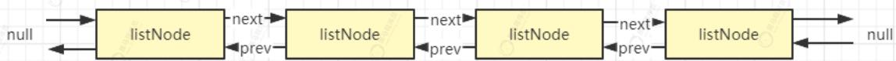


# 常用命令：

lindex: 返回下标为 index 的元素, 0 表示第一个元素, 1 表示第二个元素, -1 表示最后一个元素, -2 表示倒数第二个元素

lpush: 将一个或多个值 value 插入到列表 key 的表头,如果有多个 value 值，那么各个 value 值按从左到右的顺序依次插入到表头。

lpop: 移除并返回列表 key 的头元素。

blpop: 它是 lpop 命令的阻塞版本，当给定列表内没有任何元素可供弹出的时候，直到等待超时或发现可弹出元素为止。

rpop: 移除并返回列表 key 的尾元素。

rpush: 将一个或多个值 value 插入到列表 key 的表尾(最右边)。

brpop: 它是命令的阻塞版本，当给定列表内没有任何元素可供弹出的时候，直到等待超时或发现可弹出元素为止。

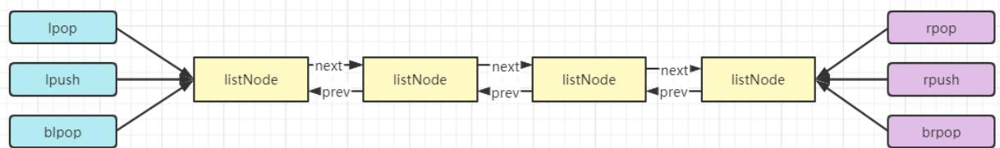


因为链表的特性，对于节点的读取与插入时的顺序保持一致性，可以做微型消息传递、阻塞队列、栈等业务功能。

# Set(集合)

Set等同于java里的HashSet，功能类似，当时相比于HashSet多了一些高级功能。Redis的Set里的数据是无序的，即不保证插入的顺序，也不保证插入值得排序。相比与List,提供了判断一个成员是否存在的API,而相比于Hash缺少了value，只保留了field属性。

基于Set我们可以轻易实现2个集合的差集、交集、并集等操作，满足日常中对2个集合的操作，如：重复配置、共同权限、共同关注等。

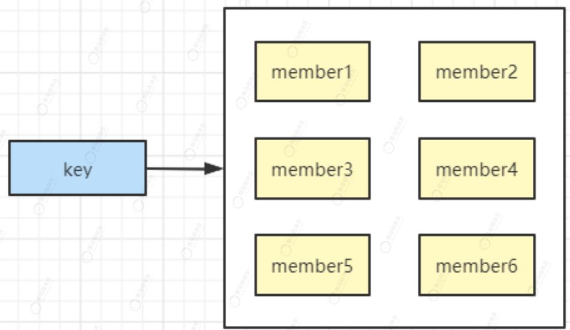


常用命令：

sadd: 将一个或多个 member 元素加入到集合 key 当中，已经存在于集合的 member 元素将被忽略

srem: 移除集合 key 中的一个或多个 member 元素，不存在的 member 元素会被忽略。

smove: 将 member 元素从 source 集合移动到 destination 集合

sdiff: 返回一个集合的全部成员，该集合是所有给定集合之间的差集

sunion: 返回一个集合的全部成员，该集合是所有给定集合的并集。

sinter: 返回一个集合的全部成员，该集合是所有给定集合的交集。

srandmember: 如果命令执行时，只提供了 key 参数，那么返回集合中的一个随机元素, 如果提供 count 参数，则弹出 count 个元素，如果大于集合的数量，则返回整个集合。

spop: 移除并返回集合中的一个随机元素(重点:移除)。

# SortedSet(有序集合)

zset同set相似度很高，不同的是zset引入了一个score分值概念，对于集合里的每个元素必须自定分值，并且根据指定的分值进行排序。

通过score的值，我们可以完成日常工作中点击量排序、点赞排序、延时任务、榜单等。

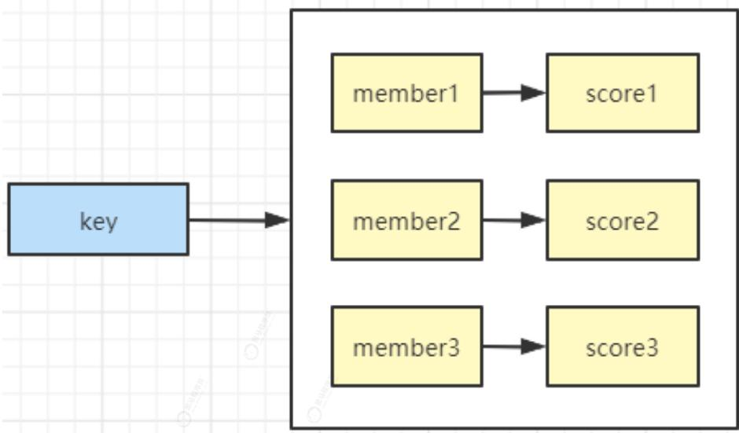


常用命令：

zincrby: 为有序集 key 的成员 member 的 score 值加上增量 increment 。负数值 increment ，让 score 减去相应的值

zscore: 返回有序集 key 中，成员 member 的 score 值。

zrank: 返回有序集 key 中成员 member 的排名。其中有序集成员按 score 值递增(从小到大)顺序排列。

zrangebyscore: 返回有序集 key 中，所有 score 值介于 min 和 max 之间(包括等于 min 或 max)的成员。有序集成员按 score 值递增(从小到大)次序排列

# 二进制位数组

redis维护一个二进制数组，最大长度2的32次方(bit映射被限制在512M之内)，可以保存40亿的结果，但是空间使用很低。如果下图：

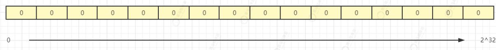


常用命令：

setbit: 设置二进制位数组的某个位置(offset)的值，值只能是0或者1，offset的值最小为0，最大为2^32

getbit: 获取二进制位数组的某个位置(offset)的值

bitcount: 计算给定字符串中，被设置为 1 的比特位的数量。

# Redis功能简介

# 数据库

在初始化服务器时，程序会根据服务器状态的dbnum属性来决定应该创建多少个数据库，默认为16个。每个Redis客户端都有自己的目标数据库，每当客户端执行数据库写命令或者数据库读命令时，目标数据库就会成为这些命令的操作对象。切换数据库的命令为select，后面的数字为数据库编号，从0开始。

Redis中每个数据库的数据是独立的，不能跨库操作数据。

# Redis

数据库：0 (name:zhangsan)

数据库：1(name:zhangsan,age:14)

数据库：15(name:zhangsan,age:16)

# 缓存过期

缓存具有短暂性的特点，并且内存空间资源紧张，缓存在使用后需要及时清除。Redis通过命令expire对key添加过期时间如下：

expire key 30 // 设置过期时间30秒

redis使用一个字典保存所有键的过期时间，称为过期字典。

- 过期字典的键是一个指针，执行键空间的某个键对象

- 过期字典的值是一个long型整数，保存键的过期时间，是一个毫秒精度的时间戳。

好处:

当对一个键添加或删除过期时间时，只需要操作过期字典,不需要对原键进行操作。当Redis判断或者删除过期键时，只需要便利本过期字典即可，不需要遍历所有键

# 持久化

Redis与Memcache最大的不同点就是支持数据的持久化。

缓存数据为什么要进行持久化？如果我们的缓存数据是从数据库或其他介质一次加载，并且永不变更只支持查询，我们的数据可以容忍非持久化。但是如果缓存里是实时业务数据，涉及到新增、修改、删除呢？

Redis提供了两种不同的持久化方式：RDB(Redis DataBase)和AOF(Append Only File)

RDB是基于数据进行持久化，Redis数据中过期数据不进行持久化

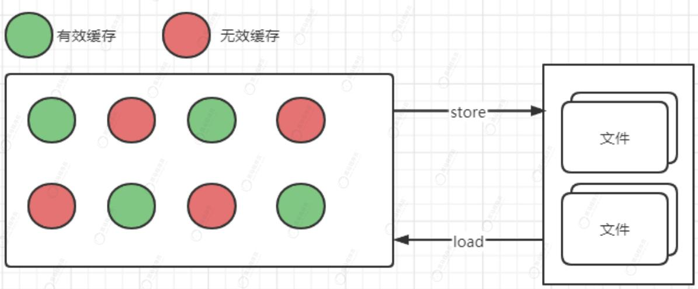


save <seconds> <changes> 

Redis 默认配置文件中提供了三个条件:

save 900 1 

save 300 10 

save 60 10000 

分别表示 900 秒（15 分钟）内有 1 个更改，300 秒（5 分钟）内有 10 个更改以及 60 秒内有 10000 个更改。

AOF是基于Redis命令进行持久化，保存的是Redis执行过的所有命令

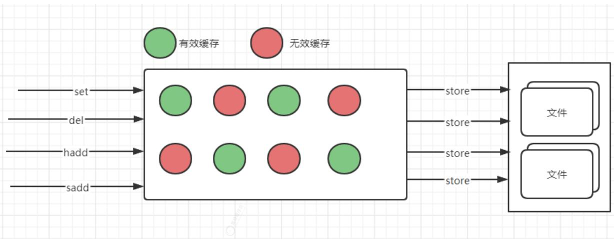


appendonly no 是否开启AOF持久化，默认为no,需要改为yes

appendfilename "appendonly.aof" AOF持久化文件

# 复制(主从同步)

在Redis中，用户可以通过执行slaveof命令或者设置slaveof选项，让一个服务器去复制另一个服务器，我们称被复制的为主服务器，而对主服务器进行复制的则称为从服务器。


在这里，我们使用了复制来形容2个服务器之间的关系，所以2个服务器的数据完全一致。一个主服务器可以拥有多个从服务器，并且在主服务器和从服务器上实施读写分离。

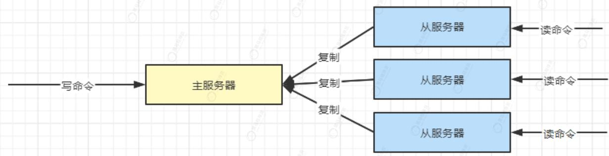


# Sentinel(哨兵)

Sentinel(哨兵)是Redis的高可用性解决方案，由一个或多个Sentinel实例组成的Sentinel集群可以监视任意多个主服务器，以及其所有的从服务器，并在被监视的主服务器进入下线状态时，自动将下线主服务器的某个从服务器升级为新服务器。然后由新的主服务器继续处理命令请求。

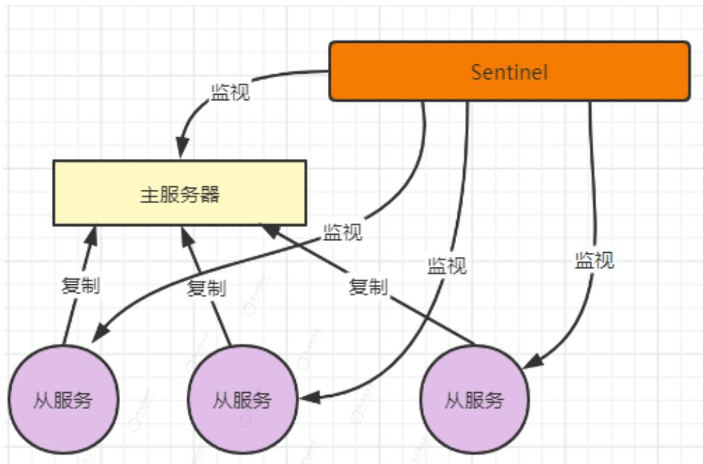


主观下线状态:

当Sentinel在down-after-milliseconds毫秒内，连续收到监控服务器的无效回复，那么就标志实例为主观下线状态

客观下线状态:

当Sentinel将一个主服务器判断为主管下线后，为了确认这个主服务器是否真的下线了，它会向同样监视这一主服务器的其他Sentinel进行询问，看他们是否也认为主服务器已经下线。如果是，则判定为客观下线，并对主服务器执行故障转移。

# 集群(cluster)

即使使用哨兵，Redis每个实例也是全量存储完整的数据，而Redis基于内存的特性决定了它每个实例存储的数据是有限的，受限于机器的内存。所以应对海量数据单集群不行，分片是最直接的手段，类比mysql的分库分表。

Redis集群是Redis提供的分布式数据库方案，集群通过分片来进行数据共享，并提供复制和故障转移功能。

一个Redis集群通常由多个节点组成，Redis集群通过分片的方式来保存数据库中的键值对，整个集群被分为16384个槽(slot)，每个节点可以处理0个或者最多16384个槽。只有所有槽都有节点处理时，集群才处于上线状态。

注意：开启集群，redis启动时的cluster-enabled配置必须为yes，默认是注释的

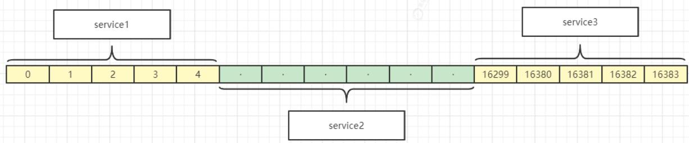


思考：根据上面的图示，cluster最重要的知识点是槽。那么关于槽，我们该如何的分配，读写，存储该如何做呢？

```txt
struct clusterNode{
    // 创建节点的时间
    mstime_t ctime;

    // 节点的名字
    char name;

    // 节点标识,目前所处的状态,或者主节点还是从节点
    int flags;

    // 节点的ip地址
    char ip;

    // 节点的端口号
    int port;

    // 在当前节点的视觉下,集群的状态,集群包含多少个节点等等
    clusterStated state;

    // ....

    // 一个二进制位数组,长度位16384/8 = 2048个字节。用来记录节点负责处理那些槽。
    char slots[16384/8]

    // 节点负责处理的槽的数量,即二进制位为1的数量
    int numslots;
}
```

```txt
struct clusterState {

    // 指向当前节点的指针
    clusterNode myself;

    // 集群节点名单(包括节点本身)
    // 结构类似HashMap，key为节点的名字，value为对应节点的clusterNode对象
    dict nodes;

    // 每个数组项都是指向clusterNode结构的指针
    clusterNode slots[16384]

    //......
}
```

<table><tr><td>字节</td><td colspan="8">slots[0] = 4</td><td>slots[1]-slots[2046]</td><td colspan="8">slots[2047] = 7</td></tr><tr><td>索引(槽)</td><td>0</td><td>1</td><td>2</td><td>3</td><td>4</td><td>5</td><td>6</td><td>7</td><td></td><td>16296</td><td>16297</td><td>16298</td><td>16299</td><td>16380</td><td>16381</td><td>16382</td><td>16383</td></tr><tr><td>值</td><td>0</td><td>0</td><td>0</td><td>0</td><td>0</td><td>1</td><td>0</td><td>0</td><td>···</td><td>0</td><td>0</td><td>0</td><td>0</td><td>0</td><td>1</td><td>1</td><td>1</td></tr></table>

- 如果slots数组在索引i上的二进制位的值位1，那么表示节点负责处理槽i。

- 如果slots数组在索引i上的二进制位的值位0，那么表示节点不负责处理槽i。

- 每个集群节点，都维护了一份自己的slots数组

- 一个节点会将自己的slots属性通过消息发送给集群中其他节点。

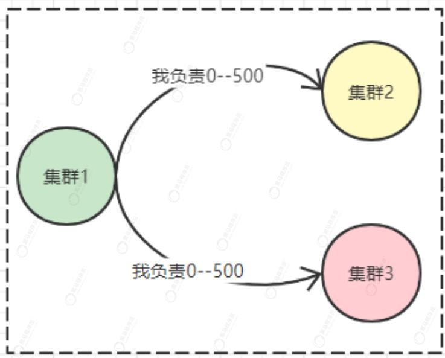


根据上面的知识，我们知道了一个节点负责处理哪些槽，那如果我们想知道一个槽由哪个节点负责，该如何呢？

此时clusterState的slots数组起到关键作用。

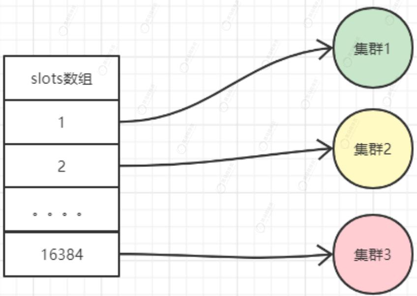


思考：为什么每个节点记录了自己负责的槽，并且每个节点都会接收其他节点槽信息(clusterNode.slots[])，还要再clusterState里维护一个slots[16384]的数组呢？

- 如果只用clusterNode记录槽信息，想某个槽是否指派，指派给了哪个节点，需要便利所有的clusterNode.slots，复杂度为O(N),N为节点的数量。通过clusterState.slots[]复杂度为O(1)

- 如果要统计某个节点负责槽或者发送某个节点负责的槽给其他节点，则clusterNode.slots[]的操作复杂度为O(1)，而此时如果操作clusterState.slots[]的复杂度为O(N)

总结：clusterState.slots数组记录了集群中所有槽的指派信息，clusterNode.slots数组只记录本节点负责哪些槽。

为什么Redis集群设计为16384个槽?

理论上CRC16算法可以得到2^16个数值，其数值范围在0-65535之间，也就是最多可以有65535个虚拟槽，取模运算key的时候，应该是CRC(key)%65535；但是却设计为CRC(key)%16384，原因是作者在设计的时候做了空间上的权衡，觉得节点最多不可能超过1000个，节点数量越多，节点间通信的成本越大（节点间通信的消息体内容越大，具体是消息头中携带的其他节点信息越大），为了保证节点之间通信效率，权衡之下所以采用了2^14个哈希槽；

# 慢查询日志

Redis的慢查询日志功能用于记录执行时间超过给定时长的命令请求，用户可以通过这个功能产生的日志来监视和优化查询速度。

服务器配置有2个相关的选项：

```txt
slowlog-log-slower-than 10000 //时间超过多久会被记录，时间单位微妙，1秒 = 1000 000微妙
```

```txt
slowlog-max-len 128 // 服务器最多保存多少条慢查询日志，如果满了，优先删除最旧的那条日志，再添加新日志。底层用list实现。
```

# 缓存引发的头疼问题

缓存穿透

某个key缓存没有，数据库也没有。一般这种情况发生了用户恶意请求或者攻击。造成一直不停查库

解决方案

最顶层拦截，不合理的id直接打回去或者布隆过滤器

db如果差不多，设置个null进Redis，这样下次就不会打到db，但是要注意合理的过期时间。

缓存雪崩

大批量不同的key同一时间到期，造成缓存失效，请求压到数据库。

解决方案

没有很好的办法，设置key的时候注意错开过期时间，有些热点数据甚至可以设置不过期

缓存击穿

某个key缓存过期，但是数据库有。正好这个点请求并发超高，还没来的及写缓存都压到了数据库上。

解决方案

加锁！第一个请求来时，如果发现为空，加锁住让后面的请求等待一下，参考多线程单例模式

分布式缓存的效率问题

分布式缓存需要经过网络传输，既然有网络，必然会有性能损耗，如下操作。

```txt
List userList = UserService.findUserList(String deptId); 
```

```txt
for(User user :userList){ 
```

// 获取用户部门名称

```java
user.setDeptName(DeptService.getDeptName(user.getDeptId)); 
```

// 如果此循环包含三个操作，或者更多类似的字典值中文转换问题

} 