# （讲师：子慕）

# 第一篇章

* 缓存发展史&缓存分类对比

* redis版本及UI

* 常用数据类型(微博、微信)

* 拓展：新增数据类型（bitmap位图、geo地理位置）

* 频道/模式的发布订阅

* Redis事务机制剖析

* lua脚本与Redis整合

* 慢查询日志

# 1. 缓存发展史&缓存分类

# 1.1 大型网站中缓存的使用

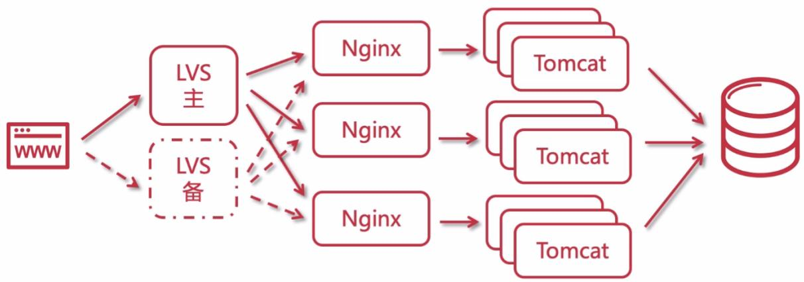


访问量越大，响应力越差，用户体验越差

引入缓存、示意图如下：

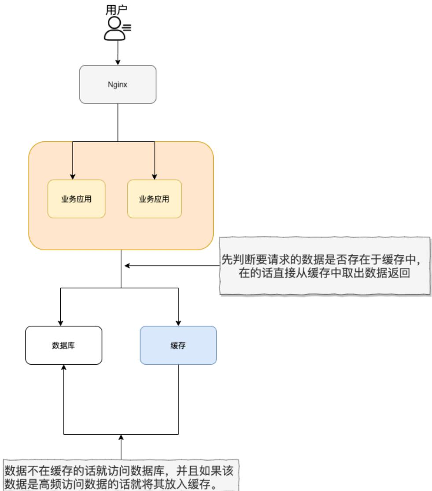


读写策略：Cache Aside Pattern（旁路缓存模式）

Read/Write Through Pattern（读写穿透模式）

Write Behind Pattern（异步缓存写入）

# 高性能 ：

假如用户第一次访问数据库中的某些数据的话，这个过程是比较慢，毕竟是从硬盘中读取的。但是，如果说，用户访问的数据属于高频数据并且不会经常改变的话，那么我们就可以很放心地将该用户访问的数据存在缓存中。

这样有什么好处呢？ 那就是保证用户下一次再访问这些数据的时候就可以直接从缓存中获取了。操作缓存就是直接操作内存，所以速度相当快。

不过，要保持数据库和缓存中的数据的一致性。 如果数据库中的对应数据改变的之后，同步改变缓存中相应的数据即可！

# 高并发：

一般像 MySQL 这类的数据库的 QPS 大概都在 1w 左右（4 核 8g） ，但是使用 Redis 缓存之后很容易达到 10w+，甚至最高能达到 30w+（就单机 redis 的情况，redis 集群的话会更高）。

QPS（Query Per Second）：服务器每秒可以执行的查询次数；

所以，直接操作缓存能够承受的数据库请求数量是远远大于直接访问数据库的，所以我们可以考虑把数据库中的部分数据转移到缓存中去，这样用户的一部分请求会直接到缓存这里而不用经过数据库。进而，我们也就提高的系统整体的并发。

# 1.2 常见缓存的分类

# 分布式缓存

分布式缓存主要解决的是单机缓存的容量受服务器限制并且无法保存通用的信息。因为，本地缓存只在当前服务里有效，比如如果你部署了两个相同的服务，他们两者之间的缓存数据是无法共同的。

具有缓存功能的中间件：Redis、Memcache、Tair（阿里 、美团）等等

# 1.3 分布式缓存选型方案对比

# Memcache和Redis区别

# 共同点 ：

1. 都是基于内存的数据库，一般都用来当做缓存使用。

2. 都有过期策略。

3. 两者的性能都非常高。

# 区别 ：

1. Redis 支持更丰富的数据类型（支持更复杂的应用场景）。Redis 不仅仅支持简单的 k/v 类型的数据，同时还提供 list，set，zset，hash 等数据结构的存储。Memcached 只支持最简单的 k/v 数据类型。

2. Redis 支持数据的持久化，可以将内存中的数据保持在磁盘中，重启的时候可以再次加载进行使用,而 Memecache 把数据全部存在内存之中。

3. Redis 有灾难恢复机制。 因为可以把缓存中的数据持久化到磁盘上。

4. Memcached 没有原生的集群模式，需要依靠客户端来实现往集群中分片写入数据；但是 Redis目前是原生支持 cluster 模式的.

5. Memcached 是多线程，非阻塞 IO 复用的网络模型；Redis 使用单线程的多路 IO 复用模型。（Redis 6.0 引入了多线程 IO ）

相信看了上面的对比之后，我们已经没有什么理由可以选择使用 Memcached 来作为自己项目的分布式缓存了。

# 2. Redis概述&安装配置

# 2.1 概述

官网：https://redis.io

中文官网地址：http://www.redis.cn

Redis is an open source (BSD licensed), in-memory data structure store, used as a database, cache,and message broker. Redis provides data structures such as strings, hashes, lists, sets, sorted sets with range queries, bitmaps, hyperloglogs, geospatial indexes,and streams. Redis has built-in replication, Lua scripting, LRU eviction, transactions,and different levels of on-disk persistence,and provides high availability via Redis Sentinel and automatic partitioning with Redis Cluster.Learn more → 

简单来说 Redis 就是一个使用 C 语言开发的数据库，不过与传统数据库不同的是 Redis 的数据是存在内存中的 ，也就是它是内存数据库，所以读写速度非常快，因此 Redis 被广泛应用于缓存方向。

另外，Redis 除了做缓存之外，Redis 也经常用来做分布式锁，甚至是消息队列。

Redis 提供了多种数据类型来支持不同的业务场景。Redis 还支持事务 、持久化、Lua 脚本、多种集群方案。

# Redis应用场景

缓存使用，减轻DB压力

DB使用，用于临时存储数据（字典表，购买记录）

解决分布式场景下Session分离问题（登录信息）

任务队列（秒杀、抢红包等等） 乐观锁

应用排行榜 zset

签到 bitmap

分布式锁

冷热数据交换

# 2.3 安装&配置

官网：https://redis.io/download

# Download it

Redis 6.2.4 is the latest stable version. 

Interested in release candidates or unstable versions? Check the downloads page. 

Redis没有官方的windows版本，所以建议在linux系统上去运行

选择下载稳定版本、不稳定版本可以尝鲜、但是不推荐在生产环境中使用

# 安装

第一步：安装 C 语言需要的 GCC 环境

```txt
yum install -y gcc-c++
yum install -y wget 
```


# 下载


```shell
wget https://download.redis.io/releases/redis-6.2.4.tar.gz
mkdir /usr/local/redis
tar -zxvf redis-6.2.4.tar.gz -C /usr/local/redis 
```

```txt
drwxrwxr-x 7 root root 4096 Jun 1 22:03 redis-6.2.4
-rw-r--r-- 1 root root 2457940 Jun 1 22:16 redis-6.2.4.tar.gz 
```

第三步：编译 Redis 源码，进入 redis-6.2.4 目录，执行编译命令,进行安装

```batch
cd /usr/local/redis/redis-6.2.4/src make && make install 
```

执行完毕后安装成功！

# 启动

# 前端启动

启动命令： redis-server ，直接运行 bin/redis-server 将以前端模式启动

关闭命令： ctrl+c

启动缺点：客户端窗口关闭则 redis-server 程序结束，不推荐使用此方法

启动图例：


18220:M 13 Jul 2021 15:33:16.700 * Increased maximum number of open files to 10032 (it was originally set to 1024). 18220:M 13 Jut 2021 15:33:16.700 * monotonic clock: P0SIx clock_gettme


# 后端启动（守护进程启动）

第一步：拷贝 redis-6.2.4/redis.conf 配置文件到 Redis 安装目录的 bin 目录

```batch
cp redis.conf /usr/local/redis 
```

第二步：修改 redis.conf

```txt
vim redis.conf 
```

第三步：修改 redis.conf

（1）修改daemonize no ---> daemonize yes，目的是为了让redis启动在linux后台运行

```txt
# By default Redis does not run as a daemon. Use 'yes' if you need it.
# Note that Redis will write a pid file in /var/run/redis.pid when daemonized.
# When Redis is supervised by upstart or systemd, this parameter has no impact.
daemonize yes 
```

（2）修改redis的工作目录：（名称随意）

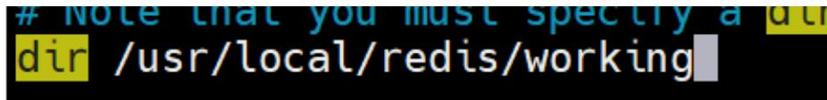


第四步：启动服务

```txt
.redis-server redis.conf 
```

```txt
[root@10-9-54-6 src]# ./redis-server /usr/local/redis/redis.conf 
```


查看进程


<table><tr><td>root</td><td>24329</td><td>1</td><td>0</td><td>15:50</td><td>?</td><td>00:00:00</td><td>./redis-server</td><td>127.0.0.1:6379</td></tr><tr><td>root</td><td>24479</td><td>1970</td><td>0</td><td>15:50</td><td>pts/0</td><td>00:00:00</td><td>grep --color=auto</td><td>redis</td></tr></table>

后端启动的关闭方式

```txt
.redis-cli shutdown 
```

# 命令说明

redis-server ：启动 redis 服务

redis-cli ：进入 redis 命令客户端

redis-benchmark ： 性能测试的工具

redis-check-aof ： aof 文件进行检查的工具

redis-check-dump ： rdb 文件进行检查的工具

redis-sentinel ： 启动哨兵监控服务

# Redis命令行客户端

命令格式

```batch
.redis-cli -h 127.0.0.1 -p 6379 
```

参数说明

-h：redis服务器的ip地址

-p：redis实例的端口号

默认方式：如果不指定主机和端口也可以 默认主机地址是127.0.0.1 默认端口是6379

.redis-cli 

# 2.4 ui

命令行已经足够强大，尤其是高版本，强大到怀疑人生

但是！它并不友好，业界有很多ui可供使用，典型的：Another Redis Desktop Manager

1）开源

源码地址：https://gitee.com/qishibo/AnotherRedisDesktopManager

编译包下载：https://github.com/qishibo/AnotherRedisDesktopManager/releases

2）支持多平台

Windows 

Linux 

3）基本使用

创建连接：

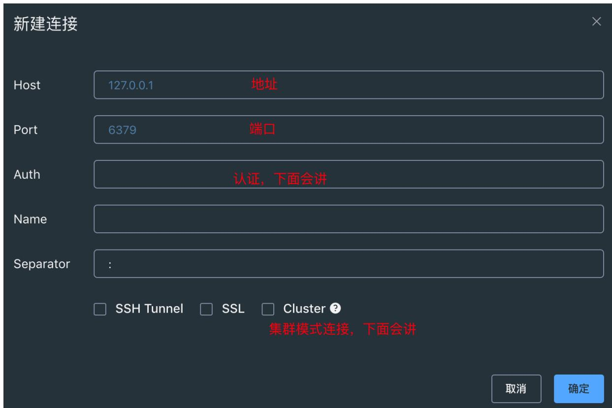


主页监控：


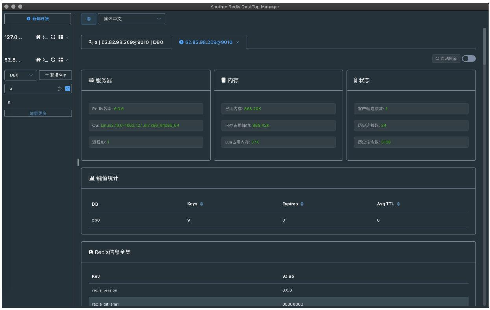


基本操作：


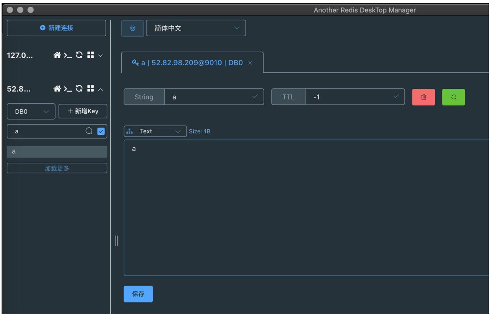


命令行：


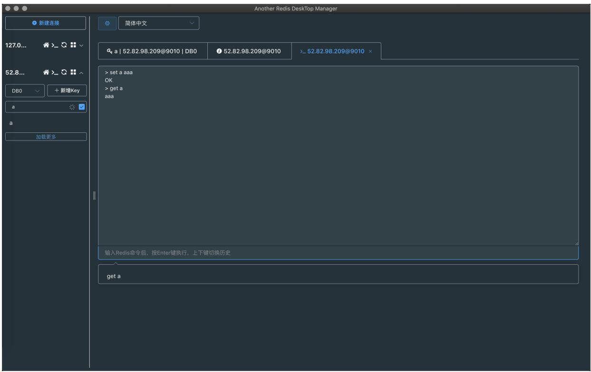


# 3. 数据类型选择&应用场景

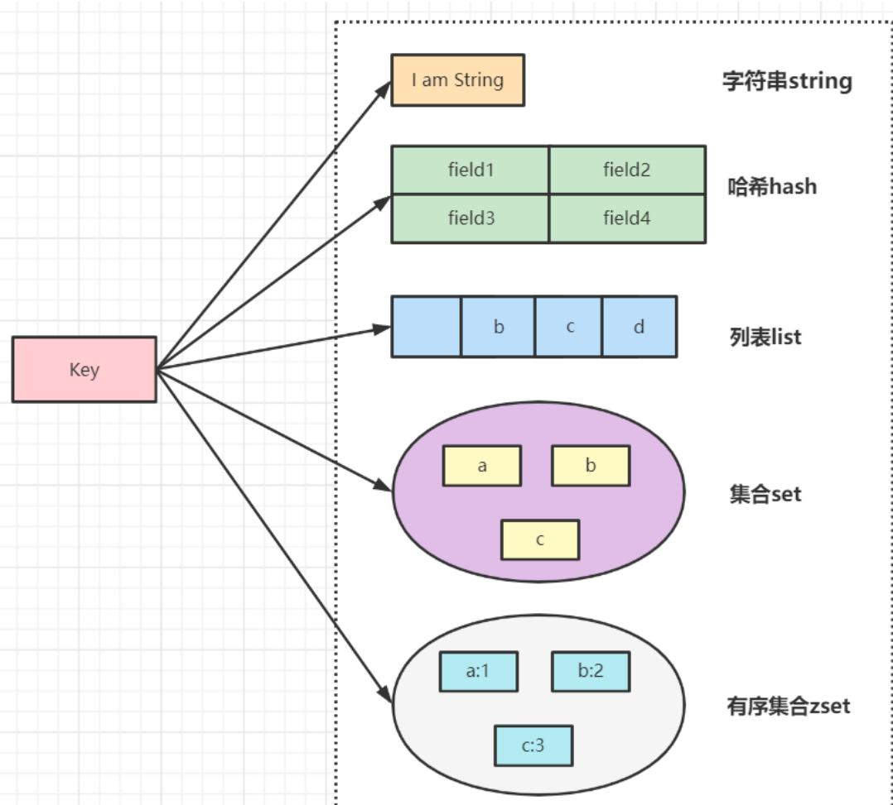


# Redis的Key的设计规范

# 1、key名设计

可读性和可管理性

以业务名(或数据库名)为前缀(防止key冲突)，用冒号分隔，比如 业务名:表名:id

```yaml
ugc:video:1 
```

# 简洁性

保证语义的前提下，控制key的长度，当key较多时，内存占用也不容忽视，例如：

```javascript
user:{uid}:friends:messages:{mid}简化为u:{uid}:fr:m:{mid}。
```

<table><tr><td>字符串大小(字节)</td><td>SDS结构元数据大小(字节)</td></tr><tr><td><eq>1 \sim 2^{5}-1</eq></td><td>1</td></tr><tr><td><eq>2^{5} \sim 2^{8}-1</eq></td><td>3</td></tr><tr><td><eq>2^{8} \sim 2^{16}-1</eq></td><td>5</td></tr><tr><td><eq>2^{16} \sim 2^{32}-1</eq></td><td>9</td></tr><tr><td><eq>2^{32} \sim 2^{64}-1</eq></td><td>17</td></tr></table>

不要包含特殊字符

反例：包含空格、换行、单双引号以及其他转义字符

# 2、避免bigkey

情况一：键值对的值大小本身就很大，例如value为1MB的String数据类型。为了避免String类型的bigKey，在业务层，我们要尽量把String类型的大小控制在10KB以下。

情况二：键值对的值是集合类型，集合元素个数非常多，例如包含100万个元素的Hash集合类型数据。为了避免集合类型的bigkey，对应的设计规范是，尽量把集合类型的元素个数控制在1万以下。

# string字符串类型

1. 介绍 ：string 数据结构是简单的 key-value 类型。虽然 Redis 是用 C 语言写的，但是 Redis 并没有使用 C 的字符串表示，而是自己构建了一种 简单动态字符串（simple dynamic string，SDS）。相比于 C 的原生字符串，Redis 的 SDS 不光可以保存文本数据还可以保存二进制数据，并且获取字符串长度复杂度为 O(1)（C 字符串为 O(N)）,除此之外,Redis 的 SDS API 是安全的，不会造成缓冲区溢出。

2. 常用命令: set,get,strlen,exists,decr,incr,setex 等等。

3. 应用场景 ：一般常用在需要计数的场景，比如用户的访问次数、热点文章的点赞转发数量等等。

单值缓存

SET key  value 

# 对象缓存

MSET user:1:name zimu user:1:balance 1888 

MGET user:1:name user:1:balance 

1）SET user:1 value(json格式数据)

2)MSET user:1:name zimu user:1:balance 1888 

MGET user:1:nameuser:1:balance 

<table><tr><td>id</td><td>name</td><td>balance</td></tr><tr><td>1</td><td>zimu</td><td>1888</td></tr><tr><td>2</td><td>zhangsan</td><td>2888</td></tr><tr><td>3</td><td>lisi</td><td>3888</td></tr><tr><td>4</td><td>wangwu</td><td>4888</td></tr><tr><td>5</td><td>tangseng</td><td>5888</td></tr></table>

# 分布式锁（「SET if Not eXists」）

SETNX product:10001 true // 返回1代表获取锁成功

SETNX product:10001 false // 返回0代表获取锁失败

.......执行业务操作

DEL product:10001 // 执行完业务 释放锁

SET product:10001 true ex 10 nx // 防止程序意外终止导致死锁

# 计数器

INCR article:readcount:101 

INCR_article:readcount:{文章ld}

GET article:readcount:{文章ld}

阅读2.0万


收藏


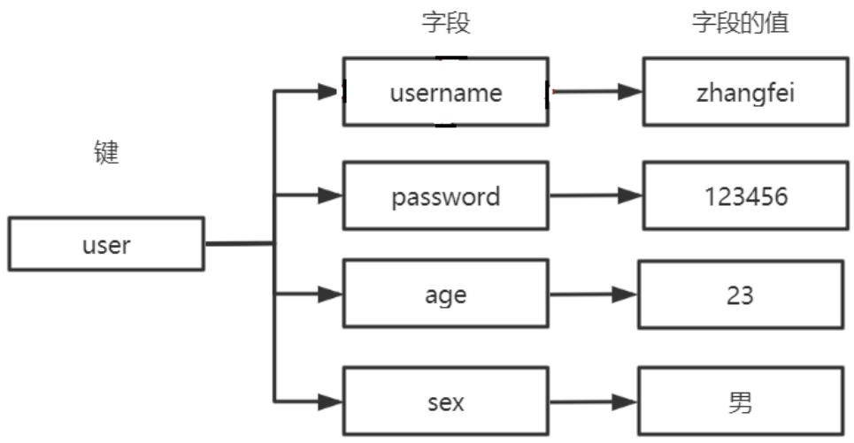


1. 介绍 ：hash 类似于 JDK1.8 前的 HashMap，内部实现也差不多(数组 + 链表)。不过，Redis 的hash 做了更多优化。另外，hash 是一个 string 类型的 field 和 value 的映射表，特别适合用于存储对象，后续操作的时候，你可以直接仅仅修改这个对象中的某个字段的值。 比如我们可以 hash数据结构来存储用户信息，商品信息等等。

2. 常用命令： hset,hmset,hexists,hget,hgetall,hkeys,hvals 等。

3. 应用场景: 系统中对象数据的存储。

对象缓存

HMSET user {userId}:username zhangfei {userId}:password 123456 

HMSET user 1:username zhangfei 1:password 123456 

HMGET user 1:username 1:password 

电商购物车

1）以用户id为key

2）商品id为field

3）商品数量为value


购物车操作

1）添加商品 ---> hset cart:1001 10088 1

2) 增加数量 ---> hincrby cart:1001 10088 1

3） 商品总数 ---> hlen cart:1001

4） 删除商品---> hdel cart:1001 10088

5）获取购物车所有商品---> hgetall cart:1001

# 优点：

1）同类数据归类整合储存，方便数据管理

2）相比String操作消耗内存和cpu更小

3）相比String储存 更节省空间

# 缺点：

1）过期功能不能使用在field上，只能用在key上

2）Redis集群架构下不适合大规模使用

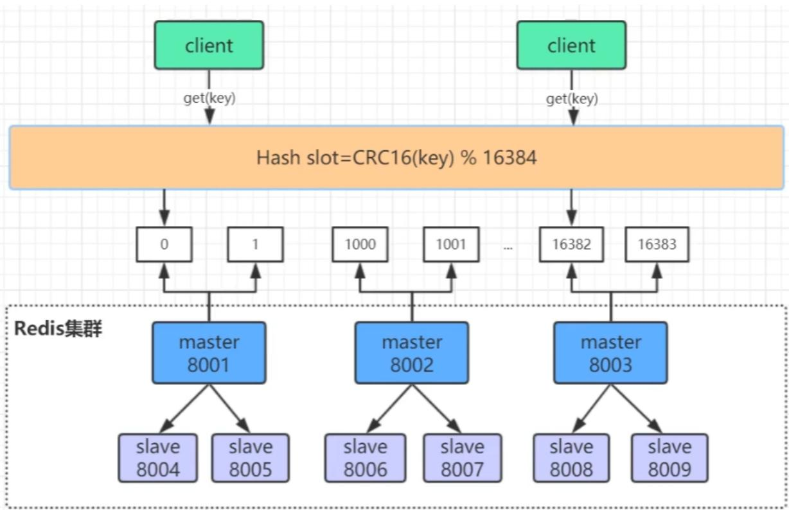


# list列表类型

1. 介绍 ：list 即是 链表。链表是一种非常常见的数据结构，特点是易于数据元素的插入和删除并且且可以灵活调整链表长度，但是链表的随机访问困难。许多高级编程语言都内置了链表的实现比如Java 中的 LinkedList，但是 C 语言并没有实现链表，所以 Redis 实现了自己的链表数据结构。Redis 的 list 的实现为一个 双向链表，即可以支持反向查找和遍历，更方便操作，不过带来了部分额外的内存开销。

2. 常用命令: rpush,lpop,lpush,rpop,lrange、llen 等。

3. 应用场景: 发布与订阅或者说消息队列、慢查询。

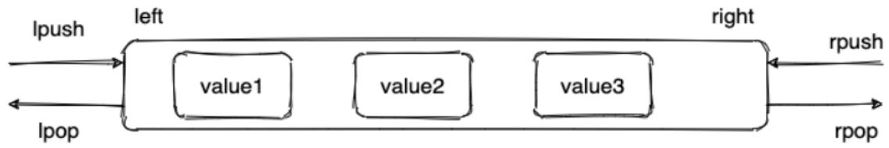


常用数据结构

Stack（栈）= LPUSH（左边放） + LPOP（左边取） --> FILO

Quece（队列）= LPUSH（左边放） + RPOP右边取）

BLocking MQ（阻塞队列）= LPUSH（左边放） + BRPOP（右边阻塞取：没有数据就阻塞！）

微博、朋友圈、公众号等，关注的文章列表展示


子慕老师关注了北京本地宝 ，京城美味君等公众号，这些订阅号发布消息时，通过推或拉的方式把消息LPUSH放入redis中属于子慕老师的list中。其中key为msg:{子慕_ID}。当子慕要获取大V们发的消息时，使用LRANGE 命令从队列中获取指定个数的订阅号信息

1）京城美味君发动态，消息ID为10001

LPUSH msg:{zimu-ID} 10001 

2）北京本地宝发动态，消息ID为10002

LPUSH msg:{zimu-ID} 10002 

3）查看最新订阅号消息

LRANGE msg:{zimu-ID} 0 4 

# set集合类型

1. 介绍 ： set 类似于 Java 中的 HashSet 。Redis 中的 set 类型是一种无序集合，集合中的元素没有先后顺序。当你需要存储一个列表数据，又不希望出现重复数据时，set 是一个很好的选择，并且set 提供了判断某个成员是否在一个 set 集合内的重要接口，这个也是 list 所不能提供的。可以基于 set 轻易实现交集、并集、差集的操作。比如：你可以将一个用户所有的关注人存在一个集合中，将其所有粉丝存在一个集合。Redis 可以非常方便的实现如共同关注、共同粉丝、共同喜好等功能。这个过程也就是求交集的过程。

2. 常用命令： sadd,spop,smembers,sismember,scard,sinterstore,sunion 等。

3. 应用场景: 需要存放的数据不能重复以及需要获取多个数据源交集和并集等场景

微信抽奖小程序


1）点击 参与抽奖 加入集合

SADD key {userID} 

2）查看排行榜

SMEMBERS key 

3）抽取count名中奖者

SRANDMEMBER key [count] / SPOP key [count] 

集合操作实现微博、微信关注模型

# 微关系

# 共同关注（92)


首先了解一下set的集合操作，假如有三个集合

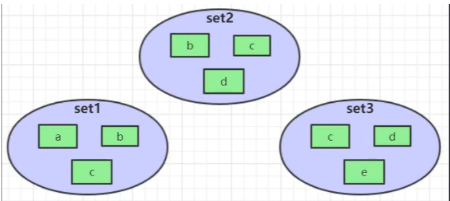


交集为：SINTER set1 set2 set3 ==> { c }

并集为：SUNION set1 set2 set3 ==> { a,b,c,d,e }

差集为：SDIFF set1 set2 set3 ==> { a }

差集计算方式：set1 - （set2并set3） = {a、b、c} - {b、c、d、e} = {a} 只保留a中单独存在的元素

共同关注A的人：可以用交集来实现

我可能认识的人：可以使用差集来实现，把我关注的人求差集

# sortedset有序集合类型

1. 介绍： 和 set 相比，sorted set 增加了一个权重参数 score，使得集合中的元素能够按 score 进行有序排列，还可以通过 score 的范围来获取元素的列表。有点像是 Java 中 HashMap 和 TreeSet的结合体。

2. 常用命令： zadd,zcard,zscore,zrange,zrevrange,zrem 等。

3. 应用场景： 需要对数据根据某个权重进行排序的场景。比如在直播系统中，实时排行信息包含直播间在线用户列表，各种礼物排行榜，弹幕消息（可以理解为按消息维度的消息排行榜）等信息。

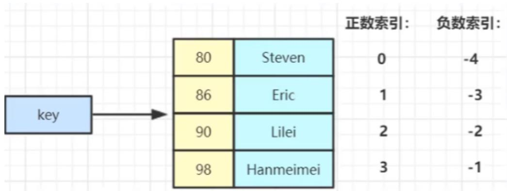


Zset集合操作实现排行榜


<table><tr><td>热搜榜</td><td>娱乐榜</td><td>要闻榜</td><td>同城榜</td></tr><tr><td colspan="4">实时热点，每分钟更新一次</td></tr><tr><td>↑</td><td>百年雪松见证革命火种诞生</td><td></td><td>热</td></tr><tr><td>1</td><td>iPhone13或有日落金玫瑰金</td><td>3036283</td><td>热</td></tr><tr><td>2</td><td>东京奥运会中国代表团名单</td><td>1264090</td><td>新</td></tr><tr><td>3</td><td>成龙20年前得知北京赢了瞬间飙泪</td><td>1...</td><td>新</td></tr><tr><td>4</td><td>巴赫误将日本人说成中国人</td><td>988992</td><td></td></tr><tr><td>5</td><td>萧潇43岁状态</td><td>866012</td><td>新</td></tr></table>

1) 点击新闻，为其分值+1

ZINCRBY hotNews:20210707 1 iphone13或有日落金玫瑰金

2）展示当日排行前10

ZREVRANGE hotNews:20210707 0 ，9 WITHSCORES 

# bitmap位图 类型

1. 介绍 ： bitmap 存储的是连续的二进制数字（0 和 1），通过 bitmap, 只需要一个 bit 位来表示某个元素对应的值或者状态，key 就是对应元素本身 。我们知道 8 个 bit 可以组成一个 byte，所以bitmap 本身会极大的节省储存空间。


2. 常用命令： setbit 、 getbit 、 bitcount 、 bitop

3. 应用场景: 适合需要保存状态信息（比如是否签到、是否登录...）并需要进一步对这些信息进行分析的场景。比如用户签到情况、活跃用户情况、用户行为统计（比如是否点赞过某个视频）。

# 例：存储对比：

有1亿用户，5千万登陆用户，那么统计每日用户的登录数。每一位标识一个用户ID，当某个用户访问我们的网站就在Bitmap中把标识此用户的位设置为1。

这里做了一个使用set集合和BitMap存储的对比。

<table><tr><td>数据类型</td><td>每个userid占用空间</td><td>需要存储的用户量</td><td>全部占用内存量</td></tr><tr><td>set(集合)</td><td>32位也就是4个字节(假设userid用的是整型,实际很多网站用的是长整型)</td><td>50,000,000</td><td>32位*50,000,000=200 MB</td></tr><tr><td>BitMap</td><td>1位(bit)</td><td>100,000,000</td><td>1位*100,000,000=12.5 MB</td></tr></table>

时间在拉长一点

<table><tr><td></td><td>一天</td><td>一个月</td><td>一年</td></tr><tr><td>set(集合)</td><td>200M</td><td>6G</td><td>72G</td></tr><tr><td>BitMap</td><td>12.5M</td><td>375M</td><td>4.5G</td></tr></table>


# SETBIT 会返回之前位的值（默认是 0）这里会生成 7 个位


```txt
127.0.0.1:6379> setbit mykey 7 1
(integer) 0
127.0.0.1:6379> setbit mykey 7 0
(integer) 1
127.0.0.1:6379> getbit mykey 7
(integer) 0
127.0.0.1:6379> setbit mykey 6 1
(integer) 0
127.0.0.1:6379> setbit mykey 8 1
(integer) 0
# 通过 bitcount 统计被被设置为 1 的位的数量。
127.0.0.1:6379> bitcount mykey
(integer) 2Copy to clipboardErrorCopied
```

针对上面提到的一些场景，这里进行进一步说明。

使用场景一：用户行为分析 很多网站为了分析你的喜好，需要研究你点赞过的内容。


# 记录你喜欢过 001 号小姐姐


```txt
127.0.0.1:6379> setbit beauty_girl_001 uid 1 
```

# 使用场景二：统计活跃用户

面试题：现在系统有亿级的活跃用户，为了增强用户粘性，该如何实现签到、日活统计？

使用时间作为 key，然后用户 ID 为 offset，如果当日活跃过就设置为 1

那么我该如果计算某几天/月/年的活跃用户呢(暂且约定，统计时间内只有有一天在线就称为活跃)，有请下一个 redis 的命令

# 对一个或多个保存二进制位的字符串 key 进行位元操作，并将结果保存到 destkey 上。

# BITOP 命令支持 AND 、 OR 、 NOT 、 XOR 这四种操作中的任意一种参数

BITOP operation destkey key [key ...] 


初始化数据：


```txt
127.0.0.1:6379> setbit 20210308 1 1
(integer) 0
127.0.0.1:6379> setbit 20210308 2 1
(integer) 0
127.0.0.1:6379> setbit 20210309 1 1
(integer) 0 
```


统计 20210308~20210309 总活跃用户数: 1


```txt
127.0.0.1:6379> bitop and desk1 20210308 20210309
(integer) 1
127.0.0.1:6379> bitcount desk1
(integer) 1 
```


统计 20210308~20210309 在线活跃用户数: 2


```c
127.0.0.1:6379> bitop or desk2 20210308 20210309
(integer) 1
127.0.0.1:6379> bitcount desk2
(integer) 2 
```

# geo地理位置类型

# 概述

Redis 3.2 中增加了对GEO类型的支持。GEO，Geographic，地理信息的缩写。该类型，就是元素的2维坐标，在地图上就是经纬度。redis基于该类型，提供了经纬度设置，查询，范围查询，距离查询，经纬度Hash等常见操作

应用场景：附近的人、摇一摇、附近的车、附近银行站点查询


# 中国建设银行

# China ConstructionBank

您当前的位置是：湖北省襄阳市襄州区张湾街道商城路

系统默认为您查询了附近10公里的网点信息，如您需要，可以在右侧下拉框中指定查询范围：10公里内

<table><tr><td>序号</td><td>网点名称</td><td>网点位置</td><td>网点电话</td><td>距离您</td><td>网点地图</td></tr><tr><td>1</td><td>中国建设银行(襄阳襄东支行)</td><td>湖北省襄阳市襄州区航空路43号</td><td>(0710)3712330</td><td>1.45公里</td><td>点击查看网点地图</td></tr><tr><td>2</td><td>中国建设银行(襄州支行)</td><td>湖北省襄阳市襄州区交通路与航空路交叉路口向北约50米</td><td></td><td>1.72公里</td><td>点击查看网点地图</td></tr><tr><td>3</td><td>中国建设银行(春城路)</td><td>湖北省襄阳市春城路与板桥路交叉口西北侧</td><td></td><td>3.77公里</td><td>点击查看网点地图</td></tr><tr><td>4</td><td>中国建设银行(襄樊樊东支行)</td><td>湖北省襄阳市春园路10-2号</td><td>(0710)3012517</td><td>5.10公里</td><td>点击查看网点地图</td></tr><tr><td>5</td><td>中国建设银行(襄阳长虹北路支行)</td><td>湖北省襄阳市樊城区长虹北路72号</td><td>(0710)3349181</td><td>5.12公里</td><td>点击查看网点地图</td></tr><tr><td>6</td><td>中国建设银行(襄阳汉江路支行)</td><td>湖北省襄阳市樊城区汉江街道汉江路18号襄阳建行</td><td></td><td>7.91公里</td><td>点击查看网点地图</td></tr><tr><td>7</td><td>中国建设银行(江南支行)</td><td>湖北省襄阳市襄城南街119号</td><td>(0710)2811039</td><td>9.52公里</td><td>点击查看网点地图</td></tr></table>

# 环境要求

1. redis版本需要3.2及以上

2. 如果使用jedis操作redis，需要jedis版本为2.9及以上

3. 如果使用spring data redis操作redis，需要spring data redis版本为1.8.0及以上

# redis GEO常用命令

Tips： 

在学习geo命令时会使用到经纬度坐标信息，可以在百度地图的拾取坐标系统中获取测试坐标信息，网址：http://api.map.baidu.com/lbsapi/getpoint/index.html

# 1. geoadd命令

为了进行地理位置相关操作， 我们首先需要将具体的地理位置记录起来， 这一点可以通过执行 geoadd命令来完成， 该命令的基本格式如下：

```htaccess
GEOADD location-set longitude latitude name [longitude latitude name ...] 
```

此命令用于添加位置信息到集合中

以下代码展示了如何通过 GEOADD 命令， 将武汉、襄阳、宜昌、枝江、咸宁等数个湖北省的市添加到位置集合 hubeiCities 集合里面

此处添加武汉的坐标信息到hubeiCities集合中

```txt
geoadd hubeiCities 114.32538 30.534535 wuhan 
```

此处添加襄阳、枝江、咸宁的坐标信息到hubeiCities集合中

```txt
geoadd hubeiCities 112.161882 32.064505 xiangyang 111.305197 30.708127 yichang 111.583717 30.463363 zhijiang 114.295174 29.885892 xianning 
```

# 2. geopos命令

此命令用于根据输入的位置名称获取位置的坐标信息，基本语法如下

```txt
GEOPOS location-set name [name ...] 
```

案例：查询襄阳市的位置信息

```txt
geopos hubeiCities xiangyang 
```

--结果如下【1为经度 2为纬度】

1) "112.16188341379165649" 

2) "32.06450528704699821" 

也可以一次查询多个位置的经纬度

```txt
geopos hubeiCities xiangyang wuhan 
```

--襄阳的经纬度

```csv
1) 1) "112.16188341379165649"
2) "32.06450528704699821" 
```

--武汉的经纬度

```txt
2) 1) "114.32538002729415894"
2) "30.53453492166421057" 
```

# 3. geodist命令

此命令用于计算两个位置之间的距离，基本语法如下：

```txt
GEODIST location-set location-x location-y [unit] 
```

可选参数 unit 用于指定计算距离时的单位， 它的值可以是以下单位的其中一个：

m 表示单位为米。

km 表示单位为千米。

mi 表示单位为英里。

ft 表示单位为英尺。

案例：分别以默认距离单位和指定距离单位计算襄阳和武汉的距离

```txt
--不指定距离单位
127.0.0.1:6381> geodist hubeiCities xiangyang wuhan "266889.7642"
--指定距离单位km
127.0.0.1:6381> geodist hubeiCities xiangyang wuhan km "266.8898"
```

# 4. georadius命令和georadiusbymember命令

这两个命令都可以用于获取指定范围内的元素，也即查找特定范围之内的其他存在的地点。比如找出地点A范围200米之内的所有地点，找出地点B范围50公里之内的所有地点等等。

这两个命令的作用一样， 只是指定中心点的方式不同： georadius 使用用户给定的经纬度作为计算范围时的中心点， 而 georadiusbymember 则使用储存在位置集合里面的某个地点作为中心点。

以下是这两个命令的基本语法

```txt
GEORADIUS location-set longitude latitude radius m|km|ft|mi [WITHCOORD]
[WITHDIST] [ASC|DESC] [COUNT count]
GEORADIUSBYMEMBER location-set location radius m|km|ft|mi [WITHCOORD] [WITHDIST]
[ASC|DESC] [COUNT count] 
```

这两个命令的各个参数的意义如下：

m|km|ft|mi 指定的是计算范围时的单位；

如果给定了WITHCOORD，那么在返回匹配的位置时会将位置的经纬度一并返回；

如果给定了WITHDIST ， 那么在返回匹配的位置时会将位置与中心点之间的距离一并返回；

在默认情况下， GEORADIUS 和 GEORADIUSBYMEMBER 的结果是未排序的， ASC 可以让查找结果根据距离从近到远排序， 而 DESC 则可以让查找结果根据从远到近排序；

COUNT参数用于指定要返回的结果数量。

下面通过案例分别演示georadius命令和georadiusbymember命令

GEORADIUS案例：

在hubeiCities位置集合中查找距离经纬度为112.927076 28.235653（长沙）500km以内的位置信息，查找结果中应包含不超过5个位置的坐标信息，距离信息，并按距离由近到远排序。

查询代码如下：


127.0.0.1:6381> georadius hubeiCities 112.927076 28.235653 500 km withcoord withdist asc count 5


-- 咸宁 距离目标位置226.67公里


```txt
1) 1) "xianning"
2) "226.6716"
3) 1) "114.29517298936843872"
2) "29.88589217282589772"
-- 枝江 距离目标位置279.91公里
2) 1) "zhijiang"
2) "279.9154"
3) 1) "111.58371716737747192"
2) "30.46336248623112652"
```


-- 武汉 距离目标位置289.38公里


```csv
3) 1) "wuhan"
2) "289.3798"
3) 1) "114.32538002729415894"
2) "30.53453492166421057" 
```


-- 宜昌 距离目标位置316.68公里


```csv
4) 1) "yichang"
2) "316.6777"
3) 1) "111.30519658327102661"
2) "30.70812783498269738" 
```


-- 襄阳 距离目标位置432.18公里


```csv
5) 1) "xiangyang"
2) "432.1767"
3) 1) "112.16188341379165649"
2) "32.06450528704699821" 
```

# GEORADIUSBYMEMBER案例：

在hubeiCities位置集合中查找距离襄阳200km以内的位置信息【这里指定的目标位置只能是hubeiCities中存在的位置，而不能指定位置坐标】，查找结果中应包含不超过2个位置的坐标信息，距离信息，并按距离由远到近排序。

查询代码如下：

```txt
127.0.0.1:6381> georadiusbymember hubeicities xiangyang 200 km withcoord withdist desc count 2 
```


-- 枝江 距襄阳186.38km


```txt
1) 1) "zhijiang"
2) "186.3784"
3) 1) "111.58371716737747192"
2) "30.46336248623112652"
-- 宜昌 距襄阳171.40km
2) 1) "yichang"
2) "171.3950"
3) 1) "111.30519658327102661"
2) "30.70812783498269738"
```

# 4.Redis高级应用&拓展功能

# 4.1 发布订阅

Redis提供了发布订阅功能，可以用于消息的传输

Redis的发布订阅机制包括三个部分，publisher，subscriber和Channel


发布者和订阅者都是Redis客户端，Channel则为Redis服务器端。

发布者将消息发送到某个的频道，订阅了这个频道的订阅者就能接收到这条消息。

# 指令详情

SUBSCRIBE / PSUBSCRIBE ： 订阅，精确、或者按匹配符

UNSUBSCRIBE / PUNSUBSCRIBE ： 退订，精确、或者按匹配符

PUBLISH ： 发送

PUBSUB ：查看消息列表

# 频道/模式的订阅与退订

subscribe:订阅 subscribe channel1 channel2 ..

Redis客户端1订阅频道1和频道2

```txt
127.0.0.1:6379> subscribe ch1 ch2
Reading messages... (press Ctrl-C to quit)
1) "subscribe"
2) "ch1"
3) (integer) 1
1) "subscribe"
2) "ch2"
3) (integer) 2 
```

publish:发布消息 publish channel message

Redis客户端2将消息发布在频道1和频道2上

```txt
127.0.0.1:6379> publish ch1 hello (integer) 1
127.0.0.1:6379> publish ch2 world (integer) 1 
```

Redis客户端1接收到频道1和频道2的消息

```txt
1) "message"
2) "ch1"
3) "hello"
1) "message"
2) "ch2"
3) "world" 
```

unsubscribe：退订 channel

Redis客户端1退订频道1

```txt
127.0.0.1:6379> unsubscribe ch1
1) "unsubscribe"
2) "ch1"
3) (integer) 0 
```

psubscribe ：模式匹配 psubscribe +模式

Redis客户端1订阅所有以ch开头的频道

```txt
127.0.0.1:6379> psubscribe ch*
Reading messages... (press Ctrl-C to quit)
1) "psubscribe"
2) "ch*"
3) (integer) 1 
```

Redis客户端2发布信息在频道5上

```txt
127.0.0.1:6379> publish ch5 helloworld (integer) 1 
```

Redis客户端1收到频道5的信息

1) "pmessage" 

2) "ch*" 

3) "ch5" 

4) "helloworld" 


punsubscribe 退订模式


```txt
127.0.0.1:6379> punsubscribe ch*
1) "punsubscribe"
2) "ch*"
3) (integer) 0 
```

# 使用场景

在Redis哨兵模式中，哨兵通过发布与订阅的方式与Redis主服务器和Redis从服务器进行通信

Redisson是一个分布式锁框架，在Redisson分布式锁释放的时候，是使用发布与订阅的方式通知的

注：重业务的消息，推荐用消息队列

# 4.2 事务

所谓事务(Transaction) ，是指作为单个逻辑工作单元执行的一系列操作

# ACID回顾

Atomicity（原子性）：构成事务的的所有操作必须是一个逻辑单元，要么全部执行，要么全部不执行。

Consistency（一致性）：数据库在事务执行前后状态都必须是稳定的或者是一致的。

Isolation（隔离性）：事务之间不会相互影响。

Durability（持久性）：事务执行成功后必须全部写入磁盘。

# Redis事务

Redis 事务的本质是一组命令的集合

Redis的事务是通过multi、exec、discard和watch这四个命令来完成的。

Redis的单个命令都是原子性的，所以这里需要确保事务性的对象是命令集合。

Redis将命令集合序列化并确保处于同一事务的命令集合连续且不被打断的执行

Redis不能保障失败回滚

注意事项

注意！redis的事务远远弱于mysql，严格意义上，它不能叫做事务，只是一个命令打包的批处理，不能保障失败回滚。

这是官方文档的原话：

It's important to note that even when a command fails, all the other commands in the queue are processed – Redis will not stop the processing of commands. 

# 原理分析

调用multi指令后，redis其实是开启了一个命令队列，后续的命令被提交到队列（还没有执行）

期间出现问题了（比如down机），终止操作，队列清空

到exec命令后，批量提交，事务完成

# 操作演示

```txt
127.0.0.1:6379> multi
OK
127.0.0.1:6379(TX)> set s1 1
QUEUED
127.0.0.1:6379(TX)> get s1
QUEUED
127.0.0.1:6379(TX)> exec
1) OK
2) "1" 
```

# 关于回滚

注意！回滚要看两种情况：

直接语法错误，redis完全无法执行，Redis 2.6.5之前的版本不会回滚，之后版本整个事务回滚

执行期的错误，redis不会回滚，其他正确的指令会照样执行

验证：错误的命令，导致回滚（版本：6.0）

#旧value是a

```csv
127.0.0.1:9010> set a a
OK
127.0.0.1:9010> get a
"a" 
```

#开启事务

```txt
127.0.0.1:9010> multi
OK 
```

#设置成b，语法没问题，进入队列

```txt
127.0.0.1:9010> set a b
QUEUED 
```

#语法错误！

```txt
127.0.0.1:9010> set a
(error) ERR wrong number of arguments for 'set' command 
```

#提交事务：失败，操作被回滚

```txt
127.0.0.1:9010> exec
(error) EXECABORT Transaction discarded because of previous errors. 
```

#最终结果：a没有被修改

```txt
127.0.0.1:9010> get a "a" 
```

验证：命令语法对，但是数据类型不对，执行期间才会被发现！


#旧值a


```txt
127.0.0.1:9010> get a "a" 
```


#开启事务


```txt
127.0.0.1:9010> multi
OK 
```


#正确的语法，没毛病！


```txt
127.0.0.1:9010> set a b
QUEUED 
```


#语法也对，但是类型肯定是不对的，这不是一个list！


#会进入队列，执行期才会发现这个问题


```txt
127.0.0.1:9010> lpush a 1
QUEUED 
```


#提交事务！


#发现正确的1号命令执行ok，2号错误


```txt
127.0.0.1:9010> exec 
```


1) OK


2) (error) WRONGTYPE Operation against a key holding the wrong kind of value


#最终结果，a被修改，事务没有回滚！


```txt
127.0.0.1:9010> get a "b" 
```

# watch

Redis Watch 命令用于监视一个(或多个) key ，如果在事务执行之前这个(或这些) key 被其他命令所改动，那么事务将被打断

关于上面的操作，如果遇到各种错误，multi可以自动帮你回滚

而watch命令提供了另一种机制，它通过监控某个key的变动，来决定是不是回滚。

主要应用于高并发的正常业务场景下，处理并发协调。

# 1）使用语法

watch key 

```txt
... 
```

multi 

...do somethings... 

exec 

# 2）操作演练

key无变动时


#初始化，a=a , b=1


```txt
127.0.0.1:9010> set balance 80 
```

```shell
OK
127.0.0.1:9010> set name zimu
OK
#监控a的变动
127.0.0.1:9010> watch balance
OK
#开启事务，内部对b进行操作
127.0.0.1:9010> multi
OK
127.0.0.1:9010> set name zimulaoshi
QUEUED
127.0.0.1:9010> exec
1) OK
#提交事务后，b正常被改写
127.0.0.1:9010> get name "zimulaoshi"
```

如果watch的key发生了变化，注意有意思的事情来了……

#开启两个终端 T1， T2

#T1执行过程与上面一致

#以下是T1的操作过程：

#初始化，a=a , b=1

```txt
127.0.0.1:9010> set balance 80
OK 
```

```txt
127.0.0.1:9010> set name zimu OK 
```

#监控a的变动

```txt
127.0.0.1:9010> watch balance
OK 
```

#开启事务，内部对b进行操作

```txt
127.0.0.1:9010> multi
OK 
```

```txt
127.0.0.1:9010> set name zimu
QUEUED 
```

# !!!这一步注意切换到T2：

#在T1的watch和exec之间执行一个 set a 123，a的值被别的终端修改了！！！

#再切回T1，注意！exec得不到ok，得到了一个nil，说明队列被清空了！

```txt
127.0.0.1:9010> exec (nil) 
```

#来查看b的值，没有被改为2，事务回滚了！

```txt
127.0.0.1:9010> get b "1" 
```

# 3）原理剖析

在exec执行事务的一瞬间，判断监控的key是否变动

变动则取消事务队列，直接不执行

无变动则执行，提交事务，参考流程图：

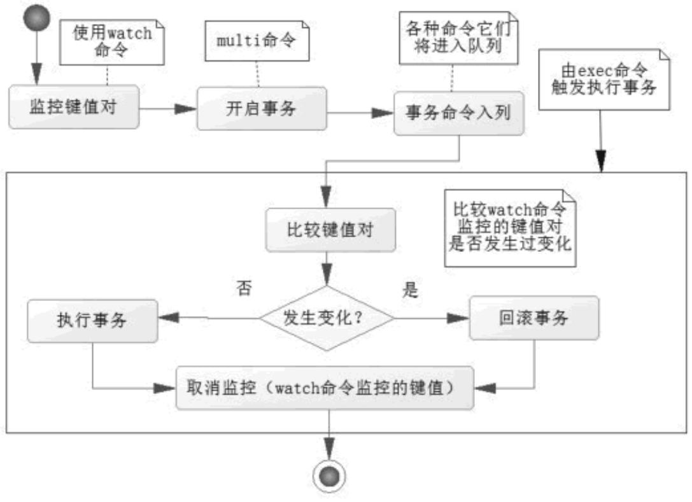


# 4.3 Lua脚本

lua是一种轻量小巧的脚本语言，用标准C语言编写并以源代码形式开放， 其设计目的是为了嵌入应用程序中，从而为应用程序提供灵活的扩展和定制功能。

Lua应用场景：

游戏开发

独立应用脚本

Web应用脚本

扩展和数据库插件

Nginx + lua开发高性能web应用，限流、防止Sql注入..

# Redis使用lua脚本

版本：自2.6.0起可用，通过内置的lua编译/解释器，可以使用EVAL命令对lua脚本进行求值。

时间复杂度：取决于执行的脚本。

使用Lua脚本的好处：

减少网络开销。可以将多个请求通过脚本的形式一次发送，减少网络时延。

原子操作。redis会将整个脚本作为一个整体执行，中间不会被其他命令插入。因此在编写脚本的过程中无需担心会出现竞态条件，无需使用事务。

复用。客户端发送的脚本会永久存在redis中，这样，其他客户端可以复用这一脚本而不需要使用代码完成相同的逻辑。

# 如何使用 EVAL命令

命令格式：

```txt
EVAL script numkeys key [key ...] arg [arg ...] 
```

# 命令说明：

script ：参数是一段 Lua 5.1 脚本程序。脚本不必(也不应该)定义为一个 Lua 函数

numkeys： 用于指定键名参数的个数。

key [key ...] ，是要操作的键，可以指定多个，在lua脚本中通过 KEYS[1] , KEYS[2] 获取

arg [arg ...] ，附加参数，在lua脚本中通过 ARGV[1] , ARGV[2] 获取。

实例：

```txt
eval "return {KEYS[1], KEYS[2], ARGV[1], ARGV[2]}" 2 key1 key2 first second 
```

# lua脚本中调用Redis命令

redis.call()： 

返回值就是redis命令执行的返回值

如果出错，则返回错误信息，不继续执行

redis.pcall()： 

返回值就是redis命令执行的返回值

如果出错，则记录错误信息，继续执行

# 注意事项

在脚本中，使用return语句将返回值返回给客户端，如果没有return，则返回nil

```txt
eval "return redis.call('set', KEYS[1], ARGV[1])" 1 n1 zhaoyun 
```

# 命令行里使用

如果直接使用redis-cli命令，格式会有点不一样：

```batch
redis-cli --eval lua_file key1 key2 , arg1 arg2 arg3 
```

# 注意的地方：

eval 后面参数是lua脚本文件, .lua 后缀

不用写numkeys，而是使用,隔开。注意,前后有空格。

示例：

```lua
incrbymul.lua 
```

```lua
local num = redis.call('GET', KEYS[1]);
if not num then
    return 0;
else
    local res = num * ARGV[1];
    redis.call('SET', KEYS[1], res);
    return res;
end 
```


命令行运行：


```powershell
$ redis-cli --eval incrbymul.lua lua:incrbymul, 8
(integer) 0
$ redis-cli incr lua:incrbymul
(integer) 1
$ redis-cli --eval incrbymul.lua lua:incrbymul, 8
(integer) 8
$ redis-cli --eval incrbymul.lua lua:incrbymul, 8
(integer) 64
$ redis-cli --eval incrbymul.lua lua:incrbymul, 2
(integer) 128 
```

由于redis没有提供命令可以实现将一个数原子性的乘以N倍，这里我们就用Lua脚本实现了，运行过程中确保不会被其它客户端打断。

# 4.4 慢查询日志

# 概述

问：日常在使用redis的时候为什么要用慢查询日志？

客户端请求的生命周期的完整生命周期，4个阶段

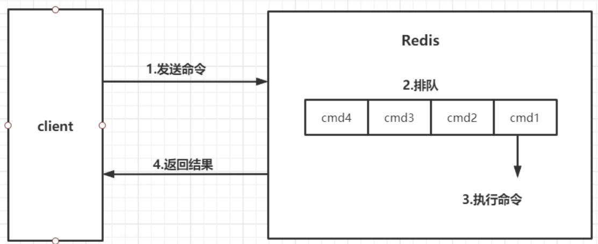


注意：慢查询只统计步骤3的时间,所以没有慢查询并不代表客户端没有超时问题。换句话说。redis的慢查询记录时间指的是不包括像客户端响应、发送回复等IO操作，而单单是执行一个查询命令所耗费的时间。

第一个问题：

慢查询日志是为了记录执行时间超过给定时长的redis命令请求

第二个问题：

让使用者更好地监视和找出在业务中一些慢redis操作，找到更好的优化方法

# 设置和查看SLOWLOG

# 慢查询配置相关的参数

slowlog-log-slower-than ：选项指定执行时间超过多少微秒（默认1秒=1,000,000微秒）的命令请求会被记录到日志上。

例：如果这个选项的值为100，那么执行时间超过100微秒的命令就会被记录到慢查询日志； 如果这个选项的值为500 ， 那么执行时间超过500微秒的命令就会被记录到慢查询日志；

slowlog-max-len：选项指定服务器最多保存多少条慢查询日志。服务器使用先进先出的方式保存多条慢查询日志： 当服务器储存的慢查询日志数量等于slowlog-max-len选项的值时，服务器在添加一条新的慢查询日志之前，会先将最旧的一条慢查询日志删除。

例：如果服务器slowlog-max-len的值为100，并且假设服务器已经储存了100条慢查询日志， 那么如果服务器打算添加一条新日志的话，它就必须先删除目前保存的最旧的那条日志， 然后再添加新日志。

在Redis中有两种修改配置的方法,一种是修改配置文件,另一种是使用config set命令动态修改；

# 慢查询配置相关的命令

1. config set slowlog-log-slower-than 20000 

2. config set slowlog-max-len 1024 

3. showlog get # 查看慢查询日志

# 慢查询日志的访问和管理

1. 获取[n条]慢查询队列 slowlog get [n]

2. 获取慢查询队列的当前长度 slowlog len

3. 清空慢查询队列 slowlog reset

# 慢查询日志的使用案例

1. 设置慢查询时长: config set slowlog-log-slower-than 0 # 0表示将所有命令都记录为慢查询

2. 设置最多保存多少条慢查询日志: config set slowlog-max-len 3

3. 获得慢查询日志: slowlog get

# 慢查询日志的组成

慢查询日志由以下六个属性组成：

```txt
1 SLOWLOG GET 1
2 1) 1) (integer) 33 //每条日志的唯一ID编号
3 2) (integer) 1600990583 //命令执行时的时间戳
4 3) (integer) 20906 //命令执行的时长，单位是微秒
5 4) 1) "keys" //具体的执行命令和参数
6 2) "abc*"
7 5) "127.0.0.1:54793" //客户端的IP和端口号
8 6) "" //客户端的名称，此处为空
```

在生产环境中，慢查询功能可以有效地帮助我们找到Redis可能存在的瓶颈，但在实际使用过程中要注意以下几点:

1、slowlog-max-len：线上建议调大慢查询列表，记录慢查询时Redis会对长命令做阶段操作,并不会占用大量内存.增大慢查询列表可以减缓慢查询被剔除的可能，例如线上可设置为1000以上.

2、slowlog-log-slower-than：默认值超过10毫秒判定为慢查询,需要根据Redis并发量调整该值.

3、慢查询只记录命令的执行时间,并不包括命令排队和网络传输时间.因此客户端执行命令的时间会大于命令的实际执行时间.因为命令执行排队机制,慢查询会导致其他命令级联阻塞,因此客户端出现请求超时时,需要检查该时间点是否有对应的慢查询,从而分析是否为慢查询导致的命令级联阻塞.

4、由于慢查询日志是一个先进先出的队列,也就是说如果慢查询比较多的情况下,可能会丢失部分慢查询命令,为了防止这种情况发生,可以定期执行slowlog get命令将慢查询日志持久化到其他存储中(例如:MySQL等)，然后可以通过可视化工具进行查询.

# 第二篇章

```txt
* 持久化原理（落盘、RDB、AOF）
* 安全策略
* 过期删除策略&淘汰删除策略
* 性能压测
* 主从 + 哨兵
* 集群分片策略
* Redis Cluster
```

# 1. 持久化原理

持久化：Redis是内存数据库，数据都是存储在内存中，为了避免进程退出导致数据的永久丢失，需要定期将Redis中的数据以某种形式(数据或命令)从内存保存到硬盘；当下次Redis重启时，利用持久化文件实现数据恢复。除此之外，为了进行灾难备份，可以将持久化文件拷贝到一个远程位置

# 1.1 持久化流程（落盘）

既然redis的数据可以保存在磁盘上，那么这个流程是什么样的呢？

要有下面五个过程：

（1）客户端向服务端发送写操作(数据在客户端的内存中)。

（2）数据库服务端接收到写请求的数据(数据在服务端的内存中)。

（3）服务端调用write这个系统调用，将数据往磁盘上写(数据在系统内存的缓冲区中)。

（4）操作系统将缓冲区中的数据转移到磁盘控制器上(数据在磁盘缓存中)。

（5）磁盘控制器将数据写到磁盘的物理介质中(数据真正落到磁盘上)。

这5个过程是在理想条件下一个正常的保存流程，但是在大多数情况下，我们的机器等等都会有各种各样的故障，这里划分了两种情况

（1）Redis数据库发生故障，只要在上面的第三步执行完毕，那么就可以持久化保存，剩下的两步由操作系统替我们完成。

（2）操作系统发生故障，必须上面5步都完成才可以。

为应对以上5步操作，redis提供了两种不同的持久化方式：RDB(Redis DataBase)和AOF(Append OnlyFile)

# 1.2 RDB详解

# 1.2.1 概念

RDB：在指定的时间间隔能对你的数据进行快照存储。

RDB持久化是将当前进程中的数据生成快照保存到硬盘(因此也称作快照持久化)，保存的文件后缀是rdb；当Redis重新启动时，可以读取快照文件恢复数据。

在我们安装了redis之后，所有的配置都是在redis.conf文件中，里面保存了RDB和AOF两种持久化机制的各种配置。

# 1.2.2 触发&原理

在Redis中RDB持久化的触发分为两种：指令手动触发和 redis.conf 配置自动触发

# 指令手动触发

save命令和bgsave命令都可以生成RDB文件

save：会阻塞当前Redis服务器，直到RDB文件创建完毕为止，线上应该禁止使用。

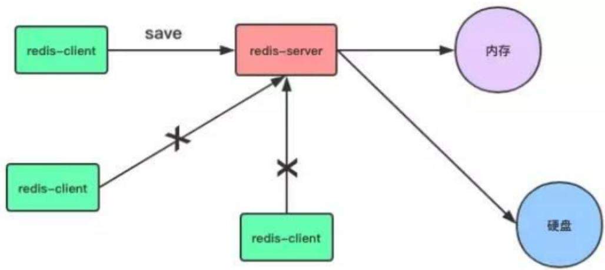


bgsave：该触发方式会fork一个子进程，由子进程负责持久化过程，因此阻塞只会发生在fork子进程的时候。

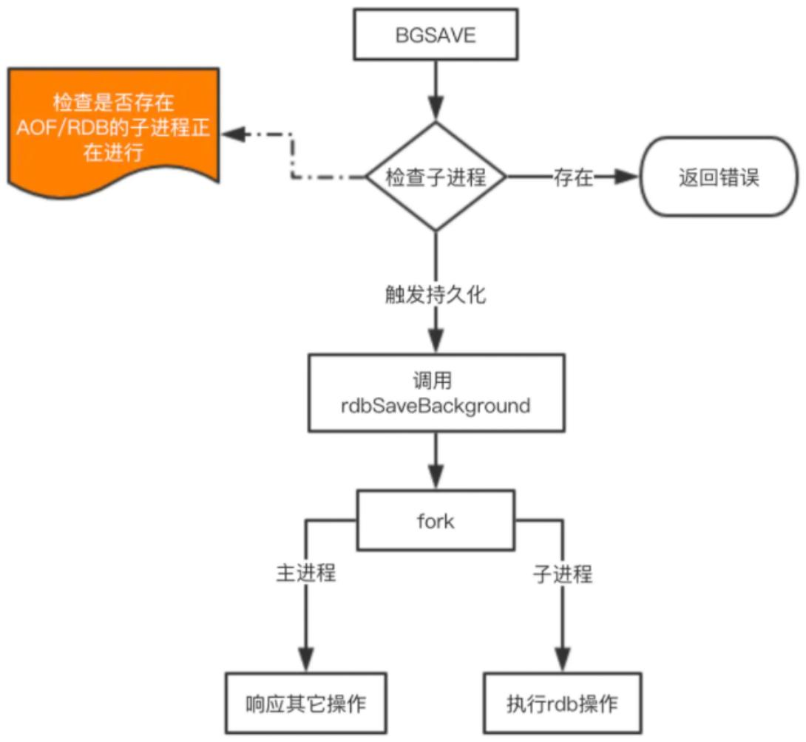


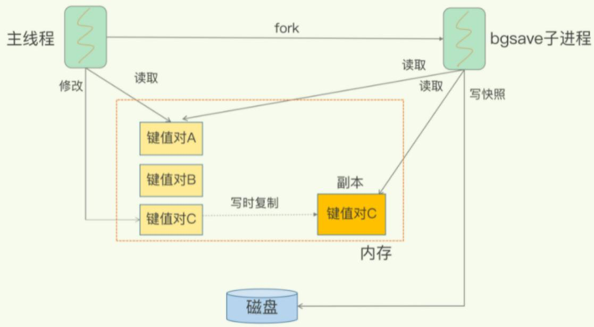


# 自动触发

根据我们的 save m n 配置规则自动触发；

从节点全量复制时，主节点发送rdb文件给从节点完成复制操作，主节点会触发 bgsave；

执行 debug reload 时；

执行 shutdown时，如果没有开启aof，也会触发。

```txt
redis.conf:
# 时间策略
save 900 1 # 表示900 秒内如果至少有 1 个 key 的值变化，则触发RDB
save 300 10 # 表示300 秒内如果至少有 10 个 key 的值变化，则触发RDB
save 60 10000 # 表示60 秒内如果至少有 10000 个 key 的值变化，则触发RDB

# 文件名称
dbfilename dump.rdb

# 文件保存路径
dir /home/work/app/redis/data/

# 如果持久化出错，主进程是否停止写入
stop-writes-on-bgsave-error yes

# 是否压缩
rdbcompression yes

# 导入时是否检查
rdbchecksum yes
```

配置其实非常简单，这里说一下持久化的时间策略具体是什么意思。

save 900 1 表示900s内如果有1条是写入命令，就触发产生一次快照，可以理解为就进行一次备份

save 300 10 表示300s内有10条写入，就产生快照

下面的类似，那么为什么需要配置这么多条规则呢？因为Redis每个时段的读写请求肯定不是均衡的，为了平衡性能与数据安全，我们可以自由定制什么情况下触发备份。所以这里就是根据自身Redis写入情况来进行合理配置。

stop-writes-on-bgsave-error yes 这个配置也是非常重要的一项配置，这是当备份进程出错时，主进程就停止接受新的写入操作，是为了保护持久化的数据一致性问题。如果自己的业务有完善的监控系统，可以禁止此项配置， 否则请开启。

关于压缩的配置 rdbcompression yes ，建议没有必要开启，毕竟Redis本身就属于CPU密集型服务器，再开启压缩会带来更多的CPU消耗，相比硬盘成本，CPU更值钱。

当然如果你想要禁用RDB配置，也是非常容易的，只需要在save的最后一行写上： save ""

# 1.2.3 实现

手动触发bgsave方法

```txt
127.0.0.1:6379> bgsave Background saving started 
```

```txt
-rw-r--r-- 1 root root 132 Jul 19 11:06 dump.rdb 
```

```txt
127.0.0.1:6379> set k3 v3
OK
127.0.0.1:6379> set k4 v4
OK
127.0.0.1:6379> set k5 v5
OK
127.0.0.1:6379> set k6 v6
OK
127.0.0.1:6379> set k7 v7
OK 
```

```txt
-rw-r--r-- 1 root root 132 Jul 19 11:06 dump.rdb 
```

# 1.2.4 RDB总结

# 优势

1、执行效率高，适用于大规模数据的备份恢复。自动备份不会影响主线程工作。

2、备份的文件占用空间小。其备份的是数据快照，相对于AOF来说文件大小要小一些。

# 劣势

1、可能会造成部分数据丢失。因为是自动备份，所以如果修改的数据量不足以触发自动备份，同时发生断电等异常导致redis不能正常关闭，所以也没有触发关闭的备份，那么在上一次备份到异常宕机过程中发生的写操作就会丢失。

2、自动备份通过fork进程来执行备份操作，而fork进程会阻塞主进程

# 1.3 AOF详解

# 1.3.1 概念

AOF（append only file）：记录每次对服务器写的操作（命令）,当服务器重启的时候会重新执行这些命令来恢复原始的数据。

（默认不开启）

# AOF特点：

1. 以日志的形式来记录用户请求的写操作，读操作不会记录，因为写操作才会存储

2. 文件以追加的形式而不是修改的形式

3. redis的aof恢复其实就是把追加的文件从开始到结尾读取 执行 写操作

# 1.3.2 AOF 持久化的实现

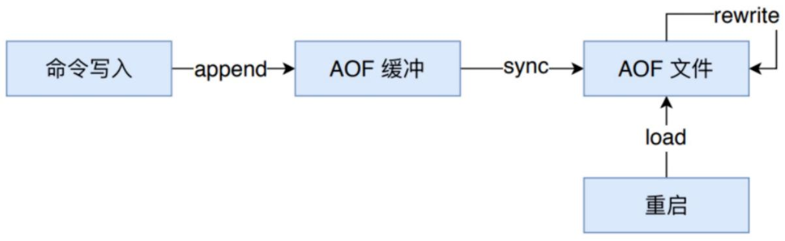


如上图所示，AOF 持久化功能的实现可以分为命令追加( append )、文件写入( write )、文件同步( sync)、文件重写(rewrite)和重启加载(load)。其流程如下：

所有的写命令会追加到 AOF 缓冲中。

AOF 缓冲区根据对应的策略向硬盘进行同步操作。

随着 AOF 文件越来越大，需要定期对 AOF 文件进行重写，达到压缩的目的。

当 Redis 重启时，可以加载 AOF 文件进行数据恢复。

# 1.3.2 开启

```python
# 可以通过修改redis.conf配置文件中的appendonly参数开启
appendonly yes

# AOF文件的保存位置和RDB文件的位置相同，都是通过dir参数设置的。
dir 。

# 默认的文件名是appendonly.aof，可以通过appendfilename参数修改
appendfilename    appendonly.aof
```

# 1.3.4 命令追加

当 AOF 持久化功能处于打开状态时，Redis 在执行完一个写命令之后，会以协议格式(也就是RESP，即Redis 客户端和服务器交互的通信协议 )将被执行的写命令追加到 Redis 服务端维护的 AOF 缓冲区末尾。

比如说 SET mykey myvalue 这条命令就以如下格式记录到 AOF 缓冲中。

1. "*3\r\n$3\r\nSET\r\n$5\r\nmykey\r\n$7\r\nmyvalue\r\n" 

Redis 协议格式本文不再赘述，AOF之所以直接采用文本协议格式，是因为所有写入命令都要进行追加操作，直接采用协议格式，避免了二次处理开销。

# 1.3.5 文件写入和同步（触发）

Redis 每次结束一个事件循环之前，它都会调用 flushAppendOnlyFile 函数，判断是否需要将 AOF 缓存区中的内容写入和同步到 AOF 文件中。

flushAppendOnlyFile 函数的行为由 redis.conf 配置中的 appendfsync 选项的值来决定。该选项有三个可选值，分别是 always 、 everysec 和 no ：


always：每执行一个命令保存一次 高消耗,最安全

everysec ：每一秒钟保存一次

no：只写入 不保存， AOF 或 Redis 关闭时执行，由操作系统触发刷新文件到磁盘

写入 和保存概念

WRITE：根据条件，将 aof_buf 中的缓存写入到 AOF 文件。

SAVE：根据条件，调用 fsync 或 fdatasync 函数，将 AOF 文件保存到磁盘中。

<table><tr><td>配置项</td><td>写回时机</td><td>优点</td><td>缺点</td></tr><tr><td>Always</td><td>同步写回</td><td>可靠性高,数据基本不丢失</td><td>每个写命令都要落盘,性能影响较大</td></tr><tr><td>Everysec</td><td>每秒写回</td><td>性能适中</td><td>宕机时丢失1秒内的数据</td></tr><tr><td>No</td><td>操作系统控制的写回</td><td>性能好</td><td>宕机时丢失数据较多</td></tr></table>

# 1.3.6 AOF 数据恢复

AOF 文件里边包含了重建 Redis 数据所需的所有写命令，所以 Redis 只要读入并重新执行一遍 AOF 文件里边保存的写命令，就可以还原 Redis 关闭之前的状态

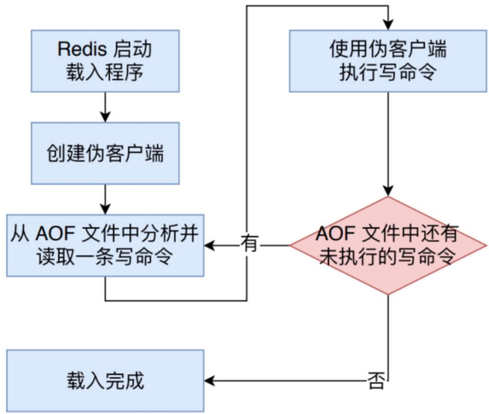


Redis 读取 AOF 文件并且还原数据库状态的详细步骤如下：

创建一个不带网络连接的的伪客户端( fake client)，因为 Redis 的命令只能在客户端上下文中执行，而载入 AOF 文件时所使用的的命令直接来源于 AOF 文件而不是网络连接，所以服务器使用了一个没有网络连接的伪客户端来执行 AOF 文件保存的写命令，伪客户端执行命令的效果和带网络连接的客户端执行命令的效果完全一样的。

从 AOF 文件中分析并取出一条写命令。

使用伪客户端执行被读出的写命令。

一直执行步骤 2 和步骤3，直到 AOF 文件中的所有写命令都被处理完毕为止。

当完成以上步骤之后，AOF 文件所保存的数据库状态就会被完整还原出来。

# 1.3.7 AOF "重写"

问题分析：AOF采用文件追加方式，随着Redis长时间运行，会产生什么问题？

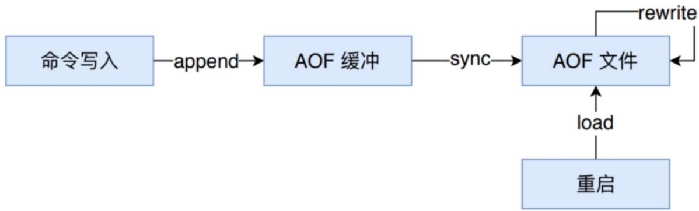


概念：

为了解决 AOF 文件体积膨胀的问题，Redis 提供了 AOF 文件重写( rewrite) 策略


AOF重写


```rust
Redis> RPUSH list "A", "B"    // ["A", "B"]
Redis> RPUSH list "C", "D"    // ["A", "B", "C", "D"]
Redis> LPOP list    // ["B", "C", "D"]
Redis> LPOP list    // ["C", "D"]
Redis> PUSH list "E", "F"    // ["C", "D", "E", "F"] 
```

重写前，保存了5条命令

```json
Redis> RPUSH list "C", "D", "E", "F" // ["C", "D", "E", "F"] 
```

读取 Redis 中键的当前

值，使用一条命令记录

如上图所示，重写前要记录名为 list的键的状态，AOF 文件要保存五条命令，而重写后，则只需要保存一条命令。

AOF 文件重写并不需要对现有的 AOF 文件进行任何读取、分析或者写入操作，而是通过读取服务器当前的数据库状态来实现的。首先从数据库中读取键现在的值，然后用一条命令去记录键值对，代替之前记录这个键值对的多条命令，这就是 AOF 重写功能的实现原理。

触发：

rewrite的触发机制主要有：

手动调用 bgrewriteaof 命令，如果当前有正在运行的 rewrite 子进程，则本次rewrite 会推迟执行，否则，直接触发一次 rewrite

自动触发 就是根据配置规则来触发

# 重写机制：避免文件越来越大，自动优化压缩指令，会fork一个新的进程去完成重写动作，新进程里的内存数据会被重写，此时旧的aof文件不会被读取使用

# 当前AOF文件的大小是上次AOF大小的100% 并且文件体积达到64m，满足两者则触发重写

```txt
auto-aof-rewrite-percentage 100
auto-aof-rewrite-min-size 64mb 
```

stat appendonly.aof 查看aof文件

# 1.3.8 AOF重写原理

AOF 重写函数会进行大量的写入操作，调用该函数的线程将被长时间阻塞，所以 Redis 在子进程中执行AOF 重写操作。

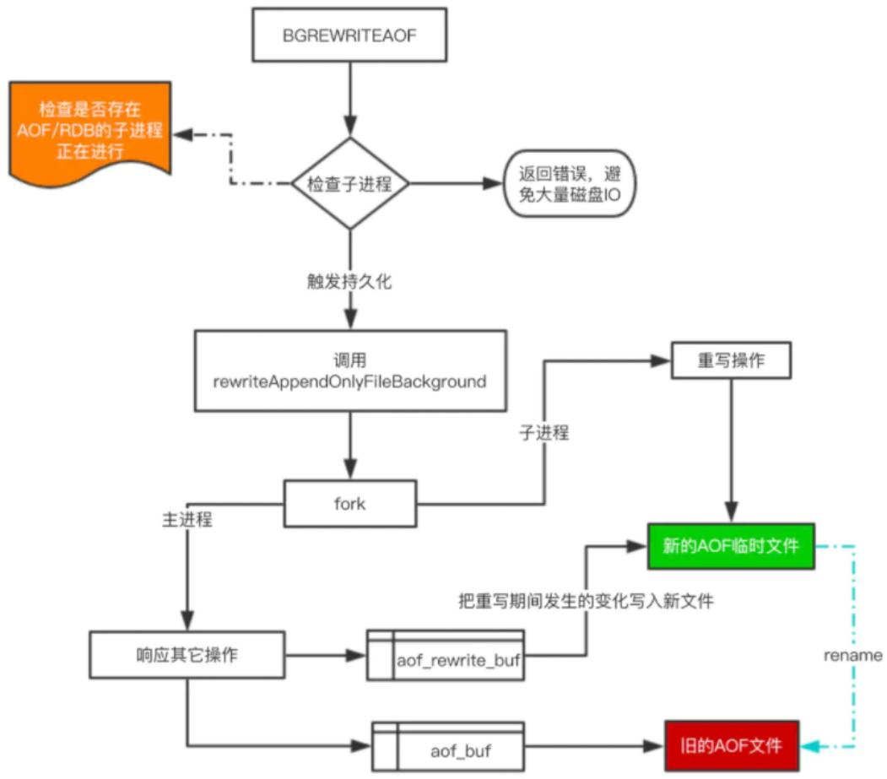


在整个 AOF 后台重写过程中，只有信号处理函数执行时会对 Redis 主进程造成阻塞，在其他时候，AOF后台重写都不会阻塞主进程。

<table><tr><td>时间</td><td>Redis 主进程(父进程)</td><td>子进程</td></tr><tr><td>T1</td><td>执行命令 SET k1 v1</td><td></td></tr><tr><td>T2</td><td>执行命令 SET k2 v2</td><td>开始 AOF 重写</td></tr><tr><td>T3</td><td>创建子进程,执行 AOF 重写</td><td>开始 AOF 重写</td></tr><tr><td>T4</td><td>执行命令 SET k3 v3</td><td>执行重写操作</td></tr><tr><td>T5</td><td>执行命令 SET k1 v4</td><td>完成重写,向父进程发送信号</td></tr><tr><td>T6</td><td>接收到信号,将上述两个命令添加到新的 AOF 文件中</td><td></td></tr><tr><td>T7</td><td>用新AOF文件覆盖旧AOF文件</td><td></td></tr></table>


表示Redis主进程被阻塞，无法处理客户端请求

# 1.4 持久化优先级

如果一台服务器上有既有RDB文件，又有AOF文件，该加载谁呢？

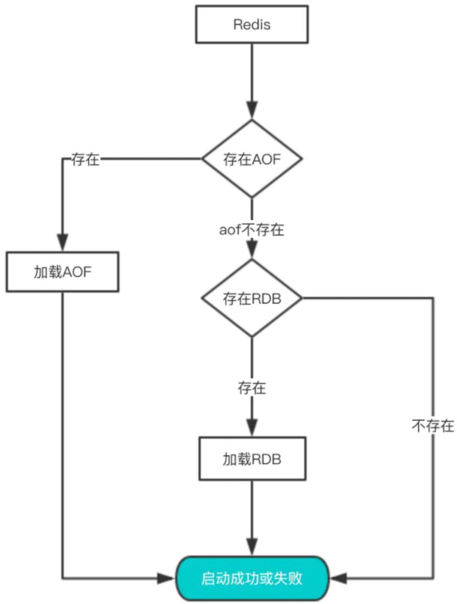


# 1.5 性能与实践

通过上面的分析，我们都知道RDB的快照、AOF的重写都需要fork，这是一个重量级操作，会对Redis造成阻塞。因此为了不影响Redis主进程响应，我们需要尽可能降低阻塞。

1. 降低fork的频率，比如可以手动来触发RDB生成快照、与AOF重写；

2. 控制Redis最大使用内存，防止fork耗时过长；

3. 使用更牛逼的硬件；

4. 合理配置Linux的内存分配策略，避免因为物理内存不足导致fork失败

# 线上实践经验

1. 如果Redis中的数据并不是特别敏感或者可以通过其它方式重写生成数据，可以关闭持久化，如果丢失数据可以通过其它途径补回；

2. 自己制定策略定期检查Redis的情况，然后可以手动触发备份、重写数据；

3. 可以加入主从机器，利用一台从机器进行备份处理，其它机器正常响应客户端的命令；

4. RDB持久化与AOF持久化可以同时存在，配合使用。

# 2. 安全策略

# 1. 密码认证

可以通过 redis 的配置文件设置密码参数，这样客户端连接到 redis 服务就需要密码验证，这样可以让你的 redis 服务更安全。

redis在redis.conf配置文件中，设置配置项requirepass， 开户密码认证。

打开redis.conf，找到requirepass所在的地方，修改为指定的密码，密码应符合复杂性要求：

1、长度8位以上

2、包含以下四类字符中的三类字符:

英文大写字母(A 到 Z)

英文小写字母(a 到 z)

10 个基本数字(0 到 9)

非字母字符(例如 !、$、#、%、@、^、&)

3、避免使用已公开的弱密码，如：abcd.1234 、admin@123等

再去掉前面的#号注释符，然后重启redis

# requirepass abc

实例

我们可以通过以下命令查看是否设置了密码验证：

127.0.0.1:6379> CONFIG get requirepass 

1) "requirepass" 

2) 

默认情况下 requirepass 参数是空的，这就意味着你无需通过密码验证就可以连接到 redis 服务。

你可以通过以下命令来修改该参数：

```csv
127.0.0.1:6379> CONFIG set requirepass "zimu"
OK
127.0.0.1:6379> CONFIG get requirepass
1) "requirepass"
2) "zimu" 
```

设置密码后，客户端连接 redis 服务就需要密码验证，否则无法执行命令。

# 语法

AUTH 命令基本语法格式如下：

```batch
127.0.0.1:6379> AUTH password 
```

# 实例

```csv
127.0.0.1:6379> AUTH "zimu"
OK
127.0.0.1:6379> SET mykey "Test value"
OK
127.0.0.1:6379> GET mykey
"Test value" 
```

# 3. 过期删除策略&内存淘汰策略

# 3.1. 问题分析：

①、如何设置Redis键的过期时间？

②、设置完一个键的过期时间后，到了这个时间，这个键还能获取到么？假如获取不到那这个键还占据着内存吗？

③、如何设置Redis的内存大小？当内存满了之后，Redis有哪些内存淘汰策略？我们又该如何选择？

# 3.2 设置Redis键过期时间

Redis提供了四个命令来设置过期时间（生存时间）。

①、EXPIRE ：表示将键 key 的生存时间设置为 ttl 秒。

②、PEXPIRE ：表示将键 key 的生存时间设置为 ttl 毫秒。

③、EXPIREAT ：表示将键 key 的生存时间设置为 timestamp 所指定的秒数时间戳。

④、PEXPIREAT ：表示将键 key 的生存时间设置为 timestamp 所指定的毫秒数时间戳。

PS：在Redis内部实现中，前面三个设置过期时间的命令最后都会转换成最后一个PEXPIREAT 命令来完成。

另外补充两个知识点：

# 一、移除键的过期时间

PERSIST ：表示将key的过期时间移除。

# 二、返回键的剩余生存时间

TTL ：以秒的单位返回键 key 的剩余生存时间。

PTTL ：以毫秒的单位返回键 key 的剩余生存时间。

# 3.3 Redis过期时间的判定

在Redis内部，每当我们设置一个键的过期时间时，Redis就会将该键带上过期时间存放到一个过期字典中。当我们查询一个键时，Redis便首先检查该键是否存在过期字典中，如果存在，那就获取其过期时间。然后将过期时间和当前系统时间进行比对，比系统时间大，那就没有过期；反之判定该键过期。

# 3.4 过期删除策略

通常删除某个key，我们有如下三种方式进行处理。

# ①、定时删除

在设置某个key 的过期时间同时，我们创建一个定时器，让定时器在该过期时间到来时，立即执行对其进行删除的操作。

# ②、惰性删除

设置该key 过期时间后，我们不去管它，当需要该key时，我们在检查其是否过期，如果过期，我们就删掉它，反之返回该key。

# ③、定期删除

每隔一段时间，我们就对一些key进行检查，删除里面过期的key。

# 3.5 Redis过期删除策略

Redis的过期删除策略就是：惰性删除和定期删除两种策略配合使用

惰性删除：Redis的惰性删除策略由 db.c/expireIfNeeded 函数实现，所有键读写命令执行之前都会调用expireIfNeeded 函数对其进行检查，如果过期，则删除该键，然后执行键不存在的操作；未过期则不作操作，继续执行原有的命令。

定期删除：由redis.c/activeExpireCycle 函数实现，函数以一定的频率运行，每次运行时，都从一定数量的数据库中取出一定数量的随机键进行检查，并删除其中的过期键。

注意：并不是一次运行就检查所有的库，所有的键，而是随机检查一定数量的键。

定期删除函数的运行频率，在Redis2.6版本中，规定每秒运行10次，大概100ms运行一次。在Redis2.8版本后，可以通过修改配置文件redis.conf 的 hz 选项来调整这个次数。

```txt
# The range is between 1 and 500, however a value over 100 is usually not
# a good idea. Most users should use the default of 10 and raise this up to
# 100 only in environments where very low latency is required.
hz 10 
```

# 算法如下：

1.采样ACTIVE_EXPIRE_CYCLE_LOOKUPS_PER_LOOP（redis参数，默认20）个数的key，并将其中过期的key全部删除；

2.如果超过25%的key过期了，则重复删除的过程，知道过期key的比例降至25%以下

思考：会不会存在某些永远使用不到的键，并且多次定期删除也没选定到进行删除的key？

# 3.6 内存淘汰策略

# ①、设置Redis最大内存

在配置文件redis.conf 中，可以通过参数 maxmemory 来设定最大内存：

```txt
# In short... if you have replicas attached it is suggested that you set a lower
# limit for maxmemory so that there is some free RAM on the system for replica
# output buffers (but this is not needed if the policy is 'noeviction').
#
# maxmemory <bytes> 
```

# ②、设置内存淘汰方式

当现有内存大于 maxmemory 时，便会触发redis主动淘汰内存方式，通过设置 maxmemory-policy有如下几种淘汰方式：

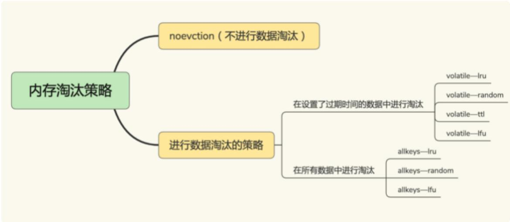


volatile-lru ：设置了过期时间的key使用LRU算法淘汰；

allkeys-lru ：所有key使用LRU算法淘汰；

volatile-lfu ：设置了过期时间的key使用LFU算法淘汰；

allkeys-lfu ：所有key使用LFU算法淘汰；

volatile-random ：设置了过期时间的key使用随机淘汰；

allkeys-random ：所有key使用随机淘汰；

volatile-ttl：设置了过期时间的key根据过期时间淘汰，越早过期越早淘汰；

noeviction：默认策略，当内存达到设置的最大值时，所有申请内存的操作都会报错(如set,lpush等)，只读操作如get命令可以正常执行；

* LRU、LFU和volatile-ttl都是近似随机算法；

使用下面的参数maxmemory-policy配置淘汰策略：

# #配置文件

maxmemory-policy noeviction 

# #命令行

```txt
127.0.0.1:6379> config get maxmemory-policy
1) "maxmemory-policy"
2) "noeviction"
127.0.0.1:6379> config set maxmemory-policy allkeys-random
OK
127.0.0.1:6379> config get maxmemory-policy
1) "maxmemory-policy"
2) "allkeys-random" 
```

在缓存的内存淘汰策略中有*FIFO、LRU、LFU*三种，其中LRU和LFU是Redis在使用的。

FIFO是最简单的淘汰策略，遵循着先进先出的原则，这里简单提一下：

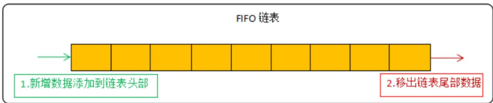


# LRU算法

LRU（Least Recently Used）表示最近最少使用，该算法根据数据的历史访问记录来进行淘汰数据，其核心思想是“如果数据最近被访问过，那么将来被访问的几率也更高”。

LRU算法的常见实现方式为链表：

新数据放在链表头部 ，链表中的数据被访问就移动到链头，链表满的时候从链表尾部移出数据。

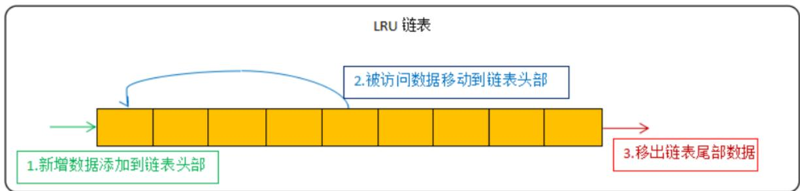


而在Redis中使用的是近似LRU算法，为什么说是近似呢？Redis中是随机采样5个（可以修改参数maxmemory-samples配置）key，然后从中选择访问时间最早的key进行淘汰，因此当采样key的数量与Redis库中key的数量越接近，淘汰的规则就越接近LRU算法。但官方推荐5个就足够了，最多不超过10个，越大就越消耗CPU的资源。

但在LRU算法下，如果一个热点数据最近很少访问，而非热点数据近期访问了，就会误把热点数据淘汰而留下了非热点数据，因此在Redis4.x中新增了LFU算法。

在LRU算法下，Redis会为每个key新增一个3字节的内存空间用于存储key的访问时间；

# LFU算法

LFU（Least Frequently Used）表示最不经常使用，它是根据数据的历史访问频率来淘汰数据，其核心思想是“如果数据过去被访问多次，那么将来被访问的频率也更高”。

LFU算法反映了一个key的热度情况，不会因LRU算法的偶尔一次被访问被误认为是热点数据。

LFU算法的常见实现方式为链表：

新数据放在链表尾部 ，链表中的数据按照被访问次数降序排列，访问次数相同的按最近访问时间降序排列，链表满的时候从链表尾部移出数据。

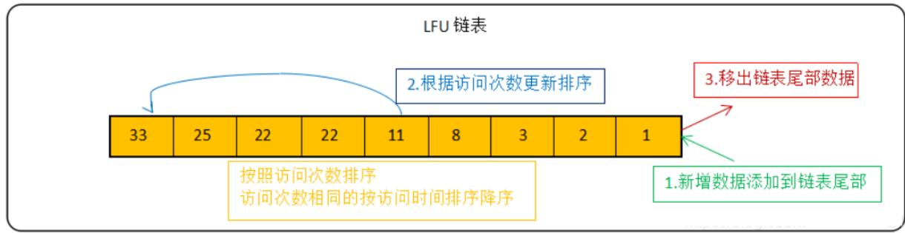


Redis在实现LFU策略的时候，只是把原来24bit大小的LRU字段，又进一步拆分成了两部分

Idt：lru字段的前16bit,表示数据的访问时间戳

counter值：lru字段的后8bit，表示数据的访问次数

总结：当LFU策略筛选数据时，Redis会在候选集合中，根据数据lru字段的后8bit选择访问次数最少的数据进行淘汰。当访问次数相同时，再根据lru字段的前16bit值大小，选择访问时间最久远的数据进行淘汰

# 总结

Redis过期删除策略是采用惰性删除和定期删除这两种方式组合进行的，惰性删除能够保证过期的数据我们在获取时一定获取不到，而定期删除设置合适的频率，则可以保证无效的数据及时得到释放，而不会一直占用内存数据。

但是我们说Redis是部署在物理机上的，内存不可能无限扩充的，当内存达到我们设定的界限后，便自动触发Redis内存淘汰策略，而具体的策略方式要根据实际业务情况进行选取。

# 4. 性能压测

Redis 的性能测试工具，目前主流使用的是 redis-benchmark

# 4.1. redis-benchmark

Redis 官方提供 redis-benchmark 的工具来模拟 N 个客户端同时发出 M 个请求,可以便捷对服务器进行读写性能压测

# 4.2. 语法

redis 性能测试的基本命令如下：

```txt
redis-benchmark [option] [option value] 
```

redis 性能测试工具可选参数如下所示：

<table><tr><td>序号</td><td>选项</td><td>描述</td><td>默认值</td></tr><tr><td>1</td><td>-h</td><td>指定服务器主机名</td><td>127.0.0.1</td></tr><tr><td>2</td><td>-p</td><td>指定服务器端口</td><td>6379</td></tr><tr><td>3</td><td>-s</td><td>指定服务器 socket</td><td></td></tr><tr><td>4</td><td>-c</td><td>指定并发连接数</td><td>50</td></tr><tr><td>5</td><td>-n</td><td>指定请求数</td><td>10000</td></tr><tr><td>6</td><td>-d</td><td>以字节的形式指定 SET/GET 值的数据大小</td><td>2</td></tr><tr><td>7</td><td>-k</td><td>1=keep alive 0=reconnect</td><td>1</td></tr><tr><td>8</td><td>-r</td><td>SET/GET/INCR 使用随机 key, SADD 使用随机值</td><td></td></tr><tr><td>9</td><td>-P</td><td>通过管道传输 请求</td><td>1</td></tr><tr><td>10</td><td>-q</td><td>强制退出 redis。仅显示 query/sec 值</td><td></td></tr><tr><td>11</td><td>--CSV</td><td>以 CSV 格式输出</td><td></td></tr><tr><td>12</td><td>*-I* (L 的小写字母)</td><td>生成循环,永久执行测试</td><td></td></tr><tr><td>13</td><td>-t</td><td>仅运行以逗号分隔的测试命令列表。</td><td></td></tr><tr><td>14</td><td>*-I* (i 的大写字母)</td><td>Idle 模式。仅打开 N 个 idle 连接并等待。</td><td></td></tr></table>

# 4.3. 快速测试

```txt
redis-benchmark 
```

在安装 Redis 的服务器上，直接执行，不带任何参数，即可进行测试。测试结果如下：

```txt
-------- PING_INLINE
    100000 requests completed in 1.18 seconds
    50 parallel clients
    3 bytes payload
    keep alive: 1
100.00% <= 0 milliseconds
84388.19 requests per second
-------- PING_BULK
    100000 requests completed in 1.17 seconds
    50 parallel clients
    3 bytes payload
    keep alive: 1
100.00% <= 0 milliseconds
85106.38 requests per second
-------- SET
    100000 requests completed in 1.18 seconds
    50 parallel clients
    3 bytes payload
    keep alive: 1
99.95% <= 1 milliseconds 
```

```txt
99.95% <= 2 milliseconds
99.95% <= 3 milliseconds
100.00% <= 3 milliseconds
85034.02 requests per second
==== GET ====
    100000 requests completed in 1.17 seconds
    50 parallel clients
    3 bytes payload
    keep alive: 1
99.95% <= 1 milliseconds
99.99% <= 2 milliseconds
100.00% <= 2 milliseconds
85106.38 requests per second
==== INCR ====
    100000 requests completed in 1.19 seconds
    50 parallel clients
    3 bytes payload
    keep alive: 1
99.95% <= 2 milliseconds
99.96% <= 3 milliseconds
100.00% <= 3 milliseconds
84317.03 requests per second
==== LPUSH ====
    100000 requests completed in 1.17 seconds
    50 parallel clients
    3 bytes payload
    keep alive: 1
100.00% <= 0 milliseconds
85763.29 requests per second
==== RPUSH ====
    100000 requests completed in 1.15 seconds
    50 parallel clients
    3 bytes payload
    keep alive: 1
100.00% <= 0 milliseconds
87260.03 requests per second
==== LPOP ====
    100000 requests completed in 1.17 seconds
    50 parallel clients
    3 bytes payload
    keep alive: 1
100.00% <= 0 milliseconds
85689.80 requests per second
==== RPOP ====
    100000 requests completed in 1.16 seconds
    50 parallel clients
    3 bytes payload
    keep alive: 1
100.00% <= 0 milliseconds
86281.27 requests per second
==== SADD ====
    100000 requests completed in 1.17 seconds
    50 parallel clients
    3 bytes payload
    keep alive: 1
99.95% <= 2 milliseconds
99.96% <= 3 milliseconds
100.00% <= 3 milliseconds 
```

```txt
85106.38 requests per second
==== HSET ====
100000 requests completed in 1.14 seconds
50 parallel clients
3 bytes payload
keep alive: 1
100.00% <= 0 milliseconds
87719.30 requests per second
==== SPOP ====
100000 requests completed in 1.16 seconds
50 parallel clients
3 bytes payload
keep alive: 1
100.00% <= 0 milliseconds
85836.91 requests per second
==== LPUSH (needed to benchmark LRANGE) ====
100000 requests completed in 1.15 seconds
50 parallel clients
3 bytes payload
keep alive: 1
99.92% <= 1 milliseconds
100.00% <= 1 milliseconds
86805.56 requests per second
==== LRANGE_100 (first 100 elements) ====
100000 requests completed in 2.03 seconds
50 parallel clients
3 bytes payload
keep alive: 1
99.95% <= 1 milliseconds
99.95% <= 2 milliseconds
99.96% <= 3 milliseconds
99.99% <= 4 milliseconds
100.00% <= 4 milliseconds
49261.09 requests per second
==== LRANGE_300 (first 300 elements) ====
100000 requests completed in 4.58 seconds
50 parallel clients
3 bytes payload
keep alive: 1
6.06% <= 1 milliseconds
99.78% <= 2 milliseconds
99.94% <= 3 milliseconds
99.98% <= 4 milliseconds
100.00% <= 5 milliseconds
100.00% <= 5 milliseconds
21815.01 requests per second
==== LRANGE_500 (first 450 elements) ====
100000 requests completed in 6.51 seconds
50 parallel clients
3 bytes payload
keep alive: 1
0.04% <= 1 milliseconds
83.91% <= 2 milliseconds
99.93% <= 3 milliseconds
99.97% <= 4 milliseconds
99.98% <= 5 milliseconds
99.99% <= 6 milliseconds
100.00% <= 7 milliseconds 
```

```txt
100.00% <= 7 milliseconds
15372.79 requests per second
==== LRANGE_600 (first 600 elements) ====
100000 requests completed in 8.66 seconds
50 parallel clients
3 bytes payload
keep alive: 1
0.03% <= 1 milliseconds
62.47% <= 2 milliseconds
98.11% <= 3 milliseconds
99.86% <= 4 milliseconds
99.94% <= 5 milliseconds
99.97% <= 6 milliseconds
99.98% <= 7 milliseconds
100.00% <= 8 milliseconds
100.00% <= 8 milliseconds
11551.35 requests per second
==== MSET (10 keys) ====
100000 requests completed in 1.11 seconds
50 parallel clients
3 bytes payload
keep alive: 1
99.95% <= 2 milliseconds
99.96% <= 3 milliseconds
100.00% <= 3 milliseconds
90009.01 requests per second 
```

基本可以看到，常用的 GET/SET/INCR 等命令，都在 8W+ QPS 以上

# 4.4. 精简测试

```txt
redis-benchmark -t set, get, incr -n 1000000 -q 
```

通过 -t 参数，设置仅仅测试 SET/GET/INCR 命令

通过 -n 参数，设置每个测试执行 1000000 次操作。

通过 -q 参数，设置精简输出结果。

执行结果如下：

```txt
[root@izuf6hci646px19gg3hpuwz ~]# redis-benchmark -t set, get, incr -n 100000 -q
SET: 85888.52 requests per second
GET: 85881.14 requests per second
INCR: 86722.75 requests per second 
```

#测试脚本性能

```txt
redis-benchmark -q script load "redis.call('set', 'foo', 'bar')" 
```

# 4.5 实战演练

看一个实际的案例，压测开启、关闭 aof下，redis的性能剖析

1）关掉auth认证，打开aof，策略为always，配置文件如下

```txt
#redis.conf
appendonly yes
appendfsync always
#requirepass abc #关掉auth

#kill旧进程，重启redis
[root@iz8vb3a9qxofwannyywl6zz aof]# pwd
/opt/redis/latest/aof
[root@iz8vb3a9qxofwannyywl6zz aof]# ..src/redis-server redis.conf
```

2）压测aof下的性能，以get,set为测试案例，将结果记录下来，留做后面对比

```txt
[root@iz8vb3a9qxofwannyywl6zz aof]# redis-server /usr/local/redis/redis.conf
SET: 62274.25 requests per second, p50=0.687 msec
GET: 88739.02 requests per second, p50=0.399 msec 
```

3）将配置文件的appendonly改为no，关掉aof，重启redis，再来压测同样的指令

```txt
[root@iz8vb3a9qxofwannyywl6zz aof]# ..redis-6.2.4/src/redis-benchmark -t set, get -n 1000000 -q
SET: 91575.09 requests per second, p50=0.391 msec
GET: 90950.43 requests per second, p50=0.391 msec 
```

4）结果分析

对各种读取操作来说，性能差别不大：get、spop、队列的range等

对写操作影响比较大

5）参考价值

如果你的项目里对数据安全性要求较高，写少读多的场景，可以适当使用aof

如果追求极致的性能，只做缓存，容忍数据丢失，还是关掉aof

# 5. Redis高可用

# 5.1 主从复制

# 5.1.1 面临问题

Redis有 两种不同的持久化方式， Redis 服务器通过持久化，把 Redis 内存中持久化到硬盘当中，当Redis宕机时，我们重启Redis服务器时，可以由RDB文件或AOF文件恢复内存中的数据。

# 单机Redis

RDB 

AOF 

问题1：不过持久化后的数据仍然只在一台机器上，因此当硬件发生故障时，比如主板或CPU坏了，这时候无法重启服务器，有什么办法可以保证服务器发生故障时数据的安全性？或者可以快速恢复数据呢？

问题2：容量瓶颈

# 5.1.2 解决办法

针对这些问题，redis提供了 复制(replication) 的功能， 通过"主从(一主多从)"和"集群(多主多从)"的方式对redis的服务进行水平扩展,用多台redis服务器共同构建一个高可用的redis服务系统。

# 5.1.3 主从复制

主从复制，是指将一台Redis服务器的数据，复制到其他的Redis服务器。前者称为主节点(master)，后者称为从节点(slave),数据的复制是单向的，只能由主节点到从节点。

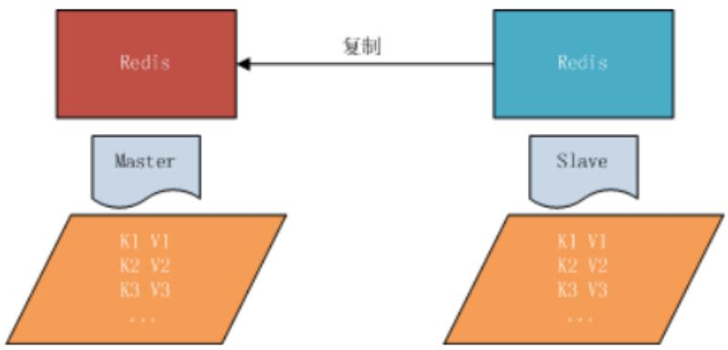


# 5.1.4 常用策略

策略1 ：一主多从 主机(写)，从机(读)

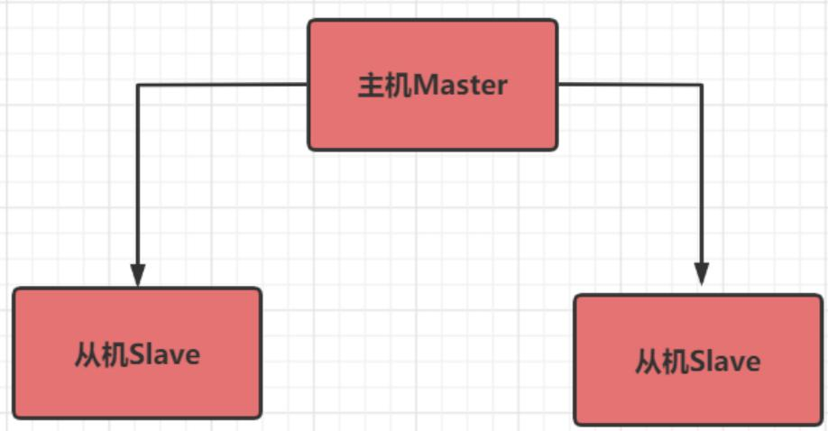


策略2：薪火相传


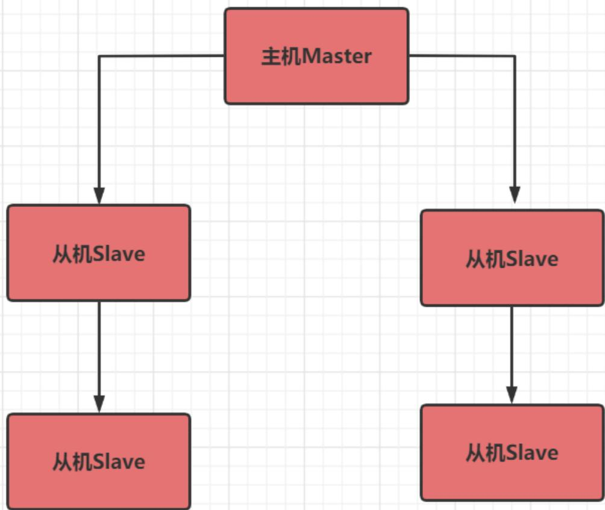


# 5.1.5 主从复制原理

Redis的主从复制是异步复制，异步分为两个方面，一个是master服务器在将数据同步到slave时是异步的，因此master服务器在这里仍然可以接收其他请求，一个是slave在接收同步数据也是异步的。

# 复制方式

redis-cli -p 6379 info | grep run 

# 全量复制

master 服务器会将自己的 rdb 文件发送给 slave 服务器进行数据同步，并记录同步期间的其他写入，再发送给slave服务器，以达到完全同步的目的，这种方式称为全量复制。

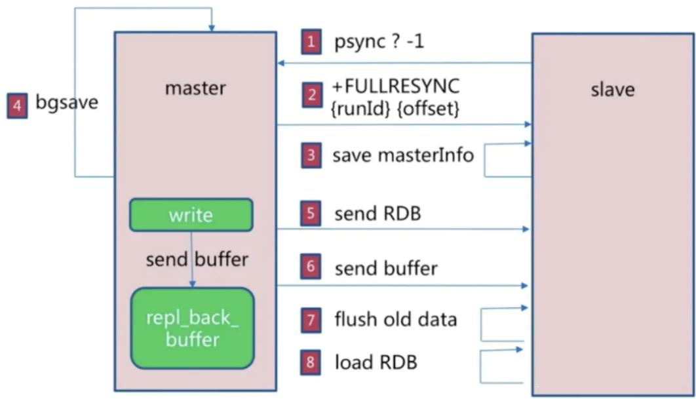


# 增量复制

因为各种原因master服务器与slave服务器断开后，slave服务器在重新连上master服务器时会尝试重新获取断开后未同步的数据即部分同步，或者称为部分复制。

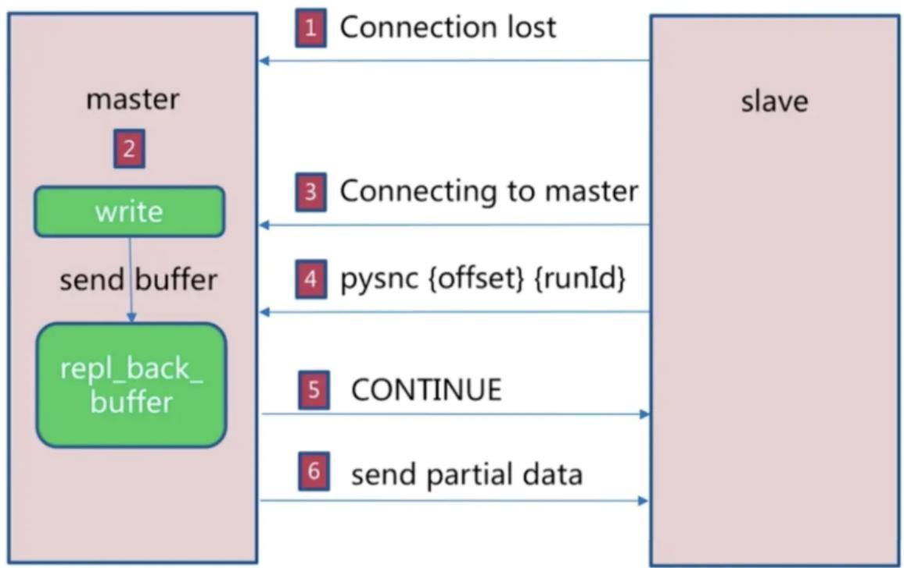


# 工作原理

master服务器会记录一个replicationId的伪随机字符串，用于标识当前的数据集版本，还会记录一个当数据集的偏移量 offset ，不管 master 是否有配置 slave 服务器，replication Id和offset会一直记录并成对存在，我们可以通过以下命令查看replication Id和offset：

```txt
> info repliaction 
```

通过redis-cli在master或slave服务器执行该命令会打印类似以下信息(不同服务器数据不同，打印信息不同)：

```ini
connected_slaves:1
slave0:ip=127.0.0.1,port=6380,state=online,offset=9472,lag=1
master_replid:2cbd65f847c0acd608c69f93010dcaa6dd551cee
master_repl_offset:9472 
```

当master与slave正常连接时，slave使用PSYNC命令向master发送自己记录的旧master的replicationid和offset，而master会计算与slave之间的数据偏移量，并将缓冲区中的偏移数量同步到slave，此时master和slave的数据一致。

而如果slave引用的replication太旧了，master与slave之间的数据差异太大，则master与slave之间会使用全量复制的进行数据同步（repl_backlog_size值调大可以尽量避免）。

# 5.1.6 配置主从复制

注：主从复制的开启，完全是在从节点发起的；不需要我们在主节点做任何事情。

从节点开启主从复制，有3种方式：

（1）配置文件：在从服务器的配置文件中加入：slaveof

（2）redis-server启动命令后加入 --slaveof

（3）Redis服务器启动后，直接通过客户端执行命令：slaveof ，则该Redis实例成为从节点

演示：

①、通过 info replication 命令查看三台节点角色

```txt
127.0.0.1:6379> info replication
# Replication
role:master 
```

初始状态，三台节点都是master

②、设置主从关系，从节点执行命令：SLAVEOF 127.0.0.1 6379

```txt
127.0.0.1:6379> SLAVEOF 106.75.21.30 6379
OK
127.0.0.1:6379> info replication
# Replication
role:slave 
```

再看主节点信息：

```ini
127.0.0.1:6379> info replication
# Replication
role:master
connected slaves:2 master当前有2个从节点
slave0:ip=117.50.96.183,port=6379,state=online,offset=140,lag=0
slave1:ip=106.75.115.226,port=6379,state=online,offset=140,lag=0
```

这里通过命令来设置主从关系，一旦服务重启，那么角色关系将不复存在。想要永久的保存这种关系，可以通过配置redis.conf 文件来配置。

```txt
slaveof 127.0.0.1 6379 
```

# 5.1.7 测试主从关系

# ①、增量复制

master 操作写入：

```txt
127.0.0.1:6379> set k1 v1 OK 
```

slave操作获取：

```txt
127.0.0.1:6380> get k1 "v1" 
```

# ②、全量复制

通过执行 SLAVEOF 127.0.0.1 6379，如果主节点 6379 以前还存在一些 key，那么执行命令之后，从节点会将以前的信息也都复制过来

# ③、主从读写分离

尝试slave操作获取：

```txt
127.0.0.1:6380> set k2 k2
(error) READONLY You can't write against a read only replica. 
```

原因是在配置文件 6380redis.conf 中对于 slave-read-only 的配置

```txt
replica-read-only yes 
```

如果我们将其修改为 no 之后，执行写命令是可以的，但是从节点写命令的数据从节点或者主节点都不能获取的。

# ④、主节点宕机

主节点 Maste 挂掉，两个从节点角色会发生变化吗？

```txt
127.0.0.1:6379> shutdown
not connected> 
```

```ini
127.0.0.1:6380> info replication
# Replication
role:slave
master_host:127.0.0.1
master_port:6379
master_link_status:down 
```

上图可知主节点 Master 挂掉之后，从节点角色还是不会改变的。

# ⑤、主节点宕机后恢复

主节点Master挂掉之后，马上启动主机Master，主节点扮演的角色还是 Master 吗？

```txt
127.0.0.1:6379> info replication
# Replication
role:master
connected_slaves:1
slave0:ip=127.0.0.1,port=6380,state=online,offset=28,lag=1 
```

也就是说主节点挂掉之后重启，又恢复了主节点的角色。

# 5.2 sentinel哨兵模式

通过前面的配置，主节点Master 只有一个，一旦主节点挂掉之后，从节点没法担起主节点的任务，那么整个系统也无法运行。

如果主节点挂掉之后，从节点能够自动变成主节点，那么问题就解决了，于是哨兵模式诞生了。

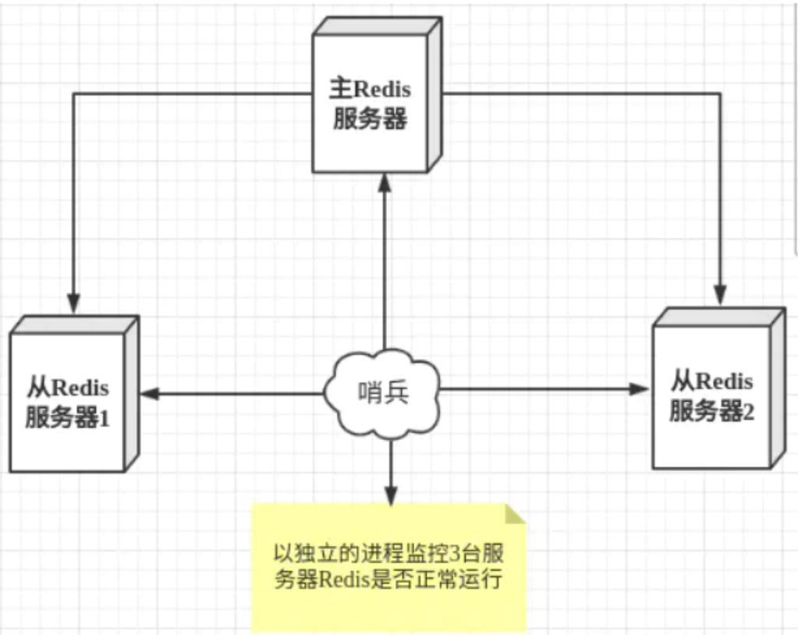


哨兵模式是一种特殊的模式，首先Redis提供了哨兵的命令，哨兵是一个独立的进程，作为进程，它会独立运行。其原理是哨兵通过发送命令，等待Redis服务器响应，从而监控运行的多个Redis实例。

哨兵模式搭建步骤：

①、在配置文件目录下新建 sentinel.conf 文件，名字绝不能错，然后配置相应内容

```txt
[root@10-9-54-6 redis]# touch sentinel.conf
[root@10-9-54-6 redis]# 
```

sentinel monitor 被监控机器的名字(自己起名字) ip地址 端口号 得票数

```txt
sentinel monitor mymaster 127.0.0.1 6379 1 
```

分别配置被监控的名字，ip地址，端口号，以及得票数。上面的得票数为1表示表示主机挂掉后salve投票看让谁接替成为主机，得票数大于1便成为主机

②、启动哨兵

```txt
redis-sentinel /redis/sentinel.conf 
```

```txt
333370:X 20 Jul 2021 16:05:45.616 # +new-epoch 1
333370:X 20 Jul 2021 16:05:45.616 # +try-failover master mymaster 127.0.0.1 6379
333370:X 20 Jul 2021 16:05:45.620 # +vote-for-leader 6f2ad836f2598199207eaef8e178d4c7 67f0df66 1
333370:X 20 Jul 2021 16:05:45.620 # +elected-leader master mymaster 127.0.0.1 6379
333370:X 20 Jul 2021 16:05:45.620 # +failover-state-select-slave master mymaster 127.0.0.1 6379
333370:X 20 Jul 2021 16:05:45.705 # -failover-abort-no-good-slave master mymaster 127.0.0.1 6379
333370:X 20 Jul 2021 16:05:45.772 # Next failover delay: I will not start a failover before Tue Jul 20 16:11:46 2021
333370:X 20 Jul 2021 16:06:04.170 # -sdown master mymaster 127.0.0.1 6379
333370:X 20 Jul 2021 16:06:04.170 # -odown master mymaster 127.0.0.1 6379
333370:X 20 Jul 2021 16:06:24.225 * +slave slave 127.0.0.1:6380 127.0.0.1 6380 @ myma ster 127.0.0.1 6379 
```

接下来，我们干掉主机 6379，然后看从节点有啥变化。

```txt
127.0.0.1:6379> shutdown
not connected> 
```

干掉主节点之后，我们查看后台打印日志，发现 6380投票变为主节点

（选主策略：①从库优先级slave-priority配置项、②从库复制进度大的、③ID号小的）

```txt
127.0.0.1:6380> info replication
# Replication
role:master 
```

PS：哨兵模式也存在单点故障问题，如果哨兵机器挂了，那么就无法进行监控了，解决办法是哨兵也建立集群，Redis哨兵模式是支持集群的。

# 6. Redis Cluster

引言

# 6.1主从 + 哨兵 问题分析

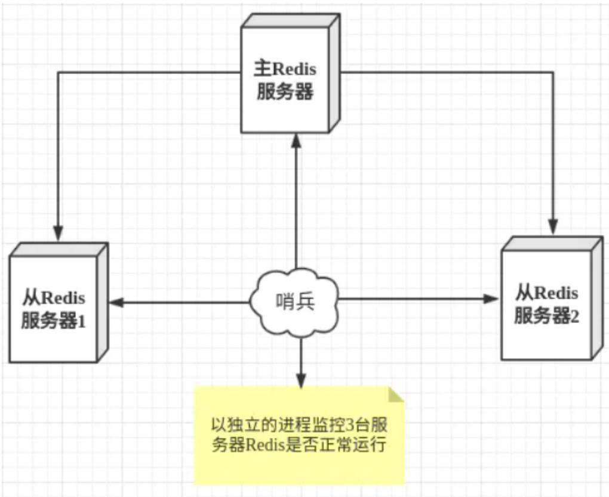


（1）在主从 + 哨兵模式中，仍然只有一个Master节点。当并发写请求较大时，哨兵模式并不能缓解写压力

（2） 在Redis Sentinel模式中，每个节点需要保存全量数据，冗余比较多

# 6.2 Cluster概念

从3.0版本之后，官方推出了Redis Cluster，它的主要用途是实现数据分片(Data Sharding)，不过同样可以实现HA，是官方当前推荐的方案。


1.Redis-Cluster采用无中心结构

2.只有当集群中的大多数节点同时fail整个集群才fail。

3.整个集群有16384个slot，当需要在 Redis 集群中放置一个 key-value 时，根据 CRC16(key) mod16384的值，决定将一个key放到哪个桶中。读取一个key时也是相同的算法。

4.当主节点fail时从节点会升级为主节点，fail的主节点online之后自动变成了从节点

# 6.3 故障转移

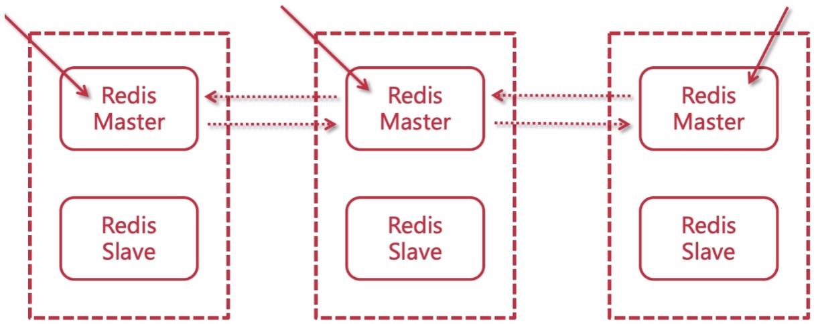


Redis集群的主节点内置了类似Redis Sentinel的节点故障检测和自动故障转移功能，当集群中的某个主节点下线时，集群中的其他在线主节点会注意到这一点，并对已下线的主节点进行故障转移。

# 6.4 集群分片策略

Redis-cluster分片策略，是用来解决key存储位置的

常见的数据分布的方式：顺序分布、哈希分布、节点取余哈希、一致性哈希..


一致性哈希


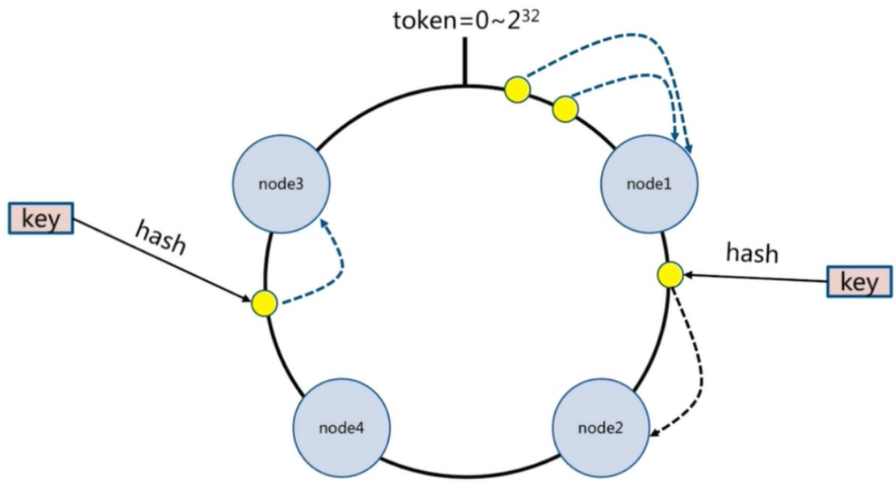


# 6.5 Redis 集群的数据分片

Redis 集群没有使用一致性hash, 而是引入了 哈希槽的概念.

预设虚拟槽，每个槽就相当于一个数字，有一定范围

Redis Cluster中预设虚拟槽的范围为0到16383

# 虚拟槽分配

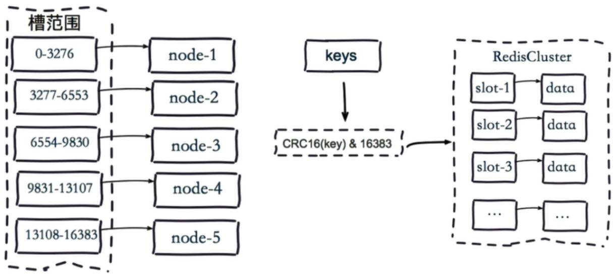


# 步骤：

1.把16384槽按照节点数量进行平均分配，由节点进行管理

2.对每个key按照CRC16规则进行hash运算

3.把hash结果对16383进行取余

4.把余数发送给Redis节点

5.节点接收到数据，验证是否在自己管理的槽编号的范围

如果在自己管理的槽编号范围内，则把数据保存到数据槽中，然后返回执行结果

如果在自己管理的槽编号范围外，则会把数据发送给正确的节点，由正确的节点来把数据保存在对应的槽中

需要注意的是：Redis Cluster的节点之间会共享消息，每个节点都会知道是哪个节点负责哪个范围内的数据槽

虚拟槽分布方式中，由于每个节点管理一部分数据槽，数据保存到数据槽中。当节点扩容或者缩容时，对数据槽进行重新分配迁移即可，数据不会丢失。

# 6.6 搭建Redis Cluster

# 步骤分析：

启动节点：将节点以集群方式启动，此时节点是独立的。

节点握手：将独立的节点连成网络。

槽指派：将16384个槽位分配给主节点，以达到分片保存数据库键值对的效果。

主从复制：为从节点指定主节点。

# 步骤实现

# 启动节点

# （1）新建目录，并拷贝出6个节点的配置文件

```txt
mkdir redis-cluster
mkdir 900{1,2,3,4,5,6} 
```

```txt
drwxr-xr-x 2 root root 94 Jul 20 20:21 9001
drwxr-xr-x 2 root root 32 Jul 20 20:10 9002
drwxr-xr-x 2 root root 32 Jul 20 20:11 9003
drwxr-xr-x 2 root root 32 Jul 20 20:11 9004
drwxr-xr-x 2 root root 32 Jul 20 20:14 9005
drwxr-xr-x 2 root root 32 Jul 20 20:19 9006 
```

（2）将redis.conf，依次拷贝到每个900X目录内，并修改每个900X目录下的redis.conf配置文件：

以集群方式启动

# cluster-enabled yes 将前面的 # 去掉

集群节点nodes信息配置文件（是自动生成的）

```txt
# cluster-config-file nodes-6379.conf 修改为 cluster-config-file "/usr/local/redis/cluster/nodes-9001.conf" # 对应各个端口
```

# （3）启动6个Redis实例

```shell
[root@10-9-31-145 cluster]# redis-server /usr/local/redis/cluster/9001/redis-cluster.conf --port 9001 
```

查看进程：

```tcl
root 173504 0.0 0.3 64508 12056 ? Ssl 20:07 0:01 redis-server 0.0.0.0:9001 [cluster]
root 174535 0.0 0.3 64508 11920 ? Ssl 20:08 0:01 redis-server 0.0.0.0:9002 [cluster]
root 185841 0.0 0.3 64508 11808 ? Ssl 20:11 0:01 redis-server 0.0.0.0:9003 [cluster]
root 187904 0.0 0.3 140288 11972 ? Ssl 20:12 0:01 redis-server 0.0.0.0:9004 [cluster]
root 197136 0.0 0.3 140288 12056 ? Ssl 20:14 0:01 redis-server 0.0.0.0:9005 [cluster]
root 201255 0.0 0.3 140288 11824 ? Ssl 20:15 0:01 redis-server 0.0.0.0:9006 [cluster] 
```

# 节点握手&槽指派&主从复制

redis5.0使用redis-cli作为创建集群的命令，使用c语言实现，不再使用ruby语言。

1）有了实例后，搭建集群非常简单，使用redis-cli一行命令即可

#replicas表示副本数，如果指定1则表示1个从库做备用

```batch
redis-cli --cluster create 127.0.0.1:9001 127.0.0.1:9002 127.0.0.1:9003 --cluster-replicas 1 
```

# 参数解释：

–cluster-replicas 1：表示希望为集群中的每个主节点创建一个从节点(一主一从)。

–cluster-replicas 2：表示希望为集群中的每个主节点创建两个从节点(一主二从)。

2）备注：如果节点上有数据，可能会有错误提示：

[ERR] Node 127.0.0.1:8004 is not empty. Either the node already knows other nodes (check with CLUSTER NODES) or contains some key in database 0. 

删除dump.rdb，nodes.conf，登录redis-cli，flushdb即可


3）如果没问题，将收到集群创建成功的消息：


```txt
>>> Nodes configuration updated
>>> Assign a different config epoch to each node
>>> Sending CLUSTER MEET messages to join the cluster
Waiting for the cluster to join
....
>>> Performing Cluster Check (using node 127.0.0.1:8081)
M: a085dd0366e08d4c03093ea24351ce4e12fcb69f 127.0.0.1:8081
slots:[0-5460] (5461 slots) master
M: 843d8da882f78d3cb09b1eb837140aefba309e06 127.0.0.1:8082
slots:[5461-10922] (5462 slots) master
M: 043d39422d93ef5c7c69e1c6cfb1557f655b5d72 127.0.0.1:8083
slots:[10923-16383] (5461 slots) master
[OK] All nodes agree about slots configuration.
>>> Check for open slots...
>>> Check slots coverage...
[OK] All 16384 slots covered. 
```

# 集群验证

用redis-cli在服务器上set多个值，比如czbk，分别在不同的实例上，分片成功！


1）cluster命令验证


```txt
#使用redis-cli登录任意节点，使用cluster nodes可以查看集群信息
127.0.0.1:9001> cluster nodes
39c613372129fe80fe93b6fb3070f9562c315a59 127.0.0.1:9001@18082 master - 0
1615193645000 2 connected 5461-10922
725c09c568cb4010afe84d5cb4672fff5a248879 127.0.0.1:9002@18083 master - 0
1615193645976 3 connected 10923-16383
9fad54e90628814c1b2a5b57c2ad22b92f0f7b05 127.0.0.1:9003@18081 myself,master - 0
1615193644000 1 connected 0-5460
```


2）使用key值和数据验证


```txt
#注意，redis-cli参数：
# -c：自动重定向到对应节点获取信息，如果不加，只会返回重定向信息，不会得到值
#不加 -c
[root@ src]# redis-cli -p 9001
127.0.0.1:9001> set a a
(error) MOVED 15495 127.0.0.1:8083
#加上 -c
[root@ src]# redis-cli -p 9001 -c
```

```txt
127.0.0.1:9001> set a a
-> Redirected to slot [15495] located at 127.0.0.1:9003 #自动跳到9003
OK
127.0.0.1:9003> get a #可以成功get到a的值
"a"
```

# 扩容

1）按上面方式，新起一个redis ， 9004端口

#第一个参数是新节点的地址，第二个参数是任意一个已经存在的节点的IP和端口

```batch
redis-cli --cluster add-node 127.0.0.1:9004 127.0.0.1:9001
redis-cli --cluster add-node 127.0.0.1:9098 127.0.0.1:9001 
```

2）使用redis-cli登录任意节点，使用cluster nodes查看新集群信息

```txt
127.0.0.1:9001> cluster nodes
#注意！新加进来的这个8084是空的，没有分配片段
eb49056da71858d58801f0f28b3d4a7b354956bc 127.0.0.1:9004@18084 master - 0
1602665893207 0 connected
16a3f8a4be9863e8c57d1bf5b3906444c1fe2578 127.0.0.1:9003@18082 master - 0
1602665891204 2 connected 5461-10922
214e4ca7ece0ceb08ad2566d84ff655fb4447e19 127.0.0.1:9002@18083 master - 0
1602665892000 3 connected 10923-16383
864c3f763ab7264ef0db8765997be0acf428cd60 127.0.0.1:9001@18081 myself,master - 0
1602665890000 1 connected 0-5460
```

3）重新分片

```batch
redis-cli --cluster reshard 127.0.0.1:9001
redis-cli --cluster reshard 127.0.0.1:9001 --cluster-from
10ac7df576168e7f6ec86b20b249e02b1fc13a25,43284b05c5a359b28507b49c29a49637f1f6312b,02a79c59682b7c05f13d41e46e814fc792fa2c50 --cluster-to
07e3416aba80cfb8a8ef81d27228559e5a9d6415 --cluster-slots 1024 
```

#根据提示一步步进行，再次查看node分片，可以了！

```csv
127.0.0.1:8081> cluster nodes
eb49056da71858d58801f0f28b3d4a7b354956bc 127.0.0.1:9004@18084 master - 0
1602666306047 4 connected 0-332 5461-5794 10923-11255
16a3f8a4be9863e8c57d1bf5b3906444c1fe2578 127.0.0.1:9003@18082 master - 0
1602666305045 2 connected 5795-10922
214e4ca7ece0ceb08ad2566d84ff655fb4447e19 127.0.0.1:9002@18083 master - 0
1602666305000 3 connected 11256-16383
864c3f763ab7264ef0db8765997be0acf428cd60 127.0.0.1:9001@18081 myself,master - 0
1602666303000 1 connected 333-5460 
```

4）平衡哈希槽

为了保证redis哈希槽的在每一个节点的均衡，需要对哈希槽进行均衡

# 第三篇章

* 分布式锁

* 布隆过滤器

* Twemproxy 

Redis Cluster 

* Redis经典面试题分享（redis6.x）

# 分布式锁

在并发编程中，我们通过锁，来避免由于竞争而造成的数据不一致问题。通常，我们以synchronized、Lock来使用它（单机情况）

# 高并发下单超卖问题

```java
@Autowired
RedisTemplate<String, String> redisTemplate;

String maotai = "maotai20210321001"; // 茅台商品编号

@PostMapping
public void init() {
    // 此处模拟向缓存中存入商品库存操作
    redisTemplate.opsForValue().set(maotai, "100");
}

@GetMapping("/get/maotai2")
public String seckillMaotai2() {
    synchronized (this) {
    Integer count =
    Integer.parseInt(redisTemplate.opsForValue().get(maotai)); // 1
    // 如果还有库存
    if (count > 0) {
    // 抢到了茅台，库存减一
    redisTemplate.opsForValue().set(maotai, String.valueOf(count-1));
    // 后续操作 do something
    log.info("我抢到茅台了！");
    return "ok";
    } else {
    return "no";
    }
}
```

# 问题分析：

现象：本地锁在多节点下失效(集群/分布式)

原因：本地锁它只能锁住本地JVM进程中的多个线程，对于多个JVM进程的不同线程间是锁不住的

解决：分布式锁（在分布式环境下提供锁服务，并且达到本地锁的效果）

# 何为分布式锁

当在分布式架构下，数据只有一份（或有限制），此时需要利用锁的技术控制某一时刻修改数据的进程数。

用一个状态值表示锁，对锁的占用和释放通过状态值来标识。

# 分布式锁特点

互斥性：不仅要在同一jvm进程下的不同线程间互斥，更要在不同jvm进程下的不同线程间互斥

锁超时：支持锁的自动释放，防止死锁

正确，高效，高可用：解铃还须系铃人（加锁和解锁必须是同一个线程），加锁和解锁操作一定要高效，提供锁的服务要具备容错性

可重入：如果一个线程拿到了锁之后继续去获取锁还能获取到，我们称锁是可重入的（方法的递归调用）

阻塞/非阻塞：如果获取不到直接返回视为非阻塞的，如果获取不到会等待锁的释放直到获取锁或者等待超时，视为阻塞的

公平/非公平：按照请求的顺序获取锁视为公平的

# 基于Redis实现分布式锁

# 实现思路：

锁的实现主要基于redis的SETNX命令：

SETNX key value 

将 key 的值设为 value ，当且仅当 key 不存在。

若给定的 key 已经存在，则 SETNX 不做任何动作。

SETNX 是『SET if Not eXists』(如果不存在，则 SET)的简写。

返回值：

设置成功，返回 1

设置失败，返回 0

使用SETNX完成同步锁的流程及事项如下：

1. 使用SETNX命令获取锁，若返回0（key已存在，锁已存在）则获取失败，反之获取成功

2. 为了防止获取锁后程序出现异常，导致其他线程/进程调用SETNX命令总是返回0而进入死锁状态，需要为该key设置一个“合理”的过期时间

3. 释放锁，使用DEL命令将锁数据删除


实现代码版本1：


```java
@GetMapping("/get/maotai3")
    public String seckillMaotai3() {

    //获取锁
    Boolean islock = redisTemplate.opsForValue().setIfAbsent(lockey, "1");
    if (islock) {
    //设置锁的过期时间
    redisTemplate.expire(lockey, 5, TimeUnit.SECONDS);
    try {
    Integer count =
    Integer.parseInt(redisTemplate.opsForValue().get(maotai)); // 1
    //如果还有库存
    if (count > 0) {
    //抢到了茅台，库存减一
    redisTemplate.opsForValue().set(maotai,String.valueOf(count-1));
    //后续操作 do something
    log.info("我抢到茅台了！");
    return "ok";
    } else {
    return "no";
    }
    } catch (Exception e) {
    e.printStackTrace();
    } finally {
    //释放锁
    redisTemplate.delete(lockey);
    }
    }
    return "dont get lock";
}
```

# 问题分析：

1. setnx 和 expire是非原子性操作（解决：2.6以前可用使用lua脚本，2.6以后可用set命令）

2.错误解锁（如何保证解铃还须系铃人：给锁加一个唯一标识）


错误解锁问题解决：


```groovy
@GetMapping("/get/maotai4")
    public String seckillMaotai4() {
    String requestid = UUID.randomUUID().toString() + Thread.currentThread().getId();
    /*String locklua = "" +
    "if redis.call('setnx',KEYS[1],ARGV[1]) == 1 then redis.call('expire',KEYS[1],ARGV[2]); return true " +
    "else return false " +
    "end";
    Boolean islock = redisTemplate.execute(new RedisCallback<Boolean>() {
    @Override
    }
} 
```

```java
public Boolean doInRedis(RedisConnection redisConnection) throws DataAccessException {
    Boolean eval = redisConnection.eval(
    locklua.getBytes(),
   ReturnType.BOOLLEAN,
    1,
    lockey.getBytes(),
    requestid.getBytes(),
    "5".getBytes()
    );
    return eval;
    }
    });*/ 
//获取锁
Boolean islock =
redisTemplate.opsForValue().setIfAbsent(locky,requestid,5, TimeUnit.SECONDS);
if (islock) {
    try {
    Integer count =
Integer.parseInt(redisTemplate.opsForValue().get(maotai)); // 1
    //如果还有库存
    if (count > 0) {
    //抢到了茅台，库存减一
    redisTemplate.opsForValue().set(maotai,String.valueOf(count-1));
    //后续操作 do something
    log.info("我抢到茅台了!");
    return "ok";
    }else {
    return "no";
    }
    } catch (Exception e) {
    e.printStackTrace();
    } finally {
    //释放锁
    //判断是自己的锁才能去释放 这种操作不是原子性的
    /*String id = redisTemplate.opsForValue().get(locky);
    if (id !=null && id.equals(requestid)) {
    redisTemplate.delete(locky);
    }*/
    String unlocklua = "" +
    "if redis.call('get',KEYS[1]) == ARGV[1] then
redis.call('del',KEYS[1]) ; return true " +
    "else return false " +
    "end";
    redisTemplate.execute(new RedisCallback<Boolean>() {
    @Override
    public Boolean doInRedis(RedisConnection redisConnection)
throws DataAccessException {
    Boolean eval = redisConnection.eval(
    unlocklua.getBytes(),
    ReturnType.BOOLLEAN,
    1,
    lockey.getBytes(),
    requestid.getBytes()
    );
    return eval;
    }
```

```javascript
});
}
return "dont get lock";
} 
```


锁续期/锁续命


```java
/**
 * 3,锁续期/锁续命
 * 拿到锁之后执行业务，业务的执行时间超过了锁的过期时间
 *
 * 如何做？
 * 给拿到锁的线程创建一个守护线程(看门狗)，守护线程定时/延迟 判断拿到锁的线程是否还继续持有锁，如果持有则为其续期
 *
 */
//模拟一下守护线程为其续期
ScheduledExecutorService executorService; //创建守护线程池
ConcurrentSkipListSet<String> set = new ConcurrentSkipListSet<String>(); //队列

@PostConstruct
public void init2(){
    executorService = Executors.newScheduledThreadPool(1);

    //编写续期的lua
    String expirrenew = "" +
    "if redis.call('get',KEYS[1]) == ARGV[1] then redis.call('expire',KEYS[1],ARGV[2]); return true " +
    "else return false " +
    "end";

    executorService.scheduleAtFixedRate(new Runnable() {
    @Override
    public void run() {
    Iterator<String> iterator = set.iterator();
    while (iterator.hasNext()) {
    String rquestid = iterator.next();

    redisTemplate.execute(new RedisCallback<Boolean>() {
    @Override
    public Boolean doInRedis(RedisConnection redisConnection) throws DataAccessException {
    Boolean eval = false;
    try {
    eval = redisConnection.eval(
    expirrenew.getBytes(),
    ReturnTypeDuration,
    1,
    lockkey.getBytes(),
    rquestid.getBytes(),
    "5".getBytes()
    );
    } catch (Exception e) {
```

```java
log.error("锁续期失败,{}",e.getMessage());
return eval;
});
},
},0,1,TimeUnit.SECONDS);
}

@GetMapping("/get/maotai5")
public String seckillMaotai5() {
    String requestid = UUID.randomUUID().toString() +
    Thread.currentThread().getId();
    //获取锁
    Boolean islock =
    redisTemplate.opsForValue().setIfAbsent(locky,requestid,5, TimeUnit.SECONDS);
    if (islock) {
    //获取锁成功后让守护线程为其续期
    set.add(requestid);
    try {
    Integer count =
    Integer.parseInt(redisTemplate.opsForValue().get(maotai)); // 1
    //如果还有库存
    if (count > 0) {
    //抢到了茅台，库存减一
    redisTemplate.opsForValue().set(maotai,String.valueOf(count-1));
    //后续操作 do something
    //seckillMaotai5();
    //模拟业务超时
    TimeUnit.SECONDS.sleep(10);
    log.info("我抢到茅台了！");
    return "ok";
    } else {
    return "no";
    }
    } catch (Exception e) {
    e.printStackTrace();
    } finally {
    //解除锁续期
    set.remove(requestid);
    //释放锁
    String unlocklua = "" +
    "if redis.call('get',KEYS[1]) == ARGV[1] then redis.call('del',KEYS[1]); return true " +
    "else return false " +
    "end";
    redisTemplate.execute(new RedisCallback<Boolean>() {
    @Override
    public Boolean doInRedis(RedisConnection redisConnection)
throws DataAccessException {
    Boolean eval = redisConnection.eval(
    unlocklua.getBytes(),
    ReturnTypeDuration,
    lockey.getBytes(),
```

```txt
requestid.getBytes()
    );
    return eval;
    }
    });
    }
    }
    return "dont get lock";
} 
```


锁的可重入/阻塞锁（redisson）


```java
/**
 * 4, 如何支持可重入
 * 重入次数/过期时间
 * 获取
 * 获取
 * 获取
 * 释放
 * 释放
 * 释放
 *
 * 基于本地实现
 * 还是基于redis但是更换了数据类型，采用hash类型来实现
 * key field value
 * 锁key 请求id 重入次数
 * 用lua实现
 *
 *
 * 5, 阻塞/非阻塞的问题：现在的锁是非阻塞的，一旦获取不到锁直接返回了
 * 如何做一个阻塞锁呢？
 * 获取不到就等待锁的释放，直到获取到锁或者等待超时
 * 1: 基于客户端轮询的方案
 * 2: 基于redis的发布/订阅方案
 *
 *
 * 有没有好的实现呢？
 * Redisson
 *
 */
@value("${spring.redis.host}")
String host;
@value "${spring.redis.port}")
String port;

@Bean
public RedissonClient redissonClient() {
    Config config = new Config();
    config.useSingleServer(). Corporate("redis://"+host+":"+port);
    return Redisson.create(config);
}

@Autowired
```

```java
RedissonClient redissonClient;

@GetMapping("/get/maotai6")
public String seckillMaotai6() {
    //要去获取锁
    RLock lock = redissonClient.getLock(lock);
    lock.lock();
    try {
    Integer count =
    Integer.parseInt(redisTemplate.opsForValue().get(maotai)); // 1
    //如果还有库存
    if (count > 0) {
    //抢到了茅台，库存减一
    redisTemplate.opsForValue().set(maotai,String.valueOf(count-1));
    //后续操作 do something
    log.info("我抢到茅台了！");
    return "ok";
    }else {
    return "no";
    }
    } catch (Exception e) {
    e.printStackTrace();
    } finally {
    lock.unlock();
    }
    return "";
}
```

# redisson

# 概述

Redisson内置了一系列的分布式对象，分布式集合，分布式锁，分布式服务等诸多功能特性，是一款基于Redis实现，拥有一系列分布式系统功能特性的工具包，是实现分布式系统架构中缓存中间件的最佳选择。

下载地址：https://github.com/redisson/redisson

# 实现

```xml
<dependency>
    <groupId>org.redis</groupId>
    <artifactId>redisson</artifactId>
    <version>3.8.2</version>
</dependency> 
```

```java
@Bean
public RedissonClient redissonClient() {
    Config config = new Config();
    config.useSingleServer(). Corporate("redis://"+host+":"+port);
} 
```

```java
return Redisson.create(config);
}

@Autowired
RedissonClient redissonClient;

@GetMapping("/get/maotai6")
public String seckillMaotai6() {
    //要去获取锁
    RLock lock = redissonClient.getLock(locky);
    lock.lock();
    try {
    Integer count =
    Integer.parseInt(redisTemplate.opsForValue().get(maotai)); // 1
    //如果还有库存
    if (count > 0) {
    //抢到了茅台，库存减一
    redisTemplate.opsForValue().set(maotai,String.valueOf(count-1));
    //后续操作 do something
    log.info("我抢到茅台了！");
    return "ok";
    } else {
    return "no";
    }
    } catch (Exception e) {
    e.printStackTrace();
    } finally {
    lock.unlock();
    }
    return "";
}
```

# 源码剖析

1,加锁的（是否支持重入）

2，锁续期的

3，阻塞获取

4，释放

```java
/**
 * 源码如下:
 * 1, 加锁
 * <T> RFuture<T> tryLockInnerAsync(long leaseTime, TimeUnit unit, long threadId, RedisStrictCommand<T> command) {
 *    internalLockLeaseTime = unit.toMillis(leaseTime);
 *
 *    return commandExecutor.evalWriteAsync(getName(),
    LongCodec.INSTANCE, command,
 *    #如果锁key不存在
 *    "if (redis.call('exists', KEYS[1]) == 0) then " +
 *    #设置锁key, field是唯一标识,value是重入次数
 *    "redis.call('hset', KEYS[1], ARGV[2], 1); " +
 *    #设置锁key的过期时间 默认30s
```

```java
*    "redis.call('pexpire', KEYS[1], ARGV[1]); " +
*    "return nil; " +
*    "end; " +
*    #如果锁key存在
*    "if (redis.call('hexists', KEYS[1], ARGV[2]) == 1) then
" +
*    #重入次数+1
*    "redis.call('hincrby', KEYS[1], ARGV[2], 1); " +
*    #重置过期时间
*    "redis.call('pexpire', KEYS[1], ARGV[1]); " +
*    "return nil; " +
*    "end; " +
*    "return redis.call('pttl', KEYS[1]);",
*    Collections.<Object>singletonList(getName()), internalLockLeaseTime, getLockName(threadId));
*    }
*
* 2，锁续期
* private void scheduleExpirationRenewal(final long threadId) {
*    if (expirationRenewalMap.containsKey(getEntryName())) {
*    return;
*    }
*
* Timeout task =
commandExecutor.getConnectionManager().newTimeout(new TimerTask() {
*    @Override
* public void run(Timeout timeout) throws Exception {
*    //续期函数的真正实现
*    RFuture<Boolean> future = renewExpirationAsync(threadId);
*    future.addListener(new FutureListener<Boolean>() {
*    @Override
* public void operationComplete(Future<Boolean> future)
throws Exception {
*    expirationRenewalMap.remove(getEntryName());
*    if (!future.isSuccess()) {
*    log.error("Can't update lock " + getName() + "
expiration", future.cause());
*    return;
*    }
*
*    if (futureilon()) {
*    // reschedule itself 再次调用自己，最终形成的结果
就是每隔10秒续期一次
*    scheduleExpirationRenewal(threadId);
*    }
*    }
*    });
*    }
*    // internalLockLeaseTime=30 * 1000 即30秒
*    }, internalLockLeaseTime / 3, TimeUnit.MILLISECONDS); //30/3=10秒
后异步执行续期函数
*
*    if (expirationRenewalMap.putIfAbsent(getEntryName(), new
ExpirationEntry(threadId, task)) != null) {
*    task.cancel();
*    }
* }
```

```java
* 续期的lua脚本:判断key, field存在则重置过期时间
* protected RFuture<Boolean> renewExpirationAsync(long threadId) {
*    return commandExecutor.evalWriteAsync(getName(),
LongCodec.INSTANCE, RedisCommands.EVALringLEAN,
*    "if (redis.call('hexists', KEYS[1], ARGV[2]) == 1) then "
+ 
*    "redis.call('pexpire', KEYS[1], ARGV[1]); " +
*    "return 1; " +
*    "end; " +
*    "return 0;",
*    Collections.<Object>singletonList(getName()), internalLockLeaseTime, getLockName(threadId));
*    }
* 
* 
* 
* 
* 
* 
* 
* 
* 
* 
* 
* 
* 
* 
* 
* 
* 
* 
* 
* 
* 
* 
* 
* 
* 
* 
* 
* 
* 
* 
* 
* 
* 
* 
* 
* 
* 
* 
* 
* 
* 
* 
* 
* 
* 
* 
* 
* 
* 
* 
* 

* public void lockInterruptibly(long leaseTime, TimeUnit unit) throws InterruptedException {
*    long threadId = Thread.currentThread().getId();
*    Long ttl = tryAcquire(leaseTime, unit, threadId);
*    // lock acquired
*    if (ttl == null) {
*    return;
*    }
*    //如果没有获取到锁，则订阅：redisson_lock_channel:{key}频道
*    RFuture<RedissonLockEntry> future = subscribe(threadId);
*    commandExecutor.syncSubscription(future);
* 
*    try {
*    while (true) {
*    //尝试再获取一次
*    ttl = tryAcquire(leaseTime, unit, threadId);
*    // lock acquired
*    if (ttl == null) {
*    break;
*    }
* 
*    // waiting for message 阻塞等待锁订阅频道的消息，一旦锁被释放，就会得到信号通知，继续尝试获取锁
*    if (ttl >= 0) {
*    getEntry(threadId).getLatch().tryAcquire(ttl, TimeUnit.MILLISECONDS);
*    } else {
*    getEntry(threadId).getLatch().acquire();
*    }
*    }
*    } finally {
*    //获取到锁后取消订阅
*    unsubscribe(future, threadId);
*    }
*    //    get(lockAsync(leaseTime, unit));
*    }
* 
* 
* 
* 5，解锁
* protected RFuture<Boolean> unlockInnerAsync(long threadId) {
```

```javascript
* return commandExecutor.evalWriteAsync(getName(),
    LongCodec.INSTANCE, RedisCommands.EVAL_BOOL,
    *    //key已经不存在了，则向redisson_lock_channel:{key}频道发布锁释放消息
    *    "if (redis.call('exists', KEYS[1]) == 0) then " +
    *    "redis.call('publish', KEYS[2], ARGV[1]); " +
    *    "return 1; " +
    *    "end;" +
    *    // hash 中的field 不存在时直接返回，
    *    "if (redis.call('hexists', KEYS[1], ARGV[3]) == 0) then "
+    *
    *    "return nil;" +
    *    "end; " +
    *    "local counter = redis.call('hincrby', KEYS[1], ARGV[3],
-1); " +
    *    //重入次数-1后如果还大于0，延长过期时间
    *    "if (counter > 0) then " +
    *    "redis.call('pexpire', KEYS[1], ARGV[2]); " +
    *    "return 0; " +
    *    "else " +
    *    //重入次数-1后如果归0，则删除key，并向redisson_lock_channel:
{key}频道发布锁释放消息
    *    "redis.call('del', KEYS[1]); " +
    *    "redis.call('publish', KEYS[2], ARGV[1]); " +
    *    "return 1; " +
    *    "end; " +
    *    "return nil;"
    *    Arrays.<Object>asList(getName(), getChannelName()), LockPubSub.unlockMessage, internalLockLeaseTime, getLockName(threadId));
    *
    *    }
*/
```

# 布隆过滤器（BloomFilter）

引言：

问题1：什么是Redis缓存穿透？缓存穿透如何解决？

问题2：如何在海量元素中（例如 10 亿无序、不定长、不重复）快速判断一个元素是否存在？

# 什么是 BloomFilter

布隆过滤器（英语：Bloom Filter）是 1970 年由Burton Howard Bloom提出的，是一种空间效率高的概率型数据结构。

本质上其实就是一个很长的二进制向量和一系列随机映射函数。专门用来检测集合中是否存在特定的元素

# 产生的契机

回想一下，我们平常在检测集合中是否存在某元素时，都会采用比较的方法。考虑以下情况：

如果集合用线性表存储，查找的时间复杂度为O(n)。

如果用平衡BST（如AVL树、红黑树）存储，时间复杂度为O(logn)。

如果用哈希表存储，并用链地址法与平衡BST解决哈希冲突（参考JDK8的HashMap实现方法），时间复杂度也要有O[log(n/m)]，m为哈希分桶数。

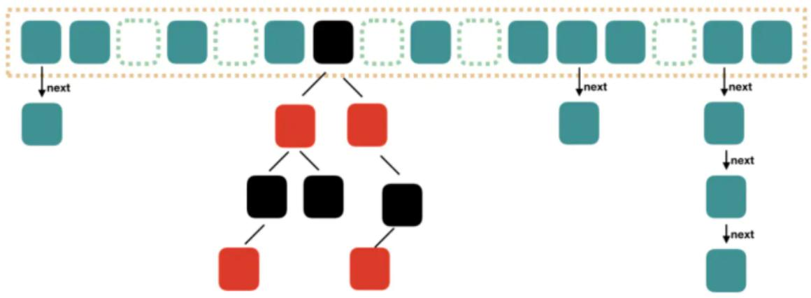


总而言之，当集合中元素的数量极多时，不仅查找会变得很慢，而且占用的空间也会大到无法想象。BF就是解决这个矛盾的利器。

# 数据结构&设计思想

BF是由一个长度为m比特的位数组（bit array）与k个哈希函数（hash function）组成的数据结构。位数组均初始化为0，所有哈希函数都可以分别把输入数据尽量均匀地散列。

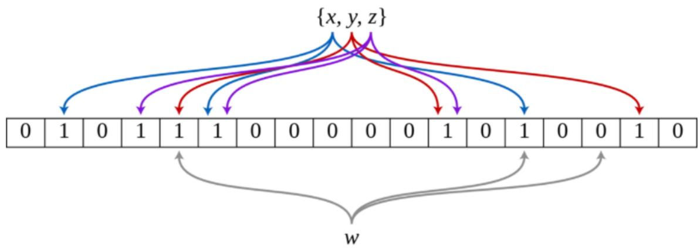


基于BitMap:

<table><tr><td>0</td><td>0</td><td>0</td><td>0</td><td>0</td><td>0</td><td>0</td><td>0</td></tr></table>

<table><tr><td>1</td><td>2</td><td>3</td><td>4</td><td>5</td><td>6</td><td>7</td><td>8</td></tr></table>

如果我们要映射一个值到布隆过滤器中，我们需要使用多个不同的哈希函数生成多个哈希值，并对每个生成的哈希值指向的 bit 位，设置为1

例：

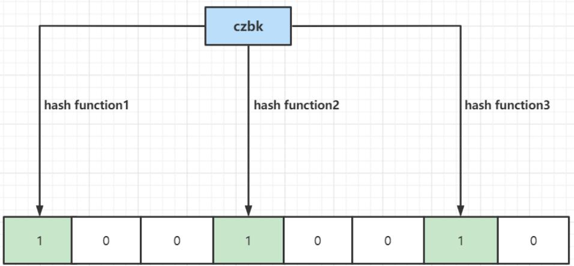


5 

8 

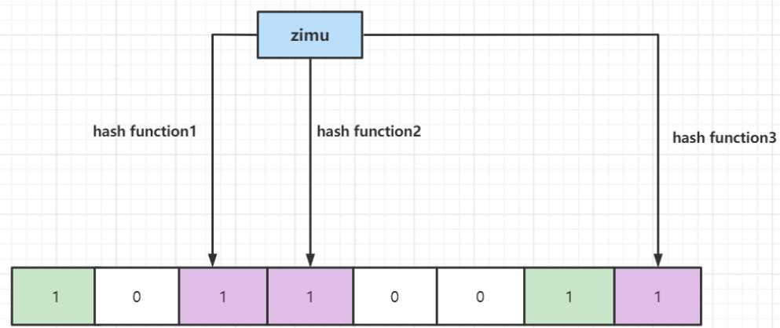


5 

8 

当要插入一个元素时，将其数据分别输入k个哈希函数，产生k个哈希值。以哈希值作为位数组中的下标，将所有k个对应的比特置为1。

当要查询（即判断是否存在）一个元素时，同样将其数据输入哈希函数，然后检查对应的k个比特。如果有任意一个比特为0，表明该元素一定不在集合中。如果所有比特均为1，表明该集合有（较大的）可能性在集合中。为什么不是一定在集合中呢？因为一个比特被置为1有可能会受到其他元素的影响，这就是所谓“假阳性”（false positive）。相对地，“假阴性”（false negative）在BF中是绝不会出现的。

如果这些点有任何一个 0，则被检索元素一定不在；

如果都是 1，则被检索元素很可能在。

# 误判率问题分析

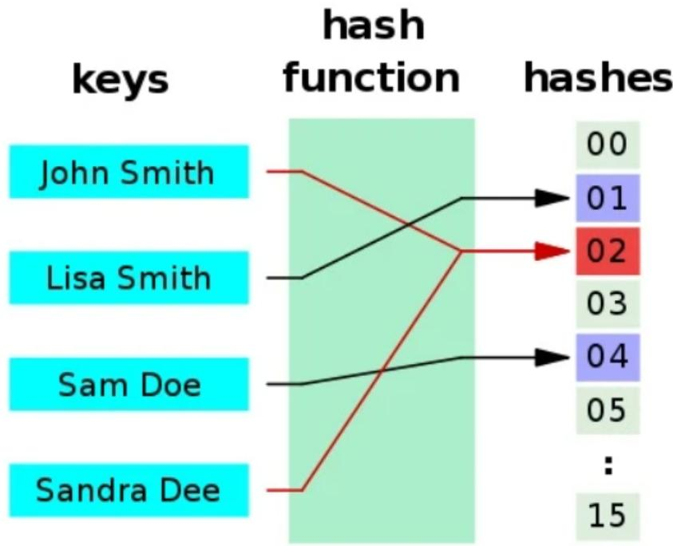


哈希函数有以下两个特点：

如果两个散列值是不相同的（根据同一函数），那么这两个散列值的原始输入也是不相同的。

散列函数的输入和输出不是唯一对应关系的，如果两个散列值相同，两个输入值很可能是相同的。但也可能不同，这种情况称为 “散列碰撞”（或者 “散列冲突”）

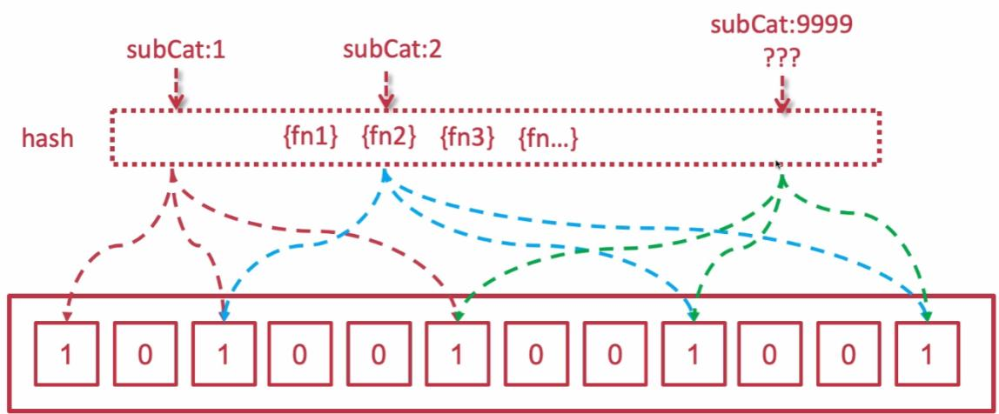


布隆过滤器的误判是指多个输入经过哈希之后在相同的bit位置1了，这样就无法判断究竟是哪个输入产生的，因此误判的根源在于相同的 bit 位被多次映射且置 1。

# 不支持删除

hash碰撞这种情况也造成了布隆过滤器的删除问题，传统的布隆过滤器并不支持删除操作，因为布隆过滤器的每一个 bit 并不是独占的，很有可能多个元素共享了某一位。如果我们直接删除这一位的话，会影响其他的元素。

# 如何选择哈希函数个数和布隆过滤器长度

很显然，过小的布隆过滤器很快所有的 bit 位均为 1，那么查询任何值都会返回“可能存在”，起不到过滤的目的了。布隆过滤器的长度会直接影响误报率，布隆过滤器越长其误报率越小。

另外，哈希函数的个数也需要权衡，个数越多则布隆过滤器 bit 位置位 1 的速度越快，且布隆过滤器的效率越低；但是如果太少的话，那我们的误报率会变高。

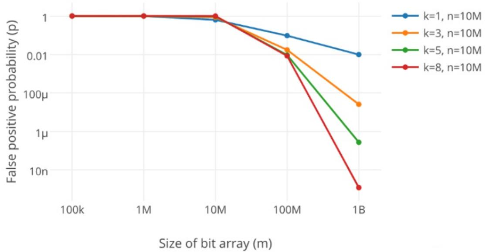


如何选择适合业务的 k 和 m 值呢，这里直接贴一个公式：

$$
m = - \frac {n \ln p}{(\ln 2) ^ {2}}
$$

$$
k = \frac {m}{n} \ln 2
$$

# 布隆过滤器实现

# 第一种方式： Guava

1、引入Guava pom配置

```xml
<dependency>
    <groupId>com.google.guava</groupId>
    <artifactId>guava</artifactId>
    <version>29.0-jre</version>
</dependency> 
```

2、代码实现

```java
public class BloomFilterTest {

@Test
    public void test1() {
    BloomFilter<Integer> bloomFilter =
    BloomFilter.create(Funnels.integerFunnel(), size, fpp);
    // 插入10万样本数据
    for (int i = 0; i < size; i++) {
    bloomFilter.put(i);
    }

    // 用另外十万测试数据，测试误判率
    int count = 0;
    for (int i = capacity; i < size + 100000; i++) {
    if (bloomFilter.mightContain(i)) {
    count++;
    System.out.println(i + "误判了");
    }
    }
    System.out.println("总共的误判数：" + count);
    }
}
```

运行结果：

1099971误判了

总共的误判数：947

10万数据里有947个误判，约等于0.01%，也就是代码里设置的误判率：fpp = 0.01

代码分析：

核心 BloomFilter.create 方法：

```txt
@VisibleForTesting
static <T> BloomFilter<T> create(
    Funnel<? super T> funnel, long expectedInsertions, double fpp, Strategy strategy) {
    ......
} 
```

# 这里有四个参数：

funnel ：数据类型(通常是调用Funnels工具类中的)

expectedInsertions ：指望插入的值的个数

fpp ：误判率(默认值为0.03)

strategy ：哈希算法

咱们重点讲一下fpp参数

# fpp误判率

情景一： fpp = 0.01

误判个数：947 占内存大小：9585058位数

情景二： fpp = 0.03 （默认参数）

误判个数：3033 占内存大小：7298440位数

. 

# 总结

误判率能够经过fpp参数进行调节

fpp越小，须要的内存空间就越大：0.01须要900多万位数，0.03须要700多万位数。

fpp越小，集合添加数据时，就须要更多的hash函数运算更多的hash值，去存储到对应的数组下标里。（忘了去看上面的布隆过滤存入数据的过程）

# 第二种方式：Redisson

上面使用Guava实现的布隆过滤器是把数据放在了本地内存中。分布式的场景中就不合适了，没法共享内存

还能够用Redis来实现布隆过滤器，这里使用Redis封装好的客户端工具Redisson


pom配置：


```xml
<dependency>
    <groupId>org.redis</groupId>
    <artifactId>redisson-spring-boot-starter</artifactId>
    <version>3.13.4</version>
</dependency> 
```


java代码：


```java
public class RedissonBloomFilter {

    public static void main(String[] args) {
    Config config = new Config();
    config.useSingleServer(). Corporate("redis://127.0.0.1:6379");
    config.useSingleServer(). Corporate("1234");
    //构造Redisson
    RedissonClient redisson = Redisson.create(config);

    RBloomFilter<String> bloomFilter = redisson.getBloomFilter("phoneList");
    //初始化布隆过滤器：预计元素为100000000L，偏差率为3%
    bloomFilter.tryInit(100000000L, 0.03);
    //将号码10086插入到布隆过滤器中
    bloomFilter.add("10086");

    //判断下面号码是否在布隆过滤器中
    //输出false
    System.out.println(bloomFilter.contains("123456"));
    //输出true
    System.out.println(bloomFilter.contains("10086"));
    }
}
```

# Twemproxy

# 1.1.1 简介

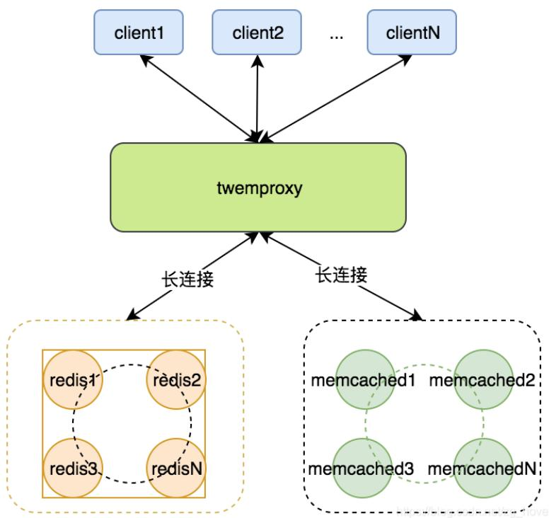


cluster是redis官方提供的集群方案，功能确实强大(在线扩容，缩容等等)，除了官方的cluster，业界有很多三方的缓存代理中间件，比如： predixy， codis， redis-cerberus，squirrel ，cellar act。Twemproxy是使用最广泛、同时也是redis官方所认可的实现方案。

Twemproxy（又称为nutcracker）由Twitter开源。是一个轻量级的Redis和Memcached代理，主要用来减少对后端缓存服务器的连接数。

特点：

memcached时代可以称王称霸，但随着redis自身发展，尤其高版本cluster出现，已逐渐被弱化

优点：

简单可靠，具备生产级别应用能力

减少了redis连接数，降低redis连接成本，cluster的所有节点之间都需要互相建立连接。

除了redis，Twemproxy可以对Memcached 协议做代理，在缓存界是个通用性的解决方案。

缺点：

和cluster相比，性能有一定的损失（twitter测试约20%）

自身也会成为一个单点，所以，做双活很重要！

它只是一个代理转发，底层的主从切换等依然靠redis自身的主从和哨兵或cluster。这一点上cluster已经完虐它

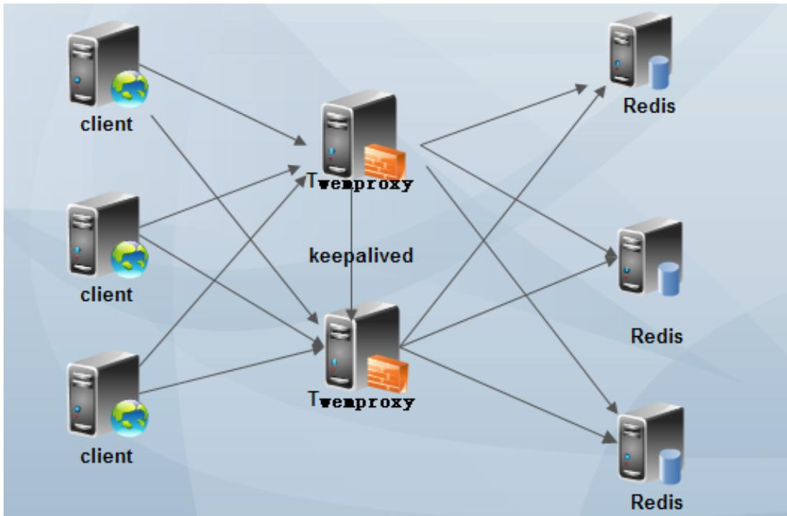


# 1.1.2 下载与部署

```shell
yum install -y autoconf automake libtool
yum remove -y autoconf 
```

```txt
export twemproxy_path=/opt/redis/latest/twemproxy/ 
```

```txt
mkdir -p $twemproxy_path 
```

```batch
cd $twemproxy_path 
```

```txt
wget ftp://ftp.gnu.org/gnu/autoconf/autoconf-2.69.tar.gz 
```

```batch
tar -zxvf autoconf-2.69.tar.gz 
```

```txt
cd autoconf-2.69 
```

```batch
.configure --prefix=/usr 
```

```txt
make && make install 
```

```batch
cd $twemproxy_path 
```

```txt
wget http://ftp.gnu.org/gnu/automake/automake-1.14.tar.gz 
```

```txt
tar -zxvf automake-1.14.tar.gz 
```

```batch
cd automake-1.14 
```

```txt
.bootstrap.sh 
```

```batch
.configure --prefix=/usr 
```

```txt
make && make install 
```

```batch
cd $twemproxy_path 
```

```txt
wget http://ftp.gnu.org/gnu/libtool/libtool-2.4.2.tar.gz 
```

```txt
tar -zxvf libtool-2.4.2.tar.gz 
```

```txt
cd libtool-2.4.2 
```

```batch
.configure --prefix=/usr 
```

```shell
make && make install
cd $twemproxy_path
wget https://github.com/twitter/twemproxy/archive/v0.4.1.tar.gz
tar -zxvf v0.4.1.tar.gz
cd twemproxy-0.4.1
.configure --prefix=/usr
make && make install
#编译完，启动文件在src目录中。
```

# 1.1.3 配置与启动


1）先准备好两台redis


```txt
#将redis.conf拷贝一份，注意以下配置项
#后台启动
daemonize yes
#bind这一行一定要注释掉！允许外部ip连接，否则将来用redis-cli连接操作命令的时候会报一个错误：
#Error: Connection reset by peer
#bind 127.0.0.1 -::1
#启动两个实例，在8081和8082端口
[root@iz8vb3a9qxofwannyywl6zz twemproxy]# pwd
/opt/redis/latest/twemproxy
[root@iz8vb3a9qxofwannyywl6zz twemproxy]# ..src/redis-server redis.conf --port 8081
[root@iz8vb3a9qxofwannyywl6zz twemproxy]# ..src/redis-server redis.conf --port 8082
```


#确认服务启动成功


```txt
[root@iz8vb3a9qxofwannyywl6zz twemproxy]# ps aux | grep redis-server
root 18209 0.1 0.0 162492 2680 ? ssl 13:35 0:00 ..src/redis-server 127.0.0.1:8081
root 18217 0.0 0.0 162492 2688 ? ssl 13:35 0:00 ..src/redis-server 127.0.0.1:8082 
```


2）配置twemproxy


```txt
#将yml文件拷贝一份，test.yml，并修改内容为自己的redis地址
[root@iz8vb3a9qxofwannyywl6zz conf]# pwd
/opt/redis/latest/twemproxy/twemproxy-0.4.1/conf
[root@iz8vb3a9qxofwannyywl6zz conf]# cp nutcracker.yml test.yml
```


#test.yml文件说明


```yaml
alpha: #标记，如果多组，就alpha，beta.....往上加，参考 nutcracker.yml 样本
listen: 127.0.0.1:22121 # 这组集群暴露的端口，将来连这个
hash: fnv1a_64 #hash散列算法
distribution: modulo #分片算法，这里用取模方式，一共三种，后面详细介绍
```

auto_eject_hosts: true #自动摘除故障节点

redis: true #是不是redis，false则表示memcache

server_retry_timeout: 2000 #每隔2秒判断故障节点是否正常，如果正常则放回一致性hash环

server_failure_limit: 3 #多少次无响应，就从一致性hash环中摘除

#redis实例列表，一定要加别名，否则宕机后更换机器，分片就不一样了

#加了别名后，将用别名做分片节点名，否则用ip加端口权重，一旦ip变更会重新迁移

servers: 

```txt
- 127.0.0.1:8081:1 redis-1
- 127.0.0.1:8082:1 redis-2 
```

#启动：-d后台启动，-c指定启动文件

```txt
[root@iz8vb3a9qxofwannyywl6zz conf]# ..src/nutcracker -d -c test.yml
[root@iz8vb3a9qxofwannyywl6zz conf]# ps aux | grep nutcracker
root 14601 0.0 0.0 1136 248 pts/0 Ssl+ 09:25 0:00
/usr/sbin/nutcracker -c /opt/nutcracker.yml 
```

# 3）连接与验证

#连接非常的简单，用redis-cli和直连redis一样

#首先在twemproxy上设置多个key，均成功

```txt
[root@iz8vb3a9qxofwannyywl6zz ~]# redis-cli -p 22121
127.0.0.1:22121> set a a
OK
127.0.0.1:22121> set b b
OK
127.0.0.1:22121> set c c
OK
127.0.0.1:22121> set d d
OK 
```

#先连redis-1 ， 取到ac， bd取不到

```txt
[root@iz8vb3a9qxofwannyywl6zz ~]# redis-cli -p 8081
127.0.0.1:8081> get a
"a"
127.0.0.1:8081> get b
(nil)
127.0.0.1:8081> get c
"c"
127.0.0.1:8081> get d
(nil)
127.0.0.1:8081> 
```

#再连redis-2 ， 发现ac不存在，bd在这里，验证集群分片成功！

```txt
[root@iz8vb3a9qxofwannyywl6zz ~]# redis-cli -p 8082
127.0.0.1:8082> get a
(nil)
127.0.0.1:8082> get b
"b"
127.0.0.1:8082> get c
(nil)
127.0.0.1:8082> get d
"d" 
```

# 1.1.4 分片策略

# 1）读写原理

写入时，twemproxy将多个对应的key计算hash值路由到对应的后端redis机器。

而要在redis集群中查询对应的key/value时，twemproxy同样计算hash值从对应的后端redis收集过来，然后拼接起来返回给用户。

# 2）策略

后台的redis或memcached集群可以通过以下几种算法进行key/value的分配（distribution属性）：

ketama: 一个实现一致性hash算法的开源库

modula: 通过取模的hash算法来选择一个节点

random：随机选择一个节点

# Redis Cluster

# 引言

# 主从 + 哨兵 问题分析

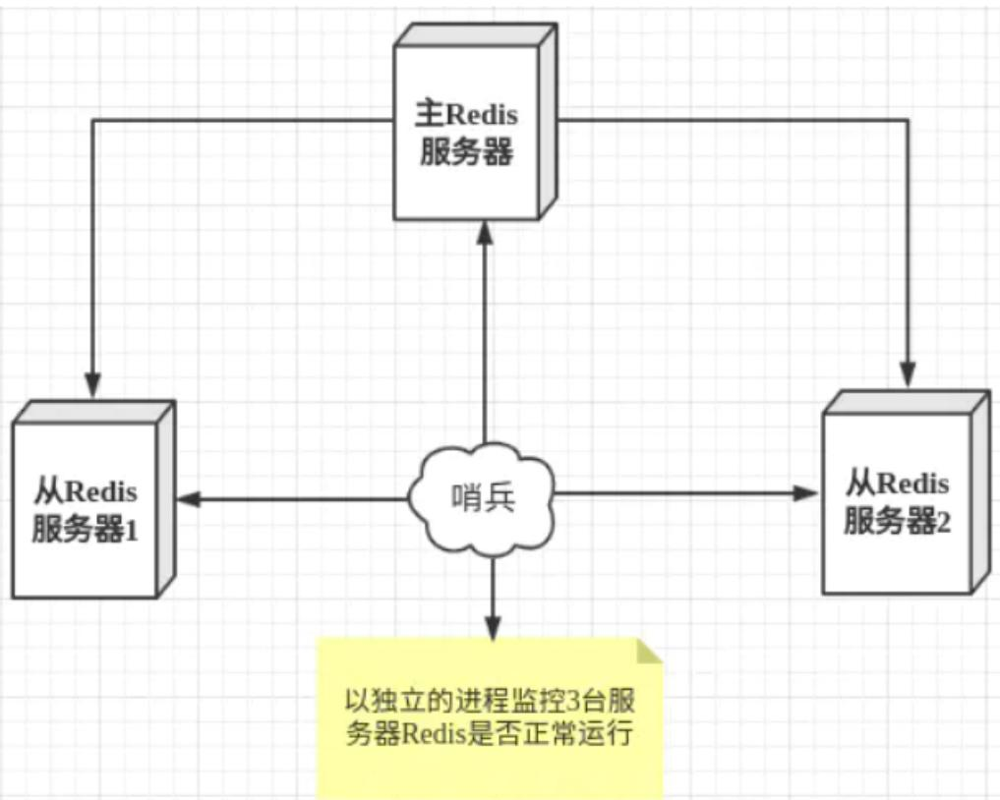


（1）在主从 + 哨兵模式中，仍然只有一个Master节点。当并发写请求较大时，哨兵模式并不能缓解写压力

（2） 在Redis Sentinel模式中，每个节点需要保存全量数据，冗余比较多

# Cluster概念

从3.0版本之后，官方推出了Redis Cluster，它的主要用途是实现数据分片(Data Sharding)，不过同样可以实现HA，是官方当前推荐的方案。


1.Redis-Cluster采用无中心结构

2.只有当集群中的大多数节点同时fail整个集群才fail。

3.整个集群有16384个slot，当需要在 Redis 集群中放置一个 key-value 时，根据 CRC16(key) mod16384的值，决定将一个key放到哪个桶中。读取一个key时也是相同的算法。

4.当主节点fail时从节点会升级为主节点，fail的主节点online之后自动变成了从节点

# 故障转移

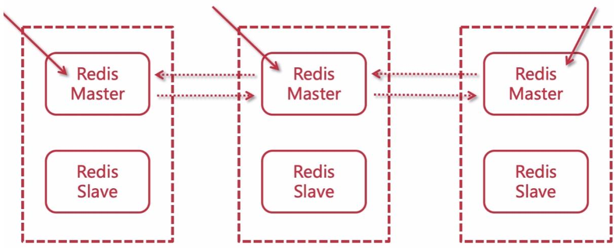


Redis集群的主节点内置了类似Redis Sentinel的节点故障检测和自动故障转移功能，当集群中的某个主节点下线时，集群中的其他在线主节点会注意到这一点，并对已下线的主节点进行故障转移。

# 集群分片策略

Redis-cluster分片策略，是用来解决key存储位置的

常见的数据分布的方式：顺序分布、哈希分布、节点取余哈希、一致性哈希..


一致性哈希


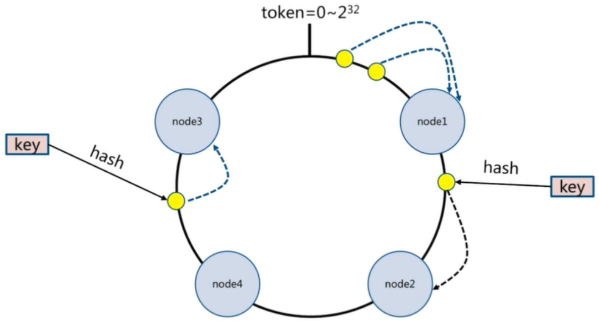


# Redis 集群的数据分片

Redis 集群没有使用一致性hash, 而是引入了 哈希槽的概念.

预设虚拟槽，每个槽就相当于一个数字，有一定范围

Redis Cluster中预设虚拟槽的范围为0到16383


虚拟槽分配


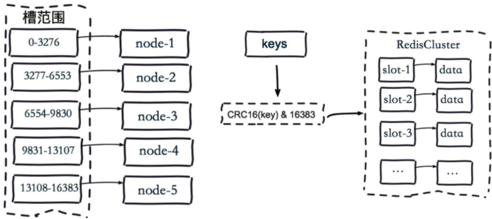


步骤：

1.把16384槽按照节点数量进行平均分配，由节点进行管理

2.对每个key按照CRC16规则进行hash运算

3.把hash结果对16383进行取余

4.把余数发送给Redis节点

5.节点接收到数据，验证是否在自己管理的槽编号的范围

如果在自己管理的槽编号范围内，则把数据保存到数据槽中，然后返回执行结果

如果在自己管理的槽编号范围外，则会把数据发送给正确的节点，由正确的节点来把数据保存在对应的槽中

需要注意的是：Redis Cluster的节点之间会共享消息，每个节点都会知道是哪个节点负责哪个范围内的数据槽

虚拟槽分布方式中，由于每个节点管理一部分数据槽，数据保存到数据槽中。当节点扩容或者缩容时，对数据槽进行重新分配迁移即可，数据不会丢失。

# 搭建Redis Cluster

# 步骤分析：

启动节点：将节点以集群方式启动，此时节点是独立的。

节点握手：将独立的节点连成网络。

槽指派：将16384个槽位分配给主节点，以达到分片保存数据库键值对的效果。

主从复制：为从节点指定主节点。

# 步骤实现

# 启动节点


（1）新建目录，并拷贝出6个节点的配置文件


```txt
mkdir redis-cluster
mkdir 900{1,2,3,4,5,6} 
```

```txt
drwxr-xr-x 2 root root 94 Jul 20 20:21 9001
drwxr-xr-x 2 root root 32 Jul 20 20:10 9002
drwxr-xr-x 2 root root 32 Jul 20 20:11 9003
drwxr-xr-x 2 root root 32 Jul 20 20:11 9004
drwxr-xr-x 2 root root 32 Jul 20 20:14 9005
drwxr-xr-x 2 root root 32 Jul 20 20:19 9006 
```

（2）将redis.conf，依次拷贝到每个900X目录内，并修改每个900X目录下的redis.conf配置文件：

以集群方式启动

# cluster-enabled yes 将前面的 # 去掉

集群节点nodes信息配置文件（是自动生成的）

# cluster-config-file nodes-6379.conf 修改为 cluster-config-file

"/usr/local/redis/cluster/nodes-9001.conf" # 对应各个端口

（3）启动6个Redis实例

查看进程：

<table><tr><td>root</td><td>173504</td><td>0.0</td><td>0.3</td><td>64508</td><td>12056</td><td>?</td><td>Ssl</td><td>20:07</td><td>0:01</td><td>redis-server</td><td>0.0.0.0:9001</td><td>[cluster]</td></tr><tr><td>root</td><td>174535</td><td>0.0</td><td>0.3</td><td>64508</td><td>11920</td><td>?</td><td>Ssl</td><td>20:08</td><td>0:01</td><td>redis-server</td><td>0.0.0.0:9002</td><td>[cluster]</td></tr><tr><td>root</td><td>185841</td><td>0.0</td><td>0.3</td><td>64508</td><td>11808</td><td>?</td><td>Ssl</td><td>20:11</td><td>0:01</td><td>redis-server</td><td>0.0.0.0:9003</td><td>[cluster]</td></tr><tr><td>root</td><td>187904</td><td>0.0</td><td>0.3</td><td>140288</td><td>11972</td><td>?</td><td>Ssl</td><td>20:12</td><td>0:01</td><td>redis-server</td><td>0.0.0.0:9004</td><td>[cluster]</td></tr><tr><td>root</td><td>197136</td><td>0.0</td><td>0.3</td><td>140288</td><td>12056</td><td>?</td><td>Ssl</td><td>20:14</td><td>0:01</td><td>redis-server</td><td>0.0.0.0:9005</td><td>[cluster]</td></tr><tr><td>root</td><td>201255</td><td>0.0</td><td>0.3</td><td>140288</td><td>11824</td><td>?</td><td>Ssl</td><td>20:15</td><td>0:01</td><td>redis-server</td><td>0.0.0.0:9006</td><td>[cluster]</td></tr></table>

# 节点握手&槽指派&主从复制

redis5.0使用redis-cli作为创建集群的命令，使用c语言实现，不再使用ruby语言。

1）有了实例后，搭建集群非常简单，使用redis-cli一行命令即可

#replicas表示副本数，如果指定1则表示1个从库做备用

```batch
redis-cli --cluster create 127.0.0.1:9001 127.0.0.1:9002 127.0.0.1:9003 --cluster-replicas 1 
```

# 参数解释：

–cluster-replicas 1：表示希望为集群中的每个主节点创建一个从节点(一主一从)。

–cluster-replicas 2：表示希望为集群中的每个主节点创建两个从节点(一主二从)。

2）备注：如果节点上有数据，可能会有错误提示：

```txt
[ERR] Node 127.0.0.1:8004 is not empty. Either the node already knows other nodes (check with CLUSTER NODES) or contains some key in database 0. 
```

删除dump.rdb，nodes.conf，登录redis-cli，flushdb即可

3）如果没问题，将收到集群创建成功的消息：

```txt
>>> Nodes configuration updated
>>> Assign a different config epoch to each node
>>> Sending CLUSTER MEET messages to join the cluster
Waiting for the cluster to join
....
>>> Performing Cluster Check (using node 127.0.0.1:8081)
M: a085dd0366e08d4c03093ea24351ce4e12fcb69f 127.0.0.1:8081
slots:[0-5460] (5461 slots) master
M: 843d8da882f78d3cb09b1eb837140aefba309e06 127.0.0.1:8082
slots:[5461-10922] (5462 slots) master
M: 043d39422d93ef5c7c69e1c6cfb1557f655b5d72 127.0.0.1:8083
slots:[10923-16383] (5461 slots) master
[OK] All nodes agree about slots configuration.
>>> Check for open slots...
>>> Check slots coverage...
[OK] All 16384 slots covered. 
```

# 集群验证

用redis-cli在服务器上set多个值，比如czbk，分别在不同的实例上，分片成功！

# 1）cluster命令验证

```txt
#使用redis-cli登录任意节点，使用cluster nodes可以查看集群信息
127.0.0.1:9001> cluster nodes
39c613372129fe80fe93b6fb3070f9562c315a59 127.0.0.1:9001@18082 master - 0
1615193645000 2 connected 5461-10922
725c09c568cb4010afe84d5cb4672fff5a248879 127.0.0.1:9002@18083 master - 0
1615193645976 3 connected 10923-16383
9fad54e90628814c1b2a5b57c2ad22b92f0f7b05 127.0.0.1:9003@18081 myself,master - 0
1615193644000 1 connected 0-5460
```

# 2）使用key值和数据验证

```txt
# 注意，redis-cli参数：
# -c：自动重定向到对应节点获取信息，如果不加，只会返回重定向信息，不会得到值
```

```txt
#不加 -c
[root@ src]# redis-cli -p 9001
127.0.0.1:9001> set a a
(error) MOVED 15495 127.0.0.1:8083

#加上 -c
[root@ src]# redis-cli -p 9001 -c
127.0.0.1:9001> set a a
-> Redirected to slot [15495] located at 127.0.0.1:9003 #自动跳到9003
OK
127.0.0.1:9003> get a #可以成功get到a的值
"a"
```

# 扩容

1）按上面方式，新起一个redis ， 9004端口

```txt
#第一个参数是新节点的地址，第二个参数是任意一个已经存在的节点的IP和端口
redis-cli --cluster add-node 127.0.0.1:9004 127.0.0.1:9001
redis-cli --cluster add-node 127.0.0.1:9098 127.0.0.1:9001
```

2）使用redis-cli登录任意节点，使用cluster nodes查看新集群信息

```txt
127.0.0.1:9001> cluster nodes
#注意！新加进来的这个8084是空的，没有分配片段
eb49056da71858d58801f0f28b3d4a7b354956bc 127.0.0.1:9004@18084 master - 0
1602665893207 0 connected
16a3f8a4be9863e8c57d1bf5b3906444c1fe2578 127.0.0.1:9003@18082 master - 0
1602665891204 2 connected 5461-10922
214e4ca7ece0ceb08ad2566d84ff655fb4447e19 127.0.0.1:9002@18083 master - 0
1602665892000 3 connected 10923-16383
864c3f763ab7264ef0db8765997be0acf428cd60 127.0.0.1:9001@18081 myself,master - 0
1602665890000 1 connected 0-5460
```


3）重新分片


```txt
redis-cli --cluster reshard 127.0.0.1:9001

redis-cli --cluster reshard 127.0.0.1:9001 --cluster-from
10ac7df576168e7f6ec86b20b249e02b1fc13a25,43284b05c5a359b28507b49c29a49637f1f6312b,02a79c59682b7c05f13d41e46e814fc792fa2c50 --cluster-to
07e3416aba80cfb8a8ef81d27228559e5a9d6415 --cluster-slots 1024

#根据提示一步步进行，再次查看node分片，可以了！

127.0.0.1:8081> cluster nodes
eb49056da71858d58801f0f28b3d4a7b354956bc 127.0.0.1:9004@18084 master - 0
1602666306047 4 connected 0-332 5461-5794 10923-11255
16a3f8a4be9863e8c57d1bf5b3906444c1fe2578 127.0.0.1:9003@18082 master - 0
1602666305045 2 connected 5795-10922
214e4ca7ece0ceb08ad2566d84ff655fb4447e19 127.0.0.1:9002@18083 master - 0
1602666305000 3 connected 11256-16383
864c3f763ab7264ef0db8765997be0acf428cd60 127.0.0.1:9001@18081 myself,master - 0
1602666303000 1 connected 333-5460
```


4）平衡哈希槽


为了保证redis哈希槽的在每一个节点的均衡，需要对哈希槽进行均衡

```batch
redis-cli --cluster rebalance 127.0.0.1:9001 
```

# 经典面试题

# redis是单线程架构还是多线程架构

redis整体来说并非只有一个线程(多线程),只是redis在处理网络请求,k/v读写操作这个过程是用一个线程来处理的,它的其他功能:其他功能:持久化,异步删除,集群同步都是采用额外的线程来完成的

# 单线程的redis为什么这么快

1.大部分操作基于内存,有高效的数据结构(简单动态字符串 双向链表 压缩列表 哈希表 跳跃表 整数数组)

2.选择单线程,避免了多线程上下文切换和竞争

3.redis底层采用io多路复用技术,能够保证大量并发下的效率,提高系统的吞吐量

# Redis6.x 之后为何引入了多线程？

答：

Redis6.0 引入多线程主要是为了提高网络 IO 读写性能（Redis 的瓶颈并不在 CPU，而在内存和网络。）

虽然，Redis6.0 引入了多线程，但是 Redis 的多线程只是在网络数据的读写这类耗时操作上使用了， 执行命令仍然是单线程顺序执行。因此，你也不需要担心线程安全问题。

# Redis6.x多线程的实现机制？

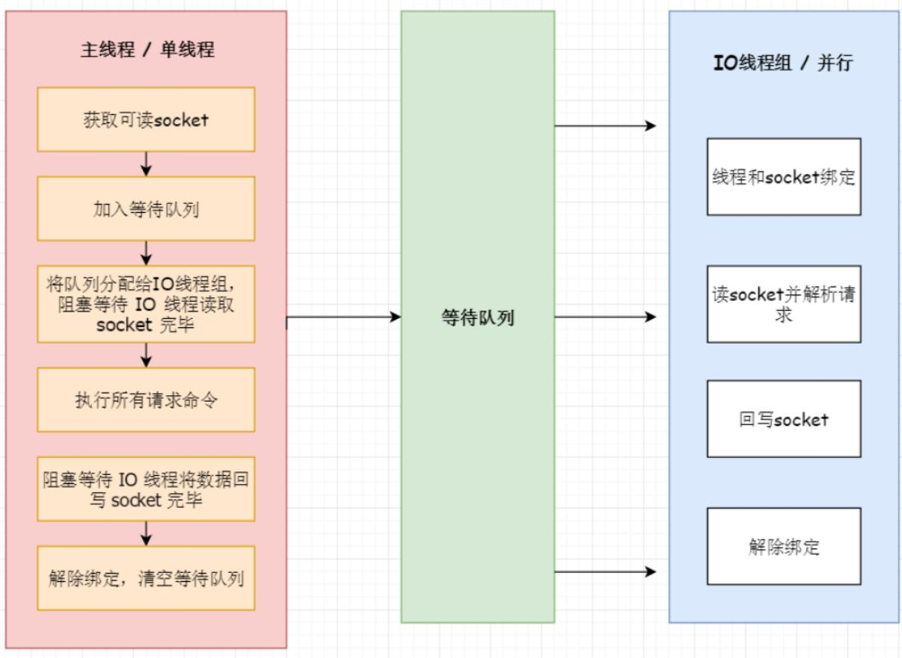


# 流程简述如下：

主线程负责接收建立连接请求，获取 Socket 放入全局等待读处理队列。

主线程处理完读事件之后，通过 RR（Round Robin）将这些连接分配给这些 IO 线程。

主线程阻塞等待 IO 线程读取 Socket 完毕。

主线程通过单线程的方式执行请求命令，请求数据读取并解析完成，但并不执行。

主线程阻塞等待 IO 线程将数据回写 Socket 完毕。

解除绑定，清空等待队列。

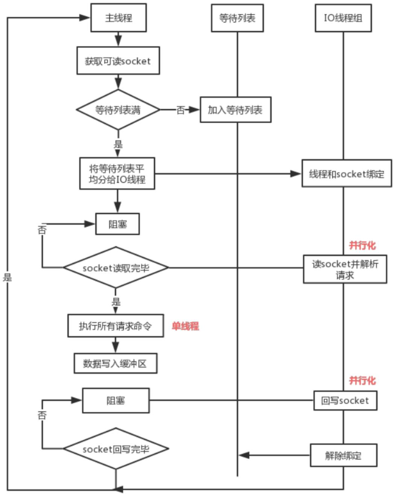


# 该设计有如下特点：

1、IO 线程要么同时在读 socket，要么同时在写，不会同时读或写

2、IO 线程只负责读写 socket 解析命令，不负责命令处理

# Redis6.x默认是否开启了多线程？

Redis6.0 的多线程默认是禁用的，只使用主线程

如需开启需要修改 redis 配置文件 redis.conf ：

```txt
io-threads-do-reads yes 
```

开启多线程后，还需要设置线程数，否则是不生效的。同样需要修改 redis 配置文件 redis.conf :

```txt
io-threads 4 #官网建议4核的机器建议设置为2或3个线程，8核的建议设置为6个线程
```

缓存穿透：key中对应的缓存数据不存在，导致去请求数据库，造成数据库的压力倍增的情况

缓存击穿：redis过期后的一瞬间，有大量用户请求同一个缓存数据，导致这些请求都去请求数据库，造成数据库压力倍增的情，针对一个key而言

缓存雪崩：缓存服务器宕机或者大量缓存集中某个时间段失效，导致请求全部去到数据库，造成数据库压力倍增的情况，这个是针对多个key而言

# 缓存穿透

概念：缓存穿透是指缓存和数据库中都没有的数据，而用户不断发起请求，造成数据库的压力倍增的情况

例：发起为id值为 -1 的数据或 id 为特别大不存在的数据

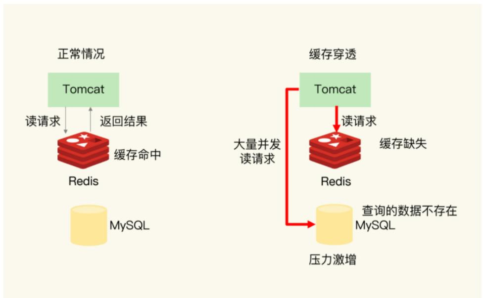


# 解决方案：

（1）接口层增加校验，比如用户鉴权校验，参数做校验 比如：id 做基础校验，id <=0的直接拦截

（2）对于像ID为负数的非法请求直接过滤掉，采用布隆过滤器(Bloom Filter)

（3）针对在数据库中找不到记录的，我们仍然将该空数据存入缓存中，当然一般会设置一个较短的过期时间

# 缓存雪崩

概念：缓存服务器宕机或者大量缓存集中某个时间段失效，导致请求全部去到数据库，造成数据库压力倍增的情况，这个是针对多个key而言

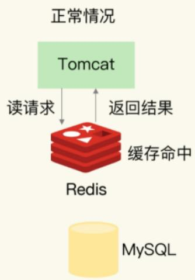


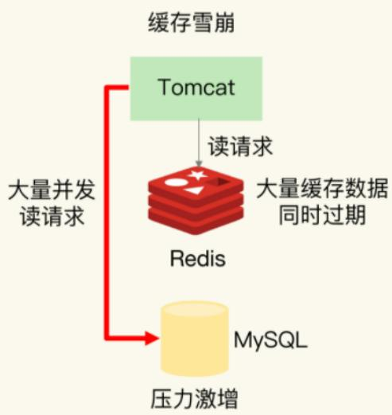


解决：

（1）实现缓存高可用，通过redis cluster将热点数据均匀分布在不同的Redis库中也能避免全部失效的问题

（2）批量往Redis存数据的时候，把每个Key的失效时间都加个随机值

```javascript
setRedis(Key, value, time + Math.random() * 10000); 
```

# 缓存击穿

概念：redis过期后的一瞬间，有大量用户请求同一个缓存数据，导致这些请求都去请求数据库，造成数据库压力倍增的情，针对一个key而言

缓存击穿与缓存雪崩的区别是这里针对的是某一热门key缓存，而雪崩针对的是大量缓存的集中失效

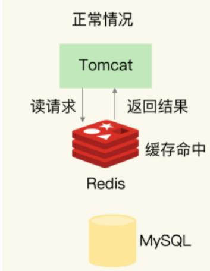


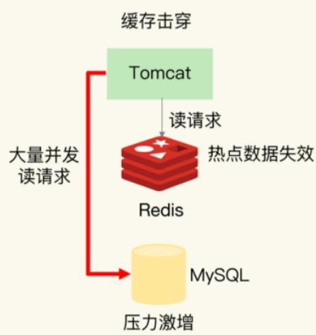


# 解决方案

设置热点数据永远不过期。