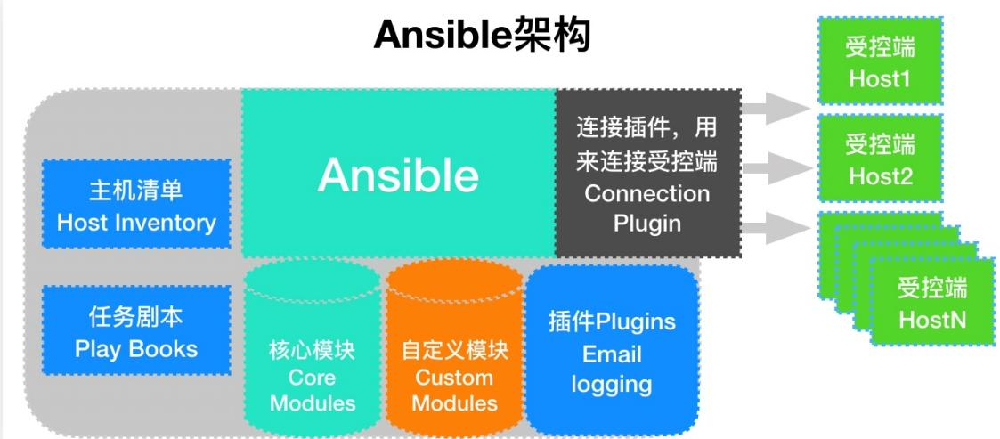

# 1.Ansible快速入门

1.1 什么是Ansible

1.2 Ansible主要功能

1.3 Ansible的特点

1.4 Ansible基础架构

# 2.Ansible安装与配置

2.1 rpm安装

2.2 pip安装

2.3 确认安装

# 3.Ansible配置解读

3.1 Ansible配置路径

3.2 Ansible主配置文件

3.3 Ansible配置优先级

3.4 普通用户管理被控端

# 4.Ansible Inventory

4.1 Inventory是什么

4.2 Inventory-密码连接方式

4.3 Inventory-秘钥连接方式

4.4 Inventory-主机匹配方式

# 5.Ansible ad-hoc

5.1 ad-hoc是什么

5.2 ad-hoc命令使用

5.3 ad-hoc执行过程

5.4 ad-hoc执行状态

# 6.Ansible常用模块

6.1 command模块

6.2 shell模块

6.3 script模块

6.4 yum模块

6.5 copy模块

6.6 file模块

6.7 lineinfile模块

6.8 get_url模块

6.9 systemd模块

6.10 group模块

6.11 user模块

6.12 cron模块

6.13 mount模块

6.14 hostname模块

6.15 archive模块

6.16 unarchive模块

6.17 selinux模块

6.18 firewalld模块

6.19 Iptables模块

# 1.Ansible快速入门

# 1.1 什么是Ansible

Ansible 是一个 IT 自动化的配置管理工具，自动化主要体现在Ansible 集成了丰富模块，以及强大的功能组件，可以通过一个命令行完成一系列的操作。进而能减少我们重复性的工作，以提高工作的效率。

假设我们要在10台linx服务器上安装一个nginx服务，手动如何作的?

第一步、ssh登陆NUM(1..n)服务器第二步、输入对应服务器密码第三步、安装yum install nginx第四步、启动systemctl start nginx第五步、退出登录


循环操作n=10次

# 1.2 Ansible主要功能

批量执行远程命令，可以对N多台主机同时进行命令的执行。

批量配置软件服务，可以进行自动化的方式配置和管理服务。

实现软件开发功能， jumpserver 底层使用 ansible 来实现的自动化管理。

编排高级的IT任务， Ansible 的 Playbook 是一门编程语言，可以用来描绘一套 IT 架构。

# 1.3 Ansible的特点

. 容易学习：无代理，不像 salt 既要学客户端与服务端，还需要学习客户端与服务端中间通讯协议；

操作灵活： Ansible 有较多的模块，提供了丰富的功能、playbook 则提供类似于编程语言的复杂功能；

. 简单易用：体现在 Ansible 一个命令可以完成很多事情；

安全可靠：因为 Ansible 使用了 SSH 协议进行通讯，既稳定也安全；

移植性高：可以将写好的 playbook 拷贝至任意机器进行执行；

幂等性：一个任务执行1遍和执行n遍效果一样，不会因为重复执行带来意外情况；

# 1.4 Ansible基础架构

Ansible 架构中的控制节点、被控制节点、 inventroy、ad-hoc、playbook、Connection Protocol 是什么？



# 2.Ansible安装与配置

# 2.1 rpm安装

```
[root@manager ~]# wget -0 /etc/yum.repos.d/epel.repo
http://mirrors.aliyun.com/repo/epel-7.repo
[root@manager ~]# yum install ansible -y 
```

# 2.2 pip安装

```
[root@manager ~]# yum install python3 python3-devel
python3-pip -y
[root@manager ~]# pip3 install --upgrade pip -i
https://pypi.douban.com/simple/
[root@manager ~]# pip3 install ansible -i
https://pypi.douban.com/simple/
[root@manger ~]# /usr/local/bin/ansible --version 
```

# 2.3 确认安装

方式一、检查 Ansible 版本

```
[root@manager ~]# ansible --version
ansible 2.10.5
config file = None
configured module search path = [/root/.ansible/plugins/modules', '/usr/share/ansible/plugins/modules']
ansible python module location = /usr/local/lib/python3.6/site-packages/ansible
executable location = /usr/local/bin/ansible
python version = 3.6.8 (default, Nov 16 2020, 16:55:22) [GCC 6.8.5 20150623 (Red Hat 6.8.5-44)] 
```

# 方式二、测试 Ansible 是否可用

```
[root@manager ~]# ansible localhost -m ping
localhost | SUCCESS => {
    "changed": false,
    "ping": "pong"
} 
```

# 3.Ansible配置解读

# 3.1 Ansible配置路径

. /etc/ansible/ansible.cfg ：主配置文件，配置 ansible 工作特性

/etc/ansible/hosts ：配置主机清单文件

/etc/ansible/roles/ ：存放 ansible 角色的目录

# 3.2 Ansible主配置文件

ansible 的主配置文件存在 /etc/anible/ansible.cfg ，其中大部分的配置内容无需进行修改；

```
[root@manager ~]# cat /etc/ansible/ansible.cfg
[defaults]
#inventory = /etc/ansible/hosts #主机列表配置文件
#library = /usr/share/my_modules/ #库文件存放目录
#remote_tmp = ~/.ansible/tmp #临时py文件存放在远程主机目录
#local_tmp = ~/.ansible/tmp #本机的临时执行目录
#forks = 5 #默认并发数
#sudo_user = root #默认sudo用户
#ask_sudo_pass = True #每次执行是否询问sudo的ssh密码
#ask_pass = True    #每次执行是否询问ssh密码
#remote_port = 22    #远程主机端口
host_key_checking = False    #检查对应服务器的host_key，建议取消
log_path = /var/log/ansible.log    #ansible日志，建议启用
[privilege_escalation] #如果是普通用户则需要配置提权
#become=True
#become_method=sudo
#become_user=root
#become_ask_pass=False
```

# 3.3 Ansible配置优先级

. Ansible 的配置文件可以存放在任何位置，但配置文件有读取顺序，查找顺序如下：

1、最先查找 $ANSIBLE_CONFIG 变量

2、其次查找当前目录下 ansible.cfg

3、然后查找用户家目录下的 .ansible.cfg

4、最后查找 /etc/ansible/ansible.cfg

通过命令行操作演示，验证结论；

# 由于操作过多，就不进行文档展示

# 3.4 普通用户管理被控端

场景说明： ansible 使用 oldxu 普通用户统一管理所有的被控端节点；

1.首先控制端，被控端，都需要有 olxu 用户；

```
[root@manager ~]# useradd oldxu
[root@manager ~]# echo "123" | passwd --stdin oldxu 
```

2.将控制端 oldxu 用户的公钥推送到被控端 oldxu 用户下，使普通用户能进行免密码登录；

```
[root@manager ~]# su - oldxu
[oldxu@manager ~]$ ssh-keygen -t rsa -N "" -f ~/.ssh/id_rsa
[oldxu@manager ~]$ ssh-copy-id -i ~/.ssh/id.pub
oldxu@IP 
```

3.所有主机的 oldxu 用户都必须添加 sudo 权限。

```
[root@manager ~]# visudo
oldxu ALL=(ALL) NOPASSWD: ALL 
```

6.修改控制端 /etc/ansible/ansible.cfg 主配置文件，配置普通用户提权；

```
[root@manager ~]# vim /etc/ansible/ansible.cfg
[privilege_escalation]
become=True
become_method=sudo
become_user=root
become_ask_pass=False 
```

5.使用 oldxu 用户测试是否能执行任务；

ansible添加sudo用户

# 4.Ansible Inventory

# 4.1 Inventory是什么

Inventory 文件主要用来填写被管理主机以及主机组信息；(逻辑上定义)；

默认 Inventory 文件为 /etc/ansible/hosts ；

当然也可以自定义一个文件，当执行 ansible 命令时使用 -i 选项指定 Inventory 文件位置；

# 4.2 Inventory-密码连接方式

1.指定主机IP，指定主机端口，指定主机用户名、密码；

```
# 详细清单文件;
[webservers]
10.0.0.31 ansible_ssh_port=22 ansible_ssh_user=root
ansible_ssh_pass='123456'
10.0.0.41 ansible_ssh_port=22 ansible_ssh_user=root
ansible_ssh_pass='123456'
# 通过域名的简写方式;
[webservers]
web[1:2].oldxu.com ansible_ssh_pass='123456'
```

2.通过变量方式定义密码；

```
[webserver
web[1:2].oldxu.com
[webservers:vars]
ansible_ssh_pass='123456' 
```

# 4.3 Inventory-秘钥连接方式

1.创建秘钥对，然后下发秘钥；

```
[root@manager ~]# ssh-copy-id -i ~/.ssh/id_rsa.pub
root@172.16.1.7
[root@manager ~]# ssh-copy-id -i ~/.ssh/id_rsa.pub
root@172.16.1.8 
```

2.配置 inventory 主机清单；

```
[webservers]
172.16.1.7
172.16.1.8
#定义别名;
[webservers]
web01 ansible_ssh_host=172.16.1.7
ansible_ssh_port=22
web02 ansible_ssh_host=172.16.1.8
```

# 4.4 Inventory-主机匹配方式

ansible 的 host-pattern 主机匹配使用说明；

```
# 指定操作所有的组
ansible all -m ping
# 通配符;
ansible "*" -m ping
ansible 10.0.0.* -m ping
# 与：在webservers组；并且在dbsservers中的主机；ansible "webservers:&dbservers" -m ping
# 或：在webservers组，或者在appservers中的主机；  
ansible "webservers:appservers" -m ping
# 非：在webservers组，但不在apps组中的主机
ansible 'webservers:!apps' -m ping
```

# 正则表达式；

ansible "~(web|db).*.oldxu.com" -m ping

# 5.Ansible ad-hoc

# 5.1 ad-hoc是什么

ad-hoc 简而言之就是 “临时命令”，执行完即结束，并不会保存；

. 应用场景1：查看多台节点的进程是否存在；

? 应用场景2：拷贝指定的文件至本地；

# 5.2 ad-hoc命令使用

命令示例： ansible 'groups' -m command -a 'df -h' ，含义如下图所示；

| 命令格式 | ansible | 'groups' | -m       | command  | -a       | 'df -h'  |
| -------- | ------- | -------- | -------- | -------- | -------- | -------- |
| 格式说明 | 命令    | 主机名称 | 指定模块 | 模块名称 | 模块动作 | 具体命令 |

# 5.3 ad-hoc执行过程

1.加载自己的配置文件，默认 /etc/ansible/ansible.cfg ；

2.查找对应的主机配置文件，找到要执行的主机或者组；

3.加载自己对应的模块文件，如 command

6.通过 ansible 将模块或命令生成对应的临时 py 文件，并将该文件传输至远程服务器对应执行用户

$HOME/.ansible/tmp/ansible-tmp-number/XXX.PY ；

. 5.执行用户家目录的 文件；

6.给文件 +x 执行；

7.执行并返回结果；

8.删除临时 py 文件， sleep 0 退出；

# 5.4 ad-hoc执行状态

使用 ad-hoc 执行一次远程命令，注意观察返回结果的颜色；

绿色: 代表被管理端主机没有被修改

. 黄色: 代表被管理端主机发现变更

. 红色: 代表出现了故障，注意查看提示

# 6.Ansible常用模块

ansible 有着诸多的模块，虽然模块众多，但最为常用的模块也就20-30 个左右；

# 6.1 command模块

功能：在远程主机执行 Shell 命令；此为默认模块，可忽略 -m 选项；

注意：不支持管道命令 |

| 参数    | 选项               | 含义                           |
| ------- | ------------------ | ------------------------------ |
| chdir   | chdir /opt         | 执行ansible时,切换到指定的目录 |
| creates | creates /data/file | 如果文件存在,则跳过执行        |
| removes | removes /data/file | 如果文件存在,则执行            |

范例1： chdir ，切换目录执行 Shell 命令；

```
[root@manger ~]# ansible localhost -m command -a 'chdir=/root echo $PWD'
localhost | CHANGED | rc=0 >>
/root 
```

范例2： creates ，如果 /data/file 文件存在，则跳过执行；

```
[root@manger ~]# ansible localhost -m command -a 'creates=/data/file ifconfig eth0'
localhost | SUCCESS | rc=0 >>
skipped, since /data/file exists 
```

范例3： removes ，如果 /data/file 文件存在，则执行；

```
[root@manger ~]# ansible localhost -m command -a
'removes=/data/file ifconfig eth0'
localhost | CHANGED | rc=0 >>
eth0: flags=4163<UP,BROADCAST,RUNNING,MULTICAST>
mtu 1500
inet 10.0.0.6 netmask 255.255.255.0
broadcast 10.0.0.255
inet6 fe80::20c:29ff:fe2a:348 prefixlen 64
scopeid 0x20<link>
ether 00:0c:29:2a:03:48 txqueuelen 1000
(Ethernet)
RX packets 76534 bytes 99611397 (96.9 MiB)
RX errors 0 dropped 0 overruns 0 frame 0
TX packets 17274 bytes 1957911 (1.8 MiB)
TX errors 0 dropped 0 overruns 0 carrier 0
collisions 0 
```

# 6.2 shell模块

功能：在远程主机执行 Shell 命令，执行管道等特殊符号的操作；

| 参数    | 选项               | 含义                           |
| ------- | ------------------ | ------------------------------ |
| chdir   | chdir /opt         | 执行ansible时,切换到指定的目录 |
| creates | creates /data/file | 如果文件存在,则跳过执行        |
| removes | removes /data/file | 如果文件存在,则执行            |

范例1：使用 Shell 命令过滤被控端主机的 IP 地址；

```
[root@manger ~]# ansible localhost -m shell -a "ifconfig eth0|awk 'NR=2' "
[WARNING]: No inventory was parsed, only implicit localhost is available
localhost | CHANGED | rc=0 >>
inet 10.0.0.6 netmask 255.255.255.0
broadcast 10.0.0.255 
```

# 6.3 script模块

功能：在被控节点，运行 Ansible 主机的脚本；

范例1：在 Ansible 主机上编写脚本，然后推送至被控端运行；

```
#在本地运行模块，等同于在远程执行，不需要将脚本文件进行推送目标主机执行
[root@manger ~]# ansible webservers -m script -a "/data/yum.sh"
```

# 6.4 yum模块

功能：管理各个操作系统的软件包；

| 参数          | 选项                              | 含义                        |
| ------------- | --------------------------------- | --------------------------- |
| name          | httpd、nginx、...                 | 指定安装软件包名或软件包URL |
| state         | present(Defaults)、absent、latest | 指定yum对应的方法           |
| enablerepo    | epel、base、...                   | 允许从哪些仓库获取软件      |
| disablerepo   | epel、base、...                   | 禁止从哪些仓库获取软件      |
| exclude       | kernel、...                       | 排除某些软件包              |
| download_only | yes、no                           | 仅下载软件包,不安装         |

范例1：安装当前最新的 Apache 软件，如果存在则不安装

```
[root@manger ~]# ansible webservers -m yum -a "name=httpd state=present" 
```

范例2：安装当前最新的Apache软件，通过epel仓库安装

```
[root@manger ~]# ansible webservers -m yum -a "name=httpd state=present enablerepo=epel" 
```

范例3：通过公网 URL 安装 rpm 软件

```
[root@manger ~]# ansible webservers -m yum -a "name=https://xx.rpm state=present" 
```

范例4：安装最新版本的 Apache 软件，如果存在则更新 Apache

```
[root@manger ~]# ansible webservers -m yum -a "name=httpd state=latest" 
```

范例5：更新所有的软件包，但排除和 kernel 相关的

```
[root@manger ~]# ansible webservers -m yum -a "name=* state=latest exclude=kernel" 
```

范例6：删除 Apache 软件

```
[root@manger ~]# ansible webservers -m yum -a "name=httpd state=absent" 
```

# 6.5 copy模块

功能：从 ansible 服务端主控端复制文件到远程主机；

| 参数    | 选项                    | 含义                             |
| ------- | ----------------------- | -------------------------------- |
| src     |                         | 复制本地目录下的文件至远程服务器 |
| dest    |                         | 文件复制到远程的绝对路径         |
| owner   | root(Defaults)          | 文件复制到远程并设定属主         |
| group   | root(Defaults)          | 文件复制到远程并设定属组         |
| mode    | file=644, directory=755 | 文件复制到远程并设定权限         |
| backup  | yes                     | 备份被修改前的配置文件           |
| content |                         | 新建文件并给文件添加内容         |

范例1：将本地的 httpd.conf 文件 Listen 端口修改为 8080 ，推送至远程服务器

```
[root@manger ~]# ansible webservers -m copy -a "src=./httpd.conf dest=/etc/httpd/conf/httpd.conf owner=root group=root mode=644" 
```

范例2：将本地的 httpd.conf 文件 Listen 端口修改为 9090 ，推送至远程服务器，然后检查远端是否存在上一次的备份文件

```
[root@manger ~]# ansible webservers -m copy -a "src=./httpd.conf dest=/etc/httpd/conf/httpd.conf owner=root group=root mode=644 backup=yes" 
```

范例3：往远程的主机文件中写入内容，如果文件不存在则创建

```
[root@manger ~]# ansible webservers -m copy -a "content="Http_Server" dest=/var/www/html/index.html" 
```

# 6.6 file模块

功能：为被控端创建文件或目录，设定权限属性；

| 参数    | 选项                           | 含义                     |
| ------- | ------------------------------ | ------------------------ |
| path    |                                | 指定远程服务器的路径     |
| recurse |                                | 递归方式(可以是递归授权) |
| state   | touch、directory、link、absent | 文件复制到远程的状态     |
| owner   | root(Defaults)                 | 文件复制到远程并设定属组 |
| group   | root(Defaults)                 | 备份被修改前的配置文件   |
| mode    | file=644, directory=755        | 文件复制到远程并设定权限 |

范例1：创建文件，并设定属主、属组、权限

```
[root@manger ~]# ansible webservers -m file -a "path=/tmp/foo.conf state=touch mode=666" 
```

范例2：创建目录，并设定属主、属组、权限

```
[root@manger ~]# ansible webservers -m file -a "path=/tmp/foo state=directory mode=777" 
```

范例3：递归授权目录

```
[root@manger ~]# ansible webservers -m file -a "path=/tmp/foo state=directory owner=root group=root mode=777 recurse=yes" 
```

# 6.7 lineinfile模块

功能：修改或删除文件内容，与系统中的 sed 命令类似；

| 参数         | 选项                       | 含义                                         |
| ------------ | -------------------------- | -------------------------------------------- |
| path         |                            | 指定要操作的文件                             |
| regexp       |                            | 使用正则表达式匹配对应的行                   |
| line         |                            | 修改为新的内容                               |
| insertafter  |                            | 将文本插入到“指定的行”之后                   |
| insertbefore |                            | 将文本插入到“指定的行”之前                   |
| state        | absent、present (Defaults) | 删除对应的文本时,需要state=absent            |
| backrefs     | yes、no                    | 1.支持后向引用、2.当未匹配到内容则不操作文件 |
| backup       |                            | 是否在修改文件之前对文件进行备份             |
| create       |                            | 当要操作的文件并不存在时,是否创建对应的文件  |

范例1：将 SELINUX 修改为 disabled 状态；

```
[root@manger ~]# ansible localhost -m lineinfile -a 'path=/etc/selinux/config regexp='^SELINUX=' line=SELINUX=disabled' 
```

范例2：删除 /etc/sudoers 文件中 %wheel 开头的行；

```
[root@manger ~]# ansible localhost -m lineinfile -a 'path=/etc/sudoers regexp='^%wheel' state=absent' 
```

范例3：替换 /etc/hosts 文件中以 12.0.0.1 的行为127.0.0.1 ansible.oldxu.com

```
[root@manger ~]# ansible localhost -m lineinfile -a 'path=/etc/hosts regex='^127\.0\.0\.1' line="127.0.0.1 ansible.oldxu.com"' 
```

范例4：修改默认 Apache 的端口为 8080 ，使用 insertafter ；

```
ansible localhost -m lineinfile -a
'path=/etc/httpd/conf/httpd.conf regexp='^Listen'
line="Listen 8080" insertafter='^#Listen'' 
```

# 6.8 get_url模块

功能：通过互联网下载软件至被控端本地；

| 参数     | 选项           | 含义                         |
| -------- | -------------- | ---------------------------- |
| url      | HTTP, HTTPS... | 资源文件在互联网上的具体位置 |
| dest     |                | 文件下载位置的绝对路径       |
| mode     |                | 文件下载后的权限             |
| checksum | md5、sha256    | 对下载的资源进行校验         |
| timeout  | 10(Default)    | URL请求超时时间              |

范例1：下载互联网的软件至本地

```
[root@manger ~]# ansible webservers -m get_url -a "url=https://mirrors.aliyun.com/xx.rpm dest=/tmp" 
```

范例2：下载互联网文件并进行 md5 校验

```
#ansible webservers -m get_url -a "url=http,https dest=/opt checksum=md5:76eb3af80ffd" 
```

# 6.9 systemd模块

功能：管理服务启动与停止，与 service 模块用法一致；

| 参数    | 选项                                  | 含义                               |
| ------- | ------------------------------------- | ---------------------------------- |
| name    | httpd、nginx、...                     | 定义要启动服务的名称               |
| state   | started、stopped、restarted、reloaded | 指定服务状态                       |
| enabled | yes、no                               | 允许服务开机自启或禁止服务开机自启 |

范例1：启动 Httpd 服务

```
[root@manger ~]# ansible webservers -m service -a "name=httpd state=started" 
```

范例2：重载 Httpd 服务

```
[root@manger ~]# ansible webservers -m service -a "name=httpd state=reloaded" 
```

范例3：重启 Httpd 服务

```
[root@manger ~]# ansible webservers -m service -a "name=httpd state=restarted" 
```

范例4：停止 Httpd 服务

```
[root@manger ~]# ansible webservers -m service -a "name=httpd state=stopped" 
```

范例5：启动 Httpd 服务，并加入开机自启

```
[root@manger ~]# ansible webservers -m service -a "name=httpd state=started enabled=yes" 
```

# 6.10 group模块

功能：管理被控端用户组；

| 参数   | 选项                     | 含义                     |
| ------ | ------------------------ | ------------------------ |
| name   |                          | 指定创建的组名           |
| gid    |                          | 为组设置可选gid          |
| state  | present(Default)、absent | 是否将组创建在远程主机上 |
| system | yes、no(Default)         | 是否创建系统组           |

范例1：创建 news 基本组，指定uid为9999

```
[root@manger ~]# ansible webservers -m group -a "name=news gid=9999 state=present" 
```

范例2：创建 http 系统组，指定uid为8888

```
[root@manger ~]# ansible webservers -m group -a "name=http gid=8888 system=true state=present" 
```

范例3：删除 news 基本组

```
[root@manger ~]# ansible webservers -m group -a "name=news state=absent" 
```

# 6.11 user模块

功能：管理被控端用户；

| 参数             | 选项                     | 含义                                          |
| ---------------- | ------------------------ | --------------------------------------------- |
| name             |                          | 创建或删除的用户名                            |
| uidgroup         |                          | 为用户设置可选uid为用户设置主要的组           |
| groups           |                          | 为用户设置附加的组                            |
| shell            | present(Default)、absent | 为用户设置登陆时的Shell                       |
| create_home      | yes(Default)、no         | 为用户创建主目录                              |
| state            | present(Default)、absent | 用户是否应该存在                              |
| remove           | yes、no(Default)         | 删除与用户关联的目录,只有当state=absent时生效 |
| generate_ssh_key | yes、no(Default)         | 为相关用户生成ssh密钥。不会覆盖现有的ssh密钥  |
| ssh_key_bits     | 2048                     | 创建用户ssh密钥中位数                         |
| ssh_key_file     | .ssh/id_rsa(Default)     | 可以实现ssh密钥改名,或变更存放ssh密钥位置     |

范例1：创建 joh 用户， uid 是 1040 ，主要的组是 adm

```
[root@manger ~]# ansible webservers -m user -a "name=joh uid=1040 group=adm" 
```

范例2：创建 joh 用户，登录 shell 是 /sbin/nologin ，追加bin、sys 两个组

```
[root@manger ~]# ansible webservers -m user -a "name=joh shell=/sbin/nologin groups=bin,sys" 
```

范例3：创建 jsm 用户，为其添加 123 作为登录密码，并且创建家目录

[root@manger ~]# ansible localhost -m debug -a "msg={{ '123' | password_hash('sha512', 'salt') }}" 6 salt *j**K**H* [root@manger ~]# ansible webservers -m user -a 'name=jsm password='6salt *j**K**H* create_home=yes'

范例4：示例四、移除 joh 用户

```
[root@manger ~]# ansible webservers -m user -a "name=joh remove=yes state=absent" 
```

范例5：创建 http 用户，并为该用户创建 2048 字节的私钥，存放在 ~/http/.ssh/id_rsa

```
[root@manger ~]# ansible webservers -m user -a "name=http uid=8888 group=8888 generate_ssh_key=yes ssh_key_bits=2048 ssh_key_file=.ssh/id_rsa" 
```

# 6.12 cron模块

功能：管理被控端计划任务；

| 参数    | 选项            | 含义                 |
| ------- | --------------- | -------------------- |
| name    |                 | 定时任务基本描述     |
| job     |                 | 定时任务要执行的命令 |
| minute  | (Default)、0-59 | 分                   |
| hour    | (Default)、0-23 | 时                   |
| day     | (Default)、1-31 | 日                   |
| month   | (Default)、1-12 | 月                   |
| weekday | (Default)、0-6  | 周                   |

范例1：添加定时任务，每分钟执行一次ls， * * * * * ls>/dev/null

```
[root@manger ~]# ansible webservers -m cron -a "name='cron01' job='ls >/dev/null'" 
```

范例2：添加定时任务， 每天的凌晨2点和凌晨5点执行一次ls， 0 5,2* * * ls >/dev/null

```
[root@manger ~]# ansible webserver -m cron -a "name='cron02' minute=0 hour=2,5 job='ls >/dev/null'" 
```

范例3：关闭定时任务，使定时任务失效

```
[root@manger ~]# ansible webservers -m cron -a "name='cron02' minute=0 hour=2,5 job='ls >/dev/null' disabled=yes" 
```

# 6.13 mount模块

功能：管理被控端设备挂载；

| 参数   | 选项                                | 含义                 |
| ------ | ----------------------------------- | -------------------- |
| src    |                                     | 本地或远程设备的路径 |
| path   |                                     | 设备挂载至本地的路径 |
| fstype | xfs、nfs...                         | 文件系统类型         |
| opts   | defaults、ro...                     | 挂载的参数           |
| state  | present、absent、mounted、unmounted | 挂载的状态           |

环境准备：将 ansible 作为 nfs 服务端， 172.16.1.7、172.16.1.8 作为 nfs 客户端挂载；

```
# ansible localhost -m yum -a 'name=nfs-utils state=present'
# ansible localhost -m file -a 'path=/ops state=directory'
# ansible localhost -m copy -a 'content="/ops 172.16.1.0/24(rw, sync)" dest=/etc/exports'
# ansible localhost -m service -a "name=nfs state=restarted" 
```

范例1：挂载 nfs 至本地的 /opt 目录，并实现开机自动挂载

```
[root@manger ~]# ansible webservers -m mount -a "src=172.16.1.61:/ops path=/opt fstype=nfs opts=defaults state=mounted" 
```

范例2：临时卸载 nfs 的挂载，但不清理 /etc/fstab

```
[root@manger ~]# ansible webservers -m mount -a "src=172.16.1.61:/ops path=/opt fstype=nfs opts=defaults state=unmounted" 
```

范例3：永久卸载 nfs 挂载，同时清理 /etc/fstab

```
[root@manger ~]# ansible webservers -m mount -a "src=172.16.1.61:/ops path=/opt fstype=nfs opts=defaults state=absent" 
```

# 6.14 hostname模块

功能：管理被控端主机名称；

范例：设置主机名称为 ansible-hostname

```
[root@manger ~]# ansible localhost -m hostname -a 'name=ansible-hostname' 
```

# 6.15 archive模块

功能：打包与压缩；

| 参数   | 选项                  | 含义               |
| ------ | --------------------- | ------------------ |
| path   |                       | 要压缩的文件或目录 |
| dest   |                       | 压缩后的文件       |
| format | bz2、gz、tar、xz、zip | 指定打包压缩的类型 |

范例：将 /var/log 目录压缩为 tar 格式，并存储至 /opt 目录下；

```
[root@manger ~]# ansible localhost -m archive -a 'path=/var/log dest=/opt/log.tar.gz format=gz' 
```

# 6.16 unarchive模块

功能：解包与解压缩；

| 参数       | 选项             | 含义                                           |
| ---------- | ---------------- | ---------------------------------------------- |
| src        |                  | 要解压的软件包路径                             |
| dest       |                  | 解压到目标位置                                 |
| remote_src | yes、no(default) | yes: 要解压的包在被控端、no:要解压的包在控制端 |

范例1：解压控制端的包至被控端；

```
[root@manger ~]# ansible localhost -m unarchive -a 'src=/root/php.zip dest=/tmp/' 
```

范例2：解压被制端的包至被控端；

```
[root@manger ~]# ansible localhost -m unarchive -a 'src=/log.tar.gz dest=/tmp/ remote_src=yes' 
```

# 6.17 selinux模块

功能：管理 SELINUX 防火墙；

| 参数  | 选项                            | 含义        |
| ----- | ------------------------------- | ----------- |
| state | enforcing、permissive、disabled | Selinux模式 |

范例1：设置 selinux 为 enforcing

```
[root@manger ~]# ansible webservers -m selinux -a "state=enforcing" 
```

范例2：设置 selinux 为 disabled

```
[root@manger ~]# ansible webservers -m selinux -a "state=disabled" 
```

# 6.18 firewalld模块

功能：管理 firewalld 防火墙；

| 参数       | 选项                     | 含义                            |
| ---------- | ------------------------ | ------------------------------- |
| service    | http、https...           | 添加或删除firewalld中的服务名称 |
| port       | 80、443...               | 添加或删除firewalld中的端口范围 |
| masquerade | yes、no                  | 启用或禁止防火墙的地址伪装      |
| immediate  | yes、no(Default)         | 防火墙规则当前是否立即生效      |
| permanent  | yes、no                  | 防火墙规则当前是否重启后也生效  |
| state      | enabled、disabled        | 启用或禁用当前配置的规则        |
| rich_rule  |                          | 在防火墙中添加或删除富规则      |
| source     |                          | 添加或删除防火墙 源IP网络       |
| zone       | public(Default)、home... | 指定防火墙区域                  |

范例1：放行 http 服务流量，设定临时与永久生效；

```
[root@manger ~]# ansible webservers -m firewalld -a "service=http immediate=yes permanent=yes state=enabled" 
```

范例2：放行 tcp/8080-8090 端口，设定临时与永久生效；

```
[root@manger ~]# ansible webservers -m firewalld -a "port=8080-8090/tcp immediate=yes permanent=yes state=enabled" 
```

# 6.19 Iptables模块