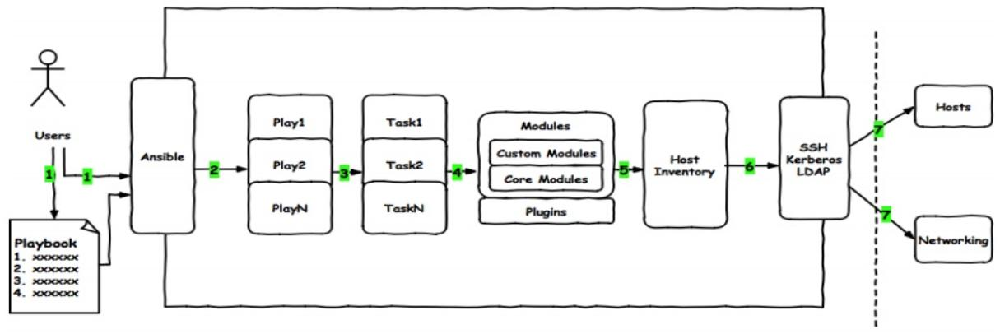
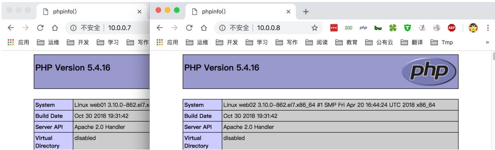
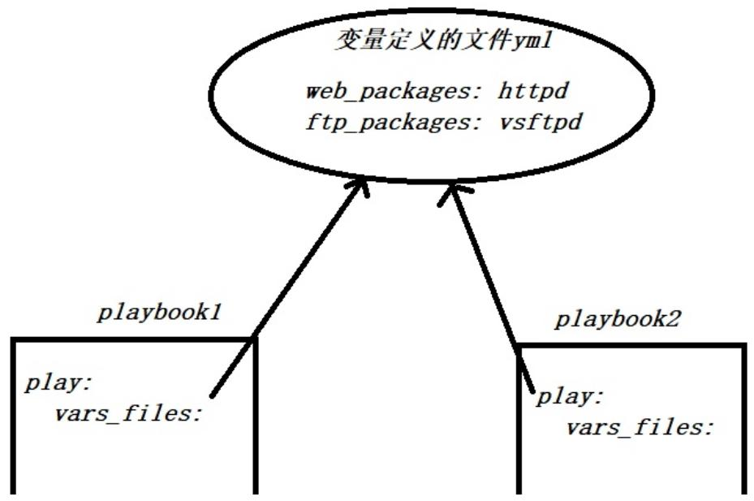

# 02.Ansible Playbook入门

# 02.Ansible Playbook入门

# 1.Playbook介绍

1.1 什么是Playbook

1.2 Playbook与Ad-Hoc

1.3 Playbook书写格式

# 2.Playbook案例实战

2.1 Ansible部署NFS示例

2.2 Ansible部署Httpd示例

2.3 Ansible部署Rsync示例

2.4 Ansible部署LAMP示例

2.5 Playbook部署集群架构

1.5.1 项目需求及规划

1.5.3 项目环境准备

1.5.4 部署Redis

1.5.5 部署PHP环境

1.5.6 部署负载均衡

# 3.Ansible Variables

3.1 什么是变量

3.2 变量定义的方式

3.3 在Playbook中定义变量

3.3.1 vars方式定义变量

3.3.2 vars_files方式定义变量

3.4 在Inventory中定义变量

3.6.1 Inventory文件中定义变量

3.6.2 使用host_vars定义变量

3.6.3 使用group_vars定义变量

3.5 通过执行Playbook传递变量

3.6 变量优先级测试

4.Ansible Register

4.1 什么是Register

4.2 Register场景示例1

4.3 Register场景示例2

4.4 Register场景示例3

5.Ansible Facts Variables

5.1 什么是facts

5.2 facts使用场景

5.3 facts语法示例

5.4 案例1-根据主机IP地址生成Redis配置

5.5 案例2-根据主机CPU生成Nginx配置

5.6 案例3-根据主机内存生成Memcached配置

5.7 案例4-根据主机名称生成zabbix配置

5.8 案例6-使用facts批量修改主机名称

5.9 facts变量性能优化

5.9.1 关闭facts采集加速执行-方式1

5.9.2 缓存facts变量加速执行-方式2

6.Ansible Task Control

6.1 when条件语句

6.1.1 案例1-根据不同操作系统安装相同的软件

6.1.2 案例2-为特定的主机添加Nginx仓库

6.1.2 案例3-判断服务是否正常运行

6.1.4 案例4-为特定的主机执行任务

6.2 loop 循环语句

6.2.1 案例1-使用循环批量启动服务

6.2.2 案例2-使用循环批量安装软件

6.2.3 案例3-使用循环批量创建用户

6.2.4 案例4-使用循环批量拷贝文件

# 6.3.Handlers与Notify

6.3.1 案例1-变更服务配置触发重启

6.3.2 案例2-变更服务配置触发通知

6.3.3 Handlers注意事项与说明

# 6.4 tags 任务标签

6.6.1 案例1-指定执行某个tags

6.6.2 案例2-指定排除某个tags

# 6.5 include任务复用

6.5.1 案例1-多个项目调用相同task

6.5.2 案例2-Inlcude结合tags应用

# 6.7 Playbook异常处理

6.7.1 案例1-Playbook错误忽略

6.7.1 案例2-task执行失败强制调用handlers

6.7.2 案例3-控制Tasks报告状态为OK

6.7.3 案例4-changed_when检查任务结果

徐亮伟, 江湖人称标杆徐。多年互联网运维工作经验，曾负责过大规模集群架构自动化运维管理工作。

擅长Web集群架构与自动化运维，曾负责国内某大型电商运维工作。

个人博客"徐亮伟架构师之路"累计受益数万人。

# 1.Playbook介绍

# 1.1 什么是Playbook

playbook 是一个 由 yml 语法编写的文本文件，它由play 和 task 两部分组成。

play： 主要定义要操作主机或者主机组

task：主要定义对主机或主机组具体执行的任务，可以是一个任务，也可以是多个任务（模块）



总结: playbook 是由一个或多个 play 组成，一个play 可以包含多个 task任务。

可以理解为: 使用多个不同的模块来共同完成一件事情。

# 1.2 Playbook与Ad-Hoc

1. playbook 是对 AD-Hoc 的一种编排方式。

1. playbook 可以持久运行，而 Ad-Hoc 只能临时运行。

1. playbook 适合复杂的任务，而 Ad-Hoc 适合做快速简单的任务。

1. playbook 能控制任务执行的先后顺序。

# 1.3 Playbook书写格式

playbook 是由 yml 语法书写，结构清晰，可读性强，所以必须掌握 yml 语法

| 语法   | 描述                                                         |
| ------ | ------------------------------------------------------------ |
| 缩进   | YAML使用固定的缩进风格表示层级结构,每个缩进由两个空格组成,不能使用tabs |
| 冒号   | 以冒号结尾的除外,其他所有冒号后面所有必须有空格。            |
| 短横线 | 表示列表项,使用一个短横杠加一个空格。多个项使用同样的缩进级别作为同一列表。 |

1.下面我们一起来编写一个playbook文件，playbook起步

host: 对哪些主机进行操作

remote_user: 我要使用什么用户执行

tasks: 具体执行什么任务

```
[root@manager ~]# cat f1.yml
---
- hosts: all
    remote_user: root
    vars:
    file_name: xuliangwei
    tasks:
    - name: Create New File
    file: name=/tmp/{{ file_name }}
state=touch 
```

2.执行playbook，注意观察执行返回的状态颜色:

红色：表示有task执行失败，通常都会提示错误信息。

黄色：表示远程主机按照编排的任务执行且进行了改变。

绿色：表示该主机已经是描述后的状态，无需在次运行。

```
[root@m01 ~]# ansible-playbook f1.yml

PLAY [172.16.1.5] ***************************
TASK [Gathering Facts] ***************************
ok: [172.16.1.5]

TASK [Create New File] ***************************
changed: [172.16.1.5]

PLAY RECAP ***************************
172.16.1.5 : ok=2 changed=1 unreachable=0 failed=0
[root@m01 ~]# 
```

# 2.Playbook案例实战

# 2.1 Ansible部署NFS示例

1.编写安装配置 nfs 服务的 playbook 文件

```
[root@m01 ~]# cd /etc/ansible/playbook/
[root@m01 playbook]# cat nfs.yml
---
- hosts: web
tasks:
  - name: Install NFS Server
    yum: name=nfs-utils state=latest
  -
  - name: Configure NFS Server
    copy: src=./exports.j2
dest=/etc/exports
  -
  - name: Create Data Directory
    file: path=/data state=directory
owner=nfsnobody group=nfsnobody recurse=yes
  -
  - name: Start NFS Server
    service: name=nfs state=started
enabled=yes 
```

2.准备 playbook 依赖的 exports.j2 文件

```
[root@m01 playbook]# echo "/data 172.16.1.0/24(rw, sync)" > exports.j2 
```

3.检查 playbook 语法

```
[root@m01 playbook]# ansible-playbook
nfs.yml --syntax-check 
playbook: nfs.yml 
```

6.执行playbook

```
[root@m01 ~]# ansible-playbook nfs.yml

PLAY [web] ***************************
TASK [Gathering Facts] ***************************
ok: [172.16.1.8]
ok: [172.16.1.7]

TASK [Install NFS Server] ***************************
ok: [172.16.1.8]
ok: [172.16.1.7]

TASK [Configure NFS Server] ***************************
changed: [172.16.1.8]
changed: [172.16.1.7]

TASK [Create Data Directory] ***************************
ok: [172.16.1.8]
ok: [172.16.1.7]

TASK [Start NFS Server] ***************************
ok: [172.16.1.8]
ok: [172.16.1.7]

PLAY RECAP ***************************
172.16.1.7 : ok=5 changed=1 unreachable=0 failed=0
172.16.1.8 : ok=5 changed=1 unreachable=0 failed=0

[root@m01 ~]# 
```

5.客户端执行命令测试

```
[root@m01 playbook]# showmount -e
172.16.1.8
Export list for 172.16.1.8:
/data 172.16.1.0/24
[root@m01 playbook]# showmount -e
172.16.1.7
Export list for 172.16.1.7:
/data 172.16.1.0/24 
```

# 2.2 Ansible部署Httpd示例

1.编写安装配置 httpd 服务的 playbook 文件

```
[root@m01 playbook]# cat web.yml
- hosts: web
tasks:
  - name: Installed Httpd Server
    yum: name=httpd state=latest
  -
  - name: Started Httpd Server
    service: name=httpd state=started
enabled=yes
  -
  - name: Started Firewalld Server
    service: name=firewalld state=started
enabled=yes
  -
  - name: Copy Httpd Web Page
    copy: content='This is Web Page'
dest=/var/www/html/index.html 
- name: Configure Firewalld Permit Http
firewalld: service=http
immediate=yes permanent=yes state=enabled 
```

# 2.检查 playbook 语法

```
[root@m01 playbook]# ansible-playbook web.yml --syntax-check 
playbook: web.yml 
```

# 3.执行 playbook


1. root@m01:~ (ssh)

```
[root@m01 ~]# ansible-playbook web.yml 
PLAY [web]*************************** 
TASK [Gathering Facts]*************************** 
ok: [172.16.1.8] 
ok: [172.16.1.7] 
TASK [Installed Httpd Server]*************************** 
ok: [172.16.1.8] 
ok: [172.16.1.7] 
TASK [Started Httpd Server]*************************** 
ok: [172.16.1.7] 
ok: [172.16.1.8] 
TASK [Started Firewalld Server]*************************** 
changed: [172.16.1.7] 
changed: [172.16.1.8] 
TASK [Copy Httpd Web Page]*************************** 
changed: [172.16.1.7] 
changed: [172.16.1.8] 
TASK [Configure Firewalld Permit Http]*************************** 
ok: [172.16.1.8] 
ok: [172.16.1.7] 
PLAY RECAP 
172.16.1.7 
172.16.1.8 
: ok=6 changed=2 unreachable=0 failed=0 
: ok=6 changed=2 unreachable=0 failed=0 
[root@m01 ~]# 
```

# 6.访问服务器对应的 web 页面测试


# 2.3 Ansible部署Rsync示例

# 2.4 Ansible部署LAMP示例

使用 AnsiblePlaybook 方式构建 LAMP 架构，具体操作步骤如下:

1.使用yum安装 httpd、php、php-mysql、mariadb、firewalld 等

2.启动 httpd、firewalld、mariadb 等服务

3.添加防火墙规则，放行 http 的流量，并永久生效

6.使用 get_url 下载

http://fj.xuliangwei.com/public/index.php文件

1.针对主机进行分组管理，分组名称定义为 web

[root@m01 ~]# cat /etc/ansible/hosts

[web]

172.16.1.7

172.16.1.8

2.编写 LAMP 架构对应的 playbook 文件

```
[root@m01 ~]# cd /etc/ansible/playbook/
[root@m01 playbook]# cat lamp.yml
---
- hosts: web
tasks:
  - name: Installed LAMP Server
    yum: name=httpd,php,php-mysql,mariadb
state=latest

  - name: Started Httpd Server
    service: name=httpd state=started
enable=yes

  - name: Started Firewalld Server
    service: name=httpd state=started
enable=yes

  - name: Get Url Index.php File
    get_url:
url=http://fj.xuliangwei.com/public/index.php dest=/var/www/html/index.php

  - name: Configure Firewalld Permit Http
    firewalld: service=http
immediate=yes permanent=yes state=enable 
```

3.检查 playbook 语法是否有错误

[root@m01 playbook]# ansible-playbook syntax-check lamp.yml

playbook: lamp.yml

# 6.运行 Playbook

# 5.打开浏览器检查



# 2.5 Playbook部署集群架构

# 1.5.1 项目需求及规划

1.使用多台节点部署 kodcloud 网盘

2.使用 Nginx 作为负载均衡统一调度

3.使用 Redis 实现多台节点会话保持

# 1.5.3 项目环境准备

```
[root@ansible-hostname ~]# cat /etc/ansible/hosts
[dbservers]
172.16.1.5
[lbservers]
172.16.1.6
[webservers]
172.16.1.7
172.16.1.8 
```

# 1.5.4 部署Redis

```
[root@ansible-hostname demo]# cat install_redis.yml
- hosts: observers
tasks: 
- name: Installed Redis Server
yum:
    name: redis
    state: present

- name: Configure Redis Server
template:
    src: conf/redis.j2
    dest: /etc/redis.conf
    owner: redis
    group: root
    mode: 0640
notify: Restart Redis Server

- name: Systemctl Redis Server
systemd:
    name: redis
    state: started
enabled: yes

handlers:
- name: Restart Redis Server
systemd:
    name: redis
    state: restarted 
```

# 1.5.5 部署PHP环境

# 1.5.6 部署负载均衡

# 3.Ansible Variables

# 3.1 什么是变量

变量提供了便捷的方式来管理 ansible 项目中的动态值。 比如 nginx-1.12，可能后期会反复的使用到这个版本的值，那么如果将此值设置为变量，后续使用和修改都将变得非常方便。

# 3.2 变量定义的方式

在 Ansible 中定义变量分为如下三种方式：

1. 通过命令行传递变量参数定义

1. 在play文件中进行定义变量

2.1) 通过vars定义变量

2.2) 通过vars_files定义变量

1. 通过inventory在主机组或单个主机中设置变量

3.1) 通过host_vars对主机进行定义

3.2) 通过group_vars对主机组进行定义

问题：如果定义的变量出现重复，造成冲突，如何解决？

# 3.3 在Playbook中定义变量

# 3.3.1 vars方式定义变量

在 playbook 的文件中开头通过 vars 关键字进行变量定义

```
[root@ansible project1]# cat f1.yml
- hosts: webservers
vars:
  - web_packages: httpd
  - ftp_packages: vsftpd
tasks:
  - name: Output Variables
    debug:
    msg:
    - "{{ web_packages }}"
    - "{{ ftp_packages }}" 
```

# 3.3.2 vars_files方式定义变量

在 playbook 中使用 vars_files 指定文件作为变量文件，好处就是其他的 playbook 也可以调用；



1.准备一个用于存储变量的文件，后缀为 .yml 文件内容：vars_name: value

```
[root@ansible project1]# cat vars.yml
web_packages: httpd
ftp_packages: vsftpd 
```

2.使用 Playbook 调用变量文件

```
[root@ansible project1]# cat f2.yml
- hosts: webservers
vars_files: ./vars.yml
tasks:
  - name: Output Variables
    debug:
    msg:
    - "{{ web_packages }}"
    - "{{ ftp_packages }}" 
```

# 3.4 在Inventory中定义变量

# 3.6.1 Inventory文件中定义变量

1.设定主机变量和组变量

```
[root@m01 project1]# vim /etc/ansible/hosts
[webservers]
172.16.1.7 myid=1 state=master
172.16.1.8 myid=2 state=backup
[webservers:vars]
port=80    # 组变量
```

2.playbook 调用变量

```
[root@m01 project1]# cat p3.yml
- hosts: webserverss
tasks:
  - name: Output Variables
    debug:
    msg:
    - "{{ myid }} {{ state }} {{ port }}" 
```

# 3.6.2 使用host_vars定义变量

1.在项目目录中创建 host_vars目录，然后在创建一个文件，文件的文件名称要与 inventory 清单中的主机名称要保持完全一致，如果是ip地址，则创建相同ip地址的文件即可

```
[root@ansible project1]# cat hosts
[webserver]
172.16.1.7
172.16.1.8
[root@ansible project1]# mkdir host_vars 
```

2.在 host_vars 目录中创建文件，给 172.16.1.7 主机定义变量

```
[root@ansible project1]# cat
host_vars/172.16.1.7
web_packages: zlib-static
ftp_packages: zmap 
```

3.准备一个 playbook 文件调用 host_vars 目录中定义的主机变量

```
[root@ansible project1]# cat f6.yml
- hosts: 172.16.1.7
tasks:
- name: Output Variables
debug:
msg:
- "{{ web_packages }}"
- "{{ ftp_packages }}" 
- hosts: 172.16.1.8
tasks:
- name: Output Variables
debug:
msg:
- "{{ web_packages }}"
- "{{ ftp_packages }}" 
```

# 3.6.3 使用group_vars定义变量

1.在项目目录中创建 group_vars目录，然后在创建一个文件，文件的文件名称要与 inventory 清单中的组名称保持完全一致；

```
[root@ansible project1]# cat hosts
[webservers]
172.16.1.7
172.16.1.8
[root@ansible project1]# mkdir group_vars 
```

2.在 group_vars 目录中创建 webservers文件，为webservers主机组设定变量；

```
[root@ansible project1]# cat
group_vars/webservers
web_packages: wget
ftp_packages: tree 
```

3.编写 playbook，只需在 playbook 文件中使用变量即可；

```
[root@ansible project1]# cat f6.yml
- hosts: webservers
tasks:
  - name: Output Variables"
    debug:
    msg:
    - "{{ web_packages }}"
    - "{{ ftp_packages }}" 
```

6.测试其他组能否使用 webservers 组中定义的变量；测试后会发现无法调用；

```
[root@ansible project1]# cat f6.yml
- hosts: lbservers #使用lbservers
tasks:
  - name: Output Variables
    debug:
    msg:
    - "{{ web_packages }}"
    - "{{ ftp_packages }}"
```

5.但是系统提供了特殊的 all 组，也就说在group_vars 目录下创建一个 all 文件，定义变量对所有的主机组都生效；

```
[root@ansible project1]# cat group_vars/all
web_packages: wget
ftp_packages: tree

[root@ansible project1]# cat f6.yml
- hosts: lbserver #无论哪个组使用该变量，都没有任何的问题
tasks:
- name: Output Variables
  debug:
    msg:
    - "{{ web_packages }}"
    - "{{ ftp_packages }}"
```

# 3.5 通过执行Playbook传递变量

在执行Playbook时，可以通过命令行 --extra-vars 或 -e 外置传参设定变量；

1.准备 playbook 文件

```
[root@ansible project1]# cat f5.yml
- hosts: webserver
tasks:
  - name: Output Variables
    debug:
    msg:
    - "{{ web_packages }}"
    - "{{ ftp_packages }}" 
```

# 2.执行 playbook 时进行变量的传递

```
[root@ansible project1]# ansible-playbook
f5.yml -i hosts -e "web_packages=GeoIP" 
```

# 3.传递多个外置变量的方式

```
[root@ansible project1]# ansible-playbook
f5.yml -i hosts -e "web_packages=GeoIP" -e
"ftp_packages=telnet" 
```

# 3.6 变量优先级测试

定义相同的变量不同的值，来测试变量的优先级。操作步骤如下

1）在plabook中定义vars变量

2）在playbook中定义vars_files变量

3）在host_vars中定义变量

4）在group_vars中定义变量

5）通过执行命令传递变量

结果: 命令行传参-->play中的vars_files-->play中的vars-->host_vars-->group_vars-->group_vars/all

# 4.Ansible Register

# 4.1 什么是Register

register 可以将 task 执行的任务结果存储至某个变量中，便于后续的引用；

# 4.2 Register场景示例1

# 使用 Register 获取被控节点的端口信息

```
[root@manager ~]# cat f5.yml
---
- hosts: all
tasks:
  - name:
    shell: netstat -lntp
    register: System_Status
  - name: Get System Status
    debug: msg=
{{System_Status.stdout_lines}} 
```

# playbook执行结果

```
[root@manager ~]# ansible-playbook f5.yml PLAY [all] 
****************************************************************************************** 
**************************************************************************************** 
```

TASK [Gathering Facts]

```
******************************************************************************************
**************************************************************************************** 
```

ok: [10.0.0.30]

TASK [shell]

```
******************************************************************************************
**************************************************************************************** 
```

changed: [10.0.0.30]

TASK [Get System Status]

```
******************************************************************************************
**************************************************************************************** 
ok: [10.0.0.30] => {
    "msg": [
    "tcp 0 0 0.0.0.0:22
0.0.0.0:* LISTEN 925/sshd",
    "tcp6 0 0 :::22
::::* LISTEN 925/sshd"
]
} 
```

PLAY RECAP

```
******************************************************************************************
**************************************************************************************** 
10.0.0.30 : ok=3
changed=1 unreachable=0 failed=0 
```

# 4.3 Register场景示例2

# 面试题：批量修改200台主机名称-解法1

```
[root@m01 ~]# cat te_2.yaml
- hosts: all
tasks:
- name: #定义一个随机数，设定为变量，然后后续调用
shell: echo $((RANDOM%200))
register: System_SJ
- name: #使用debug输出变量结果，这样好知道需要提取的关键值
debug: msg={{ System_SJ }}
- name: #使用hostname模块将主机名修改为web_随机数
hostname: name=web_{System_SJ.stdout }}
```

# 4.4 Register场景示例3

# 使用 register 关键字完成 jumpserver key 的创建

```
if [ ! "$BOOTSTRAP_TOKEN" ]; then
BOOTSTRAP_TOKEN='cat /dev/urandom | tr -dc A-Za-z0-9 | head -c 16'; 
echo "BOOTSTRAP_TOKEN=$BOOTSTRAP_TOKEN"
>> ~/.bashrc;
echo $BOOTSTRAP_TOKEN;
else
echo $BOOTSTRAP_TOKEN;
fi

[root@manager playbook]# cat f9.yaml
- hosts: webservers
tasks:
- name: Run Shell Command Random string
shell:
cmd: 'if ! grep "SECRET_KEY"
~/.bashrc; then
SECRET_KEY=`cat
/dev/urandom | tr -dc A-Za-z0-9 | head -c
50`;
echo
"SECRET_KEY=$SECRET_KEY" >> ~/.bashrc;
echo $SECRET_KEY;
else
echo $SECRET_KEY;
fi'
register: SECRET_KEY

- name: Run Shell Command
BOOTSTRAP_TOKEN
shell: 
cmd: 'if ! grep "BOOTSTRAP_TOKEN"
~/.bashrc; then
    BOOTSTRAP_TOKEN=`cat
/dev/urandom | tr -dc A-Za-z0-9 | head -c
16`;
    echo
"BOOTSTRAP_TOKEN=$BOOTSTRAP_TOKEN" >>
~/.bashrc;
    echo $BOOTSTRAP_TOKEN;
    else
    echo $BOOTSTRAP_TOKEN;
    fi'
    register: BOOTSTRAP_TOKEN

- name: Copy Jms Configure
  template:
    src: ./j-config.yml
    dest: /tmp/jms_config.yml

- name: Copy Koko Configure
  template:
    src: ./k-config.yml
    dest: /tmp/koko_config.yml 
```

# 配置文件中：

```
SECRET_KEY: {{ SECRET_KEY.stdout.split('=')
[1] }}
BOOTSTRAP_TOKEN: {{
BOOTSTRAP_TOKEN.stdout.split('=')[1] }} 
```

# 5.Ansible Facts Variables

# 5.1 什么是facts

Ansible facts 变量主要用来自动采集，”被控端主机“自身的状态信息。

比如：被动端的，主机名、IP地址、系统版本、CPU数量、内存状态、磁盘状态等等。

# 5.2 facts使用场景

1.通过facts变量检查被控端硬件CPU信息，从而生成不同的Nginx配置文件。

2.通过facts变量检查被控端内存状态信息，从而生成不同的memcached的配置文件。

3.通过facts变量检查被控端主机名称信息，从而生成不同的Zabbix配置文件。

6.通过facts变量检查被控端主机IP地址信息，从而生成不同的redis配置文件。

5.通过facts变量........

# 5.3 facts语法示例

1.通过 facts 获取被控端的主机名与IP地址，然后通过debug 输出；

```
[root@m01 ~]# cat facts.yml
- hosts: webserverss
tasks:
  - name: Output variables ansible facts
    debug:
    msg: >
    this default IPv4 address "{{ansible_fqdn}}} "is "{{ansible_default_ipv6.address}}" 
```

2.获取facts变量，可以使用filter过滤特定的关键项

```
[root@m01 ~]# ansible localhost -m setup -a "filter="ansible_default_ipv4""
localhost | SUCCESS => {
    "ansible_facts": {
    "ansible_default_ipv4": {
    "address": "10.0.0.61",
    "alias": "eth0",
    "broadcast": "10.0.0.255",
    "gateway": "10.0.0.2",
    "interface": "eth0",
    "macaddress": "00:0c:29:5f:6b:8a",
    "mtu": 1500,
    "netmask": "255.255.255.0",
    "network": "10.0.0.0",
    "type": "ether"
    }
    },
    "changed": false
}
[root@m01 ~]# 
```

3.如果没有使用facts变量需求，可以关闭其功能，加速ansible执行性能；

```
[root@m01 ~]# cat facts.yml
- hosts: web
gather_facts: no #关闭信息采集
tasks:
```

# 5.4 案例1-根据主机IP地址生成Redis配置

[root@manager ansible_variables]# cat redis.yml

```
- hosts: webserver
tasks:
  - name: Installed Redis Server
    yum:
    name: redis
    state: present
  - name: Configure Redis Server
    template:
    src: ./redis.conf.j2
    dest: /etc/redis.conf
    notify: Restart Redis Server
  - name: Started Redis Server
    systemd:
    name: redis
    state: started
    enabled: yes 
```

handlers:

```
- name: Restart Redis Server
systemd:
  name: redis
  state: restarted 
```

# 配置文件进行如下修改

```
[root@manager ansible_variables]# cat
redis.conf.j2
...
bind 127.0.0.1 {{ ansible_eth1.ipv4.address }} 
```

# 5.5 案例2-根据主机CPU生成Nginx配置

# （172.16.1.7 1核）、（172.16.1.8 2核）

```
# ansible_processor_cores: 4 核心数 （每颗物理CPU的核心数）
# ansible_processor_count: 2 颗数 （有几个 CPU）
# ansible_processor_vcpus: 8 总核心数
```

[root@manager ansible_variables]# cat nginx.yml

```
- hosts: webservers
tasks:
  - name: Install Nginx Server
    yum:
    name: nginx
    state: present 
- name: Configure Nginx.conf
template:
src: ./nginx.conf.j2
dest: /tmp/nginx.conf
notify: Restart Nginx Server 
- name: Started Nginx Server
systemd:
  name: nginx
  state: started
  enabled: yes 
```

handlers:

```
- name: Restart Nginx Server
systemd:
  name: nginx
  state: restarted 
```

# nginx配置文件内容

```
[root@manager ansible_variables]# cat
nginx.conf.j2
user www;
worker_processes {{ ansible_processor_vcpus * 2 }}; 
error_log /var/log/nginx/error.log warn;
pid /var/run/nginx.pid; 
events { 
worker_connections 1024;
}
http {
    include /etc/nginx/mime.types;
    default_type application/octet-stream;

    log_format main '$remote_addr - $remote_user [$time_local] "$request" '$status $body_bytes_sent "$http_referer" ' "$http_user_agent" "$http_x_forwarded_for<|vision_start|>
access_log /var/log/nginx/access.log main;

    sendfile on;
    tcp_nopush on;
    keepalive_timeout 65;
    gzip on;
    include /etc/nginx/conf.d/*.conf;
} 
```

# 5.6 案例3-根据主机内存生成

# Memcached配置

# （172.16.1.7 1G）、（172.16.1.8 2G）

```
[root@ansible project1]# cat memcached.yml
- hosts: webserver
tasks:
  - name: Installed Memcached Server
    yum: name=memcached state=present
  - name: Configure Memcached Server
    template: src=./memcached.j2
dest=/etc/sysconfig/memcached
  - name: Service Memcached Server
    service: name=memcached state=started
enabled=yes 
# memcached配置文件如下
[root@ansible project1]# cat memcached.j2
PORT="11211"
USER="memcached"
MAXCONN="1024"
#根据内存状态生成不同的配置(支持+-*- /运算)
CACHESIZE="{{ ansible_memtotal_mb //2 }}"
# 总内存/2
# CACHESIZE="{{ ansible_memtotal_mb * 0.8 }}" # 使用内存80%
OPTIONS=""
```

# 5.7 案例4-根据主机名称生成zabbix配置

1）准备两台物理内存不一样的主机

172.16.1.7 web01

172.16.1.8 web02

2）编写zabbix服务playbook

```
[root@manager ansible_variables]# cat zabbix_agent.yml
- hosts: all
tasks:
  - name: Installed ZabbixAgent
  yum:
    name:
https://mirror.tuna.tsinghua.edu.cn/zabbix/zabbix/6.0/rhel/7/x86_64/zabbix-agent-6.0.0-2.el7.x86_66.rpm
    state: present
  - name: Configure ZabbixAgent
  template:
    src: ./zabbix_agentd.conf.j2
    dest:
/etc/zabbix/zabbix_agentd.conf
    notify: Restart ZabbixAgent
  - name: Started ZabbixAgent
  systemd: 
name: zabbix-agent
state: started
enabled: yes
handlers:
- name: Restart ZabbixAgent
systemd:
  name: zabbix-agent
  state: restarted 
```

3）zabbix-agent配置文件

```
[root@manager ansible_variables]# grep "^Hostname" zabbix_agentd.conf.j2
Hostname={{ ansible_hostname }} 
```

# 5.8 案例6-使用facts批量修改主机名称

# 面试题：批量修改200台主机名称-解法2

# 不能使用shell模块

# web_7 web_8

[root@m01 ~]# cat te.yaml

hosts: all tasks:

name: # 首先打印facts变量的内容

debug: msg={{

ansible_default_ipv6.address }}

```
- name: # 方式1 使用hostname模块将主机名修改为web_{ip}
    hostname: name=web_{{
ansible_default_ipv6.address }}
- name: # 方式2 获取facts变量，然后提取IP地址，以.结尾的最后一列
    hostname: name=web_{{
ansible_default_ipv6.address.split('.')[-1]}
}
```

# 5.9 facts变量性能优化

# 5.9.1 关闭facts采集加速执行-方式1

1.编写 TASK 任务 sleep10 秒，针对 15 台机器同时执行，需要消耗的时间大概是 1m56.980s

```
[root@m01 ~]# cat ansible_facts.yml
- hosts: all
tasks:
  - name: sleep 10
    command: sleep 10 
```

2.使用 gather_facts: no 关闭 facts信息采集，发现仅花费了 0m38.164s ，整个速度提升了3倍；

```
[root@m01 ~]# cat ansible_facts.yml
- hosts: all
gather_facts: no
tasks:
- name: sleep 10
command: sleep 10 
```

# 5.9.2 缓存facts变量加速执行-方式2

1.当我们使用 gather_facts: no 关闭 facts，确实能加速 Ansible 执行，但是有时候又需要使用 facts 中的内容，还希望执行的速度快一点，这时候可以设置facts 的缓存；

```
[root@manager variables]# yum install
python-pip
[root@manager variables]# pip install redis
[root@m01 ~]# cat /etc/ansible/ansible.cfg
[defaults]
# smart 表示默认收集 facts，但 facts 已有的情况下不会收集，即使用缓存 facts
# implicit 表示默认收集 facts，要禁止收集，必须使用 gather_facts: False;
# explicit 则表示默认不收集，要显式收集，必须使用 gather_facts: Ture。
gathering = smart    #在使用 facts 缓存时设置为smart
fact_caching_timeout = 86400
fact_caching = redis
fact_caching_connection = 172.16.1.41:6379:1
# 若 redis 设置了密码
# fact_caching_connection = 172.16.1.41:6379:1:passwd
```

2.编写 Playbook 测试；

```
[root@m01 ~]# cat ansible_facts.yml -f 20
- hosts: all
gather_facts: no
tasks:
- name: sleep 10
command: sleep 10 
```

3.测试结果如下：

执行第一次花费了 1m49.881s 因为第一次需要将facts 信息缓存至Redis

执行第二次花费了 0m38.130s 可以看出使用Redis 缓存 facts变量，整体执行时间提高了3倍

# 6.Ansible Task Control

# 6.1 when条件语句

when 关键字主要针对 TASK 任务进行判断，对于此前我们使用过的 yum 模块是可以自动检测软件包是否已被安装，无需人为干涉；但对于有些任务则是需要进行判断才可以实现的。

比如：web 节点都需要配置 nginx 仓库，但其他节点并不需要，此时就会用到 when 判断。

比如: Centos 与 Ubuntu 都需要安装 Apache，而Centos 系统软件包为 httpd，而 Ubuntu系统软件包为httpd2，那么此时就需要判断主机系统，然后为不同的主机系统安装不同的软件包。

# 6.1.1 案例1-根据不同操作系统安装相同的软件

为所有主机安装 Apache 软件

系统为CentOS：安装 httpd

系统为Ubuntu：安装 httpd2

```
[root@m01 playbook]# cat when_system.yml
- hosts: web
tasks:
- name: Centos Install httpd # 通过fact
变量判断系统为centos才会安装httpd
yum:
name: httpd
state: present
when: (ansible_distribution == "CentOS")
- name: Ubuntu Install httpd #通过fact变量判断系统为ubuntu才会安装httpd2
yum:
    name: httpd2
    state: present
when: (ansible_distribution == "Ubuntu")
```

2.执行 playbook

```
[root@m01 playbook]# ansible-playbook when_system.yml 
```

PLAY [webservers]

```
**********************************************************************
********************************************************************** 
```

TASK [Gathering Facts]

```
******************************************************************************************
****************************************************************************************** 
ok: [172.16.1.8] 
ok: [172.16.1.7] 
```

TASK [Centos Install httpd]

```
**********************************************************************
**********************************************************************
ok: [172.16.1.8] 
ok: [172.16.1.7] 
```

TASK [Ubuntu Install httpd]

```
**************************************************************************************** 
**************************************************************************************** 
skipping: [172.16.1.7] 
skipping: [172.16.1.8] 
```

PLAY RECAP

```
****************************************************************************************** 
**************************************************************************************** 
* * * * * * 
172.16.1.7 : ok=2 
changed=0 unreachable=0 failed=0 
172.16.1.8 : ok=2 
changed=0 unreachable=0 failed=0 
```

# 6.1.2 案例2-为特定的主机添加Nginx仓库

为所有主机添加 Nginx 仓库

主机名为web：添加 Nginx 仓库

主机名不为web：不做任何处理

[root@m01 playbook]# cat when_yum.yml

```
- hosts: all
tasks:
- name: Add Nginx Yum Repository
yum_repository:
  name: nginx
description: Nginx Repository 
baseurl:
http://nginx.org/packages/centos/7/$basearch/
gpgcheck: no
when: (ansible_hostname is match("web*")) 
#当然when也可以使用and与or方式
#when: (ansible_hostname is match("web*"))
or
# (ansible_hostname is match("lb*"))
```

2.执行 playbook

```
[root@m01 playbook]# ansible-playbook when_yum.yml 
```

PLAY [all]

```
**********************************************************************
********************************************************************** 
```

TASK [Gathering Facts]

```
******************************************************************************************
****************************************************************************************** 
ok: [172.16.1.7]
ok: [172.16.1.6]
ok: [172.16.1.8]
ok: [172.16.1.5] 
#如果主机名不为web相关，则会跳过该tasks
TASK [Add Nginx Yum Repository]
**********************************************************************
skipping: [172.16.1.5]
skipping: [172.16.1.6]
ok: [172.16.1.8]
ok: [172.16.1.7]

PLAY RECAP
**********************************************************************
**********************************************************************
**********************************************************************
172.16.1.5 : ok=1
changed=0 unreachable=0 failed=0
172.16.1.6 : ok=1
changed=0 unreachable=0 failed=0
172.16.1.7 : ok=2
changed=0 unreachable=0 failed=0
172.16.1.8 : ok=2
changed=0 unreachable=0 failed=0
```

# 6.1.2 案例3-判断服务是否正常运行

判断 httpd 服务是否处于运行状态

已运行：则重启服务

未运行：则不做处理

1.通过 register 将命令执行结果保存至变量，然后通过 when 语句进行判断

```
[root@m01 playbook]# cat when_service.yml
- hosts: webservers
tasks:
  - name: Check Httpd Server
    command: systemctl is-active httpd
    ignore_errors: yes
    register: check_httpd

  - name: debug outprint #通过debug的
var输出该变量的所有内容
    debug: var=check_httpd

  - name: Httpd Restart #如果check_httpd执行命令结果等于0，则执行重启httpd，否则跳过
service: name=httpd state=restarted
when: check_httpd.rc == 0
```

2.执行 playbook

```
[root@m01 playbook]# ansible-playbook when_service.yml 
```

PLAY [web]

```
**********************************************************************
********************************************************************** 
```

TASK [Gathering Facts]

```
******************************************************************************************
****************************************************************************************** 
ok: [172.16.1.8]
ok: [172.16.1.7] 
```

TASK [Check Httpd Server]

```
**********************************************************************
**********************************************************************
fatal: [172.16.1.8]: FAILED! => {"changed": true, "cmd": ["systemctl", "is-active", "httpd"], "delta": "0:00:00.023433", "end": "2019-01-31 03:17:23.781113", "msg": "non-zero return code", "rc": 3, "start": "2019-01-31 03:17:23.757680", "stderr": "", "stderr_lines": [], "stdout": "inactive", "stdout_lines": ["inactive"]} ...ignoring changed: [172.16.1.7] 
```

TASK [Httpd Restart]

```
**********************************************************************
**********************************************************************
skipping: [172.16.1.8]
changed: [172.16.1.7] 
```

PLAY RECAP

```
**********************************************************************
**********************************************************************
********************************************************************** 
172.16.1.7 : ok=4
changed=2 unreachable=0 failed=0 
172.16.1.8 : ok=3
changed=1 unreachable=0 failed=0 
```

# 6.1.4 案例4-为特定的主机执行任务

有2台 server

第一台：172.16.1.7安装了 nginx

第二台：172.16.1.8没有安装 nginx

现在需要在没有安装 nginx的节点上做操作，需要通过 when 条件语句实现

```
touch 
```

# 6.2 loop 循环语句

在写 playbook 的时候发现了很多 task 都要重复引用某个相同的模块，比如一次启动10个服务，或者一次拷贝10个文件，如果按照传统的写法最少要写10次，这样会显得 playbook 很臃肿。如果使用循环的方式来编写playbook，这样可以减少重复编写 task 带来的臃肿；

# 6.2.1 案例1-使用循环批量启动服务

®1.在没有使用循环的场景下，启动多个服务需要写多条task 任务。

```
[root@m01 playbook]# cat loop-service.yml
- hosts: web
tasks:
- name: Installed Httpd Mariadb Package
yum: name=httpd,mariadb state=latest
- name: Start Httpd Server
service: name=httpd state=started
enabled=yes
- name: Start Mariadb Server
service: name=mariadb state=started
enabled=yes 
```

2.我们将如上的 playbook 修改为循环的方式，减少重复编写多条 task 任务。

```
[root@m01 playbook]# cat loop-service.yml
- hosts: web
tasks:
  - name: Installed Httpd Mariadb Package
    yum: name=httpd, mariadb-server
state=latest
  - name: Start Httpd Mariadb Server
    service: name={{ item }}
state=started enabled=yes
    loop:
    - httpd
    - mariadb 
```

# 3.执行 playbook

```
[root@m01 playbook]# ansible-playbook loop.yml 
```

PLAY [web]

```
**********************************************************************
**********************************************************************
********************************************************************** 
```

TASK [Gathering Facts]

```
******************************************************************************************
****************************************************************************************** 
```

ok: [172.16.1.7]

```
ok: [172.16.1.8] 
```

TASK [Installed Httpd Mariadb Package]

```
******************************************************************************************
****************************************************************************************** 
```

ok: [172.16.1.7]

```
ok: [172.16.1.8] 
```

TASK [Start Httpd Mariadb Server]

```
******************************************************************************************
****************************************************************************************** 
```

ok: [172.16.1.7] => (item=httpd)

```
ok: [172.16.1.8] => (item=httpd) 
```

ok: [172.16.1.8] => (item=mariadb)

```
ok: [172.16.1.7] => (item=mariadb) 
TASK [Start Mariadb Server]
**************************
************************** 
ok: [172.16.1.7]
ok: [172.16.1.8] 
```

PLAY RECAP

```
**********************************************************************
********************************************************************** 
172.16.1.7 : ok=4
changed=0 unreachable=0 failed=0
172.16.1.8 : ok=4
changed=0 unreachable=0 failed=0 
```

# 6.2.2 案例2-使用循环批量安装软件

1.批量安装软件

```
[root@m01 playbook]# cat loop-service-v2.yml
- hosts: web
tasks:
  - name: Installed Httpd Mariadb Package
  yum: name={{ pack }} state=latest
  vars:
    pack:
    - httpd
    - mariadb-server 
```

2.执行 playbook

[root@m01 playbook]# ansible-playbook loopservice-v2.yml

PLAY [web]

------

------

------

TASK [Gathering Facts]

------

------

ok: [172.16.1.8]

ok: [172.16.1.7]

TASK [Installed Httpd Mariadb Package]

------

------

ok: [172.16.1.7]

ok: [172.16.1.8]

PLAY RECAP

------

------

------

172.16.1.7

changed=0

172.16.1.8

changed=0

unreachable=0

unreachable=0

: ok=2

failed=0

: ok=2

failed=0

# 6.2.3 案例3-使用循环批量创建用户

1.批量创建用户，使用 key values 字典的方式

```
[root@manager ~]# cat loop-user.yml
- hosts: webservers
tasks:
  - name: Add Users
  user:
    name: {{ item.name }}
    groups: {{ item.groups }}
    state: present
    loop:
    - { name: 'testuser1', groups: 'bin' }
    - { name: 'testuser2', groups: 'root' } 
```

2.执行 playbook

```
[root@m01 playbook]# ansible-playbook loop-user.yml 
```

PLAY [web]

```
**********************************************************************
********************************************************************** 
```

TASK [Gathering Facts]

```
******************************************************************************************
****************************************************************************************** 
ok: [172.16.1.8]
ok: [172.16.1.7] 
```

TASK [Add Users]

```
**********************************************************************
**********************************************************************
changed: [172.16.1.7] => (item={u'name': u'testuser1', u'groups': u'bin'}) 
changed: [172.16.1.8] => (item={u'name': u'testuser1', u'groups': u'bin'}) 
changed: [172.16.1.8] => (item={u'name': u'testuser2', u'groups': u'root'}) 
changed: [172.16.1.7] => (item={u'name': u'testuser2', u'groups': u'root'}) 
```

PLAY RECAP

```
**********************************************************************
**********************************************************************
********************************************************************** 
172.16.1.7 : ok=2
changed=1 unreachable=0 failed=0
172.16.1.8 : ok=2
changed=1 unreachable=0 failed=0 
```

# 6.2.4 案例4-使用循环批量拷贝文件

```
[root@manager ~]# cat loop-file.yml
- hosts: all
tasks:
  - name: Configure Rsync Server
    copy: src={{ item.src }} dest=/etc/{{ item.dest }} mode={{ item.mode }}
    with_items:
    - {src: "rsyncd.conf", dest: "rsyncd.conf", mode: "0644"}
    - {src: "rsync.passwd", dest: "rsync.passwd", mode: "0600"} 
```

# 6.3.Handlers与Notify

Handlers 是一个触发器，同时是一个特殊的 tasks，它无法直接运行，它需要被 tasks 通知后才会运行。

比如：httpd 服务配置文件发生变更，我们则可通过Notify 通知给指定的 handlers 触发器，然后执行相应重启服务的操作，如果配置文件不发生变更操作，则不会触发 Handlers 任务的执行；

# 6.3.1 案例1-变更服务配置触发重启

1.使用 Ansible 的 playbook 部署 httpd 服务

```
[root@m01 ~]# cat webserver.yml
- hosts: web
vars:
http_port: 8881 
tasks:
- name: Install Httpd Server
yum: name=httpd state=present
- name: Configure Httpd Server
template: src=./httpd.conf
dest=/etc/httpd/conf/httpd.conf
notify: #调用名称为Restart Httpd
Server的handlers(可以写多个)
- Restart Httpd Server
- name: Start Httpd Server
service: name=httpd state=started
enabled=yes
handlers:
- name: Restart Httpd Server
service: name=httpd state=restarted
```

# 2.只有当我们修改配置文件才会触发 handlers

```
[root@m01 playbook]# ansible-playbook
webserver.yml 
```

PLAY [web]

```
**********************************************************************
**********************************************************************
**********************************************************************
********************************************************************** 
```

# TASK [Gathering Facts]

------

------

ok: [172.16.1.8]

ok: [172.16.1.7]

# TASK [Install Httpd Server]

------

------

ok: [172.16.1.8]

ok: [172.16.1.7]

# TASK [Configure Httpd Server]

------

------

changed: [172.16.1.8]

changed: [172.16.1.7]

# TASK [Start Httpd Server]

------

------

ok: [172.16.1.8]

ok: [172.16.1.7]

# RUNNING HANDLER [Restart Httpd Server]

------

------

changed: [172.16.1.8]

changed: [172.16.1.7]

```
PLAY RECAP
**********************************************************************
**********************************************************************
**********************************************************************
**********************************************************************
********************************************************************** 
172.16.1.7 : ok=5
changed=2 unreachable=0 failed=0
172.16.1.8 : ok=5
changed=2 unreachable=0 failed=0 
```

# 6.3.2 案例2-变更服务配置触发通知

# 6.3.3 Handlers注意事项与说明

handlers 注意事项

1.无论多少个 task 通知了相同的 handlers，handlers 仅会在所有 tasks 结束后运行一次。

2.只有 task 发生改变了才会通知 handlers ，没有改变则不会触发handlers

3.不能使用 handlers 替代 tasks、因为handlers 是一个特殊的tasks

# 6.4 tags 任务标签

默认情况下，Ansible 在执行一个 playbook 时，会执行 playbook 中所有的任务。而标签功能是用来指定要运行 playbook 中的某个特定的任务；

1.为 playbook 添加标签的方式有如下几种：

对一个 task 打一个标签

对一个 task 打多个标签

对多个 task 打一个标签

2.task打完标签使用的几种方式

-t 执行指定tag标签对应的任务

--skip-tags 执行除 --skip-tags 标签之外的所有任务

# 6.6.1 案例1-指定执行某个tags

使用 -t 执行指定的 tags 标签对应的任务

```
[root@manager ~]# cat nfs.yml
---
- hosts: nfs
  remote_user: root
  tasks:
    - name: Install Nfs Server
    yum: name=nfs-utils state=present
    tags:
    - install_nfs
    - install_nfs-server
    -
    - name: Service Nfs Server
    service: name=nfs-server
state=started enabled=yes
    tags: start_nfs-server 
```

# 2.执行 playbook

[root@manager ~]# ansible-playbook f10.yml

PLAY [all]

```
**********************************************************************
**********************************************************************
**********************************************************************
**********************************************************************
**********************************************************************
**********************************************************************
********************************************************************** 
```

TASK [Gathering Facts]

```
******************************************************************************************
******************************************************************************************
******************************************************************************************
******************************************************************************************
****************************************************************************************** 
```

ok: [172.16.1.31]

TASK [Install Nfs Server]

```
******************************************************************************************
******************************************************************************************
******************************************************************************************
******************************************************************************************
****************************************************************************************** 
```

ok: [172.16.1.31]

TASK [Service Nfs Server]

```
******************************************************************************************
******************************************************************************************
******************************************************************************************
****************************************************************************************** 
```

ok: [172.16.1.31]

PLAY RECAP

```
******************************************************************************************
******************************************************************************************
******************************************************************************************
****************************************************************************************** 
```

172.16.1.31

```
changed=0 unreachable=0 failed=0 
```

3.使用 -t 指定 tags 标签对应的任务， 多个 tags 使用逗号隔开即可

```
[root@manager ~]# ansible-playbook -t install_nfs-server nfs.yml 
```

PLAY [nfs]

```
******************************************************************************************
******************************************************************************************
******************************************************************************************
****************************************************************************************** 
```

TASK [Gathering Facts]

```
******************************************************************************************
******************************************************************************************
******************************************************************************************
******************************************************************************************
****************************************************************************************** 
```

ok: [172.16.1.31]

TASK [Install Nfs Server]

```
******************************************************************************************
******************************************************************************************
******************************************************************************************
****************************************************************************************** 
```

ok: [172.16.1.31]

PLAY RECAP

```
******************************************************************************************
******************************************************************************************
******************************************************************************************
******************************************************************************************
****************************************************************************************** 
```

172.16.1.31

```
changed=0 unreachable=0 failed=0 
```

# 6.6.2 案例2-指定排除某个tags

使用 --skip-tags 排除不执行的 tags

```
[root@manager ~]# ansible-playbook --skip-tags install_nfs-server nfs.yml 
```

PLAY [all]

```
******************************************************************************************
******************************************************************************************
******************************************************************************************
****************************************************************************************** 
```

TASK [Gathering Facts]

```
******************************************************************************************
******************************************************************************************
******************************************************************************************
****************************************************************************************** 
```

ok: [172.16.1.31]

TASK [Service Nfs Server]

```
******************************************************************************************
******************************************************************************************
******************************************************************************************
******************************************************************************************
****************************************************************************************** 
```

ok: [172.16.1.31]

PLAY RECAP

```
**********************************************************************
**********************************************************************
**********************************************************************
**********************************************************************
********************************************************************** 
```

172.16.1.31

```
changed=0 unreachable=0 failed=0 
```

# 6.5 include任务复用

有时，我们发现大量的 Playbook 内容需要重复编写，各 Tasks 之间功能需相互调用才能完成各自功能，Playbook 庞大到维护困难，这时我们需要使用include

比如：A项目需要用到重启 httpd，B项目需要用到，重启 httpd，那么我们可以使用 Include来减少重复编写。

# 6.5.1 案例1-多个项目调用相同task

1.编写 restart_httpd.yml 文件

```
#注意这是一个tasks所有没有play的任何信息
[root@ansible project1]# cat
restart_httpd.yml
- name: Restart Httpd Server
service: name=httpd state=restarted
```

2.A Project 的 playbook 如下

[root@ansible project1]# cat a_project.yml

```
- hosts: webserver
tasks:
  - name: A Project command
    command: echo "A"
  - name: Restart httpd
    include: restart_httpd.yml 
```

3.B Project 的 playbook 如下

```
[root@ansible project1]# cat b_project.yml
- hosts: webserver
tasks:
  - name: B Project command
    command: echo "B"
  - name: Restart httpd
    include: restart_httpd.yml 
```

6.A Project 和 B Project 执行后的测试结果如下

```
[root@ansible project1]# ansible-playbook
a_project.yml
PLAY [webserver]
**************************
**************************
************************** 
```

# TASK [Gathering Facts]

------

------

------

ok: [172.16.1.8]

ok: [172.16.1.7]

# TASK [A Project command]

------

------

------

changed: [172.16.1.7]

changed: [172.16.1.8]

# TASK [Restart Httpd Server]

------

------

------

changed: [172.16.1.8]

changed: [172.16.1.7]

# PLAY RECAP

------

------

------

172.16.1.7

changed=2

skipped=0

unreachable=0

rescued=0

: ok=3

failed=0

ignored=0

```
172.16.1.8 : ok=3
changed=2 unreachable=0 failed=0
skipped=0 rescued=0 ignored=0 
```

# 6.5.2 案例2-Inlcude结合tags应用

通过指定标签tags，来说明是安装 tomcat8 还是tomcat9

1.准备入口 main.yml 文件，然后包含

install_tomcat8.yml以及

install_tomcat9.yml

2.在执行 main.yml时，需要通过 --tags 指明要安装的版本

1.编写 main.yml 入口文件

```
[root@ansible ~]# cat main.yml
- hosts: localhost
tasks:
  - name: Installed Tomcat8 Version
    include: install_tomcat8.yml
    tags: tomcat8
  - name: Installed Tomcat9 Version
    include: install_tomcat9.yml
    tags: tomcat9 
```

2.编写 install_tomcat8.yml

```
[root@ansible ~]# cat install_tomcat8.yml 
- hosts: webservers
vars:
- tomcat_version: 8.5.63
- tomcat_install_dir: /usr/local

tasks:
- name: Install jdk1.8
yum:
  name: java-1.8.0-openjdk
  state: present

- name: Download tomcat
get_url:
  url:
http://mirrors.hust.edu.cn/apache/tomcat/tomcat-8/v{{ tomcat_version }}/bin/apache-tomcat-{{ tomcat_version }}.tar.gz
    dest: /tmp

- name: Unarchive tomcat-{{ tomcat_version }}.tar.gz
  unarchive:
  src: /tmp/apache-tomcat-{{ tomcat_version }}.tar.gz
  dest: "{{ tomcat_install_dir }}"
  copy: no

- name: Start tomcat
shell: cd {{ tomcat_install_dir }} && 
mv apache-tomcat-{{ tomcat_version }} tomcat8 && cd tomcat8/bin && nohup ./startup.sh & 
```

3.编写 install_tomcat9.yml

```
[root@ansible ~]# cat install_tomcat9.yml
- hosts: webservers
vars:
- tomcat_version: 9.0.43
- tomcat_install_dir: /usr/local

tasks:
- name: Install jdk1.8
yum:
name: java-1.8.0-openjdk
state: present

- name: Download tomcat
get_url:
url:
http://mirrors.hust.edu.cn/apache/tomcat/tomcat-9/v{{ tomcat_version }}/bin/apache-tomcat-{{ tomcat_version }}.tar.gz
dest: /tmp

- name: Unarchive tomcat-{{ tomcat_version }}.tar.gz
unarchive: 
src: /tmp/apache-tomcat-{{ tomcat_version }}.tar.gz
    dest: "{{ tomcat_install_dir }}"
    copy: no
- name: Start tomcat
shell: cd {{ tomcat_install_dir }} &&
mv apache-tomcat-{{ tomcat_version }} tomcat9 &&
cd tomcat9/bin && nohup ./startup.sh & 
```

6.执行 main.yml文件，然后通过 --tags 执行对应的版本

```
[root@ansible ~]# ansible-playbook main.yml
--tags tomcat8
[root@ansible ~]# ansible-playbook main.yml
--tags tomcat9 
```

# 6.7 Playbook异常处理

# 6.7.1 案例1-Playbook错误忽略

在 playbook 执行的过程中，难免会遇到一些错误。由于 playbook 遇到错误后，不会执行之后的任务，不便于调试，此时，可以使用 ignore_errors 来暂时忽略错误，使得 playbook 继续执行。

1.编写 playbook，当有 task 执行失败则会立即终止后续 task 运行

```
[root@manager ~]# cat ignore.yml
---
- hosts: all
    remote_user: root
    tasks:
    - name: Ignore False
    command: /bin/false
    ignore_errors: yes
    -
    - name: touch new file
    file: path=/tmp/oldxu_ignore
state=touch 
```

2.执行 playbook，会报错，后续的任务也没有执行。

```
[root@m01 playbook]# ansible-playbook ignore.yml 
PLAY [web] 
**********************************************************************
********************************************************************** 
TASK [Gathering Facts] 
******************************************************************************************
****************************************************************************************** 
ok: [172.16.1.7] 
```

ok: [172.16.1.8]

```
TASK [Ignore False]
**************************
**************************
**************************
fatal: [172.16.1.8]: FAILED! => {"changed": true, "cmd": ["/bin/false"], "delta": "0:00:00.021502", "end": "2019-01-31 20:27:51.206530", "msg": "non-zero return code", "rc": 1, "start": "2019-01-31 20:27:51.185028", "stderr": "", "stderr_lines": [], "stdout": "", "stdout_lines": []}
fatal: [172.16.1.7]: FAILED! => {"changed": true, "cmd": ["/bin/false"], "delta": "0:00:00.022049", "end": "2019-01-31 20:27:51.206340", "msg": "non-zero return code", "rc": 1, "start": "2019-01-31 20:27:51.184291", "stderr": "", "stderr_lines": [], "stdout": "", "stdout_lines": []}
    to retry, use: --limit
@/etc/ansible/playbook/ignore.retry 
```

PLAY RECAP

```
**********************************************************************
********************************************************************** 
172.16.1.7 : ok=1
changed=0 unreachable=0 failed=1 
172.16.1.8 : ok=1
changed=0 unreachable=0 failed=1 
```

3.此时我们给对应的 task 任务添加忽略错误

```
[root@m01 playbook]# cat ignore.yml
- hosts: web
tasks:
  - name: Ignore False
    command: /bin/false #该命令会返回非0,代表命令执行失败
    ignore_errors: yes #忽略错误
  - name: touch new file
    file: path=/tmp/oldxu_ignore
state=touch
```

6.再次执行 playbook 如果碰到指定的 tasks 错误，会自动忽略，继续执行剩下的 tasks

```
[root@m01 playbook]# ansible-playbook
ignore.yml

PLAY [web]

**********************************************************************
**********************************************************************
**********************************************************************
*****************************************************************

TASK [Gathering Facts]

**********************************************************************
********************************************************************** 
ok: [172.16.1.8]
ok: [172.16.1.7] 
```

TASK [Ignore False]

```
**********************************************************************
**********************************************************************
fatal: [172.16.1.7]: FAILED! => {"changed": true, "cmd": ["/bin/false"], "delta": "0:00:00.019128", "end": "2019-01-31 20:30:45.710746", "msg": "non-zero return code", "rc": 1, "start": "2019-01-31 20:30:45.691618", "stderr": "", "stderr_lines": [], "stdout": "", "stdout_lines": []}
...ignoring
fatal: [172.16.1.8]: FAILED! => {"changed": true, "cmd": ["/bin/false"], "delta": "0:00:00.020302", "end": "2019-01-31 20:30:45.715142", "msg": "non-zero return code", "rc": 1, "start": "2019-01-31 20:30:45.694840", "stderr": "", "stderr_lines": [], "stdout": "", "stdout_lines": []}
...ignoring 
```

TASK [touch new file]

```
******************************************************************************************
****************************************************************************************** 
changed: [172.16.1.8]
changed: [172.16.1.7] 
```

PLAY RECAP

```
**********************************************************************
**********************************************************************
********************************************************************** 
172.16.1.7 : ok=3
changed=2 unreachable=0 failed=0
172.16.1.8 : ok=3
changed=2 unreachable=0 failed=0 
```

# 6.7.1 案例2-task执行失败强制调用handlers

通常情况下，当 task 失败后，play将会终止，任何在前面已经被 tasks notify 的 handlers 都不会被执行。如果你在 play 中设置了 force_handlers: yes参数，被通知的 handlers 就会被强制执行。(有些特殊场景可能会使用到)

1.编写 playbook

```
[root@m01 playbook]# cat igno_handlers.yml
- hosts: web
    force_handlers: yes #强制调用handlers
tasks:
    - name: Touch File
    file: path=/tmp/bgx_handlers
state=touch
    notify: Restart Httpd Server
- name: Installed Packages
yum: name=sb state=latest
handlers:
- name: Restart Httpd Server
service: name=httpd state=restarted 
```

2.执行 playbook

```
[root@m01 playbook]# ansible-playbook igno_handlers.yml 
```

PLAY [web]

```
**********************************************************************
**********************************************************************
**********************************************************************
**********************************************************************
**********************************************************************
********************************************************************** 
```

TASK [Gathering Facts]

```
******************************************************************************************
****************************************************************************************** 
ok: [172.16.1.8] 
ok: [172.16.1.7] 
```

TASK [Touch File]

```
******************************************************************************************
****************************************************************************************** 
changed: [172.16.1.8] 
changed: [172.16.1.7] 
TASK [Installed Packages]  
**************************  
**************************  
Otatal: [172.16.1.7]: FAILED! => {"changed": false, "msg": "No package matching 'sb' found available, installed or updated", "rc": 126, "results": ["No package matching 'sb' found available, installed or updated"]}  
fatal: [172.16.1.8]: FAILED! => {"changed": false, "msg": "No package matching 'sb' found available, installed or updated", "rc": 126, "results": ["No package matching 'sb' found available, installed or updated"]} 
#前者task报错，也不影响handlers的调用
RUNNING HANDLER [Restart Httpd Server]
**************************
**************************
changed: [172.16.1.8]
changed: [172.16.1.7]
to retry, use: --limit
@/etc/ansible/playbook/igno_handlers.retry
PLAY RECAP
**********************************************************************
**********************************************************************
**********************************************************************
**********************************************************************
**********************************************************************
********************************************************************** 
172.16.1.7 : ok=3
changed=2 unreachable=0 failed=1
172.16.1.8 : ok=3
changed=2 unreachable=0 failed=1 
```

# 6.7.2 案例3-控制Tasks报告状态为OK

1.编辑 playbook

```
[root@m01 playbook]# cat change.yml
- hosts: web
tasks:
#获取系统httpd服务启动状态,将其结果写入Httpd_Port
变量中
- name: Get Httpd Server Port
shell: netstat -lntp|grep httpd
register: Httpd_Port
#输出Httpd_Port变量中的内容
- name: Out Httpd Server Status
debug: msg={{ Httpd_Port.stdout_lines }}
ignore_errors: yes
```

2.执行 playbook 会发现第一个 task 运行 shell 模块报告的改变，即使它没有真正的在远端系统做出改变，如果你一直运行，它会一直处在改变状态。

[root@m01 playbook]# ansible-playbook change.yml

PLAY [web]

```
**********************************************************************
********************************************************************** 
```

TASK [Gathering Facts]

```
******************************************************************************************
****************************************************************************************** 
```

ok: [172.16.1.7]

```
ok: [172.16.1.8] 
```

TASK [Get Httpd Server Port]

```
******************************************************************************************
****************************************************************************************** 
```

changed: [172.16.1.8]

```
changed: [172.16.1.7] 
```

TASK [Out Httpd Server Status]

```
******************************************************************************************
****************************************************************************************** 
ok: [172.16.1.7] => {
    "msg": [
    "tcp6 0 0 :::80
    :::*
LISTEN
2486/httpd "
]
} 
ok: [172.16.1.8] => {
    "msg": [
    "tcp6 0 0 :::80
    :::*
LISTEN
12600/httpd " ]
} 
```

PLAY RECAP

```
**************************************************************************************** 
****************************************************************************************** 
```

------

```
172.16.1.7 : ok=3
changed=1 unreachable=0 failed=0
172.16.1.8 : ok=3
changed=1 unreachable=0 failed=0 
```

3.shell 任务不应该每次都报告 changed 状态，因为它没有在被管理主机执行后发生变化。添加changed_when: false 来抑制这个改变

```
[root@m01 playbook]# cat change.yml
- hosts: web
tasks:
- name: Get Httpd Server Port
shell: netstat -lntp|grep httpd
register: Httpd_Port
changed_when: false #该task不发生
changed提示
- name: Out Httpd Server Status
debug: msg={{ Httpd_Port.stdout_lines }}
ignore_errors: yes
```

6.再次执行 playbook

```
[root@m01 playbook]# ansible-playbook
change.yml

PLAY [web]

**************************
**************************
*************************

TASK [Gathering Facts]
**************************
**************************
ok: [172.16.1.8]
ok: [172.16.1.7] 
```

TASK [Get Httpd Server Port]

```
******************************************************************************************
****************************************************************************************** 
ok: [172.16.1.7] 
ok: [172.16.1.8] 
```

TASK [Out Httpd Server Status]

```
******************************************************************************************
******************************************************************************************
****************************************************************************************** 
ok: [172.16.1.7] => {
    "msg": [
    "tcp6 0 0 :::80
    :::*
    LISTEN
    2486/httpd " 
    ]
}
ok: [172.16.1.8] => {
    "msg": [
    "tcp6 0 0 :::80
    :::*
    LISTEN
    12600/httpd " 
    ]
} 
```

PLAY RECAP

```
**********************************************************************
**********************************************************************
**********************************************************************
**********************************************************************
**********************************************************************
**********************************************************************
**********************************************************************
********************************************************************** 
172.16.1.7 : ok=3
changed=0 unreachable=0 failed=0
172.16.1.8 : ok=3
changed=0 unreachable=0 failed=0 
```

# 6.7.3 案例4-changed_when检查任务结果

编写 Httpd 配置管理，具备配置文件健康检查功能；

```
[root@m01 project2]# cat changed_when.yml
- hosts: webservers
tasks:
  - name: configure httpd server
    template: src=./httpd.conf.j2
dest=/etc/httpd/conf/httpd.conf
    notify: Restart Httpd Server

  - name: Check HTTPD
    shell: /usr/sbin/httpd -t
    register: httpd_check
    changed_when:
    - httpd_check.stdout.find('OK') #查找变量返回的结果是否有ok，如不存在则终止该tasks
    - false

  - name: start httpd server
    service: name=httpd state=started
enabled=yes

  handlers:
- name: Restart Httpd Server
systemd: name=httpd state=restarted 
```

编写 Nginx 配置管理，具备配置文件健康检查功能；

```yaml
[root@ansible project1]# cat f21.yml
- hosts: webserver
tasks:
  - name: Install Nginx Server
    yum: name=nginx state=present
  - name: Configure Nginx Server
    template: src=./nginx.conf.j2
dest=/etc/nginx/nginx.conf
    notify: Restart Nginx Server
  - name: Check Nginx Server
    shell: /usr/sbin/nginx -t
    register: check_nginx
    changed_when:
    -
    check_nginx.stdout.find('successful')
    - false
  - name: Start Nginx Server
    service: name=nginx state=started
enabled=yes
  handlers:
  - name: Restart Nginx Server
    systemd: name=nginx state=restarted 
```