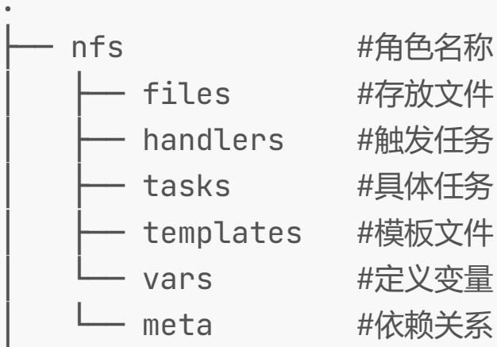
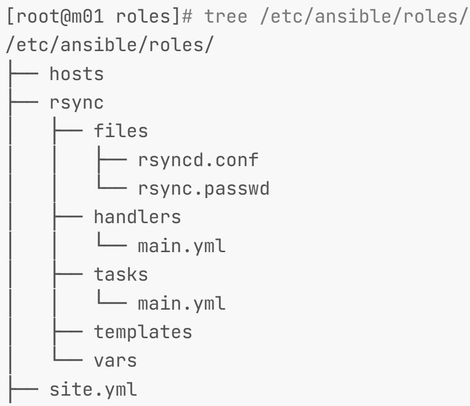
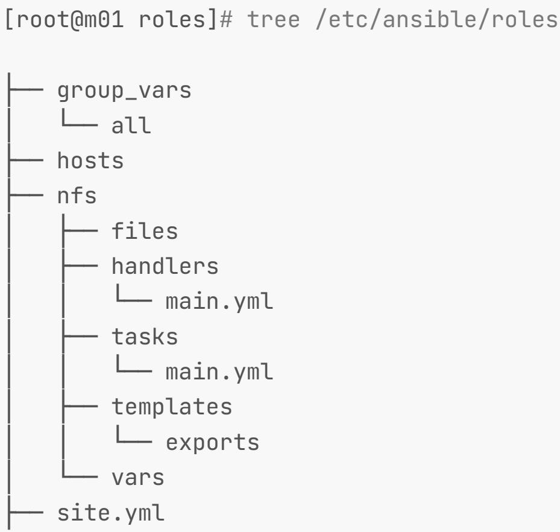

# 1.Ansible delegate

1.1 什么是Task委派

1.2 TASK委派场景实践1

1.3 TASK委派场景实践2

1.4 TASK委派场景实践3

1.4.1 Ansible构建haproxy集群

1.4.2 Ansible清单配置

1.4.3 Ansible委派配置

1.4.4 Ansible委派验证

# 2.Ansible Jinja2

2.1 什么是jinja2

2.2 Ansible如何使用jinja2

2.3 jinja模板基本语法

2.4 jinja模板逻辑关系

2.5 jinja模板示例

2.6 案例1-Jinja2管理Nginx

2.7 案例2-Jinja2管理Keepalived

2.8 案例3-Jinja2管理MySQL

# 3.Ansible vault

3.1 Ansible Vault概述

3.2 Ansible Vault应用

# 4.Ansible Roles

4.1 Roles基本概述

4.2 Roles目录结构

4.3 Roles依赖关系

4.4 Roles编写思路

4.5 案例1-Roles部署Rsync

4.6 案例2-Roles部署NFS

4.7 案例3-Roles部署Memcached

# 1.Ansible delegate

# 1.1 什么是Task委派

简单来说，就是本来需要在当前 "被控制端主机" 执行的操作，被委派给其他主机执行。

# 1.2 TASK委派场景实践1

? 场景说明：

1.为 172.16.1.7 服务器添加一条 hosts 记录:1.1.1.1 oldxu.com

2.同时要把这个 hosts 记录写一份至到 172.16.1.5 节点

3.除此任务以外 172.16.1.7 的其他任务都不会委派给172.16.1.5 执行。

1.使用 delegate_to 关键字实现 task 委派。

```
[root@ansible project1]# cat ansible_de.yml
- hosts: 172.16.1.7
tasks:
- name: Add WebServers DNS
shell: "echo 1.1.1.1 oldxu.com >> /etc/hosts"
- name: delegate_to Host 172.16.1.5
shell: "echo 1.1.1.1 oldxu.com >> /etc/hosts"
delegate_to: 172.16.1.5
- name: Add WebServers DNS
shell: "echo 2.2.2.2 oldxu2.com >> /etc/hosts" 
```

2.如果该任务要对 ansible 控制节点执行怎么办? 可以委派127.0.0.1 或者使用 local_action 来实现。

```
[root@oldxu-ansible-172 ~]# cat ansible_de.yml
- hosts: 172.16.1.7
tasks:
- name: Add WebServers DNS 
shell: "echo 1.1.1.1 oldxu.com >> /etc/hosts"
- name: delegate_to Host 172.16.1.5
shell: "echo 1.1.1.1 oldxu.com >> /etc/hosts"
delegate_to: 172.16.1.5

# - name: delegate_to Host 127.0.0.1
# shell: "echo 1.1.1.1 oldxu.com >> /etc/hosts"
# delegate_to: 127.0.0.1
# delegate_facts: True # 收集被委托机器的 facts

#local_action方式
- name: delegate_to Host 127.0.0.1
shell: "echo 1.1.1.1 oldxu.com >> /etc/hosts"
connection: local
```

# 1.3 TASK委派场景实践2

# 创建普通用户管理ansible

```
[root@lb01 ~]# cat user_manager_ansible.yml
- hosts: webservers
vars:
    - user_name: oldxu_demo
tasks:
# manager
- name: Create Manager Oldxu_demo
user:
    name: "{{ user_name }}"
    generate_ssh_key: yes
    ssh_key_bits: 2048
    ssh_key_file: .ssh/id_rsa
register: user_message
delegate_to: localhost # 委派给管理端
run_once: true 
```

# 委派任务仅执

行一次

# node

```
- name: 打印管理用户的key结果
    debug:
    msg: "{{ user_message.ssh_public_key }}"
- name: 在被控端上创建用户
    user:
    name: "{{ user_name }}"
- name: 在被控端上创建用户.ssh目录
    file:
    path: /home/{user_name}/.ssh
    state: directory
    owner: "{{ user_name }}"
    group: "{{ user_name }}"
    mode: "0700"
- name: 将管理端 {{ user_name }} 用户的key存储到被控端
    copy:
    content: "{{ user_message.ssh_public_key }}"
    dest: /home/{user_name}/.ssh/authorized_keys
    owner: "{{ user_name }}"
    group: "{{ user_name }}"
    mode: "0600"
- name: 配置被控制端sudo提权, 最后追加一行
lineinfile:
    dest: /etc/sudoers
    line: "{{ user_name }} ALL=(ALL)
NOPASSWD:ALL"
```

# 1.4 TASK委派场景实践3

1.首先搭建 Haproxy + web_cluster 集群环境。

2.当 web 节点代码需要更新时，需要下线节点，这个时候需要将下线节点的任务委派给 Haproxy

3.操作 web_cluster 集群，将新的代码替换上

4.当 web 节点代码更新成功后，需要上线节点，这个时候需要将上线节点的任务委派给 Haproxy

5.然后依次循环，直到完成所有节点的代码更新与替换

# 1.4.1 Ansible构建haproxy集群

建议改为ansible部署，不建议手动部署

1.配置 Haproxy 负载均衡

```
[root@lb01 ~]# cat /etc/haproxy/haproxy.cfg
# ----
# Global settings
#
global
log 127.0.0.1 local2
chroot /var/lib/haproxy
pidfile /var/run/haproxy.pid
maxconn 50
user haproxy
group haproxy
daemon
stats socket /var/lib/haproxy/stats level admin
# ----
# Defaults settings
# ---- 
```

defaults

```
mode http
log global
option httplog
option dontlognull
option http-server-close
option forwardfor except 127.0.0.0/8
option redispatch
retries 3
timeout http-request 10s
timeout queue 1m
timeout connect 10s
timeout client 1m
timeout server 1m
timeout http-keep-alive 10s
timeout check 10s
maxconn 3000 
```

\#-

# Listen settings

\#-

listen haproxy-stats

bind *:9999

stats enable

\#stats refresh 1s

stats hide-version

stats uri /haproxy?stats

stats realm "HAProxy statistics"

stats auth admin:123456

stats admin if TRUE

\#-

# frontend proxys www_site

```
#----
frontend www
    bind *:80
    mode http
    use_backend web_cluster
#----
# Backend Servers
#
----
backend web_cluster
balance roundrobin
server 172.16.1.7 172.16.1.7:80 check port 80
server 172.16.1.8 172.16.1.8:80 check port 80 
```

# 2. web1 节点配置如下

```
[root@web01 ~]# yum install nginx -y
[root@web01 ~]# echo "Web Page RS-Node1"
/usr/share/nginx/html/index.html
[root@web01 ~]# systemctl start nginx 
```

# 3. web2 节点配置如下

```
[root@web02 ~]# yum install nginx -y
[root@web02 ~]# echo "Web Page RS-Node2"
/usr/share/nginx/html/index.html
[root@web02 ~]# systemctl start nginx 
```

# 1.4.2 Ansible清单配置

```
[root@ansible ~]# cat /etc/ansible/hosts
[lbservers]
172.16.1.5
[webservers]
172.16.1.7
172.16.1.8 
```

1.4.3 Ansible委派配置

```
[root@lb02 ~]# cat haproxy_delegate.yml
- hosts: webservers
    serial: 1    # 控制一次操作多少台主机
    tasks:
    # 下线节点
    - name: Stop Haproxy Webcluster Pool Node
    haproxy:
    socket: /var/lib/haproxy/stats
    backend: "web_cluster"
    state: disabled
    host: "{{ inventory_hostname }}" # 获取当前操作节点主机名称
    delegate_to: "172.16.1.5"    # 下线节点任务委派给负载均衡节点
# 部署代码
- name: Copy New Code Web Node Server
    copy:
    content: "App Deploy New-
{{ansible_eth1.ipv4.address.split('.')[-1]}}"
    dest: /usr/share/nginx/html/index.html
    mode: 644
    notify: Restart Nginx Server

# 上线节点
- name: Start Haproxy Webcluster Pool Node
haproxy:
    socket: /var/lib/haproxy/stats
    backend: "web_cluster"
    state: enabled
    host: "{{ inventory_hostname }}"
    delegate_to: "172.16.1.5" 
handlers:
- name: Restart Nginx Server
systemd:
  name: nginx
  state: reloaded 
```

1.4.4 Ansible委派验证

```
[root@lb01 ~]# for i in {1..100}; do curl
"http://10.0.0.5" && sleep 0.5 && echo;done
Haproxy Deploy Version 3
Haproxy Deploy Version 3
Haproxy Deploy Version 3
Haproxy Deploy Version 4 # 更新了新的代码
Haproxy Deploy Version 4
Haproxy Deploy Version 4
Haproxy Deploy Version 3 # 新老代码交替访问
Haproxy Deploy Version 4
Haproxy Deploy Version 3
Haproxy Deploy Version 4
Haproxy Deploy Version 3
Haproxy Deploy Version 4 # 其他节点都更新完毕后，
至此完成了任务委派
Haproxy Deploy Version 4
Haproxy Deploy Version 4
Haproxy Deploy Version 4
Haproxy Deploy Version 4
Haproxy Deploy Version 4
```

# 2.Ansible Jinja2

# 2.1 什么是jinja2

Jinja2 是 Python 的全功能模板引擎

Ansible 需要使用 Jinja2 模板来修改被管理主机的配置文件。

场景1：给10台主机装上Nginx服务，但是要求每台主机的端口都不一样，如何解决？

场景2：

# 2.2 Ansible如何使用jinja2

ansible 使用 jinja2 模板需要借助 template 模块实现，那template 模块是用来做什么的?

template 模块和 copy 模块完全一样，都是拷贝文件至远程主机，区别在于 template 模块会解析要拷贝的文件中变量的值，而 copy则是原封不动的将文件拷贝至被控端。

# 2.3 jinja模板基本语法

1）要想在配置文件中使用 jinj2 ， playbook 中的 tasks 必须使用 template 模块

2）配置文件里面使用变量，比如 {{ PORT }} 或使用 {{facts 变量 }}

# 2.4 jinja模板逻辑关系

1.循环表达式

```
... 
```

2.判断表达式

```
...... 
```

# 3.注释

```
{# COMMENT #} 
```

# 2.5 jinja模板示例

1.使用 Playbook 推送文件

```
[root@m01 playbook]# cat jinja2.yml
- hosts: web
tasks:
  - name: Copy Template File /etc/motd
    template: src=./motd.j2 dest=/etc/motd 
```

2.准备 motd.j2 文件

```
[root@m01 playbook]# cat motd.j2
Welcome to {{ ansible_hostname }}
This system total Memory is: {{ ansible_memtotal_mb }} MB
This system free Memory is: {{ ansible_memfree_mb }} MB 
```

3.执行 playbook

```
[root@m01 playbook]# ansible-playbook jinja2.yml
PLAY [web]
**************************
**************************
**************************
TASK [Gathering Facts]
**************************
**************************
**************************
ok: [172.16.1.8]
ok: [172.16.1.7] 
TASK [Copy Template File /etc/motd]
**************************
**************************
**************************
changed: [172.16.1.8]
changed: [172.16.1.7] 
```

PLAY RECAP

```
******************************************************************************************
****************************************************************************************** 
172.16.1.7 : ok=2 changed=1
unreachable=0 failed=0
172.16.1.8 : ok=2 changed=1
unreachable=0 failed=0 
```

4.检查执行后的状态

```
[root@m01 playbook]# ssh root@172.16.1.7
Welcome to web01
This system total Memory is: 470 MB
This system free Memory is: 193 MB
[root@m01 playbook]# ssh root@172.16.1.8
Welcome to web02
This system total Memory is: 470 MB
This system free Memory is: 198 MB 
```

上面的例子展示了如何使用 facts 变量，当 playbook 被执行后， ansible_hostname 和 ansible_memtotal_mb 将会被替换成被管理主机上搜集的 facts 变量的值

# 2.6 案例1-Jinja2管理Nginx

ansible 使用 jinja2 的 for 循环表达式渲染出 nginx负载均衡的配置文件

1.使用 Playbook 推送文件

```
[root@m01 playbook]# cat proxy.yml 
- hosts: web
vars:
http_port: 80
server_name: www.oldxu.net

tasks:
- name: Copy Template Nginx Configure template: src=blog.conf.j2
dest=/etc/nginx/conf.d/blog.oldxu.net.conf
notify: Reload Nginx Server

handlers:
- name: Reload Nginx Server service: name=nginx state=reloaded 
```

2.准备 blog.conf.j2 配置文件

```
[root@m01 playbook]# cat blog.conf.j2
upstream {{ server_name }} {
    # 写法1
    
    server 172.16.1.{{i}}:{{ http_port }};
    
}

# 写法2
upstream {{ server_name }} {
    
    server {{ host }}:{{ http_port }};
    
}

server {
    listen {{ http_port }};
    server_name {{ server_name }};
    location / {
proxy_pass http://{{ server_name }};
proxy_set_header Host $http_host;
} 
```

3.执行 playbook

```
[root@m01 playbook]# ansible-playbook proxy.yml

PLAY [web]

************************** 
```

4.检查 jinja 模板渲染出来的配置文件

```
[root@web02 ~]# cat
/etc/nginx/conf.d/blog.oldxu.net.conf 
upstream www.oldxu.net {
    #设置变量，并进行循环赋值，渲染配置
    server 172.16.1.7:80;
    server 172.16.1.8:80;
    server 172.16.1.9:80;
    }
server {
    listen 80;
    server_name www.oldxu.net;
    location / {
    proxy_pass http://www.oldxu.net;
    proxy_set_header Host $http_host;
    }
}
```

# 2.7 案例2-Jinja2管理Keepalived

ansible使用jinja2的if判断，渲染出keepalived的Master和Slave配置文件。并推送至lb组，思路如下：

1.设定 Inventory 中 host_vars 然后根据不同主机设定不同的变量

2.在 Playbook 中使用 when 判断主机名称，然后分发不同的配置文件。

3.使用 jinja2 的方式渲染出不同的配置文件。

1.使用 playbook 推送 keeplaived 配置文件

```
[root@m01 playbook]# cat keepalived.yml
- hosts: lb
tasks:
  - name: Copy Template Keepalived Configure
    template: src=keepalived.j2
dest=/etc/keepalived/keepalived.conf
    notify: Restart Keepalived Server
handlers:
  - name: Restart Keepalived Server
    service: name=keepalived state=restarted 
```

2.准备 keepalived.j2 配置文件

```
[root@m01 playbook]# cat keepalived.j2
global_defs {
    router_id {{ ansible_fqdn }}
}
vrrp_instance VI_1 {
    
    #如果主机名为lb01则使用如下配置
    state MASTER
    priority 150
    
    #如果主机名为lb02则使用如下配置
    state Backup
    priority 100
    
    #相同配置
    interface eth0
    virtual_router_id 51
    advert_int 1
    authentication {
    auth_type PASS
    auth_pass 1111
    }
    virtual_ipaddress {
10.0.0.3
} 
```

3.执行 playbook

```
[root@m01 playbook]# ansible-playbook keepalived.yml
PLAY [lb]
**************************
************************** 
```

TASK [Gathering Facts]

```
**********************************************************************
**********************************************************************
ok: [172.16.1.5]
ok: [172.16.1.6] 
```

TASK [Copy Template Keepalived Configure]

```
**************************
**************************
**************************
changed: [172.16.1.6]
changed: [172.16.1.5] 
```

RUNNING HANDLER [Restart Keepalived Server]

```
**********************************************************************
******************************************************************
changed: [172.16.1.6]
changed: [172.16.1.5] 
```

PLAY RECAP

```
******************************************************************************************
****************************************************************************************** 
172.16.1.5 : ok=3 changed=2
unreachable=0 failed=0
172.16.1.6 : ok=3 changed=2
unreachable=0 failed=0 
```

4.检查 lb01 Master 的 keepalived 配置文件

```
[root@lb01 ~]# cat /etc/keepalived/keepalived.conf
global_defs {
    router_id lb01
}
vrrp_instance VI_1 {
#如果主机名为lb01则使用如下配置
state MASTER
interface eth0
virtual_router_id 51
priority 150

#相同配置
advert_int 1
authentication {
    auth_type PASS
    auth_pass 1111
}
virtual_ipaddress {
    10.0.0.3
}
}
```

5.检查 lb02 Backup 的 keepalived 配置文件

```
[root@lb02 ~]# cat /etc/keepalived/keepalived.conf
global_defs {
    router_id lb02
}
vrrp_instance VI_1 {
    #如果主机名为lb02则使用如下配置
    state Backup
    interface eth0
    virtual_router_id 51
    priority 100
#相同配置
advert_int 1
authentication {
    auth_type PASS
    auth_pass 1111
}
virtual_ipaddress {
    10.0.0.3
} 
```

# 2.8 案例3-Jinja2管理MySQL

使用 Ansible jinja IF 生成不同的 mysql 配置文件

```
[root@m01 project2]# cat jinja_mysql.yml
- hosts: webservers
    gather_facts: no
    vars:
    PORT: 13306
    # PORT: false  #相当于开关
    tasks:
    - name: Copy MySQL Configure
    template: src=./my.cnf.j2 dest=/tmp/my.cnf

#my.cnf配置文件
[root@m01 project2]# cat my.cnf.j2

bind-address=0.0.0.0:{{ PORT }}

bind-address=0.0.0.0:3306

```

# 3.Ansible vault

# 3.1 Ansible Vault概述

Ansible Vault 可以将敏感的数据文件进行加密，而非存放在明文的playbooks 中；

比如：部分playbook内容中有明文密码信息，可以对其进行加密操作；后期只有输入对应的密码才可以查看、编辑或执行该文件，如没有密码则无法正常运行；

# 3.2 Ansible Vault应用

1.使用 ansible-vault encrypt 进行加密文件

```
[root@m01 playbook]# ansible-vault-2 encrypt hello.yml
New Vault password:
Confirm New Vault password:
Encryption successful 
```

\#查看加密内容

```
[root@m01 playbook]# cat hello.yml
$ANSIBLE_VAULT;1.1;AES256
3538333933353031663161663238393462376136363161613936
3832353463333533636137646530
3337373264366537313161633430663132653861396439390a37
6130333434373863343931643665
3535366566303237386332626636376166636537336232636161
3732623137383431343539313061
3837643566303164650a61356264343736346564383466343662
6232623334613762396636346130
3664343236386265323235633164303664613434643865373838
3565616438393835 
```

2.使用 ansible-vault view 查看加密的文件

```
[root@m01 playbook]# ansible-vault view hello.yml
Vault password: #如果没有密码则无法查看
---
This is vault file
```

3.使用 ansible-vault edit 编辑加密的文件

```
[root@m01 playbook]# ansible-vault edit hello.yml
Vault password: #输入密码才可编辑
```

4.使用 ansible-vault 改变加密的文件

```
[root@m01 playbook]# ansible-vault rekey hello.yml
Vault password: #旧密码
New Vault password: #新密码
Confirm New Vault password:
Rekey successful
```

5.可以指定密码文件，避免重复输入密码

```
[root@m01 playbook]# echo "123" > file_pass
[root@m01 playbook]# ansible-vault edit hello.yml -- vault-password-file=file_pass 
```

6.执行加密的 playbook 方法如下

```
[root@m01 playbook]# ansible-playbook hello.yml -- vault-password-file=file_pass 
```

在 ansible.cfg 里新增 vault_password_file 参数，并指定密码文件路径。

```
[root@m01 playbook]# vi ansible.cfg
[defaults]
vault_password_file = file_pass 
```

7.使用 ansible-vault 移除加密的文件

```
[root@m01 playbook]# ansible-vault decrypt hello.yml
Vault password:    #输入正确密码
Decryption successful
[root@m01 playbook]# cat hello.yml  #移除密码后可正常查看
---
This is vault file
```

# 4.Ansible Roles

# 4.1 Roles基本概述

Roles 是组织 Playbook 最好的一种方式，它基于一个已知的文件结构，去自动的加载 vars，tasks 以及 handlers 以便playbook 更好的调用。 roles 相比 playbook 的结构更加的清晰有层次，但 roles 要比 playbook 稍微麻烦一些；

比如：安装任何软件都需要先安装时间同步服务，那么每个 playbook都要编写时间同步服务的 task ，会显得整个配置比较臃肿，且难以维护；

如果使用Role：我们则可以将时间同步服务 task 任务编写好，等到需要使用的时候进行调用就行了，减少重复编写task带来的文件臃肿；

# 4.2 Roles目录结构

`roles 官方目录结构，必须按如下方式定义。在每个目录中必须有main.yml 文件，这些属于强制要求

```
[root@m01 ~]# cd /etc/ansible/roles
[root@m01 roles]# mkdir
{nfs,rsync,web}/{vars,tasks,templates,handlers,files,meta} -p
[root@m01 roles]# tree 
```



# 4.3 Roles依赖关系

roles 允许在使用时自动引入其他 role ， role 依赖关系存储在 meta/main.yml 文件中。

例如: 安装 wordpress 项目时:

1.需要先确保 nginx 与 php-fpm 的 role 都能正常运行

2.然后在 wordpress 的 role 中定义，依赖关系

3.依赖的 role 有 nginx 以及 php-fpm

```
#wordpress依赖nginx与php-fpm的role
[root@m01 playbook]# cat
/root/roles/wordpress/meta/main.yml
---
dependencies:
  - { role: nginx }
  - { role: php-fpm }
```

wordpress 的 role 会先执行 nginx、php-fpm 的 role ，最后在执行 wordpress 本身

# 4.4 Roles编写思路

1.创建 roles 目录结构，手动创建或使用 ansible-galaxyinit test roles

2.编写 roles 的功能，也就是 tasks

3.最后 playbook 引用 roles 编写好的 tasks

# 4.5 案例1-Roles部署Rsync

# 1.目录结构如下



# 2.定义 roles 主机清单

```
[root@m01 roles]# cat /etc/ansible/roles/hosts
[backup]
172.16.1.41 
```

# 3.查看 rsync 角色的 tasks 任务

```
[root@m01 roles]# cat
/etc/ansible/roles/rsync/tasks/main.yml
- name: Install Rsync Server
    yum: name=rsync state=present
- name: Configure Rsync Server
    copy: src={{ item.src }} dest=/etc/{item.dest}}
mode={{ item.mode }}
    with_items:
    - {src: "rsyncd.conf", dest: "rsyncd.conf",
    mode: "0644"}
    - {src: "rsync.passwd", dest: "rsync.passwd",
    mode: "0600"}
    notify: Restart Rsync Server
- name: Start Rsync Server
    service: name=rsyncd state=started enabled=yes 
```

4.查看 rsync 角色的 handlers

```
[root@m01 roles]# cat
/etc/ansible/roles/rsync/handlers/main.yml
- name: Restart Rsync Server
service: name=rsyncd state=restarted 
```

5.查看 rsync 角色的 files 目录

```
[root@m01 roles]# ll
/etc/ansible/roles/rsync/files/
total 8
-rw-r--r-- 1 root root 322 Nov 16 18:49 rsyncd.conf
-rw---- 1 root root 20 Nov 16 18:30 rsync.passwd 
```

6.在 playbook 中使用 role ，指定 backup 主机组，执行rsync 服务的 roles

```
[root@m01 roles]# cat /etc/ansible/roles/site.yml 
- hosts: backup
remote_user: root
roles:
- rsync 
```

[root@m01 roles]# ansible-playbook -i hosts site.yml PLAY [backup]

```
******************************************************************************************
****************************************************************************************** 
```

TASK [Gathering Facts]

```
******************************************************************************************
****************************************************************************************** 
ok: [172.16.1.41] 
```

TASK [backup : Install Rsync Server]

```
******************************************************************************************
****************************************************************************************** 
ok: [172.16.1.41] 
```

TASK [backup : Configure Rsync Server]

```
**********************************************************************
********************************************************************** 
ok: [172.16.1.41] 
```

TASK [backup : Start Rsync Server]

```
******************************************************************************************
****************************************************************************************** 
ok: [172.16.1.41] 
```

PLAY RECAP

```
******************************************************************************************
****************************************************************************************** 
172.16.1.41 : ok=5 changed=0
unreachable=0 failed=0 
```

# 4.6 案例2-Roles部署NFS

# 1.目录结构如下



# 2.定义 roles 主机清单

```
[root@m01 roles]# cat /etc/ansible/roles/hosts
[nfs]
172.16.1.31 
```

# 3.查看 nfs 角色的 tasks 任务

```
[root@m01 roles]# cat
/etc/ansible/roles/nfs/tasks/main.yml
- name: Install Nfs-Server
yum: name=nfs-utils state=present
- name: Configure Nfs-Server
template: src=exports dest=/etc/exports
notify: Restart Nfs-Server
- name: Create Directory Data
file: path={{ share_dir }} state=directory
owner=www group=www mode=0755
- name: Start Nfs-Server
service: name=nfs state=started enabled=yes 
```

4.查看 nfs 角色的 handlers

```
[root@m01 roles]# cat
/etc/ansible/roles/nfs/handlers/main.yml
- name: Restart Nfs-Server
service: name=nfs state=restarted 
```

5.查看 nfs 角色的 files 目录

```
[root@m01 roles]# cat
/etc/ansible/roles/nfs/templates/exports
{{ share_dir }} {{ share_ip }}
(rw, sync, all_squash, anonuid=666, anongid=666) 
```

1. nfs 对应的变量定义

```
[root@m01 roles]# cat
/etc/ansible/roles/group_vars/all
#nfs
share_dir: /data
share_ip: 172.16.1.31 
```

7.在 playbook 中使用 role ，指定 nfs 主机组，执行 nfs服务的 roles

```
[root@m01 roles]# cat /etc/ansible/roles/site.yml
- hosts: nfs
  remote_user: root
  roles:
    - nfs 
[root@m01 roles]# ansible-playbook -i hosts site.yml
PLAY [nfs] 
******************************************************************************************
****************************************************************************************** 
```

TASK [Gathering Facts]

```
**********************************************************************
**********************************************************************
ok: [172.16.1.31] 
```

TASK [nfs : Install Nfs-Server]

```
**********************************************************************
**********************************************************************
ok: [172.16.1.31] 
```

TASK [nfs : Configure Nfs-Server]

```
**********************************************************************
**********************************************************************
ok: [172.16.1.31] 
TASK [nfs : Create Directory Data]
**************************
**************************
ok: [172.16.1.31]

TASK [nfs : Start Nfs-Server]
**************************
**************************
ok: [172.16.1.31]

PLAY RECAP
**************************
**************************
**************************
172.16.1.31 : ok=5 changed=0
unreachable=0 failed=0 
```

# 4.7 案例3-Roles部署Memcached

# 1.目录结构如下

```
[root@m01 memcached]# cd /etc/ansible/roles/
[root@m01 memcached]# tree memcached/

tasks
main.yml
start.yml
template.yml
yum.yml
templates
memcached.j2 
```

# 2.查看 memcached 的 tasks

```
[root@m01 memcached]# cat tasks/main.yml
- include: yum.yml
- include: template.yml 
- include: start.yml

[root@m01 ~]# cat tasks/yum.yml
- name: install memcached package
    yum: name=memcached

[root@m01 ~]# cat tasks/template.yml
- name: Copy memcahed conf
    template: src=memcached.j2
dest=/etc/sysconfig/memcached

[root@m01 ~]# cat templates/memcached.j2
PORT="11211"
USER="memcached"
MAXCONN="{{ ansible_memtotal_mb//4 }}"
CACHESIZE="64"
OPTIONS=""
[root@m01 ~]# cat tasks/start.yml
- name: start memcached
    service: name=memcached state=started enabled=yes 
```

# 3.在 playbook 中使用 role ，执行 memcached 服务的 roles

```
[root@m01 ~]# cat site.yml
- hosts: "{{ host }}"
remote_user: root
roles:
    - role: memcached

# 执行playbook
[root@m01 ~]# ansible-playbook site.yml -e "host=10.0.0.51"
```