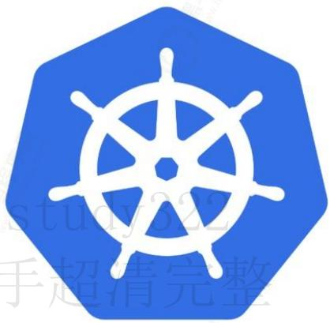

# kubernetes

# 1. k8s 基础入门

# 1.1 部署模式发展

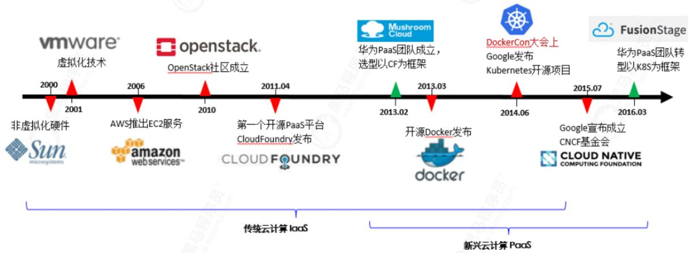

# 1.2 物理单机(~2000)

早期在物理服务器上运行应用程序也叫做传统的部署。

- 在商用服务计算领域几乎都是以单机为基础计算单元对计算资源进行管理和协调控制的

- 部署新应用往往需要购买一台物理机器或者一组机器，并在机器上进行构建，部署和运行，而且一台机器往往只能运行单个应用，成本高，利用率低

# 1.2.1 主要代表

IBM、Sun公司

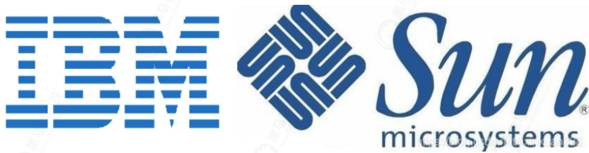

早期在物理服务器上运行应用程序也叫做传统的部署。

传统部署时代：在物理服务器上运行应用程序，无法为物理服务器中的应用程序定义资源边界，这会导致资源分配的问题。

例如，如果在物理服务器上运行多个应用程序，则可能存在一个应用程序占用大部分资源的情况，因此导致其他应用程序获取不到资源，所以往往解决方案是在不同的物理服务器上运行每个应用程序，但是由于资源未得到充分利用，没有扩展，组织和维护这么多物理服务器的成本很高。

# 1.3 虚拟化：初期 (2001~2009)

# 1.3.1 VMware

VMware: 2001年, Xen: 2003年, KVM: 2007年

- VMware发布了针对服务器市场的虚拟化技术方案：提升计算资源的利用率和降低使用成本

- Vmware、Xen和KVM三足鼎立，促进了VM概念的普及，拉开了虚拟化云计算时代的大幕，基础计算单元变为VM，服务端应用的构建、部署和运行逐步迁移到虚拟机VM上了。

- 充分地物理单机将划分为多个虚拟机，提高计算机资源的利用率和降低成本

vmware®


# 1.3.2 IaaS

AWS 2006年，GCE（Google Compute Engine）2008年

- 基于虚拟机技术的Amazon Web Services（AWS）开启了Infrastructure-as-a-Service（IaaS基础设施即服务）的市场

- 实现了自助的、按需租用以VM为基本计算单元的计算资源。

- 应用的部署运行依然以vm为单元并通过IaaS厂商提供的控制台实现高效的计算资源管理。


Google

这个时期也称为虚拟化部署时代：作为解决方案，引入了虚拟化。它允许在单个物理服务器的CPU上运行多个虚拟机（VM）。虚拟化允许应用程序在VM之间隔离，并提供一定程度的安全性，因为一个应用程序无法自由访问另一个应用程序的信息。

虚拟化可以更好地利用物理服务器中的资源，并且可以实现更好的可扩展性，因为可以轻松添加或更新应用程序，降低硬件成本等等。每个VM都是在虚拟化硬件之上运行所有组件（包括其自己的操作系统）的完整计算机。

# 1.4 虚拟化：成熟期（2010~至今）

# 1.4.1 OpenStack

OpenStack 2010 诞生，推动开源IaaS平台的快速发展，推动商家将自有数据中心改造为虚拟化平台，部署数据敏感、业务敏感的核心应用

- 部署形式：公有云、私有云、混合云

- 服务模式：IaaS、PaaS（Heroku 2009）、SaaS等

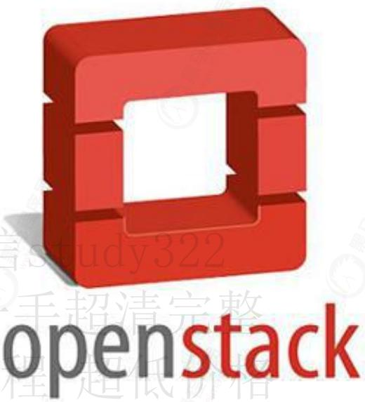

# 1.4.2 虚拟化四巨头

AWS、Azure、Aliyun、GCE (Google Compute Engine) : 2015-2017


Microsoft Azure

[一]阿里云

Google

# 基于虚拟化技术的公有云爆发式增长，形成公有云IaaS四巨头

2017年底，全球企业的一半以上的计算资源放在了公有云上，半数企业在内部完成了私有云部署

# 1.5 容器化: (2013-至今)

# 1.5.1 Docker

# 2013年诞生

- 以Docker为代表的内核容器技术不是新技术，而是将已有技术（LXC、cgroups、UnionFS）进行了更好的整合和包装，并形成了一种标准镜像格式。

- 与VM相比，容器具有开发交付流程操作对象同步、执行更为高效、资源占用更为集约等优势。

- 计算基本单元由虚拟机变为了容器，越来越多应用的构建、部署与运行选择在容器中进行。

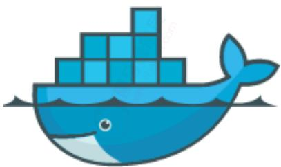

Docker能够解决什么问题？如果我们在一台服务器上只跑很多个服务，比如说有一个服务内存泄漏把整个服务器内存占满了，其他服务也跟着倒霉，所以需要把每个服务隔离起来，让它们只使用自己那部分有限的CPU，内存和磁盘以及依赖的软件包。Docker相比虚拟机来说少了操作系统这一层，所以占用的资源少，启动速度快，能够提供一定程度的隔离。而且运维简单，可以克隆多个个环境相同的容器。

这个时期也称为容器部署时代：容器类似于VM，但它们具有宽松的隔离属性，可在应用程序之间共享操作系统（OS）。因此，容器被认为是轻量的的。与VM类似，容器具有自己的文件系统，CPU，内存，进程空间等。

# 1.6 云原生：初期 (2015-至今)

# 1.6.1 云原生模式

- 随着容器技术的出现以及应用所面临的外部环境的变化，云原生逐渐成为一种应用云化开发、部署和运行的主流方式。基础前提：应用的容器化和微服务化。容器，作为应用部署、运行和管理的基本单元；

- 核心：借助容器管理自动化平台进行动态编排和资源优化利用。

# 1.6.2 K8S

CNCF, Kubernetes: 2015年

就在Docker容器技术被炒得热火朝天之时，大家发现，如果想要将Docker应用于具体的业务实现，是存在困难的一一编排、管理和调度等各个方面，都不容易，于是，人们迫切需要一套管理系统，对Docker及容器进行更高级更灵活的管理，Kuberentes可以说是乘着Docker和微服务的东风，一经推出便迅速蹿红，它的很多设计思想都契合了微服务和云原生应用的设计法则，Kuberentes从众多强大对手中脱颖而出。

# PaaS平台－抢做Docker管理平台


PaaSTa

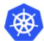

Kubernetes

Jun-2014

(initial release)

fleet


MESOS

2013

(Apache Project)


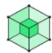

Lattice

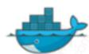

Compose/Swam

谁能胜出？

CLOUD FOUNDRY


DEIS


Apache AURORA


OPENSHIFT

Flynn


apache Stratos™


OCTOHOST

CNCF组织的成立为应用上云安全地采用云原生模式提供了更稳、更快、更安全的解决方案，其核心是Kubernetes。从众多强大对手中脱颖而出，Kubernetes为云原生模式下应用的部署、运行和管理提供了可移植的、云厂商无关的事实标准。

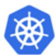

kubernetes

# 1.6.3 趋势

- 应用部署运行模式：单机->虚拟机->容器->云原生

- 应用部署运行：更敏捷、更自动化、更有效率、更低成本

- 开发者：更聚焦于应用本身

# 1.7 发展变迁

应用部署运行模式的演变图：

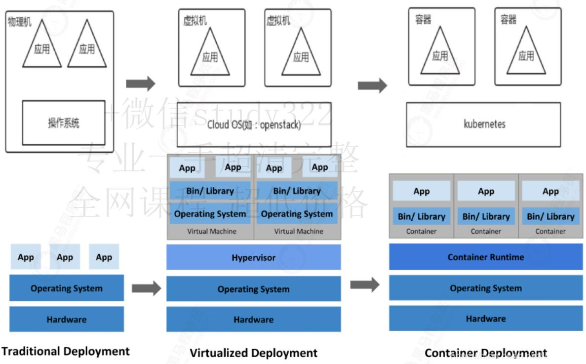

# 2. k8s 概述

# 2.1 k8s 是什么

K8S是 Kubernetes 的全称，官方称其是

Kubernetes is an open source system for managing containerized applications across multiple hosts. It provides basic mechanisms for deployment, maintenance, and scaling of applications.

用于自动部署、扩展和管理“容器化（containerized）应用程序”的开源系统。

# 2.2 K8s的由来

源自谷歌的Borg，Borg是谷歌公司的内部容器管理系统。

Borg系统运行几十万个以上的任务，来自几千个不同的应用，跨多个集群，每个集群（cell）有上万个机器。它通过管理控制、高效的任务包装、超售、和进程级别性能隔离实现了高利用率，它支持高可用性应用程序与运行时功能，最大限度地减少故障恢复时间，减少相关故障概率的调度策略，该项目的目的是实现资源管理的自动化以及跨多个数据中心的资源利用率最大化，Kubernetes项目的目的就是将Borg最精华的部分提取出来，使现在的开发者能够更简单、直接地应用。它以Borg为灵感，但又没那么复杂和功能全面，更强调了模块性和可理解性。

# 2.2.1 K8s发展历程

Kubernetes 是 Google 开源的容器编排系统，2014 年对外宣布，2015 年发布 1.0 版本，同年 Google 与 Linux 基金会一起成立云原生计算基金会（CNCF-Cloud Native Computing Foundation），并把 Kubernetes 作为种子产品捐赠给了 CNCF，Google 一直在带领着 Kubernetes 的开发，我们也可以看到 CNCF 的 Kubernetes 项目代码贡献量，Google 所占比重是最高的。

Commits by Company

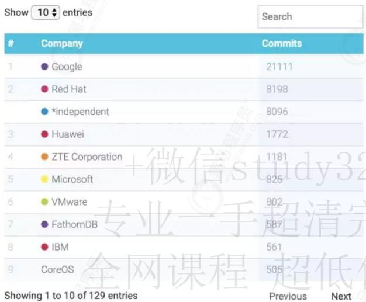

https://cdn-mineru.openxlab.org.cn/result/2026-05-18/b17df882-c59a-4bcd-afd8-7801d323e43c/65fc6ad783513cf99e0834d35fc0d181fb43bb943903fd3b90c8cb0ef8e87964.jpg

# 2.2.2 发展时间线

Google 在容器领域拥有超过 15 年的经验。

- 2003 年，Google 内部几个工程师做了一个集群自动化管理的工具，叫做 Borg;

- 2012 年，Google Borg 升级成 Omega，实现容器的管理；

- 2013年，随着业界Docker发布，整个行业开始往容器方向迁移；

- 2014 年，Borg/Omega 开源为 Kubernetes 项目；

- 到如今，Kubernetes 已经成为整个容器编排的主流技术。

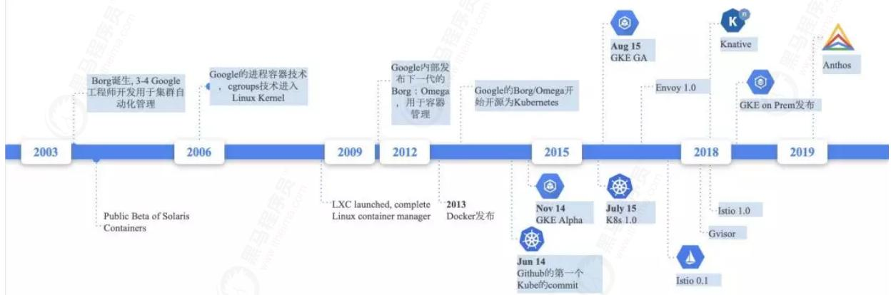

# 2.3 为什么使用k8s

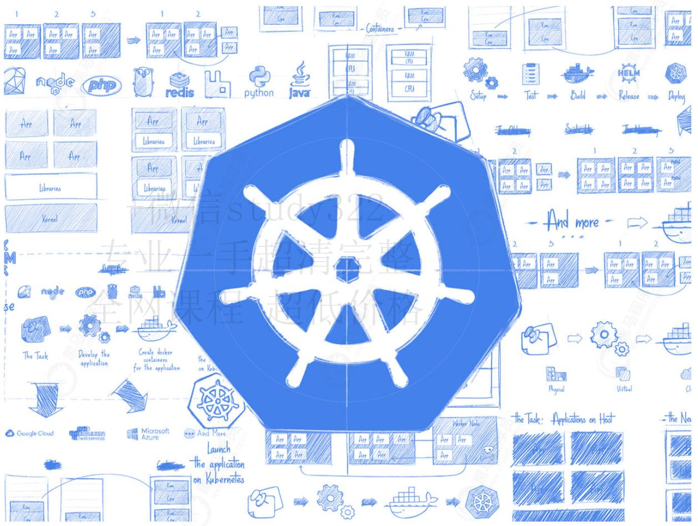

Kubernetes（Kube 或 K8s）越来越流行，他是市场上最好的容器编排工具之一。

# 2.3.1 什么是容器

- 容器就是一个包，其中包含了应用及其所有依赖。

- 容器中的应用与主机系统是隔离的，不关注环境。

- 不像虚拟机，容器不需要启动操作系统的完整周期，这就是为啥容器启动和停止都非常快，并且可以更高效使用磁盘、内存、处理器的原因。

- 你不必记着你的应用是用什么语言和框架开发的，因为所需的一切都打包在了容器中，例如运行时环境、所需的库等等，可以安全的迁移，可以在任何环境中部署。

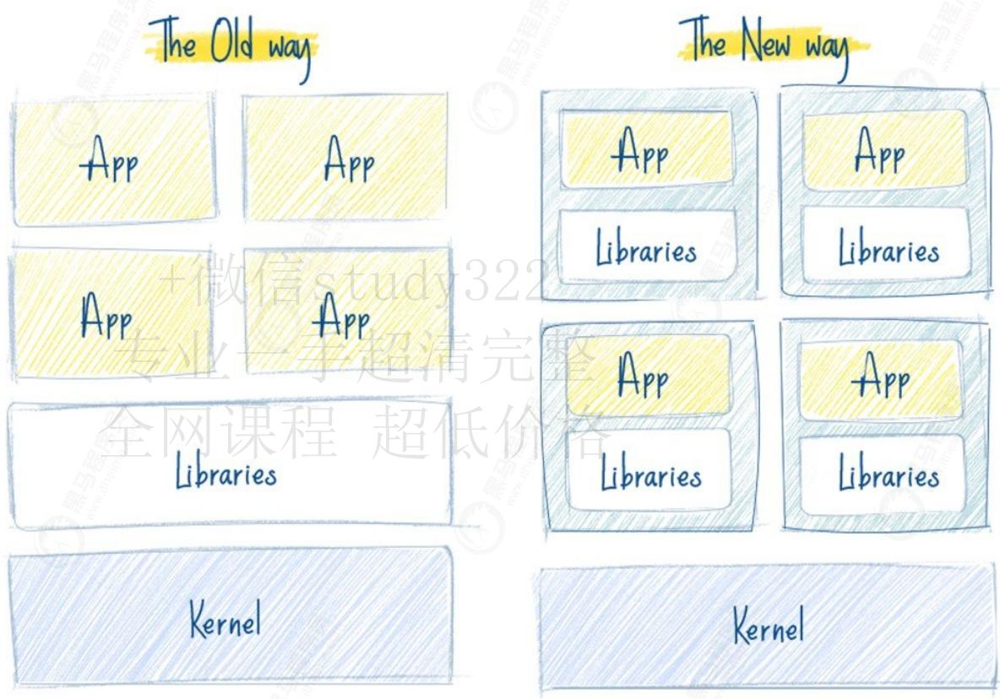

左边，应用是直接部署在服务器或者虚拟机里面的，右边，应用是打包在独立的容器中的，可以快速启动、智能扩展、在任何环境中平滑运行。

# 2.3.2 什么是 Kubernetes

Kubernetes 是一个开源项目，用于统一管理容器化的应用集群。

- Kubernetes 负责在大规模服务器环境中管理容器组（pod）的扩展、复制、健康，并解决 pod 的启动、负载均衡等问题。

- Kubernetes 最初是 Google 发布的，现在已经被多家大公司支持，例如 Microsoft, RedHat, IBM, Docker。

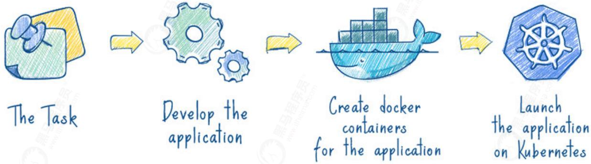

# 2.3.3 K8s 的著名优势特色

# 2.3.3.1 一个平台搞定所有

使用 Kubernetes，部署任何应用都是小菜一碟，只要应用可以打包进容器，Kubernetes 就一定能启动它。

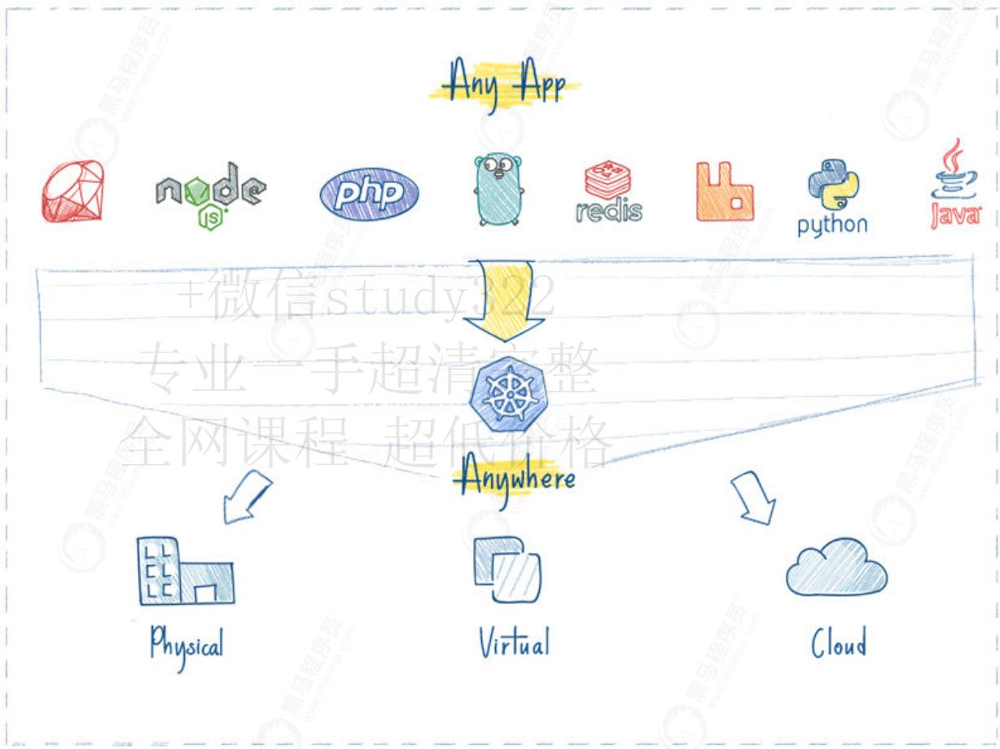

不管什么语言什么框架写的应用（Java, Python, Node.js），Kubernetes 都可以在任何环境中安全的启动它，物理服务器、虚拟机、云环境。

# 2.3.3.2 云环境无缝迁移

如果你有换云环境的需求，例如从 GCP 到 AWS，使用 Kubernetes 的话，你就不用有任何担心。


Google Cloud


amazon web services


Microsoft Azure


And More

Kubernetes 完全兼容各种云服务提供商，例如 Google Cloud、Amazon、Microsoft Azure，还可以工作在 CloudStack, OpenStack, OVirt, Photon, VSphere。

# 2.3.3.3 高效的利用资源

看下图，左边，是4个虚拟机，黄色和蓝色部分是运行的应用，白色部分是未使用的内存和处理器资源。

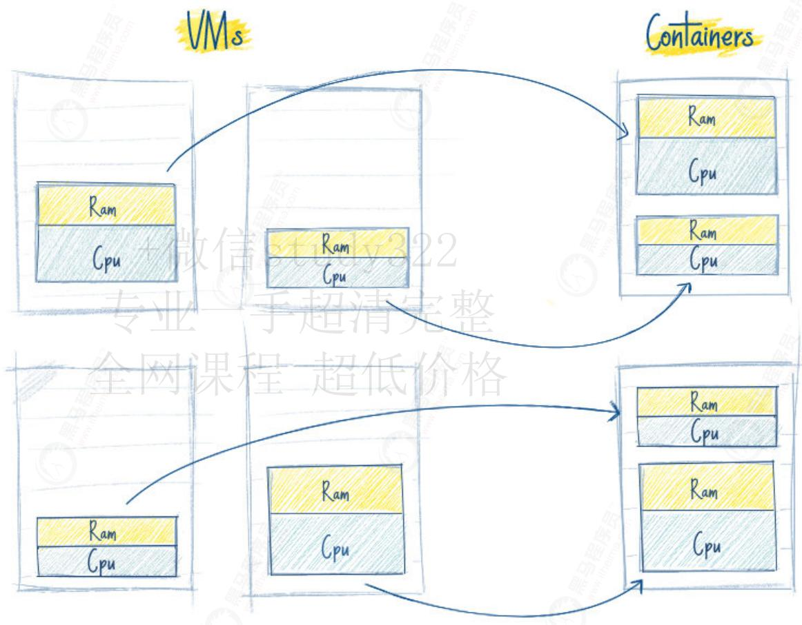

Kubernetes 如果发现有节点工作不饱和，便会重新分配 pod，帮助我们节省开销，高效的利用内存、处理器等资源。

如果一个节点宕机了，Kubernetes 会自动重新创建之前运行在此节点上的 pod，在其他节点上运行。

# 2.3.3.4 开箱即用的自动缩放能力

网络、负载均衡、复制等特性，对于 Kubernetes 都是开箱即用的。

- pod 是无状态运行的，任何时候有 pod 宕了，立马会有其他 pod 接替它的工作，用户完全感觉不到。

- 如果用户量突然暴增，现有的 pod 规模不足了，那么会自动创建出一批新的 pod，以适应当前的需求。

- 反之亦然，当负载降下来的时候，Kubernetes 也会自动缩减 pod 的数量。

# Scale Up

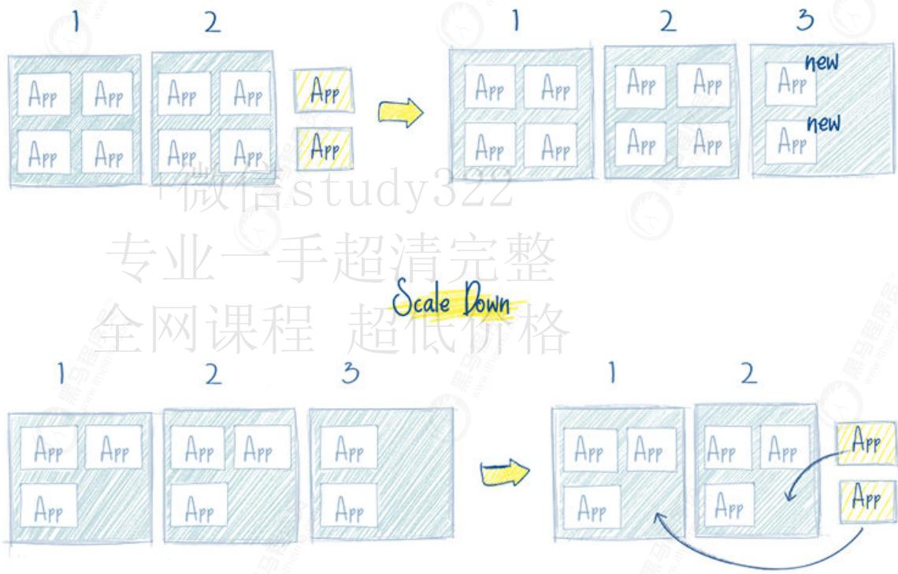

# 2.3.3.5 使 CI/CD 更加简单

你不必精通于 Chef 和 Ansible 这类工具，只需要对 CI 服务写个简单的脚本然后运行它，就会使用你的代码创建一个新的 pod，并部署到 Kubernetes 集群里面。

应用打包在容器中使其可以安全的运行在任何地方，例如你的PC、一个云服务器，使得测试极其简单。

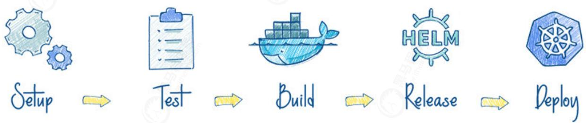

# 2.3.3.6 可靠性

Kubernetes 如此流行的一个重要原因是：应用会一直顺利运行，不会被 pod 或 节点的故障所中断。

如果出现故障，Kubernetes 会创建必要数量的应用镜像，并分配到健康的 pod 或节点中，直到系统恢复，而且用户不会感到任何不适。

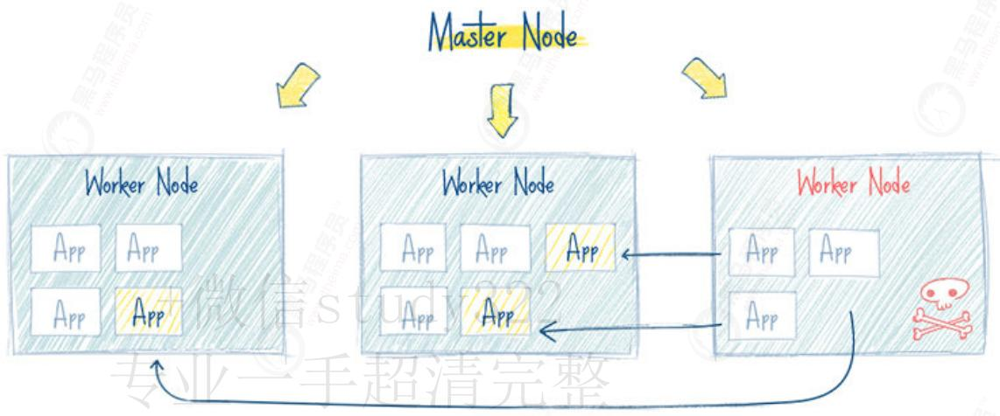

# 2.4 核心概念

# 2.4.1 节点

从上面的图可以看出来，k8s 集群的节点有两个角色，分别为 Master 节点和 Node 节点，整个 K8s 集群Master 和 Node 节点关系如下图所示：

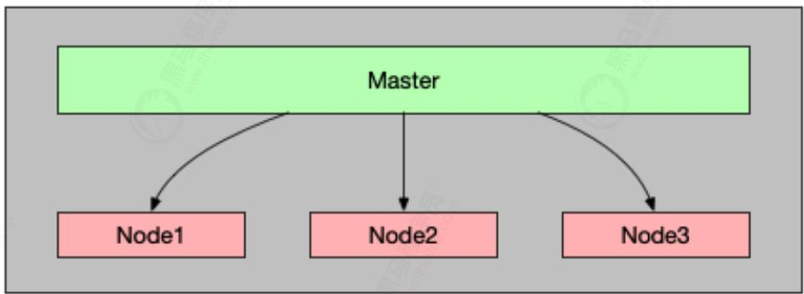

# 2.4.1.1 Master 节点

Master 节点也称为控制节点，每个 k8s 集群都有一个 Master 节点负责整个集群的管理控制，我们上面介绍的 k8s 三大能力都是经过 Master 节点发起的，Master 节点包含了以下几个组件：

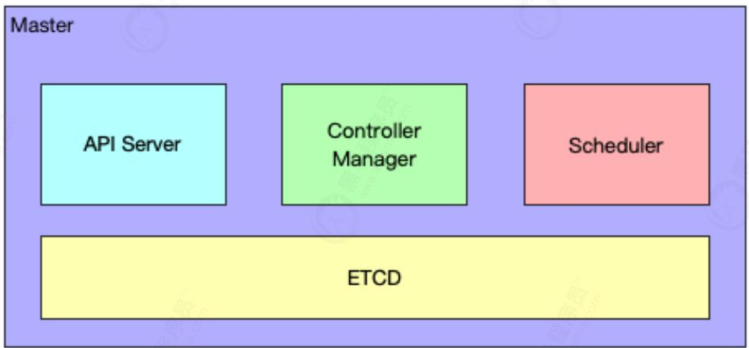

- API Server：提供了 HTTP Rest 接口的服务进程，所有资源对象的增、删、改、查等操作的唯一入口；

- Controller Manager: k8s 集群所有资源对象的自动化控制中心;

- Scheduler: k8s 集群所有资源对象自动化调度控制中心;

- ETCD：k8s 集群注册服务发现中心，可以保存 k8s 集群中所有资源对象的数据。

# 2.4.1.2 Node

Node 节点的作用是承接 Master 分配的工作负载，它主要有以下几个关键组件：

- kubelet：负责 Pod 对应容器的创建、启停等操作，与 Master 节点紧密协作；

- kube-porxy：实现 k8s 集群通信与负载均衡的组件。

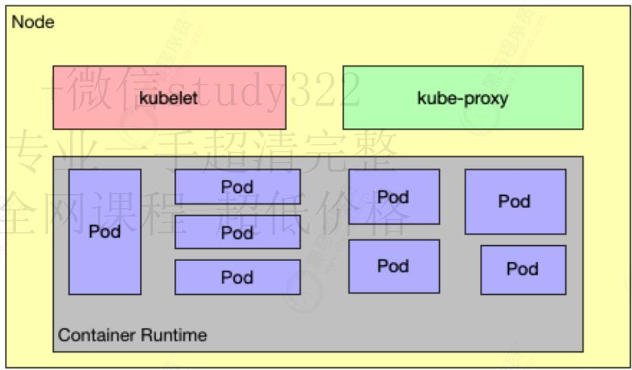

从图上可看出，在 Node 节点上面，还需要一个容器运行环境，如果使用 Docker 技术栈，则还需要在 Node 节点上面安装 Docker Engine，专门负责该节点容器管理工作。

# 2.4.2 Pod

Pod 是 k8s 最重要而且是最基本的一个资源对象，它的结构如下：

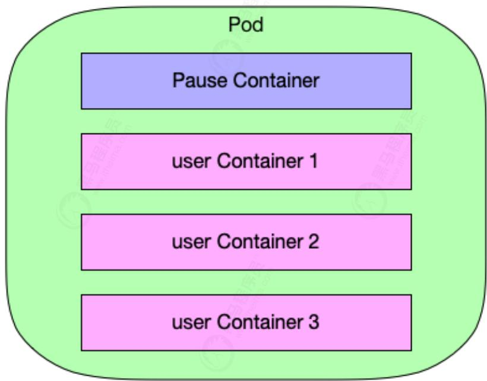

从以上 Pod 的结构图可以看出，它其实是容器的一个上层包装结构，这也就是为什么 K8s 可以支持多种容器类型的原因，基于这方面，k8s 的定位就是一个编排与调度工具，而容器只是它调度的一个资源对象而已。

Pod 可包含多个容器在里面，每个 Pod 至少会有一个 Pause 容器，其它用户定义的容器都共享该 Pause 容器，Pause 容器的主要作用是用于定义 Pod 的 ip 和 volume。

Pod 在 k8s 集群中的位置如下图所示:

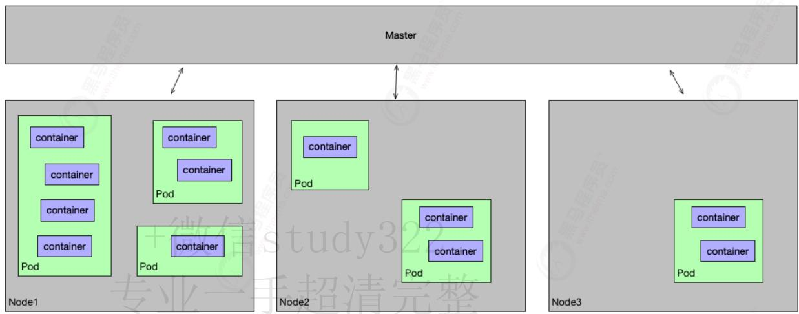

# 2.4.3 Label

Label 在 k8s 中是一个非常核心的概念，我们可以将 Label 指定到对应的资源对象中

例如 Node、Pod、Replica Set、Service 等，一个资源可以绑定任意个 Label，k8s 通过 Label 可实现多维度的资源分组管理，后续可通过 Label Selector 查询和筛选拥有某些 Label 的资源对象，例如创建一个 Pod，给定一个 Label，workerid=123，后续可通过 workerid=123 删除拥有该标签的 Pod 资源。

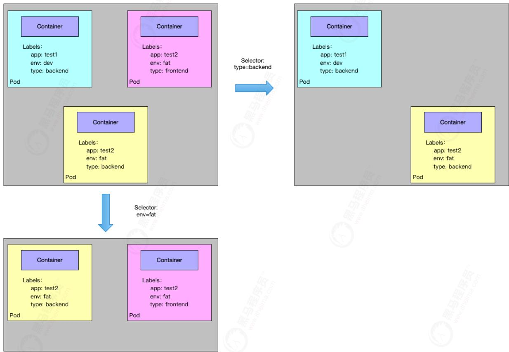

# 2.4.4 Replica Set

Replica Set 目的是为了定义一个期望的场景，比如定义某种 Pod 的副本数量在任意时刻都处于 Peplica Set 期望的值

假设 Replica Set 定义 Pod 的副本数目为：replicas=2，当该 Replica Set 提交给 Master 后，Master 会定期巡检该 Pod 在集群中的数目，如果发现该 Pod 挂掉了一个，Master 就会尝试依据 Replica Set 设置的 Pod 模版创建 Pod，以维持 Pod 的数量与 Replica Set 预期的 Pod 数量相同。

通过 Replica Set，k8s 集群实现了用户应用的高可用性，而且大大减少了运维工作量。因此生产环境一般用 Deployment 或者 Replica Set 去控制 Pod 的生命周期和期望值，而不是直接单独创建 Pod。

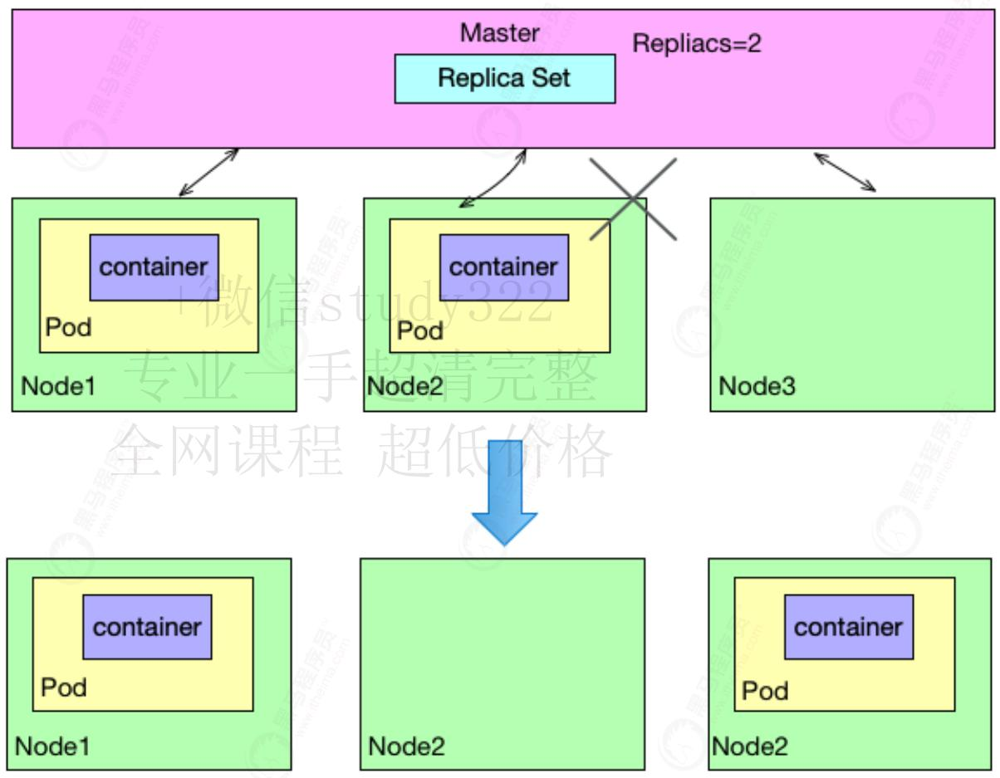

类似 Replica Set 的还有 Deployment，它的内部实现也是通过 Replica Set 实现的，可以说 Deployment 是 Replica Set 的升级版，它们之间的 yaml 配置文件格式大部分都相同。

# 2.4.5 Service

Service 是 k8s 能够实现微服务集群的一个非常重要的概念

顾名思义，k8s 的 Service 就是我们平时所提及的微服务架构中的“微服务”，本文上面提及的 Pod、Replica Set 等都是为 Service 服务的资源，如下图表示 Service、Pod、Replica Set 的关系：

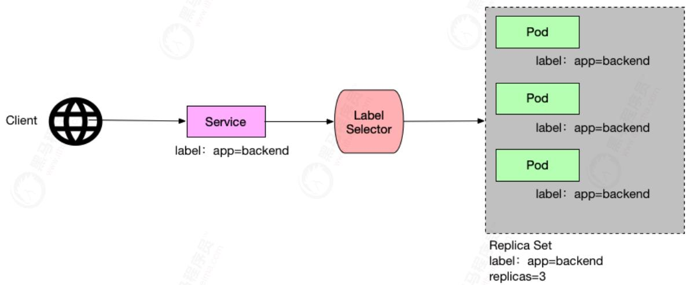

从上图可看出，Service 定义了一个服务访问的入口，客户端通过这个入口即可访问服务背后的应用集群实例，而 Service 则是通过 Label Selector 实现关联与对接的，Replica Set 保证服务集群资源始终处于期望值。

以上只是一个微服务，通常来说一个应用项目会由多个不同业务能力而又彼此独立的微服务组成，多个微服务间组成了一个强大而又高可用的应用服务集群。

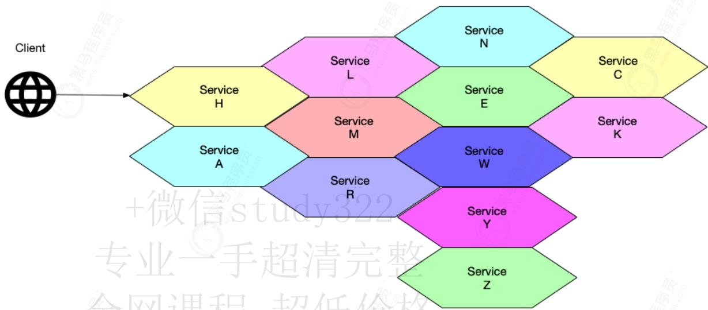

# 2.4.6 Namespace

Namespace 顾名思义是命名空间的意思，在 k8s 中主要用于实现资源隔离的目的

用户可根据不同项目创建不同的 Namespace，通过 k8s 将资源分配到不同 Namespace 中，即可实现不同项目的资源隔离：

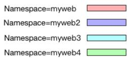

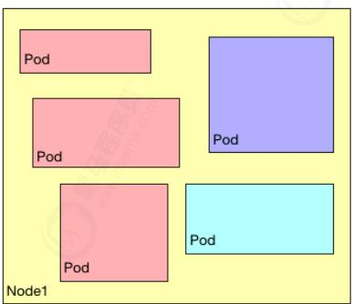

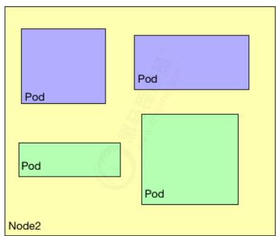

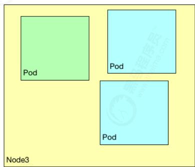

# 3. k8s 组件介绍

# 3.1 整体架构

下图清晰表明了 Kubernetes 的架构设计以及组件之间的通信协议。

Kubernetes' high-level component architecture

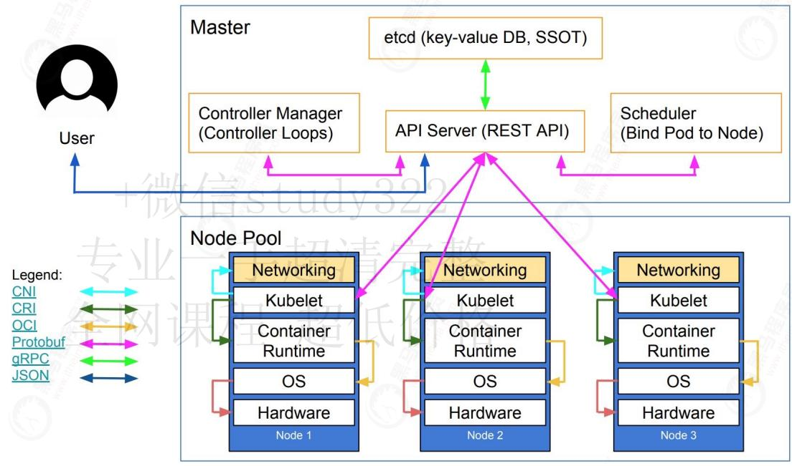

下面是更抽象的一个视图

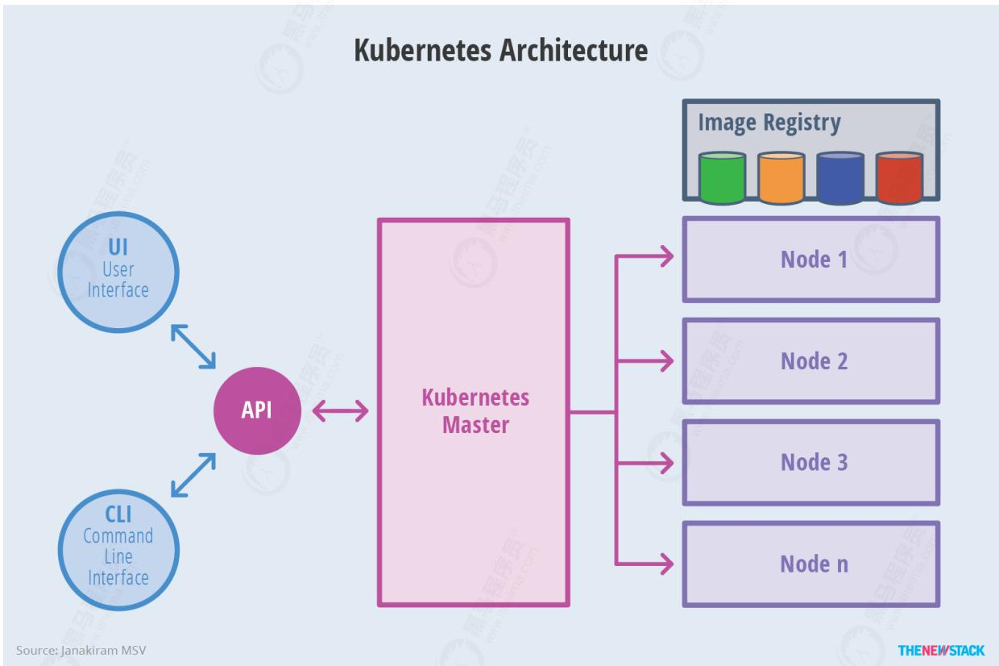

3.1.1 Master 架构

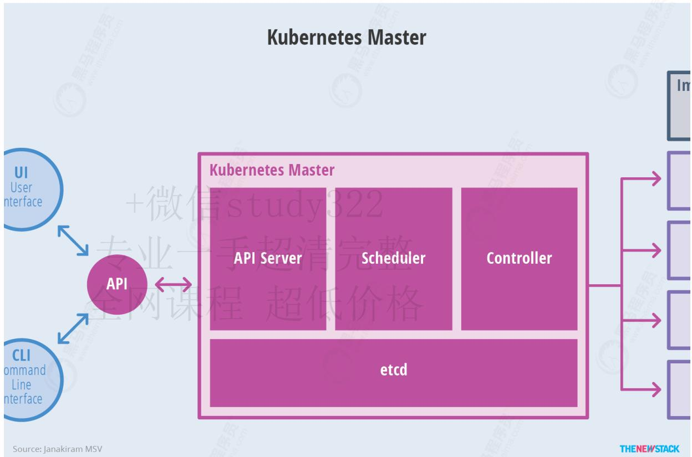

3.1.2 Node 架构

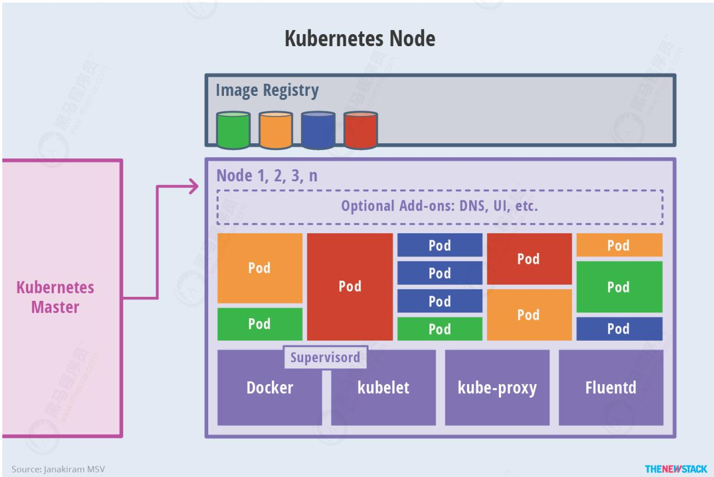

# 3.2 k8s部署组件介绍

我们把一个有效的 Kubernetes 部署称为集群，您可以将 Kubernetes 集群可视化为两个部分：

控制平面与计算设备（或称为节点），每个节点都是其自己的Linux环境，并且可以是物理机或虚拟机，每个节点都运行由若干容器组成的容器集。

# 3.2.1 K8s 集群架构图

以下 K8s 架构图显示了 Kubernetes 集群的各部分之间的联系：

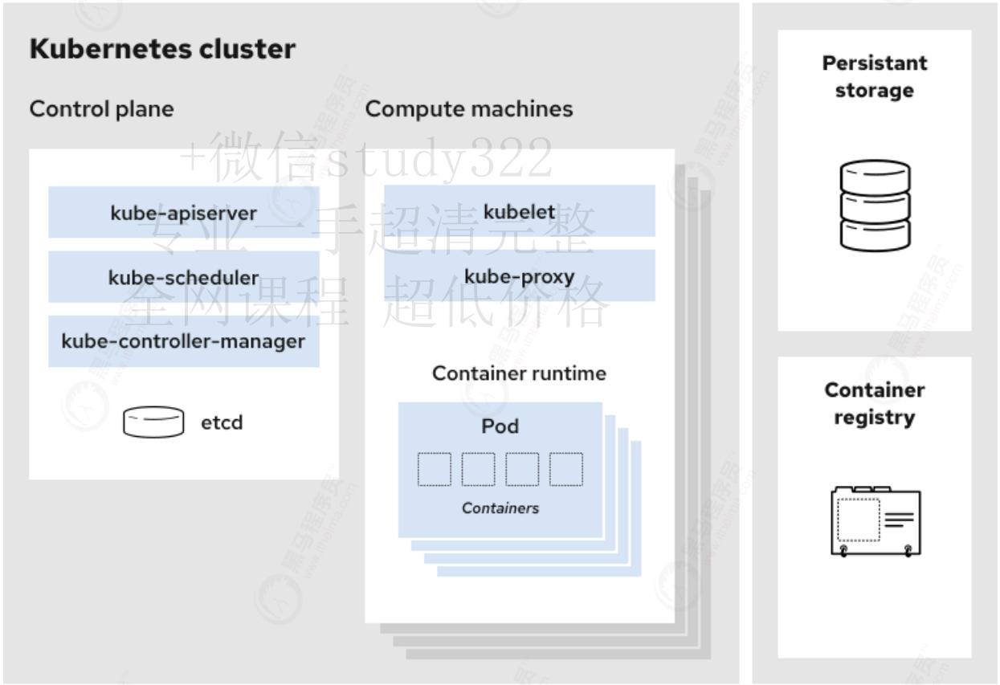

Underlying infrastructure


Physical


Virtual


Private


Public


Hybrid

# 3.2.2 k8s控制组件

# 3.2.2.1 控制平面

K8s 集群的神经中枢

让我们从 Kubernetes 集群的神经中枢（即控制平面）开始说起。在这里，我们可以找到用于控制集群的 Kubernetes 组件以及一些有关集群状态和配置的数据，这些核心 Kubernetes 组件负责处理重要的工作，以确保容器以足够的数量和所需的资源运行。

控制平面会一直与您的计算机保持联系。集群已被配置为以特定的方式运行，而控制平面要做的就是确保万无一失。

# 3.2.2.2 kube-apiserver

K8s 集群API，如果需要与您的 Kubernetes 集群进行交互，就要通过 API

Kubernetes API 是 Kubernetes 控制平面的前端，用于处理内部和外部请求。API 服务器会确定请求是否有效，如果有效，则对其进行处理，您可以通过 REST 调用、kubectl 命令行界面或其他命令行工具（例如 kubeadm）来访问 API。

# 3.2.2.3 kube-scheduler

K8s 调度程序，您的集群是否状况良好？如果需要新的容器，要将它们放在哪里？这些是 Kubernetes 调度程序所要关注的问题。

调度程序会考虑容器集的资源需求（例如 CPU 或内存）以及集群的运行状况。随后，它会将容器集安排到适当的计算节点。

# 3.2.2.4 kube-controller-manager

K8s 控制器，控制器负责实际运行集群，而 Kubernetes 控制器管理器则是将多个控制器功能合而为一

控制器用于查询调度程序，并确保有正确数量的容器集在运行。如果有容器集停止运行，另一个控制器会发现并做出响应。控制器会将服务连接至容器集，以便让请求前往正确的端点。还有一些控制器用于创建帐户和 API 访问令牌。

# 3.2.2.5 etcd

键值存储数据库

配置数据以及有关集群状态的信息位于 etcd（一个键值存储数据库）中。etcd 采用分布式、容错设计，被视为集群的最终事实来源。

# 3.2.3 k8s运行组件

# 3.2.3.1 k8s节点

Kubernetes 集群中至少需要一个计算节点，但通常会有多个计算节点。

容器集经过调度和编排后，就会在节点上运行。如果需要扩展集群的容量，那就要添加更多的节点。

# 3.2.3.2 容器集

容器集是 Kubernetes 对象模型中最小、最简单的单元。

它代表了应用的单个实例。每个容器集都由一个容器（或一系列紧密耦合的容器）以及若干控制容器运行方式的选件组成。容器集可以连接至持久存储，以运行有状态应用。

# 3.2.3.3 容器运行时引擎

为了运行容器，每个计算节点都有一个容器运行时引擎。

比如 Docker，但 Kubernetes 也支持其他符合开源容器运动（OCI）标准的运行时，例如 rkt 和 CRI-O。

# 3.2.3.4 kubelet

每个计算节点中都包含一个 kubelet，这是一个与控制平面通信的微型应用。

kublet 可确保容器在容器集内运行，当控制平面需要在节点中执行某个操作时，kubelet 就会执行该操作。

# 3.2.3.5 kube-proxy

每个计算节点中还包含 kube-proxy，这是一个用于优化 Kubernetes 网络服务的网络代理。

kube-proxy 负责处理集群内部或外部的网络通信——靠操作系统的数据包过滤层，或者自行转发流量。

# 3.2.4 k8s 存储组件

# 3.2.4.1 持久存储

除了管理运行应用的容器外，Kubernetes 还可以管理附加在集群上的应用数据。

Kubernetes 允许用户请求存储资源，而无需了解底层存储基础架构的详细信息。持久卷是集群（而非容器集）所特有的，因此其寿命可以超过容器集。

# 3.2.4.2 容器镜像仓库

Kubernetes 所依赖的容器镜像存储于容器镜像仓库中。

这个镜像仓库可以由您自己配置的，也可以由第三方提供。

# 3.2.4.3 底层基础架构

您可以自己决定具体在哪里运行 Kubernetes。

答案可以是裸机服务器、虚拟机、公共云提供商、私有云和混合云环境。Kubernetes 的一大优势就是它可以在许多不同类型的基础架构上运行。

# 3.3 k8s安装部署

[https://baiyp.ren/Kubernetes%E6%90%AD%E5%BB%BA.html](https://baiyp.ren/Kubernetes搭建.html)

# 4 Pod使用

Pod是kubernetes中你可以创建和部署的最小也是最简的单位，一个Pod代表着集群中运行的一个进程。

Pod中封装着应用的容器（有的情况下是好几个容器），存储、独立的网络IP，管理容器如何运行的策略选项，Pod代表着部署的一个单位：kubernetes中应用的一个实例，可能由一个或者多个容器组合在一起共享资源。

# 4.1 Pod 特点

Pod有两个必须知道的特点

# 4.1.1 网络

每一个Pod都会被指派一个唯一的Ip地址，在Pod中的每一个容器共享网络命名空间，包括Ip地址和网络端口，在同一个Pod中的容器可以同locahost进行互相通信，当Pod中的容器需要与Pod外的实体进行通信时，则需要通过端口等共享的网络资源。

# 4.1.2 存储

Pod能够配置共享存储卷，在Pod中所有的容器能够访问共享存储卷，允许这些容器共享数据，存储卷也允许在一个Pod持久化数据，以防止其中的容器需要被重启。

# 4.2 使用方式

# 4.2.1 自主式Pod

这种Pod本身是不能自我修复的，当Pod被创建后（不论是由你直接创建还是被其他Controller），都会被Kuberentes调度到集群的Node上，直到Pod的进程终止、被删掉、因为缺少资源而被驱逐、或者Node故障之前这个Pod都会一直保持在那个Node上，Pod不会自愈。

如果Pod运行的Node故障，或者是调度器本身故障，这个Pod就会被删除，同样的，如果Pod所在Node缺少资源或者Pod处于维护状态，Pod也会被驱逐。

# 4.2.2 控制器管理的Pod

Kubernetes使用更高级的称为Controller的抽象层，来管理Pod实例，Controller可以创建和管理多个Pod，提供副本管理、滚动升级和集群级别的自愈能力。

例如，如果一个Node故障，Controller就能自动将该节点上的Pod调度到其他健康的Node上。虽然可以直接使用Pod，但是在Kubernetes中通常是使用Controller来管理Pod的

# 4.3 自主运行Pod

# 4.3.1 创建资源清单

通过yaml文件或者json描述Pod和其内容器的运行环境和期望状态，例如一个最简单的运行nginx应用的pod，定义如下

```
vi nginx-pod.yml 
apiVersion: v1
kind: Pod
metadata:
  name: nginx
  labels:
    app: nginx
spec:
  containers:
  - name: nginx
    image: nginx:1.12
    ports:
    - containerPort: 80 
```

# 4.3.1.1 参数描述

下面简要分析一下上面的Pod定义文件:

- apiVersion：使用哪个版本的Kubernetes API来创建此对象

- kind：要创建的对象类型，例如Pod，Deployment等

- metadata：用于唯一区分对象的元数据，包括：name，UID和namespace

- labels：是一个个的key/value对，定义这样的label到Pod后，其他控制器对象可以通过这样的label来定位到此Pod，从而对Pod进行管理。（参见Deployment等控制器对象）

- spec：其它描述信息，包含Pod中运行的容器，容器中运行的应用等等。不同类型的对象拥有不同的spec定义。详情参见API文档

# 4.3.2 创建Pod

使用 kubectl 创建pod

```
kubectl apply -f nginx-pod.yml 
[root@k8s-master ~]# vi nginx-pod.yml
[root@k8s-master ~]#
[root@k8s-master ~]# kubectl apply -f nginx-pod.yml
pod/nginx created
[root@k8s-master ~]# 
```

# 4.3.3 Pod操作

# 4.3.3.1 查看Pod列表

kubectl get pods

```
[root@k8s-master ~]# kubectl get pods
NAME READY STATUS RESTARTS AGE
nginx 1/1 Running 0 110s
pod-vol-hostpath 1/1 Running 0 47h
[root@k8s-master ~]# 
```

可以通过增加 -o wide 查看详细信息

kubectl get pods -o wide

```
[root@k8s-master ~]# kubectl get pods -o wide
NAME READY STATUS RESTARTS AGE IP NODE NOMINATED NODE READINESS GATES
nginx 1/1 Running 0 3m8s 10.244.1.10 k8s-node1 <none>
pod-vol-hostpath 1/1 Running 0 47h 10.244.1.9 k8s-node1 <none>
[root@k8s-master ~]# 
```

# 4.3.3.2 查看描述信息

可以通过 describe 查看pod的详细信息

kubectl describe pod nginx

```
[root@k8s-master ~]# kubectl describe nginx
error: the server doesn't have a resource type "nginx"
[root@k8s-master ~]#
[root@k8s-master ~]# kubectl describe pod nginx
Name:    nginx
Namespace:    default
Priority:    0
Node:    k8s-node1/192.168.64.161
Start Time:    Wed, 19 May 2021 17:15:17 +0800
Labels:    app=nginx
Annotations:    <none>
Status:    Running
IP:    10.244.1.10
IPs:
IP: 10.244.1.10
Containers:
nginx:
Container ID: docker://0866b54f92f6cf9fca5757a33f8fba98dfa359b711d94514a45c9d0a54affall
Image:    nginx:1.12
Image ID: docker-pullable://nginx@sha256:72daaf46f11cc753c4eab981cbf869919bd1fee3d2170a2adeac12400f494728
Port:    80/TCP
Host Port:    0/TCP
State:    Running
Started:    Wed, 19 May 2021 17:15:19 +0800
Ready:    True
Restart Count: 0
Environment:    <none>
Mounts:
/var/run/secrets/kubernetes.io/serviceaccount from kube-api-access-6dskw (ro)
Conditions:
Type    Status
Initialized   True
Ready    True
ContainersReady   True 
```

# 4.3.3.3 访问pod

可以通过 k8s 创建的虚拟IP进行访问，可以在k8s的任何一个节点访问

curl 10.244.1.10

```
[root@k8s-master ~]# curl 10.244.1.10
<!DOCTYPE html>
<html>
<head>
<title>Welcome to nginx!</title>
<style>
body {
width: 35em;
margin: 0 auto;
font-family: Tahoma, Verdana, Arial, sans-serif;
}
</style>
</head>
<body>
<h1>Welcome to nginx!</h1>
<p>If you see this page, the nginx web server is successfully installed and working. Further configuration is required.</p>
<p>For online documentation and support please refer to
<a href="http://nginx.org/">nginx.org</a>.<br/>
Commercial support is available at
<a href="http://nginx.com/">nginx.com</a>.</p>
<p><em>Thank you for using nginx.</em></p>
</body>
</html>
[root@k8s-master ~]# 
```

# 4.3.3.4 删除Pod

可以使用 delete 删除Pod，删除后不能进行恢复

kubectl delete pod nginx

```
[root@k8s-master ~]# kubectl get pods -o wide
NAME READY STATUS RESTARTS AGE IP NODE NOMINATED NODE READINESS GATES
nginx 1/1 Running 0 3s 10.244.2.13 k8s-node2 <none> <none>
pod-vol-hostpath 1/1 Running 0 47h 10.244.1.9 k8s-node1 <none> <none>
[root@k8s-master ~]# 
[root@k8s-master ~]# kubectl delete pod nginx
pod "nginx" deleted
[root@k8s-master ~]#
[root@k8s-master ~]# kubectl get pods -o wide
NAME READY STATUS RESTARTS AGE IP NODE NOMINATED NODE READINESS GATES
pod-vol-hostpath 1/1 Running 0 47h 10.244.1.9 k8s-node1 <none> <none>
[root@k8s-master ~]# 
```

# 4.4 控制器运行Pod

Pod本身不具备容错性，这意味着如果Pod运行的Node宕机了，那么该Pod无法恢复，因此推荐使用Deployment等控制器来创建Pod并管理。

# 4.4.1 创建资源清单

通过yaml文件或者json描述Pod和其内容器的运行环境和期望状态，例如一个最简单的运行nginx应用的pod，定义如下

vi nginx-pod.yml

```
apiVersion: apps/v1
kind: Deployment
metadata:
  name: nginx-deployment
spec:
  replicas: 2
  selector:
    matchLabels:
    app: nginx
  template:
    metadata:
    labels:
    app: nginx
  spec:
    containers:
    - name: nginx
    image: nginx:1.12
    ports:
    - containerPort: 80 
```

# 4.4.2 参数描述(了解)

下面简要分析一下上面的Pod定义文件:

# 4.4.2.1 Replicas

副本数量

spec.replicas 是可以选字段，指定期望的pod数量，默认是1。

# 4.4.2.2 Selector

# 标签选择器

.spec.selector是可选字段，用来指定 label selector，圈定Deployment管理的pod范围。如果被指定，.spec.selector 必须匹配 .spec.template.metadata.labels，否则它将被API拒绝。如果 .spec.selector 没有被指定，.spec.selector.matchLabels 默认是.spec.template.metadata.labels。

在Pod的template跟.spec.template不同或者数量超过了.spec.replicas规定的数量的情况下，Deployment会杀掉label跟selector不同的Pod。

# 4.4.2.3 Pod Template

Pod模板，.spec.template 是 .spec 中唯一要求的字段。

.spec.template 是 pod template，它跟 Pod有一模一样的schema，除了它是嵌套的并且不需要 apiVersion 和 kind字段。

另外为了划分Pod的范围，Deployment中的pod template必须指定适当的label（不要跟其他controller重复了，参考selector）和适当的重启策略。

.spec.template.spec.restartPolicy 可以设置为 Always，如果不指定的话这就是默认配置。

# 4.4.3 创建Pod

```
kubectl apply -f nginx-pod.yml
kubectl get pods -o wide 
```

创建后发现，有两个nginx的pod在运行，符合我们的预期

```
[root@k8s-master ~]# vi nginx-pod.yml
[root@k8s-master ~]#
[root@k8s-master ~]# kubectl apply -f nginx-pod.yml
deployment.apps/nginx-deployment created
[root@k8s-master ~]#
[root@k8s-master ~]# kubectl get pods -o wide
NAME READY STATUS RESTARTS AGE IP NODE NOMINATED NODE READINESS GATES
nginx-deployment-f77774fc5-cgs82 1/1 Running 0 4s 10.244.2.14 k8s-node2 <none>
nginx-deployment-f77774fc5-n84kq 1/1 Running 0 4s 10.244.1.11 k8s-node1 <none>
pod-vol-hostpath 1/1 Running 0 47h 10.244.1.9 k8s-node1 <none>
[root@k8s-master ~]# 
```

# 4.4.4 Pod操作

# 4.4.4.1 删除Pod

这里可以尝试删除Pod

```
kubectl delete pod nginx-deployment-f77774fc5-cgs82
# 查看Pod详情
kubectl get pods -o wide
```

删除Pod后发现重新新建了一个Pod，这是因为有控制器发现少了一个Pod就会进行重新拉起来一个

```
[root@k8s-master ~]# kubectl delete pod nginx-deployment-f77774fc5-cgs82
pod "nginx-deployment-f77774fc5-cgs82" deleted
[root@k8s-master ~]# 
[root@k8s-master ~]# kubectl get pods -o wide
NAME READY STATUS RESTARTS AGE IP NODE NOMINATED NODE READINESS GATES
nginx-deployment-f77774fc5-j59wj 1/1 Running 0 8s 10.244.2.15 k8s-node2 <none>
nginx-deployment-f77774fc5-n84kq 1/1 Running 0 15h 10.244.1.11 k8s-node1 <none>
pod-vol-hostpath 1/1 Running 0 2d15h 10.244.1.9 k8s-node1 <none>
[root@k8s-master ~]# 
```

# 4.5 镜像拉取策略

pod的镜像拉取策略分为三种：

- always（总是从官方下载镜像）

- never (从不下载镜像)

- ifnotpresent（如果本地没有镜像就从官方下载镜像）。

# Kubernetes集群默认使用IfNotPresent策略

# 4.5.1 always

不管是否存在本地镜像，总是从远程仓库下载

# 4.5.1.1 修改资源清单

我们可以通过修改配置清单来配置不同的策略

```
apiVersion: apps/v1
kind: Deployment
metadata:
  name: nginx-deployment
spec:
  replicas: 2
  selector:
    matchLabels:
    app: nginx
  template:
    metadata:
    labels:
    app: nginx
  spec:
    containers:
    - name: nginx
    image: nginx:1.12
    imagePullPolicy: Always
    ports:
    - containerPort: 80 
```

# 4.5.1.2 生效配置

```
kubectl apply -f nginx-pod.yml 
[root@k8s-master ~]# kubectl apply -f nginx-pod.yml deployment.apps/nginx-deployment configured
[root@k8s-master ~]# 
```

# 4.5.1.3 查看创建过程

```
kubectl describe pod nginx-deployment 
```

可以清楚的看到重新下载而没有使用本地镜像

| State:                                                       | Running                                                      |      |      |
| ------------------------------------------------------------ | ------------------------------------------------------------ | ---- | ---- |
| Started:                                                     | Thu, 20 May 2021 11:09:07 +0800                              |      |      |
| Ready:                                                       | True                                                         |      |      |
| Restart Count:                                               | 0                                                            |      |      |
| Environment:                                                 | <none>                                                       |      |      |
| Mounts:                                                      |                                                              |      |      |
| /var/run/secrets/kubernetes.io/serviceaccount from kube-api-access-6g9fb (ro) |                                                              |      |      |
| Conditions:                                                  |                                                              |      |      |
| Type                                                         | Status                                                       |      |      |
| Initialized                                                  | True                                                         |      |      |
| Ready                                                        | True                                                         |      |      |
| ContainersReady                                              | True                                                         |      |      |
| PodScheduled                                                 | True                                                         |      |      |
| Volumes:                                                     |                                                              |      |      |
| kube-api-access-6g9fb:                                       |                                                              |      |      |
| Type:                                                        | Projected (a volume that contains injected data from multiple sources) |      |      |
| TokenExpirationSeconds:                                      | 3607                                                         |      |      |
| ConfigMapName:                                               | kube-root-ca.crt                                             |      |      |
| ConfigMapOptional:                                           | <nil>                                                        |      |      |
| DownwardAPI:                                                 | true                                                         |      |      |
| QoS Class:                                                   | BestEffort                                                   |      |      |
| Node-Selectors:                                              | <none>                                                       |      |      |
| Tolerations:                                                 | node.kubernetes.io/not-ready:NoExecute op=Exists for 300s node.kubernetes.io/unreachable:NoExecute op=Exists for 300s |      |      |
| Events:                                                      |                                                              |      |      |
| Type Reason Age From Message                                 |                                                              |      |      |
| Normal Scheduled 54s default-scheduler Successfully assigned default/nginx-deployment-784494df4f-wm7h2 to k8s-node1 |                                                              |      |      |
| Normal Pulling 54s kubelet Pulling image "nginx:1.12"        |                                                              |      |      |
| Normal Pulled 51s kubelet Successfully pulled image "nginx:1.12" in 2.987929394s |                                                              |      |      |
| Normal Created 50s kubelet Created container nginx           |                                                              |      |      |
| Normal Started 50s kubelet Started container nginx           |                                                              |      |      |

# 4.5.2 IfNotPresent

Kubernetes集群的默认策略，如果有本地镜像就使用，没有则从远程仓库下载

# 4.5.2.1 修改资源清单

我们可以通过修改配置清单来配置不同的策略

```
apiversion: apps/v1
kind: Deployment
metadata:
  name: nginx-deployment
spec:
  replicas: 2
  selector:
    matchLabels:
    app: nginx
  template:
    metadata:
    labels:
    app: nginx
  spec:
    containers:
    - name: nginx
    image: nginx:1.12
    imagePullPolicy: IfNotPresent
    ports:
    - containerPort: 80 
```

# 4.5.2.2 生效配置

```
kubectl apply -f nginx-pod.yml 
[root@k8s-master ~]# kubectl apply -f nginx-pod.yml deployment.apps/nginx-deployment configured
[root@k8s-master ~]# 
```

# 4.5.2.3 查看创建过程

```
kubectl describe pod nginx-deployment 
```

可以清楚的看到没有重新下载镜像而是使用本地的镜像。

| Host Port: 0/TCP State: Running Started: Thu, 20 May 2021 11:14:17 +0800 Ready: True Restart Count: 0 Environment: <none> Mounts: /var/run/secrets/kubernetes.io/serviceaccount from kube-api-access-sz97k (ro) |      |      |      |      |
| ------------------------------------------------------------ | ---- | ---- | ---- | ---- |
| Conditions:                                                  |      |      |      |      |
| Type Status                                                  |      |      |      |      |
| Initialized True                                             |      |      |      |      |
| Ready True                                                   |      |      |      |      |
| ContainersReady True                                         |      |      |      |      |
| PodScheduled True                                            |      |      |      |      |
| Volumes:                                                     |      |      |      |      |
| kube-api-access-sz97k:                                       |      |      |      |      |
| Type: Projected (a volume that contains injected data from multiple sources) |      |      |      |      |
| TokenExpirationSeconds: 3607                                 |      |      |      |      |
| ConfigMapName: kube-root-ca.crt                              |      |      |      |      |
| ConfigMapOptional: <nil>                                     |      |      |      |      |
| DownwardAPI: true                                            |      |      |      |      |
| QoS Class: BestEffort                                        |      |      |      |      |
| Node-Selectors: <none>                                       |      |      |      |      |
| Tolerations: node.kubernetes.io/not-ready:NoExecute op=Exists for 300s node.kubernetes.io/unreachable:NoExecute op=Exists for 300s |      |      |      |      |
| Events:                                                      |      |      |      |      |
| Type Reason Age From Message                                 |      |      |      |      |
| ---- ---- ---- ---- ---- ---- ---- ---- ---- ---- ---- ---- ---- ---- ---- ---- ---- ---- ---- ---- ---- ---- ---- ---- ---- ---- ---- ---- ---- ---- ---- ---- ---- ---- ---- ---- ---- ---- ---- ---- ---- ---- ---- ---- ---- ---- ---- ---- ---- ---- ---- ---- ---- ---- ---- ---- ---- ---- ---- ---- ---- ---- ---- ---- ---- ---- ---- ---- ---- ---- ---- ---- ---- ---- ---- ---- ---- ---- ---- ---- ---- ---- ---- ---- ---- ---- ---- ---- ---- ---- ---- ---- ---- ---- ---- ---- ---- ---- ---- ---- ---- .... .... .... .... .... .... .... .... .... .... .... .... .... .... .... .... .... .... .... .... .... .... .... .... .... .... .... .... .... .... .... .... .... .... .... .... .... .... .... .... .... .... .... .... .... .... .... .... .... .... .... .... .... .... .... .... .... .... .... .... .... .... ... [root@k8s-master ~]# [ ] |      |      |      |      |

# 5. Pod生命周期

# 5.1 各个阶段

POD中明确规定了如下几个阶段

| 状态值          | 说明                                                         |
| --------------- | ------------------------------------------------------------ |
| 挂起(Pending)   | Pod 已被 Kubernetes 系统接受,但有一个或者多个容器镜像尚未创建,等待时间包括调度 Pod 的时间和通过网络下载镜像的时间。 |
| 运行中(Running) | 该 Pod 已经绑定到了一个节点上,Pod 中所有的容器都已被创建。至少有一个容器正在运行,或者正处于启动或重启状态。 |
| 成功(Succeeded) | Pod 中的所有容器都被成功终止,并且不会再重启。                |
| 失败(Failed)    | Pod 中的所有容器都已终止了,并且至少有一个容器是因为失败终止。也就是说,容器以非0状态退出或者被系统终止。 |
| 未知(Unknown)   | 因为某些原因无法取得 Pod 的状态,通常是因为与 Pod 所在主机通信失败。 |

实际上还有一中状态Terminating，在代码和文档中都没有说明，但却是存在。这种情况出现杂无法获取所在主机的资源情况，一直在尝试建立连接。

# 5.2 Pod重启策略

在Pod中的容器可能会由于异常等原因导致其终止退出，Kubernetes提供了重启策略以重启容器。

Pod通过restartPolicy字段指定重启策略，重启策略类型为：Always、OnFailure和Never，默认为Always。

重启策略对同一个Pod的所有容器起作用，容器的重启由Node上的kubelet执行。Pod支持三种重启策略，在配置文件中通过restartPolicy字段设置重启策略：

| 重启策略  | 说明                                                  |
| --------- | ----------------------------------------------------- |
| Always    | 当容器失效时,由kubelet自动重启该容器                  |
| OnFailure | 当容器终止运行且退出码不为0时,由kubelet自动重启该容器 |
| Never     | 不论容器运行状态如何,kubelet都不会重启该容器          |

注意：这里的重启是指在Pod的宿主Node上进行本地重启，而不是调度到其它Node上。

# 5.3 Pod状态转换

| Pod的容器数  | Pod当前状态 | 发生的事件      | Pod结果状态          |                         |                     |
| ------------ | ----------- | --------------- | -------------------- | ----------------------- | ------------------- |
|              |             |                 | RestartPolicy=Always | RestartPolicy=OnFailure | RestartPolicy=Never |
| 包含一个容器 | Running     | 容器成功退出    | Running              | Succeeded               | Succeeded           |
| 包含一个容器 | Running     | 容器失败退出    | Running              | Running                 | Failure             |
| 包含两个容器 | Running     | 1个容器失败退出 | Running              | Running                 | Running             |
| 包含两个容器 | Running     | 容器被OOM杀掉   | Running              | Running                 | Failure             |

# 5.4 生命周期行为

# 5.4.1 初始化容器

初始化容器（init container）即应用程序的主容器启动之前要运行的容器，常用于为主容器执行一些预置操作，它们具有两种典型特征。

1. 初始化容器必须运行完成直至结束，若某初始化容器运行失败，那么 kubernetes 需要重启它直到成功完成。（注意：如果 pod 的 spec.restartPolicy 字段值为“Never”，那么运行失败的初始化容器不会被重启。）

1. 每个初始化容器都必须按定义的顺序串行运行。

# 5.4.2 容器探测

容器探测（container probe）是 Pod 对象生命周期中的一项重要的日常任务，它是 kubelet 对容器周期性执行的健康状态诊断，诊断操作由容器的处理器（handler）进行定义，Kubernetes 支持三种处理器用于 Pod 探测：

- ExecAction：在容器内执行指定命令，并根据其返回的状态码进行诊断的操作称为 Exec 探测，状态码为 0 表示成功，否则即为不健康状态。

- TCPSocketAction：通过与容器的某TCP端口尝试建立连接进行诊断，端口能够成功打开即为正常，否则为不健康状态。

- HTTPGetAction：通过向容器 IP 地址的某指定端口的指定 path 发起 HTTP GET 请求进行诊断，响应码为 2xx 或 3xx 时即为成功，否则为失败。

任何一种探测方式都可能存在三种结果：“Success”（成功）、“Failure”（失败）、“Unknown”（未知），只有 success 表示成功通过检测。

# 6. 健康检查

强大的自愈能力是Kubernetes这类容器编排引擎的一个重要特性，自愈的默认实现方式是自动重启发生故障的容器。

# 6.1 为什么需要健康检查

用户还可以利用Liveness和Readiness探测机制设置更精细的健康检查,进而实现如下需求:

- 零停机部署。

- 避免部署无效的镜像。

- 更加安全的滚动升级。

# 6.2 检查策略

在Pod部署到Kubernetes集群中以后，为了确保Pod处于健康正常的运行状态，Kubernetes提供了两种探针，用于检测容器的状态：

# 6.2.1 存活探测

Liveness是检查容器是否处于运行状态，如果检测失败，kubelet将会杀掉掉容器，并根据重启策略进行下一步的操作，如果容器没有提供Liveness Probe，则默认状态为Success；

Liveness探测器是让Kubernetes知道你的应用是否活着，如果你的应用还活着，那么Kubernetes就让它继续存在，如果你的应用程序已经死了，Kubernetes将移除Pod并重新启动一个来替换它。

让我们想象另一种情况，当我们的应用在成功启动以后因为一些原因“宕机”，或者遇到死锁情况，导致它无法响应用户请求。

在默认情况下，Kubernetes会继续向Pod发送请求，通过使用存活探针来检测，当发现服务不能在限定时间内处理请求（请求错误或者超时），就会重新启动有问题的pod。

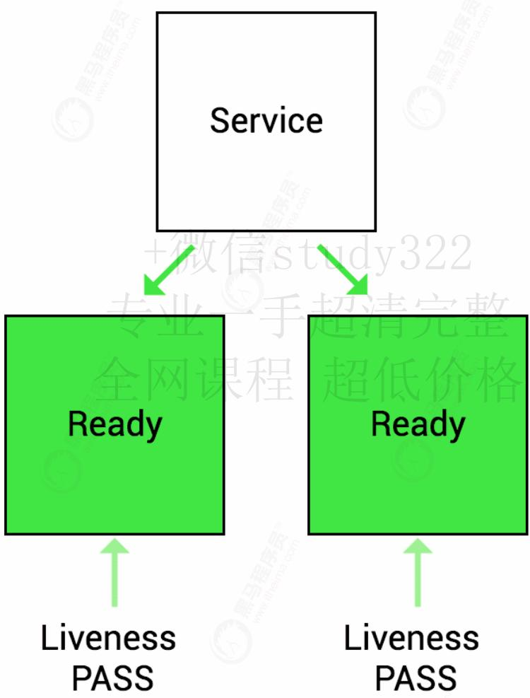

# 6.2.2 就绪探测

Readiness 是检查容器是否已经处于可接受服务请求的状态，如果 Readiness Probe 失败，端点控制器将会从服务端点（与 Pod 匹配的）中移除容器的 IP 地址，Readiness 的默认值为 Failure，如果一个容器未提供 Readiness，则默认是 Success。

就绪探针旨在让Kubernetes知道你的应用是否准备好为请求提供服务，Kubernetes只有在就绪探针通过才会把流量转发到Pod，如果就绪探针检测失败，Kubernetes将停止向该容器发送流量，直到它通过。

一个应用往往需要一段时间来预热和启动，比如一个后端项目的启动需要连接数据库执行数据库迁移等等，一个Spring项目的启动也需要依赖Java虚拟机。即使该过程已启动，您的服务在启动并运行之前也无法运行。应用在完全就绪之前不应接收流量，但默认情况下，Kubernetes会在容器内的进程启动后立即开始发送流量。通过就绪探针探测，直到应用程序完全启动，然后才允许将流量发送到新副本。

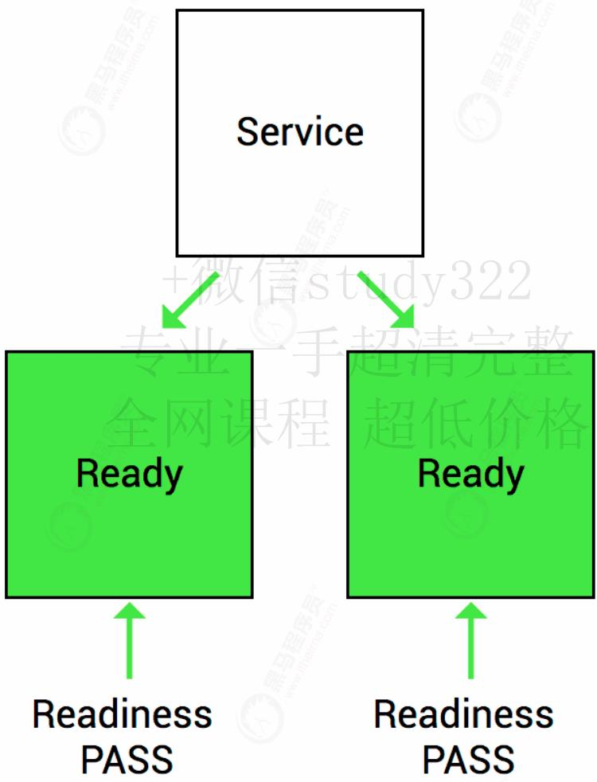

# 6.2.3 两者对比

- Liveness探测和Readiness探测是两种Health Check机制,如果不特意配置,Kubernetes将对两种探测采取相同的默认行为,即通过判断容器启动进程的返回值是否为零来判断探测是否成功。

- 两种探测的配置方法完全一样,支持的配置参数也一样，不同之处在于探测失败后的行为:Liveness 探测是重启容器;Readiness探测则是将容器设置为不可用,不接收Service转发的请求。

- Liveness探测和Readiness探测是独立执行的,二者之间没有依赖,所以可以单独使用,也可以同时使用,用Liveness探测判断容器是否需要重启以实现自愈;用Readiness探测判断容器是否已经准备好对外提供服务

# 6.2.4 如何配置

对于LivenessProbe和ReadinessProbe用法都一样，拥有相同的参数和相同的监测方式。

- initialDelaySeconds：用来表示初始化延迟的时间，也就是告诉监测从多久之后开始运行，单位是秒

- timeoutSeconds: 用来表示监测的超时时间，如果超过这个时长后，则认为监测失败

- periodSeconds：指定每多少秒执行一次探测，Kubernetes如果连续执行3次Liveness探测均失败,则会杀掉并重启容器

# 6.3 使用场景

- 如果容器中的进程能够在遇到问题或不健康的情况下自行崩溃，则不一定需要存活探针；kubelet 将根据 Pod 的 restartPolicy 自动执行正确的操作。

- 如果希望容器在探测失败时被杀死并重新启动，那么请指定一个存活探针，并指定restartPolicy为Always或OnFailure。

- 如果要仅在探测成功时才开始向 Pod 发送流量，请指定就绪探针，在这种情况下，就绪探针可能与存活探针相同，但是 spec 中的就绪探针的存在意味着 Pod 将在没有接收到任何流量的情况下启

动，并且只有在探针探测成功后才开始接收流量。

- 如果您希望容器能够自行维护，您可以指定一个就绪探针，该探针检查与存活探针不同的端点。

- 如果您只想在 Pod 被删除时能够排除请求，则不一定需要使用就绪探针；在删除 Pod 时，Pod 会自动将自身置于未完成状态，无论就绪探针是否存在，当等待 Pod 中的容器停止时，Pod 仍处于未完成状态。

# 6.4 默认的健康检查

我们首先学习Kubernetes默认的健康检查机制:每个容器启动时都会执行一个进程,此进程由Dockerfile的CMD或ENTRYPOINT指定。

如果进程退出时返回码非零,则认为容器发生故障,Kubernetes就会根据restartPolicy重启容器

# 6.4.1 创建资源清单

Pod的restartPolicy设置为OnFailure,默认为Always, sleep 10; exit 1模拟容器启动10秒后发生故障

```
vi pod-default-health.yml 
apiVersion: v1
kind: Pod
metadata:
  name: pod-default-health
  namespace: default
  labels:
    app: nginx
spec:
  containers:
  - name: nginx
    image: nginx:1.12
    ports:
    - containerPort: 80
    args: ["/bin/sh","-c"," sleep 10;exit 1"] 
```

# 6.4.2 创建容器

```
kubectl apply -f pod-default-health.yml 
[root@k8s-master ~]# kubectl apply -f pod-default-health.yml pod/pod-default-health created
[root@k8s-master ~]# 
```

# 6.4.3 监控Pod变化

```
kubectl get pods -o wide -w 
```

该命令可以不断显示容器的因为失败不断重启

```
[root@k8s-master ~]# kubectl get pods -o wide -w
NAME READY STATUS RESTARTS AGE IP NODE NOMINATED NODE READINESS GATES
pod-default-health 0/1 Error 2 47s 10.244.2.16 k8s-node2 <none>
pod-vol-hostpath 1/1 Running 0 2d15h 10.244.1.9 k8s-node1 <none>
pod-default-health 0/1 CrashLoopBack0ff 2 59s 10.244.2.16 k8s-node2 <none>
pod-default-health 1/1 Running 3 74s 10.244.2.16 k8s-node2 <none> 
```

在上面的例子中，容器进程返回值非零，Kubernetes则认为容器发生故障,需要重启。

有不少情况是发生了故障,但进程并不会退出，比如访问Web服务器时显示500内部错误,可能是系统超载,也可能是资源死锁,此时httpd进程并没有异常退出,在这种情况下重启容器可能是最直接、最有效的解决方案,那我们如何利用HealthCheck机制来处理这类场景呢?

# 6.5 探针类型

探针类型是指通过何种方式来进行健康检查，K8S有三种类型的探测：HTTP，Command和TCP。

# 6.5.1 exec存活探针

对于命令探测，是指Kubernetes在容器内运行命令，如果命令以退出代码0返回，则容器将标记为正常。否则，它被标记为不健康

下面的资源会在先创建一个nginx的任务，生存测试探针 livenessProbe 会执行 test -e /tmp/healthy 命令检查文件是否存在，若文件存在则返回状态码 0，表示成功通过测试。

```
apiVersion: v1
kind: Pod
metadata:
  name: pod-nginx-demo
  namespace: default
  labels:
    app: nginx
spec:
  containers:
  - name: nginx
    image: nginx:1.12
    ports:
    - containerPort: 80
    livenessProbe:
    initialDelaySeconds: 5
    periodSeconds: 3
    exec:
    command: ["test","-e","/tmp/healthy"] 
```

# 6.5.1.1 创建pod

创建pod

```
kubectl create -f pod-demo.yaml
kubectl get pod -w -o wide 
```

启动后不断检测 /tmp/healthy 是否存在，不存在重启容器

```
[root@k8s-master ~]# kubectl get pods -o wide -w
NAME READY STATUS RESTARTS AGE IP NODE NOMINATED NODE READINESS GATES
pod-nginx-demo 1/1 Running 0 5s 10.244.1.35 k8s-node1 <none>
pod-nginx-demo 1/1 Running 1 13s 10.244.1.35 k8s-node1 <none>
pod-nginx-demo 1/1 Running 2 26s 10.244.1.35 k8s-node1 <none>
pod-nginx-demo 1/1 Running 3 37s 10.244.1.35 k8s-node1 <none>
pod-nginx-demo 0/1 CrashLoopBackOff 3 49s 10.244.1.35 k8s-node1 <none>
pod-nginx-demo 1/1 Running 4 74s 10.244.1.35 k8s-node1 <none> 
```

# 6.5.1.2 创建文件

新开一个窗口写入登录pod容器，写入 healthy 文件

# 登录pod容器

```
kubectl exec pod-nginx-demo -it /bin/bash
echo healthy > /tmp/healthy
# 在html目录写入healthy文件
echo healthy > /tmp/healthy
[root@k8s-master ~]# kubectl exec pod-nginx-demo -it /bin/bash
kubectl exec [POD] [COMMAND] is DEPRECATED and will be removed in a future version. Use kubectl exec [POD] -- [COMMAND] instead.
root@pod-nginx-demo:/# echo healthy > /tmp/healthy
root@pod-nginx-demo:/# 
```

查看原来的pod状态

```
kubectl get pods -o wide -w 
```

我们发现pod不在不断地重启了

```
[root@k8s-master ~]# kubectl get pods -o wide -w
NAME READY STATUS RESTARTS AGE IP NODE NOMINATED NODE READINESS GATES
pod-nginx-demo 1/1 Running 0 5s 10.244.1.35 k8s-node1 <none>
pod-nginx-demo 1/1 Running 1 13s 10.244.1.35 k8s-node1 <none>
pod-nginx-demo 1/1 Running 2 26s 10.244.1.35 k8s-node1 <none>
pod-nginx-demo 1/1 Running 3 37s 10.244.1.35 k8s-node1 <none>
pod-nginx-demo 0/1 CrashLoopBackOff 3 49s 10.244.1.35 k8s-node1 <none>
pod-nginx-demo 1/1 Running 4 74s 10.244.1.35 k8s-node1 <none>
pod-nginx-demo 0/1 CrashLoopBackOff 4 88s 10.244.1.35 k8s-node1 <none>
pod-nginx-demo 1/1 Running 5 2m12s 10.244.1.35 k8s-node1 <none>
pod-nginx-demo 0/1 CrashLoopBackOff 5 2m25s 10.244.1.35 k8s-node1 <none>
pod-nginx-demo 1/1 Running 6 3m52s 10.244.1.35 k8s-node1 <none> 
```

# 6.5.2 HTTP就绪探针

HTTP探测可能是最常见的探针类型，即使应用不是HTTP服务，也可以创建一个轻量级HTTP服务器来响应探测，比如让Kubernetes通过HTTP访问一个URL，如果返回码在200到300范围内，就将应用程序标记为健康状态，否则它被标记为不健康。

上面清单文件中定义的 httpGet 测试中，请求的资源路径为 /healthy，地址默认为 Pod IP，端口使用了容器中定义的端口名称 HTTP，这也是明确为容器指明要暴露的端口的用途之一。

```
apiVersion: v1
kind: Pod
metadata:
  name: pod-nginx-demo
  namespace: default
  labels:
    app: nginx
spec:
  containers:
  - name: nginx
    image: nginx:1.12
    ports:
    - containerPort: 80
    readinessProbe:
    initialDelaySeconds: 5
    periodSeconds: 3
    httpGet:
    port: 80
    path: /healthy
    scheme: HTTP 
```

# 6.5.2.1 创建pod

kubectl create -f pod-demo.yaml

\#查看pod状态

kubectl get pods -o wide -w

我们发现nginx 一致处于未未就绪状态

```
[root@k8s-master ~]# kubectl create -f pod-demo.yaml
pod/pod-nginx-demo created
[root@k8s-master ~]#
[root@k8s-master ~]# kubectl get pods -o wide -w
NAME READY STATUS RESTARTS AGE IP NODE NOMINATED NODE READINESS GATES
pod-nginx-demo 0/1 Running 0 4s 10.244.1.34 k8s-node1 <none> <none> 
```

# 6.5.2.2 查看pod详情

kubectl describe pod pod-nginx-demo

```
[root@k8s-master ~]# kubectl describe pod pod-nginx-demo
Name: pod-nginx-demo
Namespace: default
Priority: 0
Node: k8s-node1/192.168.64.160
Start Time: Thu, 13 May 2021 14:27:06 +0800
Labels: app=nginx
Annotations: <none>
Status: Running
IP: 10.244.1.34
IPs:
IP: 10.244.1.34
Containers:
nginx:
Container ID: docker://cled573b163954243145e6d3a381c2300fdc36fa4bc63cf9a40f2fadb2a51547
Image: nginx:1.12
Image ID: docker-pullable://nginx@sha256:72daaf46f1cc753c4eab981cbf869919bd1fee3d2170a2adeac12400f494728
Port: 80/TCP
Host Port: 0/TCP
State: Running
Started: Thu, 13 May 2021 14:27:07 +0800
Ready: False
Restart Count: 0
Readiness: http-get http://:80/healthy delay=5s timeout=ls period=3s #success=1 #failure=3
Environment: <none>
Mounts:
/var/run/secrets/kubernetes.io/serviceaccount from kube-api-access-46kwt (ro)
Conditions:
Type Status
Initialized True
Ready False
ContainersReady False
PodScheduled True
Volumes: 
```

# 6.5.2.3 创建文件

新开一个窗口写入登录pod容器，写入 healthy 文件

# 登录pod容器

kubectl exec pod-nginx-demo -it /bin/bash

# 在html目录写入healthy文件

echo healthy > /usr/share/nginx/html/healthy

查看原来的pod状态

kubectl get pods -o wide -w

```
^C[root@k8s-master ~]# kubectl get pods -o wide -w
NAME READY STATUS RESTARTS AGE IP NODE NOMINATED NODE READINESS GATES
pod-nginx-demo 0/1 Running 0 4m48s 10.244.1.34 k8s-node1 <none> <none>
pod-nginx-demo 1/1 Running 0 9m18s 10.244.1.34 k8s-node1 <none> <none> 
```

# 6.5.2.4 访问

curl 10.244.1.30/healthy

```
[root@k8s-master ~]# curl 10.244.1.30/healthy healthy
[root@k8s-master ~]# 
```

再次删除 healthy 文件

```
rm -f /usr/share/nginx/html/healthy 
[root@k8s-master ~]# kubectl exec pod-nginx-demo -it /bin/bash
kubectl exec [POD] [COMMAND] is DEPRECATED and will be removed in a future version. Use kubectl exec [POD] -- [COMMAND] instead.
root@pod-nginx-demo:#
root@pod-nginx-demo:/# echo healthy > /usr/share/nginx/html/healthy
root@pod-nginx-demo:#
root@pod-nginx-demo:/# rm -f /usr/share/nginx/html/healthy
root@pod-nginx-demo:/# 
```

再次查看pod状态，进入未就绪状态

```
kubectl get pods -o wide -w 
^C[root@k8s-master ~]# kubectl get pods -o wide -w
NAME READY STATUS RESTARTS AGE IP NODE NOMINATED NODE READINESS GATES
pod-nginx-demo 0/1 Running 0 4m48s 10.244.1.34 k8s-node1 <none>
pod-nginx-demo 1/1 Running 0 9m18s 10.244.1.34 k8s-node1 <none>
pod-nginx-demo 0/1 Running 0 16m 10.244.1.34 k8s-node1 <none> 
```

# 6.5.3 TCP探针

TCP探测是指Kubernetes尝试在指定端口上建立TCP连接。

如果它可以建立连接，容器被认为是健康的；如果它不能被认为是不健康的。

这常用于对gRPC或FTP服务的探测。

下面的资源清单文件，向Pod IP的80/tcp端口发起连接请求，并根据连接建立的状态判断Pod存活状态。

```
apiVersion: v1
kind: Pod
metadata:
  name: pod-nginx-demo
  namespace: default
  labels:
    app: nginx
spec:
  containers:
  - name: nginx
    image: nginx:1.12
    ports:
    - containerPort: 80
    livenessProbe:
    tcpSocket:
    port: 80 
```

# 6.5.3.1 探测结果

每次探测都将获得以下三种结果之一：

- 成功：容器通过了诊断。

- 失败：容器未通过诊断。

- 未知：诊断失败，因此不会采取任何行动。

# 6.5.3.2 创建pod

```
kubectl create -f pod-demo.yaml
#查看pod状态
kubectl get pods -o wide -w
```

只要80端口正常一致就是正常状态

[root@k8s-master ~]# kubectl get pods -o wide -w NAME READY STATUS RESTARTS AGE IP NODE NOMINATED NODE READINESS GATES pod-nginx-demo 1/1 Running 0 4s 10.244.2.22 k8s-node2  

+微信study322

专业一手超清完整

全网课程 超低价格