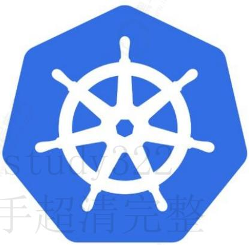

# kubernetes

# k8s 高级使用

# 1. Pod控制器

# 1.1 Pod控制器是什么

Pod控制器就是帮助我们自动的调度管理Pod，并满足期望的Pod数量。

Pod控制器是用于实现管理pod的中间层，确保pod资源符合预期的状态，pod的资源出现故障时，会尝试进行重启，当根据重启策略无效，则会重新新建pod的资源。

创建为具体的控制器对象之后，每个控制器均通过 API Server 提供的接口持续监控相关资源对象的当前状态，并在因故障、更新或其他原因导致系统状态发生变化时，尝试让资源的当前状态想期望状态迁移和逼近。

# 1.2 Pod和Pod控制器

Pod 控制器资源通过持续性地监控集群中运行着的 Pod 资源对象来确保受其管控的资源严格符合用户期望的状态，例如资源副本的数量要精确符合期望等。

通常，一个 Pod 控制器资源至少应该包含三个基本的组成部分：

- 标签选择器：匹配并关联 Pod 资源对象，并据此完成受其管控的 Pod 资源计数。

- 期望的副本数：期望在集群中精确运行着的 Pod 资源的对象数量。

- Pod模板：用于新建 Pod 资源对象的 Pod 模板资源。

# 1.3 控制器的必要性

自主式 Pod 对象由调度器调度到目标工作节点后即由相应节点上的 kubelet 负责监控其容器的存活状态，容器主进程崩溃后，kubelet 能够自动重启相应的容器，但对出现非主进程崩溃类的容器错误却无从感知，这便依赖于 pod 资源对象定义的存活探测，以便 kubelet 能够探知到此类故障。

但若 pod 被删除或者工作节点自身发生故障（工作节点上都有 kubelet，kubelet 不可用，因此其健康状态便无法保证），则便需要控制器来处理相应的容器重启和配置。

# 1.4 常见的控制器

Pod 控制器由 master 的 kube-controller-manager 组件提供，常见的此类控制器有以下几种

# 1.4.1 ReplicaSet

代用户创建指定数量的 pod 副本数量，确保 pod 副本数量符合预期状态，并且支持滚动式自动扩容和缩容功能

# 1.4.2 Deployment

工作在 ReplicaSet 之上，用于管理无状态应用，目前来说最好的控制器。支持滚动更新和回滚功能，还提供声明式配置。

# 1.4.3 DaemonSet

用于确保集群中的每一个节点只运行特定的 pod 副本，常用于实现系统级后台任务，比如 ELK 服务

# 2. ReplicaSet控制器

# 2.1 ReplicaSet概述

ReplicaSet 是取代早期版本中的 ReplicationController 控制器，其功能基本上与 ReplicationController 相同

ReplicaSet（简称RS）是 Pod 控制器类型的一种实现，用于确保由其管控的 Pod 对象副本数在任意时刻都能精确满足期望的数量，ReplicaSet 控制器资源启动后会查找集群中匹配器标签选择器的 Pod 资源对象，当前活动对象的数量与期望的数量不吻合时，多则删除，少则通过 Pod 模板创建以补足。

# 2.2 ReplicaSet功能

ReplicaSet能够实现以下功能：

# 2.2.1 精确反应期望值

确保Pod资源对象的数量精确反映期望值：ReplicaSet需要确保由其控制运行的Pod副本数量精确吻合配置中定义的期望值，否则就会自动补足所缺或终止所余。

# 2.2.2 保证高可用

确保Pod健康运行：探测到由其管控的 Pod 对象因其所在的工作节点故障而不可用时，自动请求由调度器于其他工作节点创建缺失的 Pod 副本。

# 2.2.3 弹性伸缩

弹性伸缩：可通过ReplicaSet控制器动态扩容或者缩容Pod资源对象的数量，必要时还可以通过HPA控制器实现Pod资源规模的自动伸缩。

# 2.3 创建ReplicaSet

# 2.3.1 核心属性

spec字段一般嵌套使用以下几个属性字段：

| 字段值          | 类型    | 描述                                                         |
| --------------- | ------- | ------------------------------------------------------------ |
| replicas        | Integer | 指定期望的Pod对象副本数量                                    |
| selector        | Object  | 当前控制器匹配Pod对象副本的标签选择器,支持matchLabels和matchExpressions两种匹配机制 |
| template        | Object  | 用于定义Pod时的Pod资源信息                                   |
| minReadySeconds | Integer | 用于定义Pod启动后多长时间为可用状态,默认为0秒                |

# 2.3.2 ReplicaSet示例

# 2.3.2.1 创建资源清单

```
vi nginx-rs.yml 
apiVersion: apps/v1 #api版本定义
kind: ReplicaSet #定义资源类型为ReplicaSet
metadata: #元数据定义
    name: nginx-rs
    namespace: default
spec: #ReplicaSet的规格定义
replicas: 2 #定义副本数量为2个
selector: #标签选择器，定义匹配Pod的标签
matchLabels:
    app: nginx
template: #Pod的模板定义
metadata: #Pod的元数据定义
name: nginx-pod #自定义Pod的名称
labels: #定义Pod的标签，需要和上面的标签选择器内匹配规则中定义的标签一致，可以多出其他标签
app: nginx
spec: #Pod的规格定义
containers: #容器定义
- name: nginx #容器名称
image: nginx:1.12 #容器镜像
imagePullPolicy: IfNotPresent #拉取镜像的规则
ports: #暴露端口
- name: http #端口名称
containerPort: 80
```

# 2.3.2.2 创建rs控制器

```
kubectl apply -f nginx-rs.yaml 
[root@k8s-master ~]# kubectl apply -f nginx-rs.yml
replicaset.apps/nginx-rs created
[root@k8s-master ~]# 
```

# 2.3.2.3查看rs控制器

```
kubectl get rs 
[root@k8s-master ~]# kubectl get rs
NAME DESIRED CURRENT READY AGE
nginx-rs 2 2 2 47s
[root@k8s-master ~]# 
```

# 2.3.2.4查看pod容器

通过查看pod可以看出pod命令是规则是前面是replicaset控制器的名称加随机生成的字符串

```
kubectl get pods -o wide -w 
[root@k8s-master ~]# kubectl get pods -o wide -w
NAME READY STATUS RESTARTS AGE IP NODE NOMINATED NODE READINESS GATES
nginx-rs-rbf9r 1/1 Running 0 90s 10.244.1.48 k8s-node1 <none>
nginx-rs-wgbt2 1/1 Running 0 90s 10.244.2.34 k8s-node2 <none> 
```

# 2.4 更新控制器

修改上面创建的 replicaset 示例文件，将镜像 nginx:1.12 改为 1.20 版本

```
vi nginx-rs.yml 
apiVersion: apps/v1 #api版本定义
kind: ReplicaSet #定义资源类型为ReplicaSet
metadata: #元数据定义
    name: nginx-rs
    namespace: default
spec: #ReplicaSet的规格定义
replicas: 2 #定义副本数量为2个
selector: #标签选择器，定义匹配Pod的标签
matchLabels:
    app: nginx
template: #Pod的模板定义
metadata: #Pod的元数据定义
    name: nginx-pod #自定义Pod的名称
labels: #定义Pod的标签，需要和上面的标签选择器内匹配规则中定义的标签一致，可以多出其他标签
app: nginx
spec: #Pod的规格定义
containers: #容器定义
- name: nginx #容器名称
    image: nginx:1.20 #容器镜像
    imagePullPolicy: IfNotPresent #拉取镜像的规则
    ports: #暴露端口
- name: http #端口名称
    containerPort: 80
```

# 2.4.1 应用更新

```
kubectl apply -f nginx-rs.yaml 
[root@k8s-master ~]# kubectl apply -f nginx-rs.yml replicaset.apps/nginx-rs configured
[root@k8s-master ~]# 
```

# 2.4.1.1 查看更新流程

```
kubectl get pods -o wide -w 
```

我们发现pod没有任何更新变化

```
[root@k8s-master ~]# kubectl get pods -o wide -w
NAME READY STATUS RESTARTS AGE IP NODE NOMINATED NODE READINESS GATES
nginx-rs-rbf9r 1/1 Running 0 13m 10.244.1.48 k8s-node1 <none>
nginx-rs-wgbt2 1/1 Running 0 13m 10.244.2.34 k8s-node2 <none> 
```

# 2.4.1.2 查看Pod版本号

```
kubectl get pods -o custom-
columns=Name:metadata.name, Image:spec.containers[0].image 
```

这里并没有更新pod的nginx版本号

```
[root@k8s-master ~]# kubectl get pods -o custom-columns=Name:metadata.name,Image:spec.containers[0].image
Name Image
nginx-rs-rbf9r nginx:1.12
nginx-rs-wgbt2 nginx:1.12
[root@k8s-master ~]# 
```

# 2.4.1.3 删除pod应用

这里虽然重载了，但是已有的pod所使用的镜像仍然是1.12版本的，只是新建pod时才会使用1.20版本，这里测试先手动删除已有的pod。

```
kubectl delete pods -1 app=nginx 
[root@k8s-master ~]# kubectl delete pods -l app=nginx pod "nginx-rs-rbf9r" deleted pod "nginx-rs-wgbt2" deleted [root@k8s-master ~]# 
```

# 2.4.1.4 查看版本

```
kubectl get pods -o custom-
columns=Name:metadata.name,Image:spec.containers[0].image 
```

现在我们发现pod的版本已经更新正确了

```
[root@k8s-master ~]# kubectl get pods -o custom-columns=Name:metadata.name,Image:spec.containers[0].image
Name Image
nginx-rs-g2g4k nginx:1.20
nginx-rs-jdb8k nginx:1.20
[root@k8s-master ~]# 
```

# 2.5 RS扩缩容

可以直接通过 vim 编辑清单文件修改 replicas 字段，也可以通过 kubectl edit 命令去编辑

kubectl 还提供了一个专用的子命令 scale 用于实现应用规模的伸缩，支持从资源清单文件中获取新的目标副本数量，也可以直接在命令行通过 “--replicas” 选项进行读取。

# 2.5.1 scale命令扩容

命令扩容一般用于短期的临时性扩容，应付完成后要记得缩容到原来水平

# 2.5.1.1 查看容量

可看到当前是两个节点

```
kubectl get pods -o wide 
[root@k8s-master ~]# kubectl get pods -o wide
NAME READY STATUS RESTARTS AGE IP NODE NOMINATED NODE READINESS GATES
nginx-rs-7rzz6 1/1 Running 0 64s 10.244.1.44 k8s-node1 <none>
nginx-rs-c5zrs 1/1 Running 0 64s 10.244.2.49 k8s-node2 <none>
[root@k8s-master ~]# 
```

# 2.5.1.2 执行扩容

使用 scale 命令可以对集群进行扩缩容

```
kubectl scale replicasets nginx-rs --replicas=4 
[root@k8s-master ~]# kubectl scale replicasets nginx-rs --replicas=4
replicaset.apps/nginx-rs scaled
[root@k8s-master ~]# 
```

# 2.5.1.3 查看扩容过程

在更新前打开新窗口，监控pod的更新变化

```
kubectl get pods -o wide -w 
```

在更新前打开新窗口，监控RS的更新变化

```
kubectl get rs -o wide -w 
```

我们发现扩容后只是在原来的RS集群上面增加了两个节点

| [root@k8s-master ~]#  | kubectl get rs -o wide    |         |       |       |            |            |           |
| --------------------- | ------------------------- | ------- | ----- | ----- | ---------- | ---------- | --------- |
| NAME                  | DESIRED                   | CURRENT | READY | AGE   | CONTAINERS | IMAGES     | SELECTOR  |
| nginx-rs              | 2                         | 2       | 2     | 2m25s | nginx      | nginx:1.20 | app=nginx |
| [root@k8s-master ~]#  |                           |         |       |       |            |            |           |
| [root@k8s-master ~]#  | kubectl get rs -o wide -w |         |       |       |            |            |           |
| NAME                  | DESIRED                   | CURRENT | READY | AGE   | CONTAINERS | IMAGES     | SELECTOR  |
| nginx-rs              | 2                         | 2       | 2     | 2m29s | nginx      | nginx:1.20 | app=nginx |
| nginx-rs              | 4                         | 2       | 2     | 2m42s | nginx      | nginx:1.20 | app=nginx |
| nginx-rs              | 4                         | 2       | 2     | 2m42s | nginx      | nginx:1.20 | app=nginx |
| nginx-rs              | 4                         | 4       | 2     | 2m42s | nginx      | nginx:1.20 | app=nginx |
| nginx-rs              | 4                         | 4       | 3     | 2m43s | nginx      | nginx:1.20 | app=nginx |
| nginx-rs              | 4                         | 4       | 4     | 2m43s | nginx      | nginx:1.20 | app=nginx |
| ^[root@k8s-master ~]# |                           |         |       |       |            |            |           |
| [root@k8s-master ~]#  | kubectl get rs -o wide    |         |       |       |            |            |           |
| NAME                  | DESIRED                   | CURRENT | READY | AGE   | CONTAINERS | IMAGES     | SELECTOR  |
| nginx-rs              | 4                         | 4       | 4     | 6m4s  | nginx      | nginx:1.20 | app=nginx |

# 2.5.2 配置文件缩容

配置文件扩容一般用于初始容量变更，长期进行扩容

# 2.5.2.1 查看容量

可看到当前是四个节点

```
kubectl get pods -o wide 
```

| [root@k8s-master ~]# kubectl get pods -o wide |       |         |          |       |             |           |                |                 |      |
| --------------------------------------------- | ----- | ------- | -------- | ----- | ----------- | --------- | -------------- | --------------- | ---- |
| NAME                                          | READY | STATUS  | RESTARTS | AGE   | IP          | NODE      | NOMINATED NODE | READINESS GATES |      |
| nginx-rs-7dgkx                                | 1/1   | Running | 0        | 16s   | 10.244.1.45 | k8s-node1 |                |                 |      |
| nginx-rs-7rzzz6                               | 1/1   | Running | 0        | 2m58s | 10.244.1.44 | k8s-node1 |                |                 |      |
| nginx-rs-9xwzz                                | 1/1   | Running | 0        | 16s   | 10.244.2.50 | k8s-node2 |                |                 |      |
| nginx-rs-c5zrs                                | 1/1   | Running | 0        | 2m58s | 10.244.2.49 | k8s-node2 |                |                 |      |
| [root@k8s-master ~]#                          |       |         |          |       |             |           |                |                 |      |

# 2.5.2.2 应用配置

因为没有变更配置文件可以直接应用配置文件

```
kubectl apply -f nginx-rs.yml 
[root@k8s-master ~]# kubectl apply -f nginx-rs.yml replicaset.apps/nginx-rs configured
[root@k8s-master ~]# 
```

# 2.5.2.3 查看缩容容过程

在更新前打开新窗口，监控pod的更新变化

```
kubectl get pods -o wide -w 
```

| [root@k8s-master ~]# kubectl get pods -o wide    |       |             |          |       |             |           |                |                 |
| ------------------------------------------------ | ----- | ----------- | -------- | ----- | ----------- | --------- | -------------- | --------------- |
| NAME                                             | READY | STATUS      | RESTARTS | AGE   | IP          | NODE      | NOMINATED NODE | READINESS GATES |
| nginx-rs-7dgkx                                   | 1/1   | Running     | 0        | 2m57s | 10.244.1.45 | k8s-node1 |                |                 |
| nginx-rs-7rzzz6                                  | 1/1   | Running     | 0        | 5m39s | 10.244.1.44 | k8s-node1 |                |                 |
| nginx-rs-9xwzz                                   | 1/1   | Running     | 0        | 2m57s | 10.244.2.50 | k8s-node2 |                |                 |
| nginx-rs-c5zrs                                   | 1/1   | Running     | 0        | 5m39s | 10.244.2.49 | k8s-node2 |                |                 |
| [root@k8s-master ~]#                             |       |             |          |       |             |           |                |                 |
| [root@k8s-master ~]# kubectl get pods -o wide -W |       |             |          |       |             |           |                |                 |
| NAME                                             | READY | STATUS      | RESTARTS | AGE   | IP          | NODE      | NOMINATED NODE | READINESS GATES |
| nginx-rs-7dgkx                                   | 1/1   | Running     | 0        | 4m43s | 10.244.1.45 | k8s-node1 |                |                 |
| nginx-rs-7rzzz6                                  | 1/1   | Running     | 0        | 7m25s | 10.244.1.44 | k8s-node1 |                |                 |
| nginx-rs-9xwzz                                   | 1/1   | Running     | 0        | 4m43s | 10.244.2.50 | k8s-node2 |                |                 |
| nginx-rs-c5zrs                                   | 1/1   | Running     | 0        | 7m25s | 10.244.2.49 | k8s-node2 |                |                 |
| nginx-rs-9xwzz                                   | 1/1   | Terminating | 0        | 4m52s | 10.244.2.50 | k8s-node2 |                |                 |
| nginx-rs-7dgkx                                   | 1/1   | Terminating | 0        | 4m52s | 10.244.1.45 | k8s-node1 |                |                 |
| nginx-rs-9xwzz                                   | 0/1   | Terminating | 0        | 4m53s | 10.244.2.50 | k8s-node2 |                |                 |
| nginx-rs-7dgkx                                   | 0/1   | Terminating | 0        | 4m54s | 10.244.1.45 | k8s-node1 |                |                 |
| nginx-rs-9xwzz                                   | 0/1   | Terminating | 0        | 5m    | 10.244.2.50 | k8s-node2 |                |                 |
| nginx-rs-9xwzz                                   | 0/1   | Terminating | 0        | 5m    | 10.244.2.50 | k8s-node2 |                |                 |
| nginx-rs-7dgkx                                   | 0/1   | Terminating | 0        | 5m5s  | 10.244.1.45 | k8s-node1 |                |                 |
| nginx-rs-7dgkx                                   | 0/1   | Terminating | 0        | 5m5s  | 10.244.1.45 | k8s-node1 |                |                 |

在更新前打开新窗口，监控RS的更新变化

```
kubectl get rs -o wide -w 
```

我们发现扩容后只是在原来的RS集群上面减少了两个节点

| [root@k8s-master ~]#  | kubectl get rs -o wide    |           |                  |                   |                    |
| --------------------- | ------------------------- | --------- | ---------------- | ----------------- | ------------------ |
| NAME DESIRED          | CURRENT READY             | AGE 6m4s  | CONTAINERS nginx | IMAGES nginx:1.20 | SELECTOR app=nginx |
| nginx-rs 4            | 4                         |           |                  |                   |                    |
| [root@k8s-master ~]#  |                           |           |                  |                   |                    |
| [root@k8s-master ~]#  | kubectl get rs -o wide -w |           |                  |                   |                    |
| NAME DESIRED          | CURRENT READY             | AGE       | CONTAINERS       | IMAGES            | SELECTOR app=nginx |
| nginx-rs 4            | 4                         | 7m20s     | nginx            | nginx:1.20        | app=nginx          |
| nginx-rs 2            | 4                         | 7m34s     | nginx            | nginx:1.20        | app=nginx          |
| nginx-rs 2            | 4                         | 7m34s     | nginx            | nginx:1.20        | app=nginx          |
| nginx-rs 2            | 2                         | 7m34s     | nginx            | nginx:1.20        | app=nginx          |
| ^[root@k8s-master ~]# |                           |           |                  |                   |                    |
| [root@k8s-master ~]#  | kubectl get rs -o wide    |           |                  |                   |                    |
| NAME DESIRED          | CURRENT READY             | AGE 8m55s | CONTAINERS nginx | IMAGES nginx:1.20 | SELECTOR app=nginx |
| nginx-rs 2            | 2                         |           |                  |                   |                    |
| [root@k8s-master ~]#  |                           |           |                  |                   |                    |

# 2.6 删除rs控制器

使用 Kubectl delete 命令删除 ReplicaSet 对象时默认会一并删除其管控的各 Pod 对象，有时，考虑到这些 Pod 资源未必由其创建，或者即便由其创建也并非自身的组成部分，这时候可以添加 “--cascade=false” 选项，取消级联关系。

# 2.6.1 查看集群情况

# 2.6.1.1 查看RS集群

```
kubectl get rs -o wide 
[root@k8s-master ~]# kubectl get rs -o wide
NAME DESIRED CURRENT READY AGE CONTAINERS IMAGES SELECTOR
nginx-rs 2 2 2 10m nginx nginx:1.20 app=nginx
[root@k8s-master ~]# 
```

# 2.6.1.2 查看POD

```
kubectl get pods -o wide 
[root@k8s-master ~]# kubectl get pods -o wide
NAME READY STATUS RESTARTS AGE IP NODE NOMINATED NODE READINESS GATES
nginx-rs-7rzz6 1/1 Running 0 12m 10.244.1.44 k8s-node1 <none>
nginx-rs-c5zrs 1/1 Running 0 12m 10.244.2.49 k8s-node2 <none>
[root@k8s-master ~]# 
```

# 2.6.2 删除rs

删除rs可以通过参数 cascade=false 设置不删除pod

```
kubectl delete replicasets nginx-rs --cascade=false 
[root@k8s-master ~]# kubectl delete replicasets nginx-rs --cascade=false
warning: --cascade=false is deprecated (boolean value) and can be replaced with --cascade=orphan.
replicaset.apps "nginx-rs" deleted
[root@k8s-master ~]# 
```

# 2.6.3 查看集群情况

# 2.6.3.1 查看RS集群

```
kubectl get rs -o wide 
[root@k8s-master ~]# kubectl get rs -o wide
No resources found in default namespace.
[root@k8s-master ~]# 
```

# 2.6.3.2 查看POD

```
kubectl get pods -o wide 
[root@k8s-master ~]# kubectl get pods -o wide
NAME READY STATUS RESTARTS AGE IP NODE NOMINATED NODE READINESS GATES
nginx-rs-7rzz6 1/1 Running 0 12m 10.244.1.44 k8s-node1 <none>
nginx-rs-c5zrs 1/1 Running 0 12m 10.244.2.49 k8s-node2 <none>
[root@k8s-master ~]# 
```

# 2.6.4 删除Pod

```
kubectl delete pods nginx-rs-7rzz6
kubectl delete pods nginx-rs-c5zrs 
[root@k8s-master ~]# kubectl delete pods nginx-rs-7rzz6 pod "nginx-rs-7rzz6" deleted
[root@k8s-master ~]#
[root@k8s-master ~]# kubectl delete pods nginx-rs-c5zrs pod "nginx-rs-c5zrs" deleted
[root@k8s-master ~]#
[root@k8s-master ~]# kubectl get pods -o wide
No resources found in default namespace.
[root@k8s-master ~]# 
```

# 3. Deployment控制器

# 3.1 Deployment概述

Deployment为Pod和Replica Set（下一代Replication Controller）提供声明式更新

只需要在 Deployment 中描述想要的目标状态是什么，Deployment controller 就会帮您将 Pod 和 ReplicaSet 的实际状态改变到您的目标状态，也可以定义一个全新的 Deployment 来创建 ReplicaSet 或者删除已有的 Deployment 并创建一个新的来替换。

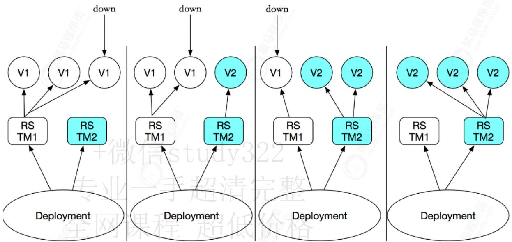

# 3.1.1 其他特性

Deployment 控制器资源的主要职责是为了保证 Pod 资源的健康运行，其大部分功能均可通过调用 ReplicaSet 实现，同时还增添部分特性。

- 事件和状态查看：必要时可以查看 Deployment 对象升级的详细进度和状态。

- 回滚：升级操作完成后发现问题时，支持使用回滚机制将应用返回到前一个或由用户指定的历史记录中的版本上。

- 版本记录：对 Deployment 对象的每一个操作都予以保存，以供后续可能执行的回滚操作使用。

- 暂停和启动：对于每一次升级，都能够随时暂停和启动。

- 多种自动更新方案：一是 Recreate，即重建更新机制，全面停止、删除旧有的 Pod 后用新版本替代；另一个是 RollingUpdate，即滚动升级机制，逐步替换旧有的 Pod 至新的版本。

# 3.2 Deployment配置

# 3.2.1 编辑资源清单

```
vi nginx-deployment.yml 
apiVersion: apps/v1
kind: Deployment
metadata:
  name: nginx-deployment
spec:
  replicas: 2
  minReadySeconds: 2  # 这里需要估一个比较合理的值，从容器启动到应用正常提供服务
  strategy:  # k8s 默认的 strategy 就是 RollingUpdate，这里写明出来可以调节细节参数
    #type: Recreate
    type: RollingUpdate
    rollingUpdate:
    maxSurge: 1  # 更新时允许最大激增的容器数，默认 replicas 的 1/4 向上取整
    maxUnavailable: 0  # 更新时允许最大 unavailable 容器数，默认 replicas 的 1/4 向下取整
    selector:
    matchLabels:
    app: nginx
    template:
    metadata:
    labels:
    app: nginx
spec:
  containers:
  - name: nginx
    image: nginx:1.7.9
  ports:
  - containerPort: 80 
```

# 3.2.2 配置项说明

# 3.2.2.1 配置解释

- 我们定义了一个Deployment，名字叫nginx-deployment;

- 通过spec.replicas字段定义了Pod的副本数是2；

- 通过minReadySeconds设置等待多长的时间后才进行升级

- 通过spec.selector字段定义了被打上app:nginx的标签的Pod才会被管理；

- template字段定义了这个Deployment管理的Pod应该是怎样的，具有怎样的属性；

# 3.2.2.2 控制器描述

总的来说一个Deploymet控制器可以由两部分组成：

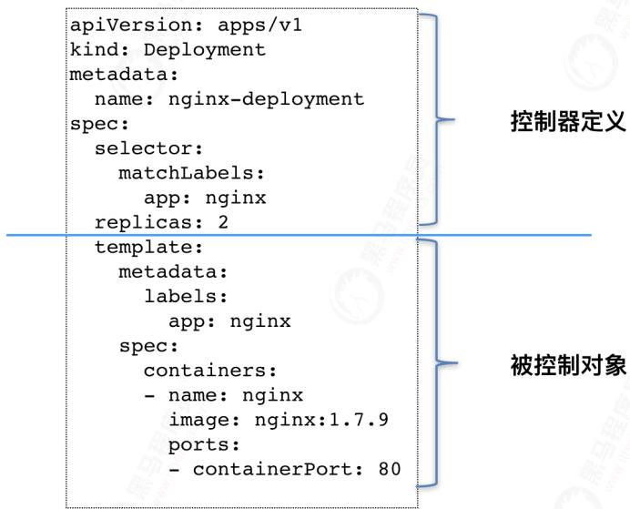

# 3.2.3 创建控制器

```
kubectl apply -f nginx-deployment.yml
kubectl get pods -o wide 
[root@k8s-master ~]# kubectl apply -f nginx-deployment.yml
deployment.apps/nginx-deployment created
[root@k8s-master ~]#
[root@k8s-master ~]# kubectl get pods -o wide
NAME READY STATUS RESTARTS AGE IP NODE NOMINATED NODE READINESS GATES
nginx-deployment-5d59d67564-nb6z8 1/1 Running 0 35s 10.244.2.27 k8s-node2 <none>
nginx-deployment-5d59d67564-pvbb5 1/1 Running 0 35s 10.244.1.22 k8s-node1 <none>
[root@k8s-master ~]# 
```

# 3.2.4 查看replicaset

ReplicaSet是一个副本控制器，ReplicaSet可以用selector来控制Pod的数量，而Deployments是一个更高层次的概念，它管理ReplicaSets，并提供对pod的声明性更新以及许多其他的功能。

```
kubectl get replicaset -o wide 
```

通过查看资源对象可以看出，Deployment会自动创建相关的ReplicaSet控制器资源，并以"[DEPLOYMENT-name]-[POD-TEMPLATE-HASH-VALUE]"格式为其命名，其中的hash值由Deployment自动生成。而Pod名则是以ReplicaSet控制器的名称为前缀，后跟5位随机字符。

| [root@k8s-master ~]# kubectl get replicaset -o wide |         |         |       |      |            |             |                                        |
| --------------------------------------------------- | ------- | ------- | ----- | ---- | ---------- | ----------- | -------------------------------------- |
| NAME                                                | DESIRED | CURRENT | READY | AGE  | CONTAINERS | IMAGES      | SELECTOR                               |
| nginx-deployment-5d59d67564                         | 2       | 2       | 2     | 72s  | nginx      | nginx:1.7.9 | app=nginx,pod-template-hash=5d59d67564 |
| [root@k8s-master ~]#                                |         |         |       |      |            |             |                                        |

# 3.3 更新策略

ReplicaSet控制器的应用更新需要手动分成多步并以特定的次序进行，过程繁杂且容易出错，而Deployment却只需要由用户指定在Pod模板中要改动的内容，（如镜像文件的版本），余下的步骤便会由其自动完成。Pod副本数量也是一样。

Deployment控制器支持两种更新策略：滚动更新（rolling updata）和重建更新（recreate），默认情况下为滚动更新

# 3.3.1 重建更新

重建更新为：先删除所有的Pod再根据新的模板创建新的Pod，中间会导致服务的不可用，用户要么使用的是新版本，要么就是旧版本

# 3.3.2 滚动更新

滚动更新是默认的更新策略，它在删除一些旧版本的Pod的同时补充创建一些新的Pod，更新期间服务不会中断。

滚动更新期间，应用升级期间还要确保可用的Pod对象数量不低于某些阈值，确保可以持续处理客户端请求，变动的方式和Pod对象的数量范围将通过 maxSurge 和 maxunavailable 两个属性协同进行定义

# 配置参数

两个参数用法如下:

- maxSurge：指定升级期间存在的总Pod对象数量最多以超出期望值的个数，其值可以为0或者正整数，也可以是一个期望值的百分比：例如如果期望值是3，当前的属性值为1，则表示Pod对象的总数不能超过4个。

- maxUnavailable：升级期间正常可用的Pod副本数（包括新旧版本）最多不能低于期望的个数、其值可以是0或者正整数，也可以是一个期望值的百分比，默认值为1；该值意味着如果期望值是3，那么在升级期间至少要有两个Pod对象处于正常提供服务的状态

maxSurge和maxUnavailable的数量不能同时为0，否则Pod对象的复本数量在符合用户期望的数量后无法做出合理变动以进行滚动更新操作。

# 3.4 更新控制器

命令扩容一般用于短期的临时性扩容，应付完成后要记得缩容到原来水平

# 3.4.1 命令更新

# 3.4.1.1 查看版本

通过命令查看pod的版本号

```
kubectl get pods -o custom-
columns=Name:metadata.name, Image:spec.containers[0].image 
[root@k8s-master ~]# kubectl get pods -o custom-columns=Name:metadata.name,Image:spec.containers[0].image
Name Image
nginx-deployment-5d59d67564-j567v nginx:1.7.9
nginx-deployment-5d59d67564-rvb4f nginx:1.7.9
[root@k8s-master ~]# 
```

# 3.4.1.2 执行更新命令

kubectl set image deployment/nginx-deployment nginx=nginx:1.15

```
[root@k8s-master ~]# kubectl set image deployment/nginx-deployment nginx=nginx:1.15
deployment.apps/nginx-deployment image updated
[root@k8s-master ~]# 
```

# 3.4.1.3 查看更新过程

在更新前打开新窗口，监控pod的更新变化

kubectl get pods -o wide -w

| [root@k8s-master ~]# kubectl get pods -o wide -w |       |                   |          |      |             |             |           |      |           |       |
| ------------------------------------------------ | ----- | ----------------- | -------- | ---- | ----------- | ----------- | --------- | ---- | --------- | ----- |
| NAME                                             | READY | STATUS            | RESTARTS | AGE  | IP          | NODE        | NOMINATED | NODE | READINESS | GATES |
| nginx-deployment-5d59d67564-262cm                | 1/1   | Running           | 0        | 38s  | 10.244.1.33 | k8s-node1   |           |      |           |       |
| nginx-deployment-5d59d67564-vqbqr                | 1/1   | Running           | 0        | 38s  | 10.244.2.38 | k8s-node2   |           |      |           |       |
| nginx-deployment-698676d7f8-pqcm8                | 0/1   | Pending           | 0        | 0s   |             |             |           |      |           |       |
| nginx-deployment-698676d7f8-pqcm8                | 0/1   | Pending           | 0        | 0s   |             |             |           |      |           |       |
| nginx-deployment-698676d7f8-pqcm8                | 0/1   | ContainerCreating | 0        |      | 0s          |             | k8s-node1 |      |           |       |
| nginx-deployment-698676d7f8-pqcm8                | 1/1   | Running           | 0        |      | 25s         | 10.244.1.34 | k8s-node1 |      |           |       |
| nginx-deployment-5d59d67564-262cm                | 1/1   | Terminating       | 0        |      | 2m10s       | 10.244.1.33 | k8s-node1 |      |           |       |
| nginx-deployment-698676d7f8-x9vl9                | 0/1   | Pending           | 0        |      | 0s          |             |           |      |           |       |
| nginx-deployment-698676d7f8-x9vl9                | 0/1   | Pending           | 0        |      | 0s          |             | k8s-node2 |      |           |       |
| nginx-deployment-698676d7f8-x9vl9                | 0/1   | ContainerCreating | 0        |      | 0s          |             | k8s-node2 |      |           |       |
| nginx-deployment-5d59d67564-262cm                | 0/1   | Terminating       | 0        |      | 2m11s       | 10.244.1.33 | k8s-node1 |      |           |       |
| nginx-deployment-5d59d67564-262cm                | 0/1   | Terminating       | 0        |      | 2m19s       | 10.244.1.33 | k8s-node1 |      |           |       |
| nginx-deployment-5d59d67564-262cm                | 0/1   | Terminating       | 0        |      | 2m19s       | 10.244.1.33 | k8s-node1 |      |           |       |
| nginx-deployment-698676d7f8-x9vl9                | 1/1   | Running           | 0        |      | 24s         | 10.244.2.39 | k8s-node2 |      |           |       |
| nginx-deployment-5d59d67564-vqbqr                | 1/1   | Terminating       | 0        |      | 2m34s       | 10.244.2.38 | k8s-node2 |      |           |       |
| nginx-deployment-5d59d67564-vqbqr                | 0/1   | Terminating       | 0        |      | 2m35s       | 10.244.2.38 | k8s-node2 |      |           |       |
| nginx-deployment-5d59d67564-vqbqr                | 0/1   | Terminating       | 0        |      | 2m44s       | 10.244.2.38 | k8s-node2 |      |           |       |
| nginx-deployment-5d59d67564-vqbqr                | 0/1   | Terminating       | 0        |      | 2m44s       | 10.244.2.38 | k8s-node2 |      |           |       |
| ^[root@k8s-master ~]#                            |       |                   |          |      |             |             |           |      |           |       |
| [root@k8s-master ~]# kubectl get pods -o wide    |       |                   |          |      |             |             |           |      |           |       |
| NAME                                             | READY | STATUS            | RESTARTS | AGE  | IP          | NODE        | NOMINATED | NODE | READINESS | GATES |
| nginx-deployment-698676d7f8-pqcm8                | 1/1   | Running           | 0        | 2m6s | 10.244.1.34 | k8s-node1   |           |      |           |       |
| nginx-deployment-698676d7f8-x9vl9                | 1/1   | Running           | 0        | 101s | 10.244.2.39 | k8s-node2   |           |      |           |       |
| [root@k8s-master ~]#                             |       |                   |          |      |             |             |           |      |           |       |

在更新前打开新窗口，监控RS的更新变化

kubectl get rs -o wide -w

我们发现更新后新建了一个RS，并且保留原来的RS但是节点数为0用来回滚

| [root@k8s-master ~]# kubectl get rs -o wide -w |         |         |       |       |            |             |                                        |
| ---------------------------------------------- | ------- | ------- | ----- | ----- | ---------- | ----------- | -------------------------------------- |
| NAME                                           | DESIRED | CURRENT | READY | AGE   | CONTAINERS | IMAGES      | SELECTOR                               |
| nginx-deployment-5d59d67564                    | 2       | 2       | 2     | 60s   | nginx      | nginx:1.7.9 | app=nginx,pod-template-hash=5d59d67564 |
| nginx-deployment-698676d7f8                    | 1       | 0       | 0     | 0s    | nginx      | nginx:1.15  | app=nginx,pod-template-hash=698676d7f8 |
| nginx-deployment-698676d7f8                    | 1       | 0       | 0     | 0s    | nginx      | nginx:1.15  | app=nginx,pod-template-hash=698676d7f8 |
| nginx-deployment-698676d7f8                    | 1       | 1       | 0     | 0s    | nginx      | nginx:1.15  | app=nginx,pod-template-hash=698676d7f8 |
| nginx-deployment-698676d7f8                    | 1       | 1       | 1     | 25s   | nginx      | nginx:1.15  | app=nginx,pod-template-hash=698676d7f8 |
| nginx-deployment-5d59d67564                    | 1       | 2       | 2     | 2m10s | nginx      | nginx:1.7.9 | app=nginx,pod-template-hash=5d59d67564 |
| nginx-deployment-5d59d67564                    | 1       | 2       | 2     | 2m10s | nginx      | nginx:1.7.9 | app=nginx,pod-template-hash=5d59d67564 |
| nginx-deployment-698676d7f8                    | 2       | 1       | 1     | 25s   | nginx      | nginx:1.15  | app=nginx,pod-template-hash=698676d7f8 |
| nginx-deployment-5d59d67564                    | 1       | 1       | 1     | 2m10s | nginx      | nginx:1.7.9 | app=nginx,pod-template-hash=5d59d67564 |
| nginx-deployment-698676d7f8                    | 2       | 1       | 1     | 25s   | nginx      | nginx:1.15  | app=nginx,pod-template-hash=698676d7f8 |
| nginx-deployment-698676d7f8                    | 2       | 2       | 1     | 25s   | nginx      | nginx:1.15  | app=nginx,pod-template-hash=698676d7f8 |
| nginx-deployment-698676d7f8                    | 2       | 2       | 2     | 49s   | nginx      | nginx:1.15  | app=nginx,pod-template-hash=698676d7f8 |
| nginx-deployment-5d59d67564                    | 0       | 1       | 1     | 2m34s | nginx      | nginx:1.7.9 | app=nginx,pod-template-hash=5d59d67564 |
| nginx-deployment-5d59d67564                    | 0       | 1       | 1     | 2m34s | nginx      | nginx:1.7.9 | app=nginx,pod-template-hash=5d59d67564 |
| nginx-deployment-5d59d67564                    | 0       | 0       | 0     | 2m34s | nginx      | nginx:1.7.9 | app=nginx,pod-template-hash=5d59d67564 |
| ^[root@k8s-master ~]#                          |         |         |       |       |            |             |                                        |
| [root@k8s-master ~]# kubectl get rs -o wide    |         |         |       |       |            |             |                                        |
| NAME                                           | DESIRED | CURRENT | READY | AGE   | CONTAINERS | IMAGES      | SELECTOR                               |
| nginx-deployment-5d59d67564                    | 0       | 0       | 0     | 3m58s | nginx      | nginx:1.7.9 | app=nginx,pod-template-hash=5d59d67564 |
| nginx-deployment-698676d7f8                    | 2       | 2       | 2     | 2m13s | nginx      | nginx:1.15  | app=nginx,pod-template-hash=698676d7f8 |
| [root@k8s-master ~]#                           |         |         |       |       |            |             |                                        |

# 3.4.1.4 查看版本

通过命令查看pod的版本号

kubectl get pods -o custom- columns=Name:metadata.name, Image:spec.containers[0].image

```
[root@k8s-master ~]# kubectl get pods -o custom-columns=Name:metadata.name,Image:spec.containers[0].image
Name Image
nginx-deployment-698676d7f8-pqcm8 nginx:1.15
nginx-deployment-698676d7f8-x9vl9 nginx:1.15
[root@k8s-master ~]# 
```

# 3.4.2 配置更新

# 3.4.2.1 查看版本

通过命令查看pod的版本号

```
kubectl get pods -o custom-
columns=Name:metadata.name, Image:spec.containers[0].image 
[root@k8s-master ~]# kubectl get pods -o custom-columns=Name:metadata.name,Image:spec.containers[0].image
Name Image
nginx-deployment-698676d7f8-pqcm8 nginx:1.15
nginx-deployment-698676d7f8-x9v19 nginx:1.15
[root@k8s-master ~]# 
```

# 3.4.2.2 编辑资源清单

```
vi nginx-deployment.yml 
apiVersion: apps/v1
kind: Deployment
metadata:
  name: nginx-deployment
spec:
  replicas: 2
  selector:
    matchLabels:
    app: nginx
  template:
    metadata:
    labels:
    app: nginx
  spec:
    containers:
    - name: nginx
    image: nginx:1.20 # 将nginx版本改为1.20
    ports:
    - containerPort: 80
```

# 3.4.2.3 应用更新

```
kubectl apply -f nginx-deployment.yml 
[root@k8s-master ~]# kubectl apply -f nginx-deployment.yml deployment.apps/nginx-deployment configured
[root@k8s-master ~]# 
```

# 3.4.2.4 查看更新过程

在更新前打开新窗口，监控pod的更新变化

```
kubectl get pods -o wide -w 
```

在更新前打开新窗口，监控RS的更新变化

kubectl get rs -o wide -w

我们发现更新后新建了一个RS，并且保留原来的RS但是节点数为0用来回滚

# 3.4.2.5 查看版本

通过命令查看pod的版本号

```
kubectl get pods -o custom-
columns=Name:metadata.name, Image:spec.containers[0].image 
[root@k8s-master ~]# kubectl get pods -o custom-columns=Name:metadata.name,Image:spec.containers[0].image
Name Image
nginx-deployment-6897679c4b-r42lw nginx:1.20
nginx-deployment-6897679c4b-s2ngx nginx:1.20
[root@k8s-master ~]# 
```

# 3.4.3 回滚更新

通过 rollout 命令进行回滚操作

# 3.4.3.1 查看版本

通过命令查看pod的版本号

```
kubectl get pods -o custom-
columns=Name:metadata.name, Image:spec.containers[0].image 
[root@k8s-master ~]# kubectl get pods -o custom-columns=Name:metadata.name,Image:spec.containers[0].image
Name Image
nginx-deployment-6897679c4b-rgsq7 nginx:1.20
nginx-deployment-6897679c4b-wrf4h nginx:1.20
[root@k8s-master ~]# 
```

# 3.4.3.2 执行回滚命令

kubectl rollout undo deployment/nginx-deployment

```
[root@k8s-master ~]# kubectl rollout undo deployment/nginx-deployment deployment.apps/nginx-deployment rolled back
[root@k8s-master ~]# 
```

# 3.4.3.3 查看更新过程

在更新前打开新窗口，监控pod的更新变化

kubectl get pods -o wide -w

| [root@k8s-master ~]# kubectl get pods -o wide -w |       |                   |          |       |             |           |           |      |           |       |
| ------------------------------------------------ | ----- | ----------------- | -------- | ----- | ----------- | --------- | --------- | ---- | --------- | ----- |
| NAME                                             | READY | STATUS            | RESTARTS | AGE   | IP          | NODE      | NOMINATED | NODE | READINESS | GATES |
| nginx-deployment-6987679c4b-r42lw                | 1/1   | Running           | 0        | 2m9s  | 10.244.2.40 | k8s-node2 |           |      |           |       |
| nginx-deployment-6987679c4b-s2ngx                | 1/1   | Running           | 0        | 2m1ls | 10.244.1.35 | k8s-node1 |           |      |           |       |
| nginx-deployment-698676d7f8-7ph95                | 0/1   | Pending           | 0        | 0s    |             |           |           |      |           |       |
| nginx-deployment-698676d7f8-7ph95                | 0/1   | Pending           | 0        | 0s    |             | k8s-node2 |           |      |           |       |
| nginx-deployment-698676d7f8-7ph95                | 0/1   | ContainerCreating | 0        | 0s    |             |           | k8s-node2 |      |           |       |
| nginx-deployment-698676d7f8-7ph95                | 1/1   | Running           | 0        | 1s    | 10.244.2.41 | k8s-node2 |           |      |           |       |
| nginx-deployment-6987679c4b-r42lw                | 1/1   | Terminating       | 0        | 2m27s | 10.244.2.40 | k8s-node2 |           |      |           |       |
| nginx-deployment-698676d7f8-jx5g5                | 0/1   | Pending           | 0        | 0s    |             |           |           |      |           |       |
| nginx-deployment-698676d7f8-jx5g5                | 0/1   | Pending           | 0        | 0s    |             |           | k8s-node1 |      |           |       |
| nginx-deployment-698676d7f8-jx5g5                | 0/1   | ContainerCreating | 0        | 0s    |             |           | k8s-node1 |      |           |       |
| nginx-deployment-6897679c4b-r42lw                | 0/1   | Terminating       | 0        | 2m28s | 10.244.2.40 | k8s-node2 |           |      |           |       |
| nginx-deployment-698676d7f8-jx5g5                | 1/1   | Running           | 0        | 2s    | 10.244.1.36 | k8s-node1 |           |      |           |       |
| nginx-deployment-6897679c4b-s2ngx                | 1/1   | Terminating       | 0        | 2m32s | 10.244.1.35 | k8s-node1 |           |      |           |       |
| nginx-deployment-6897679c4b-s2ngx                | 0/1   | Terminating       | 0        | 2m32s | 10.244.1.35 | k8s-node1 |           |      |           |       |
| nginx-deployment-6897679c4b-s2ngx                | 0/1   | Terminating       | 0        | 2m37s | 10.244.1.35 | k8s-node1 |           |      |           |       |
| nginx-deployment-6897679c4b-s2ngx                | 0/1   | Terminating       | 0        | 2m37s | 10.244.1.35 | k8s-node1 |           |      |           |       |
| nginx-deployment-6897679c4b-r42lw                | 0/1   | Terminating       | 0        | 2m40s | 10.244.2.40 | k8s-node2 |           |      |           |       |
| nginx-deployment-6897679c4b-r42lw                | 0/1   | Terminating       | 0        | 2m40s | 10.244.2.40 | k8s-node2 |           |      |           |       |
| ^C[root@k8s-master ~]#                           |       |                   |          |       |             |           |           |      |           |       |
| [root@k8s-master ~]# kubectl get pods -o wide    |       |                   |          |       |             |           |           |      |           |       |
| NAME                                             | READY | STATUS            | RESTARTS | AGE   | IP          | NODE      | NOMINATED | NODE | READINESS | GATES |
| nginx-deployment-698676d7f8-7ph95                | 1/1   | Running           | 0        | 76s   | 10.244.2.41 | k8s-node2 |           |      |           |       |
| nginx-deployment-698676d7f8-jx5g5                | 1/1   | Running           | 0        | 75s   | 10.244.1.36 | k8s-node1 |           |      |           |       |
| [root@k8s-master ~]#                             |       |                   |          |       |             |           |           |      |           |       |

在更新前打开新窗口，监控RS的更新变化

kubectl get rs -o wide -w

我们发现回滚没有创建新的rs而是将使用了原来的rs

| [root@k8s-master ~]# kubectl get rs -o wide -w |         |         |       |       |            |             |                                        |
| ---------------------------------------------- | ------- | ------- | ----- | ----- | ---------- | ----------- | -------------------------------------- |
| NAME                                           | DESIRED | CURRENT | READY | AGE   | CONTAINERS | IMAGES      | SELECTOR                               |
| nginx-deployment-5d59d67564                    | 0       | 0       | 0     | 7m56s | nginx      | nginx:1.7.9 | app=nginx,pod-template-hash=5d59d67564 |
| nginx-deployment-6897679c4b                    | 2       | 2       | 2     | 2m14s | nginx      | nginx:1.20  | app=nginx,pod-template-hash=6897679c4b |
| nginx-deployment-698676d7f8                    | 0       | 0       | 0     | 6m11s | nginx      | nginx:1.15  | app=nginx,pod-template-hash=698676d7f8 |
| nginx-deployment-698676d7f8                    | 0       | 0       | 0     | 6m25s | nginx      | nginx:1.15  | app=nginx,pod-template-hash=698676d7f8 |
| nginx-deployment-698676d7f8                    | 1       | 0       | 0     | 6m25s | nginx      | nginx:1.15  | app=nginx,pod-template-hash=698676d7f8 |
| nginx-deployment-698676d7f8                    | 1       | 0       | 0     | 6m25s | nginx      | nginx:1.15  | app=nginx,pod-template-hash=698676d7f8 |
| nginx-podployment-698676d7f8                   | 1       | 1       | 0     | 6m25s | nginx      | nginx:1.15  | app=nginx,pod-template-hash=698676d7f8 |
| nginx-podployment-698676d7f8                   | 1       | 1       | 1     | 6m26s | nginx      | nginx:1.15  | app=nginx,pod-template-hash=698676d7f8 |
| nginx-podployment-6897679c4b                   | 1       | 2       | 2     | 2m29s | nginx      | nginx:1.20  | app=nginx,pod-template-hash=6897679c4b |
| nginx-podployment-689676d7f8                   | 2       | 1       | 1     | 6m26s | nginx      | nginx:1.15  | app=nginx,pod-template-hash=689676d7f8 |
| nginx-podployment-6897679c4b                   | 1       | 2       | 2     | 2m29s | nginx      | nginx:1.20  | app=nginx,pod-template-hash=6897679c4b |
| nginx-podployment-689676d7f8                   | 2       | 1       | 1     | 6m26s | nginx      | nginx;1.15  | app=nginx,pod-template-hash=698676d7f8 |
| nginx-podployment-698676d7f8                   | 2       | 2       | 1     | 6m26s | nginx      | nginx:1.15  | app=nginx,pod-template-hash=698676d7f8 |
| nginx-podployment-6897679c4b                   | 1       | 1       | 1     | 2m29s | nginx      | nginx:1.20  | app=nginx,pod-template-hash=6897679c4b |
| nginx-podployment-698676d7f8                   | 2       | 2       | 2     | 6m28s | nginx      | nginx:1.15  | app=nginx,pod-template-hash=698676d7f8 |
| nginx-podployment-6897679c4b                   | 0       | 1       | 1     | 2m31s | nginx      | nginx:1.20  | app=nginx,pod-template-hash=6897679c4b |
| nginx-podployment-6897679c4b                   | 0       | 1       | 1     | 2m32s | nginx      | nginx:1.20  | app=nginx,pod-template-hash=6897679c4b |
| nginx-podployment-6897679c4b                   | 0       | 0       | 0     | 2m32s | nginx      | nginx:1.20  | app=nginx,pod-template-hash=6897679c4b |
| ^C[root@k8s-master ~]#                         |         |         |       |       |            |             |                                        |
| [root@k8s-master ~]# kubectl get rs -o wide    |         |         |       |       |            |             |                                        |
| NAME                                           | DESIRED | CURRENT | READY | AGE   | CONTAINERS | IMAGES      | SELECTOR                               |
| nginx-deployment-5d59d67564                    | 0       | 0       | 0     | 10m   | nginx      | nginx:1.7.9 | app=nginx,pod-template-hash=5d59d67564 |
| nginx-deployment-6897679c4b                    | 0       | 0       | 0     | 4m19s | nginx      | nginx:1.20  | app=nginx,pod-template-hash=6897679c4b |
| nginx-deployment-698676d7f8                    | 2       | 2       | 2     | 8m16s | nginx      | nginx:1.15  | app=nginx,pod-template-hash=698676d7f8 |
| [root@k8s-master ~]#                           |         |         |       |       |            |             |                                        |

# 3.4.3.4 查看版本

通过命令查看pod的版本号

```
kubectl get pods -o custom-
columns=Name:metadata.name, Image:spec.containers[0].image 
[root@k8s-master ~]# kubectl get pods -o custom-columns=Name:metadata.name,Image:spec.containers[0].image
Name Image
nginx-deployment-698676d7f8-7ph95 nginx:1.15
nginx-deployment-698676d7f8-jx5g5 nginx:1.15
[root@k8s-master ~]# 
```

# 3.4.4 再次回滚

# 3.4.4.1 查看版本

通过命令查看pod的版本号

```
kubectl get pods -o custom-
columns=Name:metadata.name, Image:spec.containers[0].image 
[root@k8s-master ~]# kubectl get pods -o custom-columns=Name:metadata.name,Image:spec.containers[0].image
Name Image
nginx-deployment-698676d7f8-ndk6t nginx:1.15
nginx-deployment-698676d7f8-prjfn nginx:1.15
[root@k8s-master ~]# 
```

# 3.4.4.2 执行回滚命令

kubectl rollout undo deployment/nginx-deployment

```
[root@k8s-master ~]# kubectl rollout undo deployment/nginx-deployment deployment.apps/nginx-deployment rolled back
[root@k8s-master ~]# 
```

# 3.4.4.3 查看更新过程

在更新前打开新窗口，监控pod的更新变化

```
kubectl get pods -o wide -w 
[root@k8s-master ~]# kubectl get pods -o wide -w
NAME READY STATUS RESTARTS AGE IP NODE NOMINATED NODE READINESS GATES
nginx-deployment-698676d7f8-ndk6t 1/1 Running 0 16s 10.244.1.38 k8s-node1 <none> <none>
nginx-deployment-698676d7f8-prjfn 1/1 Running 0 18s 10.244.2.43 k8s-node2 <none> <none>
nginx-deployment-6989769c4b-67449 0/1 Pending 0 0s <none> <none> <none>
nginx-deployment-6989769c4b-67449 0/1 Pending 0 0s <none> k8s-node1 <none> <none>
nginx-deployment-6989769c4b-67449 0/1 ContainerCreating 0 0s <none> k8s-node1 <none> <none>
nginx-deployment-6989769c4b-67449 1/1 Running 0 2s 10.244.1.39 k8s-node1 <none> <none>
nginx-deployment-6989767d7f8-ndk6t 1/1 Terminating 0 93s 10.244.1.38 k8s-node1 <none> <none>
nginx-deployment-6897679c4b-xmrh2 0/1 Pending 0 0s <none> <none> <none>
nginx-deployment-6897679c4b-xmrh2 0/1 Pending 0 0s <none> k8s-node2 <none> <none>
nginx-deployment-6897679c4b-xmrh2 0/1 ContainerCreating 0 0s <none> k8s-node2 <none> <none>
nginx-deployment-698676d7f8-ndk6t 0/1 Terminating 0 94s 10.244.1.38 k8s-node1 <none> <none>
nginx-deployment-6987679c4b-xmrh2 1/1 Running 0 1s 10.244.2.44 k8s-node2 <none> <none>
nginx-deployment-698676d7f8-prjfn 1/1 Terminating 0 96s 10.244.2.43 k8s-node2 <none> <none>
nginx-deployment-698676d7f8-ndk6t 0/1 Terminating 0 95s 10.244.1.38 k8s-node1 <none> <none>
nginx-deployment-698676d7f8-ndk6t 0/1 Terminating 0 95s 10.244.1.38 k8s-node1 <none> <none>
nginx-deployment-698676d7f8-prjfn 0/1 Terminating 0 97s 10.244.2.43 k8s-node2 <none> <none>
nginx-deployment-698676d7f8-prjfn 0/1 Terminating 0 98s 10.244.2.43 k8s-node2 <none> <none>
nginx-deployment-698676d7f8-prjfn 0/1 Terminating 0 98s 10.244.2.43 k8s-node2 <none> <none>
^C[root@k8s-master ~]#
[root@k8s-master ~]# kubectl get pods -o wide
NAME READY STATUS RESTARTS AGE IP NODE NOMINATED NODE READINESS GATES
nginx-deployment-6897679c4b-67449 1/1 Running 0 72s 10.244.1.39 k8s-node1 <none> <none>
nginx-deployment-6897679c4b-xmrh2 1/1 Running 0 70s 10.244.2.44 k8s-node2 <none> <none>
[root@k8s-master ~]# 
```

在更新前打开新窗口，监控RS的更新变化

kubectl get rs -o wide -w

我们发现回滚没有创建新的rs而是将使用了原来的rs

```
[root@k8s-master ~]# kubectl get rs -o wide -w
NAME DESIRED CURRENT READY AGE CONTAINERS IMAGES SELECTOR
nginx-deployment-5d59d67564 0 0 0 11m nginx nginx:1.7.9 app=nginx, pod-template-hash=5d59d67564
nginx-deployment-6897679c4b 0 0 0 5m42s nginx nginx:1.20 app=nginx, pod-template-hash=6897679c4b
nginx-deployment-698676d7f8 2 2 2 9m39s nginx nginx:1.15 app=nginx, pod-template-hash=698676d7f8
nginx-deployment-6897679c4b 0 0 0 6m52s nginx nginx:1.20 app=nginx, pod-template-hash=6897679c4b
nginx-deployment-6897679c4b 1 0 0 6m52s nginx nginx:1.20 app=nginx, pod-template-hash=6897679c4b
nginx-deployment-6897679c4b 1 0 0 6m52s nginx nginx:1.20 app=nginx, pod-template-hash=6897679c4b
nginx-deployment-6897679e4b 1 1 0 6m52s nginx nginx:1.20 app=nginx, pod-template-hash=6897679c4b
nginx-deployment-6897679c4b 1 1 1 6m54s nginx nginx:1.20 app=nginx, pod-template-hash=6897679c4b
nginx-deployment-689676d7f8 1 2 2 10m nginx nginx:1.15 app=nginx, pod-template-hash=698676d7f8
nginx-deployment-6897679c4b 2 1 1 6m54s nginx nginx:1.20 app=nginx, pod-template-hash=6897679c4b
nginx-deployment-689676d7f8 1 2 2 10m nginx nginx:1.15 app=nginx, pod-template-hash=689676d7f8
nginx-deployment-6897679c4b 2 1 1 6m54s nginx nginx:1.20 app=nginx, pod-template-hash=6897679c4b
nginx-deployment-698676d7f8 1 1 1 10m nginx nginx:1.15 app=nginx, pod-template-hash=698676d7f8
nginx-deployment-6897679c4b 2 2 1 6m54s nginx nginx:1.20 app=nginx, pod-template-hash=6897679c4b
nginx-deployment-6897679c4b 2 2 2 6m55s nginx nginx:1.20 app=nginx, pod-template-hash=6897679c4b
nginx-deployment-698676d7f8 0 1 1 10m nginx nginx:1.15 app=nginx, pod-template-hash=698676d7f8
nginx-deployment-698676d7f8 0 1 1 10m nginx nginx:1.15 app=nginx, pod-template-hash=698676d7f8
nginx-deployment-698676d7f8 0 0 0 10m nginx nginx:1.15 app=nginx, pod-template-hash=698676d7f8
^[root@k8s-master ~]#
[root@k8s-master ~]# kubectl get rs -o wide
NAME DESIRED CURRENT READY AGE CONTAINERS IMAGES SELECTOR
nginx-deployment-5d59d67564 0 0 0 14m nginx nginx:1.7.9 app=nginx, pod-template-hash=5d59d67564
nginx-deployment-6897679c4b 2 2 2 8m34s nginx nginx:1.20 app=nginx, pod-template-hash=6897679c4b
nginx-deployment-698676d7f8 0 0 0 12m nginx nginx:1.15 app=nginx, pod-template-hash=698676d7f8
[root@k8s-master ~]# 
```

# 3.4.4.4 查看版本

通过命令查看pod的版本号

```
kubectl get pods -o custom-
columns=Name:metadata.name,Image:spec.containers[0].image 
```

我们发现 rollout 回滚只在最近的两个版本之间来回回滚，不会回滚到在上一个版本。

```
[root@k8s-master ~]# kubectl get pods -o custom-columns=Name:metadata.name,Image:spec.containers[0].image
Name Image
nginx-deployment-6897679c4b-67449 nginx:1.20
nginx-deployment-6897679c4b-xmrh2 nginx:1.20
[root@k8s-master ~]# 
```

# 3.4.5 回滚指定版本

# 3.4.5.1 查看历史版本

通过 rollout history 查看版本历史

```
kubectl rollout history deployment/nginx-deployment 
[root@k8s-master ~]# kubectl rollout history deployment/nginx-deployment
deployment.apps/nginx-deployment
REVISION CHANGE-CAUSE
1 <none>
6 <none>
7 <none>
[root@k8s-master ~]# 
```

# 3.4.5.2 历史版本内容

通过指定版本号来查看变更内容，找到需要回滚的版本，这里我会回滚到最早版本 nginx:1.7.9

```
kubectl rollout history deployment/nginx-deployment --revision=1 
```

我们找到了需要回滚的版本是 1

```
[root@k8s-master ~]# kubectl rollout history deployment/nginx-deployment --revision=1
deployment.apps/nginx-deployment with revision #1
Pod Template:
Labels: app=nginx
pod-template-hash=5d59d67564
Containers:
nginx:
Image: nginx:1.7.9
Port: 80/TCP
Host Port: 0/TCP
Environment: <none>
Mounts: <none>
Volumes: <none>
[root@k8s-master ~]# 
```

# 3.4.5.3 查看版本

通过命令查看pod的版本号

```
kubectl get pods -o custom-
columns=Name:metadata.name, Image:spec.containers[0].image 
[root@k8s-master ~]# kubectl get pods -o custom-columns=Name:metadata.name,Image:spec.containers[0].image
Name Image
nginx-deployment-6897679c4b-rgsq7 nginx:1.20
nginx-deployment-6897679c4b-wrf4h nginx:1.20
[root@k8s-master ~]# 
```

# 3.4.5.4 执行回滚命令

写入我们需要回滚到的指定版本 1

```
kubectl rollout undo deployment/nginx-deployment --to-revision=1 
[root@k8s-master ~]# kubectl rollout undo deployment/nginx-deployment
deployment.apps/nginx-deployment rolled back
[root@k8s-master ~]# 
```

# 3.4.5.5 查看版本

通过命令查看pod的版本号

```
kubectl get pods -o custom-
columns=Name:metadata.name,Image:spec.containers[0].image 
```

到此我们已经回滚到了指定版本

```
[root@k8s-master ~]# kubectl get pods -o custom-columns=Name:metadata.name,Image:spec.containers[0].image
Name Image
nginx-deployment-5d59d67564-77fvj nginx:1.7.9
nginx-deployment-5d59d67564-pl2zw nginx:1.7.9
[root@k8s-master ~]# 
```

# 3.5 Deployment扩缩容

# 3.5.1 scale命令扩容

命令扩容一般用于短期的临时性扩容，应付完成后要记得缩容到原来水平

# 3.5.1.1 查看当前容量

当前是两个节点

```
kubectl get pods -o wide 
[root@k8s-master ~]# kubectl get pods -o wide
NAME READY STATUS RESTARTS AGE IP NODE NOMINATED NODE READINESS GATES
nginx-deployment-6897679c4b-9tkkd 1/1 Running 0 36s 10.244.2.47 k8s-node2 <none>
nginx-deployment-6897679c4b-m5gmk 1/1 Running 0 36s 10.244.1.42 k8s-node1 <none>
[root@k8s-master ~]# 
```

# 3.5.1.2 执行扩容

使用 scale 命令可以对集群进行扩缩容，扩充到4个节点

```
kubectl scale deployment nginx-deployment --replicas=4 
[root@k8s-master ~]# kubectl scale deployment nginx-deployment --replicas=4
deployment.apps/nginx-deployment scaled
[root@k8s-master ~]# 
```

# 3.5.1.3 查看扩容过程

在更新前打开新窗口，监控pod的更新变化

```
kubectl get pods -o wide -w 
[root@k8s-master ~]# kubectl get pods -o wide
NAME READY STATUS RESTARTS AGE IP NODE NOMINATED NODE READINESS GATES
nginx-deployment-6897679c4b-9tkkd 1/1 Running 0 104s 10.244.2.47 k8s-node2 <none> <none>
nginx-deployment-6897679c4b-m5gmk 1/1 Running 0 104s 10.244.1.42 k8s-node1 <none> <none>
[root@k8s-master ~]#
[root@k8s-master ~]# kubectl get pods -o wide -w
NAME READY STATUS RESTARTS AGE IP NODE NOMINATED NODE READINESS GATES
nginx-deployment-6897679c4b-9tkkd 1/1 Running 0 107s 10.244.2.47 k8s-node2 <none> <none>
nginx-deployment-6897679c4b-m5gmk 1/1 Running 0 107s 10.244.1.42 k8s-node1 <none> <none>
nginx-deployment-6897679c4b-btvjb 0/1 Pending 0 0s <none> <none> <none>
nginx-deployment-6897679c4b-btvjb 0/1 Pending 0 0s <none> k8s-node1 <none> <none>
nginx-deployment-6897679c4b-8vczq 0/1 Pending 0 0s <none> <none> <none>
nginx-deployment-6897679c4b-8vczq 0/1 Pending 0 0s <none> k8s-node2 <none> <none>
nginx-deployment-6897679c4b-btvjb 0/1 ContainerCreating 0 0s <none> k8s-node1 <none> <none>
nginx-deployment-6897679c4b-8vczq 0/1 ContainerCreating 0 0s <none> k8s-node2 <none> <none>
nginx-deployment-6897679c4b-btvjb 1/1 Running 0 2s 10.244.1.43 k8s-node1 <none> <none>
nginx-deployment-6897679c4b-8vczq 1/1 Running 0 2s 10.244.2.48 k8s-node2 <none> <none>
^C[root@k8s-master ~]#
[root@k8s-master ~]# kubectl get pods -o wide
NAME READY STATUS RESTARTS AGE IP NODE NOMINATED NODE READINESS GATES
nginx-deployment-6897679c4b-8vczq 1/1 Running 0 24s 10.244.2.48 k8s-node2 <none> <none>
nginx-deployment-6897679c4b-9tkkd 1/1 Running 0 2m27s 10.244.2.47 k8s-node2 <none> <none>
nginx-deployment-6897679c4b-btvjb 1/1 Running 0 24s 10.244.1.43 k8s-node1 <none> <none>
nginx-deployment-6897679c4b-m5gmk 1/1 Running 0 2m27s 10.244.1.42 k8s-node1 <none> <none>
[root@k8s-master ~]# 
```

在更新前打开新窗口，监控RS的更新变化

kubectl get rs -o wide -w

我们发现扩容后只是在原来的RS集群上面增加了两个节点

| [root@k8s-master ~]# kubectl get rs -o wide    |         |         |       |       |            |            |                                        |
| ---------------------------------------------- | ------- | ------- | ----- | ----- | ---------- | ---------- | -------------------------------------- |
| NAME                                           | DESIRED | CURRENT | READY | AGE   | CONTAINERS | IMAGES     | SELECTOR                               |
| nginx-deployment-6897679c4b                    | 2       | 2       | 2     | 110s  | nginx      | nginx:1.20 | app=nginx,pod-template-hash=6897679c4b |
| [root@k8s-master ~]#                           |         |         |       |       |            |            |                                        |
| [root@k8s-master ~]# kubectl get rs -o wide -w |         |         |       |       |            |            |                                        |
| NAME                                           | DESIRED | CURRENT | READY | AGE   | CONTAINERS | IMAGES     | SELECTOR                               |
| nginx-deployment-6897679c4b                    | 2       | 2       | 2     | 113s  | nginx      | nginx:1.20 | app=nginx,pod-template-hash=6897679c4b |
| nginx-deployment-6897679c4b                    | 4       | 2       | 2     | 2m3s  | nginx      | nginx:1.20 | app=nginx,pod-template-hash=6897679c4b |
| nginx-deployment-6897679c4b                    | 4       | 2       | 2     | 2m3s  | nginx      | nginx:1.20 | app=nginx,pod-template-hash=6897679c4b |
| nginx-deployment-6897676c4b                    | 4       | 4       | 2     | 2m3s  | nginx      | nginx:1.20 | app=nginx,pod-template-hash=6897679c4b |
| nginx-deployment-6897679c4b                    | 4       | 4       | 3     | 2m5s  | nginx      | nginx:1.20 | app=nginx,pod-template-hash=6897679c4b |
| nginx-deployment-6897679c4b                    | 4       | 4       | 4     | 2m5s  | nginx      | nginx:1.20 | app=nginx,pod-template-hash=6897679c4b |
| ^[root@k8s-master ~]#                          |         |         |       |       |            |            |                                        |
| [root@k8s-master ~]# kubectl get rs -o wide    |         |         |       |       |            |            |                                        |
| NAME                                           | DESIRED | CURRENT | READY | AGE   | CONTAINERS | IMAGES     | SELECTOR                               |
| nginx-deployment-6897679c4b                    | 4       | 4       | 4     | 2m45s | nginx      | nginx:1.20 | app=nginx,pod-template-hash=6897679c4b |
| [root@k8s-master ~]#                           |         |         |       |       |            |            |                                        |

# 3.5.2 配置文件缩容

配置文件扩缩容一般用于初始容量变更，长期进行扩缩容

# 3.5.2.1 查看当前容量

当前是4个节点

kubectl get pods -o wide

| [root@k8s-master ~]# kubectl get pods -o wide |       |         |          |       |             |           |           |                      |
| --------------------------------------------- | ----- | ------- | -------- | ----- | ----------- | --------- | --------- | -------------------- |
| NAME                                          | READY | STATUS  | RESTARTS | AGE   | IP          | NODE      | NOMINATED | NODE READINESS GATES |
| nginx-deployment-6897679c4b-8vczq             | 1/1   | Running | 0        | 78s   | 10.244.2.48 | k8s-node2 |           |                      |
| nginx-deployment-6897679c4b-9tkkd             | 1/1   | Running | 0        | 3m21s | 10.244.2.47 | k8s-node2 |           |                      |
| nginx-deployment-6897679c4b-btvjb             | 1/1   | Running | 0        | 78s   | 10.244.1.43 | k8s-node1 |           |                      |
| nginx-deployment-6897679c4b-m5gmk             | 1/1   | Running | 0        | 3m21s | 10.244.1.42 | k8s-node1 |           |                      |
| [root@k8s-master ~]#                          |       |         |          |       |             |           |           |                      |

# 3.5.2.2 应用配置文件

因为我们没有更改配置文件，直接应用配置文件即可

kubectl apply -f nginx-deployment.yml

| [root@k8s-master ~]# kubectl apply -f nginx-deployment.yml |
| ---------------------------------------------------------- |
| deployment.apps/nginx-deployment configured                |
| [root@k8s-master ~]#                                       |

# 3.5.2.3 查看扩容过程

在更新前打开新窗口，监控pod的更新变化

kubectl get pods -o wide -w

| [root@k8s-master ~]# kubectl get pods -o wide    |       |             |          |       |             |           |                |                 |
| ------------------------------------------------ | ----- | ----------- | -------- | ----- | ----------- | --------- | -------------- | --------------- |
| NAME                                             | READY | STATUS      | RESTARTS | AGE   | IP          | NODE      | NOMINATED NODE | READINESS GATES |
| nginx-deployment-6897679c4b-8vczq                | 1/1   | Running     | 0        | 78s   | 10.244.2.48 | k8s-node2 |                |                 |
| nginx-deployment-6897679c4b-9tkkd                | 1/1   | Running     | 0        | 3m21s | 10.244.2.47 | k8s-node2 |                |                 |
| nginx-deployment-6897679c4b-btvjb                | 1/1   | Running     | 0        | 78s   | 10.244.1.43 | k8s-node1 |                |                 |
| nginx-deployment-6897679c4b-m5gmk                | 1/1   | Running     | 0        | 3m21s | 10.244.1.42 | k8s-node1 |                |                 |
| [root@k8s-master ~]#                             |       |             |          |       |             |           |                |                 |
| [root@k8s-master ~]# kubectl get pods -o wide -w |       |             |          |       |             |           |                |                 |
| NAME                                             | READY | STATUS      | RESTARTS | AGE   | IP          | NODE      | NOMINATED NODE | READINESS GATES |
| nginx-deployment-6897679c4b-8vczq                | 1/1   | Running     | 0        | 80s   | 10.244.2.48 | k8s-node2 |                |                 |
| nginx-deployment-6897679c4b-9tkkd                | 1/1   | Running     | 0        | 3m23s | 10.244.2.47 | k8s-node2 |                |                 |
| nginx-deployment-6897679c4b-btvjb                | 1/1   | Running     | 0        | 80s   | 10.244.1.43 | k8s-node1 |                |                 |
| nginx-deployment-6897679c4b-m5gmk                | 1/1   | Running     | 0        | 3m23s | 10.244.1.42 | k8s-node1 |                |                 |
| nginx-deployment-6897679c4b-8vczq                | 1/1   | Terminating | 0        | 95s   | 10.244.2.48 | k8s-node2 |                |                 |
| nginx-deployment-6897679c4b-btvjb                | 1/1   | Terminating | 0        | 95s   | 10.244.1.43 | k8s-node1 |                |                 |
| nginx-deployment-6897679c4b-btvjb                | 0/1   | Terminating | 0        | 96s   | 10.244.1.43 | k8s-node1 |                |                 |
| nginx-deployment-6897679c4b-8vczq                | 0/1   | Terminating | 0        | 96s   | 10.244.2.48 | k8s-node2 |                |                 |
| nginx-deployment-6897679c4b-btvjb                | 0/1   | Terminating | 0        | 101s  | 10.244.1.43 | k8s-node1 |                |                 |
| nginx-deployment-6897679c4b-btvjb                | 0/1   | Terminating | 0        | 101s  | 10.244.1.43 | k8s-node1 |                |                 |
| nginx-deployment-6897679c4b-8vczq                | 0/1   | Terminating | 0        | 106s  | 10.244.2.48 | k8s-node2 |                |                 |
| nginx-deployment-6897679c4b-8vczq                | 0/1   | Terminating | 0        | 106s  | 10.244.2.48 | k8s-node2 |                |                 |
| ^[root@k8s-master ~]#                            |       |             |          |       |             |           |                |                 |
| [root@k8s-master ~]# kubectl get pods -o wide    |       |             |          |       |             |           |                |                 |
| NAME                                             | READY | STATUS      | RESTARTS | AGE   | IP          | NODE      | NOMINATED NODE | READINESS GATES |
| nginx-deployment-6897679c4b-9tkkd                | 1/1   | Running     | 0        | 5m2s  | 10.244.2.47 | k8s-node2 |                |                 |
| nginx-deployment-6897679c4b-m5gmk                | 1/1   | Running     | 0        | 5m2s  | 10.244.1.42 | k8s-node1 |                |                 |
| [root@k8s-master ~]#                             |       |             |          |       |             |           |                |                 |

在更新前打开新窗口，监控RS的更新变化

kubectl get rs -o wide -w

我们发现扩容后只是在原来的RS集群上面减少了两个节点

| [root@k8s-master ~]# kubectl get rs -o wide    |         |         |       |       |            |            |                                        |
| ---------------------------------------------- | ------- | ------- | ----- | ----- | ---------- | ---------- | -------------------------------------- |
| NAME                                           | DESIRED | CURRENT | READY | AGE   | CONTAINERS | IMAGES     | SELECTOR                               |
| nginx-deployment-6897679c4b                    | 4       | 4       | 4     | 3m28s | nginx      | nginx:1.20 | app=nginx,pod-template-hash=6897679c4b |
| [root@k8s-master ~]#                           |         |         |       |       |            |            |                                        |
| [root@k8s-master ~]# kubectl get rs -o wide -w |         |         |       |       |            |            |                                        |
| NAME                                           | DESIRED | CURRENT | READY | AGE   | CONTAINERS | IMAGES     | SELECTOR                               |
| nginx-deployment-6897679c4b                    | 4       | 4       | 4     | 3m30s | nginx      | nginx:1.20 | app=nginx,pod-template-hash=6897679c4b |
| nginx-deployment-6897679c4b                    | 2       | 4       | 4     | 3m38s | nginx      | nginx:1.20 | app=nginx,pod-template-hash=6897679c4b |
| nginx-deployment-6897679c4b                    | 2       | 4       | 4     | 3m38s | nginx      | nginx:1.20 | app=nginx,pod-template-hash=6897679c4b |
| nginx-deployment-6897676c4b                    | 2       | 2       | 2     | 3m38s | nginx      | nginx:1.20 | app=nginx,pod-template-hash=6897679c4b |
| ^C[root@k8s-master ~]#                         |         |         |       |       |            |            |                                        |
| [root@k8s-master ~]# kubectl get rs -o wide    |         |         |       |       |            |            |                                        |
| NAME                                           | DESIRED | CURRENT | READY | AGE   | CONTAINERS | IMAGES     | SELECTOR                               |
| nginx-deployment-6897679c4b                    | 2       | 2       | 2     | 5m7s  | nginx      | nginx:1.20 | app=nginx,pod-template-hash=6897679c4b |
| [root@k8s-master ~]#                           |         |         |       |       |            |            |                                        |

# 3.6 删除Deployment

# 3.6.1 查看集群情况

# 3.6.1.1 查看Deployment

```
kubectl get deployments -o wide 
```

| [root@k8s-master ~]# kubectl get deployments -o wide |       |            |           |      |            |            |           |
| ---------------------------------------------------- | ----- | ---------- | --------- | ---- | ---------- | ---------- | --------- |
| NAME                                                 | READY | UP-TO-DATE | AVAILABLE | AGE  | CONTAINERS | IMAGES     | SELECTOR  |
| nginx-deployment                                     | 2/2   | 2          | 2         | 65s  | nginx      | nginx:1.20 | app=nginx |
| [root@k8s-master ~]#                                 |       |            |           |      |            |            |           |

# 3.6.1.2 查看POD

```
kubectl get pods -o wide 
```

| [root@k8s-master ~]# kubectl get pods -o wide |       |         |          |      |             |           |           |      |                 |
| --------------------------------------------- | ----- | ------- | -------- | ---- | ----------- | --------- | --------- | ---- | --------------- |
| NAME                                          | READY | STATUS  | RESTARTS | AGE  | IP          | NODE      | NOMINATED | NODE | READINESS GATES |
| nginx-deployment-6897679c4b-ht9pn             | 1/1   | Running | 0        | 80s  | 10.244.2.51 | k8s-node2 |           |      |                 |
| nginx-deployment-6897679c4b-kq4mh             | 1/1   | Running | 0        | 80s  | 10.244.1.46 | k8s-node1 |           |      |                 |
| [root@k8s-master ~]#                          |       |         |          |      |             |           |           |      |                 |

# 3.6.1.3 删除Deployment

执行删除命令删除Deployment

```
kubectl delete deployment nginx-deployment 
[root@k8s-master ~]# kubectl delete deployment nginx-deployment
deployment.apps "nginx-deployment" deleted
[root@k8s-master ~]# 
```

# 3.6.1.4 查看Deployment

```
kubectl get deployments -o wide 
[root@k8s-master ~]# kubectl get deployments -o wide
No resources found in default namespace.
[root@k8s-master ~]# 
```

# 3.6.1.5 查看POD

```
kubectl get pods -o wide 
[root@k8s-master ~]# kubectl get pods -o wide
No resources found in default namespace.
[root@k8s-master ~]# 
```

# 4. 数据存储

# 4.1 什么是数据卷

Pod 本身具有生命周期，这就带了一系列的问题，

- 当一个容器损坏之后，kubelet会重启这个容器，但是文件会丢失-这个容器会是一个全新的状态；

- 当很多容器在同一 Pod 中运行的时候，很多时候需要数据文件的共享。

Docker 支持配置容器使用存储卷将数据持久存储于容器自身文件系统之外的存储空间之中，它们可以是节点文件系统或网络文件系统之上的存储空间。相应的，kubernetes 也支持类似的存储卷功能，不过，其存储卷是与 Pod 资源绑定而非容器。

# 4.1.1 存储卷概述

简单来说，存储卷是定义在 Pod 资源之上、可被其内部的所有容器挂载的共享目录，它关联至某外部的存储设备之上的存储空间，从而独立于容器自身的文件系统，而数据是否具有持久能力取决于存储卷自身是否支持持久机制。Pod 、容器与存储卷的关系图如下。

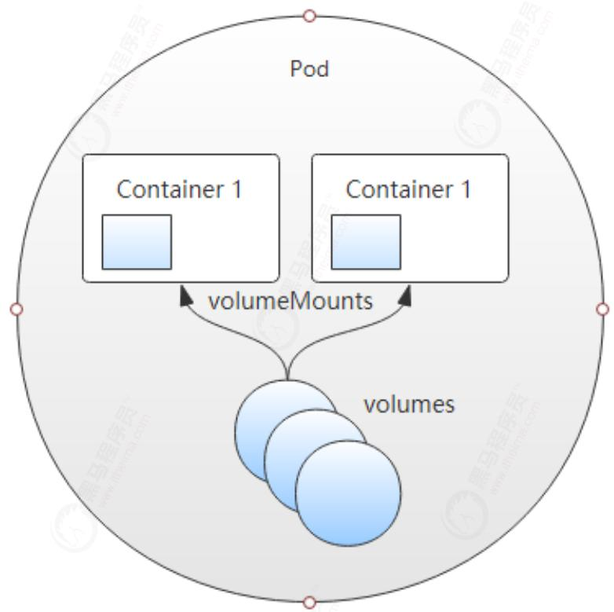

Pod、容器与存储卷关系示意图

# 4.1.2 存储卷类型

Kubernetes 支持非常丰富的存储卷类型，包括本地存储（节点）和网络存储系统中的诸多存储机制，还支持 Secret 和 ConfigMap 这样的特殊存储资源。

例如，关联节点本地的存储目录与关联 GlusterFS 存储系统所需要的配置参数差异巨大，因此指定存储卷类型时也就限定了其关联到的后端存储设备。通过命令 # kubectl explain pod.spec 可以查看当前 kubernetes 版本支持的存储卷类型。常用类型如下：

# 4.1.2.1 非持久性存储

- emptyDir

- hostPath

# 4.1.2.2 网络连接性存储

• SAN: iscsi

- NFS: nfs、cfs

# 4.1.2.3 分布式存储

- glusterfs、cephfs、rbd

# 4.1.2.4 云端存储

- awsElasticBlockStore、azureDisk、gitRepo

# 4.2 emptydir

emptyDir 存储卷是 Pod 对象生命周期中的一个临时目录，类似于 Docker 上的 “docker 挂载卷”，在 Pod 对象启动时即被创建，而在 Pod 对象被移除时会被一并删除（永久删除）。

当pod的存储方案设定为emptydir的时候，pod启动时，就会在pod所在节点的磁盘空间开辟出一块空卷，最开始里面是什么都没有的，pod启动后容器产生的数据会存放到那个空卷中，空卷变成了一个临时卷供pod内的容器读取和写入数据，一旦pod容器消失，节点上开辟出的这个临时卷就会随着pod的销毁而销毁

注意：一个容器崩溃了不会导致数据的丢失，因为容器的崩溃并不移除Pod。

# 4.2.1 使用场景

一般来说 emptydir 的用途都是用来充当临时存储空间，例如一些不需要数据持久化的微服务，我们都可以用 emptydir 来当做微服务 pod 的存储方案

- 充当临时存储空间，当pod内容器产生的数据不需要做持久化存储的时候用emptydir

- 设制检查点以从崩溃事件中恢复未执行完毕的长计算

# 4.2.2 使用示例

# 4.2.2.1 案例说明

这里定义了一个deploy资源对象（vol-emptydir-deploy），在其内部定义了两个容器，其中一个容器是辅助容器sidecar，每隔10秒生成一行信息追加到index.html文件中；

另一个是 nginx 容器，将存储卷挂载到站点家目录。然后访问 nginx 的 html 页面验证两个容器之间挂载的 emptyDir 实现共享。

Node

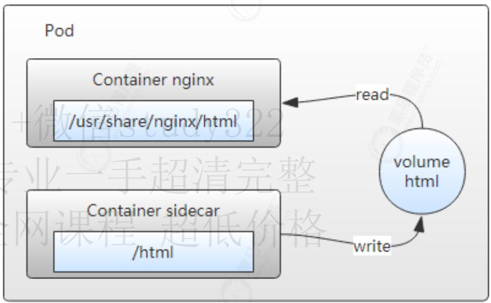

# 存储卷使用示意图

# 4.2.2.2 创建资源清单

vi vol-emptydir-deploy.yml

```
apiVersion: apps/v1
kind: Deployment
metadata:
  name: vol-emptydir-deploy
spec:
  replicas: 1
  selector:
    matchLabels:
    app: nginx
  template:
    metadata:
    labels:
    app: nginx
  spec:
    volumes:    #定义存储卷
    - name: html    #定义存储卷的名称
    emptyDir: {}    #定义存储卷的类型
  containers:
    - name: nginx
    image: nginx:1.12
    ports:
    - containerPort: 80
    volumeMounts:    #在容器中定义挂载存储卷的名和路径
    - name: html
    mountPath: /usr/share/nginx/html
  - name: sidecar
    image: alpine
    volumeMounts:    #在容器中定义挂载存储卷的名和路径
    - name: html
    mountPath: /html
command: ["/bin/sh", "-c"]
args:
- while true; do
    echo $(hostname) $(date) >> /html/index.html;
sleep 10;
done 
```

4.2.2.3 创建deploy

```
kubectl apply -f vol-emptydir-deploy.yml 
kubectl get pods -o wide 
[root@k8s-master ~]# kubectl apply -f vol-emptydir-deploy.yml
deployment.apps/vol-emptydir-deploy created
[root@k8s-master ~]#
[root@k8s-master ~]# kubectl get pods -o wide
NAME READY STATUS RESTARTS AGE IP NODE NOMINATED NODE READINESS GATES
vol-emptydir-deploy-86cd768757-5mtzx 2/2 Running 0 5s 10.244.1.16 k8s-node1 <none>
[root@k8s-master ~]# 
```

4.2.2.4 访问测试

```
curl 10.244.1.16 
```

我们发现 nginx 可以共享来自 sidecar 的数据

```
[root@k8s-master ~]# curl 10.244.1.16
vol-emptydir-deploy-86cd768757-5mtzx Thu May 20 06:50:06 UTC 2021
vol-emptydir-deploy-86cd768757-5mtzx Thu May 20 06:50:16 UTC 2021
vol-emptydir-deploy-86cd768757-5mtzx Thu May 20 06:50:26 UTC 2021
vol-emptydir-deploy-86cd768757-5mtzx Thu May 20 06:50:36 UTC 2021
vol-emptydir-deploy-86cd768757-5mtzx Thu May 20 06:50:46 UTC 2021
[root@k8s-master ~]# 
```

# 4.2.3 测试存储卷

4.2.3.1 登录sidecar

登录 sidecar，并查看目录文件

```
kubectl exec vol-emptydir-deploy-86cd768757-5mtzx -c sidecar -it -- /bin/sh 
[root@k8s-master ~]# kubectl exec vol-emptydir-deploy-86cd768757-5mtzx -c sidecar -it -- /bin/sh
/ #
/ # cd /html/
/html # ls
index.html
/html #
/html # cat index.html
vol-emptydir-deploy-86cd768757-5mtzx Thu May 20 06:50:06 UTC 2021
vol-emptydir-deploy-86cd768757-5mtzx Thu May 20 06:50:16 UTC 2021
vol-emptydir-deploy-86cd768757-5mtzx Thu May 20 06:50:26 UTC 2021
vol-emptydir-deploy-86cd768757-5mtzx Thu May 20 06:50:36 UTC 2021
vol-emptydir-deploy-86cd768757-5mtzx Thu May 20 06:50:46 UTC 2021
vol-emptydir-deploy-86cd768757-5mtzx Thu May 20 06:50:56 UTC 2021
vol-emptydir-deploy-86cd768757-5mtzx Thu May 20 06:51:06 UTC 2021
vol-emptydir-deploy-86cd768757-5mtzx Thu May 20 06:51:16 UTC 2021
vol-emptydir-deploy-86cd768757-5mtzx Thu May 20 06:51:26 UTC 2021
vol-emptydir-deploy-86cd768757-5mtzx Thu May 20 06:51:36 UTC 2021
vol-emptydir-deploy-86cd768757-5mtzx Thu May 20 06:51:46 UTC 2021
vol-emptydir-deploy-86cd768757-5mtzx Thu May 20 06:51:56 UTC 2021
vol-emptydir-deploy-86cd768757-5mtzx Thu May 20 06:52:06 UTC 2021
vol-emptydir-deploy-86cd768757-5mtzx Thu May 20 06:52:16 UTC 2021
vol-emptydir-deploy-86cd768757-5mtzx Thu May 20 06:52:26 UTC 2021
vol-emptydir-deploy-86cd768757-5mtzx Thu May 20 06:52:36 UTC 2021
vol-emptydir-deploy-86cd768757-5mtzx Thu May 20 06:52:46 UTC 2021
vol-emptydir-deploy-86cd768757-5mtzx Thu May 20 06:52:56 UTC 2021
vol-emptydir-deploy-86cd768757-5mtzx Thu May 20 06:53:06 UTC 2021
/html # 
```

在改容器中写入文件

```
echo "hello world" > hello 
/html # echo "hello world" > hello
/html # ls
hello index.html
/html # 
```

# 4.2.3.2 登录nginx

再打开一个窗口登录nginx，查看hello文件是否存在

```
kubectl exec vol-emptydir-deploy-86cd768757-5mtzx -c nginx -it -- /bin/sh 
[root@k8s-master ~]# kubectl exec vol-emptydir-deploy-86cd768757-5mtzx -c nginx -it -- /bin/sh
#
# cd /usr/share/nginx/html
#
# ls
hello index.html
#
# cat hello
hello world
#
# cat index.html
vol-emptydir-deploy-86cd768757-5mtzx Thu May 20 06:50:06 UTC 2021
vol-emptydir-deploy-86cd768757-5mtzx Thu May 20 06:50:16 UTC 2021
vol-emptydir-deploy-86cd768757-5mtzx Thu May 20 06:50:26 UTC 2021
vol-emptydir-deploy-86cd768757-5mtzx Thu May 20 06:50:36 UTC 2021
vol-emptydir-deploy-86cd768757-5mtzx Thu May 20 06:50:46 UTC 2021
vol-emptydir-deploy-86cd768757-5mtzx Thu May 20 06:50:56 UTC 2021
vol-emptydir-deploy-86cd768757-5mtzx Thu May 20 06:51:06 UTC 2021
vol-emptydir-deploy-86cd768757-5mtzx Thu May 20 06:51:16 UTC 2021
vol-emptydir-deploy-86cd768757-5mtzx Thu May 20 06:51:26 UTC 2021
vol-emptydir-deploy-86cd768757-5mtzx Thu May 20 06:51:36 UTC 2021
vol-emptydir-deploy-86cd768757-5mtzx Thu May 20 06:51:46 UTC 2021
vol-emptydir-deploy-86cd768757-5mtzx Thu May 20 06:51:56 UTC 2021
vol-emptydir-deploy-86cd768757-5mtzx Thu May 20 06:52:06 UTC 2021
vol-emptydir-deploy-86cd768757-5mtzx Thu May 20 06:52:16 UTC 2021
vol-emptydir-deploy-86cd768757-5mtzx Thu May 20 06:52:26 UTC 2021
vol-emptydir-deploy-86cd768757-5mtzx Thu May 20 06:52:36 UTC 2021
vol-emptydir-deploy-86cd768757-5mtzx Thu May 20 06:52:46 UTC 2021
vol-emptydir-deploy-86cd768757-5mtzx Thu May 20 06:52:56 UTC 2021
vol-emptydir-deploy-86cd768757-5mtzx Thu May 20 06:53:06 UTC 2021
vol-emptydir-deploy-86cd768757-5mtzx Thu May 20 06:53:16 UTC 2021
vol-emptydir-deploy-86cd768757-5mtzx Thu May 20 06:53:26 UTC 2021
vol-emptydir-deploy-86cd768757-5mtzx Thu May 20 06:53:36 UTC 2021
vol-emptydir-deploy-86cd768757-5mtzx Thu May 20 06:53:46 UTC 2021 
```

删除 hello 文件

```
rm -rf hello 
# ls
hello index.html
#
# rm -f hello
# 
```

在 sidecar 中查看文件时已经删除了

# 4.2.4 测试文件持久性

# 4.2.4.1 登录sidecar

登录 sidecar 并在 html 中写入一段文件

```
kubectl exec vol-emptydir-deploy-86cd768757-5mtzx -c sidecar -it -- /bin/shecho "This is a text to test whether the pod is persistent" > /html/index.html 
[root@k8s-master ~]# kubectl exec vol-emptydir-deploy-86cd768757-5mtzx -c sidecar -it -- /bin/sh
/ #
/ # echo "This is a text to test whether the pod is persistent" > /html/index.html
/ #
/ # cat /html/index.html
This is a text to test whether the pod is persistent
vol-emptydir-deploy-86cd768757-5mtzx Thu May 20 07:03:17 UTC 2021
/ # 
```

# 4.2.4.2 访问测试

```
curl 10.244.1.16 
[root@k8s-master ~]# curl 10.244.1.16
This is a text to test whether the pod is persistent

vol-emptydir-deploy-86cd768757-5mtzx Thu May 20 07:03:17 UTC 2021
vol-emptydir-deploy-86cd768757-5mtzx Thu May 20 07:03:27 UTC 2021
vol-emptydir-deploy-86cd768757-5mtzx Thu May 20 07:03:37 UTC 2021
vol-emptydir-deploy-86cd768757-5mtzx Thu May 20 07:03:47 UTC 2021
vol-emptydir-deploy-86cd768757-5mtzx Thu May 20 07:03:57 UTC 2021
vol-emptydir-deploy-86cd768757-5mtzx Thu May 20 07:04:07 UTC 2021
vol-emptydir-deploy-86cd768757-5mtzx Thu May 20 07:04:17 UTC 2021
vol-emptydir-deploy-86cd768757-5mtzx Thu May 20 07:04:27 UTC 2021
vol-emptydir-deploy-86cd768757-5mtzx Thu May 20 07:04:37 UTC 2021
vol-emptydir-deploy-86cd768757-5mtzx Thu May 20 07:04:47 UTC 2021
vol-emptydir-deploy-86cd768757-5mtzx Thu May 20 07:04:57 UTC 2021
[root@k8s-master ~]# 
```

# 4.2.4.3 删除Pod

手动删除容器模拟容器销毁，用于是pod是被控制器管理的，删除后会被重建新的pod

```
kubectl delete pod vol-emptydir-deploy-86cd768757-5mtzx 
```

我们发现销毁pod后新建的pod转移到node2节点了，并且pod名称也改变了

# 4.2.4.4 访问测试

```
curl 10.244.2.22 
```

这时候在看我们之前写入的文字不见了

```
[root@k8s-master ~]# curl 10.244.2.22
vol-emptydir-deploy-86cd768757-xj6hc Thu May 20 07:06:45 UTC 2021
vol-emptydir-deploy-86cd768757-xj6hc Thu May 20 07:06:55 UTC 2021
vol-emptydir-deploy-86cd768757-xj6hc Thu May 20 07:07:05 UTC 2021
vol-emptydir-deploy-86cd768757-xj6hc Thu May 20 07:07:15 UTC 2021
vol-emptydir-deploy-86cd768757-xj6hc Thu May 20 07:07:25 UTC 2021
vol-emptydir-deploy-86cd768757-xj6hc Thu May 20 07:07:35 UTC 2021
vol-emptydir-deploy-86cd768757-xj6hc Thu May 20 07:07:45 UTC 2021
vol-emptydir-deploy-86cd768757-xj6hc Thu May 20 07:07:55 UTC 2021
vol-emptydir-deploy-86cd768757-xj6hc Thu May 20 07:08:05 UTC 2021
vol-emptydir-deploy-86cd768757-xj6hc Thu May 20 07:08:15 UTC 2021
vol-emptydir-deploy-86cd768757-xj6hc Thu May 20 07:08:25 UTC 2021
vol-emptydir-deploy-86cd768757-xj6hc Thu May 20 07:08:35 UTC 2021
vol-emptydir-deploy-86cd768757-xj6hc Thu May 20 07:08:45 UTC 2021
[root@k8s-master ~]# 
```

# 4.3 hostpath

hostPath 类型的存储卷是指将工作节点上的某文件系统的目录或文件挂载于 Pod 中的一种存储卷，独立于 Pod 资源的生命周期，具有持久性，在 Pod 删除时，数据不会丢失。

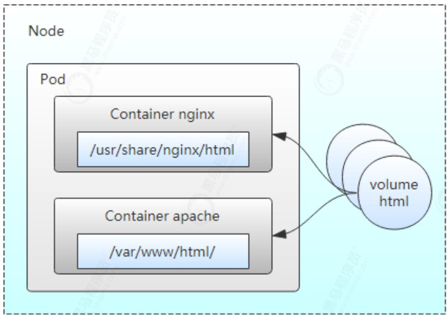

存储卷(hostPath)使用示意图

hostPath类型则是映射node文件系统中的文件或者目录到pod里，在使用hostPath类型的存储卷时，也可以设置type字段，支持的类型有文件、目录、File、Socket、CharDevice和BlockDevice。

其实这个功能就相当于docker中的-v目录映射，只不过在k8s中的时候，pod会漂移，当pod漂移到其他node节点的时候，pod不会跨节点的去读取目录。所以说hostpath只能算一种半持久化的存储方式

# 4.3.1 使用场景

- 当运行的容器需要访问Docker内部结构时，如使用hostPath映射/var/lib/docker到容器；

- 当在容器中运行Advisor时，可以使用hostPath映射/dev/cgroups到容器中；

# 4.3.2 使用示例

# 4.3.2.1 案例说明

这里定义了一个 deploy 资源对象（vol-hostpath-deploy），在其内部定义了一个容器，将nginx的html文件映射到外部，我们外面给html写入文件，访问nginx来验证是否能够访问。

# 4.3.2.2 创建资源清单

```
vi vol-hostpath-deploy.yml 
apiVersion: apps/v1
kind: Deployment
metadata:
  name: vol-hostpath-deploy
spec:
  replicas: 1
  selector:
    matchLabels:
    app: nginx
  template:
    metadata:
    labels:
    app: nginx
  spec:
    volumes:    #定义存储卷
    - name: html  # 定义存储名称
    hostPath:    # 定义存储类型
    path: /tmp/k8s/data/volumn1  # 宿主机存储路径
    type: DirectoryOrCreate    # 不存在路径创建路径
  containers:
    - name: nginx
    image: nginx:1.12
    ports:
    - containerPort: 80
    volumeMounts:    #在容器中定义挂载存储卷的名和路径
    - name: html
    mountPath: /usr/share/nginx/html
```

# 4.3.2.3 创建deploy

```
kubectl apply -f vol-hostpath-deploy.yml
kubectl get pods -o wide 
[root@k8s-master ~]# kubectl apply -f vol-hostpath-deploy.yml
deployment.apps/vol-hostpath-deploy created
[root@k8s-master ~]#
[root@k8s-master ~]# kubectl get pods -o wide
NAME READY STATUS RESTARTS AGE IP NODE NOMINATED NODE READINESS GATES
vol-hostpath-deploy-595699bdb4-4m8s4 1/1 Running 0 5s 10.244.1.17 k8s-node1 <none>
[root@k8s-master ~]# 
```

# 4.3.2.4 写入文件

查看pod发现pod在node1节点，登录node1节点写入文件

```
cd /tmp/k8s/data/volumn1/echo "This is a text to test whether the pod is persistent" > index.html 
[root@k8s-node1 ~]# cd /tmp/k8s/data/volumn1/
[root@k8s-node1 volumn1]#
[root@k8s-node1 volumn1]# ll
总用量 0
[root@k8s-node1 volumn1]# echo "This is a text to test whether the pod is persistent" > index.html
[root@k8s-node1 volumn1]#
[root@k8s-node1 volumn1]# ll
总用量 4
-rw-r--r--. 1 root root 53 5月 20 15:32 index.html
[root@k8s-node1 volumn1]#
```

# 4.3.2.5 访问测试

```
curl 10.244.1.17 
[root@k8s-master ~]# curl 10.244.1.17
This is a text to test whether the pod is persistent
[root@k8s-master ~]# 
```

# 4.3.3 测试存储卷

# 4.3.3.1 登录nginx

```
kubectl exec vol-emptydir-deploy-86cd768757-5mtzx -c nginx -it -- /bin/sh
cd /usr/share/nginx/html
cat index.html
echo "hello hostpath" > hello 
[root@k8s-master ~]# kubectl exec vol-hostpath-deploy-595699bdb4-4m8s4 -c nginx -it -- /bin/sh
#
# cd /usr/share/nginx/html
#
# cat index.html
This is a text to test whether the pod is persistent
#
# echo "hello hostpath" > hello
#
# ls
hello index.html
# 
```

# 4.3.3.2 登录宿主机查看

登录pod所在的节点的宿主机目录查看文件是否存在

```
cat hello 
```

发现写入的文件是存在的

```
[root@k8s-node1 volumnl]# pwd
/tmp/k8s/data/volumn1
[root@k8s-node1 volumnl]#
[root@k8s-node1 volumnl]# ll
总用量 8
-rw-r--r--. 1 root root 15 5月 20 15:36 hello
-rw-r--r--. 1 root root 53 5月 20 15:32 index.html
[root@k8s-node1 volumnl]#
[root@k8s-node1 volumnl]# cat hello
hello hostpath
[root@k8s-node1 volumnl]#
```

# 4.3.4 测试文件持久性

# 4.3.4.1 删除Pod

手动删除容器模拟容器销毁，用于是pod是被控制器管理的，删除后会被重建新的pod

```
kubectl delete pod vol-hostpath-deploy-595699bdb4-4m8s4 
[root@k8s-master ~]# kubectl get pods -o wide
NAME READY STATUS RESTARTS AGE IP NODE NOMINATED NODE READINESS GATES
vol-hostpath-deploy-595699bdb4-4m8s4 1/1 Running 0 11m 10.244.1.17 k8s-node1 <none>
[root@k8s-master ~]#
[root@k8s-master ~]# kubectl delete pod vol-hostpath-deploy-595699bdb4-4m8s4
pod "vol-hostpath-deploy-595699bdb4-4m8s4" deleted
[root@k8s-master ~]#
[root@k8s-master ~]# kubectl get pods -o wide
NAME READY STATUS RESTARTS AGE IP NODE NOMINATED NODE READINESS GATES
vol-hostpath-deploy-595699bdb4-gd8sw 1/1 Running 0 14s 10.244.2.23 k8s-node2 <none>
[root@k8s-master ~]# 
```

# 4.3.4.2 访问测试

我们知道hostpath是在宿主机创建文件的，现在我们发现pod漂移到了node2节点，我们尝试访问，并登录容器查看

```
curl 10.244.2.23 
```

发现文件不存在符合我们的预期

```
[root@k8s-master ~]# curl 10.244.2.23
<html>
<head><title>403 Forbidden</title></head>
<body bgcolor="white">
<center><h1>403 Forbidden</h1></center>
<hr><center>nginx/1.12.2</center>
</body>
</html>
[root@k8s-master ~]# 
```

# 4.3.4.3 再次删除容器

因为上一次删除漂移到了node2,我们再次删除让其漂移到node1

```
kubectl delete pod vol-hostpath-deploy-595699bdb4-gd8sw 
[root@k8s-master ~]# kubectl delete pod vol-hostpath-deploy-595699bdb4-gd8sw
pod "vol-hostpath-deploy-595699bdb4-gd8sw" deleted
[root@k8s-master ~]#
[root@k8s-master ~]# kubectl get pods -o wide
NAME READY STATUS RESTARTS AGE IP NODE NOMINATED NODE READINESS GATES
vol-hostpath-deploy-595699bdb4-rfl25 1/1 Running 0 5s 10.244.1.18 k8s-node1 <none>
[root@k8s-master ~]# 
```

# 4.3.4.4 访问测试

```
curl 10.244.1.18 
[root@k8s-master ~]# curl 10.244.1.18
This is a text to test whether the pod is persistent
[root@k8s-master ~]# 
```

# 4.3.4.5 总结

可以发现容器被删除后，新建的pod也可以看到我们映射的目录，我们写入的文件是存在的

这有个缺点就是不能够跨容器去读取数据，如果删除后的pod被调度到其他节点的话，原来的数据也就没有了，如果能不受节点的影响，并且挂载的数据不会随生命周期的结束而结束，我们应该怎么解决呢？我们可以采用NFS的方式进行存储

# 5. pod调度策略

一般而言pod的调度都是通过RC、Deployment等控制器自动完成，但是仍可以通过手动配置的方式进行调度，目的就是让pod的调度符合我们的预期。

# 5.1 节点调度

Pod.spec.nodeName 用于强制约束将Pod调度到指定的Node节点上，这里说是“调度”，但其实指定了nodeName的Pod会直接跳过Scheduler的调度逻辑，直接写入PodList列表，该匹配规则是强制匹配。

# 5.1.1 创建资源清单

```
vi pod-node-dispatch.yml 
apiVersion: apps/v1
kind: Deployment
metadata:
  name: nginx-deployment
spec:
  replicas: 1
  selector:
    matchLabels:
    app: nginx
  template:
    metadata:
    labels:
    app: nginx
  spec:
    nodeName: node1 #指定调度节点为node1
    containers:
    - name: nginx
    image: nginx:1.20
    ports:
    - containerPort: 80
```

# 5.1.2 应用部署

```
kubectl apply -f pod-node-selector-dispatch.yml
kubectl get pods -o wide 
```

创建部署后，我们发现节点在node1的节点上

```
[root@k8s-master ~]# kubectl apply -f pod-node-dispatch.yml
deployment.apps/nginx-deployment created
[root@k8s-master ~]#
[root@k8s-master ~]# kubectl get pods -o wide
NAME READY STATUS RESTARTS AGE IP NODE NOMINATED NODE READINESS GATES
nginx-deployment-5dc7769598-n25q5 1/1 Running 0 26s 10.244.1.51 k8s-node1 <none> <none>
[root@k8s-master ~]# 
```

# 5.1.3 删除pod

删除pod应用，pod控制器会重建pod

```
kubectl delete pod nginx-deployment-5dc7769598-n25q5 
```

我们发现节点删除后，重新的应用还是落在了node1节点上，说明我们的节点调度生效的

```
[root@k8s-master ~]# kubectl get pods -o wide
NAME READY STATUS RESTARTS AGE IP NODE NOMINATED NODE READINESS GATES
nginx-deployment-5dc7769598-n25q5 1/1 Running 0 2m57s 10.244.1.51 k8s-node1 <none> <none>
[root@k8s-master ~]#
[root@k8s-master ~]# kubectl delete pod nginx-deployment-5dc7769598-n25q5
pod "nginx-deployment-5dc7769598-n25q5" deleted
[root@k8s-master ~]#
[root@k8s-master ~]# kubectl get pods -o wide
NAME READY STATUS RESTARTS AGE IP NODE NOMINATED NODE READINESS GATES
nginx-deployment-5dc7769598-6srh9 1/1 Running 0 4s 10.244.1.52 k8s-node1 <none> <none>
[root@k8s-master ~]# 
```

# 5.2 定向调度(标签调度)

定向调度是把pod调度到具有特定标签的node节点的一种调度方式，比如把MySQL数据库调度到具有SSD的node节点以优化数据库性能。此时需要首先给指定的node打上标签，并在pod中设置nodeSelector属性以完成pod的指定调度。

# 5.2.1 创建标签

给指定的node打上标签

# 5.2.1.1 添加标签

给node2添加上 disk=ssd 的标签

```
kubectl label nodes node2 disk=ssd 
[root@k8s-master ~]# kubectl label nodes k8s-node2 disk=ssd node/k8s-node2 labeled
[root@k8s-master ~]# 
```

# 5.2.1.2 显示标签

显示node2的所有标签

```
kubectl label node node2 --list=true 
```

我们发现我们的标签已经添加上去了

```
[root@k8s-master ~]# kubectl label nodes k8s-node2 disk=ssd
node/k8s-node2 labeled
[root@k8s-master ~]#
[root@k8s-master ~]# kubectl label node k8s-node2 --list=true
kubernetes.io/hostname=k8s-node2
kubernetes.io/os=linux
beta.kubernetes.io/arch=amd64
beta.kubernetes.io/os=linux
disk=ssd
kubernetes.io/arch=amd64
[root@k8s-master ~]# 
```

# 5.2.3 创建资源清单

```
vi pod-node-selector-dispatch.yml 
apiVersion: apps/v1
kind: Deployment
metadata:
  name: nginx-deployment
spec:
  replicas: 2
  selector:
    matchLabels:
    app: nginx
  template:
    metadata:
    labels:
    app: nginx
  spec:
    nodeSelector: 
disk: ssd # 节点调度到
containers:
- name: nginx
image: nginx:1.20
ports:
- containerPort: 80
```

# 5.2.4 应用部署

```
kubectl apply -f pod-node-selector-dispatch.yml
kubectl get pods -o wide 
```

创建部署后，我们发现两个pod都在node2的节点上

```
[root@k8s-master ~]# kubectl apply -f pod-node-selector-dispatch.yml
deployment.apps/nginx-deployment created
[root@k8s-master ~]#
[root@k8s-master ~]# kubectl get pods -o wide
NAME READY STATUS RESTARTS AGE IP NODE NOMINATED NODE READINESS GATES
nginx-deployment-b7cf96956-8zd2n 1/1 Running 0 7s 10.244.2.58 k8s-node2 <none>
nginx-deployment-b7cf96956-n7jt8 1/1 Running 0 7s 10.244.2.57 k8s-node2 <none>
[root@k8s-master ~]# 
```

# 5.2.5 删除pod

删除pod应用，pod控制器会重建pod

```
kubectl delete pod nginx-deployment-5dc7769598-n25q5 
```

我们发现节点删除后，重新的应用还是落在了node2节点上，说明我们的定向调度生效的

```
[root@k8s-master ~]# kubectl get pods -o wide
NAME READY STATUS RESTARTS AGE IP NODE NOMINATED NODE READINESS GATES
nginx-deployment-b7cf96956-8zd2n 1/1 Running 0 7s 10.244.2.58 k8s-node2 <none>
nginx-deployment-b7cf96956-n7jt8 1/1 Running 0 7s 10.244.2.57 k8s-node2 <none>
[root@k8s-master ~]#
[root@k8s-master ~]# kubectl delete pod nginx-deployment-b7cf96956-8zd2n
pod "nginx-deployment-b7cf96956-8zd2n" deleted
[root@k8s-master ~]#
[root@k8s-master ~]# kubectl get pods -o wide
NAME READY STATUS RESTARTS AGE IP NODE NOMINATED NODE READINESS GATES
nginx-deployment-b7cf96956-b9t7j 1/1 Running 0 14s 10.244.2.59 k8s-node2 <none>
nginx-deployment-b7cf96956-n7jt8 1/1 Running 0 77s 10.244.2.57 k8s-node2 <none>
[root@k8s-master ~]# 
```

注意:定向调度可以把pod调度到特定的node节点，但随之而来的缺点就是如果集群中不存在响应的node，即使有基本满足条件的node节点，pod也不会被调度

# 6. Service

Kubernetes service 定义了这样一种抽象：一个 Pod 的逻辑分组，一种可以访问它们的策略——通常称为微服务，这一组 pod 能够被 Service 访问到，通常是通过 Label selector

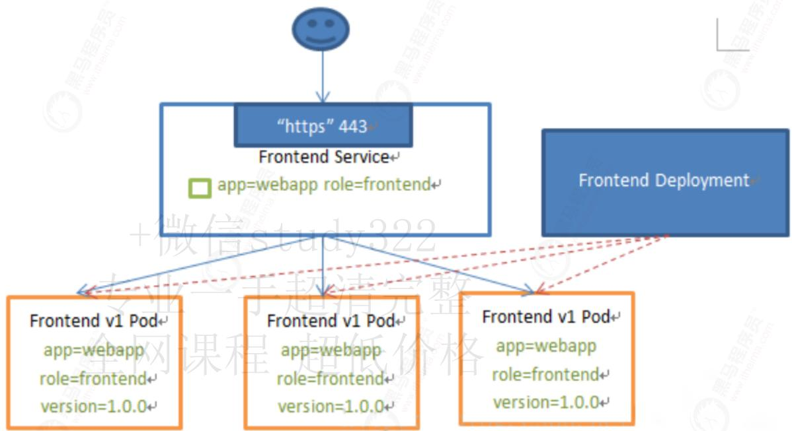

Service能够提供负载均衡的能力，但是在使用上有以下限制：

- 只提供4层负载均衡能力，而没有7层功能，但有时我们可能需要更多的匹配规则来转发请求，这点上4层负载均衡是不支持的

# 6.1 Service概述

Kubernetes Service 从逻辑上代理了一组 Pod，具体是哪些 Pod 则是由 label 来挑选，Service 有自己 IP，而且这个 IP 是不变的。

- 客户端只需要访问 Service 的 IP，Kubernetes 则负责建立和维护 Service 与 Pod 的映射关系。

- 无论后端 Pod 如何变化，对客户端不会有任何影响，因为 Service 没有变

# 6.1.1 为什么要有Service

当Pod宕机后重新生成时，其IP等状态信息可能会变动，Service会根据Pod的Label对这些状态信息进行监控和变更，保证上游服务不受Pod的变动而影响。

Kubernetes Pods 是有生命周期的，他们可以被创建，而且销毁不会再启动，如果您使用 Deployment 来运行您的应用程序，则它可以动态创建和销毁 Pod。

一个Kubernetes的 Service 是一种抽象，它定义了一组 Pods 的逻辑集合和一个用于访问它们的策略 - 有的时候被称之为微服务，一个 Service 的目标 Pod 集合通常是由 Label Selector 来决定的。

如下图所示，当 Nginx Pod 作为客户端访问 Tomcat Pod 中的应用时，IP 的变动或应用规模的缩减会导致客户端访问错误。而 Pod 规模的扩容又会使得客户端无法有效的使用新增的 Pod 对象，从而影响达成规模扩展之目的。为此，Kubernetes 特地设计了 Service 资源来解决此类问题。

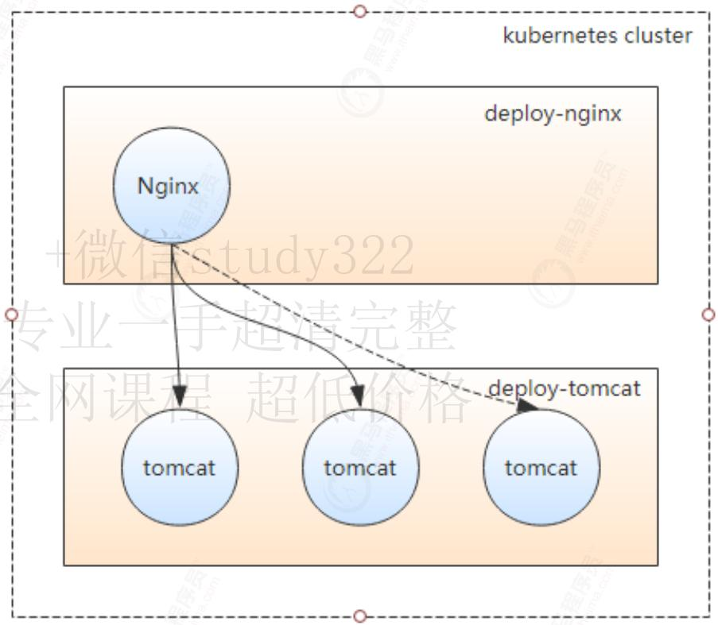

Pod 及客户端示例

# 6.1.2 Service实现原理

Service 资源基于标签选择器将一组 Pod 定义成一个逻辑组合，并通过自己的 IP 地址和端口调度代理请求至组内的 Pod 对象之上，如下图所示，它向客户端隐藏了真实的、处理用户请求的 Pod 资源，使得客户端的请求看上去就像是由 service 直接处理并响应一样。

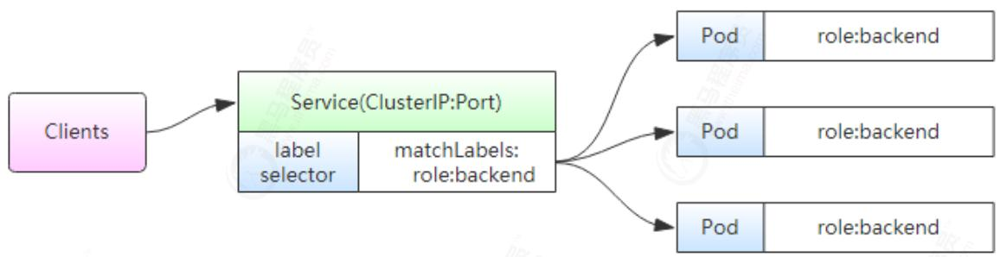

Kubernetes Service 资源模型示意图

Service对象的IP地址也称为Cluster IP，它位于Kubernetes集群配置指定专用IP地址的范围之内，是一种虚拟IP地址，它在Service对象创建后既保持不变，并且能够被同一集群中的Pod资源所访问。Service端口用于接收客户端请求并将其转发至其后端的Pod中的相应端口之上，因此，这种代理机构也称为“端口代理”(port proxy)或四层代理，工作于TCP/IP协议栈的传输层。

Service 资源会通过 API Server 持续监视着（watch）标签选择器匹配到的后端 Pod 对象，并实时跟踪各对象的变动，例如，IP 地址变动、对象增加或减少等。Service 并不直接链接至 Pod 对象，它们之间还有一个中间层——Endpoints 资源对象，它是一个由 IP 地址和端口组成的列表，这些 IP 地址和端口则来自由 Service 的标签选择器匹配到的 Pod 资源。当创建 service 对象时，其关联的 Endpoints 对象会自动创建。

# 6.2 Service 的类型

Service 在 K8s 中有以下四种类型

- ClusterIp：默认类型，自动分配一个仅Cluster内部可以访问的虚拟IP

- NodePort：在 ClusterIP 基础上为 Service 在每台机器上绑定一个端口，这样就可以通过：NodePort 来访问该服务

- LoadBalancer：在 NodePort 的基础上，借助 cloud provider 创建一个外部负载均衡器，并将请求转发到：NodePort

- ExternalName：把集群外部的服务引入到集群内部来，在集群内部直接使用。没有任何类型代理被创建，这只有kubernetes 1.7或更高版本的kube-dns才支持

# 6.3 Service示例

# 6.3.1 准备工作

6.3.1.1 创建deployment

```
vi nginx-deployment.yml 
apiVersion: apps/v1
kind: Deployment
metadata:
  name: nginx-deployment
spec:
  replicas: 1 # 只有一个副本
  selector:
    matchLabels:
    app: nginx
  template:
    metadata:
    labels:
    app: nginx
  spec:
    volumes:  # 定义存储卷
    - name: html  # 定义存储名称
    hostPath:  # 定义存储类型
    path: /tmp/k8s/data/volumn1  # 宿主机存储路径
    type: DirectoryOrCreate  # 不存在路径创建路径
  containers:
    - name: nginx
    image: nginx:1.20
    volumeMounts:  # 在容器中定义挂载存储卷的名和路径
    - name: html
    mountPath: /usr/share/nginx/html
    ports:
    - containerPort: 80
```

6.3.1.2 启动deployment

```
kubectl apply -f nginx-deployment.yml
kubectl get pods -o wide 
[root@k8s-master ~]# kubectl apply -f nginx-deployment.yml
deployment.apps/nginx-deployment created
[root@k8s-master ~]# kubectl get pods -o wide
NAME READY STATUS RESTARTS AGE IP NODE NOMINATED NODE READINESS GATES
nginx-deployment-6897679c4b-2hqmk 1/1 Running 0 3s 10.244.2.54 k8s-node2 <none>
[root@k8s-master ~]# 
```

# 6.3.1.3 访问测试

curl 10.244.2.54

```
[root@k8s-master ~]# curl 10.244.2.54
<!DOCTYPE html>
<html>
<head>
<title>Welcome to nginx!</title>
<style>
body {
width: 35em;
margin: 0 auto;
font-family: Tahoma, Verdana, Arial, sans-serif;
}
</style>
</head>
<body>
<h1>Welcome to nginx!</h1>
<p>If you see this page, the nginx web server is successfully installed and working. Further configuration is required.</p>
<p>For online documentation and support please refer to
<a href="http://nginx.org/">nginx.org</a>.<br/>
Commercial support is available at
<a href="http://nginx.com/">nginx.com</a>.</p>
<p><em>Thank you for using nginx.</em></p>
</body>
</html>
[root@k8s-master ~]# 
```

# 6.3.2 ClusterIP类型

类型为ClusterIP的service，这个service有一个Cluster-IP，其实就一个VIP，具体实现原理依靠kubeproxy组件，通过iptables或是ipvs实现。

注意：这种类型的service 只能在集群内访问

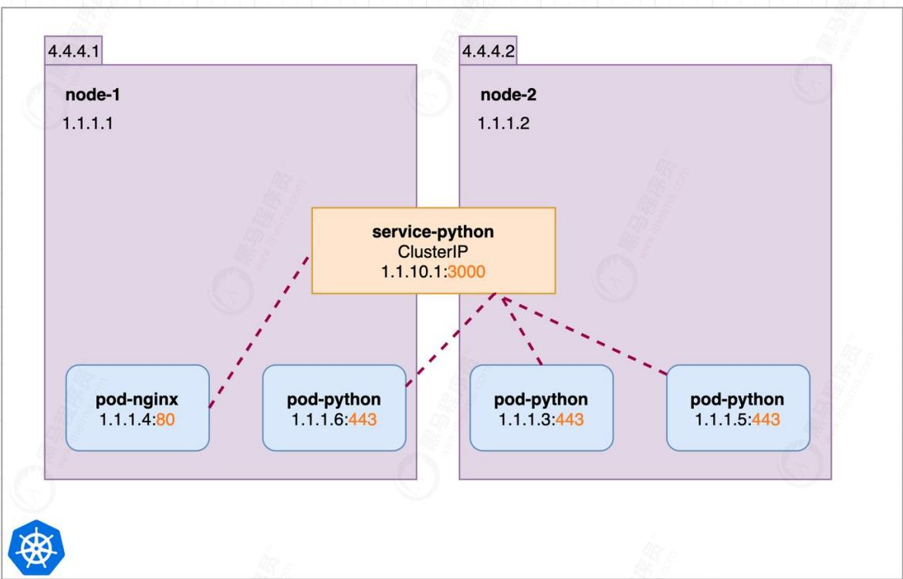

# 6.3.2.1 编辑资源清单

vi cluster-iP-service.yml

```
apiversion: v1
kind: Service
metadata: 
name: nginx-service
namespace: default
labels:
    app: nginx-service
spec:
    type: ClusterIP
    ports:
    - port: 8000 # Service 暴漏端口
    targetPort: 80 # 代理的对象的端口
    selector:
    app: nginx # 绑定标签是nginx的对象
```

6.3.2.2 应用Service

```
kubectl apply -f cluster-iP-service.yml
kubectl get service -o wide 
[root@k8s-master ~]# kubectl get service
NAME    TYPE    CLUSTER-IP    EXTERNAL-IP    PORT(S)    AGE
kubernetes    ClusterIP 10.1.0.1 <none>    443/TCP    4d1h
nginx-service    ClusterIP 10.1.206.66 <none>    8000/TCP    4m19s
[root@k8s-master ~]# 
```

6.3.2.3 访问测试

```
curl 10.1.206.66:8000 
[root@k8s-master ~]# curl 10.1.206.66:8000
<!DOCTYPE html>
<html>
<head>
<title>Welcome to nginx!</title>
<style>
body {
width: 35em;
margin: 0 auto;
font-family: Tahoma, Verdana, Arial, sans-serif;
}
</style>
</head>
<body>
<h1>Welcome to nginx!</h1>
<p>If you see this page, the nginx web server is successfully installed and working. Further configuration is required.</p>
<p>For online documentation and support please refer to
<a href="http://nginx.org/">nginx.org</a>.<br/>
Commercial support is available at
<a href="http://nginx.com/">nginx.com</a>.</p>
<p><em>Thank you for using nginx.</em></p>
</body>
</html>
[root@k8s-master ~]# 
```

6.3.2.4 删除Pod

删除pod让Pod的节点漂移再次访问Service节点

```
kubectl delete pod nginx-deployment-6897679c4b-2hqmk 
[root@k8s-master ~]# kubectl get pods -o wide
NAME READY STATUS RESTARTS AGE IP NODE NOMINATED NODE READINESS GATES
nginx-deployment-6897679c4b-2hqmk 1/1 Running 0 9m43s 10.244.2.54 k8s-node2 <none>
[root@k8s-master ~]#
[root@k8s-master ~]# kubectl delete pod nginx-deployment-6897679c4b-2hqmk
pod "nginx-deployment-6897679c4b-2hqmk" deleted
[root@k8s-master ~]#
[root@k8s-master ~]# kubectl get pods -o wide
NAME READY STATUS RESTARTS AGE IP NODE NOMINATED NODE READINESS GATES
nginx-deployment-6897679c4b-vhzbd 1/1 Running 0 16s 10.244.1.49 k8s-node1 <none>
[root@k8s-master ~]# 
```

6.3.2.5 访问测试

我们发现虽然pod的IP以及节点变化了但是 service 访问IP没有任何变化

```
curl 10.1.206.66:8000 
[root@k8s-master ~]# curl 10.1.206.66:8000
<!DOCTYPE html>
<html>
<head>
<title>Welcome to nginx!</title>
<style>
    body {
    width: 35em;
    margin: 0 auto;
    font-family: Tahoma, Verdana, Arial, sans-serif;
    }
</style>
</head>
<body>
<h1>Welcome to nginx!</h1>
<p>If you see this page, the nginx web server is successfully installed and working. Further configuration is required.</p>

<p>For online documentation and support please refer to
<a href="http://nginx.org/">nginx.org</a>.<br/>
Commercial support is available at
<a href="http://nginx.com/">nginx.com</a>.</p>

<p><em>Thank you for using nginx.</em></p>
</body>
</html>
[root@k8s-master ~]# 
```

# 6.3.3 NodePort

当我们需要集群外业务访问，那么ClusterIP就满足不了了，NodePort当然是其中的一种实现方案

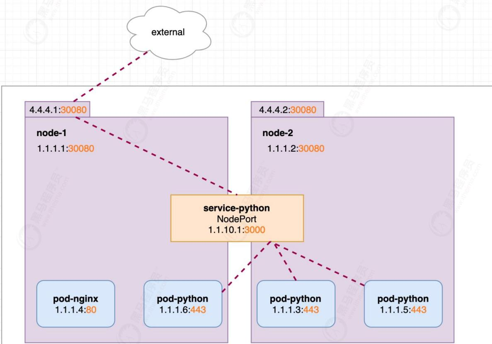


# 6.3.3.1 编辑资源清单

```
vi node-port-service.yml 
apiversion: v1
kind: Service
metadata:
  name: nginx-node-port-service
  namespace: default
  labels:
    app: nginx-service
spec:
  type: NodePort
ports: 
- port: 8000 # Service 暴漏端口
targetPort: 80 # 代理的对象的端口
selector:
app: nginx # 绑定标签是nginx的对象
```

# 6.3.3.2 应用Service

```
kubectl apply -f node-port-service.yml 
kubectl get service -o wide 
[root@k8s-master ~]# kubectl apply -f node-port-service.yml
service/nginx-node-port-service created
[root@k8s-master ~]#
[root@k8s-master ~]# kubectl get service -o wide
NAME    TYPE    CLUSTER-IP    EXTERNAL-IP    PORT(S)    AGE    SELECTOR
kubernetes    ClusterIP 10.1.0.1 <none>    443/TCP    4d1h <none>
nginx-node-port-service NodePort 10.1.137.200 <none>    8000:31337/TCP    1ls    app=nginx
[root@k8s-master ~]# 
```

# 6.3.3.3 访问测试

```
curl 10.1.137.200:8000 
[root@k8s-master ~]# curl 10.1.137.200:8000
<!DOCTYPE html>
<html>
<head>
<title>Welcome to nginx!</title>
<style>
body {
width: 35em;
margin: 0 auto;
font-family: Tahoma, Verdana, Arial, sans-serif;
}
</style>
</head>
<body>
<h1>Welcome to nginx!</h1>
<p>If you see this page, the nginx web server is successfully installed and working. Further configuration is required.</p>

<p>For online documentation and support please refer to
<a href="http://nginx.org/">nginx.org</a>.<br/>
Commercial support is available at
<a href="http://nginx.com/">nginx.com</a>.</p>

<p><em>Thank you for using nginx.</em></p>
</body>
</html>
[root@k8s-master ~]# 
```

# 6.3.3.4 删除Pod

删除pod让Pod的节点漂移再次访问Service节点

```
kubectl delete pod nginx-deployment-6897679c4b-2hqmk 
[root@k8s-master ~]# kubectl get pods -o wide
NAME READY STATUS RESTARTS AGE IP NODE NOMINATED NODE READINESS GATES
nginx-deployment-6897679c4b-vhzbd 1/1 Running 0 15m 10.244.1.49 k8s-node1 <none> <none>
[root@k8s-master ~]#
[root@k8s-master ~]# kubectl delete pod nginx-deployment-6897679c4b-vhzbd
pod "nginx-deployment-6897679c4b-vhzbd" deleted
[root@k8s-master ~]#
[root@k8s-master ~]# kubectl get pods -o wide
NAME READY STATUS RESTARTS AGE IP NODE NOMINATED NODE READINESS GATES
nginx-deployment-6897679c4b-m7k7d 1/1 Running 0 11s 10.244.2.55 k8s-node2 <none> <none>
[root@k8s-master ~]# 
```

# 6.3.3.5 访问测试

我们发现虽然pod的IP以及节点变化了但是 service 访问IP没有任何变化

```
curl 10.1.137.200:8000 
[root@k8s-master ~]# curl 10.1.137.200:8000
<!DOCTYPE html>
<html>
<head>
<title>Welcome to nginx!</title>
<style>
body {
width: 35em;
margin: 0 auto;
font-family: Tahoma, Verdana, Arial, sans-serif;
}
</style>
</head>
<body>
<h1>Welcome to nginx!</h1>
<p>If you see this page, the nginx web server is successfully installed and working. Further configuration is required.</p>
<p>For online documentation and support please refer to
<a href="http://nginx.org/">nginx.org</a>.<br/>
Commercial support is available at
<a href="http://nginx.com/">nginx.com</a>.</p>
<p><em=Thank you for using nginx.</em></p>
</body>
</html>
[root@k8s-master ~]# 
```

# 6.3.3.6 外网访问

NodePort的最主要功能是进行外网访问，我们是不能通过访问8000端口访问的，他是内网端口，外网访问需要访问映射出来的端口8000:31337/TCP这里映射出来的nodeport是31337，还可以通过指定nodePort来指定端口，要求端口必须大于30000

```
curl 192.168.64.160:31337 
[root@k8s-master ~]# curl 192.168.64.160:31337
<!DOCTYPE html>
<html>
<head>
<title>Welcome to nginx!</title>
<style>
body {
width: 35em;
margin: 0 auto;
font-family: Tahoma, Verdana, Arial, sans-serif;
}
</style>
</head>
<body>
<h1>Welcome to nginx!</h1>
<p>If you see this page, the nginx web server is successfully installed and working. Further configuration is required.</p>
<p>For online documentation and support please refer to
<a href="http://nginx.org/">nginx.org</a>.<br/>
Commercial support is available at
<a href="http://nginx.com/">nginx.com</a>.</p>
<p><em>Thank you for using nginx.</em></p>
</body>
</html>
[root@k8s-master ~]# 
```

# 通过浏览器访问

```
← → Ⓗ 不安全 | 192.168.64.160:31337
G
★
★
●
: 
```

# Welcome to nginx!

If you see this page, the nginx web server is successfully installed and working. Further configuration is required.

For online documentation and support please refer to nginx.org. Commercial support is available at nginx.com.

Thank you for using nginx.

# 6.4 端口号区分

k8s 中 port，nodePort，targetPort 有什么区别呢

# 6.4.1 应用位置不同

- port: 是service的的端口

- targetport: 是pod也就是容器的端口

- nodeport：是容器所在宿主机的端口（实质上也是通过service暴露给了宿主机，而port却没有）

# 6.4.1 port

k8s集群内部服务之间访问service的入口，即clusterIP:port是service暴露在clusterIP上的端口

主要作用是集群内其他pod访问本pod的时候，需要的一个port，如nginx的pod访问mysql的pod，那么mysql的pod的service可以如下定义，由此可以这样理解，port是service的port，nginx访问service的33306

```
apiVersion: v1
kind: service
metadata:
  name: mysql-service
spec:
  ports:
  - port: 33306
    targetPort: 3306
  selector:
  name: mysql-pod 
```

# 6.4.2 targetport

容器的端口（最终的流量端口）。targetPort是pod上的端口，从port和nodePort上来的流量，经过kube-proxy流入到后端pod的targetPort上，最后进入容器。

看上面的targetport，targetport说过是pod暴露出来的port端口，当nginx的一个请求到达service的33306端口时，service就会将此请求根据selector中的name，将请求转发到mysql-pod这个pod的3306端口上

# 6.4.3 nodeport

nodeport就很好理解了，它是集群外的客户访问，集群内的服务时，所访问的port，比如客户访问下面的集群中的nginx，就是这样的方式，ip:30001

外部流量访问k8s集群中service入口的一种方式（另一种方式是LoadBalancer），即nodeIP:nodePort是提供给外部流量访问k8s集群中service的入口

比如外部用户要访问k8s集群中的一个Web应用，那么我们可以配置对应service的type=NodePort，nodePort=30001。其他用户就可以通过浏览器http://node:30001访问到该web服务。而数据库等服务可能不需要被外界访问，只需被内部服务访问即可，那么我们就不必设置service的NodePort。

```
apiVersion: v1
kind: Service
metadata:
    name: nginx-service
spec:
    type: NodePort # 有配置NodePort，外部流量可访问k8s中的服务
    ports:
    - port: 30080 # 服务访问端口
    targetPort: 80 # 容器端口
    nodePort: 30001 # NodePort
    selector: name: nginx-pod
```

# 6.4.4 小结

nodeport是集群外流量访问集群内服务的端口类型，比如客户访问nginx，apache，port是集群内的pod互相通信用的端口类型，比如nginx访问mysql，而mysql是不需要让客户访问到的，最后targetport，顾名思义，目标端口，也就是最终端口，也就是pod的端口。

+微信study322 专业一手超清完整 全网课程 超低价格