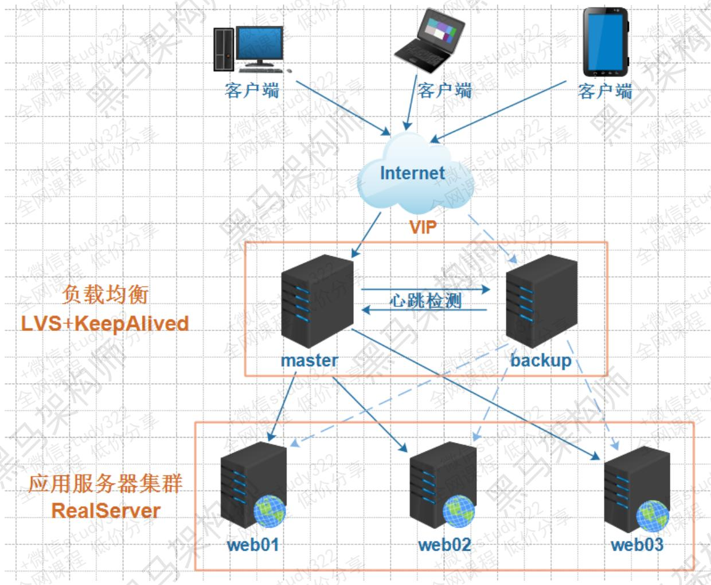
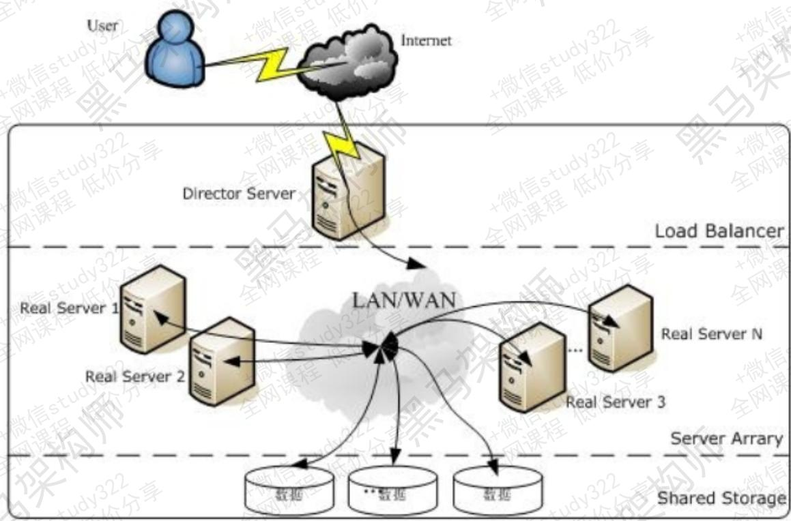
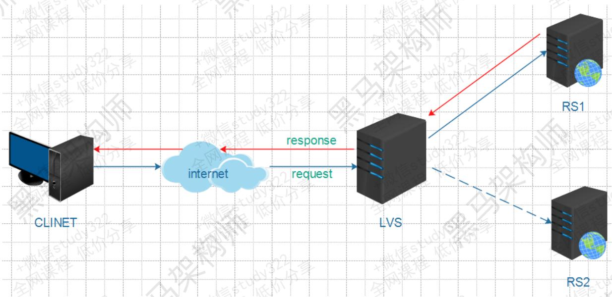
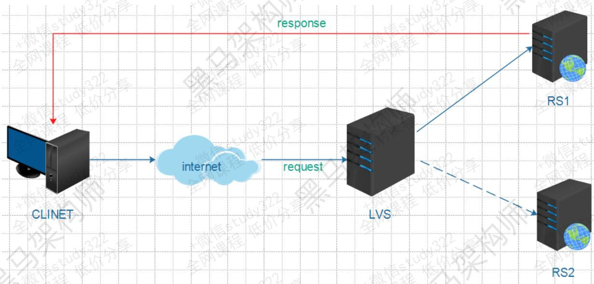
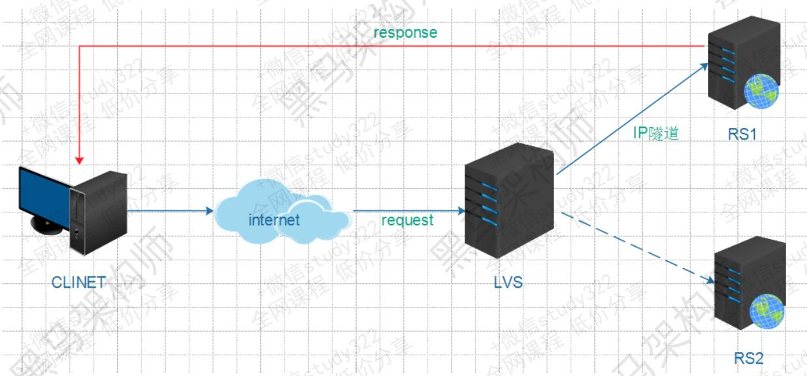
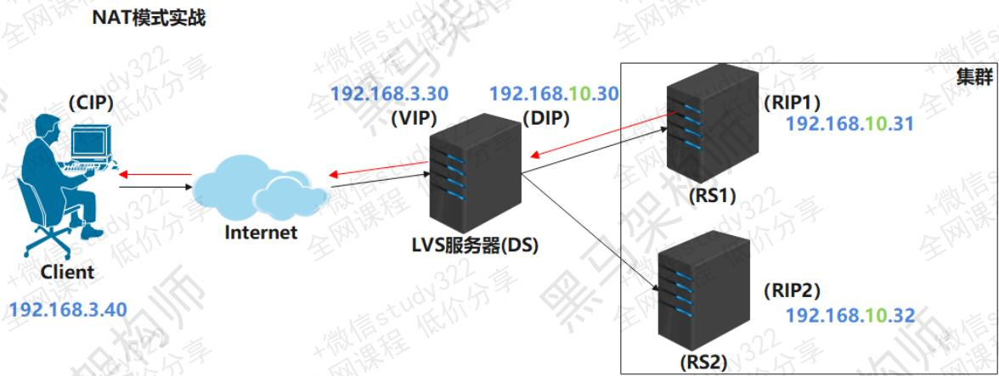
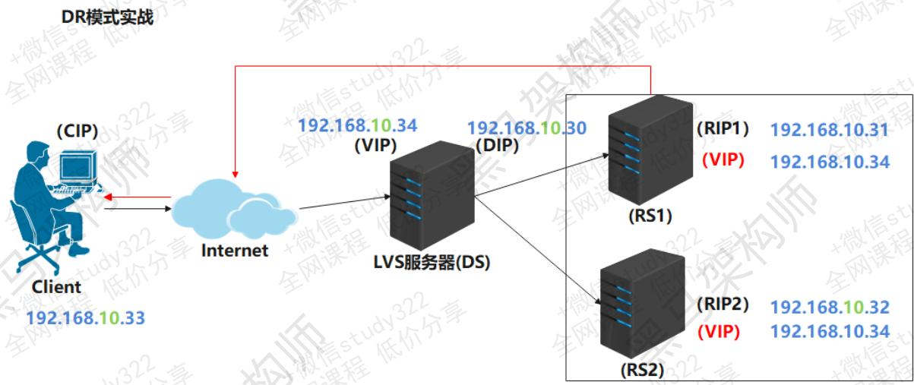
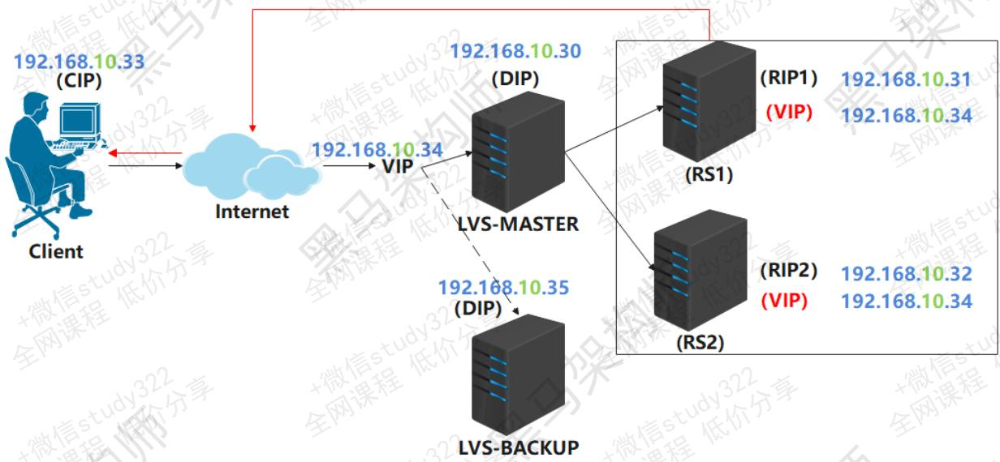

# LVS+KeepAlived高可用部署实战

# 1. 构建高可用集群

# 1.1 什么是高可用集群

高可用集群（High Availability Cluster，简称HA Cluster），是指以减少服务中断时间为目的的服务器集群技术。它通过保护用户的业务程序对外部不间断的提供服务，把因为软件，硬件，认为造成的故障对业务的影响降低到最小程度。总而言之就是保证公司业务7*24小时不宕机

# 1.2 高可用衡量标准

衡量集群的可用性(HA)高低，可以从MTTF（平均无故障时间）和MTTR（平均故障维修时间）进行考量，公式为： *H**A* = *M**T**T**F*/(*M**T**T**F* + *M**T**T**R*)*100% ，具体衡量标准可以参考下表

| 基本可用性       | 2个9 | 99%     | 年度宕机时间:87.6小时 |
| ---------------- | ---- | ------- | --------------------- |
| 较高可用性       | 3个9 | 99.9%   | 年度宕机时间:8.8小时  |
| 具有故障自动恢复 | 4个9 | 99.99%  | 年度宕机时间:53分钟   |
| 极高可用性       | 5个9 | 99.999% | 年度宕机时间:5分钟    |

# 1.3 高可用保障

对集群中的服务器进行负载均衡、健康监测，并在服务器出现故障时能进行故障转移，自动切换到正常服务器是高可用保障的必要手段。

# 1.3.1 负载均衡

常见的负载均衡手段如下：

硬件负载均衡，如F5

软件负载均衡，如nginx、haproxy、lvs

几种软件负载均衡技术比较

| 技术    | 优点                                                         | 缺点                                                         |
| ------- | ------------------------------------------------------------ | ------------------------------------------------------------ |
| nginx   | 可以针对http应用做一些分流的策略;对网络稳定性的依赖非常小安装和配置简单,测试方便能支撑几万的并发量可作为静态网页和图片服务器 | 仅支持http、https和Email协议只支持通过端口进行健康检测       |
| haproxy | 支持通过URL进行健康检测,单纯做负载均衡,效率高于nginx支持TCP的负载均衡,可以对mysql集群负载 | 不支持POP/SMTP协议不支持HTTP cache功能多进程模式支持不够好重载配置需要重启进程 |
| lvs     | 抗负载能力强,工作在网络4层,性能最好配置性比较低,工作稳定只分发请求,无流量产生,保证IO性能应用范围比较广 | 不支持正则表达式处理不能做动静分离大型网站实施复杂没有专门用于windows的版本 |

# 1.3.2 健康监测和自动切换

常见的健康监测和自动切换软件有keepAlived和heartBeat，其二者对比如下:

Keepalived使用更简单：从安装、配置、使用、维护等角度上对比，Keepalived都比Heartbeat要简单

Heartbeat功能更强大：Heartbeat虽然复杂，但功能更强大，配套工具更全，适合做大型集群管理，而Keepalived主要用于集群倒换，基本没有管理功能

# 1.4 高可用拓扑图



# 2. 软件负载均衡技术LVS

# 2.1 LVS简介

# 2.1.1 什么是lvs

LVS是Linux Virtual Server的简写，在1998年5月由章文嵩博士成立。

工作在OSI模型的四层，基于IP进行负载均衡。

在linux2.2内核时，IPVS就已经以内核补丁的形式出现。

从2.4版本以后，IPVS已经成为linux官方标准内核的一部分。

# 2.1.2 lvs官方资料链接

a. lvs项目介绍 http://www.linuxvirtualserver.org/zh/lvs1.html

b. lvs集群的体系结构 http://www.linuxvirtualserver.org/zh/lvs

c. lvs集群中的IP负载均衡技术 http://www.linuxvirtualserver.org/zh/lvs3.htm

d. lvs集群的负载调度 http://www.linuxvirtualserver.org/zh/lvs4.html

e. lvs中文站点 [http://zh.linuxvirtualserver.org](http://zh.linuxvirtualserver.org/)

# 2.2 lvs拓扑

# 2.2.1 lvs术语

LVS服务器(DS)

集群中节点服务器(RS)

虚拟IP地址（VIP），用于向客户端提供服务的IP地址（配置于负载均衡器上）

真实服务器的IP地址（RIP）， 集群中节点服务器的IP地址

负载均衡器IP地址（DIP），负载均衡器的IP地址，物理网卡上的IP

客户端主机IP地址（CIP），终端请求用户的主机IP地址

# 2.2.2 工作原理和拓扑图

LVS负载均衡调度技术是在linux内核中实现的，使用配置LVS时，不是直接配置内核中的IPVS，而是通过IPVS的管理工具IPVSADM来管理配置，LVS集群负载均衡器接受所有入站客户端的请求，并根据算法来决定由哪个集群的节点来处理请求。



# 2.3 lvs的三种工作模式

# 2.3.1 NAT模式

NAT(Network Address Translation)模式是基于NAT技术实现的。在此模式中，LVS服务器既要处理请求的接入，又要处理请求的响应。因此存在较大的性能瓶颈。



# 2.3.2 DR模式

DR(Direct Routing)模式是LVS的默认工作模式，也叫直接路由模式。只处理请求的接入，不处理请求的响应。因此性能高，瓶颈小。



# 2.3.3 TUN模式

TUN(Tunneling)模式需要服务器支持IP隧道（IP tunneling，是路由器把一种网络层协议封装到另一个协议中以跨过网络传送到另一个路由器的处理过程）技术，限制较大，一般不用。 udy32路



# 2.4 LVS调度算法

# 2.4.1 静态调度算法

| 调度算法 | 说明                    |
| -------- | ----------------------- |
| RR       | roundrobin轮询调度      |
| WRR      | Weighted RR加权轮询调度 |

大 获取


| 调度算法 | 说明                                |
| -------- | ----------------------------------- |
| SH       | Soure Hashing源地址哈希调度         |
| DH       | Destination Hashing目标地址哈希调度 |

# 2.4.2 动态调度算法

| 调度算法 | 说明                                               |
| -------- | -------------------------------------------------- |
| LC       | Least Connections最小连接数调度                    |
| WLC      | Weighted LC加权最小连接数调度 * (默认)             |
| SED      | Shortest Expection Delay初始连接高权重优先         |
| NQ       | Nerver Queue 第一轮平均分配,后续SED                |
| LBLC     | Locality-Based LC 动态的DH算法                     |
| LBLCR    | LBLC with Replication 带复制功能的LBLC             |
| FO       | Weighted Fail Over, linux内核4.15后新增的调度算法  |
| OVF      | Overflow-connection, linux内核4.15后新增的调度算法 |

# 2.5 lvs基本命令

安装： yum install ipvsadm

对于lvs的操作，主要是通过ipvsadm软件实现，常用的lvs操作命令如下:

# 2.5.1 集群服务管理

| 命令                                 | 说明                                                         |
| ------------------------------------ | ------------------------------------------------------------ |
| ipvsadm -A -t IP(VIP) -s调度算法(RR) | 此命令用来添加一个lvs策略,IP指VIP,调度算法是12种调度算法的一种 |
| ipvsadm -C                           | 此命令用来清除一个lvs策略                                    |
| ipvsadm -S                           | 此命令用来保存一个lvs策略                                    |
| ipvsadm -R                           | 此命令用来加载一个Ivs策略                                    |
| ipvsadm -L                           | 此命令用来查看策略                                           |

大 获取全

# 2.5.2 集群RS管理

| 命令                                         | 说明                                                  |
| -------------------------------------------- | ----------------------------------------------------- |
| ipvsadm -a -t IP1(VIP) -r IP2(RIP) -m \|g\|i | 添加一台RS,IP1指VIP,IP2指RIP,-m \|g\|i中m是NAT,g是DR, |
| ipvsadm -d -t IP1 -r IP2                     | 此命令用来删除一台RS,IP1指VIP,IP2指RIP                |

# 2.6 lvs实战

# 2.6.1 NAT模式实战

NAT实战拓扑图



# NAT模式实现

按照上面的拓扑图，进行NAT实战，步骤如下：

A. 准备4台linux虚拟机，并确定每台虚拟机的角色，为了方便区分，可以对每台虚拟机设置新的主机名，比如 LVS服务器可以设置主机名为lvs，设置方式如下

```
设置主机名
hostnamectl set-hostname lvs
断开远程连接
logout
重新连接即可看到主机名已经更改
```

然后对四台虚拟机分别进行配置如下:

# RS1和RS2配置

1. 配置网卡为NAT模式，RS1设置静态IP为192.168.10.31，RS2设置静态IP为192.168.10.3 2。

1. 下载安装httpd服务，命令如下

```
yum install -y httpd 
```

1. 设置首页内容(RS2把内容改为this is RS2)

```
echo this is RS01 > /var/www/html/index.html 
```

1. 启动httpd

```
systemctl start httpd 
```

1. 在RS1和RS2上测试访问，能输出 this is RS01或this is RS02即为成功

```
[root@rs01 ~]# curl localhost this is RS01 
```

1. RS1和RS2指定网关为 192.168.10.30 ，子网掩码255.255.255.0

1. 查看网关是否生效

```
[root@linux31 network-scripts]# route -n
-bash: route: 未找到命令
[root@linux31 network-scripts]# yum install net-tools
[root@linux31 network-scripts]# systemctl restart network
[root@linux31 network-scripts]# route -n
Kernel IP routing table
Destination Gateway Genmask Flags Metric
Ref Use Iface
0.0.0.0 192.168.10.30 0.0.0.0 UG 100
0 0 ens33
192.168.10.0 0.0.0.0 255.255.255.0 U 100
0 0 ens33
[root@linux31 network-scripts]#
```

# LVS服务器配置

1. 安装ipvsadm

```
yum install -y ipvsadm 
```

1. 设置双网卡

仅主机网卡一块，IP配置为192.168.3.30，此IP是接受外部请求的VIP

NAT网卡一块，IP配置为192.168.10.30，此IP是与后端RS服务器通信的DIP

1. 配置ip_forward转发

```
vi /etc/sysctl.conf
#添加如下内容并保存退出
net.ipv4.ip_forward = 1
#执行如下命令使修改生效
sysctl -p
```

1. 使用ipvsadm进行负载均衡配置

\#指定负载80端口的VIP，并指定调度策略为轮询

```
[root@linux30 ~]# ipvsadm -A -t 192.168.3.30:80 -s rr 
```

\#添加两台RS，并指定负载均衡工作模式为NAT

```
[root@linux30 ~]# ipvsadm -a -t 192.168.3.30:80 -r
192.168.10.31 -m
[root@linux30 ~]# ipvsadm -a -t 192.168.3.30:80 -r
192.168.10.32 -m
#查看上述配置是否生效
[root@linux30 ~]# ipvsadm -Ln
IP Virtual Server version 1.2.1 (size=4096)
Prot LocalAddress:Port Scheduler Flags
-> RemoteAddress:Port Forward Weight ActiveConn
InActConn
TCP 192.168.10.30:80 rr
-> 192.168.10.31:80 Masq 1 0 0
-> 192.168.10.32:80 Masq 1 0 0
[root@linux30 ~]#
```

# client虚拟机配置和测试

配置网卡为仅主机模式，IP为192.168.3.31，网关无需配置即可。

在client上测试负载均衡效果，如下:

```
[root@localhost ~]# curl 192.168.3.30
this is RS02
[root@localhost ~]# curl 192.168.3.30
this is RS01
[root@localhost ~]# curl 192.168.3.30
this is RS02
[root@localhost ~]# curl 192.168.3.30
this is RS01 
```

NAT模式存在的问题-->LVS性能瓶颈

# 2.6.2 DR模式实战

小贴士: ARP（Address Resolution Protocol）地址解析协议，是根据IP地址获取物理地址（MAC）的一个TCP/IP协议。主机发送信息时将包含目标IP地址的ARP请求广播到局域网络上的所有主机，并接收返回消息，以此确定目标的物理地址；收到返回消息后将该IP地址和物理地址存入本机ARP缓存中并保留一定时间，下次请求时直接查询ARP缓存以节约资源。

DR模式拓扑图



# DR模式实现

通过对比NAT模式和DR模式的拓扑图可以发现，需要让LVS和RS在同一个网段，并且在两个RS服务器上也需要绑定VIP。所以DR模式实验可以在刚才的基础上进行，步骤如下:

1. 在RS1和RS2上进行如下ARP抑制操作，并配置VIP到lo网卡上，如下:

```
#1: arp抑制.rs1.rs2上都配置
#arp_ignore: default 0
echo 1 > /proc/sys/net/ipv4/conf/ens33/arp_ignore
echo 1 > /proc/sys/net/ipv4/conf/all/arp_ignore
#arp_announce: default 0
echo 2 > /proc/sys/net/ipv4/conf/all/arp_announce
echo 2 > /proc/sys/net/ipv4/conf/ens33/arp_announce
#2:rs1,rs2都去掉网关配置！！！然后重启:systemctl restart network
#3:rs1,rs2均配置VIP到lo网卡 这里的子网掩码需要4个255
[root@linux31 network-scripts]# ifconfig lo:9 192.168.10.34
netmask 255.255.255.255
[root@linux31 network-scripts]# ifconfig
ens33: flags=4163<UP,BROADCAST,RUNNING,MULTICAST> mtu 1500
inet 192.168.10.31 netmask 255.255.255.0 broadcast
192.168.10.255
inet6 fe80::3b38:154b:fc3d:6269 prefixlen 64
scopeid 0x20<link>
ether 00:50:56:2e:d2:bc txqueuelen 1000 (Ethernet)
RX packets 4124 bytes 4025075 (3.8 MiB)
RX errors 0 dropped 0 overruns 0 frame 0
TX packets 2066 bytes 181284 (177.0 KiB)
TX errors 0 dropped 0 overruns 0 carrier 0
collisions 0

lo: flags=73<UP,LOOPBACK,RUNNING> mtu 65536
inet 127.0.0.1 netmask 255.0.0.0
inet6 ::1 prefixlen 128 scopeid 0x10<host>
loop txqueuelen 1000 (Local Loopback)
RX packets 10 bytes 1062 (1.0 KiB)
RX errors 0 dropped 0 overruns 0 frame 0
TX packets 10 bytes 1062 (1.0 KiB)
TX errors 0 dropped 0 overruns 0 carrier 0
collisions 0

lo:9: flags=73<UP,LOOPBACK,RUNNING> mtu 65536
inet 192.168.10.34 netmask 255.255.255.255
loop txqueuelen 1000 (Local Loopback) 
```

注意：RS1和RS2在之前进行NAT模式实验时设置了网关为LVS的DIP，这里进行DR试验时需要把网关删除

1. 在LVS服务器上关闭之前的ens37网卡(注意：你的网卡名称可能不是这个) 全网课之前

```
ifdown ens37
ifconfig ens37 down 
```

1. 在 lvs 的ens33网卡上绑定VIP：192.168.10.34

```
[root@linux30 ~]# ifconfig ens33:9 192.168.10.34/24
[root@linux30 ~]# ifconfig
ens33: flags=4163<UP,BROADCAST,RUNNING,MULTICAST> mtu 1500
inet 192.168.10.30 netmask 255.255.255.0 broadcast
192.168.10.255
inet6 fe80::db30:9838:de0e:8127 prefixlen 64
scopeid 0x20<link> 
inet6 fe80::6d7c:9692:c7a8:6320 prefixlen 64
scopeid 0x20<link>
inet6 fe80::3b38:154b:fc3d:6269 prefixlen 64
scopeid 0x20<link>
ether 00:50:56:2d:6c:7f txqueuelen 1000 (Ethernet)
RX packets 1246 bytes 543590 (530.8 KiB)
RX errors 0 dropped 0 overruns 0 frame 0
TX packets 711 bytes 76124 (74.3 KiB)
TX errors 0 dropped 0 overruns 0 carrier 0
collisions 0

ens33:9: flags=4163<UP,BROADCAST,RUNNING,MULTICAST> mtu 1500
inet 192.168.10.34 netmask 255.255.255.0 broadcast
192.168.10.255
ether 00:50:56:2d:6c:7f txqueuelen 1000 (Ethernet)

lo: flags=73<UP,LOOPBACK,RUNNING> mtu 65536
inet 127.0.0.1 netmask 255.0.0.0
inet6 ::1 prefixlen 128 scopeid 0x10<host>
loop txqueuelen 1000 (Local Loopback)
RX packets 0 bytes 0 (0.0 B)
RX errors 0 dropped 0 overruns 0 frame 0
TX packets 0 bytes 0 (0.0 B)
TX errors 0 dropped 0 overruns 0 carrier 0
collisions 0 
```

1. 在lvs服务器上清空LVS策略，并重新设置DR模式策略

\#查看策略

```
[root@linux30 ~]# ipvsadm -Ln
IP Virtual Server version 1.2.1 (size=4096)
Prot LocalAddress:Port Scheduler Flags
-> RemoteAddress:Port Forward Weight ActiveConn
InActConn
TCP 192.168.3.30:80 rr
-> 192.168.10.31:80 Masq 1 0 0
-> 192.168.10.32:80 Masq 1 0 0 
```

\#清空策略

```
[root@linux30 ~]# ipvsadm -C 
```

\#再次查看策略

```
[root@linux30 ~]# ipvsadm -Ln
IP Virtual Server version 1.2.1 (size=4096)
Prot LocalAddress:Port Scheduler Flags
-> RemoteAddress:Port Forward Weight ActiveConn
InActConn 
```

# 设置DR策略

\#设置规则

```
[root@linux30 ~]# ipvsadm -A -t 192.168.10.34:80 -s rr
#添加RS
[root@linux30 ~]# ipvsadm -a -t 192.168.10.34:80 -r
192.168.10.31 -g
[root@linux30 ~]# ipvsadm -a -t 192.168.10.34:80 -r
192.168.10.32 -g
#查看策略
[root@linux30 ~]# ipvsadm -Ln
IP Virtual Server version 1.2.1 (size=4096)
Prot LocalAddress:Port Scheduler Flags
-> RemoteAddress:Port Forward Weight ActiveConn
InActConn
TCP 192.168.10.34:80 rr
-> 192.168.10.31:80 Route 1 0 0
-> 192.168.10.32:80 Route 1 0 0
```

1. 修改client服务器配置，更改使用NAT网卡，并设置IP为192.168.10.33

1. 在client测试效果

```
[root@client ~]# curl 192.168.10.34
this is RS02
[root@client ~]# curl 192.168.10.34
this is RS01
[root@client ~]# curl 192.168.10.34
this is RS02
[root@client ~]# curl 192.168.10.34
this is RS01 
```

1. 在LVS服务器上查看调度情况

```
[root@lvs01 ~]# ipvsadm -Lnc
IPVS connection entries
pro expire state source virtual
destination
TCP 01:30 FIN_WAIT 192.168.116.133:45810
192.168.116.134:80 192.168.116.131:80
TCP 01:31 FIN_WAIT 192.168.116.133:45812
192.168.116.134:80 192.168.116.132:80
TCP 01:32 FIN_WAIT 192.168.116.133:45814
192.168.116.134:80 192.168.116.131:80
TCP 01:30 FIN_WAIT 192.168.116.133:45808
192.168.116.134:80 192.168.116.132:80 
```

# 2.6.3 四个问题

a. 如果后端某台RS服务器挂了会出现什么问题？

b.如果LVS服务器挂了会出现什么问题?

c. 如何获知RS服务器状态?

d. 如何进行故障转移、自动切换?

# 3. KeepAlived

# 3.1 keepAlived简介

Keepalived的作用是检测服务器状态，如果有一台web服务器宕机，或工作出现故障，Keepalived将检测到，并将有故障的服务器从系统中剔除，同时使用其他服务器代替该服务器的工作，当服务器工作正常后Keepalived自动将服务器加入到服务器群中。

# 3.2 keepAlived主要特点

# 3.2.1 健康检查

| 检查方式   | 说明                                                         |
| ---------- | ------------------------------------------------------------ |
| tcp_check  | 工作在第4层,keepalived向后端服务器发起一个tcp连接请求,如果后端服务器没有响应或超时,那么这个后端将从服务器池中移除 |
| http_get   | 工作在第5层,向指定的URL执行http请求,将得到的结果用md5加密并与指定的md5值比较看是否匹配,不匹配则从服务器池中移除;此外还可以指定http返回码来判断检测是否成功。HTTP_GET可以指定多个URL用于检测,这个一台服务器有多个虚拟主机的情况下比较好用。 |
| misc_check | 用脚本来检测,脚本如果带有参数,需将脚本和参数放入双引号内     |
| ssl_get    | 和http_get相似,不同的只是用SSL连接                           |
| smtp_check | 主要用于邮件系统SMTP协议的检测                               |

# 3.2.2 故障迁移

# VRRP协议

在现实的网络环境中。主机之间的通信都是通过配置静态路由或者(默认网关)来完成的，而主机之间的路由器一旦发生故障，通信就会失效，因此这种通信模式当中，路由器就成了一个单点瓶颈，为了解决这个问题，就引入了VRRP协议。

VRRP协议是一种容错的主备模式的协议，保证当主机的下一跳路由出现故障时，由另一台路由器来代替出现故障的路由器进行工作，通过VRRP可以在网络发生故障时透明的进行设备切换而不影响主机之间的数据通信。

# 故障迁移原理

在 Keepalived 服务正常工作时，主 Master 节点会不断地向备节点发送（多播的方式）心跳消息，用以告诉备 Backup 节点自己还活着，当主 Master节点发生故障时，就无法发送心跳消息，备节点也就因此无法继续检测到来自主 Master 节点的心跳了，于是调用自身的接管程序，接管主 Master 节点的 IP资源及服务。而当主 Master 节点恢复时，备 Backup 节点又会释放主节点故障时自身接管的 IP 资源及服务，恢复到原来的备用角色。 程码


# 3.3 keepAlived原理

Keepalived工作在TCP/IP参考模型的三层、四层、五层，其原理如下：

| 工作层 | 说明                                                         |
| ------ | ------------------------------------------------------------ |
| 网络层 | Keepalived通过ICMP协议向服务器集群中的每一个节点发送一个ICMP数据包(有点类似于Ping的功能),如果某个节点没有返回响应数据包,那么认为该节点发生了故障,Keepalived将报告这个节点失效,并从服务器集群中剔除故障节点。 |
| 传输层 | Keepalived在传输层里利用了TCP协议的端口连接和扫描技术来判断集群节点的端口是否正常。比如对于常见的WEB服务器80端口。或者SSH服务22端口,Keepalived一旦在传输层探测到这些端口号没有数据响应和数据返回,就认为这些端口发生异常,然后强制将这些端口所对应的节点从服务器集群中剔除掉。 |
| 应用层 | Keepalived的运行方式更加全面化和复杂化,用户可以通过自定义Keepalived工作方式。例如:可以通过编写程序或者脚本来运行Keepalived,而Keepalived将根据用户的设定参数检测各种程序或者服务是否正常,如果Keepalived的检测结果和用户设定的不一致时,Keepalived将把对应的服务器从服务器集群中剔除。 |

# 3.4 分布式选主策略

# 3.4.1 仅设置priority

在一个一主多备的Keepalived集群中，priority值最大的将成为集群中的MASTER节点，而其他都是BACKUP节点。在MASTER节点发生故障后，BACKUP节点之间将进行“民主选举”，通过对节点优先级值priority和weight的计算，选出新的MASTER节点接管集群服务。

# 3.4.2 设置priority和weight

# weight值为正数时

在vrrp_script中指定的脚本如果检测成功，那么MASTER节点的权值将是weight值与priority值之和；如果脚本检测失效，那么MASTER节点的权值保持为priority值

MASTER 节点vrrp_script脚本检测失败时，如果MASTER节点priority值小于BACKUP节点weight值与priority值之和，将发生主、备切换。

MASTER节点vrrp_script脚本检测成功时，如果MASTER节点weight值与priority值之和大于BACKUP节点weight值与priority值之和，主节点依然为主节点，不发生切换。

# weight值为负数时

在vrrp_script中指定的脚本如果检测成功，那么MASTER节点的权值仍为priority值，当脚本检测失败时，MASTER节点的权值将是priority值与weight值之和（ex: 1 + -2）= -1

MASTER节点vrrp_script脚本检测失败时，如果MASTER节点priority值与weight值之和小于BACKUP节点priority值，将发生主、备切换。

MASTER节点vrrp_scrip脚本检测成功时，如果MASTER节点priority值大于BACKUP节点priority值时，主节点依然为主节点，不发生切换。

# weight设置标准

对于weight值的设置，有一个简单的标准，即weight值的绝对值要大于MASTER和BACKUP节点priority值之差。由此可见，对于weight值的设置要非常谨慎，如果设置不好，主节点发生故障时将导致集群角色选举失败，使集群陷于瘫痪状态。

# 4. LVS+keepAlived实战

# 4.1 实战拓扑



为了测试lvs的高可用，这里需要增加一台lvs服务器，需在此服务器上安装ipvsadm。

# 4.2 keepAlived安装和配置

# 4.2.1 安装keepAlived

在两台lvs服务器上都需要安装keepAlived，安装命令如下:

```
yum install -y keepalived 
```

keepAlived安装完成后，在 /etc/keepalived 目录下有一个keepalived.conf配置文件，内容如下:

```
! Configuration File for keepalived
global_defs {
    notification_email {
    acassen@firewall.loc
    failover@firewall.loc
    sysadmin@firewall.loc
    }
    notification_email_from Alexandre.Cassen@firewall.loc
smtp_server 192.168.200.1
smtp_connect_timeout 30
router_id LVS_DEVEL
vrrp_skip_check_adv_addr
vrrp_strict 
vrrp_garp_interval 0
vrrp_gna_interval 0
}

#上面的配置无需关注，重点关注和修改下面的配置
vrrp_instance VI_1 {
    state MASTER#标识当前lvs是主，根据实际lvs服务器规划确定，可选值MASTER和BACKUP
    interface eth0#lvs服务器提供服务器的网卡，根据实际服务器网卡进行修改
    virtual_router_id 51#lvs提供的服务所属ID，目前无需修改
    priority 100#lvs服务器的优先级，主服务器最高，备份服务器要低于主服务器
    advert_int 1
    authentication {
    auth_type PASS
    auth_pass 1111
    }
    #virtual_ipaddress用于配置VIP和LVS服务器的网卡绑定关系，一般需要修改
    #示例：192.168.10.34/24 dev ens33 label ens33:9
    virtual_ipaddress {
    192.168.200.16
    192.168.200.17
    192.168.200.18
    }
}

#配置lvs服务策略，相当于ipvsadm -A -t 192.168.10.34:80 -s rr，一般需要修改
virtual_server 192.168.200.100 443 {
    delay_loop 6
    lb_algo rr#配置lvs调度算法，默认轮询
    lb_kind NAT#配置lvs工作模式，可以改为DR
    persistence_timeout 50#用于指定同一个client在多久内，只去请求第一次提供服务的RS，为查看轮询效果，这里需要改为0
    protocol TCP#TCP协议
    #配置RS信息，相当于ipvsadm -a -t 192.168.10.34:80 -r 192.168.10.31 -g
    real_server 192.168.201.100 443 {
    weight 1#当前RS的权重
    SSL_GET {#SSL_GET健康检查，一般改为HTTP_GET
```

扫码获取课程大全

```
#两个url可以删除一个，url内的内容改为path /和
status_code 200, digest删除
    url {
    path /
    digest ff20ad2481f97b1754ef3e12ecd3a9cc
    }
    url {
    path /mrtg/
    digest 9b3a0c85a887a256d6939da88aabd8cd
    }
    connect_timeout 3
    nb_get_retry 3
    delay_before_retry 3
    }
    }
}
```

\#下面的配置实际是两组lvs服务的配置，含义和上面的lvs服务配置一致。如果用不到，下面的配置可以全部删除

```
virtual_server 10.10.10.2 1358 {
    delay_loop 6
    lb_algo rr
    lb_kind NAT
    persistence_timeout 50
    protocol TCP

sorry_server 192.168.200.200 1358

real_server 192.168.200.2 1358 {
    weight 1
    HTTP_GET {
    url {
    path /testurl/test.jsp
    digest 640205b7b0fc66c1ea91c463fac6334d
    }
    url {
    path /testurl2/test.jsp
    digest 640205b7b0fc66c1ea91c463fac6334d
    }
    url {
    path /testurl3/test.jsp
    digest 640205b7b0fc66c1ea91c463fac6334d
    }
} 
connect_timeout 3
nb_get_retry 3
delay_before_retry 3
}
}
real_server 192.168.200.3 1358 {
    weight 1
    HTTP_GET {
    url {
    path /testurl/test.jsp
    digest 640205b7b0fc66c1ea91c463fac6334c
    }
    url {
    path /testurl2/test.jsp
    digest 640205b7b0fc66c1ea91c463fac6334c
    }
    connect_timeout 3
    nb_get_retry 3
    delay_before_retry 3
    }
    }
}

virtual_server 10.10.10.3 1358 {
    delay_loop 3
    lb_algo rr
    lb_kind NAT
    persistence_timeout 50
    protocol TCP

    real_server 192.168.200.4 1358 {
    weight 1
    HTTP_GET {
    url {
    path /testurl/test.jsp
    digest 640205b7b0fc66c1ea91c463fac6334d
    }
    url {
    path /testurl2/test.jsp
    digest 640205b7b0fc66c1ea91c463fac6334d
    } 
```

扫码获取课程大全

```
url {
    path /testurl3/test.jsp
    digest 640205b7b0fc66c1ea91c463fac6334d
}
connect_timeout 3
nb_get_retry 3
delay_before_retry 3
}
}

real_server 192.168.200.5 1358 {
weight 1
HTTP_GET {
url {
    path /testurl/test.jsp
    digest 640205b7b0fc66c1ea91c463fac6334d
}
url {
    path /testurl2/test.jsp
    digest 640205b7b0fc66c1ea91c463fac6334d
}
url {
    path /testurl3/test.jsp
    digest 640205b7b0fc66c1ea91c463fac6334d
}
connect_timeout 3
nb_get_retry 3
delay_before_retry 3
}
} 
```

# 4.2.2 配置keepAlived

基于上述配置文件和实战拓扑图及服务器规划，对两台lvs服务器分别修改keepalived.conf配置如下:

# lvs主服务器

! Configuration File for keepalived

```
global_defs {
    notification_email {
    acassen@firewall.loc
    failover@firewall.loc
    sysadmin@firewall.loc
    }
    notification_email_from Alexandre.Cassen@firewall.loc
    smtp_server 192.168.200.1
    smtp_connect_timeout 30
    router_id LVS_DEVEL
    vrrp_skip_check_adv_addr
    #vrrp_strict
    vrrp_garp_interval 0
    vrrp_gna_interval 0
}

vrrp_instance VI_1 {
    state MASTER
    interface ens33
    virtual_router_id 51
    priority 100
    advert_int 1
    authentication {
    auth_type PASS
    auth_pass 1111
    }
    virtual_ipaddress {
    192.168.10.34/24 dev ens33 label ens33:9
    }
}

virtual_server 192.168.10.34 80 {
    delay_loop 6
    lb_algo rr
    lb_kind DR
    persistence_timeout 0
    protocol TCP

    real_server 192.168.10.31 80 {
    weight 1
    HTTP_GET {
    url { 
```

扫码获取课程大全

```
path /
status 200
}
connect_timeout 3
nb_get_retry 3
delay_before_retry 3
}
}
real_server 192.168.10.32 80 {
weight 1
HTTP_GET {
url {
    path /
    status 200
}
connect_timeout 3
nb_get_retry 3
delay_before_retry 3
}
} 
```

# lvs备份服务器

```
! Configuration File for keepalived
global_defs {
    notification_email {
    acassen@firewall.loc
    failover@firewall.loc
    sysadmin@firewall.loc
    }
    notification_email_from Alexandre.Cassen@firewall.loc
    smtp_server 192.168.200.1
    smtp_connect_timeout 30
    router_id LVS_DEVEL
    vrrp_skip_check_adv_addr
    #vrrp_strict
    vrrp_garp_interval 0
    vrrp_gna_interval 0
} 
```

扫码获取课程大全

```
vrrp_instance VI_1 {
    state BACKUP
    interface ens33
    virtual_router_id 51
    priority 80
    advert_int 1
    authentication {
    auth_type PASS
    auth_pass 1111
    }
    virtual_ipaddress {
    192.168.10.34/24 dev ens33 label ens33:9
    }
} 
virtual_server 192.168.10.34 80 {
    delay_loop 6
    lb_algo rr
    lb_kind DR
    persistence_timeout 0
    protocol TCP

    real_server 192.168.10.31 80 {
    weight 1
    HTTP_GET {
    url {
    path /
    status 200
    }
    connect_timeout 3
    nb_get_retry 3
    delay_before_retry 3
    }
    }
    real_server 192.168.10.32 80 {
    weight 1
    HTTP_GET {
    url {
    path /
    status 200
    }
} 
```

扫码获取课程大全

```
connect_timeout 3
nb_get_retry 3
delay_before_retry 3
}
}
} 
```

注意：配置文件中的key和大括号之间一定要有空格

# 4.2.3 启动keepAlived

在两台lvs服务器上分别启动keepAlived，命令如下:

```
service keepalived start 
```

# 4.3 高可用测试

# 4.3.1 测试环境检查

上述步骤执行完毕后，可以在lvs主服务器和备份服务器分别执行ifconfig命令，可以查看到VIP被绑定到了主服务器，如下:

```
[root@lvs01 ~]# ifconfig
ens33: flags=4163<UP,BROADCAST,RUNNING,MULTICAST> mtu 1500
inet 192.168.10.30 netmask 255.255.255.0 broadcast
192.168.10.255
inet6 fe80::db30:9838:de0e:8127 prefixlen 64
scopeid 0x20<link>
inet6 fe80::6d7c:9692:c7a8:6320 prefixlen 64
scopeid 0x20<link>
inet6 fe80::3b38:154b:fc3d:6269 prefixlen 64
scopeid 0x20<link>
ether 00:50:56:2d:6c:7f txqueuelen 1000 (Ethernet)
RX packets 11864 bytes 14964468 (14.2 MiB)
RX errors 0 dropped 0 overruns 0 frame 0
TX packets 6054 bytes 449187 (438.6 KiB)
TX errors 0 dropped 0 overruns 0 carrier 0
collisions 0

ens33:9: flags=4163<UP,BROADCAST,RUNNING,MULTICAST> mtu 1500
inet 192.168.10.34 netmask 255.255.255.0 broadcast
0.0.0.0 
ether 00:50:56:2d:6c:7f txqueuelen 1000 (Ethernet)
lo: flags=73<UP,LOOPBACK,RUNNING> mtu 65536
inet 127.0.0.1 netmask 255.0.0.0
inet6 ::1 prefixlen 128 scopeid 0x10<host>
loop txqueuelen 1000 (Local Loopback)
RX packets 0 bytes 0 (0.0 B)
RX errors 0 dropped 0 overruns 0 frame 0
TX packets 0 bytes 0 (0.0 B)
TX errors 0 dropped 0 overruns 0 carrier 0
collisions 0 
```

这样，就可以在客户端请求VIP192.168.10.34来进行测试。

# 4.3.2 测试负载均衡

在客户端发起请求，测试负载均衡，如下:

```
[root@client ~]# curl 192.168.10.34
this is RS01
[root@client ~]# curl 192.168.10.34
this is RS02
[root@client ~]# curl 192.168.10.34
this is RS01
[root@client ~]# curl 192.168.10.34
this is RS02 
```

# 4.3.3 测试RS高可用

关闭一台RS后(这里可以使用ifconfig 网卡名 down命令暂时关闭网卡)，客户端继续发起请求，查看是否可以正常访问，如下:

```
[root@client ~]# curl 192.168.10.34
this is RS02
[root@client ~]# curl 192.168.10.34
this is RS02
[root@client ~]# curl 192.168.10.34
this is RS02
[root@client ~]# curl 192.168.10.34
this is RS02 
```

会发现，此时客户端可以正常访问，但只有RS2在提供服务。这说明，keepAlived检测到了RS1服务器异常，将其剔除了。

此时再启动RS1服务器，客户端继续访问，会发现响应结果如下，keepAlived检测到RS1服务器恢复正常，又将其加入服务列表了。

```
[root@client ~]# curl 192.168.10.34
this is RS02
[root@client ~]# curl 192.168.10.34
this is RS01
[root@client ~]# curl 192.168.10.34
this is RS02
[root@client ~]# curl 192.168.10.34
this is RS01 
```

# 4.3.4 测试LVS高可用

这里主要进行两个测试：

# 测试lvs主服务宕机

使用ifconfig 网卡名 down命令，关闭主服务器网卡，此时主服务器不能提供服务。观察备份服务器是否将VIP绑定到自己，以及客户端是否可以继续正常访问。如下：

关闭主服务器网卡

```
[root@lvs01 keepalived]# ifconfig ens33 down 
```

观察备份服务器，会发现VIP已经绑定过来了。这里实际是keepAlived检测到了主服务器的异常，而做出的故障转移和自动切换。 课扫

```
[root@lvs02 ~]# ifconfig

ens33: flags=4163<UP,BROADCAST,RUNNING,MULTICAST> mtu 1500
inet 192.168.10.35 netmask 255.255.255.0 broadcast
192.168.10.255
inet6 fe80::db30:9838:de0e:8127 prefixlen 64
scopeid 0x20<link>
inet6 fe80::6d7c:9692:c7a8:6320 prefixlen 64
scopeid 0x20<link>
inet6 fe80::3b38:154b:fc3d:6269 prefixlen 64
scopeid 0x20<link>
ether 00:50:56:2e:ba:c0 txqueuelen 1000 (Ethernet)
RX packets 24929 bytes 33887638 (32.3 MiB)
RX errors 0 dropped 0 overruns 0 frame 0
TX packets 8458 bytes 590453 (576.6 KiB)
TX errors 0 dropped 0 overruns 0 carrier 0
collisions 0

ens33:9: flags=4163<UP,BROADCAST,RUNNING,MULTICAST> mtu 1500
inet 192.168.10.34 netmask 255.255.255.0 broadcast
0.0.0.0
ether 00:50:56:2e:ba:c0 txqueuelen 1000 (Ethernet)

lo: flags=73<UP,LOOPBACK,RUNNING> mtu 65536
inet 127.0.0.1 netmask 255.0.0.0
inet6 ::1 prefixlen 128 scopeid 0x10<host>
loop txqueuelen 1000 (Local Loopback)
RX packets 16 bytes 1392 (1.3 KiB)
RX errors 0 dropped 0 overruns 0 frame 0
TX packets 16 bytes 1392 (1.3 KiB)
TX errors 0 dropped 0 overruns 0 carrier 0
collisions 0 
```

观察客户端是否可以继续正常访问

扫码获取课程大全

```
[root@client ~]# curl 192.168.10.34
this is RS02
[root@client ~]# curl 192.168.10.34
this is RS01
[root@client ~]# curl 192.168.10.34
this is RS02
[root@client ~]# curl 192.168.10.34
this is RS01 
```

# 测试lvs主服务器恢复

上述测试通过后，可以开启主服务器网卡，让其能够提供服务，然后观察VIP是否会回到主服务器

开启主服务器网卡

```
ifconfig ens33 up 
```

# 查看主服务器和备份服务器

# 主服务器

```
[root@lvs01 ~]# ifconfig
ens33: flags=4163<UP,BROADCAST,RUNNING,MULTICAST> mtu 1500
inet 192.168.10.30 netmask 255.255.255.0 broadcast
192.168.10.255
inet6 fe80::db30:9838:de0e:8127 prefixlen 64
scopeid 0x20<link>
inet6 fe80::6d7c:9692:c7a8:6320 prefixlen 64
scopeid 0x20<link>
inet6 fe80::3b38:154b:fc3d:6269 prefixlen 64
scopeid 0x20<link>
ether 00:50:56:2d:6c:7f txqueuelen 1000 (Ethernet)
RX packets 12942 bytes 15089760 (14.3 MiB)
RX errors 0 dropped 0 overruns 0 frame 0
TX packets 7888 bytes 585418 (571.6 KiB)
TX errors 0 dropped 0 overruns 0 carrier 0
collisions 0 
ens33:9: flags=4163<UP,BROADCAST,RUNNING,MULTICAST> mtu 
inet 192.168.10.34 netmask 255.255.255.0 broadcast 0.0.0.0
ether 00:50:56:2d:6c:7f txqueuelen 1000 (Ethernet)
lo: flags=73<UP,LOOPBACK,RUNNING> mtu 65536
inet 127.0.0.1 netmask 255.0.0.0
inet6 ::1 prefixlen 128 scopeid 0x10<host>
loop txqueuelen 1000 (Local Loopback)
RX packets 7 bytes 616 (616.0 B)
RX errors 0 dropped 0 overruns 0 frame 0
TX packets 7 bytes 616 (616.0 B)
TX errors 0 dropped 0 overruns 0 carrier 0 collisions 0 
```

# 备份服务器

```
[root@lvs02 ~]# ifconfig

ens33: flags=4163<UP,BROADCAST,RUNNING,MULTICAST> mtu 1500
inet 192.168.10.35 netmask 255.255.255.0 broadcast
192.168.10.255
inet6 fe80::db30:9838:de0e:8127 prefixlen 64
scopeid 0x20<link>
inet6 fe80::6d7c:9692:c7a8:6320 prefixlen 64
scopeid 0x20<link>
inet6 fe80::3b38:154b:fc3d:6269 prefixlen 64
scopeid 0x20<link>
ether 00:50:56:2e:ba:c0 txqueuelen 1000 (Ethernet)
RX packets 25287 bytes 33927783 (32.3 MiB)
RX errors 0 dropped 0 overruns 0 frame 0
TX packets 8906 bytes 624556 (609.9 KiB)
TX errors 0 dropped 0 overruns 0 carrier 0
collisions 0 
lo: flags=73<UP,LOOPBACK,RUNNING> mtu 65536
inet 127.0.0.1 netmask 255.0.0.0
inet6 ::1 prefixlen 128 scopeid 0x10<host>
loop txqueuelen 1000 (Local Loopback)
RX packets 16 bytes 1392 (1.3 KiB)
RX errors 0 dropped 0 overruns 0 frame 0
TX packets 16 bytes 1392 (1.3 KiB) 
```

扫码获取课程大全

TX errors 0 dropped 0 overruns 0 carrier 0 collisions 0

会发现，VIP重新绑定到了主服务器。