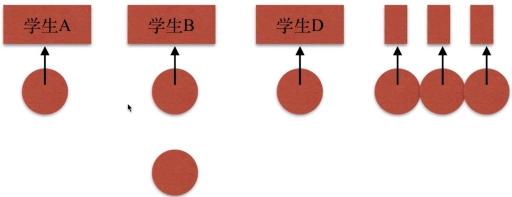
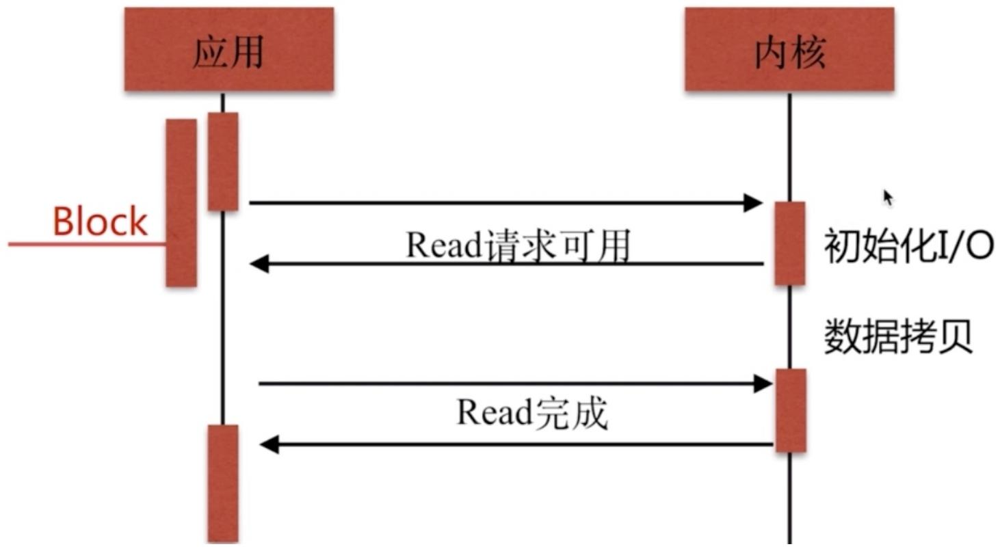
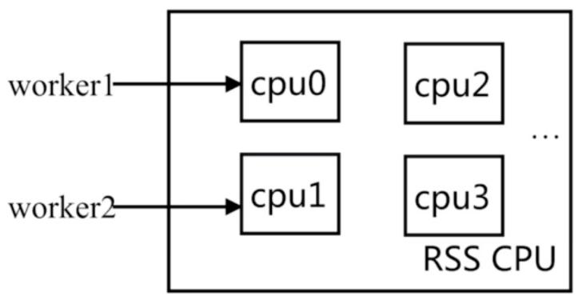
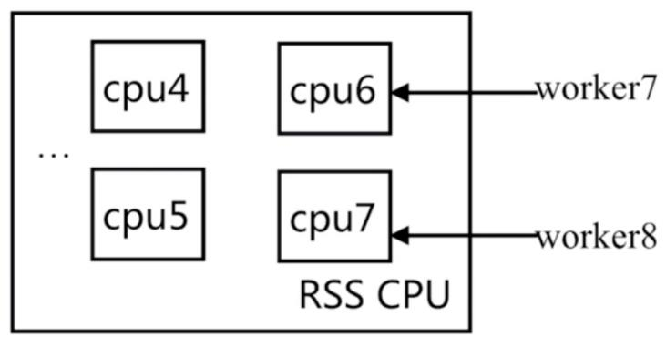
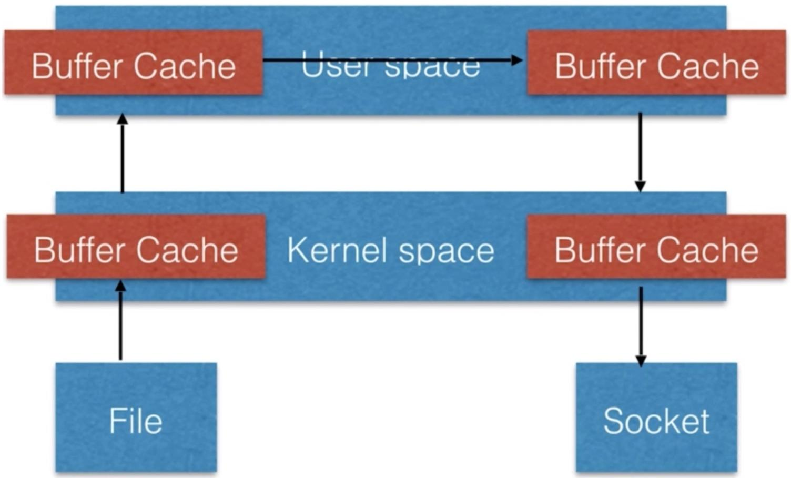
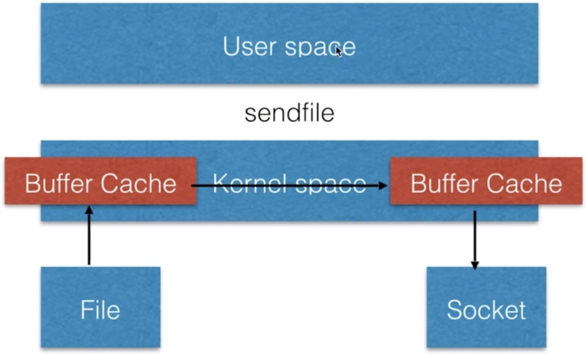

# 01.Nginx应⽤指南

# 01.Nginx应⽤指南

Nginx基本简述

Nginx优秀特性

Nginx快速安装

Nginx安装⽬录

Nginx编译参数

Nginx常⽤模块

Nginx内置变量

Nginx编译安装

徐亮伟, 江湖⼈称标杆徐。多年互联⽹运维⼯作经验，曾负责过⼤规模集群架构⾃动化运维管理⼯作。擅⻓Web集群架构与⾃动化运维，曾负责国内某⼤型电商运维⼯作。

个⼈博客"徐亮伟架构师之路"累计受益数万⼈。

笔者Q:552408925、572891887

架构师群:471443208

# Nginx基本简述

Nginx是⼀个开源且⾼性能、可靠的HTTP中间件、代理服务。

开源: 直接获取源代码

⾼性能: ⽀持海量并发

# 常⻅的HTTP服务

1.HTTPD -> Apache基⾦会

2.IIS -> 微软

3.GWS -> Google 

4.openrestry 

5.tengline -> 淘宝基于Nginx开发

# Nginx应⽤场景

静态处理

反向代理

负载均衡

资源缓存

# Nginx优秀特性

Nginx基于IO多路复⽤

IO复⽤解决的是并发性的问题，Socket作为复⽤,


IO复⽤(串⾏,产⽣阻塞)


IO复⽤(多线程, 消耗⼤)




IO多路复⽤(主动上报)


多个描述符的I/O操作都能在⼀个线程内并发交替地顺序完成，这就叫I/O多路复⽤，这⾥的 "复⽤"指的是复⽤同⼀个线程。

IO多路复⽤的实现⽅式有select、poll、Epool

什么是select




# select缺点

1.能够监视⽂件描述符的数量存在最⼤限制

2.线性遍历扫描效率低下

2.epool模型

1.每当FD就绪，采⽤系统的回调函数之间将fd放⼊,效率更⾼。

2.最⼤连接⽆限制

# 轻量级

1.功能模块少

2.代码模块化

# CPU亲和(affinity)

将CPU核⼼和Nginx⼯作进程绑定⽅式，把每个worker进程固定在⼀个cpu上执⾏，减少切换cpu的 cache	miss ，获得更好的性能。







# sendfile

传统⽂件传输, 在实现上其实是⽐较复杂的, 其具体流程细节如下：

1.调⽤read函数，⽂件数据被复制到内核缓冲

2.read函数返回，⽂件数据从内核缓冲区复制到⽤户缓冲区

3.write函数调⽤，将⽂件数据从⽤户缓冲区复制到内核与socket相关的缓冲区。

4.数据从socket缓冲区复制到相关协议引擎。

传统⽂件传输数据实际上是经过了四次复制操作:

硬盘—>内核buf—>⽤户buf—>socket缓冲区(内核)—>协议引擎

也就是说传统的⽂件传输需要经过多次上下⽂的切换才能完成拷⻉或读取, 效率不⾼。




sendfile⽂件传输是在内核中操作完成的, 函数直接在两个⽂件描述符之间传递数据, 从⽽避免了内核缓冲区数据和⽤户缓冲区数据之间的拷⻉, 操作效率很⾼, 被称之为零拷⻉。

1.系统调⽤sendfile函数通过 DMA 把硬盘数据拷⻉到 kernel buffer，

2.数据被 kernel 直接拷⻉到另外⼀个与 socket 相关的 kernel buffer。

3.DMA把数据从kernel buffer直接拷⻉给协议栈。

这⾥没有⽤户空间和内核空间之间的切换，在内核中直接完成了从⼀个buffer到另⼀个buffer的拷⻉。




# Nginx快速安装

Mainline version 开发版

Stable version 稳定版

Legacy version 历史版本

基础环境准备:

```txt
[root@Nginx ~]# ping baidu.com 
```

// firewalld 

```txt
[root@Nginx ~]# systemctl stop firewalld
[root@Nginx ~]# systemctl disable firewalld 
```

// selinux 

```txt
[root@Nginx ~]# setenforce 0 
```

```txt
[root@Nginx ~]# mkdir /soft/{code, logs, package, backup} -p 
```

```txt
[root@Nginx ~]# yum install -y gcc gcc-c++ autoconf \ 
```

```txt
pcre pcre-devel make automake wget httpd-tools vim tree 
```


// Nginx Yum


```ini
[root@Nginx ~]# vim /etc/yum.repos.d/nginx.repo
[nginx]
name=nginx repo
baseurl=http://nginx.org/packages/centos/7/$basearch/
gpgcheck=0
enabled=1 
```


// Nginx


```txt
[root@Nginx ~]# yum install nginx -y 
```


// Nginx


```txt
[root@Nginx ~]# nginx -v
nginx version: nginx/1.12.2 
```

# Nginx安装⽬录

为了让⼤家更清晰的了解 Nginx 软件的全貌，有必要介绍下 Nginx 安装后整体的⽬录结构及⽂件功能。

```txt
[root@Nginx ~]# rpm -ql nginx 
```

如下表格对 Nginx 安装⽬录做详细概述

<table><tr><td>路径</td><td>类型</td><td>作用</td></tr><tr><td>/etc/nginx/etc/nginx/nginx.conf/etc/nginx/conf.d/etc/nginx/conf.d/default.conf</td><td>配置文件</td><td>Nginx主配置文件</td></tr><tr><td>/etc/nginx/fastcgi_params/etc/nginx/scgi_params/etc/nginx/uwsgi_params</td><td>配置文件</td><td>Cgi、Fastcgi、Uwcgi配置文件</td></tr><tr><td>/etc/nginx/win-utf/etc/nginx/koi-utf/etc/nginx/koi-win</td><td>配置文件</td><td>Nginx编码转换映射文件</td></tr><tr><td>/etc/nginx/mime.types</td><td>配置文件</td><td>http协议的Content-Type与扩展名</td></tr><tr><td>/usr/lib/systemd/system/nginx.service</td><td>配置文件</td><td>配置系统守护进程管理器</td></tr><tr><td>/etc/logrotate.d/nginx</td><td>配置文件</td><td>Nginx日志轮询,日志切割</td></tr><tr><td>/usr/sbin/nginx/usr/sbin/nginx-debug</td><td>命令</td><td>Nginx终端管理命令</td></tr><tr><td>/etc/nginx/modules/usr/lib64/nginx/usr/lib64/nginx/modules</td><td>目录</td><td>Nginx模块目录</td></tr><tr><td>/usr/share/nginx/usr/share/nginx/html/usr/share/nginx/html/50x.html/usr/share/nginx/html/index.html</td><td>目录</td><td>Nginx默认站点目录</td></tr><tr><td>/usr/share/doc/nginx-1.12.2/usr/share/man/man8/nginx.8.gz</td><td>目录</td><td>Nginx的帮助手册</td></tr><tr><td>/var/cache/nginx</td><td>目录</td><td>Nginx的缓存目录</td></tr><tr><td>/var/log/nginx</td><td>目录</td><td>Nginx的日志目录</td></tr></table>

# Nginx编译参数

查看Nginx编译参数

```txt
[root@Nginx ~]# nginx -V 
```

下表展示了Nginx编译参数选项以及作⽤

<table><tr><td>编译选项</td><td>作用</td></tr><tr><td>--prefix=/etc/nginx--sbin-path=/usr/sbin/nginx--modules-path=/usr/lib64/nginx/modules--conf-path=/etc/nginx/nginx.conf--error-log-path=/var/log/nginx/error.log--http-log-path=/var/log/nginx/access.log--pid-path=/var/run/nginx.pid--lock-path=/var/run/nginx.lock</td><td>程序安装目录和路径</td></tr><tr><td>--http-client-body-temp-path=/var/cache/nginx/client_tem--http-proxy-temp-path=/var/cache/nginx/proxy_temp--http-fastcgi-temp-path=/var/cache/nginx/fastcgi_temp--http-uwsgi-temp-path=/var/cache/nginx/uwsgi_temp--http-scgi-temp-path=/var/cache/nginx/scgi_temp</td><td>临时缓存文件</td></tr><tr><td>--user=nginx--group=nginx</td><td>设定Nginx进程启动用户和组(安全)</td></tr><tr><td>--with-cc-opt</td><td>设置额外的参数将被添加到CFLAGS变量</td></tr><tr><td>--with-ld-opt</td><td>设置附加的参数,链接系统库</td></tr></table>

# Nginx常⽤模块

Nginx模块分为 Nginx官⽅模块以及Nginx第三⽅模块

<table><tr><td>Nginx编译选项</td><td>模块作用</td></tr><tr><td>ngx_http_core_module</td><td>包含一些核心的http参数配置,对应Nginx的配置区块部分</td></tr><tr><td>ngx_http_access_module</td><td>访问控制模块,用来控制网站用户对Nginx的访问</td></tr><tr><td>ngx_http_gzip_module</td><td>压缩模块,对Nginx返回的数据压缩,属于性能优化模块</td></tr><tr><td>ngx_http_fastcgi_module</td><td>fastci模块,和动态应用相关的模块,例如PHP</td></tr><tr><td>ngx_http_proxy_module</td><td>proxy代理模块</td></tr><tr><td>ngx_http_upstream_module</td><td>负载均衡模块,可以实现网站的负载均衡功能及节点的健康检查。</td></tr><tr><td>ngx_http_rewrite_module</td><td>URL地址重写模块</td></tr><tr><td>ngx_http_limit_conn_module</td><td>限制用户并发连接数及请求数模块</td></tr><tr><td>ngx_http_limit_req_module</td><td>限制Nginx request processing rate根据定义的key</td></tr><tr><td>ngx_http_log_module</td><td>访问日志模块,以指定的格式记录Nginx客户访问日志等信息</td></tr><tr><td>ngx_http_auth_basic_module</td><td>Web认证模块,设置Web用户通过账号密码访问Nginx</td></tr><tr><td>nginx_http_ssl_module</td><td>ssl模块,用于加密的http连接,如https</td></tr></table>

# Nginx内置变量

http核⼼模块的内置变量

http请求变量

Nginx内置变量

⾃定义变量

```yaml
$uri: 当前请求的uri，不带参数
$request_uri: 请求的uri，带完整参数
$host: http请求报文中host首部,如果没有则以处理此请求的虚拟主机的主机名代替
$hostname: nginx服务运行在主机的主机名
$remote_addr: 客户端IP
$remote_port: 客户端端口
$remote_user: 使用用户认证时客户端用户输入的用户名
$request_filename: 用户请求中的URI经过本地root或alias转换后映射的本地文件路径
$request_method: 请求方法，GET POST PUT
$server_addr: 服务器地址
$server_name: 服务器名称
$server_port: 服务器端口
$server_protocol: 服务器向客户端发送响应时的协议，如http/1.1 http/1.0
$scheme: 在请求中使用scheme，如http://xxx.com中的http
$http_HEADER: 匹配请求报文中指定的HEADER
$http_host: 匹配请求报文中的host首部
 depict_root: 当前请求映射到的root配置
```

# Nginx编译安装

openresty编译安装

# //1.

```shell
mkdir /soft/package/src -p
mkdir /soft/package/src/ngx_3rd -p
useradd -s /sbin/nologin -M www
yum -y install wget make gcc gcc-c++ zlib-devel openssl \ 
```

```shell
openssl-devel pcre-devel kernel keyutils patch perl zlib \
tcl readline-devel glic libxslt-devel gd-devel GeoIP-devel \
libevent libevent-devel 
```

# //2.

cd	/soft/package/src 

#openresty安装包

wget	https://openresty.org/download/openresty-1.11.2.2.tar.gz 

tar	-xf	openresty-1.11.2.2.tar.gz 

#libdrizzle模块

wget	http://openresty.org/download/drizzle7-2011.07.21.tar.gz 

tar	xzvf	drizzle7-2011.07.21.tar.gz 

cd	drizzle7-2011.07.21/ 

./configure	--without-server 

make	libdrizzle-1.0 

make	install-libdrizzle-1.0 

#openssl依赖包安装

wget	https://www.openssl.org/source/openssl-1.0.2d.tar.gz 

tar	-xf	openssl-1.0.2d.tar.gz 

#pcre依赖

wget	-O	pcre-8.37.tar.gz	\ 

http://sourceforge.net/projects/pcre/files/pcre/8.37/pcre-8.37.tar.gz/download 

tar	-xf	pcre-8.37.tar.gz 

wget	ftp://91.193.69.2/distributive/FreeBSD/ports/local-distfiles/osa/nginx-accessk ey-2.0.3.tar.gz 

tar	xf	nginx-accesskey-2.0.3.tar.gz 

mv		nginx-accesskey-2.0.3		ngx_3rd/nginx-accesskey-master 

cd	/soft/package/src/ngx_3rd 

wget	-O	ngx_http_consistent_hash.zip	\ 

https://codeload.github.com/replay/ngx_http_consistent_hash/zip/master 

unzip	ngx_http_consistent_hash.zip 

wget	-O	nginx-static-etags.zip	\ 

https://codeload.github.com/mikewest/nginx-static-etags/zip/master 

unzip	nginx-static-etags.zip 

wget	-O	nginx-http-footer-filter.zip	\ 

https://codeload.github.com/alibaba/nginx-http-footer-filter/zip/master 

unzip	nginx-http-footer-filter.zip 

wget	-O	form-input-nginx-module.zip	\ 

https://codeload.github.com/calio/form-input-nginx-module/zip/master 

```txt
unzip form-input-nginx-module.zip 
```

```batch
wget -0 ngx_http_accounting_module.zip \ 
```

```txt
https://codeload.github.com/Lax/ngx_http_accounting_module/zip/master 
```

```txt
unzip ngx_http_accounting_module.zip 
```

```batch
wget -0 ngx_log_if.zip \ 
```

```txt
https://codeload.github.com/cfsego/ngx_log_if/zip/master 
```

```txt
unzip ngx_log_if.zip 
```

```batch
wget -0 nginx-limit-upstream.zip \ 
```

```txt
https://codeload.github.com/cfsego/nginx-limit-upstream/zip/master 
```

```txt
unzip nginx-limit-upstream.zip 
```

```batch
wget -0 limit_upload_rate.zip \ 
```

```txt
https://codeload.github.com/cfsego/limit_upload_rate/zip/master 
```

```txt
unzip limit_upload_rate.zip 
```

```batch
wget -0 ngx_devel_kit.zip \ 
```

```txt
https://codeload.github.com/simpl/ngx_devel_kit/zip/master 
```

```txt
unzip ngx_devel_kit.zip 
```

```batch
wget -0 nginx-module-vts.zip \ 
```

```txt
https://codeload.github.com/vozlt/nginx-module-vts/zip/master 
```

```txt
unzip nginx-module-vts.zip 
```

```batch
wget -0 nginx_tcp_proxy_module.zip \ 
```

```txt
https://codeload.github.com/yaoweibin/nginx_tcp_proxy_module/zip/master 
```

```batch
unzip nginx_tcp_proxy_module.zip 
```

```batch
wget -0 nginx-module-sts.zip \ 
```

```txt
https://codeload.github.com/vozlt/nginx-module-sts/zip/master 
```

```txt
unzip nginx-module-sts.zip 
```

```batch
wget -0 nginx-http-concat.zip \ 
```

```txt
https://codeload.github.com/alibaba/nginx-http-concat/zip/master 
```

```txt
unzip nginx-http-concat.zip 
```

```batch
wget -0 nginx-url.zip \ 
```

```txt
https://codeload.github.com/vozlt/nginx-module-url/zip/master 
```

```txt
unzip nginx-url.zip 
```

```batch
wget -0 nginx-access-plus.zip \ 
```

```txt
https://codeload.github.com/nginx-clojure/nginx-access-plus/zip/master 
```

```txt
unzip nginx-access-plus.zip 
```

# //3. openresty

```shell
cd /soft/package/src/ngx_openresty-1.11.2.2
./configure \
--user=www \
--group=www \
--prefix=/soft/openresty-1.11 \
--pid-path=/soft/openresty-1.11/nginx/pid \
--error-log-path=/soft/log/nginx/error.log \
--http-log-path=/soft/log/nginx/access.log \
--http-proxy-temp-path=/soft/openresty-1.11/nginx/proxy_temp \
--http-fastcgi-temp-path=/soft/openresty-1.11/nginx/fastcgi_temp \
--http-client-body-temp-path=/soft/openresty-1.11/nginx/client_body_temp \
--with-openssl=/soft/package/src/openssl-1.0.2d \
--with-pcre=/soft/package/src/pcre-8.37 \
--with-libdrizzle=/usr/local \
--with-threads \
--with-file-aio \
--with-http_sub_module \
--with-http_dav_module \
--with-http_flv_module \
--with-http_ssl_module \
--with-http_xslt_module \
--with-http_iconv_module \
--with-http_geoip_module \
--with-http_realip_module \
--with-http_gunzip_module \
--with-http_drizzle_module \
--with-http_addition_module \
--with-http_gzip_static_module \
--with-http_secure_link_module \
--with-http_stub_status_module \
--with-http_auth_request_module \
--with-http_random_index_module \
--with-http_image_filter_module \
--without-http_uwsgi_module \
--without-http_scgi_module \
--with-mail \
--with-mail_ssl_module \
--add-module=/soft/package/src/ngx_3rd/nginx-accesskey-master/ \
--add-module=/soft/package/src/ngx_3rd/ngx_http_consistent_hash-master/ \
--add-module=/soft/package/src/ngx_3rd/nginx-static-etags-master/ \
--add-module=/soft/package/src/ngx_3rd/nginx-http-footer-filter-master/ \
--add-module=/soft/package/src/ngx_3rd/ngx_http_accounting_module-master/ \
--add-module=/soft/package/src/ngx_3rd/ngx_log_if-master/ \
--add-module=/soft/package/src/ngx_3rd/nginx-http-concat-master/ \
--add-module=/soft/package/src/ngx_3rd/nginx-module-vts-master/ \
--add-module=/soft/package/src/ngx_3rd/nginx-module-url-master/ \
--add-module=/soft/package/src/ngx_3rd/nginx-access-plus-master/src/c/gmake && gmake install && ln -s /soft/openresty-1.11 /soft/openresty 
```