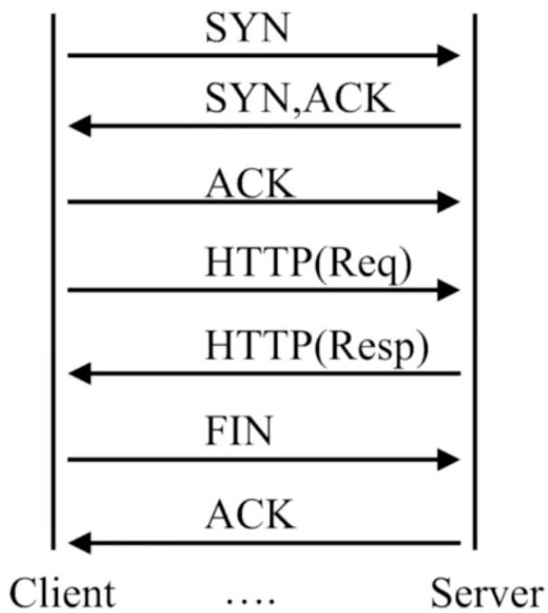
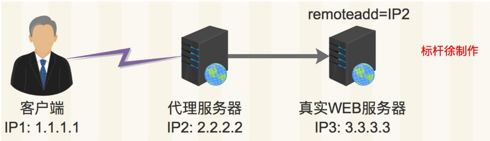
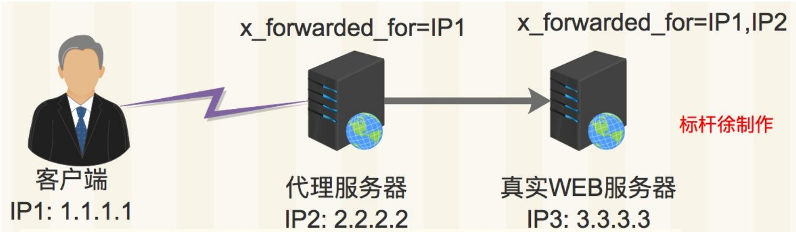

# 02.Nginx基本配置

# 02.Nginx基本配置

Nginx配置⽂件

Nginx⽇志配置

Nginx状态监控

Nginx下载站点

Nginx访问限制

Nginx访问控制

Nginx虚拟主机

徐亮伟, 江湖⼈称标杆徐。多年互联⽹运维⼯作经验，曾负责过⼤规模集群架构⾃动化运维管理⼯作。擅⻓Web集群架构与⾃动化运维，曾负责国内某⼤型电商运维⼯作。

个⼈博客"徐亮伟架构师之路"累计受益数万⼈。

笔者Q:552408925、572891887

架构师群:471443208

# Nginx配置⽂件

Nginx主配置⽂件 /etc/nginx/nginx.conf 是⼀个纯⽂本类型的⽂件，整个配置⽂件是以区块的形式组织的。⼀般，每个区块以⼀对⼤括号 {} 来表示开始与结束。

1.Main位于nginx.conf配置⽂件的最⾼层

2.Main层下可以有Event、HTTP层

3.HTTP层下⾯有允许有多个Server层, ⽤于对不同的⽹站做不同的配置

4.Server层也允许有多个Location, ⽤于对不同的路径进⾏不同模块的配置

```txt
//nginx默认配置语法
user //设置nginx服务的系统使用用户
worker_processes //工作进程，配置和CPU个数保持一致
error_log //错误日志，后面接入的是路径
pid //Nginx服务启动时的pid
```

```txt
//events事件模块
events {    //事件模块
    worker_connections    //每个worker进程支持的最大连接数
    use    //内核模型,select,poll,epoll
}
```

// http{} ,	server{} 

```txt
http {
    // 必须使用虚拟机配置站点，每个虚拟机使用一个server{}段
    'server' {
    listen 80; // 监听端口，默认80
    server_name localhost; // 提供服务的域名或主机名
```

```javascript
'location' / {
    root /usr/share/nginx/html; // 存放网站路径
    index index.html index.htm; // 默认访问首页文件
}
```

// ,	 ,	 Locaiton 

```txt
error_page 500 502 503 504 /50x.html;
'location' = /50x.html {
    root html;
}
...
//第二个虚拟主机配置
'server' {
...
}
```

# Nginx⽇志配置

在学习⽇志之前, 我们需要先了解下HTTP请求和返回

```batch
curl -v http://www.baidu.com 
```


# request-包括请求行、请求头部、请求数据response-包括状态行、消息报头、响应正文


Nginx⽇志配置规范


```scss
//配置语法：包括：error.log access.log
Syntax: log_format name [escape=default|json] string ...;
Default:    log_format combined "...";
Context:    http

//Nginx默认配置
log_format main '$remote_addr - $remote_user [$time_local] "$request" ''
' status $body_bytes_sent "$http_referer" '
'"$http_user_agent" "$http_x_forwarded_for"';

//Nginx日志变量
$remote_addr    //表示客户端地址
$remote_user    //http客户端请求nginx认证用户名
$time_local    //Nginx的时间
$request    //Request请求行，GET等方法、http协议版本
iktatus    //respoence返回状态码
$body_bytes_sent    //从服务端响应给客户端body信息大小
$http_referer    //http上一级页面，防盗链、用户行为分析
$http_user_agent    //http头部信息，客户端访问设备
$http_x_forwarded_for    //http请求携带的http信息
```

# Nginx状态监控

--with-http_stub_status_module 记录 Nginx 客户端基本访问状态信息

```txt
Syntax: stub_status; 
```

```yaml
Default: -
Context: server, location 
```


具体配置如下:


```txt
location /mystatus {
    stub_status on;
    access_log off;
}

//Nginx_status概述
Active connections:2 //Nginx当前活跃连接数
server accepts handled requests
16 16 19
server表示Nginx处理接收握手总次数。
accepts表示Nginx处理接收总连接数。
请求丢失数=(握手数-连接数)可以看出,本次状态显示没有丢失请求。
handled requests，表示总共处理了19次请求。
Reading Nginx读取数据
Writing Nginx写的情况
Waiting Nginx开启keep-alive长连接情况下，既没有读也没有写，建立连接情况
```

# Nginx下载站点


Nginx默认是不允许列出整个⽬录浏览下载。


```txt
Syntax: autoindex on | off;
Default:
autoindex off;
Context: http, server, location

//autoindex常用参数
autoindex_exact_size off;
默认为on，显示出文件的确切大小，单位是bytes。
修改为off，显示出文件的大概大小，单位是kB或者MB或者GB。

autoindex_localtime on;
默认为off，显示的文件时间为GMT时间。
修改为on，显示的文件时间为文件的服务器时间。

charset utf-8,gbk;
默认中文目录乱码，添加上解决乱码。
```

# 配置⽬录浏览功能

```txt
//开启目录浏览
location / {
    root html;
    autoindex on;
    autoindex_localtime on;
    autoindex_exact_size off;
}
```

# Nginx访问限制

连接频率限制 limit_conn_module

请求频率限制 limit_req_module

# http协议的连接与请求

HTTP是建⽴在TCP, 在完成HTTP请求需要先建⽴TCP三次握⼿（称为TCP连接）,在连接的基础上在HTTP请求。




HTTP 协议的连接与请求

<table><tr><td>HTTP协议版本</td><td>连接关系</td></tr><tr><td>HTTP1.0</td><td>TCP不能复用</td></tr><tr><td>HTTP1.1</td><td>顺序性TCP复用</td></tr><tr><td></td><td></td></tr></table>

HTTP 请求建⽴在⼀次 TCP 连接基础上⼀次 TCP 请求⾄少产⽣⼀次 HTTP 请求


Nginx连接限制配置


```txt
//Nginx连接限制语法
Syntax: limit_conn_zone key zone=name:size;
Default: -
Context: http

Syntax: limit_conn zone number;
Default: -
Context: http, server, location

//具体配置如下:
http {
//http段配置连接限制，同一时刻只允许一个客户端IP连接
limit_conn_zone $binary_remote_addr zone=conn_zone:10m;
...
server {
...
location / {
//同一时刻只允许一个客户端IP连接
limit_conn conn_zone 1;
}

//压力测试
yum install -y httpd-tools
ab -n 50 -c 20 http://127.0.0.1/index.html
```


Nginx 请求限制配置


```ini
//Nginx请求限制语法
Syntax: limit_req_zone key zone=name:size rate=rate;
Default: -
Context: http
Syntax: limit_conn zone number [burst=number] [nodelay];
Default: -
Context: http, server, location
```

```txt
//具体配置如下:
http {
//http段配置请求限制, rate限制速率, 限制一秒钟最多一个IP请求
limit_req_zone $binary_remote_addr zone=req_zone:10m rate=1r/s;
...
server {
...
location / {
    //1r/s只接收一个请求, 其余请求拒绝处理并返回错误码给客户端
    limit_req zone=req_zone;
    //请求超过1r/s, 剩下的将被延迟处理, 请求数超过burst定义的数量, 多余的请求返回503
    #limit_req zone=req_zone burst=3 nodelay;
}
```

// 

```batch
yum install -y httpd-tools
ab -n 50 -c 20 http://127.0.0.1/index.html 
```

# 连接限制没有请求限制有效?

我们前⾯说过, 多个请求可以建⽴在⼀次的TCP连接之上, 那么我们对请求的精度限制，当然⽐对⼀个连接的限制会更加的有效。

因为同⼀时刻只允许⼀个连接请求进⼊。

但是同⼀时刻多个请求可以通过⼀个连接进⼊。

所以请求限制才是⽐较优的解决⽅案。

# Nginx访问控制

基于IP的访问控制 http_access_module

基于⽤户登陆认证 http_auth_basic_module

# 基于IP的访问控制

```txt
Syntax: allow address | CIDR | unix: | all;
Default: -
Context: http, server, location, limit_except 
```

```typescript
Syntax: deny address | CIDR | unix: | all; 
```

```txt
Default: -
Context: http, server, location, limit_except 
```


// IP,


```txt
location ~ ^/1.html {
    root /usr/share/nginx/html;
    index index.html;
    deny 192.168.56.1;
    allow all;
} 
```

```txt
location / {
    root html;
    index index.php index.html index.htm;
    allow 192.168.56.0/24;
    deny all;
} 
```


http_access_module局限性





1.客户端使用代理服务器访问真实WEB服务器

2.WEB服务器使用remote_addr能捕捉到代理服务器IP

3.WEB服务器无法捕捉真实的客户端IP

下图是使⽤ http_x_forwarded_for 记录真实客户端IP地址以及代理服务器IP




1.客户端使用代理服务器访问真实WEB服务器

2.代理服务器开启x_forwarede_for记录客户端真实IP

3.WEB服务器开启x_forwarede_for记录客户端真实IP以及代理服务器IP

http_x_forwarded_for = ClientIP,Proxy(1)IP,Proxy(2)IP 

# 解决⽅式

1.采⽤HTTP头信息控制访问, 代理以及web服务开启 http_x_forwarded_for

2.结合geo模块作

3.通过HTTP⾃动以变量传递

# 基于⽤户登陆认证


//


```txt
Syntax: auth_basic string| off;
Default:    auth_basic off;
Context:    http, server, location, limit_except
//用户密码记录配置文件
Syntax: auth_basic_user_file file;
Default:    -
Context:    http, server, location, limit_except
```

```txt
[root@xuliangwei ~]# yum install httpd-tools
[root@xuliangwei ~]# htpasswd -c /etc/nginx/auth_conf xuliangwei 
```


// http,server,location


```txt
auth_basic "Auth access Blog Input your Passwd!";
auth_basic_user_file /etc/nginx/auth_conf; 
```

# ⽤户认证局限性

1.⽤户信息依赖⽂件⽅式

2.⽤户管理⽂件过多, ⽆法联动

3.操作管理机械，效率低下

# 解决办法

1. Nginx 结合 LUA 实现⾼效验证

2. Nginx 结合 LDAP 利⽤ nginx-auth-ldap 模块

# Nginx虚拟主机

所谓虚拟主机，在web服务器⾥是⼀个独⽴的⽹站站点，这个站点对应独⽴的域名(也可能是IP或端⼝)，具有独⽴的程序及资源⽬录，可以独⽴地对外提供服务供⽤户访问。

# 配置基于域名虚拟主机

1.创建web站点⽬录

```txt
[root@LNMP conf]# mkdir /soft/code/{www,bbs}
[root@LNMP conf]# echo "www" > /soft/code/www/index.html
[root@LNMP conf]# echo "bbs" > /soft/code/bbs/index.html 
```

2.配置虚拟主机

```txt
[root@LNMP conf]# cat conf.d/{www,bbs}.conf
server {
    listen 80;
    server_name www.xuliangwei.com;
    root /soft/code/www;
    ...
}
server {
    ...
    listen 80;
    server_name bbs.xuliangwei.com;
    root /soft/code/bbs;
} 
```

# 配置不同端⼝访问不同虚拟主机

// listen , 

```txt
server {
...
listen 8001; 
```

```txt
...
}
server {
...
listen 8002;
...
} 
```

# 配置虚拟主机别名

所谓虚拟主机别名，就是虚拟主机设置除了主域名以外的⼀个域名，实现⽤户访问的多个域名对应同⼀个虚拟主机⽹站的功能。

以www.xuliangwei.com域名的虚拟主机为例:

为其增加⼀个别名xuliangwei.com时,出现⽹站内容和访问www.xuliangwei.com是⼀样的,具体配置如下：


//


```jinja
[root@LNMP ~]# vim /etc/nginx/nginx.conf
server {
    listen 80;
    server_name www.xuliangwei.com;
} 
```


//


```txt
[root@LNMP ~]# vim /etc/nginx/nginx.conf
server {
    listen 80;
    server_name www.xuliangwei.com xuliangwei.com;
} 
```


// Linux curl


```txt
[root@LNMP conf]# curl xuliangwei.com
www.xuliangwei.com
[root@LNMP conf]# curl www.xuliangwei.com
www.xuliangwei.com 
```

// www www ,	 rewrite 