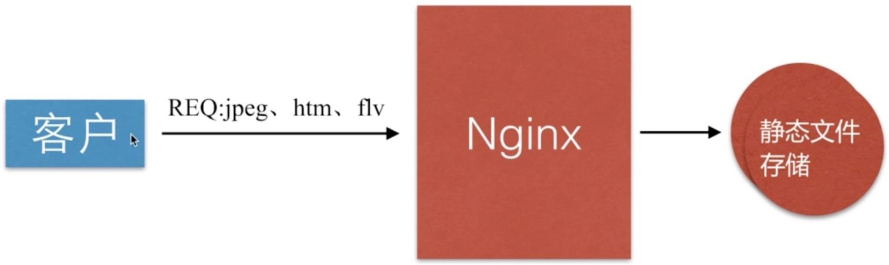
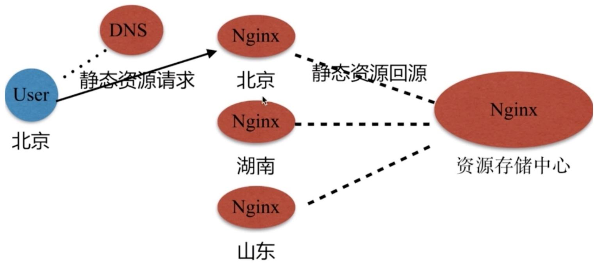
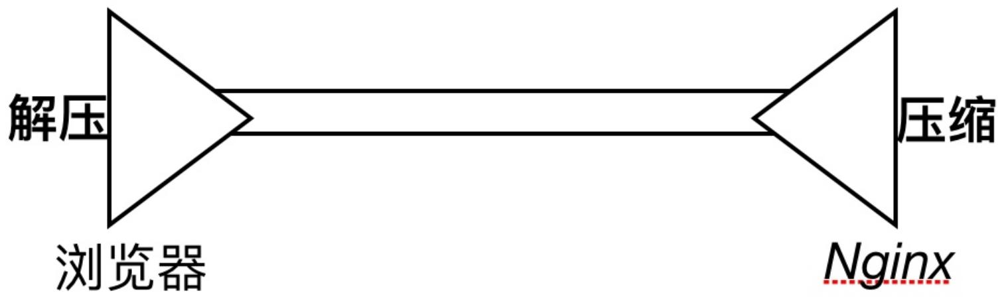
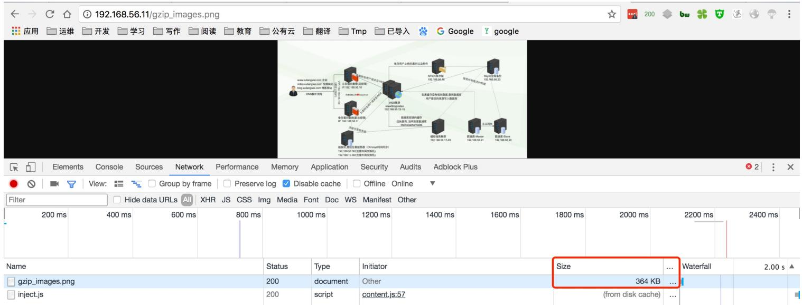
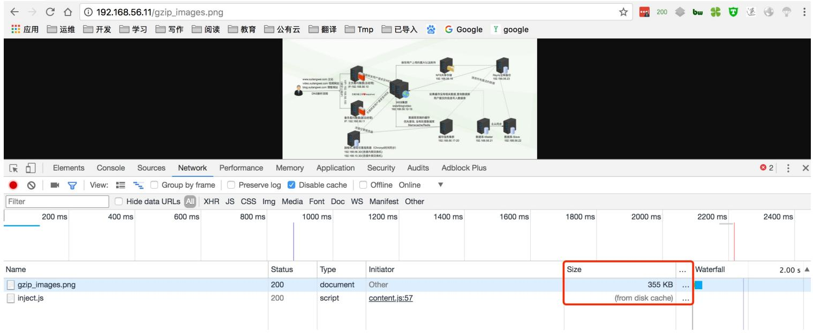
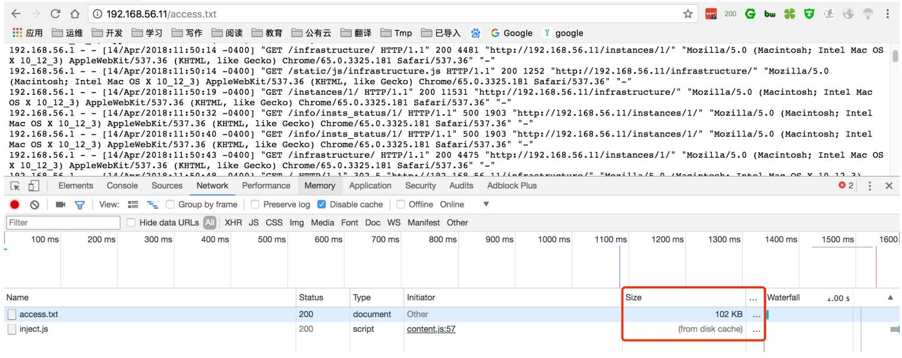
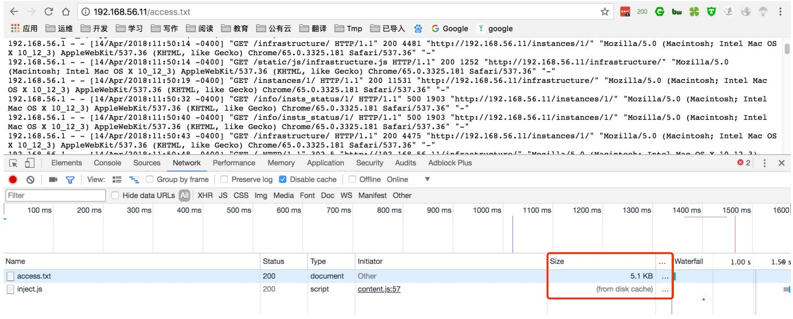
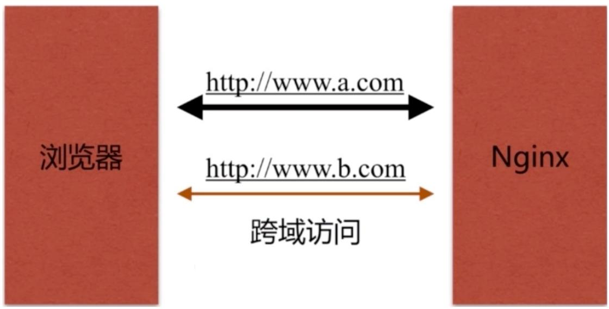
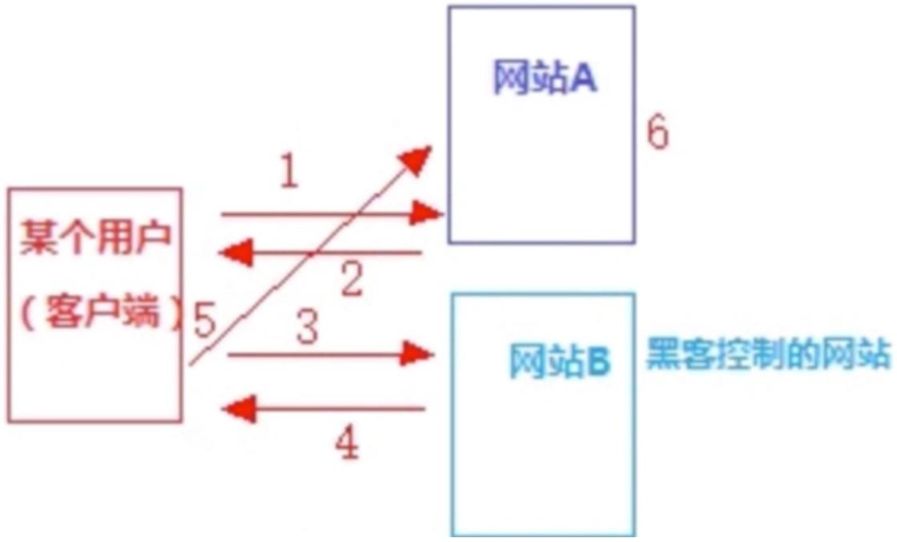
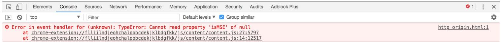

# 03.Nginx静态服务

# 03.Nginx静态服务

1.静态资源类型

2.静态资源场景

3.静态资源配置语法

4.静态资源⽂件压缩

5.静态资源浏览器缓存

6.静态资源跨域访问

7.静态资源防盗链

徐亮伟, 江湖⼈称标杆徐。多年互联⽹运维⼯作经验，曾负责过⼤规模集群架构⾃动化运维管理⼯作。擅⻓Web集群架构与⾃动化运维，曾负责国内某⼤型电商运维⼯作。

个⼈博客"徐亮伟架构师之路"累计受益数万⼈。

笔者Q:552408925、572891887

架构师群:471443208

# 1.静态资源类型

Nginx 作为静态资源 Web 服务器部署配置, 传输⾮常的⾼效, 常常⽤于静态资源处理, 请求, 动静分离




⾮服务器动态运⾏⽣成的⽂件属于静态资源

<table><tr><td>类型</td><td>种类</td></tr><tr><td>浏览器端渲染</td><td>HTML、CSS、JS</td></tr><tr><td>图片</td><td>JPEG、GIF、PNG</td></tr><tr><td>视频</td><td>FLV、Mp4</td></tr><tr><td>文件</td><td>TXT、任意下载文件</td></tr></table>

# 2.静态资源场景

静态资源传输延迟最⼩化




# 3.静态资源配置语法

1.⽂件读取⾼效 sendfile

```txt
Syntax: sendfile on | off;
Default: sendfile off;
Context: http, server, location, if in location 
```

2.提⾼⽹络传输效率 nopush

```txt
Syntax: tcp_nopush on | off;
Default: tcp_nopush off;
Context: http, server, location 
```

作⽤:	sendfile开启情况下,	提⾼⽹络包的'传输效率'

2.与 tcp_nopush 之对应的配置 tcp_nodelay

```txt
Syntax: tcp_nodelay on | off;
Default: tcp_nodelay on;
Context: http, server, location 
```

作⽤:	在keepalive连接下,提⾼⽹络的传输'实时性'

# 4.静态资源⽂件压缩

Nginx 将响应报⽂发送⾄客户端之前可以启⽤压缩功能，这能够有效地节约带宽，并提⾼响应⾄客户端的速度。




1. gzip 压缩配置语法

```txt
Syntax: gzip on | off;
Default: gzip off;
Context: http, server, location, if in location 
```

作⽤:	传输压缩

2. gzip 压缩⽐率配置语法

```txt
Syntax: gzip_comp_level level;
Default: gzip_comp_level 1;
Context: http, server, location 
```

作⽤:	压缩本身⽐较耗费服务端性能

3. gzip 压缩协议版本

```txt
Syntax: gzip_http_version 1.0 | 1.1;
Default: gzip_http_version 1.1; 
```

```txt
Context: http, server, location 
```

作⽤:	压缩使⽤在http哪个协议,	主流版本1.1


4.扩展压缩模块


```txt
Syntax: gzip_static on | off | always;
Default: gzip_static off;
Context: http, server, location 
```

作⽤:	预读gzip功能


5.图⽚压缩案例


[root@Nginx conf.d]# mkdir -p /soft/code/images
[root@Nginx conf.d]# cat static_server.conf
server {
    listen 80;
    server_name 192.168.56.11;
    sendfile on;
    access_log /var/log/nginx/static_access.log main;

    location ~.* $jpg|gif|png$ $ {
    gzip on;
    gzip_http_version 1.1;
    gzip_comp_level 2;
    gzip_types text/plain application/json application/x-javascript application/css application/xml application/xml+rss text/javascript application/x-http d-php image/jpeg image/gif image/png;
    root /soft/code/images;
    }

} 

没有开启 gzip 图⽚压缩




启⽤ gzip 压缩图⽚后(由于图⽚之前压缩过, 所以压缩⽐率不太明显)





# 6.⽂件压缩案例

[root@Nginx conf.d]# mkdir -p /soft/code/doc
[root@Nginx conf.d]# cat static_server.conf
server {
    listen 80;
    server_name 192.168.56.11;
    sendfile on;
    access_log /var/log/nginx/static_access.log main;
    location ~.* $.txt|xml$ $ {
    gzip on;
    gzip_http_version 1.1;
    gzip_comp_level 1;
    gzip_types text/plain application/json application/x-javascript application/css application/xml application/xml+rss text/javascript application/x-httpd-php image/jpeg image/gif image/png;
    root /soft/code/doc;
    } 

# 没有启⽤ gzip ⽂件压缩




# 启⽤ gzip 压缩⽂件




# 5.静态资源浏览器缓存

HTTP协议定义的缓存机制(如: Expires; Cache-control 等)

# 1.浏览器⽆缓存

浏览器请求->⽆缓存->请求WEB服务器->请求响应->呈现

# 2.浏览器有缓存

浏览器请求->有缓存->校验过期->是否有更新->呈现

校验是否过期 Expires HTTP1.0, Cache-Control(max-age) HTTP1.1

协议中Etag头信息校验 Etag ()

Last-Modified头信息校验 Last-Modified (具体时间)


1.缓存配置语法 expires


```txt
Syntax: expires [modified] time;
expires epoch | max | off;
Default: expires off;
Context: http, server, location, if in location
作用：添加Cache-Control Expires头
```


2.配置静态资源缓存


```scss
location ~ .*\.(js|css|html)$ {
    root /soft/code/js;
    expires 1h;
}
location ~ .*\.(jpg|gif|png)$ {
    root /soft/code/images;
    expires 7d;
} 
```


3.开发代码没有正式上线时, 希望静态⽂件不被缓存


```txt
//取消js css html等静态文件缓存
location ~ .*\. (css|js|swf|json|mp4|htm|html)$ {
add_header Cache-Control no-store;
add_header Pragma no-cache;
}
```

阿⾥云缓存策略帮助⼿册

Nginx静态资源缓存

# 6.静态资源跨域访问




浏览器禁⽌跨域访问, 主要不安全, 容易出现 CSRF 攻击




Nginx 跨域访问配置

```txt
Syntax: add_header name value [always];
Default: -
Context: http, server, location, if in location
Access-Control-Allow-Origin 
```

1.准备 html ⽂件

```html
//在www.xuliangwei.com网站添加跨越访问文件
[root@Nginx ~]# cat /soft/code/http_origin.html
<html lang="en">
<head>
<meta charset="UTF-8" />
```

```html
<title>测试ajax和跨域访问</title>
<script src="http://libs.baidu.com/jquery/2.1.4/jquery.min.js"></script>
</head>
<script type="text/javascript">
$(document).ready(function(){
    $.ajax({
    type: "GET",
    url: "http://kt.xuliangwei.com/index.html",
    success: function(data) {
    alert("success!!!");
    },
    error: function() {
    alert("fail!!,请刷新再试!");
    }
    });
});
</script>
<body>
<h1>测试跨域访问</h1>
</body>
</html>
```

# 2.配置 Nginx 跨域访问


// www.xuliangwei.com


```htaccess
[root@Nginx conf.d]# cat origin.conf
server {
    listen 80;
    server_name kt.xuliangwei.com;
    sendfile on;
    access_log /var/log/nginx/kuayue.log main;
    location ~ .*\.(html|htm) $ {
    add_header Access-Control-Allow-Origin http://www.xuliangwei.com;
    add_header Access-Control-Allow-Methods GET,POST,PUT,DELETE,OPTIONS;
    root /soft/code;
    }
} 
```

没启动 header 头部访问


<table><tr><td>Elements</td><td>Console</td><td>Sources</td><td>Network</td><td>Performance</td><td>Memory</td><td>Application</td><td>Security</td><td>Audits</td><td>Adblock Plus</td></tr><tr><td colspan="2">top</td><td colspan="4">Filter</td><td colspan="4">Default levels ▼ Group similar</td></tr><tr><td colspan="10">Error in event handler for (unknown): TypeError: Cannot read property &#x27;isMSE&#x27; of null
      at chrome-extension://flliilndjehchalpbbcdekjklbdgfkk/js/content/content.js:27:5797
      at chrome-extension://flliilndjehchalpbbcdekjklbdgfkk/js/content/content.js:14:12517</td></tr><tr><td colspan="9">Uncaught (in promise) TypeError: Cannot read property &#x27;isAviraPage&#x27; of null
      at content.js:27</td><td>content.js:27</td></tr><tr><td colspan="10">Failed to load http://kt.xuliangwei.com/index.html: No &#x27;Access-Control-Allow-Origin&#x27; header is present on the requested resource. Origin &#x27;http://www.xu http_origin.html:1 liangwei.com&#x27; is therefore not allowed access.</td></tr></table>


# 启动 header 头部访问





# 7.静态资源防盗链

盗链指的是在⾃⼰的界⾯展示不在⾃⼰服务器上的内容，通过技术⼿段获得他⼈服务器的资源地址，绕过别⼈资源展示⻚⾯，在⾃⼰⻚⾯向⽤户提供此内容，从⽽减轻⾃⼰服务器的负担，因为真实的空间和流量来⾃别⼈服务器

防盗链设置思路: 区别哪些请求是⾮正常⽤户请求

基于 http_refer 防盗链配置模块

```txt
Syntax: valid_referers none | blocked | server_names | string ...;
Default: -
Context: server, location 
```

# 1.准备html⽂件

```txt
<html>
<head>
<meta charset="utf-8">
<title>pachong<title> 
```

```html
</head>
<body style="background-color:red;">

</body>
</html> 
```


2.启动防盗链


//支持IP、域名、正则方式
location ~.* $$ .jpg|gif|png)$ {
valid_referers none blocked www.xuliangwei.com;
if ($invalid_referer) {
    return 403;
}
root /soft/code/images;
}


3.验证


```yaml
[root@C-Server ~]# curl -e "http://www.baidu.com" -I http://192.168.69.113/test.jpg
HTTP/1.1 403 Forbidden
Server: nginx/1.12.2
Date: Tue, 17 Apr 2018 04:55:18 GMT
Content-Type: text/html
Content-Length: 169
Connection: keep-alive 
```

```ini
[root@C-Server ~]# curl -e "http://www.xuliangwei.com" -I http://192.168.69.113/test.jpg
HTTP/1.1 200 OK
Server: nginx/1.12.2
Date: Tue, 17 Apr 2018 04:55:27 GMT
Content-Type: image/jpeg
Content-Length: 174315
Last-Modified: Wed, 29 Nov 2017 03:16:08 GMT
Connection: keep-alive
ETag: "5a1e2678-2a8eb"
Expires: Tue, 17 Apr 2018 16:55:27 GMT
Cache-Control: max-age=43200
Accept-Ranges: bytes 
```